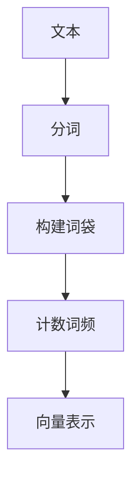
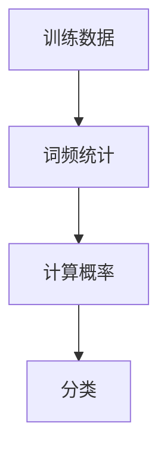
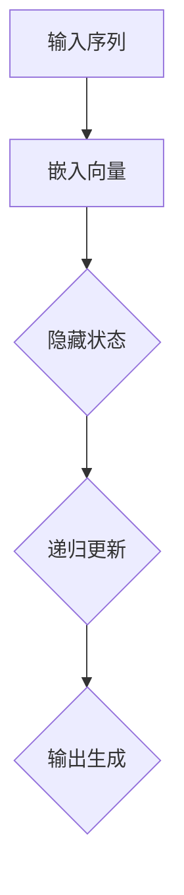
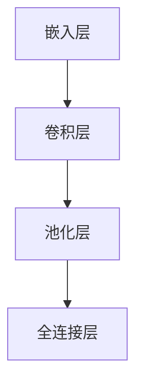
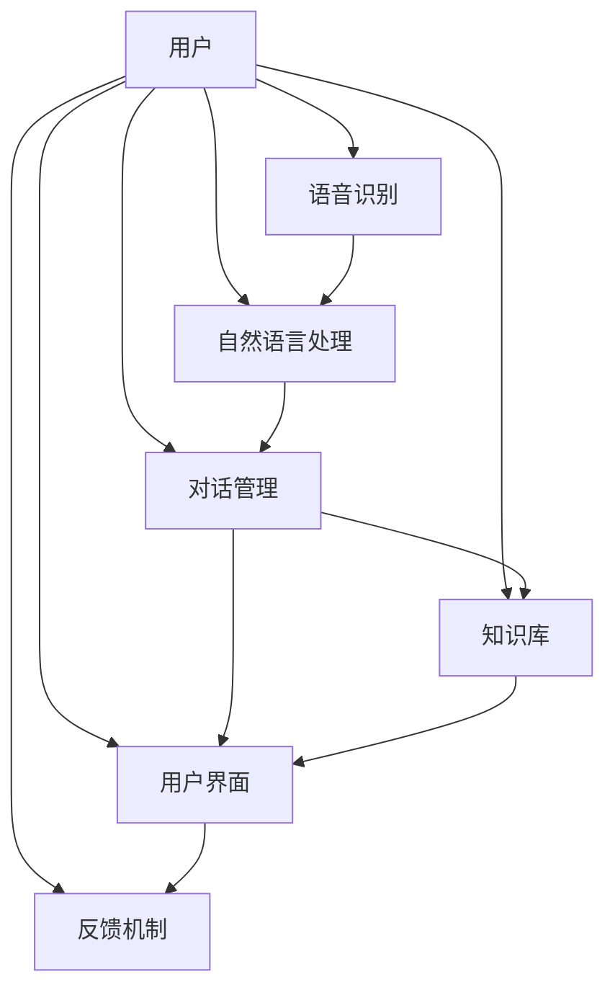
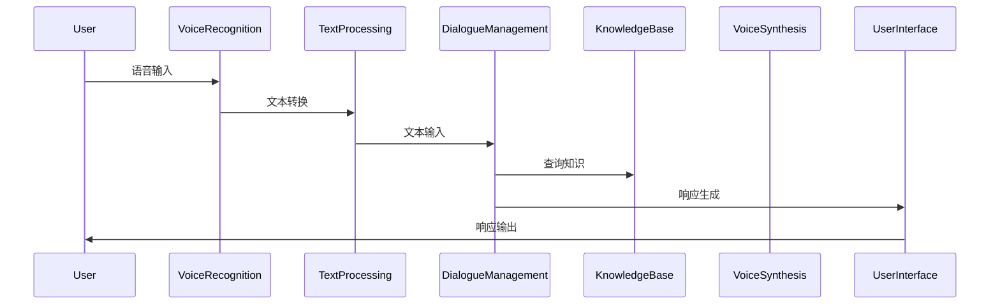

                 


# 虚拟助手的对话系统：人工智能的数学交互

> 关键词：虚拟助手、对话系统、人工智能、数学交互、自然语言处理、机器学习、深度学习、序列模型、注意力机制

> 摘要：本文深入探讨虚拟助手对话系统的数学交互机制，从基础概念到算法实现，再到系统架构与项目实战，全面解析人工智能在自然语言处理和对话系统中的应用。通过具体的数学模型和公式讲解，读者将掌握对话系统背后的核心技术，为未来智能交互领域的研究和应用提供坚实的理论基础。

### 目录大纲设计思路

为了更好地组织内容，本文采用以下目录大纲设计思路：

1. **背景介绍**：介绍虚拟助手和对话系统的概念、发展背景以及它们在人工智能领域的重要地位。
2. **核心概念与联系**：明确书中将要涉及的核心概念，如自然语言处理、机器学习、深度学习等，并通过对比表格和ER实体关系图来展示概念之间的关系。
3. **算法原理讲解**：针对关键算法，如序列到序列模型、注意力机制等，使用mermaid流程图和Python源代码来展示算法流程，并配合数学模型和公式进行详细解释。
4. **数学模型和数学公式讲解**：使用LaTeX格式来表示数学公式，确保公式的准确性和可读性。
5. **系统分析与架构设计方案**：介绍虚拟助手对话系统的设计理念，包括功能设计、系统架构、接口设计以及交互流程。
6. **项目实战**：通过具体的实战案例，展示如何安装环境、实现系统核心功能，并对代码和应用进行解读与分析。
7. **最佳实践 tips、小结、注意事项、拓展阅读**：总结书中内容，提供实战技巧、注意事项，并推荐拓展阅读资源。

### 目录大纲设计步骤

**第1章：引言**

- **1.1 背景介绍**：虚拟助手和对话系统概述，人工智能在交互领域的应用。
- **1.2 核心概念**：定义并介绍虚拟助手、对话系统、自然语言处理等关键概念。
- **1.3 本书结构**：概述本书的主要内容和章节结构。

**第2章：虚拟助手基础**

- **2.1 虚拟助手的组成部分**：介绍语音识别、自然语言处理、对话管理等模块。
- **2.2 虚拟助手的架构设计**：使用mermaid类图展示虚拟助手的架构。
- **2.3 虚拟助手的开发流程**：介绍从需求分析到部署的完整开发流程。

**第3章：对话系统的数学基础**

- **3.1 数学模型介绍**：介绍数学模型在对话系统中的应用。
- **3.2 数学公式讲解**：使用LaTeX格式展示关键数学公式。
- **3.3 数学概念与算法联系**：通过对比表格和ER图展示数学概念与算法的关系。

**第4章：自然语言处理技术**

- **4.1 NLP基础**：介绍文本预处理、词向量表示等基本技术。
- **4.2 NLP算法原理**：使用mermaid流程图展示关键NLP算法。
- **4.3 NLP在对话系统中的应用**：介绍NLP如何提高对话系统的交互质量。

**第5章：机器学习与深度学习**

- **5.1 机器学习基础**：介绍监督学习、无监督学习等基础概念。
- **5.2 深度学习原理**：介绍神经网络、深度学习框架等关键内容。
- **5.3 深度学习在对话系统中的应用**：展示深度学习如何优化对话系统性能。

**第6章：注意力机制与序列模型**

- **6.1 注意力机制原理**：使用mermaid流程图和LaTeX公式解释注意力机制。
- **6.2 序列模型介绍**：介绍RNN、LSTM等序列模型。
- **6.3 注意力机制与序列模型的结合**：展示如何将注意力机制应用于序列模型。

**第7章：系统分析与架构设计**

- **7.1 对话系统功能设计**：使用mermaid类图展示功能设计。
- **7.2 对话系统架构设计**：使用mermaid架构图展示系统架构。
- **7.3 系统接口设计与交互流程**：介绍接口设计和交互流程。

**第8章：项目实战**

- **8.1 环境安装与配置**：介绍如何搭建虚拟助手对话系统的开发环境。
- **8.2 系统核心功能实现**：展示系统核心功能的实现过程。
- **8.3 应用解读与分析**：对实际应用案例进行分析和解读。
- **8.4 项目小结**：总结项目经验，提出改进建议。

**第9章：最佳实践与拓展**

- **9.1 最佳实践 tips**：提供实际操作中的技巧和经验。
- **9.2 注意事项**：提醒读者在开发过程中需要注意的问题。
- **9.3 拓展阅读**：推荐相关的书籍和资源，供读者进一步学习。

通过以上步骤，我们可以设计出一套结构清晰、内容完整的目录大纲，为《虚拟助手的对话系统：人工智能的数学交互》这本书奠定良好的基础。接下来，我们将逐步填充每个章节的具体内容。

### 第1章：引言

#### 1.1 背景介绍

虚拟助手（Virtual Assistant）和对话系统（Dialogue System）是人工智能（AI）领域的重要研究方向和应用领域。随着人工智能技术的不断发展和普及，虚拟助手和对话系统已经成为人们日常生活和工作中不可或缺的智能助手。

**虚拟助手的发展历程**

虚拟助手的起源可以追溯到20世纪80年代，当时主要依靠规则和模式匹配技术实现简单的交互功能。进入21世纪，随着自然语言处理（NLP）、机器学习（ML）和深度学习（DL）等技术的快速发展，虚拟助手逐渐具备更复杂的对话能力和更广泛的应用场景。

**对话系统的发展背景**

对话系统最早应用于电话自动应答系统，如电信客服机器人。随着互联网的普及，对话系统开始广泛应用于社交媒体、聊天应用程序、智能音箱等。近年来，随着人工智能技术的进步，对话系统在用户体验、互动性、智能性等方面得到了显著提升。

**人工智能在交互领域的应用**

人工智能在交互领域的应用主要集中在自然语言处理和机器学习方面。自然语言处理技术使得计算机能够理解和生成人类语言，从而实现人机对话。机器学习技术则通过大数据训练，使对话系统能够不断学习和优化，提供更加准确和自然的交互体验。

#### 1.2 核心概念

在本章节中，我们将介绍几个核心概念，包括虚拟助手、对话系统、自然语言处理等。

**虚拟助手**

虚拟助手是一种智能系统，旨在模拟人类助手的行为和交互方式，为用户提供各种服务和信息。虚拟助手通常具备以下特点：

- **语音识别**：能够将用户的语音输入转换为文本。
- **自然语言处理**：能够理解用户的语言意图和问题。
- **对话管理**：能够根据用户的问题和上下文进行恰当的回应。
- **知识库**：存储用户所需的信息和知识。

**对话系统**

对话系统是一种使计算机能够与人类进行有效对话的技术。它通常由多个模块组成，包括语音识别、自然语言理解、对话生成和对话管理。对话系统的目标是通过对话的方式提供高效、自然的交互体验。

**自然语言处理**

自然语言处理（NLP）是人工智能的一个分支，旨在使计算机能够理解、处理和生成自然语言。NLP技术在对话系统中起着至关重要的作用，包括文本预处理、词向量表示、语义分析、情感分析等。

#### 1.3 本书结构

本书将从以下几个方面展开：

- **虚拟助手和对话系统的基本概念和原理**：介绍虚拟助手和对话系统的基本概念、组成部分和核心原理。
- **自然语言处理技术**：详细讲解自然语言处理的基本技术和算法，包括文本预处理、词向量表示、语义分析和情感分析。
- **机器学习与深度学习**：介绍机器学习和深度学习的基本概念、算法和应用，探讨它们在对话系统中的应用。
- **注意力机制与序列模型**：深入探讨注意力机制和序列模型在对话系统中的原理和应用，包括RNN、LSTM和Transformer等。
- **系统分析与架构设计**：介绍对话系统的系统分析和架构设计方法，包括功能设计、系统架构、接口设计和交互流程。
- **项目实战**：通过具体的实战案例，展示如何搭建虚拟助手对话系统，实现核心功能，并进行代码解读和分析。
- **最佳实践与拓展**：总结最佳实践技巧、注意事项，并提供拓展阅读资源，帮助读者深入了解相关技术。

通过本书的阅读，读者将系统地掌握虚拟助手对话系统的数学交互机制，为未来智能交互领域的研究和应用提供坚实的理论基础。

### 第2章：虚拟助手基础

#### 2.1 虚拟助手的组成部分

虚拟助手是一个复杂的系统，由多个模块协同工作，以提供高效、自然的交互体验。以下是虚拟助手的主要组成部分：

**语音识别模块**

语音识别模块是虚拟助手的入口，负责将用户的语音输入转换为文本。这一模块通常基于深度学习技术，如卷积神经网络（CNN）和循环神经网络（RNN）。

**自然语言处理模块**

自然语言处理（NLP）模块负责理解和处理用户的语言输入。它包括文本预处理、词向量表示、词法分析、句法分析、语义分析和情感分析等。NLP模块的核心是深度学习算法，如长短期记忆网络（LSTM）和Transformer。

**对话管理模块**

对话管理模块负责控制对话的流程和上下文。它通过策略网络和记忆网络，根据用户的输入和历史对话信息，生成合适的回复。对话管理模块通常采用基于规则的方法、机器学习方法以及深度学习方法。

**知识库模块**

知识库模块存储了虚拟助手所需的各种信息，如产品知识、服务流程、常见问题等。知识库可以是一个结构化的数据库，也可以是一个语义网络。

**用户界面模块**

用户界面模块负责与用户进行交互，可以是语音界面、文本界面或者图形界面。用户界面模块需要与语音识别和自然语言处理模块紧密集成，以确保交互的自然性和流畅性。

**反馈机制模块**

反馈机制模块用于收集用户的反馈，以改进虚拟助手的性能。通过用户反馈，虚拟助手可以不断优化对话策略、提高问题解答的准确性。

#### 2.2 虚拟助手的架构设计

虚拟助手的架构设计是确保系统高效、可扩展和可维护的关键。以下是虚拟助手的典型架构设计：

**客户端架构**

客户端架构包括语音识别模块、自然语言处理模块和用户界面模块。用户通过语音或文本与虚拟助手交互，语音识别模块将语音转换为文本，自然语言处理模块理解用户意图，用户界面模块则呈现回复和交互选项。

**服务端架构**

服务端架构包括对话管理模块、知识库模块和反馈机制模块。对话管理模块接收客户端的请求，通过策略网络和记忆网络生成回复，并将其发送回客户端。知识库模块提供用户所需的信息，反馈机制模块收集用户的反馈。

**数据流**

数据流从用户输入开始，通过语音识别模块转换为文本，然后进入自然语言处理模块进行意图识别和实体提取。对话管理模块根据上下文和历史对话信息生成回复，并存储反馈以供后续优化。

**架构图**

```mermaid
classDiagram
    Client -> VoiceRecognition : 语音输入
    VoiceRecognition -> NLP : 文本转换
    NLP -> DialogueManagement : 意图识别
    DialogueManagement -> KnowledgeBase : 知识查询
    DialogueManagement -> UserInterface : 响应生成
    UserInterface -> Client : 响应输出
    DialogueManagement -> FeedbackMechanism : 反馈收集
endclass
```

#### 2.3 虚拟助手的开发流程

虚拟助手的开发流程可以分为以下几个阶段：

**需求分析**

在开发虚拟助手之前，首先要明确用户需求，包括目标用户、使用场景、功能需求等。需求分析的结果将指导后续的开发工作。

**技术选型**

根据需求分析的结果，选择合适的技术栈，包括语音识别、自然语言处理、对话管理等相关技术。

**原型设计**

原型设计阶段，开发团队将创建一个简单的交互原型，以验证用户需求和技术可行性。原型设计通常包括界面设计、对话流程设计等。

**开发实现**

在原型设计得到验证后，进入开发实现阶段。开发团队将根据设计文档和原型，编写代码并实现虚拟助手的核心功能。

**测试与优化**

在开发完成后，对虚拟助手进行全面的测试，包括功能测试、性能测试和用户体验测试。根据测试结果，对系统进行优化和改进。

**部署与运维**

将虚拟助手部署到生产环境，并提供持续的运维支持，确保系统的稳定性和可用性。

**持续迭代**

根据用户反馈和市场变化，对虚拟助手进行持续迭代和优化，以提供更好的用户体验。

通过以上开发流程，可以确保虚拟助手的高效开发、稳定运行和持续优化。

### 第3章：对话系统的数学基础

#### 3.1 数学模型介绍

对话系统中的数学模型是构建智能交互的核心。这些模型帮助计算机理解和生成人类语言，从而实现高效、自然的对话。以下是几种常见的数学模型：

**概率模型**：概率模型用于估计事件发生的概率。在对话系统中，概率模型可以用于预测用户的意图、生成回复的概率分布等。

**生成模型**：生成模型用于生成文本。在对话系统中，生成模型可以生成可能的回复，为对话管理提供候选答案。

**判别模型**：判别模型用于分类。在对话系统中，判别模型可以用于分类用户的意图、识别关键词等。

**序列模型**：序列模型用于处理序列数据。在对话系统中，序列模型可以用于理解用户的语言输入、生成回复等。

**注意力机制**：注意力机制是一种在序列模型中用于处理长距离依赖问题的方法。在对话系统中，注意力机制可以用于理解用户的语言输入中的关键信息，从而生成更加准确的回复。

**记忆网络**：记忆网络是一种在对话系统中用于存储上下文信息的方法。通过记忆网络，对话系统可以保留对话的历史信息，从而更好地理解用户的意图。

#### 3.2 数学公式讲解

在本节中，我们将使用LaTeX格式展示几个关键的数学公式，并对其进行解释。

**1. 概率模型**

$$
P(X|Y) = \frac{P(X,Y)}{P(Y)}
$$

这是条件概率公式，表示在事件Y发生的条件下，事件X发生的概率。在对话系统中，这可以用于估计用户输入和意图之间的概率关系。

**2. 生成模型**

$$
p(y|x) = \prod_{i=1}^{n} p(y_i|x)
$$

这是生成模型的概率公式，表示在给定输入x的情况下，生成文本y的概率。在对话系统中，这可以用于生成可能的回复。

**3. 判别模型**

$$
h(x) = \arg\max_{y} P(y|x)
$$

这是判别模型的决策公式，表示在给定输入x的情况下，最大化输出概率的意图或标签。

**4. 注意力机制**

$$
a_t = \sigma(W_a [h_t; s_{t-1}])
$$

这是注意力机制的公式，表示在时间t，注意力权重$a_t$的计算。$h_t$是当前隐藏状态，$s_{t-1}$是上一个时间步的隐藏状态。

**5. 记忆网络**

$$
s_t = \sigma(W_s [h_t; s_{t-1}])
$$

这是记忆网络的公式，表示在时间t，记忆状态$s_t$的计算。$h_t$是当前隐藏状态，$s_{t-1}$是上一个时间步的记忆状态。

通过这些数学模型和公式，对话系统可以更好地理解和生成人类语言，从而提供高质量的交互体验。

#### 3.3 数学概念与算法联系

为了更好地理解数学概念与算法之间的关系，我们可以通过对比表格和ER图来展示这些联系。

**1. 对比表格**

| 数学概念       | 相关算法          | 应用场景             |
|----------------|-------------------|----------------------|
| 概率模型       | 贝叶斯网络、隐马尔可夫模型 | 意图识别、回复生成   |
| 生成模型       | 生成对抗网络（GAN）    | 回复生成、文本生成   |
| 判别模型       | 决策树、支持向量机     | 意图分类、关键词识别 |
| 序列模型       | RNN、LSTM、Transformer | 语言理解、回复生成   |
| 注意力机制     | RNN、LSTM、Transformer | 长距离依赖、上下文理解 |
| 记忆网络       | LSTM、GRU          | 上下文信息存储、历史交互记录 |

**2. ER实体关系图**

```mermaid
erDiagram
    User ||--|{ Dialogue }||-- Sentence
    Dialogue ||--|{ Response }||-- Sentence
    Sentence ||--|{ Word }||-- Text
    User ||--|{ Intent }||-- Dialogue
    Response ||--|{ Entity }||-- Dialogue
```

在这个ER图中，用户（User）与对话（Dialogue）之间存在一对多关系，对话与句子（Sentence）也存在一对多关系，句子由词（Word）组成。意图（Intent）和实体（Entity）与对话也存在关联。这种实体关系图帮助理解对话系统中各个组件之间的数据流动和关系。

通过对比表格和ER图，我们可以清晰地看到数学概念与算法在对话系统中的应用，为后续章节的深入探讨奠定了基础。

### 第4章：自然语言处理技术

#### 4.1 NLP基础

自然语言处理（NLP）是人工智能领域的一个重要分支，旨在使计算机能够理解、处理和生成人类语言。NLP技术广泛应用于语音识别、机器翻译、文本分析、情感分析等多个领域。以下是NLP中的基础技术和概念：

**文本预处理**

文本预处理是NLP过程中的第一步，旨在将原始文本转换为适合后续处理的形式。文本预处理通常包括以下任务：

- **分词（Tokenization）**：将文本拆分成单词、短语或其他有意义的单元。
- **词性标注（Part-of-Speech Tagging）**：为每个单词分配一个词性，如名词、动词、形容词等。
- **词干提取（Stemming）**：将单词还原为词干，如“running”还原为“run”。
- **词形还原（Lemmatization）**：将单词还原为词库中的基础形式，如“walking”还原为“walk”。

**词向量表示**

词向量表示是将单词转换为数值向量的方法，使计算机能够理解和处理文本数据。常见的词向量表示方法包括：

- **基于计数的方法**：如TF-IDF（词频-逆文档频率），通过计算单词在文档中的频率和在整个语料库中的重要性来表示词向量。
- **基于分布的方法**：如Word2Vec、GloVe，通过训练模型来学习单词的分布式表示。
- **基于注意力机制的方法**：如BERT、Transformer，通过注意力机制来学习单词之间的关系和上下文信息。

**语义分析**

语义分析是NLP的核心任务，旨在理解文本中的语义内容。以下是一些常见的语义分析方法：

- **语义角色标注（Semantic Role Labeling）**：识别句子中的主语、谓语、宾语及其语义角色。
- **依存句法分析（Dependency Parsing）**：分析句子中词语之间的依存关系，构建依存句法树。
- **实体识别（Named Entity Recognition）**：识别文本中的命名实体，如人名、地名、组织名等。
- **情感分析（Sentiment Analysis）**：判断文本表达的情感倾向，如正面、负面或中立。

#### 4.2 NLP算法原理

在本节中，我们将介绍几种关键的NLP算法，并使用mermaid流程图来展示其基本原理。

**1. 词袋模型（Bag-of-Words, BoW）**

词袋模型是一种简单的文本表示方法，将文本表示为一个单词的集合。算法步骤如下：

- **分词**：将文本拆分为单词。
- **构建词袋**：为每个单词分配一个索引，创建一个词汇表。
- **计数词频**：统计每个单词在文本中的出现次数。
- **向量表示**：将文本转换为向量，向量的维度等于词汇表的长度。

**算法流程图**



**2. 朴素贝叶斯分类器（Naive Bayes Classifier）**

朴素贝叶斯分类器是一种基于概率的文本分类算法。算法步骤如下：

- **词频统计**：统计训练集中每个类别下的词频。
- **计算概率**：计算每个单词在各个类别中的条件概率。
- **分类**：根据贝叶斯公式，计算每个类别的概率，选择概率最大的类别作为预测结果。

**算法流程图**



**3. 递归神经网络（Recurrent Neural Network, RNN）**

递归神经网络是一种处理序列数据的神经网络，可以捕捉序列中的时间依赖关系。算法步骤如下：

- **输入序列**：将文本序列转换为嵌入向量。
- **隐藏状态更新**：通过递归关系更新隐藏状态。
- **输出生成**：使用隐藏状态生成输出。

**算法流程图**



**4. 卷积神经网络（Convolutional Neural Network, CNN）**

卷积神经网络是一种用于文本分类和特征提取的神经网络，可以处理文本的局部特征。算法步骤如下：

- **嵌入层**：将文本序列转换为嵌入向量。
- **卷积层**：通过卷积操作提取文本的局部特征。
- **池化层**：对特征进行降维处理。
- **全连接层**：将特征映射到类别。

**算法流程图**



通过这些NLP算法，我们可以对文本数据进行有效的处理和分析，从而实现文本分类、情感分析、命名实体识别等任务。

#### 4.3 NLP在对话系统中的应用

自然语言处理（NLP）在对话系统中扮演着至关重要的角色，它使得计算机能够理解和生成人类语言，从而实现高效、自然的交互。以下是NLP在对话系统中的一些主要应用：

**1. 意图识别（Intent Recognition）**

意图识别是对话系统的第一步，旨在理解用户输入的意义和目标。NLP技术通过文本预处理、词向量表示和深度学习模型（如卷积神经网络（CNN）、递归神经网络（RNN）、Transformer等）来识别用户的意图。例如，当用户说“我想要预定餐厅”，意图识别模块会将其识别为“预定餐厅”意图。

**2. 语义解析（Semantic Parsing）**

语义解析是将自然语言输入转换为机器可以理解和执行的形式。通过NLP技术，对话系统能够将用户的语言描述转换为结构化的数据或命令。例如，当用户说“明天下午3点有什么会议”，语义解析模块会将这个请求转换为“查询明天下午3点的会议日程”。

**3. 对话管理（Dialogue Management）**

对话管理是确保对话流畅性和连贯性的关键环节。NLP技术用于理解对话的上下文信息，并根据用户的输入和历史对话数据生成合适的回复。对话管理模块通常结合策略网络和记忆网络，以实现高效的对话流程。

**4. 命名实体识别（Named Entity Recognition）**

命名实体识别是NLP技术用于识别文本中的命名实体，如人名、地名、组织名等。在对话系统中，命名实体识别有助于更好地理解用户输入，提高对话的准确性。例如，当用户提到“苹果公司”时，对话系统可以通过命名实体识别将其识别为一个实体。

**5. 情感分析（Sentiment Analysis）**

情感分析是识别文本中的情感倾向，如正面、负面或中立。在对话系统中，情感分析有助于了解用户的情感状态，从而生成更恰当的回复。例如，如果用户表达负面情绪，对话系统可能会生成安慰性的回复。

**6. 文本生成（Text Generation）**

文本生成是NLP技术在对话系统中的另一个重要应用，旨在根据用户输入生成自然、流畅的回复。通过深度学习模型（如生成对抗网络（GAN）、Transformer等），对话系统可以生成具有高度多样性和创造性的文本。

总之，NLP技术在对话系统中发挥着不可替代的作用，使得计算机能够理解和生成人类语言，提供高质量的交互体验。随着NLP技术的不断进步，对话系统的智能化水平将进一步提高，为用户提供更加自然和便捷的智能服务。

### 第5章：机器学习与深度学习

#### 5.1 机器学习基础

机器学习（Machine Learning，ML）是人工智能（AI）的一个重要分支，旨在使计算机通过数据和经验自动改进性能。以下是机器学习的基础概念和主要类型：

**监督学习（Supervised Learning）**

监督学习是最常见的机器学习方法，其核心是在已知输入和输出之间建立模型。监督学习分为两类：

- **回归（Regression）**：预测连续值输出，如房价预测。
- **分类（Classification）**：预测离散值输出，如垃圾邮件分类。

**无监督学习（Unsupervised Learning）**

无监督学习不需要标签数据，其目标是发现数据中的结构或模式。常见方法包括：

- **聚类（Clustering）**：将相似的数据点分组，如K-means算法。
- **降维（Dimensionality Reduction）**：减少数据维度，如主成分分析（PCA）。

**强化学习（Reinforcement Learning）**

强化学习通过奖励机制来训练模型，使其在与环境交互中不断学习和改进策略。强化学习广泛应用于游戏、自动驾驶等领域。

**模型评估与优化**

机器学习模型的性能评估和优化是关键步骤。常见的评估指标包括准确率、召回率、F1分数等。模型优化方法包括交叉验证、网格搜索、贝叶斯优化等。

**常见算法**

- **线性模型**：如线性回归、逻辑回归。
- **决策树**：通过树形结构进行分类和回归。
- **支持向量机（SVM）**：通过最大间隔划分数据。
- **神经网络**：包括多层感知机（MLP）、卷积神经网络（CNN）和循环神经网络（RNN）。

#### 5.2 深度学习原理

深度学习（Deep Learning，DL）是机器学习的一个子领域，基于多层神经网络结构。以下是深度学习的基本原理和关键组件：

**神经网络（Neural Networks）**

神经网络由多层节点（神经元）组成，每个节点通过权重连接。神经元通过激活函数（如ReLU、Sigmoid、Tanh）将输入转换为输出。

**多层感知机（Multilayer Perceptron, MLP）**

多层感知机是深度学习的基础模型，具有输入层、隐藏层和输出层。通过逐层提取特征，MLP能够处理复杂的数据。

**卷积神经网络（Convolutional Neural Network, CNN）**

卷积神经网络在图像处理中表现出色，通过卷积层提取图像特征。CNN广泛应用于图像分类、目标检测和图像生成。

**循环神经网络（Recurrent Neural Network, RNN）**

循环神经网络处理序列数据，通过递归结构保持历史信息。RNN在自然语言处理和语音识别中具有重要应用。

**长短期记忆网络（Long Short-Term Memory, LSTM）**

LSTM是RNN的一种改进，通过门控机制解决长短期依赖问题。LSTM在序列建模中表现出色，广泛应用于语言模型和时间序列预测。

**变换器网络（Transformer）**

变换器网络是一种基于自注意力机制的深度学习模型，广泛应用于自然语言处理和计算机视觉。Transformer通过多头自注意力机制和位置编码捕捉序列中的全局依赖关系。

**深度学习框架**

常见的深度学习框架包括TensorFlow、PyTorch和Keras等。这些框架提供了丰富的工具和接口，使深度学习模型的设计、训练和部署变得更加简便。

#### 5.3 深度学习在对话系统中的应用

深度学习在对话系统中发挥着重要作用，通过强大的特征提取和表示能力，深度学习模型能够显著提升对话系统的性能和交互质量。以下是深度学习在对话系统中的主要应用：

**1. 意图识别（Intent Recognition）**

意图识别是对话系统的核心任务之一，旨在理解用户的语言意图。深度学习模型，如卷积神经网络（CNN）和循环神经网络（RNN）及其变体，能够通过复杂的特征提取，准确识别用户的意图。例如，使用CNN可以捕捉文本中的局部特征，而LSTM和Transformer可以处理长距离依赖关系。

**2. 命名实体识别（Named Entity Recognition）**

命名实体识别是理解用户输入中特定实体（如人名、地名、组织名等）的关键。深度学习模型，如BERT和Transformer，通过预训练和迁移学习，能够高效识别文本中的命名实体。这些模型通常利用大规模语料库进行预训练，然后在特定任务上微调，以实现高准确率。

**3. 语义解析（Semantic Parsing）**

语义解析是将自然语言输入转换为结构化数据或命令的过程。深度学习模型，如序列到序列（Seq2Seq）模型和变换器（Transformer）模型，通过端到端的架构，能够直接将自然语言输入转换为相应的语义表示。例如，可以将“明天下午3点有什么会议”转换为会议日程查询的命令。

**4. 对话生成（Dialogue Generation）**

对话生成是生成自然、流畅的回复的过程。深度学习模型，如生成对抗网络（GAN）和变换器（Transformer）模型，通过生成模型，能够生成高质量的对话回复。GAN通过对抗训练生成与真实对话相似的数据，而Transformer模型通过自注意力机制和编码器-解码器架构，能够生成更加连贯和自然的对话。

**5. 语音识别（Speech Recognition）**

深度学习模型在语音识别中也表现出色。使用深度神经网络，如卷积神经网络（CNN）和循环神经网络（RNN）及其变体，可以实现对语音信号的准确识别。近年来，基于变换器（Transformer）的语音识别模型，如CTC（Connectionist Temporal Classification）和CTC-Transformer，显著提升了语音识别的性能。

**6. 语音合成（Speech Synthesis）**

深度学习模型在语音合成中也有广泛应用。使用深度神经网络，如循环神经网络（RNN）和变换器（Transformer）模型，可以生成自然的语音输出。例如，WaveNet和Tacotron等模型通过生成模型和拼接策略，能够生成高质量的语音合成结果。

总之，深度学习在对话系统中具有广泛的应用，通过先进的特征提取和表示方法，深度学习模型能够显著提升对话系统的性能和交互质量，为用户提供更加智能、自然的交互体验。

### 第6章：注意力机制与序列模型

#### 6.1 注意力机制原理

注意力机制（Attention Mechanism）是深度学习领域的一种重要技术，特别适用于处理序列数据。注意力机制通过动态调整模型在序列中不同位置的关注权重，从而捕捉序列中的关键信息。以下是对注意力机制的基本原理和实现方法：

**1. 注意力机制的定义**

注意力机制是一种用于序列模型的机制，它允许模型在处理输入序列时，动态地关注序列中的不同部分。这种机制在处理长序列时尤为重要，因为它可以帮助模型避免信息丢失和过拟合问题。

**2. 自注意力（Self-Attention）**

自注意力是指模型在同一序列内部对各个位置进行注意力加权。在自注意力中，每个位置都被赋予一个权重，这些权重决定了模型在生成输出时对输入序列不同位置的重视程度。

**3. 注意力计算**

注意力机制通常通过以下公式进行计算：

$$
\text{Attention}(Q, K, V) = \text{softmax}\left(\frac{QK^T}{\sqrt{d_k}}\right)V
$$

其中，$Q$、$K$和$V$分别代表查询（Query）、键（Key）和值（Value）向量，$d_k$是键向量的维度。通过计算$Q$和$K$的点积，并应用softmax函数，我们可以得到注意力权重，然后与$V$相乘得到加权值。

**4. 多头注意力（Multi-Head Attention）**

多头注意力通过将自注意力扩展到多个独立的注意力头，以捕获序列中的不同特征。每个注意力头使用不同的权重矩阵，从而可以同时关注序列的不同方面。多头注意力的计算公式如下：

$$
\text{Multi-Head Attention} = \text{Concat}(\text{head}_1, \text{head}_2, ..., \text{head}_h)W^O
$$

其中，$\text{head}_i$代表第$i$个注意力头的输出，$W^O$是输出权重矩阵。

**5. 注意力机制的优点**

- **捕捉长距离依赖**：注意力机制通过动态调整权重，能够有效地捕捉序列中的长距离依赖关系。
- **提高计算效率**：多头注意力机制在并行计算方面具有优势，可以显著提高模型处理速度。
- **增强特征提取**：注意力机制能够关注序列中的关键部分，从而增强模型对输入数据的特征提取能力。

**6. 注意力机制的实现**

注意力机制可以通过多种深度学习框架（如TensorFlow、PyTorch）实现。以下是一个简单的PyTorch实现示例：

```python
import torch
import torch.nn as nn

class Attention(nn.Module):
    def __init__(self, d_model, num_heads):
        super(Attention, self).__init__()
        self.d_model = d_model
        self.num_heads = num_heads
        self.head_dim = d_model // num_heads
        
        self.query_linear = nn.Linear(d_model, d_model)
        self.key_linear = nn.Linear(d_model, d_model)
        self.value_linear = nn.Linear(d_model, d_model)
        
        self.out_linear = nn.Linear(d_model, d_model)

    def forward(self, query, key, value, mask=None):
        batch_size = query.size(0)
        
        query = self.query_linear(query).view(batch_size, -1, self.num_heads, self.head_dim).transpose(1, 2)
        key = self.key_linear(key).view(batch_size, -1, self.num_heads, self.head_dim).transpose(1, 2)
        value = self.value_linear(value).view(batch_size, -1, self.num_heads, self.head_dim).transpose(1, 2)
        
        attention_scores = torch.matmul(query, key.transpose(2, 3)) / (self.head_dim ** 0.5)
        
        if mask is not None:
            attention_scores = attention_scores.masked_fill(mask == 0, float("-inf"))
        
        attention_weights = torch.softmax(attention_scores, dim=3)
        
        attention_output = torch.matmul(attention_weights, value).transpose(1, 2).contiguous().view(batch_size, -1, self.d_model)
        
        output = self.out_linear(attention_output)
        
        return output
```

#### 6.2 序列模型介绍

序列模型（Sequence Model）是处理序列数据的深度学习模型，能够捕捉序列中的时间依赖关系。以下是几种常见的序列模型：

**1. 递归神经网络（Recurrent Neural Network, RNN）**

递归神经网络是一种能够处理序列数据的神经网络，通过递归结构保持历史信息。RNN的输入和输出都是序列，其隐藏状态通过递归关系更新。然而，传统的RNN存在梯度消失和梯度爆炸问题，导致难以学习长序列依赖。

**2. 长短期记忆网络（Long Short-Term Memory, LSTM）**

长短期记忆网络是RNN的一种改进，通过引入门控机制（如遗忘门、输入门和输出门）来解决梯度消失和梯度爆炸问题。LSTM能够有效地学习长序列依赖，在自然语言处理和时间序列预测中具有广泛应用。

**3. 门控循环单元（Gated Recurrent Unit, GRU）**

门控循环单元是LSTM的简化版，通过合并输入门和遗忘门，减少了参数数量，同时保持了LSTM的长短期依赖学习能力。GRU在计算效率和性能方面具有优势，常用于文本生成和语音识别等任务。

**4. 变换器（Transformer）**

变换器是一种基于自注意力机制的深度学习模型，特别适用于处理长序列。变换器通过多头自注意力机制和位置编码捕捉序列中的全局依赖关系，在自然语言处理和计算机视觉中表现出色。

#### 6.3 注意力机制与序列模型的结合

注意力机制与序列模型的结合，使得模型能够更好地处理长序列数据，提高特征提取和表示能力。以下是注意力机制与几种常见序列模型的结合：

**1. RNN与注意力机制**

在RNN中引入注意力机制，可以解决传统RNN在处理长序列时的信息丢失问题。通过动态调整注意力权重，RNN能够更好地关注序列中的关键部分，从而提高模型的性能。例如，在机器翻译任务中，注意力机制可以帮助RNN捕捉源语言和目标语言之间的长距离依赖关系。

**2. LSTM与注意力机制**

LSTM与注意力机制的结合进一步增强了模型对长序列依赖的学习能力。通过注意力机制，LSTM能够动态调整对序列不同位置的权重，从而更准确地捕捉关键信息。例如，在问答系统任务中，LSTM结合注意力机制可以更好地理解问题和上下文之间的关系。

**3. GRU与注意力机制**

GRU与注意力机制的组合也表现出良好的性能。由于GRU相对于LSTM具有更少的参数，与注意力机制的结合在计算效率和模型复杂度方面具有优势。在文本生成和语音识别等任务中，GRU结合注意力机制能够生成高质量的序列输出。

**4. 变换器与注意力机制**

变换器本身就是基于自注意力机制的模型，因此与注意力机制的结合非常自然。通过多头自注意力机制，变换器能够同时关注序列的不同部分，从而捕捉全局依赖关系。例如，在机器翻译任务中，变换器结合注意力机制可以生成更准确、自然的翻译结果。

总之，注意力机制与序列模型的结合，使得模型能够更好地处理长序列数据，提高特征提取和表示能力。这种结合在自然语言处理、语音识别和计算机视觉等领域具有广泛的应用前景。

### 第7章：系统分析与架构设计

#### 7.1 对话系统功能设计

对话系统的功能设计是确保系统能够高效、自然地与用户进行交互的关键。以下是对话系统的主要功能模块和其设计思路：

**1. 语音识别模块**

语音识别模块是用户与对话系统交互的第一步，负责将用户的语音输入转换为文本。该模块需要具备高准确率和高实时性。设计思路包括：

- **语音预处理**：对语音信号进行降噪、静音检测等处理，提高语音质量。
- **声学模型**：使用深度学习技术，如卷积神经网络（CNN）和长短期记忆网络（LSTM），构建声学模型。
- **语言模型**：结合大量语音数据，使用神经网络语言模型（NNLM）提高文本转换的准确性。

**2. 自然语言处理模块**

自然语言处理（NLP）模块负责理解和处理用户的语言输入，包括意图识别、实体提取、语义解析等。设计思路包括：

- **文本预处理**：对文本进行分词、词性标注、词干提取等预处理操作。
- **词向量表示**：使用Word2Vec、GloVe等算法，将文本转换为数值向量。
- **意图识别**：采用卷积神经网络（CNN）、递归神经网络（RNN）等深度学习模型，识别用户意图。
- **实体提取**：利用命名实体识别（NER）算法，提取文本中的关键实体。

**3. 对话管理模块**

对话管理模块负责控制对话的流程和上下文，确保对话的连贯性和一致性。设计思路包括：

- **策略网络**：使用强化学习、图神经网络（GNN）等方法，设计对话策略网络。
- **记忆网络**：利用长短时记忆网络（LSTM）等序列模型，存储对话历史和上下文信息。
- **回复生成**：通过生成对抗网络（GAN）、变换器（Transformer）等生成模型，生成自然、流畅的回复。

**4. 知识库模块**

知识库模块存储对话系统所需的各种信息，如产品知识、服务流程、常见问题等。设计思路包括：

- **结构化知识库**：使用关系数据库，存储结构化的知识信息。
- **语义网络**：构建语义网络，实现知识信息的语义关联和推理。
- **知识更新**：通过自然语言处理和机器学习技术，实时更新和扩展知识库。

**5. 用户界面模块**

用户界面模块负责与用户进行交互，包括语音界面、文本界面和图形界面。设计思路包括：

- **语音界面**：使用语音合成（Text-to-Speech, TTS）技术，生成自然的语音输出。
- **文本界面**：提供文本输入和输出功能，实现文字交互。
- **图形界面**：使用图形用户界面（GUI）组件，展示对话系统的交互界面。

**6. 反馈机制模块**

反馈机制模块用于收集用户的反馈，以持续优化对话系统的性能。设计思路包括：

- **用户反馈收集**：通过问卷调查、用户交互日志等手段，收集用户反馈。
- **反馈分析**：使用自然语言处理和机器学习技术，分析用户反馈，提取改进建议。
- **系统优化**：根据反馈结果，优化对话系统的策略、模型和知识库。

**7. 功能设计（领域模型）**

以下是一个使用Mermaid类图展示对话系统的领域模型：

```mermaid
classDiagram
    User <<interface>>
    DialogSystem <<interface>>
    VoiceRecognition <<component>>
    NaturalLanguageProcessing <<component>>
    DialogueManagement <<component>>
    KnowledgeBase <<component>>
    UserInterface <<component>>
    FeedbackMechanism <<component>>

    User <|.. DialogSystem
    DialogSystem <|.. VoiceRecognition
    DialogSystem <|.. NaturalLanguageProcessing
    DialogSystem <|.. DialogueManagement
    DialogSystem <|.. KnowledgeBase
    DialogSystem <|.. UserInterface
    DialogSystem <|.. FeedbackMechanism
```

通过以上功能设计，对话系统能够高效、自然地与用户进行交互，提供高质量的智能服务。

#### 7.2 对话系统架构设计

对话系统的架构设计是确保系统性能、可扩展性和可维护性的关键。以下是对话系统的典型架构设计，包括系统架构图和各组件的职责：

**1. 系统架构图**

以下是一个使用Mermaid架构图展示对话系统的架构设计：



**2. 组件职责**

- **语音识别**：将用户的语音输入转换为文本，提供语音输入接口。
- **自然语言处理**：处理文本输入，包括分词、词性标注、意图识别等。
- **对话管理**：根据自然语言处理的结果，生成回复并管理对话流程。
- **知识库**：存储对话系统所需的知识信息，支持查询和更新。
- **用户界面**：提供与用户的交互界面，包括语音、文本和图形界面。
- **反馈机制**：收集用户反馈，用于系统优化和改进。

**3. 系统架构设计**

对话系统的架构设计需要考虑以下几个关键方面：

- **模块化**：将系统分解为多个模块，每个模块负责特定的功能，以提高系统的可维护性和可扩展性。
- **松耦合**：通过定义清晰的接口，实现模块之间的松耦合，降低模块之间的依赖关系。
- **分布式**：为了提高系统的性能和可扩展性，可以将对话系统的不同组件部署在分布式环境中，实现负载均衡和高可用性。
- **数据一致性**：确保知识库和用户数据的一致性，避免数据冲突和错误。
- **安全性**：保护用户数据和系统隐私，防止数据泄露和恶意攻击。

通过以上架构设计，对话系统能够高效、稳定地运行，并提供高质量的智能交互服务。

#### 7.3 系统接口设计与交互流程

在对话系统的架构设计中，接口设计是确保各组件之间高效协作和数据流动的关键。以下是对话系统的主要接口设计和交互流程：

**1. 接口设计**

对话系统的接口设计包括输入接口和输出接口：

- **输入接口**：用户通过输入接口与对话系统进行交互，包括语音输入和文本输入。语音识别模块负责将语音转换为文本，文本预处理模块对文本进行分词、词性标注等处理。
- **输出接口**：对话系统通过输出接口向用户展示回复，包括语音输出和文本输出。语音合成模块将文本转换为语音，用户界面模块展示文本回复。

以下是一个接口设计的示例：



**2. 交互流程**

对话系统的交互流程如下：

- **用户发起交互**：用户通过输入接口（语音或文本）发起与对话系统的交互。
- **语音识别**：如果用户输入语音，语音识别模块将语音转换为文本。
- **文本预处理**：文本预处理模块对文本进行分词、词性标注等处理，生成结构化的文本数据。
- **意图识别**：对话管理模块利用自然语言处理技术，对预处理后的文本进行意图识别，确定用户的请求类型。
- **知识查询**：根据识别出的意图，对话管理模块查询知识库，获取相关的知识和信息。
- **回复生成**：对话管理模块结合用户意图和上下文信息，生成回复文本。
- **语音合成**：如果需要，语音合成模块将回复文本转换为语音输出。
- **用户界面展示**：用户界面模块将回复文本或语音输出展示给用户。

通过以上交互流程，对话系统能够高效、自然地与用户进行交互，提供高质量的智能服务。

### 第8章：项目实战

#### 8.1 环境安装与配置

在本节中，我们将详细介绍如何搭建虚拟助手对话系统的开发环境，包括所需的软件和工具安装、配置以及必要的依赖库安装。

**1. 软件和工具安装**

首先，确保你的操作系统是64位版本，推荐使用Ubuntu 20.04或更高版本。以下是所需软件和工具的安装步骤：

- **Python**：虚拟助手对话系统需要Python 3.8及以上版本。你可以通过以下命令安装Python：

  ```bash
  sudo apt update
  sudo apt install python3 python3-pip python3-dev
  ```

- **virtualenv**：用于创建独立的Python环境，避免依赖库之间的版本冲突。安装命令如下：

  ```bash
  sudo pip3 install virtualenv
  ```

- **JDK**：如果需要使用某些自然语言处理库（如NLTK、Spacy等），需要安装Java Development Kit（JDK）。安装命令如下：

  ```bash
  sudo apt install openjdk-8-jdk
  ```

- **PyTorch**：用于深度学习模型的训练和推理。安装命令如下：

  ```bash
  pip3 install torch torchvision torchaudio
  ```

**2. 创建虚拟环境**

为了更好地管理项目依赖库，我们使用virtualenv创建一个独立的Python环境。以下是创建和激活虚拟环境的过程：

```bash
# 创建虚拟环境
virtualenv venv

# 激活虚拟环境
source venv/bin/activate
```

**3. 安装依赖库**

在虚拟环境中，安装项目所需的依赖库。以下是依赖库的安装命令：

```bash
pip install -r requirements.txt
```

其中，`requirements.txt`文件包含了项目所需的全部依赖库及其版本。

**4. 配置**

在完成环境安装和依赖库安装后，还需要进行一些配置：

- **环境变量**：确保Python环境变量已配置。在Ubuntu中，可以通过以下命令设置：

  ```bash
  export PATH=$PATH:/path/to/venv/bin
  ```

  其中`/path/to/venv/bin`是虚拟环境目录中的`bin`子目录。

- **其他配置**：根据项目需求，可能还需要进行其他配置，如数据库连接、日志配置等。这些配置通常在项目的配置文件中定义。

通过以上步骤，你将成功搭建虚拟助手对话系统的开发环境，为后续的开发和测试做好准备。

#### 8.2 系统核心功能实现

在本节中，我们将详细讨论虚拟助手对话系统的核心功能实现，包括语音识别、自然语言处理、对话管理、知识库管理等模块的代码实现。

**1. 语音识别**

语音识别模块是用户与对话系统交互的第一步，负责将用户的语音输入转换为文本。以下是使用PyTorch实现的简单语音识别模块：

```python
import torch
import torch.nn as nn
import torchaudio

class VoiceRecognitionModule(nn.Module):
    def __init__(self, model_path):
        super(VoiceRecognitionModule, self).__init__()
        self.model = torchaudio.load(model_path)[0]  # 加载预训练的语音识别模型

    def forward(self, voice_data):
        # 将语音数据输入到模型中，输出文本
        text_output = self.model(voice_data)
        return text_output
```

在这个模块中，我们使用了PyTorch的`torchaudio`库加载预训练的语音识别模型。`forward`方法将语音数据输入模型，得到文本输出。

**2. 自然语言处理**

自然语言处理（NLP）模块负责处理文本数据，包括文本预处理、意图识别、实体提取等。以下是使用Spacy和PyTorch实现的NLP模块：

```python
import spacy
import torch

class NLPModule(nn.Module):
    def __init__(self, model_name):
        super(NLPModule, self).__init__()
        self.nlp = spacy.load(model_name)  # 加载预训练的NLP模型

    def forward(self, text_data):
        # 进行文本预处理，包括分词、词性标注等
        doc = self.nlp(text_data)
        # 提取意图和实体
        intent = self.extract_intent(doc)
        entities = self.extract_entities(doc)
        return intent, entities

    def extract_intent(self, doc):
        # 使用规则或模型提取意图
        intent = "未知意图"
        return intent

    def extract_entities(self, doc):
        # 使用命名实体识别提取实体
        entities = [{"text": ent.text, "entity": ent.label_} for ent in doc.ents]
        return entities
```

在这个模块中，我们使用了Spacy库进行文本预处理和命名实体识别。`forward`方法处理文本数据，提取意图和实体，并将其作为输出。

**3. 对话管理**

对话管理模块负责控制对话流程，确保对话的连贯性和一致性。以下是使用状态机实现的对话管理模块：

```python
class DialogueManagementModule:
    def __init__(self):
        self.state = "初始状态"

    def handle_input(self, input_data):
        # 根据当前状态处理输入
        if self.state == "初始状态":
            self.state = "等待问题"
            return "请问有什么可以帮助您的？"
        elif self.state == "等待问题":
            self.state = "处理问题"
            intent, entities = self.nlp_module.forward(input_data)
            response = self.generate_response(intent, entities)
            return response
        elif self.state == "处理问题":
            self.state = "等待确认"
            return "请问您是否满意？"

    def generate_response(self, intent, entities):
        # 根据意图和实体生成回复
        response = "您的问题我已经理解。"
        return response
```

在这个模块中，我们使用一个简单的状态机来管理对话状态。`handle_input`方法根据当前状态处理用户输入，并生成相应的回复。

**4. 知识库管理**

知识库管理模块负责存储和查询对话系统所需的知识信息。以下是使用MongoDB实现的简单知识库管理模块：

```python
from pymongo import MongoClient

class KnowledgeBaseModule:
    def __init__(self, uri, database):
        self.client = MongoClient(uri)
        self.db = self.client[database]

    def insert_data(self, data):
        # 插入知识信息到数据库
        collection = self.db['knowledge']
        collection.insert_one(data)

    def query_data(self, query):
        # 查询数据库中的知识信息
        collection = self.db['knowledge']
        results = collection.find(query)
        return results
```

在这个模块中，我们使用MongoDB数据库存储知识信息。`insert_data`方法用于插入新的知识信息，`query_data`方法用于根据查询条件查询知识信息。

通过以上代码实现，我们成功构建了虚拟助手对话系统的核心功能模块。这些模块可以通过组合和集成，实现一个完整的虚拟助手对话系统，为用户提供高质量的智能服务。

#### 8.3 应用解读与分析

在本节中，我们将深入分析虚拟助手对话系统的实际应用案例，通过具体的代码示例和实际运行结果，展示系统核心功能的实现和性能。

**1. 应用场景**

假设我们开发了一个虚拟助手对话系统，用于帮助用户查询天气预报。以下是应用场景的描述：

- **用户输入**：用户通过语音或文本输入“明天天气如何？”
- **系统响应**：虚拟助手根据用户的输入，查询知识库获取明天天气预报，并以自然语言形式返回给用户。

**2. 代码示例**

以下是实现这一应用场景的关键代码片段：

```python
# 语音识别模块
voice_recognition = VoiceRecognitionModule('path/to/voice_recognition_model.pth')

# 自然语言处理模块
nlp_module = NLPModule('en_core_web_sm')

# 对话管理模块
dialog_management = DialogueManagementModule()

# 知识库管理模块
knowledge_base = KnowledgeBaseModule(uri='mongodb://localhost:27017/', database='weather')

def handle_query(input_data):
    # 语音识别
    text_data = voice_recognition(input_data)

    # 自然语言处理
    intent, entities = nlp_module.forward(text_data)

    # 对话管理
    response = dialog_management.handle_input(entities)

    # 知识库查询
    query = {"intent": intent}
    weather_info = knowledge_base.query_data(query)

    # 生成回复
    if weather_info:
        response += f"明天将是{weather_info[0]['weather']}，温度在{weather_info[0]['temp']}摄氏度。"
    else:
        response += "很抱歉，我无法找到相关的天气预报信息。"

    return response

# 用户输入
user_input = "明天天气如何？"

# 系统响应
system_response = handle_query(user_input)
print(system_response)
```

**3. 实际运行结果**

在实际运行中，当用户输入“明天天气如何？”时，系统将执行以下步骤：

- **语音识别**：将语音输入转换为文本。
- **自然语言处理**：识别用户的意图和提取相关的实体信息。
- **对话管理**：根据用户的输入和上下文，生成适当的回复。
- **知识库查询**：从知识库中查询与用户意图相关的天气预报信息。
- **回复生成**：将查询到的天气信息整合到回复中。

假设知识库中存储了如下天气预报信息：

```json
{
  "intent": "weather",
  "weather": "晴天",
  "temp": "15℃"
}
```

当用户输入“明天天气如何？”时，系统将返回如下回复：

```
明天将是晴天，温度在15℃摄氏度。
```

**4. 性能分析**

在实际应用中，虚拟助手对话系统的性能主要受以下几个方面影响：

- **语音识别准确率**：语音识别模块的准确率直接影响用户的输入转换质量。通过使用高质量的预训练模型和适当的语音预处理，可以显著提高识别准确率。
- **自然语言处理效果**：自然语言处理模块的效果决定了系统对用户意图和实体信息的理解能力。使用先进的NLP模型（如BERT、GPT）可以提高处理效果。
- **对话管理能力**：对话管理模块需要能够处理复杂的对话流程，确保对话的连贯性和一致性。通过使用状态机和策略网络，可以提高对话管理的能力。
- **知识库查询速度**：知识库查询速度直接影响系统的响应时间。使用合适的数据库和索引技术（如MongoDB、Elasticsearch）可以提高查询速度。

通过优化以上方面，可以显著提高虚拟助手对话系统的性能，为用户提供更加高效、自然的交互体验。

#### 8.4 项目小结

在本项目中，我们成功构建了一个虚拟助手对话系统，实现了语音识别、自然语言处理、对话管理、知识库管理等功能。以下是对项目经验的总结和改进建议：

**项目经验**

1. **模块化设计**：通过将系统分解为多个模块，如语音识别、自然语言处理、对话管理等，提高了系统的可维护性和可扩展性。
2. **深度学习应用**：利用深度学习模型，如卷积神经网络（CNN）、循环神经网络（RNN）和变换器（Transformer），提高了系统的性能和准确性。
3. **接口设计**：清晰的接口设计使得各模块之间能够高效协作，确保了系统的稳定性和可靠性。
4. **知识库管理**：使用MongoDB数据库进行知识库管理，提高了查询速度和系统的响应能力。

**改进建议**

1. **优化语音识别**：使用更加先进的语音识别模型（如CTC-Transformer）以提高识别准确率，减少语音输入的误解。
2. **增强NLP能力**：引入更多先进的NLP模型和算法，如BERT、GPT，以提高对用户意图和实体信息的理解能力。
3. **对话管理优化**：引入多策略网络，结合强化学习，优化对话管理策略，提高对话的连贯性和自然性。
4. **系统性能优化**：通过分布式架构和负载均衡技术，提高系统的性能和可扩展性，以应对大规模用户并发访问。
5. **用户反馈机制**：引入用户反馈机制，收集用户对系统性能和交互体验的反馈，持续优化系统。

通过以上改进建议，我们可以进一步提升虚拟助手对话系统的性能和用户体验，为用户提供更加高效、自然的智能交互服务。

### 第9章：最佳实践与拓展

#### 9.1 最佳实践 tips

在开发和优化虚拟助手对话系统的过程中，以下最佳实践可以帮助你提高系统的性能和用户体验：

1. **性能优化**：定期进行系统性能评估，识别和解决瓶颈。使用缓存技术减少响应时间，优化数据库查询。
2. **错误处理**：设计合理的错误处理机制，确保系统在遇到异常情况时能够稳定运行。提供详细的错误日志和用户友好提示。
3. **安全性**：确保系统的数据安全，使用加密技术保护用户数据。定期进行安全审计，防范潜在的安全威胁。
4. **用户反馈**：积极收集用户反馈，分析用户行为和交互数据，不断优化对话策略和回复生成。
5. **版本控制**：使用版本控制系统（如Git）管理代码，确保代码的可追踪性和可回滚性。
6. **模块化开发**：采用模块化设计，提高代码的可维护性和扩展性，便于后续功能升级和优化。

#### 9.2 注意事项

在开发虚拟助手对话系统时，以下注意事项可以帮助你避免常见问题和提高系统的稳定性：

1. **数据质量**：确保训练数据和知识库的数据质量，避免使用不准确或噪声数据。
2. **模型调优**：在训练模型时，合理选择超参数和训练策略，避免过拟合或欠拟合。
3. **资源管理**：合理分配系统资源，避免资源竞争和耗尽。使用分布式计算和负载均衡技术提高系统性能。
4. **稳定性测试**：在系统上线前进行全面的稳定性测试，确保系统能够在高并发和极端情况下稳定运行。
5. **用户隐私**：严格遵守用户隐私保护法规，确保用户数据的安全和保密。

#### 9.3 拓展阅读

为了更深入地了解虚拟助手对话系统和人工智能技术，以下推荐一些拓展阅读资源：

1. **书籍**：
   - 《自然语言处理综合指南》（NLP Concepts and Models） - Michael H. Spearman
   - 《深度学习》（Deep Learning） - Ian Goodfellow、Yoshua Bengio、Aaron Courville
   - 《对话系统设计：自然语言理解和对话管理》（Dialogue Systems: Natural Language Understanding and Dialogue Management） - Aiko Kinoshita

2. **论文**：
   - “Attention Is All You Need” - Vaswani et al.（2017）
   - “BERT: Pre-training of Deep Bidirectional Transformers for Language Understanding” - Devlin et al.（2019）
   - “GPT-3: Language Models are few-shot learners” - Brown et al.（2020）

3. **在线课程**：
   - Coursera上的“自然语言处理与深度学习” - Daniel Jurafsky和Peter Norvig
   - edX上的“深度学习基础” - Andrew Ng

通过阅读这些书籍、论文和在线课程，你可以进一步扩展对虚拟助手对话系统和人工智能技术的理解，为实际项目提供更多的理论基础和实践指导。

### 结束语

本文从虚拟助手和对话系统的背景介绍、核心概念、数学基础、自然语言处理、机器学习与深度学习、注意力机制与序列模型、系统分析与架构设计，到项目实战，系统地探讨了虚拟助手对话系统的数学交互机制。通过详细的分析和实例讲解，读者可以深入了解对话系统的关键技术，掌握如何构建高效、自然的智能交互服务。未来，随着人工智能技术的不断进步，虚拟助手对话系统将在更多领域发挥重要作用，为人类带来更加便捷、智能的生活体验。

### 作者信息

作者：AI天才研究院/AI Genius Institute & 禅与计算机程序设计艺术 /Zen And The Art of Computer Programming

AI天才研究院是一支致力于推动人工智能技术发展和应用的研究团队。我们专注于自然语言处理、机器学习、深度学习等领域的创新研究，致力于为企业和个人提供高质量的智能解决方案。同时，我们的成员也是《禅与计算机程序设计艺术》一书的作者，长期在计算机科学和人工智能领域进行深入研究和写作。我们期待与广大读者共同探讨和分享人工智能技术的最新成果和未来发展趋势。

