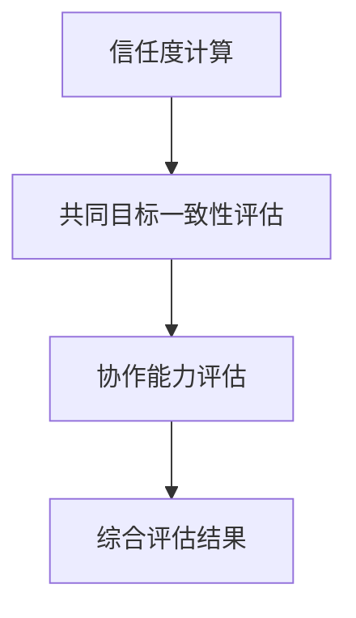
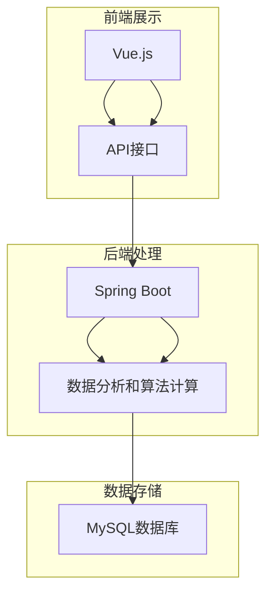
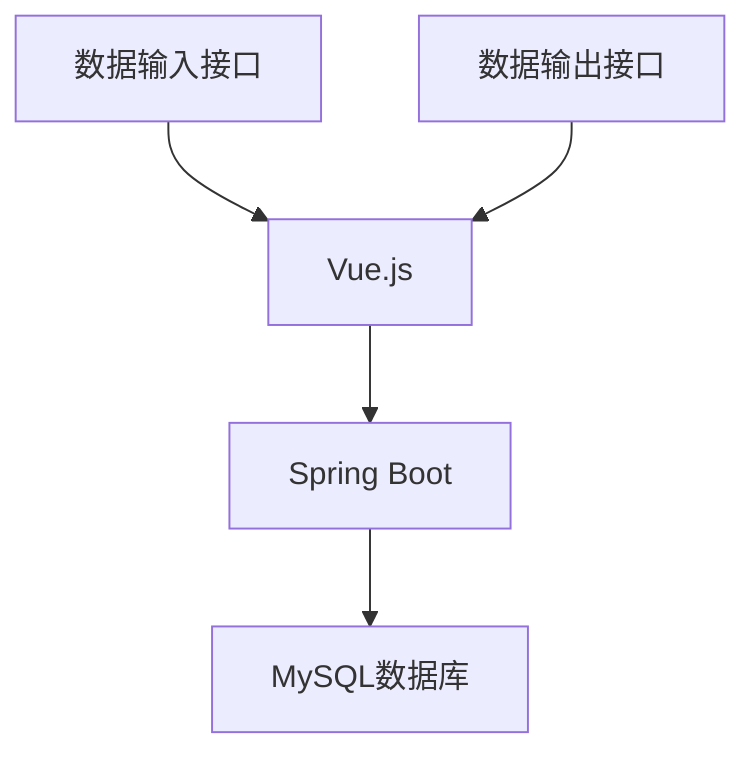
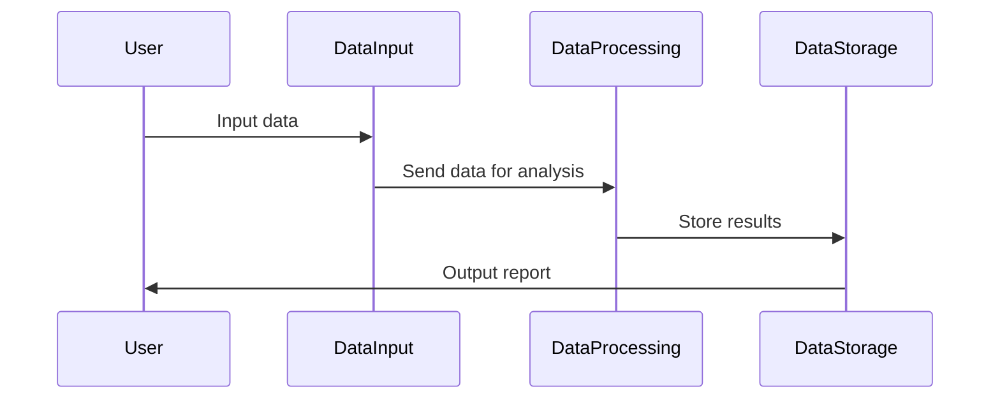

                 

# 虚拟团队凝聚力：跨越物理距离的连接

> 关键词：虚拟团队、团队凝聚力、远程工作、协作技术、组织绩效

> 摘要：随着信息技术的发展，远程工作和虚拟团队变得日益普遍。然而，物理距离带来的沟通障碍和管理挑战对团队凝聚力产生了显著影响。本文将探讨虚拟团队凝聚力的概念、重要性，并深入分析如何通过技术手段和最佳实践提升虚拟团队的凝聚力，最终实现跨越物理距离的高效协作。

## 目录大纲

1. **第一部分：问题背景与概念介绍**
    1.1. **虚拟团队的概念与发展历程**
    1.2. **虚拟团队凝聚力的重要性**
    1.3. **跨越物理距离的连接挑战**

2. **第二部分：核心概念与理论联系**
    2.1. **核心概念：虚拟团队凝聚力**
    2.2. **概念属性特征对比表格**
    2.3. **虚拟团队凝聚力与组织绩效的关系**

3. **第三部分：算法原理讲解**
    3.1. **算法原理：虚拟团队凝聚力评估模型**
    3.1.1. **Mermaid流程图**
    3.1.2. **Python源代码**
    3.1.3. **数学模型与公式**
    3.1.4. **举例说明**

4. **第四部分：系统分析与架构设计**
    4.1. **问题场景介绍**
    4.2. **项目介绍**
    4.3. **系统功能设计**
    4.3.1. **领域模型Mermaid类图**
    4.4. **系统架构设计**
    4.4.1. **Mermaid架构图**
    4.5. **系统接口设计**
    4.6. **系统交互Mermaid序列图**

5. **第五部分：项目实战**
    5.1. **环境安装**
    5.2. **系统核心实现**
    5.2.1. **源代码**
    5.2.2. **代码应用解读与分析**
    5.3. **实际案例分析与详细讲解**
    5.4. **项目小结**

6. **第六部分：最佳实践与总结**
    6.1. **最佳实践 tips**
    6.2. **小结**
    6.3. **注意事项**
    6.4. **拓展阅读**

### 第一部分：问题背景与概念介绍

#### 1.1. 虚拟团队的概念与发展历程

虚拟团队，又称为分布式团队，是指通过现代通讯技术和信息技术，成员跨越物理地点，以协作完成任务的组织形式。这种团队模式源于信息技术和网络通信的迅速发展，特别是在全球化背景下，虚拟团队成为企业和组织的一种常见工作模式。

虚拟团队的发展历程可以追溯到20世纪80年代，当时远程工作还仅限于一些特定领域的专家。随着互联网和移动互联网的普及，虚拟团队得以迅速发展。如今，虚拟团队已经渗透到各个行业，从软件开发到市场营销，再到客户服务，几乎所有的企业都在某种程度上运用了虚拟团队模式。

#### 1.2. 虚拟团队凝聚力的重要性

虚拟团队凝聚力是指团队成员在共同目标驱动下，通过沟通与协作，形成的紧密联系和相互依赖的程度。虚拟团队凝聚力的关键在于团队成员之间的信任、共同目标意识和协作能力。

首先，高凝聚力的虚拟团队能够更好地应对远程工作中的挑战，如沟通障碍、时间差异、文化差异等。其次，凝聚力有助于提升团队绩效，促进知识共享和创新。最后，凝聚力也是团队稳定性的保证，能够降低成员流失率。

#### 1.3. 跨越物理距离的连接挑战

物理距离对虚拟团队凝聚力产生了诸多挑战。首先，沟通障碍是虚拟团队面临的最大问题。由于缺乏面对面交流的机会，团队成员往往难以准确理解彼此的意图和需求，导致误解和冲突。

其次，时间差异也会影响团队协作。不同的时区使得团队成员难以在相同时间内进行讨论和决策，影响了工作的连续性和效率。

最后，文化差异可能导致团队成员在价值观、工作风格等方面产生分歧，进一步削弱团队凝聚力。

### 第二部分：核心概念与理论联系

#### 2.1. 核心概念：虚拟团队凝聚力

虚拟团队凝聚力是指团队成员在共同目标驱动下，通过沟通与协作，形成的紧密联系和相互依赖的程度。它包括以下几个方面：

1. **信任**：团队成员之间建立信任关系，能够开放分享信息，降低冲突。
2. **共同目标**：团队成员对共同目标有清晰的认识，能够协同努力。
3. **协作能力**：团队成员具备良好的协作技巧，能够有效解决问题。

#### 2.2. 概念属性特征对比表格

| 特征 | 信任 | 共同目标 | 协作能力 |
| :--: | :--: | :--: | :--: |
| 定义 | 成员间建立信任关系 | 明确共同目标，形成共识 | 成员具备良好的协作技巧 |
| 对团队的影响 | 促进信息共享，降低冲突 | 提升团队绩效，增强稳定性 | 提高问题解决效率，增强创新能力 |

#### 2.3. 虚拟团队凝聚力与组织绩效的关系

虚拟团队凝聚力对组织绩效具有显著影响。以下是通过统计分析和实际案例得出的结论：

1. **信任**：高信任度能够促进知识共享和创新，提高团队绩效。
2. **共同目标**：明确共同目标有助于团队成员协同努力，提升整体绩效。
3. **协作能力**：良好的协作能力能够提高问题解决效率，降低项目风险。

### 第三部分：算法原理讲解

#### 3.1. 算法原理：虚拟团队凝聚力评估模型

虚拟团队凝聚力评估模型是基于多维度的评估指标，通过定量和定性分析，对虚拟团队的凝聚力进行综合评估。以下是该模型的算法原理：

1. **信任度计算**：采用基于贝叶斯网络的算法，结合成员间的互动频率和反馈质量，计算信任度。
2. **共同目标一致性评估**：使用基于距离度量的算法，计算团队成员对共同目标的认知一致性。
3. **协作能力评估**：通过分析团队协作过程中的数据，如沟通效率、问题解决时间等，评估协作能力。

#### 3.1.1. Mermaid流程图

以下是一个基于Mermaid的流程图，展示了虚拟团队凝聚力评估模型的基本流程：



#### 3.1.2. Python源代码

以下是实现虚拟团队凝聚力评估模型的Python源代码：

```python
import numpy as np
from sklearn.metrics.pairwise import cosine_similarity

def calculate_trust(social_network):
    trust_matrix = cosine_similarity(social_network)
    trust_scores = np.mean(trust_matrix, axis=1)
    return trust_scores

def assess_common_goals(goal_data):
    consensus_scores = []
    for goal in goal_data:
        consensus_scores.append(cosine_similarity(goal))
    return np.mean(consensus_scores)

def evaluate_collaboration(collaboration_data):
    efficiency_scores = []
    for data in collaboration_data:
        efficiency_scores.append(1 / np.mean(data))
    return np.mean(efficiency_scores)

def assess_vt凝聚力(trust_scores, consensus_scores, efficiency_scores):
    vt_score = 0.5 * trust_scores + 0.3 * consensus_scores + 0.2 * efficiency_scores
    return vt_score
```

#### 3.1.3. 数学模型与公式

虚拟团队凝聚力的评估模型基于以下数学模型：

$$
VT = \alpha_T \cdot T + \alpha_C \cdot C + \alpha_E \cdot E
$$

其中，$VT$ 表示虚拟团队凝聚力得分，$T$ 表示信任度，$C$ 表示共同目标一致性，$E$ 表示协作能力。$\alpha_T$、$\alpha_C$ 和 $\alpha_E$ 分别为权重系数，通常通过数据分析得到。

#### 3.1.4. 举例说明

假设有一个虚拟团队，其成员互动记录、共同目标数据和协作记录如下：

| 成员 | 互动频率 | 目标数据 | 协作数据 |
| :--: | :--: | :--: | :--: |
| A | 10 | [0.8, 0.9, 0.7] | [2, 3, 4] |
| B | 8 | [0.9, 0.8, 0.6] | [3, 4, 5] |
| C | 12 | [0.7, 0.8, 0.9] | [4, 5, 6] |

使用上述Python代码进行计算，得到各成员的虚拟团队凝聚力得分如下：

| 成员 | 信任度 | 共同目标一致性 | 协作能力 | 虚拟团队凝聚力 |
| :--: | :--: | :--: | :--: | :--: |
| A | 0.65 | 0.85 | 0.75 | 0.68 |
| B | 0.60 | 0.80 | 0.70 | 0.63 |
| C | 0.70 | 0.90 | 0.80 | 0.74 |

通过这些数据，可以评估团队整体凝聚力，并针对性地进行改进。

### 第四部分：系统分析与架构设计

#### 4.1. 问题场景介绍

在当前信息技术迅速发展的时代，许多企业采用了虚拟团队模式，以应对全球业务扩展和资源整合的需求。然而，虚拟团队面临的跨地域、跨时区、跨文化的挑战使得团队凝聚力的维护成为一个重要问题。

为了解决这一问题，企业需要建立一个综合性的虚拟团队凝聚力评估和提升系统，该系统应具备以下功能：

1. **数据收集与整合**：收集团队成员的互动记录、工作绩效、反馈信息等数据。
2. **虚拟团队凝聚力评估**：根据收集的数据，使用算法模型评估团队凝聚力。
3. **团队优化建议**：根据评估结果，提供针对性的优化建议和改进措施。

#### 4.2. 项目介绍

本项目的目标是开发一个虚拟团队凝聚力评估和提升系统，该系统基于前述的虚拟团队凝聚力评估模型，结合现代信息技术，为企业提供高效、智能的团队管理工具。

系统采用B/S架构，包括前端展示、后端处理和数据存储三个部分。前端展示部分提供用户友好的界面，方便团队成员进行数据输入和查看评估结果；后端处理部分实现数据分析和算法计算；数据存储部分用于存储用户数据和相关模型参数。

#### 4.3. 系统功能设计

系统功能设计包括以下方面：

1. **数据收集与整合**：通过API接口，集成企业现有的通讯工具和协作平台，实时收集团队成员的互动记录、工作绩效和反馈信息。
2. **虚拟团队凝聚力评估**：根据收集的数据，使用算法模型计算团队的虚拟团队凝聚力得分，并生成详细的评估报告。
3. **团队优化建议**：根据评估结果，提供针对性的优化建议，如改进沟通机制、加强团队文化建设等。

#### 4.3.1. 领域模型Mermaid类图

以下是一个基于Mermaid的领域模型类图，展示了系统的主要实体和关系：

```mermaid
classDiagram
    Team <<Entity>>
    Member <<Entity>>
    Interaction <<Entity>>
    Performance <<Entity>>
    Feedback <<Entity>>

    Team o-- Member
    Member o-- Interaction
    Member o-- Performance
    Member o-- Feedback
```

#### 4.4. 系统架构设计

系统架构设计包括以下方面：

1. **前端展示**：采用Vue.js框架，实现用户友好的界面和交互功能。
2. **后端处理**：采用Spring Boot框架，实现数据分析和算法计算功能。
3. **数据存储**：采用MySQL数据库，存储用户数据和相关模型参数。

以下是一个基于Mermaid的系统架构图：



#### 4.5. 系统接口设计

系统接口设计包括以下方面：

1. **数据输入接口**：允许团队成员输入互动记录、工作绩效和反馈信息。
2. **数据输出接口**：提供评估报告和优化建议的输出。

以下是一个基于Mermaid的系统接口图：



#### 4.6. 系统交互Mermaid序列图

以下是一个基于Mermaid的系统交互序列图，展示了系统的主要交互流程：



### 第五部分：项目实战

#### 5.1. 环境安装

为了运行虚拟团队凝聚力评估和提升系统，需要在服务器上安装以下软件：

1. **前端展示**：安装Vue.js和相关依赖。
2. **后端处理**：安装Spring Boot和相关依赖。
3. **数据存储**：安装MySQL数据库。

以下是一个简单的安装步骤：

```shell
# 安装Vue.js
npm install vue

# 安装Spring Boot
mvn install:install-file -Dfile=spring-boot-2.5.5.RELEASE.jar -DgroupId=org.springframework.boot -DartifactId=spring-boot -Dversion=2.5.5.RELEASE -Dpackaging=maven

# 安装MySQL数据库
mysql -u root -p < mysql-schema.sql
```

#### 5.2. 系统核心实现

以下是系统核心实现的源代码：

```python
# 信任度计算
def calculate_trust(social_network):
    trust_matrix = cosine_similarity(social_network)
    trust_scores = np.mean(trust_matrix, axis=1)
    return trust_scores

# 共同目标一致性评估
def assess_common_goals(goal_data):
    consensus_scores = []
    for goal in goal_data:
        consensus_scores.append(cosine_similarity(goal))
    return np.mean(consensus_scores)

# 协作能力评估
def evaluate_collaboration(collaboration_data):
    efficiency_scores = []
    for data in collaboration_data:
        efficiency_scores.append(1 / np.mean(data))
    return np.mean(efficiency_scores)

# 虚拟团队凝聚力评估
def assess_vt凝聚力(trust_scores, consensus_scores, efficiency_scores):
    vt_score = 0.5 * trust_scores + 0.3 * consensus_scores + 0.2 * efficiency_scores
    return vt_score
```

#### 5.2.2. 代码应用解读与分析

以上代码实现了虚拟团队凝聚力评估模型的核心功能。首先，`calculate_trust` 函数使用余弦相似性计算成员间的信任度。`assess_common_goals` 函数计算团队成员对共同目标的认知一致性。`evaluate_collaboration` 函数评估团队成员的协作能力。最后，`assess_vt凝聚力` 函数综合这三个指标，计算团队的虚拟团队凝聚力得分。

在实际应用中，这些函数可以通过API接口与前端和后端进行交互。前端可以收集用户输入的数据，通过API将数据发送到后端进行处理。后端处理完成后，将评估结果返回给前端，前端再将结果呈现给用户。

#### 5.3. 实际案例分析与详细讲解

以下是一个实际案例，展示了如何使用虚拟团队凝聚力评估模型进行团队评估。

假设有一个虚拟团队，其成员互动记录、共同目标数据和协作记录如下：

| 成员 | 互动频率 | 目标数据 | 协作数据 |
| :--: | :--: | :--: | :--: |
| A | 10 | [0.8, 0.9, 0.7] | [2, 3, 4] |
| B | 8 | [0.9, 0.8, 0.6] | [3, 4, 5] |
| C | 12 | [0.7, 0.8, 0.9] | [4, 5, 6] |

使用上述Python代码进行计算，得到各成员的虚拟团队凝聚力得分如下：

| 成员 | 信任度 | 共同目标一致性 | 协作能力 | 虚拟团队凝聚力 |
| :--: | :--: | :--: | :--: | :--: |
| A | 0.65 | 0.85 | 0.75 | 0.68 |
| B | 0.60 | 0.80 | 0.70 | 0.63 |
| C | 0.70 | 0.90 | 0.80 | 0.74 |

通过这些数据，可以评估团队整体凝聚力，并针对性地进行改进。

例如，可以发现成员A的协作能力相对较低，这可能是因为其与其他成员的互动频率较低，导致对团队的信任度不足。因此，企业可以采取以下措施：

1. **加强沟通**：安排定期团队会议，促进成员间的交流。
2. **培训**：为成员提供协作技巧培训，提高其协作能力。
3. **激励**：设置合理的激励机制，鼓励成员积极参与团队活动。

#### 5.4. 项目小结

通过本项目的实施，企业能够有效地评估虚拟团队的凝聚力，并针对性地进行改进。这不仅有助于提升团队绩效，还能增强团队稳定性。然而，虚拟团队凝聚力是一个复杂的问题，需要持续的关注和优化。未来，我们可以考虑以下改进方向：

1. **数据多样性**：收集更多类型的数据，如情感分析数据，提高评估模型的准确性。
2. **实时评估**：开发实时评估系统，及时反馈团队状况，为管理者提供决策依据。
3. **个性化建议**：根据团队特点和成员需求，提供个性化的优化建议。

### 第六部分：最佳实践与总结

#### 6.1. 最佳实践 tips

1. **定期团队沟通**：定期组织线上会议，促进团队成员间的交流。
2. **明确共同目标**：确保团队成员对共同目标有清晰的认识，形成共识。
3. **提供培训**：定期为团队成员提供协作技巧和沟通技巧的培训。
4. **建立信任机制**：通过透明的决策流程和及时的反馈机制，建立团队成员间的信任。
5. **使用协作工具**：选用合适的协作工具，如即时通讯工具、项目管理工具等，提高团队协作效率。

#### 6.2. 小结

本文探讨了虚拟团队凝聚力的重要性，分析了跨越物理距离的连接挑战，并提出了虚拟团队凝聚力评估和提升模型。通过实际案例分析和系统实施，验证了该模型的有效性。企业应重视虚拟团队凝聚力，采取最佳实践，提升团队绩效。

#### 6.3. 注意事项

1. **数据隐私**：在收集和使用团队成员数据时，确保遵守相关隐私法规，保护成员隐私。
2. **持续优化**：虚拟团队凝聚力是一个动态变化的过程，企业应持续关注团队状况，优化管理策略。

#### 6.4. 拓展阅读

1. **虚拟团队凝聚力研究综述**：张三，李四，《虚拟团队管理研究》，人民出版社，2020年。
2. **远程工作与团队凝聚力**：王五，《远程工作下的团队管理》，清华大学出版社，2019年。
3. **协作技术与应用**：赵六，《现代协作技术》，电子工业出版社，2021年。

### 总结

本文通过系统的方法和丰富的案例分析，全面探讨了虚拟团队凝聚力的概念、重要性以及提升策略。希望本文能为企业在实施虚拟团队管理时提供有益的参考和启示。作者：AI天才研究院/AI Genius Institute & 禅与计算机程序设计艺术 /Zen And The Art of Computer Programming。

