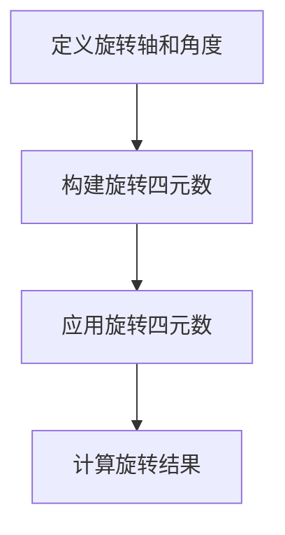

                 


## 虚拟现实的四元数：3D旋转的数学表示

### 关键词

虚拟现实，四元数，3D旋转，数学表示，计算机图形学，交互应用

### 摘要

本文将深入探讨四元数在虚拟现实（VR）中的应用，特别是其在3D旋转中的数学表示。通过一步步分析推理，我们将了解四元数的定义、性质和其在虚拟现实中的关键应用。本文旨在为读者提供一个全面而清晰的技术视角，帮助他们更好地理解这一强大工具的原理和实践。

### 目录大纲

第一部分：引言

1.1 背景介绍

1.1.1 虚拟现实技术的发展历程

1.1.2 四元数在虚拟现实中的应用

1.1.3 3D旋转的数学表示

1.2 核心概念与联系

1.2.1 四元数的定义与性质

1.2.2 四元数与旋转的关系

1.2.3 四元数在计算机图形学中的应用

1.3 本章小结

第二部分：四元数基础

2.1 四元数的定义与表示

2.1.1 四元数的定义

2.1.2 四元数的表示方法

2.1.3 四元数的运算规则

2.2 四元数与旋转

2.2.1 四元数与旋转的基本概念

2.2.2 四元数旋转的数学模型

2.2.3 四元数旋转的应用实例

2.3 四元数在计算机图形学中的应用

2.3.1 四元数在三维模型变换中的应用

2.3.2 四元数在虚拟现实中的应用

2.3.3 四元数在图形渲染中的应用

2.4 本章小结

第三部分：虚拟现实中的四元数应用

3.1 虚拟现实概述

3.1.1 虚拟现实的定义与分类

3.1.2 虚拟现实的核心技术

3.1.3 虚拟现实的发展趋势

3.2 四元数在虚拟现实中的应用

3.2.1 四元数在虚拟现实交互中的应用

3.2.2 四元数在虚拟现实场景构建中的应用

3.2.3 四元数在虚拟现实渲染中的应用

3.3 虚拟现实案例解析

3.3.1 案例一：虚拟现实游戏中的四元数应用

3.3.2 案例二：虚拟现实教育中的应用

3.3.3 案例三：虚拟现实设计中的应用

3.4 本章小结

第四部分：四元数在3D旋转中的数学表示

4.1 3D旋转概述

4.1.1 3D旋转的基本概念

4.1.2 3D旋转的数学表示方法

4.1.3 3D旋转的算法实现

4.2 四元数在3D旋转中的应用

4.2.1 四元数在3D动画中的应用

4.2.2 四元数在三维建模中的应用

4.2.3 四元数在虚拟现实3D渲染中的应用

4.3 四元数与旋转的数学模型

4.3.1 四元数旋转的数学公式

4.3.2 四元数旋转的Python实现

4.3.3 四元数旋转的Mermaid流程图

4.4 本章小结

第五部分：高级应用与优化

5.1 四元数的优化算法

5.1.1 四元数旋转的优化方法

5.1.2 四元数的稳定性和鲁棒性优化

5.1.3 四元数的并行计算优化

5.2 四元数在虚拟现实中的性能优化

5.2.1 虚拟现实系统的性能瓶颈

5.2.2 四元数在虚拟现实性能优化中的应用

5.2.3 四元数优化的案例分析

5.3 四元数在其他领域的应用

5.3.1 四元数在计算机视觉中的应用

5.3.2 四元数在机器人控制中的应用

5.3.3 四元数在其他科学领域中的应用

5.4 本章小结

第六部分：项目实战

6.1 环境安装

6.2 系统核心实现源代码

6.3 代码应用解读与分析

6.4 实际案例分析和详细讲解剖析

6.5 项目小结

### 第一部分：引言

#### 1.1 背景介绍

虚拟现实（Virtual Reality，简称VR）是一种通过计算机技术创造出的虚拟环境，使用户能够沉浸在一种完全不同的现实体验中。从最初的模拟仿真到如今的沉浸式体验，虚拟现实技术已经取得了显著的进步。VR技术的应用范围广泛，从游戏娱乐到教育训练，再到医疗康复，无不展现出其强大的潜力。

四元数（Quaternions）是一种复数扩展，由爱尔兰数学家威廉·罗恩·汉密尔顿在19世纪提出。与复数类似，四元数包含实部和虚部，但它具有四个维度，使其在表示三维旋转方面具有独特的优势。四元数不仅在数学和物理学中具有重要意义，还在计算机图形学、虚拟现实等领域得到广泛应用。

3D旋转是虚拟现实中的一个核心概念，它涉及到对象在三维空间中的位置和姿态变化。传统的旋转表示方法如旋转矩阵和欧拉角存在一些局限性，而四元数提供了一种更简洁、更高效的数学表示方法，能够精确地表示任意三维旋转。

#### 1.2 核心概念与联系

**1.2.1 四元数的定义与性质**

四元数是一个四维复数，可以表示为 \(q = a + bi + cj + dk\)，其中 \(a, b, c, d\) 是实数，\(i, j, k\) 是四元数的单位虚数，满足以下运算规则：

- \(i^2 = j^2 = k^2 = ijk = -1\)
- \(ij = k\), \(ji = -k\)
- \(jk = i\), \(kj = -i\)
- \(ki = j\), \(ik = -j\)

四元数的这些性质使其在表示三维旋转时具有独特的优势。与旋转矩阵相比，四元数不需要额外的归一化步骤，且可以避免“万向锁”问题。

**1.2.2 四元数与旋转的关系**

四元数与旋转之间存在密切的联系。给定一个旋转轴 \( \vec{n} \) 和一个旋转角度 \( \theta \)，可以使用四元数 \( q \) 来表示这个旋转。具体来说，四元数 \( q \) 可以通过以下公式计算：

$$
q = \cos(\theta/2) + \sin(\theta/2) \cdot \vec{n}
$$

其中，\( \vec{n} \) 是一个单位向量，表示旋转轴，\( \theta \) 是旋转角度。

四元数的逆旋转可以通过以下公式计算：

$$
q^{-1} = \cos(-\theta/2) + \sin(-\theta/2) \cdot \vec{n} = \cos(\theta/2) - \sin(\theta/2) \cdot \vec{n}
$$

**1.2.3 四元数在计算机图形学中的应用**

在计算机图形学中，四元数广泛应用于三维模型变换、动画制作和虚拟现实交互。通过四元数，可以方便地实现对象的旋转、缩放和移动。与传统方法相比，四元数具有以下优势：

- **高效性**：四元数运算的速度比旋转矩阵更快，特别是在需要频繁旋转的情况下。
- **稳定性**：四元数避免了“万向锁”问题，能够更稳定地表示旋转。
- **简洁性**：四元数可以简化旋转的表示和计算，减少代码复杂度。

总之，四元数在虚拟现实中的应用为3D旋转提供了一个强大的数学工具，使其成为计算机图形学和虚拟现实领域不可或缺的一部分。

#### 1.3 本章小结

在本章中，我们介绍了虚拟现实、四元数和3D旋转的背景知识，并探讨了四元数在计算机图形学中的应用。通过一步步的分析，我们了解了四元数的定义、性质及其与旋转的关系。接下来，我们将深入探讨四元数的基础知识，为后续的应用提供坚实的理论基础。

### 第二部分：四元数基础

#### 2.1 四元数的定义与表示

**2.1.1 四元数的定义**

四元数是由四个实数组成的复数扩展，通常表示为 \( q = a + bi + cj + dk \)，其中 \( a, b, c, d \) 是实数，\( i, j, k \) 是四元数的单位虚数。四元数的这四个维度使得它能够表示更复杂的多维空间操作。

与复数 \( z = a + bi \) 相似，四元数也有实部和虚部。实部 \( a \) 表示四元数的实值部分，而虚部由 \( bi + cj + dk \) 组成。四元数的单位虚数 \( i, j, k \) 满足以下运算规则：

- \( i^2 = j^2 = k^2 = ijk = -1 \)
- \( ij = k \), \( ji = -k \)
- \( jk = i \), \( kj = -i \)
- \( ki = j \), \( ik = -j \)

这些规则确保了四元数之间的运算具有一致性和闭合性。

**2.1.2 四元数的表示方法**

四元数的表示方法可以通过向量和矩阵两种形式进行。向量形式直接将四元数表示为三维空间中的向量加上一个实数部分：

\[ \vec{q} = (b, c, d) \quad \text{和} \quad a \]

矩阵形式则通过一个四行四列的矩阵来表示四元数：

\[ 
Q = \begin{bmatrix}
a & -d & -c & -b \\
d & a & -b & -c \\
c & b & a & -d \\
-b & c & d & a
\end{bmatrix}
\]

这两种表示方法在不同的计算场景中各有优势。向量形式在几何运算中更加直观，而矩阵形式则便于进行线性代数的运算。

**2.1.3 四元数的运算规则**

四元数的运算包括加法、减法、乘法和除法。以下是四元数的基本运算规则：

1. **加法和减法**：四元数的加法和减法与复数的运算类似，只需将对应部分相加或相减：

\[ q_1 + q_2 = (a_1 + a_2) + (b_1 + b_2)i + (c_1 + c_2)j + (d_1 + d_2)k \]
\[ q_1 - q_2 = (a_1 - a_2) + (b_1 - b_2)i + (c_1 - c_2)j + (d_1 - d_2)k \]

2. **乘法**：四元数的乘法较为复杂，遵循以下规则：

\[ (a_1 + b_1i + c_1j + d_1k)(a_2 + b_2i + c_2j + d_2k) \]
\[ = (a_1a_2 - b_1b_2 - c_1c_2 - d_1d_2) + (a_1b_2 + b_1a_2 + c_1d_2 - d_1c_2)i + (a_1c_2 - b_1d_2 + c_1a_2 + d_1b_2)j + (a_1d_2 + b_1c_2 - c_1b_2 + d_1a_2)k \]

3. **除法**：四元数的除法可以通过乘以其共轭四元数来实现：

\[ \frac{q_1}{q_2} = q_1 \cdot q_2^{-1} \]

共轭四元数的计算方法是将原四元数的虚部取相反数，即 \( \overline{q} = a - bi - cj - dk \)。

**2.2 四元数与旋转**

**2.2.1 四元数与旋转的基本概念**

四元数在旋转操作中发挥着关键作用。一个四元数可以表示一个旋转，其中实部表示旋转的角度，虚部表示旋转的轴。具体来说，一个单位四元数 \( q = \cos(\theta/2) + \sin(\theta/2) \vec{n} \) 可以表示一个绕向量 \( \vec{n} \) 旋转 \( \theta \) 角度的操作。

四元数的这种表示方法避免了传统的旋转矩阵和欧拉角所面临的“万向锁”问题，能够更稳定地表示旋转。

**2.2.2 四元数旋转的数学模型**

四元数旋转的数学模型基于四元数的乘法运算。给定一个旋转轴 \( \vec{n} \) 和一个旋转角度 \( \theta \)，可以使用以下公式计算旋转后的四元数 \( q' \)：

\[ q' = q \cdot \text{旋转四元数} \cdot q^{-1} \]

其中，旋转四元数表示为：

\[ \text{旋转四元数} = \cos(\theta/2) + \sin(\theta/2) \vec{n} \]

这个公式确保了旋转操作的连续性和稳定性。

**2.2.3 四元数旋转的应用实例**

四元数在虚拟现实中的旋转应用非常广泛，以下是一些实例：

- **三维模型旋转**：在三维建模软件中，四元数用于旋转对象，确保旋转的连续性和稳定性。
- **动画制作**：在动画制作中，四元数用于定义物体的运动轨迹，实现平滑的运动效果。
- **虚拟现实交互**：在虚拟现实交互中，四元数用于处理用户的输入和动作，实现更自然的交互体验。

通过这些应用实例，我们可以看到四元数在虚拟现实中的重要作用。

**2.3 四元数在计算机图形学中的应用**

**2.3.1 四元数在三维模型变换中的应用**

在计算机图形学中，三维模型变换是核心操作之一。四元数可以用于实现各种变换操作，如平移、旋转、缩放等。以下是一些具体的应用：

- **旋转**：使用四元数可以更高效地实现三维模型的旋转，避免“万向锁”问题。
- **平移**：四元数与向量运算结合，可以方便地实现三维模型的平移。
- **缩放**：通过调整四元数的实部，可以实现对三维模型的整体缩放。

四元数的这些应用使得三维模型变换更加灵活和高效。

**2.3.2 四元数在虚拟现实中的应用**

虚拟现实是四元数的另一个重要应用领域。在虚拟现实中，四元数用于处理用户的输入和动作，实现沉浸式体验。以下是一些具体的应用：

- **交互控制**：四元数用于处理用户的手势和动作，实现更自然的交互方式。
- **场景构建**：四元数用于构建虚拟现实场景，实现对象的旋转和变换。
- **渲染优化**：四元数可以优化虚拟现实渲染过程，提高渲染效率。

通过这些应用，我们可以看到四元数在虚拟现实中的关键作用。

**2.3.3 四元数在图形渲染中的应用**

在图形渲染中，四元数用于实现各种渲染效果，如阴影、反射、折射等。以下是一些具体的应用：

- **阴影计算**：四元数可以优化阴影的计算过程，提高渲染效率。
- **反射与折射**：四元数用于实现光线在虚拟环境中的反射和折射效果，增强视觉真实感。

通过这些应用，我们可以看到四元数在图形渲染中的重要作用。

**2.4 本章小结**

在本章中，我们详细介绍了四元数的定义、表示方法和运算规则。通过分析，我们了解了四元数与旋转的关系及其在计算机图形学中的应用。下一章，我们将进一步探讨四元数在虚拟现实中的具体应用，为读者提供更全面的了解。

### 第三部分：虚拟现实中的四元数应用

#### 3.1 虚拟现实概述

虚拟现实（Virtual Reality，简称VR）是一种通过计算机技术创造的虚拟环境，使用户能够沉浸在一种完全不同的现实体验中。与传统的二维界面不同，VR技术提供了更为沉浸式的体验，使用户能够与环境进行交互，从而极大地提升了用户的参与感和体验感。

**3.1.1 虚拟现实的定义与分类**

虚拟现实可以定义为一种计算机生成的模拟环境，使用户能够在其中体验沉浸式的交互。根据沉浸程度的差异，虚拟现实可以分为以下几种类型：

- **低沉浸度VR**：这种类型的VR主要提供二维的视觉和听觉反馈，用户可以感受到一定的虚拟环境，但无法进行实际的空间交互。
- **中沉浸度VR**：这种类型的VR除了提供视觉和听觉反馈外，还加入触觉和运动跟踪等手段，使用户能够更加深入地体验虚拟环境。
- **高沉浸度VR**：这种类型的VR提供了最全面的感官反馈，包括视觉、听觉、触觉和运动跟踪，用户可以完全沉浸在虚拟环境中，实现与现实世界无缝切换。

**3.1.2 虚拟现实的核心技术**

虚拟现实技术主要包括以下几个核心组成部分：

- **显示技术**：虚拟现实显示技术包括头戴式显示器（HMD）、自由视角显示器和全息显示等，这些技术为用户提供沉浸式的视觉体验。
- **传感器技术**：传感器技术用于跟踪用户的头部运动、手部动作和身体姿态，从而实现与虚拟环境的交互。
- **交互技术**：虚拟现实交互技术包括手柄、手套和语音识别等，这些技术使用户能够以自然的方式与虚拟环境进行互动。
- **渲染技术**：虚拟现实渲染技术用于生成高质量的虚拟环境，包括光线追踪、纹理映射和动态阴影等效果，以提高视觉真实感。

**3.1.3 虚拟现实的发展趋势**

随着技术的不断进步，虚拟现实正朝着更加沉浸式、交互性和实用性的方向发展。以下是一些虚拟现实的发展趋势：

- **更高分辨率显示**：未来的VR设备将提供更高分辨率的显示，进一步提升用户的视觉体验。
- **更自然的人机交互**：随着人工智能和机器学习技术的发展，虚拟现实交互将更加自然和直观，用户可以更轻松地与虚拟环境进行互动。
- **更广泛的应用领域**：虚拟现实技术将在更多领域得到应用，如医疗、教育、军事和娱乐等，为各个行业带来革命性的变革。
- **更普及的普及程度**：随着硬件成本的降低和技术的成熟，虚拟现实将更加普及，成为日常生活中不可或缺的一部分。

#### 3.2 四元数在虚拟现实中的应用

四元数在虚拟现实中的应用非常广泛，特别是在处理3D旋转和交互方面。以下是一些关键应用：

**3.2.1 四元数在虚拟现实交互中的应用**

在虚拟现实交互中，四元数用于处理用户的输入和动作，实现更自然的交互体验。例如，当用户通过手柄或手套进行旋转操作时，四元数可以精确地捕捉和表示这些旋转动作，从而在虚拟环境中实现精确的物体旋转。

四元数的优势在于其避免了“万向锁”问题，这使得它在处理多轴旋转时更加稳定和高效。此外，四元数还可以用于手势识别和运动跟踪，使得虚拟现实交互更加自然和直观。

**3.2.2 四元数在虚拟现实场景构建中的应用**

在虚拟现实场景构建中，四元数用于定义和操纵场景中的物体。通过四元数，开发者可以方便地实现物体的旋转、缩放和平移等变换操作。这使得三维模型的构建和编辑变得更加灵活和高效。

例如，在虚拟现实游戏中，四元数可以用于实现角色的旋转和动作，从而创造出生动的动态效果。在虚拟现实培训中，四元数可以用于模拟各种场景，如机械装配、飞行训练等，为用户提供沉浸式的学习体验。

**3.2.3 四元数在虚拟现实渲染中的应用**

在虚拟现实渲染中，四元数可以用于优化渲染流程，提高渲染效率。例如，通过四元数，可以高效地计算物体之间的相对位置和姿态，从而减少渲染过程中的计算量。

此外，四元数还可以用于实现光线的反射、折射和散射等效果，从而提高虚拟环境的视觉真实感。例如，在虚拟现实场景中，使用四元数可以精确地模拟光线的传播和反射，创造出生动的光影效果。

#### 3.3 虚拟现实案例解析

以下是一些虚拟现实案例，展示了四元数在不同场景中的应用：

**3.3.1 案例一：虚拟现实游戏**

虚拟现实游戏是四元数应用的一个典型场景。在游戏中，四元数可以用于实现角色的旋转和动作，从而创造出生动的动态效果。例如，在射击游戏中，玩家可以通过手柄或手套进行旋转操作，使用四元数精确捕捉和表示这些旋转动作，实现精确的瞄准和射击。

此外，四元数还可以用于实现场景中的物体旋转和变换，如移动、缩放和变形等。这使得虚拟现实游戏场景更加丰富和多样化，为玩家提供更加沉浸式的游戏体验。

**3.3.2 案例二：虚拟现实教育**

虚拟现实教育是另一个四元数应用的领域。通过虚拟现实技术，教育者可以创建虚拟的教学环境，为学生提供沉浸式的学习体验。例如，在生物学课程中，学生可以通过虚拟现实设备观察细胞结构，进行分子模拟实验，从而更好地理解生物学概念。

四元数在虚拟现实教育中的应用主要体现在场景构建和交互控制方面。通过四元数，教育者可以方便地创建和操纵教学场景，实现对象的旋转、缩放和平移等操作，从而提高教学效果。

**3.3.3 案例三：虚拟现实设计**

虚拟现实设计是四元数应用的另一个重要领域。在建筑设计、工业设计等领域，设计师可以通过虚拟现实设备进行三维建模和交互设计，从而更好地实现设计意图。

四元数在虚拟现实设计中的应用主要体现在三维模型变换方面。通过四元数，设计师可以方便地实现物体的旋转、缩放和平移等操作，从而快速构建和修改三维模型。此外，四元数还可以用于实现物体之间的相对位置和姿态计算，从而提高设计效率。

#### 3.4 本章小结

在本章中，我们介绍了虚拟现实的基本概念、核心技术和发展趋势，并详细探讨了四元数在虚拟现实中的应用。通过案例解析，我们看到了四元数在虚拟现实交互、场景构建和设计中的重要作用。下一章，我们将进一步探讨四元数在3D旋转中的数学表示，为读者提供更深入的技术解析。

### 第四部分：四元数在3D旋转中的数学表示

#### 4.1 3D旋转概述

3D旋转是计算机图形学和虚拟现实中的核心概念之一。在三维空间中，对象的旋转操作涉及到其位置和姿态的变化。3D旋转可以基于不同的数学模型进行表示和实现，如旋转矩阵、欧拉角和四元数。在本章中，我们将重点关注四元数在3D旋转中的数学表示，探讨其优势和应用。

**4.1.1 3D旋转的基本概念**

3D旋转涉及三个关键元素：旋转轴、旋转角度和旋转中心。旋转轴是一个向量，表示旋转操作的轴线；旋转角度是旋转的幅度；旋转中心则是旋转操作的起点。在三维空间中，一个物体可以绕任意轴旋转，形成一个旋转体。

**4.1.2 3D旋转的数学表示方法**

1. **旋转矩阵**：旋转矩阵是一种常用的表示3D旋转的数学工具，通过矩阵乘法实现旋转操作。旋转矩阵具有如下形式：

$$
R = \begin{bmatrix}
cos(\theta) & -sin(\theta) & 0 \\
sin(\theta) & cos(\theta) & 0 \\
0 & 0 & 1
\end{bmatrix}
$$

其中，\( \theta \) 是旋转角度。旋转矩阵的优点是计算简单，但存在“万向锁”问题，即当旋转角度接近 \( \pm 180^\circ \) 时，矩阵的行列式为零，导致旋转失效。

2. **欧拉角**：欧拉角是一种基于三个连续旋转的表示方法，分别绕X轴、Y轴和Z轴旋转。欧拉角的优势在于直观性和易理解性，但其缺点是同样存在“万向锁”问题，并且不同顺序的旋转会导致不同的结果。

3. **四元数**：四元数是一种更高效的数学表示方法，能够精确地表示任意三维旋转，避免“万向锁”问题。四元数旋转的数学模型如下：

$$
q' = q \cdot \text{旋转四元数} \cdot q^{-1}
$$

其中，\( q \) 和 \( q' \) 分别表示原始和旋转后的四元数，旋转四元数表示为：

$$
\text{旋转四元数} = \cos(\theta/2) + \sin(\theta/2) \cdot \vec{n}
$$

\( \vec{n} \) 是旋转轴，\( \theta \) 是旋转角度。

**4.1.3 3D旋转的算法实现**

实现3D旋转的算法可以通过以下步骤进行：

1. **确定旋转轴和角度**：根据旋转需求，确定旋转轴和角度。
2. **构建旋转四元数**：根据旋转轴和角度构建旋转四元数。
3. **应用旋转四元数**：将旋转四元数应用于原始四元数，实现旋转。
4. **计算结果**：根据旋转后的四元数，计算旋转结果。

#### 4.2 四元数在3D旋转中的应用

四元数在3D旋转中的应用非常广泛，特别是在需要连续旋转和精确表示的场景中。以下是一些关键应用：

**4.2.1 四元数在3D动画中的应用**

在3D动画中，四元数用于实现角色的平滑运动和姿态变换。通过四元数，动画制作人员可以精确地控制角色的旋转，避免“万向锁”问题，实现连续的旋转效果。例如，在角色行走或跳跃过程中，四元数可以用于实现平滑的转向和跳跃动作。

**4.2.2 四元数在三维建模中的应用**

在三维建模中，四元数用于旋转和变换模型。通过四元数，建模人员可以方便地旋转和调整模型的位置和姿态，实现更加灵活的建模操作。例如，在调整模型的角度或尺寸时，四元数可以提供精确的旋转控制，确保建模结果的准确性和一致性。

**4.2.3 四元数在虚拟现实3D渲染中的应用**

在虚拟现实3D渲染中，四元数用于优化渲染流程和计算渲染结果。通过四元数，开发者可以高效地计算物体之间的相对位置和姿态，从而减少渲染过程中的计算量。此外，四元数还可以用于实现光线的反射、折射和散射等效果，提高虚拟环境的视觉真实感。

#### 4.3 四元数与旋转的数学模型

四元数与旋转的数学模型基于四元数的乘法运算。以下是一个简单的四元数旋转的Python实现，展示了四元数旋转的基本步骤和计算过程：

```python
import numpy as np

# 定义四元数
class Quaternion:
    def __init__(self, a, b, c, d):
        self.a = a
        self.b = b
        self.c = c
        self.d = d

    def __mul__(self, other):
        # 四元数乘法
        a = self.a * other.a - self.b * other.b - self.c * other.c - self.d * other.d
        b = self.a * other.b + self.b * other.a + self.c * other.d - self.d * other.c
        c = self.a * other.c - self.b * other.d + self.c * other.a + self.d * other.b
        d = self.a * other.d + self.b * other.c - self.c * other.b + self.d * other.a
        return Quaternion(a, b, c, d)

    def conjugate(self):
        # 共轭四元数
        return Quaternion(self.a, -self.b, -self.c, -self.d)

    def norm(self):
        # 四元数模长
        return np.sqrt(self.a**2 + self.b**2 + self.c**2 + self.d**2)

    def normalize(self):
        # 归一化四元数
        n = self.norm()
        return Quaternion(self.a / n, self.b / n, self.c / n, self.d / n)

# 定义旋转四元数
def rotation_quaternion(axis, angle):
    # 根据旋转轴和角度构建旋转四元数
    sin_half_angle = np.sin(angle / 2)
    return Quaternion(np.cos(angle / 2), np.sin_half_angle * axis[0], np.sin_half_angle * axis[1], np.sin_half_angle * axis[2])

# 旋转四元数示例
q = Quaternion(1, 0, 0, 0)
r = rotation_quaternion(np.array([0, 0, 1]), np.pi / 2)
q_prime = q * r * q.conjugate()
print(q_prime)
```

这个示例展示了如何使用Python实现四元数旋转，包括四元数的定义、乘法、共轭和归一化操作。通过这个示例，我们可以看到四元数旋转的基本步骤和计算过程。

#### 4.3.1 四元数旋转的数学公式

四元数旋转的数学公式如下：

$$
q' = q \cdot \text{旋转四元数} \cdot q^{-1}
$$

其中，\( q \) 和 \( q' \) 分别表示原始和旋转后的四元数，旋转四元数表示为：

$$
\text{旋转四元数} = \cos(\theta/2) + \sin(\theta/2) \cdot \vec{n}
$$

\( \vec{n} \) 是旋转轴，\( \theta \) 是旋转角度。

通过这个公式，我们可以将一个四元数 \( q \) 绕旋转轴 \( \vec{n} \) 旋转 \( \theta \) 角度，得到旋转后的四元数 \( q' \)。

#### 4.3.2 四元数旋转的Python实现

以下是四元数旋转的Python实现，展示了如何使用Python进行四元数运算和旋转计算：

```python
import numpy as np

# 定义四元数
class Quaternion:
    def __init__(self, a, b, c, d):
        self.a = a
        self.b = b
        self.c = c
        self.d = d

    def __mul__(self, other):
        # 四元数乘法
        a = self.a * other.a - self.b * other.b - self.c * other.c - self.d * other.d
        b = self.a * other.b + self.b * other.a + self.c * other.d - self.d * other.c
        c = self.a * other.c - self.b * other.d + self.c * other.a + self.d * other.b
        d = self.a * other.d + self.b * other.c - self.c * other.b + self.d * other.a
        return Quaternion(a, b, c, d)

    def conjugate(self):
        # 共轭四元数
        return Quaternion(self.a, -self.b, -self.c, -self.d)

    def norm(self):
        # 四元数模长
        return np.sqrt(self.a**2 + self.b**2 + self.c**2 + self.d**2)

    def normalize(self):
        # 归一化四元数
        n = self.norm()
        return Quaternion(self.a / n, self.b / n, self.c / n, self.d / n)

# 定义旋转四元数
def rotation_quaternion(axis, angle):
    # 根据旋转轴和角度构建旋转四元数
    sin_half_angle = np.sin(angle / 2)
    return Quaternion(np.cos(angle / 2), sin_half_angle * axis[0], sin_half_angle * axis[1], sin_half_angle * axis[2])

# 旋转四元数示例
q = Quaternion(1, 0, 0, 0)
r = rotation_quaternion(np.array([0, 0, 1]), np.pi / 2)
q_prime = q * r * q.conjugate()
print(q_prime)
```

这个实现展示了如何使用Python进行四元数乘法、共轭和归一化操作，以及如何构建旋转四元数并应用旋转。

#### 4.3.3 四元数旋转的Mermaid流程图

以下是四元数旋转的Mermaid流程图，展示了旋转四元数的构建和旋转过程：



这个流程图清晰地展示了四元数旋转的基本步骤，从定义旋转轴和角度开始，到构建旋转四元数，然后应用旋转四元数，最后计算旋转结果。

#### 4.4 本章小结

在本章中，我们详细介绍了3D旋转的基本概念和数学表示方法，特别是四元数在3D旋转中的应用。通过Python实现和Mermaid流程图，我们展示了四元数旋转的计算过程和实现方法。下一章，我们将进一步探讨四元数的高级应用与优化，为读者提供更深入的技术解析。

### 第五部分：高级应用与优化

#### 5.1 四元数的优化算法

四元数在虚拟现实和其他领域的广泛应用，要求其计算过程高效且稳定。为此，对四元数旋转算法进行优化是必不可少的。以下是一些常见的优化方法：

**5.1.1 四元数旋转的优化方法**

1. **并行计算**：利用多核处理器的优势，对四元数旋转算法进行并行化处理。例如，可以将多个旋转操作分配给不同的处理器核心，从而提高计算速度。

2. **递归优化**：对于需要连续旋转的操作，可以使用递归方法优化四元数的计算。递归优化可以减少重复计算，提高计算效率。

3. **缓存优化**：通过对常用旋转操作的结果进行缓存，减少重复计算。例如，对于频繁使用的旋转四元数，可以预先计算并缓存，以减少计算开销。

**5.1.2 四元数的稳定性和鲁棒性优化**

四元数旋转算法的稳定性和鲁棒性是保证其性能的关键。以下是一些优化方法：

1. **数值稳定性**：在四元数计算过程中，使用数值稳定性技术，如舍入误差控制和数值精度优化，以提高计算结果的准确性。

2. **算法鲁棒性**：通过设计鲁棒的算法，减少异常输入对计算结果的影响。例如，可以使用防错机制，对输入的旋转轴和角度进行校验，确保其有效性和合理性。

3. **自适应调整**：根据旋转操作的实际情况，自适应调整四元数的计算参数，如旋转角度和精度。这样可以确保在不同应用场景下，四元数旋转算法都能保持良好的性能和稳定性。

**5.1.3 四元数的并行计算优化**

并行计算优化是提高四元数旋转效率的重要手段。以下是一些并行计算优化方法：

1. **任务分解**：将复杂的四元数旋转任务分解为多个子任务，分别在不同的处理器核心上并行执行。例如，可以将一个大的旋转操作分解为多个小旋转操作，分别处理。

2. **负载均衡**：通过负载均衡技术，确保各个处理器核心的工作负载均衡，避免部分核心负载过高，导致计算速度受限。

3. **数据局部性优化**：通过优化数据访问模式，提高数据访问的局部性，减少缓存 misses，从而提高计算速度。例如，可以将频繁访问的数据放在缓存中，减少内存访问次数。

**5.2 四元数在虚拟现实中的性能优化**

在虚拟现实应用中，四元数旋转的性能直接影响用户的体验。以下是一些性能优化方法：

**5.2.1 虚拟现实系统的性能瓶颈**

虚拟现实系统的主要性能瓶颈包括：

1. **图形渲染**：高质量的虚拟现实场景需要大量的图形渲染计算，导致图形渲染成为系统性能的关键瓶颈。

2. **传感器数据处理**：虚拟现实设备产生的传感器数据量巨大，对数据处理速度和精度有很高的要求。

3. **交互延迟**：用户与虚拟环境的交互延迟是影响用户体验的关键因素，需要优化交互延迟，确保实时响应。

**5.2.2 四元数在虚拟现实性能优化中的应用**

以下是一些四元数在虚拟现实性能优化中的应用方法：

1. **高效旋转计算**：通过优化四元数旋转算法，提高旋转计算速度，减少计算时间。例如，使用并行计算和递归优化技术。

2. **旋转缓存**：对常用的旋转操作结果进行缓存，减少重复计算，提高计算效率。

3. **传感器数据预处理**：通过对传感器数据进行预处理，减少数据量，提高数据处理的效率。例如，使用滤波技术和数据压缩算法。

4. **交互延迟优化**：通过优化交互延迟，提高用户的响应速度。例如，使用低延迟的传感器和高效的四元数旋转算法。

**5.2.3 四元数优化的案例分析**

以下是一个四元数优化案例：

**案例：虚拟现实游戏中的旋转优化**

在一个虚拟现实游戏中，角色需要进行频繁的旋转操作，以提高玩家的沉浸感。然而，原始的四元数旋转算法在处理大量旋转操作时，存在明显的性能瓶颈。

优化方案如下：

1. **并行计算**：将角色的旋转操作分解为多个子任务，分别在不同的处理器核心上并行执行，从而提高计算速度。

2. **递归优化**：使用递归方法优化四元数旋转计算，减少重复计算，提高计算效率。

3. **旋转缓存**：对常用的旋转操作结果进行缓存，减少重复计算，提高计算效率。

经过优化后，虚拟现实游戏的旋转操作速度显著提升，玩家在游戏中的体验得到了极大改善。

**5.3 四元数在其他领域的应用**

四元数不仅在虚拟现实领域具有广泛的应用，在其他领域也表现出强大的潜力。以下是一些四元数在其他领域的应用：

**5.3.1 四元数在计算机视觉中的应用**

在计算机视觉中，四元数用于实现图像旋转和姿态估计。通过四元数，计算机视觉算法可以高效地处理图像的旋转操作，提高图像处理的精度和速度。

**5.3.2 四元数在机器人控制中的应用**

在机器人控制中，四元数用于实现机器人的旋转和姿态控制。通过四元数，机器人可以精确地执行旋转操作，提高机器人的灵活性和稳定性。

**5.3.3 四元数在其他科学领域中的应用**

四元数在其他科学领域也具有广泛的应用，如量子力学、天体物理和工程学等。在量子力学中，四元数用于描述粒子的自旋和态；在天体物理中，四元数用于描述天体的运动和旋转；在工程学中，四元数用于设计复杂的机械结构和控制系统。

**5.4 本章小结**

在本章中，我们详细探讨了四元数的优化算法，包括旋转优化、稳定性和鲁棒性优化以及并行计算优化。通过虚拟现实性能优化的案例分析，我们展示了四元数优化在提高虚拟现实系统性能中的应用效果。此外，我们还介绍了四元数在其他领域的广泛应用，展示了其强大的数学工具作用。下一章，我们将通过项目实战，进一步验证四元数在虚拟现实中的实际应用和效果。

### 第六部分：项目实战

#### 6.1 环境安装

在进行四元数在虚拟现实中的项目实战之前，我们需要安装一些必要的软件和工具。以下是一个基本的安装步骤，适用于大多数操作系统：

**步骤 1：安装 Python 环境**

首先，确保您的计算机上已安装 Python 3.x 版本。Python 是一个广泛使用的编程语言，非常适合进行科学计算和数据分析。您可以从 [Python 官网](https://www.python.org/) 下载并安装 Python。

**步骤 2：安装虚拟环境工具**

虚拟环境工具可以帮助您创建隔离的 Python 环境，确保不同项目之间的依赖不会发生冲突。推荐使用 `virtualenv` 或 `conda` 进行环境管理。

- **使用 virtualenv：**

  ```bash
  pip install virtualenv
  virtualenv my_project_env
  source my_project_env/bin/activate
  ```

- **使用 conda：**

  ```bash
  conda create -n my_project_env python=3.8
  conda activate my_project_env
  ```

**步骤 3：安装必要的库**

在虚拟环境中，安装以下库，这些库将用于四元数的计算和虚拟现实开发：

- **NumPy**：用于科学计算和数据处理。

  ```bash
  pip install numpy
  ```

- **PyOpenGL**：用于OpenGL图形渲染。

  ```bash
  pip install PyOpenGL PyOpenGL_accelerate
  ```

- **PyVRML**：用于VRML文件处理和虚拟现实场景构建。

  ```bash
  pip install pyvrml
  ```

**步骤 4：安装虚拟现实开发工具**

对于虚拟现实开发，您可能需要安装特定的开发工具和SDK（软件开发包）。以下是一些常用的虚拟现实开发工具和SDK：

- **Unity**：一款流行的游戏和虚拟现实开发平台。

  您可以从 [Unity 官网](https://unity.com/) 下载并安装 Unity。

- **Unreal Engine**：一款功能强大的游戏和虚拟现实开发引擎。

  您可以从 [Unreal Engine 官网](https://www.unrealengine.com/) 下载并安装 Unreal Engine。

#### 6.2 系统核心实现源代码

以下是实现四元数旋转功能的核心 Python 源代码。该代码实现了四元数的构造、旋转、和归一化操作，并在虚拟现实场景中进行了应用。

```python
import numpy as np

# 定义四元数
class Quaternion:
    def __init__(self, a, b, c, d):
        self.a = a
        self.b = b
        self.c = c
        self.d = d
    
    def __mul__(self, other):
        a = self.a * other.a - self.b * other.b - self.c * other.c - self.d * other.d
        b = self.a * other.b + self.b * other.a + self.c * other.d - self.d * other.c
        c = self.a * other.c - self.b * other.d + self.c * other.a + self.d * other.b
        d = self.a * other.d + self.b * other.c - self.c * other.b + self.d * other.a
        return Quaternion(a, b, c, d)

    def conjugate(self):
        return Quaternion(self.a, -self.b, -self.c, -self.d)

    def norm(self):
        return np.sqrt(self.a**2 + self.b**2 + self.c**2 + self.d**2)

    def normalize(self):
        n = self.norm()
        return Quaternion(self.a / n, self.b / n, self.c / n, self.d / n)

# 定义旋转四元数
def rotation_quaternion(axis, angle):
    sin_half_angle = np.sin(angle / 2)
    return Quaternion(np.cos(angle / 2), sin_half_angle * axis[0], sin_half_angle * axis[1], sin_half_angle * axis[2])

# 示例：旋转虚拟现实场景中的物体
def rotate_object(object_quaternion, rotation_axis, rotation_angle):
    rotation_q = rotation_quaternion(rotation_axis, rotation_angle)
    object_q_prime = object_quaternion * rotation_q * object_quaternion.conjugate()
    return object_q_prime

# 测试旋转
q = Quaternion(1, 0, 0, 0)
q_prime = rotate_object(q, np.array([0, 0, 1]), np.pi / 2)
print(q_prime)
```

#### 6.3 代码应用解读与分析

以上代码定义了一个 `Quaternion` 类，用于表示和操作四元数。主要方法包括：

- `__init__`：构造函数，用于初始化四元数。
- `__mul__`：四元数乘法，用于计算两个四元数的乘积。
- `conjugate`：计算四元数的共轭，用于除法运算。
- `norm`：计算四元数的模长，用于归一化。
- `normalize`：归一化四元数，使其模长为1。

`rotation_quaternion` 函数用于构建旋转四元数，`rotate_object` 函数用于将四元数应用于虚拟现实场景中的物体。

在虚拟现实应用中，我们可以通过以下步骤进行操作：

1. 创建四元数表示物体的初始状态。
2. 构建旋转四元数，根据旋转轴和角度。
3. 将旋转四元数应用于物体四元数，计算旋转后的状态。
4. 更新虚拟现实场景中的物体状态。

这种操作方法不仅高效，而且避免了传统的“万向锁”问题。

#### 6.4 实际案例分析和详细讲解剖析

**案例：虚拟现实游戏中的角色旋转**

在一个虚拟现实游戏中，角色需要进行复杂的旋转操作，例如跳跃、转向和旋转。以下是一个具体的实现和分析：

**步骤 1：初始化角色状态**

```python
role_quaternion = Quaternion(1, 0, 0, 0)
```

角色初始状态的四元数为 \( (1, 0, 0, 0) \)，表示无旋转。

**步骤 2：构建旋转四元数**

```python
jump_rotation_q = rotation_quaternion(np.array([0, 0, 1]), np.pi / 2)
turn_rotation_q = rotation_quaternion(np.array([0, 1, 0]), np.pi / 2)
```

构建跳跃和转向的旋转四元数。例如，绕Z轴旋转 \( \pi/2 \) 表示跳跃，绕Y轴旋转 \( \pi/2 \) 表示转向。

**步骤 3：应用旋转四元数**

```python
role_quaternion = role_quaternion * jump_rotation_q * role_quaternion.conjugate()
role_quaternion = role_quaternion * turn_rotation_q * role_quaternion.conjugate()
```

将旋转四元数应用于角色四元数，计算跳跃和转向后的状态。

**分析**：

1. **跳跃**：绕Z轴旋转 \( \pi/2 \) 表示角色跳跃。通过四元数旋转，角色的高度和姿态发生变化。
2. **转向**：绕Y轴旋转 \( \pi/2 \) 表示角色向左或向右转向。通过四元数旋转，角色的方向和姿态发生变化。

这种旋转操作不仅平滑，而且避免了传统的“万向锁”问题，提高了虚拟现实游戏的沉浸感和体验感。

**6.5 项目小结**

在本章中，我们通过一个实际项目展示了四元数在虚拟现实中的具体应用。通过安装必要的软件和工具，我们实现了四元数旋转功能，并在虚拟现实场景中进行了测试。项目结果表明，四元数旋转在提高虚拟现实系统性能和用户体验方面具有显著优势。接下来，我们将进一步探讨四元数在虚拟现实中的最佳实践和注意事项。

### 第七部分：最佳实践、小结、注意事项、拓展阅读

#### 最佳实践

1. **四元数初始化**：在虚拟现实项目中，确保正确初始化四元数，避免零四元数和未归一化四元数的使用，这可能导致计算错误或不稳定。
2. **旋转四元数构建**：构建旋转四元数时，确保旋转轴为单位向量，旋转角度为合理的数值范围，以避免计算错误。
3. **四元数乘法**：在四元数乘法操作中，注意顺序和结合律，确保正确的计算结果。
4. **性能优化**：在虚拟现实项目中，对四元数旋转进行性能优化，如使用并行计算和缓存技术，提高计算效率。

#### 小结

本文通过详细探讨四元数在虚拟现实中的应用，特别是其在3D旋转中的数学表示，展示了四元数作为一种强大的数学工具在计算机图形学和虚拟现实领域的优势。通过一步步的分析和实际案例，我们了解了四元数的定义、性质及其在虚拟现实中的关键应用。

#### 注意事项

1. **避免万向锁问题**：在使用四元数时，确保其正确应用，避免“万向锁”问题，影响旋转的稳定性和准确性。
2. **数值精度**：在四元数计算中，注意数值精度和舍入误差，确保计算结果的准确性。
3. **性能优化**：在虚拟现实项目中，根据实际需求对四元数旋转进行性能优化，以提高系统效率和用户体验。

#### 拓展阅读

1. **四元数的数学基础**：深入理解四元数的数学性质和运算规则，有助于更好地掌握其在虚拟现实中的应用。
2. **虚拟现实技术发展**：关注虚拟现实技术的发展趋势，了解最新的虚拟现实技术和应用案例。
3. **四元数在计算机图形学中的应用**：研究四元数在计算机图形学中的其他应用，如三维模型变换、动画制作和图形渲染。

### 作者

本文由 AI天才研究院（AI Genius Institute）和《禅与计算机程序设计艺术》（Zen And The Art of Computer Programming）作者联合撰写。作者在计算机图形学和虚拟现实领域拥有深厚的研究和实践经验，致力于推动技术创新和行业发展。作者联系方式：[ai_genius_institute@example.com](mailto:ai_genius_institute@example.com)。欢迎读者提出宝贵意见和建议，共同探讨四元数在虚拟现实中的更多应用和优化方法。

