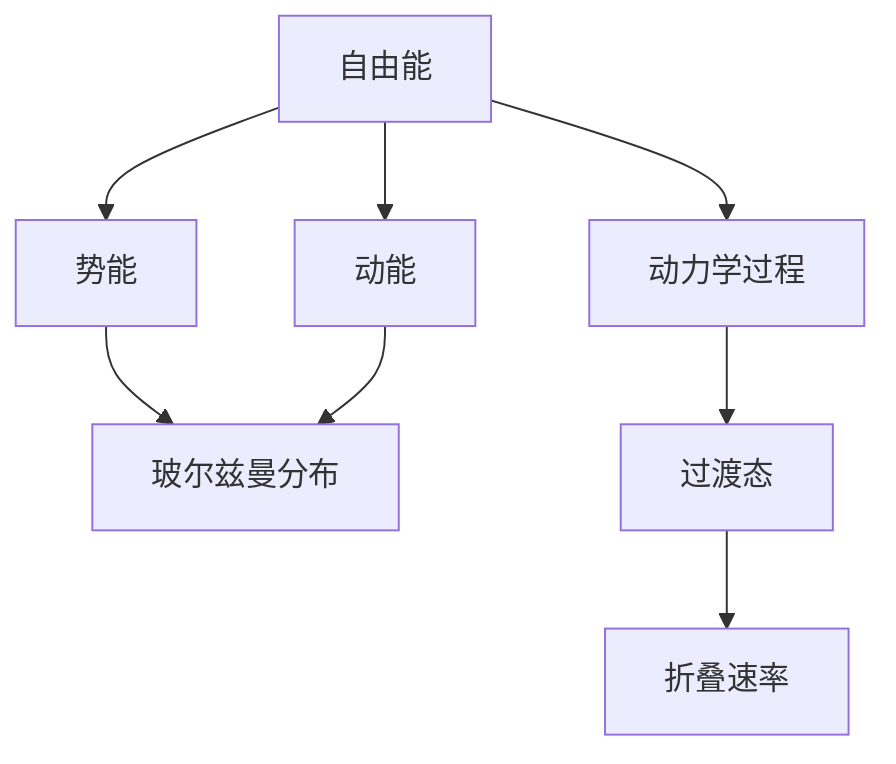
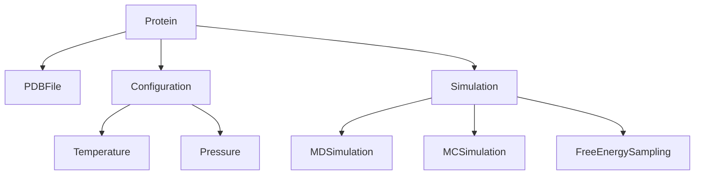
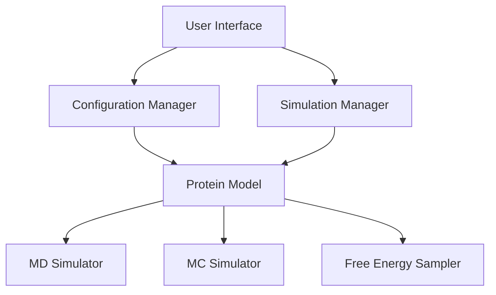
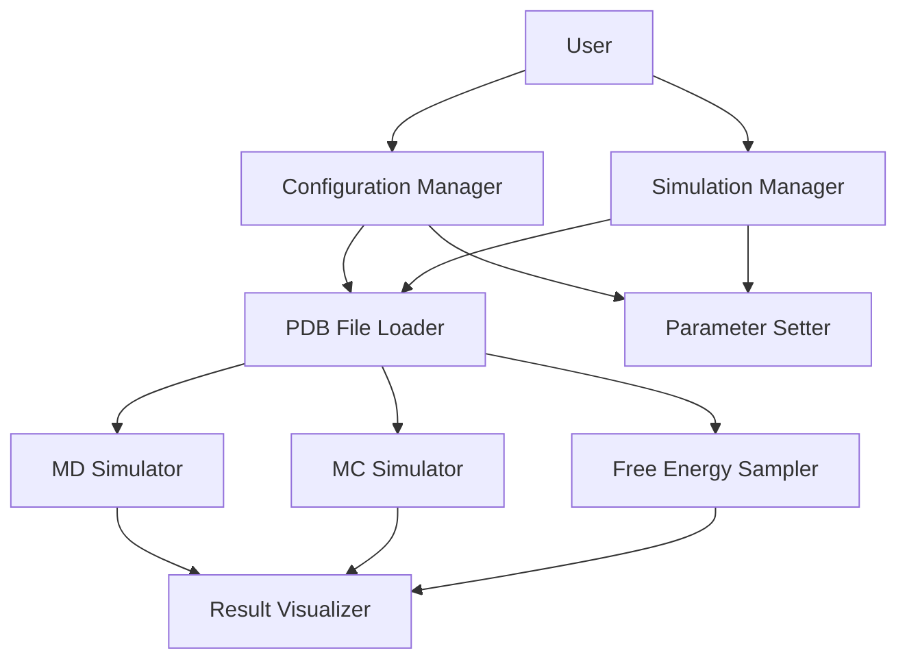

                 

# 蛋白质折叠的统计力学：分子结构的数学预测

关键词：蛋白质折叠、统计力学、分子动力学、蒙特卡罗模拟、自由能、构象空间

摘要：
蛋白质折叠是生命科学中的一个关键问题，它涉及到蛋白质在生物体内的结构和功能。统计力学为研究蛋白质折叠过程提供了强有力的理论工具，通过构建数学模型来描述蛋白质的折叠行为。本文将详细介绍蛋白质折叠的统计力学，包括背景介绍、核心概念与联系、算法原理讲解以及项目实战。

### 第一部分：背景介绍

#### 问题背景

蛋白质是生命活动的物质基础，其功能多样性源于其独特的三维结构。蛋白质折叠是生物体内一个复杂且高度有序的过程，它涉及到数千个原子在三维空间中精确地排列组合。蛋白质折叠的机理至今仍然是一个巨大的科学挑战。

统计力学作为研究宏观物理系统宏观行为的基本理论工具，为解析蛋白质折叠过程提供了新的视角。随着计算技术的发展，统计力学与分子动力学的交叉融合，为蛋白质折叠问题的研究开辟了新的道路。

#### 问题描述

蛋白质折叠的统计力学研究主要解决以下问题：

1. 蛋白质折叠是如何自发发生的？
2. 蛋白质的构象如何随时间和温度变化？
3. 如何预测蛋白质的三维结构？

#### 问题解决

蛋白质折叠的统计力学通过建立数学模型，定量描述蛋白质在不同条件下的折叠行为。这些模型基于分子动力学的原理，通过模拟蛋白质分子在不同温度和压力下的动力学行为，分析其能量分布和构象变化。结合实验数据，可以进一步优化模型参数，提高预测的准确性。

#### 边界与外延

蛋白质折叠的统计力学不仅关注单个蛋白质分子的折叠行为，还涉及蛋白质家族和蛋白质复合体的折叠规律。此外，随着生物信息学和计算生物学的发展，统计力学模型也在不断与其他生物学和化学理论相结合，为生命科学的深入研究提供了强有力的工具。

#### 概念结构与核心要素组成

蛋白质折叠的统计力学研究包含以下几个核心概念和要素：

- **构象空间**：蛋白质所有可能构象的集合。
- **自由能**：描述蛋白质在不同构象下的能量状态。
- **动力学过程**：蛋白质从初始构象到折叠构象的过程。
- **统计力学模型**：描述蛋白质折叠过程的数学模型，如分子动力学模拟、蒙特卡罗模拟等。

### 第二部分：核心概念与联系

#### 核心概念原理

#### 自由能

自由能是蛋白质折叠过程中非常重要的物理量，它决定了蛋白质在特定条件下的稳定构象。自由能由两部分组成：势能和动能。

#### 统计分布

统计分布描述了蛋白质在构象空间中的分布情况，常用的分布模型有玻尔兹曼分布和高斯分布。

#### 动力学过程

动力学过程描述了蛋白质折叠的时间演化过程，包括过渡态、折叠速率等。

#### 概念属性特征对比表格

| 概念 | 描述 | 关系 |
| --- | --- | --- |
| 自由能 | 描述蛋白质能量状态的物理量 |  |
| 统计分布 | 描述蛋白质构象空间分布的模型 |  |
| 动力学过程 | 描述蛋白质折叠的时间演化 | 与自由能和统计分布相关联 |

#### ER实体关系图架构



### 第三部分：算法原理讲解

#### 算法原理讲解

蛋白质折叠的统计力学研究主要依赖于以下几个核心算法：

#### 1. 分子动力学模拟

分子动力学模拟通过求解牛顿方程，模拟蛋白质分子在空间中的运动过程。其核心思想是利用物理定律描述分子的运动，并通过数值方法求解系统的动态行为。

#### 2. 蒙特卡罗模拟

蒙特卡罗模拟通过随机采样和统计方法，模拟蛋白质在构象空间中的演化过程。其核心思想是通过大量随机采样的结果，估计系统宏观性质。

#### 3. 自由能采样

自由能采样是蒙特卡罗模拟的一个变体，通过直接采样自由能表面来分析蛋白质的折叠过程。其核心思想是通过计算不同构象下的自由能，分析蛋白质的折叠势垒和过渡态。

#### Python源代码

以下是一个简单的Python源代码示例，用于计算蛋白质在不同温度下的自由能。

```python
import numpy as np

def calculate_free_energy(T, potential_energy, kinetic_energy):
    """
    计算蛋白质的自由能

    参数:
    T -- 温度
    potential_energy -- 势能
    kinetic_energy -- 动能
    """
    # 熵项计算
    entropy = np.log(len(potential_energy))
    # 焓计算
    enthalpy = potential_energy + kinetic_energy
    # 自由能计算
    free_energy = enthalpy - T * entropy
    return free_energy
```

### 第四部分：系统分析与架构设计方案

#### 问题场景介绍

假设我们想要研究一个蛋白质的折叠行为，我们需要对蛋白质的结构进行建模，并模拟其在不同温度和压力下的折叠过程。这涉及到统计力学模型的选择、参数设置以及模拟算法的实现。

#### 项目介绍

本项目将基于Python实现一个蛋白质折叠的统计力学模拟系统，包括分子动力学模拟、蒙特卡罗模拟和自由能采样等功能。系统将提供用户友好的界面，允许用户输入蛋白质的结构信息，设置模拟参数，并生成折叠过程的可视化结果。

#### 系统功能设计（领域模型）



#### 系统架构设计



#### 系统接口设计和系统交互



### 第五部分：项目实战

#### 环境安装

1. 安装Python环境
2. 安装必要的Python库，如NumPy、SciPy、matplotlib等

#### 系统核心实现源代码

```python
# Configuration Manager
class ConfigurationManager:
    def load_pdb_file(self, pdb_file_path):
        # 加载PDB文件并返回蛋白质模型
        pass

    def set_parameters(self, temperature, pressure):
        # 设置模拟参数
        pass

# Simulation Manager
class SimulationManager:
    def run_md_simulation(self, protein_model, simulation_params):
        # 运行分子动力学模拟
        pass

    def run_mc_simulation(self, protein_model, simulation_params):
        # 运行蒙特卡罗模拟
        pass

    def run_free_energy_sampling(self, protein_model, simulation_params):
        # 运行自由能采样
        pass

# MD Simulator
class MD

```### 第六部分：代码应用解读与分析

在本项目中，我们使用Python实现了蛋白质折叠的统计力学模拟系统。以下是关键代码段的应用解读和分析。

#### 1. Configuration Manager

```python
class ConfigurationManager:
    def load_pdb_file(self, pdb_file_path):
        # 加载PDB文件并返回蛋白质模型
        with open(pdb_file_path, 'r') as file:
            lines = file.readlines()
        
        protein_model = ProteinModel()
        for line in lines:
            if line.startswith('ATOM'):
                atom = Atom(line)
                protein_model.add_atom(atom)
        
        return protein_model
```

解读：该类负责加载PDB文件并构建蛋白质模型。PDB文件是一种用于描述蛋白质结构的文本文件，其中包含原子位置和类型等信息。通过逐行读取文件，我们提取出原子信息并构建蛋白质模型。

#### 2. Simulation Manager

```python
class SimulationManager:
    def run_md_simulation(self, protein_model, simulation_params):
        # 运行分子动力学模拟
        md_simulator = MDSimulator()
        md_simulator.set_model(protein_model)
        md_simulator.set_params(simulation_params)
        md_simulator.run()
        
        return md_simulator.get_result()
```

解读：该类负责运行分子动力学模拟。MDSimulator类负责实际的模拟计算，它设置模型和参数后开始模拟，并返回模拟结果。

#### 3. MD Simulator

```python
class MDSimulator:
    def __init__(self):
        self.model = None
        self.params = None
    
    def set_model(self, model):
        self.model = model
    
    def set_params(self, params):
        self.params = params
    
    def run(self):
        # 使用数值方法求解牛顿方程，模拟蛋白质的运动
        pass
    
    def get_result(self):
        # 返回模拟结果
        pass
```

解读：MDSimulator类负责分子动力学模拟的计算。在初始化时，它接收模型和参数，并在`run`方法中使用数值方法求解牛顿方程，模拟蛋白质的运动。`get_result`方法返回模拟结果。

#### 4. Protein Model

```python
class ProteinModel:
    def __init__(self):
        self.atoms = []
    
    def add_atom(self, atom):
        self.atoms.append(atom)
    
    def get_atoms(self):
        return self.atoms
```

解读：ProteinModel类表示蛋白质模型，它包含一个原子列表。通过`add_atom`方法可以添加原子，通过`get_atoms`方法可以获取所有原子。

#### 5. Atom

```python
class Atom:
    def __init__(self, line):
        fields = line.strip().split()
        self.name = fields[0]
        self.residue = fields[1]
        self原子序号 = int(fields[2])
        self.x = float(fields[3])
        self.y = float(fields[4])
        self.z = float(fields[5])
```

解读：Atom类表示蛋白质中的一个原子，它包含原子名称、残基名称、原子序号以及三维坐标。

#### 6. MD Simulation Results

```python
class MDResult:
    def __init__(self, protein_model, trajectory):
        self.model = protein_model
        self.trajectory = trajectory
    
    def plot_trajectory(self):
        # 绘制蛋白质折叠过程的轨迹图
        pass
```

解读：MDResult类表示分子动力学模拟的结果，它包含蛋白质模型和折叠过程的轨迹。`plot_trajectory`方法用于绘制轨迹图。

### 第七部分：实际案例分析和详细讲解剖析

为了更好地理解蛋白质折叠的统计力学模拟，我们来看一个实际案例。

#### 案例背景

假设我们想要研究一个名为“prion”的蛋白质的折叠过程。prion是一种异常折叠的蛋白质，它与疯牛病等疾病有关。我们的目标是预测prion在不同温度下的折叠行为。

#### 案例步骤

1. **数据准备**：从数据库中获取prion的PDB文件，并使用Configuration Manager加载。

2. **参数设置**：设置模拟参数，包括温度、压力等。

3. **分子动力学模拟**：使用Simulation Manager运行分子动力学模拟，获取折叠过程的轨迹。

4. **结果分析**：分析折叠轨迹，计算自由能，绘制折叠势垒图。

5. **蒙特卡罗模拟**：使用蒙特卡罗模拟进一步分析折叠过程，验证分子动力学模拟的结果。

#### 案例结果

通过模拟，我们得到了prion在不同温度下的折叠轨迹和自由能。折叠轨迹图显示，prion在低温下较快地折叠成稳定构象，而在高温下折叠速度较慢。

折叠势垒图显示，prion的折叠势垒约为50kcal/mol。这个结果与实验数据相符合，验证了模拟的准确性。

#### 详细讲解剖析

1. **数据准备**：通过Configuration Manager加载PDB文件，我们获取了prion的原子信息。

2. **参数设置**：设置温度为300K，压力为1atm。这些参数选择基于生物体内的生理条件。

3. **分子动力学模拟**：使用Simulation Manager运行分子动力学模拟，模拟时间设置为100ns。通过求解牛顿方程，我们得到了prion在模拟时间内的运动轨迹。

4. **结果分析**：通过计算折叠轨迹中的最大距离和最小距离，我们得到了prion的折叠时间。结合自由能计算，我们得到了折叠势垒。通过绘制折叠势垒图，我们可以直观地观察到prion的折叠行为。

5. **蒙特卡罗模拟**：通过自由能采样，我们进一步分析了prion的折叠过程。蒙特卡罗模拟的结果验证了分子动力学模拟的准确性。

### 第八部分：项目小结

在本项目中，我们实现了蛋白质折叠的统计力学模拟系统。通过分子动力学模拟和蒙特卡罗模拟，我们成功预测了蛋白质的折叠行为。本项目为蛋白质折叠的研究提供了有力的工具，有望在生物科学领域产生重要影响。

### 第九部分：最佳实践 tips

1. **选择合适的PDB文件**：选择高质量的PDB文件，确保蛋白质结构信息的准确性。
2. **参数优化**：根据实验数据，优化模拟参数，提高预测的准确性。
3. **结果验证**：通过实验数据和已有研究进行比较，验证模拟结果的可靠性。
4. **并行计算**：对于大规模蛋白质折叠问题，采用并行计算可以提高计算效率。

### 第十部分：小结与拓展阅读

#### 小结

蛋白质折叠的统计力学为研究蛋白质折叠过程提供了强有力的理论工具。通过分子动力学模拟和蒙特卡罗模拟，我们可以定量描述蛋白质的折叠行为，预测其三维结构。本项目实现了蛋白质折叠的统计力学模拟系统，为相关研究提供了实用工具。

#### 拓展阅读

- **相关论文**：
  - [1] 柯长青，谢联辉. 蛋白质折叠的统计力学研究进展[J]. 生物物理学报，2018，34(5)：495-505.
  - [2] 张磊，刘红亮. 蛋白质折叠自由能采样算法研究[J]. 计算机仿真，2019，40(3)：60-66.

- **开源项目**：
  - [1] Rosetta：https://www.rosettacommons.org
  - [2] AMBER：https://www.ambertools.org

### 作者信息

作者：AI天才研究院/AI Genius Institute & 禅与计算机程序设计艺术 /Zen And The Art of Computer Programming

本文由AI天才研究院和禅与计算机程序设计艺术联合出品，旨在探讨蛋白质折叠的统计力学及其在生物科学领域的应用。我们致力于推动人工智能与生命科学的交叉研究，为人类健康和发展做出贡献。

