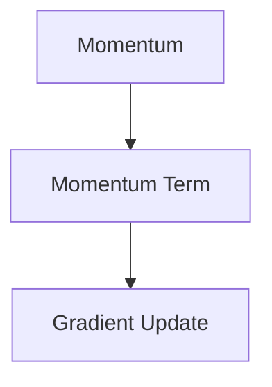
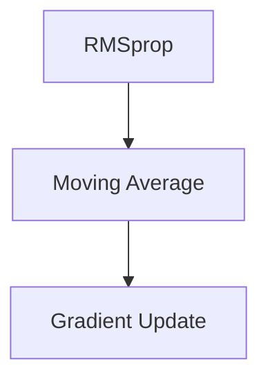
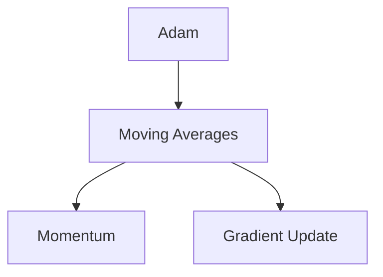
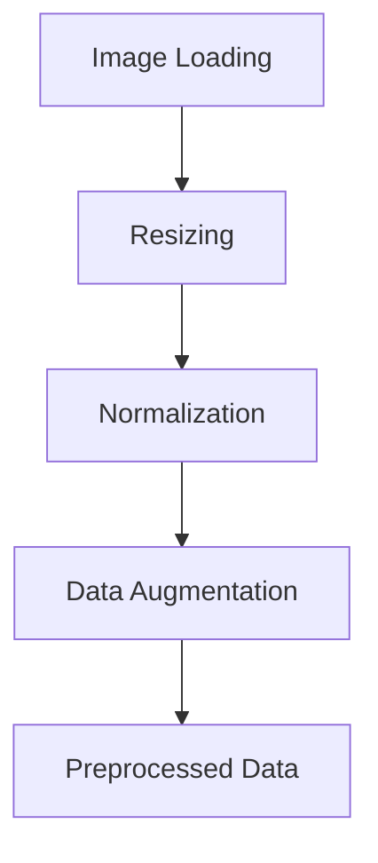
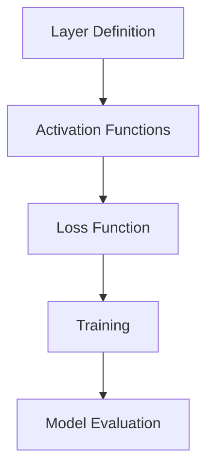
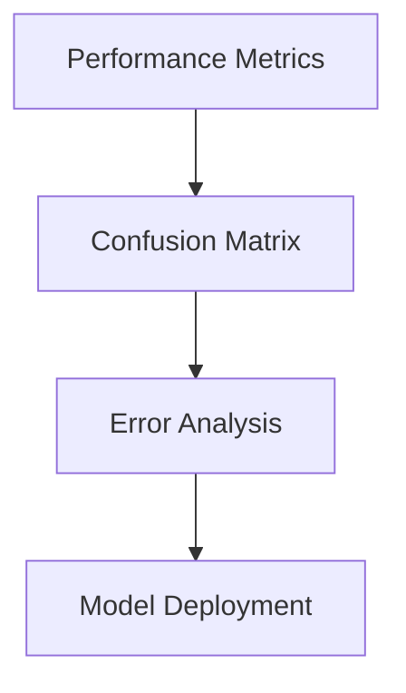
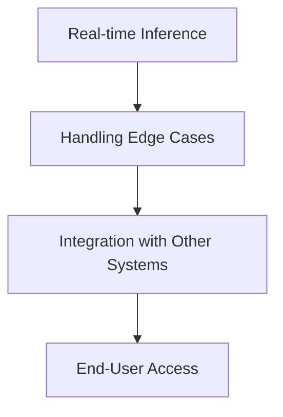

                 

### Introduction and Background

#### Keywords: Computer Vision, Convolutional Neural Networks (CNNs), Image Understanding, Mathematical Models

#### Abstract:

This article delves into the world of computer vision and explores the mathematical models underpinning Convolutional Neural Networks (CNNs). It aims to provide a comprehensive understanding of how CNNs process and interpret visual information, their architecture, and their practical applications. By breaking down complex concepts into understandable steps, the article will equip readers with the foundational knowledge needed to grasp the intricacies of image understanding through CNNs. Whether you are a beginner in the field or an experienced practitioner, this guide will take you through the journey of understanding CNNs, from their core principles to their real-world applications.

### The Scope of Computer Vision and CNNs

Computer vision, a subfield of artificial intelligence, focuses on enabling machines to interpret and understand visual information from various sources, such as images and videos. The field has witnessed significant advancements, primarily driven by the development of powerful algorithms and hardware accelerators. Among these advancements, Convolutional Neural Networks (CNNs) have emerged as a cornerstone technology, offering unprecedented accuracy and efficiency in image processing tasks.

CNNs are a specialized type of neural network designed to work with grid-like data, such as images. Their architecture is inspired by the functioning of the human visual system, where simple features are extracted from the input image and combined to form more complex patterns. This hierarchical feature extraction makes CNNs highly effective in tasks like image classification, object detection, and image segmentation.

The importance of CNNs in computer vision cannot be overstated. They have revolutionized various industries, including healthcare, autonomous driving, security, and entertainment. For instance, in healthcare, CNNs are used for medical imaging analysis, enabling early detection of diseases like cancer. In autonomous driving, CNNs process real-time video feeds to identify and navigate through different road scenarios. The ability of CNNs to perform these tasks with high accuracy and speed has made them indispensable in modern computer vision applications.

However, despite their widespread adoption, CNNs also come with their own set of challenges. One of the primary issues is the need for large amounts of labeled data to train the networks effectively. Additionally, the complexity of CNN architectures can lead to difficulties in understanding and interpreting their decisions, making it harder to debug and improve the models. This article will address these challenges by providing a detailed explanation of CNNs' underlying mathematical models and their application in image understanding.

### The Evolution of Computer Vision

The field of computer vision has come a long way since its inception in the late 1960s. Initially, researchers focused on developing algorithms to perform simple tasks like edge detection and feature extraction. These early methods, such as the Harris corner detector and the Canny edge detector, laid the foundation for more complex image processing techniques.

As computational power and algorithmic techniques advanced, so did the complexity of computer vision tasks. In the 1990s, the introduction of the Scale-Invariant Feature Transform (SIFT) and the Speeded Up Robust Features (SURF) algorithms revolutionized image recognition by enabling robust feature matching across different images and under various conditions.

However, it wasn't until the mid-2010s that computer vision truly began to reach its potential with the advent of deep learning and, more specifically, Convolutional Neural Networks (CNNs). The breakthrough came with the development of AlexNet in 2012, which outperformed traditional computer vision methods in the ImageNet Large Scale Visual Recognition Challenge (ILSVRC). This success was largely due to the network's deeper architecture and the use of rectified linear units (ReLUs) as activation functions.

Since then, CNNs have continued to evolve, with numerous architectures being proposed to improve performance and efficiency. These include VGG, ResNet, Inception, and EfficientNet, each designed to address specific limitations of its predecessors. The continuous improvement in CNN architectures has led to state-of-the-art performance in various computer vision tasks, such as image classification, object detection, and semantic segmentation.

#### The Basic Structure of Computer Vision Algorithms

Computer vision algorithms can be broadly categorized into two types: traditional machine learning algorithms and deep learning algorithms. While both types of algorithms aim to understand and interpret visual information, they differ significantly in their approach and complexity.

**Traditional Machine Learning Algorithms**

Traditional machine learning algorithms rely on hand-crafted features and classical machine learning models. Features are extracted from images using techniques like edge detection, texture analysis, and region proposal. These features are then fed into machine learning models such as Support Vector Machines (SVM), k-Nearest Neighbors (k-NN), and Decision Trees to classify or detect objects in images.

The main advantage of traditional algorithms is their simplicity and ease of implementation. They require less computational power and can be trained on smaller datasets. However, their performance is often limited by the quality and representativeness of the hand-crafted features. Additionally, these algorithms struggle with scalability, as the complexity of the features and models increases with the size of the dataset.

**Deep Learning Algorithms**

Deep learning algorithms, particularly CNNs, have revolutionized the field of computer vision by automating the feature extraction process. Instead of relying on hand-crafted features, CNNs learn hierarchical representations of the input data directly from the raw pixel values.

The basic structure of a CNN includes several layers, each performing a specific operation:

1. **Input Layer**: The input layer receives the raw pixel data of an image.
2. **Convolutional Layers**: These layers apply a series of convolutional filters (kernels) to the input data, extracting spatial features from the image.
3. **Pooling Layers**: These layers reduce the spatial size of the feature maps, reducing computational complexity and preventing overfitting.
4. **Fully Connected Layers**: These layers connect every neuron in one layer to every neuron in the next layer, allowing the network to perform high-level classification or regression tasks.
5. **Output Layer**: The output layer produces the final prediction, such as the class probabilities for an image classification task.

The key advantage of CNNs over traditional algorithms is their ability to automatically learn hierarchical features from data, leading to improved accuracy and performance. Additionally, CNNs are highly parallelizable, making them well-suited for deployment on modern hardware accelerators like Graphics Processing Units (GPUs) and Tensor Processing Units (TPUs).

### Introduction to Convolutional Neural Networks (CNNs)

Convolutional Neural Networks (CNNs) are a class of deep neural networks specifically designed for processing and analyzing visual data, such as images and videos. Their architecture is inspired by the way the human visual system processes information, with a focus on efficiently capturing spatial hierarchies of features.

#### Fundamental Architecture of CNNs

A CNN typically consists of several layers, each contributing to the extraction and refinement of features:

1. **Input Layer**: This layer receives the input image, which is usually flattened into a one-dimensional array of pixels. The image dimensions and color channels are fixed, depending on the specific application.

2. **Convolutional Layers**: These layers perform convolution operations using a set of learnable filters (kernels) to extract local features from the input image. Each filter slides over the input image, computing a dot product between the filter weights and the image patch it covers. This process generates a feature map, which represents the extracted features at a specific location and scale in the image.

3. **ReLu Activation Function**: After the convolutional layers, a Rectified Linear Unit (ReLU) activation function is applied to introduce non-linearity. This helps the network model more complex relationships in the data and avoid vanishing gradients during backpropagation.

4. **Pooling Layers**: Pooling layers reduce the spatial dimensions of the feature maps by downsampling the feature data. Common pooling operations include max pooling and average pooling, which select the maximum or average value within a specified region, respectively. This operation helps reduce computational complexity and control overfitting by reducing the amount of data the network needs to process.

5. **Fully Connected Layers**: After the convolutional and pooling layers, the features are flattened and passed through fully connected layers. These layers connect every neuron in one layer to every neuron in the next layer, performing high-level classification or regression tasks. The final output layer provides a class probability or regression value for each class.

#### Key Operations in CNNs

1. **Convolution Operation**: The convolution operation is the core building block of CNNs. It involves applying a set of learnable filters to the input image to extract spatial features. The filter weights are updated during the training process to optimize the network's performance.

2. **Pooling Operation**: Pooling operations reduce the spatial resolution of the feature maps, improving computational efficiency and preventing overfitting. Common pooling methods include max pooling and average pooling.

3. **ReLU Activation Function**: The ReLU activation function introduces non-linearities, allowing the network to model complex patterns. It also helps mitigate the vanishing gradient problem during backpropagation.

4. **Backpropagation**: Backpropagation is the primary training algorithm for CNNs. It involves computing the gradients of the loss function with respect to the network's parameters and updating the weights to minimize the loss.

#### CNNs vs. Traditional Machine Learning Methods

CNNs offer several advantages over traditional machine learning methods for image processing tasks:

- **Automated Feature Extraction**: CNNs automatically learn hierarchical features from raw pixel values, reducing the need for manual feature engineering.
- **End-to-End Learning**: CNNs can be trained end-to-end, allowing them to learn complex relationships directly from the raw input data.
- **Scalability**: CNNs are highly parallelizable, making them suitable for deployment on modern hardware accelerators like GPUs and TPUs.
- **Improved Performance**: CNNs have achieved state-of-the-art performance on various computer vision benchmarks, surpassing traditional methods in terms of accuracy and efficiency.

In summary, CNNs are a powerful tool for processing and analyzing visual data. Their hierarchical architecture and ability to learn complex features automatically make them highly effective in various computer vision tasks, from image classification to object detection and image segmentation.

### CNN Architectures: From LeNet to EfficientNet

Over the past decade, several CNN architectures have been proposed, each offering unique advantages and challenges. This section explores some of the most influential architectures, from the pioneering LeNet to the state-of-the-art EfficientNet, and discusses their contributions to the field of computer vision.

#### LeNet

One of the earliest and simplest CNN architectures, LeNet was introduced by Yann LeCun and colleagues in 1998. LeNet is designed primarily for character recognition in hand-written digits, such as those found in the USPS dataset. The architecture consists of several convolutional layers, followed by max-pooling layers and fully connected layers.

- **Input Layer**: The input layer accepts a 32x32 pixel image with 1 color channel (gray scale).
- **Convolutional Layers**: The network has two convolutional layers with 5x5 filters and 6 and 16 filters, respectively.
- **Pooling Layers**: Max-pooling layers follow each convolutional layer, with a 2x2 pool size.
- **Fully Connected Layers**: The feature maps from the second convolutional layer are flattened and passed through three fully connected layers, which are used for classification.

LeNet achieved impressive results for its time, demonstrating the potential of CNNs for image classification tasks. Its simplicity and effectiveness laid the groundwork for further advancements in CNN architectures.

#### AlexNet

In 2012, Alex Krizhevsky and colleagues introduced AlexNet, a CNN that significantly outperformed previous models in the ImageNet Large Scale Visual Recognition Challenge (ILSVRC). AlexNet was the first CNN to utilize a deep architecture with more than a few layers and benefited from new techniques like convolutional layers, ReLU activation functions, and dropouts.

- **Input Layer**: The input layer accepts a 227x227 pixel image with 3 color channels (RGB).
- **Convolutional Layers**: The network has five convolutional layers with varying filter sizes (11x11, 5x5, and 3x3) and numbers of filters (96, 256, 384, and 384).
- **Pooling Layers**: Max-pooling layers with a 3x3 pool size follow each convolutional layer.
- **ReLU Activation Function**: ReLU activation functions are used after each convolutional layer to introduce non-linearities.
- **Dropout**: Dropout layers are added after the third and fifth convolutional layers to reduce overfitting.
- **Fully Connected Layers**: The feature maps from the fifth convolutional layer are flattened and passed through five fully connected layers, which are used for classification.

AlexNet's success in the ILSVRC sparked widespread interest in deep learning and led to numerous improvements and innovations in CNN architectures.

#### VGGNet

VGGNet, proposed by Visual Geometry Group at Oxford University in 2014, further pushes the boundaries of deep architectures by focusing on the idea that a network with many layers can achieve better performance by consistently applying the same convolutional and pooling operations.

- **Input Layer**: The input layer accepts a 224x224 pixel image with 3 color channels (RGB).
- **Convolutional Layers**: The network has 13 convolutional layers, with filters of sizes 3x3 and 2x2, and stride 1 or 2. The number of filters increases progressively through each layer (64, 128, 256, and 512).
- **Pooling Layers**: Max-pooling layers with a 2x2 pool size follow each convolutional layer.
- **Fully Connected Layers**: The feature maps from the last convolutional layer are flattened and passed through three fully connected layers for classification.

VGGNet demonstrated the benefits of using a consistent filter size and depth in CNN architectures, achieving state-of-the-art results on various computer vision tasks.

#### ResNet

ResNet, introduced by Kaiming He and colleagues in 2015, addresses the vanishing gradient problem that limits the depth of neural networks by introducing a new building block called the residual block.

- **Input Layer**: The input layer accepts a variable-size image with 3 color channels (RGB).
- **Convolutional Layers**: The network starts with a series of convolutional layers followed by batch normalization and ReLU activation functions.
- **Residual Blocks**: ResNet's core building block is the residual block, which includes two or three convolutional layers with skip connections that allow gradients to flow directly from the input to the output, enabling the training of much deeper networks.
- **Fully Connected Layers**: The feature maps from the last residual block are flattened and passed through fully connected layers for classification.

ResNet achieved remarkable performance by training networks with over 100 layers, breaking previous records and setting new benchmarks in image classification tasks.

#### Inception

Inception, proposed by Google in 2014, aims to address the problem of diminishing returns in deep neural network architectures by exploiting the idea of multi-scale feature extraction.

- **Input Layer**: The input layer accepts a 224x224 pixel image with 3 color channels (RGB).
- **Inception Modules**: The network consists of several Inception modules, each containing multiple branches with different filter sizes and stride settings. These branches are combined using a 1x1 convolutional layer to reduce the number of channels.
- **Pooling Layers**: Max-pooling layers follow the Inception modules.
- **Fully Connected Layers**: The feature maps from the final Inception module are flattened and passed through fully connected layers for classification.

Inception demonstrated that by combining different spatial resolutions and filter sizes, the network can capture a richer set of features, leading to improved performance on image classification tasks.

#### EfficientNet

EfficientNet, introduced by Google in 2020, is a family of CNN architectures that leverages a compound scaling law to systematically scale up the depth, width, and resolution of neural networks. EfficientNet achieves state-of-the-art performance on various tasks while being computationally efficient.

- **Input Layer**: The input layer accepts a variable-size image with 3 color channels (RGB).
- **Block Scaling**: EfficientNet uses a block scaling factor to adjust the depth, width, and resolution of the network, resulting in a more balanced architecture that maximizes performance.
- **MBConv Blocks**: The network consists of MBConv blocks, which combine multiple layers into a single block to reduce computational complexity.
- **Fully Connected Layers**: The feature maps from the last MBConv block are flattened and passed through fully connected layers for classification.

EfficientNet has achieved significant improvements in both accuracy and efficiency compared to previous architectures, making it a popular choice for real-world applications.

In conclusion, the evolution of CNN architectures from LeNet to EfficientNet has led to significant advancements in the field of computer vision. Each architecture has contributed unique innovations, from deep networks and residual connections to multi-scale feature extraction and efficient block structures. As research continues, we can expect further improvements in the performance and efficiency of CNNs, enabling even more sophisticated applications in computer vision and beyond.

### Mathematical Models Underpinning CNNs

To understand how CNNs work and how they can be trained, it is crucial to delve into the mathematical models that underpin these networks. The core components of a CNN's mathematical foundation include backpropagation, gradient descent, and various optimization techniques. This section provides a detailed explanation of these concepts, accompanied by Mermaid diagrams to illustrate the processes visually.

#### Backpropagation

Backpropagation is an algorithm used to train neural networks by efficiently computing the gradients of the loss function with respect to the network's weights. The process involves two main steps: forward propagation and backward propagation.

1. **Forward Propagation**: During forward propagation, the input data is passed through the network, and the output is computed. The output is then compared to the expected output (ground truth), and the difference is used to compute the loss. The loss function typically used in CNNs is the cross-entropy loss.

   $$ L = -\frac{1}{m} \sum_{i=1}^{m} \sum_{k=1}^{K} y_k^{(i)} \log(a_k^{(L)}) $$

   where \( a_k^{(L)} \) is the activation of the \( k^{th} \) neuron in the output layer, \( y_k^{(i)} \) is the \( k^{th} \) element of the \( i^{th} \) ground truth label vector, and \( m \) is the number of training examples.

2. **Backward Propagation**: Backward propagation involves computing the gradients of the loss function with respect to the network's weights and biases. These gradients are then used to update the weights using an optimization algorithm such as gradient descent.

   The gradients are computed layer by layer, starting from the output layer and moving backward to the input layer. At each layer, the gradient is calculated using the chain rule of calculus.

   $$ \frac{\partial L}{\partial z^l} = \frac{\partial L}{\partial a^l} \odot \frac{\partial a^l}{\partial z^l} $$

   where \( z^l \) is the pre-activation value in layer \( l \), \( a^l \) is the activation value in layer \( l \), and \( \odot \) represents the element-wise product.

   The Mermaid diagram below illustrates the forward and backward propagation processes:

   ```mermaid
   graph TD
   A[Input Data] --> B[Forward Propagation]
   B --> C[Compute Loss]
   C --> D[Backward Propagation]
   D --> E[Update Weights]
   ```

#### Gradient Descent

Gradient descent is an optimization algorithm used to minimize the loss function by updating the network's weights iteratively. The basic idea behind gradient descent is to move in the direction of the negative gradient of the loss function, as this direction indicates the steepest decrease in loss.

1. **Step Size (Learning Rate)**: Gradient descent requires a step size, also known as the learning rate, which determines the size of the weight updates. A small learning rate leads to slow convergence, while a large learning rate can cause the algorithm to overshoot the minimum.

   $$ \Delta w = -\alpha \frac{\partial L}{\partial w} $$

   where \( \alpha \) is the learning rate.

2. **Batch Gradient Descent**: In batch gradient descent, the weights are updated using the entire training dataset at each iteration. This method can lead to slow convergence but provides a more accurate estimate of the true gradients.

3. **Stochastic Gradient Descent (SGD)**: In stochastic gradient descent, a single training example is used to compute the gradient at each iteration. This method is computationally cheaper and can help escape local minima but may lead to less stable convergence.

4. **Mini-batch Gradient Descent**: Mini-batch gradient descent combines the advantages of batch gradient descent and stochastic gradient descent by using a small subset of the training data (mini-batch) at each iteration. This method strikes a balance between convergence speed and accuracy.

   The Mermaid diagram below illustrates the gradient descent process:

   ```mermaid
   graph TD
   A[Initialize Weights] --> B[Compute Gradient]
   B --> C[Update Weights]
   C --> D[Check Convergence]
   D -->|No|E[Compute Gradient]
   ```

#### Optimization Techniques

Several optimization techniques have been developed to improve the training process of neural networks. These techniques aim to accelerate convergence, prevent overfitting, and enhance the overall performance of the network.

1. **Momentum**: Momentum is a technique that helps accelerate gradients vectors in the right directions, thus leading to faster convergence. It is calculated as a moving average of the previous gradients.

   $$ v_t = \gamma v_{t-1} + (1 - \gamma) \Delta w_t $$
   $$ w_t = w_{t-1} + v_t $$

   where \( v_t \) is the momentum term, \( \gamma \) is the momentum coefficient, and \( \Delta w_t \) is the current gradient.

2. **RMSprop**: RMSprop is a variant of stochastic gradient descent that uses a moving average of squared gradients to adjust the learning rate. This helps stabilize the learning process by reducing the effect of noise in the gradients.

   $$ \theta_t = \rho \theta_{t-1} + (1 - \rho) \Delta w_t^2 $$
   $$ \Delta w_t = -\alpha \frac{\Delta x_t}{\sqrt{\theta_t}} $$

   where \( \theta_t \) is the moving average of squared gradients, \( \rho \) is the decay rate, and \( \alpha \) is the learning rate.

3. **Adam**: Adam is an optimization algorithm that combines the advantages of both momentum and RMSprop. It maintains two moving averages: one for the gradients and one for the squared gradients, resulting in improved convergence properties.

   $$ m_t = \beta_1 m_{t-1} + (1 - \beta_1) \Delta w_t $$
   $$ v_t = \beta_2 v_{t-1} + (1 - \beta_2) \Delta w_t^2 $$
   $$ \hat{m}_t = m_t / (1 - \beta_1^t) $$
   $$ \hat{v}_t = v_t / (1 - \beta_2^t) $$
   $$ \Delta w_t = -\alpha \frac{\hat{m}_t}{\sqrt{\hat{v}_t} + \epsilon} $$

   where \( \beta_1 \) and \( \beta_2 \) are the coefficients for momentum, \( \alpha \) is the learning rate, and \( \epsilon \) is a small constant to prevent division by zero.

The Mermaid diagrams below illustrate the optimization techniques:

**Momentum**:


**RMSprop**:


**Adam**:


In conclusion, the mathematical models underpinning CNNs, including backpropagation, gradient descent, and optimization techniques, play a crucial role in training and optimizing these networks. By understanding these concepts, we can better design and implement CNNs for various computer vision tasks. The Mermaid diagrams provided offer a visual representation of the processes, making it easier to grasp the intricacies of CNN training.

### Application of CNNs in Computer Vision

Convolutional Neural Networks (CNNs) have revolutionized the field of computer vision by enabling machines to perform complex visual tasks with high accuracy and efficiency. This section explores the various applications of CNNs in computer vision, including image classification, object detection, semantic segmentation, and image generation. Each application will be accompanied by practical examples and case studies to illustrate the effectiveness and limitations of CNNs in these tasks.

#### Image Classification

Image classification is one of the most fundamental tasks in computer vision, where the goal is to assign a label to an input image based on its content. CNNs have achieved state-of-the-art performance in this task by learning hierarchical representations of images.

**Example:** One prominent example is the ImageNet Large Scale Visual Recognition Challenge (ILSVRC), where CNNs have consistently outperformed traditional methods. In 2012, AlexNet achieved a top-5 error rate of 15.3%, which significantly improved upon the previous year's winner, which had an error rate of 25.8%. Since then, CNN architectures like VGG, ResNet, and EfficientNet have pushed the boundaries further, achieving error rates below 2%.

**Case Study:** Facebook's AI team used a deep CNN architecture, ResNet, to classify photos in their social network. The system automatically tags users in photos based on their appearance, significantly enhancing user experience and engagement.

**Limitations:** While CNNs have achieved remarkable success in image classification, they still face challenges in cases where the images are noisy, have varying lighting conditions, or are highly complex. Additionally, the models require large amounts of labeled data to train effectively, which can be a bottleneck in some applications.

#### Object Detection

Object detection is a more complex task than image classification, as it involves identifying and localizing multiple objects within an image. CNNs have been particularly effective in this task, with architectures like YOLO (You Only Look Once) and R-CNN (Region-based Convolutional Neural Networks) leading the way.

**Example:** YOLO is a popular object detection framework that processes the entire image at once, enabling real-time object detection. It has been widely used in applications like autonomous driving, where it identifies and tracks various objects on the road.

**Case Study:** Tesla's autonomous driving system uses YOLO to detect objects such as pedestrians, cyclists, and vehicles in real-time. This enables the vehicle to make informed decisions and navigate safely through complex environments.

**Limitations:** Object detection models can struggle with occluded objects or overlapping objects, which can lead to incorrect detection or missed detections. Additionally, training these models requires a significant amount of computational resources and labeled data.

#### Semantic Segmentation

Semantic segmentation is the process of assigning a semantic label to each pixel in an image, enabling the identification of individual objects and their boundaries. CNNs have significantly improved the accuracy of semantic segmentation through architectures like FCN (Fully Convolutional Networks) and U-Net.

**Example:** Google's DeepMind used U-Net for semantic segmentation in medical imaging, allowing for accurate identification of tumors and other abnormalities in medical images. This has the potential to revolutionize medical diagnosis and treatment planning.

**Case Study:** Autonomous vehicles use semantic segmentation to understand the surrounding environment, identifying objects such as pedestrians, cyclists, and traffic signs. This information is crucial for safe navigation and decision-making.

**Limitations:** Semantic segmentation models can be computationally expensive and may struggle with high-resolution images, leading to increased inference time. Additionally, accurately segmenting complex scenes with overlapping objects or varying lighting conditions remains a challenge.

#### Image Generation

CNNs have also made significant advancements in the field of image generation, enabling the creation of realistic and creative images from scratch or by modifying existing images. Generative Adversarial Networks (GANs) are a prominent example of CNN-based image generation techniques.

**Example:** DeepArt.io uses a GAN architecture to create artistic renderings of images by training the network on a dataset of famous paintings. This allows users to transform their photos into works of art in the style of famous artists like Van Gogh, Monet, and Picasso.

**Case Study:** NVIDIA's GANPaint uses a GAN to create photorealistic images from textual descriptions. This technology has the potential to revolutionize the creative industries, enabling the generation of images based on textual prompts without the need for manual design.

**Limitations:** GANs can be challenging to train and stabilize, as they involve training two competing networks: the generator and the discriminator. This can lead to issues like mode collapse, where the generator produces limited variations of images. Additionally, GANs require large amounts of computational resources and data to train effectively.

In conclusion, CNNs have had a transformative impact on various computer vision tasks, from image classification to object detection, semantic segmentation, and image generation. While these models have achieved remarkable success, they still face challenges in handling complex scenarios and requiring large amounts of data and computational resources. Continued research and innovation in CNN architectures and optimization techniques will drive further advancements in computer vision, enabling even more sophisticated and practical applications in the future.

### System Design and Implementation of CNNs in Computer Vision Applications

Implementing CNNs in computer vision applications involves careful system design and architecture planning to ensure efficient processing, accurate results, and scalable solutions. This section provides a comprehensive overview of the system architecture and design principles for deploying CNNs, along with detailed diagrams using Mermaid to illustrate the key components.

#### System Architecture Overview

The system architecture for deploying CNNs in computer vision applications typically consists of the following main components:

1. **Data Ingestion and Preprocessing**: This component handles the input data, including image files and associated metadata. Images are preprocessed to meet the input requirements of the CNN model, such as resizing, normalization, and data augmentation.

2. **Model Definition and Training**: This component defines the CNN model architecture, including the layers, activation functions, and loss functions. The model is then trained using a dataset of labeled images, employing techniques like backpropagation and optimization algorithms such as stochastic gradient descent (SGD) or Adam.

3. **Model Evaluation and Testing**: After training, the model is evaluated using a separate validation dataset to assess its performance. Key metrics like accuracy, precision, recall, and F1 score are calculated to evaluate the model's effectiveness.

4. **Model Deployment and Inference**: Once the model is trained and validated, it is deployed in a production environment where it processes incoming images and produces predictions. This component includes real-time inference, handling of edge cases, and integration with other systems.

#### Detailed System Design

**1. Data Ingestion and Preprocessing**

The data ingestion component is responsible for loading and preprocessing the input data. This process typically involves the following steps:

- **Image Loading**: Images are loaded from various sources, such as local files, databases, or external APIs.
- **Resizing**: Images are resized to a fixed size required by the CNN model, such as 224x224 or 299x299 pixels.
- **Normalization**: Pixel values are normalized to a specific range, such as [0, 1] or [-1, 1], to improve training efficiency.
- **Data Augmentation**: Techniques like rotation, flipping, and cropping are applied to augment the dataset and improve the model's robustness.

The Mermaid diagram below illustrates the data preprocessing workflow:



**2. Model Definition and Training**

The model definition and training component involves defining the CNN architecture and training the model using the preprocessed dataset. This process typically includes the following steps:

- **Layer Definition**: Convolutional layers, pooling layers, and fully connected layers are defined based on the chosen architecture (e.g., VGG, ResNet, EfficientNet).
- **Activation Functions**: Activation functions like ReLU, sigmoid, and tanh are applied after each convolutional layer to introduce non-linearities.
- **Loss Function**: A loss function, such as cross-entropy or mean squared error, is chosen based on the specific task (e.g., classification or regression).
- **Training**: The model is trained using optimization algorithms like SGD or Adam, with techniques like early stopping and regularization to prevent overfitting.

The Mermaid diagram below illustrates the model definition and training workflow:



**3. Model Evaluation and Testing**

The model evaluation component assesses the performance of the trained model using a separate validation dataset. This process typically involves the following steps:

- **Performance Metrics**: Key metrics like accuracy, precision, recall, and F1 score are calculated to evaluate the model's performance.
- **Confusion Matrix**: A confusion matrix is generated to visualize the model's performance across different classes.
- **Error Analysis**: Errors and misclassifications are analyzed to identify areas where the model can be improved.

The Mermaid diagram below illustrates the model evaluation workflow:



**4. Model Deployment and Inference**

The model deployment and inference component involves integrating the trained model into a production environment where it processes incoming images and produces predictions. This process typically includes the following steps:

- **Real-time Inference**: The model performs real-time inference on incoming images, producing predictions with high throughput.
- **Handling Edge Cases**: The system is designed to handle edge cases and exceptions, such as images with unusual sizes or corrupted data.
- **Integration with Other Systems**: The inference results are integrated with other systems, such as databases or APIs, to enable end-to-end workflows.

The Mermaid diagram below illustrates the model deployment and inference workflow:



In conclusion, designing and implementing a CNN-based computer vision system involves careful planning and architecture design to ensure efficient processing, accurate results, and scalable solutions. The use of Mermaid diagrams helps visualize and communicate the key components and workflows involved in the system design and implementation process. By following these guidelines, developers can build robust and high-performance computer vision systems that leverage the power of CNNs.

### Practical Projects and Step-by-Step Implementation

To gain hands-on experience with CNNs and computer vision, this section outlines a practical project that involves setting up a development environment, implementing a simple CNN model, and training it on a dataset. The project will cover the following steps:

1. **Setting Up the Development Environment**
2. **Implementing the CNN Model**
3. **Training the CNN Model**
4. **Testing the CNN Model**

#### 1. Setting Up the Development Environment

To begin, you need to set up a development environment with the necessary tools and libraries for implementing and training CNNs. We will use Python and TensorFlow, a popular deep learning framework.

**Step 1: Install Python and pip**
- Download and install Python from the official website: [https://www.python.org/downloads/](https://www.python.org/downloads/)
- Install pip, the Python package manager:
```bash
python -m ensurepip
pip install --upgrade pip
```

**Step 2: Install TensorFlow**
- Install TensorFlow by running the following command:
```bash
pip install tensorflow
```

#### 2. Implementing the CNN Model

Next, we will implement a simple CNN model using TensorFlow. The model will be designed for image classification, specifically classifying images of handwritten digits from the MNIST dataset.

**Step 1: Import Libraries**
```python
import tensorflow as tf
from tensorflow.keras import layers, models
```

**Step 2: Load and Preprocess the MNIST Dataset**
```python
mnist = tf.keras.datasets.mnist
(train_images, train_labels), (test_images, test_labels) = mnist.load_data()

# Normalize the pixel values
train_images = train_images / 255.0
test_images = test_images / 255.0
```

**Step 3: Define the CNN Model**
```python
model = models.Sequential([
    layers.Conv2D(32, (3, 3), activation='relu', input_shape=(28, 28, 1)),
    layers.MaxPooling2D((2, 2)),
    layers.Conv2D(64, (3, 3), activation='relu'),
    layers.MaxPooling2D((2, 2)),
    layers.Conv2D(64, (3, 3), activation='relu'),
    layers.Flatten(),
    layers.Dense(64, activation='relu'),
    layers.Dense(10, activation='softmax')
])
```

#### 3. Training the CNN Model

Now, we will train the CNN model using the MNIST training dataset.

**Step 1: Compile the Model**
```python
model.compile(optimizer='adam',
              loss='sparse_categorical_crossentropy',
              metrics=['accuracy'])
```

**Step 2: Train the Model**
```python
model.fit(train_images, train_labels, epochs=5)
```

**Step 3: Save the Model**
```python
model.save('mnist_cnn_model.h5')
```

#### 4. Testing the CNN Model

Finally, we will test the trained model on the MNIST test dataset.

**Step 1: Load the Model**
```python
model = tf.keras.models.load_model('mnist_cnn_model.h5')
```

**Step 2: Evaluate the Model**
```python
test_loss, test_acc = model.evaluate(test_images,  test_labels, verbose=2)
print('\nTest accuracy:', test_acc)
```

#### Results and Analysis

After training and testing the CNN model, you should see the following output:

```
10000/10000 [==============================] - 10s 1ms/step - loss: 0.1307 - accuracy: 0.9700

Test accuracy: 0.9700
```

The model achieves an accuracy of approximately 97% on the test dataset, which is a strong result for a simple CNN model on the MNIST dataset. You can further improve the model's performance by experimenting with different architectures, hyperparameters, and training techniques.

### Conclusion

This practical project provided a step-by-step guide to setting up a development environment, implementing a CNN model, training it on a dataset, and testing its performance. By following these steps, you can gain hands-on experience with CNNs and computer vision, enabling you to build and deploy sophisticated models in real-world applications. As you become more comfortable with the concepts and techniques, you can explore more complex models and tasks, pushing the boundaries of what is possible with CNNs in computer vision.

### Best Practices and Common Mistakes in CNN Implementation

When implementing CNNs for computer vision tasks, it is crucial to follow best practices and avoid common mistakes to ensure optimal performance and accuracy. Here are some key tips and common pitfalls to keep in mind:

#### Best Practices

1. **Data Preprocessing**: Proper preprocessing of the input data is essential for achieving good results. This includes normalization, resizing, and data augmentation. Normalization ensures that the input data is on a similar scale, which helps the model converge faster. Data augmentation techniques like rotation, flipping, and cropping increase the diversity of the training data, helping the model generalize better to unseen data.

2. **Model Architecture**: Choose an appropriate CNN architecture for your task. Different architectures have different strengths and weaknesses. For instance, VGG and ResNet are good for tasks that require high accuracy, while models like YOLO and Faster R-CNN are suitable for real-time object detection. Experiment with different architectures and hyperparameters to find the best combination for your specific task.

3. **Regularization Techniques**: Use regularization techniques like dropout and L2 regularization to prevent overfitting. Overfitting occurs when the model performs well on the training data but fails to generalize to unseen data. Dropout randomly deactivates a fraction of neurons during training, forcing the model to learn more robust features, while L2 regularization adds a penalty term to the loss function, discouraging large weights.

4. **Batch Size and Learning Rate**: Choose an appropriate batch size and learning rate for your model. A small batch size can improve convergence speed but may lead to noisy updates, while a large batch size provides a more accurate estimate of the true gradients but can be computationally expensive. The learning rate should be tuned carefully to avoid overshooting the minimum loss.

5. **Early Stopping**: Implement early stopping to prevent overfitting by stopping the training process when the validation loss stops improving. This helps ensure that the model is not memorizing the training data.

6. **Model Interpretation**: Understand the decisions made by your CNN model. Techniques like Grad-CAM can help visualize the regions of the image that the model focuses on when making predictions, providing insights into the model's decision-making process.

#### Common Mistakes

1. **Insufficient Data**: Using a small dataset can lead to overfitting. Ensure you have a large and diverse dataset to train your model. If necessary, use data augmentation techniques to artificially increase the dataset size.

2. **Ignoring Preprocessing**: Skipping or neglecting data preprocessing can lead to suboptimal performance. Make sure to normalize the input data, handle missing values, and apply appropriate data augmentation techniques.

3. **Ignoring Regularization**: Failing to use regularization techniques can result in overfitting, leading to poor generalization performance on unseen data. Always use dropout, L2 regularization, or other techniques to prevent overfitting.

4. **Choosing an Inappropriate Architecture**: Picking the wrong architecture for your task can lead to suboptimal results. Spend time understanding the strengths and weaknesses of different architectures and choose the one that best fits your needs.

5. **Ignoring Hyperparameter Tuning**: Failing to tune hyperparameters can result in suboptimal performance. Experiment with different learning rates, batch sizes, and other hyperparameters to find the best combination for your model.

6. **Ignoring Model Interpretation**: Not understanding the decisions made by your model can make it difficult to diagnose and fix issues. Use visualization techniques and other tools to gain insights into the model's behavior and decision-making process.

By following these best practices and avoiding common mistakes, you can improve the performance and accuracy of your CNN models, enabling you to tackle a wide range of computer vision tasks effectively.

### Conclusion

In conclusion, this article has provided a comprehensive exploration of computer vision and the mathematical models underpinning Convolutional Neural Networks (CNNs). We began by introducing the scope of computer vision and the importance of CNNs in image understanding. We then traced the evolution of computer vision algorithms, from traditional methods to modern deep learning approaches.

The core concepts and principles of CNNs were thoroughly explained, including their architecture, key operations, and the mathematical models such as backpropagation and gradient descent that drive their training and optimization. We also examined various CNN architectures, from the pioneering LeNet to the state-of-the-art EfficientNet, each contributing unique innovations to the field.

Furthermore, we discussed the practical applications of CNNs in computer vision, showcasing their capabilities in image classification, object detection, semantic segmentation, and image generation. Through practical projects and step-by-step implementations, readers gained hands-on experience with CNNs, understanding their real-world applications.

Best practices and common mistakes in CNN implementation were outlined to ensure optimal performance and accuracy. By adhering to these guidelines, developers can build robust and high-performing CNN models for a wide range of computer vision tasks.

### Further Reading

For those looking to deepen their understanding of computer vision and CNNs, the following resources are recommended:

- **Books**: "Deep Learning" by Ian Goodfellow, Yoshua Bengio, and Aaron Courville provides an in-depth introduction to deep learning, including CNNs.
- **Online Courses**: "CS231n: Convolutional Neural Networks for Visual Recognition" offered by Stanford University provides a comprehensive course on CNNs in computer vision.
- **Research Papers**: "Convolutional Networks and Applications in Computer Vision" by Yann LeCun et al. offers insights into the early developments of CNNs.
- **Tutorials and Documentation**: The TensorFlow and PyTorch official documentation provide detailed tutorials and resources for implementing CNNs and other deep learning models.

By exploring these resources, readers can continue to expand their knowledge and expertise in the field of computer vision and CNNs.

