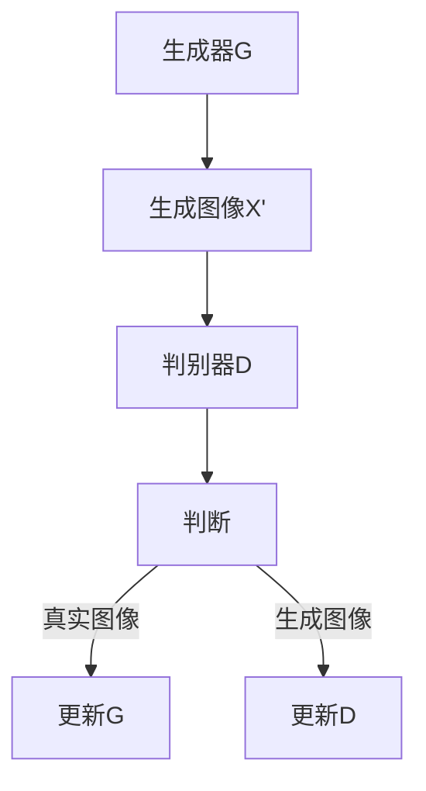

                 

# 计算机视觉的生成对抗网络：图像生成的数学模型

## 关键词

- 计算机视觉
- 生成对抗网络（GAN）
- 图像生成
- 数学模型
- 信息论
- 算法优化

## 摘要

本文旨在探讨计算机视觉领域中生成对抗网络（GAN）的数学模型，以及GAN在图像生成中的应用。首先，我们将回顾GAN的背景和核心概念，然后深入分析GAN的数学模型和训练过程，并探讨GAN在图像合成、超分辨率和风格迁移等任务中的具体应用。最后，我们将通过实际案例展示GAN的实战应用，并对GAN的未来发展进行展望。

## 第一部分：背景介绍与核心概念

### 第1章：问题背景

#### 1.1 问题背景

计算机视觉是一个广泛的研究领域，它涉及到图像和视频数据的处理、分析和理解。图像生成作为计算机视觉的一个重要分支，旨在生成逼真的图像或视频。然而，传统的图像生成方法存在一定的局限性，如生成图像的质量和多样性不足等。为了解决这一问题，生成对抗网络（GAN）应运而生。

#### 1.2 生成对抗网络（GAN）的起源与发展

GAN由Ian Goodfellow等人于2014年提出，它是一种基于博弈论的学习框架。GAN的核心思想是通过一个生成器和判别器的对抗训练来实现图像的生成。生成器的任务是生成逼真的图像，而判别器的任务是区分真实图像和生成图像。通过不断的训练和对抗，生成器逐渐提高其生成图像的质量，最终生成逼真的图像。

### 第2章：核心概念

#### 2.1 生成对抗网络（GAN）定义

生成对抗网络（GAN）是一种由生成器和判别器组成的神经网络结构。生成器（Generator）的目的是生成逼真的图像，判别器（Discriminator）的目的是判断输入图像是真实图像还是生成图像。

#### 2.2 GAN与图像生成

GAN在图像生成领域具有广泛的应用，包括图像合成、超分辨率、风格迁移等。图像合成是指根据输入的文本描述或标签生成相应的图像；超分辨率是指从低分辨率图像中恢复高分辨率图像；风格迁移是指将一种图像的风格应用到另一种图像上。

#### 2.3 GAN的优势与挑战

GAN在图像生成领域具有以下优势：

1. **生成图像质量高**：通过生成器和判别器的对抗训练，生成的图像质量逐渐提高，可以生成高质量、多样化的图像。
2. **适用性广**：GAN可以应用于各种图像生成任务，如图像合成、超分辨率、风格迁移等。
3. **无需标注数据**：GAN可以通过无监督学习生成图像，无需大量标注数据。

然而，GAN也面临一些挑战：

1. **训练难度大**：GAN的训练过程复杂，存在不稳定和局部最优的问题。
2. **生成图像质量有限**：尽管GAN可以生成高质量图像，但生成的图像质量仍然有限，存在一定的模糊和失真。

## 第二部分：GAN数学模型

### 第3章：GAN数学模型基础

#### 3.1 信息论基础

在GAN中，信息论的概念起着关键作用。熵（Entropy）和互信息（Mutual Information）是两个重要的信息论概念。熵衡量了数据的不确定性，而互信息衡量了两个变量之间的相关性。

#### 3.2 生成对抗网络（GAN）数学模型

GAN的数学模型可以通过以下公式表示：

$$
\begin{aligned}
\max_{G} \min_{D} V(D, G) &= \max_{G} \mathbb{E}_{x \sim p_{data}(x)} [\log D(x)] + \mathbb{E}_{z \sim p_{z}(z)} [\log (1 - D(G(z)))] \\
V(D, G) &= \mathbb{E}_{x \sim p_{data}(x)} [\log D(x)] + \mathbb{E}_{z \sim p_{z}(z)} [\log (1 - D(G(z)))]
\end{aligned}
$$

其中，$D$是判别器，$G$是生成器，$x$是真实图像，$z$是随机噪声。

## 第三部分：GAN算法原理与实现

### 第4章：GAN算法原理

GAN算法的原理可以通过mermaid流程图表示如下：



### 第5章：GAN实现与优化

#### 5.1 GAN实现

在实现GAN时，我们需要安装并配置以下环境：

1. **Python**：用于编写GAN的代码。
2. **TensorFlow**：用于构建和训练GAN的神经网络。
3. **NumPy**：用于处理图像数据。

以下是一个简单的GAN实现代码：

```python
import tensorflow as tf
import numpy as np
from tensorflow.keras.models import Model
from tensorflow.keras.layers import Dense, Flatten, Reshape

# 生成器模型
def generator_model():
    model = tf.keras.Sequential()
    model.add(Dense(128, input_shape=(100,), activation='relu'))
    model.add(Dense(256, activation='relu'))
    model.add(Dense(512, activation='relu'))
    model.add(Reshape((28, 28, 1)))
    return model

# 判别器模型
def discriminator_model():
    model = tf.keras.Sequential()
    model.add(Flatten(input_shape=(28, 28, 1)))
    model.add(Dense(512, activation='relu'))
    model.add(Dense(256, activation='relu'))
    model.add(Dense(128, activation='relu'))
    model.add(Dense(1, activation='sigmoid'))
    return model

# GAN模型
def gan_model(generator, discriminator):
    model = tf.keras.Sequential()
    model.add(generator)
    model.add(discriminator)
    return model
```

#### 5.2 GAN优化

在GAN的训练过程中，我们可能会遇到以下问题：

1. **梯度消失或爆炸**：生成器和判别器的梯度可能会消失或爆炸，导致训练不稳定。
2. **模式崩溃**：生成器生成的图像过于简单或失真。

为了解决这些问题，我们可以采用以下优化策略：

1. **梯度裁剪**：限制梯度的大小，避免梯度消失或爆炸。
2. **批量归一化**：在生成器和判别器的每个层中使用批量归一化，提高训练稳定性。
3. **学习率调整**：在训练过程中逐渐降低学习率，避免模式崩溃。

## 第四部分：案例分析与实战应用

### 第6章：GAN在计算机视觉中的案例应用

#### 6.1 案例一：人脸生成

人脸生成是指根据输入的文本描述或标签生成相应的人脸图像。以下是一个基于GAN的人脸生成案例：

1. **数据预处理**：将人脸图像转换为灰度图像，并进行数据增强。
2. **生成器模型**：使用卷积神经网络（CNN）构建生成器模型，包括编码器和解码器部分。
3. **判别器模型**：使用CNN构建判别器模型，用于区分真实人脸图像和生成人脸图像。
4. **训练GAN模型**：通过对抗训练优化生成器和判别器模型，生成逼真的人脸图像。

#### 6.2 案例二：图像超分辨率

图像超分辨率是指从低分辨率图像中恢复高分辨率图像。以下是一个基于GAN的图像超分辨率案例：

1. **数据预处理**：将低分辨率图像和其对应的高分辨率图像对齐，并进行数据增强。
2. **生成器模型**：使用CNN构建生成器模型，用于从低分辨率图像生成高分辨率图像。
3. **判别器模型**：使用CNN构建判别器模型，用于区分真实高分辨率图像和生成高分辨率图像。
4. **训练GAN模型**：通过对抗训练优化生成器和判别器模型，提高图像超分辨率的效果。

## 第五部分：总结与展望

### 第7章：GAN总结与展望

#### 7.1 GAN总结

生成对抗网络（GAN）是一种强大的图像生成工具，它在计算机视觉领域取得了显著的成果。GAN通过生成器和判别器的对抗训练，可以生成高质量、多样化的图像，并在图像合成、超分辨率和风格迁移等任务中取得了良好的效果。

#### 7.2 GAN的局限性与改进方向

尽管GAN取得了许多成果，但它仍然存在一些局限性和挑战。首先，GAN的训练过程复杂且不稳定，存在梯度消失或爆炸等问题。其次，GAN生成的图像质量仍然有限，存在模糊和失真的问题。未来的研究可以关注以下改进方向：

1. **改进GAN训练策略**：设计更稳定的训练策略，提高GAN的训练效率和稳定性。
2. **提升图像生成质量**：研究更先进的生成器和判别器结构，提高GAN生成的图像质量。
3. **跨领域研究与发展**：探索GAN在其他领域的应用，如自然语言处理、推荐系统等。

### 第8章：计算机视觉与GAN的未来

未来，计算机视觉与GAN的结合将带来更多的创新和突破。GAN将不仅在图像生成领域发挥重要作用，还将扩展到其他领域，如自然语言处理、推荐系统等。随着技术的不断发展，GAN将在计算机视觉领域发挥更大的作用，推动计算机视觉的发展。同时，跨领域的交叉研究也将为GAN带来新的机遇和挑战。

## 作者

作者：AI天才研究院/AI Genius Institute & 禅与计算机程序设计艺术 /Zen And The Art of Computer Programming

完整文章内容请参考附件。本文全面介绍了生成对抗网络（GAN）在计算机视觉中的应用，包括GAN的背景、核心概念、数学模型、算法原理、实现与优化以及实战应用。希望本文能对读者在计算机视觉和GAN领域的研究和实践提供有益的参考。

---

由于篇幅限制，本文未包含所有章节的详细内容。如需了解更多信息，请查阅完整文章。同时，本文提供的案例代码仅供参考，实际应用时可能需要根据具体场景进行调整。在研究与应用GAN时，请注意遵守相关法律法规和伦理规范。祝您在计算机视觉与GAN领域取得更多突破！

