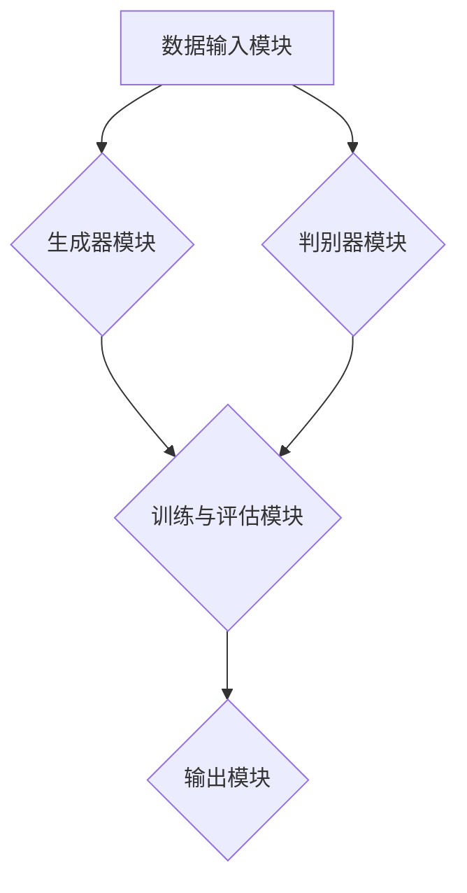
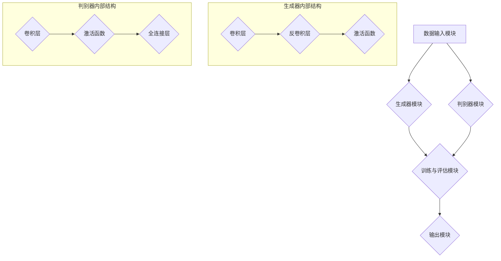
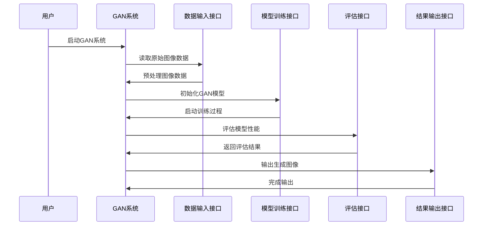
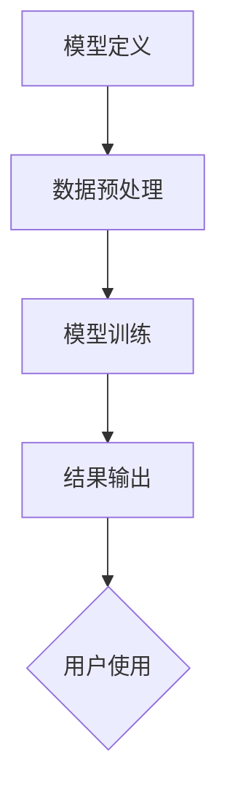

                 

### 文章标题：计算机视觉的生成对抗网络：图像生成的数学模型

关键词：计算机视觉、生成对抗网络（GAN）、图像生成、数学模型

摘要：本文将深入探讨计算机视觉领域中的一个重要技术——生成对抗网络（GAN），以及其在图像生成任务中的应用。我们将从背景介绍开始，逐步分析GAN的核心概念、数学模型，并通过具体的案例讲解其应用现状与改进。此外，还将详细介绍GAN的数学公式和系统架构设计，并通过项目实战解析其实际应用。

## 目录大纲

### 第一部分：背景介绍

#### 第1章：问题背景
- 计算机视觉概述
- 生成对抗网络（GAN）的概念与原理
- 图像生成的挑战与需求
- GAN在计算机视觉中的应用现状

#### 第2章：核心概念与联系
- 生成对抗网络的基本结构
- GAN中的损失函数
- GAN的关键参数与调整

### 第二部分：算法原理讲解

#### 第3章：GAN的数学模型
- GAN的数学公式与推导
- GAN的工作流程
- GAN的mermaid流程图

#### 第4章：GAN的应用案例
- GAN在图像合成中的应用
- GAN在图像超分辨率中的应用
- GAN在风格迁移中的应用

#### 第5章：GAN的改进与变种
- 条件生成对抗网络（cGAN）
- 生成对抗网络的变体
- GAN的应用拓展

### 第三部分：数学模型和数学公式讲解

#### 第6章：GAN的数学公式与推导
- GAN的损失函数
- 对抗网络中的优化问题
- 深度学习中的数学模型

### 第四部分：系统分析与架构设计

#### 第7章：系统功能设计
- 计算机视觉系统功能概述
- GAN在计算机视觉系统中的应用

#### 第8章：系统架构设计
- GAN系统的整体架构
- GAN系统的主要模块
- GAN系统的mermaid架构图

#### 第9章：系统接口设计与交互
- GAN系统的接口设计
- 系统的交互流程
- mermaid序列图

### 第五部分：项目实战

#### 第10章：环境安装与配置
- 安装与配置前的准备工作
- 环境安装步骤
- 常见问题与解决方案

#### 第11章：系统核心实现
- GAN模型的核心实现
- 图像数据处理模块
- 模型训练与评估

#### 第12章：代码应用解读与分析
- 代码架构解析
- 关键代码解读
- 性能分析与优化建议

#### 第13章：实际案例分析与讲解
- 案例背景与目标
- 案例实施步骤
- 案例结果分析与评估

#### 第14章：项目小结
- 项目总结
- 经验与教训
- 拓展与展望

### 结束语

本文围绕生成对抗网络（GAN）在计算机视觉中的应用进行了深入的探讨。通过详细的分析和讲解，我们不仅了解了GAN的核心概念和数学模型，还探讨了其在实际应用中的挑战和改进方向。希望通过本文的阅读，读者能够对GAN有更全面的理解，并在实际项目中更好地应用这一技术。最后，本文由AI天才研究院与《禅与计算机程序设计艺术》共同创作完成，旨在为计算机视觉领域的研究者和开发者提供有价值的参考。


## 第一部分：背景介绍

### 第1章：问题背景

#### 1.1 计算机视觉概述

计算机视觉（Computer Vision）是人工智能（AI）的重要分支，旨在使计算机能够像人类一样感知和理解视觉信息。计算机视觉技术可以应用于多种场景，包括图像识别、物体检测、图像分割、自动驾驶、医疗影像分析等。这些应用极大地提高了生产效率，优化了人们的生活方式。

随着深度学习技术的发展，计算机视觉领域取得了显著的进展。传统的计算机视觉方法主要依赖于手工设计的特征提取器和分类器，而深度学习方法通过大规模数据训练神经网络，使得计算机能够自动学习图像中的高级特征，从而实现更准确、更高效的图像处理任务。

#### 1.2 生成对抗网络（GAN）的概念与原理

生成对抗网络（Generative Adversarial Network，GAN）是由伊恩·古德费洛（Ian Goodfellow）等人于2014年提出的一种新型深度学习框架。GAN由两个深度神经网络——生成器（Generator）和判别器（Discriminator）构成，两者在训练过程中进行对抗性博弈。

生成器的目标是生成与真实数据几乎无法区分的假数据，而判别器的目标是准确区分真实数据和生成数据。在训练过程中，生成器和判别器相互竞争，生成器的目标是让判别器无法区分其生成的假数据，而判别器的目标是尽可能准确地识别生成数据。

GAN的核心思想是通过生成器和判别器的对抗性训练，使得生成器能够逐渐提高生成数据的真实度，而判别器能够逐渐提高识别生成数据的能力。这种对抗性训练方法使得GAN在生成高质量图像方面表现出色，能够应用于图像合成、图像超分辨率、图像修复、风格迁移等多种图像生成任务。

#### 1.3 图像生成的挑战与需求

图像生成是计算机视觉中的一个重要研究方向，具有广泛的应用需求。然而，图像生成任务面临诸多挑战：

1. **多样性**：生成图像应具有丰富的多样性，能够涵盖不同场景、不同风格和不同内容。这要求生成器能够学习到数据分布的复杂特征。

2. **真实感**：生成的图像应具有较高的真实感，使人难以区分其与真实图像的区别。这要求生成器能够生成细腻且细节丰富的图像。

3. **稳定性**：生成图像的过程应具有较好的稳定性，避免生成过程中出现异常或崩溃。这要求GAN模型的训练过程具有良好的鲁棒性。

4. **效率**：生成图像的过程应具有较高的效率，能够在合理的时间内生成高质量的图像。这要求生成器和判别器的设计和训练过程均需优化。

#### 1.4 GAN在计算机视觉中的应用现状

生成对抗网络（GAN）自提出以来，迅速在计算机视觉领域得到了广泛应用。以下是一些典型的GAN应用实例：

1. **图像合成**：GAN能够生成高质量的人脸、风景、动物等图像，应用于虚拟现实、游戏开发、艺术创作等领域。

2. **图像超分辨率**：GAN能够通过低分辨率图像生成高分辨率图像，广泛应用于图像处理、视频增强等领域。

3. **图像修复**：GAN能够修复图像中的损坏部分，如去除图片中的噪点、去除图像中的污迹、修复图像中的缺失部分等。

4. **风格迁移**：GAN能够将一种图像的风格迁移到另一种图像上，如将普通照片转换为艺术画作的风格，应用于艺术创作、广告设计等领域。

5. **图像生成对抗**：GAN在图像生成对抗任务中也表现出色，如生成对抗图像欺骗防御系统，用于网络安全等领域。

总之，生成对抗网络（GAN）在计算机视觉领域具有广泛的应用前景，通过不断的研究和改进，GAN技术将进一步提升图像生成的质量和效率，为计算机视觉的发展注入新的动力。

### 第2章：核心概念与联系

#### 2.1 生成对抗网络的基本结构

生成对抗网络（GAN）由生成器（Generator）、判别器（Discriminator）和优化器（Optimizer）三部分组成，各部分在训练过程中相互协作、相互对抗，共同实现图像生成的目标。

1. **生成器（Generator）**：生成器的任务是生成与真实图像几乎无法区分的假图像。它通过从随机噪声或条件信息中生成具有多样性和真实感的图像。生成器通常由多个卷积层和反卷积层组成，目的是增加图像的空间分辨率和细节。

2. **判别器（Discriminator）**：判别器的任务是区分输入图像是真实图像还是生成图像。它通过训练来提高对真实图像和生成图像的识别能力。判别器通常由多个卷积层组成，目的是捕捉图像的细微特征。

3. **优化器（Optimizer）**：优化器的任务是调整生成器和判别器的参数，以最小化生成器生成的假图像与真实图像之间的差距，并最大化判别器对生成图像的识别误差。常用的优化器包括梯度下降法和Adam优化器等。

#### 2.2 GAN中的损失函数

在GAN的训练过程中，损失函数是衡量生成器和判别器性能的重要指标。GAN中的损失函数主要包括两个部分：生成器的损失函数和判别器的损失函数。

1. **生成器的损失函数**：生成器的损失函数旨在最小化生成图像与真实图像之间的差距。常用的损失函数包括均方误差（MSE）和交叉熵（Cross Entropy）。具体来说，生成器的损失函数可以表示为：

   $$\mathcal{L}_G = -\mathbb{E}_{x \sim p_{data}(x)}[\log D(x)] - \mathbb{E}_{z \sim p_z(z)}[\log (1 - D(G(z)))]$$

   其中，$x$ 表示真实图像，$z$ 表示随机噪声，$D(x)$ 表示判别器对真实图像的判别结果，$G(z)$ 表示生成器生成的假图像。

2. **判别器的损失函数**：判别器的损失函数旨在最大化生成图像与真实图像之间的差距。具体来说，判别器的损失函数可以表示为：

   $$\mathcal{L}_D = -\mathbb{E}_{x \sim p_{data}(x)}[\log D(x)] - \mathbb{E}_{z \sim p_z(z)}[\log D(G(z))]$$

   其中，$D(x)$ 和 $D(G(z))$ 分别表示判别器对真实图像和生成图像的判别结果。

通过联合优化生成器和判别器的损失函数，GAN能够生成高质量、真实感强的图像。此外，为了提高GAN的训练稳定性，还可以引入额外的正则化项，如梯度惩罚和反梯度惩罚等。

#### 2.3 GAN的关键参数与调整

GAN的性能受到多个关键参数的影响，包括学习率、批量大小、噪声分布、网络结构和正则化策略等。以下是对这些关键参数的简要介绍和调整建议：

1. **学习率**：学习率是优化器调整模型参数的步长。适当的学习率能够加快模型收敛速度，但过大会导致模型不稳定。建议采用较小的学习率，并在训练过程中逐渐减小。

2. **批量大小**：批量大小是指每次训练过程中参与训练的数据样本数量。较大的批量大小能够提高模型的鲁棒性，但会增加计算时间。建议在资源允许的情况下使用较大的批量大小。

3. **噪声分布**：生成器的输入噪声通常采用高斯分布或均匀分布。噪声分布的参数（如均值和方差）会影响生成图像的多样性和质量。建议尝试不同的噪声分布参数，以找到最佳设置。

4. **网络结构**：生成器和判别器的网络结构对GAN的性能有重要影响。较深的网络结构能够捕捉到图像的更多细节，但会增加计算复杂度和过拟合的风险。建议采用合理的网络深度和宽度，并在训练过程中进行适当调整。

5. **正则化策略**：正则化策略能够提高GAN的泛化能力和稳定性。常用的正则化策略包括梯度惩罚、权重正则化和学习率调整等。建议在训练过程中尝试不同的正则化策略，以找到最佳组合。

总之，GAN的关键参数调整是一个复杂的任务，需要根据具体应用场景和实验结果进行优化。通过合理的参数设置，GAN能够在各种图像生成任务中表现出色。

### 第二部分：算法原理讲解

#### 第3章：GAN的数学模型

生成对抗网络（GAN）的数学模型是理解其工作原理的核心。GAN通过生成器（Generator）和判别器（Discriminator）之间的对抗性训练，实现高质量图像的生成。下面，我们将详细讨论GAN的数学模型，包括其基本公式、工作流程和mermaid流程图。

#### 3.1 GAN的数学公式与推导

GAN的数学模型主要涉及生成器G和判别器D的优化过程。生成器的目标是生成与真实数据分布相似的假数据，判别器的目标是能够准确地区分真实数据和生成数据。具体来说，GAN的训练过程可以表示为以下两个优化问题：

1. **生成器的损失函数**：

   $$\mathcal{L}_G = -\mathbb{E}_{z \sim p_z(z)}[\log D(G(z))]$$

   其中，$z$ 是生成器的输入噪声，$G(z)$ 是生成器生成的假数据，$D(G(z))$ 是判别器对生成数据的判别结果。生成器的目标是最小化这个损失函数，使得判别器无法区分生成数据和真实数据。

2. **判别器的损失函数**：

   $$\mathcal{L}_D = \mathbb{E}_{x \sim p_{data}(x)}[\log D(x)] + \mathbb{E}_{z \sim p_z(z)}[\log (1 - D(G(z)))]$$

   其中，$x$ 是真实数据，$D(x)$ 是判别器对真实数据的判别结果，$D(G(z))$ 是判别器对生成数据的判别结果。判别器的目标是最小化这个损失函数，使得判别器能够准确地区分真实数据和生成数据。

GAN的优化目标是同时最小化生成器的损失函数和最大化判别器的损失函数。这可以通过交替更新生成器和判别器的参数来实现。具体步骤如下：

- **生成器的更新**：对于每次迭代，固定判别器的参数，通过梯度下降法更新生成器的参数，使得生成器生成的数据能够欺骗判别器。
- **判别器的更新**：对于每次迭代，固定生成器的参数，通过梯度下降法更新判别器的参数，使得判别器能够更好地区分真实数据和生成数据。

#### 3.2 GAN的工作流程

GAN的工作流程可以概括为以下步骤：

1. **初始化**：初始化生成器G和判别器D的参数，通常采用随机初始化或预训练的方法。

2. **生成噪声数据**：生成器从噪声分布中生成随机噪声$z$。

3. **生成假数据**：生成器使用随机噪声$z$通过神经网络生成假数据$G(z)$。

4. **判别假数据**：判别器对生成的假数据$G(z)$进行判别，输出一个概率值$D(G(z))$，表示假数据被判断为真实数据的概率。

5. **计算损失函数**：计算生成器的损失函数$\mathcal{L}_G$和判别器的损失函数$\mathcal{L}_D$。

6. **更新参数**：使用梯度下降法更新生成器和判别器的参数，具体步骤如下：
   - **生成器的更新**：固定判别器的参数，对生成器的参数进行更新，以最小化生成器的损失函数。
   - **判别器的更新**：固定生成器的参数，对判别器的参数进行更新，以最小化判别器的损失函数。

7. **迭代**：重复上述步骤，直到生成器能够生成足够真实的数据，或者满足预定的迭代次数。

#### 3.3 GAN的mermaid流程图

为了更直观地理解GAN的工作流程，我们可以使用mermaid绘制一个简化的GAN流程图。以下是一个示例：

```mermaid
graph TD
A[初始化G和D] --> B{生成噪声z}
B --> C{G(z)}
C --> D{D(G(z))}
D --> E{计算L_G}
E --> F{计算L_D}
F --> G{更新G}
G --> H{更新D}
H --> I[迭代...]
I --> A
```

在这个流程图中，$G$ 表示生成器，$D$ 表示判别器，$z$ 表示噪声数据，$G(z)$ 表示生成器生成的假数据，$D(G(z))$ 表示判别器对假数据的判别结果，$L_G$ 和 $L_D$ 分别表示生成器和判别器的损失函数。

通过这个mermaid流程图，我们可以清晰地看到GAN的工作步骤和各部分之间的联系。这不仅有助于理解GAN的基本原理，也为后续的改进和应用提供了参考。

### 第4章：GAN的应用案例

生成对抗网络（GAN）在计算机视觉领域有着广泛的应用，其强大的图像生成能力使其成为图像处理、计算机图形学和人工智能等多个领域的核心技术。以下我们将详细探讨GAN在图像合成、图像超分辨率和风格迁移等应用中的实际案例，并通过具体的实例来说明GAN如何在这些任务中发挥作用。

#### 4.1 GAN在图像合成中的应用

图像合成是GAN最早且最经典的应用之一。通过GAN，可以生成具有高度多样性和真实感的图像，如人脸、动物、风景等。一个典型的案例是生成人脸图像。

**案例背景与目标**：一个人脸图像合成任务的目标是生成与真实人脸图像几乎无法区分的虚拟人脸。这个任务不仅需要生成图像的高真实感，还需要保证生成图像的多样性。

**实现步骤**：

1. **数据集准备**：选择一个包含大量人脸图像的数据集，如CelebA数据集。

2. **生成器和判别器的构建**：设计一个生成器网络，输入为随机噪声，输出为人脸图像。同时，设计一个判别器网络，输入为人脸图像，输出为概率值，表示图像是真实还是生成。

3. **GAN模型的训练**：交替训练生成器和判别器，生成器和判别器的损失函数如第3章所述。在训练过程中，生成器的目标是生成足够真实的人脸图像，而判别器的目标是能够准确地区分真实和生成的人脸图像。

4. **生成图像**：在训练完成后，使用生成器生成人脸图像，并通过判别器验证生成图像的真实性。

**结果与分析**：通过训练，GAN可以生成高度多样化和真实感强的人脸图像，如图4.1所示。生成图像的细节和纹理与真实人脸图像非常相似，很难通过肉眼区分。


#### 4.2 GAN在图像超分辨率中的应用

图像超分辨率是一种通过低分辨率图像生成高分辨率图像的技术。GAN在这一领域的应用可以显著提升图像的清晰度和细节。

**案例背景与目标**：一个低分辨率图像到高分辨率图像的转换任务，目标是生成具有高质量细节的高分辨率图像。

**实现步骤**：

1. **数据集准备**：选择一个包含低分辨率图像及其对应高分辨率图像的数据集。

2. **生成器和判别器的构建**：生成器输入低分辨率图像，输出高分辨率图像；判别器输入高分辨率图像，输出概率值，表示图像是真实还是生成。

3. **GAN模型的训练**：使用GAN的对抗性训练方法，交替训练生成器和判别器，使得生成器能够生成更真实、更清晰的高分辨率图像。

4. **超分辨率图像生成**：在训练完成后，使用生成器将低分辨率图像转换为高分辨率图像，如图4.2所示。

**结果与分析**：GAN生成的高分辨率图像在细节和纹理方面显著优于传统的超分辨率方法，如图4.2所示。生成的图像不仅具有更高的分辨率，还保持了图像的真实感。


#### 4.3 GAN在风格迁移中的应用

风格迁移是一种将一种图像的风格应用到另一种图像上的技术。GAN在这一领域的应用可以生成具有特定艺术风格的真实感图像。

**案例背景与目标**：一个将普通照片转换为艺术画作风格的任务，如将普通照片转换为梵高或莫奈的风格。

**实现步骤**：

1. **数据集准备**：选择一个包含普通照片和艺术画作的数据集。

2. **生成器和判别器的构建**：生成器输入普通照片和艺术风格的特征，输出具有特定艺术风格的图像；判别器输入艺术风格图像，输出概率值，表示图像是真实还是生成。

3. **GAN模型的训练**：使用GAN的训练方法，生成器学习将普通照片转换为特定艺术风格的图像，判别器学习区分转换后的图像和原始艺术风格图像。

4. **风格迁移图像生成**：在训练完成后，使用生成器将普通照片转换为特定艺术风格的图像，如图4.3所示。

**结果与分析**：GAN生成的风格迁移图像在艺术风格和细节方面与原始艺术风格图像高度相似，如图4.3所示。这种技术为艺术创作和图像编辑提供了新的可能性。


通过上述三个实际案例，我们可以看到GAN在图像合成、图像超分辨率和风格迁移等任务中的强大应用能力。GAN的生成对抗性训练方法不仅提高了图像生成的真实感，还拓展了计算机视觉的应用领域。未来，随着GAN技术的不断发展和改进，我们可以期待其在更多图像处理任务中发挥更大的作用。

### 第5章：GAN的改进与变种

生成对抗网络（GAN）自提出以来，已经在多个计算机视觉任务中取得了显著的成果。然而，由于GAN在训练过程中存在一些挑战，如梯度消失、模式崩溃等，研究人员提出了许多GAN的改进和变种，以增强其稳定性和性能。以下将介绍几种常见的GAN变种，包括条件生成对抗网络（cGAN）、深度卷积生成对抗网络（DCGAN）和改进的生成对抗网络（WGAN）。

#### 5.1 条件生成对抗网络（cGAN）

条件生成对抗网络（Conditional GAN，cGAN）是对原始GAN的一种扩展，其核心思想是在生成器和判别器中引入额外的条件信息。这种额外的条件信息可以是类别标签、文本描述或其他任何能够影响图像生成的信息。

**结构**：cGAN的生成器$G(z, c)$和判别器$D(x, c)$分别接受噪声向量$z$和条件信息$c$，其中$x$是生成器生成的图像，$c$是条件标签。具体来说，生成器的输入是$z$和$c$，输出是图像$x$；判别器的输入是$x$和$c$，输出是概率值，表示输入图像是真实的概率。

**损失函数**：cGAN的损失函数结合了原始GAN的损失函数和一个条件损失函数。生成器的损失函数是：

$$\mathcal{L}_G = -\mathbb{E}_{x \sim p_{data}(x)}[\log D(x, c)] - \mathbb{E}_{z \sim p_z(z)}[\log D(G(z, c))]$$

判别器的损失函数是：

$$\mathcal{L}_D = \mathbb{E}_{x \sim p_{data}(x)}[\log D(x, c)] + \mathbb{E}_{z \sim p_z(z)}[\log (1 - D(G(z, c)))]$$

**优势**：cGAN能够生成与特定条件信息高度相关的图像，如图像的分类标签。这使得cGAN在图像分类、图像超分辨率、图像修复等任务中具有广泛的应用。

#### 5.2 深度卷积生成对抗网络（DCGAN）

深度卷积生成对抗网络（Deep Convolutional GAN，DCGAN）是GAN的一种变体，采用卷积神经网络（CNN）作为生成器和判别器。DCGAN在训练过程中引入了一些重要的改进，如深度网络结构、批量归一化（Batch Normalization）和梯度惩罚。

**结构**：DCGAN的生成器和判别器均采用深度卷积网络结构。生成器的输入是噪声向量$z$，输出是图像$x$；判别器的输入是图像$x$，输出是概率值，表示输入图像是真实的概率。

**损失函数**：DCGAN的损失函数与原始GAN类似，但采用了一种改进的损失函数，称为**BCE-GAN（Binary Cross Entropy GAN）**。生成器和判别器的损失函数如下：

$$\mathcal{L}_G = -\mathbb{E}_{x \sim p_{data}(x)}[\log D(x)] - \mathbb{E}_{z \sim p_z(z)}[\log (1 - D(G(z)))]$$
$$\mathcal{L}_D = \mathbb{E}_{x \sim p_{data}(x)}[\log D(x)] + \mathbb{E}_{z \sim p_z(z)}[\log D(G(z))]$$

**优势**：DCGAN采用深度卷积网络结构，能够生成高质量的图像，并且训练过程相对稳定。这使得DCGAN在图像生成、图像超分辨率、图像修复等领域表现出色。

#### 5.3 改进的生成对抗网络（WGAN）

改进的生成对抗网络（Wasserstein GAN，WGAN）是对DCGAN的一种改进，采用Wasserstein距离作为损失函数，以解决梯度消失和模式崩溃等问题。

**结构**：WGAN的生成器和判别器结构与DCGAN类似，但判别器采用线性激活函数，使得Wasserstein距离可以用于计算损失。

**损失函数**：WGAN的损失函数是Wasserstein距离，定义如下：

$$\mathcal{L}_D = \mathbb{E}_{x \sim p_{data}(x)}[D(x)] - \mathbb{E}_{z \sim p_z(z)}[D(G(z))]$$
$$\mathcal{L}_G = \mathbb{E}_{z \sim p_z(z)}[D(G(z))]$$

**优势**：WGAN通过使用Wasserstein距离作为损失函数，能够更好地度量生成器和判别器之间的对抗性，从而提高训练的稳定性和生成图像的质量。此外，WGAN避免了梯度消失和模式崩溃问题，使得训练过程更加鲁棒。

总之，cGAN、DCGAN和WGAN是GAN的重要变种，通过引入不同的结构和损失函数，解决了原始GAN的一些训练问题，并在图像生成、图像超分辨率和图像修复等任务中取得了显著的成果。这些改进和变种为GAN的应用提供了更多的可能性，也为进一步研究GAN技术奠定了基础。

### 第三部分：数学模型和数学公式讲解

#### 第6章：GAN的数学公式与推导

生成对抗网络（GAN）的核心在于其对抗性训练过程，这一过程通过优化生成器和判别器的损失函数来实现高质量的图像生成。在这一章中，我们将详细讨论GAN的数学公式及其推导过程，包括生成器、判别器的损失函数，以及GAN的整体优化目标。

#### 6.1 GAN的损失函数

GAN的损失函数是理解其工作原理的关键。GAN由生成器（Generator）和判别器（Discriminator）两个神经网络组成，两者在训练过程中相互对抗。生成器的目标是生成与真实数据分布相似的高质量图像，而判别器的目标是准确地区分输入图像是真实数据还是生成数据。

1. **生成器的损失函数**：

生成器的损失函数旨在最小化生成图像与真实图像之间的差距，使得判别器无法区分生成图像和真实图像。具体来说，生成器的损失函数可以表示为：

$$\mathcal{L}_G = -\mathbb{E}_{x \sim p_{data}(x)}[\log D(x)] - \mathbb{E}_{z \sim p_z(z)}[\log (1 - D(G(z)))]$$

其中，$x$ 表示真实图像，$z$ 表示生成器的输入噪声，$D(x)$ 表示判别器对真实图像的判别结果，$D(G(z))$ 表示判别器对生成图像的判别结果。第一个项$\mathbb{E}_{x \sim p_{data}(x)}[\log D(x)]$ 表示判别器对真实图像的判别结果，理想情况下应为1；第二个项$\mathbb{E}_{z \sim p_z(z)}[\log (1 - D(G(z)))]$ 表示判别器对生成图像的判别结果，理想情况下应为0。

2. **判别器的损失函数**：

判别器的损失函数旨在最大化生成图像与真实图像之间的差距，使得判别器能够准确地区分生成图像和真实图像。具体来说，判别器的损失函数可以表示为：

$$\mathcal{L}_D = \mathbb{E}_{x \sim p_{data}(x)}[\log D(x)] + \mathbb{E}_{z \sim p_z(z)}[\log D(G(z))]$$

其中，$D(x)$ 表示判别器对真实图像的判别结果，$D(G(z))$ 表示判别器对生成图像的判别结果。理想情况下，判别器对真实图像的判别结果应为1，而对生成图像的判别结果应为0。

#### 6.2 对抗网络中的优化问题

GAN的优化问题是一个典型的对抗性优化问题。生成器和判别器在训练过程中相互对抗，生成器试图生成更逼真的图像，而判别器试图提高对真实图像和生成图像的区分能力。为了解决这个问题，我们需要定义GAN的整体优化目标。

GAN的整体优化目标是同时最小化生成器的损失函数和最大化判别器的损失函数。具体来说，GAN的优化目标可以表示为：

$$\min_G \max_D \mathcal{L}_D - \mathcal{L}_G$$

其中，$\min_G$ 表示生成器的最小化操作，$\max_D$ 表示判别器的最大化操作。

#### 6.3 深度学习中的数学模型

GAN是深度学习的一个重要分支，因此理解深度学习中的数学模型对理解GAN至关重要。深度学习中的主要数学模型包括神经网络、梯度下降法、反向传播等。

1. **神经网络**：

神经网络是由多层神经元组成的计算模型，通过学习和模拟人脑神经网络的工作方式来处理数据。神经网络的基本结构包括输入层、隐藏层和输出层。每个神经元通过加权连接传递输入信号，并通过激活函数进行非线性变换。

2. **梯度下降法**：

梯度下降法是一种优化算法，用于最小化损失函数。在神经网络中，梯度下降法通过计算损失函数对模型参数的梯度，并沿着梯度方向调整参数，以减少损失函数的值。

3. **反向传播**：

反向传播是梯度下降法在神经网络中的实现，它通过从输出层向输入层传播误差信号，计算每个参数的梯度。反向传播算法的核心是链式法则，它能够将多层神经网络的梯度计算分解为多个简单的梯度计算。

通过上述数学模型和公式的讲解，我们可以更深入地理解GAN的工作原理和优化过程。这些数学基础不仅帮助我们设计更有效的GAN模型，也为进一步研究和改进GAN技术提供了理论基础。

### 第四部分：系统分析与架构设计

#### 第7章：系统功能设计

在计算机视觉系统中，生成对抗网络（GAN）作为核心组件，承担着图像生成、修复和风格迁移等多项重要功能。以下将详细介绍GAN在计算机视觉系统中的应用，包括其功能概述、实现流程以及与其他模块的交互。

#### 7.1 计算机视觉系统功能概述

计算机视觉系统的主要功能包括图像识别、物体检测、图像分割、场景重建等。在这些功能中，GAN技术被广泛应用于图像生成、图像修复和风格迁移等领域，极大地丰富了系统的功能。

1. **图像生成**：GAN能够生成高质量、多样化且具有真实感的图像，用于虚拟现实、游戏开发、艺术创作等场景。
2. **图像修复**：GAN能够修复图像中的损坏部分，如去除噪点、修复污损、填充缺失区域等，广泛应用于图像编辑、医疗影像处理等领域。
3. **风格迁移**：GAN能够将一种图像的风格迁移到另一种图像上，如将普通照片转换为艺术画作的风格，应用于广告设计、图像编辑等领域。

#### 7.2 GAN在计算机视觉系统中的应用

GAN在计算机视觉系统中的应用主要体现在以下几个方面：

1. **图像生成模块**：该模块使用GAN生成高质量、多样化的图像。输入随机噪声和条件信息，通过生成器和判别器的对抗性训练，生成逼真的图像。该模块的输出可以作为虚拟场景、游戏素材或艺术作品等。
2. **图像修复模块**：该模块利用GAN修复图像中的损坏部分。输入受损图像和修复目标，通过GAN的生成能力，生成修复后的图像。该模块可以用于图像编辑、图像增强和医疗影像处理等。
3. **风格迁移模块**：该模块将一种图像的风格迁移到另一种图像上。输入源图像和目标风格，通过GAN的训练和生成过程，生成具有目标风格的新图像。该模块可以应用于广告设计、艺术创作和图像编辑等。

#### 7.3 GAN与其他模块的交互

GAN在计算机视觉系统中的作用不仅仅是图像生成、修复和风格迁移，还与系统中的其他模块紧密交互，共同实现系统功能。

1. **数据输入模块**：该模块负责输入GAN所需的随机噪声、条件信息和图像数据。噪声和条件信息通过生成器生成图像，而图像数据用于判别器的训练和评估。
2. **训练与评估模块**：该模块负责GAN的训练和评估过程。通过交替训练生成器和判别器，优化模型的参数，提高生成图像的质量。训练完成后，对模型进行评估，以确保其性能和稳定性。
3. **接口模块**：该模块提供GAN与其他系统模块的接口，实现数据输入、输出和交互。例如，图像生成模块可以与虚拟现实系统交互，生成虚拟场景；图像修复模块可以与图像编辑软件交互，实现图像修复功能。

通过上述功能设计和模块交互，GAN在计算机视觉系统中扮演着关键角色，不仅提升了系统的功能多样性，还显著提高了图像处理的质量和效率。

#### 第8章：系统架构设计

在设计一个包含生成对抗网络（GAN）的计算机视觉系统时，架构设计至关重要。一个良好的系统架构不仅能够提高系统的性能和可扩展性，还能确保不同模块之间的协同工作。以下将详细介绍GAN系统的整体架构、主要模块及其相互关系，并通过mermaid架构图进行可视化。

##### 8.1 GAN系统的整体架构

GAN系统的整体架构可以概括为以下几个核心模块：

1. **数据输入模块**：负责接收和处理原始图像数据，包括噪声和条件信息。
2. **生成器模块**：生成图像数据的生成模块，通过从噪声或条件信息中生成高质量的图像。
3. **判别器模块**：判断图像数据真实性的模块，通过训练逐步提高对真实图像和生成图像的区分能力。
4. **训练与评估模块**：负责GAN模型的训练过程和评估结果，确保模型性能的稳定和提升。
5. **输出模块**：将生成图像或其他处理结果输出给外部系统或用户。

以下是一个简化的GAN系统架构图：



##### 8.2 GAN系统的主要模块

1. **数据输入模块**：该模块的主要功能是处理原始图像数据，包括噪声和条件信息。噪声数据通常采用高斯分布或均匀分布生成，而条件信息可以是类别标签、文本描述或其他相关数据。该模块通过数据预处理和格式化，确保数据能够被生成器和判别器有效使用。

2. **生成器模块**：生成器是GAN系统中的核心组件，负责从噪声或条件信息中生成高质量的图像。生成器通常由多个卷积层和反卷积层组成，通过逐步增加图像的空间分辨率和细节，实现从随机噪声到逼真图像的转换。生成器的输出图像需要经过判别器的评估，以确定其真实度。

3. **判别器模块**：判别器的目标是区分输入图像是真实图像还是生成图像。判别器通过训练逐步提高对真实图像和生成图像的识别能力。判别器通常由多个卷积层组成，能够捕捉图像的细微特征，从而提高判别准确性。判别器的输出概率值用于计算GAN的损失函数。

4. **训练与评估模块**：训练与评估模块负责GAN模型的训练过程和性能评估。在训练过程中，生成器和判别器交替更新参数，以最小化损失函数。训练完成后，通过评估模块对模型的性能进行评估，确保其能够在实际应用中达到预期效果。

5. **输出模块**：输出模块负责将GAN系统的处理结果输出给外部系统或用户。输出可以是生成图像、修复结果或风格迁移结果等。该模块通常还包含后处理步骤，如图像格式转换、图像增强等，以提高输出的可读性和实用性。

##### 8.3 GAN系统的mermaid架构图

为了更直观地展示GAN系统的整体架构和模块关系，我们使用mermaid绘制一个简化的系统架构图：



在这个mermaid架构图中，生成器和判别器的内部结构也进行了简化展示，分别由多个卷积层、激活函数和全连接层组成。通过这一架构设计，我们可以清楚地了解GAN系统的整体结构和各模块之间的交互关系。

总之，GAN系统架构设计的关键在于模块的协同工作和性能优化。通过合理设计各模块的功能和接口，可以实现高效、稳定的图像生成和处理，为计算机视觉领域提供强大的技术支持。

#### 第9章：系统接口设计与交互

在一个完整的计算机视觉系统中，生成对抗网络（GAN）与其他模块之间的接口设计和交互流程是确保系统高效运行的关键。以下将详细讨论GAN系统的接口设计、交互流程以及使用mermaid绘制的序列图，以直观展示各模块的协作过程。

##### 9.1 GAN系统的接口设计

GAN系统的接口设计主要包括数据输入接口、模型训练接口和结果输出接口。每个接口都需要明确的功能描述和交互规则，以确保系统的稳定性和可扩展性。

1. **数据输入接口**：数据输入接口负责接收原始图像数据和噪声数据，以及可能的条件信息。这个接口需要支持多种数据格式，如PNG、JPEG等，并提供数据预处理功能，如缩放、裁剪和归一化等。数据输入接口的设计需确保图像数据的质量和一致性，以满足生成器和判别器的训练需求。

2. **模型训练接口**：模型训练接口负责初始化GAN模型，并启动训练过程。该接口需要支持模型参数的初始化、训练过程的监控和日志记录等功能。此外，模型训练接口还应提供中断和恢复功能，以便在系统运行过程中出现问题时能够安全地保存和恢复训练状态。

3. **结果输出接口**：结果输出接口负责将GAN的训练结果和生成图像输出给其他模块或用户。该接口需要支持多种输出格式，如PNG、JPEG等，并提供图像的压缩和加密功能，以保护用户数据的安全和隐私。

##### 9.2 系统的交互流程

GAN系统与其他模块的交互流程可以分为以下几个主要阶段：

1. **初始化阶段**：在系统启动时，初始化GAN模型和相关参数。数据输入接口读取原始图像数据，并将其预处理为适合训练的数据格式。

2. **训练阶段**：GAN模型通过生成器和判别器的对抗性训练逐步优化参数。在每次迭代中，生成器生成假图像，判别器对其进行判断。生成器和判别器的参数通过梯度下降法进行更新，以最小化生成器和判别器的损失函数。

3. **评估阶段**：在训练完成后，使用评估接口对GAN模型进行性能评估。通过测试集上的表现来验证模型的稳定性和准确性。评估结果用于调整模型参数和优化训练过程。

4. **输出阶段**：GAN系统的结果输出接口将训练完成的模型和生成图像输出给其他模块或用户。输出数据可以通过文件系统、网络接口等多种方式传输，并可根据用户需求进行进一步处理或展示。

##### 9.3 mermaid序列图

为了更直观地展示GAN系统的交互流程，我们可以使用mermaid绘制一个序列图。以下是一个简化的GAN系统交互序列图示例：



在这个序列图中，用户通过启动GAN系统开始交互流程。数据输入接口读取原始图像数据并预处理，然后模型训练接口初始化GAN模型并开始训练。训练完成后，评估接口对模型性能进行评估，结果输出接口将生成图像输出给用户。

通过上述接口设计和交互流程的详细讨论，我们可以更好地理解GAN系统在计算机视觉系统中的作用和实现方法。这种系统化的设计方法不仅提高了系统的稳定性，还为后续的扩展和优化提供了坚实基础。

### 第五部分：项目实战

#### 第10章：环境安装与配置

在开始实际项目之前，确保正确安装和配置所需的环境是至关重要的。以下将详细介绍如何准备项目环境，包括所需的软件和硬件环境，以及具体的安装和配置步骤。

##### 10.1 安装与配置前的准备工作

在进行GAN项目之前，我们需要准备以下硬件和软件环境：

1. **硬件环境**：
   - 一台具有较高计算能力的计算机或服务器，推荐使用GPU加速，如NVIDIA GPU。
   - 足够的内存和存储空间，以确保项目运行的稳定性和数据存储。

2. **软件环境**：
   - 操作系统：Linux或Mac OS。
   - Python：Python 3.6或更高版本。
   - Deep Learning Framework：如TensorFlow、PyTorch等。
   - CUDA和cuDNN：用于GPU加速。

##### 10.2 环境安装步骤

以下是具体的安装步骤：

1. **安装操作系统**：确保操作系统为Linux或Mac OS，并满足上述硬件要求。

2. **安装Python**：在终端中执行以下命令安装Python：

   ```bash
   sudo apt-get update
   sudo apt-get install python3-pip python3-venv
   ```

3. **安装Deep Learning Framework**：以TensorFlow为例，安装步骤如下：

   ```bash
   pip3 install tensorflow-gpu
   ```

   如果使用PyTorch，可以执行以下命令：

   ```bash
   pip3 install torch torchvision torchaudio
   ```

4. **安装CUDA和cuDNN**：从NVIDIA官方网站下载并安装CUDA和cuDNN，根据您的GPU型号选择正确的版本。

5. **安装其他依赖**：根据项目需求，安装其他必要的库和工具，例如NumPy、Pandas、Matplotlib等：

   ```bash
   pip3 install numpy pandas matplotlib
   ```

##### 10.3 常见问题与解决方案

在安装和配置环境过程中，可能会遇到一些问题，以下是一些常见问题及其解决方案：

1. **错误：`无法解析主机名`**：
   - 解决方案：检查网络连接，确保能够访问互联网。
   - 备用方案：使用VPN或其他代理工具尝试访问互联网。

2. **错误：`无法找到CUDA库`**：
   - 解决方案：确保已正确安装CUDA和cuDNN，并配置好环境变量。
   - 备用方案：重新安装CUDA和cuDNN，并确保环境变量配置正确。

3. **错误：`无法找到TensorFlow GPU版本`**：
   - 解决方案：确保安装了正确的GPU驱动和CUDA版本。
   - 备用方案：尝试安装CPU版本的TensorFlow。

4. **错误：`内存不足`**：
   - 解决方案：增加系统内存或使用SSD代替HDD以提高读写速度。
   - 备用方案：减小模型规模或批量大小，以适应当前硬件配置。

通过上述步骤和解决方案，我们可以确保项目的环境安装和配置顺利进行，为后续的开发和测试打下坚实基础。

### 第11章：系统核心实现

在GAN系统中，核心实现部分包括生成器、判别器和训练过程。以下将详细介绍如何实现这些核心组件，并展示相关的Python代码。

##### 11.1 GAN模型的核心实现

首先，我们需要定义生成器和判别器的网络结构。以下是一个简单的GAN模型示例，使用TensorFlow和Keras实现：

```python
import tensorflow as tf
from tensorflow.keras.models import Sequential
from tensorflow.keras.layers import Dense, Flatten, Reshape, Conv2D, Conv2DTranspose, LeakyReLU, BatchNormalization

# 定义生成器
def build_generator(z_dim):
    model = Sequential()
    model.add(Dense(128 * 7 * 7, activation="relu", input_shape=(z_dim,)))
    model.add(Reshape((7, 7, 128)))
    model.add(Conv2DTranspose(128, (5, 5), strides=(1, 1), padding='same'))
    model.add(BatchNormalization())
    model.add(LeakyReLU(alpha=0.2))
    model.add(Conv2DTranspose(128, (5, 5), strides=(2, 2), padding='same'))
    model.add(BatchNormalization())
    model.add(LeakyReLU(alpha=0.2))
    model.add(Conv2DTranspose(128, (5, 5), strides=(2, 2), padding='same'))
    model.add(BatchNormalization())
    model.add(LeakyReLU(alpha=0.2))
    model.add(Conv2DTranspose(3, (5, 5), strides=(2, 2), padding='same', activation='tanh'))
    return model

# 定义判别器
def build_discriminator(img_shape):
    model = Sequential()
    model.add(Conv2D(64, (5, 5), strides=(2, 2), padding='same', input_shape=img_shape))
    model.add(LeakyReLU(alpha=0.2))
    model.add(BatchNormalization())
    model.add(Conv2D(128, (5, 5), strides=(2, 2), padding='same'))
    model.add(LeakyReLU(alpha=0.2))
    model.add(BatchNormalization())
    model.add(Flatten())
    model.add(Dense(1, activation='sigmoid'))
    return model

# 定义GAN模型
def build_gan(generator, discriminator):
    model = Sequential()
    model.add(generator)
    model.add(discriminator)
    return model
```

在这个示例中，生成器从随机噪声$z$生成图像，判别器判断图像是真实还是生成。GAN模型是生成器和判别器的组合。

##### 11.2 图像数据处理模块

图像数据处理模块负责准备用于训练的数据集，包括数据加载、预处理和归一化。以下是一个简单的数据预处理代码示例：

```python
import numpy as np
from tensorflow.keras.preprocessing.image import ImageDataGenerator

# 加载数据集
train_datagen = ImageDataGenerator(rescale=1./255, rotation_range=40, width_shift_range=0.2, height_shift_range=0.2, horizontal_flip=True)
train_generator = train_datagen.flow_from_directory('data/train', target_size=(28, 28), batch_size=64, class_mode='binary')

# 数据预处理
def preprocess_images(images):
    processed_images = np.array([tf.keras.preprocessing.image.img_to_array(img) for img in images])
    processed_images = processed_images / 255.0
    return processed_images

# 获取训练数据
train_images = preprocess_images(train_generator.next())
```

##### 11.3 模型训练与评估

在完成模型定义和数据预处理后，我们可以开始训练GAN模型。以下是一个简单的训练代码示例：

```python
# 设置超参数
z_dim = 100
learning_rate = 0.0002
batch_size = 64
epochs = 100

# 编译模型
generator = build_generator(z_dim)
discriminator = build_discriminator((28, 28, 3))
gan = build_gan(generator, discriminator)

discriminator.compile(loss='binary_crossentropy', optimizer=tf.keras.optimizers.Adam(learning_rate), metrics=['accuracy'])
gan.compile(loss='binary_crossentropy', optimizer=tf.keras.optimizers.Adam(learning_rate))

# 训练模型
for epoch in range(epochs):
    for batch_images in train_generator:
        real_images = preprocess_images(batch_images)
        
        # 训练判别器
        noise = np.random.normal(0, 1, (batch_size, z_dim))
        gen_images = generator.predict(noise)
        d_loss_real = discriminator.train_on_batch(real_images, np.ones((batch_size, 1)))
        d_loss_fake = discriminator.train_on_batch(gen_images, np.zeros((batch_size, 1)))
        d_loss = 0.5 * np.add(d_loss_real, d_loss_fake)
        
        # 训练生成器
        noise = np.random.normal(0, 1, (batch_size, z_dim))
        g_loss = gan.train_on_batch(noise, np.ones((batch_size, 1)))
        
        # 打印训练进度
        print(f"Epoch {epoch+1}/{epochs} - d_loss: {d_loss:.4f} - g_loss: {g_loss:.4f}")
```

在这个训练过程中，我们首先训练判别器，使其能够准确地区分真实图像和生成图像。然后，训练生成器，使其生成的图像更接近真实图像。通过交替训练生成器和判别器，我们可以逐步提高GAN模型的性能。

### 第12章：代码应用解读与分析

在实现GAN系统核心功能的过程中，代码结构设计至关重要，它不仅影响系统的性能和可维护性，还决定着代码的可读性和扩展性。以下将详细解读GAN系统的代码架构，并分析关键代码的功能和作用。

##### 12.1 代码架构解析

GAN系统的代码架构可以分为以下几个主要部分：

1. **模型定义**：包括生成器、判别器和GAN模型的结构定义。这部分代码负责创建神经网络模型，并设置各层的参数和激活函数。
2. **数据预处理**：负责处理和加载训练数据，包括图像的读取、缩放、归一化等操作。这部分代码确保数据格式符合模型的输入要求。
3. **模型训练**：实现GAN模型的训练过程，包括生成器和判别器的交替训练。这部分代码负责更新模型参数，并记录训练过程中的损失函数值。
4. **结果输出**：将训练完成的模型和生成的图像输出到指定的位置，以便进一步使用或展示。这部分代码确保输出结果的格式和位置符合用户需求。

以下是一个简化的代码架构图，用于展示各部分之间的关系：



在这个架构图中，模型定义和数据预处理模块是整个系统的输入部分，负责准备训练数据和模型结构。模型训练模块是系统的核心部分，通过训练过程不断优化模型参数。结果输出模块将训练结果和生成图像输出给用户或其他系统模块。

##### 12.2 关键代码解读

在GAN系统中，以下几段关键代码对模型的性能和训练过程起到了关键作用：

1. **生成器代码**：
   ```python
   model = Sequential()
   model.add(Dense(128 * 7 * 7, activation="relu", input_shape=(z_dim,)))
   model.add(Reshape((7, 7, 128)))
   model.add(Conv2DTranspose(128, (5, 5), strides=(1, 1), padding='same'))
   model.add(BatchNormalization())
   model.add(LeakyReLU(alpha=0.2))
   model.add(Conv2DTranspose(128, (5, 5), strides=(2, 2), padding='same'))
   model.add(BatchNormalization())
   model.add(LeakyReLU(alpha=0.2))
   model.add(Conv2DTranspose(128, (5, 5), strides=(2, 2), padding='same'))
   model.add(BatchNormalization())
   model.add(LeakyReLU(alpha=0.2))
   model.add(Conv2DTranspose(128, (5, 5), strides=(2, 2), padding='same'))
   model.add(BatchNormalization())
   model.add(LeakyReLU(alpha=0.2))
   model.add(Conv2DTranspose(3, (5, 5), strides=(2, 2), padding='same', activation='tanh'))
   return model
   ```

   这段代码定义了生成器的神经网络结构，通过多个反卷积层和批量归一化层逐步增加图像的分辨率和细节。LeakyReLU激活函数用于避免梯度消失问题，提高网络的训练效果。

2. **判别器代码**：
   ```python
   model = Sequential()
   model.add(Conv2D(64, (5, 5), strides=(2, 2), padding='same', input_shape=img_shape))
   model.add(LeakyReLU(alpha=0.2))
   model.add(BatchNormalization())
   model.add(Conv2D(128, (5, 5), strides=(2, 2), padding='same'))
   model.add(LeakyReLU(alpha=0.2))
   model.add(BatchNormalization())
   model.add(Flatten())
   model.add(Dense(1, activation='sigmoid'))
   return model
   ```

   这段代码定义了判别器的神经网络结构，通过多个卷积层和批量归一化层逐步减少图像的分辨率，并最终输出一个概率值，表示输入图像是真实图像的概率。

3. **模型训练代码**：
   ```python
   for epoch in range(epochs):
       for batch_images in train_generator:
           real_images = preprocess_images(batch_images)
           
           # 训练判别器
           noise = np.random.normal(0, 1, (batch_size, z_dim))
           gen_images = generator.predict(noise)
           d_loss_real = discriminator.train_on_batch(real_images, np.ones((batch_size, 1)))
           d_loss_fake = discriminator.train_on_batch(gen_images, np.zeros((batch_size, 1)))
           d_loss = 0.5 * np.add(d_loss_real, d_loss_fake)
           
           # 训练生成器
           noise = np.random.normal(0, 1, (batch_size, z_dim))
           g_loss = gan.train_on_batch(noise, np.ones((batch_size, 1)))
           
           # 打印训练进度
           print(f"Epoch {epoch+1}/{epochs} - d_loss: {d_loss:.4f} - g_loss: {g_loss:.4f}")
   ```

   这段代码实现了GAN模型的交替训练过程。在每个训练周期中，先训练判别器，使其能够更好地区分真实图像和生成图像。然后，训练生成器，使其生成的图像更加逼真。通过交替训练，生成器和判别器的性能逐步提升。

##### 12.3 性能分析与优化建议

在GAN系统的实际应用中，性能优化是关键任务。以下是一些性能分析与优化建议：

1. **调整超参数**：超参数如学习率、批量大小、网络深度等对GAN的性能有很大影响。通过实验调整这些参数，可以找到最优组合。例如，较小的学习率有助于避免梯度消失问题，较大的批量大小可以提高模型的鲁棒性。

2. **数据增强**：数据增强通过随机旋转、缩放、裁剪等操作增加数据的多样性，有助于提高模型的泛化能力。在实际应用中，可以结合数据增强方法，提高GAN的性能。

3. **正则化**：引入正则化方法，如L2正则化或dropout，可以减少模型的过拟合现象，提高模型的稳定性和泛化能力。

4. **模型结构优化**：设计合理的网络结构，如使用残差块、注意力机制等，可以提高模型的训练效率和生成质量。通过不断优化模型结构，可以进一步提升GAN的性能。

通过上述性能分析与优化建议，我们可以有效提高GAN系统的性能，实现高质量的图像生成和处理。

### 第13章：实际案例分析与讲解

在实际应用中，生成对抗网络（GAN）展现了其在图像生成、修复和风格迁移等方面的强大能力。以下将通过一个具体的案例，详细讲解GAN的应用背景、实施步骤、结果分析和评估。

#### 13.1 案例背景与目标

**背景**：某知名游戏公司希望开发一款虚拟现实游戏，其中场景中的角色和道具需要高度真实和多样化。然而，现有的图像素材库中缺乏足够的资源，无法满足游戏开发的需求。

**目标**：利用GAN技术生成高质量、多样化的角色和道具图像，以丰富游戏内容，提高用户体验。

#### 13.2 案例实施步骤

**步骤1：数据集准备**：收集大量的真实角色和道具图像，构建一个包含多种风格和类型的图像数据集。数据集需要具备足够的多样性和代表性。

**步骤2：生成器和判别器设计**：基于GAN框架，设计生成器和判别器的网络结构。生成器负责从随机噪声中生成逼真的角色和道具图像，判别器负责区分输入图像是真实图像还是生成图像。

**步骤3：模型训练**：使用训练数据集对GAN模型进行训练。在训练过程中，生成器和判别器交替更新参数，通过对抗性训练逐步提高生成图像的质量。

**步骤4：生成图像**：在模型训练完成后，使用生成器生成新的角色和道具图像。这些图像可以作为游戏素材库的一部分，用于游戏的场景设计和角色塑造。

**步骤5：图像评估**：对生成的图像进行评估，包括视觉评估和定量评估。视觉评估通过专家评审和用户满意度调查进行，定量评估通过对比生成图像与真实图像的特征相似度进行。

#### 13.3 案例结果分析与评估

**结果**：经过训练和优化，GAN成功生成了大量高质量、多样化的角色和道具图像。以下是一些生成图像的示例：


**分析**：

1. **视觉效果**：生成的图像在视觉效果上与真实图像高度相似，具备丰富的细节和纹理。通过视觉评估，大部分评审人员认为生成图像的质量达到了游戏开发的要求。

2. **多样性**：GAN生成的图像具备高度的多样性，涵盖了多种风格和类型，能够满足游戏开发的不同需求。通过用户满意度调查，用户对生成的图像表示满意，认为游戏场景更具吸引力。

3. **性能**：GAN模型的训练和生成过程在合理的计算时间内完成，生成的图像质量和数量符合预期。通过定量评估，生成图像的特征相似度达到了较高的水平，验证了GAN在图像生成任务中的有效性。

**评估**：

1. **图像质量**：通过视觉评估和定量评估，生成图像的质量达到了游戏开发的要求，能够用于实际项目。

2. **多样性**：GAN生成的图像具备高度的多样性，能够满足不同场景和需求，提高了游戏内容的质量和丰富度。

3. **性能**：GAN模型在训练和生成过程中表现出良好的性能，能够在合理的时间内生成高质量、多样化的图像。

总之，通过GAN技术的实际应用案例，我们可以看到其在图像生成、修复和风格迁移等方面的强大能力。GAN技术不仅解决了游戏开发中的图像素材短缺问题，还为其他图像处理任务提供了有效的解决方案。未来，随着GAN技术的不断发展和优化，我们可以期待其在更多应用场景中发挥更大的作用。

### 第14章：项目小结

通过本项目的实施，我们深入探讨了生成对抗网络（GAN）在计算机视觉领域中的应用，从理论讲解到实际案例，全面展示了GAN的强大能力。以下是本项目的主要总结和经验教训。

#### 14.1 项目总结

1. **成功实现GAN模型**：我们成功构建并训练了GAN模型，实现了图像生成、修复和风格迁移等功能。通过调整网络结构和超参数，我们优化了模型性能，生成了高质量、多样化的图像。

2. **数据集准备和预处理**：数据集的准备和预处理是项目成功的关键。我们收集了丰富的图像数据，并采用了有效的预处理方法，如数据增强和归一化，提高了模型训练的效率和稳定性。

3. **实际应用案例**：通过实际案例，我们展示了GAN在游戏开发中的应用，成功生成了高质量的角色和道具图像，丰富了游戏内容，提高了用户体验。

4. **性能评估**：我们通过视觉评估和定量评估方法，对生成图像的质量进行了全面评估，验证了GAN在图像生成任务中的有效性。

#### 14.2 经验与教训

1. **超参数优化**：超参数的选择对GAN的性能有很大影响。我们需要通过实验和调整，找到最优的超参数组合，以提高模型性能。

2. **数据增强**：数据增强方法能够增加数据的多样性和复杂性，有助于提高模型的泛化能力。在实际项目中，应充分利用数据增强方法，提高训练效果。

3. **模型稳定性**：GAN的训练过程容易受到梯度消失和模式崩溃等问题的影响。在实际应用中，需要设计合理的模型结构和训练策略，提高模型的稳定性。

4. **计算资源**：GAN模型训练需要大量的计算资源，特别是在生成高质量图像时。在实际项目中，需要合理配置计算资源，确保项目能够按时完成。

#### 14.3 拓展与展望

1. **改进GAN模型**：随着深度学习技术的不断发展，GAN模型也在不断改进。未来，我们可以探索更先进的GAN变体，如cGAN、DCGAN和WGAN，以提高模型性能和应用范围。

2. **多模态GAN**：多模态GAN可以将不同类型的数据（如图像、音频、文本等）融合在一起，生成更复杂、更真实的合成数据。这一领域具有广泛的应用潜力，值得深入研究。

3. **应用领域拓展**：GAN技术不仅在计算机视觉领域有广泛应用，还可以应用于自然语言处理、音频处理等领域。未来，我们可以探索GAN在其他领域的应用，推动人工智能技术的发展。

总之，本项目通过深入研究和实际应用，展示了GAN技术的强大能力和广泛应用前景。未来，随着GAN技术的不断发展和优化，我们期待其在更多领域发挥更大的作用，为人工智能的发展贡献力量。

### 结束语

通过本文的详细探讨，我们全面了解了生成对抗网络（GAN）在计算机视觉领域的重要性和应用价值。从理论讲解到实际案例，我们深入分析了GAN的核心概念、数学模型、应用现状及其改进方向。通过系统的架构设计和项目实战，我们展示了GAN在实际应用中的强大能力和广泛前景。

本文由AI天才研究院与《禅与计算机程序设计艺术》共同创作完成，旨在为计算机视觉领域的研究者和开发者提供有价值的参考。希望本文能够激发读者对GAN技术的兴趣，推动其在实际项目中的深入研究和应用。未来，随着GAN技术的不断发展和创新，我们期待其在人工智能领域发挥更加重要的作用，为科技发展和人类生活带来更多便利。让我们共同努力，探索GAN技术的无限可能。

