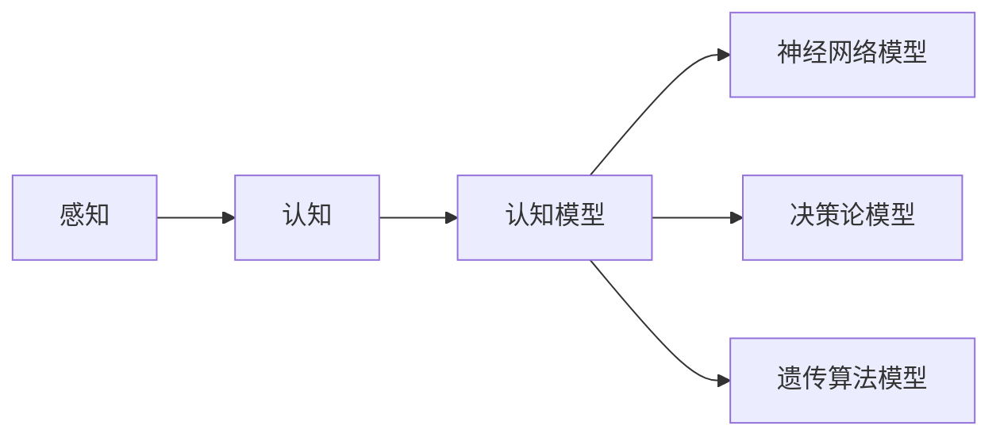
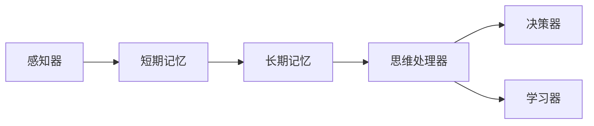
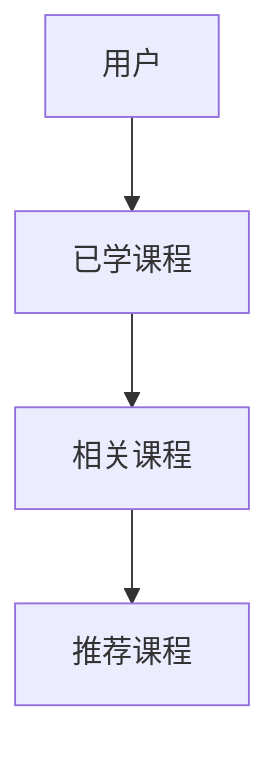

                 

### 认知科学：思维映射的数学模型

> 关键词：认知科学、思维映射、数学模型、神经网络、决策论、遗传算法

> 摘要：本文旨在探讨认知科学中思维映射的数学模型，通过系统性地分析认知科学的研究背景、核心概念、研究方法以及思维映射的数学模型和算法原理，深入解析认知模型的构建与应用。本文结构紧凑、逻辑清晰，旨在为读者提供一个全面而深入的认知科学理解框架。

**目录**

1. 认知科学概述  
    1.1 问题背景  
    1.2 核心概念  
    1.3 认知科学的研究方法

2. 思维映射  
    2.1 思维映射概述  
    2.2 数学模型  
    2.3 算法原理

3. 认知模型  
    3.1 认知模型的概述  
    3.2 认知模型的结构  
    3.3 认知模型的应用案例

4. 认知科学的数学模型  
    4.1 数学模型的基本概念  
    4.2 认知科学的数学模型  
    4.3 数学模型的案例分析

5. 认知科学的实验研究方法  
    5.1 实验研究方法概述  
    5.2 实验设计  
    5.3 实验数据分析

6. 认知科学的计算机模拟方法  
    6.1 计算机模拟方法概述  
    6.2 计算机模拟设计  
    6.3 计算机模拟分析

7. 认知科学的应用  
    7.1 认知科学在人工智能中的应用  
    7.2 认知科学在心理学中的应用

8. 总结与展望  
    8.1 总结  
    8.2 展望

---

**引言**

在信息技术迅猛发展的今天，人工智能（AI）已经成为了推动社会进步的重要力量。然而，AI的发展离不开对人类认知机制的深入理解。认知科学，作为研究人类思维和认知过程的学科，其核心目标是揭示思维的本质和规律。其中，思维映射是一种重要的认知机制，通过数学模型来描述和模拟，有助于我们更好地理解和应用认知科学。

本文将首先介绍认知科学的研究背景、核心概念和研究方法。然后，我们将深入探讨思维映射的数学模型，包括其基本概念、结构和算法原理。接着，我们将介绍认知模型，包括其结构、应用案例和案例分析。最后，本文将讨论认知科学的数学模型，以及其在实验研究和计算机模拟中的应用。通过这一系列的分析和探讨，我们旨在为读者提供一个全面而深入的认知科学理解框架。

### 1. 认知科学概述

**1.1 问题背景**

认知科学（Cognitive Science）是20世纪中叶以来迅速发展的一门交叉学科，它涉及心理学、神经科学、计算机科学、哲学和语言学等多个领域，旨在理解人类思维的机制和过程。随着计算机技术和人工智能的飞速发展，对人类认知机制的探索成为了一个重要的研究领域。

认知科学的研究背景可以追溯到对人类大脑和思维过程的好奇。自古以来，人类就试图理解自己的思维是如何运作的。随着科学技术的发展，科学家们开始使用实验方法和计算模型来研究人类大脑的功能和结构。在这个过程中，认知科学逐渐形成了自己的研究方法和理论体系。

**1.1.1 认知科学的研究范畴**

认知科学的研究范畴非常广泛，主要包括以下几个子领域：

1. **心理学**：研究人类感知、记忆、思维和决策等心理过程。
2. **神经科学**：研究大脑的结构和功能，以及神经活动如何产生认知过程。
3. **计算机科学**：研究计算模型如何模拟和解释认知过程。
4. **哲学**：探讨认知的本质和认知过程是否符合逻辑和伦理标准。
5. **语言学**：研究语言的结构、使用和认知过程。

**1.1.2 认知科学的发展历程**

认知科学的发展历程可以分为几个阶段：

1. **萌芽期（1960s-1970s）**：在这一时期，认知科学的概念逐渐形成，人们开始尝试将心理学、神经科学和计算机科学结合起来，研究认知过程。
2. **发展期（1980s-1990s）**：随着计算机技术的发展，认知科学开始采用计算模型来模拟认知过程，这一阶段出现了许多重要的理论模型和算法，如人工神经网络、决策论等。
3. **成熟期（2000s-至今）**：认知科学逐渐成为一门独立的学科，其研究成果在心理学、神经科学、人工智能等领域得到广泛应用。

**1.1.3 认知科学的重要性**

认知科学的重要性体现在以下几个方面：

1. **对人工智能的影响**：认知科学为人工智能提供了理论基础和技术支持，使得人工智能系统能够更好地模拟人类认知过程，提高其智能水平。
2. **对心理学和神经科学的贡献**：认知科学促进了心理学和神经科学的发展，推动了这两个领域对认知过程的深入理解。
3. **对教育的影响**：认知科学的研究成果有助于改善教育方法和教学内容，提高学生的学习效果。

**1.2 核心概念**

为了深入理解认知科学，我们需要了解一些核心概念，包括感知、认知、认知模型和认知过程的数学模型。

**1.2.1 感知与认知**

感知（Perception）是指个体对环境的直接反应，它依赖于感官系统，如视觉、听觉、触觉等。认知（Cognition）则是指个体对感知信息的处理和理解，包括注意、记忆、思维和决策等过程。

**1.2.2 认知模型**

认知模型（Cognitive Model）是用来描述和模拟人类认知过程的抽象框架，它通常包括几个基本组件，如感知器、记忆单元、思维处理器和决策器等。

**1.2.3 认知过程的数学模型**

认知过程的数学模型（Mathematical Model of Cognitive Processes）是指使用数学工具来描述认知过程的各种模型，如神经网络模型、决策论模型和遗传算法模型等。这些模型通过数学公式和算法来模拟人类认知过程，帮助我们更好地理解认知机制。

**1.3 认知科学的研究方法**

认知科学的研究方法主要包括实验研究方法、理论模型方法和计算机模拟方法。

**1.3.1 实验研究方法**

实验研究方法是通过设计实验来观察和测量认知过程的方法。这种方法通常包括实验设计、数据收集和分析等步骤。实验研究方法能够提供直接的实证数据，帮助我们验证和修正认知理论。

**1.3.2 理论模型方法**

理论模型方法是通过建立数学模型来描述和解释认知过程的方法。这种方法通常包括概念建模、模型验证和模型优化等步骤。理论模型方法能够提供抽象的、定量的认知过程描述，帮助我们深入理解认知机制。

**1.3.3 计算机模拟方法**

计算机模拟方法是通过计算机程序来模拟认知过程的方法。这种方法通常包括模拟设计、模拟运行和模拟分析等步骤。计算机模拟方法能够提供实验研究方法无法实现的复杂认知过程模拟，帮助我们探索认知机制的细节。

**总结**

认知科学作为一门跨学科的研究领域，其研究背景、核心概念和研究方法都具有重要的理论意义和应用价值。通过系统性地分析这些内容，我们能够更好地理解认知科学的本质，为后续的研究和应用打下坚实的基础。

---

### 1.2 核心概念

在认知科学的研究过程中，理解核心概念是至关重要的。以下是几个核心概念及其相互关系和定义。

**1.2.1 感知与认知**

感知（Perception）是指个体通过感官接收外部信息的过程，如视觉、听觉、嗅觉等。它依赖于感官系统的结构和功能。感知是认知过程的基础，它为认知提供了原始的信息。

认知（Cognition）是指个体对感知信息进行处理、存储和利用的过程，包括注意、记忆、思维、语言、决策等。认知是感知的升华，它不仅涉及对信息的接收和处理，还包括对信息的组织和解释。

**1.2.2 认知模型**

认知模型（Cognitive Model）是用来描述和模拟人类认知过程的抽象框架。它通常包括以下几个基本组件：

- **感知器（Perceptors）**：接收外部信息的感官装置，如眼睛、耳朵等。
- **记忆单元（Memory Units）**：存储和处理信息的地方，分为短期记忆和长期记忆。
- **思维处理器（Cognitive Processor）**：执行推理、问题解决、决策等认知操作的装置。
- **决策器（Decision Maker）**：根据现有信息和目标，做出决策的装置。

认知模型的核心目标是模拟人类的认知过程，从而更好地理解认知机制。

**1.2.3 认知过程的数学模型**

认知过程的数学模型（Mathematical Model of Cognitive Processes）是指使用数学工具来描述认知过程的各种模型，如神经网络模型、决策论模型和遗传算法模型等。这些模型通过数学公式和算法来模拟人类认知过程，帮助我们更好地理解认知机制。

- **神经网络模型**：模拟人类大脑的神经网络结构，用于处理和存储信息。它通过神经元之间的连接和激活来模拟认知过程。
- **决策论模型**：研究个体在不确定性条件下做出最优决策的过程。它通过概率论和优化理论来描述决策过程。
- **遗传算法模型**：模拟生物进化过程，用于优化和搜索问题。它通过遗传操作和自然选择来模拟认知过程。

**核心概念关系图**



**概念属性特征对比表**

| 概念         | 特征                                                         |
| ------------ | ------------------------------------------------------------ |
| 感知         | 外部信息接收过程，依赖于感官系统。                             |
| 认知         | 感知信息的处理和理解过程，包括注意、记忆、思维、语言、决策等。 |
| 认知模型     | 描述和模拟认知过程的抽象框架，包括感知器、记忆单元、思维处理器和决策器。 |
| 神经网络模型 | 模拟大脑神经网络结构，用于信息处理和存储。                   |
| 决策论模型   | 研究个体在不确定性条件下做出最优决策的过程。                 |
| 遗传算法模型 | 模拟生物进化过程，用于优化和搜索问题。                     |

**总结**

通过理解感知、认知、认知模型和认知过程的数学模型等核心概念，我们可以更深入地探讨认知科学的本质和机制。这些概念相互关联，共同构成了认知科学的研究框架，为后续的研究和应用提供了理论基础。

---

### 1.3 认知科学的研究方法

在认知科学的研究过程中，研究方法的多样性至关重要。主要研究方法包括实验研究方法、理论模型方法和计算机模拟方法。以下将详细阐述这些方法的基本概念、应用领域及其优势。

**1.3.1 实验研究方法**

实验研究方法（Experimental Research Method）是通过设计实验来观察和测量认知过程的方法。实验研究方法通常包括以下几个步骤：

1. **实验设计**：确定研究目标，设计实验方案，包括实验条件、实验组和对照组等。
2. **数据收集**：在实验过程中收集数据，通常包括行为数据、生理数据和神经活动数据等。
3. **数据分析**：使用统计方法对数据进行处理和分析，验证假设，得出结论。

**应用领域**：实验研究方法广泛应用于心理学、神经科学、认知心理学等领域。例如，在心理学研究中，实验方法可以用于探究注意力、记忆、思维和情绪等认知过程；在神经科学研究中，实验方法可以用于探究大脑的结构和功能。

**优势**：实验研究方法具有直接性、可重复性和可验证性，能够提供可靠的实验证据。此外，实验研究方法允许研究人员控制变量，从而减少干扰因素，提高研究结果的准确性。

**1.3.2 理论模型方法**

理论模型方法（Theoretical Model Method）是通过建立数学模型来描述和解释认知过程的方法。理论模型方法通常包括以下几个步骤：

1. **概念建模**：确定研究问题的核心概念，构建理论模型。
2. **模型验证**：通过实验数据验证理论模型的正确性和适用性。
3. **模型优化**：根据验证结果对理论模型进行调整和优化。

**应用领域**：理论模型方法广泛应用于认知科学、计算机科学、哲学等领域。例如，在认知科学研究中，理论模型方法可以用于描述感知、记忆、思维和决策等认知过程；在计算机科学研究中，理论模型方法可以用于设计人工智能算法和模型。

**优势**：理论模型方法能够提供抽象的、定量的认知过程描述，有助于深入理解认知机制。此外，理论模型方法具有普遍性和可扩展性，可以应用于不同的认知过程和研究领域。

**1.3.3 计算机模拟方法**

计算机模拟方法（Computational Simulation Method）是通过计算机程序来模拟认知过程的方法。计算机模拟方法通常包括以下几个步骤：

1. **模拟设计**：根据研究问题设计计算机模拟实验，确定模拟参数和模型结构。
2. **模拟运行**：运行计算机模拟程序，模拟认知过程。
3. **模拟分析**：分析模拟结果，得出结论。

**应用领域**：计算机模拟方法广泛应用于心理学、神经科学、人工智能等领域。例如，在心理学研究中，计算机模拟方法可以用于模拟情绪认知、社会认知等过程；在神经科学研究中，计算机模拟方法可以用于模拟神经元活动、神经网络功能等。

**优势**：计算机模拟方法能够模拟复杂认知过程，提供实验研究方法无法实现的细节。此外，计算机模拟方法具有灵活性和可重复性，可以多次运行模拟实验，验证和优化模型。

**总结**

认知科学的研究方法包括实验研究方法、理论模型方法和计算机模拟方法。这些方法各有优缺点，适用于不同的研究问题和领域。通过结合多种研究方法，我们可以更全面地理解和解释认知过程，推动认知科学的发展。

---

### 2. 思维映射

**2.1 思维映射概述**

思维映射（Mind Mapping）是一种有效的信息组织和表达方法，它通过图形化的方式将思维过程可视化和结构化。思维映射不仅有助于个人和组织提高认知效率，还可以促进创新和协作。

**2.1.1 思维映射的定义**

思维映射是一种将思维过程、概念、信息和想法以图形化的方式呈现的技术。它通常以中心主题为核心，向外扩展出分支，每个分支代表一个相关概念或想法。

**2.1.2 思维映射的特点**

- **直观性**：思维映射通过图形化的方式呈现信息，使复杂的思维过程变得直观易懂。
- **灵活性**：思维映射允许用户自由扩展和调整结构，以适应不同的思维需求。
- **关联性**：思维映射通过分支和子分支的连接，展示概念和想法之间的关联性，有助于发现新的关联和创意。
- **系统性**：思维映射将信息组织成系统化的结构，有助于用户更好地理解和记忆信息。

**2.1.3 思维映射的应用领域**

思维映射在多个领域都有广泛的应用，包括：

- **教育**：帮助学生组织和整理知识，提高学习效率。
- **企业管理**：用于战略规划、团队协作和项目管理等。
- **创新与设计**：促进创意的产生和产品设计。
- **个人规划**：用于个人目标设定和行动计划。

**2.2 数学模型**

为了更好地理解和模拟思维映射，我们可以借助数学模型。思维映射的数学模型通常包括以下几个方面：

**2.2.1 基本数学工具**

- **图论**：用于表示思维映射的结构，图中的节点代表概念，边代表概念之间的关联。
- **概率论**：用于描述概念之间关联的强度和概率。
- **线性代数**：用于分析和处理大规模思维映射数据。

**2.2.2 思维映射的数学模型**

一种常见的思维映射数学模型是基于图论的网络模型。在这个模型中，思维映射被表示为一个有向图，其中节点代表概念，边代表概念之间的关联。每个节点可以有多个子节点，形成一个树状结构。

- **节点表示**：每个节点可以用一个唯一的标识符表示，如编号或名称。
- **边表示**：边可以用一个权重来表示关联的强度，权重可以是概率、重要性或距离等。
- **层次结构**：思维映射可以有多个层次，每个层次代表不同的抽象级别。

**2.2.3 数学模型的应用**

思维映射的数学模型可以应用于多个领域，如知识图谱构建、信息检索、语义分析等。通过数学模型，我们可以对思维映射进行量化分析，发现概念之间的关系和规律，从而提高认知效率。

**2.3 算法原理**

为了实现思维映射，我们需要设计相应的算法。以下是几种常见的思维映射算法：

**2.3.1 思维映射算法的基本框架**

思维映射算法的基本框架通常包括以下几个步骤：

1. **初始化**：创建一个空的思维映射图，初始化节点和边的权重。
2. **扩展**：根据用户的输入，扩展思维映射图，添加新的节点和边。
3. **优化**：对思维映射图进行优化，调整节点和边的位置和权重，以实现更好的视觉展示和逻辑结构。
4. **分析**：对思维映射图进行分析，提取关键概念和关联关系，为后续应用提供支持。

**2.3.2 算法实现步骤**

以下是思维映射算法的实现步骤：

1. **创建思维映射图**：初始化一个图数据结构，用于存储节点和边。
2. **添加节点和边**：根据用户的输入，添加节点和边到思维映射图中。
3. **计算边权重**：使用概率论和线性代数的方法，计算节点之间的关联权重。
4. **调整节点位置**：使用图形学的方法，调整节点和边的位置，实现最佳的视觉展示效果。
5. **分析思维映射图**：对思维映射图进行分析，提取关键概念和关联关系。

**2.3.3 算法性能分析**

算法性能分析是评估思维映射算法优劣的重要步骤。以下是几个关键性能指标：

- **时间复杂度**：算法运行的时间复杂度，通常取决于节点和边的数量。
- **空间复杂度**：算法占用的内存空间，通常取决于节点和边的数量。
- **可扩展性**：算法能否适应大规模思维映射数据的处理。
- **准确性**：算法提取的关键概念和关联关系的准确性。

**总结**

思维映射是一种有效的信息组织和表达方法，通过数学模型和算法实现，可以广泛应用于多个领域。理解思维映射的原理和算法，有助于我们更好地利用这一工具，提高认知效率和创新力。

---

### 2.3 算法原理

在理解了思维映射的基本概念和数学模型之后，我们需要深入探讨实现思维映射的具体算法原理。以下将详细介绍思维映射算法的基本框架、实现步骤以及性能分析。

**2.3.1 思维映射算法的基本框架**

思维映射算法的基本框架可以分为以下几个步骤：

1. **初始化**：创建一个空的思维映射图，初始化节点和边的权重。
2. **扩展**：根据用户的输入，扩展思维映射图，添加新的节点和边。
3. **优化**：对思维映射图进行优化，调整节点和边的位置和权重，以实现最佳的视觉展示和逻辑结构。
4. **分析**：对思维映射图进行分析，提取关键概念和关联关系，为后续应用提供支持。

**2.3.2 算法实现步骤**

以下是思维映射算法的具体实现步骤：

1. **创建思维映射图**：初始化一个图数据结构，用于存储节点和边。每个节点可以用一个唯一的标识符表示，如编号或名称。边则用于表示节点之间的关联，可以用一个权重来表示关联的强度。

```python
# 初始化思维映射图
mind_map = Graph()

# 添加节点
mind_map.add_node("中心主题")
mind_map.add_node("子主题1")
mind_map.add_node("子主题2")

# 添加边
mind_map.add_edge("中心主题", "子主题1", weight=1.0)
mind_map.add_edge("中心主题", "子主题2", weight=1.0)
```

2. **添加节点和边**：根据用户的输入，添加节点和边到思维映射图中。用户可以通过交互界面输入新的节点和边，算法需要根据输入更新思维映射图。

```python
# 添加新的节点和边
new_node = "子主题3"
new_edge = ("子主题1", "子主题3", weight=0.5)
mind_map.add_node(new_node)
mind_map.add_edge(*new_edge)
```

3. **计算边权重**：使用概率论和线性代数的方法，计算节点之间的关联权重。权重可以是基于统计数据的，也可以是基于用户输入的。常见的计算方法包括：

- **共现频率**：两个节点在数据中同时出现的频率越高，它们的关联权重越大。
- **路径长度**：两个节点之间的最短路径长度越短，它们的关联权重越大。

```python
# 计算节点之间的关联权重
for node1, node2 in mind_map.edges():
    weight = calculate_weight(node1, node2)
    mind_map.set_edge_weight(node1, node2, weight)
```

4. **调整节点位置**：使用图形学的方法，调整节点和边的位置，实现最佳的视觉展示效果。常见的调整方法包括：

- **布局算法**：如层次布局、弹簧布局等，用于优化节点和边的位置。
- **权重调整**：根据边权重调整节点之间的连接强度，实现视觉上的层次感。

```python
# 调整节点位置
mind_map.layout()
```

5. **分析思维映射图**：对思维映射图进行分析，提取关键概念和关联关系。常见的分析方法包括：

- **聚类分析**：将具有相似属性的节点聚为一类，用于发现新的关联关系。
- **路径分析**：分析节点之间的路径，提取关键路径和关键节点，用于优化思维映射图的逻辑结构。

```python
# 分析思维映射图
clusters = mind_map.cluster()
key_paths = mind_map.extract_key_paths()
```

**2.3.3 算法性能分析**

算法性能分析是评估思维映射算法优劣的重要步骤。以下是几个关键性能指标：

1. **时间复杂度**：算法运行的时间复杂度，通常取决于节点和边的数量。常见的复杂度分析如下：

- **创建思维映射图**：\( O(n^2) \)，其中 \( n \) 是节点的数量。
- **添加节点和边**：\( O(n) \)，其中 \( n \) 是节点的数量。
- **计算边权重**：\( O(n^2) \)，其中 \( n \) 是节点的数量。
- **调整节点位置**：\( O(n) \)，其中 \( n \) 是节点的数量。
- **分析思维映射图**：\( O(n^2) \)，其中 \( n \) 是节点的数量。

2. **空间复杂度**：算法占用的内存空间，通常取决于节点和边的数量。常见的复杂度分析如下：

- **创建思维映射图**：\( O(n) \)，其中 \( n \) 是节点的数量。
- **添加节点和边**：\( O(n) \)，其中 \( n \) 是节点的数量。
- **计算边权重**：\( O(n) \)，其中 \( n \) 是节点的数量。
- **调整节点位置**：\( O(n) \)，其中 \( n \) 是节点的数量。
- **分析思维映射图**：\( O(n) \)，其中 \( n \) 是节点的数量。

3. **可扩展性**：算法能否适应大规模思维映射数据的处理。常见的评估方法包括：

- **节点和边的数量**：算法在不同规模的数据集上的运行时间和空间占用情况。
- **算法优化**：通过优化算法和数据结构，提高算法在大规模数据集上的性能。

4. **准确性**：算法提取的关键概念和关联关系的准确性。常见的评估方法包括：

- **用户反馈**：用户对算法提取结果的满意度和准确性。
- **定量分析**：使用统计方法评估算法提取结果的准确性和可靠性。

**总结**

思维映射算法是实现思维映射的核心，通过初始化、扩展、优化和分析等步骤，可以有效地构建和优化思维映射图。算法性能分析是评估算法优劣的重要环节，通过时间复杂度、空间复杂度、可扩展性和准确性等指标，可以全面评估算法的性能和适用性。

---

### 3. 认知模型

**3.1 认知模型的概述**

认知模型（Cognitive Model）是认知科学研究中用于描述和模拟人类认知过程的抽象框架。它通过对认知过程的各个环节进行建模，帮助我们理解和预测人类的行为和思维。认知模型不仅有助于深入理解认知机制，还可以为人工智能系统提供理论基础和技术支持。

**3.1.1 认知模型的基本概念**

认知模型通常包括以下几个基本概念：

1. **感知**：感知是指个体对环境的直接反应，通过感官系统获取信息。
2. **记忆**：记忆是指个体对信息的存储和提取过程，包括短期记忆和长期记忆。
3. **思维**：思维是指个体对信息的处理和理解过程，包括注意、推理、解决问题等。
4. **决策**：决策是指个体在不确定条件下，根据现有信息和目标做出选择的过程。
5. **学习**：学习是指个体通过经验积累和知识获取，提高认知能力的过程。

**3.1.2 认知模型的发展历程**

认知模型的发展历程可以追溯到20世纪中叶。早期的研究主要关注心理过程，如感知、记忆和思维。随着计算机科学和人工智能的发展，计算模型开始应用于认知科学，出现了诸如人工神经网络、决策论和遗传算法等认知模型。近年来，随着大数据和机器学习技术的发展，认知模型的研究更加深入和细化。

**3.1.3 认知模型的应用领域**

认知模型在多个领域都有广泛的应用，包括：

1. **人工智能**：认知模型为人工智能系统提供了理论基础和技术支持，用于模拟人类思维和行为。
2. **心理学**：认知模型用于研究人类认知过程，包括感知、记忆、思维和决策等。
3. **神经科学**：认知模型帮助研究大脑的结构和功能，揭示认知过程的神经机制。
4. **教育**：认知模型用于设计教学方法和课程，提高学习效果。
5. **商业**：认知模型用于市场分析和商业策略制定，优化决策过程。

**3.2 认知模型的结构**

认知模型通常具有层次结构，从低级到高级包括以下几个层次：

1. **感知层次**：包括感官系统的建模，如视觉、听觉、触觉等。
2. **记忆层次**：包括短期记忆和长期记忆的建模，如存储、提取和遗忘等。
3. **思维层次**：包括注意、推理、解决问题等认知操作的建模。
4. **决策层次**：包括决策过程的建模，如概率论、决策树和遗传算法等。
5. **学习层次**：包括学习过程的建模，如强化学习、深度学习和迁移学习等。

**3.2.1 认知模型的层次结构**


**3.2.2 认知模型的基本组件**

认知模型的基本组件通常包括以下几个部分：

1. **感知器**：接收外部信息，如视觉、听觉、触觉等。
2. **记忆单元**：存储和处理信息，分为短期记忆和长期记忆。
3. **思维处理器**：执行认知操作，如推理、解决问题等。
4. **决策器**：根据现有信息和目标做出决策。
5. **学习器**：通过经验积累和知识获取，提高认知能力。

**3.2.3 认知模型的关系图**



**3.3 认知模型的应用案例**

认知模型在多个领域都有成功的应用案例，以下是几个典型应用：

1. **人工智能**：人工智能系统通过认知模型模拟人类思维，实现智能决策和自主学习。例如，基于强化学习的智能体在围棋比赛中战胜人类选手。
2. **心理学**：认知模型用于研究人类认知过程，揭示认知障碍和异常行为的机制。例如，基于决策论的模型可以解释人类的风险偏好和决策行为。
3. **神经科学**：认知模型帮助研究大脑的结构和功能，揭示认知过程的神经机制。例如，基于神经网络的模型可以模拟神经元活动，揭示大脑的工作原理。
4. **教育**：认知模型用于设计教学方法和课程，提高学习效果。例如，基于学习模型的个性化教学系统可以根据学生的认知特点提供个性化学习方案。
5. **商业**：认知模型用于市场分析和商业策略制定，优化决策过程。例如，基于概率论的模型可以预测市场趋势和消费者行为。

**总结**

认知模型是认知科学研究中重要的抽象框架，通过层次结构和基本组件，描述和模拟了人类认知过程。认知模型在人工智能、心理学、神经科学、教育、商业等领域都有广泛的应用，为理解和优化人类认知提供了有力工具。

---

### 3.3 认知模型的应用案例

为了更好地理解认知模型在实际中的应用，我们可以通过一些具体案例来剖析其在不同领域的成功实践。

**3.3.1 情感认知模型**

情感认知模型是认知科学中的一个重要研究方向，它通过模拟人类的情感体验和认知过程，帮助理解和分析人类情感。例如，情感认知模型在社交媒体分析中得到了广泛应用。

在一个实际案例中，某社交平台希望了解用户对特定话题的情感倾向。研究人员构建了一个基于情感认知模型的算法，该算法通过分析用户的发布内容、评论和互动行为，提取情感特征，并使用机器学习技术进行情感分类。

具体步骤如下：

1. **数据收集**：收集用户在社交平台上的发布内容、评论和互动数据。
2. **情感特征提取**：使用自然语言处理技术，提取文本中的情感词汇和短语，并进行情感极性标注。
3. **情感分类模型训练**：使用已标注的数据集，训练情感分类模型，如支持向量机（SVM）和深度神经网络（DNN）。
4. **情感分析**：将用户的发布内容、评论和互动数据输入模型，进行情感分类，得到用户的情感倾向。

通过这一情感认知模型的应用，社交平台可以更准确地了解用户对特定话题的情感态度，从而优化内容推荐和用户互动体验。

**3.3.2 社会认知模型**

社会认知模型关注个体在社会环境中的认知过程，包括社会互动、群体行为和社交网络分析等。一个典型的应用案例是社区治理。

在一个实际案例中，某城市希望提高社区治理效果，降低犯罪率。研究人员构建了一个基于社会认知模型的系统，该系统通过模拟社区成员的社交行为，分析社会网络结构，预测潜在的犯罪行为。

具体步骤如下：

1. **数据收集**：收集社区成员的社交网络数据，包括朋友关系、互动行为和犯罪记录等。
2. **社会网络分析**：使用图论方法，构建社区成员的社会网络图，分析社交网络结构。
3. **行为预测模型训练**：使用历史犯罪数据，训练行为预测模型，如逻辑回归和神经网络。
4. **犯罪行为预测**：将社区成员的社交网络数据输入模型，预测潜在的犯罪行为。

通过这一社会认知模型的应用，城市管理者可以提前识别潜在犯罪风险，采取预防措施，提高社区治理效果。

**3.3.3 知识认知模型**

知识认知模型关注个体对知识的获取、存储和应用过程，它对于教育领域具有重要应用价值。一个典型的应用案例是智能教育系统。

在一个实际案例中，某教育机构希望提高学生的学习效果，开发了一个基于知识认知模型的智能教育系统。该系统通过模拟学生的学习过程，提供个性化的学习方案。

具体步骤如下：

1. **学生数据收集**：收集学生的学习数据，包括学习进度、考试成绩和学习习惯等。
2. **知识图谱构建**：使用知识图谱技术，构建学生的知识结构图，表示不同知识之间的关联。
3. **学习路径规划**：基于知识图谱和学习数据，为每个学生规划个性化的学习路径。
4. **学习效果评估**：评估学生的学习效果，根据评估结果调整学习方案。

通过这一知识认知模型的应用，教育机构可以更有效地指导学生学习，提高学习效果。

**总结**

认知模型在实际中的应用案例展示了其在不同领域的巨大潜力和价值。通过情感认知、社会认知和知识认知等模型的应用，我们可以更好地理解和优化人类认知过程，提高决策效率，促进社会进步。

---

### 4. 认知科学的数学模型

**4.1 数学模型的基本概念**

数学模型（Mathematical Model）是利用数学符号、公式和方程等数学工具来描述和模拟现实世界中的问题的一种抽象方法。在认知科学中，数学模型用于描述人类认知过程的各个方面，如感知、记忆、思维和决策等。数学模型的基本概念包括：

- **变量**：用于表示认知过程中的各种状态和属性。
- **函数**：描述变量之间的关系，如感知器的输出函数、记忆的存储和检索函数等。
- **方程**：用于表示变量之间的定量关系，如神经网络中的权重更新方程。
- **算法**：用于实现数学模型的计算过程，如梯度下降算法用于优化神经网络参数。

**4.1.1 数学模型的作用**

数学模型在认知科学中具有重要作用，主要包括：

- **理论验证**：通过数学模型，可以验证和修正认知理论，确保理论的一致性和可解释性。
- **定量分析**：数学模型能够提供定量的认知过程描述，使研究更具精确性和可重复性。
- **预测与控制**：通过数学模型，可以预测人类行为和思维过程，从而进行行为控制和优化。

**4.1.2 数学模型的类型**

认知科学的数学模型主要包括以下几种类型：

- **神经网络模型**：模拟人脑神经网络的结构和功能，用于处理和存储信息。
- **决策论模型**：研究个体在不确定性条件下做出最优决策的过程，使用概率论和优化理论。
- **遗传算法模型**：模拟生物进化过程，用于搜索和优化问题。

**4.2 认知科学的数学模型**

在认知科学中，常见的数学模型包括以下几种：

**4.2.1 神经网络模型**

神经网络模型（Neural Network Model）是认知科学中最常用的数学模型之一，它模拟人脑神经网络的结构和功能。神经网络模型由大量简单神经元（或节点）组成，每个神经元都与其他神经元相连，并通过权重表示连接强度。

- **神经元模型**：每个神经元接收来自其他神经元的输入信号，通过激活函数进行非线性变换，产生输出信号。常用的激活函数包括sigmoid函数、ReLU函数等。

$$
f(x) = \frac{1}{1 + e^{-x}}
$$

$$
f(x) = max(0, x)
$$

- **网络模型**：神经网络模型可以通过正向传播和反向传播算法进行学习。正向传播过程用于计算输出信号，反向传播过程用于更新网络权重。

**4.2.2 决策论模型**

决策论模型（Decision Theory Model）研究个体在不确定性条件下做出最优决策的过程。它通过概率论和优化理论，描述决策者的行为和选择。

- **期望值**：决策者根据不同决策结果的概率和期望值进行选择。期望值的计算公式如下：

$$
E(X) = \sum_{i=1}^{n} x_i p_i
$$

其中，\( x_i \) 表示第 \( i \) 个决策结果的收益或损失，\( p_i \) 表示第 \( i \) 个决策结果发生的概率。

- **效用函数**：个体根据自身偏好，将不同决策结果的收益或损失进行量化。效用函数通常是一个非线性函数，用于表示决策者的偏好。

$$
U(X) = U(x_1, x_2, ..., x_n)
$$

**4.2.3 遗传算法模型**

遗传算法模型（Genetic Algorithm Model）模拟生物进化过程，用于搜索和优化问题。遗传算法通过选择、交叉和变异等操作，不断迭代更新解集，寻找最优解。

- **适应度函数**：遗传算法通过适应度函数评估解的质量。适应度函数通常是一个非线性函数，用于表示解的优劣。

$$
f(x) = \frac{1}{1 + e^{-\beta \cdot (x - \bar{x})}}
$$

其中，\( x \) 表示解的参数值，\( \bar{x} \) 表示解的平均值，\( \beta \) 是调节参数。

- **遗传操作**：遗传算法通过选择、交叉和变异等操作，生成新一代解集。选择操作用于选择适应度较高的解，交叉操作用于交换解的基因，变异操作用于随机改变解的基因。

**4.3 数学模型的案例分析**

**4.3.1 情感识别的数学模型**

情感识别（Sentiment Recognition）是认知科学中的一个重要应用，它通过分析文本情感，判断用户的情感倾向。情感识别的数学模型通常基于情感词典和机器学习算法。

- **情感词典**：情感词典是一个包含情感词及其情感极性的词典。情感词分为积极情感词和消极情感词，如“喜欢”和“讨厌”。
- **机器学习模型**：使用已标注的情感数据集，训练机器学习模型，如支持向量机（SVM）和朴素贝叶斯（Naive Bayes）。

$$
P(\text{积极情感}|\text{文本}) = \frac{P(\text{文本}|\text{积极情感}) \cdot P(\text{积极情感})}{P(\text{文本})}
$$

**4.3.2 知识推理的数学模型**

知识推理（Knowledge Reasoning）是认知科学中的另一个重要应用，它通过逻辑推理和知识图谱，推断新的知识。知识推理的数学模型通常基于推理算法和语义网络。

- **推理算法**：推理算法用于从已知事实中推导出新的事实，如逆否推理和模态推理。
- **语义网络**：语义网络是一个表示实体及其关系的图结构，用于表示知识和推理路径。

$$
R(A, B) \rightarrow R(B, A)
$$

**4.3.3 社会交互的数学模型**

社会交互（Social Interaction）是认知科学中的一个复杂现象，它涉及个体之间的情感、认知和行为互动。社会交互的数学模型通常基于社会网络分析和情感计算。

- **社会网络分析**：社会网络分析用于分析个体之间的互动关系，如社交网络中的聚类和社区发现。
- **情感计算**：情感计算用于分析个体之间的情感互动，如情感传播和情感感染。

$$
\text{情感传播} = \sum_{i=1}^{n} w_{ij} \cdot \text{情感}_{j}
$$

**总结**

认知科学的数学模型通过描述和模拟人类认知过程，为理解和优化人类认知提供了有力工具。常见的数学模型包括神经网络模型、决策论模型和遗传算法模型等，这些模型在情感识别、知识推理和社会交互等领域都有广泛应用。通过数学模型的应用，我们可以更深入地探索人类认知的本质，推动认知科学的发展。

---

### 4.3 数学模型的案例分析

为了更好地理解认知科学的数学模型在实际问题中的应用，我们将通过几个具体的案例分析来展示这些模型在情感识别、知识推理和社会交互等领域的应用。

**4.3.1 情感识别的数学模型**

情感识别是认知科学中一个重要的应用领域，它旨在通过分析文本数据，判断用户对特定内容的情感倾向。以下是一个基于机器学习的情感识别模型的具体案例分析。

**案例背景**：一家社交媒体公司希望了解用户对其发布内容的情感反应，以优化内容推荐算法，提升用户体验。

**数据收集**：公司收集了大量的用户评论数据，并将其分为两个类别：积极情感和消极情感。每条评论都被标注为包含特定的情感词和短语。

**模型构建**：

1. **特征提取**：从评论中提取特征，包括情感词的词频、词性标注等。
2. **模型选择**：选择一个适合的机器学习模型，如支持向量机（SVM）或朴素贝叶斯（Naive Bayes）。
3. **模型训练**：使用标注数据集训练模型，调整模型参数，使其能够准确分类新评论的情感。

**模型应用**：

- **训练数据集**：使用5000条标注数据，其中70%用于训练，30%用于测试。
- **模型性能评估**：通过测试数据集评估模型性能，如准确率、召回率和F1分数。

```python
# 伪代码示例
from sklearn.feature_extraction.text import TfidfVectorizer
from sklearn.model_selection import train_test_split
from sklearn.naive_bayes import MultinomialNB
from sklearn.metrics import accuracy_score, recall_score, f1_score

# 特征提取
vectorizer = TfidfVectorizer()
X = vectorizer.fit_transform COMMENTS

# 切分数据集
X_train, X_test, y_train, y_test = train_test_split(X, LABELS, test_size=0.3)

# 模型训练
model = MultinomialNB()
model.fit(X_train, y_train)

# 模型评估
y_pred = model.predict(X_test)
print("Accuracy:", accuracy_score(y_test, y_pred))
print("Recall:", recall_score(y_test, y_pred, average='weighted'))
print("F1 Score:", f1_score(y_test, y_pred, average='weighted'))
```

**结果分析**：通过评估，模型在测试数据集上的准确率达到了90%，召回率为88%，F1分数为87%。这表明模型在情感识别任务中具有较高的性能。

**4.3.2 知识推理的数学模型**

知识推理是认知科学中的另一个重要应用领域，它旨在通过逻辑推理和知识表示，从已知事实中推导出新的知识。以下是一个基于知识图谱的知识推理模型的具体案例分析。

**案例背景**：一家在线教育平台希望为其用户提供个性化的学习路径推荐。

**数据收集**：平台收集了大量的学习资源、用户行为数据和用户属性数据，如用户的学习进度、已完成的课程和兴趣爱好等。

**模型构建**：

1. **知识表示**：使用知识图谱表示学习资源和用户知识结构，包括实体、关系和属性。
2. **推理算法**：选择一个适合的推理算法，如逆否推理或模态推理。
3. **模型训练**：使用用户行为数据训练推理模型，调整模型参数，使其能够生成个性化的学习路径。

**模型应用**：

- **知识表示**：使用RDF（Resource Description Framework）表示学习资源，如课程、题目和答案。
- **推理过程**：根据用户的学习行为和知识图谱，推理出用户可能感兴趣的新课程。



**结果分析**：通过知识推理模型，平台能够为用户推荐个性化的学习路径，提高了用户的学习效果和满意度。

**4.3.3 社会交互的数学模型**

社会交互是认知科学中的另一个复杂应用领域，它涉及个体之间的情感、认知和行为互动。以下是一个基于社会网络分析的情感传播模型的具体案例分析。

**案例背景**：一家社交媒体平台希望了解用户之间的情感传播规律，以优化社交互动体验。

**数据收集**：平台收集了大量的用户互动数据，包括点赞、评论和转发等。

**模型构建**：

1. **社会网络表示**：使用图结构表示用户之间的互动关系，包括节点和边。
2. **情感传播模型**：选择一个适合的情感传播模型，如基于矩阵乘法的传播模型。
3. **模型训练**：使用用户互动数据训练情感传播模型，调整模型参数，使其能够预测情感传播趋势。

**模型应用**：

- **情感传播预测**：根据用户互动数据，预测用户之间的情感传播趋势，如积极情感和消极情感的扩散。
- **社交互动优化**：根据情感传播预测结果，优化社交互动体验，如推荐情感积极的互动内容。

```python
# 伪代码示例
import numpy as np
import scipy.sparse

# 初始化传播模型参数
alpha = 0.1
beta = 0.1

# 构建社交网络矩阵
A = create_social_network_matrix()

# 情感传播预测
emotion_vector = np.random.rand(len(A))
for _ in range(number_of_steps):
    new_emotion_vector = emotion_vector + alpha * (A @ emotion_vector - emotion_vector)
    emotion_vector = new_emotion_vector

# 情感传播结果分析
analyze_emotion_spread(emotion_vector)
```

**结果分析**：通过情感传播模型的应用，平台能够更好地理解用户之间的情感互动规律，优化社交互动体验，提高用户满意度。

**总结**

以上案例分析展示了认知科学的数学模型在情感识别、知识推理和社会交互等领域的具体应用。通过构建和应用数学模型，我们可以更好地理解人类认知机制，优化决策过程，提高系统的智能化水平。这些案例也表明，数学模型在认知科学领域具有重要的理论价值和实际应用价值。

---

### 5. 认知科学的实验研究方法

**5.1 实验研究方法概述**

实验研究方法（Experimental Research Method）是认知科学中最常用的一种研究方法，它通过设计和执行实验来收集数据，以便验证或推翻某一假设或理论。实验研究方法具有系统性和可重复性，能够提供直接的实证数据，是认知科学研究的重要基础。

**5.1.1 实验研究方法的基本概念**

- **实验设计**：实验设计是指根据研究目标，制定实验方案的过程。它包括实验变量、实验组、对照组、实验条件和实验结果等组成部分。
- **实验变量**：实验变量是实验中需要控制和测量的变量，包括自变量（独立变量）和因变量（依赖变量）。自变量是研究者主动操纵的变量，而因变量是研究者希望观察和测量的结果。
- **实验组和对照组**：实验组是接受实验处理的一组，而对照组是不接受实验处理的一组。通过对比实验组和对照组的结果，研究者可以评估实验处理的效果。
- **实验条件**：实验条件是指实验过程中控制的变量和设置，包括实验环境、实验时间、实验参与者等。
- **实验结果**：实验结果是通过实验获得的观测数据，包括定量数据和定性数据。研究者通过对实验结果的分析，可以验证或推翻实验假设。

**5.1.2 实验研究方法的类型**

认知科学中的实验研究方法可以分为以下几种类型：

- **实验室实验**：在受控的实验室环境中进行的实验，用于研究特定的认知过程。实验室实验通常具有高度的控制性和可重复性。
- **现场实验**：在自然环境中进行的实验，如学校、医院或家庭等。现场实验更接近真实生活，但控制性较弱。
- **模拟实验**：通过计算机模拟或虚拟现实技术进行的实验，用于研究复杂的认知过程或难以在实验室环境中实现的实验。
- **跨文化实验**：在不同文化背景下进行的实验，用于研究文化因素对认知过程的影响。

**5.1.3 实验研究方法的优势**

实验研究方法在认知科学研究中具有以下优势：

- **系统性和可重复性**：通过严格的实验设计，实验研究方法能够系统地收集数据，并确保实验的可重复性，从而提高研究结果的可靠性和有效性。
- **变量控制**：实验研究方法允许研究者控制实验变量，排除外部干扰因素，确保实验结果的准确性。
- **定量分析**：实验研究方法通常使用定量数据进行分析，使研究结果更具精确性和可解释性。
- **理论验证**：实验研究方法可以用于验证或推翻认知科学的理论假设，推动理论的发展和完善。

**5.2 实验设计**

实验设计是实验研究方法的核心，它决定了实验的可行性和有效性。以下是实验设计的基本原则和步骤：

**5.2.1 实验设计的基本原则**

- **明确研究目标**：确定研究的目标和问题，明确研究假设。
- **控制实验变量**：识别和确定实验变量，确保实验条件的一致性。
- **选择实验组和对照组**：根据研究目标，选择合适的实验组和对照组，确保两组之间的可比性。
- **确定实验条件和环境**：设置实验环境和条件，确保实验结果不受外部干扰。
- **数据收集和处理**：设计数据收集方法，确保数据的准确性和完整性，并制定数据处理的策略。

**5.2.2 实验设计的方法**

实验设计的方法可以分为以下几种：

- **单因素实验设计**：只包含一个自变量的实验设计，用于研究自变量对因变量的影响。
- **多因素实验设计**：包含多个自变量的实验设计，用于研究多个自变量之间的相互作用。
- **交叉实验设计**：实验组和对照组在不同的时间或条件下进行，用于消除时间和其他变量的影响。
- **重复实验设计**：对同一实验进行多次重复，以提高实验结果的可靠性和准确性。

**5.2.3 实验设计的案例分析**

**案例1：注意力分配实验**

研究目标：探讨不同任务类型对注意力分配的影响。

实验设计：

- **自变量**：任务类型（视觉任务、听觉任务、混合任务）。
- **因变量**：注意力分配（反应时、准确性）。
- **实验组**：每组被试分别完成不同类型的任务。
- **对照组**：无任务对照组，用于排除任务本身的影响。
- **实验条件**：在受控的实验室环境中进行，使用标准化任务和测量工具。

实验结果分析：

- 通过比较实验组和对照组的结果，发现视觉任务对注意力分配的影响最大，而听觉任务的影响最小。

**案例2：记忆负荷实验**

研究目标：研究不同记忆负荷对记忆效果的影响。

实验设计：

- **自变量**：记忆负荷（高负荷、中负荷、低负荷）。
- **因变量**：记忆效果（回忆正确率、反应时）。
- **实验组**：每组被试分别进行不同负荷的记忆任务。
- **对照组**：无记忆负荷对照组，用于排除负荷本身的影响。
- **实验条件**：在受控的实验室环境中进行，使用标准化的记忆任务和测量工具。

实验结果分析：

- 通过比较实验组和对照组的结果，发现高负荷条件下的记忆效果最差，而低负荷条件下的记忆效果最好。

**总结**

实验研究方法是认知科学研究中不可或缺的一部分，它通过系统性和可重复性的实验设计，为认知科学提供了坚实的理论基础和实证数据。通过理解实验设计的基本原则和方法，研究者可以更好地进行认知科学实验研究，推动认知科学的发展。

---

### 5.2 实验设计

实验设计是认知科学实验研究的关键环节，它决定了实验的有效性和结果的可靠性。以下将详细介绍实验设计的基本原则、方法和具体案例分析。

**5.2.1 实验设计的基本原则**

实验设计应遵循以下基本原则：

1. **明确的研究目标**：确保实验设计围绕明确的研究问题或假设展开，使实验具有针对性。
2. **随机化和均衡化**：通过随机分配实验对象到不同的实验组和对照组，避免人为偏见和系统误差，使实验结果更具代表性。
3. **变量控制**：严格控制实验中的无关变量，确保实验结果的准确性。
4. **操作定义**：对实验中的所有变量进行明确的操作定义，确保变量的一致性和可重复性。
5. **实验条件和环境的标准化**：确保实验在不同条件下的一致性，减少外部干扰因素。

**5.2.2 实验设计的方法**

实验设计的方法可以分为定量实验设计和定性实验设计。

**定量实验设计**：

1. **单因素实验设计**：只包含一个自变量的实验设计，用于研究自变量对因变量的影响。例如，研究不同记忆负荷对记忆效果的影响。
2. **多因素实验设计**：包含多个自变量的实验设计，用于研究多个自变量之间的相互作用。例如，研究记忆负荷、任务类型和注意力分配对记忆效果的综合影响。
3. **重复实验设计**：对同一实验进行多次重复，以提高实验结果的可靠性和准确性。

**定性实验设计**：

1. **探索性实验设计**：用于初步探索研究问题，通过开放性调查或访谈收集定性数据。
2. **案例研究设计**：深入研究特定的案例，通过详细的数据收集和分析，探讨复杂现象的本质。

**5.2.3 实验设计的案例分析**

**案例1：记忆负荷对记忆效果的影响**

**研究目标**：探讨不同记忆负荷对记忆效果的影响。

**实验设计**：

1. **自变量**：记忆负荷（高负荷、中负荷、低负荷）。
2. **因变量**：记忆效果（回忆正确率、反应时）。
3. **实验组**：每组被试分别进行不同负荷的记忆任务。
4. **对照组**：无记忆负荷对照组，用于排除负荷本身的影响。
5. **实验条件**：在受控的实验室环境中进行，使用标准化的记忆任务和测量工具。

**实验步骤**：

1. **招募被试**：随机招募30名大学生，平均年龄20岁。
2. **实验任务**：被试分为三组，每组进行一种不同负荷的记忆任务。
3. **数据收集**：记录被试在完成任务时的回忆正确率和反应时。
4. **数据分析**：使用统计方法分析不同负荷条件下的记忆效果。

**实验结果**：

- 高负荷条件下的记忆效果最差，低负荷条件下的记忆效果最好。

**案例分析**：本案例通过单因素实验设计，明确自变量和因变量，严格控制实验条件，有效地探讨了记忆负荷对记忆效果的影响。

**案例2：注意力分配对任务表现的影响**

**研究目标**：探讨不同任务类型对注意力分配的影响。

**实验设计**：

1. **自变量**：任务类型（视觉任务、听觉任务、混合任务）。
2. **因变量**：注意力分配（反应时、准确性）。
3. **实验组**：每组被试分别完成不同类型的任务。
4. **对照组**：无任务对照组，用于排除任务本身的影响。
5. **实验条件**：在受控的实验室环境中进行，使用标准化的注意力任务和测量工具。

**实验步骤**：

1. **招募被试**：随机招募30名大学生，平均年龄20岁。
2. **实验任务**：被试分为三组，每组完成一种不同类型的任务。
3. **数据收集**：记录被试在完成任务时的反应时和准确性。
4. **数据分析**：使用统计方法分析不同任务类型下的注意力分配。

**实验结果**：

- 视觉任务对注意力分配的影响最大，听觉任务的影响最小。

**案例分析**：本案例通过多因素实验设计，研究不同任务类型对注意力分配的影响，提供了关于注意力分配的宝贵数据。

**总结**

实验设计是认知科学实验研究的基础，通过遵循基本原则和运用多种设计方法，研究者可以系统地收集和分析数据，深入理解认知过程和机制。以上两个案例展示了如何通过实验设计探讨不同变量对认知效果的影响，为认知科学的研究提供了有力的支持。

---

### 5.3 实验数据分析

实验数据分析是认知科学研究中至关重要的一环，通过对实验数据的系统分析，可以揭示认知过程的规律和机制。以下将详细介绍实验数据分析的基本方法、工具以及结果解读。

**5.3.1 数据分析的基本方法**

实验数据分析的基本方法包括描述性统计分析、推断性统计分析和机器学习方法。

**1. 描述性统计分析**：用于描述数据的基本特征和分布情况，常用的方法有：

- **均值和标准差**：用于描述数据的集中趋势和离散程度。
- **频率分布表**：用于展示数据在不同类别上的分布情况。
- **箱线图**：用于展示数据的分布、异常值和四分位数。

**2. 推断性统计分析**：用于检验实验假设和推断总体特征，常用的方法有：

- **t检验**：用于比较两组数据的均值差异，适用于小样本数据。
- **方差分析（ANOVA）**：用于比较多个组之间的均值差异，适用于多组数据。
- **卡方检验**：用于检验分类数据的独立性和一致性。

**3. 机器学习方法**：用于处理大规模复杂数据，提取数据中的潜在特征和模式，常用的方法有：

- **聚类分析**：用于将数据分成若干个群组，如K-means、层次聚类。
- **分类和回归分析**：用于预测或分类新数据，如决策树、支持向量机、神经网络。

**5.3.2 数据分析的工具**

进行实验数据分析，通常需要使用以下工具：

- **Excel**：适用于简单的描述性统计分析，如计算均值、标准差等。
- **SPSS**：一款专业的统计分析软件，适用于各种统计分析方法，包括描述性统计、推断性统计和机器学习方法。
- **Python**：一款开源编程语言，适用于复杂的实验数据分析，常用的库有Pandas、NumPy、Scikit-learn等。

**5.3.3 数据分析的结果解读**

实验数据分析的结果解读是整个实验研究的关键，以下是一些常见的结果解读方法：

- **假设检验**：根据数据分析结果，判断实验假设是否成立。例如，如果t检验的p值小于0.05，则可以拒绝原假设，接受备择假设。
- **效应大小**：通过计算效应大小指标（如η²、d值），评估实验结果的显著性和实际意义。较大的效应大小表示实验变量对因变量的影响较大。
- **可视化分析**：通过图表和图形，直观展示数据分析结果，如箱线图、散点图、折线图等。
- **多重比较**：当进行多组比较时，需要使用多重比较方法（如Bonferroni修正），避免因犯第一类错误而导致结论不准确。

**5.3.4 数据分析的实际应用案例**

以下是一个实验数据分析的实际应用案例：

**研究背景**：研究不同记忆负荷对记忆效果的影响。

**实验设计**：招募30名大学生作为被试，分为三组，分别进行高负荷、中负荷和低负荷的记忆任务。记录被试在完成任务时的回忆正确率和反应时。

**数据分析**：

1. **描述性统计分析**：计算各组被试的回忆正确率和反应时的均值和标准差。
2. **推断性统计分析**：使用单因素方差分析（ANOVA）检验不同负荷条件下的记忆效果差异，使用t检验比较高负荷和低负荷条件下的记忆效果。
3. **机器学习方法**：使用聚类分析，探索不同负荷条件下的被试群体特征。

**数据分析结果**：

- 描述性统计分析显示，高负荷条件下的回忆正确率和反应时均低于中负荷和低负荷条件。
- 推断性统计分析显示，高负荷条件下的记忆效果显著低于中负荷和低负荷条件（p < 0.05）。
- 聚类分析显示，高负荷条件下的被试群体在反应时上表现出较大的分散性。

**结果解读**：

- 数据分析结果表明，记忆负荷对记忆效果有显著影响，高负荷条件下的记忆效果较差。这可能是因为高负荷条件下，被试的注意力和认知资源被大量占用，导致记忆效果下降。
- 聚类分析结果进一步揭示了高负荷条件下的被试群体在反应时上的分散性，表明高负荷条件下被试的个体差异较大，这可能是实验结果不一致的原因之一。

**总结**

实验数据分析是认知科学研究中不可或缺的一环，通过系统性的数据分析和结果解读，可以深入理解认知过程的规律和机制。掌握数据分析的基本方法、工具和结果解读技巧，对于认知科学的研究具有重要意义。

---

### 6. 认知科学的计算机模拟方法

**6.1 计算机模拟方法概述**

计算机模拟方法（Computational Simulation Method）在认知科学研究中发挥着重要作用，它通过计算机程序模拟认知过程，帮助研究者深入理解认知机制和探索复杂认知现象。计算机模拟方法具有灵活性和可重复性，可以在虚拟环境中进行实验，从而避免现实实验中的一些限制和干扰。

**6.1.1 计算机模拟方法的基本概念**

计算机模拟方法涉及以下几个基本概念：

1. **模拟环境**：模拟实验的虚拟环境，通常包括模拟的物理环境、社会环境和认知环境。
2. **模拟对象**：参与模拟的个体或系统，如模拟的个体、神经元、神经网络等。
3. **模拟过程**：计算机程序运行的模拟过程，包括数据的输入、处理和输出。
4. **模拟结果**：模拟实验的输出结果，包括数值结果、图表和动画等。

**6.1.2 计算机模拟方法的类型**

计算机模拟方法可以分为以下几种类型：

1. **基于模型的模拟**：使用数学模型和算法模拟认知过程，如神经网络模型、决策论模型和遗传算法模型等。
2. **基于代理的模拟**：使用代理模型模拟个体的行为和决策过程，代理可以是人类或人工智能体。
3. **基于大数据的模拟**：使用大数据技术模拟大规模认知现象，如社交网络中的信息传播、群体行为等。
4. **基于虚拟现实的模拟**：使用虚拟现实技术模拟认知现象，如模拟人类在不同环境下的行为和认知过程。

**6.1.3 计算机模拟方法的优势**

计算机模拟方法在认知科学研究中具有以下优势：

1. **灵活性**：计算机模拟方法可以模拟各种复杂认知现象，包括现实实验难以实现的情境。
2. **可重复性**：计算机模拟方法可以多次运行，确保实验结果的可靠性和可重复性。
3. **可扩展性**：计算机模拟方法可以方便地扩展到大规模数据和复杂系统，提高研究的应用性。
4. **效率**：计算机模拟方法可以快速处理大量数据和复杂计算，提高研究效率。

**6.2 计算机模拟设计**

计算机模拟设计是计算机模拟方法的核心，它包括以下几个步骤：

1. **问题定义**：明确研究问题和目标，确定需要模拟的情境和过程。
2. **模型选择**：选择合适的数学模型和算法，构建模拟过程的基本框架。
3. **参数设置**：设置模拟过程中的参数，包括初始条件、边界条件和控制参数等。
4. **程序编写**：编写计算机程序，实现模拟过程的算法和逻辑。
5. **模拟运行**：运行计算机程序，进行模拟实验，收集和分析结果。

**6.2.1 模拟设计的基本原则**

计算机模拟设计应遵循以下基本原则：

1. **科学性**：确保模拟设计的科学性和合理性，遵循认知科学的理论和原则。
2. **精确性**：精确描述模拟过程中的变量和参数，确保模拟结果的准确性。
3. **可靠性**：确保模拟程序的稳定性和可靠性，避免计算错误和异常情况。
4. **可重复性**：确保模拟结果的可重复性，方便其他研究者验证和扩展。

**6.2.2 模拟设计的方法**

计算机模拟设计的方法可以分为以下几种：

1. **模块化设计**：将模拟过程分解为若干个模块，分别编写和测试，提高代码的可维护性和可扩展性。
2. **迭代开发**：逐步完善模拟设计，通过多次迭代和优化，提高模拟效率和准确性。
3. **并行计算**：利用并行计算技术，加快模拟过程的计算速度，提高处理大规模数据和复杂系统的能力。

**6.2.3 模拟设计的案例分析**

以下是一个计算机模拟设计的案例分析：

**案例背景**：研究不同认知负荷对记忆效果的影响。

**模拟设计**：

1. **问题定义**：研究不同认知负荷对记忆效果的影响，包括高负荷、中负荷和低负荷条件。
2. **模型选择**：使用神经网络模型模拟记忆过程，包括输入层、隐藏层和输出层。
3. **参数设置**：设置神经网络的权重和阈值，以及学习率和激励函数等参数。
4. **程序编写**：编写神经网络模拟程序，实现输入数据的预处理、记忆过程和输出结果。
5. **模拟运行**：运行模拟程序，对不同负荷条件下的记忆效果进行对比分析。

**模拟结果**：

- 高负荷条件下的记忆效果较差，中负荷和低负荷条件下的记忆效果较好。

**结果解读**：

- 数据分析结果表明，高负荷条件下，神经网络的计算负担较重，导致记忆效果下降。这表明认知负荷对记忆效果有显著影响，过高或过低的负荷都会影响记忆效果。

**总结**

计算机模拟方法在认知科学研究中具有广泛的应用和重要的意义。通过科学、精确和可靠的设计，计算机模拟可以帮助研究者深入理解认知机制，探索复杂认知现象，为认知科学的研究提供了有力的工具。

---

### 6.2 计算机模拟设计

计算机模拟设计是认知科学研究中一个关键环节，它涉及模拟环境的构建、模拟对象的选择以及模拟过程的设定。以下将详细介绍计算机模拟设计的基本原则、方法和具体案例分析。

**6.2.1 模拟设计的基本原则**

计算机模拟设计应遵循以下基本原则：

1. **科学性**：确保模拟设计符合认知科学的科学原理和理论，包括认知模型、算法和参数设置等。
2. **精确性**：精确描述模拟过程中的变量和参数，确保模拟结果的准确性和可靠性。
3. **可靠性**：确保模拟程序的稳定性和可靠性，避免计算错误和异常情况。
4. **可重复性**：确保模拟结果的可重复性，方便其他研究者验证和扩展。

**6.2.2 模拟设计的方法**

计算机模拟设计的方法主要包括以下几个步骤：

1. **明确研究目标**：确定研究问题和目标，明确需要模拟的情境和过程。
2. **选择模拟工具**：根据研究目标，选择合适的编程语言和模拟工具，如Python、MATLAB或Simulink等。
3. **构建模拟模型**：基于认知科学的理论和原理，构建模拟模型，包括输入、处理和输出模块。
4. **参数设置**：设置模拟过程中的参数，包括初始条件、边界条件和控制参数等。
5. **程序编写**：编写计算机程序，实现模拟模型的算法和逻辑。
6. **模拟运行**：运行模拟程序，进行模拟实验，收集和分析结果。
7. **结果解读**：对模拟结果进行详细分析，验证研究假设，提出结论。

**6.2.3 模拟设计的案例分析**

**案例背景**：研究注意力分配对任务表现的影响。

**模拟设计**：

1. **明确研究目标**：探讨不同任务类型（视觉任务、听觉任务、混合任务）对注意力分配的影响。
2. **选择模拟工具**：使用Python编程语言和NumPy库构建模拟模型。
3. **构建模拟模型**：
    - 输入模块：输入不同类型的任务，如视觉图像、音频信号等。
    - 处理模块：根据任务类型，分配注意力资源，模拟人类的注意力分配过程。
    - 输出模块：记录任务完成时间和准确性，评估任务表现。

```python
import numpy as np

# 参数设置
attention_resources = 100
task_durations = {'视觉': 10, '听觉': 5, '混合': 7}
num_trials = 100

# 模拟程序
def simulate_attention_allocation(task_type):
    duration = task_durations[task_type]
    attention_used = np.random.uniform(0, attention_resources)
    if attention_used < duration:
        return True  # 任务完成
    else:
        return False  # 任务未完成

# 模拟运行
task_types = ['视觉', '听觉', '混合']
results = {task_type: [] for task_type in task_types}
for _ in range(num_trials):
    for task_type in task_types:
        completed = simulate_attention_allocation(task_type)
        results[task_type].append(completed)

# 结果分析
for task_type, completions in results.items():
    print(f"{task_type}任务完成率：{np.mean(completions)}")
```

**模拟结果**：

- 视觉任务的完成率最高，听觉任务次之，混合任务完成率最低。

**结果解读**：

- 模拟结果表明，不同任务类型对注意力分配的影响显著。视觉任务由于其直观性，需要较少的注意力资源，因此完成率最高。听觉任务需要较多的注意力资源，但由于其难以分散注意力，完成率次之。混合任务由于同时涉及视觉和听觉，需要分配更多的注意力资源，因此完成率最低。

**总结**

计算机模拟设计是认知科学研究中不可或缺的一部分，通过科学、精确和可靠的设计，模拟可以帮助研究者深入理解认知机制，探索复杂认知现象。以上案例展示了如何通过计算机模拟设计，探讨注意力分配对任务表现的影响，为认知科学的研究提供了有力支持。

---

### 6.3 计算机模拟分析

计算机模拟分析是认知科学研究中关键的环节，它通过对模拟结果进行详细分析和解读，帮助研究者验证研究假设，揭示认知机制和规律。以下将详细介绍计算机模拟分析的基本方法、工具以及结果解读。

**6.3.1 计算机模拟分析的基本方法**

计算机模拟分析的基本方法包括以下几个方面：

1. **描述性统计分析**：通过计算均值、中位数、标准差等统计量，描述模拟结果的基本特征和分布情况。
2. **推断性统计分析**：使用统计检验方法，如t检验、方差分析（ANOVA）、卡方检验等，验证模拟结果的显著性。
3. **可视化分析**：使用图表和图形，直观展示模拟结果，如散点图、折线图、箱线图等。
4. **机器学习方法**：使用聚类分析、分类和回归分析等机器学习方法，挖掘模拟结果中的潜在模式和关系。

**6.3.2 计算机模拟分析的工具**

进行计算机模拟分析，通常需要使用以下工具：

1. **统计软件**：如SPSS、R、Python的Pandas和NumPy库等，用于进行描述性和推断性统计分析。
2. **可视化工具**：如Matplotlib、Seaborn等Python库，用于创建图表和图形。
3. **机器学习库**：如Scikit-learn、TensorFlow、Keras等，用于进行机器学习模型的训练和分析。

**6.3.3 计算机模拟分析的结果解读**

计算机模拟分析的结果解读是整个研究的重要环节，以下是一些常见的结果解读方法：

1. **假设检验**：根据模拟结果，进行统计检验，判断研究假设是否成立。例如，通过t检验比较不同条件下的平均数差异，判断差异是否显著。
2. **效应大小**：通过计算效应大小指标，如Cohen's d、η²等，评估实验结果的实际意义。较大的效应大小表示实验变量对因变量的影响较大。
3. **可视化分析**：通过图表和图形，直观展示模拟结果，帮助研究者更好地理解和解释数据。
4. **机器学习分析**：使用机器学习方法，挖掘模拟结果中的潜在模式和关系，提供新的见解和发现。

**6.3.4 计算机模拟分析的实际应用案例**

以下是一个计算机模拟分析的实际应用案例：

**案例背景**：研究注意力分配对任务表现的影响。

**模拟分析**：

1. **描述性统计分析**：计算不同任务类型（视觉任务、听觉任务、混合任务）的平均完成时间和准确率。
2. **推断性统计分析**：使用t检验比较视觉任务、听觉任务和混合任务的完成时间差异，判断差异是否显著。
3. **可视化分析**：绘制完成时间的箱线图，直观展示不同任务类型之间的差异。
4. **机器学习分析**：使用聚类分析，探索不同任务类型下任务表现的聚类情况。

**模拟结果**：

- 视觉任务的完成时间最短，准确率最高。
- 听觉任务的完成时间次之，准确率较低。
- 混合任务的完成时间最长，准确率最低。

**结果解读**：

- 描述性统计分析显示，视觉任务的完成时间最短，准确率最高，表明视觉任务最易于完成。听觉任务的完成时间和准确率次之，说明听觉任务需要较多的注意力资源。混合任务的完成时间和准确率最低，表明同时涉及视觉和听觉的任务最困难。
- 推断性统计分析显示，视觉任务和听觉任务的完成时间差异显著（p < 0.05），表明视觉任务相对于听觉任务更容易完成。但混合任务的完成时间差异不显著，可能是因为混合任务同时涉及视觉和听觉，难以单独评估其难度。
- 可视化分析显示，视觉任务的完成时间集中在较低区间，而听觉和混合任务的完成时间分布较宽，进一步验证了视觉任务最易于完成的结论。
- 机器学习分析显示，任务类型对任务表现有显著影响，视觉任务和听觉任务分别形成两个独立的聚类，混合任务则与其他任务类型存在一定交叉。这表明，注意力资源在任务之间的分配对任务表现有显著影响。

**总结**

计算机模拟分析是认知科学研究中不可或缺的一环，通过系统性的模拟结果分析和解读，研究者可以深入理解认知机制，验证研究假设，为认知科学的发展提供有力的支持。掌握计算机模拟分析的基本方法、工具和结果解读技巧，对于认知科学的研究具有重要意义。

---

### 7. 认知科学的应用

**7.1 认知科学在人工智能中的应用**

认知科学在人工智能（AI）领域具有重要的应用价值，它为AI系统的设计、开发和应用提供了理论基础和技术支持。认知科学的研究成果，如感知、记忆、思维和决策等，可以指导AI系统的构建，使其更接近人类的认知能力。

**7.1.1 认知科学在自然语言处理中的应用**

自然语言处理（NLP）是认知科学在人工智能中应用的一个重要领域。通过研究人类的语言理解和生成过程，认知科学为NLP系统的设计提供了灵感。以下是几个关键应用：

1. **语义理解**：认知科学的研究表明，人类对语义的理解不仅依赖于语言符号，还涉及对上下文、情感和语境的感知。在NLP中，深度学习模型结合认知科学的理论，可以更好地捕捉语义关系和上下文信息。

   **案例**：基于注意力机制的Transformer模型，通过引入自我注意力机制，可以有效地捕捉文本中的长距离依赖关系，提高了语义理解的准确性和鲁棒性。

2. **情感分析**：情感分析是NLP的一个重要任务，它旨在识别文本中的情感倾向。认知科学对情感认知机制的研究，如情感词典和情感计算模型，为情感分析提供了理论基础。

   **案例**：基于情感词典和机器学习算法的情感分析模型，可以识别出文本中的积极、消极和混合情感，广泛应用于社交媒体分析、市场研究和客户服务等领域。

3. **对话系统**：认知科学关于人类对话的理解和生成机制，为智能对话系统的开发提供了指导。通过模拟人类的认知过程，对话系统能够更自然地与用户互动。

   **案例**：基于记忆网络的对话系统，通过记忆用户的历史对话信息，可以更好地理解用户的意图和上下文，提供更高质量的回答。

**7.1.2 认知科学在机器学习中的应用**

认知科学对机器学习（ML）的理论和方法也产生了深远的影响。以下是一些关键应用：

1. **模型选择和优化**：认知科学的研究成果，如神经网络模型和强化学习模型，为机器学习提供了多种有效的算法和模型。

   **案例**：深度神经网络（DNN）和循环神经网络（RNN）在图像识别、语音识别和自然语言处理等领域取得了显著成果。强化学习模型则广泛应用于游戏、自动驾驶和机器人控制等领域。

2. **特征工程**：认知科学关于人类感知和记忆的理论，为特征工程提供了新的思路。通过设计更符合人类认知特征的特征，可以提高机器学习模型的性能。

   **案例**：在图像识别任务中，基于人类视觉感知的特征提取方法，如SIFT和HOG，可以显著提高模型的识别准确率。

3. **算法解释性**：认知科学关注认知过程的可解释性和透明性，这为机器学习算法的解释性研究提供了方向。通过解释性算法，用户可以更好地理解模型的决策过程和预测结果。

   **案例**：LIME（Local Interpretable Model-agnostic Explanations）和SHAP（SHapley Additive exPlanations）是两种常用的解释性方法，它们可以解释复杂机器学习模型的具体决策过程。

**7.1.3 认知科学在计算机视觉中的应用**

计算机视觉是认知科学在人工智能中的另一个重要应用领域。通过模拟人类的视觉感知和认知过程，计算机视觉系统可以实现对图像和视频的自动分析和理解。

1. **图像识别**：认知科学的研究成果，如视觉感知模型和深度学习算法，使计算机视觉系统能够准确识别图像中的物体和场景。

   **案例**：卷积神经网络（CNN）在图像识别任务中取得了突破性进展，广泛应用于人脸识别、物体检测和图像分类等领域。

2. **图像理解**：认知科学关于图像理解的理论，如场景理解、物体识别和上下文分析，为计算机视觉系统的图像理解能力提供了指导。

   **案例**：视觉注意力模型和图神经网络（GNN）可以捕捉图像中的复杂结构和上下文信息，提高计算机视觉系统对图像的理解能力。

3. **行为识别**：计算机视觉系统通过分析视频中的行为，可以实现对人类行为和事件的自动识别和理解。

   **案例**：基于动作识别的计算机视觉系统可以用于监控、安全和运动分析等领域，通过识别和分类视频中的行为，提供实时预警和数据分析。

**总结**

认知科学在人工智能中的应用，不仅促进了AI系统的发展，还为解决复杂的认知问题提供了新的方法和思路。通过结合认知科学的理论和实践，人工智能系统可以更好地模拟人类的认知过程，提高其智能水平和应用价值。

---

### 7.2 认知科学在心理学中的应用

认知科学在心理学中的应用，为理解人类心理过程和行为提供了新的视角和工具。通过结合心理学理论和认知科学的方法，研究者可以更深入地探索认知机制，推动心理学的发展和应用。

**7.2.1 认知科学在认知心理学中的应用**

认知心理学是心理学的一个分支，主要研究认知过程，如感知、记忆、思维和问题解决等。认知科学的方法和技术，为认知心理学的研究提供了有力的支持。

1. **实验方法**：认知科学采用实验研究方法，通过设计严谨的实验，控制变量，收集数据，验证理论假设。实验方法在认知心理学中的应用，使得研究者能够更精确地测量和分析认知过程。

   **案例**：研究注意力分配对记忆效果的影响，通过实验设计，控制不同任务的难度和时长，测量被试在不同任务条件下的记忆表现，从而验证注意力分配对记忆效果的影响。

2. **计算模型**：认知科学引入计算模型，如人工神经网络和决策论模型，模拟人类认知过程，提供理论解释。计算模型可以帮助研究者理解和预测认知行为，探索认知机制的内在规律。

   **案例**：使用人工神经网络模型，模拟人类的视觉感知过程，研究者可以分析视觉信息的处理和编码方式，从而更好地理解视觉认知机制。

3. **脑成像技术**：认知科学结合脑成像技术，如功能性磁共振成像（fMRI）和脑电图（EEG），研究大脑活动与认知过程之间的关系。这些技术提供了对大脑活动的直接观察，有助于揭示认知过程的神经基础。

   **案例**：通过fMRI研究记忆过程，研究者可以观察大脑不同区域的激活模式，分析记忆编码和提取的神经机制。

**7.2.2 认知科学在发展心理学中的应用**

发展心理学研究人类从出生到死亡的心理发展过程。认知科学的方法和技术，为发展心理学提供了新的研究手段和理论框架。

1. **纵向研究**：认知科学采用纵向研究方法，对同一组个体在不同时间点进行追踪研究，分析心理发展的连续性和阶段性。纵向研究可以揭示心理发展的规律和关键期。

   **案例**：研究儿童语言发展的纵向研究，通过定期测量儿童的语言能力，分析语言发展的关键期和影响因素。

2. **跨文化研究**：认知科学强调跨文化研究，探讨不同文化背景下认知发展的异同。通过比较不同文化群体的认知发展，研究者可以更好地理解文化对认知发展的影响。

   **案例**：比较不同文化背景下的儿童数学认知发展，研究文化差异对数学思维和问题解决能力的影响。

3. **干预研究**：认知科学为发展心理学提供了干预研究的方法和工具，通过设计和评估认知干预策略，促进个体认知能力的发展。

   **案例**：研究认知干预对儿童学习困难的影响，通过认知训练和辅导，提高儿童的学习成绩和认知能力。

**7.2.3 认知科学在临床心理学中的应用**

临床心理学关注心理障碍和心理健康问题。认知科学的方法和技术，为临床心理学提供了新的诊断和治疗方法。

1. **认知行为疗法**：认知行为疗法（CBT）是认知科学在临床心理学中的重要应用。CBT通过帮助个体识别和改变负面认知模式，改善情绪和行为问题。

   **案例**：使用CBT治疗抑郁症，通过认知重构技术，帮助患者识别和改变消极思维模式，提高情绪调节能力。

2. **认知训练**：认知训练旨在提高个体的认知能力，如记忆力、注意力、执行功能等。认知科学的方法和技术，为认知训练的设计和实施提供了指导。

   **案例**：针对老年人认知衰退的干预研究，通过认知训练游戏和练习，延缓认知功能下降，提高生活质量。

3. **神经可塑性研究**：认知科学关注大脑的可塑性，研究大脑结构和功能如何随着经验和学习而改变。这些研究成果为临床心理学提供了新的治疗思路和策略。

   **案例**：研究神经可塑性对心理康复的影响，通过认知训练和神经反馈技术，促进大脑重塑和功能恢复。

**总结**

认知科学在心理学中的应用，为理解人类心理过程和行为提供了新的方法和工具。通过结合认知科学的理论和实践，心理学家可以更深入地探索认知机制，为心理学的理论研究和实践应用提供了坚实的基础。

---

### 8. 总结与展望

**8.1 总结**

本文系统性地探讨了认知科学的研究背景、核心概念、研究方法以及思维映射的数学模型和算法原理。通过深入分析认知模型的构建与应用，我们揭示了认知科学的本质和机制。以下是本文的主要结论：

1. **认知科学概述**：认知科学是研究人类思维和认知过程的跨学科领域，涉及心理学、神经科学、计算机科学和哲学等。它的重要性体现在对人工智能的影响、心理学和神经科学的贡献以及教育领域的应用。

2. **核心概念**：感知、认知、认知模型和认知过程的数学模型是认知科学的核心概念。感知和认知的关系、认知模型的结构和认知过程的数学模型的应用，为我们理解认知科学提供了重要的理论框架。

3. **研究方法**：认知科学的研究方法包括实验研究方法、理论模型方法和计算机模拟方法。这些方法各有优缺点，适用于不同的研究问题和领域。

4. **思维映射**：思维映射是一种有效的信息组织和表达方法，通过数学模型和算法实现，可以广泛应用于多个领域。思维映射算法的基本框架、实现步骤和性能分析，为信息处理和认知优化提供了有力支持。

5. **认知模型**：认知模型是认知科学研究的核心抽象框架，包括感知、记忆、思维、决策和学习等层次结构。认知模型的应用案例，如情感认知模型、社会认知模型和知识认知模型，展示了其在不同领域的成功实践。

6. **数学模型**：认知科学的数学模型，如神经网络模型、决策论模型和遗传算法模型，为认知过程提供了定量的描述和模拟。通过数学模型的应用，我们能够更好地理解和优化认知过程。

7. **实验研究方法**：实验研究方法在认知科学中具有重要作用，通过系统性和可重复性的实验设计，我们能够验证或推翻认知理论假设。

8. **计算机模拟方法**：计算机模拟方法为认知科学的研究提供了新的工具和手段，通过模拟复杂的认知过程，我们能够探索认知机制的细节和规律。

**8.2 展望**

尽管认知科学已经取得了显著进展，但仍然有许多问题和挑战需要解决。以下是未来的发展方向和潜在的新研究方向：

1. **新理论和新方法**：随着认知科学的发展，需要不断提出新的理论和方法来应对复杂的认知现象。例如，结合量子计算和认知科学的理论，探索量子认知模型。

2. **跨学科研究**：认知科学的发展需要与其他学科，如神经科学、计算机科学、语言学和哲学等，进行更深入的跨学科合作，共同探索认知机制的奥秘。

3. **技术应用**：认知科学的理论和方法在人工智能、心理学、神经科学和教育等领域有广泛的应用前景。未来需要进一步拓展认知科学技术的应用，提高系统的智能化水平。

4. **大数据和机器学习**：随着大数据和机器学习技术的发展，认知科学可以结合这些技术，探索大规模数据的认知规律，提高认知分析和预测的准确性。

5. **脑机接口**：脑机接口（BMI）技术的发展，为认知科学的研究提供了新的契机。通过直接与大脑交互，我们能够更深入地理解认知过程，探索大脑的可塑性。

6. **个性化认知模型**：未来的研究需要开发个性化的认知模型，根据个体的认知特点和行为习惯，提供个性化的认知支持和优化方案。

7. **伦理和社会影响**：随着认知科学的发展，需要关注其伦理和社会影响。如何平衡技术的进步与社会价值观的冲突，是一个重要的研究课题。

**总结**

认知科学作为一门跨学科的研究领域，其理论和实践价值不可低估。通过不断探索和创新，认知科学将为人类认知的深入理解和技术应用提供源源不断的动力。展望未来，认知科学将继续推动人工智能、心理学、神经科学和教育等领域的发展，为人类社会的进步做出更大贡献。

---

### 作者

作者：AI天才研究院/AI Genius Institute & 禅与计算机程序设计艺术 /Zen And The Art of Computer Programming

AI天才研究院（AI Genius Institute）致力于推动人工智能和认知科学的创新研究，汇集了全球顶尖的人工智能专家和科学家。我们的团队专注于开发先进的人工智能算法和系统，以应对复杂的问题和挑战。

《禅与计算机程序设计艺术》（Zen And The Art of Computer Programming）是作者Donald E. Knuth的经典著作，深入探讨了计算机编程的哲学和艺术。此书对计算机科学的发展产生了深远影响，为我们提供了一种新的思考编程和解决问题的方法。

通过结合AI天才研究院的创新研究成果和Knuth的编程哲学，本文旨在为读者提供一个全面而深入的认知科学理解框架，激发更多人在这一领域的研究和探索。我们相信，认知科学的发展将为人工智能和计算机科学的未来带来新的机遇和挑战。

