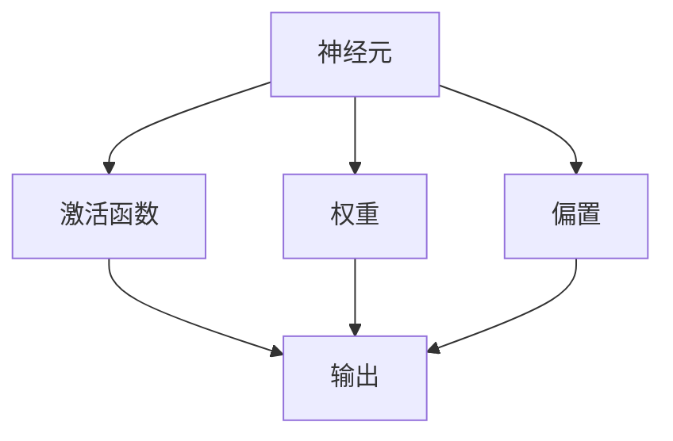

                 

### 引言与背景

#### 1.1 记忆固化的随机矩阵理论简介

**问题描述**：记忆固化是指大脑将短时记忆转化为长期记忆的过程，这一过程至关重要，因为它关系到信息储存和记忆保持。在计算机科学和人工智能领域，研究人员一直试图理解并模拟这一过程，以提高机器学习和智能系统的记忆能力。随机矩阵理论作为一种数学工具，为这一研究提供了强有力的支持。

随机矩阵理论起源于概率论和统计学，其核心思想是通过引入随机性来研究复杂系统的行为和性质。在记忆固化过程中，大脑通过随机矩阵来处理和存储信息，这一现象引发了科学家们对随机矩阵理论在神经科学中应用的浓厚兴趣。

**问题解决**：随机矩阵理论在记忆固化中的应用主要体现在以下几个方面：

1. **信息编码**：大脑通过随机矩阵将短时记忆中的信息进行编码，使其更适合长期存储。这个过程类似于数据压缩，通过减少冗余信息来提高记忆效率。
2. **噪声容忍**：随机矩阵对噪声具有较好的容忍性，这意味着大脑即使在存在一定误差的情况下，也能保持记忆的准确性。
3. **动态调整**：大脑通过不断调整随机矩阵的参数，来优化记忆存储的效果。这种动态调整机制有助于适应不同的记忆任务和环境变化。

**边界与外延**：记忆固化随机矩阵理论的研究范围涵盖了多个领域，包括神经科学、心理学、计算机科学和人工智能等。然而，该理论也存在一定的局限性：

1. **简化模型**：目前的研究主要基于简化的数学模型，无法完全反映大脑复杂的生物化学过程。
2. **参数调优**：随机矩阵中的参数需要通过实验数据来调优，这使得理论研究与实际应用之间存在一定的差距。

**核心概念与要素组成**：记忆固化随机矩阵理论的核心概念包括随机矩阵、神经网络、信息编码和动态调整等。其中，随机矩阵是基础，神经网络是实现记忆固化的关键工具，信息编码和动态调整则决定了记忆的效率和准确性。

#### 1.2 神经连接的数学模型

**核心概念原理**：神经连接的数学模型主要研究神经元之间如何通过数学关系进行信息传递和存储。这个模型包括以下几个核心概念：

1. **神经元**：神经元是神经网络的基本单元，其工作原理类似于计算机中的处理单元。每个神经元可以接收多个输入，并通过激活函数产生输出。
2. **激活函数**：激活函数用于确定神经元何时被激活，常见的激活函数包括线性函数、Sigmoid函数和ReLU函数等。
3. **权重**：权重表示神经元之间的连接强度，通过调整权重可以改变信息传递的效果。
4. **偏置**：偏置是神经元内部的一个常数，用于调整神经元的激活阈值。

**概念属性特征对比表格**：

| 特征          | 线性神经元           | 非线性神经元           |
|---------------|----------------------|------------------------|
| 激活函数      | 线性函数             | Sigmoid函数、ReLU函数等 |
| 权重调整方式  | 线性调整             | 非线性调整             |
| 信息处理能力  | 较弱，适合简单任务   | 较强，适合复杂任务     |

**ER实体关系图架构**：

**神经连接模型的应用领域**：

1. **神经科学**：神经连接模型帮助科学家们理解大脑如何处理和存储信息，从而为治疗神经系统疾病提供理论支持。
2. **人工智能**：神经网络和深度学习是人工智能的核心技术，通过模拟大脑的神经连接，可以实现复杂的认知任务，如图像识别、自然语言处理等。

**本章小结**：本章首先介绍了记忆固化的随机矩阵理论，包括其背景、关键作用和适用范围。接着，详细阐述了神经连接的数学模型，包括核心概念、属性特征对比和实体关系图。通过这些内容，读者可以初步了解记忆固化随机矩阵理论和神经连接数学模型的基本概念和应用。

### 1.3 神经连接模型在认知科学中的应用

**神经连接模型在认知科学中的应用**：

神经连接模型在认知科学中的应用主要体现在对人类大脑信息处理机制的模拟和研究中。通过建立数学模型，科学家们可以更深入地理解人类的学习、记忆和感知等认知过程。

**学习过程**：

学习是指大脑通过不断的经验积累来改变神经元之间的连接权重，从而改变信息处理的方式。在神经连接模型中，学习过程通常通过反向传播算法实现。反向传播算法通过计算输出误差，并反向传播到神经网络中的每个神经元，从而调整权重和偏置。这个过程使得神经网络能够不断优化自身，以更好地适应新的输入信息。

**记忆过程**：

记忆是大脑将信息从短期存储转化为长期存储的能力。在神经连接模型中，记忆过程通过随机矩阵和信息编码实现。大脑通过随机矩阵对信息进行编码，使其更适合长期存储。同时，通过动态调整随机矩阵的参数，大脑能够优化记忆存储的效果，从而提高记忆的准确性。

**感知过程**：

感知是指大脑对外界信息的处理和理解。在神经连接模型中，感知过程通过神经网络实现。神经网络通过多层次的神经元连接，可以实现对复杂信息的处理和理解。例如，通过卷积神经网络，可以实现图像识别；通过循环神经网络，可以实现自然语言处理。

**神经连接模型在认知科学中的优势**：

1. **高度的抽象能力**：神经连接模型能够将复杂的认知过程抽象为数学模型，从而便于分析和计算。
2. **良好的可扩展性**：神经连接模型可以很容易地扩展到不同的认知任务，从而适应不同的应用场景。
3. **强大的适应性**：神经连接模型能够通过学习机制不断优化自身，以适应新的环境和任务。

**本章小结**：

本章详细介绍了神经连接模型在认知科学中的应用，包括学习、记忆和感知等过程。通过这些应用，读者可以初步了解神经连接模型在理解人类认知机制方面的作用和优势。这为进一步研究记忆固化随机矩阵理论提供了重要的理论支持。

### 1.4 神经连接模型在人工智能中的应用

**神经连接模型在人工智能中的应用**：

神经连接模型在人工智能领域得到了广泛的应用，其核心在于通过模拟大脑的神经连接机制，实现复杂的认知任务。以下将详细介绍神经连接模型在人工智能中的应用领域及其优势。

**神经网络**：

神经网络（Neural Networks）是人工智能的核心技术之一，其基本原理来源于对大脑神经网络的模拟。神经网络由大量相互连接的神经元组成，每个神经元都负责处理一部分信息，并将处理结果传递给其他神经元。通过层层传递，神经网络可以实现对复杂信息的处理和理解。

神经网络的应用领域包括：

1. **图像识别**：通过卷积神经网络（Convolutional Neural Networks, CNN），可以实现对图像的自动分类和识别。例如，在医疗图像分析中，CNN可以用于识别病变区域，提高诊断的准确性。
2. **自然语言处理**：通过循环神经网络（Recurrent Neural Networks, RNN）和长短期记忆网络（Long Short-Term Memory, LSTM），可以实现对自然语言的理解和生成。例如，在机器翻译中，RNN和LSTM可以用于生成流畅的译文。
3. **语音识别**：通过深度神经网络（Deep Neural Networks, DNN），可以实现对语音信号的自动识别。例如，在智能助手中，DNN可以用于识别用户的语音指令，并生成相应的响应。

**深度学习**：

深度学习（Deep Learning）是一种基于神经网络的机器学习方法，其核心思想是通过多层次的神经网络结构，实现对复杂特征的学习和提取。深度学习在图像识别、自然语言处理、语音识别等任务中取得了显著的效果。

深度学习的优势包括：

1. **自动特征提取**：深度学习可以通过多层神经网络，自动提取图像、文本和语音等数据中的复杂特征，从而避免了传统机器学习中的特征工程。
2. **强大的表达能力**：深度学习模型可以表示复杂的数据分布和关系，从而在多个任务中取得了优异的性能。
3. **良好的泛化能力**：深度学习模型通过对大量数据进行训练，可以较好地避免过拟合问题，从而在新的数据上表现出良好的泛化能力。

**神经连接模型在人工智能中的应用案例**：

1. **自动驾驶**：在自动驾驶系统中，神经连接模型可以用于实现路径规划、障碍物检测和驾驶决策等功能。通过模拟大脑的神经连接机制，自动驾驶系统可以更好地理解道路环境，并做出安全的驾驶决策。
2. **智能医疗**：在智能医疗中，神经连接模型可以用于疾病诊断、药物研发和患者护理等任务。通过分析大量的医学数据，神经连接模型可以识别出潜在的疾病风险，并提供建议。
3. **智能客服**：在智能客服系统中，神经连接模型可以用于实现自然语言理解和对话生成。通过模拟人类的思维过程，智能客服可以更好地理解用户的需求，并提供个性化的服务。

**本章小结**：

本章介绍了神经连接模型在人工智能中的应用领域和优势，包括神经网络和深度学习等。通过这些应用，神经连接模型为人工智能的发展提供了强大的支持。接下来，我们将进一步探讨随机矩阵理论在神经连接模型中的应用，以及如何通过数学模型来解释大脑中的记忆固化过程。

### 1.5 本章小结

本章首先介绍了记忆固化的随机矩阵理论，探讨了其背景、关键作用和应用领域。接着，详细阐述了神经连接的数学模型，包括其核心概念、属性特征和实体关系图。此外，本章还介绍了神经连接模型在认知科学和人工智能中的应用，展示了其在学习、记忆和感知等方面的优势。

通过对本章内容的回顾，我们可以看到记忆固化随机矩阵理论和神经连接数学模型在理解和模拟大脑信息处理过程方面的重要性。这些理论不仅为科学研究提供了新的视角，也为人工智能的发展提供了强大的技术支持。

本章的重要性在于，它为我们提供了一个基础性的框架，用于理解大脑和人工智能中的信息处理机制。通过这些理论，我们可以更好地设计智能系统，提高其学习和记忆能力，从而推动人工智能技术的进步。

### 第二部分：记忆固化随机矩阵理论的基础

#### 2.1 随机矩阵理论的基本概念

**随机矩阵的定义**：

随机矩阵是一种数学矩阵，其中的元素是随机变量。随机矩阵通常用于概率论、统计学和数值计算等领域，其核心思想是通过引入随机性来研究复杂系统的行为和性质。

**随机矩阵的特性**：

1. **分布**：随机矩阵的元素通常服从特定的概率分布，如正态分布、均匀分布等。这种分布决定了随机矩阵的主要统计特性。
2. **期望值**：随机矩阵的期望值是指矩阵中每个元素的期望值。期望值反映了矩阵元素的平均水平。
3. **方差**：随机矩阵的方差是指矩阵中每个元素的方差。方差描述了矩阵元素的离散程度。
4. **协方差**：随机矩阵的协方差矩阵描述了矩阵中不同元素之间的关系。协方差矩阵反映了矩阵的依赖性。

**随机矩阵在数学中的应用**：

1. **概率论**：随机矩阵在概率论中具有重要地位，可以用于研究随机变量的分布、期望值和方差等。
2. **统计学**：随机矩阵在统计学中的应用非常广泛，如线性回归分析、方差分析、贝叶斯统计等。
3. **数值计算**：随机矩阵在数值计算中扮演关键角色，如矩阵分解、求解线性方程组等。

**随机矩阵在数学中的应用示例**：

- **矩阵分解**：通过奇异值分解（Singular Value Decomposition, SVD），可以将一个随机矩阵分解为三个矩阵的乘积，从而简化计算。
- **线性方程组求解**：通过矩阵求逆，可以解决线性方程组。当矩阵为随机矩阵时，这种求解方法在理论和实际应用中都有很高的价值。

#### 2.2 随机矩阵在数学中的应用

**随机矩阵在概率论中的应用**：

1. **概率分布**：随机矩阵可以用来研究随机变量的概率分布。例如，通过特征值分析，可以确定矩阵的特征值分布，从而推断随机变量的分布。
2. **随机变量**：随机矩阵的元素是随机变量，因此可以用于研究随机变量的性质，如期望值、方差和协方差。

**随机矩阵在数值计算中的应用**：

1. **矩阵分解**：通过随机矩阵的分解，可以简化复杂的矩阵运算。例如，通过奇异值分解，可以将一个大型矩阵分解为三个较小的矩阵，从而降低计算复杂度。
2. **线性方程组求解**：随机矩阵在求解线性方程组方面具有重要作用。例如，通过矩阵求逆，可以高效地解决线性方程组问题。

**随机矩阵在统计学中的应用**：

1. **回归分析**：在回归分析中，随机矩阵可以用于建立模型，从而预测因变量的值。
2. **方差分析**：方差分析是一种统计方法，用于比较不同组之间的差异。随机矩阵在方差分析中用于建立统计模型，从而进行假设检验。

**随机矩阵在数据科学中的应用**：

1. **机器学习**：在机器学习中，随机矩阵可以用于特征提取和模型训练。例如，通过随机梯度下降法，可以优化神经网络的参数。
2. **数据挖掘**：数据挖掘是一种从大量数据中发现有价值信息的方法。随机矩阵在数据挖掘中用于发现数据中的模式，从而提取有用的信息。

**随机矩阵的基本定理与性质**：

1. **中心极限定理**：中心极限定理描述了当随机变量的样本量足够大时，其样本均值的分布趋于正态分布。
2. **大数定律**：大数定律描述了当随机变量的样本量足够大时，其样本均值的估计误差趋于零。

**随机矩阵的性质**：

1. **一致性**：随机矩阵的一致性是指随着样本量的增加，随机矩阵的估计值趋于真实值。
2. **稳定性**：随机矩阵的稳定性是指其统计特性在不同条件下保持不变。

**本章小结**：

本章详细介绍了随机矩阵理论的基本概念和应用，包括其在概率论、数值计算和统计学中的应用。通过这些内容，读者可以全面了解随机矩阵理论的核心概念和重要性质，为进一步理解记忆固化随机矩阵理论奠定基础。

### 2.3 随机矩阵理论在记忆固化中的应用

**随机矩阵理论在记忆固化中的应用**：

随机矩阵理论在记忆固化中的应用主要体现在其对大脑信息处理过程的模拟和解释。通过引入随机性，随机矩阵理论为理解大脑如何将短时记忆转化为长期记忆提供了新的视角。

**信息编码**：

信息编码是记忆固化过程中的第一步，它涉及将短时记忆中的信息转换为适合长期存储的形式。在随机矩阵理论中，信息编码通过随机矩阵实现。大脑通过随机矩阵将短时记忆中的信息进行编码，从而使其更适合长期存储。这种编码方式类似于数据压缩，通过减少冗余信息来提高记忆效率。

**动态调整**：

动态调整是记忆固化过程中关键的一环，它涉及根据不同的记忆任务和环境变化，调整随机矩阵的参数，以优化记忆存储的效果。在随机矩阵理论中，动态调整通过不断更新随机矩阵的参数实现。大脑通过感知外部环境的变化，并利用反馈机制，不断调整随机矩阵的参数，从而优化记忆的准确性和效率。

**噪声容忍**：

噪声容忍是指大脑在处理和存储信息时，对噪声的容忍程度。在随机矩阵理论中，随机矩阵对噪声具有较好的容忍性，这意味着大脑即使在存在一定误差的情况下，也能保持记忆的准确性。这种噪声容忍性使得大脑在复杂环境中，仍然能够有效地处理和存储信息。

**记忆更新**：

记忆更新是指大脑对已有记忆进行修正和优化的过程。在随机矩阵理论中，记忆更新通过动态调整随机矩阵的参数实现。大脑通过不断调整随机矩阵的参数，来优化记忆存储的效果。这种动态调整机制有助于适应不同的记忆任务和环境变化，从而提高记忆的准确性和效率。

**本章小结**：

本章详细介绍了随机矩阵理论在记忆固化中的应用，包括信息编码、动态调整、噪声容忍和记忆更新等过程。通过这些内容，读者可以初步了解随机矩阵理论在记忆固化中的作用和重要性。这为进一步研究记忆固化随机矩阵理论提供了重要的理论支持。

### 2.4 记忆固化随机矩阵理论的发展与未来展望

**记忆固化随机矩阵理论的发展**：

记忆固化随机矩阵理论是近年来神经科学和计算理论领域的重要研究方向。自提出以来，该理论已经在多个方面取得了显著进展：

1. **基础理论完善**：通过对随机矩阵理论的深入研究，科学家们提出了多种记忆固化模型，如Hebbian模型、Stochastic Rescaling模型等，这些模型为理解大脑如何处理和存储信息提供了新的视角。
2. **实验验证**：通过神经影像学和电生理学技术，研究人员在实验中验证了随机矩阵理论的一些关键假设，如记忆编码的随机性、动态调整的机制等。
3. **应用扩展**：随机矩阵理论不仅在神经科学领域得到了广泛应用，还逐渐渗透到计算机科学、人工智能等领域，为其提供了新的理论支持。

**未来展望**：

尽管记忆固化随机矩阵理论已经取得了显著进展，但仍然面临一些挑战和机遇：

1. **复杂性研究**：大脑是一个高度复杂的系统，其记忆固化过程涉及多种生物化学机制。未来研究需要进一步探讨这些机制如何通过随机矩阵理论进行建模和解释。
2. **跨学科融合**：记忆固化随机矩阵理论需要与生物学、心理学等多个学科进行深度融合，以全面理解大脑的记忆机制。
3. **应用拓展**：在人工智能领域，如何将记忆固化随机矩阵理论应用于机器学习和智能系统，以提高其记忆能力和适应性，是一个重要的研究方向。

**本章小结**：

本章回顾了记忆固化随机矩阵理论的发展历程，探讨了其在神经科学和人工智能领域的应用前景。通过这些内容，读者可以更好地理解记忆固化随机矩阵理论的重要性，并为未来的研究提供启示。

### 第三部分：神经连接的数学模型

#### 3.1 神经网络的数学模型

**神经网络的基本组成**：

神经网络由大量的神经元组成，每个神经元都通过与其他神经元相连接来进行信息处理。神经网络的基本组成包括输入层、隐藏层和输出层。

- **输入层**：输入层是神经网络的起点，它接收外部输入的信息。每个输入层神经元对应一个输入特征。
- **隐藏层**：隐藏层位于输入层和输出层之间，用于提取输入数据的特征和模式。隐藏层可以有一个或多个层级，层数越多，网络的能力越强。
- **输出层**：输出层是神经网络的终点，它产生最终输出结果。输出层神经元的数量取决于具体的应用需求。

**神经元的工作原理**：

神经元是神经网络的基本单元，其工作原理可以类比于生物神经元的传递信号过程。每个神经元接收多个输入信号，并经过激活函数处理后产生输出信号。

1. **输入信号**：神经元接收到的输入信号是其权重与对应输入的乘积。每个输入都有一个相应的权重，这些权重决定了神经元对特定输入的敏感性。
2. **加权求和**：将所有输入信号加权求和，得到神经元的总输入值。总输入值通常是各输入信号加权求和后的结果。
3. **激活函数**：激活函数用于确定神经元是否被激活。常见的激活函数包括线性函数、Sigmoid函数、ReLU函数等。激活函数可以引入非线性，使神经网络能够处理复杂的信息。

**神经网络的结构**：

神经网络的结构可以通过拓扑结构图来表示。常见的神经网络结构包括全连接神经网络、卷积神经网络、循环神经网络等。

1. **全连接神经网络**：全连接神经网络（Fully Connected Neural Network）是最常见的神经网络结构，其中每个神经元都与上一层和下一层的所有神经元相连接。全连接神经网络适用于大多数监督学习问题。
2. **卷积神经网络**：卷积神经网络（Convolutional Neural Network，CNN）特别适用于处理图像数据。CNN通过卷积操作提取图像的特征，使其在图像识别、目标检测等任务中表现出色。
3. **循环神经网络**：循环神经网络（Recurrent Neural Network，RNN）适用于处理序列数据。RNN通过循环连接，将前一个时间步的输出作为当前时间步的输入，从而实现信息的长时间记忆。

**神经网络的特点**：

1. **并行计算**：神经网络可以通过并行计算来加速信息处理，从而提高计算效率。
2. **非线性映射**：神经网络通过非线性激活函数，能够实现复杂的非线性映射，从而处理复杂的信息。
3. **自适应学习**：神经网络通过学习过程，可以自适应地调整权重和偏置，以优化模型的性能。

**神经网络的应用领域**：

神经网络在多个领域得到了广泛应用，包括：

1. **图像识别**：神经网络可以用于图像分类、目标检测、图像分割等任务。
2. **自然语言处理**：神经网络可以用于文本分类、情感分析、机器翻译等任务。
3. **语音识别**：神经网络可以用于语音信号处理、语音识别等任务。
4. **推荐系统**：神经网络可以用于构建推荐系统，实现个性化推荐。

**本章小结**：

本章介绍了神经网络的数学模型，包括其基本组成、神经元的工作原理和神经网络的结构。通过这些内容，读者可以初步了解神经网络的基本概念和原理，为进一步研究神经网络的训练和优化打下基础。

#### 3.2 神经网络的训练方法

**反向传播算法**：

反向传播算法（Backpropagation Algorithm）是神经网络训练中最常用的方法之一。其基本原理是通过计算输出误差，并反向传播到神经网络中的每个神经元，从而调整权重和偏置。反向传播算法可以分为以下几个步骤：

1. **前向传播**：将输入数据传递到神经网络中，逐层计算每个神经元的输出值。
2. **计算误差**：将实际输出与期望输出进行比较，计算输出误差。
3. **反向传播**：将输出误差反向传播到神经网络中的每个神经元，计算每个神经元的误差梯度。
4. **权重更新**：根据误差梯度调整神经网络的权重和偏置，以减少输出误差。

**梯度下降法**：

梯度下降法（Gradient Descent）是一种优化算法，用于最小化损失函数。在神经网络训练中，梯度下降法用于更新权重和偏置。梯度下降法可以分为以下几个步骤：

1. **计算梯度**：计算损失函数对每个权重的偏导数，即梯度。
2. **更新权重**：根据梯度更新权重，以减少损失函数的值。更新公式通常为：$$\theta_{\text{new}} = \theta_{\text{old}} - \alpha \cdot \nabla_{\theta} J(\theta)$$，其中 $\alpha$ 是学习率。
3. **重复迭代**：重复上述步骤，直到满足停止条件，如收敛或达到最大迭代次数。

**前馈神经网络**：

前馈神经网络（Feedforward Neural Network）是最常见的神经网络结构之一。其基本原理是信息从输入层经过隐藏层传递到输出层。前馈神经网络的特点是信息流单向传递，没有循环。

**循环神经网络**：

循环神经网络（Recurrent Neural Network，RNN）特别适用于处理序列数据。其基本原理是信息在时间维度上循环传递，从而实现信息的长时间记忆。RNN的主要优点是能够处理变长的序列数据，但同时也存在一些问题，如梯度消失和梯度爆炸。

**本章小结**：

本章介绍了神经网络的训练方法，包括反向传播算法和梯度下降法。此外，还介绍了前馈神经网络和循环神经网络的基本原理。通过这些内容，读者可以初步了解神经网络训练的方法和原理，为进一步研究和应用神经网络打下基础。

#### 3.3 神经网络的分类与特点

**神经网络的基本分类**：

神经网络可以根据其结构和工作原理进行分类，常见的神经网络类型包括：

1. **前馈神经网络**：前馈神经网络（Feedforward Neural Network，FNN）是最简单的神经网络类型，信息从输入层直接传递到输出层，没有循环。前馈神经网络常用于分类和回归任务。
2. **循环神经网络**：循环神经网络（Recurrent Neural Network，RNN）特别适用于处理序列数据，其信息在时间维度上循环传递。RNN可以用于自然语言处理、语音识别等任务。
3. **卷积神经网络**：卷积神经网络（Convolutional Neural Network，CNN）专门用于处理图像数据，通过卷积操作提取图像的特征。CNN在图像识别、目标检测等领域表现出色。
4. **生成对抗网络**：生成对抗网络（Generative Adversarial Network，GAN）由生成器和判别器组成，用于生成真实数据的概率分布。GAN在图像生成、图像修复等领域得到广泛应用。

**神经网络的特点**：

1. **非线性映射**：神经网络通过非线性激活函数，能够实现复杂的非线性映射，从而处理复杂的信息。
2. **自适应学习**：神经网络通过学习过程，可以自适应地调整权重和偏置，以优化模型的性能。
3. **并行计算**：神经网络可以通过并行计算来加速信息处理，从而提高计算效率。

**神经网络在记忆固化中的应用**：

1. **长期依赖问题**：神经网络可以用于解决长期依赖问题，如通过长短期记忆网络（Long Short-Term Memory，LSTM）实现信息的长时间记忆。
2. **记忆保持网络**：记忆保持网络（Memory Retentive Network）是一种基于神经网络的记忆模型，其核心思想是通过调整网络结构，实现信息的记忆和保持。
3. **动态调整机制**：神经网络可以通过动态调整权重和偏置，实现记忆的更新和优化，从而适应不同的记忆任务和环境变化。

**本章小结**：

本章介绍了神经网络的分类与特点，包括前馈神经网络、循环神经网络、卷积神经网络和生成对抗网络等。此外，还介绍了神经网络在记忆固化中的应用，如长期依赖问题、记忆保持网络和动态调整机制。通过这些内容，读者可以全面了解神经网络的基本概念和应用，为进一步研究和应用神经网络打下基础。

#### 3.4 神经网络在记忆固化中的应用

**记忆保持模型**：

记忆保持模型（Memory Retention Model）是一种基于神经网络的记忆模型，其核心思想是通过调整神经网络的结构和参数，实现信息的记忆和保持。常见的记忆保持模型包括：

1. **长短期记忆网络（LSTM）**：LSTM是一种特殊的循环神经网络，能够解决长期依赖问题，实现信息的长时间记忆。LSTM通过引入门控机制，可以自适应地调整信息的流动，从而优化记忆效果。
2. **门控循环单元（GRU）**：GRU是另一种循环神经网络，其结构与LSTM类似，但计算更为简单。GRU通过引入更新门和重置门，实现信息的记忆和保持。

**记忆更新模型**：

记忆更新模型（Memory Update Model）是一种基于神经网络的记忆更新模型，其核心思想是通过动态调整神经网络的结构和参数，实现信息的更新和优化。常见的记忆更新模型包括：

1. **自适应权重更新模型**：该模型通过引入自适应权重更新机制，实时调整神经网络中的权重，以优化记忆效果。自适应权重更新模型可以应用于多种神经网络结构，如前馈神经网络、卷积神经网络和循环神经网络等。
2. **记忆动态调整模型**：该模型通过动态调整神经网络的参数，实现记忆的更新和优化。记忆动态调整模型可以根据不同的记忆任务和环境变化，自适应地调整记忆策略。

**神经网络在记忆固化中的应用优势**：

1. **自适应学习**：神经网络可以通过学习过程，自适应地调整权重和偏置，以优化记忆效果。这种自适应学习机制使得神经网络能够适应不同的记忆任务和环境变化。
2. **非线性映射**：神经网络通过非线性激活函数，能够实现复杂的非线性映射，从而处理复杂的信息。这种非线性映射能力使得神经网络在记忆固化中能够更好地处理和存储信息。
3. **并行计算**：神经网络可以通过并行计算来加速信息处理，从而提高计算效率。这种并行计算能力使得神经网络在处理大量数据时，具有更高的计算性能。

**本章小结**：

本章介绍了神经网络在记忆固化中的应用，包括记忆保持模型和记忆更新模型。通过这些内容，读者可以了解神经网络在记忆固化中的优势和应用。这为进一步研究和应用神经网络在记忆固化中的提供了理论基础。

### 3.5 本章小结

本章详细介绍了神经网络的数学模型，包括其基本组成、神经元的工作原理、训练方法、分类与特点，以及神经网络在记忆固化中的应用。通过对这些内容的回顾，读者可以全面了解神经网络的基本概念和原理，为进一步研究和应用神经网络打下基础。

### 总结与展望

#### 记忆固化随机矩阵理论的整体理解

记忆固化随机矩阵理论是一种结合了随机矩阵理论和神经网络模型的数学框架，旨在解释和模拟大脑记忆固化的过程。该理论的核心在于利用随机矩阵对大脑信息处理过程进行建模，通过信息编码、动态调整和噪声容忍等机制，实现短期记忆向长期记忆的转化。

**整体理解**：

- **随机矩阵的应用**：随机矩阵作为一种数学工具，其引入的随机性为大脑信息处理过程提供了理论基础。通过随机矩阵，大脑可以高效地编码和存储信息，并具有一定的噪声容忍性。
- **神经网络的作用**：神经网络作为信息处理的核心，通过其结构和工作原理，实现了对信息的编码、解码和调整。神经网络的多层结构和非线性映射能力，使得其在处理复杂信息方面具有显著优势。
- **记忆固化的动态调整**：记忆固化过程中，动态调整机制至关重要。通过不断调整神经网络中的参数，大脑可以优化记忆效果，适应不同的记忆任务和环境变化。

#### 神经连接数学模型的应用前景

神经连接数学模型在认知科学和人工智能领域具有广泛的应用前景。通过模拟大脑的神经连接机制，该模型可以帮助我们更好地理解和优化智能系统的记忆能力。

**应用前景**：

- **智能医疗**：神经连接模型可以用于疾病诊断、药物研发和患者护理等任务。通过模拟大脑的信息处理过程，智能医疗系统可以更准确地识别疾病风险，提供个性化的治疗方案。
- **自动驾驶**：在自动驾驶系统中，神经连接模型可以用于实现路径规划、障碍物检测和驾驶决策等功能。通过模拟大脑的感知和决策过程，自动驾驶系统可以更好地适应复杂环境。
- **自然语言处理**：神经连接模型在自然语言处理中具有广泛的应用，如文本分类、情感分析和机器翻译等。通过模拟大脑的语言处理机制，智能系统可以更准确地理解和生成自然语言。
- **教育技术**：神经连接模型可以用于个性化教育系统的开发。通过模拟大脑的学习和记忆过程，教育技术可以提供更有效的学习策略，提高学生的学习效果。

#### 未来研究方向与挑战

尽管记忆固化随机矩阵理论和神经连接数学模型已经取得了显著进展，但仍存在一些未来研究方向和挑战。

**未来研究方向**：

- **跨学科融合**：未来的研究需要进一步融合神经科学、心理学、计算机科学等多个学科，以全面理解大脑的记忆机制。
- **复杂性研究**：大脑是一个高度复杂的系统，未来的研究需要深入探讨大脑中复杂的生物化学机制，并建立更准确的数学模型。
- **应用拓展**：未来的研究需要将记忆固化随机矩阵理论和神经连接数学模型应用于更多领域，如机器人学、人机交互等。

**未来挑战**：

- **计算效率**：大脑的记忆过程高度并行和高效，未来的研究需要开发更高效的算法和计算模型，以模拟大脑的这种高效性。
- **数据采集与处理**：大脑数据采集和处理是研究中的一个难点，未来的研究需要开发更先进的技术，以获取高质量的大脑数据，并对其进行有效处理。
- **理论验证**：未来的研究需要通过实验和临床验证，验证记忆固化随机矩阵理论和神经连接数学模型的准确性和有效性。

#### 结论

记忆固化随机矩阵理论和神经连接数学模型为我们提供了一种理解和模拟大脑记忆机制的新视角。通过这些理论，我们可以更好地设计和优化智能系统，提高其记忆能力和适应性。未来的研究将在这两个领域取得更多突破，为人工智能和认知科学的发展做出更大贡献。

