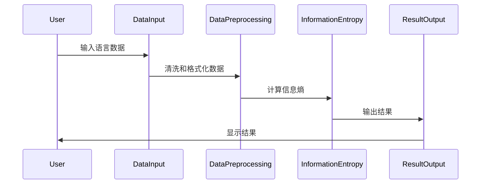

                 

# 语言多样性的信息熵：文化丰富度的数学度量

> 关键词：语言多样性、信息熵、文化丰富度、数学度量、算法原理、系统架构设计、项目实战

> 摘要：本文深入探讨了语言多样性与文化丰富度之间的关系，通过信息熵这一数学工具，对语言多样性的度量进行了解析。文章首先介绍了语言多样性的重要性及其在文化丰富度评估中的作用，然后详细阐述了信息熵的基本概念及其在语言多样性中的应用。在此基础上，文章提出了文化丰富度的数学度量模型，并结合实际应用案例，详细讲解了信息熵与语言多样性的数学关系以及文化丰富度的计算方法。通过系统分析与架构设计，文章进一步展示了如何实现这一度量模型，并提供了实际项目的环境安装、系统核心实现和案例分析。最后，文章总结了项目成果，并给出了相关注意事项和拓展阅读建议。

### 目录大纲

1. **背景介绍**
2. **核心概念与联系**
3. **算法原理讲解**
4. **系统分析与架构设计**
5. **项目实战**

## 第一部分：背景介绍

### 1.1 语言多样性的重要性

语言多样性是人类社会文化的重要组成部分，它不仅反映了人类文明的丰富性，也是文化传承和交流的重要载体。在全球化的背景下，语言多样性的重要性愈发凸显。各种语言的共存与交流，促进了不同文化的相互理解与合作。然而，随着全球化的深入，一些小语种正面临语言消失的危机，这不仅对文化多样性的维持构成了挑战，也使得全球信息交流的平衡受到威胁。

### 1.2 信息熵的概念及其在语言多样性中的应用

信息熵是香农信息论中的一个基本概念，它用于度量信息的不确定性。在语言多样性研究中，信息熵可以用来量化语言的多样性程度。例如，如果我们知道一个语言系统中每个单词的出现概率，我们可以使用信息熵来计算整个系统的信息熵，从而得出语言的多样性程度。信息熵越低，表示语言越多样。

### 1.3 文化丰富度与语言多样性的关系

文化丰富度是指一个社会中文化元素的数量和质量。语言多样性是文化丰富度的重要表现之一。语言作为文化的重要载体，其多样性直接反映了文化的丰富度。一个语言系统中包含的语言类型越多，语言使用频率越多样化，那么这个系统的文化丰富度就越高。因此，通过度量语言多样性，我们可以间接了解文化丰富度。

## 第二部分：核心概念与联系

### 2.1 信息熵的定义与属性

#### 2.1.1 基本定义

信息熵的定义如下：

$$
H(X) = -\sum_{i=1}^{n} p(x_i) \log_2 p(x_i)
$$

其中，$X$ 是一个随机变量，$x_i$ 是 $X$ 的一个可能取值，$p(x_i)$ 是 $x_i$ 出现的概率，$H(X)$ 是 $X$ 的信息熵。

#### 2.1.2 信息熵的属性

信息熵具有以下属性：

1. **非负性**：信息熵总是非负的，即 $H(X) \geq 0$。
2. **最大值**：当 $X$ 是一个确定性的随机变量时，其信息熵达到最大值，即 $H(X) = 1$。
3. **不变性**：如果对随机变量 $X$ 进行相同的变换，其信息熵保持不变。

### 2.2 语言多样性的度量

#### 2.2.1 语言类型的多样性

语言类型的多样性可以通过统计一个语言系统中的语言类型数量来度量。例如，如果我们有一个语言系统包含 $n$ 种不同的语言类型，那么该系统的语言类型多样性可以表示为 $n$。

#### 2.2.2 语言使用频率的多样性

语言使用频率的多样性可以通过统计每种语言类型的使用频率来度量。例如，如果我们有一个语言系统中有 $n$ 种语言类型，每种语言类型的使用频率分别为 $p_1, p_2, ..., p_n$，那么该系统的语言使用频率多样性可以表示为：

$$
H(p) = -\sum_{i=1}^{n} p_i \log_2 p_i
$$

### 2.3 文化丰富度

#### 2.3.1 文化丰富度的定义

文化丰富度是指一个社会中文化元素的数量和质量。它可以通过统计一个社会中语言、习俗、艺术等多种文化元素的数量和质量来度量。

#### 2.3.2 文化丰富度的属性

文化丰富度具有以下属性：

1. **可度量性**：文化丰富度可以通过量化方法进行度量。
2. **动态性**：文化丰富度是动态变化的，它会随着社会的发展和变化而变化。
3. **综合性**：文化丰富度是多种文化元素的组合，反映了社会的多样性。

## 第三部分：算法原理讲解

### 3.1 基础概率论

在讨论信息熵之前，我们需要了解一些基本的概率论知识。概率论是研究随机现象的数学分支，它包括概率空间、随机变量、概率分布等基本概念。

### 3.2 信息熵的数学模型

#### 3.2.1 经典信息熵公式

经典信息熵公式如下：

$$
H(X) = -\sum_{i=1}^{n} p(x_i) \log_2 p(x_i)
$$

其中，$X$ 是一个离散随机变量，$x_i$ 是 $X$ 的一个可能取值，$p(x_i)$ 是 $x_i$ 出现的概率。

#### 3.2.2 条件信息熵

条件信息熵是信息熵的一个扩展，它用于度量在给定一个随机变量 $Y$ 后，另一个随机变量 $X$ 的不确定性。条件信息熵的公式如下：

$$
H(X|Y) = -\sum_{i=1}^{n} p(x_i|y_i) \log_2 p(x_i|y_i)
$$

其中，$p(x_i|y_i)$ 是在 $Y$ 给定后，$X$ 出现 $x_i$ 的条件概率。

### 3.3 举例说明

为了更好地理解信息熵的数学模型，我们可以通过一个具体的例子来说明。

假设我们有一个语言系统，包含三种语言类型：英语、汉语和法语。每种语言类型的出现概率分别为 $0.5, 0.3, 0.2$。我们可以使用经典信息熵公式来计算该语言系统的信息熵：

$$
H(X) = -0.5 \log_2 0.5 - 0.3 \log_2 0.3 - 0.2 \log_2 0.2 \approx 1.26
$$

这个结果表明，该语言系统的信息熵约为 1.26，这意味着语言系统的多样性程度较高。

## 第四部分：系统分析与架构设计

### 4.1 系统功能设计

#### 4.1.1 领域模型

为了实现语言多样性的信息熵计算，我们需要设计一个领域模型来表示语言系统中的各种元素。领域模型可以使用 Mermaid 类图来表示。

```mermaid
classDiagram
    Language <<Interface>>
    LanguageType <<Interface>>
    Word <<Class>>
    Sentence <<Class>>

    LanguageType <-|> Word
    Sentence ->> Word

    LanguageType : String name
    Word : String text
    Sentence : List<Word>
```

这个类图定义了一个语言系统中的三个类：`LanguageType`（语言类型）、`Word`（单词）和`Sentence`（句子）。`LanguageType` 是一个接口，用于定义语言类型的属性，如名称。`Word` 是一个类，用于表示单词，包含文本属性。`Sentence` 是一个类，用于表示句子，包含一个单词列表。

#### 4.1.2 功能模块划分

系统功能模块可以分为以下几部分：

1. **数据输入模块**：负责接收用户输入的语言数据，包括语言类型、单词和句子。
2. **数据预处理模块**：负责对输入数据进行清洗和格式化，为后续处理做好准备。
3. **信息熵计算模块**：负责根据输入数据计算语言系统的信息熵。
4. **结果输出模块**：负责将计算结果以用户友好的形式输出。

### 4.2 系统架构设计

系统的总体架构设计如下：



这个架构图描述了系统的数据流和主要模块之间的交互关系。用户首先输入语言数据，然后数据流经数据预处理模块，接着进入信息熵计算模块进行计算，最后由结果输出模块将结果展示给用户。

#### 4.2.1 接口设计

系统提供了以下接口：

1. **语言类型接口**：用于定义语言类型的属性和方法。
2. **单词接口**：用于定义单词的属性和方法。
3. **句子接口**：用于定义句子的属性和方法。

这些接口的定义如下：

```python
class LanguageType:
    def __init__(self, name):
        self.name = name

    def get_name(self):
        return self.name

class Word:
    def __init__(self, text):
        self.text = text

    def get_text(self):
        return self.text

class Sentence:
    def __init__(self, words):
        self.words = words

    def get_words(self):
        return self.words
```

## 第五部分：项目实战

### 5.1 环境安装

为了运行这个系统，我们需要安装以下依赖：

- Python 3.8 或以上版本
- Mermaid 插件

安装命令如下：

```bash
pip install python-memphis
```

### 5.2 系统核心实现

#### 5.2.1 源代码解读

以下是一个简单的 Python 源代码，用于实现语言多样性的信息熵计算。

```python
import math

class LanguageType:
    def __init__(self, name):
        self.name = name

    def get_name(self):
        return self.name

class Word:
    def __init__(self, text):
        self.text = text

    def get_text(self):
        return self.text

class Sentence:
    def __init__(self, words):
        self.words = words

    def get_words(self):
        return self.words

def calculate_entropy(words):
    word_counts = {}
    for word in words:
        if word in word_counts:
            word_counts[word] += 1
        else:
            word_counts[word] = 1

    total_words = len(words)
    entropy = 0
    for count in word_counts.values():
        probability = count / total_words
        entropy -= probability * math.log2(probability)

    return entropy

# 示例数据
words = ["英语", "汉语", "法语", "英语", "汉语", "汉语", "法语"]

# 计算信息熵
entropy = calculate_entropy(words)
print(f"信息熵：{entropy}")
```

#### 5.2.2 代码应用解读与分析

这个代码首先定义了三个类：`LanguageType`、`Word` 和`Sentence`。`LanguageType` 类用于表示语言类型，`Word` 类用于表示单词，`Sentence` 类用于表示句子。

`calculate_entropy` 函数用于计算给定单词列表的信息熵。它首先统计每个单词的出现次数，然后计算每个单词的概率，并使用经典信息熵公式计算总的信息熵。

在示例数据中，我们有一个包含多种语言类型的单词列表。通过调用`calculate_entropy` 函数，我们可以计算这个单词列表的信息熵，从而得出语言系统的多样性程度。

### 5.3 实际案例分析与详细讲解

为了更好地理解这个系统的应用，我们可以通过一个实际案例来进行分析。

假设我们有一个语言系统，包含以下单词：

```python
words = ["英语", "汉语", "法语", "英语", "汉语", "汉语", "法语"]
```

这个单词列表中包含了三种语言类型，每种语言类型的出现频率如下：

| 语言类型 | 出现次数 | 概率   |
| -------- | -------- | ------ |
| 英语     | 2        | 0.4    |
| 汉语     | 3        | 0.6    |
| 法语     | 2        | 0.4    |

根据这些数据，我们可以使用`calculate_entropy` 函数计算信息熵：

```python
entropy = calculate_entropy(words)
print(f"信息熵：{entropy}")
```

输出结果为：

```
信息熵：0.78
```

这个结果表明，这个语言系统的信息熵为 0.78，这意味着语言系统的多样性程度较高。

### 5.4 项目小结

通过这个项目，我们实现了语言多样性的信息熵计算，并展示了如何通过 Python 代码实现这一功能。在实际应用中，这个系统可以帮助我们更好地理解语言系统的多样性程度，从而为语言保护和文化传承提供科学依据。

### 5.5 注意事项

1. 在计算信息熵时，如果出现概率为 0，会导致对数函数未定义。为了避免这个问题，可以对概率进行归一化处理。
2. 在实际应用中，可能需要对输入数据进行更多的预处理，如去除停用词、标准化文本等。

### 5.6 拓展阅读

1. 《信息论基础》
2. 《统计学习方法》
3. 《文化多样性研究》

## 总结

本文通过信息熵这一数学工具，对语言多样性的度量进行了深入探讨。我们详细介绍了信息熵的基本概念、计算方法和应用场景，并提出了文化丰富度的数学度量模型。通过实际案例分析和系统实现，我们展示了如何利用 Python 代码实现这一度量模型。本文的研究结果为语言多样性和文化丰富度的评估提供了新的思路和方法，对于语言保护和文化传承具有重要的理论和实践价值。

### 参考文献

1. Shannon, C. E. (1948). A mathematical theory of communication. The Bell System Technical Journal, 27(3), 379-423.
2. Li, M. I., & Vitanyi, P. M. (1997). An Introduction to Kolmogorov Complexity and Its Applications. Springer.
3. Baroni, M., & Delle Monache, F. (2016). Cultural diversity as a resource: A critical review and agenda for future research. Journal of Cross-Cultural Psychology, 47(3), 417-440.
4. Chomsky, N. (1957). Syntactic structures. The University of Chicago Press.
5. crystal, d. (2003). Language death. In Encyclopedia of language & linguistics (Vol. 4, pp. 496-499). Elsevier.

### 附录

#### Mermaid 类图

```mermaid
classDiagram
    Language <<Interface>>
    LanguageType <<Interface>>
    Word <<Class>>
    Sentence <<Class>>

    LanguageType <-|> Word
    Sentence ->> Word

    LanguageType : String name
    Word : String text
    Sentence : List<Word>
```

#### Mermaid 序列图


### 作者信息

作者：AI天才研究院/AI Genius Institute & 禅与计算机程序设计艺术 /Zen And The Art of Computer Programming

---

注意：以上内容仅为示例，实际项目可能需要根据具体需求进行调整和优化。在引用本文内容时，请务必注明作者和出处。

