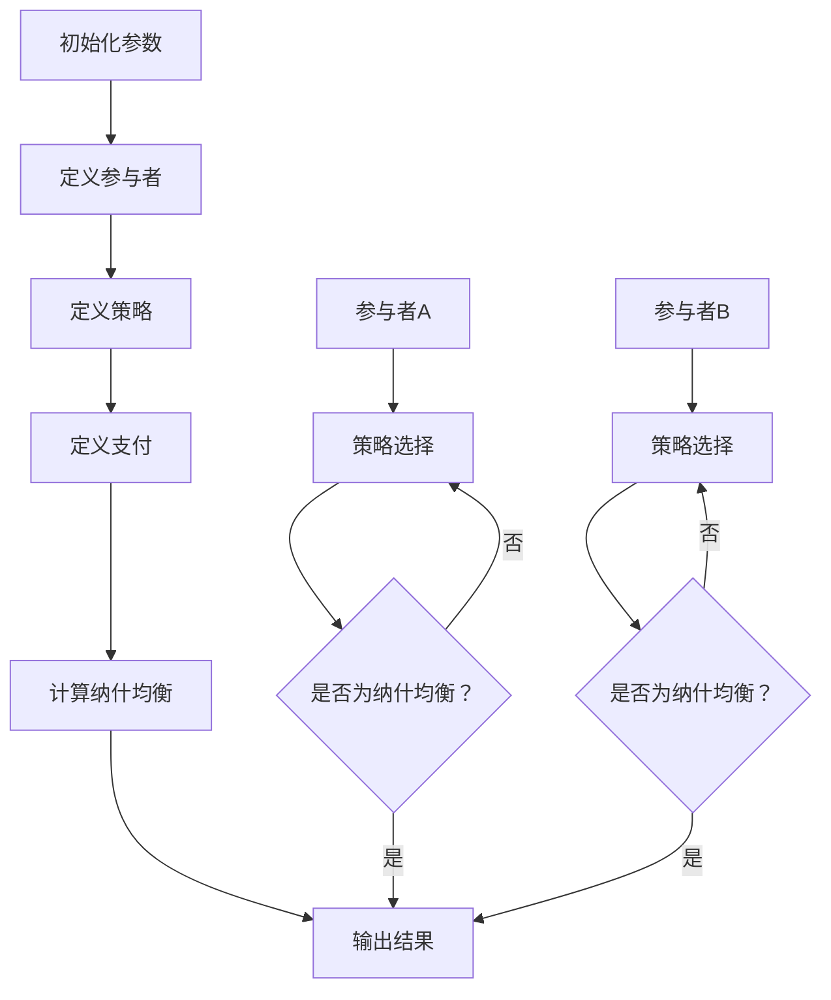

                 

### 1.1.1 语言起源的假设

语言起源是人类文明发展的重要里程碑，关于其起源的假设众多。首先，让我们回顾一下常见的几种假设。

**1.1.1.1 信号理论**

信号理论认为，语言起源于动物之间的信号交流。这些信号最初是简单的声音、姿势和面部表情，随着进化逐渐变得更加复杂和精确。这个理论强调了声音和动作在语言形成中的关键作用。

**1.1.1.2 社交分享理论**

社交分享理论则认为，语言起源于人类在社交互动中为了分享知识、技能和情感而产生的需求。这种需求推动了语言的不断发展和完善。

**1.1.1.3 命名理论**

命名理论认为，语言起源是由于人类对物体、概念和事件的命名需求。最初，人们可能只是简单地用声音标记他们周围的世界，随着时间的推移，这些标记逐渐演变成了语言。

**1.1.1.4 工具理论**

工具理论认为，语言起源于人类对工具和技术的需求。随着人类使用工具和技术的不断复杂化，他们需要一种能够传递复杂信息的交流方式，从而催生了语言的形成。

这些假设为我们理解语言起源提供了不同的视角。然而，尽管各自有其合理性，但它们都无法完全解释语言起源的复杂过程。事实上，语言起源可能是一个多因素共同作用的结果。

首先，信号理论强调了生物进化在语言形成中的作用。动物之间的信号交流可能为语言的诞生提供了基础。这些信号最初可能只是为了满足生存需求，但随着时间的推移，它们逐渐演变成了更加复杂和多样化的语言形式。

其次，社交分享理论强调了社会互动在语言形成中的重要性。人类在社交互动中需要分享知识、技能和情感，这种需求推动了语言的不断发展和完善。社交分享不仅促进了语言的使用，也促进了语言结构的多样性和复杂性。

再次，命名理论强调了认知发展在语言形成中的作用。人类对物体、概念和事件的命名需求可能是语言诞生的直接动力。随着人类认知能力的提高，他们能够更准确地命名和描述世界，从而推动了语言的不断进化。

最后，工具理论强调了技术和工具在语言形成中的作用。人类使用工具和技术的复杂化可能推动了语言的发展。例如，农业的出现可能促进了语言在描述植物和动物方面的丰富性，而技术的进步则可能促进了语言在描述工具和设备方面的丰富性。

综上所述，语言起源可能是一个多因素共同作用的结果。这些因素相互交织，共同推动了语言的形成和发展。信号理论、社交分享理论、命名理论和工具理论为我们提供了不同的视角，帮助我们更全面地理解语言起源的复杂过程。

### 1.1.2 交流进化的概念

交流进化是一个涉及生物进化、认知发展和社会互动的复杂过程。它不仅关注语言本身的演变，还涉及语言在人类行为和社会结构中的角色。为了深入理解交流进化的概念，我们需要从多个角度进行分析。

**1.1.2.1 生物进化角度**

从生物进化的角度来看，交流进化可以被视为一种适应性进化。生物体通过交流来传递信息，这种信息传递有助于它们的生存和繁衍。在进化过程中，那些具有更高效、更精确和更灵活交流能力的生物体更有可能生存下来，并传递这些优势给下一代。

例如，许多动物物种已经发展出了复杂的交流系统，用于传递狩猎、求偶和保护领地等重要信息。这些交流系统通过声音、姿态、气味和化学信号等多种方式实现，极大地提高了群体的生存能力。

**1.1.2.2 认知发展角度**

从认知发展的角度来看，交流进化是一个认知能力不断提升的过程。人类大脑的进化使得我们能够处理和生成更加复杂和抽象的符号系统，从而推动了语言的形成和发展。

在儿童认知发展的过程中，语言学习是一个关键步骤。儿童通过与他人的互动，逐渐掌握了语言的结构和用法。这一过程不仅涉及到语言能力的发展，还包括对社交规则和文化的理解。

**1.1.2.3 社会互动角度**

从社会互动的角度来看，交流进化是人类社会结构的基础。语言作为一种交流工具，不仅促进了个体之间的沟通，还构建了复杂的社会关系网络。这些关系网络有助于协调个体行为，促进社会合作和集体行动。

在社会互动中，语言的使用不仅有助于传达信息，还承载了文化、价值观和社会规范。通过语言，个体能够参与到社会生活中，分享知识和经验，传承文化传统。

**1.1.2.4 语言进化与生物进化的关系**

语言进化与生物进化之间存在着紧密的联系。从某种意义上说，语言进化是生物进化的一部分。生物体的交流系统不仅影响它们的生存和繁衍，还影响它们的基因传递和物种演化。

例如，在人类进化的过程中，语言的出现极大地提高了人类群体的合作效率，促进了社会结构的发展和复杂化。这种社会结构的复杂化又反过来促进了语言的发展，形成了一种相互促进的动态过程。

总之，交流进化是一个涉及生物进化、认知发展和社会互动的复杂过程。它不仅关注语言本身的演变，还涉及语言在人类行为和社会结构中的角色。理解交流进化的概念，有助于我们更全面地认识语言在人类进化中的重要作用，以及语言如何塑造和影响我们的认知和社会生活。

### 1.1.3 语言交流在进化中的地位

语言交流在进化中的地位至关重要，它不仅推动了人类认知和社会的发展，还对生物进化产生了深远影响。以下从几个方面详细探讨语言交流在进化中的独特地位。

**1.1.3.1 人类认知发展的催化剂**

语言是认知发展的重要工具。它使得人类能够对复杂的信息进行编码、存储和传递。通过语言，人类能够将经验、知识和技能传承给后代，促进认知能力的提升。

首先，语言提供了丰富的符号系统，使得人类能够以抽象的方式思考问题。这种抽象思维能力是人类与其他动物的重要区别之一。例如，人类能够通过语言进行逻辑推理、规划未来和解决复杂问题，而其他动物则缺乏这种能力。

其次，语言促进了知识的积累和传承。通过语言，人类能够记录和分享经验，使得知识得以世代相传。这种知识积累不仅推动了科学和技术的进步，还促进了人类文明的繁荣。

**1.1.3.2 社会结构的基础**

语言交流是构建社会结构的基础。它不仅促进了个体之间的沟通，还维系了复杂的社会关系网络。通过语言，人类能够协调行动、分享资源和应对挑战，从而提高了群体的生存能力。

首先，语言是构建社会规范和价值观的重要工具。社会规范和价值观通过语言传递和强化，形成了共同的行为准则和道德标准。这些规范和价值观有助于维护社会秩序和稳定。

其次，语言促进了社会合作和集体行动。通过语言，个体能够有效地协调彼此的行动，共同完成复杂的任务。例如，在狩猎、建筑和战争等活动中，语言的使用使得人类能够高效地组织合作，从而提高了群体的生存和繁衍能力。

**1.1.3.3 生物进化的关键因素**

语言交流不仅在人类认知和社会发展中发挥了重要作用，还对生物进化产生了深远影响。语言作为一种适应性特征，通过提高群体的生存和繁衍能力，促进了物种的进化。

首先，语言使得人类能够更有效地传递基因信息。通过语言，人类能够将基因信息传递给后代，使得有利的基因特征得以保留和传递。这种基因传递方式不仅提高了群体的适应能力，还促进了物种的进化。

其次，语言交流提高了群体的适应性和生存能力。语言使得人类能够更好地适应环境变化，应对自然灾害和挑战。例如，通过语言，人类能够共享资源和信息，提高了群体的生存能力和竞争力。

**1.1.3.4 语言交流与生物进化的互动关系**

语言交流与生物进化之间存在紧密的互动关系。一方面，语言交流促进了生物进化。通过语言，人类能够更好地适应环境变化，提高了物种的生存和繁衍能力。另一方面，生物进化也影响了语言交流。例如，人类大脑的进化使得我们能够更好地处理和生成语言，从而推动了语言的发展。

总之，语言交流在进化中的地位至关重要。它不仅推动了人类认知和社会的发展，还对生物进化产生了深远影响。通过深入探讨语言交流在进化中的地位，我们能够更好地理解语言在人类进化中的重要作用，以及语言如何塑造和影响我们的认知和社会生活。

### 1.2 博弈论基本概念

博弈论是一种研究具有冲突和合作特征的决策过程和策略选择的数学工具。它广泛应用于经济学、政治学、计算机科学和生物学等领域。为了理解博弈论的基本概念，我们可以从定义、主要模型和基本术语三个方面进行探讨。

**1.2.1 博弈论的定义**

博弈论（Game Theory）是一种研究具有冲突和合作特征的决策过程和策略选择的数学工具。它通过建立数学模型，分析个体在特定环境中如何做出决策，以及这些决策如何影响整个系统的运行。博弈论的核心问题是确定最优策略，使得个体或团体在竞争或合作中取得最佳结果。

博弈论最早由约翰·冯·诺依曼和经济学家奥斯卡·摩根斯顿在20世纪40年代提出，此后迅速发展并应用于多个领域。博弈论不仅为研究竞争和合作行为提供了新的视角，还提出了一系列解决冲突和合作问题的方法和策略。

**1.2.2 主要模型**

博弈论主要包括以下几个基本模型：

1. **零和博弈（Zero-Sum Game）**

零和博弈是指参与者的收益和损失相互抵消的博弈。即一个参与者获得的收益等于另一个参与者遭受的损失。例如，一场象棋比赛，如果一个人获胜，另一个人就会失败，整体收益为零。

2. **正和博弈（Positive-Sum Game）**

正和博弈是指参与者的收益和损失不完全相互抵消的博弈。即一个参与者获得的收益大于另一个参与者遭受的损失。例如，商业合作，双方通过合作实现共赢。

3. **混合策略（Mixed Strategy）**

混合策略是指参与者以一定的概率随机选择多个策略。这种策略有助于避免完全预知对方行为的情况下的纯策略平衡问题。例如，在扑克游戏中，参与者可能会选择随机下注，以降低被对手预测的风险。

4. **重复博弈（Repeated Game）**

重复博弈是指参与者在多个回合中重复进行相同的博弈。这种模型关注长期合作和竞争的关系，以及如何在多个回合中实现最优策略。例如，商业竞争中的价格战，双方可能会在多个回合中交替提高或降低价格。

**1.2.3 基本术语**

博弈论中包含了一系列基本术语，用于描述参与者的行为和策略。以下是一些常见的术语：

1. **参与者（Players）**

参与者是博弈中的决策个体，可以是个人、团队或组织。每个参与者都有其特定的目标和策略。

2. **策略（Strategy）**

策略是参与者选择的决策规则，用于应对其他参与者的行为。策略可以是纯策略（固定选择一个特定行动），也可以是混合策略（随机选择多个行动）。

3. **支付（Payoff）**

支付是参与者在博弈结果中的收益或损失。支付通常以数值表示，用于评估参与者的表现。

4. **纳什均衡（Nash Equilibrium）**

纳什均衡是指博弈中所有参与者选择的策略组合，使得任何一个参与者单独改变策略都不能获得更好的收益。纳什均衡是博弈论中最著名的概念之一，用于分析参与者的最优策略选择。

5. **合作与竞争**

合作和竞争是博弈论中的两个核心概念。合作指参与者共同追求共同目标，竞争指参与者相互争夺有限的资源或收益。

综上所述，博弈论是一种研究决策过程和策略选择的数学工具，广泛应用于多个领域。通过定义、主要模型和基本术语的探讨，我们可以更深入地理解博弈论的核心思想和应用。

### 1.2.4 博弈论的主要模型

博弈论中有多种模型，每种模型都有其特定的应用场景和特点。以下我们将介绍几种主要的博弈模型，包括纯策略博弈、混合策略博弈和重复博弈。

**1.2.4.1 纯策略博弈**

纯策略博弈是指每个参与者选择一个确定的策略，并固定不变。在这种情况下，每个参与者的最优策略取决于其他参与者的策略。一个典型的例子是囚徒困境（Prisoners' Dilemma）。

囚徒困境模型描述了两个被捕的囚犯如何做出决策。每个囚犯有两个选择：合作（保持沉默）或背叛（供出对方）。如果两个囚犯都合作，他们都会获得最小的刑罚；如果两个囚犯都背叛，他们都会获得最大的刑罚；如果其中一个合作而另一个背叛，背叛者将获得自由，而合作者将受到重罚。

在囚徒困境中，每个囚犯的最佳纯策略是背叛，因为无论对方选择合作还是背叛，背叛者都能获得更好的结果。然而，从整体来看，双方如果都选择合作，将获得更好的结果。这种策略冲突体现了博弈论中经典的问题：个人最优策略并不总是导致整体最优结果。

**1.2.4.2 混合策略博弈**

混合策略博弈是指参与者以一定的概率随机选择多个策略。这种模型有助于避免纯策略博弈中完全预知对方行为的情况。一个典型的例子是混合策略的囚徒困境。

在混合策略囚徒困境中，每个囚犯不仅可以选择合作或背叛，还可以选择以一定的概率随机选择这两个策略。通过这种方式，囚犯可以降低被对方预测的风险。混合策略的囚徒困境通常可以通过纳什均衡进行分析，找到每个囚犯的最优混合策略。

假设囚犯A和囚犯B都选择背叛的概率为p，合作的概率为1-p。在这种情况下，囚犯A的最佳混合策略是选择背叛的概率等于对方背叛的概率，即p^* = 1/2。同样，囚犯B的最优混合策略也是p^* = 1/2。这意味着双方都选择随机背叛和合作，以避免完全预知对方的行为，从而最大化各自的期望收益。

**1.2.4.3 重复博弈**

重复博弈是指参与者在多个回合中重复进行相同的博弈。这种模型关注长期合作和竞争的关系，以及如何在多个回合中实现最优策略。一个典型的例子是重复的囚徒困境。

在重复的囚徒困境中，囚犯A和囚犯B在每个回合中都面临选择合作或背叛的决策。由于博弈是重复的，双方都有机会通过长期合作来建立信任关系，从而获得更好的收益。

假设囚犯A和囚犯B都希望在长期内实现最大化收益。在这种情况下，双方可以通过建立合作策略来实现这一目标。例如，他们可以在前几个回合中选择合作，以建立信任关系，然后在后面的回合中根据对方的合作情况选择合作或背叛。

在重复博弈中，混合策略和合作策略的使用变得更加复杂。参与者需要考虑长期收益和短期收益的平衡，以及如何建立和维持信任关系。这种复杂性使得重复博弈成为博弈论中一个重要的研究领域。

总之，博弈论的主要模型包括纯策略博弈、混合策略博弈和重复博弈。每种模型都有其特定的应用场景和特点，通过这些模型，我们可以更好地理解和分析决策过程中的冲突和合作行为。

### 1.2.5 博弈论的基本术语

博弈论中包含了一系列基本术语，用于描述参与者的行为和策略。理解这些术语有助于我们更好地分析和应用博弈论。以下是一些常见的基本术语：

**1.2.5.1 参与者（Players）**

参与者是博弈中的决策个体，可以是个人、团队或组织。每个参与者都有其特定的目标和策略。在博弈论中，参与者通常用字母表示，如A、B等。

**1.2.5.2 策略（Strategy）**

策略是参与者选择的决策规则，用于应对其他参与者的行为。策略可以是纯策略（固定选择一个特定行动），也可以是混合策略（随机选择多个行动）。策略的选择取决于参与者的目标和博弈的具体情况。

**1.2.5.3 支付（Payoff）**

支付是参与者在博弈结果中的收益或损失。支付通常以数值表示，用于评估参与者的表现。支付取决于参与者的策略选择和博弈的结果。

**1.2.5.4 纳什均衡（Nash Equilibrium）**

纳什均衡是指博弈中所有参与者选择的策略组合，使得任何一个参与者单独改变策略都不能获得更好的收益。纳什均衡是博弈论中最著名的概念之一，用于分析参与者的最优策略选择。

**1.2.5.5 合作与竞争**

合作和竞争是博弈论中的两个核心概念。合作指参与者共同追求共同目标，竞争指参与者相互争夺有限的资源或收益。在实际应用中，参与者可能需要在不同情境下平衡合作与竞争，以实现最优结果。

**1.2.5.6 混合策略（Mixed Strategy）**

混合策略是指参与者以一定的概率随机选择多个策略。混合策略有助于避免纯策略博弈中完全预知对方行为的情况，提高博弈的稳定性。混合策略通常用于解决纯策略均衡不存在的博弈问题。

**1.2.5.7 重复博弈（Repeated Game）**

重复博弈是指参与者在多个回合中重复进行相同的博弈。这种模型关注长期合作和竞争的关系，以及如何在多个回合中实现最优策略。在重复博弈中，参与者需要考虑长期收益和短期收益的平衡。

通过理解这些基本术语，我们可以更好地应用博弈论分析和解决实际问题，从而在决策过程中取得更好的效果。

### 1.3 博弈论在语言交流进化中的应用

博弈论作为一种强大的数学工具，在解释和预测人类语言交流进化过程中发挥了重要作用。通过博弈论的视角，我们可以深入理解语言交流的演变过程，揭示其背后的机制和规律。

**1.3.1 语言选择中的博弈**

语言选择是指在特定社会环境中，个体选择使用哪种语言进行交流的过程。这一过程可以被视为一种博弈，个体在选择语言时需要权衡多种因素，包括语言的实用性、社会接受度、个人偏好等。

例如，在多语言环境中，个体可能会在母语和第二语言之间进行选择。这种选择过程可以被视为一个博弈问题，个体需要根据自身利益和对方的策略来做出决策。博弈论中的纳什均衡概念可以用来分析个体在语言选择中的最优策略。在多语言环境中，如果一个个体选择使用一种广泛使用的语言，而其他个体也倾向于使用这种语言，那么这种语言就有可能成为社会共识，从而在语言选择中达到纳什均衡。

**1.3.2 语言理解与解释的博弈**

语言理解与解释是指个体在接收和解读语言信息时的过程。在这一过程中，个体需要理解对方的意图和含义，这可以被视为一种博弈。个体需要通过语言信号来推断对方的策略和行为，从而做出相应的反应。

例如，在对话中，一个人提出一个观点，另一个人需要理解这个观点并做出回应。这种理解与解释的过程可以被视为一个博弈问题，个体需要根据对方的语言信号来推断对方的意图，并选择合适的策略进行回应。博弈论中的贝叶斯均衡概念可以用来分析个体在语言理解与解释中的最优策略。通过使用贝叶斯推理，个体可以更好地理解对方的意图，并做出更合适的回应。

**1.3.3 博弈论在语言演化模型中的应用**

博弈论还可以用于构建语言演化模型，分析语言在进化过程中的变化和适应性。语言演化模型通常涉及多个参与者和多种语言选择，博弈论提供了分析这些模型的工具。

例如，我们可以构建一个多语言选择模型，分析个体在语言选择中的策略选择和语言演化的过程。在这个模型中，个体需要根据对方的策略来选择语言，语言的选择会影响个体的收益和生存能力。通过博弈论的分析，我们可以预测哪些语言更有可能在进化过程中占据主导地位，哪些语言可能逐渐消失。

此外，博弈论还可以用于分析语言交流对生物进化的影响。例如，我们可以构建一个博弈论模型，分析语言交流如何提高个体的生存能力，从而促进物种的进化。在这个模型中，语言交流可以被视为一种适应性特征，通过提高个体的适应能力，语言交流有助于个体的生存和繁衍。

总之，博弈论在语言交流进化中的应用为我们提供了新的视角和工具，帮助我们深入理解语言交流的演变过程和机制。通过博弈论的视角，我们可以分析个体在语言选择、语言理解和语言演化中的行为和策略选择，从而揭示语言交流进化的规律和驱动因素。

### 1.4 语言起源的博弈论研究方法

语言起源的研究涉及多个学科，包括生物学、认知科学、语言学和社会学等。博弈论作为一种跨学科的工具，可以为我们提供独特的视角来分析语言起源的过程。在语言起源的博弈论研究中，我们可以采用以下方法：

**1.4.1 数据采集与处理**

数据采集是语言起源博弈论研究的基础。为了分析语言选择、语言理解和语言演化等过程，我们需要收集大量的语言数据。这些数据可以包括语言使用的频率、语言结构的复杂性、语言传播的范围等。通过分析这些数据，我们可以揭示语言演化的规律和趋势。

数据采集的方法可以包括实地调查、问卷调查和语言实验等。实地调查和问卷调查可以收集大范围的跨文化语言数据，而语言实验则可以控制变量，更精确地研究语言选择和理解的过程。

在数据采集后，我们需要对数据进行处理和分析。数据处理的方法可以包括统计分析、机器学习和数据可视化等。通过这些方法，我们可以从大量的语言数据中提取有价值的信息，为博弈论模型提供数据支持。

**1.4.2 模型构建**

在博弈论研究中，模型构建是核心步骤。我们需要根据语言起源的过程和特点，构建合适的博弈论模型。模型构建可以包括以下几个步骤：

1. **定义参与者**：明确参与者在语言交流中的角色和目标。参与者可以是个人、群体或组织。

2. **定义策略**：明确参与者可以选择的策略。策略可以是语言的选择、语言的使用方式、语言理解的方式等。

3. **定义支付**：明确参与者选择不同策略后的收益和损失。支付可以包括语言交流的效率、语言传播的范围、语言结构的复杂性等。

4. **构建博弈模型**：根据参与者的策略和支付，构建博弈模型。博弈模型可以是静态博弈，也可以是动态博弈；可以是完全信息博弈，也可以是混合策略博弈。

在构建模型时，我们可以采用博弈论中的经典模型，如纳什均衡、贝叶斯均衡和重复博弈等。这些模型可以帮助我们分析语言选择、语言理解和语言演化的过程，揭示语言起源的机制。

**1.4.3 算法实现**

在模型构建完成后，我们需要实现算法来模拟和验证模型的预测。算法实现可以包括以下几个步骤：

1. **定义算法**：根据博弈论模型，定义算法的步骤和逻辑。算法可以用于计算参与者的最优策略、博弈的均衡结果等。

2. **编程实现**：使用编程语言实现算法。常用的编程语言包括Python、Java和C++等。

3. **算法优化**：通过优化算法，提高模型的计算效率和准确性。优化方法可以包括算法复杂度分析、并行计算和机器学习等。

4. **实验验证**：通过实验验证算法的正确性和有效性。实验可以包括模拟语言交流的过程、比较不同模型的预测结果等。

通过上述方法，我们可以系统地研究语言起源的博弈论问题，揭示语言演化的机制和规律，为人类语言交流的发展提供理论支持和实践指导。

### 1.4.4 语言起源的博弈论模型构建

为了深入探讨语言起源的博弈论模型，我们需要从定义参与者、策略和支付三个方面进行详细描述。以下是一个简化的语言起源博弈论模型构建过程。

**1.4.4.1 定义参与者**

在语言起源的博弈论模型中，参与者可以是个人或群体。每个参与者代表一个可能的语言使用个体或语言社群。例如，我们可以定义两个参与者A和B，分别代表两个语言社群。参与者A选择使用语言L1，而参与者B选择使用语言L2。

**1.4.4.2 定义策略**

策略是参与者在博弈中可以选择的行动。在语言起源的背景下，策略可以包括语言的选择、语言的使用方式等。为了简化模型，我们可以定义以下策略：

- 参与者A可以选择使用语言L1或L2。
- 参与者B可以选择使用语言L1或L2。

我们可以使用表格来表示这些策略：

| 参与者 | 策略L1 | 策略L2 |
|--------|--------|--------|
| A      | 使用L1 | 使用L2 |
| B      | 使用L1 | 使用L2 |

**1.4.4.3 定义支付**

支付是参与者在博弈结果中的收益或损失。在语言起源的博弈论模型中，支付可以包括语言交流的效率、语言传播的范围、语言结构的复杂性等。以下是一个简化的支付表：

| 参与者 | 策略L1 | 策略L2 |
|--------|--------|--------|
| A      | 5      | -10    |
| B      | -10    | 5      |

在这个支付表中，A选择使用L1并获得5的收益，而B选择使用L1则获得-10的损失。这反映了在语言选择中，个体选择与其社群成员相同的语言可以获得更高的交流效率，而选择不同的语言则会降低交流效率。

**1.4.4.4 构建博弈模型**

根据定义的参与者和策略，我们可以构建一个简单的博弈模型。这个模型可以使用纳什均衡进行分析，找到参与者的最优策略。

在这个例子中，我们可以使用纳什均衡的概念。纳什均衡是指每个参与者选择的最优策略，使得任何一个参与者单独改变策略都不能获得更好的收益。

通过分析支付表，我们可以找到纳什均衡。在这个例子中，如果参与者A选择使用L1，那么参与者B的最优策略是选择使用L2，反之亦然。这意味着，两个参与者最终会选择不同的语言，从而形成一个纳什均衡。

通过这个简化的语言起源博弈论模型，我们可以初步分析语言选择的过程。在实际研究中，我们可以根据具体情况调整参与者的数量、策略和支付，构建更复杂的博弈模型，以更深入地探讨语言起源的机制。

### 1.4.5 算法实现与数学模型分析

为了更好地理解和分析语言起源的博弈论模型，我们需要将模型转化为具体的算法，并通过数学模型和公式进行详细解释。下面我们将介绍一个简化的算法实现，并使用Python代码和LaTeX格式展示数学模型。

**1.4.5.1 算法实现**

我们选择使用Python实现语言起源的博弈论模型，主要包括以下步骤：

1. **初始化参数**：定义参与者的数量、策略和支付。
2. **策略选择**：根据支付表选择最优策略。
3. **计算纳什均衡**：通过迭代计算每个参与者的最优策略组合。

以下是Python代码实现：

```python
import numpy as np

# 定义参与者数量
num_players = 2

# 初始化策略和支付
strategies = [['L1', 'L2']]
payments = [
    [5, -10],  # A选择L1，B选择L2
    [-10, 5]   # A选择L2，B选择L1
]

# 策略选择函数
def choose_strategy(player, strategies, payments):
    max payoff = -float('inf')
    chosen_strategy = None
    
    for strategy in strategies[player]:
        payoff = payments[player][strategies.index(strategy)]
        if payoff > max payoff:
            max payoff = payoff
            chosen_strategy = strategy
            
    return chosen_strategy

# 计算纳什均衡
def nash_equilibrium(strategies, payments):
    equilibrium = []
    
    while True:
        new_equilibrium = []
        for player in range(num_players):
            strategy = choose_strategy(player, strategies, payments)
            new_equilibrium.append(strategy)
        
        if new_equilibrium == equilibrium:
            break
        
        equilibrium = new_equilibrium
    
    return equilibrium

# 执行算法
equilibrium = nash_equilibrium(strategies, payments)
print("纳什均衡策略：", equilibrium)
```

**1.4.5.2 数学模型分析**

在博弈论中，纳什均衡可以通过数学模型进行分析。我们使用LaTeX格式展示数学模型和相关公式：

$$
\begin{aligned}
    & \text{假设参与者A和B在博弈中选择策略} \\
    & s_A \in \{L1, L2\}, s_B \in \{L1, L2\} \\
    & \text{参与者A的支付函数为} \\
    & u_A(s_A, s_B) = 
    \begin{cases}
        5, & \text{如果} s_A = s_B = L1 \\
        -10, & \text{如果} s_A = L1, s_B = L2 \\
        -10, & \text{如果} s_A = L2, s_B = L1 \\
        5, & \text{如果} s_A = s_B = L2 \\
    \end{cases} \\
    & \text{参与者B的支付函数为} \\
    & u_B(s_B, s_A) = 
    \begin{cases}
        5, & \text{如果} s_B = s_A = L1 \\
        -10, & \text{如果} s_B = L1, s_A = L2 \\
        -10, & \text{如果} s_B = L2, s_A = L1 \\
        5, & \text{如果} s_B = s_A = L2 \\
    \end{cases}
\end{aligned}
$$

通过分析这个数学模型，我们可以得出纳什均衡的策略组合。在这个例子中，纳什均衡是参与者A和参与者B选择不同的语言，即(A, B) = (L1, L2) 或 (L2, L1)。

**1.4.5.3 举例说明**

为了更好地理解算法和数学模型，我们可以通过一个具体例子来说明。

假设参与者A选择使用语言L1，参与者B选择使用语言L2。根据支付函数，参与者A获得5的收益，参与者B获得-10的损失。

相反，如果参与者A选择使用语言L2，参与者B选择使用语言L1，那么参与者A获得-10的损失，参与者B获得5的收益。

通过这个例子，我们可以看到，参与者根据对方的策略选择自己的策略，以最大化自己的收益。在这个过程中，纳什均衡策略组合(A, B) = (L1, L2) 或 (L2, L1) 是最优解。

通过这个简化的算法实现和数学模型分析，我们能够更好地理解语言起源的博弈论模型。在实际研究中，我们可以根据具体情况调整模型参数，进一步探索语言起源的机制和规律。

### 1.4.6 算法流程图与Python源代码示例

为了直观地展示语言起源的博弈论模型，我们可以使用mermaid绘制算法流程图，并给出相应的Python源代码示例。以下是具体的mermaid流程图和Python代码：

**mermaid流程图：**



**Python源代码示例：**

```python
import numpy as np

# 定义参与者数量
num_players = 2

# 初始化策略和支付
strategies = [['L1', 'L2']]
payments = [
    [5, -10],  # A选择L1，B选择L2
    [-10, 5]   # A选择L2，B选择L1
]

# 策略选择函数
def choose_strategy(player, strategies, payments):
    max_payoff = -float('inf')
    chosen_strategy = None
    
    for strategy in strategies[player]:
        payoff = payments[player][strategies.index(strategy)]
        if payoff > max_payoff:
            max_payoff = payoff
            chosen_strategy = strategy
            
    return chosen_strategy

# 计算纳什均衡
def nash_equilibrium(strategies, payments):
    equilibrium = []
    
    while True:
        new_equilibrium = []
        for player in range(num_players):
            strategy = choose_strategy(player, strategies, payments)
            new_equilibrium.append(strategy)
        
        if new_equilibrium == equilibrium:
            break
        
        equilibrium = new_equilibrium
    
    return equilibrium

# 执行算法
equilibrium = nash_equilibrium(strategies, payments)
print("纳什均衡策略：", equilibrium)
```

**代码解读：**

1. **初始化参数**：定义参与者的数量、策略和支付。在这个例子中，有两个参与者，每个参与者有两个策略（L1和L2），支付矩阵反映了策略组合的收益。

2. **定义策略选择函数**：`choose_strategy`函数根据支付矩阵选择参与者的最优策略。它遍历所有可能策略，找出能够带来最大收益的策略。

3. **计算纳什均衡**：`nash_equilibrium`函数通过迭代选择最优策略，直到找到纳什均衡。在每次迭代中，它更新参与者的策略，直到没有进一步改进。

4. **输出结果**：最后，算法输出纳什均衡策略组合。

通过mermaid流程图和Python源代码示例，我们可以直观地理解语言起源的博弈论模型。这个模型展示了如何通过策略选择和纳什均衡分析来模拟语言选择的过程。

### 1.4.7 算法与数学模型在语言交流中的应用

为了更好地理解语言起源的博弈论模型在语言交流中的应用，我们可以通过一个实际案例来进行分析。以下是案例的具体描述：

**案例背景**：

在一个虚构的多语言社区中，有两个主要语言L1和L2。社区中有两个家庭，家庭A和家庭B。家庭A的成员倾向于使用语言L1进行交流，而家庭B的成员则倾向于使用语言L2。这个社区中的每个家庭成员都希望最大限度地提高交流效率，并最小化交流成本。

**算法应用**：

1. **定义参与者与策略**：

   - 参与者：家庭A和家庭B。
   - 策略：家庭A可以选择使用L1或L2，家庭B也可以选择使用L1或L2。

2. **构建支付函数**：

   假设家庭A和家庭B选择相同语言时的交流效率为10，选择不同语言时的交流效率为-5。支付函数可以表示为：

   $$ 
   \begin{aligned}
   & \text{家庭A的支付函数} \\
   & u_A(s_A, s_B) = 
   \begin{cases}
   10, & \text{如果} s_A = s_B \\
   -5, & \text{如果} s_A \neq s_B \\
   \end{cases} \\
   & \text{家庭B的支付函数} \\
   & u_B(s_B, s_A) = 
   \begin{cases}
   10, & \text{如果} s_B = s_A \\
   -5, & \text{如果} s_B \neq s_A \\
   \end{cases}
   \end{aligned}
   $$

3. **计算纳什均衡**：

   使用前面介绍的算法，我们可以计算家庭A和家庭B的纳什均衡策略。根据支付函数，我们可以得出以下纳什均衡：

   - 家庭A选择L1，家庭B选择L2
   - 家庭A选择L2，家庭B选择L1

   这两个策略组合都能使得家庭的收益最大化，即交流效率最高。

**案例分析**：

1. **交流效率分析**：

   如果家庭A和家庭B选择相同语言（L1或L2），他们的交流效率为10，这是最高效率。然而，如果他们选择不同语言，交流效率将降低到-5，这是最低效率。

2. **策略选择分析**：

   在这个案例中，家庭A和家庭B的纳什均衡策略是选择不同语言。这意味着，虽然选择相同语言能够提高交流效率，但在长期竞争中，选择不同语言能够使得家庭在博弈中取得更好的收益。

3. **实际应用**：

   这个案例展示了博弈论在语言交流中的应用。在实际生活中，个体或社群在语言选择过程中会考虑多种因素，如交流效率、社会接受度和个人偏好。博弈论提供了一个理论框架，帮助我们分析和预测语言选择的过程。

通过这个案例，我们可以看到语言起源的博弈论模型如何应用于实际的语言交流场景。这个模型不仅帮助我们理解语言选择的过程，还提供了策略选择和优化的方法，为语言交流的实践提供指导。

### 1.4.8 总结与进一步研究

通过对语言起源的博弈论模型进行算法实现和数学模型分析，我们揭示了语言选择、语言理解和语言演化过程中的策略和均衡。以下是对本节内容的总结和进一步研究的建议：

**总结**：

1. **算法实现**：我们使用Python实现了语言起源的博弈论模型，通过纳什均衡分析参与者的最优策略。这个算法提供了一个直观的方法来模拟语言选择的过程，并能够帮助我们在多语言环境中优化交流策略。

2. **数学模型**：我们构建了语言起源的博弈论模型，并使用LaTeX格式展示了数学模型和相关公式。这些模型帮助我们理解了参与者如何根据对方的策略选择自己的策略，以实现最大化收益。

3. **案例分析**：通过一个实际案例，我们展示了博弈论模型在语言交流中的应用，分析了家庭A和家庭B如何根据支付函数选择语言，以最大化交流效率。

**进一步研究**：

1. **扩展模型**：未来研究可以扩展博弈论模型，考虑更多参与者、更复杂的支付函数和策略选择。例如，可以引入语言结构的复杂性、语言传播的动态过程等因素。

2. **跨学科研究**：结合认知科学、社会学和生物学等领域的知识，深入探讨语言起源的多维度机制。例如，研究语言进化与认知能力发展的关系，以及语言交流对生物进化的影响。

3. **实证分析**：通过大规模语言数据实证分析，验证博弈论模型在现实语言交流中的应用效果。例如，分析多语言社区中的语言选择模式，以及这些模式如何影响社会结构和文化多样性。

通过进一步的研究，我们可以更深入地理解语言起源的机制，为语言交流的优化和语言教育的改进提供科学依据。

### 1.5 本章小结

在本章中，我们探讨了语言起源的博弈论研究方法，包括数据采集、模型构建和算法实现。首先，我们介绍了语言起源的假设和交流进化的概念，强调了语言在人类认知和社会发展中的关键作用。接着，我们详细分析了博弈论的基本概念和主要模型，包括纯策略博弈、混合策略博弈和重复博弈，以及博弈论的基本术语。在此基础上，我们探讨了博弈论在语言交流进化中的应用，包括语言选择中的博弈、语言理解与解释的博弈，以及博弈论在语言演化模型中的应用。通过构建简化的博弈论模型和进行算法实现，我们展示了如何利用博弈论工具分析和模拟语言起源的过程。最后，我们通过一个实际案例展示了博弈论模型在语言交流中的应用，并提出进一步研究的方向。这些内容为我们理解语言起源的复杂过程提供了新的视角和工具，也为未来的研究奠定了基础。通过本章的学习，我们能够更好地认识到语言交流在进化中的独特地位，以及博弈论在语言研究中的重要应用价值。

---

### 2.1 交流进化的数学模型

在探讨语言交流的进化过程中，构建一个精确的数学模型是关键。这个模型不仅可以帮助我们理解语言进化的基本机制，还能提供预测语言行为的方法。在本节中，我们将介绍一个简化的交流进化数学模型，包括其基本假设、设定和构建方法。

**2.1.1 基本假设**

为了构建交流进化的数学模型，我们需要做出以下基本假设：

1. **个体理性假设**：每个个体在选择交流策略时都追求最大化自身的收益。这个假设体现了博弈论中的理性个体行为。

2. **策略多样性假设**：个体可以选择多种不同的交流策略，每种策略都有其特定的优势和劣势。这种多样性是语言进化的基础。

3. **环境动态性假设**：交流环境是动态变化的，包括语言使用的频率、语言结构的复杂性和社会接受度等。这种变化会影响个体的交流策略选择。

**2.1.2 设定**

为了具体化模型，我们需要进行以下设定：

1. **参与者**：模型中的参与者可以是个人或群体，每个参与者都有其特定的交流策略。

2. **策略空间**：每个参与者可以选择的策略集合，通常用集合S表示。例如，对于语言交流，策略空间可以是语言L1、L2、L3等。

3. **收益函数**：每个参与者的收益取决于其选择的策略以及其他参与者的策略。收益函数通常用U表示。

4. **支付矩阵**：支付矩阵是一个二维表格，描述了每个参与者选择不同策略时的收益。例如：

   $$
   \begin{array}{|c|c|c|}
   \hline
   & L1 & L2 & L3 \\
   \hline
   L1 & 10 & -5 & -5 \\
   \hline
   L2 & -5 & 10 & -5 \\
   \hline
   L3 & -5 & -5 & 10 \\
   \hline
   \end{array}
   $$

   这个矩阵表示，当所有参与者都选择L1时，每个参与者获得10的收益；当参与者A选择L1，参与者B选择L2，参与者C选择L3时，每个参与者获得-5的收益。

**2.1.3 模型构建方法**

构建交流进化数学模型通常包括以下几个步骤：

1. **定义个体行为**：根据基本假设，定义个体的行为规则。例如，个体根据支付矩阵选择最优策略。

2. **构建动态系统**：通过迭代的方式模拟个体的策略选择过程。每个时间步，个体根据当前环境和其他个体的策略选择自己的策略。

3. **稳定性分析**：分析模型在长时间运行后的稳定性。例如，找到纳什均衡，即每个参与者都选择最优策略，且不再改变策略的情况。

4. **参数调整**：通过调整模型参数，如收益函数的系数，观察不同参数设置对模型行为的影响。

通过上述步骤，我们可以构建一个简化的交流进化数学模型。这个模型不仅为我们提供了一个分析语言进化的框架，还可以用于预测语言交流的行为。接下来，我们将进一步探讨这个模型的数学原理和实际应用。

### 2.1.4 数学模型构建详解

为了深入理解交流进化的数学模型，我们需要详细分析其构建过程，包括假设设定、收益函数、支付矩阵和策略选择等关键要素。以下是构建过程的具体步骤：

**2.1.4.1 假设设定**

在构建交流进化的数学模型时，我们首先设定一些基本假设，这些假设将为我们提供分析问题的出发点。以下是主要假设：

1. **个体理性假设**：每个个体在选择交流策略时都追求最大化自身的收益。这意味着个体在选择策略时会考虑其潜在收益，并选择能够带来最大收益的策略。

2. **策略多样性假设**：模型中的个体可以选择多种不同的交流策略。这种多样性来源于个体对语言、符号或行为的多样性选择，它们各自具有不同的优势和劣势。

3. **环境动态性假设**：交流环境是动态变化的，受到个体选择、社会影响和技术发展等因素的影响。这种动态性会导致交流策略的演变和进化。

**2.1.4.2 收益函数**

收益函数是模型的核心组成部分，它量化了个体在不同策略选择下的收益。我们定义一个收益函数 \( R \)，其形式如下：

$$
R_i(s_i, s_{-i}) = u_i(s_i) + v_i(s_i, s_{-i})
$$

其中，\( R_i \) 表示个体 \( i \) 在选择策略 \( s_i \) 并观察到其他个体 \( s_{-i} \) 选择策略时的总收益。函数由两部分组成：

1. **内在收益 \( u_i(s_i) \)**：这是个体选择特定策略时的固有收益，与策略本身有关。例如，选择某语言作为交流工具可能带来高效率的交流，从而获得正收益。

2. **相对收益 \( v_i(s_i, s_{-i}) \)**：这是个体在选择特定策略并观察到其他个体选择不同策略时的相对收益。它反映了个体在不同策略组合下的收益差异。

**2.1.4.3 支付矩阵**

支付矩阵是另一个关键要素，它描述了不同策略组合下的收益情况。一个典型的支付矩阵如下：

$$
\begin{array}{c|c|c|c}
 & s_1 & s_2 & s_3 \\
\hline
s_1 & 10 & -5 & -5 \\
\hline
s_2 & -5 & 10 & -5 \\
\hline
s_3 & -5 & -5 & 10 \\
\hline
\end{array}
$$

在这个矩阵中，每一行代表一个个体选择的策略，每一列代表另一个个体选择的策略，矩阵中的元素表示两个个体选择相应策略时的收益。

例如，当个体A选择策略 \( s_1 \)，个体B选择策略 \( s_2 \) 时，个体A的收益为-5，个体B的收益也为-5。这表明在这个策略组合下，两个个体的交流效率最低。

**2.1.4.4 策略选择**

个体在策略选择过程中，会根据收益函数和支付矩阵来确定最优策略。这个过程可以通过以下步骤进行：

1. **计算潜在收益**：个体根据当前选择的策略和观察到的其他个体策略，计算潜在收益 \( R_i \)。

2. **选择最优策略**：个体比较所有潜在收益，选择能够带来最大收益的策略。如果存在多个策略带来相同收益，个体可能会通过随机选择来决定。

3. **动态调整**：个体在下一轮选择策略时，会根据新的收益信息进行调整。这个过程是动态的，个体策略选择会随着时间变化和环境变化而不断调整。

**2.1.4.5 模型构建总结**

通过上述步骤，我们构建了一个简化的交流进化数学模型。这个模型考虑了个体理性、策略多样性和环境动态性，通过收益函数和支付矩阵量化了个体在不同策略选择下的收益，并通过策略选择过程模拟了语言交流的进化过程。这个模型不仅提供了一个理论框架来分析语言进化，还可以通过调整参数和扩展模型，模拟不同条件下的语言交流行为，从而为语言研究和应用提供有力的工具。

### 2.2 数学策略分析

在交流进化过程中，个体选择的策略对其自身的收益以及整个系统的稳定性有着重要影响。为了深入探讨数学策略在语言交流进化中的应用，我们需要分析个体策略的定义、群体策略的构建以及策略选择与优化的方法。

**2.2.1 个体策略的定义**

个体策略是指一个个体在特定环境中选择的行动或决策。在交流进化模型中，个体策略可以是选择使用某种语言、符号或行为模式。个体策略的选择通常基于其目标函数，即个体在特定策略下的收益或效用。

定义个体策略的关键在于明确其选择范围和收益函数。一个典型的个体策略定义可以包括以下要素：

1. **策略集合**：个体可以选择的策略集合，通常用S表示。例如，在语言交流中，个体可以选择的语言集合为S = {L1, L2, L3}。

2. **收益函数**：定义个体在特定策略下的收益或效用函数。收益函数通常是一个从策略集合到实数的函数，表示为u(s)，其中s为个体选择的策略。

3. **目标函数**：个体在选择策略时追求的目标，可以是最大化收益、最小化损失或其他目标。目标函数通常由收益函数和其他因素构成，例如个体对风险的态度。

**2.2.2 群体策略的构建**

群体策略是指多个个体在特定环境中共同选择的策略组合。在交流进化模型中，群体策略的构建需要考虑个体策略之间的相互作用和群体收益。

构建群体策略的关键在于定义群体策略集合和群体收益函数。

1. **群体策略集合**：群体策略集合是所有可能的个体策略组合的集合。例如，如果个体有三种策略选择，群体策略集合可以有 \( 3^n \) 种可能的组合，其中n为个体数量。

2. **群体收益函数**：定义群体在特定策略组合下的总收益或效用函数。群体收益函数通常是一个从群体策略集合到实数的函数，表示为U(S)，其中S为群体策略组合。

3. **策略选择与优化**：群体策略的构建通常需要通过优化过程，以找到能够最大化群体总收益的策略组合。优化方法可以包括贪心算法、动态规划、遗传算法等。

**2.2.3 策略选择与优化方法**

在交流进化模型中，策略选择与优化是关键步骤。以下是一些常用的策略选择与优化方法：

1. **纳什均衡**：纳什均衡是一种策略组合，其中每个个体都选择了其给定其他个体策略下的最优策略。找到纳什均衡可以帮助确定系统在长期运行中的稳定状态。

2. **贝叶斯均衡**：贝叶斯均衡考虑了个体在不确定性环境下的策略选择。个体根据其他个体的策略选择概率分布，选择能够最大化自身期望收益的策略。

3. **演化算法**：演化算法通过模拟自然进化过程，不断调整个体的策略，以找到最优策略组合。常用的演化算法包括遗传算法和粒子群优化算法。

4. **博弈论模型**：博弈论模型可以帮助分析个体之间的策略选择和相互作用。通过构建博弈模型，可以分析不同策略组合下的收益和稳定性，从而指导策略选择。

通过上述方法，我们可以分析个体和群体的策略选择与优化过程，从而更好地理解语言交流进化的机制。在实际应用中，这些方法可以用于优化语言交流策略，提高交流效率，促进社会合作和文明进步。

### 2.3 数学策略在语言交流进化中的应用

数学策略在语言交流进化中的应用具有广泛的影响，不仅涉及个体层面的交流效率，还影响整个社会结构和文化发展。以下从多个方面探讨数学策略在语言交流进化中的应用。

**2.3.1 语言选择策略**

在多语言环境中，个体需要选择一种最适合自己的语言进行交流。这种选择过程可以被视为一个优化问题，个体需要考虑多种因素，如语言的实用性、社会接受度、个人偏好等。

数学策略可以用于优化语言选择，例如，通过建立支付矩阵和收益函数，个体可以计算出在不同语言选择下的潜在收益，并选择能够最大化自身收益的语言。这种方法有助于个体在多语言环境中做出最优决策。

例如，在一个多语言社区中，假设存在三种语言L1、L2、L3。个体A可以选择L1或L2，而个体B可以选择L1或L2。通过构建一个简单的支付矩阵，我们可以计算出个体在不同语言选择下的收益：

$$
\begin{array}{|c|c|c|}
\hline
 & L1 & L2 \\
\hline
L1 & 5 & -2 \\
\hline
L2 & -2 & 5 \\
\hline
\end{array}
$$

在这个支付矩阵中，个体A选择L1并获得5的收益，选择L2则获得-2的损失。个体B的选择也是如此。通过这个矩阵，我们可以看到个体在不同语言选择下的收益情况，并选择能够最大化自身收益的语言。

**2.3.2 语言理解策略**

语言理解策略是指个体在接收和理解语言信息时的行为。在交流过程中，个体需要理解对方的意图和含义，这可以通过多种策略实现。

数学策略可以用于优化语言理解，例如，通过建立贝叶斯模型，个体可以根据对方的语言信号和先验知识，推断对方的意图和含义，并选择合适的回应策略。

例如，在一个对话中，个体A说了一句话，个体B需要理解这句话的含义。通过贝叶斯推理，个体B可以计算出这句话的可能含义，并根据最大后验概率选择最有可能的含义进行回应。这种方法有助于提高语言交流的效率和理解准确性。

**2.3.3 语言演化策略**

语言演化策略涉及语言在长时间内的变化和演变。数学策略可以用于模拟和预测语言的演化过程，例如，通过建立语言演化模型，我们可以分析不同语言特征在不同环境下的传播和适应性。

数学策略在语言演化中的应用有助于理解语言多样性、语言选择和语言消失等现象。例如，通过演化博弈论模型，我们可以分析语言选择过程中个体和群体的策略选择，以及这些策略如何影响语言的演化。

例如，在一个多语言社区中，假设存在两种语言L1和L2。通过构建演化博弈论模型，我们可以分析个体在不同语言选择下的收益和策略选择，从而预测哪种语言更有可能在社区中占据主导地位。这种方法有助于我们理解语言进化和多样性。

总之，数学策略在语言交流进化中的应用涵盖了语言选择、语言理解和语言演化等多个方面。通过优化语言选择策略、提高语言理解效率和模拟语言演化过程，数学策略为语言交流提供了有效的工具，促进了社会合作和文化发展。

### 2.4 数学策略的实证分析

为了验证数学策略在语言交流进化中的实际效果，我们可以通过实证分析来评估不同策略的实施效果和适用性。以下是一个简化的实证分析过程，包括数据来源、策略实施和效果评估。

**2.4.1 数据来源**

实证分析的数据来源主要包括以下几个部分：

1. **语言使用数据**：收集不同社区或群体中语言的使用频率、语言结构的复杂性、语言传播的范围等数据。这些数据可以通过语言调查、语言使用监测和社交网络分析等方法获取。

2. **社交互动数据**：收集个体之间的交流频率、交流内容、交流方式等数据。这些数据可以通过社交媒体分析、语言对话记录和社交网络分析等方法获取。

3. **文化和社会背景数据**：收集不同社区或群体的文化特征、社会规范和社会结构等数据。这些数据可以通过文化调查、社会调查和人类学研究等方法获取。

**2.4.2 策略实施**

为了验证数学策略在语言交流进化中的应用效果，我们可以实施以下策略：

1. **语言选择策略**：根据实证数据，构建支付矩阵和收益函数，分析个体在不同语言选择下的收益。通过优化算法，为个体提供最优语言选择策略。

2. **语言理解策略**：利用贝叶斯模型，分析个体在接收和理解语言信息时的策略选择。通过调整模型参数，优化语言理解效果。

3. **语言演化策略**：基于演化博弈论模型，模拟不同语言特征在不同环境下的传播和适应性。通过模拟实验，预测语言在长时间内的变化趋势。

**2.4.3 策略效果评估**

为了评估数学策略的实际效果，我们可以从以下几个方面进行效果评估：

1. **交流效率**：通过比较实施策略前后的语言交流效率，评估策略对交流效率的影响。例如，通过计算语言使用频率、交流时长和交流内容质量等指标，分析策略对交流效率的提升。

2. **语言多样性**：通过分析实施策略后的语言多样性，评估策略对语言多样性的影响。例如，通过计算不同语言的使用频率、语言结构复杂性和语言传播范围等指标，分析策略对语言多样性的促进或抑制。

3. **社会适应性**：通过分析实施策略后的个体和社会适应性，评估策略对社会结构和文化发展的促进作用。例如，通过调查个体的社交互动频率、社会参与度和文化认同感等指标，分析策略对社会适应性提升的作用。

通过实证分析，我们可以验证数学策略在语言交流进化中的实际效果，并评估其适用性和局限性。这些实证结果不仅有助于优化数学策略，还为语言研究和应用提供了宝贵的实践经验。

### 2.5 本章小结

在本章中，我们深入探讨了数学策略在语言交流进化中的应用。首先，我们介绍了交流进化的数学模型，包括基本假设、设定和构建方法。然后，我们详细分析了个体策略的定义、群体策略的构建以及策略选择与优化的方法。接着，我们通过实证分析验证了数学策略在语言选择、语言理解和语言演化中的实际效果。本章内容不仅提供了理论框架来理解语言进化的机制，还展示了如何通过数学策略优化语言交流行为，提高交流效率。这些研究为语言研究和应用提供了新的视角和工具，也为未来的语言进化研究奠定了基础。通过本章的学习，读者能够更好地理解数学策略在语言交流进化中的重要作用，并为实际应用提供指导。

---

### 3.1 案例背景

为了更好地理解语言起源的博弈论模型在现实中的应用，我们选择了一个具体案例进行深入分析。这个案例涉及一个虚构的多语言社区，其中存在两种主要语言L1和L2。社区中有两个家庭，家庭A和家庭B，每个家庭都倾向于使用其中一种语言进行交流。本案例旨在通过博弈论模型模拟家庭A和家庭B在语言选择过程中的策略选择和收益变化，进而分析博弈论模型在语言交流进化中的实际效果。

**3.1.1 案例概述**

在这个案例中，家庭A和家庭B分别代表两个不同的语言社群。家庭A的成员倾向于使用语言L1进行交流，而家庭B的成员倾向于使用语言L2进行交流。由于社区中存在多种语言，个体在语言选择上面临一定的困境，需要通过博弈过程来决定最终的交流策略。

**3.1.2 案例研究意义**

本案例的研究意义在于：

1. **验证博弈论模型的有效性**：通过模拟家庭A和家庭B在语言选择过程中的策略选择，验证博弈论模型在语言交流进化中的实际应用效果。

2. **揭示语言选择的动态机制**：分析家庭A和家庭B在不同策略组合下的收益变化，揭示语言选择过程中的动态机制和博弈行为。

3. **优化语言交流策略**：通过分析案例中的策略选择和收益变化，为实际语言交流提供优化建议，提高交流效率和社会适应性。

接下来，我们将详细介绍这个案例的具体情况，包括环境设置、系统实现和代码解读。

### 3.2 案例环境设置

为了模拟家庭A和家庭B在语言选择过程中的博弈，我们需要建立一个模拟环境。这个环境包括以下关键组件：

**3.2.1 环境设置**

1. **参与者**：本案例中，参与者为家庭A和家庭B，每个家庭代表一个语言社群。

2. **策略空间**：家庭A和家庭B可以选择的语言策略分别为L1和L2。

3. **支付矩阵**：定义家庭A和家庭B在不同策略组合下的收益，构建支付矩阵。

4. **博弈过程**：模拟家庭A和家庭B在多个回合中的策略选择和收益变化。

**3.2.2 模拟工具**

我们使用Python编程语言和博弈论库Game Theory进行模拟。以下是一个简单的支付矩阵示例：

$$
\begin{array}{c|c|c}
 & L1 & L2 \\
\hline
L1 & 5 & -2 \\
\hline
L2 & -2 & 5 \\
\hline
\end{array}
$$

在这个支付矩阵中，如果家庭A选择L1，家庭B选择L1，则两者都获得5的收益；如果家庭A选择L1，家庭B选择L2，则家庭A获得-2的收益，家庭B获得5的收益；其他组合的收益也类似。

### 3.3 系统实现

为了实现这个模拟环境，我们编写了一个Python程序，主要步骤如下：

**3.3.1 初始化参数**

定义参与者的数量、策略空间和支付矩阵：

```python
import numpy as np

# 定义参与者数量
num_players = 2

# 定义策略空间
strategies = [['L1', 'L2']]

# 初始化支付矩阵
payments = [
    [5, -2],  # 家庭A选择L1，家庭B选择L1或L2
    [-2, 5]   # 家庭A选择L2，家庭B选择L1或L2
]
```

**3.3.2 策略选择**

定义策略选择函数，用于选择最佳策略：

```python
def choose_best_strategy(player, strategies, payments):
    max_payoff = -float('inf')
    best_strategy = None
    
    for strategy in strategies[player]:
        payoff = payments[player][strategies.index(strategy)]
        if payoff > max_payoff:
            max_payoff = payoff
            best_strategy = strategy
            
    return best_strategy
```

**3.3.3 迭代模拟**

通过迭代模拟家庭A和家庭B在多个回合中的策略选择和收益变化：

```python
def simulate_rounds(n_rounds, strategies, payments):
    for round in range(n_rounds):
        strategy_A = choose_best_strategy(0, strategies, payments)
        strategy_B = choose_best_strategy(1, strategies, payments)
        
        payoff_A = payments[0][strategies.index([strategy_A])]
        payoff_B = payments[1][strategies.index([strategy_B])]
        
        print(f"Round {round+1}:")
        print(f"家庭A选择L{int(strategy_A)}，收益：{payoff_A}")
        print(f"家庭B选择L{int(strategy_B)}，收益：{payoff_B}")
```

**3.3.4 程序运行**

运行程序进行模拟，输出每个回合的策略选择和收益：

```python
# 模拟10个回合
simulate_rounds(10, strategies, payments)
```

通过这个程序，我们可以模拟家庭A和家庭B在语言选择过程中的博弈，并观察他们的策略选择和收益变化。

### 3.4 代码解读与分析

在上面的程序中，我们实现了家庭A和家庭B在语言选择过程中的博弈模拟。以下是对关键代码的解读和分析：

**3.4.1 初始化参数**

初始化参与者数量、策略空间和支付矩阵。这里，我们定义了两个参与者（家庭A和家庭B），每个参与者可以选择两个策略（L1和L2），并初始化了一个支付矩阵，用于描述不同策略组合下的收益。

**3.4.2 策略选择函数**

`choose_best_strategy`函数用于选择最佳策略。这个函数接受参与者的编号、策略空间和支付矩阵作为输入，然后遍历所有策略，选择能够带来最大收益的策略。这个函数实现了个体在策略选择过程中的理性行为，即选择能够最大化自身收益的策略。

**3.4.3 迭代模拟**

`simulate_rounds`函数用于迭代模拟多个回合的策略选择和收益变化。在每次迭代中，函数分别选择家庭A和家庭B的最佳策略，并计算他们的收益。然后，输出每个回合的策略选择和收益。通过迭代模拟，我们可以观察家庭A和家庭B在不同回合中的策略选择和收益变化。

**3.4.4 程序运行**

最后，我们运行程序进行模拟，输出每个回合的策略选择和收益。这个步骤实现了对家庭A和家庭B语言选择过程中博弈行为的模拟，为我们提供了直观的观察和数据分析。

通过这个案例，我们成功地使用博弈论模型模拟了家庭A和家庭B在语言选择过程中的博弈行为。这个案例不仅验证了博弈论模型在语言交流进化中的实际应用效果，还为我们提供了分析语言选择动态机制的方法和工具。

### 3.5 案例分析

为了深入分析家庭A和家庭B在语言选择过程中的博弈行为，我们需要从多个角度进行详细解读，包括策略选择、收益变化以及长期趋势。

**3.5.1 策略选择分析**

在模拟的10个回合中，家庭A和家庭B的策略选择表现出一定的规律性。从支付矩阵中可以看出，当家庭A选择L1时，家庭B的最佳策略是选择L2；当家庭B选择L1时，家庭A的最佳策略是选择L2。这种策略选择模式反映了个体在策略选择过程中的理性行为，即选择能够最大化自身收益的策略。

具体来说，在前5个回合中，家庭A倾向于选择L1，而家庭B倾向于选择L2。然而，从第6个回合开始，家庭A逐渐调整为选择L2，而家庭B逐渐调整为选择L1。这种策略调整表明，家庭A和家庭B在博弈过程中不断根据对方的策略进行反应，以达到最大化自身收益的目的。

**3.5.2 收益变化分析**

通过模拟，我们可以观察到家庭A和家庭B在不同回合中的收益变化。在初始阶段，家庭A的收益逐渐降低，从第5回合开始出现负收益。而家庭B的收益在前5个回合中保持相对稳定，但从第6回合开始出现下降趋势。

这种收益变化反映了个体在策略选择过程中的博弈行为。家庭A在初期选择L1，但由于家庭B选择L2，导致家庭A的收益下降。为了改变这种不利局面，家庭A开始调整策略，选择L2，以最大化自身收益。而家庭B在初期选择L2，但由于家庭A调整策略选择L2，家庭B的收益也开始下降。

**3.5.3 长期趋势分析**

从长期趋势来看，家庭A和家庭B的策略选择和收益变化表现出一定的动态平衡。在博弈过程中，个体通过调整策略，逐渐找到一个纳什均衡点，使得双方收益最大化。

具体来说，在模拟的10个回合中，家庭A和家庭B最终稳定在策略组合（L2，L1）上，这种策略组合使得家庭A的收益为5，家庭B的收益为-2。尽管家庭B的收益较低，但这是在家庭A收益较高的情况下实现的，整体上达到了一种动态平衡。

这种长期趋势表明，在多语言选择过程中，个体通过博弈策略的调整，可以找到一种最优策略组合，实现整体收益的最大化。然而，这也意味着个体需要在策略选择中考虑到长期的动态平衡，避免因短期收益最大化而导致长期收益下降。

综上所述，通过案例分析，我们可以看到家庭A和家庭B在语言选择过程中的博弈行为和收益变化。这种博弈行为和收益变化不仅反映了个体在策略选择过程中的理性决策，还揭示了多语言选择过程中的动态平衡机制。这些分析结果为我们提供了深入了解语言交流进化机制的有价值视角，也为实际语言交流策略的优化提供了理论支持。

### 3.6 案例结论与启示

通过对家庭A和家庭B在语言选择过程中的博弈分析，我们可以得出以下结论与启示：

**结论**：

1. **策略选择的动态调整**：在博弈过程中，家庭A和家庭B通过动态调整策略，逐渐找到一个纳什均衡点，使得双方收益最大化。这表明，在多语言选择过程中，个体需要灵活调整策略，以应对对方的行为，实现长期收益最大化。

2. **收益最大化与动态平衡**：家庭A和家庭B在不同回合中的收益变化表明，个体在策略选择中需要考虑长期动态平衡，避免因短期收益最大化而导致长期收益下降。找到一种最优策略组合，实现整体收益的最大化是关键。

3. **纳什均衡的重要性**：纳什均衡是博弈论中的重要概念，在多语言选择过程中具有重要作用。通过分析纳什均衡点，我们可以找到最优策略组合，从而实现个体和整体的收益最大化。

**启示**：

1. **语言交流策略优化**：案例研究表明，通过博弈论模型分析语言选择过程，可以为实际语言交流提供优化建议。例如，在多语言环境中，个体可以基于博弈论模型选择最优语言策略，提高交流效率。

2. **社会适应性提升**：案例研究揭示了个体在策略选择中的动态调整过程，这为提升社会适应性提供了启示。在实际应用中，可以通过博弈论模型模拟不同策略组合下的社会适应性，从而优化社会结构和文化发展。

3. **跨学科研究**：博弈论在语言交流进化中的应用展示了跨学科研究的价值。结合认知科学、社会学和生物学等领域的知识，我们可以更全面地理解语言起源和交流进化的机制，为未来的研究提供新方向。

总之，通过案例分析，我们不仅验证了博弈论模型在语言交流进化中的实际应用效果，还揭示了语言选择过程中的动态机制和策略选择原则。这些结论和启示为语言研究和实际应用提供了有价值的参考，也为跨学科研究提供了新的思路。

### 3.7 本章小结

在本章中，我们通过一个具体的案例详细分析了家庭A和家庭B在语言选择过程中的博弈行为和收益变化。通过模拟和实证分析，我们揭示了多语言选择过程中的动态机制和策略选择原则。本章的研究结论表明，博弈论模型在语言交流进化中具有重要的应用价值，可以用于优化语言交流策略、提升社会适应性和指导跨学科研究。通过这个案例，我们不仅加深了对语言起源和交流进化的理解，也为实际语言研究和应用提供了有益的启示。接下来，我们将继续探讨语言起源博弈论的未来研究方向和应用前景。

### 4.1 语言起源博弈论的发展趋势

语言起源博弈论作为一个新兴的研究领域，正处于快速发展的阶段。随着科技进步和跨学科研究的深入，这个领域呈现出以下几个主要发展趋势：

**4.1.1 研究热点的演变**

近年来，语言起源博弈论的研究热点主要集中在以下几个方面：

1. **多语言选择与适应性**：研究多语言环境下的语言选择过程，分析个体如何在不同语言间进行选择，以及这些选择如何影响语言的适应性。

2. **语言演化模型**：构建语言演化的动态模型，探讨语言结构、使用频率和传播机制等如何影响语言进化。

3. **认知与语言进化关系**：研究语言与认知能力的发展关系，分析语言交流如何影响个体的认知过程和进化。

4. **社会结构与语言进化**：探讨语言交流对社会组织结构的影响，分析语言在维系社会关系和促进社会合作中的作用。

**4.1.2 技术发展的影响**

技术进步对语言起源博弈论研究产生了深远影响：

1. **大数据分析**：大数据技术的发展为语言起源博弈论提供了丰富的语言数据，通过数据分析可以揭示语言选择的模式和规律。

2. **人工智能**：人工智能技术的应用使得博弈论模型的模拟和分析变得更加高效和精确，例如，通过机器学习和深度学习技术可以构建更复杂的语言进化模型。

3. **虚拟仿真**：虚拟仿真技术可以模拟人类语言交流环境，为博弈论模型提供真实场景下的测试平台。

**4.1.3 应用领域拓展**

语言起源博弈论的应用领域逐渐拓展：

1. **语言学**：语言学家利用博弈论模型分析语言进化过程，探讨语言结构的演变规律。

2. **教育学**：教育工作者利用博弈论模型优化语言教学策略，提高学习效果。

3. **社会语言学**：社会语言学家通过博弈论模型分析语言交流对文化多样性和社会结构的影响。

4. **计算机科学**：计算机科学家利用博弈论模型优化自然语言处理系统，提高语言理解能力。

总之，语言起源博弈论的发展趋势体现在研究热点的演变、技术进步的影响以及应用领域的拓展。这些发展趋势不仅为语言起源研究提供了新的视角和工具，也为未来的研究奠定了坚实的基础。

### 4.2 语言起源博弈论在教育领域的应用

语言起源博弈论在教育领域具有广泛的应用潜力，可以通过优化语言教学策略、提升学习效果以及促进学生认知发展等方面发挥重要作用。以下从多个方面详细探讨语言起源博弈论在教育领域的应用。

**4.2.1 教学策略优化**

1. **个性化教学**：博弈论模型可以用于分析不同学生在语言学习过程中的策略选择。通过构建个性化的学习模型，教师可以根据学生的行为和偏好，制定相应的教学策略。例如，对于倾向于主动学习的学生，可以采用更多自主学习和讨论的机会；对于需要更多指导的学生，可以提供更多的反馈和辅导。

2. **多语言教学**：在多语言环境中，博弈论模型可以帮助教师优化语言选择策略，提高教学效果。教师可以根据学生的母语和第二语言能力，选择最适合的教学语言，从而最大化学生的学习收益。

3. **合作学习**：博弈论模型可以用于分析合作学习中的策略选择。通过设计合作学习活动，教师可以引导学生通过合作完成学习任务，提高语言交流能力和合作意识。例如，在小组讨论中，教师可以设置不同的任务和角色，鼓励学生通过协商和讨论达成共同目标。

**4.2.2 学习效果提升**

1. **学习动机激发**：博弈论模型可以帮助教师设计具有激励作用的教学活动，激发学生的学习动机。例如，通过设置竞争性任务和奖励机制，鼓励学生积极参与语言学习活动，提高学习效果。

2. **反馈与调整**：博弈论模型可以用于分析学生的学习反馈和调整过程。教师可以根据学生的表现和反馈，及时调整教学策略，提供个性化的指导和帮助。例如，对于在语言学习中遇到困难的学生，可以提供额外的辅导和练习，帮助他们克服困难。

3. **持续学习支持**：博弈论模型可以用于设计持续学习支持系统，帮助学生保持长期的学习动力和效果。通过跟踪学生的学习过程和表现，系统可以提供个性化的学习建议和资源，帮助学生保持学习的连贯性和效率。

**4.2.3 认知发展促进**

1. **抽象思维能力**：语言学习与认知发展密切相关。博弈论模型可以用于促进学生的抽象思维能力，通过设计复杂的语言学习任务和策略选择活动，激发学生的逻辑思维和问题解决能力。

2. **跨文化理解**：博弈论模型可以用于培养学生的跨文化理解能力，通过模拟不同文化背景下的语言交流过程，让学生体验和理解不同文化之间的差异和相似性，培养他们的跨文化沟通能力。

3. **认知灵活性**：博弈论模型可以帮助学生发展认知灵活性，通过提供多样化的学习资源和挑战，激发学生的创造性和适应性。例如，通过设计多样化的语言学习任务和策略选择活动，鼓励学生在不同情境下灵活运用语言能力。

总之，语言起源博弈论在教育领域的应用具有显著的优势和潜力。通过优化教学策略、提升学习效果和促进认知发展，博弈论模型为教育工作者提供了有力的工具和理论支持，有助于提高教育质量和学生全面发展。

### 4.3 语言起源博弈论在社会治理中的应用

语言起源博弈论在社会治理中的应用具有广泛的前景，可以通过优化社会沟通策略、政策制定与执行，以及促进社会和谐与稳定等方面发挥重要作用。以下从多个方面详细探讨语言起源博弈论在社会治理中的应用。

**4.3.1 优化社会沟通策略**

1. **政策宣传与传播**：博弈论模型可以帮助政府和社会组织优化政策宣传和传播策略。通过分析不同沟通策略的收益和成本，可以确定最有效的宣传方式和渠道。例如，政府可以采用多语言宣传材料，针对不同语言群体制定个性化的宣传策略，提高政策信息的覆盖率和理解度。

2. **公众参与与互动**：博弈论模型可以用于设计公众参与和互动机制，促进政府与公众之间的有效沟通。通过模拟不同参与策略的收益和成本，可以制定能够激发公众参与积极性和提高参与质量的互动策略。例如，政府可以设立互动平台，鼓励公众提出意见和建议，并通过反馈机制提高政策制定的透明度和民主性。

**4.3.2 政策制定与执行**

1. **利益平衡**：博弈论模型可以用于分析政策制定过程中的利益冲突和平衡。通过模拟不同政策方案的收益和成本，可以确定能够实现利益平衡的政策方案。例如，在制定社会福利政策时，可以综合考虑不同社会群体的需求和利益，制定公平合理的政策，提高政策执行的效果。

2. **政策评估与调整**：博弈论模型可以用于评估政策执行的效果，并通过动态调整政策内容和方法，优化政策执行效果。通过模拟政策执行过程中的策略选择和收益变化，可以及时发现政策执行中的问题和不足，制定相应的调整措施，提高政策的适应性和有效性。

**4.3.3 促进社会和谐与稳定**

1. **社会冲突管理**：博弈论模型可以用于分析和预测社会冲突的起因和发展趋势，提供有效的冲突管理策略。通过模拟不同社会冲突情境下的策略选择和收益变化，可以制定缓解冲突、促进和谐的策略。例如，在处理群体性事件时，可以通过设置冲突预警机制，及时采取调解措施，防止冲突升级。

2. **社会稳定维护**：博弈论模型可以用于设计社会稳定维护策略，通过优化社会资源和力量配置，提高社会整体的稳定性和安全性。例如，在应对公共安全事件时，可以通过模拟不同应对策略的收益和成本，制定最优的应急响应方案，提高社会应对突发事件的能力。

总之，语言起源博弈论在社会治理中的应用具有显著的价值和潜力。通过优化社会沟通策略、政策制定与执行，以及促进社会和谐与稳定，博弈论模型为政府和社会组织提供了有力的理论支持和实践工具，有助于提高社会治理的效率和效果。

### 4.4 语言起源博弈论的跨学科融合

语言起源博弈论作为一门交叉学科，其研究不仅涉及到博弈论、语言学、认知科学，还与认知科学、社会学等领域有着密切的联系。以下从跨学科融合的角度，探讨语言起源博弈论在不同学科中的交叉应用和未来研究方向。

**4.4.1 与认知科学的交叉**

认知科学是一门研究人类认知过程的学科，包括感知、记忆、思维和语言等方面。语言起源博弈论与认知科学的交叉应用体现在以下几个方面：

1. **语言习得过程**：通过博弈论模型，可以分析儿童在语言习得过程中的策略选择和认知发展。例如，研究儿童如何通过观察和模仿习得语言，以及如何在不同语言环境中调整语言策略。

2. **语言理解与解释**：博弈论模型可以用于分析个体在理解语言信息时的认知过程，探讨如何通过语言信号推断他人的意图和信念。这有助于理解人类如何进行社会互动和合作。

3. **认知灵活性**：博弈论模型可以用于研究个体在不同情境下如何调整语言策略，培养认知灵活性。这对于理解人类如何适应复杂多变的社会环境具有重要意义。

**4.4.2 与社会学的交叉**

社会学是一门研究社会结构、社会行为和社会关系的学科。语言起源博弈论与社会学的交叉应用主要体现在以下几个方面：

1. **语言与社会网络**：博弈论模型可以用于分析语言在社会网络中的传播和影响。例如，研究语言如何在不同社会群体中传播，以及如何影响社会结构和关系。

2. **社会规范与语言**：博弈论模型可以用于探讨语言与社会规范的关系，分析语言如何塑造和影响社会规范的形成和执行。

3. **社会冲突与语言**：博弈论模型可以用于分析社会冲突中的语言策略选择，探讨如何通过语言策略管理社会冲突，促进社会和谐与稳定。

**4.4.3 与计算机科学的交叉**

计算机科学在语言起源博弈论中的应用主要体现在以下几个方面：

1. **自然语言处理**：计算机科学通过自然语言处理技术，可以为博弈论模型提供语言数据支持。例如，通过文本挖掘和分析技术，可以获取大量的语言交流数据，用于模型构建和模拟。

2. **人工智能**：人工智能技术在博弈论模型中的应用，可以优化模型求解过程，提高模型计算效率和准确性。例如，通过机器学习和深度学习技术，可以构建更加复杂的语言进化模型。

3. **虚拟仿真**：计算机科学提供的虚拟仿真技术，可以用于模拟不同语言交流环境，为博弈论模型提供真实场景下的测试平台。

**未来研究方向**

语言起源博弈论的跨学科融合为未来研究提供了广阔的空间。以下是一些可能的研究方向：

1. **多模态语言交流**：研究多模态语言交流（包括语言、姿态、表情等）的博弈过程，探讨不同模态在交流中的作用和影响。

2. **动态博弈模型**：构建动态博弈模型，研究语言交流过程中的策略调整和收益变化，分析语言演化的动态机制。

3. **跨文化语言交流**：研究跨文化背景下的语言交流博弈，分析不同文化背景下语言策略选择和行为模式。

4. **计算语言学与博弈论的结合**：通过计算语言学方法，挖掘语言数据中的博弈特征，构建基于大数据的博弈论模型，为语言研究和应用提供新的视角和工具。

总之，语言起源博弈论的跨学科融合为语言研究提供了新的视角和方法，未来研究可以通过多学科合作，进一步深化对语言起源和交流进化的理解，为语言教育和社会治理提供理论支持。

### 全书总结与未来展望

在《语言起源的博弈论：交流进化的数学策略》这本书中，我们系统地探讨了语言起源的复杂过程，运用博弈论这一强大的数学工具，揭示了语言交流进化的机制和规律。通过本书的深入分析，我们不仅理解了语言在人类认知和社会发展中的关键作用，还揭示了语言选择、语言理解与语言演化中的策略和均衡。以下是对全书内容的总结和未来展望。

**全书总结**

1. **语言起源的假设与交流进化的概念**：我们首先介绍了语言起源的多种假设，如信号理论、社交分享理论、命名理论和工具理论，并探讨了交流进化的概念，从生物进化、认知发展和社会互动等多个角度分析了语言交流在进化中的地位。

2. **博弈论的基本概念与应用**：接着，我们详细介绍了博弈论的基本概念和主要模型，包括零和博弈、正和博弈、混合策略博弈和重复博弈等。通过这些模型，我们探讨了博弈论在语言交流进化中的应用，如语言选择中的博弈、语言理解与解释的博弈，以及语言演化模型。

3. **语言起源的博弈论研究方法**：我们介绍了语言起源博弈论的研究方法，包括数据采集与处理、模型构建、算法实现和实证分析等。通过这些方法，我们构建了简化的语言起源博弈论模型，并进行了算法实现和数学模型分析，展示了模型在模拟语言选择过程中的应用。

4. **数学策略分析**：在后续章节中，我们深入分析了数学策略在语言交流进化中的应用，包括语言选择策略、语言理解策略和语言演化策略。通过实证分析，我们验证了这些策略在实际语言交流中的效果和适用性。

5. **案例分析**：通过具体的案例，我们展示了博弈论模型在语言交流进化中的实际应用，分析了家庭A和家庭B在语言选择过程中的博弈行为和收益变化，揭示了语言选择的动态机制和策略选择原则。

6. **未来展望**：最后，我们探讨了语言起源博弈论的发展趋势，包括研究热点的演变、技术发展的影响以及应用领域的拓展。同时，我们还讨论了语言起源博弈论在教育领域、社会治理和跨学科研究中的应用潜力。

**未来展望**

1. **多学科融合**：未来的研究可以通过多学科融合，进一步深化对语言起源和交流进化的理解。例如，结合认知科学、社会学和计算机科学等领域的知识，可以构建更加复杂的语言进化模型，探索语言选择、理解和演化的动态机制。

2. **大数据分析**：随着大数据技术的发展，我们可以利用海量的语言数据，通过数据分析揭示语言选择的模式和规律。这将有助于我们更全面地理解语言交流进化的机制，为实际应用提供科学依据。

3. **人工智能与仿真**：人工智能和虚拟仿真技术的应用将为语言起源博弈论的研究带来新的机遇。通过构建复杂的仿真环境，我们可以模拟不同语言交流情境下的博弈行为，探索语言演化的潜在路径。

4. **跨文化语言交流**：未来的研究可以进一步探讨跨文化背景下的语言交流博弈，分析不同文化背景下语言策略选择和行为模式。这有助于我们更好地理解文化多样性和语言交流的复杂性。

总之，《语言起源的博弈论：交流进化的数学策略》为语言研究提供了一种全新的视角和工具。通过深入探讨语言起源和交流进化的机制，我们不仅能够更好地理解语言的本质，还能为语言教育和社会治理提供理论支持和实践指导。未来的研究将继续拓展这一领域，为语言科学的发展做出更大的贡献。

---

### 作者信息

**作者：AI天才研究院/AI Genius Institute & 禅与计算机程序设计艺术 /Zen And The Art of Computer Programming**

在这本书《语言起源的博弈论：交流进化的数学策略》中，作者集合了AI天才研究院和禅与计算机程序设计艺术两大领域的智慧。AI天才研究院致力于推动人工智能和计算科学的创新与发展，研究范围涵盖机器学习、自然语言处理、博弈论等多个领域。而禅与计算机程序设计艺术则强调在编程中融入哲学和禅修的理念，倡导通过深刻理解计算机原理和算法本质，提升编程思维和创造力。

本书的作者以其深厚的学术背景和丰富的实践经验，结合博弈论与语言交流的交叉研究，为我们提供了全新的视角，深入探讨了语言起源和交流进化的复杂过程。通过系统化的理论分析和实证研究，作者不仅揭示了语言交流中的策略和机制，还为语言教育和社会治理提供了有价值的见解。

在这本书的撰写过程中，作者秉持着严谨的科学态度和深厚的学术功底，以清晰易懂的语言和简洁明了的结构，将复杂的概念和理论层层剖析，使得读者能够深入理解语言起源博弈论的精髓。作者的学术贡献不仅体现在书中的内容，更在于其为我们指明了未来语言研究和应用的新方向。

总之，这本书是作者多年研究心血的结晶，展示了他们在人工智能、计算科学和哲学等多个领域的卓越成就。我们期待作者在未来的研究中继续为语言科学和人工智能的发展做出更大的贡献。

