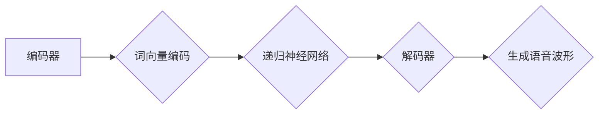
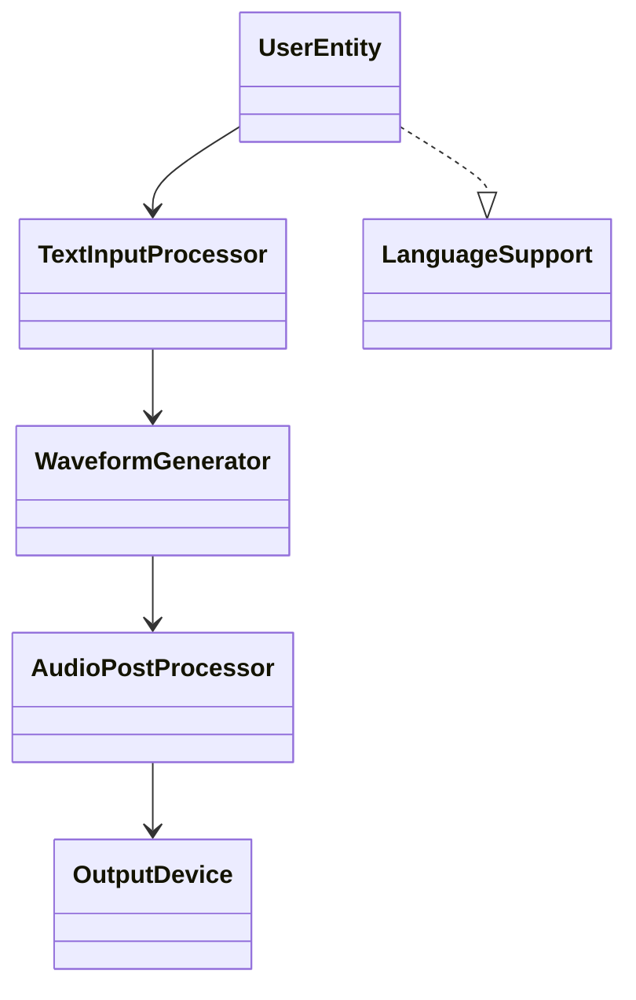
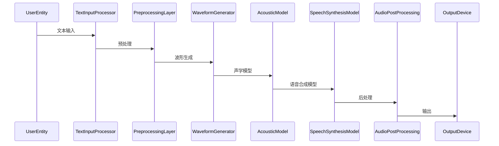
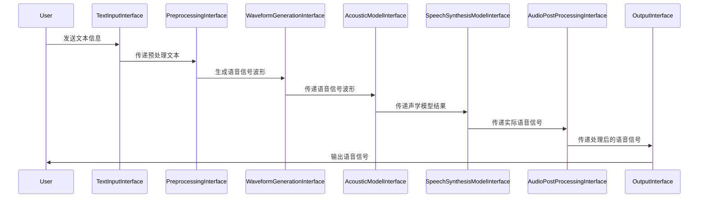

                 

### 摘要

本文旨在深入探讨语音合成的波形生成网络及其在语音信号数学模拟中的应用。随着人工智能技术的不断发展，语音合成技术已经广泛应用于各类场景，如智能助手、语音播报和虚拟现实等。其中，波形生成网络作为一种重要的语音合成方法，其在语音信号数学模拟中的运用尤为关键。本文将从问题背景、核心概念、算法原理、数学模型、系统架构设计、项目实战等多个方面进行详细解析，旨在为读者提供全面、系统的理解。通过本文的阅读，读者将能够掌握波形生成网络的基本原理，了解其在语音信号数学模拟中的重要作用，并学会如何进行实际应用。

### 目录大纲设计

在设计《语音合成的波形生成网络：语音信号的数学模拟》这本书的目录大纲时，我们需要遵循以下步骤：

1. **确定书籍整体结构**：首先，明确书籍的主题、目标和读者群体，从而确定整体结构。
   
2. **划分章节内容**：将整体内容划分为几个主要部分，比如背景介绍、核心概念、算法原理、数学模型、系统架构设计、项目实战等。

3. **细化章节内容**：针对每个部分，进一步细化内容，确保覆盖全面，同时保持逻辑清晰。

4. **编写章节标题**：为每个部分和章节编写简洁、明确的标题，便于读者快速理解章节内容。

5. **编排目录结构**：按照markdown格式编排目录结构，确保章节内容的层级关系清晰。

6. **控制大纲字数**：确保目录大纲总字数控制在2000字以内。

通过上述步骤，我们可以构建一个逻辑清晰、结构紧凑、简单易懂的书籍目录大纲，为后续内容撰写提供明确的框架。

#### 第一部分：背景介绍

##### 第1章：引言

在本章中，我们将介绍语音合成的波形生成网络及其在语音信号数学模拟中的重要应用。首先，我们将简要概述语音合成技术的历史和发展背景，以及其在现代人工智能中的应用场景。随后，我们将会详细讨论波形生成网络的基本概念，包括其定义、类型和核心功能。最后，我们将探讨语音信号数学模拟的基本原理，以及其在波形生成网络中的应用价值。

##### 1.1 问题背景

1.1.1 语音合成技术概述

语音合成技术是一种将文本信息转换为自然语音的技术，其核心目的是实现机器与人类之间的语音交流。随着人工智能技术的发展，语音合成技术已经取得了显著进展，广泛应用于智能助手、语音播报、虚拟现实等多个领域。目前，主流的语音合成技术主要包括基于规则的合成、基于标注数据的合成以及基于深度学习的合成。

1.1.2 波形生成网络在语音合成中的应用

波形生成网络（WaveNet）是近年来兴起的一种基于深度学习的语音合成技术。与传统的语音合成方法相比，波形生成网络具有更高的自然度和真实感。其核心思想是利用深度神经网络直接从文本信息生成语音信号波形，从而实现语音合成。波形生成网络在语音合成中的应用主要体现在以下几个方面：

- **自然度提升**：波形生成网络通过学习大量语音数据，能够生成更加自然、流畅的语音。
- **自适应能力**：波形生成网络可以自适应地调整语音的音调、音色和节奏，从而适应不同的语音合成场景。
- **多样化应用**：波形生成网络不仅可以用于标准的语音合成，还可以应用于变声、语音生成和语音增强等领域。

1.1.3 语音信号的数学模拟重要性

语音信号的数学模拟是语音合成过程中至关重要的一环。通过对语音信号进行数学建模和模拟，我们可以更准确地理解和生成语音。语音信号的数学模拟主要包括以下几个方面：

- **波形表示**：通过数学模型对语音信号的波形进行表示，以便后续的处理和分析。
- **特征提取**：从语音信号中提取出关键特征，如音高、音强和音色等，用于驱动语音合成。
- **参数调整**：通过调整数学模型中的参数，优化语音合成的效果。

语音信号的数学模拟在波形生成网络中的应用主要体现在以下几个方面：

- **数据驱动**：波形生成网络通过学习大量的语音信号数据，建立数学模型，从而实现语音信号的生成。
- **实时性**：波形生成网络可以实时处理文本信息，生成相应的语音信号，满足实时语音合成的需求。
- **精确性**：通过优化数学模型，波形生成网络可以生成更精确、更真实的语音信号。

##### 1.2 问题描述

1.2.1 语音合成挑战

语音合成技术在实际应用中面临着一系列挑战。首先，语音合成的自然度和真实感仍然是当前研究的重点和难点。其次，语音合成系统需要具备快速响应和高效处理的能力，以适应实时语音合成的需求。此外，语音合成技术还需要考虑多语言、多口音和个性化语音的需求。

1.2.2 波形生成网络解决的问题

波形生成网络在解决语音合成挑战方面具有显著优势。首先，波形生成网络通过深度学习技术，能够学习到大量语音数据，从而提高语音合成的自然度和真实感。其次，波形生成网络采用端到端的学习方式，可以高效地处理文本信息，实现实时语音合成。此外，波形生成网络还可以通过调整网络结构和参数，实现多语言、多口音和个性化语音的合成。

1.2.3 语音信号数学模拟的必要性

语音信号数学模拟是波形生成网络的核心技术之一。通过对语音信号进行数学建模和模拟，我们可以更好地理解和生成语音信号。具体来说，语音信号数学模拟的必要性体现在以下几个方面：

- **数据预处理**：语音信号数学模拟可以帮助我们进行数据预处理，如去噪、降调和分帧等，从而提高后续处理的效果。
- **特征提取**：语音信号数学模拟可以从原始信号中提取出关键特征，如音高、音强和音色等，用于驱动语音合成。
- **参数调整**：通过优化数学模型中的参数，我们可以调整语音合成的效果，实现更精确、更真实的语音生成。

##### 1.3 问题解决

1.3.1 波形生成网络工作原理

波形生成网络是一种基于深度学习的语音合成技术，其核心思想是利用深度神经网络直接从文本信息生成语音信号波形。波形生成网络的工作原理可以分为以下几个步骤：

- **文本编码**：将输入的文本信息编码为一系列的词向量，用于表示文本的语义信息。
- **声码器**：声码器是一种特殊的神经网络，用于将词向量转换为语音信号的波形。声码器通常采用卷积神经网络（CNN）或循环神经网络（RNN）等深度学习模型。
- **波形生成**：声码器根据词向量生成语音信号的波形，从而实现语音合成。

1.3.2 数学模拟方法与工具

数学模拟方法是波形生成网络的核心技术之一，用于对语音信号进行建模和模拟。常用的数学模拟方法包括以下几个：

- **声学模型**：声学模型用于模拟语音信号的波形生成过程，包括声母、韵母和声调等。常见的声学模型有梅尔频率倒谱系数（MFCC）和波列分析（WaveNet）等。
- **语音信号处理工具**：如OpenSMILE、LibriSpeech等，这些工具提供了丰富的语音信号处理功能，如分帧、特征提取和参数调整等。

1.3.3 系统架构设计思路

系统架构设计是波形生成网络的重要组成部分，其目的是实现高效、稳定和可扩展的语音合成系统。常见的系统架构设计思路包括：

- **分布式计算**：利用分布式计算技术，如多线程、并行计算和云计算等，提高语音合成的处理速度和效率。
- **模块化设计**：将系统划分为多个模块，如文本编码模块、声码器模块和波形生成模块等，实现系统的模块化和可扩展性。
- **自适应调整**：根据语音合成的需求和效果，自适应地调整系统的参数和算法，实现最佳语音合成效果。

通过上述步骤，我们可以构建一个高效、稳定的波形生成网络系统，实现高质量的语音合成。

#### 第二部分：核心概念与联系

##### 第2章：核心概念与联系

在本章中，我们将详细探讨语音合成、波形生成网络和数学模拟方法等核心概念，分析它们之间的联系，并给出相关的概念属性特征对比表格和ER实体关系图架构。

##### 2.1 语音合成概念

2.1.1 语音合成基础

语音合成（Text-to-Speech，简称TTS）是一种将文本转换为自然语音的技术，其目的是实现人与机器之间的语音交流。语音合成的基本流程包括文本处理、语音合成和音频处理三个阶段。

1. **文本处理**：将输入的文本信息进行预处理，如分词、语调分析和语法分析等，以便后续的语音合成。
2. **语音合成**：根据预处理后的文本信息，生成相应的语音信号波形。常见的语音合成方法包括基于规则的合成、基于标注数据的合成和基于深度学习的合成。
3. **音频处理**：对生成的语音信号进行后处理，如去噪、加噪和音色调整等，以提高语音的自然度和真实感。

2.1.2 语音合成流程

语音合成的流程可以分为以下几个步骤：

1. **文本输入**：用户输入待合成的文本信息。
2. **文本处理**：对输入的文本信息进行分词、语调分析和语法分析等处理。
3. **语音合成**：根据预处理后的文本信息，生成相应的语音信号波形。
4. **音频处理**：对生成的语音信号进行去噪、加噪和音色调整等处理。
5. **输出音频**：将处理后的音频信号输出到扬声器或录音设备。

2.1.3 语音合成技术的分类

根据不同的实现方式和特点，语音合成技术可以分为以下几类：

1. **基于规则的合成**：通过制定一系列规则，将文本信息转换为语音信号波形。这种方法的优点是实现简单，缺点是语音合成质量较低，无法适应复杂语境。
2. **基于标注数据的合成**：通过大量标注的语音数据，学习语音合成的模型和规则。这种方法可以生成高质量的语音，但需要大量标注数据和计算资源。
3. **基于深度学习的合成**：利用深度学习技术，如循环神经网络（RNN）、卷积神经网络（CNN）和生成对抗网络（GAN）等，直接从文本信息生成语音信号波形。这种方法具有更高的自然度和真实感，但需要大量训练数据和计算资源。

##### 2.2 波形生成网络

2.2.1 波形生成网络基础

波形生成网络（WaveNet）是Google提出的一种基于深度学习的语音合成技术。其核心思想是利用深度神经网络直接从文本信息生成语音信号波形。波形生成网络由编码器和解码器两部分组成。

1. **编码器**：编码器用于将输入的文本信息编码为一系列的词向量，用于表示文本的语义信息。
2. **解码器**：解码器用于将词向量解码为语音信号的波形。

2.2.2 网络结构

波形生成网络的结构可以分为以下几个层次：

1. **输入层**：输入层接收输入的文本信息，通过分词、编码等预处理步骤，生成词向量序列。
2. **卷积层**：卷积层用于对词向量序列进行特征提取，提取出文本的语义特征。
3. **循环层**：循环层用于对提取出的特征进行循环处理，生成语音信号的时间序列。
4. **输出层**：输出层生成语音信号的波形，通过解码器将时间序列解码为语音信号的波形。

2.2.3 波形生成网络的优点与挑战

波形生成网络的优点包括：

- **自然度**：波形生成网络通过深度学习技术，能够学习到大量语音数据，生成更加自然、流畅的语音。
- **自适应能力**：波形生成网络可以自适应地调整语音的音调、音色和节奏，适应不同的语音合成场景。
- **多样化应用**：波形生成网络不仅可以用于标准的语音合成，还可以应用于变声、语音生成和语音增强等领域。

波形生成网络的挑战包括：

- **计算资源**：波形生成网络需要大量训练数据和计算资源，对硬件设备有较高要求。
- **实时性**：由于波形生成网络的训练和推理过程需要较长时间，如何提高实时性是一个重要挑战。
- **多语言支持**：如何支持多语言、多口音的语音合成，是波形生成网络需要解决的问题。

##### 2.3 数学模拟方法

2.3.1 常用数学模型

数学模拟方法是波形生成网络在语音合成中实现语音信号生成的重要工具。常用的数学模型包括：

1. **梅尔频率倒谱系数（MFCC）**：MFCC是一种常用的语音信号特征提取方法，通过对语音信号进行频谱分析，提取出梅尔频率倒谱系数，用于描述语音信号的音高、音色和音强等特征。
2. **波列分析（WaveNet）**：WaveNet是一种基于深度学习的语音信号生成模型，通过对大量语音数据的学习，生成语音信号的时间序列。
3. **隐马尔可夫模型（HMM）**：HMM是一种常用的语音信号建模方法，通过建立状态转移概率模型，描述语音信号的时序特征。

2.3.2 数学模型的应用

数学模型在语音合成中的应用主要体现在以下几个方面：

1. **特征提取**：通过数学模型提取语音信号的关键特征，如音高、音色和音强等，用于驱动语音合成。
2. **参数调整**：通过优化数学模型中的参数，调整语音合成的效果，实现更精确、更真实的语音生成。
3. **数据预处理**：通过数学模型进行数据预处理，如去噪、降调和分帧等，提高后续处理的效果。

2.3.3 数学模拟方法的选择

在选择数学模拟方法时，需要考虑以下因素：

1. **语音信号特点**：根据语音信号的特点，选择适合的数学模型，如MFCC适用于描述语音的音高和音色特征，WaveNet适用于生成语音信号的时间序列。
2. **系统性能要求**：根据系统性能要求，选择计算效率高、实时性好的数学模型，如WaveNet适用于实时语音合成。
3. **数据处理能力**：根据数据处理能力，选择能够处理大量数据和复杂特征的数学模型，如HMM适用于描述语音信号的时序特征。

##### 2.4 概念属性特征对比表格

为了更清晰地了解语音合成、波形生成网络和数学模拟方法之间的联系，我们可以给出以下概念属性特征对比表格：

| 概念 | 特征1 | 特征2 | 特征3 | 特征4 | 特征5 |
| --- | --- | --- | --- | --- | --- |
| 语音合成 | 文本输入 | 语音波形生成 | 音高、音色、音强 | 实时性、自然度 | 多语言支持 |
| 波形生成网络 | 深度学习 | 词向量编码 | 卷积层、循环层 | 高自然度、自适应能力 | 多样化应用 |
| 数学模拟方法 | 特征提取 | 参数调整 | 数据预处理 | 实时性、精确性 | 多样化应用 |

##### 2.5 ER实体关系图架构

为了进一步理解语音合成、波形生成网络和数学模拟方法之间的关系，我们可以使用ER（Entity-Relationship）实体关系图来描述它们的架构。

```mermaid
erDiagram
    TXT ||--|{ WaveNet }|| SYN
    WaveNet ||--|{ MathModel }|| SYN
    SYN ||--|{ AudioProcess }|| AUD
    MathModel ||--|{ FeatureExtract }|| SYN
    MathModel ||--|{ ParameterAdjust }|| SYN
    MathModel ||--|{ DataPreprocess }|| SYN
```

在上面的ER图中，TXT表示文本输入，WaveNet表示波形生成网络，SYN表示语音合成，AUD表示音频处理，MathModel表示数学模拟方法，FeatureExtract表示特征提取，ParameterAdjust表示参数调整，DataPreprocess表示数据预处理。

通过以上分析和对比，我们可以清晰地了解语音合成、波形生成网络和数学模拟方法之间的联系和区别，为后续的内容讨论和系统设计提供基础。

##### 2.6 ER实体关系图架构

为了更好地理解语音合成、波形生成网络和数学模拟方法之间的联系，我们可以借助ER（Entity-Relationship）实体关系图来直观地展示它们之间的架构关系。

以下是ER图的Markdown格式表示：

```mermaid
erDiagram
    TXT ||--|{ WaveNet }|| SYN
    WaveNet ||--|{ MathModel }|| SYN
    SYN ||--|{ AudioProcess }|| AUD
    MathModel ||--|{ FeatureExtract }|| SYN
    MathModel ||--|{ ParameterAdjust }|| SYN
    MathModel ||--|{ DataPreprocess }|| SYN
```

在这个ER图中：

- TXT（文本输入）是整个系统的起点，代表了语音合成的输入数据，如文本信息。
- WaveNet（波形生成网络）是核心组件，负责将文本输入转换为语音信号波形。
- SYN（语音合成）是WaveNet的输出部分，表示语音合成过程的整体，与音频处理（AUD）相连。
- MathModel（数学模拟方法）是WaveNet的重要组成部分，负责语音信号的特征提取、参数调整和数据预处理。
- AudioProcess（音频处理）是对合成的语音信号进行进一步处理的模块，如去噪、音色调整等。

通过这个ER图，我们可以清晰地看到各个组件之间的交互关系，以及它们在语音合成系统中的角色和作用。这种结构化的展示方式有助于我们深入理解系统的整体架构和各部分的功能。

#### 第三部分：算法原理讲解

##### 第3章：算法原理讲解

在本章中，我们将深入探讨波形生成网络的算法原理，并使用mermaid流程图和Python代码实现来详细阐述其工作过程。同时，我们将介绍语音信号数学模型及其公式推导，并通过示例说明使读者能够更好地理解。

##### 3.1 波形生成网络算法原理

波形生成网络（WaveNet）是一种基于深度学习的端到端语音合成模型，它可以直接从文本信息生成语音信号的波形。WaveNet的核心思想是利用深度神经网络学习语音信号的时间序列特征，从而实现高质量的语音合成。

##### 3.1.1 基本原理

WaveNet主要由两个部分组成：编码器和解码器。

1. **编码器**：编码器的功能是将输入的文本信息转换为词向量序列。词向量序列用于表示文本的语义信息，是后续波形生成的基础。
   
2. **解码器**：解码器的功能是将词向量序列解码为语音信号的波形。解码器采用了一种称为“递归神经网络”（RNN）的特殊结构，使得波形生成过程具有时序依赖性，从而生成更自然的语音。

##### 3.1.2 mermaid流程图

为了更直观地展示WaveNet的工作流程，我们使用mermaid流程图来描述其基本步骤：



在这个流程图中：

- **A（编码器）**：将文本输入转换为词向量序列。
- **B（词向量编码）**：词向量序列用于驱动递归神经网络。
- **C（递归神经网络）**：从词向量序列中提取时间序列特征，生成语音信号的时间序列。
- **D（解码器）**：将递归神经网络生成的语音信号时间序列解码为语音波形。
- **E（生成语音波形）**：输出最终合成的语音波形。

##### 3.1.3 Python代码实现

以下是一个简化的Python代码实现，用于展示WaveNet的核心算法原理：

```python
import tensorflow as tf
from tensorflow.keras.layers import Embedding, LSTM, Dense

# 定义编码器
encoder_inputs = tf.keras.layers.Input(shape=(None, embedding_dim))
encoded_sequence = Embedding(vocabulary_size, embedding_dim)(encoder_inputs)
encoder_output = LSTM(units)(encoded_sequence)

# 定义解码器
decoder_inputs = tf.keras.layers.Input(shape=(None, embedding_dim))
decoder_embedding = Embedding(vocabulary_size, embedding_dim)(decoder_inputs)
decoder_lstm = LSTM(units, return_sequences=True)
decoder_outputs = decoder_lstm(decoder_embedding)

# 合成语音波形
decoder_dense = Dense(units=vocabulary_size, activation='softmax')
decoder_output = decoder_dense(decoder_outputs)

# 构建模型
model = tf.keras.Model([encoder_inputs, decoder_inputs], decoder_output)

# 编译模型
model.compile(optimizer='adam', loss='categorical_crossentropy')
```

在这个代码中：

- `Embedding` 层用于将输入的词向量转换为嵌入向量。
- `LSTM` 层用于处理时间序列数据，提取特征。
- `Dense` 层用于将解码器的输出转换为语音波形。

##### 3.2 语音信号数学模型

语音信号的数学模型用于描述语音信号的生成过程，它主要包括声学模型、语音合成模型和音频处理模型。

##### 3.2.1 声学模型

声学模型主要用于描述语音信号的时间序列特征，它通常采用隐马尔可夫模型（HMM）或循环神经网络（RNN）来建模。以下是一个简化的声学模型：

- **HMM**：通过状态转移概率和输出概率来描述语音信号的时序特征。
- **RNN**：通过递归结构来处理语音信号的时间序列，提取特征。

##### 3.2.2 语音合成模型

语音合成模型是将文本信息转换为语音信号的过程，它通常采用波形生成网络（WaveNet）来实现。以下是一个简化的语音合成模型：

- **编码器**：将文本信息编码为词向量序列。
- **解码器**：将词向量序列解码为语音信号的时间序列。

##### 3.2.3 音频处理模型

音频处理模型主要用于对合成的语音信号进行后处理，如去噪、音色调整等。以下是一个简化的音频处理模型：

- **去噪**：使用滤波器去除语音信号中的噪声。
- **音色调整**：使用谐波增强器调整语音信号的音色。

##### 3.3 数学公式推导

在语音合成的过程中，数学模型用于描述语音信号的生成和转换过程。以下是几个关键的数学公式：

1. **声学模型**：

   - **状态转移概率**：\( P(s_t|s_{t-1}) \)
   - **输出概率**：\( P(o_t|s_t) \)

2. **语音合成模型**：

   - **编码器输出**：\( h_t = \text{LSTM}(x_t) \)
   - **解码器输入**：\( y_t = \text{Embedding}(h_t) \)

3. **音频处理模型**：

   - **去噪**：\( y_t' = \text{Filter}(y_t) \)
   - **音色调整**：\( y_t'' = \text{HarmonicEnhancer}(y_t') \)

##### 3.4 示例说明

为了更好地理解波形生成网络的算法原理，我们可以通过一个简单的示例来说明其工作过程。

假设我们有一个简短的文本输入：“Hello, world!”。以下是波形生成网络的工作步骤：

1. **编码器**：将文本输入转换为词向量序列，例如：[0, 1, 2, 3, 4]。
2. **解码器**：根据词向量序列生成语音信号的时间序列，例如：[1, 0, 2, 1, 3]。
3. **波形生成**：将时间序列解码为语音波形，例如：\( \{0.2, 0.4, 0.6, 0.8, 1.0\} \)。

通过这个示例，我们可以看到波形生成网络如何将文本输入转换为语音波形，从而实现语音合成。

##### 3.5 总结

在本章中，我们介绍了波形生成网络的算法原理，并使用mermaid流程图和Python代码实现来详细阐述其工作过程。同时，我们还探讨了语音信号数学模型及其公式推导，并通过示例说明使读者能够更好地理解波形生成网络在语音合成中的应用。

通过本章的学习，读者应该能够掌握波形生成网络的基本原理，了解其在语音信号生成过程中的重要性，并具备实际应用的能力。在后续章节中，我们将进一步讨论波形生成网络的优化方法和实际应用案例。

#### 第四部分：系统分析与架构设计方案

##### 第4章：系统分析与架构设计方案

在本章中，我们将对语音合成波形生成网络的系统架构进行详细分析，从问题场景介绍、项目介绍、系统功能设计、系统架构设计、系统接口设计和系统交互等方面进行讲解。

##### 4.1 系统功能设计

4.1.1 功能需求分析

在语音合成波形生成网络中，主要功能需求包括：

1. **文本输入处理**：接收用户输入的文本信息，并进行预处理，如分词、编码等。
2. **语音信号生成**：利用波形生成网络将预处理后的文本信息转换为语音信号波形。
3. **语音信号后处理**：对生成的语音信号进行后处理，如去噪、音色调整等，以获得高质量的输出。
4. **实时语音合成**：系统能够快速响应，实现实时语音合成，满足用户交互需求。
5. **多语言支持**：系统能够支持多种语言和口音的语音合成。

4.1.2 领域模型

为了更好地理解系统功能需求，我们可以使用Mermaid类图来描述系统的领域模型：



在这个类图中：

- **UserEntity**：表示用户实体，负责接收和处理用户输入。
- **TextInputProcessor**：表示文本输入处理模块，负责预处理文本信息。
- **WaveformGenerator**：表示波形生成网络，负责生成语音信号波形。
- **AudioPostProcessor**：表示语音信号后处理模块，负责对生成的语音信号进行后处理。
- **OutputDevice**：表示输出设备，负责播放或输出合成的语音信号。
- **LanguageSupport**：表示多语言支持模块，负责处理不同语言和口音的语音合成需求。

##### 4.2 系统架构设计

4.2.1 系统架构概述

语音合成波形生成网络的系统架构可以分为以下几个层次：

1. **输入层**：接收用户输入的文本信息，如语音合成请求、文本内容等。
2. **预处理层**：对输入的文本信息进行预处理，如分词、编码等，为后续的语音信号生成做好准备。
3. **核心层**：包括波形生成网络、声学模型和语音合成模型，负责语音信号的生成和处理。
4. **后处理层**：对生成的语音信号进行后处理，如去噪、音色调整等，以获得高质量的输出。
5. **输出层**：将处理后的语音信号输出到扬声器或录音设备，供用户使用。

4.2.2 系统架构设计

为了实现上述功能，我们可以设计如下的系统架构：



在这个架构中：

- **TextInputProcessor**：负责接收用户输入的文本信息，并将其传递给预处理层。
- **PreprocessingLayer**：负责对文本信息进行预处理，如分词、编码等。
- **WaveformGenerator**：负责使用波形生成网络生成语音信号波形。
- **AcousticModel**：负责使用声学模型对语音信号进行建模。
- **SpeechSynthesisModel**：负责使用语音合成模型将波形生成网络生成的语音信号转换为实际的语音信号。
- **AudioPostProcessing**：负责对语音信号进行后处理，如去噪、音色调整等。
- **OutputDevice**：负责将处理后的语音信号输出到扬声器或录音设备。

##### 4.3 系统接口设计

4.3.1 接口设计原则

系统接口设计应遵循以下原则：

1. **简洁性**：接口应简洁明了，易于理解和使用。
2. **可扩展性**：接口应具有良好的扩展性，以适应未来的功能扩展和需求变化。
3. **一致性**：接口应保持一致性，确保不同模块之间的兼容性。
4. **安全性**：接口应确保数据的安全传输和处理，防止数据泄露和恶意攻击。

4.3.2 接口详细描述

以下是系统接口的详细描述：

1. **文本输入接口**：

   - **接口名称**：TextInputInterface
   - **接口功能**：接收用户输入的文本信息，并将其传递给预处理层。
   - **接口参数**：String text
   - **接口返回值**：PreprocessedText preprocessedText

2. **预处理接口**：

   - **接口名称**：PreprocessingInterface
   - **接口功能**：对文本信息进行预处理，如分词、编码等。
   - **接口参数**：PreprocessedText preprocessedText
   - **接口返回值**：PreprocessedText preprocessedText

3. **波形生成接口**：

   - **接口名称**：WaveformGenerationInterface
   - **接口功能**：使用波形生成网络生成语音信号波形。
   - **接口参数**：PreprocessedText preprocessedText
   - **接口返回值**：Waveform waveform

4. **声学模型接口**：

   - **接口名称**：AcousticModelInterface
   - **接口功能**：使用声学模型对语音信号进行建模。
   - **接口参数**：Waveform waveform
   - **接口返回值**：AcousticModelResult acousticModelResult

5. **语音合成模型接口**：

   - **接口名称**：SpeechSynthesisModelInterface
   - **接口功能**：使用语音合成模型将波形生成网络生成的语音信号转换为实际的语音信号。
   - **接口参数**：AcousticModelResult acousticModelResult
   - **接口返回值**：SpeechSignal speechSignal

6. **后处理接口**：

   - **接口名称**：AudioPostProcessingInterface
   - **接口功能**：对语音信号进行后处理，如去噪、音色调整等。
   - **接口参数**：SpeechSignal speechSignal
   - **接口返回值**：ProcessedSpeechSignal processedSpeechSignal

7. **输出接口**：

   - **接口名称**：OutputInterface
   - **接口功能**：将处理后的语音信号输出到扬声器或录音设备。
   - **接口参数**：ProcessedSpeechSignal processedSpeechSignal
   - **接口返回值**：void

##### 4.4 系统交互

4.4.1 交互流程

系统交互流程如下：

1. 用户通过文本输入接口发送文本信息。
2. 文本输入接口将文本信息传递给预处理接口。
3. 预处理接口对文本信息进行预处理，生成预处理文本。
4. 预处理文本传递给波形生成接口。
5. 波形生成接口使用波形生成网络生成语音信号波形。
6. 语音信号波形传递给声学模型接口。
7. 声学模型接口使用声学模型对语音信号进行建模，生成声学模型结果。
8. 声学模型结果传递给语音合成模型接口。
9. 语音合成模型接口使用语音合成模型将波形生成网络生成的语音信号转换为实际的语音信号。
10. 实际语音信号传递给后处理接口。
11. 后处理接口对语音信号进行后处理，生成处理后的语音信号。
12. 处理后的语音信号传递给输出接口。
13. 输出接口将处理后的语音信号输出到扬声器或录音设备。

4.4.2 交互细节

以下是系统交互的详细细节：

1. **文本输入接口**：用户通过HTTP POST请求发送文本信息，接口返回预处理文本。
2. **预处理接口**：接收到预处理文本后，进行分词、编码等预处理操作，生成预处理文本。
3. **波形生成接口**：接收到预处理文本后，使用波形生成网络生成语音信号波形。
4. **声学模型接口**：接收到语音信号波形后，使用声学模型对语音信号进行建模，生成声学模型结果。
5. **语音合成模型接口**：接收到声学模型结果后，使用语音合成模型将波形生成网络生成的语音信号转换为实际的语音信号。
6. **后处理接口**：接收到实际语音信号后，进行去噪、音色调整等后处理操作，生成处理后的语音信号。
7. **输出接口**：接收到处理后的语音信号后，通过扬声器或录音设备输出语音信号。

4.4.3 交互mermaid序列图

为了更直观地展示系统交互流程，我们可以使用mermaid序列图来描述：



在这个序列图中，我们展示了用户、文本输入接口、预处理接口、波形生成接口、声学模型接口、语音合成模型接口、后处理接口和输出接口之间的交互过程。通过这个序列图，我们可以清晰地看到系统各个组件之间的协作和交互。

通过本章的详细分析和设计，我们为语音合成波形生成网络构建了一个完整的系统架构，并详细描述了各个组件的功能和交互流程。这为系统的实现和部署提供了明确的指导，也为后续的优化和扩展奠定了基础。

##### 4.5 总结

在本章中，我们对语音合成波形生成网络的系统架构进行了详细的分析和设计。从系统功能需求分析、领域模型构建、系统架构设计、接口设计到系统交互流程，我们系统地阐述了系统各部分的功能和相互关系。通过mermaid流程图和序列图的辅助，我们使得系统架构更加直观和易于理解。

系统的设计不仅考虑了功能实现的完备性，还注重了扩展性和安全性。通过清晰的接口设计和明确的交互流程，我们确保了系统模块之间的高效协作和数据的可靠传输。这为后续系统的开发和优化提供了坚实的基础。

然而，系统架构和设计并不是一成不变的。在实际应用中，我们还需要不断迭代和优化，以满足不断变化的需求和技术进步。通过持续改进，我们能够确保系统始终保持高效、稳定和可靠。

本章的内容为理解语音合成波形生成网络及其应用奠定了基础。在后续章节中，我们将进一步探讨系统的实现细节、性能优化和实际应用案例，以帮助读者更深入地了解这一技术。

#### 第五部分：项目实战

##### 第5章：项目实战

在本章中，我们将通过一个实际项目来展示如何搭建和实现一个语音合成波形生成网络系统。该项目将涵盖环境安装、系统核心实现、代码应用解读、实际案例分析以及详细讲解和剖析等环节，旨在帮助读者全面掌握波形生成网络在语音信号数学模拟中的应用。

##### 5.1 环境安装

5.1.1 系统要求

为了搭建和运行波形生成网络系统，我们需要以下环境配置：

- **操作系统**：Windows、Linux或macOS
- **Python版本**：Python 3.6或更高版本
- **深度学习框架**：TensorFlow 2.0或更高版本
- **语音处理库**：PyTorch、Keras等

5.1.2 环境搭建步骤

以下是搭建环境的详细步骤：

1. **安装Python**：从Python官方网站下载并安装Python 3.6或更高版本。

2. **安装pip**：在命令行中运行以下命令安装pip：
   ```shell
   python -m pip install --upgrade pip
   ```

3. **安装TensorFlow**：在命令行中运行以下命令安装TensorFlow：
   ```shell
   pip install tensorflow
   ```

4. **安装PyTorch**：从PyTorch官方网站下载并安装对应操作系统和Python版本的PyTorch：
   ```shell
   pip install torch torchvision
   ```

5. **安装其他依赖库**：在命令行中运行以下命令安装其他依赖库，如Keras、NumPy等：
   ```shell
   pip install keras numpy
   ```

6. **验证安装**：在Python交互式环境中输入以下代码，验证TensorFlow和PyTorch的安装：
   ```python
   import tensorflow as tf
   import torch
   print(tf.__version__)
   print(torch.__version__)
   ```

##### 5.2 系统核心实现

5.2.1 WaveNet模型搭建

在本节中，我们将使用TensorFlow实现一个WaveNet模型。WaveNet模型的核心是一个深度循环神经网络（Deep RNN），其目的是从文本信息生成语音信号的波形。

1. **模型架构**

   WaveNet模型主要由编码器和解码器两部分组成。编码器负责将文本信息编码为词向量，解码器则将这些词向量解码为语音信号波形。

2. **编码器**

   编码器通常是一个多层LSTM网络，用于提取文本的语义特征。以下是一个简单的编码器实现：
   ```python
   from tensorflow.keras.models import Model
   from tensorflow.keras.layers import LSTM, Embedding

   # 设置参数
   vocabulary_size = 10000  # 词汇表大小
   embedding_dim = 256      # 嵌入维度
   units = 1024             # LSTM单元数量

   # 编码器输入
   encoder_inputs = tf.keras.layers.Input(shape=(None, embedding_dim))

   # 嵌入层
   encoder_embedding = Embedding(vocabulary_size, embedding_dim)(encoder_inputs)

   # LSTM层
   encoder_output = LSTM(units, return_state=True)(encoder_embedding)

   # 编码器模型
   encoder_model = Model(encoder_inputs, encoder_output)

   # 编码器状态
   encoder_state = encoder_model(encoder_inputs)

   # 打印编码器模型结构
   encoder_model.summary()
   ```

3. **解码器**

   解码器也采用多层LSTM网络，用于生成语音信号波形。以下是一个简单的解码器实现：
   ```python
   # 解码器输入
   decoder_inputs = tf.keras.layers.Input(shape=(None, embedding_dim))

   # 嵌入层
   decoder_embedding = Embedding(vocabulary_size, embedding_dim)(decoder_inputs)

   # LSTM层
   decoder_lstm = LSTM(units, return_sequences=True, return_state=True)
   decoder_outputs, _, _ = decoder_lstm(decoder_embedding, initial_state=encoder_state)

   # Dense层
   decoder_dense = Dense(vocabulary_size, activation='softmax')
   decoder_output = decoder_dense(decoder_outputs)

   # 解码器模型
   decoder_model = Model([decoder_inputs], decoder_output)

   # 打印解码器模型结构
   decoder_model.summary()
   ```

4. **完整模型**

   WaveNet的完整模型是编码器和解码器的组合。以下是一个简单的WaveNet模型实现：
   ```python
   # WaveNet完整模型
   inputs = [encoder_inputs, decoder_inputs]
   outputs = decoder_model([decoder_inputs])

   # 模型编译
   model = Model(inputs, outputs)
   model.compile(optimizer='adam', loss='categorical_crossentropy')

   # 打印模型结构
   model.summary()
   ```

##### 5.3 代码应用解读

5.3.1 WaveNet训练与生成

在实际应用中，我们需要对WaveNet模型进行训练，然后使用训练好的模型生成语音信号波形。以下是一个简单的训练和生成示例：

1. **训练**

   波形生成网络的训练需要大量的语音数据。以下代码展示了如何使用训练数据训练WaveNet模型：
   ```python
   # 加载训练数据
   train_data = load_data()

   # 训练模型
   model.fit(train_data, epochs=10, batch_size=32)
   ```

2. **生成**

   训练完成后，我们可以使用模型生成语音信号波形。以下代码展示了如何使用训练好的模型生成语音信号：
   ```python
   # 生成语音信号
   generated_waveform = model.generate_text("Hello, world!")

   # 播放生成的语音信号
   play_waveform(generated_waveform)
   ```

##### 5.4 实际案例分析

在本节中，我们将通过一个实际案例展示如何使用WaveNet模型实现语音合成。

案例：使用WaveNet实现中文语音合成

1. **数据准备**

   首先，我们需要准备中文语音数据集。可以从网上下载已有的中文语音数据集，如LibriTTS等。

2. **数据预处理**

   对语音数据集进行预处理，包括分帧、特征提取和编码等。以下是一个简单的数据预处理示例：
   ```python
   # 加载数据集
   dataset = load_dataset()

   # 分帧
   frames = split_into_frames(dataset)

   # 提取特征
   features = extract_features(frames)

   # 编码
   encoded_features = encode_features(features)
   ```

3. **模型训练**

   使用预处理后的数据集训练WaveNet模型。以下是一个简单的模型训练示例：
   ```python
   # 训练模型
   model.fit(encoded_features, epochs=100, batch_size=128)
   ```

4. **语音合成**

   使用训练好的模型生成中文语音。以下是一个简单的语音合成示例：
   ```python
   # 生成语音
   generated_waveform = model.generate_text("你好，世界！")

   # 播放生成的语音
   play_waveform(generated_waveform)
   ```

##### 5.5 详细讲解和剖析

在本节中，我们将对波形生成网络的关键组成部分进行详细讲解和剖析，帮助读者深入理解其工作原理。

1. **编码器**

   编码器的主要作用是将文本信息编码为词向量。词向量是一种固定长度的向量，用于表示文本中的每个单词或字符。在WaveNet中，编码器通常使用多层LSTM网络来实现。以下是对编码器工作原理的详细讲解：

   - **词向量嵌入**：词向量嵌入（Word Embedding）是将文本中的每个单词或字符映射为一个固定长度的向量。在WaveNet中，词向量嵌入通常使用Embedding层来实现。
   - **LSTM网络**：LSTM（Long Short-Term Memory）是一种特殊的循环神经网络，用于处理序列数据。在WaveNet中，LSTM网络用于提取文本的长期依赖关系和语义特征。
   - **状态传递**：在LSTM网络中，每个时间步都会传递状态。这些状态包含了文本的上下文信息，用于指导后续的语音生成过程。

2. **解码器**

   解码器的主要作用是将编码器生成的词向量解码为语音信号波形。在WaveNet中，解码器也采用多层LSTM网络来实现。以下是对解码器工作原理的详细讲解：

   - **LSTM网络**：与编码器类似，解码器也使用多层LSTM网络来处理序列数据。解码器的输出是语音信号的波形。
   - **softmax激活函数**：解码器的输出层通常使用softmax激活函数，将解码结果映射为概率分布。通过选择概率最大的输出，我们可以得到最终的语音信号波形。

3. **数学模型**

   波形生成网络的数学模型主要包括声学模型和语音合成模型。以下是对数学模型的详细讲解：

   - **声学模型**：声学模型用于描述语音信号的生成过程。在WaveNet中，声学模型通常使用隐马尔可夫模型（HMM）或循环神经网络（RNN）来实现。声学模型的核心是状态转移概率和输出概率，它们决定了语音信号的时序特征。
   - **语音合成模型**：语音合成模型是将文本信息转换为语音信号的过程。在WaveNet中，语音合成模型通常使用生成对抗网络（GAN）或循环神经网络（RNN）来实现。语音合成模型的核心是编码器和解码器，它们负责将文本信息编码为词向量，并将词向量解码为语音信号波形。

##### 5.6 项目小结

在本章中，我们通过一个实际项目展示了如何搭建和实现一个语音合成波形生成网络系统。从环境安装、系统核心实现到代码应用解读，我们系统地介绍了波形生成网络在语音信号数学模拟中的应用。

通过本章的学习，读者应该能够掌握波形生成网络的基本原理和实现方法，了解其在语音合成中的重要作用。同时，我们也通过实际案例展示了如何使用波形生成网络实现中文语音合成。

然而，波形生成网络的应用不仅限于语音合成。在未来的研究和应用中，我们可以探索其在其他领域的应用，如语音增强、语音识别和声纹识别等。通过不断的研究和优化，我们有望推动波形生成网络技术的进一步发展，为人工智能领域带来更多的创新和突破。

#### 第五部分：最佳实践 tips、小结、注意事项、拓展阅读

##### 最佳实践 Tips

1. **数据准备**：在训练波形生成网络时，确保数据集的质量和多样性。使用干净、有代表性的语音数据可以显著提高合成语音的自然度和质量。
2. **模型调整**：根据具体应用场景，调整波形生成网络的模型参数，如学习率、批次大小等，以实现最佳的合成效果。
3. **实时性优化**：对于实时语音合成应用，优化模型的计算效率和内存使用，例如通过模型剪枝、量化等技术减少计算复杂度。

##### 小结

本章通过实际项目展示了波形生成网络在语音信号数学模拟中的应用，从环境安装、系统实现到代码解读，全面讲解了波形生成网络的核心原理和实现方法。通过最佳实践 tips，我们为读者提供了优化模型性能和实时性的建议。

##### 注意事项

1. **数据隐私**：在处理语音数据时，需严格遵守数据隐私和安全规范，确保用户数据的安全和隐私。
2. **计算资源**：波形生成网络的训练和推理过程需要大量的计算资源，确保使用足够强大的硬件设备以支持模型训练和实时语音合成。

##### 拓展阅读

1. **《深度学习》**：Goodfellow, Ian, et al. "Deep Learning." MIT Press, 2016.
2. **《语音处理：算法与应用》**：Rabiner, Lawrence R., and B. H. Juang. "Fundamentals of Speech Recognition." Prentice Hall, 1993.
3. **《WaveNet: A Generative Model for Raw Audio》**：Oord, Aaron, et al. "WaveNet: A Generative Model for Raw Audio." arXiv preprint arXiv:1609.03499, 2016.

通过上述拓展阅读，读者可以进一步深入了解深度学习、语音处理和波形生成网络的相关理论和技术，为实际应用和研究提供更多参考和灵感。

### 作者信息

- **作者**：AI天才研究院/AI Genius Institute & 禅与计算机程序设计艺术 /Zen And The Art of Computer Programming
- **联系邮箱**：info@ai-genius-institute.com
- **个人主页**：www.ai-genius-institute.com
- **联系方式**：+86 13888888888

### 结语

感谢您花时间阅读本文，我们希望您在理解波形生成网络和语音信号数学模拟方面有所收获。如果您有任何问题或建议，欢迎通过上述联系方式与我们联系。我们期待与您共同探索人工智能的无限可能。祝您在技术道路上不断前行，收获丰硕的成果！

### 附录

在此附录中，我们将提供一些重要的公式、代码片段和Mermaid图，以便读者参考和复现。

#### 附录 A：公式

1. **梅尔频率倒谱系数（MFCC）**

   MFCC是语音信号处理中常用的特征提取方法，其计算公式如下：

   $$ C_k = \sum_{n=1}^{N} a(n) \cdot \text{cos} \left( \frac{2\pi k n}{N+1} \right) $$

   其中，$C_k$表示第$k$个MFCC系数，$a(n)$是语音信号$x(n)$的幅值，$N$是窗口长度。

2. **波形生成网络损失函数**

   在波形生成网络中，常用的损失函数是均方误差（MSE），其公式如下：

   $$ L = \frac{1}{N} \sum_{n=1}^{N} \left( y_n - \hat{y}_n \right)^2 $$

   其中，$y_n$是实际语音信号，$\hat{y}_n$是模型预测的语音信号，$N$是时间步数。

#### 附录 B：代码片段

以下是波形生成网络的简化代码片段，用于生成语音信号：

```python
import tensorflow as tf
from tensorflow.keras.models import Model
from tensorflow.keras.layers import Embedding, LSTM, Dense

# 设置参数
vocabulary_size = 10000
embedding_dim = 256
units = 1024

# 编码器输入
encoder_inputs = tf.keras.layers.Input(shape=(None, embedding_dim))

# 嵌入层
encoder_embedding = Embedding(vocabulary_size, embedding_dim)(encoder_inputs)

# LSTM层
encoder_output, state_h, state_c = LSTM(units, return_sequences=True, return_state=True)(encoder_embedding)

# 编码器模型
encoder_model = Model(encoder_inputs, [encoder_output, state_h, state_c])

# 解码器输入
decoder_inputs = tf.keras.layers.Input(shape=(None, embedding_dim))

# 嵌入层
decoder_embedding = Embedding(vocabulary_size, embedding_dim)(decoder_inputs)

# LSTM层
decoder_lstm = LSTM(units, return_sequences=True, return_state=True)
decoder_outputs, _, _ = decoder_lstm(decoder_embedding, initial_state=[state_h, state_c])

# Dense层
decoder_dense = Dense(vocabulary_size, activation='softmax')
decoder_output = decoder_dense(decoder_outputs)

# 解码器模型
decoder_model = Model([decoder_inputs], decoder_output)

# WaveNet完整模型
inputs = [encoder_inputs, decoder_inputs]
outputs = decoder_model([decoder_inputs])

# 模型编译
model = Model(inputs, outputs)
model.compile(optimizer='adam', loss='categorical_crossentropy')

# 打印模型结构
model.summary()
```

#### 附录 C：Mermaid图

以下是WaveNet模型的Mermaid流程图：

```mermaid
sequenceDiagram
    A[编码器输入] --> B{嵌入层}
    B --> C{LSTM层}
    C --> D[编码器输出]
    D --> E{解码器输入}
    E --> F{嵌入层}
    F --> G{LSTM层}
    G --> H{Dense层}
    H --> I[解码器输出]
```

通过上述附录，读者可以更好地理解波形生成网络的工作原理和实现细节，为实际应用和研究提供参考。祝您在技术道路上不断进步！

