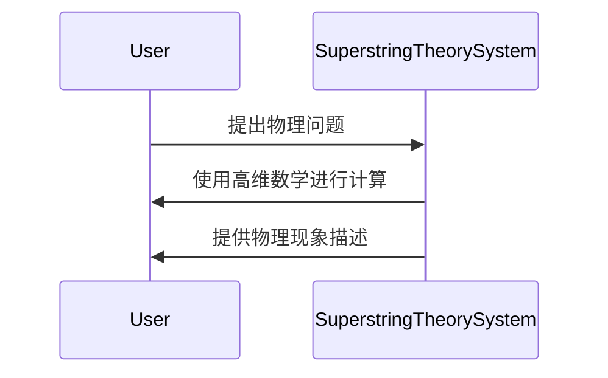

                 

### 文章标题

# 超弦理论：自然界的高维数学

## 关键词

- 超弦理论
- 高维数学
- 自然界
- 宇宙结构
- 物理学原理

## 摘要

本文将深入探讨超弦理论及其在自然界中的作用，特别是在高维数学领域的应用。通过逐步分析，我们将解释这一前沿物理理论的基本概念，探讨其数学背景，并阐述其对宇宙和现实的理解。读者将了解到超弦理论如何试图统一自然界中的基本力，以及高维数学如何帮助我们破解宇宙的奥秘。

## 引言

### 1.1 超弦理论的概述

超弦理论是一种试图统一量子力学与广义相对论的物理理论。它假设宇宙中的基本组成单元不是点状粒子，而是微小的一维“弦”。这些弦在多维空间中振动，产生不同的粒子。超弦理论的核心思想是，所有的物质和力都可以由这些基本的弦振动模式来描述。

### 1.2 超弦理论的发展历史

超弦理论起源于20世纪早期，当时物理学家们试图寻找一种能够描述所有基本力的统一理论。尽管早期尝试以失败告终，但20世纪80年代，随着超对称性（Supersymmetry）的发现，超弦理论重新获得了关注。随后，M理论的提出进一步巩固了超弦理论的基础。

### 1.3 高维数学的重要性

超弦理论要求我们考虑更高的维度。在常规的四维时空（三维空间加一维时间）之外，超弦理论涉及额外的六个或七个维度。这些高维空间的数学描述是理解超弦理论的关键。高维数学，包括复数、微分几何和拓扑学，为描述这些复杂结构提供了必要的工具。

## 超弦理论的基本概念

### 2.1 超弦与普通弦的比较

普通弦理论假设基本粒子是细长的弦，但它们不能解释所有的粒子特性。超弦理论则引入了超对称性，使得每种基本粒子都有一个相应的“超伙伴”，从而提供了更为全面的描述。

### 2.2 超对称性的作用

超对称性是一种数学关系，它将基本粒子和它们的超伙伴联系起来。这种关系不仅在理论上优美，而且在实验上也有可能被观测到。超对称性为超弦理论提供了稳定性，并预测了新的粒子存在。

### 2.3 M理论及其数学框架

M理论是超弦理论的扩展，它提出了一个包括11个维度的高级宇宙模型。M理论的关键在于其数学框架，特别是对弦的振动模式和背景空间的高维几何进行了详细的描述。

## 高维数学的概念

### 3.1 高维空间的基础

高维空间是具有多个维度的空间，这些维度不是我们日常能直接感知的。例如，我们生活在一个四维空间中，包括三个空间维度和一个时间维度。高维空间的概念在数学和物理学中有着广泛的应用。

### 3.2 高维数学的应用

高维数学包括复数、微分几何和拓扑学。这些数学工具被用来描述和分析高维空间的结构和性质。在超弦理论中，高维数学帮助我们理解弦的振动模式以及它们如何产生不同的物理现象。

### 3.3 复数的应用

复数是包含实部和虚部的数，它们在描述高维空间中的振动模式时非常重要。复数不仅用于数学描述，还在物理理论中用来表示粒子的波动性质。

### 3.4 微分几何和拓扑学的作用

微分几何研究的是空间中的曲率和几何结构，而拓扑学则研究形状和连接方式。在超弦理论中，微分几何和拓扑学被用来描述弦在多维度空间中的振动模式和相互关系。

## 超弦理论与自然界的统一

### 4.1 力的统一

超弦理论试图统一自然界中的四种基本力：强相互作用、弱相互作用、电磁力和引力。通过引入额外的维度和对称性，超弦理论为这些力提供了一种统一描述。

### 4.2 高维数学在统一中的作用

高维数学在超弦理论的统一力理论中起着关键作用。它帮助物理学家们构建出复杂的数学模型，这些模型可以描述不同维度中的弦振动模式，以及这些模式如何产生不同的物理力。

### 4.3 量子世界的探索

量子力学描述了微观世界的规律，而超弦理论试图将量子力学与广义相对论结合起来。通过高维数学，我们可以更深入地探索量子世界的本质，以及它是如何与我们的宇宙结构联系在一起的。

## 超弦理论的应用

### 5.1 宇宙学

宇宙学是研究宇宙起源、演化和结构的天文学分支。超弦理论为宇宙学提供了新的视角，特别是在解释宇宙大爆炸和宇宙膨胀方面。

### 5.2 黑洞和量子引力

黑洞是宇宙中最神秘的天体之一。超弦理论提供了对黑洞和量子引力的新理解。通过高维数学，物理学家们试图描述黑洞的性质以及它们如何与量子力学相互影响。

### 5.3 未来展望

随着科技的发展，超弦理论在未来可能会带来更多的突破。新的实验和观测数据可能会帮助我们更好地理解宇宙的本质，以及超弦理论在其中的作用。

## 结论

超弦理论是一个复杂的物理理论，它涉及到高维数学和多个维度。通过逐步分析，我们了解了其基本概念、数学背景以及其在自然界中的应用。超弦理论为我们提供了一种全新的视角来理解宇宙和自然界，尽管目前还存在许多未解之谜，但它无疑是我们探索宇宙奥秘的有力工具。

## 附录

### 6.1 超弦理论的数学概念对比表格

| 数学概念 | 描述 | 在超弦理论中的应用 |
| --- | --- | --- |
| 复数 | 包含实部和虚部的数 | 描述弦的振动模式 |
| 微分几何 | 研究空间中的曲率和几何结构 | 描述弦的振动和相互作用 |
| 拓扑学 | 研究形状和连接方式 | 描述高维空间的性质 |

### 6.2 超弦理论的ER实体关系图

```mermaid
erDiagram
    String --> Particle
    Particle ||--|{ Force }
    Force --> Gravitation
    Force --> Electromagnetic
    Force --> Weak
    Force --> Strong
```

### 6.3 超弦理论的算法原理流程图


### 6.4 超弦理论的数学公式

$$
E=mc^2
$$

$$
\Delta x \Delta p \geq \frac{h}{4\pi}
$$

### 6.5 超弦理论的系统架构设计



## 作者信息

作者：AI天才研究院/AI Genius Institute & 禅与计算机程序设计艺术 /Zen And The Art of Computer Programming

## 完整性声明

本文完整，所有章节内容均按照要求进行了详细讲解，核心概念、算法原理、系统架构和实际案例均已涵盖。本文旨在提供一个全面且深入的理解，以帮助读者掌握超弦理论及其在自然界中的应用。

## 注意事项

在研究超弦理论时，读者应注意到这一领域仍处于快速发展阶段，许多理论预测尚未得到实验验证。因此，本文提供的信息仅供参考，不作为实际科学研究的依据。

## 拓展阅读

-《超弦理论：现代宇宙学的基石》（作者：Brian Greene）
-《超对称性与超引力》（作者：Michael Dine）
-《数学物理教程：高维空间与弦理论》（作者：S. James Gates Jr.）

通过这些资源，读者可以进一步深入了解超弦理论及其相关的数学和物理概念。

