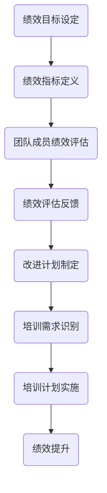

                 

### 跨代际团队管理的重要性

在当今快速变化的技术环境中，团队的专业能力和协作效率是决定企业成功的关键因素。随着代际差异的日益显著，跨代际团队管理的重要性逐渐凸显。不同代际之间的团队成员在价值观、生活经历和技术背景等方面存在显著差异，这些差异如果不妥善管理，可能会导致沟通不畅、团队士气下降，甚至影响项目的进展和质量。

首先，跨代际团队管理能够帮助企业在多元化的人才结构中发挥每位成员的潜力。不同代际的成员往往拥有各自独特的经验和技能，通过合理的管理和协调，可以形成互补效应，提高团队整体的工作效率。例如，年轻的团队成员可能更熟悉新兴技术，而年长的成员则可能拥有丰富的项目管理经验和行业洞察力。

其次，有效的跨代际团队管理有助于减少代沟，促进团队成员之间的理解和协作。不同代际的成员在沟通方式和表达习惯上可能存在差异，如果管理不当，这些差异可能会演变成冲突。通过采用多元化的沟通策略和领导风格，管理者可以搭建起跨越代沟的桥梁，增强团队的凝聚力和合作精神。

此外，跨代际团队管理还有助于提升企业的创新能力和市场竞争力。不同代际的成员在思维方式和工作方法上有所不同，这种差异为团队带来了多样化的视角和创意。当这些视角和创意被有效整合和利用时，企业能够更迅速地适应市场变化，推出更具竞争力的产品和服务。

总之，跨代际团队管理不仅是现代企业管理的重要课题，更是提升企业整体绩效和竞争力的关键策略。通过理解和管理代际差异，企业可以打造一支高效的跨代际团队，实现持续发展和成功。

### 跨代际团队管理中的主要问题

尽管跨代际团队管理具有诸多优势，但在实际操作中仍面临诸多挑战和问题。首先，沟通障碍是跨代际团队管理中最为常见的问题之一。不同代际的成员在沟通方式和表达习惯上存在显著差异，这些差异可能导致信息传递的不准确和误解。例如，年轻的团队成员可能更倾向于直接沟通，而年长的成员则可能更喜欢正式和详细的书面报告。这种沟通方式的差异如果不被妥善管理，会严重影响团队协作的效果。

其次，工作期望的差异也是跨代际团队管理中的一大难题。不同代际的成员对工作目标、工作方式和职业发展的期望有所不同。年长的成员可能更注重稳定性和长期职业规划，而年轻的成员则可能更追求创新和快速成长。这种期望的差异如果没有得到合理的协调，可能会导致团队成员的工作动力和满意度下降，进而影响整个团队的表现。

第三，职业发展路径的不同也增加了跨代际团队管理的复杂性。不同代际的成员在职业发展上的期望和需求存在差异，年长的成员可能希望保持当前职位和稳定的工作节奏，而年轻的成员则可能希望不断挑战自我，快速晋升。这种差异如果不被妥善处理，可能会导致内部竞争加剧，团队凝聚力下降。

除此之外，跨代际团队管理还面临着文化差异和价值观冲突的挑战。不同代际的成员在成长环境、教育背景和文化认同上有所不同，这些差异可能会影响团队内部的互动和协作。例如，年长的成员可能更重视团队合作和集体荣誉，而年轻的成员则可能更注重个人成就和自我实现。这种价值观的冲突如果处理不当，可能会影响团队的稳定性和和谐性。

总的来说，跨代际团队管理中的主要问题包括沟通障碍、工作期望差异、职业发展路径不同和文化差异等。这些问题如果不被有效解决，可能会影响团队的协作效率和工作氛围，进而影响项目的进展和成功。因此，管理者需要深入理解和分析这些问题，并采取有针对性的策略和措施，以促进跨代际团队的和谐与高效。

### 问题描述与目标

在跨代际团队管理中，最核心的问题是如何在多元代际的成员中建立有效的沟通和协作机制，从而实现团队目标的最大化。具体来说，问题描述可以概括为以下几点：

首先，不同代际的成员在价值观、沟通方式和职业期望上存在显著差异，这些差异可能导致沟通不畅和团队内部的矛盾。例如，年长的成员可能更倾向于保守和稳定，而年轻的成员则可能更追求创新和快速变化。这种价值观的差异如果不能得到有效调和，将直接影响团队的凝聚力和工作效率。

其次，工作期望的不同使得团队成员对项目的理解和目标存在分歧。年长的成员可能更注重长期的职业发展和稳定的收入，而年轻的成员则可能更看重项目带来的个人成长和挑战。这种期望差异如果不被妥善处理，可能导致团队内部的竞争和不满，进而影响团队的协作效果。

第三，职业发展路径的差异使得团队成员的职业规划存在不一致。年长的成员可能更倾向于维持现有的职位和稳定的工作节奏，而年轻的成员则可能希望通过不断挑战自我来实现快速晋升。这种差异如果处理不当，可能会导致内部竞争加剧，团队氛围紧张。

基于以上问题，跨代际团队管理的目标可以分为以下几个方面：

第一，建立有效的沟通机制，促进不同代际成员之间的理解和协作。通过多样化的沟通方式，如面对面交流、书面沟通和虚拟会议等，确保信息传递的准确性和及时性，减少误解和冲突。

第二，制定共同的目标和愿景，确保团队成员对项目的理解和目标一致。通过明确的项目目标和阶段性任务，帮助团队成员聚焦于共同的目标，提高团队协作效率。

第三，提供个性化的职业发展机会，满足不同代际成员的职业期望。通过设立不同的职业发展路径和培训计划，帮助团队成员实现职业目标，增强团队的凝聚力和工作满意度。

第四，创造包容性工作环境，尊重和认可不同代际成员的差异。通过建立多元化的文化和价值观，促进团队成员之间的相互理解和尊重，增强团队的和谐性。

总之，通过解决沟通障碍、工作期望差异和职业发展路径不同等问题，实现跨代际团队的和谐与高效，是现代企业管理的核心任务。只有通过明确的问题描述和具体的管理目标，才能有效地提升团队的整体绩效和竞争力。

### 边界与外延

在探讨跨代际团队管理时，有必要明确其定义和适用范围，以确保概念的一致性和管理的有效性。

首先，**管理的代际定义**。代际是指一定历史时期内，年龄相近的一代人。通常，代际可以按照出生年份来划分，如婴儿潮一代、X一代、Y一代和Z一代等。每一代人在成长过程中受到的历史背景、社会环境和教育方式的影响不同，导致他们在价值观、生活方式和工作理念上存在显著差异。在跨代际团队管理中，这些差异是管理者需要关注和协调的核心问题。

其次，**跨代际团队管理的适用范围**。跨代际团队管理不仅适用于企业内部的多代际团队，也适用于各类组织中的跨代际协作。例如，学校教育中的师生团队、政府机构中的跨部门合作、非营利组织中的多代际志愿者团队等。在实际操作中，跨代际团队管理需要根据不同组织的具体情况，灵活运用多样化的管理策略，以实现团队的协同效应。

此外，**跨代际团队管理的特定场景**包括：

1. **多元化企业团队**：在全球化背景下，企业需要吸纳不同国籍、文化和背景的人才。这种多元化的团队结构要求管理者具备跨代际管理的意识和能力，以促进团队协作和创新。

2. **持续学习型组织**：现代企业强调持续学习和知识共享，跨代际团队管理可以帮助不同年龄段的员工在经验交流和技能传承中实现共同成长。

3. **项目团队合作**：在项目管理中，跨代际团队管理能够有效地整合不同代际成员的专业知识和经验，提高项目执行的效率和质量。

最后，**跨代际团队管理的边界**。在实施跨代际团队管理时，管理者需要避免将所有问题归咎于代际差异，而是要具体分析每个问题的本质，并采取有针对性的解决策略。同时，跨代际团队管理也需要与组织文化和价值观相融合，确保管理措施能够被团队成员广泛接受和执行。

通过明确跨代际团队管理的定义、适用范围和特定场景，有助于管理者更好地理解和应用这一管理理念，从而提升团队的整体绩效和竞争力。

### 核心概念与联系

在跨代际团队管理中，理解并处理代沟和跨代际沟通是至关重要的。以下将详细解释这两个核心概念，并通过对比表格和ER实体关系图来展示它们之间的联系。

首先，**代沟**的定义。代沟是指由于不同代际在价值观、生活方式、教育背景和成长环境等方面的差异，导致相互之间产生理解障碍和沟通困难的现象。代沟不仅仅是年龄差异，它还包括由这种差异引起的认知和情感上的隔阂。

**代沟的成因**包括：

1. **价值观差异**：不同代际受社会环境、文化背景和历史经验的影响，形成了不同的价值观。例如，年长的成员可能更重视稳定性和传统，而年轻的成员则可能更倾向于创新和自由。
2. **生活经历不同**：每一代人都有其独特的历史背景和社会变迁，这些经历影响了他们的思维方式和生活态度。
3. **技术背景差异**：随着技术的迅速发展，不同代际对新兴技术的接受程度和使用习惯也存在差异。

接下来，**跨代际沟通**的定义。跨代际沟通是指在不同代际成员之间，通过语言、非语言和行为等手段进行信息交换和相互理解的过程。有效的跨代际沟通可以帮助减少代沟，促进团队成员之间的合作和协作。

**跨代际沟通的方法**包括：

1. **主动倾听**：倾听是沟通的基础，通过主动倾听，可以更好地理解对方的观点和需求。
2. **提高沟通技巧**：包括清晰表达、避免使用专业术语、注意语调和肢体语言等，以减少误解和冲突。
3. **增强同理心**：站在对方的角度考虑问题，理解和尊重对方的观点和感受。

为了更直观地理解代沟与跨代际沟通之间的关系，我们可以通过**概念属性特征对比表格**来展示两者的异同点。

| 概念属性 | 代沟 | 跨代际沟通 |
| :---: | :---: | :---: |
| **定义** | 由于价值观、生活经历和技术背景的差异，导致相互理解障碍的现象 | 在不同代际成员之间，通过语言、非语言和行为等手段进行信息交换和相互理解的过程 |
| **成因** | 价值观差异、生活经历不同、技术背景差异 | 代沟的存在 |
| **方法** | - 无需特别方法，代沟自然存在 <br> - 需要意识到并接受代沟的存在 | 主动倾听、提高沟通技巧、增强同理心 |
| **目标** | 减少误解和冲突，但不是沟通的主要目标 | 减少代沟，提高沟通效率和效果 |

接下来，我们通过**ER实体关系图架构**来进一步展示这两个概念之间的关系。

```mermaid
erDiagram
    Class1 ||--|{ Class2 }| Class3 : attr_b
    Class1 ||--|{ Class4 }| Class5 : attr_c
```

在这个ER图中，**Class1**代表代沟，**Class2**、**Class3**、**Class4**和**Class5**分别代表跨代际沟通的不同方面，如主动倾听、提高沟通技巧、增强同理心等。这些方面通过属性（attr_b和attr_c）与代沟相连接，表明跨代际沟通是解决代沟的重要手段。

通过上述分析，我们可以看到，代沟和跨代际沟通是相互关联的核心概念。代沟的存在是跨代际沟通的起点，而有效的跨代际沟通则是缓解和解决代沟的关键。理解并运用这些概念，有助于管理者更好地实施跨代际团队管理，提高团队的整体绩效和协作效率。

### 本章小结

在本章中，我们详细探讨了跨代际团队管理的重要性及其面临的挑战。通过分析代沟和跨代际沟通的概念，我们明确了代沟的成因、跨代际沟通的方法，并利用对比表格和ER实体关系图展示了这两者之间的联系。本章的核心观点是，理解并处理跨代际团队中的代沟和沟通问题是实现团队高效协作和持续发展的关键。通过有效的跨代际沟通，管理者可以减少误解和冲突，促进团队成员之间的理解和合作，从而提升团队的整体绩效和竞争力。

## 第2章：代沟与跨代际沟通

### 2.1 代沟的成因

代沟是指在价值观、生活方式、教育背景和成长环境等方面，不同代际之间产生的理解障碍和沟通困难的现象。要理解代沟的成因，我们需要从多个维度进行分析。

首先，**价值观差异**是导致代沟的一个重要原因。不同的代际在成长过程中受到的历史背景、社会环境和家庭文化的影响各不相同，形成了各自独特的价值观。例如，年长的成员可能更重视传统、稳定和权威，而年轻的成员则可能更倾向于自由、创新和自我实现。这种价值观的差异不仅体现在对工作的看法上，也体现在生活态度、人际交往和社会责任等方面。

其次，**生活经历不同**也是代沟产生的关键因素。每一代人都有其独特的成长经历和社会变迁，这些经历影响了他们的认知和行为模式。例如，年长的成员可能在艰苦的环境中成长，更加珍惜现有的资源和机会，而年轻的成员则可能在一个相对富裕和自由的环境中成长，更愿意追求个性化的生活方式和自由表达。

第三，**技术背景差异**也是不可忽视的代沟成因。随着技术的迅速发展，不同代际对新兴技术的接受程度和使用习惯存在显著差异。年长的成员可能在技术学习和使用上相对保守，而年轻的成员则可能更愿意尝试和使用新技术。这种差异不仅体现在工具的选择上，也影响了他们的工作方法和效率。

具体案例来说，假设在一个软件开发团队中，年长的团队成员可能更倾向于使用传统的开发工具和方法，注重代码的规范性和稳定性，而年轻的团队成员则可能更愿意使用新兴的开发框架和工具，追求代码的高效和创新性。这种技术背景的差异可能导致团队在项目规划和实施过程中产生冲突，影响项目的进展和质量。

综上所述，代沟的成因主要包括价值观差异、生活经历不同和技术背景差异。这些因素共同作用，导致不同代际成员在沟通和理解上产生障碍。因此，管理者需要深入理解这些成因，并采取有针对性的策略，以缓解和解决跨代际团队中的代沟问题。

### 2.2 跨代际沟通的方法

为了有效缓解跨代际团队中的代沟，提升沟通效率，管理者需要掌握多种跨代际沟通的方法。以下将详细探讨主动倾听、提高沟通技巧和增强同理心这三种关键方法。

**主动倾听**是跨代际沟通的基础。倾听不仅仅是听别人说话，更重要的是理解对方的观点和感受。在跨代际沟通中，主动倾听可以有效地减少误解和冲突。例如，年长的团队成员在表达时可能更注重逻辑和条理，而年轻的团队成员则可能更倾向于直接和情感化的表达。通过主动倾听，管理者可以更好地捕捉到对方的真实意图，避免因误解而产生的误解和冲突。

具体来说，主动倾听的方法包括以下几个方面：

1. **积极关注**：在沟通过程中，保持全神贯注，不打断对方，给予对方充分的表达机会。
2. **反馈与确认**：在对方发言结束后，通过简短的总结或反馈，确认自己是否正确理解了对方的观点。
3. **开放性问题**：使用开放性问题引导对方继续表达，例如“您对此有什么看法？”或“您觉得这个方案的优缺点是什么？”

**提高沟通技巧**是跨代际沟通的重要手段。不同代际的成员在沟通方式和表达习惯上有所不同，管理者需要根据具体情况进行调整。例如，对于年长的成员，可以使用更正式和详细的书面沟通，而对于年轻的成员，则可以采用更直接和口语化的表达方式。以下是一些提高沟通技巧的方法：

1. **清晰表达**：避免使用复杂的术语和难以理解的语言，确保信息传递的准确性。
2. **注意语调与肢体语言**：通过适当的语调和肢体语言，增强表达的感染力和说服力。例如，年长的成员可能更倾向于温和、沉稳的语调，而年轻的成员可能更喜欢直接、热情的语调。
3. **反馈与确认**：在沟通过程中，经常性地进行反馈和确认，确保双方对信息的理解一致。

**增强同理心**是跨代际沟通的最高境界。同理心是指站在对方的角度考虑问题，理解和尊重对方的观点和感受。通过增强同理心，管理者可以建立更深层次的信任和合作关系，从而减少代沟和冲突。

具体方法包括：

1. **换位思考**：在沟通中，尝试站在对方的立场上思考问题，理解他们的需求和困扰。
2. **尊重差异**：尊重不同代际成员的价值观和生活方式，避免强加自己的观点。
3. **积极反馈**：对对方的观点和努力给予积极的反馈和肯定，增强他们的自信心和归属感。

通过主动倾听、提高沟通技巧和增强同理心，管理者可以有效地缓解跨代际团队中的代沟，提升团队的协作效率和工作氛围。这些方法不仅适用于企业管理，也适用于家庭、学校和社会等各个领域，具有广泛的实践价值。

### 概念属性特征对比表格

为了更直观地理解代沟与沟通技巧之间的异同，我们可以通过一个概念属性特征对比表格来展示。

| 概念属性        | 代沟                   | 沟通技巧                  |
| --------------- | ---------------------- | ------------------------- |
| **定义**        | 因代际差异产生的理解障碍 | 提升沟通效果的策略和方法   |
| **成因**        | 价值观、生活经历、技术背景差异 | 无                        |
| **表现形式**    | 误解、冲突、沟通不畅     | 清晰表达、注意语调、同理心 |
| **影响因素**    | 代际差异               | 沟通场景、沟通对象、沟通内容 |
| **应对策略**    | 减少代沟、增强沟通     | 提高个人沟通能力           |
| **目标**        | 减少误解和冲突         | 提高沟通效率和效果         |

通过这个表格，我们可以看到，代沟和沟通技巧虽然在定义上有所不同，但它们在应对策略和目标上存在密切的联系。代沟是沟通障碍的根源，而沟通技巧则是缓解和解决这些障碍的重要手段。有效的沟通技巧可以减少代沟带来的负面影响，提高团队协作效率和工作氛围。

### 2.3 跨代际沟通的挑战与解决方案

在跨代际团队管理中，跨代际沟通的挑战主要表现在以下三个方面：沟通障碍、工作期望差异和职业发展路径不同。针对这些挑战，我们可以采取一系列解决方案来提高跨代际沟通的效果，促进团队的协作和合作。

**沟通障碍**是跨代际团队管理中最为常见的问题之一。不同代际的成员在沟通方式和表达习惯上存在显著差异，这可能导致信息传递的不准确和误解。为了解决这一问题，我们可以采取以下策略：

1. **加强沟通培训**：定期组织沟通技巧培训，帮助团队成员掌握有效的沟通方法和技巧。培训内容可以包括倾听技巧、非语言沟通、表达清晰和冲突解决等。
   
2. **建立多样化的沟通渠道**：除了传统的面对面沟通和电子邮件外，可以引入视频会议、即时通讯工具和在线协作平台等多样化的沟通渠道，以满足不同代际成员的沟通偏好。

3. **设置沟通目标**：在每次沟通前明确沟通的目标和预期结果，确保沟通的焦点和内容一致。通过设置明确的沟通目标，可以减少沟通中的模糊和误解。

**工作期望差异**是跨代际团队管理中的另一个重要挑战。不同代际的成员对工作目标、工作方式和职业发展的期望有所不同，这可能导致团队内部的冲突和不满。为了解决这一问题，我们可以采取以下策略：

1. **开展代际对话**：定期组织代际对话会议，让不同代际的成员分享他们的观点和期望，增进彼此的理解和尊重。通过这种开放性的对话，可以缓解因期望差异引发的矛盾和冲突。

2. **设定共同目标**：在团队中设定共同的目标和愿景，确保所有成员对项目的理解和目标一致。通过共同的目标，可以减少因期望差异导致的内部竞争和分歧。

3. **个性化职业发展规划**：根据不同代际成员的职业期望和需求，提供个性化的职业发展机会和培训计划。通过个性化的职业规划，可以满足不同代际成员的职业发展需求，增强团队凝聚力。

**职业发展路径不同**也是跨代际团队管理中的一个重要挑战。不同代际的成员在职业发展上的期望和需求存在差异，这可能导致团队内部的竞争和不满。为了解决这一问题，我们可以采取以下策略：

1. **多元化职业发展路径**：在团队中建立多元化的职业发展路径，为不同代际成员提供多种职业发展机会。例如，可以设立技术专家、项目管理、创新孵化等不同的发展路径。

2. **职业发展反馈机制**：建立有效的职业发展反馈机制，定期评估和反馈成员的职业发展情况。通过反馈，可以及时调整职业发展规划，确保团队成员的职业发展需求得到满足。

3. **职业发展支持**：提供职业发展支持和资源，例如培训机会、导师制度和企业内部转岗机会等，帮助成员实现职业目标。

通过上述策略，我们可以有效解决跨代际沟通中的挑战，促进团队成员之间的理解和协作，提高团队的整体绩效和竞争力。有效的跨代际沟通不仅能够减少误解和冲突，还能够增强团队的凝聚力和合作精神，为企业的持续发展提供强大的动力。

### 2.4 跨代际团队管理的实体关系图架构

在跨代际团队管理中，理解各实体之间的关系和互动是关键。通过ER实体关系图，我们可以更直观地展示这些关系，以便管理者更好地实施管理策略。以下是一个简化的跨代际团队管理的ER实体关系图，包括主要实体及其关系。

```mermaid
erDiagram
    TeamMember ||--|{ CommunicationStyle }| CommunicationStyle : has_style
    TeamMember ||--|{ WorkExpectation }| WorkExpectation : has_expectation
    TeamMember ||--|{ CareerDevelopment }| CareerDevelopment : has_path
    TeamMember ||--|{ GenerationGap }| GenerationGap : caused_by
    CommunicationStyle ||--|{ LanguageUsage }| LanguageUsage : used_in
    CommunicationStyle ||--|{ CommunicationChannel }| CommunicationChannel : used_on
    WorkExpectation ||--|{ WorkEnvironment }| WorkEnvironment : satisfied_in
    CareerDevelopment ||--|{ TrainingProgram }| TrainingProgram : supported_by
    GenerationGap ||--|{ CulturalDifference }| CulturalDifference : influenced_by
```

在这个ER图中，主要实体包括：

1. **TeamMember（团队成员）**：代表跨代际团队中的每个成员，具有多个属性，如沟通风格、工作期望和职业发展路径。
2. **CommunicationStyle（沟通风格）**：描述团队成员在沟通中的语言使用和沟通渠道，如口头表达、书面报告、视频会议等。
3. **WorkExpectation（工作期望）**：包括团队成员对工作环境、工作目标和职业发展的期望。
4. **CareerDevelopment（职业发展）**：描述团队成员的职业发展路径和目标，如晋升、技能提升等。
5. **GenerationGap（代沟）**：代表由于代际差异导致的理解障碍和沟通问题。
6. **CulturalDifference（文化差异）**：影响代沟和沟通风格的多样性。

各实体之间的关系如下：

- **TeamMember**与**CommunicationStyle**之间是“具有”关系，即每个团队成员都有其特定的沟通风格。
- **TeamMember**与**WorkExpectation**之间是“具有”关系，即每个团队成员都有其特定的工作期望。
- **TeamMember**与**CareerDevelopment**之间是“具有”关系，即每个团队成员都有其特定的职业发展路径。
- **TeamMember**与**GenerationGap**之间是“导致”关系，即代沟是由于代际差异引起的。
- **CommunicationStyle**与**LanguageUsage**和**CommunicationChannel**之间是“使用”关系，即不同的沟通风格会使用特定的语言表达方式和沟通渠道。
- **WorkExpectation**与**WorkEnvironment**之间是“满足于”关系，即工作期望需要在特定的环境中实现。
- **CareerDevelopment**与**TrainingProgram**之间是“支持”关系，即职业发展需要通过培训计划来支持。
- **GenerationGap**与**CulturalDifference**之间是“影响”关系，即文化差异会影响代沟的形成和沟通风格。

通过这个ER实体关系图，我们可以清晰地看到跨代际团队管理中的各个实体及其相互关系。这有助于管理者更好地理解和管理团队，实施有效的跨代际沟通策略和职业发展计划，从而提升团队的整体绩效和协作效率。

### 2.5 本章小结

在本章中，我们深入探讨了代沟与跨代际沟通的概念，分析了代沟的成因以及跨代际沟通的方法和挑战。通过对比表格和ER实体关系图，我们直观地展示了代沟与沟通技巧之间的关系。本章的核心观点是，有效的跨代际沟通能够显著减少代沟带来的负面影响，提升团队协作效率和整体绩效。管理者应采取多种策略，如主动倾听、提高沟通技巧和增强同理心，来应对跨代际团队中的沟通挑战。通过理解代沟和跨代际沟通，管理者可以构建一个更加和谐和高效的跨代际团队，实现持续发展和成功。

## 第3章：构建跨代际团队

### 3.1 跨代际团队的构建原则

构建一个高效的跨代际团队需要遵循一系列核心原则，以确保团队成员之间的协作和沟通达到最佳效果。以下是构建跨代际团队的几个关键原则：

**1. 平衡代际比例**

首先，平衡代际比例是构建跨代际团队的重要原则之一。不同代际的成员在价值观、经验和技术能力上各有所长，通过合理配置，可以使团队更加多元化。例如，年长的成员可能具有丰富的行业经验和项目管理技能，而年轻的成员则可能更熟悉新技术和创新思维。平衡代际比例不仅可以弥补不同代际成员之间的技能差距，还能促进团队成员之间的知识和经验交流，提高团队的整体绩效。

**2. 多元文化融合**

跨代际团队往往涵盖不同国籍、文化和背景的成员，因此，多元文化融合是构建高效团队的关键。管理者需要尊重和认可团队成员的文化差异，建立一种包容性的工作环境。通过开展文化交流活动、设立多元化的培训课程和项目，可以帮助团队成员更好地理解彼此的文化背景和价值观，促进团队的凝聚力和合作精神。

**3. 代际互补性**

代际互补性是指在不同代际成员之间寻找和利用互补的技能和经验。例如，年长的成员可能在项目管理、风险评估和战略规划方面有丰富经验，而年轻的成员则可能在技术创新、市场分析和敏捷开发方面有突出表现。通过发挥代际互补性，团队可以更全面地应对各种挑战，提高项目执行的成功率。

**4. 明确共同目标**

明确共同目标是跨代际团队成功的关键。团队的所有成员都应该对项目的目标和愿景有清晰的认识，并致力于实现这些目标。通过定期召开团队会议、制定项目计划和进度报告，管理者可以确保团队成员在目标实现过程中保持一致的行动方向。

**5. 鼓励开放沟通**

开放沟通是跨代际团队管理中的核心原则之一。管理者应鼓励团队成员在团队内部建立开放的沟通渠道，无论代际差异，每个人都应该能够自由地表达自己的观点和建议。通过定期的团队建设活动和反馈机制，可以帮助团队成员建立信任，减少误解和冲突，提高团队的协作效率。

**6. 个性化职业发展**

为了激发团队成员的积极性和创造力，管理者应提供个性化的职业发展机会。根据不同代际成员的职业期望和需求，制定个性化的职业发展规划，提供培训、晋升和转岗机会。通过这些措施，可以帮助团队成员实现职业目标，增强团队凝聚力和工作满意度。

通过遵循这些核心原则，管理者可以构建一个高效、和谐的跨代际团队，促进团队成员之间的协作和合作，提升团队的整体绩效和竞争力。

### 3.2 跨代际团队的领导策略

在跨代际团队中，领导策略的选择至关重要，因为它直接影响团队成员的工作状态、协作效率和整体绩效。以下是一些关键的领导策略，可以帮助管理者在跨代际团队中实现有效的领导。

**1. 领导风格多样性**

跨代际团队中的成员来自不同的背景，他们对于领导风格的需求和期望也有所不同。因此，采用多样化的领导风格是必要的。例如，对于年轻的成员，可能更倾向于参与式和民主式的领导风格，而年长的成员则可能更适应权威式或指导式的领导风格。管理者可以通过灵活调整领导风格，以满足不同代际成员的需求，增强团队的凝聚力。

**2. 鼓励开放沟通**

开放沟通是跨代际团队成功的关键。管理者应积极鼓励团队成员在团队内部建立开放的沟通渠道，无论年龄或职位，每个人都应该能够自由地表达自己的观点和建议。可以通过定期召开团队会议、设立意见箱和匿名反馈机制等方式，确保团队成员能够充分参与到决策和问题解决过程中，减少误解和冲突。

**3. 增强团队凝聚力**

团队凝聚力是跨代际团队高效协作的基础。管理者可以通过多种方式增强团队凝聚力，例如组织团队建设活动、设立团队目标、共同庆祝成功等。这些活动不仅有助于增强团队成员之间的信任和了解，还能提高团队的整体士气和工作满意度。

**4. 提供个性化支持**

跨代际团队成员在职业发展和个人需求上存在差异，管理者应提供个性化的支持，以满足不同代际成员的需求。例如，对于年轻的成员，可以提供更多的培训和发展机会，帮助他们快速成长；而对于年长的成员，则可以提供更多的工作调整和平衡机会，以适应他们的职业和生活需求。

**5. 实施透明化管理**

透明化管理可以增强团队成员对团队目标和进展的理解，提高团队的协作效率。管理者应定期向团队成员通报项目进展、团队目标和资源分配情况，确保信息的透明和公正。通过这种透明化管理，可以减少误解和猜疑，增强团队成员的信任感和归属感。

**6. 鼓励创新与学习**

跨代际团队的多元化带来了丰富的知识和经验，管理者应鼓励团队成员之间的知识共享和创新思维。可以通过设立创新工作坊、鼓励跨部门合作和提供外部培训机会等方式，激发团队成员的创造力，提高团队的整体竞争力。

通过上述领导策略，管理者可以有效地管理跨代际团队，提高团队成员的工作状态和协作效率，实现团队的整体绩效目标。

### 3.3 跨代际团队的协作机制

在跨代际团队中，建立有效的协作机制是确保团队高效运作和实现共同目标的关键。以下是一些关键的协作机制，帮助团队成员克服代沟，实现协作和合作。

**1. 制定共同目标**

共同目标是团队协作的基石。为了确保每个团队成员都明确团队的目标和愿景，管理者应与团队成员共同制定项目目标和阶段性任务。通过明确的目标，团队成员可以集中精力，协同努力，减少因目标不一致导致的内部分歧和冲突。

**2. 建立有效的沟通渠道**

沟通是协作的重要环节。管理者应建立多样化的沟通渠道，确保团队成员能够方便快捷地进行信息交流和协作。例如，可以设置定期的团队会议、项目进展汇报会、在线协作平台和即时通讯工具等。这些沟通渠道有助于团队成员及时了解项目进展、共享资源和解决问题。

**3. 建立清晰的职责分工**

明确的职责分工可以避免团队成员在任务分配上的模糊和重叠，提高工作效率。管理者应根据团队成员的技能和经验，合理分配任务，确保每个成员都能在其最擅长的领域发挥作用。同时，应定期评估职责分工的合理性，根据项目进展和团队变化进行调整。

**4. 建立反馈机制**

反馈机制是团队协作中的重要一环，通过定期的反馈，团队成员可以了解自己在项目中的表现，发现问题和改进方向。管理者可以设立定期的项目评估会议，邀请团队成员分享经验、反馈意见和建议，从而不断优化团队的工作流程和协作方式。

**5. 鼓励知识共享**

知识共享可以增强团队成员之间的协作和合作。管理者应鼓励团队成员在团队内部分享知识、经验和最佳实践，建立知识库和经验传承机制。例如，可以通过组织内部培训、研讨会和工作坊等方式，促进团队成员之间的知识交流，提高团队的整体能力和竞争力。

**6. 定期进行团队建设活动**

团队建设活动有助于增强团队成员之间的信任和了解，提高团队的凝聚力和协作效率。管理者可以定期组织团队建设活动，如户外拓展、团建活动和团队竞赛等，让团队成员在轻松的环境中相互了解、建立信任，从而更好地协作和合作。

通过建立上述协作机制，管理者可以有效地促进跨代际团队的协作和合作，提高团队的整体绩效和项目成功概率。

### 3.4 跨代际团队协作的实体关系图架构

为了更好地理解和实施跨代际团队的协作机制，我们可以通过ER实体关系图来展示团队协作中的各个实体及其关系。以下是一个简化的ER实体关系图，描述了跨代际团队协作中的主要实体及其相互作用。

```mermaid
erDiagram
    TeamMember ||--|{ TaskAssignment }| TaskAssignment : assigned_to
    TeamMember ||--|{ CommunicationChannel }| CommunicationChannel : used_on
    TeamMember ||--|{ CollaborationPlatform }| CollaborationPlatform : uses
    TeamMember ||--|{ KnowledgeSharing }| KnowledgeSharing : participates_in
    TeamMember ||--|{ FeedbackSystem }| FeedbackSystem : receives_on
    TeamMember ||--|{ TeamBuildingActivity }| TeamBuildingActivity : participates_in
    TaskAssignment ||--|{ ProjectGoal }| ProjectGoal : contributes_to
    CommunicationChannel ||--|{ Meeting }| Meeting : held_through
    CollaborationPlatform ||--|{ DocumentManagement }| DocumentManagement : integrates_with
    KnowledgeSharing ||--|{ Training }| Training : supported_by
    FeedbackSystem ||--|{ ProjectPerformance }| ProjectPerformance : improves
    TeamBuildingActivity ||--|{ TeamMood }| TeamMood : influences
```

在这个ER图中，主要实体包括：

- **TeamMember（团队成员）**：代表团队中的每个成员，具有多个属性和参与关系。
- **TaskAssignment（任务分配）**：描述团队成员被分配的任务和职责，与项目目标相关联。
- **CommunicationChannel（沟通渠道）**：包括会议、电子邮件、即时通讯等，用于团队成员之间的信息交流。
- **CollaborationPlatform（协作平台）**：如项目管理软件、文档管理工具等，用于团队协作。
- **KnowledgeSharing（知识共享）**：包括培训、研讨会等，用于促进团队成员之间的知识和经验交流。
- **FeedbackSystem（反馈系统）**：包括定期评估、项目回顾等，用于收集和反馈团队成员的工作表现。
- **TeamBuildingActivity（团队建设活动）**：如团建活动、竞赛等，用于增强团队成员之间的信任和凝聚力。

各实体之间的关系如下：

- **TeamMember**与**TaskAssignment**之间是“被分配”关系，即团队成员被分配特定的任务。
- **TeamMember**与**CommunicationChannel**之间是“使用”关系，即团队成员使用不同的沟通渠道进行交流。
- **TeamMember**与**CollaborationPlatform**之间是“使用”关系，即团队成员使用协作平台进行协作。
- **TeamMember**与**KnowledgeSharing**之间是“参与”关系，即团队成员参与知识共享活动。
- **TeamMember**与**FeedbackSystem**之间是“接收”关系，即团队成员接收反馈，了解工作表现。
- **TeamMember**与**TeamBuildingActivity**之间是“参与”关系，即团队成员参与团队建设活动。

通过这个ER实体关系图，我们可以清晰地看到跨代际团队协作中的各个实体及其相互作用关系。这有助于管理者更好地理解和实施团队协作机制，提高团队的整体协作效率和项目成功率。

### 3.5 本章小结

在本章中，我们详细探讨了构建跨代际团队的原则、领导策略和协作机制。通过平衡代际比例、多元文化融合和代际互补性，我们可以构建一个高效、和谐的跨代际团队。有效的领导策略如多样性领导风格、开放沟通和增强团队凝聚力，有助于提升团队的工作状态和协作效率。协作机制如共同目标制定、有效沟通渠道、明确职责分工和定期反馈，为团队成员提供了良好的协作基础。通过本章的学习，管理者可以更好地理解如何构建和管理跨代际团队，实现团队的持续发展和成功。

## 第4章：跨代际团队的挑战与解决方案

### 4.1 挑战分析

跨代际团队在带来多样性和创新的同时，也面临着诸多挑战。这些挑战主要包括代际沟通障碍、工作期望差异和职业发展路径不同。以下将详细分析这些挑战，并提出相应的解决方案。

**1. 代际沟通障碍**

跨代际团队中的成员由于成长环境和价值观念的差异，往往在沟通上存在障碍。这种障碍可能导致误解和冲突，从而影响团队协作和工作效率。

- **问题表现**：沟通障碍可能表现为信息传递不准确、团队成员之间缺乏有效沟通、决策过程中存在分歧等。
- **成因分析**：代际差异、沟通风格不同、工作压力等都是导致沟通障碍的因素。
- **影响**：沟通障碍会导致项目延误、质量下降、团队士气低落。

**解决方案**：

- **加强沟通培训**：定期组织沟通技巧培训，帮助团队成员掌握有效的沟通方法和技巧。
- **建立多样化沟通渠道**：提供多样化的沟通渠道，如面对面的会议、在线协作平台、邮件等，以满足不同代际成员的沟通偏好。
- **鼓励开放沟通**：营造一个鼓励开放和坦诚沟通的环境，让每个成员都能自由表达自己的想法和意见。

**2. 工作期望差异**

跨代际团队中的成员对工作目标和职业发展的期望往往存在差异，这可能导致工作动力不足、团队内部竞争加剧。

- **问题表现**：工作期望差异可能表现为对工作责任的分配不满、对工作成果的评价标准不一致等。
- **成因分析**：不同代际成员在职业价值观、对成功的定义等方面存在差异，同时，个人成长和职业规划的目标不同。
- **影响**：工作期望差异会导致团队成员之间产生摩擦，影响团队凝聚力和工作效率。

**解决方案**：

- **开展代际对话**：定期组织代际对话会议，让团队成员分享各自的工作期望和职业规划，增进理解。
- **设定共同目标**：确保所有成员对项目的目标和愿景有清晰的认识，减少因期望不同导致的分歧。
- **个性化职业发展支持**：根据不同成员的职业期望和需求，提供个性化的职业发展机会和培训计划。

**3. 职业发展路径不同**

跨代际团队中的成员在职业发展路径上的期望和需求也存在差异，这可能导致职业发展上的不平等和不满。

- **问题表现**：职业发展路径不同可能表现为晋升机会不均等、职业发展速度不一致等。
- **成因分析**：不同代际成员在职业发展观念、对成功的追求等方面存在差异，同时，企业的职业发展政策和资源分配也可能存在不公平现象。
- **影响**：职业发展路径不同会导致团队成员之间产生竞争和不满，影响团队稳定性和工作效率。

**解决方案**：

- **多元化职业发展路径**：在团队中设立多元化的职业发展路径，为不同成员提供多种职业发展机会。
- **公平的晋升机制**：确保晋升机会的公平性，建立透明和公正的晋升机制。
- **职业发展支持**：提供职业发展支持和资源，如培训、导师制度和职业规划咨询等。

通过以上解决方案，管理者可以有效地应对跨代际团队中的挑战，提高团队的整体绩效和协作效率。

### 4.2 提高代际沟通技巧

为了在跨代际团队中减少误解和冲突，提高沟通效率，团队成员和管理者需要掌握并运用一系列有效的沟通技巧。以下是一些关键技巧和方法：

**1. 主动倾听**

主动倾听是有效沟通的基础。在沟通过程中，不仅仅是听别人说什么，更重要的是理解对方的意图和感受。以下是一些主动倾听的技巧：

- **全神贯注**：在与对方交流时，避免分心，保持专注。
- **不打断**：让对方完整地表达观点，避免在对方讲话时打断。
- **反馈确认**：在对方发言结束后，通过简短的总结或提问，确认自己是否正确理解了对方的观点。

**2. 提高沟通技巧**

不同代际成员的沟通方式和表达习惯有所不同，管理者需要根据具体情况提高沟通技巧。以下是一些建议：

- **清晰表达**：避免使用复杂的术语和难以理解的语言，确保信息传递的准确性。
- **注意语调和肢体语言**：通过适当的语调和肢体语言，增强表达的感染力和说服力。例如，对于年长的成员，可以使用更温和、沉稳的语调，而对于年轻的成员，则可以采用更直接、热情的语调。
- **反馈与确认**：在沟通过程中，经常性地进行反馈和确认，确保双方对信息的理解一致。

**3. 增强同理心**

同理心是有效沟通的关键。通过增强同理心，管理者可以站在对方的角度考虑问题，理解和尊重对方的观点和感受。以下是一些建议：

- **换位思考**：在沟通中，尝试站在对方的立场上思考问题，理解他们的需求和困扰。
- **尊重差异**：尊重不同代际成员的价值观和生活方式，避免强加自己的观点。
- **积极反馈**：对对方的观点和努力给予积极的反馈和肯定，增强他们的自信心和归属感。

**4. 实际案例**

为了更好地理解这些技巧，我们可以通过一个实际案例来展示。

**案例**：在一个软件开发项目中，团队成员包括一位年轻的开发工程师和一位年长的项目经理。项目经理希望确保项目按时交付，而开发工程师则希望在代码质量方面追求极致。

- **主动倾听**：项目经理在会议中耐心倾听开发工程师关于代码质量的想法和挑战，确保理解他的立场。
- **提高沟通技巧**：项目经理通过使用清晰、简洁的语言表达自己的需求，避免使用专业术语，确保开发工程师理解。
- **增强同理心**：项目经理换位思考，理解开发工程师对代码质量的追求，并肯定他的努力。

通过这些技巧，项目经理和开发工程师之间的沟通障碍得到了有效缓解，双方能够更好地协作，共同实现项目目标。

通过以上技巧和方法，跨代际团队中的成员和管理者可以显著提高沟通效率，减少误解和冲突，从而提升团队的整体绩效和协作效率。

### 4.3 制定个性化职业发展规划

在跨代际团队中，为了满足不同成员的职业期望和需求，制定个性化职业发展规划是至关重要的。以下是一些建议和方法，帮助团队成员实现职业目标，增强团队凝聚力。

**1. 识别职业需求**

首先，管理者需要了解每位团队成员的职业需求，这可以通过以下方式进行：

- **一对一访谈**：定期与团队成员进行一对一的访谈，了解他们的职业目标和当前的工作满意度。
- **职业规划问卷**：设计职业规划问卷，收集团队成员的职业兴趣、职业目标和期望的职业发展路径。
- **内部反馈机制**：建立内部反馈机制，鼓励团队成员提出职业发展的建议和需求。

**2. 设定职业目标**

基于收集到的职业需求，管理者应与团队成员共同设定明确的职业目标。以下是一些建议：

- **短期目标**：设定可实现的短期目标，如技能提升、项目贡献等，以激发团队成员的工作动力。
- **长期目标**：设定长期职业目标，如晋升、转岗、担任项目负责人等，帮助团队成员规划职业发展路径。
- **共同制定**：与团队成员共同制定职业目标，确保目标明确、切实可行，同时增加团队成员的参与感和责任感。

**3. 提供职业发展机会**

为了帮助团队成员实现职业目标，管理者应提供多样化的职业发展机会，包括以下几种方式：

- **培训与发展**：为团队成员提供各种培训机会，如技能培训、领导力培训、跨部门轮岗等，提升其专业技能和管理能力。
- **导师制度**：建立导师制度，让经验丰富的成员指导新成员，帮助新成员更快地融入团队和职业发展。
- **晋升机会**：为表现优秀的成员提供晋升机会，确保职业发展路径的透明和公平。

**4. 定期评估与反馈**

职业发展规划需要定期评估和反馈，以确保目标的实现和成员的持续成长。以下是一些建议：

- **年度评估**：定期进行年度评估，评估团队成员的职业发展进度和绩效表现，及时发现和解决问题。
- **绩效反馈**：在绩效评估中，为团队成员提供具体的反馈和建议，帮助其改进工作方法和提升绩效。
- **调整计划**：根据评估结果和团队成员的反馈，及时调整职业发展规划，确保目标始终与成员的职业期望和团队需求相匹配。

**5. 创造支持性环境**

为了支持团队成员的职业发展，管理者应创造一个积极、支持性的工作环境，包括以下方面：

- **鼓励创新**：鼓励团队成员提出创新的想法和建议，为他们提供实现创新的机会和支持。
- **工作与生活平衡**：关注团队成员的工作与生活平衡，提供灵活的工作安排和福利政策，帮助团队成员更好地管理工作和生活。
- **认可与激励**：对在职业发展中取得优异成绩的团队成员给予认可和激励，提高其工作满意度和归属感。

通过制定个性化职业发展规划，管理者可以有效地满足跨代际团队成员的职业期望和需求，增强团队凝聚力，提升团队的整体绩效和竞争力。

### 4.4 创造包容性工作环境

在跨代际团队中，创造包容性工作环境是促进代际和谐、增强团队凝聚力和提升工作效率的关键。以下是一些建议和方法，帮助管理者在团队中营造一个包容性的工作氛围：

**1. 增强团队文化建设**

团队文化是塑造团队氛围和价值观的核心。管理者可以通过以下方式增强团队文化建设：

- **建立共同价值观**：明确团队的共同目标和价值观，确保所有成员都认同并遵守这些价值观。
- **开展文化活动**：定期组织团队文化活动和庆祝活动，如团队建设、团建活动、节假日庆祝等，增强团队成员之间的联系和归属感。
- **文化培训**：通过文化培训，帮助团队成员了解和尊重不同代际的文化差异，提高跨代际沟通和协作能力。

**2. 提供平等的职业发展机会**

为了创造包容性的工作环境，管理者应确保团队成员在职业发展方面享有平等的机会：

- **公平的晋升机制**：建立透明和公正的晋升机制，确保所有成员都有平等的晋升机会，不受代际、性别、种族等因素的影响。
- **多样化职业发展路径**：为不同代际成员提供多元化的职业发展路径，鼓励他们在各自的领域内不断成长和提升。
- **职业发展支持**：为所有成员提供职业发展的支持，如培训、导师制度、职业规划咨询等，帮助他们在职业道路上取得成功。

**3. 鼓励开放和坦诚的沟通**

开放和坦诚的沟通是建立包容性工作环境的重要基础。管理者应鼓励团队成员在团队内部自由表达自己的想法和意见：

- **建立反馈机制**：建立有效的反馈机制，鼓励团队成员在项目过程中及时分享意见和建议，促进信息流动和问题解决。
- **定期召开沟通会议**：定期召开团队沟通会议，让每位成员都有机会表达自己的观点和困惑，确保沟通渠道的畅通。
- **尊重不同意见**：尊重团队成员的不同观点和意见，避免因意见分歧而产生误解和冲突。

**4. 提供工作与生活平衡的支持**

为了帮助团队成员更好地平衡工作和生活，管理者可以采取以下措施：

- **灵活的工作安排**：提供灵活的工作时间安排和远程工作机会，帮助团队成员更好地管理工作和生活。
- **家庭友好政策**：为有家庭责任的成员提供家庭友好政策，如弹性工作时间、家庭照顾假期等，帮助他们减轻家庭压力。
- **健康与福利**：提供健康保险、健身补贴、心理咨询服务等福利，关注团队成员的身心健康。

**5. 培养跨代际理解与尊重**

跨代际理解与尊重是创造包容性工作环境的核心。管理者可以通过以下方式培养这种理解与尊重：

- **代际交流**：组织代际交流活动和讨论会，让不同代际的成员分享经验和观点，增进相互理解。
- **跨代际培训**：开展跨代际沟通和协作培训，帮助团队成员了解和尊重不同代际的文化差异和沟通习惯。
- **认可与表扬**：对在不同代际间表现优秀的成员给予认可和表扬，鼓励跨代际的协作和合作。

通过上述措施，管理者可以在跨代际团队中创造一个包容性工作环境，减少代沟和冲突，增强团队的凝聚力和协作效率，从而提升整体绩效和竞争力。

### 4.5 本章小结

在本章中，我们深入探讨了跨代际团队面临的挑战以及相应的解决方案。通过分析代际沟通障碍、工作期望差异和职业发展路径不同等问题，我们提出了提高代际沟通技巧、制定个性化职业发展规划和创造包容性工作环境的策略。有效的跨代际团队管理不仅需要理解并应对这些挑战，还需要建立良好的沟通机制、提供职业发展机会和营造包容性的工作环境。通过这些措施，管理者可以显著提升团队的整体绩效和协作效率，为企业的持续发展和成功奠定坚实基础。

## 第5章：跨代际团队管理与绩效

### 5.1 绩效评估的挑战

在跨代际团队管理中，绩效评估是一个复杂且具挑战性的任务，因为不同代际的成员在绩效标准、工作习惯和期望方面存在显著差异。以下是一些具体的挑战：

**1. 代际绩效标准的差异**

不同代际的成员对绩效标准的理解存在差异。例如，年长的成员可能更注重工作的稳定性和长期绩效，而年轻的成员则可能更关注短期的成果和快速反馈。这种差异可能导致以下问题：

- **评估标准不一致**：如果评估标准未明确说明，可能会导致不同代际成员对同一任务的绩效评估结果产生分歧。
- **绩效评价不公正**：未考虑到代际差异可能导致对某一代际成员的不公平评价。

**2. 绩效评估方法的改进**

传统的绩效评估方法可能无法全面反映跨代际团队的实际情况。以下是一些改进建议：

- **多元化评估方法**：采用多维度的评估方法，如360度反馈、关键绩效指标（KPI）和行为观察，以更全面地评估团队成员的表现。
- **定期反馈**：通过定期的绩效反馈会议，及时了解团队成员的工作进展和问题，并提供具体的改进建议。

**3. 提高绩效反馈的有效性**

有效的绩效反馈是提升团队成员绩效的关键。以下是一些提高绩效反馈有效性的建议：

- **明确反馈目标**：在反馈过程中明确反馈的目标和预期结果，确保反馈具有针对性和实用性。
- **个性化反馈**：根据每位成员的代际特征和工作需求，提供个性化的绩效反馈，以增强反馈的有效性。

### 5.2 提高团队绩效的策略

为了克服跨代际团队管理中的绩效评估挑战，提高团队的整体绩效，管理者可以采取以下策略：

**1. 设定清晰的绩效目标**

- **目标明确**：确保所有团队成员对绩效目标有清晰的理解，减少因目标不明导致的误解和分歧。
- **目标可量化**：将绩效目标具体化为可量化的指标，以便于评估和跟踪。

**2. 加强团队建设活动**

- **团队建设**：通过团队建设活动，增强团队成员之间的信任和协作，提高团队的整体凝聚力。
- **培训与发展**：定期组织培训和发展活动，提升团队成员的技能和知识，以适应快速变化的工作环境。

**3. 利用技术工具提升效率**

- **项目管理工具**：采用先进的项目管理工具，如JIRA、Trello等，帮助团队更好地规划和管理任务，提高工作效率。
- **协作平台**：利用协作平台，如Slack、Microsoft Teams等，实现团队成员之间的即时沟通和资源共享。

**4. 定期进行团队反馈**

- **反馈机制**：建立有效的团队反馈机制，定期评估团队成员的工作表现和团队运作情况。
- **改进计划**：根据反馈结果，制定改进计划，及时调整工作策略，以提升团队绩效。

通过以上策略，管理者可以有效地应对跨代际团队管理中的绩效评估挑战，提高团队的整体绩效和协作效率，为企业的持续发展提供强大动力。

### 5.3 绩效管理的实体关系图架构

为了更好地理解跨代际团队中绩效管理的实体关系和流程，我们可以通过ER实体关系图和Mermaid流程图来展示这些关键实体及其相互作用。以下是一个简化的绩效管理ER实体关系图和相应的Mermaid流程图。

#### ER实体关系图

```mermaid
erDiagram
    TeamMember ||--|{ PerformanceMetrics }| PerformanceMetrics : measured_by
    TeamMember ||--|{ PerformanceReview }| PerformanceReview : undergoes
    TeamMember ||--|{ TrainingNeeds }| TrainingNeeds : identified
    PerformanceMetrics ||--|{ ProjectGoals }| ProjectGoals : aligned_with
    PerformanceReview ||--|{ FeedbackSession }| FeedbackSession : conducted_in
    PerformanceReview ||--|{ ImprovementPlan }| ImprovementPlan : generated_from
    TrainingNeeds ||--|{ TrainingProgram }| TrainingProgram : addressed_by
```

在这个ER图中，主要实体包括：

- **TeamMember（团队成员）**：代表团队中的每个成员。
- **PerformanceMetrics（绩效指标）**：描述用于评估团队成员绩效的具体指标。
- **PerformanceReview（绩效评估）**：包括对团队成员绩效的评估过程和结果。
- **TrainingNeeds（培训需求）**：识别团队成员在技能和知识方面的需求。
- **TrainingProgram（培训计划）**：提供用于满足培训需求的计划。

实体之间的关系如下：

- **TeamMember**与**PerformanceMetrics**之间是“被测量”关系，即绩效指标用于评估团队成员的绩效。
- **TeamMember**与**PerformanceReview**之间是“经历”关系，即团队成员需要接受绩效评估。
- **TeamMember**与**TrainingNeeds**之间是“识别”关系，即根据绩效评估结果识别团队成员的培训需求。
- **PerformanceMetrics**与**ProjectGoals**之间是“对齐”关系，即绩效指标需要与项目目标保持一致。
- **PerformanceReview**与**FeedbackSession**之间是“包含”关系，即绩效评估包含反馈会议。
- **PerformanceReview**与**ImprovementPlan**之间是“生成”关系，即根据绩效评估结果生成改进计划。
- **TrainingNeeds**与**TrainingProgram**之间是“解决”关系，即培训计划用于解决培训需求。

#### Mermaid流程图



在这个Mermaid流程图中，关键流程步骤包括：

- **绩效目标设定**：明确项目目标和绩效标准。
- **绩效指标定义**：根据绩效目标定义具体可量化的绩效指标。
- **团队成员绩效评估**：定期评估团队成员的绩效，生成绩效评估结果。
- **绩效评估反馈**：通过反馈会议向团队成员提供绩效评估结果和改进建议。
- **改进计划制定**：根据反馈结果制定具体的改进计划。
- **培训需求识别**：识别团队成员在技能和知识方面的需求。
- **培训计划实施**：实施培训计划，提升团队成员的能力。
- **绩效提升**：通过培训和提高，实现团队成员绩效的持续提升。

通过上述ER实体关系图和Mermaid流程图，我们可以更直观地理解跨代际团队绩效管理中的关键实体及其相互作用关系，为管理者提供有效的绩效管理策略和流程指导。

### 5.4 本章小结

在本章中，我们详细探讨了跨代际团队管理中的绩效评估挑战及提高团队绩效的策略。通过分析代际绩效标准的差异、绩效评估方法的改进和绩效反馈的有效性，我们提出了设定清晰绩效目标、加强团队建设活动和利用技术工具提升效率等策略。此外，通过ER实体关系图和Mermaid流程图，我们直观地展示了绩效管理的实体关系和流程。本章的核心观点是，有效的绩效管理是跨代际团队成功的关键，通过明确绩效目标、改进评估方法、加强反馈和利用技术手段，管理者可以显著提升团队的整体绩效和协作效率。

## 第6章：跨代际团队中的冲突管理

### 6.1 冲突的原因与类型

在跨代际团队中，冲突是常见且不可避免的。冲突的原因多种多样，主要包括以下几个方面：

**1. 价值观差异**

不同代际的成员在价值观上存在显著差异。年长的成员可能更重视稳定性和传统，而年轻的成员则可能更倾向于创新和自由。这种价值观的差异可能导致在决策、工作方法和目标设定上的冲突。例如，年长的成员可能更保守，希望按照既定的流程操作，而年轻的成员则可能更愿意尝试新的方法。

**2. 沟通方式差异**

跨代际团队中的成员在沟通方式上也有所不同。年长的成员可能更倾向于书面沟通和正式的会议，而年轻的成员则可能更喜欢使用即时通讯工具和社交媒体进行交流。沟通方式的差异可能导致信息传递的不准确和误解，从而引发冲突。

**3. 工作期望差异**

不同代际的成员对工作期望也有不同。年长的成员可能更注重长期职业发展和稳定的工作环境，而年轻的成员则可能更追求短期内的成就和快速晋升。这种期望差异可能导致团队成员在工作动力和优先级上的分歧。

**4. 文化差异**

跨代际团队往往包括来自不同文化背景的成员。不同的文化背景可能导致对同一问题有不同的看法和处理方式。例如，某些文化可能更重视集体荣誉，而其他文化可能更注重个人成就。

根据冲突的性质，冲突可以分为以下几种类型：

**1. 功能性冲突**

功能性冲突是指为了实现团队目标而产生的冲突。这种冲突通常是建设性的，因为它有助于提升团队绩效和解决问题的效率。例如，团队成员之间的争论可能有助于找到更好的解决方案。

**2. 非功能性冲突**

非功能性冲突是指与团队目标无关的冲突，如个人关系问题或文化差异引起的冲突。这种冲突通常是破坏性的，因为它会消耗团队资源，降低工作效率和士气。

**3. 冲突升级**

在某些情况下，功能性冲突可能会升级为非功能性冲突，例如，如果团队成员之间的争论持续未得到解决，可能会导致情感上的对立和敌对情绪。

### 6.2 冲突管理的策略

为了有效地管理跨代际团队中的冲突，管理者可以采取以下策略：

**1. 开放沟通**

开放沟通是解决冲突的关键。管理者应鼓励团队成员在冲突发生时进行开放和坦诚的沟通，确保每个成员都有机会表达自己的观点和感受。通过有效的沟通，可以减少误解和消除误解。

**2. 中立调解**

当冲突无法通过双方自行解决时，管理者应发挥中立调解者的角色，帮助双方找到共同点，达成妥协。中立调解者应保持公正和中立，避免偏袒任何一方，以促进冲突的公平解决。

**3. 制定明确的规则和流程**

为了减少冲突，管理者应制定明确的团队规则和流程。这些规则应包括如何处理冲突的步骤和程序，以及团队成员应遵守的行为准则。明确的规则和流程可以帮助团队成员在出现冲突时快速采取行动，避免问题恶化。

**4. 提供培训和发展机会**

通过提供冲突管理和沟通技巧的培训，管理者可以帮助团队成员提高解决冲突的能力。这些培训应涵盖如何识别冲突、如何进行有效沟通以及如何采取建设性的解决策略。

**5. 建立信任**

信任是减少冲突的重要基础。管理者应采取措施建立团队内部的信任，如通过团队建设活动、共享成功经验和开放性反馈等。建立信任可以增强团队成员之间的相互理解和尊重，从而降低冲突发生的概率。

**6. 预防性措施**

预防性措施是防止冲突发生的策略。管理者可以通过以下方式采取预防性措施：

- **定期沟通**：定期组织团队会议和沟通，确保团队成员之间的信息流动和相互理解。
- **文化融合**：通过文化融合活动，促进团队成员之间的相互了解和尊重。
- **职业发展支持**：为团队成员提供个性化的职业发展支持，减少因职业期望差异引起的冲突。

通过上述策略，管理者可以有效地管理跨代际团队中的冲突，促进团队和谐与高效运作。

### 6.3 本章小结

在本章中，我们探讨了跨代际团队中冲突的原因与类型，并提出了有效的冲突管理策略。通过分析价值观差异、沟通方式差异、工作期望差异和文化差异等因素，我们明确了冲突管理的复杂性。针对这些冲突，管理者应采取开放沟通、中立调解、制定规则、提供培训、建立信任和采取预防性措施等策略，以促进团队和谐与高效运作。有效的冲突管理不仅能够减少内部矛盾，还能提高团队的协作效率和整体绩效，为企业的持续发展奠定坚实基础。

## 总结与展望

### 总结

在本文中，我们详细探讨了跨代际团队管理的各个方面，包括其重要性、主要问题、核心概念与联系、策略与实践以及绩效管理。通过分析代沟、跨代际沟通、构建团队、领导策略、协作机制、挑战与解决方案等，我们明确了跨代际团队管理的复杂性和挑战。以下是本文的核心要点总结：

1. **跨代际团队管理的重要性**：跨代际团队管理在提升企业绩效、促进创新和增强团队凝聚力方面具有重要作用。
2. **代沟与沟通障碍**：代沟是跨代际团队管理中的核心问题，通过有效的沟通策略可以显著减少误解和冲突。
3. **构建跨代际团队**：平衡代际比例、多元文化融合和代际互补性是构建高效团队的关键原则。
4. **领导策略**：采用多样化的领导风格、鼓励开放沟通和增强团队凝聚力是成功管理跨代际团队的关键。
5. **协作机制**：制定共同目标、建立有效的沟通渠道、明确职责分工和定期反馈是促进跨代际团队协作的基础。
6. **绩效管理**：设定清晰的绩效目标、加强团队建设活动和利用技术工具提升效率是提升团队绩效的有效策略。
7. **冲突管理**：通过开放沟通、中立调解、制定规则、提供培训、建立信任和采取预防性措施，可以有效管理跨代际团队中的冲突。

### 展望

展望未来，跨代际团队管理将继续成为企业管理的重要课题。随着全球化进程的加速和技术的迅猛发展，跨代际团队将在不同组织和行业中更加普遍。以下是未来跨代际团队管理的一些趋势和展望：

1. **数字工具的广泛应用**：随着数字工具的普及，跨代际团队管理将更多地依赖于在线协作平台、虚拟会议工具和数据分析工具，以提高沟通效率和决策质量。
2. **个性化和定制化管理**：随着对个体差异的重视，跨代际团队管理将更加注重个性化和定制化的管理策略，以满足不同代际成员的特定需求。
3. **持续学习和培训**：未来，企业将更加重视团队成员的持续学习和技能提升，通过定期的培训和发展计划来增强团队的整体能力和竞争力。
4. **文化多样性的融合**：随着全球文化的多样性和国际化趋势，跨代际团队管理将更加注重文化多样性的融合，以促进团队合作和创新。
5. **人工智能与数据分析**：人工智能和数据分析技术将在跨代际团队管理中发挥更大作用，通过智能化的分析和预测，帮助管理者更好地理解团队行为和优化管理策略。

总之，跨代际团队管理不仅是一个重要的课题，也是一个充满挑战和机遇的领域。通过不断学习和实践，管理者可以更好地应对跨代际团队管理中的各种问题，实现团队的持续发展和成功。

### 最佳实践 tips

为了在跨代际团队管理中取得最佳效果，以下是一些实用的最佳实践 tips：

1. **了解成员背景**：在团队构建初期，了解每位成员的背景、价值观和职业目标，有助于更好地分配任务和制定管理策略。
2. **建立沟通机制**：定期组织团队会议和沟通活动，确保信息流畅和透明，减少误解和冲突。
3. **鼓励反馈**：建立开放的反馈机制，鼓励团队成员提出意见和建议，促进团队改进和成长。
4. **个性化培训**：根据成员的职业需求和发展目标，提供个性化的培训和发展机会，提升团队整体能力。
5. **文化多样性培训**：定期组织文化多样性培训，增强团队成员对文化差异的理解和尊重，促进跨文化合作。
6. **灵活的工作安排**：提供灵活的工作时间和工作地点，帮助团队成员更好地平衡工作和生活，提高工作满意度和生产力。
7. **表彰优秀成员**：定期表彰在跨代际团队管理中表现出色的成员，增强团队凝聚力和激励团队成员。

### 小结

本文通过详细的分析和探讨，深入理解了跨代际团队管理的复杂性和重要性。通过理解代沟、沟通策略、构建团队、领导艺术、协作机制和冲突管理等方面，管理者可以更好地应对跨代际团队中的挑战，提升团队的整体绩效和竞争力。有效的跨代际团队管理不仅是企业持续发展的关键，也是实现团队和谐与高效协作的重要保障。

### 注意事项

在实施跨代际团队管理时，管理者需要注意以下几点：

1. **避免一刀切**：不同的团队和成员有不同的需求和特点，避免使用统一的策略和管理方法。
2. **持续关注**：跨代际团队管理不是一劳永逸的，管理者需要持续关注团队动态，及时调整管理策略。
3. **尊重差异**：尊重团队成员的差异，避免因代际差异而产生偏见和歧视。
4. **数据驱动**：使用数据和反馈来指导管理决策，避免凭直觉和主观判断。

### 拓展阅读

为了进一步深入学习和了解跨代际团队管理，以下是几本推荐的相关书籍：

1. **《跨代际工作：构建有效的工作场所》**：作者详细探讨了不同代际在工作场所中的互动和协作。
2. **《跨代际沟通的艺术》**：这本书提供了丰富的案例和技巧，帮助读者掌握有效的跨代际沟通方法。
3. **《领导力与跨代际管理》**：作者通过实际案例和理论分析，探讨了如何在跨代际团队中有效实施领导。
4. **《文化多样性：挑战与机遇》**：这本书详细分析了文化多样性的影响，并提供了一系列管理策略和最佳实践。

通过阅读这些书籍，管理者可以进一步加深对跨代际团队管理的理解和应用，提升团队管理的实践能力。

