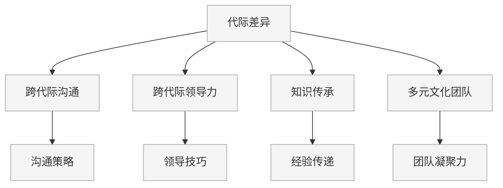

                 

### 引言：跨代际管理的重要性与挑战

在当今快速变化的社会环境中，跨代际管理显得尤为关键。首先，人口结构的变化使得不同年龄层的工作者在同一组织中共同工作成为常态。这种多样性的增加不仅丰富了组织的文化，也带来了新的挑战。每一代人都有其独特的价值观、行为模式和沟通风格，而这些差异如果不被有效管理和理解，可能会成为组织内部的沟通障碍，进而影响团队协作和整体绩效。

其次，工作场所的多元化要求管理者具备更高的沟通技巧和领导能力，以适应不同年龄层的员工需求。年轻一代的员工可能更倾向于开放的沟通环境和创新的工作方式，而年长一代则可能更重视稳定性和经验传承。这种差异如果不妥善处理，可能会导致误解和冲突，影响团队的凝聚力。

跨代际管理的必要性在于，它能够帮助组织更好地发挥多元化团队的优势，提升员工的满意度和生产力。有效的跨代际管理策略不仅能够促进不同代际之间的理解和合作，还能为组织带来创新和持续发展的动力。因此，深入探讨跨代际管理的核心概念、策略和实践，对提升组织的整体管理水平和竞争力具有重要意义。

## 1.1 问题的背景

随着全球人口的不断老化，不同年龄层在社会中的比例也发生了显著变化。在过去的几十年中，婴儿潮一代逐渐步入退休阶段，而千禧一代和Z一代则逐渐成为职场的主力军。这种人口结构的变化不仅影响了家庭和社区，也对工作场所产生了深远的影响。

首先，社会人口结构的变化直接导致了工作场所的年龄多样性。不同年龄段的员工在工作经验、技能水平、价值观和职业目标上存在明显差异。例如，年长员工可能更注重稳定性和工作经验的积累，而年轻员工则更倾向于灵活的工作安排和创新的机会。这种多样性为组织带来了丰富的资源和创新的潜力，但也带来了沟通和管理的挑战。

其次，年龄多样性在职场中的显现，使得跨代际沟通的重要性日益凸显。不同年龄层的员工往往拥有不同的沟通风格和期望。年长员工可能更倾向于传统的面对面沟通，而年轻员工则更喜欢即时通讯工具和数字化平台。这种沟通方式的差异可能导致误解和冲突，影响团队协作和整体绩效。因此，理解并有效应对这些沟通差异，是跨代际管理的关键之一。

此外，跨代际沟通的重要性不仅体现在工作效率和团队凝聚力上，还关系到员工的职业发展和满意度。有效的跨代际沟通能够促进不同年龄层员工之间的相互理解和信任，减少冲突，提升工作氛围。同时，它也有助于年轻员工从年长员工那里获取宝贵的经验和知识，实现知识的传承和能力的提升。

总之，随着社会人口结构的变化，工作场所的年龄多样性成为一个不可忽视的趋势。如何应对这一趋势，实现跨代际有效沟通和管理，是每个组织都需要面对的挑战。理解这一背景，有助于我们更好地探讨跨代际管理的核心概念和实践策略。

### 1.2 跨代际管理定义

跨代际管理，是指在一个组织中，管理者针对不同年龄段的员工进行有效沟通、协调和管理的实践。这种管理方式不仅关注不同年龄层的员工在职业发展、价值观、沟通风格等方面的差异，还致力于建立一种包容和多元的工作环境，以最大化团队效能和员工满意度。

跨代际管理的核心要素包括以下几个方面：

1. **理解代际差异**：管理者需要深入了解不同年龄层员工的价值观、行为模式和工作期望。例如，年长员工可能更注重工作稳定性和经验的积累，而年轻员工则更倾向于追求创新和个人成长。

2. **建立有效的沟通渠道**：为了克服代际差异带来的沟通障碍，管理者需要建立多种沟通渠道，确保信息的透明和及时传递。这包括传统的面对面沟通、电子邮件、即时通讯工具和数字化平台等。

3. **提升领导能力**：跨代际管理要求领导者具备更强的适应能力和沟通技巧。领导者需要能够根据不同代际员工的特性，采用灵活的领导风格和策略，以激发团队的潜力和提高整体绩效。

4. **促进知识传承**：年长员工通常拥有丰富的经验和专业知识，管理者应采取措施促进这些经验的传承，帮助年轻员工快速成长。这可以通过导师制度、知识分享会和跨部门项目等多种方式实现。

5. **培养多元文化团队**：建立多元文化团队，鼓励不同代际员工之间的交流和合作，是跨代际管理的目标之一。这有助于激发创新思维，提升团队的整体创造力。

通过以上核心要素的实施，跨代际管理能够帮助组织更好地应对年龄多样性带来的挑战，实现团队的高效协作和持续发展。

### 1.3 跨代际管理的边界与外延

跨代际管理不仅仅局限于特定的工作场所，其影响范围和适用场景非常广泛。首先，从影响范围来看，跨代际管理不仅适用于企业组织，也适用于非营利组织、教育机构以及政府部门。在任何需要多年龄段员工共同工作的环境中，跨代际管理的理念都是适用的。其核心在于如何在不同年龄段的员工之间建立有效的沟通和协作机制，从而提升整体组织的效能。

其次，在适用场景方面，跨代际管理可以应用于多个具体场景：

1. **人力资源管理**：在招聘、培训和员工发展过程中，跨代际管理可以帮助组织更好地理解和适应不同年龄层员工的需求和期望，从而提高员工满意度和留存率。

2. **团队协作**：在一个多元文化团队中，跨代际管理策略有助于促进团队成员之间的理解和合作，减少代际差异带来的冲突，提升团队绩效。

3. **领导力发展**：跨代际管理为领导者提供了一种新的视角和方法，帮助他们在管理不同年龄段的员工时，能够更加灵活和有效地运用领导技巧，提升领导能力。

4. **组织变革**：在组织变革过程中，不同年龄层的员工可能会有不同的反应和适应策略。有效的跨代际管理可以帮助组织在变革过程中减少抗拒，促进变革的顺利实施。

5. **员工关系管理**：通过跨代际管理，管理者可以更好地处理不同年龄层员工之间的关系，提高员工之间的相互理解和尊重，从而建立一个和谐的工作环境。

总之，跨代际管理的影响范围和适用场景非常广泛，其在不同组织和不同场景中的应用，能够帮助组织更好地应对多年龄段员工带来的挑战，实现持续的发展和进步。

### 2.1 代际特征分析

代际特征是指不同年龄层员工在行为模式、价值观和沟通风格等方面的独特表现。了解这些特征，对于有效实施跨代际管理至关重要。

首先，行为模式方面，不同年龄层的员工在职场中展现出显著差异。年长员工（如婴儿潮一代）通常更加重视工作稳定性和经验积累，倾向于遵循传统的职业发展路径。他们可能在工作中表现出更高的责任心和敬业精神，更注重工作成果的长期价值和稳定性。相比之下，年轻员工（如Z一代和千禧一代）则更加追求个人成长和职业多样性，他们更愿意尝试新事物，对新技术的接受度也较高，对灵活的工作时间和工作环境有较高的期望。

其次，价值观方面，不同年龄层的员工有不同的价值观取向。年长员工更倾向于传统的价值观，如忠诚、责任和稳定，他们通常认为工作是为了家庭和社会责任，重视工作的安全性和可靠性。而年轻员工则更注重个人自由、创新和自我实现，他们追求自我价值的实现和个人兴趣的发展，更看重工作带来的成就感和满足感。

最后，在沟通风格方面，不同年龄层的员工也有各自的特点。年长员工更倾向于传统的面对面沟通，偏好清晰、直接和正式的交流方式。他们通常注重逻辑性和条理性，倾向于通过书面报告和会议来传达信息。而年轻员工则更倾向于使用数字化工具，如电子邮件、即时通讯和社交媒体，偏好即时、直接和互动的沟通方式。他们喜欢快速响应和即时反馈，更愿意通过非正式的交流来建立关系和解决问题。

通过对比分析，我们可以看到，不同代际员工在行为模式、价值观和沟通风格上的差异，反映了他们在职场中的不同需求和期望。理解这些差异，是跨代际管理的关键之一。管理者需要根据这些特征，采取不同的管理策略，以适应不同代际员工的需求，提升团队的协作效能。

### 2.2 跨代际沟通原理

跨代际沟通的有效性是跨代际管理成功的关键。不同年龄层员工在沟通风格和期望上的差异，可能会导致误解和冲突。因此，理解并掌握跨代际沟通的原理，对管理者来说至关重要。

首先，跨代际沟通的核心在于克服代际差异。这需要管理者深入了解不同年龄层员工的沟通习惯和期望，并采取适当的策略来弥补差异。例如，年长员工可能更偏好面对面的沟通，管理者可以安排定期的面对面会议或团队建设活动，以增强沟通效果。而年轻员工则更喜欢数字化工具，管理者可以采用邮件、即时通讯等工具，确保信息的及时传达和反馈。

其次，建立有效的沟通渠道是跨代际沟通的关键。管理者需要为不同年龄层的员工提供多样化的沟通方式，以满足他们的不同需求。这包括传统的面对面沟通、电子邮件、电话、即时通讯工具和社交媒体等。通过多种渠道的结合，管理者可以确保信息的透明和及时传递，减少误解和冲突。

另外，沟通障碍的识别和解决策略也是跨代际沟通的重要部分。常见的沟通障碍包括语言障碍、文化差异、沟通风格不匹配等。管理者可以通过以下策略来克服这些障碍：一是加强跨部门沟通，促进不同团队之间的信息共享和协作；二是提供跨代际沟通培训，帮助员工了解和适应不同代际的沟通习惯；三是建立反馈机制，鼓励员工在沟通中提出问题和建议，及时解决沟通中的问题。

最后，跨代际沟通的效果评估也是不可忽视的一环。管理者需要定期评估跨代际沟通的效果，了解员工对沟通渠道和沟通方式的满意度，以及沟通对团队绩效的影响。通过效果评估，管理者可以不断优化沟通策略，提高跨代际沟通的效能。

总之，跨代际沟通的原理和方法涉及到对代际差异的深入理解、多样化的沟通渠道建设、有效的障碍解决策略和效果评估机制。通过这些措施，管理者可以构建一个开放、包容和高效的沟通环境，促进不同年龄层员工之间的理解与合作，提升整体组织的绩效。

### 2.3 跨代际管理中的关键概念联系

在跨代际管理中，理解不同概念之间的联系是至关重要的。为了清晰展示这些关键概念，我们可以通过对比表格和Mermaid流程图来进行详细分析。

#### 2.3.1 对比表格

以下是一个简化的对比表格，展示了跨代际管理中几个关键概念之间的关系：

| 关键概念       | 定义与特征                  | 联系与作用                                           |
|--------------|---------------------------|------------------------------------------------|
| 代际差异       | 不同年龄段员工的价值观和行为差异 | 基础，决定沟通和管理策略                               |
| 跨代际沟通     | 应对代际差异的沟通策略       | 应用，实现代际理解与合作                               |
| 跨代际领导力   | 针对不同代际的领导能力       | 核心，提升团队效能和员工满意度                         |
| 知识传承       | 经验和知识的跨代际传递       | 辅助，促进年轻员工的成长和能力的提升                     |
| 多元文化团队   | 包容不同代际文化的团队       | 环境，促进创新和团队凝聚力                             |

通过这个表格，我们可以看到各个概念在跨代际管理中的地位和作用。代际差异是基础，决定了其他概念的制定和应用。跨代际沟通是应用层面，通过有效的沟通策略来克服代际差异。跨代际领导力是核心，通过灵活的领导技巧来提升团队绩效。知识传承和多元文化团队则分别从知识和文化层面支持跨代际管理的实施。

#### 2.3.2 Mermaid流程图

为了更直观地展示这些关键概念之间的关系，我们可以使用Mermaid语言绘制一个流程图。以下是一个简化的Mermaid流程图示例：

在这个流程图中，每个关键概念都用一个节点表示，节点之间用箭头连接，表示它们之间的联系和作用。通过这个流程图，我们可以更清晰地看到各个概念在跨代际管理中的相互关系和作用。代际差异作为起点，通过跨代际沟通、跨代际领导力、知识传承和多元文化团队等概念，实现跨代际管理的整体目标。

### 3.1 识别与理解代际差异

在跨代际管理中，识别和理解代际差异是关键的第一步。管理者需要通过多种方式来深入了解不同年龄层员工的行为模式、价值观和职业目标，从而制定出符合实际情况的管理策略。

首先，管理者可以通过问卷调查、访谈和焦点小组讨论等方式，收集不同年龄段员工的意见和反馈。这种直接获取员工声音的方法，有助于管理者全面了解员工的实际需求和期望。例如，问卷调查可以设计成涵盖职业发展、工作环境、沟通方式等多个方面的内容，以便全面捕捉不同代际员工的特征。

其次，管理者还可以利用数据分析工具，对员工的行为和绩效进行定量分析。通过分析员工的绩效数据、参与度、离职率等指标，管理者可以识别出不同代际员工在工作表现上的差异。这种数据分析不仅有助于识别问题，还能为制定针对性的管理策略提供数据支持。

另外，组织也可以通过开展跨代际交流活动和培训，促进不同年龄层员工之间的互动和了解。例如，可以组织跨部门的团队建设活动，让不同代际的员工共同参与，增进彼此的了解和信任。同时，通过定期的内部培训，管理者可以分享不同代际员工的经验和观点，进一步提升跨代际沟通的效果。

最后，管理者还需要定期评估和调整管理策略，以适应不断变化的代际差异。通过定期收集员工反馈和绩效数据，管理者可以及时发现和解决新的问题，确保管理策略始终保持有效。

总之，通过以上多种方式，管理者可以全面识别和理解不同代际员工的差异，为制定有效的跨代际管理策略奠定基础。

### 3.2 建立多元文化团队

建立多元文化团队，是实现跨代际管理的重要手段之一。一个成功的多元文化团队能够通过融合不同代际员工的智慧和能力，创造出一个创新和协作的生态系统。以下是一些关键策略，帮助组织在建立多元文化团队方面取得成效。

首先，重视团队建设。团队建设活动不仅能够增强员工的归属感和凝聚力，还能促进不同代际之间的相互理解和尊重。例如，组织可以定期举办团队建设研讨会，邀请不同代际的员工分享他们的工作经验和观点。这些活动不仅有助于增进员工之间的了解，还能培养团队协作精神。

其次，设立多样化的沟通渠道。在一个多元文化团队中，沟通是关键。管理者需要确保所有员工都有机会表达自己的意见和想法。可以通过建立定期的跨部门会议、内部社交媒体平台和员工意见箱等多种方式，确保沟通渠道的畅通。同时，这些渠道应该鼓励开放和坦诚的对话，以减少误解和冲突。

第三，培养跨代际领导力。领导者在建立多元文化团队中扮演着重要角色。他们需要具备敏锐的观察力和灵活的管理策略，能够根据不同代际员工的特性，采用适当的领导风格。例如，对于年轻员工，可以采用更加创新和激励的领导方式，而对于年长员工，则可以注重稳定性和经验传承。

第四，制定包容性的工作政策。多元文化团队需要一种包容性的工作文化，尊重和认可不同代际员工的需求和贡献。组织可以通过制定灵活的工作安排、提供职业发展机会和建立员工关怀计划等多种方式，增强员工的满意度和忠诚度。

最后，鼓励员工参与决策过程。在一个多元文化团队中，员工的参与感对于团队的成功至关重要。管理者应该鼓励员工积极参与组织的决策过程，提出自己的建议和意见。这不仅能够增强员工的归属感，还能激发他们的创造力和创新精神。

通过以上策略，组织可以成功建立一个多元文化团队，促进不同代际员工之间的理解与合作，从而提升整体团队的效能和创新能力。

### 4.1 沟通策略与技巧

在跨代际管理中，提升沟通能力是确保团队高效协作的关键。不同的沟通策略和技巧可以帮助管理者克服代际差异，促进信息流畅和团队凝聚力。以下是一些具体的方法：

首先，调整沟通风格以适应不同代际的需求。年长员工可能更喜欢正式和直接的沟通方式，而年轻员工则更倾向于互动和即时的沟通。管理者可以在与年长员工沟通时，采用正式的书面报告和面对面的会议，确保信息的准确传达。对于年轻员工，可以通过电子邮件、即时通讯和社交媒体等数字化工具，确保沟通的及时性和互动性。

其次，使用多元化的沟通渠道。建立一个多元化的沟通渠道体系，可以满足不同代际员工的沟通偏好。除了传统的面对面会议和电子邮件外，还可以利用内部社交媒体平台、团队聊天工具和视频会议系统等，提供多样化的沟通选项。这样不仅可以提高沟通的效率，还能确保信息的透明和及时传递。

另外，建立明确的沟通标准和规则。为了确保跨代际沟通的有效性，管理者需要制定一套明确的沟通标准和规则。这包括沟通的时间、频率、方式和反馈机制等。通过明确的沟通标准，可以减少误解和冲突，提高沟通的质量和效果。

第四，增强跨代际培训。为管理者提供跨代际沟通的培训，帮助他们了解不同代际员工的特点和需求，掌握有效的沟通技巧。培训内容可以涵盖沟通风格的调整、跨代际沟通的策略、冲突解决技巧等，通过这些培训，管理者可以更加灵活和有效地应对跨代际沟通的挑战。

最后，建立反馈机制。鼓励员工在沟通中提出问题和建议，管理者需要及时收集和反馈员工的意见。通过定期的沟通反馈会议和问卷调查，管理者可以了解沟通中的问题和改进方向，不断优化沟通策略，提高跨代际沟通的效能。

总之，通过调整沟通风格、使用多元化沟通渠道、建立明确的沟通标准和规则、提供跨代际培训以及建立反馈机制，管理者可以显著提升跨代际沟通能力，促进团队的高效协作和整体绩效。

### 4.2 案例研究

在跨代际管理实践中，许多组织已经成功地应用了跨代际沟通策略，以下是一些成功案例和失败案例的分析。

#### 成功案例

1. **案例1：某科技公司**

某科技公司在跨代际管理中取得了显著成效。公司通过建立多元文化团队，组织了定期的跨部门交流活动，邀请不同年龄层的员工分享经验和观点。同时，公司还引入了内部社交媒体平台，方便员工即时交流和互动。通过这些措施，公司成功减少了代际差异带来的沟通障碍，提升了员工的协作效率。具体表现为：年长员工能够更好地传授经验，年轻员工则能迅速适应公司的文化和工作节奏。

2. **案例2：某金融机构**

某金融机构通过制定详细的跨代际沟通计划，成功提升了员工满意度。公司设立了专门的跨代际沟通委员会，定期举办沟通研讨会，收集和反馈员工意见。此外，公司还推出了针对不同年龄层员工的培训项目，帮助他们了解和适应不同代际的沟通风格。这些措施有效促进了公司内部的沟通和信息共享，减少了误解和冲突，提高了整体工作效率。

#### 失败案例

1. **案例1：某制造企业**

某制造企业在跨代际管理中遇到了失败。企业高层在推行新政策时，没有充分考虑不同代际员工的意见和需求，导致年轻员工对政策的理解和接受程度较低。同时，企业内部缺乏有效的沟通渠道，员工无法及时表达自己的意见和建议。这导致了一些政策在执行过程中出现了问题，甚至引发了员工的不满和抵触情绪。

2. **案例2：某咨询公司**

某咨询公司在跨代际管理中也遭遇了失败。公司管理层在推行变革时，未能有效沟通和引导不同代际员工。特别是对年长员工，公司在变革过程中未能充分考虑到他们的经验和贡献，导致年长员工对变革持消极态度。此外，公司内部缺乏有效的反馈机制，员工无法及时表达对变革的意见和建议。这导致变革在实施过程中遇到了较大阻力，影响了公司的整体运营效率。

通过对这些成功和失败案例的分析，我们可以看到，跨代际管理的关键在于：

1. 充分理解不同代际员工的需求和期望，制定合适的沟通策略。
2. 建立多元化的沟通渠道，确保信息的透明和及时传递。
3. 加强跨代际培训，提升员工的沟通技巧和适应性。
4. 建立有效的反馈机制，及时收集和解决员工在沟通中遇到的问题。

这些经验和教训对于其他组织在跨代际管理中的实践具有重要的参考价值。

### 5.1 跨代际领导力的核心要素

跨代际领导力是一种能够有效应对不同年龄段员工需求、促进团队协作和创新的新型领导能力。其核心要素包括以下几个方面：

首先，**理解代际差异**是跨代际领导力的基础。领导者需要深入了解不同代际员工的行为模式、价值观和职业期望，以便在管理过程中采取合适的方法。例如，年长员工可能更注重稳定性和经验的传承，而年轻员工则更追求创新和个人成长。通过理解这些差异，领导者可以制定更加灵活和适应性的管理策略。

其次，**沟通技巧**是跨代际领导力的关键。领导者需要具备良好的沟通技巧，能够根据不同代际员工的沟通偏好选择合适的沟通方式。例如，与年长员工沟通时，领导者可以采用正式的书面报告和面对面会议；而与年轻员工沟通时，则可以采用电子邮件、即时通讯工具和社交媒体等数字化平台，以确保信息的透明和及时传递。

第三，**灵活的领导风格**是跨代际领导力的重要组成部分。领导者需要根据不同代际员工的特性，采用不同的领导风格。对于年长员工，领导者可以采用更加传统和权威的领导方式，以树立稳定和可信赖的形象；而对于年轻员工，则可以采用更加开放和支持性的领导风格，鼓励他们尝试新事物和发挥创造力。

第四，**培养跨代际团队**是跨代际领导力的目标之一。领导者需要通过多种方式促进不同代际员工之间的交流和合作，建立一个多元化和包容性的团队。例如，可以组织跨部门团队项目、定期举办代际交流会议和培训，帮助员工相互了解和尊重，提升团队的整体绩效。

最后，**持续学习和自我提升**是跨代际领导力的保障。领导者需要不断学习新的管理理念和方法，了解最新的技术和趋势，以保持自己的竞争力和适应能力。同时，领导者也需要自我反思和提升，通过定期评估和反馈，不断改进自己的领导能力和管理效果。

总之，跨代际领导力的核心要素包括理解代际差异、沟通技巧、灵活的领导风格、培养跨代际团队以及持续学习和自我提升。通过这些要素的实施，领导者可以有效地管理不同年龄段的员工，提升团队的协作和创新能力，实现组织的持续发展。

### 5.2 跨代际领导力培养策略

要提升跨代际领导力，组织需要采取一系列系统性和针对性的培养策略。以下是一些关键步骤和方法：

首先，**组织内部培训**是提升跨代际领导力的基础。组织可以设计一系列专门的培训课程，涵盖跨代际沟通、领导风格适应和团队建设等多个方面。这些课程可以通过工作坊、讲座和模拟演练等多种形式进行，帮助领导者深入了解不同代际员工的特性和需求，掌握有效的沟通技巧和管理策略。例如，可以邀请跨代际管理专家进行讲座，或者组织领导者参与角色扮演和情景模拟，以提升他们的实际操作能力。

其次，**导师制度**是一种有效的跨代际领导力培养方式。通过建立导师制度，组织可以让经验丰富的年长员工成为年轻员工的导师，帮助他们快速适应工作环境和职业发展。导师可以提供宝贵的经验指导，分享自己的成功经验和失败教训，帮助年轻员工成长和提升。此外，导师还可以通过定期的一对一辅导和团队会议，与年轻员工保持密切的沟通，及时解答他们的问题和困惑。

第三，**跨部门项目**是一种促进不同代际员工交流和合作的有效方法。组织可以定期组织跨部门项目，让不同年龄层的员工共同参与，通过实际的工作合作，增进彼此的了解和信任。这些项目可以涉及新产品的开发、市场调研或客户服务等，不仅能够提高员工的技能和知识，还能培养他们的团队协作精神和领导能力。

第四，**领导力发展计划**是提升跨代际领导力的重要手段。组织可以为领导者制定一个全面的领导力发展计划，包括领导力评估、定制化培训和发展路径规划等。通过这些计划，领导者可以系统地学习领导力理论和实践，不断提升自己的领导能力和管理技巧。例如，组织可以邀请外部咨询机构进行领导力评估，根据评估结果为领导者提供个性化的培训和发展建议。

最后，**建立反馈机制**是确保跨代际领导力培养效果的关键。组织需要建立一个有效的反馈机制，让领导者和管理者能够及时了解员工的意见和建议，不断调整和改进领导力培养策略。例如，可以定期组织员工反馈会议，收集员工对领导风格、管理决策和团队氛围等方面的意见和建议，及时进行反馈和改进。

通过以上策略的实施，组织可以系统性地提升跨代际领导力，促进不同年龄层员工的成长和发展，实现组织的持续发展和创新。

### 6.1 员工关系管理挑战

在跨代际管理的背景下，员工关系管理面临一系列独特而复杂的挑战。首先，代际差异引发的冲突是一个主要问题。不同年龄层的员工在价值观、工作态度和行为模式上存在显著差异，这可能导致误解和摩擦。例如，年长员工可能对年轻员工追求自由和创新的工作方式感到不满，而年轻员工则可能对年长员工较为保守和传统的管理风格产生抵触情绪。

其次，跨代际员工满意度提升也是一个关键挑战。不同年龄层的员工对工作环境、职业发展和薪酬福利等方面的期望有所不同。年长员工可能更看重工作稳定性和福利待遇，而年轻员工则更追求个人成长和职业发展的机会。如果组织不能有效满足不同代际员工的需求，可能会导致员工满意度的下降，进而影响工作积极性和团队凝聚力。

此外，知识传承也是一个不可忽视的挑战。年长员工通常拥有丰富的经验和专业知识，而年轻员工则缺乏实际工作经验。如何有效地进行知识传承，让年轻员工能够快速成长和接班，是跨代际管理中的重要课题。如果知识传承不畅，可能会导致组织创新能力下降，影响长期发展。

总之，在跨代际管理的背景下，员工关系管理需要面对代际冲突、员工满意度提升和知识传承等多重挑战。管理者需要通过灵活的管理策略和有效的沟通机制，积极应对这些挑战，促进组织的和谐发展和持续进步。

### 6.2 员工关系管理策略

为了应对跨代际管理中员工关系管理的挑战，组织需要采取一系列具体的策略和措施。以下是一些关键策略：

首先，建立**开放沟通渠道**是提升员工关系的关键。组织应鼓励员工在不同代际之间进行开放和坦诚的沟通，确保每个员工都有表达意见和反馈的机会。这可以通过定期的员工座谈会、内部意见箱、匿名反馈机制等多种方式实现。例如，组织可以定期举办跨部门交流活动，让不同年龄层的员工共同参与，分享各自的观点和经验。

其次，推行**跨代际导师制度**，帮助年轻员工快速成长。通过导师制度，年长员工可以成为年轻员工的指导者，为他们提供职业发展建议和工作指导。导师可以帮助年轻员工了解组织的文化、价值观和工作流程，同时传授自己的经验和专业知识。这种导师制度不仅可以促进知识传承，还能增强员工之间的信任和合作。

第三，实施**灵活的工作安排**，满足不同代际员工的需求。组织应根据不同年龄层员工的特点和需求，提供多样化的工作安排。例如，对于年轻员工，可以提供更多的远程工作和灵活的工作时间，以适应他们的生活和工作习惯。对于年长员工，则可以提供更多的稳定性和保障，如固定的工时和额外的福利待遇。

第四，建立**员工关怀计划**，关注员工的心理健康和职业发展。组织可以通过提供心理健康咨询、职业培训和心理辅导等服务，帮助员工应对工作压力和职业发展的挑战。此外，组织还可以设立员工关爱基金，帮助员工解决生活中的困难，提升他们的工作满意度和忠诚度。

最后，**定期评估和反馈**是确保员工关系管理策略有效性的重要手段。组织应定期评估员工关系管理的成效，通过员工满意度调查、绩效评估和反馈会议等方式，了解员工的需求和意见，及时调整和优化管理策略。通过这种循环反馈机制，组织可以不断改进员工关系管理，提升整体工作氛围和绩效。

通过以上策略，组织可以有效地应对跨代际管理中的员工关系管理挑战，促进不同代际员工之间的理解和合作，实现组织的和谐发展和持续进步。

### 7.1 组织变革中的代际挑战

在组织变革过程中，不同代际的员工可能会表现出不同的态度和反应，这给变革管理带来了独特的挑战。首先，年长员工往往对变革持保守态度。他们可能担心变革会威胁到自己的职位稳定性和长期利益，因此对变革的接受度较低。他们更倾向于依赖现有的工作流程和经验，对新技术和新方法持怀疑态度。

相比之下，年轻员工可能对变革持更加开放和积极的态度。他们通常更愿意接受新的技术和方法，愿意尝试新的工作方式。然而，他们的这种开放性也可能导致他们对变革的期望过高，容易产生失望情绪，特别是在变革未能迅速带来预期的效果时。

此外，代际差异还体现在员工对变革过程中的沟通和参与需求上。年长员工可能更倾向于通过正式的渠道获取信息和参与决策，如面对面的会议和正式的书面报告。而年轻员工则更喜欢使用数字化工具，如电子邮件、即时通讯和社交媒体，以获取信息和交流意见。

为了应对这些代际挑战，组织需要采取有针对性的策略。首先，应重视年长员工的心理状态，通过提供定期的培训和沟通，帮助他们理解变革的必要性和好处，减少他们的抵触情绪。其次，对于年轻员工，应鼓励他们积极参与变革过程，提供更多的反馈渠道和参与机会，以增强他们的归属感和参与感。通过这些措施，组织可以更好地管理变革过程中的代际差异，确保变革的顺利实施。

### 7.2 跨代际管理在组织变革中的应用策略

在组织变革过程中，有效的跨代际管理策略对于确保变革的成功至关重要。以下是一些具体的应用策略：

首先，**制定详细的变革沟通计划**。变革沟通计划应包括不同代际员工的需求和偏好，确保信息的透明和及时传递。对于年长员工，可以通过面对面的会议和正式的书面报告，详细解释变革的原因、目标和预期效果。对于年轻员工，则可以通过电子邮件、即时通讯和社交媒体等数字化工具，确保信息的及时传达和互动。

其次，**建立多样化的参与机制**。为了激发不同代际员工对变革的参与度，组织可以采用多种参与方式，如跨部门工作小组、内部讨论会和在线论坛等。通过这些机制，不同代际员工可以共同讨论和分享变革的想法和意见，增强他们的参与感和责任感。

第三，**提供针对性的培训和支持**。针对不同代际员工在技术、管理和心理方面的需求，组织应提供有针对性的培训和支持。例如，为年长员工提供新技术和新方法的学习机会，帮助他们适应变革；为年轻员工提供领导力和管理技能的培训，提升他们的变革能力。

第四，**建立反馈和调整机制**。在变革过程中，组织应建立一个有效的反馈机制，定期收集和评估员工对变革的反馈，及时调整和优化变革策略。通过这种循环反馈机制，组织可以更好地应对变革过程中的挑战，确保变革的顺利实施。

最后，**强化跨代际领导力**。领导者应具备灵活的领导风格和跨代际沟通技巧，能够根据不同代际员工的特点，采取合适的领导策略。通过提升跨代际领导力，组织可以更好地管理变革过程中的复杂性和挑战，实现变革目标。

通过以上策略，组织可以有效地应用跨代际管理，促进组织变革的顺利实施，提升员工的满意度和变革成功率。

### 8.1 成功跨代际管理实践分享

跨代际管理的成功实践在许多组织中得到了验证，以下是一些典型的成功案例：

**案例1：某大型跨国企业**

某大型跨国企业通过实施跨代际管理策略，显著提升了员工满意度和工作效率。该企业首先进行了全面的代际差异分析，了解了不同年龄段员工的需求和期望。随后，企业推行了多元化团队建设，通过定期举办跨部门交流活动，促进不同代际员工之间的沟通和合作。此外，企业还设立了跨代际领导力培训项目，提升管理者的跨代际沟通和领导能力。这些措施有效减少了代际差异带来的冲突，提升了团队的整体效能。

**案例2：某科技初创公司**

某科技初创公司注重跨代际沟通，通过建立开放和包容的文化氛围，成功吸引了和保留了不同代际的优秀人才。公司采用了灵活的工作安排，如远程工作和弹性工作时间，满足不同代际员工的需求。此外，公司定期组织代际交流会议，鼓励员工分享经验和观点。通过这些措施，公司不仅提升了员工的满意度和忠诚度，还激发了团队的创新活力，推动了公司的快速发展。

**案例3：某金融机构**

某金融机构通过实施跨代际管理，成功地进行了组织结构的重大变革。该金融机构首先通过问卷调查和焦点小组讨论，了解了不同代际员工对变革的期望和顾虑。随后，金融机构制定了详细的变革沟通计划，确保信息的透明和及时传递。同时，金融机构还设立了变革支持团队，提供心理辅导和技术培训，帮助员工适应变革。这些措施确保了变革的顺利进行，提高了员工的工作效率和满意度。

通过这些成功案例，我们可以看到，有效的跨代际管理策略不仅能够减少代际差异带来的冲突，还能提升组织的整体绩效和员工的满意感。这些实践为其他组织提供了宝贵的经验和启示。

### 8.2 跨代际管理的小贴士

在跨代际管理的实践中，以下是一些常见的问题和解决方案，以及一些实用的管理建议，以帮助组织在实施跨代际管理时更加顺利和高效。

#### 常见问题与解决方案

1. **问题：员工之间的沟通不畅**

   **解决方案**：建立多种沟通渠道，如内部邮件、即时通讯、团队会议和社交媒体等，确保信息能够及时、有效地传达。同时，定期组织跨部门交流活动和团队建设活动，促进不同代际员工之间的了解和互动。

2. **问题：年长员工对变革的抵触情绪**

   **解决方案**：充分了解年长员工对变革的担忧，通过定期的沟通和培训，让他们了解变革的必要性和潜在好处。提供技术支持和心理辅导，帮助他们顺利过渡到新的工作方式。

3. **问题：年轻员工对职业发展的期望未满足**

   **解决方案**：为年轻员工提供明确的职业发展路径和晋升机会，通过导师制度和内部培训项目，帮助他们快速成长。同时，鼓励他们参与组织的决策过程，提升他们的参与感和归属感。

4. **问题：代际冲突和误解**

   **解决方案**：建立代际沟通和冲突解决机制，如设立专门的跨代际沟通委员会和定期召开代际交流会议，鼓励员工开放、坦诚地表达自己的观点和意见。

#### 实用的管理建议

1. **鼓励跨代际合作**：组织跨部门项目和团队任务，促进不同代际员工之间的合作，共同解决问题和实现目标。

2. **提供多样化培训**：根据不同代际员工的需求，提供针对性的培训，如领导力培训、技术培训和沟通技巧培训，帮助他们不断提升自己的能力和素质。

3. **建立反馈机制**：定期收集员工对跨代际管理策略的反馈，及时调整和优化管理措施，确保跨代际管理的持续有效性。

4. **重视文化多样性**：建立一个包容和尊重不同代际文化的组织文化，鼓励员工在不同代际之间相互学习和借鉴，共同创造一个和谐、高效的工作环境。

通过解决常见问题并提供实用的管理建议，组织可以更有效地实施跨代际管理，提升整体绩效和员工的满意度。

### 9.1 跨代际管理的发展趋势

随着社会的不断进步和科技的快速发展，跨代际管理正面临着一系列新的发展趋势。首先，全球化使得不同国家和地区的代际差异变得更加复杂，跨文化背景下跨代际管理的重要性日益凸显。全球化不仅带来了人口流动和文化的交融，也要求组织具备更强的跨文化沟通和管理能力，以应对多元化的员工群体。

其次，数字化技术的广泛应用正在改变传统的沟通方式和组织结构。随着互联网、人工智能和大数据等技术的快速发展，年轻一代员工更加依赖数字化工具进行沟通和工作。这要求管理者在跨代际管理中，不仅要理解不同代际员工的技术偏好，还要善于利用数字化工具提升沟通效率和团队协作。

另外，随着人口老龄化的加剧，年长员工在组织中扮演的角色也越来越重要。年长员工不仅拥有丰富的经验和专业知识，还是知识和经验的传承者。如何在跨代际管理中充分发挥年长员工的作用，成为组织需要关注的重要问题。

最后，未来的跨代际管理将更加注重个性化和定制化。随着员工个性化和多样化需求的增长，组织需要采用更加灵活和个性化的管理策略，以满足不同代际员工的独特需求。这包括定制化的职业发展路径、多样化的工作安排和个性化的培训计划等。

总之，全球化、数字化、老龄化和个性化是跨代际管理未来发展的主要趋势。这些趋势不仅带来了新的挑战，也为组织提供了创新和发展的机遇。管理者需要不断学习和适应，才能在跨代际管理中取得成功。

### 9.2 跨代际管理的未来挑战与机遇

在展望跨代际管理的未来时，我们需要关注几个关键的挑战与机遇。首先，**文化多样性的加深**是一个显著的挑战。全球化使得不同文化和价值观的交融更加频繁，组织需要具备更高的文化敏感度和适应性，以有效管理多元化团队。同时，这种多样性也带来了丰富的资源和创新潜力，如何平衡文化差异并发挥各自优势，是未来的关键议题。

其次，**技术变革**正在深刻影响跨代际管理的实践。随着人工智能、大数据和区块链等新兴技术的广泛应用，年轻一代员工对这些技术的接受度和熟练度较高，而年长员工则需要更多的培训和适应时间。如何在技术应用的普及过程中，确保不同代际员工的技术水平和信息素养均衡，是跨代际管理需要面对的挑战之一。

此外，**人口老龄化**的趋势也对跨代际管理提出了新的要求。年长员工在组织中扮演越来越重要的角色，他们的经验和专业知识是组织的宝贵财富。如何通过有效的跨代际管理策略，实现年长员工的继续发展和知识传承，是一个重要课题。

最后，**个性化和定制化**的需求日益增长。不同代际员工在职业目标、工作方式和生活需求上呈现出个性化趋势，组织需要采用更加灵活和个性化的管理策略，以满足员工的独特需求。这不仅包括职业发展的个性化路径，还包括工作安排和福利待遇的定制化。

面对这些挑战，跨代际管理也带来了丰富的机遇。有效的跨代际管理能够促进组织内部的创新和协作，提高员工满意度和生产力。同时，通过充分利用不同代际员工的优势，组织可以更好地应对市场变化和竞争压力，实现持续发展。总之，跨代际管理的未来充满了机遇和挑战，管理者需要不断学习和适应，以实现组织的长期成功。

