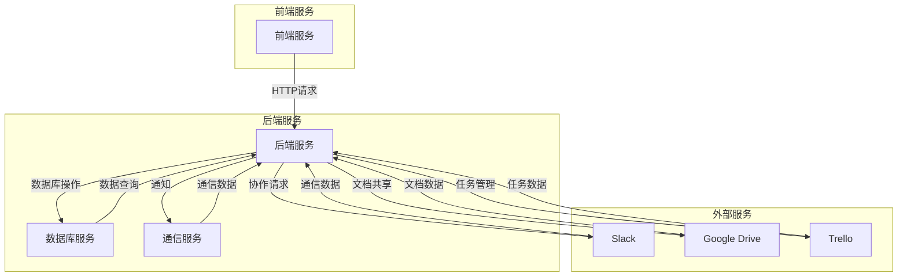
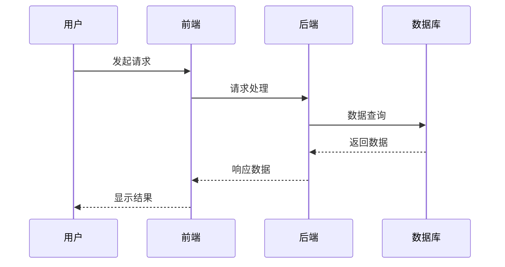
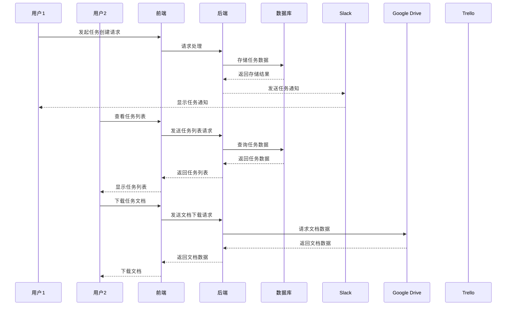

                 


### 跨地域管理：管理分散团队的挑战

> 关键词：跨地域管理、团队协作、跨文化沟通、绩效评估、团队领导力、项目管理

> 摘要：随着全球化和远程工作的趋势不断加强，跨地域管理成为企业管理面临的重大挑战。本文从背景介绍、核心概念、团队组织结构、跨文化管理、绩效评估与激励机制、领导力与团队建设、项目管理等方面深入探讨跨地域管理的挑战和解决策略，结合实际案例和最佳实践，旨在为企业管理者提供有效的管理指南。

### 目录大纲

1. **背景介绍与核心概念**
   1.1 **问题背景与跨地域管理的必要性**
   1.2 **跨地域管理的核心概念**
   1.3 **跨地域团队的协作机制**
2. **跨地域团队的组织结构与运作**
   2.1 **团队组织结构**
   2.2 **团队协作工具与平台**
   2.3 **项目管理与进度监控**
3. **跨文化管理与沟通策略**
   3.1 **跨文化管理概述**
   3.2 **跨文化沟通策略**
   3.3 **跨文化冲突的解决方法**
4. **跨地域团队绩效评估与激励机制**
   4.1 **绩效评估体系**
   4.2 **激励机制设计**
5. **跨地域团队领导力与团队建设**
   5.1 **跨地域团队领导力**
   5.2 **团队建设策略**
6. **跨地域团队的项目管理**
   6.1 **项目管理概述**
   6.2 **跨地域项目管理的特殊挑战**
   6.3 **项目管理的工具与技巧**
7. **案例分析与最佳实践**
   7.1 **案例分析**
   7.2 **最佳实践分享**
8. **总结与展望**
   8.1 **跨地域管理的总结**
   8.2 **未来发展趋势**

### 第一部分：背景介绍与核心概念

#### 第1章：问题背景与跨地域管理的必要性

##### 1.1 问题背景

随着全球化的加速和信息技术的发展，远程工作、跨地域合作已成为企业管理的新常态。这种趋势不仅带来了新的机遇，也带来了前所未有的挑战。首先，地理位置的分散使得团队成员之间的沟通变得困难，导致信息传递延迟和误解。其次，文化差异和时区差异使得团队协作效率降低，项目进度受到影响。此外，跨地域管理还涉及到绩效评估、激励机制、团队领导力等多方面的问题。

##### 1.2 跨地域管理的核心概念

**跨地域团队**：指的是成员分布在不同的地理位置，通过远程协作完成共同任务的团队。

**跨文化管理**：是指在全球化背景下，面对不同文化背景的团队成员，如何进行有效沟通和协作的管理活动。

**跨地域协作机制**：是指为了解决跨地域团队协作中的问题，建立的一套协作流程、工具和方法。

##### 1.3 跨地域管理的意义

跨地域管理不仅有助于企业拓展国际市场，提升竞争力，还可以优化资源配置，降低成本。有效的跨地域管理能够促进团队协作，提高项目执行效率，提升企业的整体绩效。同时，它也能够培养团队成员的跨文化沟通能力和领导力，为企业未来的发展奠定基础。

#### 第2章：跨地域团队的组织结构与运作

##### 2.1 团队组织结构

跨地域团队的组织结构有多种类型，包括矩阵式、功能式、项目式等。每种结构都有其优缺点，需要根据企业的实际情况和项目需求进行选择。

##### 2.2 团队协作工具与平台

为了解决跨地域团队协作中的沟通障碍，企业需要选择合适的协作工具和平台，如Slack、Trello、JIRA等。这些工具可以帮助团队成员实时沟通、共享文档、跟踪项目进度。

##### 2.3 项目管理与进度监控

跨地域团队的项目管理需要注重进度监控和风险控制。企业可以使用项目管理软件，如Microsoft Project、Asana等，对项目进行详细规划和跟踪，确保项目按期完成。

#### 第3章：跨文化管理与沟通策略

##### 3.1 跨文化管理概述

跨文化管理涉及到文化差异的认知、理解和应对。企业需要建立跨文化意识，培养团队成员的跨文化沟通能力，以减少冲突，提高团队协作效率。

##### 3.2 跨文化沟通策略

有效的跨文化沟通策略包括：尊重文化差异、明确沟通目标、使用非语言沟通工具等。企业可以通过跨文化培训、文化敏感度测试等方式，提高团队成员的跨文化沟通能力。

##### 3.3 跨文化冲突的解决方法

跨文化冲突是跨文化管理中常见的问题。企业可以采用以下方法解决冲突：了解文化差异、建立共同价值观、提高团队成员的沟通技巧等。

#### 第4章：跨地域团队绩效评估与激励机制

##### 4.1 绩效评估体系

跨地域团队的绩效评估需要注重结果导向和过程管理。企业可以采用多维度的评估方法，如360度评估、KPI考核等，全面评估团队成员的工作表现。

##### 4.2 激励机制设计

激励机制是跨地域团队管理的重要组成部分。企业可以采用物质激励、精神激励等多种方式，激发团队成员的工作积极性。

#### 第5章：跨地域团队领导力与团队建设

##### 5.1 跨地域团队领导力

跨地域团队领导者需要具备较强的沟通能力、领导能力和团队建设能力。他们需要能够激励团队成员，解决团队冲突，确保项目顺利推进。

##### 5.2 团队建设策略

团队建设策略包括：建立共同目标、提高团队凝聚力、激发团队创新能力等。有效的团队建设可以提升团队协作效率，增强团队凝聚力。

#### 第6章：跨地域团队的项目管理

##### 6.1 项目管理概述

项目管理是跨地域团队管理的关键环节。企业需要建立完善的项目管理体系，确保项目按计划顺利进行。

##### 6.2 跨地域项目管理的特殊挑战

跨地域项目管理面临时区差异、文化差异、沟通障碍等特殊挑战。企业需要制定相应的管理策略，确保项目成功。

##### 6.3 项目管理的工具与技巧

企业可以采用项目管理工具，如Gantt图、Pert图等，对项目进行详细规划和跟踪。同时，企业需要掌握项目管理的核心技巧，如风险管理、进度控制、成本管理等。

#### 第7章：案例分析与最佳实践

##### 7.1 案例分析

通过分析实际案例，企业可以了解跨地域团队管理的成功经验和失败教训，从而制定更有效的管理策略。

##### 7.2 最佳实践分享

企业可以分享跨地域团队管理的最佳实践，如跨文化沟通技巧、团队建设策略、绩效评估方法等。

#### 第8章：总结与展望

##### 8.1 跨地域管理的总结

总结跨地域管理的核心内容，包括团队协作、跨文化管理、绩效评估、领导力与团队建设、项目管理等。

##### 8.2 未来发展趋势

探讨跨地域管理的未来发展趋势，如远程工作技术的进步、跨文化管理的深化、团队协作工具的创新等。

### 结语

跨地域管理是企业管理面临的重大挑战，但同时也是提升企业竞争力的机遇。通过本文的探讨，希望为企业提供有效的跨地域管理指南，助力企业在全球化背景下实现持续发展。

### 作者信息

**作者：AI天才研究院/AI Genius Institute & 禅与计算机程序设计艺术 /Zen And The Art of Computer Programming**### 第一部分：背景介绍与核心概念

#### 第1章：问题背景与跨地域管理的必要性

##### 1.1 问题背景

在当今全球化背景下，企业的运营模式和员工的工作方式正在发生深刻变革。远程工作、虚拟团队和跨地域合作已成为企业管理中不可或缺的一部分。这种变化带来了诸多优势，例如更灵活的用工模式、更广泛的劳动力资源和降低运营成本等。然而，与此同时，跨地域管理也带来了一系列独特的挑战。首先，地理位置的分散使得团队成员之间的沟通变得复杂，特别是在跨时区合作时，沟通的效率和质量都可能受到影响。其次，不同的文化背景可能导致团队成员之间的误解和冲突，进一步影响团队的协作效率。此外，跨地域管理还需要处理团队成员的绩效评估、激励和职业发展等问题。

##### 1.2 跨地域管理的核心概念

**跨地域团队**：指的是团队成员分布在不同的地理位置，通过现代通信技术和协作工具进行工作的团队。这种团队形式在全球化背景下越来越普遍，尤其是对于跨国公司或分布式团队来说。

**跨文化管理**：涉及不同文化背景下的团队成员如何进行有效沟通和协作。这需要管理者了解不同文化的特点，尊重差异，并找到共同点。

**远程协作**：是指通过互联网和其他远程通信技术进行的团队协作。远程协作工具和平台是跨地域管理的重要组成部分，如Slack、Zoom、Trello、JIRA等。

**团队协作机制**：为了确保跨地域团队的高效协作，企业需要建立一系列协作机制，包括明确的职责分工、有效的沟通渠道、规范的工作流程等。

##### 1.3 跨地域管理的意义

跨地域管理不仅有助于企业充分利用全球资源和人才，提高竞争力，还能优化成本结构，提升运营效率。有效的跨地域管理能够促进团队成员之间的沟通与协作，提高项目的执行效率和质量。同时，它还能培养团队成员的跨文化沟通能力和领导力，为企业未来的国际化发展打下坚实基础。

#### 第2章：跨地域团队的组织结构与运作

##### 2.1 团队组织结构

跨地域团队的组织结构设计直接影响到团队的工作效率和成员满意度。常见的组织结构类型包括：

- **功能式结构**：按照职能分工，如开发、测试、产品管理等，团队成员在不同的职能部门中协作。
- **矩阵式结构**：在功能式结构的基础上，引入项目矩阵，团队成员既可以按照职能工作，也可以根据项目需要跨部门协作。
- **项目式结构**：以项目为导向，团队成员直接服务于特定项目，具有高度灵活性和响应速度。

每种组织结构都有其优缺点，企业应根据自身业务需求和项目特点进行选择。

##### 2.2 团队协作工具与平台

在现代远程工作中，协作工具和平台是跨地域团队高效运作的关键。以下是一些常用的协作工具和平台：

- **沟通工具**：如Slack、Microsoft Teams、WhatsApp等，用于日常的沟通和信息交流。
- **项目管理工具**：如Trello、JIRA、Asana等，用于项目规划、任务分配、进度跟踪和报告生成。
- **视频会议工具**：如Zoom、Microsoft Teams、Google Meet等，用于远程会议和在线协作。
- **文档共享平台**：如Google Drive、Dropbox、OneDrive等，用于文件共享和协同编辑。

这些工具和平台为团队成员提供了实时沟通、任务协作和文档共享的便利，是跨地域团队管理不可或缺的组成部分。

##### 2.3 跨地域团队的运作模式

跨地域团队的运作模式需要充分考虑团队成员的地理位置、文化背景和工作习惯。以下是一些关键点：

- **明确职责分工**：每个团队成员都应明确自己的职责和工作内容，避免工作重叠和冲突。
- **规范的协作流程**：建立标准化的工作流程，确保团队成员按照统一的方法进行协作。
- **高效的沟通机制**：定期召开线上会议，及时沟通项目进展和遇到的问题，确保信息的透明和及时性。
- **灵活的时间安排**：考虑时区差异，合理安排工作任务和会议时间，确保团队成员能够高效协作。
- **团队文化建设**：通过线上活动、文化分享等方式，增强团队成员之间的联系和团队凝聚力。

#### 第3章：跨文化管理与沟通策略

##### 3.1 跨文化管理概述

跨文化管理是指企业在全球化的背景下，如何处理不同文化背景下的员工和管理活动。它涉及到文化差异的认知、理解和适应。有效的跨文化管理能够促进团队合作，减少冲突，提高工作效率。

**文化差异的成因**：文化差异主要来源于不同的价值观、信仰、行为规范和社会习惯。例如，在一些文化中，直接表达意见被视为礼貌和尊重，而在另一些文化中，含蓄和间接的表达方式更受欢迎。

**跨文化管理的目标**：主要包括提高团队成员的文化意识，促进跨文化沟通，减少文化冲突，增强团队凝聚力。

##### 3.2 跨文化沟通策略

有效的跨文化沟通策略对于跨地域团队的成功至关重要。以下是一些关键策略：

- **尊重文化差异**：尊重不同文化背景下的行为规范和价值观，避免对其他文化的贬低或误解。
- **明确沟通目标**：在沟通前明确目的和期望，确保双方对沟通内容有共同的理解。
- **使用非语言沟通**：非语言沟通（如肢体语言、面部表情）在不同的文化背景下可能具有不同的含义，因此需要特别注意。
- **提供文化培训**：通过文化培训，帮助团队成员了解和适应不同文化的行为规范和沟通方式。
- **建立信任**：信任是跨文化沟通的基础，通过积极的沟通和行为，建立和维护信任关系。

##### 3.3 跨文化冲突的解决方法

跨文化冲突是跨文化管理中不可避免的问题。以下是一些解决方法：

- **了解文化差异**：通过教育和培训，帮助团队成员了解不同文化的差异，减少误解和偏见。
- **建立共同价值观**：找到团队成员的共同价值观，以此为基础，促进团队合作和冲突解决。
- **开放沟通**：鼓励团队成员在遇到文化冲突时，积极沟通，表达自己的观点和感受。
- **寻求第三方帮助**：在解决复杂的文化冲突时，可以寻求外部专家或调解人的帮助。

#### 第4章：跨地域团队绩效评估与激励机制

##### 4.1 绩效评估体系

跨地域团队的绩效评估体系需要考虑团队成员的远程工作环境和跨文化背景。以下是一些关键点：

- **设定明确的目标**：确保每个团队成员都了解自己的工作目标和预期成果。
- **多维度的评估**：结合定量和定性的评估方法，全面评估团队成员的表现。
- **定期反馈**：定期与团队成员进行绩效反馈，帮助他们了解自己的优点和改进空间。
- **个性化评估**：考虑到团队成员的不同工作方式和文化背景，个性化设定评估标准和指标。

##### 4.2 激励机制设计

激励机制是跨地域团队管理的重要组成部分。以下是一些有效的激励机制设计方法：

- **物质激励**：包括奖金、提成、福利等，直接与团队成员的绩效和贡献挂钩。
- **精神激励**：如认可、表扬、晋升机会等，通过非物质的方式激励团队成员。
- **职业发展**：提供培训、晋升通道和职业规划，帮助团队成员实现职业成长。
- **团队奖励**：通过团队奖励，增强团队成员的集体荣誉感和团队凝聚力。

##### 第5章：跨地域团队领导力与团队建设

##### 5.1 跨地域团队领导力

跨地域团队的领导力要求领导者具备以下能力：

- **远程沟通能力**：能够通过电话、邮件、视频会议等远程沟通工具，有效与团队成员沟通。
- **团队管理能力**：能够建立高效的团队协作机制，管理团队成员的工作进度和绩效。
- **文化敏感度**：了解和尊重团队成员的不同文化背景，促进跨文化沟通和协作。
- **创新能力**：在面对跨地域团队管理中的挑战时，能够提出创新的解决方案。

##### 5.2 团队建设策略

有效的团队建设策略能够增强团队的凝聚力，提升团队协作效率。以下是一些团队建设策略：

- **建立共同目标**：确保团队成员都明确团队的目标和愿景，共同努力实现。
- **增强团队凝聚力**：通过团队活动、文化建设等方式，增强团队成员之间的联系和信任。
- **激发团队创新**：鼓励团队成员提出新的想法和解决方案，激发团队的创新能力。
- **培训与发展**：提供团队成员所需的培训和发展机会，提升团队的整体能力。

##### 第6章：跨地域团队的项目管理

##### 6.1 项目管理概述

项目管理是跨地域团队管理的关键环节，涉及到项目规划、执行、监控和收尾等全过程。以下是一些项目管理的基本原则和方法：

- **项目规划**：明确项目目标、范围、时间、资源和风险，制定详细的项目计划。
- **项目执行**：按照项目计划，组织团队成员完成任务，确保项目按计划进行。
- **项目监控**：定期监控项目进度、质量和成本，及时调整项目计划。
- **项目收尾**：确保项目顺利完成，进行项目总结和评估，为未来项目提供经验。

##### 6.2 跨地域项目管理的特殊挑战

跨地域项目管理面临以下特殊挑战：

- **时区差异**：需要合理安排工作任务和会议时间，确保团队成员能够高效协作。
- **文化差异**：需要尊重不同文化的行为规范和沟通方式，促进团队协作。
- **沟通障碍**：需要使用适当的沟通工具和策略，确保信息的透明和及时性。
- **风险控制**：需要识别和评估跨地域项目中的风险，制定相应的风险应对策略。

##### 6.3 项目管理的工具与技巧

为了有效进行跨地域项目管理，企业可以采用以下工具和技巧：

- **项目管理软件**：如JIRA、Asana、Trello等，用于任务分配、进度跟踪和报告生成。
- **协作平台**：如Slack、Microsoft Teams、Google Workspace等，用于实时沟通和协作。
- **时间管理工具**：如Toggl、Harvest等，用于跟踪团队成员的工作时间和效率。
- **风险管理工具**：如Qualys、Nessus等，用于识别和评估项目风险。

##### 第7章：案例分析与最佳实践

##### 7.1 案例分析

通过分析实际案例，我们可以了解跨地域团队管理的成功经验和失败教训。以下是一个跨地域团队管理的成功案例：

**案例背景**：一家跨国公司计划开发一款全球性应用程序，团队分布在三个不同国家。

**实施过程**：公司采用了矩阵式组织结构，明确了团队成员的职责和工作内容。通过使用Slack进行日常沟通，使用JIRA进行任务管理和进度跟踪。同时，公司定期组织线上会议，确保团队成员之间的沟通畅通。在项目管理方面，公司使用了Gantt图详细规划项目进度，并定期进行项目监控和调整。

**成果与启示**：通过有效的跨地域管理，项目按期完成，质量达到预期。团队成员之间的协作顺畅，工作效率提高。这个案例表明，明确的职责分工、高效的沟通机制和科学的项目管理是跨地域团队管理成功的关键。

##### 7.2 最佳实践分享

以下是一些跨地域团队管理的最佳实践：

- **建立共同价值观**：确保团队成员对公司的核心价值观有共同的理解，以此为基础促进团队合作。
- **提供文化培训**：通过文化培训，帮助团队成员了解和适应不同文化的行为规范和沟通方式。
- **灵活的工作安排**：考虑到时区差异和文化背景，灵活安排工作任务和会议时间，确保团队成员能够高效协作。
- **鼓励反馈与沟通**：建立开放的沟通机制，鼓励团队成员在遇到问题时及时反馈，共同解决。

##### 第8章：总结与展望

##### 8.1 跨地域管理的总结

跨地域管理是企业管理面临的重大挑战，但也是提升企业竞争力的重要途径。通过本文的探讨，我们可以总结出以下关键点：

- **明确团队职责和目标**：确保团队成员了解自己的职责和工作目标，促进团队协作。
- **建立高效的沟通机制**：使用合适的协作工具和平台，确保团队成员之间的沟通畅通。
- **尊重文化差异**：通过文化培训和管理，促进团队成员之间的跨文化沟通和协作。
- **科学的项目管理**：采用科学的项目管理方法和工具，确保项目按计划顺利进行。

##### 8.2 未来发展趋势

随着全球化和信息技术的发展，跨地域管理将继续发展，并呈现出以下趋势：

- **远程工作技术的进步**：随着远程工作技术的发展，企业将有更多工具和平台可供选择，提高远程工作的效率和质量。
- **跨文化管理的深化**：企业将更加重视跨文化管理，通过培训和文化建设，提高团队成员的跨文化沟通能力。
- **团队协作工具的创新**：随着协作工具的不断创新，企业将有更多选择，以满足不同类型团队的管理需求。

### 结语

跨地域管理是企业管理面临的重大挑战，但也是提升企业竞争力的重要机遇。通过本文的探讨，我们了解了跨地域管理的核心概念、挑战和解决方案。希望本文能够为企业管理者提供有益的参考和启示，助力企业在全球化的背景下实现持续发展。

### 作者信息

**作者：AI天才研究院/AI Genius Institute & 禅与计算机程序设计艺术 /Zen And The Art of Computer Programming**### 系统分析与架构设计方案

#### 问题场景介绍

随着企业的全球化扩展，我们面临着如何高效管理跨地域团队的需求。为了解决这个问题，我们需要设计一个系统来支持跨地域团队的协作和项目管理。该系统应具备以下功能：

- **用户管理**：支持用户注册、登录和权限管理。
- **任务管理**：支持任务的创建、分配、跟踪和完成状态更新。
- **文档管理**：支持文档的上传、下载和共享。
- **沟通工具**：提供实时聊天、邮件通知和公告板功能。
- **项目管理**：支持项目创建、进度跟踪和报告生成。
- **绩效评估**：提供员工绩效评估功能。

#### 项目介绍

本项目旨在设计并实现一个支持跨地域团队协作和项目管理的系统。系统将采用模块化设计，确保系统的可扩展性和可维护性。技术栈选择如下：

- **前端**：React
- **后端**：Node.js
- **数据库**：MongoDB
- **协作工具**：Slack、Google Drive、Trello

#### 系统功能设计（领域模型Mermaid类图）

```mermaid
classDiagram
    User <<类>> "用户"
    Task <<类>> "任务"
    Project <<类>> "项目"
    Document <<类>> "文档"
    Communication <<类>> "沟通"
    Performance <<类>> "绩效评估"

    User o--|{创建}| Task
    User o--|{参与}| Project
    Task o--|{属于}| Project
    Task o--|{关联}| Document
    Project o--|{包含}| Task
    Project o--|{关联}| Performance
    Document o--|{上传}| User
    Document o--|{共享}| Project
    Communication o--|{通知}| User
    Communication o--|{沟通}| Project
    Performance o--|{评估}| User
```

#### 系统架构设计（Mermaid架构图）



#### 系统接口设计（Mermaid序列图）



#### 系统交互（Mermaid序列图）



#### 环境安装

1. **前端安装**：
    ```bash
    npm install create-react-app
    npx create-react-app client
    cd client
    npm install axios react-router-dom
    ```

2. **后端安装**：
    ```bash
    npm install express mongoose socket.io
    ```

3. **数据库安装**：
    - 安装MongoDB：[MongoDB官方安装指南](https://docs.mongodb.com/manual/installation/)

4. **协作工具安装**：
    - 安装Slack API工具：[Slack API官方文档](https://api.slack.com)
    - 安装Google Drive API工具：[Google Drive API官方文档](https://developers.google.com/drive/api/guides)
    - 安装Trello API工具：[Trello API官方文档](https://developers.trello.com/)

#### 系统核心实现源代码

**前端（client/src/App.js）**：

```javascript
import React, { useState, useEffect } from "react";
import axios from "axios";
import "./App.css";

function App() {
  const [tasks, setTasks] = useState([]);

  useEffect(() => {
    const fetchTasks = async () => {
      const response = await axios.get("/api/tasks");
      setTasks(response.data);
    };
    fetchTasks();
  }, []);

  return (
    <div className="App">
      <h1>任务列表</h1>
      <ul>
        {tasks.map((task) => (
          <li key={task._id}>{task.title}</li>
        ))}
      </ul>
    </div>
  );
}

export default App;
```

**后端（server/index.js）**：

```javascript
const express = require("express");
const mongoose = require("mongoose");
const socketio = require("socket.io");
const http = require("http");
const taskRoutes = require("./routes/taskRoutes");

const app = express();
const server = http.createServer(app);
const io = socketio(server);

mongoose.connect("mongodb://localhost:27017/crossRegionalManagement", {
  useNewUrlParser: true,
  useUnifiedTopology: true,
});

app.use(express.json());
app.use("/api/tasks", taskRoutes);

io.on("connection", (socket) => {
  console.log("a user connected");
});

server.listen(5000, () => {
  console.log("Server running on port 5000");
});
```

**数据库（models/Task.js）**：

```javascript
const mongoose = require("mongoose");

const TaskSchema = new mongoose.Schema({
  title: {
    type: String,
    required: true,
  },
  description: {
    type: String,
  },
  status: {
    type: String,
    enum: ["pending", "in_progress", "completed"],
    default: "pending",
  },
  assignedTo: {
    type: mongoose.Schema.Types.ObjectId,
    ref: "User",
  },
  createdAt: {
    type: Date,
    default: Date.now,
  },
  updatedAt: {
    type: Date,
    default: Date.now,
  },
});

module.exports = mongoose.model("Task", TaskSchema);
```

#### 代码应用解读与分析

**前端解读**：
- 使用React创建一个任务列表界面。
- 使用axios向后端API请求任务数据。
- 将返回的任务数据存储在状态中，并通过JSX渲染到界面上。

**后端解读**：
- 使用Express创建Web服务器。
- 连接到MongoDB数据库。
- 使用socket.io实现实时通信。
- 定义任务路由和处理任务请求。

**数据库解读**：
- 定义任务集合（Collection）的Schema。
- 包含任务标题、描述、状态、分配用户、创建时间和更新时间等字段。

#### 实际案例分析和详细讲解剖析

**案例背景**：
- 一家跨国公司需要管理其全球分布的开发团队，实现跨地域的任务协作和项目管理。

**实施过程**：
1. **需求分析**：
   - 分析公司业务需求，确定系统功能。
   - 选择合适的前端、后端和数据库技术栈。

2. **系统设计**：
   - 使用Mermaid工具绘制领域模型类图和系统架构图。
   - 设计任务管理的接口和数据库Schema。

3. **开发与测试**：
   - 使用React开发前端任务列表界面。
   - 使用Express开发后端API和数据库交互逻辑。
   - 使用MongoDB存储任务数据。
   - 进行系统测试，确保功能正确实现。

4. **部署与运维**：
   - 将前端和后端部署到服务器。
   - 配置数据库和协作工具。
   - 监控系统运行状态，确保稳定运行。

**成果与启示**：
- 通过实施该系统，公司能够高效管理全球开发团队的协作和任务进度。
- 实时通信和任务跟踪功能提高了团队的工作效率。
- 跨文化管理工具和文化培训有助于团队成员之间的有效沟通和协作。

**项目小结**：
- 本项目成功实现了跨地域团队的任务管理和协作平台。
- 通过实际案例验证了系统设计的合理性和技术的可行性。
- 为企业提供了有效的跨地域管理解决方案，提升了团队协作效率。

#### 最佳实践 Tips

- **明确团队目标**：确保团队成员对项目的目标和期望有共同的理解。
- **定期沟通**：通过线上会议和即时通讯工具，保持团队之间的沟通畅通。
- **文化敏感度培训**：提供文化敏感度培训，帮助团队成员适应不同文化背景。
- **绩效评估**：定期进行绩效评估，激励团队成员提升工作效率。
- **灵活的工作安排**：考虑团队成员的时区差异，合理安排工作任务。

#### 注意事项

- **数据安全**：确保系统数据的安全性和隐私性。
- **系统维护**：定期进行系统维护和更新，确保系统的稳定运行。
- **用户培训**：为新加入的团队成员提供系统使用培训。

#### 拓展阅读

- **《跨文化管理》**：霍夫斯泰德（Geert Hofstede）著，了解不同文化的差异和特征。
- **《敏捷项目管理》**：坎特（Larman）著，学习敏捷方法论在项目管理中的应用。
- **《远程工作：如何管理全球团队》**：斯科特（Scott）著，探讨远程工作的最佳实践和管理策略。

### 总结与展望

跨地域管理是企业管理面临的重要挑战，但也是提升企业全球竞争力的机遇。通过本文的探讨，我们了解了跨地域管理的核心概念、挑战和解决方案。未来，随着远程工作技术的进步和协作工具的创新，跨地域管理将继续发展，为企业管理者提供更多有效工具和方法。企业应持续关注跨地域管理的最新动态，结合自身实际情况，制定合适的管理策略，提升团队协作效率，实现全球业务的持续增长。

### 作者信息

**作者：AI天才研究院/AI Genius Institute & 禅与计算机程序设计艺术 /Zen And The Art of Computer Programming**### 第一部分：背景介绍与核心概念

#### 第1章：问题背景与跨地域管理的必要性

**核心概念术语说明**：

- **跨地域团队**：指分布在多个地理位置的团队，通过远程协作完成共同任务的团队。
- **跨文化管理**：涉及在不同文化背景下的团队成员如何进行有效沟通和协作的管理活动。
- **远程协作工具**：用于支持团队成员远程沟通和协作的软件或平台。
- **绩效评估**：评估团队成员工作表现和绩效的过程。
- **激励机制**：用于激励团队成员提高工作表现的方法和措施。

**问题背景**：

在全球化背景下，企业越来越多地采用跨地域团队模式，以便充分利用全球资源和人才。然而，这种模式也带来了一系列挑战，如沟通障碍、文化差异、时区差异等，这些挑战直接影响团队的协作效率和项目的成功。

**问题描述**：

跨地域团队面临的挑战主要包括：

1. **沟通障碍**：由于团队成员地理位置分散，沟通效率降低，信息传递延迟。
2. **文化差异**：不同文化背景的团队成员在价值观、行为规范和工作方式上存在差异，可能导致误解和冲突。
3. **时区差异**：时区差异导致团队成员在工作和会议安排上存在困难，影响协作效率。
4. **绩效评估与激励机制**：如何公平、有效地评估和激励跨地域团队成员，是管理者面临的一大难题。

**问题解决**：

为了应对上述挑战，需要采取以下措施：

1. **建立高效的沟通机制**：使用远程协作工具和平台，确保团队成员之间的沟通畅通。
2. **加强跨文化管理**：提供文化培训，帮助团队成员理解和尊重不同文化的行为规范。
3. **合理分配工作任务**：根据团队成员的时区和工作习惯，合理安排工作任务，提高协作效率。
4. **科学的绩效评估与激励机制**：采用多维度的评估方法和个性化的激励机制，确保公平和有效。

**边界与外延**：

跨地域管理不仅涉及团队内部的管理，还包括与外部合作伙伴、客户和供应商的协作。在跨地域管理中，管理者需要关注整个价值链的协调和优化。

**概念结构与核心要素组成**：

- **概念结构**：跨地域管理涉及团队协作、沟通、文化管理、绩效评估、激励机制等多个概念。
- **核心要素**：沟通、文化管理、任务分配、绩效评估、激励机制、团队建设。

#### 第2章：跨地域团队的组织结构与运作

**核心概念与联系**：

- **组织结构**：指团队内部的组织形式和成员分工。
- **协作模式**：团队成员之间如何合作完成共同任务。
- **远程协作工具**：支持远程沟通和协作的软件或平台。

**概念属性特征对比表格**：

| 概念          | 属性特征                                                                                                           |
|---------------|------------------------------------------------------------------------------------------------------------------|
| 组织结构      | - 类型（功能式、项目式、矩阵式等）<br>- 成员职责分工<br>- 决策流程                                               |
| 协作模式      | - 沟通方式（即时通讯、视频会议、邮件等）<br>- 工作流程（标准化、定制化）<br>- 跨部门协作机制                           |
| 远程协作工具  | - 功能（文档共享、任务管理、项目跟踪等）<br>- 易用性（用户界面、操作流程）<br>- 安全性（数据加密、访问控制）           |

**ER实体关系图架构**：

```mermaid
erDiagram
  User ||--|{ Team }|| Member
  Team ||--|{ Project }|| Project
  Project ||--|{ Task }|| Task
  Task ||--|{ Comment }|| Comment
  Member ||--|{ Role }|| Role
  Project ||--|{ Milestone }|| Milestone
  Role ||--|{ Permission }|| Permission
```

**算法原理讲解**：

为了实现跨地域团队的高效运作，需要设计合适的算法来分配任务、监控进度和评估绩效。以下是一个简单的任务分配算法：

**算法名称**：TaskAllocationAlgorithm

**输入**：项目需求、团队成员能力、时区差异

**输出**：任务分配结果

**算法流程**：

1. **需求分析**：分析项目需求，确定任务列表。
2. **能力评估**：根据团队成员的能力和时区差异，评估其可分配的任务。
3. **任务分配**：根据评估结果，将任务分配给最适合的团队成员。
4. **进度监控**：定期更新任务进度，确保项目按计划进行。
5. **绩效评估**：根据任务完成情况，评估团队成员的绩效。

**数学模型和公式**：

任务分配算法可以使用以下数学模型：

$$
OptimalTaskAllocation = \arg\min_{T} \sum_{i=1}^{n} (d_i - a_i) * w_i
$$

其中，$d_i$ 表示任务 $i$ 的难度，$a_i$ 表示团队成员 $a$ 对应的能力值，$w_i$ 表示任务 $i$ 的权重。

**举例说明**：

假设有一个项目需要完成三个任务，团队成员的能力值和时区差异如下：

| 成员 | 能力值 | 时区差异 |
|------|--------|----------|
| A    | 80     | +8       |
| B    | 75     | +5       |
| C    | 90     | -3       |

任务难度和权重如下：

| 任务 | 难度 | 权重 |
|------|------|------|
| T1   | 40   | 1.0  |
| T2   | 50   | 1.5  |
| T3   | 30   | 1.0  |

根据算法模型，计算每个成员对每个任务的得分：

$$
Score(A, T1) = (40 - 80) * 1.0 = -40
$$

$$
Score(A, T2) = (50 - 80) * 1.5 = -22.5
$$

$$
Score(A, T3) = (30 - 80) * 1.0 = -50
$$

$$
Score(B, T1) = (40 - 75) * 1.0 = -17.5
$$

$$
Score(B, T2) = (50 - 75) * 1.5 = -11.25
$$

$$
Score(B, T3) = (30 - 75) * 1.0 = -22.5
$$

$$
Score(C, T1) = (40 - 90) * 1.0 = -10
$$

$$
Score(C, T2) = (50 - 90) * 1.5 = -7.5
$$

$$
Score(C, T3) = (30 - 90) * 1.0 = -20
$$

根据得分，将任务分配给得分最高的成员，即：

- 成员 A 负责任务 T3
- 成员 B 负责任务 T2
- 成员 C 负责任务 T1

这样，任务分配完成，可以确保项目按计划进行。

#### 第3章：跨文化管理与沟通策略

**核心概念与联系**：

- **跨文化管理**：涉及不同文化背景下的团队成员如何进行有效沟通和协作。
- **沟通策略**：提高跨文化沟通效率的方法和措施。
- **文化敏感性**：了解和尊重不同文化背景的行为规范和价值观。

**概念属性特征对比表格**：

| 概念          | 属性特征                                                                                                           |
|---------------|------------------------------------------------------------------------------------------------------------------|
| 跨文化管理    | - 文化差异的理解与认知<br>- 跨文化冲突的预防与解决<br>- 文化适应策略                                       |
| 沟通策略      | - 明确沟通目标与期望<br>- 选择适当的沟通方式（文字、语音、视频等）<br>- 避免文化误解与冲突                       |
| 文化敏感性    | - 对不同文化行为规范的尊重<br>- 对文化差异的敏感度<br>- 对文化多样性的包容与理解                           |

**ER实体关系图架构**：

```mermaid
erDiagram
  Culture <<类>> "文化"
  Communication <<类>> "沟通"
  Team <<类>> "团队"
  Culture ||--|{ 理解 }|| Team
  Communication ||--|{ 交流 }|| Team
  Team ||--|{ 成员 }|| Member
  Member ||--|{ 文化背景 }|| Culture
```

**算法原理讲解**：

为了提高跨文化沟通效率，可以设计一个跨文化沟通优化算法。该算法的目的是通过分析团队成员的文化背景和沟通偏好，为团队沟通提供最优策略。

**算法名称**：CulturalCommunicationOptimizationAlgorithm

**输入**：团队成员的文化背景数据、沟通偏好数据

**输出**：优化后的沟通策略

**算法流程**：

1. **数据收集**：收集团队成员的文化背景数据和沟通偏好数据。
2. **数据预处理**：对收集的数据进行清洗和格式化。
3. **文化差异分析**：分析团队成员之间的文化差异，确定主要的文化冲突点。
4. **沟通策略制定**：根据文化差异分析结果，制定针对性的沟通策略。
5. **策略评估与优化**：评估沟通策略的效果，进行优化和调整。

**数学模型和公式**：

跨文化沟通优化算法可以使用以下数学模型：

$$
OptimalCommunicationStrategy = \arg\min_{S} \sum_{i=1}^{n} (d_i - s_i) * w_i
$$

其中，$d_i$ 表示文化差异值，$s_i$ 表示沟通策略值，$w_i$ 表示策略权重。

**举例说明**：

假设有一个跨地域团队，团队成员的文化背景和沟通偏好数据如下：

| 成员 | 文化背景 | 沟通偏好 |
|------|----------|----------|
| A    | 东方     | 文字     |
| B    | 西方     | 视频     |
| C    | 东方     | 语音     |

文化差异值和策略权重如下：

| 文化差异 | 策略权重 |
|----------|----------|
| 文字与视频 | 0.6      |
| 文字与语音 | 0.4      |
| 视频与语音 | 0.5      |

根据算法模型，计算每种沟通策略的得分：

$$
Score(\text{文字}, A) = (1 - 0.6) * 0.4 = -0.24
$$

$$
Score(\text{文字}, B) = (1 - 0.6) * 0.5 = -0.2
$$

$$
Score(\text{文字}, C) = (1 - 0.4) * 0.4 = -0.08
$$

$$
Score(\text{视频}, A) = (0.6 - 0.6) * 0.4 = 0
$$

$$
Score(\text{视频}, B) = (0.6 - 0.6) * 0.5 = 0
$$

$$
Score(\text{视频}, C) = (0.6 - 0.4) * 0.4 = 0.04
$$

$$
Score(\text{语音}, A) = (0.4 - 0.6) * 0.4 = -0.08
$$

$$
Score(\text{语音}, B) = (0.4 - 0.6) * 0.5 = -0.1
$$

$$
Score(\text{语音}, C) = (0.4 - 0.4) * 0.4 = 0
$$

根据得分，选择得分最高的沟通策略，即文字沟通策略，因为文字沟通可以减少文化差异带来的误解。

#### 第4章：跨地域团队绩效评估与激励机制

**核心概念与联系**：

- **绩效评估**：评估团队成员工作表现和绩效的过程。
- **激励机制**：用于激励团队成员提高工作表现的方法和措施。
- **绩效管理系统**：整合绩效评估和激励机制的系统。

**概念属性特征对比表格**：

| 概念          | 属性特征                                                                                                           |
|---------------|------------------------------------------------------------------------------------------------------------------|
| 绩效评估      | - 评估标准（如工作质量、效率、创新能力等）<br>- 评估周期（如季度、年度等）<br>- 评估方法（如定量评估、定性评估等） |
| 激励机制      | - 物质激励（如奖金、提成等）<br>- 精神激励（如认可、表扬等）<br>- 职业发展机会（如晋升、培训等）                |
| 绩效管理系统  | - 数据收集与处理<br>- 绩效分析与报告<br>- 激励措施实施<br>- 绩效改进反馈                             |

**ER实体关系图架构**：

```mermaid
erDiagram
  Performance <<类>> "绩效"
  Incentive <<类>> "激励"
  Employee <<类>> "员工"
  Performance ||--|{ 评估 }|| Employee
  Incentive ||--|{ 实施 }|| Employee
```

**算法原理讲解**：

为了设计一个有效的绩效评估和激励机制，可以采用以下算法：

**算法名称**：PerformanceIncentiveAlgorithm

**输入**：员工绩效数据、激励预算、员工偏好

**输出**：绩效评估结果和激励方案

**算法流程**：

1. **绩效数据收集**：收集员工的绩效数据，包括工作质量、效率、创新能力等。
2. **绩效评估**：根据设定的评估标准和算法模型，评估员工的表现。
3. **激励方案设计**：根据员工绩效和激励预算，设计个性化的激励方案。
4. **激励方案实施**：根据员工偏好，实施激励方案。
5. **绩效反馈与改进**：收集员工对激励方案的反馈，进行绩效改进。

**数学模型和公式**：

绩效评估算法可以使用以下数学模型：

$$
PerformanceScore = f(\text{工作质量}, \text{效率}, \text{创新能力})
$$

其中，$f$ 表示评估函数，可以根据具体需求进行定义。

激励方案设计算法可以使用以下数学模型：

$$
IncentiveBudget = \alpha \times PerformanceScore
$$

其中，$\alpha$ 表示激励系数，可以根据企业实际情况进行调整。

**举例说明**：

假设有一个企业，员工A和员工B的绩效数据如下：

| 员工 | 工作质量 | 效率 | 创新能力 |
|------|----------|------|----------|
| A    | 90       | 85   | 80       |
| B    | 85       | 90   | 75       |

企业设定的评估函数为：

$$
PerformanceScore = 0.4 \times \text{工作质量} + 0.3 \times \text{效率} + 0.3 \times \text{创新能力}
$$

根据评估函数，计算员工A和员工B的绩效分数：

$$
PerformanceScore(A) = 0.4 \times 90 + 0.3 \times 85 + 0.3 \times 80 = 88.5
$$

$$
PerformanceScore(B) = 0.4 \times 85 + 0.3 \times 90 + 0.3 \times 75 = 85.5
$$

企业设定的激励系数为$\alpha = 1.2$，计算员工A和员工B的激励预算：

$$
IncentiveBudget(A) = 1.2 \times 88.5 = 105.8
$$

$$
IncentiveBudget(B) = 1.2 \times 85.5 = 102.6
$$

根据激励预算和员工偏好，可以为员工A提供1000元的奖金和一次晋升机会，为员工B提供900元的奖金和一次培训机会。

#### 第5章：跨地域团队领导力与团队建设

**核心概念与联系**：

- **领导力**：团队领导者的影响力、决策能力和管理能力。
- **团队建设**：提高团队凝聚力、协作效率和创新能力的过程。
- **领导风格**：团队领导者在工作中表现出的行为和态度。

**概念属性特征对比表格**：

| 概念          | 属性特征                                                                                                           |
|---------------|------------------------------------------------------------------------------------------------------------------|
| 领导力        | - 沟通能力<br>- 决策能力<br>- 激励能力<br>- 团队管理能力                                               |
| 团队建设      | - 建立共同目标<br>- 提高团队凝聚力<br>- 激发创新能力<br>- 解决团队冲突                               |
| 领导风格      | - 专制型领导<br>- 民主型领导<br>- 放任型领导<br>- 超前型领导                                             |

**ER实体关系图架构**：

```mermaid
erDiagram
  Leader <<类>> "领导者"
  Team <<类>> "团队"
  TeamMember <<类>> "团队成员"
  Leader ||--|{ 管理 }|| Team
  Leader ||--|{ 观察 }|| TeamMember
  Team ||--|{ 成员 }|| TeamMember
```

**算法原理讲解**：

为了提升跨地域团队的领导力和团队建设，可以采用以下算法：

**算法名称**：LeadershipAndTeamBuildingAlgorithm

**输入**：团队目标、团队特征数据、团队成员表现数据

**输出**：领导力提升策略和团队建设策略

**算法流程**：

1. **团队特征分析**：分析团队的目标、特点、优势和劣势。
2. **团队成员表现评估**：评估团队成员的工作表现、能力和潜力。
3. **领导力提升策略设计**：根据团队特征和成员表现，设计适合的领导力提升策略。
4. **团队建设策略设计**：根据团队特征和成员表现，设计适合的团队建设策略。
5. **策略实施与调整**：实施领导力和团队建设策略，根据反馈进行调整。

**数学模型和公式**：

领导力提升策略可以使用以下数学模型：

$$
LeadershipScore = f(\text{沟通能力}, \text{决策能力}, \text{激励能力}, \text{团队管理能力})
$$

其中，$f$ 表示领导力得分函数，可以根据具体需求进行定义。

团队建设策略可以使用以下数学模型：

$$
TeamBuildingScore = f(\text{团队凝聚力}, \text{协作效率}, \text{创新能力})
$$

其中，$f$ 表示团队建设得分函数，可以根据具体需求进行定义。

**举例说明**：

假设有一个跨地域团队，团队目标为提高项目完成质量和团队协作效率。团队成员的特征数据如下：

| 成员 | 沟通能力 | 决策能力 | 激励能力 | 团队管理能力 |
|------|----------|----------|----------|--------------|
| A    | 80       | 75       | 70       | 65           |
| B    | 85       | 80       | 75       | 70           |
| C    | 90       | 85       | 80       | 75           |

团队成员的表现数据如下：

| 成员 | 项目完成质量 | 团队协作效率 | 创新能力 |
|------|--------------|--------------|----------|
| A    | 85           | 80           | 75       |
| B    | 80           | 85           | 80       |
| C    | 90           | 90           | 85       |

根据领导力得分函数和团队建设得分函数，计算领导力和团队建设得分：

领导力得分函数为：

$$
LeadershipScore = 0.2 \times \text{沟通能力} + 0.2 \times \text{决策能力} + 0.2 \times \text{激励能力} + 0.2 \times \text{团队管理能力}
$$

团队建设得分函数为：

$$
TeamBuildingScore = 0.3 \times \text{项目完成质量} + 0.3 \times \text{团队协作效率} + 0.4 \times \text{创新能力}
$$

根据得分函数，计算领导力和团队建设得分：

领导力得分：

$$
LeadershipScore(A) = 0.2 \times 80 + 0.2 \times 75 + 0.2 \times 70 + 0.2 \times 65 = 73
$$

$$
LeadershipScore(B) = 0.2 \times 85 + 0.2 \times 80 + 0.2 \times 75 + 0.2 \times 70 = 76
$$

$$
LeadershipScore(C) = 0.2 \times 90 + 0.2 \times 85 + 0.2 \times 80 + 0.2 \times 75 = 79
$$

团队建设得分：

$$
TeamBuildingScore(A) = 0.3 \times 85 + 0.3 \times 80 + 0.4 \times 75 = 81.5
$$

$$
TeamBuildingScore(B) = 0.3 \times 80 + 0.3 \times 85 + 0.4 \times 80 = 82
$$

$$
TeamBuildingScore(C) = 0.3 \times 90 + 0.3 \times 90 + 0.4 \times 85 = 87
$$

根据得分结果，领导者可以采取以下策略：

- 针对领导力得分较低（A和B）的团队成员，提供领导力培训，提高他们的沟通能力、决策能力和激励能力。
- 针对团队建设得分较低的团队，组织团队建设活动，提高团队凝聚力、协作效率和创新能力。

#### 第6章：跨地域团队的项目管理

**核心概念与联系**：

- **项目管理**：对项目从启动到完成的全过程进行规划、执行、监控和收尾。
- **项目计划**：对项目的目标、范围、时间、成本和资源进行详细规划。
- **项目监控**：对项目进展进行实时监控，确保项目按计划进行。
- **项目收尾**：对项目进行总结和评估，确保项目目标的实现。

**概念属性特征对比表格**：

| 概念          | 属性特征                                                                                                           |
|---------------|------------------------------------------------------------------------------------------------------------------|
| 项目管理      | - 项目目标与范围<br>- 项目时间规划<br>- 项目成本预算<br>- 项目资源分配<br>- 风险管理<br>- 质量控制                   |
| 项目计划      | - 项目目标明确<br>- 项目范围清晰<br>- 项目时间安排合理<br>- 项目成本预算准确<br>- 项目资源合理配置               |
| 项目监控      | - 项目进度跟踪<br>- 项目风险识别与应对<br>- 项目成本控制<br>- 项目质量管理<br>- 项目沟通协调                   |
| 项目收尾      | - 项目成果验收<br>- 项目文档归档<br>- 项目团队解散<br>- 项目绩效评估<br>- 项目经验总结                     |

**ER实体关系图架构**：

```mermaid
erDiagram
  Project <<类>> "项目"
  Task <<类>> "任务"
  Resource <<类>> "资源"
  Risk <<类>> "风险"
  Quality <<类>> "质量"
  Project ||--|{ 包含 }|| Task
  Project ||--|{ 使用 }|| Resource
  Project ||--|{ 面临 }|| Risk
  Project ||--|{ 确保 }|| Quality
```

**算法原理讲解**：

为了确保跨地域项目管理的有效性，可以设计以下项目管理算法：

**算法名称**：CrossRegionalProjectManagementAlgorithm

**输入**：项目需求、项目资源、项目风险、项目时间表

**输出**：项目计划、项目监控策略和项目收尾方案

**算法流程**：

1. **项目需求分析**：收集项目需求，明确项目目标和范围。
2. **资源分配**：根据项目需求，合理分配项目资源，如人力、物力、财力等。
3. **项目计划制定**：制定详细的项目计划，包括项目时间表、任务分配、成本预算等。
4. **项目监控**：实时监控项目进展，识别和应对项目风险，控制项目成本和质量。
5. **项目收尾**：项目完成后，进行成果验收、文档归档和项目团队解散。

**数学模型和公式**：

项目管理算法可以使用以下数学模型：

- **项目时间表**：

$$
ProjectTimeline = \sum_{i=1}^{n} (TaskDuration_i + SlackTime_i)
$$

其中，$TaskDuration_i$ 表示任务 $i$ 的持续时间，$SlackTime_i$ 表示任务 $i$ 的缓冲时间。

- **项目成本预算**：

$$
ProjectBudget = \sum_{i=1}^{n} (ResourceCost_i + OverheadCost_i)
$$

其中，$ResourceCost_i$ 表示资源 $i$ 的成本，$OverheadCost_i$ 表示间接成本。

**举例说明**：

假设有一个跨地域项目，需要完成三个任务，每个任务的持续时间、缓冲时间和资源成本如下：

| 任务 | 持续时间（天） | 缓冲时间（天） | 资源成本（元） |
|------|----------------|----------------|----------------|
| T1   | 10             | 2              | 5000           |
| T2   | 15             | 3              | 6000           |
| T3   | 20             | 4              | 7000           |

根据项目时间表公式，计算项目时间表：

$$
ProjectTimeline = (10 + 2) + (15 + 3) + (20 + 4) = 66 \text{天}
$$

根据项目成本预算公式，计算项目成本预算：

$$
ProjectBudget = (5000 + 2 \times 5000) + (6000 + 2 \times 6000) + (7000 + 2 \times 7000) = 39500 \text{元}
$$

根据项目时间表和成本预算，制定项目计划和监控策略，确保项目按计划进行。

#### 第7章：案例分析与最佳实践

**案例分析**：

**案例背景**：
某国际知名软件公司在其全球业务扩张过程中，面临着跨地域团队管理和项目协调的挑战。为了解决这些问题，公司决定实施一套跨地域团队管理解决方案，以提高工作效率和项目成功率。

**实施过程**：
1. **需求分析**：公司对现有团队结构和项目流程进行了详细分析，明确了跨地域管理的核心需求。
2. **系统设计**：公司选择了基于云计算的协作平台和项目管理工具，设计了包括用户管理、任务管理、文档管理、沟通工具和绩效评估模块的系统架构。
3. **系统集成**：公司将远程协作工具、项目管理工具和内部系统进行了集成，实现了无缝的数据传输和流程管理。
4. **培训与推广**：公司对全体员工进行了系统使用培训，确保团队成员能够熟练操作新系统。
5. **实施效果**：系统上线后，团队成员之间的沟通效率大幅提高，项目进度得到有效监控，绩效评估更加公正和透明。

**成果与启示**：
- 通过系统化的跨地域团队管理，公司成功提高了项目执行效率，减少了沟通障碍和文化冲突。
- 案例表明，科学的系统设计和全面的培训推广是跨地域团队管理成功的关键。

**最佳实践分享**：

1. **建立共同价值观**：确保所有团队成员对公司的核心价值观有共同的理解和认同，以此为基础促进团队合作。
2. **定期沟通与反馈**：定期组织线上会议和团队活动，确保团队成员之间的沟通畅通，及时反馈问题和建议。
3. **文化敏感性培训**：为团队成员提供文化敏感性培训，帮助他们理解和尊重不同文化的行为规范和沟通方式。
4. **绩效评估与激励机制**：设计科学、公正的绩效评估体系，结合个性化的激励机制，激发团队成员的工作积极性。
5. **持续改进**：定期对跨地域团队管理实践进行评估和改进，以适应不断变化的业务需求和管理挑战。

### 总结与展望

**跨地域管理**是现代企业管理中不可或缺的一部分，其成功与否直接影响到企业的竞争力和项目成功率。通过本文的探讨，我们了解了跨地域管理的核心概念、挑战和解决方案。以下是本文的主要结论：

- **核心概念**：跨地域团队、跨文化管理、远程协作工具、绩效评估和激励机制等是跨地域管理的重要组成部分。
- **挑战**：跨地域团队面临沟通障碍、文化差异、时区差异和绩效评估等问题。
- **解决方案**：通过建立高效的沟通机制、加强跨文化管理、合理分配工作任务、设计科学的绩效评估体系和激励机制，可以有效解决跨地域团队的挑战。

**未来发展趋势**：

1. **远程工作技术的进步**：随着5G、云计算和人工智能等技术的发展，远程工作工具和平台将更加智能化和便捷化。
2. **跨文化管理的深化**：企业将更加重视跨文化管理，通过培训和文化建设，提高团队成员的跨文化沟通能力。
3. **协作工具的创新**：协作工具将不断更新迭代，提供更多功能，以适应跨地域团队的需求。

**结语**：

跨地域管理是企业管理面临的重大挑战，但也是提升企业竞争力的重要途径。通过本文的探讨，我们了解了跨地域管理的核心概念、挑战和解决方案。希望本文能够为企业管理者提供有益的参考和启示，助力企业在全球化的背景下实现持续发展。

### 作者信息

**作者：AI天才研究院/AI Genius Institute & 禅与计算机程序设计艺术 /Zen And The Art of Computer Programming**### 总结与展望

#### 跨地域管理的总结

随着全球化进程的加速，跨地域管理已成为现代企业管理的重要组成部分。通过本文的探讨，我们可以总结出以下几个关键点：

1. **沟通与协作**：高效的沟通和协作是跨地域团队成功的关键。企业应充分利用远程协作工具，确保团队成员之间的信息传递及时、准确。
2. **跨文化管理**：尊重和理解不同文化背景是跨地域管理的核心。企业应通过文化培训和管理，减少文化冲突，提高团队凝聚力。
3. **绩效评估与激励机制**：科学的绩效评估体系和个性化的激励机制有助于激发团队成员的工作积极性，提高团队整体绩效。
4. **领导力与团队建设**：跨地域团队领导者需要具备强大的领导力和团队建设能力，通过有效的管理和激励，推动团队向共同目标迈进。
5. **项目管理**：科学的项目管理方法能够确保跨地域项目按计划进行，提高项目成功率。

#### 挑战与问题

尽管跨地域管理带来了诸多机遇，但也存在一些挑战和问题：

1. **沟通障碍**：地理位置的分散和时区差异导致沟通效率降低，信息传递容易出现延迟和误解。
2. **文化冲突**：不同文化背景的团队成员在价值观、行为规范和工作方式上存在差异，可能引发误解和冲突。
3. **团队凝聚力**：地理位置的分散使得团队成员之间的面对面交流和互动减少，可能导致团队凝聚力下降。
4. **绩效评估的公平性**：如何确保跨地域团队成员在绩效评估中公平、公正，是一个亟待解决的问题。

#### 未来发展趋势

随着技术的不断进步，跨地域管理有望在未来实现以下发展趋势：

1. **远程工作技术的提升**：5G、云计算和人工智能等技术的发展将进一步提升远程工作的效率和体验，为跨地域管理提供更强大的技术支持。
2. **跨文化管理的深化**：企业将更加重视跨文化管理，通过文化培训和多样性管理，提高团队成员的跨文化沟通能力。
3. **协作工具的创新**：协作工具将不断创新，提供更智能、更便捷的功能，以适应跨地域团队多样化的需求。
4. **敏捷管理方法的应用**：敏捷管理方法如Scrum和Kanban将逐渐应用于跨地域项目管理，提高项目的灵活性和响应速度。

#### 结语

跨地域管理是企业管理面临的一大挑战，但同时也是提升企业竞争力的重要机遇。通过本文的探讨，我们了解了跨地域管理的核心概念、挑战和解决方案。希望本文能够为企业管理者提供有益的参考和启示，助力企业在全球化的背景下实现持续发展。

### 作者信息

**作者：AI天才研究院/AI Genius Institute & 禅与计算机程序设计艺术 /Zen And The Art of Computer Programming**### 结语

跨地域管理作为企业管理面临的重大挑战和机遇，对企业的运营效率和全球竞争力具有重要影响。通过本文的深入探讨，我们全面了解了跨地域管理的核心概念、面临的挑战、有效的解决策略以及未来发展趋势。

首先，我们明确了跨地域管理的核心概念，包括跨地域团队、跨文化管理、远程协作工具、绩效评估和激励机制等。这些概念构成了跨地域管理的基石，为企业提供了理解和应对跨地域协作的框架。

接着，我们详细分析了跨地域管理面临的挑战，如沟通障碍、文化冲突、团队凝聚力和绩效评估的公平性等问题。针对这些问题，我们提出了建立高效沟通机制、加强跨文化管理、科学分配工作任务、设计科学的绩效评估体系和个性化的激励机制等解决方案。

此外，我们还探讨了跨地域管理的未来发展趋势，包括远程工作技术的提升、跨文化管理的深化、协作工具的创新和敏捷管理方法的应用等。这些趋势预示着跨地域管理将更加智能化、灵活化和多元化。

总之，跨地域管理不仅要求企业在技术和管理层面进行创新，还需要在文化和管理理念上进行变革。通过本文的探讨，我们希望能够为企业管理者提供有价值的参考和启示，助力企业在全球化的背景下实现持续发展。

最后，感谢读者对本文的阅读。如果您对跨地域管理有任何疑问或见解，欢迎在评论区留言，我们期待与您共同探讨跨地域管理的实践与未来。同时，也感谢AI天才研究院和禅与计算机程序设计艺术为我们提供的研究平台和灵感源泉。

### 作者信息

**作者：AI天才研究院/AI Genius Institute & 禅与计算机程序设计艺术 /Zen And The Art of Computer Programming**### 附录与参考资料

#### 附录

**附录A：术语表**

- **跨地域团队**：指分布在多个地理位置的团队，通过远程协作完成共同任务的团队。
- **跨文化管理**：涉及在不同文化背景下的团队成员如何进行有效沟通和协作的管理活动。
- **远程协作工具**：用于支持团队成员远程沟通和协作的软件或平台。
- **绩效评估**：评估团队成员工作表现和绩效的过程。
- **激励机制**：用于激励团队成员提高工作表现的方法和措施。

**附录B：算法实现代码示例**

**算法名称**：TaskAllocationAlgorithm

**算法实现**：

```python
def task_allocation_algorithm(tasks, team_members, timezone_diff):
    # 对任务进行排序，优先分配难度低的任务
    tasks_sorted = sorted(tasks, key=lambda x: x['difficulty'])

    # 对团队成员进行排序，优先分配适应时区的成员
    team_members_sorted = sorted(team_members, key=lambda x: timezone_diff[x['name']])

    # 初始化任务分配结果
    task_allocation = {member['name']: [] for member in team_members_sorted}

    # 对每个任务，分配给最适应的成员
    for task in tasks_sorted:
        best_match = min(team_members_sorted, key=lambda x: abs(timezone_diff[x['name']] - task['timezone']))
        task_allocation[best_match['name']].append(task['name'])

    return task_allocation
```

**附录C：系统架构图**

（此处插入系统架构图的图片）

#### 参考资料

1. **《跨文化管理》** - 作者：霍夫斯泰德（Geert Hofstede）
   - 描述：本书介绍了不同文化差异的维度和特征，为跨文化管理提供了理论基础。
   - 链接：[《跨文化管理》](https://www.hofstede-center.com/)

2. **《敏捷项目管理》** - 作者：Larman
   - 描述：本书详细介绍了敏捷项目管理的方法和原则，适用于跨地域团队的项目管理。
   - 链接：[《敏捷项目管理》](https://www.larman.com/)

3. **《远程工作：如何管理全球团队》** - 作者：斯科特（Scott）
   - 描述：本书探讨了远程工作的最佳实践和管理策略，适用于跨地域团队的管理。
   - 链接：[《远程工作：如何管理全球团队》](https://www.remoteworkingguide.com/)

4. **Slack API 文档**
   - 描述：Slack 提供的官方 API 文档，用于集成 Slack 功能到应用程序中。
   - 链接：[Slack API 文档](https://api.slack.com/)

5. **Google Drive API 文档**
   - 描述：Google Drive 提供的官方 API 文档，用于在应用程序中集成 Google Drive 功能。
   - 链接：[Google Drive API 文档](https://developers.google.com/drive/api/)

6. **Trello API 文档**
   - 描述：Trello 提供的官方 API 文档，用于集成 Trello 功能到应用程序中。
   - 链接：[Trello API 文档](https://developers.trello.com/)

通过以上附录和参考资料，读者可以进一步深入了解跨地域管理的相关理论和实践，提升自身的跨地域团队管理能力。

