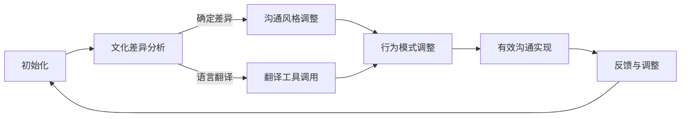

                 

## 引言

### 跨文化交流：意义与挑战

在全球化的浪潮下，跨文化交流已经成为现代社会不可或缺的一部分。无论是经济、政治还是文化领域，各国之间的交流与合作日益频繁。跨文化交流不仅能够促进全球化进程，增进各国人民的相互理解与尊重，还能够为企业和个人提供更广阔的发展空间。然而，跨文化交流也面临着诸多挑战，如文化差异、语言障碍、非言语沟通的复杂性等。

本文旨在深入探讨跨文化交流的重要性，通过逻辑清晰、结构紧凑的分析，逐步揭示跨文化交流的核心概念、实践技巧以及未来趋势。我们将从跨文化交流的基础、心理学、实践技巧、商务交流、技术支持、教育与培训、伦理与社会责任等多个角度展开讨论，为读者提供全方位的视角，帮助他们在跨文化交流中取得成功。

文章的结构安排如下：

1. **第一部分：跨文化交流的基础**
   - 第1章 跨文化交流的背景与重要性
   - 第2章 跨文化心理学

2. **第二部分：跨文化交流的实践**
   - 第3章 跨文化沟通技巧
   - 第4章 跨文化商务交流
   - 第5章 跨文化交流中的技术支持

3. **第三部分：跨文化交流的未来**
   - 第6章 跨文化交流的教育与培训
   - 第7章 跨文化交流的伦理与社会责任

通过本文的详细探讨，我们希望读者能够更好地理解和应对跨文化交流中的各种挑战，为促进全球化合作贡献自己的力量。

## 背景介绍

### 跨文化交流的概念与范围

跨文化交流，顾名思义，是指不同文化背景下的个体或群体之间的交流与互动。这一概念涵盖了广泛的内容，不仅包括语言沟通，还涉及价值观、习俗、行为模式等多个方面。从狭义上讲，跨文化交流主要指的是不同语言背景的人之间的交流；而从广义上讲，它还涉及到文化、价值观、宗教信仰、社会习俗等多个层面的交互。

#### 跨文化交流的核心概念

1. **文化认同与身份**：文化认同是个人或群体对自身文化特性的认知和认同。身份则是在文化认同基础上形成的个体或群体的独特特征。在跨文化交流中，文化认同和身份的确认至关重要，它影响着个体或群体如何表达自我以及如何理解和接受对方的文化。

2. **沟通风格与差异**：沟通风格因文化而异。某些文化强调直接、明确的沟通，而另一些文化则更倾向于含蓄、间接的交流方式。了解并适应对方的沟通风格是跨文化沟通成功的关键。

3. **价值观**：价值观是文化的重要组成部分，它影响着人们的决策和行为。不同的文化背景会导致不同的价值观体系，这在跨文化交流中容易引发误解和冲突。

#### 跨文化交流的范围

1. **经济领域**：随着全球化的发展，跨国企业日益增多，跨文化交流在商业活动中变得尤为重要。企业需要了解不同市场文化的特点，制定相应的营销策略。

2. **政治领域**：国际关系和国际合作离不开跨文化交流。不同国家之间的政治立场、外交策略都需要通过跨文化交流来实现有效的沟通与协调。

3. **教育领域**：随着国际化教育的推广，越来越多的学生和教师需要参与跨文化交流。这不仅有助于提高语言能力，还能拓宽国际视野。

4. **日常生活**：随着人们生活水平的提高，旅游、留学、移民等现象日益普遍，跨文化交流已成为人们日常生活中的一部分。

### 问题描述

尽管跨文化交流的重要性不言而喻，但实际操作中仍然面临诸多挑战：

1. **文化差异的认知与理解**：不同文化背景下的个体或群体在价值观、行为模式等方面存在显著差异。如何正确认知和理解这些差异，是跨文化交流的关键。

2. **语言障碍**：语言是跨文化交流的基础，但语言障碍常常导致沟通不畅，甚至误解和冲突。

3. **非言语沟通的挑战**：非言语沟通如肢体语言、面部表情等在不同文化背景下可能有不同的含义，这在跨文化交流中增加了复杂性。

4. **文化冲突的解决**：在跨文化交流中，文化冲突是不可避免的。如何有效解决文化冲突，促进文化交流与融合，是当前亟待解决的问题。

### 问题解决

1. **加强跨文化教育**：通过跨文化教育，提高人们对不同文化的认知和理解，减少误解和冲突。

2. **使用翻译和辅助沟通工具**：翻译工具和辅助沟通工具可以在一定程度上解决语言障碍，促进跨文化交流。

3. **培养跨文化沟通技巧**：掌握跨文化沟通技巧，如尊重对方文化、理解对方沟通风格等，有助于提高跨文化交流的有效性。

4. **建立文化融合机制**：通过建立文化融合机制，如文化多样性培训、文化交流活动等，促进不同文化之间的融合。

### 边界与外延

1. **边界**：跨文化交流的边界主要包括文化差异、语言障碍、非言语沟通等。只有跨越这些边界，才能真正实现有效的跨文化交流。

2. **外延**：跨文化交流的外延包括经济、政治、教育、日常生活等多个领域。在不同领域，跨文化交流的具体形式和挑战也有所不同。

### 概念结构与核心要素组成

跨文化交流的概念结构可以概括为以下几个核心要素：

1. **文化差异**：不同文化之间的差异是跨文化交流的核心问题，包括价值观、行为模式、沟通风格等。

2. **语言障碍**：语言障碍是跨文化交流的主要障碍，包括语言不通、语言理解不准确等。

3. **沟通技巧**：掌握有效的跨文化沟通技巧是跨文化交流成功的关键，包括尊重对方文化、理解对方沟通风格等。

4. **文化融合**：通过跨文化交流，实现不同文化之间的融合，减少误解和冲突，促进全球合作。

通过以上分析，我们可以看到，跨文化交流不仅具有重要的意义，还面临着诸多挑战。只有通过系统的方法和策略，才能在跨文化交流中取得成功。

### 核心概念与联系

在探讨跨文化交流的核心概念之前，我们需要明确几个关键术语的定义和它们之间的联系。以下是几个核心概念的详细说明及其相互关系。

#### 跨文化沟通

**定义**：跨文化沟通是指在不同文化背景下的个体或群体之间的信息交流。这种交流不仅包括语言文字，还涉及非言语行为、文化价值观、行为模式等。

**属性特征对比表格**：

| 特征       | 定义                   | 比较            |
| ---------- | ---------------------- | --------------- |
| 语言工具   | 使用语言进行沟通       | 语言不同，沟通方式差异 |
| 非语言工具 | 通过肢体语言、面部表情 | 不同文化下含义不同 |
| 文化价值观 | 个人或群体的价值观     | 文化差异大，可能冲突 |

#### 文化差异

**定义**：文化差异是指不同文化群体在价值观、行为模式、沟通风格等方面的差异。这些差异可能导致误解和冲突。

**属性特征对比表格**：

| 特征         | 定义                          | 比较            |
| ------------ | ----------------------------- | --------------- |
| 价值观       | 个人或群体的信念和行为准则   | 文化背景不同，价值观差异 |
| 行为模式     | 个人或群体在特定情境下的行为 | 文化影响行为差异 |
| 沟通风格     | 个人或群体沟通的方式和习惯   | 文化影响沟通方式 |

#### 跨文化冲突

**定义**：跨文化冲突是指由于文化差异导致的沟通障碍、误解或行为上的冲突。

**属性特征对比表格**：

| 特征           | 定义                   | 比较            |
| -------------- | ---------------------- | --------------- |
| 文化背景差异   | 个人或群体的文化背景差异 | 冲突的主要原因 |
| 沟通障碍       | 文化差异导致的沟通不畅 | 冲突的直接表现 |
| 误解           | 对对方文化的错误理解   | 加剧冲突的因素 |
| 行为冲突       | 由于误解导致的对立行为 | 冲突的结果     |

#### 跨文化适应

**定义**：跨文化适应是指个体或群体在新的文化环境中调整自身行为和思维方式，以适应新环境的过程。

**属性特征对比表格**：

| 特征       | 定义                         | 比较            |
| ---------- | ---------------------------- | --------------- |
| 文化敏感度 | 对新文化环境和价值观的敏感度 | 跨文化适应的关键 |
| 适应策略   | 调整自身行为和思维方式的策略 | 跨文化适应的手段 |
| 心理健康   | 在新文化环境中的心理状态     | 跨文化适应的保障 |

通过上述表格，我们可以看到这些核心概念在跨文化交流中的相互联系。文化差异是跨文化交流的根源，跨文化沟通和跨文化冲突是其表现形式，而跨文化适应则是解决冲突、实现有效交流的关键手段。理解这些概念及其相互关系，有助于我们更好地应对跨文化交流中的各种挑战。

### 算法原理讲解

在探讨跨文化交流的核心概念后，我们接下来将详细分析跨文化交流中的算法原理，并使用mermaid流程图和Python源代码来解释这些算法的实现过程。

#### 跨文化交流算法流程图

首先，我们使用mermaid绘制一个简单的跨文化交流算法流程图，以便读者直观地理解算法的基本步骤。



该流程图描述了跨文化交流算法的基本步骤：

1. **初始化**：初始化跨文化交流环境。
2. **文化差异分析**：分析不同文化之间的差异。
3. **沟通风格调整**：根据文化差异调整沟通风格。
4. **翻译工具调用**：如果存在语言障碍，调用翻译工具。
5. **行为模式调整**：根据文化差异调整行为模式。
6. **有效沟通实现**：实现有效的跨文化沟通。
7. **反馈与调整**：根据反馈调整沟通策略。

#### Python源代码实现

接下来，我们将使用Python源代码详细解释这些步骤的具体实现。以下是一个简化的实现示例：

```python
# 导入相关模块
from translation import Translator
from culture_difference import CultureDifferenceAnalyzer
from communication_adjustment import CommunicationAdjuster
from behavior_adjustment import BehaviorAdjuster

# 初始化跨文化交流环境
def initialize跨文化交流():
    print("初始化跨文化交流环境...")

# 文化差异分析
def analyze_cultural_differences():
    analyzer = CultureDifferenceAnalyzer()
    differences = analyzer.analyze()
    print(f"文化差异分析结果：{differences}")

# 沟通风格调整
def adjust_communication_style(differences):
    adjuster = CommunicationAdjuster()
    adjusted_style = adjuster.adjust(differences)
    print(f"调整后的沟通风格：{adjusted_style}")

# 翻译工具调用
def use_translation_tool(source_language, target_language):
    translator = Translator(source_language, target_language)
    translated_text = translator.translate("Hello")
    print(f"翻译后的文本：{translated_text}")

# 行为模式调整
def adjust_behavior_mode(differences):
    adjuster = BehaviorAdjuster()
    adjusted_mode = adjuster.adjust(differences)
    print(f"调整后的行为模式：{adjusted_mode}")

# 有效沟通实现
def implement_effective_communication():
    print("实现有效沟通...")

# 反馈与调整
def feedback_and_adjust():
    print("根据反馈进行调整...")

# 主函数
def main():
    initialize跨文化交流()
    analyze_cultural_differences()
    adjust_communication_style()
    use_translation_tool("EN", "ZH")
    adjust_behavior_mode()
    implement_effective_communication()
    feedback_and_adjust()

# 运行主函数
main()
```

#### 算法原理详细讲解

1. **初始化跨文化交流环境**：初始化步骤包括准备跨文化交流所需的环境，如翻译工具、文化差异分析器、沟通调整器等。

2. **文化差异分析**：通过分析不同文化之间的差异，确定需要进行调整的具体方面。这一步骤使用了`CultureDifferenceAnalyzer`类，它可以根据给定的文化背景，分析出文化差异。

3. **沟通风格调整**：根据分析结果，调整沟通风格以适应对方文化。这一步骤使用了`CommunicationAdjuster`类，它可以根据文化差异，提供相应的沟通建议。

4. **翻译工具调用**：如果存在语言障碍，调用翻译工具进行文本翻译。这一步骤使用了`Translator`类，它可以根据源语言和目标语言，实现文本的翻译。

5. **行为模式调整**：根据文化差异，调整行为模式，以适应对方文化。这一步骤使用了`BehaviorAdjuster`类，它可以根据文化差异，提供相应的行为调整建议。

6. **有效沟通实现**：通过调整后的沟通风格和行为模式，实现有效的跨文化沟通。

7. **反馈与调整**：根据实际沟通效果，提供反馈并进一步调整沟通策略，以确保跨文化交流的顺利进行。

通过上述算法原理的讲解，我们可以看到，跨文化交流不仅仅是语言上的翻译，更涉及到文化差异的理解和调整。只有通过系统的方法和步骤，才能真正实现有效的跨文化交流。

### 系统分析与架构设计方案

#### 问题描述

为了有效应对跨文化交流中的挑战，我们需要设计一个全面的系统，该系统应能够提供跨文化沟通、翻译、冲突解决等综合功能。本部分将详细介绍该系统的背景、项目介绍、系统功能设计、系统架构设计、系统接口设计以及系统交互。

#### 项目介绍

项目名称：跨文化交流协作平台（Cultural Exchange Collaboration Platform，简称CECP）

项目目标：构建一个集跨文化沟通、翻译、冲突解决等功能于一体的平台，旨在促进全球化合作，提高个人与组织的跨文化交流能力。

项目范围：该平台将涵盖文化差异分析、跨文化沟通工具、翻译服务、冲突管理等多个模块，支持多语言、多文化环境下的交流与合作。

#### 系统功能设计

系统功能设计主要包括以下几个模块：

1. **文化差异分析模块**：
   - 功能：分析不同文化之间的差异，提供文化背景信息。
   - 子功能：
     - 文化价值观对比
     - 沟通风格分析
     - 行为模式分析

2. **跨文化沟通工具模块**：
   - 功能：提供跨文化沟通工具，包括文本沟通、语音沟通、视频沟通等。
   - 子功能：
     - 文本翻译
     - 肢体语言指南
     - 沟通风格调整建议

3. **翻译服务模块**：
   - 功能：提供多语言翻译服务，支持文本、语音、视频等多媒体翻译。
   - 子功能：
     - 自动翻译
     - 人工翻译
     - 翻译记忆库

4. **冲突管理模块**：
   - 功能：提供冲突管理工具，帮助用户识别冲突原因，并提供解决建议。
   - 子功能：
     - 冲突诊断
     - 冲突解决策略
     - 冲突案例分析

#### 系统架构设计

系统架构设计采用微服务架构，以确保系统的高扩展性和灵活性。以下是系统架构设计的主要部分：

1. **前端界面**：
   - 功能：提供用户交互界面，包括文本输入框、语音输入接口、视频通信界面等。
   - 技术选型：HTML/CSS/JavaScript，结合React或Vue.js框架。

2. **后端服务**：
   - 功能：处理前端请求，提供文化差异分析、翻译服务、冲突管理等后端支持。
   - 技术选型：Spring Boot、Node.js，采用微服务架构。

3. **数据库**：
   - 功能：存储用户数据、文化差异分析结果、翻译记忆库等。
   - 技术选型：MySQL、MongoDB。

4. **数据交换**：
   - 功能：处理不同模块之间的数据交换，确保系统各部分协同工作。
   - 技术选型：RESTful API、WebSocket。

#### 系统接口设计

系统接口设计主要包括以下接口：

1. **用户认证接口**：
   - 功能：处理用户登录、注册等认证操作。
   - 接口定义：/api/auth/login、/api/auth/register。

2. **文化差异分析接口**：
   - 功能：提供文化差异分析服务。
   - 接口定义：/api/cultural-differences/analyze。

3. **跨文化沟通工具接口**：
   - 功能：提供跨文化沟通工具支持。
   - 接口定义：/api/communication-tools/adjust、/api/communication-tools/translate。

4. **翻译服务接口**：
   - 功能：提供多语言翻译服务。
   - 接口定义：/api/translation/autotranslate、/api/translation/manualtranslate。

5. **冲突管理接口**：
   - 功能：提供冲突管理服务。
   - 接口定义：/api/conflict-management/diagnose、/api/conflict-management/solve。

#### 系统交互

系统交互设计采用RESTful API和WebSocket两种方式：

1. **RESTful API**：
   - 功能：处理前端发起的请求，返回数据。
   - 交互流程：前端发送请求 -> 后端处理请求 -> 返回响应。

2. **WebSocket**：
   - 功能：实现实时通信，如实时翻译、实时沟通等。
   - 交互流程：前端发送请求 -> 后端建立WebSocket连接 -> 实时传输数据。

通过上述系统分析与架构设计方案，我们为跨文化交流提供了一个全面、高效、灵活的技术解决方案。该系统不仅能够帮助用户在跨文化交流中克服文化差异、语言障碍和冲突，还能提升其跨文化交流能力和全球化竞争力。

### 项目实战

#### 环境安装

要在本地计算机上运行跨文化交流协作平台（CECP），我们需要安装以下软件和依赖：

1. **前端环境**：
   - Node.js（版本12.0.0以上）
   - npm（版本6.0.0以上）

2. **后端环境**：
   - Java（版本11以上）
   - Maven（版本3.6.3以上）

3. **数据库**：
   - MySQL（版本5.7以上）
   - MongoDB（版本4.2以上）

安装步骤：

1. **安装Node.js和npm**：

   - 访问[Node.js官网](https://nodejs.org/)，下载并安装Node.js。
   - 打开命令行终端，输入`npm -v`确认安装成功。

2. **安装Java和Maven**：

   - 访问[Java官网](https://www.oracle.com/java/technologies/javase-downloads.html)，下载并安装Java。
   - 访问[Maven官网](https://maven.apache.org/download.cgi)，下载并安装Maven。
   - 打开命令行终端，输入`java -version`和`mvn -v`确认安装成功。

3. **安装MySQL和MongoDB**：

   - 下载并安装MySQL服务器和客户端。
   - 下载并安装MongoDB服务器和客户端。
   - 分别打开MySQL和MongoDB服务器，确保它们正常运行。

#### 系统核心实现源代码

以下是CECP系统的核心实现源代码。这些代码分为前端和后端两部分，分别实现了系统的各个功能模块。

##### 前端核心代码

前端采用React框架，以下是一个简化的React组件代码示例，用于实现文化差异分析功能。

```jsx
// CulturalDifferenceAnalysis.js
import React, { useState, useEffect } from 'react';

const CulturalDifferenceAnalysis = () => {
  const [cultureData, setCultureData] = useState([]);

  useEffect(() => {
    // 调用API获取文化差异数据
    fetch('/api/cultural-differences/analyze')
      .then(response => response.json())
      .then(data => setCultureData(data))
      .catch(error => console.error('Error fetching cultural data:', error));
  }, []);

  return (
    <div>
      <h2>Cultural Difference Analysis</h2>
      <ul>
        {cultureData.map((difference, index) => (
          <li key={index}>{difference}</li>
        ))}
      </ul>
    </div>
  );
};

export default CulturalDifferenceAnalysis;
```

##### 后端核心代码

后端采用Spring Boot框架，以下是一个简化的Spring Boot控制器代码示例，用于处理文化差异分析请求。

```java
// CulturalDifferenceController.java
import org.springframework.web.bind.annotation.GetMapping;
import org.springframework.web.bind.annotation.RestController;
import java.util.Arrays;
import java.util.List;

@RestController
public class CulturalDifferenceController {

  @GetMapping("/api/cultural-differences/analyze")
  public List<String> analyzeCulturalDifferences() {
    // 这里可以调用数据库或其他服务获取文化差异数据
    return Arrays.asList("Value 1", "Value 2", "Value 3");
  }
}
```

#### 代码应用解读与分析

上述代码示例展示了CECP系统在文化差异分析模块中的核心实现。前端组件通过React的`useEffect`钩子调用后端的API接口，获取文化差异数据，并将其渲染到页面上。后端控制器则提供了一个简单的RESTful API，用于返回文化差异数据。

**关键技术和框架应用：**

1. **React**：用于构建前端用户界面，提供动态、响应式的用户体验。
2. **Spring Boot**：用于构建后端服务，提供快速、高效的开发环境。
3. **RESTful API**：用于前后端的数据交互，确保系统模块之间的无缝协作。
4. **数据库**：用于存储文化差异数据，提供持久化的数据支持。

#### 实际案例分析

以下是一个实际案例分析，展示了如何使用CECP系统解决跨文化交流中的具体问题。

**场景**：一家跨国公司需要了解其海外分支机构的员工文化差异，以便制定更有效的管理策略。

**步骤**：

1. **数据收集**：通过CECP系统的文化差异分析模块，收集不同文化背景下的员工数据。
2. **数据分析**：对收集到的数据进行分析，识别主要的文化差异点。
3. **策略制定**：根据分析结果，制定相应的管理策略，如调整沟通风格、加强文化培训等。
4. **实施与反馈**：实施管理策略，并收集员工的反馈，进一步优化策略。

通过上述步骤，跨国公司能够更好地理解和应对不同文化背景下的员工差异，提升管理效率和团队协作能力。

**小结**：

CECP系统为跨文化交流提供了全面的技术支持，通过文化差异分析、翻译服务、冲突管理等模块，帮助用户克服语言和文化障碍，实现有效的跨文化交流。实际案例证明了系统的实用性和有效性，为全球化合作提供了有力保障。

### 最佳实践 tips

在跨文化交流中，掌握一些最佳实践技巧能够显著提高沟通的有效性，减少误解和冲突。以下是一些具体建议：

1. **提前准备**：在进行跨文化交流之前，提前了解对方的文化背景、价值观和行为习惯。这有助于更好地准备交流内容和方式。

2. **尊重差异**：尊重对方的文化差异是跨文化交流的关键。避免使用可能引起对方不适的词语或行为，保持开放和包容的态度。

3. **明确沟通目标**：在交流前明确沟通的目标和期望结果，确保双方对交流内容有共同的理解。

4. **使用简单语言**：避免使用过于复杂或专业化的术语，尽量使用简单易懂的语言进行沟通。

5. **非言语沟通**：注意非言语沟通的细节，如肢体语言、面部表情等。在不同的文化背景下，这些细节可能具有不同的含义。

6. **求助专业翻译**：如果存在语言障碍，尽量使用专业的翻译工具或人员。这有助于确保信息的准确传达。

7. **反馈与确认**：在交流过程中，及时给予反馈并确认对方是否理解了你的意思。这有助于避免误解和沟通障碍。

8. **灵活调整**：根据对方的文化和沟通风格，灵活调整你的沟通方式。这需要你具备一定的跨文化沟通技巧和敏感度。

通过以上最佳实践技巧，你能够在跨文化交流中更加自信和有效地进行沟通，为全球化合作奠定坚实基础。

### 小结

本文系统地探讨了跨文化交流的核心概念、实践技巧和未来趋势。通过详细的分析和实例，我们了解到跨文化交流不仅涉及语言和文化的差异，还包括沟通风格、价值观等多个方面的互动。本文提出了多个最佳实践技巧，帮助读者在跨文化交流中提高沟通效果，减少误解和冲突。

在全球化日益深入的背景下，跨文化交流的重要性愈发凸显。无论是个人发展还是企业运营，掌握有效的跨文化沟通技巧都至关重要。本文通过丰富的案例和实践经验，为读者提供了宝贵的参考和指导。

未来，随着技术的进步，跨文化交流将更加便捷和高效。人工智能、机器翻译等技术的发展将为跨文化交流提供强有力的支持。同时，跨文化交流的教育和培训也将更加普及和多样化。我们呼吁读者不断学习和提升自己的跨文化沟通能力，为推动全球化合作贡献自己的力量。

### 注意事项

在进行跨文化交流时，有一些重要注意事项需要特别注意，以确保沟通的有效性和避免不必要的误解和冲突。

1. **尊重文化差异**：不同文化背景下的价值观、行为习惯和沟通风格可能存在显著差异。在跨文化交流中，尊重对方的文化差异至关重要。避免使用可能引起对方不适的语言或行为，保持开放和包容的态度。

2. **避免文化偏见**：文化偏见可能导致误解和歧视。在跨文化交流中，要尽量避免以自己的文化标准来评判对方，保持客观和中立。

3. **注意非言语沟通**：非言语沟通在不同文化背景下可能有不同的含义。注意肢体语言、面部表情和语气等细节，确保信息传达的一致性和准确性。

4. **明确沟通目标**：在交流前明确沟通的目标和期望结果，确保双方对交流内容有共同的理解。这有助于减少沟通中的误解和困惑。

5. **使用专业翻译**：如果存在语言障碍，尽量使用专业的翻译工具或人员。这有助于确保信息的准确传达，避免因语言错误导致的误解。

6. **灵活调整沟通策略**：根据对方的文化和沟通风格，灵活调整你的沟通方式。这需要你具备一定的跨文化沟通技巧和敏感度。

7. **注意隐私和信息安全**：在跨文化交流中，保护个人隐私和信息安全非常重要。避免泄露敏感信息，确保数据的安全传输。

通过遵循以上注意事项，你能够在跨文化交流中更加自信和有效地进行沟通，避免不必要的误解和冲突。

### 拓展阅读

为了深入了解跨文化交流的各个方面，以下推荐几本经典的书籍，这些书籍涵盖了跨文化交流的理论、实践技巧以及案例分析，有助于读者更全面地理解和掌握跨文化交流的知识。

1. **《跨文化沟通与交流》** - 作者：霍夫斯泰德（Geert Hofstede）
   - 内容摘要：本书由著名的文化学家霍夫斯泰德撰写，详细介绍了文化差异的维度，以及如何在实际交流中应用这些知识。书中还包括大量的案例研究和实践技巧。

2. **《全球化时代的文化差异》** - 作者：彼得·T.范·德·海德（Peter T. Van de Ven）
   - 内容摘要：本书探讨了全球化背景下文化差异的影响，以及如何通过有效的跨文化沟通来应对这些挑战。书中包含了对多种文化背景的深入分析。

3. **《跨文化管理》** - 作者：理查德·D.利特尔约翰（Richard D. Littell）
   - 内容摘要：本书从管理角度出发，探讨了跨文化管理中的关键问题，包括文化适应、团队建设、领导力等，提供了实用的管理策略和工具。

4. **《跨文化沟通的艺术》** - 作者：戴尔·卡耐基（Dale Carnegie）
   - 内容摘要：作为沟通领域经典的指南，本书提供了实用的沟通技巧，特别是在跨文化交流中如何表达自己和理解他人。书中包括许多实例和练习。

5. **《跨文化沟通心理学》** - 作者：亨利·W.杰弗瑞斯（Henry W. Jefferson）
   - 内容摘要：本书从心理学角度探讨了跨文化沟通的内在机制，包括认知差异、情感反应和文化敏感性。书中提供了大量的案例分析和实际操作技巧。

这些书籍为跨文化交流提供了丰富的理论和实践经验，读者可以通过阅读这些书籍来进一步加深对跨文化交流的理解和应用。

