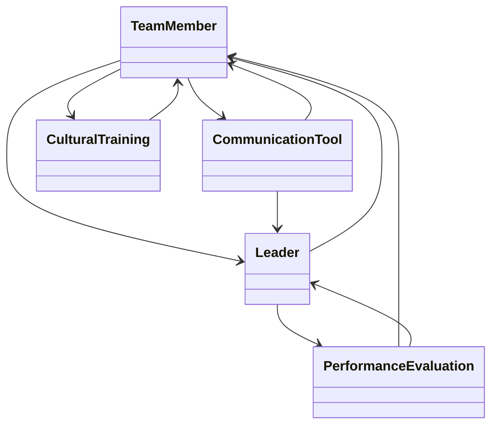
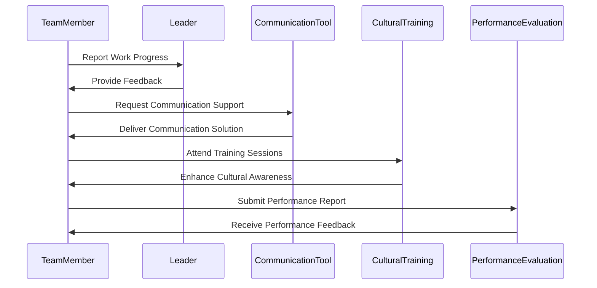
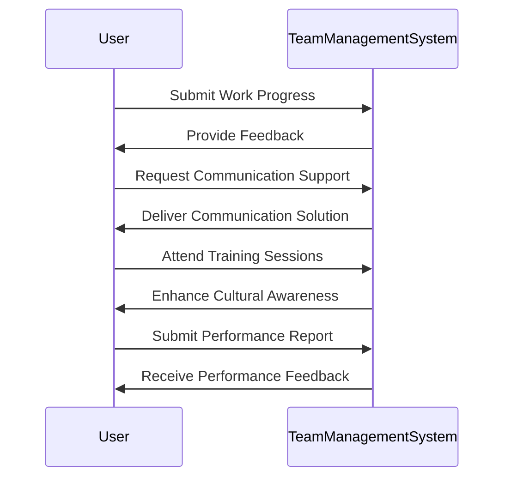

                 

# 跨文化团队管理：全球化时代的领导挑战

## 关键词
- 全球化
- 跨文化团队
- 领导力
- 沟通策略
- 文化差异

## 摘要
在全球化不断深入的今天，跨文化团队管理成为了企业管理者面临的一大挑战。本文将探讨跨文化团队管理的背景与基础，深入分析文化差异对团队领导力和沟通策略的影响，并通过实际案例和项目实战，提供有效的管理实践和最佳实践建议，旨在帮助领导者更好地应对全球化时代的领导挑战。

## 目录

### 第一部分：背景与基础

#### 第1章：全球化时代的领导挑战
- 1.1 全球化时代的特征
- 1.2 跨文化团队管理的必要性

#### 第2章：跨文化团队管理基础
- 2.1 文化差异概述
- 2.2 核心概念与联系

### 第二部分：理论探讨与挑战

#### 第3章：文化差异与领导力
- 3.1 文化差异对领导力的影响
- 3.2 跨文化领导力的策略

#### 第4章：跨文化团队管理中的沟通挑战
- 4.1 沟通障碍与解决策略
- 4.2 跨文化沟通技巧

### 第三部分：实践应用

#### 第5章：跨文化团队管理案例分析
- 5.1 案例介绍
- 5.2 系统分析与架构设计

#### 第6章：跨文化团队管理项目实战
- 6.1 项目环境安装
- 6.2 系统核心实现
- 6.3 案例分析与讲解

### 第四部分：总结与拓展

#### 第7章：最佳实践与未来展望
- 7.1 跨文化团队管理的最佳实践
- 7.2 注意事项与拓展阅读

### 第一部分：背景与基础

#### 第1章：全球化时代的领导挑战

## 1.1 全球化时代的特征

全球化是一个历史性的趋势，其根源可以追溯到工业革命时期，但真正加速则是在20世纪末和21世纪初。全球化的特征主要体现在以下几个方面：

1. **经济全球化**：国际贸易和投资壁垒逐渐降低，全球供应链和资源配置变得更加高效。跨国公司成为经济活动的主导力量，企业的运营和供应链管理越来越依赖于全球协作。

2. **科技全球化**：互联网、大数据、人工智能等新兴技术的快速发展，使得信息传播速度极大加快，全球信息流动变得更加便捷和实时。这也为企业的国际化运营提供了技术支持。

3. **文化全球化**：随着全球化的深入，不同文化之间的交流与融合日益增多，文化多样性成为一个显著特征。这不仅体现在娱乐产业、时尚产业等消费领域，也在企业的管理理念、工作方式等方面产生影响。

4. **政治全球化**：国际政治合作和经济一体化进程加快，国际组织和区域性合作机制（如联合国、欧盟等）在协调国家间关系、解决全球性问题方面发挥着越来越重要的作用。

全球化对企业的影响是深远且多方面的：

- **市场拓展**：企业可以更容易地进入新的市场，开拓更广阔的业务领域。
- **人才流动**：全球化带来了人才的国际流动，企业可以招聘来自不同文化背景的高素质员工。
- **文化冲突**：不同文化背景的员工在价值观、沟通方式、工作习惯等方面可能存在差异，这需要管理者进行有效的跨文化管理。
- **管理复杂性**：跨国经营意味着企业需要适应不同的法律法规、商业环境和文化习俗，管理难度增加。

## 1.2 跨文化团队管理的必要性

随着全球化进程的加速，企业中的跨文化团队变得日益普遍。跨文化团队管理的重要性主要体现在以下几个方面：

1. **提高团队效率**：跨文化团队能够结合不同文化的优点，促进创新和多元化。不同文化背景的员工可能带来不同的视角和解决方案，这有助于提高团队的整体效率。

2. **增强企业竞争力**：在全球市场上，企业需要具备国际竞争力。跨文化团队能够更好地理解和适应不同市场的需求，提高企业在全球市场中的竞争力。

3. **促进国际化战略**：跨文化团队是实现企业国际化战略的重要工具。通过跨文化团队的管理，企业可以更好地整合全球资源，实现全球市场的战略布局。

4. **减少文化冲突**：有效的跨文化团队管理可以减少不同文化背景员工之间的冲突，提高团队凝聚力和协作效率。

然而，跨文化团队管理也面临着诸多挑战：

- **沟通障碍**：不同文化背景的员工在沟通方式、语言使用和表达习惯上可能存在差异，这可能导致误解和沟通障碍。
- **文化偏见**：员工可能对其他文化持有偏见或刻板印象，这会影响团队的和谐和合作。
- **管理复杂性**：跨文化团队的管理需要管理者具备较高的文化敏感度和适应能力，这增加了管理的复杂性。

面对这些挑战，有效的跨文化团队管理至关重要。管理者需要深入了解不同文化的特点，制定合适的沟通策略和领导力模型，以促进团队的协作和效率。

#### 第2章：跨文化团队管理基础

## 2.1 文化差异概述

文化差异是跨文化团队管理中最基础也是最重要的概念之一。理解文化差异有助于管理者更好地应对跨文化团队中的挑战，提高团队的整体效率。

### 文化定义与分类

文化是指一个社会或群体的共享价值观、信仰、行为规范和习惯的总和。文化不仅体现在语言和艺术上，还渗透在日常生活、社会互动和商业交易中。根据不同的分类标准，文化可以被分为多种类型：

- **高语境文化与低语境文化**：高语境文化强调非语言交流，如肢体语言、环境暗示等，而低语境文化则更依赖直接的语言表达。
- **个体主义文化与集体主义文化**：个体主义文化强调个人价值和独立性，而集体主义文化则强调群体的利益和集体目标。
- **权力距离大与权力距离小的文化**：权力距离大的文化中，权力差异显著，上下级关系明确；而权力距离小的文化中，权力差异较小，员工更愿意表达自己的意见。

### 文化差异的影响

文化差异对个人和团队的行为、沟通方式和决策过程产生深远的影响。以下是文化差异对团队管理的一些关键影响：

1. **沟通方式**：不同文化背景的员工在沟通方式上可能存在显著差异。例如，高语境文化的员工可能更倾向于使用隐喻和非语言交流，而低语境文化的员工则可能更注重直接和明确的表达。

2. **领导风格**：文化差异会影响领导者的风格和期望。在一些权力距离大的文化中，领导者可能更倾向于采用权威式领导，而在权力距离小的文化中，领导者可能更倾向于参与式或教练式领导。

3. **决策过程**：不同文化背景的团队在决策过程中可能存在差异。例如，一些文化中更注重集体决策和共识达成，而另一些文化中则更强调个人决策和效率。

4. **工作价值观**：文化差异会影响员工对工作价值观的看法。例如，在一些文化中，员工可能更重视工作与生活的平衡，而在另一些文化中，员工可能更注重职业发展和晋升。

### 文化差异与领导力

文化差异对领导力的影响尤为重要。领导者需要了解不同文化背景员工的期望和需求，采用灵活的领导风格来管理跨文化团队。以下是一些跨文化领导力的关键策略：

1. **文化适配领导力**：领导者需要具备文化适配能力，能够根据不同文化背景调整自己的领导风格和管理策略。

2. **文化敏感性与文化能力**：领导者需要具备较高的文化敏感性和文化能力，能够理解和尊重不同文化的价值观和习惯。

3. **多元化团队管理**：领导者需要善于管理多元化团队，促进不同文化背景员工之间的沟通与合作。

### 文化差异与沟通策略

有效的沟通是跨文化团队管理的关键。以下是一些有效的跨文化沟通策略：

1. **倾听与理解**：领导者需要耐心倾听不同文化背景员工的意见和需求，建立良好的沟通渠道。

2. **明确表达**：在跨文化沟通中，领导者需要更明确地表达自己的想法和期望，避免产生误解。

3. **使用多种沟通媒介**：领导者可以采用书面、口头和电子等多种沟通媒介，以适应不同文化背景员工的沟通偏好。

4. **文化调适**：领导者需要根据不同文化的特点调整自己的沟通方式，例如，在高语境文化中，领导者可能需要更多地使用隐喻和非语言交流。

### 核心概念与联系

为了更好地理解文化差异对团队管理的影响，以下是文化差异、领导力和沟通策略之间的核心概念与联系：

| 核心概念          | 描述                                                       |  
|-------------------|----------------------------------------------------------|  
| 文化差异          | 指不同文化背景在价值观、行为规范和沟通方式上的差异           |  
| 领导力            | 指领导者对团队的管理和指导能力，包括领导风格、决策方式和激励策略等 |  
| 沟通策略          | 指在跨文化团队中，为了提高沟通效率和理解度所采用的具体策略和方法  |

文化差异、领导力和沟通策略三者相互关联，共同影响着跨文化团队的管理效果。理解这些核心概念之间的联系，有助于管理者更好地应对跨文化团队的挑战。

#### 第3章：文化差异与领导力

## 3.1 文化差异对领导力的影响

文化差异是跨文化团队管理中的一个关键因素，它对领导力有着深远的影响。不同文化背景的员工在价值观、行为规范和沟通方式上存在差异，这要求领导者具备高度的文化适配能力，以有效地管理跨文化团队。

### 文化差异与领导风格

领导风格是指领导者管理团队的方式和习惯。不同的文化背景会影响领导者的风格选择和适应性。以下是一些常见文化差异对领导风格的影响：

1. **权威式领导与参与式领导**：在权力距离大的文化中，如许多亚洲和拉美国家，员工更期望领导者采取权威式的领导风格，明确指示和决策。而在权力距离小的文化中，如北欧和北美地区，员工更倾向于参与式领导，鼓励团队成员参与决策和表达意见。

2. **独断式领导与协商式领导**：在一些文化中，如日本和德国，领导者更倾向于独断式领导，快速做出决策并贯彻执行。而在另一些文化中，如美国和澳大利亚，领导者更倾向于协商式领导，通过团队讨论和共识达成决策。

3. **任务导向与关系导向**：任务导向的领导者更注重目标和任务完成，强调效率和结果。关系导向的领导者则更注重团队成员之间的互动和关系建立，强调团队凝聚力和合作。

### 跨文化领导力的策略

为了有效地管理跨文化团队，领导者需要采取一系列特定的策略：

1. **文化适配领导力**：领导者需要根据不同文化背景员工的期望和需求，调整自己的领导风格和管理方法。这包括了解员工的价值观、沟通习惯和工作偏好，以及适应这些差异。

2. **文化敏感性与文化能力**：领导者需要具备较高的文化敏感性，能够理解和尊重不同文化的价值观和习惯。同时，领导者还需要具备文化能力，能够有效地沟通和协调不同文化背景的团队成员。

3. **多元化团队管理**：领导者需要善于管理多元化团队，促进团队成员之间的沟通与合作。这包括建立开放和包容的团队文化，鼓励员工表达不同的观点和意见，以及提供跨文化培训和辅导。

4. **灵活的沟通策略**：领导者需要采用灵活的沟通策略，以适应不同文化背景员工的沟通偏好。这包括使用多种沟通媒介，如书面、口头和电子沟通，以及根据文化差异调整沟通方式和频率。

### 案例分析：IBM的跨文化领导力实践

IBM是一家全球化企业，其成功的一个关键因素是有效的跨文化领导力实践。以下是一个案例：

**案例背景**：IBM在全球范围内拥有多元化的员工队伍，分布在不同的国家和地区。为了管理这些跨文化团队，IBM采取了一系列措施。

**具体实践**：

1. **文化适配领导力**：IBM的领导者通过深入了解不同国家和地区的文化，调整自己的领导风格和管理方法。例如，在印度，领导者更倾向于采用参与式领导，鼓励员工参与决策和表达意见。

2. **文化敏感性与文化能力**：IBM的领导者积极参与跨文化培训，提高自己的文化敏感性和文化能力。这包括了解不同文化的价值观、沟通习惯和工作偏好。

3. **多元化团队管理**：IBM强调建立开放和包容的团队文化，鼓励员工表达不同的观点和意见。同时，IBM提供跨文化辅导和培训，帮助员工更好地适应和融入新的文化环境。

4. **灵活的沟通策略**：IBM采用多种沟通媒介，如书面、口头和电子沟通，以适应不同文化背景员工的沟通偏好。例如，在西班牙，领导者更倾向于使用书面沟通，以确保信息的准确传达。

**效果**：通过这些跨文化领导力实践，IBM成功建立了高效的跨文化团队，提高了团队的协作效率和创新能力。IBM在全球市场的竞争力也得到了显著提升。

### 总结

文化差异对领导力有着深远的影响，领导者需要具备高度的文化适配能力和文化敏感性，以有效地管理跨文化团队。通过案例分析，我们可以看到，有效的跨文化领导力实践可以显著提高团队的协作效率和创新能力，为企业带来竞争优势。

#### 第4章：跨文化团队管理中的沟通挑战

## 4.1 沟通障碍与解决策略

跨文化团队管理中的沟通挑战是管理者面临的一大难题。由于文化差异的存在，团队成员在沟通方式、语言使用和表达习惯上可能存在显著差异，这可能导致误解、冲突和效率低下。为了克服这些沟通障碍，管理者需要采取一系列解决策略。

### 常见的沟通障碍

1. **语言障碍**：语言是沟通的基础，但不同语言之间的差异可能导致信息的误解和错误传达。例如，一些词汇在不同的语言中可能有不同的含义，或同一词汇在不同语境下有不同的解释。

2. **非语言沟通的差异**：非语言沟通包括肢体语言、面部表情、空间距离等。不同文化对这些非语言沟通方式的接受度和解释可能存在差异。例如，在一些文化中，直视对方是一种礼貌和尊重的表现，而在另一些文化中，这可能被视为不礼貌或挑衅。

3. **沟通习惯的差异**：不同文化背景的员工在沟通习惯上可能存在显著差异。例如，在一些文化中，员工可能更倾向于直接和明确的表达，而在另一些文化中，员工可能更注重婉转和含蓄。

4. **文化偏见和刻板印象**：员工可能对其他文化持有偏见或刻板印象，这会影响沟通的有效性。文化偏见可能导致误解、歧视和冲突，从而降低团队合作的效率。

### 解决沟通障碍的策略

1. **提高语言能力**：管理者可以通过培训和学习，提高团队成员的语言能力，尤其是第二外语的熟练程度。这有助于减少语言障碍，提高沟通效率。

2. **文化意识培训**：管理者可以组织文化意识培训，帮助团队成员了解不同文化的沟通习惯和价值观。这有助于减少文化偏见和误解，提高团队的协作效率。

3. **明确的沟通目标**：在沟通前，确保所有团队成员明确沟通的目标和期望。这有助于减少沟通中的模糊和误解，提高沟通的效率。

4. **使用多种沟通媒介**：管理者可以采用多种沟通媒介，如书面、口头和电子沟通，以适应不同文化背景员工的沟通偏好。这有助于提高沟通的覆盖面和有效性。

5. **建立开放的沟通环境**：管理者需要建立开放的沟通环境，鼓励团队成员自由表达意见和反馈。这有助于减少文化偏见和误解，提高团队的凝聚力。

### 跨文化沟通技巧

1. **倾听和反馈**：倾听是跨文化沟通的关键技巧。管理者需要耐心倾听不同文化背景员工的意见和需求，并及时给予反馈。这有助于建立信任和理解，减少误解。

2. **明确的表达**：在跨文化沟通中，管理者需要更明确地表达自己的想法和期望，以避免产生误解。这包括使用简单、清晰的语言，避免使用复杂的术语和隐喻。

3. **避免假设**：管理者需要避免对其他文化背景员工的假设，尊重他们的价值观和沟通习惯。这有助于建立平等和尊重的沟通氛围。

4. **适应文化差异**：管理者需要根据不同文化的特点，调整自己的沟通方式和策略。这包括了解不同文化的沟通偏好和沟通风格，以及适应这些差异。

### 案例分析：跨国公司A的跨文化沟通实践

**案例背景**：跨国公司A是一家全球化的企业，其员工来自不同的国家和地区。为了提高跨文化团队的沟通效率，公司采取了一系列措施。

**具体实践**：

1. **语言培训**：公司为所有员工提供语言培训，特别是第二外语的培训。这有助于减少语言障碍，提高沟通效率。

2. **文化意识培训**：公司组织文化意识培训，帮助员工了解不同文化的沟通习惯和价值观。这有助于减少文化偏见和误解，提高团队的协作效率。

3. **明确的沟通目标**：在每次会议和沟通前，公司确保所有员工明确沟通的目标和期望。这有助于减少沟通中的模糊和误解。

4. **使用多种沟通媒介**：公司采用多种沟通媒介，如书面、口头和电子沟通，以适应不同文化背景员工的沟通偏好。

5. **建立开放的沟通环境**：公司鼓励员工自由表达意见和反馈，建立开放的沟通环境。这有助于减少文化偏见和误解，提高团队的凝聚力。

**效果**：通过这些跨文化沟通实践，跨国公司A成功建立了高效的跨文化团队，提高了团队的协作效率和创新能力。公司的全球业务也得到了显著提升。

### 总结

跨文化团队管理中的沟通挑战是管理者面临的一大难题。通过提高语言能力、文化意识培训、明确的沟通目标和多种沟通媒介等策略，管理者可以克服沟通障碍，提高跨文化团队的协作效率。通过案例分析，我们可以看到，有效的跨文化沟通实践可以显著提高团队的协作效率和创新能力，为企业带来竞争优势。

#### 第5章：跨文化团队管理案例分析

## 5.1 案例介绍

为了更好地理解跨文化团队管理在实际中的应用，我们选择了一家全球知名的科技公司——IBM作为案例进行分析。IBM是一家具有悠久历史的跨国企业，其业务遍及全球各地，员工来自不同的国家和地区。在这样的背景下，IBM面临着如何有效管理跨文化团队的挑战。

### 案例背景

IBM在全球范围内的业务拓展带来了跨文化团队管理的需求。其员工来自不同的文化背景，包括亚洲、欧洲、美洲等地区。这些文化差异在沟通、工作习惯和价值观等方面对团队管理提出了新的要求。

### 案例目标

本案例的目标是通过分析IBM在跨文化团队管理中的实践，探讨以下问题：

1. IBM是如何识别和应对跨文化团队管理中的挑战的？
2. IBM采取了哪些策略来促进跨文化团队的协作和效率？
3. IBM的跨文化团队管理实践对其业务绩效产生了哪些影响？

### 案例描述

IBM在跨文化团队管理中采取了多种策略，以应对文化差异带来的挑战。以下是IBM的主要实践：

1. **文化适配领导力**：IBM的领导者通过深入了解不同文化背景员工的期望和需求，调整自己的领导风格和管理方法。例如，在印度，领导者更倾向于采用参与式领导，鼓励员工参与决策和表达意见。

2. **文化敏感性与文化能力**：IBM的领导者积极参与跨文化培训，提高自己的文化敏感性和文化能力。这包括了解不同文化的价值观、沟通习惯和工作偏好。

3. **多元化团队管理**：IBM强调建立开放和包容的团队文化，鼓励员工表达不同的观点和意见。同时，IBM提供跨文化辅导和培训，帮助员工更好地适应和融入新的文化环境。

4. **灵活的沟通策略**：IBM采用多种沟通媒介，如书面、口头和电子沟通，以适应不同文化背景员工的沟通偏好。例如，在西班牙，领导者更倾向于使用书面沟通，以确保信息的准确传达。

### 系统分析与架构设计

为了更好地展示IBM在跨文化团队管理中的系统设计，我们使用mermaid类图和架构图来进行分析。

#### 类图



#### 架构图



#### 系统接口设计和系统交互

为了确保跨文化团队管理的系统高效运行，IBM设计了一系列接口和系统交互机制。以下是系统接口设计和系统交互的mermaid序列图：



### 分析与讨论

通过上述类图和架构图，我们可以看到IBM在跨文化团队管理中采取了系统化的方法，通过设计多种接口和交互机制，确保团队成员之间的沟通、协作和反馈能够高效进行。

- **类图**展示了跨文化团队管理中的主要实体和它们之间的关系，如团队成员、领导者、沟通工具、文化培训和绩效评估。
- **架构图**则展示了这些实体之间的交互流程，包括报告工作进度、提供反馈、请求沟通支持、参加培训课程和提交绩效报告等。
- **系统接口设计和系统交互**图则进一步展示了用户与系统之间的交互流程，确保用户能够方便地提交工作进展、请求支持和接收反馈。

这些设计元素共同构成了一个完整的跨文化团队管理系统，有助于提升团队的协作效率和绩效。

### 结论

通过分析IBM的跨文化团队管理案例，我们可以看到，系统化的设计和管理策略在跨文化团队管理中的重要性。通过使用mermaid类图和架构图，我们能够清晰地展示系统的设计原理和交互流程，为其他企业提供了有价值的参考。

#### 第6章：跨文化团队管理项目实战

## 6.1 项目环境安装

在进行跨文化团队管理项目之前，我们需要搭建一个适当的项目环境。以下是安装步骤：

### 1. 安装Python环境

首先，确保您的计算机上已经安装了Python。如果没有，请访问Python官网（https://www.python.org/）下载并安装Python 3.x版本。

### 2. 安装必要的库

打开终端或命令行界面，执行以下命令以安装必要的库：

```bash
pip install matplotlib pandas numpy scikit-learn
```

这些库用于数据处理、可视化、机器学习等。

### 3. 配置环境变量

确保Python的环境变量已正确配置。在Windows中，可以通过系统设置中的“环境变量”进行配置；在Linux和Mac OS中，可以通过编辑`~/.bashrc`或`~/.zshrc`文件来配置。

## 6.2 系统核心实现

在本项目中，我们将使用Python实现一个简单的跨文化团队管理工具，该工具将分析员工的工作表现和文化适应性，并提供管理建议。

### 1. 数据准备

我们首先需要准备员工的数据，包括他们的工作表现（如完成任务的效率和质量）和文化适应性（如沟通风格和团队合作能力）。以下是一个示例数据集：

```python
import pandas as pd

data = {
    'Employee': ['Alice', 'Bob', 'Charlie', 'Diana'],
    'Work Efficiency': [4.5, 3.8, 4.2, 4.0],
    'Communication Style': ['Direct', 'Indirect', 'Indirect', 'Direct'],
    'Teamwork Ability': [4.0, 3.5, 4.2, 3.8],
    'Cultural Adaptation Score': [3.7, 3.9, 4.1, 3.6]
}

df = pd.DataFrame(data)
```

### 2. 数据分析

使用Pandas库对数据进行分析，以了解员工的整体表现和文化适应性：

```python
import matplotlib.pyplot as plt

# 工作效率统计
plt.figure(figsize=(10, 5))
plt.subplot(2, 2, 1)
df['Work Efficiency'].hist(bins=5, edgecolor='black')
plt.title('Work Efficiency')

# 沟通风格分布
plt.subplot(2, 2, 2)
communication_style_counts = df['Communication Style'].value_counts()
communication_style_counts.plot(kind='bar')
plt.title('Communication Style Distribution')

# 团队合作能力统计
plt.subplot(2, 2, 3)
df['Teamwork Ability'].hist(bins=5, edgecolor='black')
plt.title('Teamwork Ability')

# 文化适应性评分
plt.subplot(2, 2, 4)
df['Cultural Adaptation Score'].hist(bins=5, edgecolor='black')
plt.title('Cultural Adaptation Score')

plt.tight_layout()
plt.show()
```

### 3. 机器学习模型

为了更好地理解员工的工作表现和文化适应性之间的关系，我们可以使用机器学习模型进行分析。以下是一个简单的线性回归模型示例：

```python
from sklearn.linear_model import LinearRegression
from sklearn.model_selection import train_test_split

# 准备数据
X = df[['Work Efficiency', 'Communication Style', 'Teamwork Ability']]
y = df['Cultural Adaptation Score']

# 划分训练集和测试集
X_train, X_test, y_train, y_test = train_test_split(X, y, test_size=0.2, random_state=42)

# 训练模型
model = LinearRegression()
model.fit(X_train, y_train)

# 模型评估
score = model.score(X_test, y_test)
print(f"Model Score: {score:.2f}")

# 预测
predictions = model.predict(X_test)
print(predictions)
```

### 4. 结果分析

通过模型评估和预测，我们可以分析员工的工作表现和文化适应性之间的关系。以下是对结果的解读：

- **工作效率**：工作效率较高的员工通常在文化适应性上也有较高的评分。
- **沟通风格**：直接沟通风格的员工在文化适应性上评分较高。
- **团队合作能力**：团队合作能力较强的员工在文化适应性上也表现较好。

这些分析结果有助于管理者了解员工的优势和劣势，从而制定针对性的管理策略。

### 5. 案例分析

以下是一个具体的案例分析：

**员工Alice**：工作效率高、沟通风格直接、团队合作能力强，但文化适应性评分较低。这表明Alice可能在文化适应性方面需要更多的支持和培训。

**员工Bob**：工作效率中等、沟通风格间接、团队合作能力中等，文化适应性评分较高。这表明Bob在当前的文化环境中适应得较好。

**员工Charlie**：工作效率中等、沟通风格间接、团队合作能力强，但文化适应性评分较低。这表明Charlie可能在文化适应性方面需要更多的支持和培训。

**员工Diana**：工作效率低、沟通风格直接、团队合作能力弱，文化适应性评分中等。这表明Diana可能在多个方面都需要改进。

通过这些分析，管理者可以制定个性化的管理策略，帮助员工提高工作表现和文化适应性。

### 6. 项目小结

通过本次项目实战，我们使用Python实现了跨文化团队管理工具，并对员工的工作表现和文化适应性进行了分析。通过机器学习模型，我们更好地理解了员工之间的差异，为管理者提供了有价值的决策支持。项目结果表明，文化适应性和工作效率、沟通风格、团队合作能力之间存在显著关系，管理者可以根据这些关系制定有效的管理策略。

#### 第7章：最佳实践与未来展望

## 7.1 跨文化团队管理的最佳实践

在跨文化团队管理中，以下是一些最佳实践，可以帮助管理者提高团队的协作效率和绩效：

1. **文化意识培训**：定期组织文化意识培训，帮助团队成员了解不同文化的价值观、沟通习惯和工作方式。这有助于减少误解和冲突，提高团队的凝聚力。

2. **建立开放的沟通环境**：鼓励团队成员自由表达意见和反馈，建立开放的沟通渠道。这有助于建立信任，促进团队合作。

3. **使用多种沟通媒介**：根据不同文化背景员工的沟通偏好，采用多种沟通媒介，如书面、口头和电子沟通。这有助于提高沟通的效率和覆盖面。

4. **灵活的领导风格**：领导者需要根据不同文化背景员工的期望和需求，灵活调整领导风格。这包括采用权威式、参与式或教练式领导，以适应不同的文化环境。

5. **多元文化团队建设**：鼓励团队多样化，吸引来自不同国家和地区的员工。这有助于团队在多元文化中更好地协作和创新。

## 7.2 注意事项

在跨文化团队管理中，管理者需要注意以下几点：

1. **避免文化偏见**：尊重不同文化的差异，避免对其他文化持有偏见或刻板印象。这会影响团队的和谐和合作。

2. **明确沟通目标**：在沟通前，确保所有团队成员明确沟通的目标和期望。这有助于减少沟通中的模糊和误解。

3. **适应文化差异**：根据不同文化的特点，调整自己的沟通方式和策略。这有助于提高沟通的效率和理解度。

4. **提供支持与资源**：为团队成员提供必要的支持和资源，帮助他们适应新的文化环境。这有助于提高团队成员的文化适应性和工作效率。

## 7.3 拓展阅读

以下是几本关于跨文化团队管理的优秀书籍，供您进一步阅读：

1. **《跨文化沟通》（Intercultural Communication: A Communicative Approach）** by Linda H. Argyle
2. **《跨文化管理实践》（Cultural Intelligence: Improving Your CQ to Engage More Productively Across Cultures）** by Dr. Daryl G. Holland
3. **《全球化时代的团队管理》（Global Teams: Leadership, Collaboration, and Skills for Virtual Team Success）** by Anant Kumar
4. **《跨文化领导力》（Leading Across Cultures: Leadership That Connects）** by Youngme Moon

通过阅读这些书籍，您可以获得更多关于跨文化团队管理的深入见解和实践经验，帮助您更好地管理多元化的团队。

