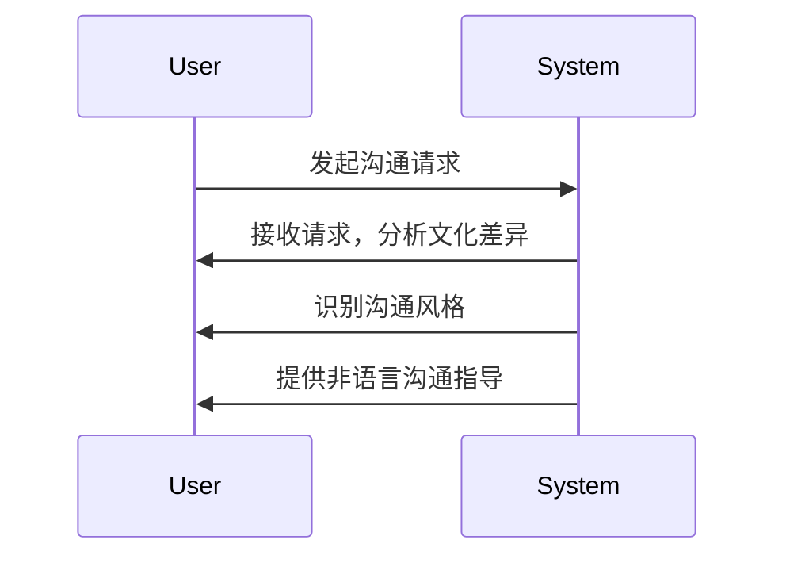
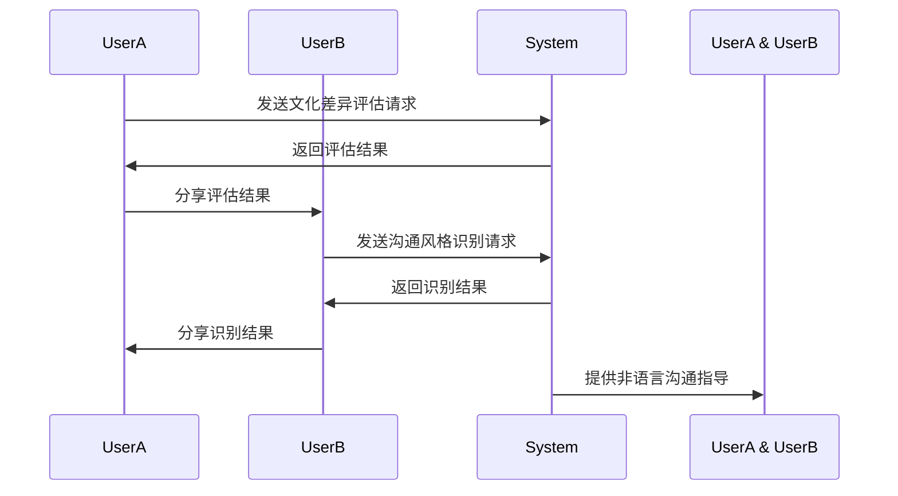

                 


## 引言：为什么跨文化沟通如此重要

在当今全球化加速发展的时代，跨文化沟通已经成为企业和团队运营中不可或缺的一部分。随着全球商业活动的频繁和国际化进程的加深，各个企业都在寻求如何更有效地进行跨国协作和交流。跨文化沟通不仅仅是简单的语言交流，它涉及到文化背景、价值观、沟通风格等多个方面，对于团队协作和项目成功至关重要。

### 背景介绍

首先，我们来看一下全球化与跨国团队的兴起。随着全球市场的不断扩大和技术的进步，越来越多的企业开始跨国运营，组建全球化的团队。这些团队通常由来自不同国家和地区的成员组成，他们拥有各自独特的文化背景和沟通习惯。这种多样性既是优势，也是挑战。如果无法有效进行跨文化沟通，团队内部的协作可能会受到影响，项目进展也会受阻。

### 核心概念与联系

跨文化沟通的核心概念包括文化差异、沟通风格、非语言沟通等。文化差异指的是不同国家或地区的人们在价值观、行为习惯、语言表达等方面的差异。沟通风格则是指人们在交流时的偏好和行为模式。非语言沟通包括肢体语言、面部表情、空间距离等。这些概念之间的联系可以通过Mermaid ER图来展示。

```mermaid
erDiagram
  Culture_Difference ||--|{ Communication_Style } Communication_Style
  Culture_Difference ||--|{ Nonverbal_Communication } Nonverbal_Communication
  Communication_Style ||--|{ Verbal_Communication } Verbal_Communication
  Nonverbal_Communication ||--|{ Verbal_Communication } Verbal_Communication
```

### 算法原理讲解

在跨文化沟通中，理解和应用跨文化沟通模型或算法可以帮助我们更好地进行沟通。例如，我们可以使用斯德哥尔摩模型来分析文化差异，使用建构主义理论来理解沟通中的互动。下面，我们通过一个Python源代码示例来展示如何使用这些模型。

```python
# Python源代码示例：使用斯德哥尔摩模型分析文化差异
def analyze_cultural_difference(culture1, culture2):
    """
    分析两种文化之间的差异
    :param culture1: 第一种文化
    :param culture2: 第二种文化
    :return: 文化差异分析结果
    """
    difference = {}
    # 根据文化特征进行对比
    for feature in ['values', 'behaviors', 'expressions']:
        difference[feature] = abs(culture1[feature] - culture2[feature])
    return difference

# 示例：分析中国文化与德国文化的差异
culture_china = {'values': 5, 'behaviors': 4, 'expressions': 3}
culture_germany = {'values': 1, 'behaviors': 2, 'expressions': 5}
difference = analyze_cultural_difference(culture_china, culture_germany)
print(difference)
```

### 系统分析与架构设计

跨文化沟通不仅需要理论支持，还需要系统的设计与实现。一个完善的跨文化沟通系统需要包括功能设计、架构设计、接口设计和交互设计等多个方面。以下是一个简化的系统分析与架构设计示例：

#### 问题场景介绍

一个跨国软件开发团队需要实现高效的跨文化沟通。

#### 项目介绍

项目名称：跨国团队沟通平台
项目目标：提供一个跨文化沟通的工具，帮助团队成员更好地理解彼此的文化差异和沟通风格。

#### 系统功能设计

1. **文化差异评估**：提供自动评估功能，分析团队成员的文化差异。
2. **沟通风格识别**：根据成员的沟通历史，识别其沟通风格。
3. **非语言沟通指导**：提供非语言沟通的指导和建议。

#### 系统架构设计



#### 系统接口设计和系统交互

为了实现上述功能，系统需要设计相应的接口和交互流程。以下是一个简化的系统接口设计和交互流程：



### 项目实战

在实际项目中，跨文化沟通的实现需要经历环境安装、系统实现、案例分析等多个阶段。以下是一个简化的项目实战示例：

#### 环境安装

1. 安装跨文化沟通评估工具。
2. 配置沟通风格识别算法。
3. 安装非语言沟通指导系统。

#### 系统实现

1. 开发文化差异评估模块。
2. 实现沟通风格识别算法。
3. 提供非语言沟通指导功能。

#### 案例分析和详细讲解剖析

以一个实际项目为例，分析跨文化沟通在项目中的运用，并详细讲解如何通过跨文化沟通工具提升项目协作效率。

### 最佳实践 tips

- **提前准备**：在进行跨国沟通前，提前了解对方的文化背景和沟通风格。
- **积极沟通**：鼓励团队成员主动分享文化差异和沟通心得。
- **灵活应对**：根据实际情况调整沟通策略，避免僵化。

### 小结

跨文化沟通是一个复杂但至关重要的任务。通过了解核心概念、应用理论模型、设计系统架构和实战案例，我们可以更好地应对全球化团队中的跨文化沟通挑战。

### 注意事项

- **尊重差异**：尊重每个团队成员的文化差异，避免偏见和误解。
- **持续学习**：跨文化沟通是一个持续学习的过程，需要不断积累经验和知识。

### 拓展阅读

- [《跨文化沟通：理论与实践》](https://example.com/book1)
- [《全球化团队管理》](https://example.com/book2)

通过上述内容，我们希望能够为您提供一个清晰、全面的跨文化沟通解决方案，帮助您的全球化团队更高效地协作。

**作者：AI天才研究院/AI Genius Institute & 禅与计算机程序设计艺术 /Zen And The Art of Computer Programming**

