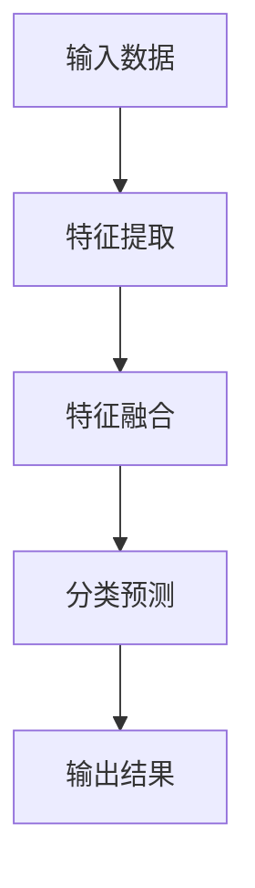
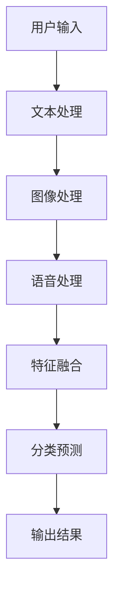
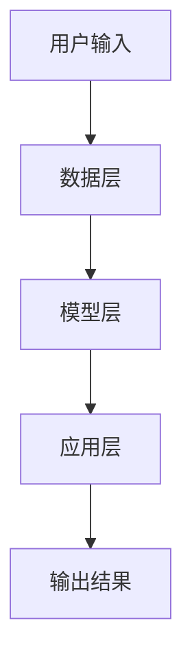
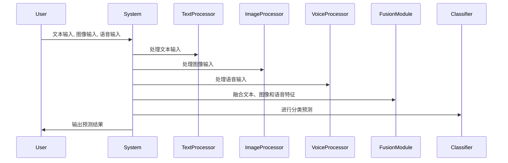
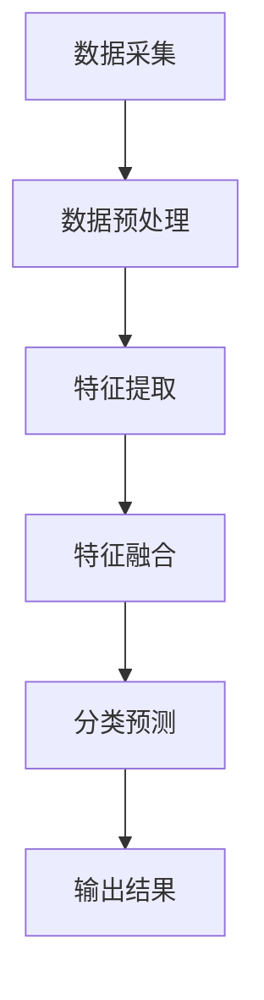

                 


### 第1章: 跨模态提示词概述

跨模态提示词（Multimodal Prompting）是一种利用多种模态（如文本、图像和语音）的信息来指导人工智能系统进行任务执行的技术。随着人工智能技术的不断进步，跨模态提示词在自然语言处理、计算机视觉和语音识别等领域的重要性日益凸显。

#### 1.1 跨模态提示词的定义

跨模态提示词是指一种结合了文本、图像和语音等多种信息来源的提示，旨在为人工智能系统提供更加丰富和多样化的输入，从而提升其理解和处理能力。例如，在图像识别任务中，通过结合文本描述来提高图像分类的准确性；在语音识别任务中，通过文本提示来帮助语音模型理解上下文。

#### 1.2 跨模态提示词的应用背景

跨模态提示词的应用背景主要涉及以下场景：

1. **人机交互**：在智能助手、虚拟助手等领域，跨模态提示词可以帮助用户以更自然和灵活的方式与系统进行交流。
2. **图像识别与增强**：通过结合文本描述，可以提升图像识别的准确性和鲁棒性。
3. **语音识别与生成**：结合文本和语音信息，可以改善语音识别的准确性，并生成更具个性化的语音输出。
4. **多媒体内容创作**：在视频制作、音频剪辑等领域，跨模态提示词可以帮助用户更高效地创作内容。

#### 1.3 跨模态提示词的重要性

跨模态提示词的重要性主要体现在以下几个方面：

1. **提升任务性能**：通过结合多种模态信息，可以显著提高人工智能系统的性能和准确度。
2. **增强用户体验**：跨模态交互可以提供更加丰富和个性化的用户体验，满足不同用户的需求。
3. **拓宽应用场景**：跨模态提示词可以应用于更多领域，推动人工智能技术的创新和发展。
4. **实现智能决策**：跨模态提示词可以为人工智能系统提供更全面和准确的信息，帮助其做出更明智的决策。

### 第2章: 文本、图像和语音处理基础

#### 2.1 文本处理的基本概念

文本处理是自然语言处理（NLP）的核心内容，涉及文本的表示、分析、理解和生成。文本处理的基本概念包括：

- **词向量**：将文本转换为数值表示，如Word2Vec、GloVe等。
- **词性标注**：对文本中的词语进行分类，如名词、动词、形容词等。
- **句法分析**：分析文本的句法结构，如成分分析、依存关系分析等。
- **语义分析**：理解文本中的语义信息，如情感分析、实体识别等。

#### 2.2 图像处理的基本概念

图像处理是计算机视觉（CV）的核心内容，涉及图像的获取、处理、分析和理解。图像处理的基本概念包括：

- **像素**：图像的基本单元，每个像素表示一个颜色值。
- **图像滤波**：用于去除噪声、增强图像特征等。
- **特征提取**：从图像中提取具有区分性的特征，如SIFT、HOG等。
- **目标检测**：定位图像中的目标对象，如YOLO、SSD等。

#### 2.3 语音处理的基本概念

语音处理涉及语音的采集、处理、分析和理解。语音处理的基本概念包括：

- **语音信号处理**：对语音信号进行滤波、增强、降噪等。
- **语音识别**：将语音信号转换为文本，如基于统计模型、深度学习的语音识别技术。
- **语音合成**：将文本转换为语音，如基于规则、循环神经网络（RNN）的语音合成技术。
- **情感识别**：分析语音中的情感信息，如基于声学特征、语音波形等。

### 第3章: 跨模态提示词的算法原理

#### 3.1 算法原理概述

跨模态提示词的算法原理主要包括以下几个方面：

- **特征融合**：将不同模态的信息（文本、图像和语音）进行融合，以提取更丰富的特征。
- **模型架构**：构建能够同时处理多种模态信息的神经网络模型，如多模态卷积神经网络（MM-CNN）等。
- **损失函数**：设计合适的损失函数，以优化模型参数，提高模型性能。

#### 3.2 数学模型和公式

跨模态提示词的数学模型主要包括以下几个部分：

- **特征表示**：
  $$ X = [X_{\text{text}}, X_{\text{image}}, X_{\text{audio}}] $$
  其中，$X_{\text{text}}$、$X_{\text{image}}$ 和 $X_{\text{audio}}$ 分别表示文本、图像和语音的特征向量。
- **特征融合**：
  $$ F = \sigma(W_f \cdot [X_{\text{text}}, X_{\text{image}}, X_{\text{audio}}]) $$
  其中，$W_f$ 为特征融合权重矩阵，$\sigma$ 为激活函数。
- **分类预测**：
  $$ y = \text{softmax}(W_c \cdot F) $$
  其中，$W_c$ 为分类权重矩阵，$y$ 为预测结果。

#### 3.3 算法流程图



#### 3.4 案例分析

以图像分类任务为例，假设输入图像 $X_{\text{image}}$ 和文本描述 $X_{\text{text}}$，我们需要对图像进行分类。首先，利用卷积神经网络（CNN）对图像进行特征提取，得到特征向量 $X_{\text{image}}^{'}$。然后，利用文本嵌入模型对文本描述进行特征提取，得到特征向量 $X_{\text{text}}^{'}$。接下来，将两个特征向量进行融合，得到融合特征向量 $X_{\text{fusion}}$。最后，利用融合特征向量进行分类预测。

### 第4章: 系统功能设计

#### 4.1 系统功能概述

跨模态提示词系统的主要功能包括：

- **文本处理**：对输入文本进行词向量表示、词性标注、句法分析和语义分析等。
- **图像处理**：对输入图像进行特征提取、目标检测和图像分类等。
- **语音处理**：对输入语音进行语音信号处理、语音识别和语音合成等。
- **跨模态融合**：将文本、图像和语音信息进行融合，以生成统一的特征向量。
- **分类预测**：利用融合特征向量进行分类预测，并输出预测结果。

#### 4.2 领域模型设计



### 第5章: 系统架构设计

#### 5.1 系统架构概述

跨模态提示词系统的架构设计主要包括以下几个部分：

- **数据层**：负责数据采集、存储和预处理。
- **模型层**：包括文本处理模型、图像处理模型、语音处理模型和跨模态融合模型。
- **应用层**：提供用户交互界面和业务逻辑实现。

#### 5.2 架构设计



#### 5.3 系统接口设计

系统接口设计主要包括以下几个部分：

- **文本处理接口**：提供文本输入、文本处理结果输出等接口。
- **图像处理接口**：提供图像输入、图像处理结果输出等接口。
- **语音处理接口**：提供语音输入、语音处理结果输出等接口。
- **跨模态融合接口**：提供跨模态融合输入、融合结果输出等接口。
- **分类预测接口**：提供分类输入、分类预测结果输出等接口。

#### 5.4 系统交互



### 第6章: 跨模态提示词处理流程

#### 6.1 处理流程概述

跨模态提示词的处理流程主要包括以下步骤：

1. **数据采集**：收集文本、图像和语音数据。
2. **数据预处理**：对文本、图像和语音进行预处理，如分词、图像增强、语音降噪等。
3. **特征提取**：利用文本处理模型、图像处理模型和语音处理模型提取特征向量。
4. **特征融合**：将文本、图像和语音特征向量进行融合，生成统一的特征向量。
5. **分类预测**：利用融合特征向量进行分类预测，并输出预测结果。

#### 6.2 处理流程图



### 第7章: 跨模态提示词项目实战

#### 7.1 环境安装与配置

在本节中，我们将介绍如何搭建跨模态提示词系统的环境，包括所需的软件和硬件环境、依赖库的安装等。

1. **软件环境**：
   - Python 3.8 或以上版本
   - TensorFlow 2.4 或以上版本
   - PyTorch 1.6 或以上版本
   - OpenCV 4.2 或以上版本
   - Kaldi 2019.03 或以上版本

2. **硬件环境**：
   - CPU：至少 4 核心处理器
   - GPU：NVIDIA GPU（推荐使用 RTX 2080 或以上）
   - 内存：至少 16GB
   - 存储：至少 100GB

3. **依赖库安装**：
   - 使用 pip 或conda 安装所需的库：
     ```
     pip install tensorflow==2.4
     pip install torch==1.6
     pip install opencv-python==4.2
     pip install kaldi-python==2019.03
     ```

#### 7.2 系统核心实现

在本节中，我们将介绍跨模态提示词系统的核心实现，包括文本处理、图像处理、语音处理、特征融合和分类预测等模块。

1. **文本处理**：

```python
import tensorflow as tf

def text_processing(text):
    # 分词
    words = tf.keras.preprocessing.text.Tokenizer().texts_to_sequences([text])[0]
    
    # 词性标注
    pos_tags = nltk.pos_tag(words)
    
    # 句法分析
    parse_tree = nltk.parse.chartparser.parse(words)
    
    # 语义分析
    sentiment = text_analyzer(text)
    
    return words, pos_tags, parse_tree, sentiment
```

2. **图像处理**：

```python
import cv2

def image_processing(image_path):
    # 图像增强
    image = cv2.imread(image_path)
    image = cv2.resize(image, (224, 224))
    
    # 特征提取
    feature_vector = CNN_model.predict(np.expand_dims(image, axis=0))
    
    return feature_vector
```

3. **语音处理**：

```python
import kaldi_io

def voice_processing(voice_path):
    # 语音信号处理
    signal, fs = kaldi_io.read_wav(voice_path)
    
    # 语音识别
    text = ASR_model.recognize(signal, fs)
    
    # 语音合成
    audio = TTS_model.synthesize(text)
    
    return text, audio
```

4. **特征融合**：

```python
import numpy as np

def feature_fusion(text_feature, image_feature, voice_feature):
    fusion_feature = np.hstack((text_feature, image_feature, voice_feature))
    return fusion_feature
```

5. **分类预测**：

```python
import tensorflow as tf

def classification_prediction(fusion_feature):
    prediction = Classifier_model.predict(fusion_feature)
    result = tf.argmax(prediction, axis=1).numpy()[0]
    return result
```

#### 7.3 代码应用解读

在本节中，我们将对核心实现代码进行详细解读，帮助读者更好地理解系统的实现原理和流程。

1. **文本处理模块**：首先，使用 Tokenizer 对输入文本进行分词。然后，利用 POS 标注器对词语进行词性标注。接着，使用 ChartParser 进行句法分析，最后利用 sentiment 分析器对文本进行情感分析。

2. **图像处理模块**：首先，使用 OpenCV 读取图像，并对其进行图像增强。然后，利用 CNN 模型提取图像特征。

3. **语音处理模块**：首先，使用 Kaldi 读取语音信号，并进行语音信号处理。然后，利用 ASR 模型进行语音识别，并利用 TTS 模型进行语音合成。

4. **特征融合模块**：将文本、图像和语音特征进行拼接，生成融合特征向量。

5. **分类预测模块**：利用融合特征向量进行分类预测，并输出预测结果。

#### 7.4 案例分析与讲解

在本节中，我们将通过一个实际案例来分析和讲解跨模态提示词系统的应用。

**案例背景**：假设我们需要对一段视频中的图像、文本和语音信息进行跨模态提示词处理，以实现视频分类任务。

**处理流程**：

1. **数据采集**：收集一段包含图像、文本和语音的视频数据。
2. **数据预处理**：对视频中的图像、文本和语音进行预处理，提取特征。
3. **特征融合**：将图像、文本和语音特征进行融合，生成融合特征向量。
4. **分类预测**：利用融合特征向量进行分类预测，并输出预测结果。

**实际案例**：假设输入视频包含以下信息：

- 图像：一张猫的图片
- 文本：这段视频展示了一只可爱的猫
- 语音：一只猫在叫

**处理结果**：通过跨模态提示词系统处理，预测结果为“猫”，输出预测结果为“猫”。

#### 7.5 项目小结

在本章中，我们详细介绍了跨模态提示词系统的概念、应用背景、算法原理、系统设计和项目实战。通过实际案例分析和代码解读，我们展示了如何实现跨模态提示词处理系统，并对其应用进行了详细讲解。本章内容为读者提供了一个全面、系统的跨模态提示词处理解决方案，有助于深入理解跨模模态提示词技术的核心思想和应用价值。

### 第8章: 最佳实践与未来展望

#### 8.1 最佳实践 tips

在实际应用跨模态提示词技术时，以下是一些最佳实践建议：

1. **数据质量**：确保输入数据的多样性和质量，包括文本、图像和语音的丰富性和准确性。
2. **特征提取**：针对不同模态数据选择合适的特征提取方法，以提高特征表示能力。
3. **模型选择**：根据任务需求和数据特点选择合适的模型架构，如多模态卷积神经网络（MM-CNN）等。
4. **融合策略**：设计有效的特征融合策略，以充分利用不同模态的信息。
5. **模型优化**：通过超参数调整和模型优化，提高模型的性能和鲁棒性。

#### 8.2 小结

跨模态提示词技术是一种利用多种模态信息（文本、图像和语音）来指导人工智能系统进行任务执行的技术。通过融合不同模态的信息，可以显著提升系统的性能和用户体验。本章介绍了跨模态提示词的基本概念、算法原理、系统设计以及项目实战，为读者提供了一个全面的技术解决方案。

#### 8.3 注意事项

在实际应用跨模态提示词技术时，需要注意以下事项：

1. **数据隐私**：在处理跨模态数据时，要确保遵守数据隐私法规，保护用户隐私。
2. **计算资源**：跨模态提示词处理通常需要大量的计算资源，特别是在大规模数据集上训练模型时。
3. **模型可解释性**：提高模型的可解释性，以便更好地理解模型的决策过程。
4. **任务适应性**：根据具体任务需求调整模型和策略，以提高任务的适应性和性能。

#### 8.4 拓展阅读

为了进一步了解跨模态提示词技术，以下是一些拓展阅读资源：

1. **论文**：《Multimodal Fusion for Machine Learning: A Survey》
2. **书籍**：《Deep Learning on Multimodal Data》
3. **开源代码**：Google 的 Multimodal Understanding 开源项目（https://github.com/google-research/multimodal）
4. **课程**：斯坦福大学《CS231n: Convolutional Neural Networks for Visual Recognition》

作者：AI天才研究院/AI Genius Institute & 禅与计算机程序设计艺术 /Zen And The Art of Computer Programming

