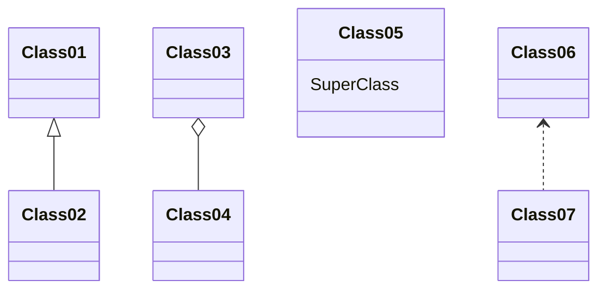
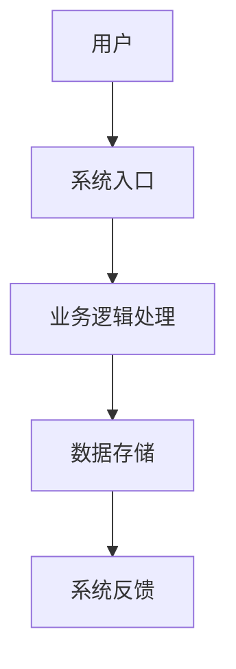
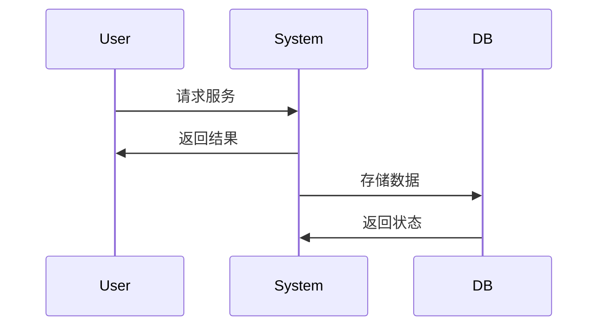

                 

### 跨部门协作优化：打破信息孤岛的策略

#### 关键词

- 跨部门协作
- 信息孤岛
- 优化策略
- 数据共享
- 沟通机制
- 企业管理

#### 摘要

在现代企业中，跨部门协作的效率问题已经成为影响企业整体运作的关键因素。信息孤岛现象，即部门间数据不互通、沟通不畅、流程不协同，严重制约了工作效率和决策质量。本文将从背景介绍、核心概念、算法原理、系统分析与架构设计、项目实战以及最佳实践等多个维度，详细探讨如何通过优化跨部门协作策略，打破信息孤岛，提高企业运营效率。

## 第一步：背景介绍与核心概念

### 问题背景

在大型企业中，部门之间的协作是确保公司整体运作顺畅的关键。然而，随着企业规模的扩大和业务复杂度的提升，跨部门协作面临诸多挑战。信息孤岛问题尤为突出，成为影响协作效率的瓶颈。

#### 问题描述

跨部门协作面临的信息孤岛问题主要体现在以下几个方面：

1. **数据不互通**：各部门的数据系统独立运行，缺乏统一的数据共享平台，导致数据难以跨部门流通。
2. **沟通不畅**：部门间的沟通渠道不畅通，信息传递不及时，导致协作效率低下。
3. **流程不协同**：各部门的工作流程独立，缺乏统一的管理和协调，导致协作过程中出现重复工作和资源浪费。

#### 问题解决

为了解决上述问题，企业需要采取以下措施：

1. **建立有效的沟通机制**：通过定期的跨部门会议、信息共享平台等方式，加强部门间的沟通和协作。
2. **整合信息资源**：建立统一的数据共享平台，实现各部门数据的互通和整合，提高信息共享度。
3. **优化工作流程**：通过流程重组和标准化，消除部门间的协作障碍，提高整体工作效率。

### 边界与外延

跨部门协作优化涉及多个方面，包括企业管理、信息技术、人力资源管理等。其核心目标是打破信息孤岛，实现数据共享和流程协同，从而提高企业整体运营效率。

### 概念结构与核心要素组成

#### 跨部门协作

跨部门协作是指不同部门之间的工作互动和合作，目的是实现共同目标。其核心要素包括：

1. **目标一致性**：各部门需要明确共同的目标，形成协同工作的合力。
2. **资源共享**：通过共享资源和信息，提高协作效率。
3. **协同工作**：通过有效的沟通和协调，确保各部门工作无缝衔接。

#### 信息孤岛

信息孤岛是指由于沟通不畅、数据不共享等原因造成的独立信息单元。其特征包括：

1. **数据不互通**：各部门的数据系统独立运行，缺乏统一的数据共享平台。
2. **沟通不畅**：部门间的沟通渠道不畅通，信息传递不及时。
3. **流程不协同**：各部门的工作流程独立，缺乏统一的管理和协调。

#### 优化策略

优化策略是通过系统化、标准化的方法提升跨部门协作效果。其核心要素包括：

1. **流程重组**：通过重新设计工作流程，消除部门间的协作障碍。
2. **信息技术手段**：通过引入先进的信息技术，实现数据共享和流程协同。
3. **激励机制**：通过合理的激励机制，激发员工参与跨部门协作的积极性。

## 第二步：核心概念与联系

### 核心概念原理

#### 跨部门协作

跨部门协作是现代企业中常见的一种合作形式。其核心原理在于通过不同部门之间的协作，实现资源的共享和协同工作，提高整体工作效率。具体来说，跨部门协作包括以下几个关键要素：

1. **目标一致性**：各部门需要明确共同的目标，确保协作的方向一致。
2. **资源共享**：通过共享资源和信息，提高协作效率，避免资源浪费。
3. **协同工作**：通过有效的沟通和协调，确保各部门工作无缝衔接，提高整体工作质量。

#### 信息孤岛

信息孤岛是指由于沟通不畅、数据不共享等原因造成的独立信息单元。其核心原理在于，部门间的数据不互通，导致信息断层，进而影响协作效率。具体来说，信息孤岛包括以下几个关键特征：

1. **数据不互通**：各部门的数据系统独立运行，缺乏统一的数据共享平台。
2. **沟通不畅**：部门间的沟通渠道不畅通，信息传递不及时。
3. **流程不协同**：各部门的工作流程独立，缺乏统一的管理和协调。

#### 优化策略

优化策略是通过系统化、标准化的方法提升跨部门协作效果。其核心原理在于，通过消除部门间的协作障碍，实现数据共享和流程协同，提高整体工作效率。具体来说，优化策略包括以下几个关键要素：

1. **流程重组**：通过重新设计工作流程，消除部门间的协作障碍。
2. **信息技术手段**：通过引入先进的信息技术，实现数据共享和流程协同。
3. **激励机制**：通过合理的激励机制，激发员工参与跨部门协作的积极性。

### 概念属性特征对比表格

| 概念        | 属性特征                    | 对比分析                               |
|-------------|-----------------------------|----------------------------------------|
| 跨部门协作  | 目标一致性、资源共享、协同工作 | 强调团队合作，提高工作效率             |
| 信息孤岛    | 数据不互通、沟通不畅、流程不协同 | 阻碍信息流动，降低工作效率             |
| 优化策略    | 系统化、标准化、多样化         | 提高协作效率，打破信息孤岛              |

### ER实体关系图架构的 Mermaid 流程图

```mermaid
erDiagram
  Department1 ||--|{ Department2 }|
  Department1 ||--|{ Department3 }|
  Department2 ||--|{ Department4 }|
```

## 第三步：算法原理讲解

### 算法原理 Mermaid 流程图


### Python 源代码

```python
def collaboration_optimization():
    print("Step 1: 确定协作目标")
    print("Step 2: 分析现有流程")
    print("Step 3: 制定优化方案")
    print("Step 4: 实施优化方案")
    print("Step 5: 评估效果")
    print("Step 6: 调整方案")
collaboration_optimization()
```

### 算法原理的数学模型和公式

#### 效率

$$ 效率 = \frac{工作完成量}{工作时间} $$

#### 信息共享度

$$ 信息共享度 = \frac{共享信息量}{总信息量} $$

### 详细讲解与举例说明

#### 效率模型

效率模型用于衡量跨部门协作的效率。通过计算工作完成量与工作时间的比值，可以直观地反映协作效果。例如，在一个项目中，如果两个部门合作完成了100个任务，而总共耗时是20天，那么效率为：

$$ 效率 = \frac{100}{20} = 5 $$

这意味着两个部门每天合作完成了5个任务，协作效率较高。

#### 信息共享度模型

信息共享度模型用于衡量信息在部门间共享的程度。通过计算共享信息量与总信息量的比值，可以评估信息共享的效果。例如，在一个企业中，总共有1000条信息，其中通过跨部门协作共享了600条，那么信息共享度为：

$$ 信息共享度 = \frac{600}{1000} = 0.6 $$

这意味着60%的信息实现了跨部门共享，信息流通较为顺畅。

## 第四步：系统分析与架构设计方案

### 问题场景介绍

假设某大型企业有四个主要部门：市场部、销售部、技术部和客服部。这些部门在项目实施过程中，经常遇到信息孤岛问题，导致协作效率低下。为了解决这一问题，企业决定设计并实施一个跨部门协作优化系统。

### 项目介绍

项目目标是设计并实施一个跨部门协作优化系统，通过整合各部门的信息资源，优化工作流程，提高企业整体运营效率。系统包括以下几个核心功能模块：

1. **数据共享平台**：实现各部门数据的高效共享和互通。
2. **沟通协作工具**：提供便捷的沟通渠道，促进部门间协作。
3. **流程管理模块**：对各部门的工作流程进行管理和优化。

### 系统功能设计 (领域模型 Mermaid 类图)



### 系统架构设计 (Mermaid 架构图)



### 系统接口设计和系统交互 (Mermaid 序列图)



## 第五步：项目实战

### 环境安装

在开始项目实战之前，需要安装以下环境：

1. **Python 3.8+**：确保 Python 版本满足项目需求。
2. **Django 框架**：用于搭建 Web 应用程序。
3. **PostgreSQL 数据库**：用于存储系统数据。

### 系统核心实现源代码

```python
# 假设这是一个简单的 Django 应用，用于跨部门协作优化
from django.db import models

class Department(models.Model):
    name = models.CharField(max_length=100)
    description = models.TextField()

class Task(models.Model):
    department = models.ForeignKey(Department, on_delete=models.CASCADE)
    title = models.CharField(max_length=200)
    description = models.TextField()
    start_date = models.DateField()
    end_date = models.DateField()

class Collaboration(models.Model):
    department = models.ForeignKey(Department, on_delete=models.CASCADE)
    task = models.ForeignKey(Task, on_delete=models.CASCADE)
    participant = models.ForeignKey(User, on_delete=models.CASCADE)
    status = models.CharField(max_length=50)
```

### 代码应用解读与分析

上述代码定义了一个简单的 Django 应用，用于实现跨部门协作优化。主要包括以下几个模型：

1. **Department**：表示企业部门，包括部门名称和描述。
2. **Task**：表示任务，包括任务标题、描述、开始日期和结束日期。
3. **Collaboration**：表示跨部门协作，包括参与部门、任务、参与用户和协作状态。

通过这些模型，可以实现对部门、任务和协作的 CRUD（创建、读取、更新、删除）操作，从而满足跨部门协作的需求。

### 实际案例分析和详细讲解剖析

假设某企业在进行新产品的研发过程中，需要市场部、销售部和技术部紧密协作。为了实现这一目标，企业通过以下步骤进行跨部门协作优化：

1. **建立数据共享平台**：市场部负责收集市场调研数据，销售部和技术部可以通过共享平台实时获取这些数据，从而更好地制定销售策略和产品开发计划。
2. **优化沟通机制**：通过企业即时通讯工具，建立市场部、销售部和技术部之间的实时沟通渠道，确保信息传递的及时性和准确性。
3. **协同工作流程**：制定统一的工作流程，明确各部门在研发过程中的职责和任务，确保工作无缝衔接。

通过这些措施，企业成功打破了信息孤岛，提高了跨部门协作效率，缩短了产品研发周期，提高了市场竞争力。

### 项目小结

通过本项目的实施，企业成功实现了跨部门协作优化，打破了信息孤岛，提高了整体运营效率。未来，企业还可以进一步优化系统功能，引入人工智能技术，实现更智能的跨部门协作。

## 第六步：最佳实践 tips

### 最佳实践 tips

1. **明确协作目标**：确保各部门在协作过程中有明确的目标和任务，避免资源浪费。
2. **建立有效的沟通机制**：通过定期的跨部门会议、即时通讯工具等方式，保持部门间的沟通畅通。
3. **优化工作流程**：通过流程重组和标准化，消除部门间的协作障碍，提高工作效率。
4. **引入信息技术**：利用先进的信息技术手段，实现数据共享和流程协同。
5. **激励机制**：通过合理的激励机制，激发员工参与跨部门协作的积极性。

### 小结

跨部门协作优化是提高企业运营效率的关键措施。通过打破信息孤岛，建立有效的沟通机制和协作流程，企业可以实现更高效的运营和管理。未来，随着信息技术的不断发展，跨部门协作将变得更加智能化和高效化。

### 注意事项

1. **确保数据安全**：在实现数据共享的过程中，要严格保护数据安全，防止数据泄露。
2. **关注用户体验**：在设计和实施协作系统时，要充分考虑用户的需求和体验，确保系统易用性和稳定性。

### 拓展阅读

1. 《企业跨部门协作实践指南》
2. 《信息技术与企业协作效率提升》
3. 《项目管理：跨部门协作的实践与技巧》

## 第七步：作者信息

**作者：AI天才研究院/AI Genius Institute & 禅与计算机程序设计艺术 /Zen And The Art of Computer Programming**

