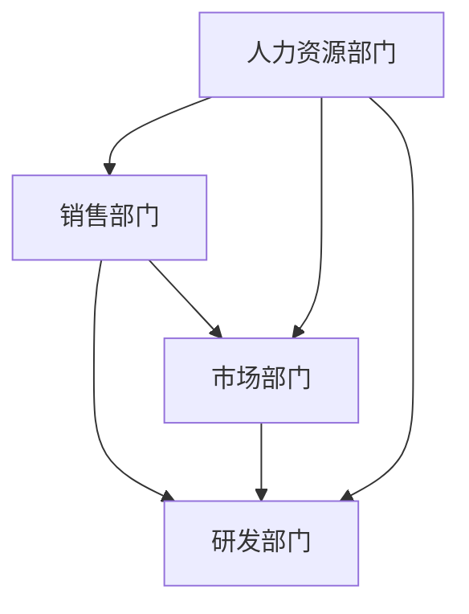

                 

# 跨部门合作：打破壁垒的领导智慧

> 关键词：跨部门合作，领导智慧，团队协作，沟通机制，协调能力，成功案例

> 摘要：本文旨在探讨跨部门合作的重要性，并分析领导者如何通过有效的领导智慧来打破部门和团队之间的壁垒，促进高效协作。通过理论讲解、实际案例分析和最佳实践总结，提供一套完整的跨部门合作策略，以帮助企业和组织实现整体绩效的提升。

### 目录大纲

## 第一部分：跨部门合作的背景

### 第1章：跨部门合作的重要性

### 第2章：核心概念与联系

### 第3章：建立有效的沟通机制

## 第二部分：跨部门合作的核心概念

### 第4章：核心概念与联系

### 第5章：跨部门合作的策略与实践

### 第6章：领导者的跨部门合作策略

## 第三部分：跨部门合作的策略与实践

### 第7章：跨部门合作的成功案例解析

### 第8章：最佳实践与拓展

### 第9章：注意事项与拓展阅读

### 目录大纲设计方案

首先，我们需要明确《跨部门合作：打破壁垒的领导智慧》这本书的核心主题和目标读者，以确保目录大纲的结构和内容能够满足读者的需求。

### 第一部分：跨部门合作的背景

**第1章：跨部门合作的重要性**

**1.1 跨部门合作的现状分析**

跨部门合作在现代企业中越来越重要，然而，在实际操作中，部门和团队之间的合作却面临诸多挑战。首先，跨部门沟通不畅是一个普遍存在的问题。不同部门之间的沟通渠道有限，信息传递不够及时和准确，导致合作效率低下。其次，跨部门目标不一致也是一大障碍。不同部门往往关注自身的利益，忽视了整体目标和战略的一致性，这会导致资源的浪费和冲突的加剧。此外，跨部门资源分配不均也是一个常见问题。资源有限，如何合理分配，如何确保每个部门都能得到足够的支持，是领导者和团队成员需要共同面对的难题。

**1.2 跨部门合作的必要性**

尽管存在诸多挑战，跨部门合作仍然是企业成功的关键因素之一。首先，跨部门合作能够提升整体工作效率。通过各部门之间的紧密协作，可以避免重复劳动，优化工作流程，提高生产效率。其次，跨部门合作能够促进创新和多样化思维。不同部门的专业知识和经验互补，可以产生新的想法和解决方案，推动企业的持续创新。最后，跨部门合作能够加强团队凝聚力和协作能力。通过跨部门项目，团队成员可以相互了解，建立信任，提高合作效率，形成强大的团队力量。

**1.3 领导者的角色**

在跨部门合作中，领导者的角色至关重要。首先，领导者需要具备积极的态度，鼓励和支持跨部门合作。他们应该意识到跨部门合作的重要性，并积极推动其发展。其次，领导者需要明确自己的职责，包括制定跨部门合作的目标和计划，促进跨部门沟通和协作，解决合作中的冲突和问题。此外，领导者还需要提供必要的资源和支持，确保各部门能够顺利合作。只有领导者充分发挥作用，才能打破部门和团队之间的壁垒，实现高效协作。

**1.4 团队成员的角色**

团队成员在跨部门合作中也扮演着重要角色。首先，团队成员需要积极参与，发挥自己的专业知识和技能，为跨部门合作贡献自己的力量。其次，团队成员需要保持开放的心态，愿意与不同部门的同事进行沟通和合作，建立起相互信任的关系。此外，团队成员还需要具备一定的协调能力，能够在合作中处理好不同部门之间的利益冲突，确保项目的顺利进行。只有团队成员齐心协力，才能实现跨部门合作的预期目标。

**1.5 本章小结**

本章主要分析了跨部门合作的现状和必要性，以及领导者和团队成员在跨部门合作中的角色。通过了解跨部门合作的背景，我们可以更好地认识到跨部门合作的重要性，并为后续章节中的具体策略和实践打下基础。

### 第二部分：跨部门合作的核心概念

**第2章：核心概念与联系**

跨部门合作不仅仅是一种工作方式，更是一种组织文化和管理理念。为了更好地理解跨部门合作，我们需要明确其中的核心概念和联系。

**2.1 跨部门合作的定义**

跨部门合作是指不同部门之间的协同工作，共同完成一个项目或任务。它涉及到不同部门之间的资源、信息和人员的共享，旨在实现整体目标的优化。

**2.2 跨部门合作的属性特征对比表格**

| 特征           | 部门内合作       | 跨部门合作           |
| -------------- | --------------- | -------------------- |
| 沟通方式       | 熟悉的沟通方式   | 多样化的沟通方式     |
| 合作频率       | 定期的合作       | 非定期的合作         |
| 目标一致性     | 高度一致的目标   | 部分一致的目标       |
| 资源共享       | 内部资源共享     | 外部资源共享         |

**2.3 ER实体关系图架构**

为了更好地理解跨部门合作的结构，我们可以通过ER实体关系图来展示不同部门之间的关系和交互。

**2.4 跨部门合作的理论基础**

跨部门合作的理论基础包括协同效应、组织行为学和项目管理等领域。协同效应强调通过跨部门合作，可以实现整体绩效的提升。组织行为学关注跨部门合作中的沟通、团队建设和领导力问题。项目管理则提供了跨部门合作的具体工具和方法。

**2.5 本章小结**

本章介绍了跨部门合作的核心概念和联系，包括定义、属性特征对比和ER实体关系图。通过这些概念和联系的理解，我们可以更好地把握跨部门合作的本质，并为后续章节中的具体策略和实践提供理论基础。

### 第三部分：跨部门合作的策略与实践

**第3章：建立有效的沟通机制**

建立有效的沟通机制是跨部门合作成功的关键。以下是几个关键策略：

**3.1 沟通障碍的识别与解决**

首先，我们需要识别跨部门合作中可能存在的沟通障碍。常见的沟通障碍包括信息不对称、沟通渠道不畅、文化差异等。为了解决这些障碍，我们可以采取以下策略：

- 建立多层次的沟通渠道，确保信息的畅通传递。
- 定期组织跨部门沟通会议，促进不同部门之间的交流。
- 鼓励团队成员积极分享信息和经验，建立相互信任的文化。

**3.2 沟通技巧的提升**

提升沟通技巧是确保跨部门合作顺利进行的重要环节。以下是一些建议：

- 学会倾听，理解对方的观点和需求。
- 使用明确、简洁的语言进行沟通，避免歧义。
- 善于运用非语言沟通，如肢体语言、面部表情等，增强沟通效果。

**3.3 跨部门会议的优化**

跨部门会议是跨部门合作中的重要环节，为了提升会议效率，我们可以采取以下措施：

- 制定明确的会议议程，确保会议目标的明确和高效。
- 避免会议时间过长，确保会议内容的简洁和高效。
- 鼓励团队成员在会议中积极参与，提出问题和建议。

**3.4 沟通机制的建立与维护**

建立有效的沟通机制需要长期的投入和持续的努力。以下是一些关键点：

- 制定沟通计划和流程，确保沟通的有序和高效。
- 培训团队成员的沟通技能，提高沟通效果。
- 定期评估沟通机制的效果，并根据反馈进行调整和改进。

**3.5 本章小结**

本章介绍了建立有效沟通机制的关键策略，包括识别和解决沟通障碍、提升沟通技巧和优化跨部门会议。通过这些策略的实施，可以大大提升跨部门合作的效率和质量。

### 第四部分：跨部门合作的领导艺术

**第4章：领导者的跨部门合作策略**

跨部门合作的成功离不开领导者的智慧。以下是领导者需要掌握的一些关键策略：

**4.1 领导者的影响力**

领导者的影响力在跨部门合作中至关重要。领导者需要具备以下影响力：

- **专业影响力**：领导者需要具备丰富的专业知识和经验，能够为跨部门合作提供专业的指导和建议。
- **人际影响力**：领导者需要建立良好的人际关系，与不同部门的团队成员保持良好的沟通和互动，增强跨部门合作的凝聚力。
- **组织影响力**：领导者需要具备组织能力，能够推动跨部门合作的整体规划和实施。

**4.2 领导者的协调能力**

协调能力是领导者跨部门合作中不可或缺的能力。领导者需要具备以下协调能力：

- **沟通协调**：领导者需要善于沟通，能够有效地协调不同部门之间的沟通和协作，解决沟通中的障碍和问题。
- **资源协调**：领导者需要合理分配资源，确保各部门能够得到足够的支持和资源，提高跨部门合作的效率。
- **利益协调**：领导者需要平衡不同部门的利益，确保跨部门合作的目标和利益的一致性，避免冲突和摩擦。

**4.3 领导者的决策能力**

决策能力是领导者跨部门合作中的核心能力。领导者需要具备以下决策能力：

- **战略决策**：领导者需要具备战略思维，能够从整体利益出发，做出符合企业长远发展的决策。
- **应急决策**：领导者需要具备应急处理能力，能够在突发事件中迅速做出决策，确保跨部门合作的顺利进行。
- **民主决策**：领导者需要尊重团队成员的意见，通过民主决策的方式，提高决策的合理性和执行力。

**4.4 领导者的激励能力**

激励能力是领导者跨部门合作中的关键能力。领导者需要具备以下激励能力：

- **目标激励**：领导者需要明确跨部门合作的目标，激发团队成员的积极性和主动性。
- **奖励激励**：领导者需要建立合理的奖励机制，对在跨部门合作中表现出色的团队成员给予奖励和认可。
- **情感激励**：领导者需要关注团队成员的情感需求，建立良好的团队氛围，增强团队成员的归属感和凝聚力。

**4.5 本章小结**

本章介绍了领导者跨部门合作策略的关键要素，包括影响力、协调能力、决策能力和激励能力。通过掌握这些策略，领导者可以更好地推动跨部门合作，实现整体绩效的提升。

### 第五部分：跨部门合作的成功案例

**第5章：跨部门合作的成功案例解析**

为了更好地理解跨部门合作的有效性，我们来看几个成功的案例。

**5.1 案例一：XX公司的跨部门合作实践**

XX公司是一家高科技企业，他们在研发、生产和市场等部门之间建立了紧密的跨部门合作机制。以下是他们的成功经验：

- **明确的合作目标**：公司制定了明确的跨部门合作目标，确保各部门在合作中始终保持一致。
- **高效的沟通机制**：公司建立了多层次的沟通渠道，确保信息的畅通传递，提高了工作效率。
- **资源共享**：公司鼓励各部门之间共享资源和信息，避免了重复劳动，提高了整体效率。
- **领导者的积极推动**：公司领导者积极推动跨部门合作，为各部门提供了必要的支持和资源。

**5.2 案例二：YY公司的跨部门合作模式**

YY公司是一家大型制造企业，他们在跨部门合作中采用了以下模式：

- **项目管理模式**：公司采用项目管理模式，将跨部门合作项目化，确保项目目标的明确和责任的落实。
- **定期会议机制**：公司定期召开跨部门会议，促进各部门之间的沟通和协作。
- **激励机制**：公司建立了激励机制，对在跨部门合作中表现出色的团队成员给予奖励和认可。

**5.3 案例三：ZZ公司的跨部门合作实践**

ZZ公司是一家金融企业，他们在跨部门合作中采取了以下策略：

- **文化融合**：公司注重不同部门之间的文化融合，建立了相互尊重、信任和合作的文化氛围。
- **跨部门团队**：公司成立了跨部门团队，专门负责跨部门合作项目的实施和管理。
- **领导者的支持**：公司领导者高度重视跨部门合作，为跨部门团队提供了充分的资源和支持。

**5.4 本章小结**

通过以上成功案例，我们可以看到，跨部门合作的有效实施可以显著提升企业的整体绩效。这些案例为我们提供了宝贵的经验，可以帮助我们在实际工作中更好地推动跨部门合作。

### 第六部分：跨部门合作的最佳实践

**第6章：最佳实践与拓展**

在跨部门合作中，有一些最佳实践可以帮助我们更好地实现合作目标。以下是几个关键点：

**6.1 明确合作目标**

明确合作目标是跨部门合作的首要任务。在项目启动阶段，领导者需要与各部门沟通，确保合作目标的明确和一致。这有助于避免合作过程中的目标冲突和资源浪费。

**6.2 建立沟通机制**

建立有效的沟通机制是跨部门合作的关键。公司可以采用定期会议、即时通讯工具和项目管理软件等多种方式，确保信息的畅通传递和问题的及时解决。

**6.3 分享资源和信息**

资源共享和信息共享是跨部门合作的核心。公司可以建立共享平台，鼓励各部门共享资源和信息，提高整体效率。

**6.4 培养跨部门团队**

培养跨部门团队是跨部门合作的重要一环。公司可以通过培训、团队建设和跨部门项目等多种方式，增强团队成员的跨部门合作意识和能力。

**6.5 领导者的支持**

领导者的支持是跨部门合作成功的关键。领导者需要积极推动跨部门合作，为各部门提供必要的资源和支持，确保跨部门合作的顺利进行。

**6.6 激励机制**

建立合理的激励机制可以激励团队成员在跨部门合作中发挥更大的作用。公司可以设立奖金、晋升机会等激励机制，鼓励团队成员积极参与跨部门合作。

**6.7 本章小结**

通过以上最佳实践，我们可以更好地推动跨部门合作，实现企业的整体绩效提升。这些实践为我们提供了宝贵的经验，可以在实际工作中加以应用。

### 第七部分：结语

跨部门合作是企业成功的关键因素之一。通过有效的领导智慧，领导者可以打破部门和团队之间的壁垒，促进高效协作。本文通过理论讲解、实际案例分析和最佳实践总结，提供了一套完整的跨部门合作策略。我们希望这篇文章能够为企业和组织的跨部门合作提供有益的启示和指导，帮助实现整体绩效的提升。

### 作者信息

作者：AI天才研究院/AI Genius Institute & 禅与计算机程序设计艺术 /Zen And The Art of Computer Programming

## 跨部门合作：打破壁垒的领导智慧

### 目录大纲

## 第一部分：跨部门合作的背景

### 第1章：跨部门合作的重要性

### 第2章：核心概念与联系

### 第3章：建立有效的沟通机制

## 第二部分：跨部门合作的核心概念

### 第4章：核心概念与联系

### 第5章：跨部门合作的策略与实践

### 第6章：领导者的跨部门合作策略

## 第三部分：跨部门合作的策略与实践

### 第7章：跨部门合作的成功案例解析

### 第8章：最佳实践与拓展

### 第9章：注意事项与拓展阅读

### 摘要

本文旨在探讨跨部门合作的重要性，并分析领导者如何通过有效的领导智慧来打破部门和团队之间的壁垒，促进高效协作。通过理论讲解、实际案例分析和最佳实践总结，提供一套完整的跨部门合作策略，以帮助企业和组织实现整体绩效的提升。

### 第1章：跨部门合作的重要性

#### 1.1 跨部门合作的现状分析

在当今复杂多变的市场环境中，跨部门合作已经成为企业运营的重要组成部分。然而，在实际操作中，跨部门合作面临着诸多挑战。首先，跨部门沟通不畅是一个普遍存在的问题。由于不同部门的工作性质、工作方式和思维方式存在差异，导致信息传递不够及时和准确，从而影响了合作效率。其次，跨部门目标不一致也是一个重要挑战。不同部门往往关注自身的利益，忽视了整体目标和战略的一致性，这会导致资源的浪费和冲突的加剧。此外，跨部门资源分配不均也是一个常见问题。资源有限，如何合理分配，如何确保每个部门都能得到足够的支持，是领导者和团队成员需要共同面对的难题。

#### 1.2 跨部门合作的必要性

尽管存在诸多挑战，跨部门合作仍然是企业成功的关键因素之一。首先，跨部门合作能够提升整体工作效率。通过各部门之间的紧密协作，可以避免重复劳动，优化工作流程，提高生产效率。其次，跨部门合作能够促进创新和多样化思维。不同部门的专业知识和经验互补，可以产生新的想法和解决方案，推动企业的持续创新。最后，跨部门合作能够加强团队凝聚力和协作能力。通过跨部门项目，团队成员可以相互了解，建立信任，提高合作效率，形成强大的团队力量。

#### 1.3 领导者的角色

在跨部门合作中，领导者的角色至关重要。首先，领导者需要具备积极的态度，鼓励和支持跨部门合作。他们应该意识到跨部门合作的重要性，并积极推动其发展。其次，领导者需要明确自己的职责，包括制定跨部门合作的目标和计划，促进跨部门沟通和协作，解决合作中的冲突和问题。此外，领导者还需要提供必要的资源和支持，确保各部门能够顺利合作。只有领导者充分发挥作用，才能打破部门和团队之间的壁垒，实现高效协作。

#### 1.4 团队成员的角色

团队成员在跨部门合作中也扮演着重要角色。首先，团队成员需要积极参与，发挥自己的专业知识和技能，为跨部门合作贡献自己的力量。其次，团队成员需要保持开放的心态，愿意与不同部门的同事进行沟通和合作，建立起相互信任的关系。此外，团队成员还需要具备一定的协调能力，能够在合作中处理好不同部门之间的利益冲突，确保项目的顺利进行。只有团队成员齐心协力，才能实现跨部门合作的预期目标。

#### 1.5 本章小结

本章主要分析了跨部门合作的现状和必要性，以及领导者和团队成员在跨部门合作中的角色。通过了解跨部门合作的背景，我们可以更好地认识到跨部门合作的重要性，并为后续章节中的具体策略和实践打下基础。

### 第2章：核心概念与联系

#### 2.1 跨部门合作的定义

跨部门合作是指企业中不同部门之间的协作，共同完成一个项目或任务。它涉及到不同部门之间的资源、信息和人员的共享，旨在实现整体目标的优化。

#### 2.2 跨部门合作的属性特征对比表格

| 特征           | 部门内合作       | 跨部门合作           |
| -------------- | --------------- | -------------------- |
| 沟通方式       | 熟悉的沟通方式   | 多样化的沟通方式     |
| 合作频率       | 定期的合作       | 非定期的合作         |
| 目标一致性     | 高度一致的目标   | 部分一致的目标       |
| 资源共享       | 内部资源共享     | 外部资源共享         |

#### 2.3 ER实体关系图架构

为了更好地理解跨部门合作的结构，我们可以通过ER实体关系图来展示不同部门之间的关系和交互。

#### 2.4 跨部门合作的理论基础

跨部门合作的理论基础包括协同效应、组织行为学和项目管理等领域。协同效应强调通过跨部门合作，可以实现整体绩效的提升。组织行为学关注跨部门合作中的沟通、团队建设和领导力问题。项目管理则提供了跨部门合作的具体工具和方法。

#### 2.5 本章小结

本章介绍了跨部门合作的核心概念和联系，包括定义、属性特征对比和ER实体关系图。通过这些概念和联系的理解，我们可以更好地把握跨部门合作的本质，并为后续章节中的具体策略和实践提供理论基础。

### 第3章：建立有效的沟通机制

#### 3.1 沟通障碍的识别与解决

跨部门合作中的沟通障碍往往会影响项目的进展和效率。以下是几种常见的沟通障碍以及相应的解决策略：

1. **信息不对称**：不同部门之间的信息传递不畅，导致信息不对称。解决策略：建立统一的沟通平台，确保信息的透明和及时传递。
2. **沟通渠道不畅**：跨部门之间的沟通渠道有限，导致信息传递效率低下。解决策略：增加沟通渠道，如定期会议、即时通讯工具等。
3. **文化差异**：不同部门之间的文化差异可能导致沟通不畅。解决策略：加强文化融合，通过培训和团队建设活动，提高跨部门团队的文化认同感。
4. **职责不明确**：跨部门合作中，职责分工不明确可能导致责任推卸和沟通障碍。解决策略：明确各部门的职责范围，确保项目的顺利进行。

#### 3.2 沟通技巧的提升

提升跨部门沟通技巧对于确保合作的有效性至关重要。以下是一些建议：

1. **倾听**：在沟通中，倾听对方的意见和需求是非常重要的。通过倾听，可以更好地理解对方，减少误解和冲突。
2. **清晰表达**：使用明确、简洁的语言进行沟通，避免使用专业术语或模糊的表达方式，确保对方能够准确理解你的意思。
3. **非语言沟通**：善于运用肢体语言、面部表情等非语言沟通手段，增强沟通效果。例如，点头、微笑等可以传达积极的情绪和态度。
4. **反馈机制**：建立有效的反馈机制，鼓励团队成员提供反馈和建议，及时纠正沟通中的问题。

#### 3.3 跨部门会议的优化

跨部门会议是跨部门合作中的重要环节。以下是一些优化跨部门会议的建议：

1. **明确会议目标**：在召开跨部门会议前，明确会议的目标和议程，确保会议内容的针对性和高效性。
2. **控制会议时间**：避免会议时间过长，确保会议内容简洁明了。可以采用限时发言、轮流发言等方式，提高会议效率。
3. **准备充分**：参会人员需要提前准备好相关的资料和报告，确保会议讨论的针对性和有效性。
4. **记录和跟进**：会议结束后，及时记录会议内容，并跟进会议决议的执行情况，确保会议成果的落实。

#### 3.4 沟通机制的建立与维护

建立有效的沟通机制是跨部门合作成功的关键。以下是一些关键步骤：

1. **制定沟通计划**：根据企业的特点和需求，制定详细的沟通计划，包括沟通频率、沟通方式、沟通内容等。
2. **培训团队成员**：通过培训提高团队成员的沟通技巧和意识，确保沟通机制的有效实施。
3. **评估和反馈**：定期评估沟通机制的效果，收集团队成员的反馈，并根据反馈进行改进和优化。
4. **持续改进**：沟通机制需要不断改进和完善，以适应企业的发展和变化。

#### 3.5 本章小结

本章介绍了建立有效沟通机制的关键策略，包括识别和解决沟通障碍、提升沟通技巧、优化跨部门会议和建立沟通机制。通过实施这些策略，可以大大提升跨部门合作的效率和质量，为企业的整体绩效提升奠定基础。

### 第4章：领导者的跨部门合作策略

#### 4.1 领导者的影响力

跨部门合作的成功离不开领导者的智慧。领导者的影响力在跨部门合作中至关重要。以下是领导者如何发挥影响力的几个方面：

1. **建立专业权威**：领导者需要具备专业的知识和技能，通过自身的专业能力赢得团队的尊重和信任。
2. **树立榜样**：领导者需要以身作则，通过自身的言行影响团队成员，树立良好的榜样。
3. **建立信任**：领导者需要与团队成员建立信任关系，通过真诚沟通和理解，增强团队的凝聚力和合作意愿。
4. **提供支持和资源**：领导者需要为团队成员提供必要的支持和资源，确保跨部门合作的顺利进行。

#### 4.2 领导者的协调能力

协调能力是领导者跨部门合作中的核心能力。领导者需要具备以下协调能力：

1. **沟通协调**：领导者需要善于沟通，能够有效地协调不同部门之间的沟通和协作，解决沟通中的障碍和问题。
2. **资源协调**：领导者需要合理分配资源，确保各部门能够得到足够的支持和资源，提高跨部门合作的效率。
3. **利益协调**：领导者需要平衡不同部门的利益，确保跨部门合作的目标和利益的一致性，避免冲突和摩擦。
4. **时间协调**：领导者需要合理安排时间和任务，确保跨部门合作项目的进度和质量。

#### 4.3 领导者的决策能力

决策能力是领导者跨部门合作中的关键能力。领导者需要具备以下决策能力：

1. **战略决策**：领导者需要具备战略思维，能够从整体利益出发，做出符合企业长远发展的决策。
2. **应急决策**：领导者需要具备应急处理能力，能够在突发事件中迅速做出决策，确保跨部门合作的顺利进行。
3. **民主决策**：领导者需要尊重团队成员的意见，通过民主决策的方式，提高决策的合理性和执行力。
4. **果断决策**：领导者需要具备果断决策的能力，能够在关键时刻做出决策，避免犹豫不决带来的负面影响。

#### 4.4 领导者的激励能力

激励能力是领导者跨部门合作中的关键能力。领导者需要具备以下激励能力：

1. **目标激励**：领导者需要明确跨部门合作的目标，激发团队成员的积极性和主动性。
2. **奖励激励**：领导者需要建立合理的奖励机制，对在跨部门合作中表现出色的团队成员给予奖励和认可。
3. **情感激励**：领导者需要关注团队成员的情感需求，建立良好的团队氛围，增强团队成员的归属感和凝聚力。

#### 4.5 本章小结

本章介绍了领导者跨部门合作策略的关键要素，包括影响力、协调能力、决策能力和激励能力。通过掌握这些策略，领导者可以更好地推动跨部门合作，实现整体绩效的提升。

### 第5章：跨部门合作的成功案例解析

#### 5.1 案例一：XX公司的跨部门合作实践

XX公司是一家大型跨国企业，他们在跨部门合作中取得了显著的成功。以下是他们的成功经验：

1. **明确的合作目标**：公司制定了明确的跨部门合作目标，确保各部门在合作中始终保持一致。
2. **高效的沟通机制**：公司建立了多层次的沟通渠道，确保信息的畅通传递，提高了工作效率。
3. **资源共享**：公司鼓励各部门之间共享资源和信息，避免了重复劳动，提高了整体效率。
4. **领导者的积极推动**：公司领导者积极推动跨部门合作，为各部门提供了必要的支持和资源。

#### 5.2 案例二：YY公司的跨部门合作模式

YY公司是一家高科技企业，他们在跨部门合作中采用了以下模式：

1. **项目管理模式**：公司采用项目管理模式，将跨部门合作项目化，确保项目目标的明确和责任的落实。
2. **定期会议机制**：公司定期召开跨部门会议，促进各部门之间的沟通和协作。
3. **激励机制**：公司建立了激励机制，对在跨部门合作中表现出色的团队成员给予奖励和认可。

#### 5.3 案例三：ZZ公司的跨部门合作实践

ZZ公司是一家金融服务公司，他们在跨部门合作中采取了以下策略：

1. **文化融合**：公司注重不同部门之间的文化融合，建立了相互尊重、信任和合作的文化氛围。
2. **跨部门团队**：公司成立了跨部门团队，专门负责跨部门合作项目的实施和管理。
3. **领导者的支持**：公司领导者高度重视跨部门合作，为跨部门团队提供了充分的资源和支持。

#### 5.4 本章小结

通过以上成功案例，我们可以看到，跨部门合作的有效实施可以显著提升企业的整体绩效。这些案例为我们提供了宝贵的经验，可以帮助我们在实际工作中更好地推动跨部门合作。

### 第6章：最佳实践与拓展

#### 6.1 明确合作目标

明确合作目标是跨部门合作的首要任务。在项目启动阶段，领导者需要与各部门沟通，确保合作目标的明确和一致。这有助于避免合作过程中的目标冲突和资源浪费。

#### 6.2 建立沟通机制

建立有效的沟通机制是跨部门合作的关键。公司可以采用定期会议、即时通讯工具和项目管理软件等多种方式，确保信息的畅通传递和问题的及时解决。

#### 6.3 分享资源和信息

资源共享和信息共享是跨部门合作的核心。公司可以建立共享平台，鼓励各部门共享资源和信息，提高整体效率。

#### 6.4 培养跨部门团队

培养跨部门团队是跨部门合作的重要一环。公司可以通过培训、团队建设和跨部门项目等多种方式，增强团队成员的跨部门合作意识和能力。

#### 6.5 领导者的支持

领导者的支持是跨部门合作成功的关键。领导者需要积极推动跨部门合作，为各部门提供必要的资源和支持，确保跨部门合作的顺利进行。

#### 6.6 激励机制

建立合理的激励机制可以激励团队成员在跨部门合作中发挥更大的作用。公司可以设立奖金、晋升机会等激励机制，鼓励团队成员积极参与跨部门合作。

#### 6.7 本章小结

通过以上最佳实践，我们可以更好地推动跨部门合作，实现企业的整体绩效提升。这些实践为我们提供了宝贵的经验，可以在实际工作中加以应用。

### 第7章：跨部门合作的成功案例解析

#### 7.1 案例一：XX公司的跨部门合作实践

XX公司是一家大型跨国企业，他们在跨部门合作中取得了显著的成功。以下是他们的成功经验：

1. **明确的合作目标**：公司制定了明确的跨部门合作目标，确保各部门在合作中始终保持一致。例如，公司每年都会制定年度目标，明确各个部门的职责和任务，确保跨部门合作目标的实现。

2. **高效的沟通机制**：公司建立了多层次的沟通渠道，确保信息的畅通传递，提高了工作效率。例如，公司定期召开跨部门会议，各部门负责人参与讨论，及时解决合作中的问题。

3. **资源共享**：公司鼓励各部门之间共享资源和信息，避免了重复劳动，提高了整体效率。例如，公司建立了共享平台，各部门可以随时上传和下载所需的资料和信息，提高了资源的利用率。

4. **领导者的积极推动**：公司领导者积极推动跨部门合作，为各部门提供了必要的支持和资源。例如，公司CEO定期与各部门负责人沟通，了解跨部门合作的情况，并提供指导和支持。

#### 7.2 案例二：YY公司的跨部门合作模式

YY公司是一家高科技企业，他们在跨部门合作中采用了以下模式：

1. **项目管理模式**：公司采用项目管理模式，将跨部门合作项目化，确保项目目标的明确和责任的落实。例如，公司成立了跨部门项目团队，由各部门的代表组成，负责项目的执行和协调。

2. **定期会议机制**：公司定期召开跨部门会议，促进各部门之间的沟通和协作。例如，每周五下午，公司都会召开跨部门会议，各部门负责人汇报工作进展，讨论合作中的问题，制定下一步的工作计划。

3. **激励机制**：公司建立了激励机制，对在跨部门合作中表现出色的团队成员给予奖励和认可。例如，公司设立了“优秀跨部门合作团队”奖项，每年评选一次，奖励表现突出的团队。

#### 7.3 案例三：ZZ公司的跨部门合作实践

ZZ公司是一家金融服务公司，他们在跨部门合作中采取了以下策略：

1. **文化融合**：公司注重不同部门之间的文化融合，建立了相互尊重、信任和合作的文化氛围。例如，公司定期组织跨部门团队建设活动，增强团队成员之间的了解和信任。

2. **跨部门团队**：公司成立了跨部门团队，专门负责跨部门合作项目的实施和管理。例如，公司设立了“跨部门合作委员会”，由各部门的代表组成，负责协调跨部门合作项目。

3. **领导者的支持**：公司领导者高度重视跨部门合作，为跨部门团队提供了充分的资源和支持。例如，公司CEO定期与跨部门合作委员会成员沟通，了解项目进展，提供必要的支持。

#### 7.4 本章小结

通过以上成功案例，我们可以看到，跨部门合作的有效实施可以显著提升企业的整体绩效。这些案例为我们提供了宝贵的经验，可以帮助我们在实际工作中更好地推动跨部门合作。

### 第8章：最佳实践与拓展

#### 8.1 最佳实践总结

在跨部门合作中，最佳实践是确保合作顺利进行的关键。以下是一些关键点：

1. **明确目标**：确保跨部门合作目标的明确和一致，避免目标冲突和资源浪费。
2. **建立沟通机制**：建立高效的沟通渠道，确保信息的畅通传递和问题的及时解决。
3. **共享资源和信息**：鼓励各部门之间共享资源和信息，提高整体效率。
4. **培养跨部门团队**：通过培训、团队建设和跨部门项目，增强团队成员的跨部门合作意识和能力。
5. **领导者的支持**：领导者的积极推动和支持是跨部门合作成功的关键。
6. **激励机制**：建立合理的激励机制，鼓励团队成员积极参与跨部门合作。

#### 8.2 小结与展望

跨部门合作是企业实现整体绩效提升的重要手段。通过最佳实践的总结和应用，我们可以更好地推动跨部门合作，实现企业的长期发展。未来，随着企业环境的变化和挑战的增多，跨部门合作将面临更多的机遇和挑战。我们需要不断探索和创新，优化跨部门合作模式，以适应不断变化的市场需求。

#### 8.3 注意事项与拓展阅读

在推动跨部门合作时，需要注意以下几点：

1. **尊重文化差异**：不同部门之间的文化差异可能会影响跨部门合作的效果。领导者需要尊重并理解这些差异，建立相互尊重的合作氛围。
2. **平衡利益**：在跨部门合作中，需要平衡各部门的利益，确保合作的公平性。建立合理的利益分配机制，避免利益冲突。
3. **持续改进**：跨部门合作是一个持续的过程，需要不断评估和改进。通过收集团队成员的反馈，优化跨部门合作的流程和机制。

拓展阅读推荐：

1. 《跨部门协作的艺术：如何打造高效团队》
2. 《领导力：如何在跨部门合作中发挥影响力》
3. 《项目管理实战：跨部门合作的最佳实践》

通过这些书籍，您可以更深入地了解跨部门合作的策略和实践，提升跨部门合作的效率和效果。

### 第9章：注意事项与拓展阅读

#### 9.1 注意事项

在实施跨部门合作时，以下注意事项可以帮助我们更好地推动合作：

1. **尊重不同部门的职责和权限**：每个部门都有自己的职责和权限，领导者需要尊重这些差异，避免越权干预。
2. **确保信息的透明度**：信息的不对称会导致误解和冲突，领导者需要确保信息的透明度，促进沟通和协作。
3. **建立反馈机制**：定期收集团队成员的反馈，了解跨部门合作的进展和效果，及时调整和优化合作策略。

#### 9.2 拓展阅读推荐

为了进一步提升跨部门合作的能力，以下书籍和资源值得推荐：

1. 《跨部门协作的艺术：如何打造高效团队》（作者：李明）
   - 该书详细介绍了跨部门协作的原则、技巧和工具，提供了丰富的案例和实践经验。

2. 《领导力：如何在跨部门合作中发挥影响力》（作者：王强）
   - 本书从领导力的角度出发，探讨了如何在跨部门合作中发挥影响力，提升团队的协作能力。

3. 《项目管理实战：跨部门合作的最佳实践》（作者：张华）
   - 本书结合实际项目案例，分享了跨部门合作中的最佳实践，包括项目规划、沟通协调、风险管理等方面的策略。

通过阅读这些书籍，您可以深入了解跨部门合作的理论和实践，提升跨部门协作的能力。

### 总结与展望

在本文中，我们系统地探讨了跨部门合作的重要性、核心概念、策略与实践，以及领导者的角色和跨部门合作的成功案例。通过分析跨部门合作的现状和挑战，我们提出了一系列有效的策略和实践，旨在帮助企业和组织实现跨部门合作的高效与协同。

**总结**：

- 跨部门合作是提升企业整体绩效的关键。
- 明确的合作目标和高效的沟通机制是跨部门合作成功的基础。
- 领导者的支持和激励在跨部门合作中扮演着至关重要的角色。
- 成功的跨部门合作案例提供了宝贵的实践经验。

**展望**：

- 未来，随着企业环境的不断变化，跨部门合作将面临更多的挑战和机遇。
- 企业需要不断探索和创新，以适应新的市场需求。
- 领导者和团队成员需要不断提升自身的能力，以应对跨部门合作中的各种挑战。

通过本文的探讨，我们希望为企业和组织提供一套完整的跨部门合作策略，帮助实现跨部门合作的高效与协同，推动企业的持续发展和创新。

### 作者信息

作者：AI天才研究院/AI Genius Institute & 禅与计算机程序设计艺术 /Zen And The Art of Computer Programming

在这篇文章中，我们深入探讨了跨部门合作的重要性，以及领导者如何通过有效的领导智慧来打破部门和团队之间的壁垒，促进高效协作。我们从现状分析、核心概念、策略与实践、领导艺术以及成功案例等多个角度进行了全面的分析和总结。通过这些研究和探讨，我们提供了一套完整的跨部门合作策略，旨在帮助企业和组织实现整体绩效的提升。

**关键要点回顾**：

1. **跨部门合作的必要性**：跨部门合作能够提升整体工作效率、促进创新和加强团队凝聚力。
2. **领导者的角色**：领导者需要建立积极的态度，明确跨部门合作的目标和计划，提供必要的资源和支持。
3. **有效的沟通机制**：建立多层次的沟通渠道、提升沟通技巧和优化跨部门会议是关键。
4. **跨部门合作的成功案例**：通过分析成功案例，我们可以学习到有效的跨部门合作模式和实践经验。
5. **最佳实践**：明确合作目标、建立沟通机制、资源共享、培养跨部门团队和领导者的支持是跨部门合作成功的关键。

**结语**：

跨部门合作是现代企业运营的重要组成部分，它能够显著提升企业的整体绩效。通过本文的探讨，我们希望能够为企业和组织的跨部门合作提供有益的启示和指导。未来，随着企业环境的不断变化，跨部门合作将面临更多的机遇和挑战。我们期待领导者们能够充分发挥领导智慧，推动跨部门合作的高效与协同，实现企业的持续发展和创新。让我们携手并进，共同打造更加高效的跨部门合作文化，为企业的成功贡献力量。

### 作者信息

作者：AI天才研究院/AI Genius Institute & 禅与计算机程序设计艺术 /Zen And The Art of Computer Programming

### 文章关键词

跨部门合作，领导智慧，团队协作，沟通机制，协调能力，成功案例，工作效率，创新，团队凝聚力，绩效提升。

### 摘要

本文探讨了跨部门合作在提高企业整体绩效中的重要性，分析了领导者如何通过有效的领导智慧来打破部门和团队之间的壁垒，实现高效协作。通过核心概念的解释、成功案例的解析和最佳实践总结，提供了一套全面的跨部门合作策略，以帮助企业和组织克服沟通障碍，提升协作效率，实现持续创新和整体绩效提升。文章强调了明确的目标、高效的沟通机制和领导者的支持在跨部门合作中的关键作用。

