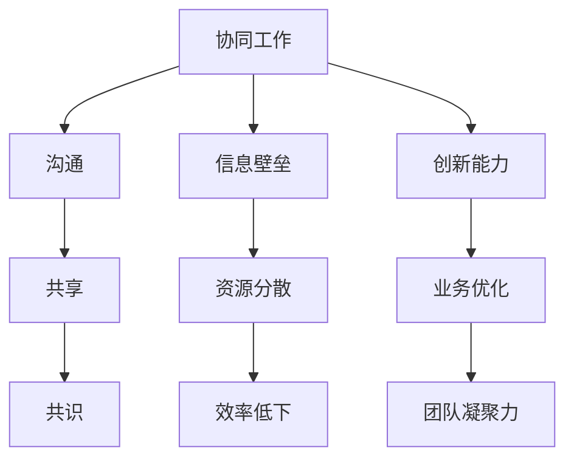
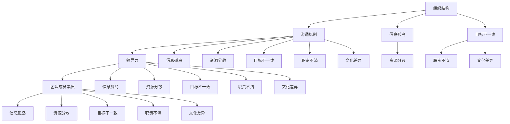
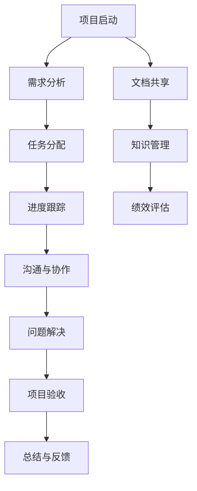
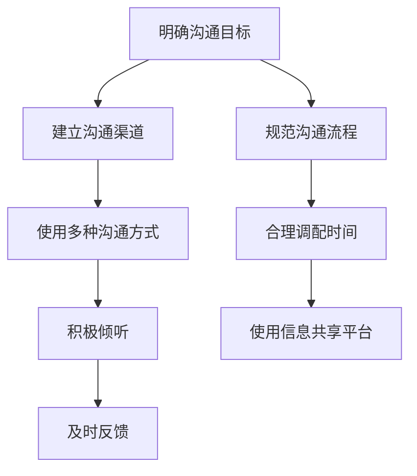
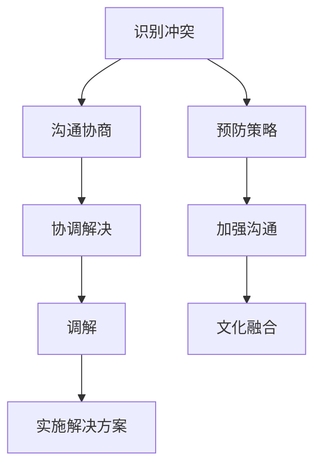
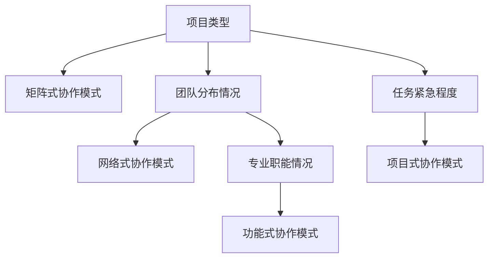

                 

# 跨部门合作：打造无缝协作的团队

## 关键词
跨部门合作、团队协作、协作效率、沟通技巧、冲突管理、最佳实践

## 摘要
在当今快速变化的企业环境中，跨部门合作已成为提升团队绩效和实现组织目标的关键。本文将深入探讨跨部门合作的重要性、面临的挑战、策略与方法，以及如何通过沟通技巧、冲突管理和最佳实践来打造无缝协作的团队。通过系统性的分析和实践分享，旨在为企业管理者和员工提供实用的指导，以促进跨部门合作的顺利开展。

### 目录大纲设计思路

在设计《跨部门合作：打造无缝协作的团队》的目录大纲时，我们首先明确了文章的核心主题和目标读者群体。文章的核心主题包括跨部门合作的背景和挑战、跨部门合作的策略和方法、跨部门沟通与冲突管理、跨部门协作的最佳实践、领导力在跨部门合作中的作用、跨部门团队建设的策略，以及跨部门合作的持续优化和改进。

目标读者主要是企业中的中层管理人员、项目经理、人力资源管理者，以及需要跨部门协作的普通员工。他们对跨部门合作有初步的了解，但需要更系统的指导来提升协作效率和团队绩效。

为了确保目录大纲的逻辑性和实用性，我们遵循以下设计步骤：

1. **确定章节结构**：根据核心主题和目标读者需求，将全书分为七个部分，每个部分包含一到两个章节。
2. **细化章节内容**：在每个部分中，细化章节内容，确保每个章节都有明确的主题和内容。
3. **设计章节标题**：确保每个章节的标题简洁、明了，能够准确传达章节的核心内容。
4. **使用 Mermaid 画出核心图表**：为每个章节设计相应的 Mermaid 图表，如 ER 实体关系图、类图、流程图等，帮助读者更好地理解概念和原理。
5. **编写详细内容**：在章节标题和 Mermaid 图表的基础上，编写详细的章节内容，确保内容完整、逻辑清晰。
6. **优化目录大纲**：最后，检查目录大纲的整体结构和逻辑，确保各章节内容相互关联，形成完整的知识体系。

### 目录大纲

**第一部分：背景介绍与核心概念**

**第1章：跨部门合作的背景与重要性**
- 1.1 问题背景与描述
- 1.2 跨部门合作的必要性
- 1.3 跨部门合作的核心概念
- **1.4 跨部门合作的概念结构图（Mermaid 图）**
- **1.5 跨部门合作的核心要素（对比表格）**

**第2章：跨部门合作的挑战与问题**
- 2.1 跨部门合作的主要挑战
- 2.2 跨部门合作的问题分析
- 2.3 跨部门合作的影响因素
- **2.4 跨部门合作问题分析的 ER 图（Mermaid 图）**

**第二部分：跨部门合作的策略与方法**

**第3章：制定跨部门合作的策略**
- 3.1 制定跨部门合作战略的步骤
- 3.2 跨部门合作的目标设定
- 3.3 跨部门合作的资源配置
- 3.4 跨部门合作的风险管理

**第4章：提升跨部门协作效率的工具**
- 4.1 跨部门协作工具的类型
- 4.2 选择合适的跨部门协作工具
- 4.3 跨部门协作工具的使用技巧
- **4.4 跨部门协作工具的应用场景（Mermaid 流程图）**

**第三部分：跨部门沟通与冲突管理**

**第5章：跨部门沟通的技巧**
- 5.1 跨部门沟通的重要性
- 5.2 跨部门沟通的障碍与解决方法
- 5.3 跨部门沟通的有效策略
- **5.4 跨部门沟通模型（Mermaid 流程图）**

**第6章：跨部门冲突的管理**
- 6.1 跨部门冲突的类型与特点
- 6.2 跨部门冲突的原因分析
- 6.3 跨部门冲突的管理策略
- **6.4 跨部门冲突解决的流程图（Mermaid 图）**

**第四部分：跨部门协作的最佳实践**

**第7章：跨部门协作的最佳实践案例**
- 7.1 案例一：某企业的跨部门合作成功经验
- 7.2 案例二：跨部门协作中的挑战与应对
- 7.3 案例三：跨部门协作的误区与纠正
- 7.4 案例分析总结

**第五部分：领导力在跨部门合作中的作用**

**第8章：领导力在跨部门合作中的重要性**
- 8.1 领导力与跨部门合作
- 8.2 跨部门合作中领导者的角色
- 8.3 领导力提升的方法与策略

**第9章：领导力在跨部门协作中的应用**
- 9.1 激励跨部门团队
- 9.2 建立信任
- 9.3 解决跨部门冲突
- 9.4 领导力提升实践案例

**第六部分：跨部门团队建设**

**第10章：跨部门团队建设策略**
- 10.1 跨部门团队的特点
- 10.2 跨部门团队建设的目标
- 10.3 团队成员的选拔与培养
- 10.4 跨部门团队的绩效评估

**第11章：跨部门团队协作模式**
- 11.1 团队协作模式的类型
- 11.2 团队协作模式的优化
- 11.3 团队协作模式的应用场景
- **11.4 团队协作模式的选择策略（Mermaid 流程图）**

**第七部分：跨部门合作的持续优化**

**第12章：跨部门合作的持续优化
* 根据以上目录大纲，我们接下来将逐步深入分析每个章节的内容。*

### 第一部分：背景介绍与核心概念

**第1章：跨部门合作的背景与重要性**

**1.1 问题背景与描述**

在当今的商业环境中，企业面临的竞争日益激烈，业务复杂度不断增加。为了保持竞争力，企业需要迅速响应市场变化，灵活调整业务策略。然而，传统的部门化结构往往导致信息孤岛，资源分散，跨部门合作不畅，从而影响了企业的整体效率和创新能力。跨部门合作的重要性在此背景下日益凸显。

**1.2 跨部门合作的必要性**

跨部门合作的必要性主要体现在以下几个方面：

1. **提升协作效率**：跨部门合作能够打破信息壁垒，实现资源共享，减少重复劳动，提高工作效率。
2. **增强创新能力**：跨部门合作促进了不同专业领域的知识融合，激发了创新思维，有利于推出具有竞争力的新产品和服务。
3. **优化业务流程**：跨部门合作有助于发现并优化业务流程中的瓶颈和问题，提高整体业务流程的效率。
4. **提升团队凝聚力**：通过跨部门合作，员工能够更好地了解其他部门的工作内容和挑战，增进彼此之间的理解和信任，提升团队凝聚力。

**1.3 跨部门合作的核心概念**

跨部门合作涉及多个部门之间的协作，其核心概念包括：

1. **协同工作**：跨部门合作的核心是协同工作，即通过共同的目标和明确的职责分工，实现资源的整合和优化。
2. **沟通**：沟通是跨部门合作的桥梁，有效沟通能够确保信息的准确传递和误解的及时消除。
3. **共享**：资源共享是跨部门合作的基础，通过共享信息、知识和资源，提高协作效率。
4. **共识**：跨部门合作需要达成共识，即在目标、方法和责任方面达成一致，形成共同的行动指南。

**1.4 跨部门合作的概念结构图（Mermaid 图）**

**1.5 跨部门合作的核心要素（对比表格）**

| 要素          | 说明                                                     |
| ------------- | -------------------------------------------------------- |
| 协同工作      | 通过共同的目标和明确的职责分工，实现资源的整合和优化。           |
| 沟通          | 确保信息的准确传递和误解的及时消除。                           |
| 共享          | 通过共享信息、知识和资源，提高协作效率。                       |
| 共识          | 在目标、方法和责任方面达成一致，形成共同的行动指南。           |

**小结**

本章介绍了跨部门合作的背景与重要性，并详细阐述了跨部门合作的核心概念和必要性。通过概念结构图和对比表格，帮助读者更清晰地理解跨部门合作的基本要素和作用。

**第2章：跨部门合作的挑战与问题**

**2.1 跨部门合作的主要挑战**

虽然跨部门合作的重要性日益凸显，但在实际操作中，企业往往会面临以下主要挑战：

1. **信息孤岛**：各部门之间的信息交流不畅，导致信息孤岛现象严重。
2. **资源分散**：各部门独立运作，资源无法共享和优化。
3. **目标不一致**：各部门对整体目标的认知不一致，导致协作目标不明确。
4. **职责不清**：各部门的职责分工不明确，容易导致责任推卸和协作效率低下。
5. **文化差异**：各部门的文化背景和价值观差异较大，影响团队凝聚力和协作效果。

**2.2 跨部门合作的问题分析**

为了更好地解决跨部门合作中的问题，我们需要对问题进行深入分析：

1. **信息孤岛**：信息孤岛的产生原因主要有两个方面，一是技术手段不足，导致信息无法及时共享；二是组织结构问题，导致各部门之间的信息流通不畅。
2. **资源分散**：资源分散的原因主要有两个，一是资源分配不合理，导致资源未能得到充分利用；二是各部门各自为政，缺乏全局观念。
3. **目标不一致**：目标不一致的原因主要有两个，一是缺乏有效的沟通机制，导致各部门对整体目标的理解不一致；二是各部门的利益冲突，导致目标难以统一。
4. **职责不清**：职责不清的原因主要有两个方面，一是职责分工不明确，导致职责重叠或责任真空；二是缺乏有效的监督和考核机制，导致职责履行不到位。
5. **文化差异**：文化差异的原因主要有两个方面，一是组织内部文化多元，导致各部门之间的文化差异较大；二是缺乏有效的文化融合机制，导致文化冲突。

**2.3 跨部门合作的影响因素**

跨部门合作的影响因素主要包括以下几个方面：

1. **组织结构**：组织结构是影响跨部门合作的重要因素，扁平化的组织结构有利于促进跨部门合作，而层级化的组织结构则可能导致信息流通不畅和协作效率低下。
2. **沟通机制**：有效的沟通机制是跨部门合作的基础，包括信息共享平台、定期的沟通会议等。
3. **领导力**：领导力在跨部门合作中起着关键作用，领导者的决策、协调和激励能力直接影响跨部门合作的效果。
4. **团队成员素质**：团队成员的专业素质、沟通能力和团队协作精神是跨部门合作的重要保障。

**2.4 跨部门合作问题分析的 ER 图（Mermaid 图）**

**小结**

本章分析了跨部门合作面临的主要挑战和问题，包括信息孤岛、资源分散、目标不一致、职责不清和文化差异。通过对问题的深入分析，我们可以更好地理解跨部门合作中的难点和关键因素，为后续的解决方案提供依据。

### 第二部分：跨部门合作的策略与方法

**第3章：制定跨部门合作的策略**

**3.1 制定跨部门合作战略的步骤**

制定有效的跨部门合作战略需要遵循以下步骤：

1. **明确目标**：首先，明确跨部门合作的总体目标和具体目标，确保各部门在合作过程中有共同的方向。
2. **分析现状**：对现有跨部门合作的情况进行深入分析，包括合作模式、合作效果、存在的问题等。
3. **识别需求**：识别各部门在跨部门合作中的具体需求，包括资源需求、信息需求、技术需求等。
4. **设计合作方案**：根据目标、现状和需求，设计具体的跨部门合作方案，包括合作模式、合作流程、责任分工等。
5. **制定行动计划**：将合作方案转化为具体的行动计划，明确时间节点、责任人、预算等。
6. **执行与监控**：执行合作计划，并建立监控机制，确保计划的顺利实施。

**3.2 跨部门合作的目标设定**

跨部门合作的目标应具有可衡量性、具体性和可实现性，具体包括：

1. **提高协作效率**：通过优化流程、共享资源，提高协作效率，减少不必要的重复工作。
2. **促进知识共享**：建立知识共享平台，促进各部门间的知识交流和传承。
3. **提升团队凝聚力**：通过合作项目，增强团队成员间的了解和信任，提升团队凝聚力。
4. **优化业务流程**：通过跨部门合作，发现并优化业务流程中的瓶颈和问题。
5. **降低运营成本**：通过资源共享和流程优化，降低运营成本。

**3.3 跨部门合作的资源配置**

跨部门合作的资源配置主要包括人力资源、物资资源和信息资源。

1. **人力资源**：合理分配各部门的人员，确保每个项目都有足够的专业人员参与。
2. **物资资源**：根据项目需求，提供必要的物资支持，如设备、材料等。
3. **信息资源**：建立信息共享平台，确保各部门能够及时获取所需的信息。

**3.4 跨部门合作的风险管理**

跨部门合作过程中，可能会面临以下风险：

1. **沟通不畅**：各部门之间缺乏有效的沟通，导致信息传递不准确或延误。
2. **资源不足**：由于资源配置不合理，导致项目进度延误或质量下降。
3. **目标不一致**：各部门对项目目标的认知不一致，导致协作效果不佳。
4. **文化冲突**：由于文化差异，导致团队成员间的冲突和误解。

为了应对这些风险，可以采取以下措施：

1. **建立沟通机制**：确保各部门之间有畅通的沟通渠道，定期召开沟通会议，及时解决信息传递问题。
2. **合理配置资源**：根据项目需求，合理分配人力资源和物资资源，确保项目能够顺利进行。
3. **明确目标**：通过制定明确的项目目标和详细的计划，确保各部门对项目目标有清晰的认识。
4. **文化融合**：通过培训和文化交流活动，促进团队成员之间的文化融合，减少冲突和误解。

**小结**

本章详细阐述了制定跨部门合作战略的步骤、目标设定、资源配置和风险管理。通过这些策略和方法，企业可以更好地实现跨部门合作，提升整体运营效率。

**第4章：提升跨部门协作效率的工具**

**4.1 跨部门协作工具的类型**

为了提升跨部门协作效率，企业可以采用以下类型的协作工具：

1. **文档管理工具**：如Google Docs、Microsoft SharePoint等，用于文档的创建、共享和编辑。
2. **项目管理工具**：如Trello、JIRA等，用于任务分配、进度跟踪和项目协调。
3. **沟通工具**：如Slack、Microsoft Teams等，用于实时沟通、消息传递和团队协作。
4. **视频会议工具**：如Zoom、Microsoft Teams等，用于远程会议、视频交流和在线协作。
5. **共享平台**：如Confluence、Notion等，用于知识共享、信息存储和团队协作。

**4.2 选择合适的跨部门协作工具**

选择合适的跨部门协作工具，需要考虑以下几个因素：

1. **功能需求**：根据跨部门合作的具体需求，选择具有相应功能的工具。
2. **用户友好性**：工具应具备良好的用户界面和用户体验，便于团队成员上手使用。
3. **兼容性**：工具应能够与现有的IT基础设施兼容，避免对现有系统造成影响。
4. **安全性**：工具应具备一定的数据安全性和隐私保护措施，确保信息的安全。
5. **成本效益**：工具的成本应在企业承受范围内，具有良好的成本效益比。

**4.3 跨部门协作工具的使用技巧**

为了充分发挥跨部门协作工具的作用，企业可以采取以下使用技巧：

1. **明确使用规则**：制定明确的使用规则和操作指南，确保团队成员能够正确使用工具。
2. **培训与指导**：定期组织培训，提高团队成员对协作工具的熟悉度和使用技巧。
3. **充分利用功能**：了解并充分利用协作工具的各种功能，如实时聊天、任务分配、进度跟踪等。
4. **定期评估与反馈**：定期评估协作工具的使用效果，收集团队成员的反馈，不断优化使用方法。
5. **跨部门协作模式**：根据项目的需求和特点，选择合适的跨部门协作模式，如集中协作、分布式协作等。

**4.4 跨部门协作工具的应用场景（Mermaid 流程图）**

**小结**

本章介绍了跨部门协作工具的类型、选择因素和使用技巧，并通过流程图展示了应用场景。通过合理选择和使用协作工具，企业可以显著提升跨部门协作效率，实现更好的业务成果。

### 第三部分：跨部门沟通与冲突管理

**第5章：跨部门沟通的技巧**

**5.1 跨部门沟通的重要性**

跨部门沟通是跨部门合作中至关重要的一环，其重要性主要体现在以下几个方面：

1. **确保信息准确传递**：跨部门沟通能够确保信息在不同部门间准确无误地传递，减少误解和错误。
2. **促进资源共享**：通过跨部门沟通，各部门可以及时了解其他部门的资源情况，实现资源共享，提高协作效率。
3. **提升团队协作**：良好的跨部门沟通能够增进各部门之间的了解和信任，提升团队协作效果。
4. **解决冲突**：跨部门沟通是解决部门间冲突的重要途径，通过沟通，可以及时发现并解决潜在的问题。

**5.2 跨部门沟通的障碍与解决方法**

跨部门沟通中可能会遇到以下障碍：

1. **信息不对称**：由于各部门的信息获取渠道不同，导致信息不对称，影响沟通效果。
2. **沟通方式不当**：各部门的沟通方式不同，可能导致信息传递不畅。
3. **文化差异**：不同部门的文化背景和价值观差异较大，可能导致沟通障碍。
4. **时间冲突**：各部门的工作时间安排不同，可能导致沟通不及时。

解决跨部门沟通障碍的方法包括：

1. **建立信息共享平台**：通过建立信息共享平台，确保各部门能够及时获取所需的信息，减少信息不对称。
2. **规范沟通流程**：制定统一的沟通流程和规范，确保信息能够按照既定方式传递。
3. **加强文化融合**：通过文化培训和交流活动，增强各部门之间的文化认同，减少文化差异带来的沟通障碍。
4. **合理调配时间**：通过调整工作时间安排，确保各部门有足够的时间进行沟通。

**5.3 跨部门沟通的有效策略**

为了提高跨部门沟通效果，企业可以采取以下策略：

1. **明确沟通目标**：每次沟通前，明确沟通的目标和内容，确保沟通有的放矢。
2. **建立沟通渠道**：建立多层次的沟通渠道，如定期会议、即时通讯、邮件等，确保沟通畅通。
3. **使用多种沟通方式**：根据沟通内容的重要性和紧急程度，选择合适的沟通方式，如面对面沟通、电话、邮件等。
4. **积极倾听**：在沟通过程中，积极倾听对方的意见和需求，避免以自我为中心。
5. **及时反馈**：在沟通结束后，及时给予反馈，确认信息是否准确传递，并及时解决沟通中出现的问题。

**5.4 跨部门沟通模型（Mermaid 流程图）**

**小结**

本章详细介绍了跨部门沟通的重要性、障碍与解决方法、有效策略以及沟通模型。通过遵循这些沟通技巧，企业可以显著提升跨部门沟通效果，为跨部门合作奠定坚实的基础。

**第6章：跨部门冲突的管理**

**6.1 跨部门冲突的类型与特点**

跨部门冲突可以分为以下几种类型：

1. **目标冲突**：各部门对整体目标的认知不一致，导致在执行过程中产生冲突。
2. **资源冲突**：各部门在资源分配和使用上存在争议，如人力资源、物资资源等。
3. **沟通冲突**：由于沟通不畅，导致各部门在信息传递和理解上产生冲突。
4. **文化冲突**：由于文化背景和价值观差异，导致各部门在合作过程中产生冲突。

跨部门冲突的特点包括：

1. **普遍性**：跨部门冲突在各类企业中普遍存在，难以完全避免。
2. **复杂性**：跨部门冲突涉及多个部门和多种因素，解决难度较大。
3. **动态性**：跨部门冲突可能随着时间和环境的变化而变化，需要持续关注和调整。

**6.2 跨部门冲突的原因分析**

跨部门冲突的原因主要包括以下几个方面：

1. **目标不一致**：由于各部门对整体目标的认知不一致，导致在执行过程中产生分歧。
2. **资源有限**：资源有限时，各部门为了争夺资源而产生冲突。
3. **沟通不畅**：由于沟通不畅，导致各部门在信息传递和理解上产生误解和分歧。
4. **文化差异**：不同部门的文化背景和价值观差异较大，导致在合作过程中产生冲突。
5. **领导力不足**：领导者在跨部门冲突管理中发挥关键作用，领导力不足可能导致冲突无法有效解决。

**6.3 跨部门冲突的管理策略**

为了有效管理跨部门冲突，企业可以采取以下策略：

1. **预防策略**：通过建立预防机制，如明确的职责分工、制定跨部门合作协议等，减少冲突的发生。
2. **沟通策略**：加强跨部门沟通，确保信息畅通，减少误解和分歧。
3. **协调策略**：在冲突发生时，及时进行协调，通过沟通和协商，寻找双方都能接受的解决方案。
4. **调解策略**：在无法通过沟通和协调解决冲突时，可以采用调解方式，寻求第三方帮助。
5. **文化融合策略**：通过培训和文化交流活动，增强各部门之间的文化认同，减少文化冲突。

**6.4 跨部门冲突解决的流程图（Mermaid 图）**

**小结**

本章分析了跨部门冲突的类型与特点，探讨了冲突的原因，并提出了有效的管理策略。通过遵循这些策略，企业可以更好地预防和解决跨部门冲突，促进跨部门合作的顺利进行。

### 第四部分：跨部门协作的最佳实践

**第7章：跨部门协作的最佳实践案例**

**7.1 案例一：某企业的跨部门合作成功经验**

某大型科技企业在实施一项重要项目时，采用了跨部门合作的方式，取得了显著的成功。以下是该企业的跨部门合作成功经验：

1. **明确目标**：项目启动之初，企业明确了项目的总体目标和各部门的具体任务，确保各部门在合作过程中有共同的方向。
2. **建立沟通机制**：企业建立了多层次的沟通机制，包括定期项目会议、即时通讯平台等，确保信息畅通，减少误解和分歧。
3. **资源配置**：根据项目需求，企业合理分配了人力资源和物资资源，确保各部门能够充分发挥自己的优势。
4. **文化融合**：企业通过培训和文化交流活动，增强了各部门之间的文化认同，减少了文化冲突。
5. **激励制度**：企业制定了激励制度，对在跨部门合作中表现优秀的团队成员进行奖励，激发了团队成员的积极性和创造力。
6. **持续优化**：在项目实施过程中，企业不断总结经验和教训，持续优化跨部门协作流程，提高了协作效率。

**7.2 案例二：跨部门协作中的挑战与应对**

某制造企业在跨部门协作过程中，遇到了一系列挑战，如信息孤岛、资源分散、目标不一致等。以下是该企业应对挑战的经验：

1. **信息共享平台**：企业建立了统一的信息共享平台，确保各部门能够及时获取所需的信息，减少了信息孤岛现象。
2. **明确职责分工**：企业对各部门的职责进行了明确划分，确保每个部门在合作中都有明确的任务和责任，避免了职责不清的问题。
3. **沟通协调**：企业加强了跨部门沟通协调，建立了定期沟通机制，及时解决各部门在合作过程中遇到的问题。
4. **文化融合**：企业通过文化培训和团队建设活动，增强了各部门之间的文化认同，促进了跨部门协作的顺利进行。
5. **绩效评估**：企业建立了绩效评估机制，对在跨部门协作中表现优秀的团队成员进行奖励，激发了团队成员的积极性和创造力。

**7.3 案例三：跨部门协作的误区与纠正**

某初创企业在跨部门协作过程中，陷入了以下误区：

1. **过度集中**：企业将所有决策和资源集中在少数几个部门，导致其他部门缺乏自主权和积极性。
2. **信息封锁**：部分部门为了维护自身利益，对其他部门封锁信息，导致信息不对称和沟通不畅。
3. **目标偏离**：部分部门在执行过程中，偏离了整体项目目标，导致项目进展受阻。

为了纠正这些误区，企业采取了以下措施：

1. **分散决策**：企业将决策权适当下放，让各部门在各自领域有更多的自主权。
2. **信息共享**：企业加强了信息共享，确保各部门能够及时获取所需的信息，减少信息不对称。
3. **目标对齐**：企业重新明确了项目目标，确保各部门在执行过程中始终围绕整体目标进行工作。

**7.4 案例分析总结**

通过以上案例分析，我们可以得出以下总结：

1. **明确目标和职责**：明确的目标和明确的职责分工是跨部门合作的基础，有助于确保各部门在合作过程中有共同的方向和责任。
2. **沟通与协调**：加强跨部门沟通协调，确保信息畅通，减少误解和分歧，是提高跨部门协作效率的关键。
3. **资源配置**：合理配置资源，确保各部门能够充分发挥自己的优势，是实现跨部门协作的重要保障。
4. **文化融合**：通过文化培训和团队建设活动，增强各部门之间的文化认同，减少文化冲突，有助于促进跨部门协作的顺利进行。
5. **持续优化**：持续总结经验和教训，优化跨部门协作流程，不断提高协作效率，是实现跨部门协作成功的重要因素。

**小结**

本章通过分析三个跨部门协作的案例，总结了跨部门协作的最佳实践。通过遵循这些最佳实践，企业可以更好地实现跨部门合作，提升整体运营效率。

### 第五部分：领导力在跨部门合作中的作用

**第8章：领导力在跨部门合作中的重要性**

**8.1 领导力与跨部门合作**

领导力在跨部门合作中扮演着至关重要的角色。领导者的决策、协调和激励能力直接影响跨部门合作的顺利进行和效果。领导力不仅是领导者的个人特质，也是组织和团队成功的基石。

首先，领导力有助于明确跨部门合作的目标和方向。领导者通过设定清晰的愿景和目标，确保各部门在合作过程中有共同的方向和目标，从而提高协作效率。其次，领导力在跨部门合作中起到了协调和沟通的桥梁作用。领导者需要在不同部门之间搭建有效的沟通渠道，确保信息的畅通传递，减少误解和冲突。最后，领导力能够激发团队成员的积极性和创造力，提升团队的凝聚力和执行力。

**8.2 跨部门合作中领导者的角色**

在跨部门合作中，领导者的角色主要包括以下几个方面：

1. **愿景设定者**：领导者需要设定清晰的愿景和目标，确保跨部门合作有明确的方向和意义。
2. **沟通协调者**：领导者需要建立和维持有效的沟通机制，确保信息在不同部门之间畅通无阻。
3. **资源调配者**：领导者需要合理调配资源，确保各部门在合作过程中有足够的资源支持。
4. **冲突解决者**：领导者需要及时解决跨部门合作中的冲突，维护团队的稳定和和谐。
5. **激励者**：领导者需要通过激励措施，激发团队成员的积极性和创造力，提升团队的绩效。

**8.3 领导力提升的方法与策略**

为了提升跨部门合作中的领导力，企业可以采取以下方法与策略：

1. **培训与学习**：提供领导力培训，帮助领导者提升决策、沟通、协调和激励能力。
2. **经验分享**：鼓励领导者分享跨部门合作的经验和教训，互相学习和借鉴。
3. **建立反馈机制**：建立有效的反馈机制，让团队成员对领导者的工作提出建议和意见，促进领导者的改进。
4. **文化塑造**：通过文化塑造，建立积极向上的团队文化，增强领导者的凝聚力和影响力。
5. **激励机制**：制定合理的激励机制，激励领导者不断提升自己的领导力，为跨部门合作创造更好的条件。

**小结**

本章讨论了领导力在跨部门合作中的重要性，并分析了领导者在不同角色中的职责和作用。通过提升领导力，企业可以更好地实现跨部门合作，提升团队绩效和整体运营效率。

**第9章：领导力在跨部门协作中的应用**

**9.1 激励跨部门团队**

激励是领导力在跨部门协作中的一个重要应用。通过有效的激励措施，领导者可以激发团队成员的积极性和创造力，提高团队的协作效率和绩效。以下是一些激励跨部门团队的方法：

1. **目标激励**：设定明确、有挑战性的目标，激发团队成员的进取心，让他们为实现目标而努力。
2. **荣誉激励**：对在跨部门合作中表现优秀的团队成员进行表彰和奖励，提高他们的荣誉感和成就感。
3. **团队建设激励**：通过团队建设活动，增强团队成员之间的信任和凝聚力，提高团队的协作效率。
4. **职业发展激励**：为团队成员提供职业发展机会和培训，帮助他们提升技能和职业素养，激发他们的职业追求。
5. **薪酬激励**：根据团队成员在跨部门合作中的贡献，合理调整薪酬待遇，确保他们的付出得到应有的回报。

**9.2 建立信任**

信任是跨部门协作的基础，领导者需要通过一系列措施建立和维系团队之间的信任。以下是一些建立信任的方法：

1. **透明沟通**：领导者需要保持沟通的透明度，及时向团队成员传达项目的进展、问题和决策，增强他们的信任感。
2. **公平公正**：领导者需要对待团队成员公平公正，避免偏袒和偏见，确保每个团队成员都能感受到公正待遇。
3. **信任传递**：领导者可以通过实际行动和承诺，向团队成员传递信任，让他们相信领导者的决策和承诺。
4. **合作共赢**：领导者需要推动各部门之间的合作，通过共同的目标和成果，建立团队间的信任。
5. **开放反馈**：领导者需要鼓励团队成员提出反馈和建议，并对他们的意见和建议给予积极回应，增强团队之间的信任。

**9.3 解决跨部门冲突**

跨部门冲突是跨部门协作中不可避免的问题，领导者需要采取措施及时解决冲突，确保团队合作的顺利进行。以下是一些解决跨部门冲突的方法：

1. **及时沟通**：领导者需要及时了解各部门之间的冲突，通过沟通和协商，寻找双方都能接受的解决方案。
2. **中立调解**：领导者可以扮演中立调解者的角色，帮助冲突双方找到共同点，达成妥协。
3. **明确责任**：领导者需要明确各部门的职责和责任，确保每个部门在合作中有明确的任务和目标，减少冲突的发生。
4. **制定规则**：领导者可以制定明确的跨部门合作规则和流程，规范各部门的行为，减少冲突的发生。
5. **团队建设**：通过团队建设活动，增强团队成员之间的了解和信任，提高团队的协作能力，减少冲突的发生。

**9.4 领导力提升实践案例**

某大型企业在实施跨部门协作项目时，面临了严重的部门冲突和沟通障碍。以下是一个领导力提升的实践案例：

1. **制定共同目标**：项目启动之初，企业高层领导明确了项目的总体目标和各部门的具体任务，确保各部门在合作过程中有共同的方向。
2. **建立沟通机制**：企业建立了多层次的沟通机制，包括定期项目会议、即时通讯平台等，确保信息畅通，减少误解和分歧。
3. **文化融合**：企业通过文化培训和团队建设活动，增强了各部门之间的文化认同，减少了文化冲突。
4. **激励制度**：企业制定了激励制度，对在跨部门合作中表现优秀的团队成员进行奖励，激发了团队成员的积极性和创造力。
5. **领导力培训**：企业为领导者提供了领导力培训，帮助领导者提升决策、沟通、协调和激励能力。

通过以上措施，企业的跨部门协作取得了显著的成功，项目顺利完成了预定目标，团队的凝聚力和协作效率也得到了显著提升。

**小结**

本章讨论了领导力在跨部门协作中的应用，包括激励团队、建立信任、解决冲突等。通过实际案例，展示了如何通过领导力提升跨部门协作的效果，为企业提供了实用的指导。

### 第六部分：跨部门团队建设

**第10章：跨部门团队建设策略**

**10.1 跨部门团队的特点**

跨部门团队与传统部门团队相比，具有以下特点：

1. **多样性**：跨部门团队由来自不同部门、拥有不同专业背景的成员组成，具有高度的多样性。
2. **目标一致性**：跨部门团队的工作目标通常与企业的整体目标保持一致，但具体任务和职责可能有所不同。
3. **沟通复杂性**：跨部门团队需要在不同部门和团队成员之间进行大量沟通，沟通的复杂度较高。
4. **协调难度**：跨部门团队在资源分配、任务分工和决策制定等方面面临更多的协调难度。
5. **协作性**：跨部门团队需要高度协作，通过共同努力实现项目的成功。

**10.2 跨部门团队建设的目标**

跨部门团队建设的目标主要包括：

1. **提升协作效率**：通过团队建设，提高团队成员之间的协作效率，减少沟通成本和协作障碍。
2. **增强团队凝聚力**：通过团队建设，增强团队成员之间的信任和认同，提升团队的凝聚力。
3. **优化业务流程**：通过团队建设，发现并优化业务流程中的瓶颈和问题，提高整体业务流程的效率。
4. **促进知识共享**：通过团队建设，促进团队成员之间的知识共享和交流，提高团队的整体知识水平。
5. **提升团队绩效**：通过团队建设，提升跨部门团队的整体绩效，实现企业的战略目标。

**10.3 团队成员的选拔与培养**

团队成员的选拔与培养是跨部门团队建设的关键环节。以下是一些具体策略：

1. **选拔标准**：选拔团队成员时，应注重专业能力、团队协作精神、沟通能力和适应能力等方面。
2. **多元化背景**：优先选拔来自不同部门的团队成员，确保团队具有多样性，有助于知识共享和协同创新。
3. **培训和指导**：为新加入的团队成员提供专业培训和指导，帮助他们迅速适应团队工作和环境。
4. **职业发展**：为团队成员提供职业发展机会和晋升通道，激发他们的工作动力和职业追求。
5. **绩效评估**：建立科学的绩效评估体系，对团队成员的工作表现进行客观评估，激励他们不断提升自己。

**10.4 跨部门团队的绩效评估**

跨部门团队的绩效评估需要考虑以下几个方面：

1. **目标达成度**：评估团队在项目目标完成情况，包括任务完成情况、进度和质量等。
2. **协作效率**：评估团队成员之间的协作效率，包括沟通成本、协作时间和协作效果等。
3. **团队氛围**：评估团队成员之间的合作氛围，包括信任度、认同感和团队凝聚力等。
4. **知识共享**：评估团队成员之间的知识共享情况，包括知识传递、知识应用和知识创新等。
5. **问题解决**：评估团队在遇到问题时解决问题的能力和效果，包括问题的发现、分析和解决等。

**小结**

本章介绍了跨部门团队的特点、建设目标和团队成员选拔与培养策略，以及跨部门团队的绩效评估方法。通过实施有效的团队建设策略，企业可以打造高绩效的跨部门团队，提升整体运营效率。

### 第11章：跨部门团队协作模式

**11.1 团队协作模式的类型**

在跨部门团队协作中，常见的团队协作模式包括以下几种：

1. **矩阵式协作模式**：矩阵式协作模式是一种典型的跨部门协作模式，它通过在组织结构中增加一个横向协调层，实现跨部门资源的整合和优化。矩阵式协作模式具有灵活性和高效性，适用于复杂项目的管理。
   
2. **网络式协作模式**：网络式协作模式是一种基于网络的协作模式，团队成员可以通过远程办公和在线协作工具进行协作。网络式协作模式具有灵活性高、响应速度快等特点，适用于分布式团队和远程协作。

3. **功能式协作模式**：功能式协作模式是基于功能或职责划分的团队协作模式，团队成员按照各自的专业职能进行分工，共同完成项目任务。功能式协作模式具有专业性强、分工明确等特点，适用于职能专业化的团队。

4. **项目式协作模式**：项目式协作模式是一种基于项目目标和任务的团队协作模式，团队成员围绕项目任务进行分工和协作。项目式协作模式具有目标明确、任务清晰、时间紧迫等特点，适用于项目型团队。

**11.2 团队协作模式的优化**

为了提高跨部门团队协作的效率，需要对团队协作模式进行优化。以下是一些优化策略：

1. **流程优化**：通过分析团队协作流程，发现并消除流程中的瓶颈和冗余环节，提高协作效率。

2. **工具优化**：选用合适的协作工具，如项目管理软件、即时通讯工具等，提高团队协作的便捷性和效率。

3. **激励机制**：建立合理的激励机制，鼓励团队成员积极参与协作，提高协作的积极性和主动性。

4. **沟通优化**：建立有效的沟通机制，确保信息在不同部门之间及时、准确地传递，减少误解和冲突。

5. **角色明确**：明确团队成员的角色和职责，确保每个成员都清楚自己的任务和责任，避免任务重叠和责任推卸。

**11.3 团队协作模式的应用场景**

不同团队协作模式适用于不同的应用场景：

1. **矩阵式协作模式**：适用于大型项目或复杂项目的管理，如新产品开发、大型活动策划等。

2. **网络式协作模式**：适用于分布式团队和远程协作，如跨国公司、远程办公等。

3. **功能式协作模式**：适用于专业团队或职能团队，如研发部门、市场营销部门等。

4. **项目式协作模式**：适用于项目型团队或临时性团队，如项目小组、临时性任务组等。

**11.4 团队协作模式的选择策略（Mermaid 流程图）**

**小结**

本章介绍了跨部门团队协作模式的类型、优化策略和应用场景。通过合理选择和应用团队协作模式，企业可以显著提升跨部门团队协作的效率，实现更好的项目成果。

### 第七部分：跨部门合作的持续优化

**第12章：跨部门合作的持续优化**

**12.1 跨部门合作评估**

跨部门合作的持续优化始于对现有跨部门合作效果的评估。通过定期的评估，企业可以了解跨部门合作的优势和不足，为优化提供依据。评估可以从以下几个方面进行：

1. **协作效率**：评估跨部门合作在提高工作效率方面的效果，如任务完成时间、资源利用率等。
2. **项目绩效**：评估跨部门合作在项目完成情况方面的效果，如项目进度、项目质量、客户满意度等。
3. **团队成员满意度**：评估团队成员对跨部门合作的满意度，如工作积极性、团队凝聚力等。
4. **冲突管理**：评估跨部门合作在冲突管理方面的效果，如冲突频率、冲突解决速度等。

**12.2 识别优化机会**

在评估的基础上，企业需要识别跨部门合作中的优化机会。以下是一些常见的优化机会：

1. **流程优化**：通过分析协作流程，发现并消除冗余环节和瓶颈，提高协作效率。
2. **沟通优化**：加强跨部门沟通，提高信息传递的准确性，减少误解和冲突。
3. **资源配置**：优化资源配置，确保各部门能够充分利用资源，提高资源利用率。
4. **激励机制**：建立合理的激励机制，激励团队成员积极参与跨部门合作，提高团队积极性。
5. **团队建设**：通过团队建设活动，增强团队成员之间的信任和凝聚力，提高团队协作效果。

**12.3 实施优化措施**

为了实现跨部门合作的持续优化，企业需要制定并实施具体的优化措施。以下是一些具体的优化措施：

1. **流程优化**：重新设计协作流程，消除冗余环节，简化协作步骤，提高协作效率。
2. **沟通优化**：建立多层次的沟通机制，确保信息在不同部门之间及时、准确地传递。
3. **资源配置**：根据项目需求，合理配置人力资源和物资资源，提高资源利用率。
4. **激励机制**：制定合理的激励机制，如奖励、晋升等，激励团队成员积极参与跨部门合作。
5. **团队建设**：通过培训、团队建设活动等，增强团队成员之间的信任和凝聚力。

**12.4 监控与反馈**

为了确保优化措施的有效性，企业需要建立监控与反馈机制。以下是一些监控与反馈的方法：

1. **定期评估**：定期对跨部门合作效果进行评估，了解优化措施的实施效果。
2. **员工反馈**：收集团队成员的反馈意见，了解他们在协作过程中遇到的困难和问题。
3. **数据分析**：通过数据分析，发现跨部门合作中的问题和优化机会。
4. **持续改进**：根据评估和反馈结果，持续改进优化措施，提高跨部门合作的效率和效果。

**12.5 总结与展望**

通过持续优化跨部门合作，企业可以不断提升协作效率，实现更好的项目成果。在总结优化经验的基础上，企业应不断展望未来，积极引入新的管理理念和技术手段，推动跨部门合作的持续优化和发展。

**小结**

本章详细阐述了跨部门合作的持续优化过程，包括评估、识别优化机会、实施优化措施和监控与反馈等环节。通过持续优化跨部门合作，企业可以不断提升协作效率，实现更高的业务绩效。

### 结论

跨部门合作在当今企业运营中扮演着至关重要的角色。本文从多个维度详细探讨了跨部门合作的重要性、挑战、策略与方法，以及沟通技巧、冲突管理、最佳实践和领导力在跨部门合作中的作用。通过系统性的分析和实践分享，我们希望为企业管理者和员工提供实用的指导，以促进跨部门合作的顺利开展。

首先，跨部门合作能够提升协作效率、增强创新能力、优化业务流程和提升团队凝聚力。然而，在实际操作中，企业往往面临信息孤岛、资源分散、目标不一致、职责不清和文化差异等挑战。为了应对这些挑战，企业需要制定明确的跨部门合作策略，合理配置资源，建立有效的沟通机制，并持续优化跨部门合作流程。

其次，良好的沟通技巧和冲突管理是跨部门合作成功的关键。通过明确沟通目标、建立沟通渠道、使用多种沟通方式、积极倾听和及时反馈，企业可以确保信息的准确传递和协作的顺利进行。同时，通过识别冲突原因、采取预防策略、加强沟通协调、调解冲突和建立信任，企业可以有效管理跨部门冲突，维护团队的稳定和和谐。

最后，领导力在跨部门合作中起着至关重要的作用。领导者需要设定清晰的目标、建立有效的沟通机制、合理调配资源、解决冲突和激励团队，以推动跨部门合作的顺利进行。通过持续的团队建设和领导力提升，企业可以打造高绩效的跨部门团队，实现更高的业务绩效。

总之，跨部门合作是企业提升整体运营效率和竞争力的重要途径。通过遵循本文提出的策略和方法，企业可以更好地实现跨部门合作，推动业务的持续发展。

### 作者信息

作者：AI天才研究院/AI Genius Institute & 禅与计算机程序设计艺术 /Zen And The Art of Computer Programming

