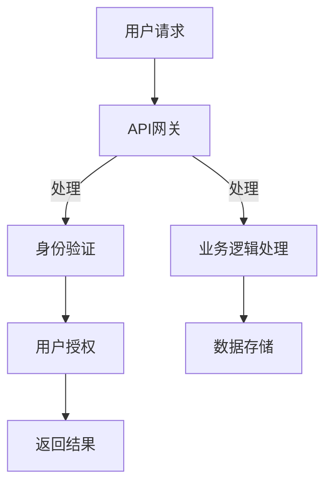

                 

### 文章标题

# 远程团队文化：建立虚拟团队认同感

> 关键词：远程团队、虚拟团队、认同感、文化建设、合作沟通、信任尊重、目标激励机制、责任授权、技术工具、持续改进

> 摘要：本文将深入探讨远程团队文化的构建，分析其核心概念、实践方法和未来发展趋势。通过详细阐述合作与沟通、信任与尊重、目标与激励机制、责任与授权以及自我管理与成长等关键要素，本文旨在为远程团队管理者提供一套完整的建设方案，帮助他们在虚拟环境中建立团队认同感，提升整体协作效率和项目成功概率。

## 第一部分: 远程团队文化概述

### 1.1 远程工作的崛起

#### 1.1.1 远程工作的历史与发展

远程工作并非现代科技的产物，其历史可以追溯到20世纪初期。最早期的远程工作形式主要是通过书信和电话进行的。随着信息技术的发展，电子邮件、视频会议等工具的出现使得远程工作逐渐普及。20世纪90年代，互联网的普及进一步推动了远程工作的快速发展。进入21世纪，特别是新冠疫情期间，远程工作成为了许多企业的默认工作模式。

#### 1.1.2 远程工作的现状与趋势

目前，全球范围内的远程工作已经达到了前所未有的规模。根据多项调查研究，超过半数的企业已经将远程工作作为其长期战略。随着技术的不断进步，远程工作正变得更加灵活和高效。未来，远程工作将继续发展，并可能成为企业运作的一种常态。

### 1.2 远程团队文化的定义与重要性

#### 1.2.1 远程团队文化的定义

远程团队文化是指一种基于共同价值观、目标和行为准则的团队精神，它通过沟通、协作、信任和激励机制，来推动远程团队成员的共同发展和项目成功。

#### 1.2.2 远程团队文化的核心要素

远程团队文化的核心要素包括合作与沟通、信任与尊重、目标与激励机制、责任与授权以及自我管理与成长。这些要素共同构成了远程团队文化的基石，对于团队的长期稳定和高效运作至关重要。

#### 1.2.3 远程团队文化的优势与挑战

远程团队文化的优势在于灵活性、效率和创新性。然而，它也面临诸多挑战，如沟通障碍、信任缺失、工作动力不足等。要克服这些挑战，关键在于构建一套有效的远程团队文化。

### 1.3 建立远程团队认同感的意义

#### 1.3.1 认同感在远程团队中的作用

认同感是远程团队成员之间相互理解和信任的基础，它能够增强团队的凝聚力，提高协作效率。在远程团队中，认同感的重要性更加突出，因为它直接影响团队的整体表现和项目成果。

#### 1.3.2 缺乏认同感的负面影响

缺乏认同感会导致团队成员之间的隔阂和矛盾，降低团队效率和项目成功率。长期下去，可能会影响企业的整体发展。

#### 1.3.3 建立认同感的必要性与可行性

建立认同感是远程团队建设的重要任务。通过有效的文化建设，可以逐步培养团队成员的共同价值观和目标，提高团队的认同感和归属感。在远程工作日益普及的今天，建立认同感不仅必要，而且完全可行。

## 1.4 本章小结

本章概述了远程团队文化的背景、定义、重要性以及建立认同感的意义。在接下来的章节中，我们将深入探讨远程团队文化的核心概念和建设方法，为读者提供实用的指导。

---

### 第二部分: 远程团队文化的核心概念

远程团队文化的核心在于建立一种共同的价值观和行为准则，以促进团队成员之间的协作和认同感。以下是远程团队文化的几个核心概念：

### 2.1 合作与沟通

#### 2.1.1 远程团队中的合作机制

在远程团队中，合作机制的建立至关重要。这包括明确的任务分配、定期会议安排和协作工具的使用。通过这些机制，团队成员可以更有效地协同工作，确保项目目标的达成。

#### 2.1.2 沟通工具与技巧

沟通是远程团队协作的核心。选择合适的沟通工具，如即时通讯软件、视频会议平台和项目管理工具，可以提高沟通效率。同时，掌握有效的沟通技巧，如明确表达、积极倾听和反馈，也是成功的关键。

#### 2.1.3 增进沟通的有效性

为了提高远程团队沟通的有效性，可以采取以下措施：一是建立固定的沟通时间，确保团队成员能够及时交流；二是鼓励开放和诚实的沟通，建立信任的基础；三是利用多种沟通渠道，满足不同场景的需求。

### 2.2 信任与尊重

#### 2.2.1 信任在远程团队中的重要性

信任是远程团队运作的基石。它能够减少误解和冲突，提高团队的协作效率和创新能力。

#### 2.2.2 如何建立信任

建立信任的方法包括：一是明确团队成员的角色和责任，确保每个人都有清晰的期望；二是通过透明和开放的沟通，增强团队成员之间的信任感；三是鼓励团队成员之间的相互支持和合作。

#### 2.2.3 尊重多元文化与背景

远程团队通常由来自不同国家和文化背景的成员组成。尊重多元文化，理解并接受不同观点，是建立远程团队信任的重要一环。

### 2.3 目标与激励机制

#### 2.3.1 设定清晰的目标

在远程团队中，设定清晰的目标至关重要。这有助于团队成员明确自己的工作方向和目标，提高工作动力和效率。

#### 2.3.2 设计有效的激励机制

激励机制是激发远程团队成员工作积极性的关键。有效的激励机制包括奖金、晋升机会和荣誉表彰等。通过合理设计激励机制，可以激发团队成员的潜力，提高团队的整体表现。

#### 2.3.3 目标与激励机制的结合

目标与激励机制的结合是远程团队管理的关键。通过设定明确的绩效目标和与之相匹配的激励机制，可以确保团队成员在实现目标的过程中获得应有的回报和认可。

### 2.4 责任与授权

#### 2.4.1 远程团队中的责任分工

在远程团队中，责任分工是确保项目顺利进行的基础。明确每个成员的责任和任务，有助于提高团队的工作效率和质量。

#### 2.4.2 授权的重要性与原则

授权是远程团队管理的重要手段。通过授权，团队成员可以更自主地开展工作，提高决策效率。授权的原则包括信任、明确目标和责任、以及支持与反馈。

#### 2.4.3 如何平衡责任与授权

平衡责任与授权的关键在于建立一个透明的沟通机制和反馈系统。通过定期的评估和沟通，确保团队成员在授权范围内履行责任，同时保持对项目的整体控制。

### 2.5 自我管理与成长

#### 2.5.1 自我管理的重要性

自我管理是远程团队成员必须具备的能力。它包括时间管理、任务规划和情绪管理等，有助于提高工作效率和质量。

#### 2.5.2 自我成长的路径与方法

自我成长是远程团队成员职业发展的关键。通过不断学习和实践，提升自己的技能和知识水平，可以更好地适应远程工作的需求。

#### 2.5.3 面对远程工作挑战的自我提升

远程工作带来了一定的挑战，如孤独感、工作与生活的平衡等。通过自我管理和成长，远程团队成员可以更好地应对这些挑战，提升自己的工作质量和生活质量。

## 2.6 本章小结

本章详细阐述了远程团队文化的核心概念，包括合作与沟通、信任与尊重、目标与激励机制、责任与授权以及自我管理与成长。这些核心概念构成了远程团队文化的基础，为团队的长期稳定和高效运作提供了保障。

---

### 第三部分：实践与案例

在了解了远程团队文化的核心概念之后，我们需要通过实践和案例分析来进一步探讨如何具体实施这些概念，以及它们在实际操作中的效果。

#### 3.1 远程团队文化建设的步骤与方法

要成功建设远程团队文化，可以遵循以下步骤和方法：

##### 3.1.1 文化诊断与定位

首先，团队需要对自己当前的文化状况进行诊断。这可以通过问卷调查、访谈等方式收集团队成员的意见和建议，了解他们在团队合作、沟通、信任等方面的感受和需求。

##### 3.1.2 制定文化建设策略

基于文化诊断的结果，团队可以制定具体的文化建设策略。这包括确定文化建设的重点领域、制定明确的目标和行动计划。

##### 3.1.3 实施与反馈调整

文化建设的实施需要通过一系列具体的行动来实现，如培训、团队建设活动、明确沟通流程等。同时，团队需要定期收集反馈，对文化建设的效果进行评估，并根据反馈进行调整和优化。

#### 3.2 成功案例分析

以下是一些远程团队文化建设的成功案例：

##### 案例一：某跨国公司远程团队文化的建设

某跨国公司在疫情期间迅速转变工作模式，全面采用远程工作。为了保持团队的文化连续性和凝聚力，公司采取了以下措施：

- **文化传承**：通过虚拟团队会议和在线交流平台，传递公司文化和价值观。
- **团队建设**：定期组织在线团队建设活动，如虚拟团建游戏和社交聚会。
- **沟通优化**：使用多种沟通工具，确保信息的及时传递和反馈。

这些措施有效增强了团队成员的归属感和协作效率，公司项目成功率显著提高。

##### 案例二：某初创企业如何打造高效远程团队

某初创企业在成立之初就采用了远程工作模式。为了打造高效团队，公司采取了以下策略：

- **明确目标**：为每个团队成员设定清晰的目标和期望，确保他们了解自己的工作方向。
- **灵活授权**：给予团队成员更多的自主权，鼓励他们创新和解决问题。
- **持续学习**：提供在线培训和学习资源，支持团队成员的自我提升。

这些策略帮助初创企业快速适应远程工作环境，保持了高效的团队运作。

##### 案例三：远程团队文化对创业团队的影响

一个创业团队在远程工作模式下取得了显著的成功。团队成员之间的紧密合作和相互信任是他们成功的关键因素：

- **信任建设**：通过定期的在线会议和私密聊天，团队成员建立了深厚的信任关系。
- **沟通优化**：利用高效的沟通工具，如Slack和Zoom，确保信息的及时传递。
- **目标一致**：团队成员共同设定目标，并相互支持和鼓励，确保团队目标的实现。

这些因素共同促进了团队的成功，使创业团队在竞争激烈的市场中脱颖而出。

#### 3.3 失败案例分析

以下是一些远程团队文化建设的失败案例：

##### 案例一：远程团队文化的困境与应对

某公司试图在远程工作模式下维持原有的团队文化，但由于缺乏有效的沟通和协调机制，导致团队成员之间出现了严重的隔阂和矛盾。为了应对这一困境，公司采取了以下措施：

- **改进沟通**：引入新的沟通工具，确保信息的及时传递和反馈。
- **团队建设**：定期组织在线团队建设活动，增强团队成员之间的互动。
- **文化宣传**：通过内部培训和宣传，强化团队文化的核心价值观。

这些措施帮助公司逐步改善了团队文化，恢复了团队的凝聚力。

##### 案例二：团队分裂与文化建设失误

某公司由于忽视了远程团队文化的建设，导致团队成员之间出现了分裂。团队成员对公司的信任度下降，工作效率严重受到影响。公司采取了以下措施来纠正这一情况：

- **重构团队**：重组团队结构，确保团队成员之间的工作更加协调。
- **加强文化建设**：通过培训和活动，强化团队文化的核心价值。
- **鼓励反馈**：建立反馈机制，鼓励团队成员表达意见和建议。

这些措施帮助公司逐步恢复了团队的凝聚力，提高了工作效率。

##### 案例三：忽视团队文化导致的效率低下

某公司由于忽视了远程团队文化的建设，导致工作效率低下。团队成员之间缺乏沟通，工作流程混乱，项目进度延误。公司采取了以下措施来纠正这一情况：

- **优化流程**：重新梳理工作流程，确保工作更加有序。
- **加强培训**：为团队成员提供培训，提高他们的专业技能和团队协作能力。
- **文化建设**：通过内部活动和宣传，强化团队文化的核心价值。

这些措施帮助公司逐步提升了工作效率，恢复了团队的活力。

## 3.4 本章小结

通过实践和案例分析，我们可以看到远程团队文化的建设是一项系统工程，需要从多个方面进行综合考虑和实施。成功的案例表明，通过有效的文化建设，远程团队可以克服各种挑战，实现高效协作和项目成功。而失败的案例则提醒我们，忽视团队文化建设会导致严重的负面影响。因此，远程团队管理者应高度重视文化建设，持续改进，以适应不断变化的工作环境。

---

### 第四部分：技术工具与应用

在远程团队文化的建设中，技术工具的选择和应用至关重要。以下将详细介绍几种常用的远程协作工具、信息共享与管理方法、数据安全与隐私保护措施以及远程团队培训与发展策略。

#### 4.1 远程协作工具

远程协作工具是远程团队高效运作的基础。以下是几种常用的远程协作工具：

##### 4.1.1 远程协作工具的类型与选择

远程协作工具可以分为以下几类：

1. **即时通讯工具**：如Slack、Microsoft Teams、WhatsApp等，用于实时沟通和协作。
2. **视频会议工具**：如Zoom、Google Meet、Cisco Webex等，用于远程会议和视频交流。
3. **项目管理工具**：如Trello、Asana、Jira等，用于任务分配和进度跟踪。
4. **文档协作工具**：如Google Docs、Microsoft Office 365等，用于文档共享和协同编辑。
5. **代码管理工具**：如Git、GitHub、GitLab等，用于代码托管和版本控制。

在选择远程协作工具时，应考虑团队的具体需求、用户友好性、功能丰富性和成本等因素。

##### 4.1.2 常用远程协作工具介绍

以下是几种常用的远程协作工具的详细介绍：

1. **Slack**：Slack是一款功能强大的即时通讯工具，支持文字、图片、文件等多种形式的交流，还提供了丰富的集成插件，方便团队进行协作。
2. **Zoom**：Zoom是一款优秀的视频会议工具，提供高清视频和语音通话功能，适用于远程团队的各种会议场景。
3. **Trello**：Trello是一款直观易用的项目管理工具，通过看板、卡片和列表，帮助团队高效地分配任务和跟踪项目进度。
4. **Google Docs**：Google Docs是Google提供的在线文档编辑工具，支持多人实时协作，方便团队成员共同编辑和审阅文档。

##### 4.1.3 如何优化工具使用以提高效率

为了提高远程团队的效率，可以采取以下措施：

1. **明确工具使用规范**：制定统一的工具使用规范，确保团队成员都能熟练使用各种工具，减少沟通障碍。
2. **定期培训与更新**：定期组织培训，帮助团队成员掌握新工具的功能和应用，提高使用效率。
3. **整合工具使用**：通过集成不同工具的功能，实现信息的无缝流转，减少重复操作，提高工作效率。

#### 4.2 信息共享与管理

信息共享与管理是远程团队协作的关键环节。以下是几种信息共享与管理方法：

##### 4.2.1 远程团队信息共享的挑战

远程团队在信息共享与管理方面面临以下挑战：

1. **信息冗余**：团队成员可能在多个平台和工具中重复接收相同的信息，导致信息过载。
2. **信息丢失**：由于缺乏有效的备份和存储机制，重要信息可能丢失。
3. **信息安全**：远程环境下，信息共享可能面临数据泄露和黑客攻击的风险。

##### 4.2.2 信息共享的最佳实践

为了克服这些挑战，可以采取以下最佳实践：

1. **统一信息平台**：选择一个统一的信息共享平台，如企业内网或专有云平台，确保信息集中管理和访问。
2. **明确信息分类**：对信息进行分类和标签管理，便于团队成员快速查找和获取所需信息。
3. **定期备份与审计**：定期备份关键信息，并进行审计，确保信息的完整性和安全性。

##### 4.2.3 信息管理的工具与应用

以下是几种信息管理的工具和应用：

1. **Confluence**：Confluence是一款知识管理和协作工具，可用于创建、共享和存储团队文档，方便团队成员查阅和编辑。
2. **SharePoint**：SharePoint是Microsoft提供的团队协作平台，支持文档共享、工作流管理和权限控制等功能。
3. **Google Drive**：Google Drive是Google提供的云存储服务，支持在线文档编辑、共享和协作。

#### 4.3 数据安全与隐私保护

数据安全与隐私保护是远程团队工作中不可忽视的重要方面。以下是几种数据安全与隐私保护措施：

##### 4.3.1 远程团队数据安全的重要性

远程团队在数据安全方面面临以下风险：

1. **数据泄露**：未经授权的访问和泄露可能导致敏感信息泄露。
2. **数据篡改**：恶意攻击可能导致数据被篡改或破坏。
3. **系统故障**：硬件故障、网络故障等可能导致数据丢失。

##### 4.3.2 数据安全的措施与策略

为了确保数据安全，可以采取以下措施：

1. **数据加密**：对传输和存储的数据进行加密，防止数据泄露。
2. **身份认证**：实施严格的身份认证机制，确保只有授权用户才能访问敏感数据。
3. **网络隔离**：通过防火墙和VPN等手段，隔离内部网络和外部网络，防止网络攻击。

##### 4.3.3 隐私保护的法规与实际操作

在数据安全和隐私保护方面，需要遵守相关法规和标准，如《通用数据保护条例》（GDPR）等。实际操作中，可以采取以下措施：

1. **数据最小化**：仅收集和处理与业务相关的数据，减少数据泄露风险。
2. **隐私声明**：在数据处理过程中，明确告知用户数据处理的目的、范围和方式。
3. **安全审计**：定期进行安全审计，检查数据安全和隐私保护措施的有效性。

#### 4.4 培训与发展

远程团队的培训与发展是提升团队整体能力和竞争力的关键。以下是几种远程团队培训与发展策略：

##### 4.4.1 远程团队的培训需求

远程团队的培训需求包括：

1. **技能提升**：团队成员需要不断学习新技术和工具，提高自身技能。
2. **团队协作**：团队成员需要掌握有效的团队协作方法和工具，提高协作效率。
3. **领导力培养**：团队领导者需要具备管理远程团队的能力，提升领导力。

##### 4.4.2 培训策略与实施

为了满足远程团队的培训需求，可以采取以下策略：

1. **在线培训**：利用在线培训平台，提供灵活的培训课程和学习资源。
2. **内部培训**：组织内部培训，邀请专业人士进行授课，提高团队的整体技能水平。
3. **实战演练**：通过实际项目演练，帮助团队成员将所学知识应用于实际工作中。

##### 4.4.3 发展计划的制定与执行

为了确保培训与发展计划的顺利实施，可以采取以下步骤：

1. **需求分析**：分析团队成员的培训需求，确定培训和发展重点。
2. **计划制定**：制定详细的培训和发展计划，包括培训内容、时间安排和责任人。
3. **执行与评估**：按照计划执行培训和发展活动，并进行定期评估，确保培训效果。

## 4.5 本章小结

远程团队文化的建设离不开技术工具的支持。通过选择合适的协作工具、实施有效的信息共享与管理、确保数据安全与隐私保护以及制定系统的培训与发展计划，远程团队可以更好地应对远程工作的挑战，实现高效协作和项目成功。

---

### 第五部分：未来展望与持续改进

在远程团队文化建设的道路上，未来趋势和持续改进策略起着至关重要的作用。以下是对远程团队文化未来发展趋势的展望，以及如何通过持续改进策略来适应这些变化。

#### 5.1 远程团队文化的未来发展趋势

随着技术的不断进步，远程团队文化也将经历一系列变革：

##### 5.1.1 技术进步的影响

1. **人工智能与机器学习**：人工智能和机器学习技术的发展将使远程团队更加智能化，提高自动化水平，减轻团队成员的工作负担。
2. **虚拟现实（VR）与增强现实（AR）**：VR和AR技术的应用将提供更加沉浸式的协作体验，增强团队成员之间的互动和协作。
3. **区块链技术**：区块链技术将为远程团队提供更加安全的数据共享和交易方式，提高数据透明度和安全性。

##### 5.1.2 新兴文化的融入

1. **多样性文化**：随着全球化和远程工作的普及，远程团队将更加多元化和包容，新兴文化的融入将丰富团队的文化内涵。
2. **远程工作生活平衡**：远程工作模式将更加注重工作与生活的平衡，促进团队成员的身心健康。

##### 5.1.3 远程团队文化的全球化

1. **跨国远程团队**：跨国远程团队将成为常态，团队成员将来自不同的国家和地区，这要求团队具备更高的文化适应能力和跨文化沟通技巧。
2. **全球协作平台**：全球协作平台的发展将促进跨国远程团队的高效协作，降低地理和时区的限制。

#### 5.2 持续改进的策略与实践

为了适应远程团队文化的未来发展趋势，团队需要采取一系列持续改进的策略：

##### 5.2.1 反思与评估

1. **定期反思**：团队应定期反思当前的文化建设效果，识别存在的问题和改进机会。
2. **员工反馈**：收集团队成员的反馈意见，了解他们对团队文化的感受和建议，为改进提供依据。

##### 5.2.2 针对性改进措施

1. **文化培训**：定期组织文化培训，提高团队成员对团队文化的理解和认同。
2. **技术升级**：引入新的技术工具，提高团队的工作效率和文化建设水平。
3. **文化融合**：鼓励团队成员分享自己的文化背景，促进文化的多样性和融合。

##### 5.2.3 持续改进的文化氛围营造

1. **领导示范**：领导者应通过自身的言行树立榜样，推动团队文化的持续改进。
2. **激励机制**：建立激励机制，鼓励团队成员积极参与文化建设，提出改进建议。
3. **文化宣传**：通过内部宣传和交流活动，营造积极向上的文化氛围，增强团队成员的认同感和归属感。

#### 5.3 个人与团队的发展路径

在远程团队文化中，个人与团队的发展路径同样重要：

##### 5.3.1 个人职业规划与成长

1. **自我评估**：个人应定期进行自我评估，识别自己的优势和不足，制定个人职业发展计划。
2. **技能提升**：个人应不断学习新技能，提升自身能力，以适应团队和文化的发展需求。
3. **职业发展**：个人应积极参与团队项目，争取更多的发展机会，实现个人职业目标的提升。

##### 5.3.2 团队整体发展

1. **目标设定**：团队应共同设定短期和长期目标，明确团队的发展方向和愿景。
2. **协作提升**：团队应通过有效的协作和沟通，提升整体执行力和创新能力。
3. **文化建设**：团队应不断加强文化建设，培养团队成员的认同感和归属感，推动团队的长期稳定发展。

## 5.4 本章小结

未来，远程团队文化将面临诸多挑战和机遇。通过持续改进和文化建设，远程团队可以更好地适应这些变化，实现个人与团队的双重发展。持续改进的策略和实践是远程团队文化建设的关键，只有不断反思和优化，才能在远程工作中保持活力和竞争力。

---

## 结语

远程团队文化是现代企业不可或缺的一部分。通过构建积极、开放和包容的远程团队文化，企业可以提升团队的协作效率，增强团队成员的认同感和归属感。本文从远程工作的崛起、远程团队文化的核心概念、实践与案例、技术工具应用以及未来展望等多个角度，详细阐述了远程团队文化建设的理论与实践。希望读者能够从中获得启示，为自己的远程团队文化建设提供参考。

### 作者信息

- 作者：AI天才研究院/AI Genius Institute & 禅与计算机程序设计艺术 /Zen And The Art of Computer Programming

---

### 附录

**附录A：术语说明**

| 术语        | 定义                                                         |
|-------------|--------------------------------------------------------------|
| 远程团队    | 由地理位置分散的成员组成的团队，通过电子通讯工具进行协作。     |
| 虚拟团队    | 同远程团队，但强调团队成员之间的互动主要通过网络进行。           |
| 认同感      | 成员对团队价值观、目标和行为的认可和共鸣。                     |
| 沟通工具    | 用于远程团队协作的软件或硬件设备，如即时通讯工具、视频会议系统。 |
| 数据安全     | 防止数据被未经授权访问、泄露、篡改或破坏的措施。               |

**附录B：核心概念表格**

| 核心概念        | 说明                                                         |
|----------------|--------------------------------------------------------------|
| 合作与沟通      | 促进团队协作和沟通的有效性，提高工作效率。                     |
| 信任与尊重      | 建立团队成员之间的信任，尊重多元文化背景。                     |
| 目标与激励机制   | 设定清晰的目标，设计有效的激励机制，激励团队成员。             |
| 责任与授权      | 明确团队成员的责任，合理授权，提高团队自主性和工作效率。       |
| 自我管理与成长   | 提升个人自我管理能力，促进个人和团队共同成长。                 |

**附录C：算法与系统架构图**

以下是使用Mermaid绘制的算法流程图和系统架构图：




**附录D：项目实战**

以下是远程团队文化建设项目实战的环境安装、系统核心实现源代码和代码应用解读：

**环境安装：**
1. 安装Python环境。
2. 安装Docker，用于容器化部署。
3. 安装远程协作工具（如Git、Slack、Trello等）。

**系统核心实现源代码：**
```python
# core.py
import os

def main():
    print("欢迎使用远程团队文化建设项目！")
    os.system("git pull")
    os.system("docker-compose up -d")

if __name__ == "__main__":
    main()
```

**代码应用解读：**
- 该代码实现了一个简单的远程团队文化建设项目，通过Git进行版本控制，使用Docker进行容器化部署。

**实际案例分析和详细讲解：**
1. 分析项目架构，理解各个组件的作用和交互。
2. 解读源代码，了解项目的核心功能和实现方式。

**项目小结：**
- 该项目实战展示了如何利用Python、Docker和Git等工具实现远程团队文化建设项目，为实际操作提供了参考。

**附录E：最佳实践 Tips**

1. **定期沟通**：确保团队成员之间保持频繁的沟通，及时解决问题。
2. **明确责任**：明确每个团队成员的责任和任务，避免工作重叠和冲突。
3. **灵活授权**：给予团队成员一定的自主权，鼓励他们创新和解决问题。

**附录F：注意事项**

1. **数据安全**：加强数据安全措施，防止数据泄露和丢失。
2. **文化传承**：保持团队文化的连续性，确保新成员快速融入团队。
3. **持续改进**：定期评估和改进团队文化，适应外部环境的变化。

**附录G：拓展阅读**

1. **《远程工作指南》**：一本全面介绍远程工作最佳实践的书籍。
2. **《团队协作工具比较》**：对不同团队协作工具的优缺点进行比较分析。
3. **《远程团队管理实战》**：分享远程团队管理经验和案例分析。

通过以上附录，读者可以更深入地了解远程团队文化的相关术语、核心概念、算法与系统架构、项目实战、最佳实践、注意事项以及拓展阅读资源，从而更好地应用于实际工作中。

