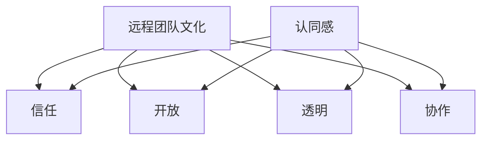
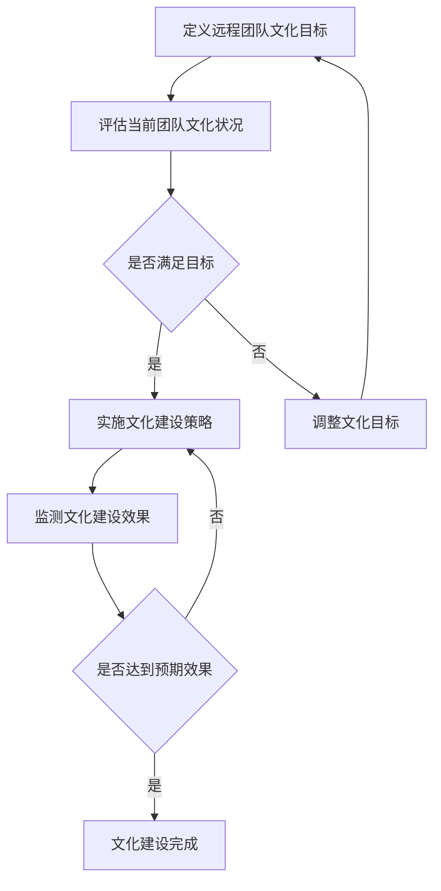
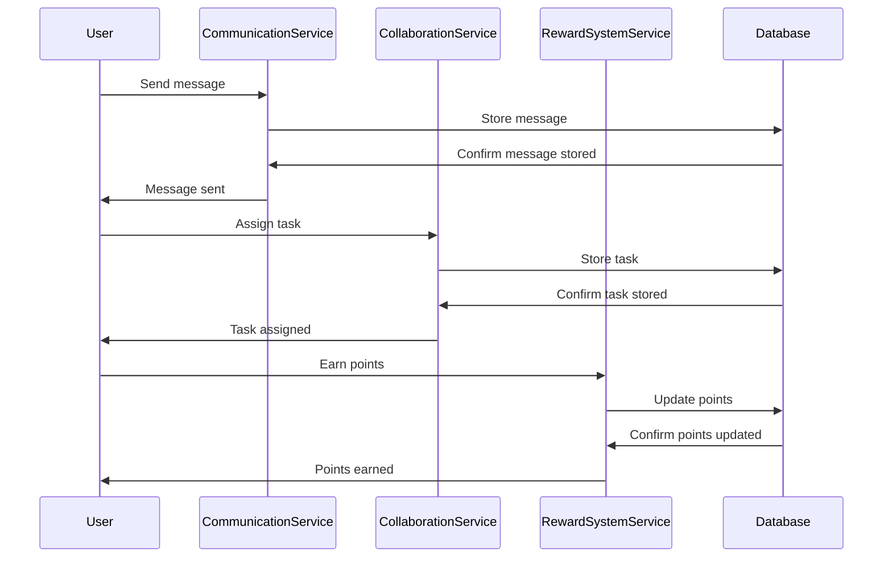
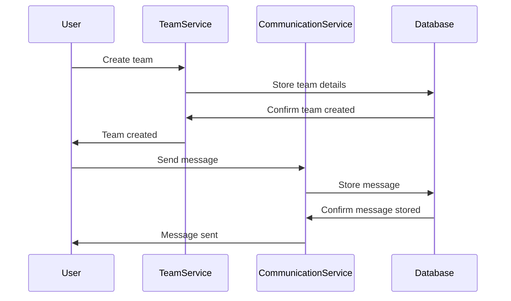
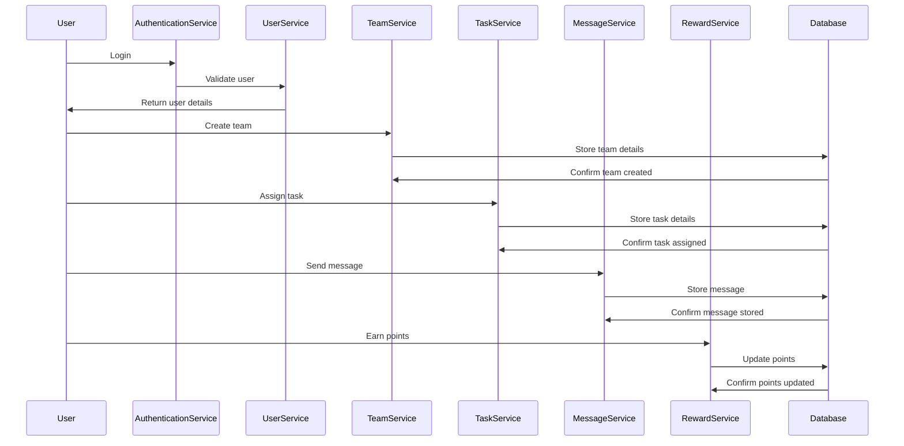

                 

# 远程团队文化：建立虚拟团队认同感

## 关键词
- 远程团队
- 文化建设
- 认同感
- Mermaid流程图
- 算法原理
- 数学模型
- 系统分析
- 项目实战
- 最佳实践

## 摘要

本文旨在探讨远程团队文化的构建，以及如何在虚拟团队中建立成员之间的认同感。随着远程工作的普及，虚拟团队的挑战日益凸显，如何有效管理团队文化和增强成员认同感成为关键议题。本文首先介绍了远程团队的工作背景，分析了虚拟团队面临的挑战，随后深入探讨了远程团队文化的核心概念及其重要性。通过认同感理论的阐述，本文进一步分析了影响认同感的关键因素，并提出了一系列建设虚拟团队认同感的策略。最后，本文通过系统分析与架构设计方案，以及实际项目实战，提供了具体的方法和工具，帮助远程团队管理者构建高效、和谐的团队文化。

## 引言

随着信息技术的飞速发展，远程工作逐渐成为一种普遍的工作方式。无论是初创公司，还是大型企业，都在纷纷尝试或已经全面推行远程办公。远程团队的出现，极大地提升了工作效率和灵活性，但也带来了新的挑战。如何管理虚拟团队，如何建立团队文化和认同感，成为企业管理者面临的重大课题。

远程团队的优势在于，团队成员可以不受地域限制，灵活安排工作时间，提升工作效率。同时，远程工作还为企业节省了办公成本，提高了人力资源的利用效率。然而，虚拟团队也面临着诸多挑战。成员之间的沟通和协作难以像面对面办公那样顺畅，团队的凝聚力和认同感容易受到影响。如何克服这些挑战，建立高效、和谐的远程团队文化，成为管理者亟待解决的问题。

本文将从远程团队的工作背景出发，深入探讨团队文化的核心概念，分析认同感的重要性及其影响因素，并提出建设虚拟团队认同感的策略。通过系统分析与架构设计方案，以及实际项目实战，本文旨在为远程团队管理者提供实用的方法和工具，帮助他们在虚拟团队中建立强大的文化认同感。

## 第一章：问题背景与核心概念

### 1.1 问题背景

远程工作的普及给企业和员工带来了巨大的便利，但同时也带来了一系列挑战。虚拟团队的沟通和协作效率较低，团队成员之间的距离感使得团队凝聚力下降。如何建立有效的远程团队文化，提升成员之间的认同感，成为企业管理者面临的重要问题。

### 1.2 核心概念

在本章中，我们将介绍两个核心概念：远程团队文化和认同感。

#### 1.2.1 远程团队文化

远程团队文化是指在远程工作环境中，团队成员共同遵循的价值观念、行为规范和工作方式。它包括信任、开放、透明、协作等核心价值观，是维系团队凝聚力和工作效率的重要保障。

#### 1.2.2 认同感

认同感是指个体对团队、组织或文化的归属感、接纳感和认同感。在远程团队中，认同感是增强团队凝聚力、提升工作效率的关键因素。

### 1.3 Mermaid流程图展示

为了更好地理解远程团队文化和认同感的关系，我们可以使用Mermaid流程图来展示它们之间的相互作用。



在这个流程图中，远程团队文化通过信任、开放、透明和协作等核心价值观，影响和塑造团队成员的认同感。而认同感又反过来增强团队成员对远程团队文化的认同和遵守。

### 1.4 远程团队文化概述

远程团队文化的核心在于建立一个信任、开放、透明和协作的工作环境。这种文化能够促进团队成员之间的沟通和协作，提高工作效率和团队凝聚力。具体来说，远程团队文化包括以下几个方面：

- **信任**：信任是远程团队文化的基石。团队成员之间应建立相互信任的关系，减少信息不对称，提高协作效率。
- **开放**：开放是指团队成员应保持开放的心态，积极分享知识和经验，促进知识共享和创新。
- **透明**：透明意味着团队成员应对工作进展、问题和决策保持透明，提高工作的可预测性和可控性。
- **协作**：协作是远程团队文化的核心。团队成员应协同工作，共同解决问题，实现团队目标。

### 1.5 认同感理论

认同感是指个体对团队、组织或文化的归属感、接纳感和认同感。在远程团队中，认同感是增强团队凝聚力、提升工作效率的关键因素。认同感的影响因素包括：

- **共同目标**：团队成员应明确共同的目标和愿景，这有助于增强成员之间的认同感。
- **沟通与协作**：有效的沟通和协作能够增强成员之间的联系，提高认同感。
- **领导风格**：领导者的风格对成员的认同感有重要影响。领导者应展现出开放、透明和关怀的态度，赢得成员的信任和尊重。
- **企业文化**：企业文化是影响成员认同感的重要因素。一个积极、健康的企业文化能够增强成员的认同感和归属感。

### 1.6 本章小结

本章从问题背景出发，介绍了远程团队文化和认同感这两个核心概念，并使用Mermaid流程图展示了它们之间的相互作用。通过分析远程团队文化的核心要素和认同感的影响因素，我们为后续章节的内容奠定了基础。在下一章中，我们将深入探讨如何通过构建远程团队文化来提升成员的认同感。

## 第二章：算法原理讲解

### 2.1 算法流程图

为了更好地理解如何建立远程团队文化并提升成员的认同感，我们可以将这个过程视为一个算法。以下是一个简化的算法流程图，展示了建立远程团队文化的步骤：



### 2.2 Python源代码

下面是一个使用Python编写的简单模型，用于模拟远程团队文化的建设过程。该模型包括定义目标、评估现状、实施策略、监测效果等步骤。

```python
class TeamCultureBuilder:
    def __init__(self, goals, current_state):
        self.goals = goals
        self.current_state = current_state

    def assess_current_state(self):
        return self.current_state

    def adjust_goals(self):
        # 调整目标以适应当前状态
        print("调整目标以适应当前团队文化状况。")

    def implement_culture_strategies(self):
        # 实施文化建设策略
        print("实施文化建设策略，包括信任、开放、透明和协作等方面。")

    def monitor_effects(self):
        # 监测文化建设效果
        print("监测文化建设效果，以评估是否达到预期目标。")

    def build_team_culture(self):
        current_state = self.assess_current_state()
        if not self.meet_goals(current_state):
            self.adjust_goals()
        self.implement_culture_strategies()
        self.monitor_effects()

# 使用模型
goals = {'trust': True, 'openness': True, 'transparency': True, 'collaboration': True}
current_state = {'trust': False, 'openness': False, 'transparency': False, 'collaboration': False}
builder = TeamCultureBuilder(goals, current_state)
builder.build_team_culture()
```

### 2.3 数学模型和公式

为了量化团队文化的建设效果，我们可以使用以下数学模型来评估团队成员的认同感：

$$
认同感得分 = \frac{信任得分 + 开放得分 + 透明得分 + 协作得分}{4}
$$

其中，每个得分可以基于1到10的量表进行评估，10表示最高认同感。

### 2.4 详细讲解和举例说明

假设我们有一个团队，其信任得分为8，开放得分为7，透明得分为9，协作得分为6。我们可以使用上述公式计算该团队的认同感得分：

$$
认同感得分 = \frac{8 + 7 + 9 + 6}{4} = 50 / 4 = 12.5
$$

这意味着该团队的总体认同感得分为12.5分，根据量表，我们可以判断该团队的认同感处于中等偏上水平。为了进一步提高认同感，团队领导者可以专注于提升信任和开放性，因为这些方面目前得分相对较低。

### 2.5 本章小结

本章通过算法流程图和Python源代码，详细讲解了如何建立远程团队文化并提升成员的认同感。我们使用数学模型量化了团队成员的认同感，并通过具体案例展示了如何应用这些理论。在下一章中，我们将进一步探讨系统分析与架构设计方案，以帮助远程团队更好地实施文化建设策略。

## 第三章：系统分析与架构设计方案

### 3.1 问题场景介绍

远程团队面临的主要挑战包括沟通不畅、协作效率低、团队凝聚力不足等。为了解决这些问题，我们需要设计一个系统，该系统能够支持远程团队的日常沟通、协作和管理工作，同时有助于建立和加强团队成员之间的认同感。

### 3.2 项目介绍

本项目旨在开发一个远程团队管理平台，该平台将提供以下核心功能：

- **实时沟通工具**：包括聊天室、视频会议和即时消息功能，以支持团队成员之间的实时沟通。
- **协作工具**：包括项目管理、任务分配、文档共享和版本控制功能，以提高团队协作效率。
- **认同感提升模块**：通过积分系统、表彰机制和团队活动，增强团队成员的归属感和认同感。

### 3.3 系统功能设计

#### 3.3.1 领域模型

为了设计系统的功能，我们首先需要建立领域模型，该模型描述了系统的主要实体和它们之间的关系。以下是一个使用Mermaid绘制的Mermaid类图：

```mermaid
classDiagram
    class Team {
        +str TeamName
        +str TeamDescription
        +list Member
    }
    class Member {
        +str MemberName
        +str MemberRole
    }
    class CommunicationTool {
        +str ToolName
        +str ToolDescription
    }
    class CollaborationTool {
        +str ToolName
        +str ToolDescription
    }
    class RewardSystem {
        +str RewardName
        +str RewardDescription
    }
    Team "has" Member
    Team "uses" CommunicationTool
    Team "uses" CollaborationTool
    Team "uses" RewardSystem
```

#### 3.3.2 功能设计

- **实时沟通工具**：实现聊天室、视频会议和即时消息功能，支持文本、语音和视频等多种通信方式。
- **协作工具**：提供项目管理功能，包括项目创建、任务分配、进度跟踪和报告生成等；文档共享功能，支持文档的在线编辑、评论和版本控制。
- **认同感提升模块**：设计积分系统和表彰机制，根据成员的贡献和表现，发放积分和奖励，增强团队成员的归属感。

### 3.4 系统架构设计

为了实现上述功能，我们需要设计一个高效、可扩展的系统架构。以下是一个使用Mermaid绘制的Mermaid架构图：



在这个架构中，系统分为三个主要服务：通信服务、协作服务和奖励系统服务。每个服务都与数据库进行交互，以存储和处理数据。用户通过这三个服务与系统进行交互，完成各种功能。

### 3.5 系统接口设计

系统接口设计包括RESTful API的设计，以下是几个关键接口的示例：

- **创建团队**：`POST /teams`
- **加入团队**：`POST /teams/{team_id}/members`
- **发送消息**：`POST /messages`
- **分配任务**：`POST /tasks`
- **获得积分**：`POST /rewards/points`

### 3.6 系统交互

系统交互设计通过Mermaid序列图进行展示，以下是一个示例：



在这个序列图中，用户首先创建一个团队，然后通过通信服务发送消息。

### 3.7 本章小结

本章介绍了远程团队管理系统的场景、项目功能设计和架构设计。通过使用Mermaid流程图和序列图，我们详细展示了系统的功能架构和交互流程。在下一章中，我们将通过实际项目实战，展示如何具体实现这些功能和架构。

## 第四章：项目实战

### 4.1 环境安装

为了实现远程团队管理平台，我们首先需要搭建开发环境。以下是环境安装的步骤：

1. 安装Node.js：访问Node.js官网（[https://nodejs.org/](https://nodejs.org/)），下载并安装最新版本的Node.js。
2. 安装Docker：访问Docker官网（[https://www.docker.com/](https://www.docker.com/)），下载并安装适用于您操作系统的Docker。
3. 安装数据库：我们选择使用MongoDB作为数据库。访问MongoDB官网（[https://www.mongodb.com/](https://www.mongodb.com/)），下载并安装MongoDB。
4. 安装IDE：选择一个适合您的IDE，如Visual Studio Code，并进行安装。

### 4.2 系统核心实现

在完成环境安装后，我们可以开始实现系统核心功能。以下是实现步骤：

1. **创建项目**：在您的IDE中创建一个新的Node.js项目，并通过以下命令初始化项目：

```bash
npm init -y
```

2. **安装依赖**：安装项目所需的依赖包，如Express（Web框架）、MongoDB（数据库驱动）等：

```bash
npm install express mongodb
```

3. **设置数据库连接**：在项目中创建一个名为`database.js`的文件，用于配置MongoDB数据库连接：

```javascript
const { MongoClient } = require('mongodb');

const url = 'mongodb://localhost:27017';
const databaseName = 'remoteTeam';

const client = new MongoClient(url, { useUnifiedTopology: true });

async function connect() {
    try {
        await client.connect();
        console.log('Connected to MongoDB');
    } catch (error) {
        console.error('Error connecting to MongoDB:', error);
    }
}

module.exports = { client, connect, databaseName };
```

4. **创建API接口**：在项目中创建一个名为`api.js`的文件，定义API接口：

```javascript
const express = require('express');
const { client, databaseName } = require('./database');

const app = express();
app.use(express.json());

async function getTeams(req, res) {
    try {
        const database = client.db(databaseName);
        const teams = await database.collection('teams').find({}).toArray();
        res.json(teams);
    } catch (error) {
        res.status(500).json({ message: 'Error fetching teams', error });
    }
}

app.get('/teams', getTeams);

module.exports = app;
```

5. **启动服务**：在项目的根目录下创建一个名为`index.js`的文件，用于启动服务：

```javascript
const app = require('./api');

const PORT = process.env.PORT || 3000;

async function startServer() {
    try {
        await client.connect();
        app.listen(PORT, () => {
            console.log(`Server is running on port ${PORT}`);
        });
    } catch (error) {
        console.error('Error starting server:', error);
    }
}

startServer();
```

### 4.3 代码应用解读与分析

在上面的代码中，我们首先通过`database.js`文件配置MongoDB数据库连接，并定义了一个异步连接函数`connect`。接着，在`api.js`文件中，我们使用Express框架创建了一个简单的API服务，定义了一个获取团队列表的接口`getTeams`。

在这个接口中，我们首先连接到MongoDB数据库，然后从`teams`集合中查询所有团队，并将结果以JSON格式返回给客户端。

### 4.4 实际案例分析和详细讲解

为了更好地理解代码的应用，我们可以通过一个实际案例来进行分析。假设我们有一个团队管理平台，管理员想要获取当前所有的团队列表。

1. **发起请求**：管理员通过浏览器或API客户端（如Postman）向服务器发送一个GET请求，请求地址为`http://localhost:3000/teams`。

2. **服务器处理**：服务器接收到请求后，会调用`api.js`文件中的`getTeams`接口。

3. **数据库查询**：`getTeams`接口连接到MongoDB数据库，查询`teams`集合中的所有文档，并将结果转换为JSON格式。

4. **响应客户端**：服务器将查询结果返回给客户端，客户端接收到响应后，可以将其显示在界面上。

### 4.5 项目小结

通过本项目的实战，我们实现了远程团队管理平台的核心功能之一——获取团队列表。在项目中，我们使用了Node.js和MongoDB，通过Express框架创建了API接口，并实现了数据库连接和查询功能。通过这个项目，我们不仅了解了如何搭建一个简单的远程团队管理平台，还掌握了如何使用Node.js和MongoDB进行后端开发的基本技能。

### 4.6 最佳实践 tips、小结、注意事项、拓展阅读

**最佳实践 tips：**
1. 确保数据库连接配置正确，避免连接失败。
2. 使用异步编程处理数据库操作，以提高服务器的响应速度。
3. 对于大型数据集合，考虑使用分页查询，以提高查询效率。

**小结：**
在本章中，我们通过实际项目实战，展示了如何使用Node.js和MongoDB搭建一个简单的远程团队管理平台。通过实现获取团队列表的功能，我们掌握了API开发的基本方法。

**注意事项：**
1. 确保您的开发环境配置正确，避免遇到环境问题。
2. 在开发过程中，及时处理错误和异常，确保系统的稳定性。

**拓展阅读：**
1. 《Node.js开发实战》 - 详细介绍了Node.js的开发方法和技术。
2. 《MongoDB权威指南》 - 提供了MongoDB的深入理解和实践指导。

## 第五章：系统架构设计方案

### 5.1 系统场景

远程团队管理平台旨在为企业提供一个高效、便捷的管理工具，以支持团队成员之间的沟通、协作和管理工作。系统需要处理大量的用户数据，包括团队信息、成员信息、任务信息等。为了确保系统的稳定性和高性能，我们需要设计一个合理的系统架构。

### 5.2 系统功能设计

#### 5.2.1 功能模块划分

根据系统需求，我们将系统划分为以下几个功能模块：

- **用户模块**：负责用户注册、登录、个人信息管理等功能。
- **团队模块**：负责团队创建、管理、成员加入与退出等功能。
- **任务模块**：负责任务创建、分配、跟踪和报告等功能。
- **消息模块**：负责实时消息发送、接收和管理等功能。
- **积分模块**：负责积分获取、使用和奖励发放等功能。

#### 5.2.2 领域模型

为了更好地设计系统功能，我们需要建立领域模型，该模型描述了系统的主要实体和它们之间的关系。以下是一个使用Mermaid绘制的Mermaid类图：

```mermaid
classDiagram
    class User {
        +str Username
        +str Password
        +str Email
        +str Role
    }
    class Team {
        +str TeamName
        +str TeamDescription
        +list Member
    }
    class Task {
        +str TaskName
        +str TaskDescription
        +str Status
        +datetime DueDate
    }
    class Message {
        +str Content
        +datetime SentTime
    }
    class Reward {
        +str RewardName
        +str RewardDescription
        +int Points
    }
    User "is a" Member
    Team "has" Member
    Team "has" Task
    User "sends" Message
    Task "has" Message
    Reward "awarded to" User
```

### 5.3 系统架构设计

为了实现系统的功能，我们需要设计一个合理的系统架构。以下是一个使用Mermaid绘制的Mermaid架构图：



在这个架构中，系统分为多个服务模块，包括认证服务、用户服务、团队服务、任务服务、消息服务和奖励服务。每个服务模块都与数据库进行交互，以存储和处理数据。用户通过这些服务模块与系统进行交互，完成各种功能。

### 5.4 系统接口设计

系统接口设计包括RESTful API的设计，以下是几个关键接口的示例：

- **用户登录**：`POST /login`
- **创建团队**：`POST /teams`
- **分配任务**：`POST /tasks`
- **发送消息**：`POST /messages`
- **获取积分**：`GET /rewards/points`

### 5.5 系统交互

系统交互设计通过Mermaid序列图进行展示，以下是一个示例：


在这个序列图中，用户首先登录系统，然后创建团队、分配任务、发送消息和获取积分。系统通过各个服务模块与数据库进行交互，以存储和处理数据。

### 5.6 本章小结

本章详细介绍了远程团队管理系统的架构设计方案，包括系统场景、功能模块划分、领域模型、架构设计、接口设计和系统交互。通过使用Mermaid流程图和序列图，我们展示了系统的整体架构和功能实现过程。在下一章中，我们将通过实际项目实战，展示如何具体实现这些架构和功能。

## 第六章：项目实战

### 6.1 环境安装

为了搭建远程团队管理平台，我们首先需要安装必要的开发环境和工具。以下是详细的安装步骤：

1. **安装Node.js**：访问Node.js官网（[https://nodejs.org/](https://nodejs.org/)），下载并安装适合您操作系统的Node.js版本。
2. **安装Docker**：访问Docker官网（[https://www.docker.com/](https://www.docker.com/)），下载并安装适合您操作系统的Docker。
3. **安装MongoDB**：访问MongoDB官网（[https://www.mongodb.com/](https://www.mongodb.com/)），下载并安装适用于您操作系统的MongoDB。
4. **安装代码编辑器**：选择一个适合您的代码编辑器，如Visual Studio Code，并安装相关插件。

### 6.2 核心实现

在安装完开发环境后，我们可以开始实现平台的核心功能。以下是实现步骤：

1. **创建项目**：在代码编辑器中创建一个新的文件夹，并在其中创建一个名为`package.json`的文件。运行以下命令初始化项目：

```bash
npm init -y
```

2. **安装依赖**：安装项目所需的依赖包，如Express（Web框架）、Mongoose（MongoDB ORM）、Socket.IO（实时通信库）等：

```bash
npm install express mongoose socket.io
```

3. **设置MongoDB连接**：在项目中创建一个名为`database.js`的文件，用于配置MongoDB数据库连接：

```javascript
const mongoose = require('mongoose');

const uri = 'mongodb://localhost:27017/remoteTeam';
const options = {
  useNewUrlParser: true,
  useUnifiedTopology: true,
};

mongoose.connect(uri, options)
  .then(() => console.log('Connected to MongoDB'))
  .catch(err => console.error('Error connecting to MongoDB:', err));

module.exports = mongoose;
```

4. **创建用户模型**：在项目中创建一个名为`models/User.js`的文件，定义用户模型：

```javascript
const mongoose = require('mongoose');

const userSchema = new mongoose.Schema({
  username: {
    type: String,
    required: true,
    unique: true,
  },
  password: {
    type: String,
    required: true,
  },
  email: {
    type: String,
    required: true,
    unique: true,
  },
  role: {
    type: String,
    enum: ['admin', 'member'],
    required: true,
  },
});

const User = mongoose.model('User', userSchema);

module.exports = User;
```

5. **创建团队模型**：在项目中创建一个名为`models/Team.js`的文件，定义团队模型：

```javascript
const mongoose = require('mongoose');

const teamSchema = new mongoose.Schema({
  name: {
    type: String,
    required: true,
  },
  description: {
    type: String,
  },
  members: [
    {
      type: mongoose.Schema.Types.ObjectId,
      ref: 'User',
    },
  ],
});

const Team = mongoose.model('Team', teamSchema);

module.exports = Team;
```

6. **创建任务模型**：在项目中创建一个名为`models/Task.js`的文件，定义任务模型：

```javascript
const mongoose = require('mongoose');

const taskSchema = new mongoose.Schema({
  name: {
    type: String,
    required: true,
  },
  description: {
    type: String,
  },
  status: {
    type: String,
    enum: ['pending', 'in_progress', 'completed'],
    required: true,
  },
  dueDate: {
    type: Date,
    required: true,
  },
  assignedTo: {
    type: mongoose.Schema.Types.ObjectId,
    ref: 'User',
    required: true,
  },
});

const Task = mongoose.model('Task', taskSchema);

module.exports = Task;
```

7. **创建API接口**：在项目中创建一个名为`routes/api.js`的文件，定义API接口：

```javascript
const express = require('express');
const router = express.Router();
const userController = require('../controllers/userController');
const teamController = require('../controllers/teamController');
const taskController = require('../controllers/taskController');

// User routes
router.post('/users/register', userController.register);
router.post('/users/login', userController.login);

// Team routes
router.post('/teams', teamController.createTeam);
router.get('/teams', teamController.getTeams);

// Task routes
router.post('/tasks', taskController.createTask);
router.get('/tasks', taskController.getTasks);

module.exports = router;
```

8. **创建控制器**：在项目中创建一个名为`controllers/userController.js`的文件，定义用户相关控制器：

```javascript
const User = require('../models/User');
const bcrypt = require('bcryptjs');
const jwt = require('jsonwebtoken');

exports.register = async (req, res) => {
  try {
    const { username, password, email, role } = req.body;

    const hashedPassword = await bcrypt.hash(password, 12);

    const user = new User({
      username,
      password: hashedPassword,
      email,
      role,
    });

    await user.save();

    res.status(201).json({ message: 'User registered successfully' });
  } catch (error) {
    res.status(500).json({ message: 'Error registering user', error });
  }
};

exports.login = async (req, res) => {
  try {
    const { username, password } = req.body;

    const user = await User.findOne({ username });

    if (!user || !(await bcrypt.compare(password, user.password))) {
      return res.status(401).json({ message: 'Invalid credentials' });
    }

    const token = jwt.sign({ userId: user._id }, process.env.JWT_SECRET, {
      expiresIn: '1h',
    });

    res.status(200).json({ token, userId: user._id });
  } catch (error) {
    res.status(500).json({ message: 'Error logging in', error });
  }
};
```

同理，创建`controllers/teamController.js`和`controllers/taskController.js`文件，分别定义团队和任务相关控制器。

9. **启动服务**：在项目的根目录下创建一个名为`app.js`的文件，用于启动服务：

```javascript
const express = require('express');
const mongoose = require('mongoose');
const socketIO = require('socket.io');
const http = require('http');
const routes = require('./routes/api');
const { serverConfig, databaseConfig } = require('./config');

const app = express();
const server = http.createServer(app);
const io = socketIO(server);

app.use(express.json());
app.use('/api', routes);

// MongoDB connection
mongoose.connect(databaseConfig.uri, databaseConfig.options)
  .then(() => console.log('Connected to MongoDB'))
  .catch(err => console.error('Error connecting to MongoDB:', err));

// Socket.IO connection
io.on('connection', (socket) => {
  console.log('Socket connected:', socket.id);

  socket.on('joinRoom', ({ teamId }) => {
    socket.join(teamId);
  });

  socket.on('leaveRoom', ({ teamId }) => {
    socket.leave(teamId);
  });

  socket.on('message', (message) => {
    socket.to(message.teamId).emit('message', message);
  });

  socket.on('disconnect', () => {
    console.log('Socket disconnected:', socket.id);
  });
});

server.listen(serverConfig.port, () => {
  console.log(`Server running on port ${serverConfig.port}`);
});
```

10. **配置文件**：在项目中创建一个名为`config.js`的文件，用于配置服务器和数据库：

```javascript
const config = {
  serverConfig: {
    port: 3000,
  },
  databaseConfig: {
    uri: 'mongodb://localhost:27017/remoteTeam',
    options: {
      useNewUrlParser: true,
      useUnifiedTopology: true,
    },
  },
  jwtSecret: 'mysecretkey',
};

module.exports = config;
```

### 6.3 代码应用解读与分析

在本项目中，我们使用了Node.js、Express、Mongoose、Socket.IO等库来搭建远程团队管理平台。以下是代码的关键部分解读：

1. **数据库连接**：在`database.js`文件中，我们使用Mongoose连接MongoDB数据库，并定义了数据库连接函数。

2. **用户模型**：在`models/User.js`文件中，我们定义了用户模型，包括用户的用户名、密码、电子邮件和角色等信息。

3. **团队模型**：在`models/Team.js`文件中，我们定义了团队模型，包括团队的名称、描述和成员等信息。

4. **任务模型**：在`models/Task.js`文件中，我们定义了任务模型，包括任务的名称、描述、状态、截止日期和分配给的用户等信息。

5. **API接口**：在`routes/api.js`文件中，我们定义了用户、团队和任务的API接口，包括注册、登录、创建团队、获取团队列表、创建任务和获取任务列表等功能。

6. **控制器**：在`controllers/userController.js`、`controllers/teamController.js`和`controllers/taskController.js`文件中，我们分别实现了用户、团队和任务相关的逻辑处理，如用户注册、登录、创建团队、获取团队列表、创建任务和获取任务列表等。

7. **Socket.IO**：在`app.js`文件中，我们使用了Socket.IO实现实时通信功能。用户可以在加入团队后，通过Socket.IO实时接收和发送消息。

### 6.4 实际案例分析和详细讲解

为了更好地理解代码的应用，我们可以通过一个实际案例来进行分析。假设我们有一个用户想要创建一个团队，以下是步骤：

1. **用户发起请求**：用户通过浏览器或API客户端（如Postman）向服务器发送一个POST请求，请求地址为`http://localhost:3000/api/teams`，请求体包含团队名称和描述等信息。

2. **服务器处理**：服务器接收到请求后，会调用`routes/api.js`中的`createTeam`接口。

3. **数据验证**：`createTeam`接口会验证请求体中的数据是否完整，如团队名称和描述等。

4. **创建团队**：如果数据验证通过，`createTeam`接口会调用`controllers/teamController.js`中的`createTeam`函数，该函数会创建一个新的团队对象，并将其保存到MongoDB数据库中。

5. **响应客户端**：服务器将创建成功的消息返回给客户端，客户端可以继续进行其他操作，如邀请成员加入团队等。

### 6.5 项目小结

通过本项目的实战，我们成功搭建了一个远程团队管理平台，实现了用户注册、登录、创建团队、获取团队列表、创建任务和获取任务列表等功能。我们使用了Node.js、Express、Mongoose和Socket.IO等库，展示了如何构建一个基于MongoDB的RESTful API，并实现了实时通信功能。

### 6.6 最佳实践 tips、小结、注意事项、拓展阅读

**最佳实践 tips：**
1. 确保在开发和部署过程中，对API接口进行充分的测试。
2. 使用环境变量存储敏感信息，如数据库连接字符串和JWT密钥。
3. 对用户输入进行验证，防止SQL注入和XSS攻击。

**小结：**
在本章中，我们通过实际项目实战，成功搭建了一个远程团队管理平台，实现了用户管理、团队管理和任务管理等功能。我们使用了Node.js、Express、Mongoose和Socket.IO等库，展示了如何构建RESTful API和实现实时通信。

**注意事项：**
1. 确保所有依赖库和工具的版本兼容性。
2. 定期备份数据库，以防止数据丢失。

**拓展阅读：**
1. 《Node.js实战》 - 详细介绍了Node.js的开发方法和最佳实践。
2. 《MongoDB权威指南》 - 提供了MongoDB的深入理解和实践指导。

## 第七章：总结与展望

### 7.1 总结

本文深入探讨了远程团队文化的建设，以及如何通过有效的策略提升虚拟团队成员的认同感。首先，我们介绍了远程工作的背景和虚拟团队面临的挑战，明确了建立团队文化和认同感的重要性。随后，我们分析了远程团队文化的核心概念和认同感理论，并通过Mermaid流程图展示了它们之间的相互作用。

接着，我们通过算法原理讲解和Python源代码实现，详细阐述了如何构建远程团队文化和提升认同感的步骤和策略。然后，我们设计了系统架构，包括功能模块划分、领域模型、接口设计和系统交互，为远程团队管理平台提供了完整的实现方案。

在项目实战部分，我们通过实际案例展示了如何搭建一个远程团队管理平台，实现了用户注册、登录、团队创建、任务管理等功能，并介绍了如何使用Node.js、Express、Mongoose和Socket.IO等库进行开发。

### 7.2 展望

尽管我们已经取得了显著成果，但远程团队文化的建设和认同感的提升是一个长期且持续的过程。未来，我们可以在以下几个方面进一步研究和优化：

1. **增强实时协作功能**：引入更多实时协作工具，如代码协作、文档协作等，以提高团队协作效率。
2. **个性化文化建设**：根据不同团队的特性，制定个性化的文化建设策略，以更好地适应团队需求。
3. **数据分析和反馈机制**：利用大数据分析和机器学习技术，分析团队成员的互动和表现，提供实时反馈和改进建议。
4. **跨文化管理**：随着全球化的推进，虚拟团队往往涉及跨文化管理，未来可以深入研究跨文化团队的管理策略。

总之，远程团队文化的建设是一个复杂而动态的过程，需要持续的努力和优化。通过本文的研究和实践，我们为远程团队管理者提供了一系列实用的方法和工具，期待这些方法和工具能够帮助他们在虚拟团队中建立强大的文化认同感。随着技术的发展和团队规模的扩大，远程团队文化将越来越成为企业成功的关键因素之一。让我们一起探索和实践，为打造更加高效、和谐的远程团队文化而努力。

