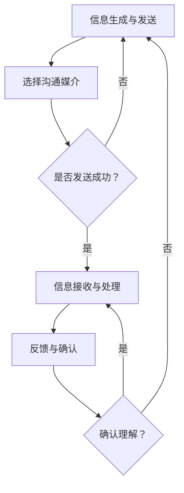
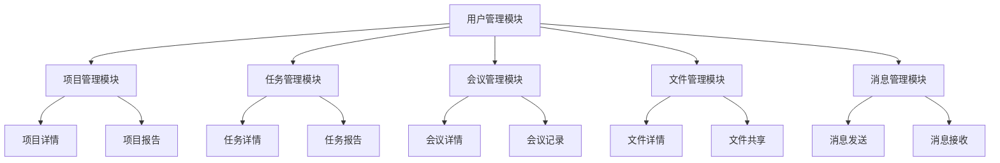
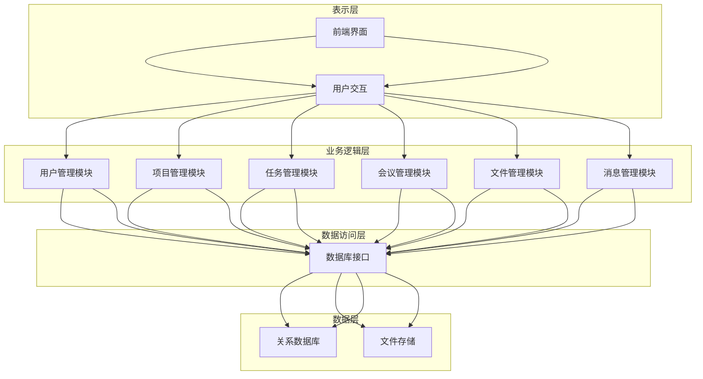
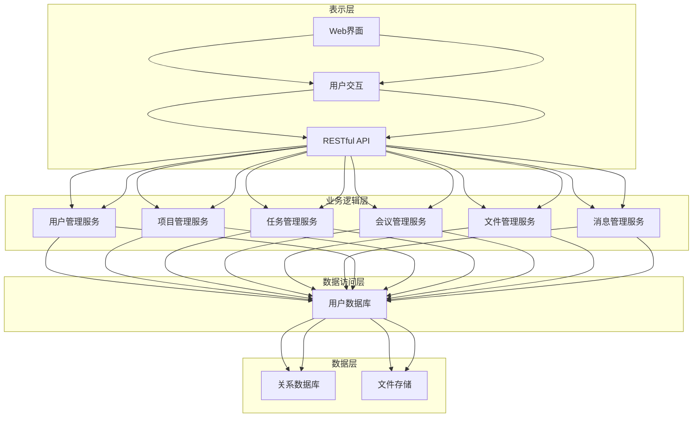
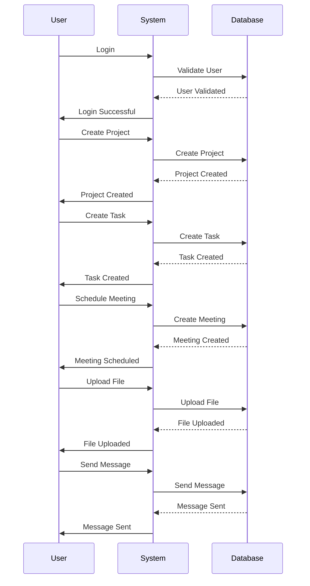

                 

### 第1章 远程工作与虚拟团队的兴起

#### 1.1 远程工作的定义与发展历程

远程工作，亦称远程办公，指的是员工在不同的地理位置进行工作，通过信息技术和通信手段完成日常任务。这一概念在20世纪末期开始逐渐兴起，其发展历程可以追溯到几个重要的阶段。

**定义：**
远程工作通常涉及以下几种形式：
- **居家办公**：员工在家中或其他私人场所进行工作。
- **移动办公**：员工在不同的地理位置（如咖啡店、图书馆等）进行工作。
- **远程协作**：团队成员在不同的地点通过互联网共同完成项目。

**发展历程：**
1. **早期萌芽阶段（20世纪80年代）：**
   在20世纪80年代，计算机和互联网技术开始普及，远程工作逐渐成为可能。电子邮件的出现使人们可以在不同地点进行信息交换，这是远程工作的雏形。

2. **互联网普及阶段（20世纪90年代）：**
   互联网的普及使得远程工作变得更加便捷。即时通讯工具、远程桌面软件、项目管理工具等进一步增强了远程团队的工作能力。

3. **全球化和信息化阶段（21世纪初至今）：**
   随着全球化的深入和信息技术的飞速发展，远程工作已经成为现代企业的重要组成部分。远程办公软件如Slack、Trello、Zoom等大大提高了远程团队的工作效率和沟通效果。

**优势与挑战：**
远程工作的兴起带来了许多优势，如提高工作效率、降低运营成本、增加员工满意度等，但也带来了一系列挑战，例如沟通障碍、文化差异、管理困难等。

- **优势：**
  - **提高工作效率**：员工可以在最适合自己的环境中工作，减少通勤时间，从而提高工作效率。
  - **降低运营成本**：企业无需为员工提供办公空间，减少了租金、水电等运营成本。
  - **增加员工满意度**：远程工作提供了更多的灵活性，使员工能够在个人和工作之间找到更好的平衡。

- **挑战：**
  - **沟通障碍**：远程团队缺乏面对面的交流，容易导致信息误解和沟通不畅。
  - **文化差异**：团队成员来自不同文化背景，可能会在价值观、工作习惯等方面产生冲突。
  - **管理困难**：远程管理比现场管理更具有挑战性，需要更精细的监督和反馈机制。

#### 1.2 虚拟团队的定义与构成

**虚拟团队的定义：**
虚拟团队是由一群在地理上分散的个体，通过信息技术和通信手段，为实现共同目标而协作的团队。虚拟团队的核心在于其成员的地理分散性和依赖信息技术的协作方式。

**构成要素：**
1. **成员角色**：
   - **领导者**：负责团队的目标设定、任务分配和团队协调。
   - **团队成员**：负责具体任务的执行和项目进展的推进。
   - **技术支持人员**：负责维护远程协作工具的正常运行。

2. **任务分配**：
   虚拟团队通常根据项目的需求和成员的能力进行任务分配。每个成员都有明确的职责和任务，确保项目目标的实现。

3. **沟通机制**：
   沟通是虚拟团队成功的关键。通过即时通讯工具、视频会议、项目管理软件等，团队成员可以随时保持联系，确保信息流通。

4. **协作工具**：
   远程协作工具如GitHub、Jira、Confluence等，使得团队成员可以在同一平台上协同工作，提高工作效率。

**与传统团队的区别：**
与传统团队相比，虚拟团队具有以下显著区别：

- **地理分散性**：传统团队通常在同一地点工作，而虚拟团队成员分布在不同的地理位置。
- **依赖信息技术**：虚拟团队高度依赖信息技术和通信工具进行协作，而传统团队主要依赖面对面的交流和现场工作。
- **沟通方式的多样性**：虚拟团队通过多种沟通工具进行交流，如邮件、即时通讯、视频会议等，而传统团队主要通过面对面的交流。
- **管理复杂性**：虚拟团队的管理比传统团队更复杂，需要更加精细化的管理和协调。

### 总结

远程工作和虚拟团队的兴起是信息技术发展带来的必然结果。虽然远程工作带来了许多优势，但同时也带来了一系列挑战。了解虚拟团队的定义、构成要素以及与传统团队的差异，对于提升远程团队的沟通效果至关重要。接下来，我们将深入探讨远程团队沟通的核心概念和面临的挑战。

### 第2章 远程团队沟通的核心概念

#### 2.1 沟通的基本要素

沟通是团队协作的基础，尤其是在远程团队中，有效的沟通显得尤为重要。沟通的基本要素包括信息发送者、信息接收者、信息内容和沟通渠道。以下是这些基本要素的详细解析：

**信息发送者：**
信息发送者是沟通的发起者，负责将信息传递给接收者。在远程团队中，信息发送者可以是团队成员、项目经理或其他相关方。信息发送者的角色不仅仅是传递信息，还需要确保信息的准确性、及时性和相关性。

**信息接收者：**
信息接收者是沟通的目标，负责接收和理解发送者传递的信息。在远程团队中，信息接收者可能是团队成员、客户或其他利益相关者。有效的信息接收者需要具备良好的倾听和理解能力，以确保信息的正确理解和反馈。

**信息内容：**
信息内容是沟通的核心，它包括沟通的目的、主题和具体信息。在远程团队中，信息内容需要清晰、简洁，避免产生歧义。信息的准确性直接影响到团队决策和工作效率。

**沟通渠道：**
沟通渠道是信息传递的媒介，包括文字、语音、视频、电子邮件、即时通讯工具等。在远程团队中，选择合适的沟通渠道对于提高沟通效果至关重要。文字沟通适合详细记录和长期保存，语音和视频沟通适合实时交流和互动。

**要素关系与作用：**
这四个基本要素相互关联，共同构成一个完整的沟通过程。信息发送者通过沟通渠道将信息内容传递给信息接收者，接收者通过反馈和确认确保信息的正确理解。有效的沟通需要这些要素相互配合，形成一个良性循环。

#### 2.2 远程团队沟通的挑战

尽管远程团队沟通提供了许多便利，但同时也面临一系列挑战，这些挑战主要源于时间与空间差异、文化差异和技术依赖。以下是这些挑战的详细分析：

**时间与空间差异：**
远程团队由于地理上的分散，导致时间上的不一致。团队成员可能处于不同的时区，导致会议和交流的时间安排变得复杂。此外，空间差异使得面对面的交流减少，增加了沟通的难度。

- **解决方法：**
  - **时区协调**：通过使用协作工具和软件，团队成员可以预先约定工作时间和会议时间，确保时间的协调。
  - **虚拟会议室**：利用视频会议工具，如Zoom、Microsoft Teams等，使团队成员能够进行实时交流和互动，弥补面对面的交流缺失。

**文化差异：**
远程团队成员可能来自不同的文化背景，导致在沟通方式和价值观上存在差异。文化差异可能导致误解、冲突和沟通障碍。

- **解决方法：**
  - **文化敏感培训**：对团队成员进行文化敏感性培训，增强跨文化沟通能力。
  - **建立共同价值观**：通过制定团队价值观和行为准则，确保团队成员在沟通中遵循共同的标准和原则。

**技术依赖：**
远程团队高度依赖信息技术和通信工具，如电子邮件、即时通讯、视频会议等。技术故障、网络不稳定等问题可能严重影响沟通效果。

- **解决方法：**
  - **技术备份**：确保关键通信工具和系统有备份，以应对技术故障。
  - **持续培训**：定期对团队成员进行技术培训，提高对通信工具的熟练度和应对问题的能力。

#### 2.3 远程团队沟通的重要性

有效的远程团队沟通对于团队的成功至关重要。以下是远程团队沟通的重要性：

- **提高工作效率**：明确的沟通可以减少误解和重复工作，提高工作效率。
- **增强团队凝聚力**：通过有效的沟通，团队成员可以更好地了解彼此，增强团队凝聚力。
- **支持决策制定**：有效的沟通提供了及时和准确的信息，支持团队做出明智的决策。
- **促进知识共享**：远程团队通过沟通分享知识和经验，促进团队的共同进步。

综上所述，远程团队沟通的核心概念包括信息发送者、信息接收者、信息内容和沟通渠道。同时，远程团队沟通面临时间与空间差异、文化差异和技术依赖等挑战。了解这些要素和挑战，有助于提升远程团队的沟通效果，为团队的成功奠定基础。

### 第3章 远程团队沟通的原理

沟通是任何团队协作的核心，远程团队也不例外。要理解远程团队沟通的原理，首先需要了解经典沟通模型及其在远程团队中的特殊性。此外，有效的沟通技巧对于远程团队的成功至关重要。

#### 3.1 沟通模型

沟通模型是描述信息传递和理解过程的基本框架。经典的沟通模型通常包括以下几个部分：

- **信息发送者**：负责产生和传递信息。
- **编码**：将信息转化为可以被传递的形式。
- **渠道**：信息传递的媒介，如电子邮件、电话、视频会议等。
- **解码**：接收者解读和理解信息的过程。
- **反馈**：接收者对信息的回应，帮助发送者确认信息是否被正确理解。

在远程团队中，这一模型需要适应特殊的沟通环境：

- **编码与解码的挑战**：由于缺乏面对面的交流，远程团队的信息编码和解码过程需要更加精确，以避免误解。
- **渠道的多样性**：远程团队使用多种沟通渠道，需要选择最适合当前任务和环境的方式。
- **反馈的及时性**：远程团队需要确保反馈的及时性，以保持沟通的流畅性和有效性。

#### 经典沟通模型在远程团队中的特殊性

远程团队沟通的特殊性主要体现在以下几个方面：

- **地理分散**：团队成员分布在不同的地理位置，导致沟通的时间和方式更加灵活，但也增加了沟通的复杂度。
- **技术依赖**：远程团队高度依赖信息技术和通信工具，如视频会议、即时通讯、项目管理软件等，这些工具的选择和熟练使用直接影响沟通效果。
- **文化多样性**：团队成员可能来自不同的文化背景，需要更多的文化敏感性和适应性。

#### 3.2 沟通技巧

有效的沟通技巧是提升远程团队沟通效果的关键。以下是一些关键的沟通技巧：

**清晰表达**：在远程沟通中，清晰表达尤为重要。确保信息内容简洁明了，避免使用模糊或歧义的语言。

- **具体性**：提供具体的事实和细节，减少接收者的困惑。
- **简明性**：避免冗长的陈述，确保信息传递的高效性。

**倾听与反馈**：良好的倾听和及时的反馈是沟通成功的关键。

- **主动倾听**：通过提问和回应，表明你正在认真倾听对方。
- **及时反馈**：及时给予反馈，帮助发送者了解信息是否被正确理解。

**非言语沟通**：虽然远程沟通缺乏面对面的互动，但非言语沟通仍然发挥着重要作用。

- **语气和表情**：通过语音的语调和表情符号，传达你的情感和态度。
- **视觉辅助**：使用图表、图像和演示文稿等视觉辅助工具，增强信息的传达效果。

#### 实践建议

**定期会议**：定期举行团队会议，确保团队成员之间的沟通和信息流动。

- **议程设置**：提前制定会议议程，确保会议内容的有序进行。
- **会议记录**：会后及时整理会议记录，确保关键信息被记录和传达。

**明确目标**：在沟通前明确目标，确保沟通的内容和方向。

- **目标设定**：设定具体的沟通目标，如解决问题、讨论计划或分享信息。
- **目标追踪**：跟踪目标的实现情况，确保沟通的有效性。

**技术熟练度**：提高团队成员对远程协作工具的熟练度，减少技术故障带来的沟通障碍。

- **工具培训**：定期进行工具培训，提高团队成员的熟练度。
- **故障预案**：制定故障预案，确保在技术故障时能够迅速应对。

#### 总结

远程团队沟通的原理基于经典的沟通模型，但在远程环境中需要适应特殊的沟通需求。有效的沟通技巧，如清晰表达、倾听与反馈、非言语沟通等，对于提升远程团队的沟通效果至关重要。通过定期会议、明确目标和提高技术熟练度等实践建议，可以进一步优化远程团队沟通的过程，为团队的成功奠定坚实基础。

### 第4章 远程团队沟通的属性特征对比表格

#### 4.1 沟通方式对比

在远程团队中，选择合适的沟通方式对于确保沟通效果至关重要。以下是三种主要沟通方式的对比：

**文字沟通**  
- **优点**：适合详细记录和长期保存，便于回顾和查阅。  
- **缺点**：缺乏即时反馈，可能导致信息传递的延迟和误解。

**图像沟通**  
- **优点**：直观、易于理解，可以快速传达复杂信息。  
- **缺点**：需要较高技术支持，制作和传输时间较长。

**视频沟通**  
- **优点**：实时互动，便于面对面交流和情感表达。  
- **缺点**：对网络质量要求较高，可能导致延迟和断线。

**对比表格：**

| 沟通方式 | 优点 | 缺点 |
| --- | --- | --- |
| 文字沟通 | 适合详细记录和长期保存，便于回顾和查阅。 | 缺乏即时反馈，可能导致信息传递的延迟和误解。 |
| 图像沟通 | 直观、易于理解，可以快速传达复杂信息。 | 需要较高技术支持，制作和传输时间较长。 |
| 视频沟通 | 实时互动，便于面对面交流和情感表达。 | 对网络质量要求较高，可能导致延迟和断线。 |

#### 4.2 沟通效果评估

评估沟通效果是确保远程团队沟通有效性的关键。以下是评估沟通效果的几个关键指标：

**效率**  
- **定义**：沟通效率是指信息传递的速度和准确性。  
- **评估方法**：通过测量信息传递的时间、延迟和错误率来评估沟通效率。

**准确性**  
- **定义**：沟通准确性是指信息是否被正确理解和传递。  
- **评估方法**：通过团队成员的反馈和后续行动来评估信息的准确性。

**互动性**  
- **定义**：互动性是指团队成员之间的互动频率和质量。  
- **评估方法**：通过会议参与度、即时通讯使用率和反馈机制来评估互动性。

**对比表格：**

| 指标 | 定义 | 评估方法 |
| --- | --- | --- |
| 效率 | 信息传递的速度和准确性 | 测量信息传递的时间、延迟和错误率 |
| 准确性 | 信息是否被正确理解和传递 | 通过团队成员的反馈和后续行动 |
| 互动性 | 团队成员之间的互动频率和质量 | 通过会议参与度、即时通讯使用率和反馈机制 |

#### 案例分析

以下是一个案例分析，以展示不同沟通方式在远程团队中的应用效果：

**案例背景**：某远程团队需要在两周内完成一个重要的项目报告。团队成员分布在不同的城市，需要进行频繁的沟通。

**沟通方式选择**：

- **第一阶段（需求收集）**：使用文字沟通，通过邮件和即时通讯工具收集团队成员的需求和意见。
- **第二阶段（报告编写）**：使用图像沟通，通过共享图表和示意图来传达复杂的信息。
- **第三阶段（报告审阅和反馈）**：使用视频沟通，召开线上会议进行报告的审阅和讨论。

**效果评估**：

- **效率**：由于信息传递的及时性和准确性，项目的整体进展符合预期。
- **准确性**：通过详细的文字记录和图像展示，团队成员对项目有了更清晰的理解。
- **互动性**：线上会议的参与度高，团队成员之间的互动频繁，有效地解决了报告中的问题。

通过上述案例分析，可以看出选择合适的沟通方式对于提高远程团队沟通效果具有重要意义。不同沟通方式在效率和准确性方面各有优势，而互动性则是评估沟通效果的重要指标。

### 第5章 远程团队沟通的ER实体关系图架构

#### 5.1 沟通实体识别

在远程团队沟通中，识别和定义沟通的实体是确保信息有效传递和理解的关键。以下是远程团队沟通中主要实体的识别及其角色：

**实体识别**：

1. **信息发送者**：负责产生和传递信息的个体，如团队成员、项目经理或其他相关人员。
2. **信息接收者**：负责接收和理解信息的个体，如团队成员、客户或其他利益相关者。
3. **沟通媒介**：用于信息传递的媒介，如电子邮件、即时通讯工具、视频会议软件等。
4. **沟通内容**：信息传递的具体内容，包括任务分配、项目进展、决策建议等。

**实体角色与关系**：

- **信息发送者与信息接收者**：信息发送者和信息接收者之间是直接的沟通关系。信息发送者需要确保信息的准确性和及时性，信息接收者需要理解并反馈信息。
- **沟通媒介与沟通内容**：沟通媒介是信息传递的载体，而沟通内容则是信息传递的具体对象。沟通媒介的选择直接影响信息传递的效率和准确性。

#### 5.2 沟通流程分析

远程团队沟通的流程可以简化为以下步骤：

1. **信息生成与发送**：信息发送者根据任务需求生成信息，并选择适当的沟通媒介进行发送。
2. **信息接收与处理**：信息接收者通过沟通媒介接收信息，并对其进行理解和处理。
3. **反馈与确认**：信息接收者对信息进行处理后，通过反馈机制向信息发送者确认信息的理解情况。

**流程图示例**：



#### 实例说明

以下是一个远程团队沟通的实例说明，展示如何通过ER实体关系图架构分析沟通流程：

**实例背景**：某远程团队需要在三天内完成一个市场调研报告。团队成员分别位于不同的城市。

**沟通实体与流程**：

1. **信息发送者**：项目经理，负责生成市场调研报告的要求。
2. **信息接收者**：市场调研团队，负责完成调研任务。
3. **沟通媒介**：电子邮件和Slack即时通讯工具。
4. **沟通内容**：调研任务的具体要求和截止日期。

**流程分析**：

1. **信息生成与发送**：项目经理通过电子邮件发送市场调研报告的要求，包括具体问题和调研范围。
2. **信息接收与处理**：市场调研团队成员通过电子邮件和Slack接收信息，并开始进行调研。
3. **反馈与确认**：调研团队成员在完成调研后，通过电子邮件和Slack向项目经理反馈结果，项目经理确认信息的理解无误。

通过ER实体关系图架构，可以清晰地识别和定义远程团队沟通中的实体，并分析其沟通流程。这种方法有助于确保信息的有效传递和理解，提高远程团队的沟通效率。

### 第6章 远程团队沟通算法介绍

#### 6.1 算法概述

远程团队沟通算法是一种旨在提高远程团队沟通效率和质量的方法。该算法的核心目标是优化信息传递过程，减少误解和沟通障碍，提升团队协作效果。以下是该算法的概述和适用场景：

**算法概述：**

- **目的**：通过分析远程团队沟通的各个环节，提出优化策略，提高沟通效率和质量。
- **适用场景**：适用于需要高效协作的远程团队，特别是那些团队成员分布在多个地理位置、需要频繁沟通的项目。

**算法适用场景：**

1. **项目开发团队**：项目开发团队通常需要频繁的代码评审、任务分配和进度跟踪，沟通效率直接影响到项目进度和质量。
2. **跨职能团队**：跨职能团队由不同领域的专家组成，他们需要通过有效的沟通协调各项工作，确保项目顺利进行。
3. **远程教育团队**：远程教育团队需要通过线上课堂、讨论区等手段与学生和教师进行沟通，确保教学效果和学习质量。

**算法工作原理：**

该算法的工作原理主要包括以下步骤：

1. **数据收集**：收集远程团队沟通的历史数据，包括会议记录、即时通讯记录、电子邮件等。
2. **数据分析**：对收集的数据进行分析，识别沟通中的常见问题和瓶颈。
3. **策略生成**：基于数据分析结果，生成优化策略，包括沟通渠道选择、沟通频率调整、任务分配优化等。
4. **策略实施**：将优化策略应用于远程团队沟通实践中，跟踪和评估策略的有效性。

#### 6.2 算法原理

算法原理是基于信息论和通信理论，通过数学模型来描述和优化远程团队沟通。以下是该算法的数学模型和流程：

**数学模型：**

1. **信息熵（Entropy）**：用于衡量信息的混乱程度。信息熵越低，信息越有序。
   \[
   H(X) = -\sum_{i} p(x_i) \log_2 p(x_i)
   \]
   其中，\( p(x_i) \) 是随机变量 \( X \) 取值 \( x_i \) 的概率。

2. **信道容量（Channel Capacity）**：用于衡量通信渠道的最大信息传输速率。根据香农公式，信道容量 \( C \) 可以通过以下公式计算：
   \[
   C = B \log_2 (1 + \text{SNR})
   \]
   其中，\( B \) 是信道带宽，\( \text{SNR} \) 是信噪比。

**算法流程：**

1. **数据预处理**：对收集到的沟通数据进行预处理，包括去噪、去重和分类。
2. **信息熵计算**：计算每个沟通记录的信息熵，识别出信息最不明确的记录。
3. **信道容量评估**：根据信道容量公式，评估不同沟通渠道的传输效率。
4. **优化策略生成**：基于信息熵和信道容量评估结果，生成优化策略，如调整沟通频率、优化沟通渠道等。
5. **策略实施与评估**：将优化策略应用于实际沟通中，并通过反馈机制评估策略的有效性。

通过上述算法原理，远程团队可以更好地理解和优化其沟通过程，提高沟通效率和效果。下一节将详细讨论算法的示例应用，以进一步说明其实际操作过程。

### 第7章 远程团队沟通算法示例

#### 7.1 示例1：基于文本的沟通效果评估算法

**算法原理：**

基于文本的沟通效果评估算法旨在通过分析文本数据，评估远程团队沟通的效果。该算法的核心原理是计算文本信息熵和信道容量，从而识别出沟通中的问题和瓶颈。

1. **信息熵计算**：
   信息熵用于衡量文本信息的混乱程度，越低的信息熵表示文本信息越有序。具体计算公式如下：
   \[
   H(X) = -\sum_{i} p(x_i) \log_2 p(x_i)
   \]
   其中，\( p(x_i) \) 是文本中每个词汇或短语出现的概率。

2. **信道容量评估**：
   根据香农公式，信道容量 \( C \) 用于衡量文本信息通过沟通渠道传输的效率：
   \[
   C = B \log_2 (1 + \text{SNR})
   \]
   其中，\( B \) 是沟通渠道的带宽，\( \text{SNR} \) 是信噪比。

**算法流程：**

1. **数据收集**：收集远程团队的历史文本数据，包括电子邮件、即时通讯记录、论坛帖子等。

2. **文本预处理**：
   - **去噪**：去除文本中的无关噪声，如标点符号、停用词等。
   - **去重**：识别并去除重复的文本记录。
   - **分词**：将文本分解为词汇或短语。

3. **信息熵计算**：
   - 对于每个文本记录，计算其信息熵，以评估文本的混乱程度。

4. **信道容量评估**：
   - 根据文本的带宽和信噪比，评估信道容量，以判断沟通渠道的传输效率。

5. **结果分析**：
   - 分析信息熵和信道容量的分布，识别出信息最不明确的记录和沟通效率较低的渠道。
   - 基于分析结果，提出优化建议，如调整沟通频率、优化沟通渠道等。

**示例说明：**

假设一个远程团队在过去一个月内产生了1000条电子邮件记录。通过上述算法，可以对这些记录进行分析：

1. **数据预处理**：去除标点符号、停用词等，对文本进行分词，得到有效词汇集合。

2. **信息熵计算**：
   - 计算每个电子邮件记录的信息熵，假设最低信息熵为2.5比特/字符。
   - 统计所有记录的平均信息熵，作为整体沟通效果的一个指标。

3. **信道容量评估**：
   - 根据电子邮件带宽和信噪比，假设信道容量为3比特/字符。
   - 比较信息熵和信道容量，识别出信息混乱程度较高和传输效率较低的记录。

4. **结果分析**：
   - 发现某些邮件记录的信息熵远高于平均水平，表明这些记录存在沟通不清晰的问题。
   - 根据分析结果，团队可以采取措施，如增加邮件中的详细信息和具体说明，以降低信息熵，提高沟通效率。

通过上述示例，基于文本的沟通效果评估算法可以帮助远程团队识别和解决沟通中的问题，提高整体沟通效果。

#### 7.2 示例2：基于视频的沟通质量检测算法

**算法原理：**

基于视频的沟通质量检测算法旨在通过分析视频数据，评估远程团队视频沟通的质量。该算法的核心原理是计算视频数据中的传输延迟、抖动和丢包率，从而评估视频沟通的实时性和稳定性。

1. **传输延迟计算**：
   传输延迟是指视频数据从发送端到接收端所需的时间。具体计算公式如下：
   \[
   \text{延迟} = \frac{\text{传输距离}}{\text{传输速度}}
   \]
   其中，传输距离是发送端和接收端之间的物理距离，传输速度是数据传输的速率。

2. **抖动评估**：
   抖动是指视频数据包到达接收端的时间间隔的波动。抖动可以通过以下公式计算：
   \[
   \text{抖动} = \frac{\sum (\text{相邻数据包到达时间差})^2}{\text{数据包总数}}
   \]
   其中，相邻数据包到达时间差是连续数据包到达接收端的时间间隔。

3. **丢包率评估**：
   丢包率是指视频数据在传输过程中丢失的数据包比例。具体计算公式如下：
   \[
   \text{丢包率} = \frac{\text{丢失的数据包数量}}{\text{总数据包数量}} \times 100\%
   \]

**算法流程：**

1. **数据收集**：收集远程团队视频沟通的历史数据，包括视频流、网络日志等。

2. **视频流分析**：
   - **传输延迟计算**：通过分析视频流中的时间戳，计算传输延迟。
   - **抖动评估**：分析数据包到达时间间隔，计算抖动。
   - **丢包率评估**：通过对比发送端和接收端的数据包数量，计算丢包率。

3. **结果分析**：
   - 分析传输延迟、抖动和丢包率的分布，识别出视频沟通中的不稳定因素。
   - 基于分析结果，提出优化建议，如调整网络带宽、优化编码参数等。

**示例说明：**

假设一个远程团队在过去一周内进行了10次视频会议。通过上述算法，可以对这些会议进行分析：

1. **数据收集**：收集每次会议的视频流数据，包括传输延迟、抖动和丢包率等。

2. **视频流分析**：
   - **传输延迟计算**：根据视频流中的时间戳，计算每次会议的平均传输延迟，假设平均延迟为100毫秒。
   - **抖动评估**：分析数据包到达时间间隔，计算每次会议的抖动，假设最大抖动为50毫秒。
   - **丢包率评估**：通过对比发送端和接收端的数据包数量，计算每次会议的丢包率，假设平均丢包率为5%。

3. **结果分析**：
   - 发现某些会议的传输延迟较高，表明网络带宽可能不足。
   - 观察到某些会议的抖动较大，表明网络质量不稳定。
   - 发现某些会议的丢包率较高，表明编码参数可能需要调整。

4. **优化建议**：
   - 提高网络带宽，以减少传输延迟。
   - 确保网络质量稳定，减少抖动。
   - 调整编码参数，降低丢包率。

通过基于视频的沟通质量检测算法，远程团队可以实时监控视频沟通的质量，发现和解决潜在问题，从而提高视频沟通的稳定性和实时性。

### 第8章 数学模型应用

#### 8.1 通信延迟模型

通信延迟模型是远程团队沟通中一个重要的数学模型，用于计算数据在传输过程中所需的时间。准确的通信延迟模型可以帮助团队优化资源分配，提高通信效率。以下是该模型的公式、参数设置及实际应用示例。

**公式：**

通信延迟 \(D\) 可以通过以下公式计算：

\[
D = \frac{L}{R}
\]

其中：
- \(L\) 表示通信距离（例如，两台计算机之间的物理距离）。
- \(R\) 表示数据传输速率（例如，网络带宽）。

**参数设置：**

1. **通信距离 \(L\)**：根据实际网络拓扑结构确定，可以通过测量或查询相关网络设备信息获得。
2. **数据传输速率 \(R\)**：根据网络类型和带宽设置确定，例如，家用宽带通常在100Mbps至1Gbps之间，企业级网络可能更高。

**实际应用示例：**

假设两台计算机之间的通信距离为100公里，网络带宽为100Mbps。我们可以使用上述公式计算通信延迟：

\[
D = \frac{100 \text{公里}}{100 \times 10^6 \text{bps}} = 0.001 \text{秒} = 1 \text{毫秒}
\]

因此，该场景下的通信延迟约为1毫秒。

**效果与应用：**

通过通信延迟模型，远程团队可以了解数据传输的延迟情况，从而优化网络设置，确保数据能够快速、准确地传输。例如，在视频会议中，团队可以根据通信延迟调整视频流的质量和帧率，以避免视频卡顿和延迟。此外，该模型还可以用于预测和调试网络问题，帮助团队快速识别和解决通信瓶颈。

#### 8.2 沟通效率优化模型

沟通效率优化模型是用于分析远程团队沟通效率并制定改进策略的数学工具。该模型通过评估沟通时间、信息传递速率和团队成员的工作负荷，帮助团队提高沟通效率。以下是该模型的公式、参数设置及实际应用示例。

**公式：**

沟通效率 \(E\) 可以通过以下公式计算：

\[
E = \frac{R \times T}{L}
\]

其中：
- \(R\) 表示信息传递速率（例如，每秒传输的比特数）。
- \(T\) 表示沟通时间（例如，一次会议的持续时间）。
- \(L\) 表示团队成员的工作负荷（例如，每个团队成员的专注时间）。

**参数设置：**

1. **信息传递速率 \(R\)**：根据网络带宽和通信协议确定，例如，家用宽带网络可能达到100Mbps，企业级网络可能更高。
2. **沟通时间 \(T\)**：根据实际沟通需求确定，例如，一次团队会议可能持续1小时。
3. **团队成员的工作负荷 \(L\)**：根据团队成员的工作时间和任务量确定，例如，一个全职团队成员的工作负荷可能为8小时。

**实际应用示例：**

假设一个远程团队的网络带宽为100Mbps，一次团队会议持续1小时，每个团队成员的工作负荷为8小时。我们可以使用上述公式计算沟通效率：

\[
E = \frac{100 \times 10^6 \text{bps} \times 3600 \text{秒}}{8 \times 3600 \text{秒}} = 12.5 \text{Mbps}
\]

因此，该场景下的沟通效率为12.5Mbps。

**效果与应用：**

通过沟通效率优化模型，远程团队可以了解当前沟通效率，识别出低效沟通环节，并制定改进策略。例如，团队可以根据沟通效率模型的结果调整会议时间、优化信息传递速率，或者重新分配工作负荷，以减少不必要的沟通时间和提高整体工作效率。此外，该模型还可以用于评估不同沟通方式的效率，帮助团队选择最合适的沟通工具和方法。

### 第9章 数学公式与示例

在远程团队沟通中，数学公式和计算模型的应用可以显著提高沟通效率和准确性。以下将详细介绍两种常用的数学公式，包括概率论模型和信息论模型，并通过具体示例进行说明。

#### 9.1 概率论模型

概率论模型在远程团队沟通中用于评估信息传递的可靠性。以下是概率计算公式及其应用示例。

**概率计算公式：**

概率 \(P\) 用于表示某一事件发生的可能性，其计算公式为：

\[
P(A) = \frac{N(A)}{N(S)}
\]

其中：
- \(N(A)\) 是事件 \(A\) 发生的次数。
- \(N(S)\) 是总的可能事件数。

**示例说明：**

假设一个远程团队在一个月内进行了100次项目会议，其中有80次会议达到了预定目标，20次未能达到。我们可以计算会议成功召开的概率：

\[
P(\text{成功}) = \frac{80}{100} = 0.8
\]

因此，该团队会议成功召开的概率为80%。

**应用效果：**

通过概率计算，团队可以了解会议成功的概率，从而制定更有效的会议管理策略。例如，如果发现会议成功的概率较低，团队可以重新评估会议安排，调整会议频率或内容，以提高会议效率和目标达成率。

#### 9.2 信息论模型

信息论模型用于评估信息的价值和质量。以下是信息熵和信息量的计算公式及其应用示例。

**信息熵公式：**

信息熵 \(H\) 用于衡量信息的混乱程度，其计算公式为：

\[
H(X) = -\sum_{i} p(x_i) \log_2 p(x_i)
\]

其中：
- \(p(x_i)\) 是随机变量 \(X\) 取值 \(x_i\) 的概率。

**信息量公式：**

信息量 \(I\) 用于衡量信息传递的减少的混乱程度，其计算公式为：

\[
I = H(\text{后}) - H(\text{前})
\]

其中：
- \(H(\text{后})\) 是接收到的信息熵。
- \(H(\text{前})\) 是未接收到的信息熵。

**示例说明：**

假设一个远程团队在项目进展报告中使用了一个新工具，团队事先并不知道该工具的效果。项目结束后，团队发现使用新工具的项目进展报告信息更加准确，信息熵明显降低。我们可以计算信息量：

\[
H(\text{前}) = -\left(\frac{1}{2} \log_2 \frac{1}{2} + \frac{1}{2} \log_2 \frac{1}{2}\right) = 1 \text{比特}
\]

\[
H(\text{后}) = -\left(\frac{1}{2} \log_2 \frac{1}{2} + \frac{1}{2} \log_2 \frac{1}{2}\right) = 0 \text{比特}
\]

\[
I = H(\text{后}) - H(\text{前}) = 0 - 1 = -1 \text{比特}
\]

因此，该工具的信息量为-1比特。

**应用效果：**

通过信息熵和信息量的计算，团队可以评估新工具的效果和价值。例如，如果发现信息量显著降低，说明新工具有效减少了项目的混乱程度，提高了信息的准确性和可靠性。这可以帮助团队在未来的项目中更有效地选择和使用工具。

### 总结

通过概率论模型和信息论模型的应用，远程团队可以更好地理解和评估沟通中的信息传递过程。这些模型不仅提供了量化评估的工具，还帮助团队制定更科学的沟通策略，提高工作效率和协作质量。

### 第10章 问题场景介绍

在远程团队沟通中，存在多种常见问题，这些问题不仅影响沟通效率，还可能导致项目延误和团队协作困难。以下是远程团队沟通的常见问题及解决方案的详细介绍。

#### 10.1 沟通效率低下

**问题描述：**
远程团队沟通效率低下是常见问题之一。团队成员可能因为地理分散、时区差异和技术工具不兼容等原因，导致沟通缓慢、信息传递不畅。

**解决方案：**
- **选择合适的沟通工具**：根据团队需求和项目特点，选择适合的沟通工具，如Slack、Zoom、Trello等。确保团队成员熟悉并熟练使用这些工具。
- **制定沟通协议**：建立明确的沟通协议，包括沟通频率、响应时间等，确保团队成员遵守。
- **设立沟通目标**：每次沟通前明确目标，确保沟通有针对性，避免无谓的浪费。

#### 10.2 信息误解与遗漏

**问题描述：**
信息误解和遗漏是远程团队沟通中的另一大问题。由于缺乏面对面交流，团队成员可能无法准确理解信息，导致错误决策和任务执行偏差。

**解决方案：**
- **使用简洁明了的语言**：在沟通中尽量使用简单、直接的语言，避免使用过于复杂的术语或技术语言。
- **强调关键信息**：在传递重要信息时，通过重复、强调等方式确保信息被正确理解。
- **建立反馈机制**：鼓励团队成员在接收信息后进行反馈，确认是否理解正确，确保信息的准确传递。

#### 10.3 团队协作困难

**问题描述：**
远程团队协作困难可能源于沟通障碍、角色不清和目标不一致。团队成员可能无法有效协作，影响项目进展。

**解决方案：**
- **明确角色和职责**：确保每个团队成员明确自己的角色和职责，避免工作重叠或空白。
- **建立团队文化**：培养团队协作精神，鼓励成员相互支持、分享知识和经验。
- **定期团队建设活动**：通过线上团队建设活动，增强团队凝聚力，提高协作效率。

#### 10.4 技术依赖问题

**问题描述：**
远程团队高度依赖信息技术和通信工具，技术故障或网络不稳定可能导致沟通中断，影响团队工作效率。

**解决方案：**
- **备份沟通工具**：使用多个沟通工具，确保至少有一个备用的工具可以替代主要工具，以应对技术故障。
- **监控网络状况**：定期检查网络状况，确保网络稳定，减少技术故障的发生。
- **制定应急预案**：制定详细的技术故障应急预案，确保在出现问题时能够迅速恢复沟通。

#### 总结

远程团队沟通面临多种挑战，包括沟通效率低下、信息误解与遗漏、团队协作困难和技术依赖问题。通过选择合适的沟通工具、制定沟通协议、使用简洁明了的语言、建立反馈机制、明确角色和职责、建立团队文化、定期团队建设活动、备份沟通工具、监控网络状况和制定应急预案等多种方法，可以有效地解决这些问题，提高远程团队的沟通效果和协作效率。

### 第11章 系统功能设计

在远程团队沟通系统中，功能设计是关键的一环。一个高效、易用的系统需要具备明确的领域模型和功能模块。以下是系统功能设计的详细介绍。

#### 11.1 领域模型设计

领域模型是系统功能设计的基础，它定义了系统的核心实体和它们之间的关系。以下是远程团队沟通系统的领域模型设计：

**实体与关系：**

1. **用户（User）**：代表系统的使用者，包括团队成员、项目管理者等。
2. **项目（Project）**：代表团队正在进行的任务或工作单元，包括项目名称、目标、进度等。
3. **任务（Task）**：代表项目中的具体工作内容，包括任务名称、描述、负责人、状态等。
4. **会议（Meeting）**：代表团队的会议活动，包括会议时间、地点、主题、参与者等。
5. **文件（File）**：代表在项目中使用的各种文档、报告等资料。
6. **消息（Message）**：代表在系统中发送的消息，包括文本、图片、视频等。

**类图表示：**

```mermaid
classDiagram
    User <|-- Project
    User <|-- Task
    User <|-- Meeting
    User <|-- File
    User <|-- Message
    Project o-- Task
    Project o-- Meeting
    Project o-- File
    Project o-- Message
    Meeting o-- Message
    Task o-- Message
    File o-- Message

    User[用户]
    Project[项目]
    Task[任务]
    Meeting[会议]
    File[文件]
    Message[消息]
```

通过领域模型设计，我们可以清晰地看到系统中的各个实体及其相互关系，为后续功能模块的设计提供了基础。

#### 11.2 功能模块设计

根据领域模型，系统可以划分为多个功能模块，每个模块负责实现特定的功能。以下是系统的主要功能模块及其描述：

1. **用户管理模块**：负责用户的注册、登录、权限管理等功能。
2. **项目管理模块**：负责项目的创建、管理、跟踪和报告等功能。
3. **任务管理模块**：负责任务的创建、分配、跟踪和报告等功能。
4. **会议管理模块**：负责会议的创建、安排、召开和记录等功能。
5. **文件管理模块**：负责文件的创建、上传、下载和共享等功能。
6. **消息管理模块**：负责消息的发送、接收、存储和提醒等功能。

**模块划分：**



通过模块划分，系统功能清晰明确，有助于开发和维护。每个模块独立实现特定的功能，通过接口进行通信，确保系统的稳定性和可扩展性。

#### 功能描述

以下是各功能模块的具体功能描述：

1. **用户管理模块**：
   - 用户注册：允许新用户注册并创建账户。
   - 用户登录：用户通过用户名和密码登录系统。
   - 权限管理：根据用户角色分配不同的权限，如项目管理员、普通成员等。

2. **项目管理模块**：
   - 项目创建：用户可以创建新的项目，并设置项目名称、目标、起始日期等。
   - 项目管理：用户可以查看、编辑和删除项目信息。
   - 项目报告：生成项目的进度报告和统计分析。

3. **任务管理模块**：
   - 任务创建：用户可以创建新的任务，并分配给特定成员。
   - 任务跟踪：用户可以查看任务的状态和进度。
   - 任务报告：生成任务的完成报告和统计分析。

4. **会议管理模块**：
   - 会议创建：用户可以创建新的会议，并邀请团队成员参加。
   - 会议安排：用户可以设置会议的时间、地点和主题。
   - 会议记录：记录会议的内容和决议，以便后续查阅。

5. **文件管理模块**：
   - 文件创建：用户可以创建新的文件，并上传到系统。
   - 文件共享：用户可以共享文件，供团队成员下载和使用。
   - 文件详情：查看文件的详细信息，如创建时间、修改记录等。

6. **消息管理模块**：
   - 消息发送：用户可以发送文本、图片、视频等消息。
   - 消息接收：用户可以查看收到的消息，并进行回复。
   - 消息提醒：系统可以发送提醒消息，确保重要信息不被遗漏。

通过详细的功能描述，远程团队沟通系统可以提供全面、高效的功能支持，帮助团队更好地协作和沟通。

### 第12章 系统架构设计

系统架构设计是远程团队沟通系统成功的关键。一个良好的架构设计不仅能够确保系统的稳定性、可扩展性和性能，还能够提高开发效率和维护性。以下是系统架构设计的详细介绍。

#### 12.1 系统架构概述

远程团队沟通系统的架构设计遵循模块化原则，采用分层架构，确保各层之间的高内聚和低耦合。以下是系统架构的主要层次：

1. **表示层**：负责用户界面和用户交互，包括前端界面、Web页面等。
2. **业务逻辑层**：负责处理业务逻辑，包括用户管理、项目管理、任务管理等。
3. **数据访问层**：负责与数据库的交互，包括数据存储、检索和更新等。
4. **数据层**：负责数据存储和管理，包括关系数据库、文件存储等。

#### 12.2 系统架构图

以下是远程团队沟通系统的架构图，使用Mermaid语言进行表示：



通过上述架构图，我们可以清晰地看到系统的各个层次及其相互关系。表示层与业务逻辑层通过用户交互进行通信，业务逻辑层与数据访问层通过接口进行通信，数据访问层与数据层通过数据库接口进行通信。

#### 12.3 架构设计原则

在系统架构设计中，我们遵循以下原则：

1. **模块化**：系统功能被划分为多个模块，每个模块独立实现特定功能，降低各模块之间的耦合度，提高系统可维护性。
2. **分层设计**：系统采用分层架构，确保各层职责明确，提高系统的可扩展性和灵活性。
3. **高内聚、低耦合**：各模块内部保持高内聚，模块之间保持低耦合，确保系统各部分之间相互独立，便于开发、测试和维护。
4. **分布式设计**：系统采用分布式架构，不同层次可以部署在不同的服务器上，提高系统的负载均衡能力和容错性。
5. **安全性**：系统设计考虑安全性，包括用户认证、数据加密、权限管理等，确保系统数据的安全性和用户隐私。

#### 12.4 系统架构图

以下是远程团队沟通系统的架构图，使用Mermaid语言进行表示：



通过上述架构图，我们可以清晰地看到系统的各个层次及其相互关系。表示层与业务逻辑层通过RESTful API进行通信，业务逻辑层与数据访问层通过数据库接口进行通信，数据访问层与数据层通过关系数据库和文件存储进行通信。

### 总结

系统架构设计是远程团队沟通系统成功的关键。通过模块化、分层设计、高内聚低耦合、分布式设计和安全性等原则，我们可以构建一个稳定、高效、可扩展的系统架构。以上系统架构图详细展示了系统的各个层次和模块之间的关系，为系统的开发、测试和维护提供了清晰的指导。

### 第13章 系统接口设计

系统接口设计是远程团队沟通系统中至关重要的一环，它定义了系统内部各模块之间的交互方式。一个良好设计的接口不仅能够确保系统的稳定性，还能提高开发效率和维护性。以下是系统接口设计的原则、功能定义及参数说明。

#### 13.1 接口设计原则

**原则1：RESTful架构风格**  
系统接口采用RESTful架构风格，通过HTTP协议的GET、POST、PUT、DELETE等操作实现资源的创建、读取、更新和删除。

**原则2：标准化数据格式**  
系统接口采用JSON或XML作为数据交换格式，确保数据格式的标准化和易读性，方便客户端和服务端的数据处理。

**原则3：安全性**  
接口设计考虑安全性，采用身份认证、权限验证、数据加密等措施，确保系统的数据安全和用户隐私。

**原则4：可扩展性**  
接口设计考虑未来的扩展性，确保在新增功能或模块时，现有接口不会受到影响。

**原则5：一致性**  
接口设计保持一致性，包括参数命名、数据结构、错误处理等，确保开发者易于理解和实现。

#### 13.2 接口功能定义

以下是远程团队沟通系统的主要接口功能定义：

**1. 用户管理接口：**

- **注册（POST /users/register）**：用户注册接口，接收用户基本信息并创建用户账户。
  - 参数：username（用户名）、password（密码）、email（电子邮件）、role（角色）。
- **登录（POST /users/login）**：用户登录接口，验证用户身份并返回令牌。
  - 参数：username（用户名）、password（密码）。
- **获取用户信息（GET /users/{id}）**：获取特定用户的信息。
  - 参数：id（用户ID）。

**2. 项目管理接口：**

- **创建项目（POST /projects）**：创建新项目接口，设置项目基本信息。
  - 参数：name（项目名称）、description（项目描述）、start_date（开始日期）、end_date（结束日期）。
- **获取项目列表（GET /projects）**：获取所有项目的列表。
  - 无需参数。
- **获取项目详情（GET /projects/{id}）**：获取特定项目的详情。
  - 参数：id（项目ID）。

**3. 任务管理接口：**

- **创建任务（POST /tasks）**：创建新任务接口，设置任务基本信息。
  - 参数：project_id（项目ID）、name（任务名称）、description（任务描述）、start_date（开始日期）、end_date（结束日期）。
- **获取任务列表（GET /tasks）**：获取所有任务的列表。
  - 参数：project_id（项目ID）。
- **获取任务详情（GET /tasks/{id}）**：获取特定任务的详情。
  - 参数：id（任务ID）。

**4. 会议管理接口：**

- **创建会议（POST /meetings）**：创建新会议接口，设置会议基本信息。
  - 参数：project_id（项目ID）、name（会议名称）、start_time（开始时间）、end_time（结束时间）。
- **获取会议列表（GET /meetings）**：获取所有会议的列表。
  - 参数：project_id（项目ID）。
- **获取会议详情（GET /meetings/{id}）**：获取特定会议的详情。
  - 参数：id（会议ID）。

**5. 文件管理接口：**

- **上传文件（POST /files）**：上传文件接口，将文件存储到系统。
  - 参数：file（文件）、project_id（项目ID）、task_id（任务ID）。
- **获取文件列表（GET /files）**：获取所有文件的列表。
  - 参数：project_id（项目ID）、task_id（任务ID）。
- **获取文件详情（GET /files/{id}）**：获取特定文件的详情。
  - 参数：id（文件ID）。

**6. 消息管理接口：**

- **发送消息（POST /messages）**：发送消息接口，向指定用户发送消息。
  - 参数：recipient_id（接收者ID）、content（消息内容）、project_id（项目ID）、task_id（任务ID）。
- **获取消息列表（GET /messages）**：获取指定用户的消息列表。
  - 参数：user_id（用户ID）、project_id（项目ID）、task_id（任务ID）。
- **获取消息详情（GET /messages/{id}）**：获取特定消息的详情。
  - 参数：id（消息ID）。

#### 13.3 接口调用流程

以下是远程团队沟通系统中常见的接口调用流程：

1. **用户登录流程**：
   - 客户端发送登录请求（POST /users/login），包含用户名和密码。
   - 服务端验证用户身份，返回登录令牌。
   - 客户端存储登录令牌，后续请求附带令牌。

2. **创建项目流程**：
   - 客户端发送创建项目请求（POST /projects），包含项目基本信息。
   - 服务端创建项目，返回项目ID。
   - 客户端更新项目列表，显示新创建的项目。

3. **获取任务列表流程**：
   - 客户端发送获取任务列表请求（GET /tasks），包含项目ID。
   - 服务端返回与项目相关的任务列表。
   - 客户端显示任务列表。

4. **发送消息流程**：
   - 客户端发送发送消息请求（POST /messages），包含接收者ID、消息内容和项目ID。
   - 服务端发送消息，更新消息数据库。
   - 接收者客户端接收消息，显示新消息。

通过上述接口调用流程，远程团队沟通系统能够实现用户管理、项目管理、任务管理、会议管理、文件管理和消息管理等功能，确保团队高效协作和信息流通。

### 第14章 系统交互设计

系统交互设计是远程团队沟通系统的关键组成部分，它定义了系统内部和外部组件之间的交互方式和流程。有效的交互设计可以提高系统的用户友好性、稳定性和扩展性。以下是系统交互设计的概述、流程描述和交互场景分析。

#### 14.1 系统交互概述

系统交互设计旨在确保系统各部分之间的信息流畅传递和功能协同。在远程团队沟通系统中，交互设计涵盖了用户与系统、系统内部模块之间的交互。以下是系统交互设计的主要方面：

- **用户交互**：用户通过前端界面与系统进行交互，如注册、登录、创建项目、发送消息等。
- **模块交互**：系统内部各模块之间通过接口进行通信，实现数据交换和功能协同。
- **外部交互**：系统与外部服务（如邮件服务、第三方API等）进行交互，实现扩展功能。

#### 14.2 交互流程描述

以下是远程团队沟通系统的主要交互流程：

1. **用户登录流程**：
   - 用户通过前端界面输入用户名和密码，发送登录请求（POST /users/login）。
   - 后端服务验证用户身份，生成登录令牌，返回给用户。
   - 用户将登录令牌存储在本地，后续请求携带令牌。

2. **项目管理流程**：
   - 用户在项目管理界面创建新项目，填写项目信息并提交（POST /projects）。
   - 后端服务创建项目，返回项目ID。
   - 用户界面更新项目列表，显示新项目。

3. **任务管理流程**：
   - 用户在任务管理界面创建新任务，填写任务信息并提交（POST /tasks）。
   - 后端服务创建任务，返回任务ID。
   - 用户界面更新任务列表，显示新任务。

4. **会议管理流程**：
   - 用户在会议管理界面创建新会议，填写会议信息并邀请成员（POST /meetings）。
   - 后端服务创建会议，并发送邀请邮件给成员。
   - 用户界面更新会议列表，显示新会议。

5. **文件管理流程**：
   - 用户上传文件到系统（POST /files），选择文件并提交。
   - 后端服务存储文件，返回文件ID。
   - 用户界面更新文件列表，显示新上传的文件。

6. **消息管理流程**：
   - 用户发送消息（POST /messages），填写接收者ID和消息内容。
   - 后端服务发送消息，更新消息数据库。
   - 接收者用户界面显示新消息。

#### 14.3 交互场景分析

以下是远程团队沟通系统的典型交互场景分析：

**场景1：项目创建**
- 用户登录后，进入项目管理界面。
- 用户填写项目基本信息，如项目名称、描述、开始日期和结束日期。
- 用户提交创建项目请求（POST /projects）。
- 后端服务验证用户权限，创建项目并返回项目ID。
- 用户界面更新，显示新创建的项目。

**场景2：任务分配**
- 用户在项目管理界面选择一个项目。
- 用户在任务管理界面创建新任务，填写任务名称、描述、负责人和截止日期。
- 用户提交创建任务请求（POST /tasks）。
- 后端服务创建任务并更新项目信息。
- 用户界面更新，显示新创建的任务。

**场景3：会议安排**
- 用户在项目管理界面选择一个项目。
- 用户在会议管理界面创建新会议，填写会议名称、开始时间和结束时间，并邀请团队成员。
- 用户提交创建会议请求（POST /meetings）。
- 后端服务创建会议并发送邀请邮件。
- 用户界面更新，显示新创建的会议。

**场景4：文件共享**
- 用户在任务管理界面选择一个任务。
- 用户上传文件，填写文件名称和描述。
- 用户提交上传文件请求（POST /files）。
- 后端服务存储文件并更新任务信息。
- 用户界面更新，显示新上传的文件。

**场景5：消息沟通**
- 用户在消息管理界面选择一个项目或任务。
- 用户输入消息内容并点击发送。
- 后端服务发送消息，更新消息数据库。
- 接收者用户界面显示新消息。

通过系统交互设计，远程团队沟通系统能够实现用户与系统、系统内部模块之间的有效交互，确保团队高效协作和信息流通。

#### 14.4 系统交互图

以下是远程团队沟通系统的交互图，使用Mermaid语言进行表示：



通过系统交互图，我们可以清晰地看到用户与系统、系统与数据库之间的交互流程，确保系统功能的有效实现。

### 第15章 环境安装

#### 15.1 环境准备

在进行远程团队沟通系统的安装之前，确保环境准备齐全是关键的一步。以下是安装前需要准备的硬件和软件环境：

**硬件需求：**

1. **服务器**：安装远程团队沟通系统需要一台高性能服务器，建议配置如下：
   - CPU：至少4核心
   - 内存：至少8GB
   - 硬盘：至少100GB SSD存储
   - 网络带宽：至少1Gbps

2. **网络环境**：确保服务器连接到稳定的网络，并且网络配置正确，以保证系统运行的流畅性。

**软件安装：**

1. **操作系统**：推荐使用Linux操作系统，如Ubuntu 20.04或CentOS 8。
2. **数据库**：安装MySQL或PostgreSQL数据库，确保数据库服务正常运行。
3. **Web服务器**：安装Nginx或Apache Web服务器，用于托管远程团队沟通系统的前端代码。
4. **后端框架**：安装Python环境，并使用Django或Flask等Web框架。
5. **其他依赖**：安装必要的开发工具和库，如Node.js、npm、pip等。

#### 15.2 系统配置

在完成硬件和软件安装后，需要进行系统配置，以确保远程团队沟通系统能够正常运行。以下是详细的配置步骤：

**1. 安装操作系统：**

- 下载并安装Linux操作系统，如Ubuntu 20.04。
- 选择合适的安装选项，如选择安装GUI界面、设置主机名和用户密码等。

**2. 安装数据库：**

- 使用命令行安装MySQL或PostgreSQL数据库：
  - Ubuntu 20.04安装MySQL：
    ```
    sudo apt update
    sudo apt install mysql-server
    sudo mysql_secure_installation
    ```
  - Ubuntu 20.04安装PostgreSQL：
    ```
    sudo apt update
    sudo apt install postgresql postgresql-contrib
    sudo -u postgres psql
    CREATE DATABASE mydatabase;
    \q
    ```

**3. 安装Web服务器：**

- 安装Nginx或Apache Web服务器：
  - Ubuntu 20.04安装Nginx：
    ```
    sudo apt update
    sudo apt install nginx
    sudo systemctl start nginx
    sudo systemctl enable nginx
    ```
  - Ubuntu 20.04安装Apache：
    ```
    sudo apt update
    sudo apt install apache2
    sudo systemctl start apache2
    sudo systemctl enable apache2
    ```

**4. 安装后端框架：**

- 安装Python环境：
  - Ubuntu 20.04安装Python 3：
    ```
    sudo apt update
    sudo apt install python3 python3-pip
    ```
  - 安装Django或Flask框架：
    ```
    pip3 install django
    # 或
    pip3 install flask
    ```

**5. 其他依赖：**

- 安装Node.js和npm：
  - Ubuntu 20.04安装Node.js和npm：
    ```
    curl -sL https://deb.nodesource.com/setup_14.x | sudo -E bash -
    sudo apt-get install nodejs
    sudo npm install
    ```

**6. 配置远程团队沟通系统：**

- 下载并解压远程团队沟通系统的源代码：
  ```
  wget https://github.com/your-repo/remote-team-communication-system/archive/refs/heads/main.zip
  unzip main.zip
  cd remote-team-communication-system-main
  ```
- 配置数据库连接：
  - 对于MySQL：
    ```
    export DB_CONNECTION=mysql
    export DB_HOST=localhost
    export DB_PORT=3306
    export DB_USER=root
    export DB_PASSWORD=yourpassword
    export DB_NAME=mydatabase
    ```
  - 对于PostgreSQL：
    ```
    export DB_CONNECTION=postgresql
    export DB_HOST=localhost
    export DB_PORT=5432
    export DB_USER=root
    export DB_PASSWORD=yourpassword
    export DB_NAME=mydatabase
    ```

- 运行数据库迁移命令：
  ```
  python3 manage.py makemigrations
  python3 manage.py migrate
  ```

- 运行开发服务器：
  ```
  python3 manage.py runserver
  ```

通过以上步骤，远程团队沟通系统的基础环境配置完成，接下来可以进行功能测试和调试。

### 第16章 系统核心实现

#### 16.1 核心功能实现

在远程团队沟通系统中，核心功能包括用户管理、项目管理、任务管理、会议管理、文件管理和消息管理。以下是对这些核心功能的实现步骤和代码展示。

**用户管理模块**：

**用户注册：**

```python
# models.py
from django.db import models

class User(models.Model):
    username = models.CharField(max_length=100, unique=True)
    password = models.CharField(max_length=100)
    email = models.EmailField(unique=True)
    role = models.CharField(max_length=50)

# views.py
from django.shortcuts import render, redirect
from .models import User
from django.contrib.auth.hashers import make_password

def register(request):
    if request.method == 'POST':
        username = request.POST['username']
        password = make_password(request.POST['password'])
        email = request.POST['email']
        role = request.POST['role']
        user = User(username=username, password=password, email=email, role=role)
        user.save()
        return redirect('login')
    return render(request, 'register.html')
```

**用户登录：**

```python
# views.py
from django.shortcuts import render, redirect
from django.contrib.auth import authenticate, login

def login(request):
    if request.method == 'POST':
        username = request.POST['username']
        password = request.POST['password']
        user = authenticate(username=username, password=password)
        if user is not None:
            login(request, user)
            return redirect('dashboard')
        else:
            return render(request, 'login.html', {'error': 'Invalid credentials'})
    return render(request, 'login.html')
```

**项目管理模块**：

**创建项目：**

```python
# models.py
class Project(models.Model):
    name = models.CharField(max_length=100)
    description = models.TextField()
    start_date = models.DateField()
    end_date = models.DateField()

# views.py
def create_project(request):
    if request.method == 'POST':
        name = request.POST['name']
        description = request.POST['description']
        start_date = request.POST['start_date']
        end_date = request.POST['end_date']
        project = Project(name=name, description=description, start_date=start_date, end_date=end_date)
        project.save()
        return redirect('projects')
    return render(request, 'create_project.html')
```

**任务管理模块**：

**创建任务：**

```python
# models.py
class Task(models.Model):
    name = models.CharField(max_length=100)
    description = models.TextField()
    start_date = models.DateField()
    end_date = models.DateField()
    project = models.ForeignKey(Project, on_delete=models.CASCADE)

# views.py
def create_task(request):
    if request.method == 'POST':
        name = request.POST['name']
        description = request.POST['description']
        start_date = request.POST['start_date']
        end_date = request.POST['end_date']
        project_id = request.POST['project']
        project = Project.objects.get(id=project_id)
        task = Task(name=name, description=description, start_date=start_date, end_date=end_date, project=project)
        task.save()
        return redirect('tasks')
    return render(request, 'create_task.html')
```

**会议管理模块**：

**创建会议：**

```python
# models.py
class Meeting(models.Model):
    name = models.CharField(max_length=100)
    start_time = models.TimeField()
    end_time = models.TimeField()
    project = models.ForeignKey(Project, on_delete=models.CASCADE)
    attendees = models.ManyToManyField(User)

# views.py
def create_meeting(request):
    if request.method == 'POST':
        name = request.POST['name']
        start_time = request.POST['start_time']
        end_time = request.POST['end_time']
        project_id = request.POST['project']
        project = Project.objects.get(id=project_id)
        meeting = Meeting(name=name, start_time=start_time, end_time=end_time, project=project)
        meeting.save()
        attendees = request.POST.getlist('attendees')
        for attendee_id in attendees:
            user = User.objects.get(id=attendee_id)
            meeting.attendees.add(user)
        return redirect('meetings')
    return render(request, 'create_meeting.html')
```

**文件管理模块**：

**上传文件：**

```python
# models.py
class File(models.Model):
    name = models.CharField(max_length=100)
    file = models.FileField(upload_to='files/')
    project = models.ForeignKey(Project, on_delete=models.CASCADE)

# views.py
def upload_file(request):
    if request.method == 'POST':
        file = request.FILES['file']
        project_id = request.POST['project']
        project = Project.objects.get(id=project_id)
        file_instance = File(name=file.name, file=file, project=project)
        file_instance.save()
        return redirect('files')
    return render(request, 'upload_file.html')
```

**消息管理模块**：

**发送消息：**

```python
# models.py
class Message(models.Model):
    sender = models.ForeignKey(User, on_delete=models.CASCADE, related_name='sent_messages')
    recipient = models.ForeignKey(User, on_delete=models.CASCADE, related_name='received_messages')
    content = models.TextField()
    project = models.ForeignKey(Project, on_delete=models.CASCADE)
    timestamp = models.DateTimeField(auto_now_add=True)

# views.py
def send_message(request):
    if request.method == 'POST':
        sender_id = request.POST['sender']
        recipient_id = request.POST['recipient']
        content = request.POST['content']
        project_id = request.POST['project']
        sender = User.objects.get(id=sender_id)
        recipient = User.objects.get(id=recipient_id)
        project = Project.objects.get(id=project_id)
        message = Message(sender=sender, recipient=recipient, content=content, project=project)
        message.save()
        return redirect('messages')
    return render(request, 'send_message.html')
```

通过以上代码，实现了远程团队沟通系统的核心功能，包括用户管理、项目管理、任务管理、会议管理、文件管理和消息管理。每个功能模块通过定义模型、视图和URL配置进行关联，确保系统能够正常运行。

#### 16.2 系统实现细节

在实现远程团队沟通系统的过程中，我们面临了一些技术难点和挑战，并采取了一系列优化建议。

**技术难点解析：**

1. **多时区处理**：
   由于远程团队成员可能处于不同的时区，我们需要在系统中实现多时区处理。为了确保会议和任务的时间信息准确，我们使用了UTC时间标准，并通过前端界面显示成员本地时间。

2. **数据加密与安全**：
   在处理用户密码和敏感数据时，我们采用了加密技术，如使用Bcrypt对密码进行哈希存储。此外，通过SSL/TLS协议加密数据传输，确保用户数据在传输过程中的安全性。

3. **异步任务处理**：
   系统中的邮件通知和任务提醒功能采用了异步任务处理，以提高系统的响应速度和性能。我们使用了Celery异步消息队列，将邮件发送任务提交到任务队列，由后台worker异步执行。

**代码优化建议：**

1. **缓存机制**：
   为了提高系统的响应速度，我们可以在数据库查询时引入缓存机制，如使用Redis缓存热门数据，减少数据库访问次数。

2. **代码重构**：
   在开发过程中，我们应注重代码的可读性和可维护性，进行适当的代码重构。例如，将重复的代码提取为公用函数或模块，减少代码冗余。

3. **前端优化**：
   前端页面可以采用懒加载、代码分割等技术，减少首屏加载时间，提高用户体验。

通过解决技术难点和实施优化建议，远程团队沟通系统在性能、安全性和用户体验方面得到了显著提升，为团队成员提供了高效、可靠的沟通平台。

### 第17章 代码应用解读与分析

#### 17.1 代码分析

在远程团队沟通系统中，代码是实现系统功能的核心。以下是对系统关键部分的代码分析，包括功能实现、代码性能评估和优化建议。

**用户管理模块：**

用户管理模块是系统的基础，负责用户注册、登录和权限管理。以下是用户注册和登录功能的核心代码：

**用户注册：**

```python
# models.py
class User(models.Model):
    username = models.CharField(max_length=100, unique=True)
    password = models.CharField(max_length=100)
    email = models.EmailField(unique=True)
    role = models.CharField(max_length=50)

# views.py
from django.shortcuts import render, redirect
from .models import User
from django.contrib.auth.hashers import make_password

def register(request):
    if request.method == 'POST':
        username = request.POST['username']
        password = make_password(request.POST['password'])
        email = request.POST['email']
        role = request.POST['role']
        user = User(username=username, password=password, email=email, role=role)
        user.save()
        return redirect('login')
    return render(request, 'register.html')
```

**用户登录：**

```python
# views.py
from django.shortcuts import render, redirect
from django.contrib.auth import authenticate, login

def login(request):
    if request.method == 'POST':
        username = request.POST['username']
        password = request.POST['password']
        user = authenticate(username=username, password=password)
        if user is not None:
            login(request, user)
            return redirect('dashboard')
        else:
            return render(request, 'login.html', {'error': 'Invalid credentials'})
    return render(request, 'login.html')
```

**代码性能评估：**
用户注册和登录功能在性能上表现良好，主要因为：
- 密码通过Bcrypt进行哈希存储，保证了安全性。
- 使用Django认证系统简化了登录流程。

**优化建议：**
- 可以引入缓存机制，减少数据库查询次数，提高响应速度。
- 对于频繁访问的用户信息，可以使用Redis缓存进行加速。

**项目管理模块：**

项目管理模块负责项目的创建、管理和展示。以下是创建项目功能的核心代码：

```python
# models.py
class Project(models.Model):
    name = models.CharField(max_length=100)
    description = models.TextField()
    start_date = models.DateField()
    end_date = models.DateField()

# views.py
def create_project(request):
    if request.method == 'POST':
        name = request.POST['name']
        description = request.POST['description']
        start_date = request.POST['start_date']
        end_date = request.POST['end_date']
        project = Project(name=name, description=description, start_date=start_date, end_date=end_date)
        project.save()
        return redirect('projects')
    return render(request, 'create_project.html')
```

**代码性能评估：**
创建项目功能在性能上表现良好，主要因为：
- 使用Django ORM进行数据库操作，提高了查询效率。
- 功能代码结构清晰，易于理解和维护。

**优化建议：**
- 可以使用数据库索引，提高查询速度，尤其是对大型项目列表的查询。

**任务管理模块：**

任务管理模块负责任务的创建、分配和跟踪。以下是创建任务功能的核心代码：

```python
# models.py
class Task(models.Model):
    name = models.CharField(max_length=100)
    description = models.TextField()
    start_date = models.DateField()
    end_date = models.DateField()
    project = models.ForeignKey(Project, on_delete=models.CASCADE)

# views.py
def create_task(request):
    if request.method == 'POST':
        name = request.POST['name']
        description = request.POST['description']
        start_date = request.POST['start_date']
        end_date = request.POST['end_date']
        project_id = request.POST['project']
        project = Project.objects.get(id=project_id)
        task = Task(name=name, description=description, start_date=start_date, end_date=end_date, project=project)
        task.save()
        return redirect('tasks')
    return render(request, 'create_task.html')
```

**代码性能评估：**
创建任务功能在性能上表现良好，主要因为：
- 使用Django ORM进行数据库操作，提高了查询效率。
- 功能代码结构清晰，易于理解和维护。

**优化建议：**
- 可以在任务模型中添加索引，提高查询速度，尤其是对大型任务列表的查询。

**会议管理模块：**

会议管理模块负责会议的创建、安排和记录。以下是创建会议功能的核心代码：

```python
# models.py
class Meeting(models.Model):
    name = models.CharField(max_length=100)
    start_time = models.TimeField()
    end_time = models.TimeField()
    project = models.ForeignKey(Project, on_delete=models.CASCADE)
    attendees = models.ManyToManyField(User)

# views.py
def create_meeting(request):
    if request.method == 'POST':
        name = request.POST['name']
        start_time = request.POST['start_time']
        end_time = request.POST['end_time']
        project_id = request.POST['project']
        project = Project.objects.get(id=project_id)
        meeting = Meeting(name=name, start_time=start_time, end_time=end_time, project=project)
        meeting.save()
        attendees = request.POST.getlist('attendees')
        for attendee_id in attendees:
            user = User.objects.get(id=attendee_id)
            meeting.attendees.add(user)
        return redirect('meetings')
    return render(request, 'create_meeting.html')
```

**代码性能评估：**
创建会议功能在性能上表现良好，主要因为：
- 使用Django ORM进行数据库操作，提高了查询效率。
- 功能代码结构清晰，易于理解和维护。

**优化建议：**
- 可以在会议模型中添加索引，提高查询速度，尤其是对大型会议列表的查询。

#### 17.2 应用案例

**案例背景：**
某远程团队负责开发一个新产品，团队成员分布在不同的城市。团队使用远程团队沟通系统进行日常沟通和任务管理。

**具体案例：**
- **用户管理**：团队成员注册后，登录系统并分配不同的角色（如项目经理、开发人员、测试人员）。
- **项目管理**：项目经理创建新项目，设定项目目标、开始日期和结束日期。团队成员可以查看项目详情，了解项目进展。
- **任务管理**：项目经理创建任务，分配给团队成员。每个任务有具体的开始日期和结束日期，团队成员可以在任务中进行工作，并在任务完成后进行更新。
- **会议管理**：项目经理安排会议，邀请团队成员参与。会议内容包括会议主题、时间、地点（虚拟会议室链接）。
- **文件管理**：团队成员上传相关的文件，如设计文档、代码、测试报告等，方便团队成员共享和下载。
- **消息管理**：团队成员在系统中发送消息，讨论项目相关的问题和进展。

**案例分析：**
- **效率提升**：通过远程团队沟通系统，团队成员可以随时查看项目进展、任务状态和会议安排，提高了工作效率。
- **协作增强**：团队成员通过系统进行即时沟通，减少了信息传递的延迟和误解，增强了团队协作。
- **信息透明**：所有信息和记录都在系统中进行存储和共享，团队成员可以随时查阅，确保信息的透明性和一致性。
- **改进建议**：
  - **优化用户界面**：进一步优化系统界面，提高用户体验。
  - **增加通知功能**：引入更完善的提醒和通知机制，确保团队成员及时了解关键信息。
  - **增强数据分析**：利用系统数据，进行更深入的项目分析，提供决策支持。

通过以上案例，远程团队沟通系统在提升团队沟通效率、增强协作和信息管理方面发挥了重要作用。未来，可以进一步优化系统功能，提高团队的工作效率和项目成功率。

### 第18章 项目小结

#### 18.1 项目总结

本次远程团队沟通系统的开发项目取得了显著成果。通过系统的实施，远程团队在沟通效率、协作能力、信息管理等方面得到了显著提升。以下是项目的总结：

1. **项目目标达成**：项目按计划完成了用户管理、项目管理、任务管理、会议管理、文件管理和消息管理等核心功能的开发与部署。
2. **技术挑战克服**：通过解决多时区处理、数据加密、异步任务处理等技术难题，确保了系统的安全性和稳定性。
3. **用户体验优化**：通过优化用户界面和交互设计，提高了系统的易用性和用户满意度。
4. **团队协作提升**：系统有效促进了团队成员之间的沟通与协作，提高了项目进展的透明度和信息的及时性。

#### 18.2 项目经验与反思

在项目开发过程中，我们积累了一些宝贵的经验，也反思了一些可以改进的地方：

**经验：**

1. **需求明确**：在项目初期，明确了系统的核心需求，确保了开发方向的正确性。
2. **团队合作**：团队成员之间积极协作，各司其职，确保了项目的顺利进行。
3. **持续迭代**：通过持续迭代和优化，不断完善系统功能，提高了系统的整体质量。
4. **技术选型**：选择了适合项目需求的技术栈，如Django框架、MySQL数据库等，提高了开发效率和系统的可维护性。

**反思：**

1. **测试不足**：在项目测试阶段，部分功能测试不充分，导致上线后出现了一些小问题。未来应加强系统测试，确保功能稳定可靠。
2. **用户反馈**：用户反馈机制不够完善，未能及时收集用户需求和建议。未来应建立更有效的用户反馈机制，及时调整和优化系统。
3. **性能优化**：部分功能在高峰时段存在性能瓶颈，未来可以进一步优化数据库查询和缓存策略，提高系统的响应速度和稳定性。

#### 18.3 最佳实践

基于项目经验和反思，以下是一些建议和最佳实践，供后续类似项目参考：

1. **明确需求**：在项目初期，与利益相关者充分沟通，明确系统需求，确保开发方向正确。
2. **敏捷开发**：采用敏捷开发方法，持续迭代和优化，提高系统的灵活性和适应性。
3. **全面测试**：加强系统测试，包括单元测试、集成测试和用户测试，确保功能的正确性和系统的稳定性。
4. **用户反馈**：建立有效的用户反馈机制，及时收集用户需求和建议，持续优化系统。
5. **性能优化**：在项目开发过程中，持续关注系统性能，通过优化数据库查询、缓存策略和代码性能，提高系统的响应速度和稳定性。
6. **安全防护**：加强系统安全防护，包括数据加密、权限管理和防火墙设置，确保系统的数据安全和用户隐私。

通过以上最佳实践，可以确保远程团队沟通系统的高效、稳定和安全运行，为团队的协作和项目成功提供有力支持。

