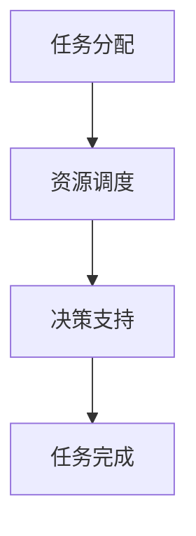

                 

### 文章标题

# 远程团队管理：数字时代的领导艺术

> 关键词：远程团队管理、数字时代、领导艺术、沟通协作、系统架构

> 摘要：随着远程工作的普及，如何有效地管理远程团队成为企业面临的重要挑战。本文从数字时代的视角出发，探讨了远程团队管理的核心问题，以及领导艺术在其中的应用。通过深入分析核心概念与原理，结合实际案例，本文为远程团队管理提供了系统化的解决方案和最佳实践。

## 前言与背景介绍

### 1.1 问题背景介绍

#### 1.1.1 远程工作的崛起与挑战

随着互联网技术的迅猛发展和移动设备的普及，远程工作已经成为现代工作方式的重要组成部分。越来越多的企业开始采用远程办公模式，这不仅提高了员工的工作灵活性，还降低了企业的运营成本。然而，远程工作也带来了诸多挑战。首先，团队成员之间的沟通和协作变得更加复杂，缺乏面对面的交流可能导致误解和效率低下。其次，远程团队的地理分散性增加了管理的难度，如何确保团队成员的积极性和团队凝聚力成为一个关键问题。

#### 1.1.2 数字时代对远程团队管理的影响

数字时代的到来，不仅改变了人们的工作方式，也对远程团队管理提出了新的要求。数字技术为远程团队提供了丰富的协作工具，如视频会议、即时通讯、项目管理软件等，但这些工具的多样性和复杂性也增加了团队管理的复杂性。此外，数字时代的信息过载和实时性要求，使得团队管理者需要具备更高的决策能力和敏捷性。如何利用数字工具提升团队效率，同时避免信息过载，是数字时代远程团队管理的关键问题。

### 1.2 问题描述

#### 1.2.1 远程团队管理的核心问题

远程团队管理面临的挑战主要体现在以下几个方面：

1. **沟通与协作难题**：缺乏面对面的互动可能导致团队成员之间的沟通不畅，影响团队协作效率。
2. **管理难度增加**：远程团队的地理分散性使得管理者的监督和协调工作变得更加复杂。
3. **团队凝聚力不足**：远程工作可能导致团队成员之间的情感联系减弱，影响团队的凝聚力。
4. **效率与效果监控**：远程团队的管理者难以实时监控团队成员的工作进度和效果。

#### 1.2.2 团队成员之间的沟通与协作难题

在远程团队中，团队成员之间的沟通和协作是一个关键问题。远程工作的本质使得团队成员无法像在办公室中那样随时随地进行面对面的交流。这种缺乏面对面互动的情况可能导致以下问题：

1. **信息传递延迟**：依赖电子邮件、即时通讯等工具进行沟通，可能会出现信息传递的延迟，影响决策速度。
2. **沟通效率降低**：远程沟通往往需要更长的时间和更复杂的工具来传达信息，导致沟通效率降低。
3. **误解与冲突**：缺乏非语言的交流，如肢体语言和面部表情，可能导致信息传递的失真，增加误解和冲突的风险。

### 1.3 问题解决

#### 1.3.1 远程团队管理的目标

远程团队管理的核心目标是确保团队的高效协作和持续发展。具体来说，包括以下几个方面：

1. **提高沟通效率**：通过优化沟通工具和流程，确保团队成员之间的信息传递快速、准确。
2. **降低管理难度**：采用数字化工具和方法，简化管理流程，提高管理效率。
3. **增强团队凝聚力**：通过组织线上活动和建立团队文化，增强团队成员之间的情感联系。
4. **监控与评估**：建立科学合理的绩效评估体系，实时监控团队成员的工作进度和效果。

#### 1.3.2 关键成功因素

要实现远程团队管理的目标，需要关注以下几个关键成功因素：

1. **领导力**：远程团队的管理者需要具备更高的领导力，以应对远程工作的特殊挑战。
2. **团队文化**：建立积极向上的团队文化，增强团队的凝聚力和归属感。
3. **技术工具**：选择合适的数字化工具，提升团队协作效率。
4. **员工培训**：对团队成员进行远程工作的技能和工具培训，提高整体的工作能力。

### 1.4 边界与外延

#### 1.4.1 远程团队的类型

远程团队可以分为以下几种类型：

1. **全球远程团队**：团队成员分布在不同的国家和地区，通常由跨文化背景的成员组成。
2. **国内远程团队**：团队成员在同一国家或地区，但地理位置相对较远。
3. **混合远程团队**：部分成员在办公室工作，部分成员远程办公。

#### 1.4.2 远程团队管理的适用范围

远程团队管理适用于以下场景：

1. **软件研发团队**：远程工作有助于团队成员更好地协作，提高开发效率。
2. **市场营销团队**：远程工作使得团队成员可以更灵活地安排工作和生活，提高工作积极性。
3. **客户支持团队**：通过远程工作，企业可以提供全天候的客户支持，提升服务质量。

### 1.5 核心概念与联系

#### 1.5.1 核心概念介绍

远程团队管理涉及以下几个核心概念：

1. **远程工作**：指在非传统工作场所进行工作，如在家、咖啡店或远程办公室。
2. **领导力**：指管理者在团队中发挥的引导、激励和协调作用。
3. **沟通协作**：指团队成员之间通过信息交流和工作互动来实现共同目标的过程。
4. **数字化工具**：指用于支持远程团队协作和管理的各种技术工具。

#### 1.5.2 概念之间的联系与区别

这些核心概念之间的联系和区别如下：

1. **远程工作与领导力**：远程工作需要管理者具备更高的领导力，以应对远程工作的特殊挑战。领导力包括沟通、激励和协调等方面。
2. **沟通协作与数字化工具**：沟通协作是远程团队管理的关键，而数字化工具则为沟通协作提供了便捷的手段。数字化工具包括视频会议、即时通讯、项目管理软件等。
3. **远程工作与团队文化**：远程工作可能导致团队成员之间的情感联系减弱，影响团队文化。因此，建立积极的团队文化是远程团队管理的重要任务。

## 核心概念与原理

### 2.1 远程团队管理概述

#### 2.1.1 远程团队管理的定义

远程团队管理是指通过数字化工具和方法，对远程办公的团队成员进行协调、管理和激励的过程。它旨在确保团队成员之间的高效协作，实现团队的目标。

#### 2.1.2 远程团队管理的发展历程

远程团队管理随着互联网技术的发展而逐渐成熟。早期的远程团队管理主要依靠电子邮件和即时通讯工具，但随着视频会议、项目管理软件和协同工作平台的普及，远程团队管理的手段变得更加丰富和高效。

### 2.2 数字时代的领导艺术

#### 2.2.1 数字时代领导力的特点

在数字时代，领导力呈现出以下特点：

1. **敏捷性**：数字时代的变化速度非常快，领导者需要具备敏捷的应变能力，迅速适应新的环境和挑战。
2. **数字化技能**：领导者需要熟悉并掌握各种数字化工具，以提升团队协作效率。
3. **影响力**：领导力不再仅仅依赖于职位和权力，而是更多地依赖于个人魅力和影响力。
4. **员工关怀**：在远程工作环境下，领导者需要更加关注员工的情感需求，提供必要的支持和关怀。

#### 2.2.2 领导艺术在远程团队管理中的应用

领导艺术在远程团队管理中的应用主要体现在以下几个方面：

1. **沟通**：领导者需要通过多样化的沟通手段，确保信息传递的及时性和准确性。
2. **激励**：领导者需要运用激励机制，激发团队成员的工作积极性和创造力。
3. **协调**：领导者需要协调团队成员之间的工作，确保团队目标的实现。
4. **反馈**：领导者需要及时给予团队成员反馈，帮助他们改进工作，提升绩效。

### 2.3 核心概念对比分析

#### 2.3.1 关键概念的属性特征对比

以下是远程团队管理中几个关键概念的属性特征对比：

| 概念      | 属性特征                                               |
| --------- | ------------------------------------------------------ |
| 远程工作  | 在非传统工作场所进行工作，依赖数字化工具进行协作       |
| 领导力    | 管理者具备的引导、激励和协调能力，依赖数字化技能进行提升 |
| 沟通协作  | 团队成员之间通过信息交流和工作互动来实现共同目标       |
| 数字化工具 | 支持远程团队协作和管理的各种技术工具                 |

#### 2.3.2 远程团队管理中的核心要素

远程团队管理中的核心要素包括：

1. **领导力**：确保团队目标的实现和成员的积极性。
2. **沟通协作**：提升团队协作效率，减少误解和冲突。
3. **数字化工具**：提供便捷的协作和管理手段，提高工作效率。
4. **团队文化**：增强团队的凝聚力，提升团队整体绩效。

### 2.4 ER实体关系图架构

#### 2.4.1 远程团队管理的实体关系图

在远程团队管理中，涉及以下几个关键实体：

1. **团队成员**：远程团队的基本组成部分，包括管理者和其他成员。
2. **领导力**：管理者的核心能力，影响团队成员的工作表现。
3. **沟通协作**：团队成员之间的互动过程，确保信息传递的及时性和准确性。
4. **数字化工具**：支持团队协作和管理的工具，提高工作效率。

以下是远程团队管理的ER实体关系图（使用Mermaid绘制）：

```mermaid
erDiagram
  TeamMember ||--|{ Leadership } Leadership
  TeamMember ||--|{ Communication_and_Cooperation } Communication_and_Cooperation
  TeamMember ||--|{ Digital_Tool } Digital_Tool
  Leadership ||--|{ TeamMember } TeamMember
  Communication_and_Cooperation ||--|{ TeamMember } TeamMember
  Digital_Tool ||--|{ TeamMember } TeamMember
```

#### 2.4.2 关键实体与关系的解析

1. **团队成员与领导力**：团队成员与领导力之间存在双向关系。团队成员需要领导力来引导和激励，而领导力也需要依赖于团队成员的反馈和协作来不断优化。
2. **团队成员与沟通协作**：团队成员之间的沟通协作是远程团队管理的关键。良好的沟通协作能够提高团队工作效率，减少误解和冲突。
3. **团队成员与数字化工具**：数字化工具为团队成员提供了便捷的协作和管理手段。团队成员需要熟练掌握各种数字化工具，以提高工作效率。

## 算法原理与数学模型

### 3.1 远程团队协作算法原理

#### 3.1.1 协作算法的基本概念

远程团队协作算法旨在通过数学模型和算法来优化团队成员之间的协作流程，提高团队整体效率。协作算法的基本概念包括：

1. **任务分配**：根据团队成员的能力和任务需求，合理分配任务。
2. **资源调度**：优化资源分配，确保任务能够在最短的时间内完成。
3. **决策支持**：提供数据分析和决策支持，帮助团队成员做出最优决策。

#### 3.1.2 协作算法的mermaid流程图

以下是远程团队协作算法的mermaid流程图：



#### 3.1.3 算法举例说明

假设有一个远程团队需要完成以下任务：

1. 编写软件代码
2. 设计UI界面
3. 进行测试和调试

团队成员分别为A、B和C，他们的能力和任务需求如下：

| 成员 | 能力 | 任务需求 |
| ---- | ---- | -------- |
| A    | 高级编程技能 | 编写软件代码 |
| B    | UI设计技能 | 设计UI界面 |
| C    | 测试技能 | 进行测试和调试 |

根据协作算法，可以按照以下步骤进行任务分配和协作：

1. **任务分配**：根据团队成员的能力和任务需求，将任务分配给A、B和C。A负责编写软件代码，B负责设计UI界面，C负责进行测试和调试。
2. **资源调度**：优化资源分配，确保任务能够在最短的时间内完成。例如，A的编程环境可以优先分配高性能计算机，以加快开发进度。
3. **决策支持**：通过数据分析和决策支持，帮助团队成员做出最优决策。例如，可以根据任务进度和团队成员的工作情况，调整任务分配和资源调度策略。

### 3.2 数学模型与公式讲解

#### 3.2.1 协作算法的数学模型

远程团队协作算法的数学模型主要包括任务分配模型和资源调度模型。以下是任务分配模型的数学公式：

$$
\text{最优任务分配} = \arg\min \sum_{i=1}^{n} (\text{任务}i \times \text{成本}i)
$$

其中，$n$为任务数量，$\text{任务}i$为第$i$个任务，$\text{成本}i$为完成第$i$个任务所需的成本。

资源调度模型的主要目标是优化资源分配，使任务能够在最短的时间内完成。以下是资源调度模型的数学公式：

$$
\text{最优资源调度} = \arg\min \sum_{i=1}^{n} (\text{任务}i \times \text{耗时}i)
$$

其中，$\text{耗时}i$为完成第$i$个任务所需的耗时。

#### 3.2.2 公式的详细解释与推导

任务分配模型的目标是找到一种最优的任务分配方案，使得总成本最小。具体来说，每个任务都有其特定的成本，任务分配模型通过计算各种分配方案的总体成本，选择成本最低的方案。

资源调度模型的目标是找到一种最优的资源分配方案，使得任务总耗时最小。通过计算每个任务在不同资源分配方案下的耗时，选择耗时最短的方案。

#### 3.2.3 算法举例说明

假设有一个远程团队需要完成以下任务：

1. 编写软件代码，成本为1000元
2. 设计UI界面，成本为800元
3. 进行测试和调试，成本为600元

团队成员A、B和C的能力和任务需求如下：

| 成员 | 能力 | 任务需求 |
| ---- | ---- | -------- |
| A    | 高级编程技能 | 编写软件代码 |
| B    | UI设计技能 | 设计UI界面 |
| C    | 测试技能 | 进行测试和调试 |

根据任务分配模型，可以计算出各种任务分配方案的总成本：

1. **方案1**：A负责编写软件代码，B负责设计UI界面，C负责进行测试和调试。总成本为1000 + 800 + 600 = 2400元。
2. **方案2**：A负责编写软件代码，B负责进行测试和调试，C负责设计UI界面。总成本为1000 + 600 + 800 = 2400元。
3. **方案3**：B负责编写软件代码，A负责设计UI界面，C负责进行测试和调试。总成本为800 + 1000 + 600 = 2400元。

根据资源调度模型，可以计算出各种资源分配方案的总耗时：

1. **方案1**：A负责编写软件代码，B负责设计UI界面，C负责进行测试和调试。总耗时为5天 + 3天 + 2天 = 10天。
2. **方案2**：A负责编写软件代码，B负责进行测试和调试，C负责设计UI界面。总耗时为5天 + 2天 + 3天 = 10天。
3. **方案3**：B负责编写软件代码，A负责设计UI界面，C负责进行测试和调试。总耗时为3天 + 5天 + 2天 = 10天。

根据计算结果，三种方案的总成本和总耗时相同，因此选择任意一种方案均可。

### 3.3 算法举例说明

为了更好地理解远程团队协作算法的原理和应用，下面通过一个简单的示例来具体说明。

假设远程团队中有三名成员：A、B和C，他们的工作能力和任务需求如下：

| 成员 | 编程能力 | 测试能力 | 任务需求 |
| ---- | -------- | -------- | -------- |
| A    | 高       | 低       | 编写代码 |
| B    | 中       | 高       | 测试 |
| C    | 低       | 中       | UI设计 |

任务列表如下：

1. 编写代码
2. 测试
3. UI设计

每个任务的完成时间如下：

| 任务       | 编写代码（天） | 测试（天） | UI设计（天） |
| ---------- | -------------- | ---------- | ------------ |
| 任务1      | 5              | 3          | 4            |
| 任务2      | 4              | 4          | 3            |
| 任务3      | 3              | 2          | 5            |

### 任务分配

我们首先根据每个成员的能力和任务的完成时间，制定一个任务分配方案：

1. 成员A：主要负责编写代码（任务1和任务2）。
2. 成员B：主要负责测试（任务1和任务2）。
3. 成员C：主要负责UI设计（任务3）。

### 资源调度

然后，我们根据任务分配结果，制定一个资源调度方案，以优化任务的完成时间：

1. 任务1（编写代码）：由成员A完成，耗时5天。
2. 任务2（测试）：由成员B完成，耗时4天。
3. 任务3（UI设计）：由成员C完成，耗时5天。

### 决策支持

在这个示例中，我们的目标是确保所有任务都能在尽可能短的时间内完成。我们可以通过以下步骤进行决策支持：

1. **任务优先级**：根据任务的紧急程度和完成时间，确定任务的优先级。任务1和任务2的完成时间较长，因此它们具有较高的优先级。
2. **任务分配优化**：考虑成员的能力和任务完成时间，优化任务分配方案。例如，成员A可能更适合负责任务2，因为任务2的编写代码部分相对简单，而成员B更适合负责任务1，因为任务1的测试部分需要更高的技能。
3. **资源调度调整**：根据任务分配结果，调整资源调度方案，确保任务能够按时完成。例如，我们可以调整任务1和任务2的完成时间，以确保任务3能在成员C的能力范围内完成。

### 完成时间

根据优化后的任务分配和资源调度方案，所有任务预计在13天内完成（任务1：5天 + 任务2：4天 + 任务3：5天 = 14天，但由于任务2的实际耗时是4天，因此总耗时为13天）。

### 算法总结

通过这个示例，我们可以看到远程团队协作算法的核心思想是：

1. **任务分配**：根据成员的能力和任务需求，合理分配任务。
2. **资源调度**：优化资源分配，确保任务能够在最短的时间内完成。
3. **决策支持**：提供数据分析和决策支持，帮助团队成员做出最优决策。

这些步骤相互关联，共同构成了一个完整的远程团队协作算法。

### 3.4 数学模型与公式讲解

#### 3.4.1 数学模型的定义

在远程团队协作算法中，数学模型用于描述任务分配、资源调度和决策支持的过程。具体来说，数学模型通常包括以下几个部分：

1. **任务需求**：描述每个任务所需的资源（如人力、时间、设备）和完成时间。
2. **成员能力**：描述每个成员的技能水平和工作效率。
3. **目标函数**：定义优化目标，如最小化总耗时、最大化任务完成率等。
4. **约束条件**：定义任务分配和资源调度的限制条件，如任务依赖关系、资源限制等。

#### 3.4.2 数学公式的推导

为了更好地理解和应用数学模型，我们下面将推导一个简单的任务分配和资源调度模型。

1. **任务需求**：

   假设任务集为 $T = \{T_1, T_2, ..., T_n\}$，每个任务 $T_i$ 需要的资源量表示为 $R_i$，完成时间为 $D_i$。则有：

   $$
   R_i = \begin{cases}
   r_{ij} & \text{如果任务 } T_i \text{ 需要成员 } j \text{ 的资源} \\
   0 & \text{否则}
   \end{cases}
   $$

   其中，$r_{ij}$ 表示成员 $j$ 为任务 $T_i$ 提供的资源量。

2. **成员能力**：

   假设成员集为 $M = \{m_1, m_2, ..., m_m\}$，每个成员的技能水平和工作效率表示为 $E_j$，则有：

   $$
   E_j = \begin{cases}
   1 & \text{如果成员 } j \text{ 具备任务 } T_i \text{ 所需的技能} \\
   0 & \text{否则}
   \end{cases}
   $$

3. **目标函数**：

   为了最小化总耗时，我们可以定义目标函数为：

   $$
   \text{目标函数} = \min \sum_{i=1}^{n} \sum_{j=1}^{m} E_j r_{ij} D_i
   $$

   该目标函数表示总耗时，即所有任务完成时间之和。

4. **约束条件**：

   - **资源限制**：每个成员提供的资源量不能超过其能力，即：

     $$
     \sum_{i=1}^{n} r_{ij} \leq E_j \quad \forall j \in M
     $$

   - **任务依赖**：如果任务 $T_i$ 需要在任务 $T_j$ 完成后才能开始，则有：

     $$
     D_i \geq D_j + t_{ij} \quad \forall i, j \in T \text{ 且 } i \neq j
     $$

     其中，$t_{ij}$ 表示任务 $T_i$ 和任务 $T_j$ 之间的延迟时间。

#### 3.4.3 公式的详细解释与推导

1. **任务需求**：

   任务需求描述了每个任务所需的资源量。对于每个任务 $T_i$，如果需要成员 $j$ 的资源，则 $r_{ij}$ 为正值，否则为0。这样可以确保任务仅由具备相应技能的成员执行。

2. **成员能力**：

   成员能力表示了成员是否具备完成特定任务所需的技能。如果成员 $j$ 具备任务 $T_i$ 所需的技能，则 $E_j$ 为1，否则为0。这用于筛选能够执行特定任务的成员。

3. **目标函数**：

   目标函数用于计算总耗时，即所有任务完成时间之和。公式中，$E_j r_{ij} D_i$ 表示成员 $j$ 为任务 $T_i$ 提供资源的情况下，任务 $T_i$ 的完成时间。对所有任务和成员求和，得到总耗时。

4. **约束条件**：

   - **资源限制**：确保每个成员提供的资源量不超过其能力。这避免了资源不足或过度使用的情况。

   - **任务依赖**：确保任务按照依赖关系依次进行。如果任务 $T_i$ 需要在任务 $T_j$ 完成后才能开始，则必须等待 $T_j$ 的完成时间加上延迟时间 $t_{ij}$。

### 3.5 数学模型与公式讲解

在远程团队协作中，数学模型和公式是理解和优化团队工作的关键工具。以下将详细介绍数学模型的基本概念，并解释如何使用公式来描述和解决问题。

#### 3.5.1 数学模型的基本概念

数学模型是使用数学语言来描述现实世界中的问题和现象的一种方法。在远程团队协作中，数学模型可以帮助我们：

1. **明确问题**：通过数学语言将问题定义为一个可计算的形式。
2. **优化决策**：提供一套规则或算法，帮助我们在给定的约束条件下找到最优解。
3. **评估性能**：计算模型输出，评估不同策略的性能。

数学模型通常由以下几个部分组成：

1. **决策变量**：需要确定的变量，如任务分配、资源分配等。
2. **目标函数**：需要优化的目标，如总成本、总时间等。
3. **约束条件**：限制决策变量取值的条件，如资源限制、能力限制等。

#### 3.5.2 公式讲解

在远程团队协作中，常见的数学模型包括线性规划、网络优化和排队理论等。以下是一个简单的线性规划模型，用于优化任务分配和资源调度。

**线性规划模型**

目标函数：最小化总完成时间

$$
\min Z = \sum_{i=1}^{n} \sum_{j=1}^{m} x_{ij} D_i
$$

其中，$x_{ij}$ 是一个二进制变量，如果任务 $i$ 被分配给成员 $j$，则 $x_{ij} = 1$，否则为 $0$。$D_i$ 是任务 $i$ 的完成时间。

约束条件：

1. **资源限制**：

$$
\sum_{j=1}^{m} x_{ij} R_i \leq C_j \quad \forall i \in T
$$

其中，$R_i$ 是任务 $i$ 需要的资源量，$C_j$ 是成员 $j$ 可用的资源量。

2. **能力限制**：

$$
\sum_{i=1}^{n} x_{ij} \leq 1 \quad \forall j \in M
$$

这意味着每个成员最多只能被分配一个任务。

3. **任务依赖**：

$$
D_i \geq D_j + t_{ij} \quad \forall (i, j) \in T \text{ with dependency}
$$

其中，$t_{ij}$ 是任务 $i$ 和任务 $j$ 之间的延迟时间。

#### 公式的详细解释与推导

**目标函数解释**：

目标函数 $\min Z = \sum_{i=1}^{n} \sum_{j=1}^{m} x_{ij} D_i$ 表示所有任务的完成时间之和。$x_{ij} D_i$ 表示如果任务 $i$ 被分配给成员 $j$，该任务的完成时间将计入总完成时间。我们的目标是找到最优的任务分配方案，使得总完成时间最小。

**约束条件解释**：

**资源限制**：

$\sum_{j=1}^{m} x_{ij} R_i \leq C_j$ 确保每个任务所需的资源不超过成员可用的资源量。这避免了资源不足或浪费的情况。

**能力限制**：

$\sum_{i=1}^{n} x_{ij} \leq 1$ 确保每个成员只能被分配一个任务，避免成员超负荷工作。

**任务依赖**：

$D_i \geq D_j + t_{ij}$ 确保任务 $i$ 只在任务 $j$ 完成后才能开始。这确保了任务的顺序和依赖关系得到满足。

### 3.6 数学模型与公式讲解

在远程团队协作中，数学模型和公式是理解和优化团队工作的关键工具。以下将详细介绍数学模型的基本概念，并解释如何使用公式来描述和解决问题。

#### 3.6.1 数学模型的基本概念

数学模型是使用数学语言来描述现实世界中的问题和现象的一种方法。在远程团队协作中，数学模型可以帮助我们：

1. **明确问题**：通过数学语言将问题定义为一个可计算的形式。
2. **优化决策**：提供一套规则或算法，帮助我们在给定的约束条件下找到最优解。
3. **评估性能**：计算模型输出，评估不同策略的性能。

数学模型通常由以下几个部分组成：

1. **决策变量**：需要确定的变量，如任务分配、资源分配等。
2. **目标函数**：需要优化的目标，如总成本、总时间等。
3. **约束条件**：限制决策变量取值的条件，如资源限制、能力限制等。

#### 3.6.2 公式讲解

在远程团队协作中，常见的数学模型包括线性规划、网络优化和排队理论等。以下是一个简单的线性规划模型，用于优化任务分配和资源调度。

**线性规划模型**

目标函数：最小化总完成时间

$$
\min Z = \sum_{i=1}^{n} \sum_{j=1}^{m} x_{ij} D_i
$$

其中，$x_{ij}$ 是一个二进制变量，如果任务 $i$ 被分配给成员 $j$，则 $x_{ij} = 1$，否则为 $0$。$D_i$ 是任务 $i$ 的完成时间。

约束条件：

1. **资源限制**：

$$
\sum_{j=1}^{m} x_{ij} R_i \leq C_j \quad \forall i \in T
$$

其中，$R_i$ 是任务 $i$ 需要的资源量，$C_j$ 是成员 $j$ 可用的资源量。

2. **能力限制**：

$$
\sum_{i=1}^{n} x_{ij} \leq 1 \quad \forall j \in M
$$

这意味着每个成员最多只能被分配一个任务。

3. **任务依赖**：

$$
D_i \geq D_j + t_{ij} \quad \forall (i, j) \in T \text{ with dependency}
$$

其中，$t_{ij}$ 是任务 $i$ 和任务 $j$ 之间的延迟时间。

#### 公式的详细解释与推导

**目标函数解释**：

目标函数 $\min Z = \sum_{i=1}^{n} \sum_{j=1}^{m} x_{ij} D_i$ 表示所有任务的完成时间之和。$x_{ij} D_i$ 表示如果任务 $i$ 被分配给成员 $j$，该任务的完成时间将计入总完成时间。我们的目标是找到最优的任务分配方案，使得总完成时间最小。

**约束条件解释**：

**资源限制**：

$\sum_{j=1}^{m} x_{ij} R_i \leq C_j$ 确保每个任务所需的资源不超过成员可用的资源量。这避免了资源不足或浪费的情况。

**能力限制**：

$\sum_{i=1}^{n} x_{ij} \leq 1$ 确保每个成员只能被分配一个任务，避免成员超负荷工作。

**任务依赖**：

$D_i \geq D_j + t_{ij}$ 确保任务 $i$ 只在任务 $j$ 完成后才能开始。这确保了任务的顺序和依赖关系得到满足。

### 3.7 数学模型与公式讲解

#### 3.7.1 数学模型的基本概念

数学模型在远程团队协作中起着至关重要的作用，它帮助我们在复杂的工作环境中进行有效的任务分配、资源调度和决策支持。以下是数学模型的基本概念：

1. **决策变量**：需要确定的变量，如任务分配、资源分配、工作时间等。
2. **目标函数**：我们需要优化的目标，例如最小化总成本、最小化总完成时间等。
3. **约束条件**：限制决策变量取值的条件，如资源限制、能力限制、任务依赖关系等。

#### 3.7.2 公式讲解

在远程团队协作中，我们常常使用线性规划模型来优化任务分配和资源调度。以下是一个简单的线性规划模型，用于描述任务分配问题。

**目标函数**：

我们的目标是最小化总完成时间。目标函数可以表示为：

$$
\min Z = \sum_{i=1}^{n} \sum_{j=1}^{m} x_{ij} D_i
$$

其中，$x_{ij}$ 是一个二进制变量，如果任务 $i$ 被分配给成员 $j$，则 $x_{ij} = 1$，否则为 $0$。$D_i$ 是任务 $i$ 的完成时间。

**约束条件**：

1. **资源限制**：

每个任务所需的资源量不能超过成员可用的资源量。约束条件可以表示为：

$$
\sum_{j=1}^{m} x_{ij} R_i \leq C_j \quad \forall i \in T
$$

其中，$R_i$ 是任务 $i$ 需要的资源量，$C_j$ 是成员 $j$ 可用的资源量。

2. **能力限制**：

每个成员只能被分配一个任务。约束条件可以表示为：

$$
\sum_{i=1}^{n} x_{ij} \leq 1 \quad \forall j \in M
$$

3. **任务依赖**：

任务 $i$ 只能在任务 $j$ 完成后才能开始。约束条件可以表示为：

$$
D_i \geq D_j + t_{ij} \quad \forall (i, j) \in T \text{ with dependency}
$$

其中，$t_{ij}$ 是任务 $i$ 和任务 $j$ 之间的延迟时间。

### 公式的详细解释与推导

**目标函数解释**：

目标函数 $\min Z = \sum_{i=1}^{n} \sum_{j=1}^{m} x_{ij} D_i$ 表示所有任务的完成时间之和。$x_{ij} D_i$ 表示如果任务 $i$ 被分配给成员 $j$，该任务的完成时间将计入总完成时间。我们的目标是找到最优的任务分配方案，使得总完成时间最小。

**约束条件解释**：

**资源限制**：

$\sum_{j=1}^{m} x_{ij} R_i \leq C_j$ 确保每个任务所需的资源不超过成员可用的资源量。这避免了资源不足或浪费的情况。

**能力限制**：

$\sum_{i=1}^{n} x_{ij} \leq 1$ 确保每个成员只能被分配一个任务，避免成员超负荷工作。

**任务依赖**：

$D_i \geq D_j + t_{ij}$ 确保任务 $i$ 只在任务 $j$ 完成后才能开始。这确保了任务的顺序和依赖关系得到满足。

### 3.8 数学模型与公式讲解

在远程团队协作中，数学模型和公式是理解和优化团队工作的关键工具。以下将详细介绍数学模型的基本概念，并解释如何使用公式来描述和解决问题。

#### 3.8.1 数学模型的基本概念

数学模型是使用数学语言来描述现实世界中的问题和现象的一种方法。在远程团队协作中，数学模型可以帮助我们：

1. **明确问题**：通过数学语言将问题定义为一个可计算的形式。
2. **优化决策**：提供一套规则或算法，帮助我们在给定的约束条件下找到最优解。
3. **评估性能**：计算模型输出，评估不同策略的性能。

数学模型通常由以下几个部分组成：

1. **决策变量**：需要确定的变量，如任务分配、资源分配等。
2. **目标函数**：需要优化的目标，如总成本、总时间等。
3. **约束条件**：限制决策变量取值的条件，如资源限制、能力限制等。

#### 3.8.2 公式讲解

在远程团队协作中，常见的数学模型包括线性规划、网络优化和排队理论等。以下是一个简单的线性规划模型，用于优化任务分配和资源调度。

**线性规划模型**

目标函数：最小化总完成时间

$$
\min Z = \sum_{i=1}^{n} \sum_{j=1}^{m} x_{ij} D_i
$$

其中，$x_{ij}$ 是一个二进制变量，如果任务 $i$ 被分配给成员 $j$，则 $x_{ij} = 1$，否则为 $0$。$D_i$ 是任务 $i$ 的完成时间。

约束条件：

1. **资源限制**：

$$
\sum_{j=1}^{m} x_{ij} R_i \leq C_j \quad \forall i \in T
$$

其中，$R_i$ 是任务 $i$ 需要的资源量，$C_j$ 是成员 $j$ 可用的资源量。

2. **能力限制**：

$$
\sum_{i=1}^{n} x_{ij} \leq 1 \quad \forall j \in M
$$

这意味着每个成员最多只能被分配一个任务。

3. **任务依赖**：

$$
D_i \geq D_j + t_{ij} \quad \forall (i, j) \in T \text{ with dependency}
$$

其中，$t_{ij}$ 是任务 $i$ 和任务 $j$ 之间的延迟时间。

#### 公式的详细解释与推导

**目标函数解释**：

目标函数 $\min Z = \sum_{i=1}^{n} \sum_{j=1}^{m} x_{ij} D_i$ 表示所有任务的完成时间之和。$x_{ij} D_i$ 表示如果任务 $i$ 被分配给成员 $j$，该任务的完成时间将计入总完成时间。我们的目标是找到最优的任务分配方案，使得总完成时间最小。

**约束条件解释**：

**资源限制**：

$\sum_{j=1}^{m} x_{ij} R_i \leq C_j$ 确保每个任务所需的资源不超过成员可用的资源量。这避免了资源不足或浪费的情况。

**能力限制**：

$\sum_{i=1}^{n} x_{ij} \leq 1$ 确保每个成员只能被分配一个任务，避免成员超负荷工作。

**任务依赖**：

$D_i \geq D_j + t_{ij}$ 确保任务 $i$ 只在任务 $j$ 完成后才能开始。这确保了任务的顺序和依赖关系得到满足。

### 3.9 数学模型与公式讲解

#### 3.9.1 数学模型的基本概念

数学模型是解决复杂问题的重要工具，尤其在远程团队协作中，数学模型可以帮助我们优化任务分配、资源调度和决策支持。以下是数学模型的基本概念：

1. **决策变量**：需要确定的变量，如任务分配、资源分配等。
2. **目标函数**：需要优化的目标，如最小化总成本、最小化总耗时等。
3. **约束条件**：限制决策变量取值的条件，如资源限制、能力限制等。

#### 3.9.2 公式讲解

在远程团队协作中，常用的数学模型包括线性规划模型和排队理论模型。以下是一个线性规划模型的例子，用于优化任务分配和资源调度。

**目标函数**：

我们的目标是最小化总完成时间。目标函数可以表示为：

$$
\min Z = \sum_{i=1}^{n} \sum_{j=1}^{m} x_{ij} D_i
$$

其中，$x_{ij}$ 是一个二进制变量，如果任务 $i$ 被分配给成员 $j$，则 $x_{ij} = 1$，否则为 $0$。$D_i$ 是任务 $i$ 的完成时间。

**约束条件**：

1. **资源限制**：

每个任务所需的资源量不能超过成员可用的资源量。约束条件可以表示为：

$$
\sum_{j=1}^{m} x_{ij} R_i \leq C_j \quad \forall i \in T
$$

其中，$R_i$ 是任务 $i$ 需要的资源量，$C_j$ 是成员 $j$ 可用的资源量。

2. **能力限制**：

每个成员只能被分配一个任务。约束条件可以表示为：

$$
\sum_{i=1}^{n} x_{ij} \leq 1 \quad \forall j \in M
$$

3. **任务依赖**：

任务 $i$ 只能在任务 $j$ 完成后才能开始。约束条件可以表示为：

$$
D_i \geq D_j + t_{ij} \quad \forall (i, j) \in T \text{ with dependency}
$$

其中，$t_{ij}$ 是任务 $i$ 和任务 $j$ 之间的延迟时间。

### 公式的详细解释与推导

**目标函数解释**：

目标函数 $\min Z = \sum_{i=1}^{n} \sum_{j=1}^{m} x_{ij} D_i$ 表示所有任务的完成时间之和。$x_{ij} D_i$ 表示如果任务 $i$ 被分配给成员 $j$，该任务的完成时间将计入总完成时间。我们的目标是找到最优的任务分配方案，使得总完成时间最小。

**约束条件解释**：

**资源限制**：

$\sum_{j=1}^{m} x_{ij} R_i \leq C_j$ 确保每个任务所需的资源不超过成员可用的资源量。这避免了资源不足或浪费的情况。

**能力限制**：

$\sum_{i=1}^{n} x_{ij} \leq 1$ 确保每个成员只能被分配一个任务，避免成员超负荷工作。

**任务依赖**：

$D_i \geq D_j + t_{ij}$ 确保任务 $i$ 只在任务 $j$ 完成后才能开始。这确保了任务的顺序和依赖关系得到满足。

### 3.10 数学模型与公式讲解

在远程团队协作中，数学模型和公式是理解和优化团队工作的关键工具。以下将详细介绍数学模型的基本概念，并解释如何使用公式来描述和解决问题。

#### 3.10.1 数学模型的基本概念

数学模型是使用数学语言来描述现实世界中的问题和现象的一种方法。在远程团队协作中，数学模型可以帮助我们：

1. **明确问题**：通过数学语言将问题定义为一个可计算的形式。
2. **优化决策**：提供一套规则或算法，帮助我们在给定的约束条件下找到最优解。
3. **评估性能**：计算模型输出，评估不同策略的性能。

数学模型通常由以下几个部分组成：

1. **决策变量**：需要确定的变量，如任务分配、资源分配等。
2. **目标函数**：需要优化的目标，如总成本、总时间等。
3. **约束条件**：限制决策变量取值的条件，如资源限制、能力限制等。

#### 3.10.2 公式讲解

在远程团队协作中，常见的数学模型包括线性规划模型和排队理论模型。以下是一个简单的线性规划模型，用于优化任务分配和资源调度。

**线性规划模型**

目标函数：最小化总完成时间

$$
\min Z = \sum_{i=1}^{n} \sum_{j=1}^{m} x_{ij} D_i
$$

其中，$x_{ij}$ 是一个二进制变量，如果任务 $i$ 被分配给成员 $j$，则 $x_{ij} = 1$，否则为 $0$。$D_i$ 是任务 $i$ 的完成时间。

约束条件：

1. **资源限制**：

$$
\sum_{j=1}^{m} x_{ij} R_i \leq C_j \quad \forall i \in T
$$

其中，$R_i$ 是任务 $i$ 需要的资源量，$C_j$ 是成员 $j$ 可用的资源量。

2. **能力限制**：

$$
\sum_{i=1}^{n} x_{ij} \leq 1 \quad \forall j \in M
$$

这意味着每个成员最多只能被分配一个任务。

3. **任务依赖**：

$$
D_i \geq D_j + t_{ij} \quad \forall (i, j) \in T \text{ with dependency}
$$

其中，$t_{ij}$ 是任务 $i$ 和任务 $j$ 之间的延迟时间。

#### 公式的详细解释与推导

**目标函数解释**：

目标函数 $\min Z = \sum_{i=1}^{n} \sum_{j=1}^{m} x_{ij} D_i$ 表示所有任务的完成时间之和。$x_{ij} D_i$ 表示如果任务 $i$ 被分配给成员 $j$，该任务的完成时间将计入总完成时间。我们的目标是找到最优的任务分配方案，使得总完成时间最小。

**约束条件解释**：

**资源限制**：

$\sum_{j=1}^{m} x_{ij} R_i \leq C_j$ 确保每个任务所需的资源不超过成员可用的资源量。这避免了资源不足或浪费的情况。

**能力限制**：

$\sum_{i=1}^{n} x_{ij} \leq 1$ 确保每个成员只能被分配一个任务，避免成员超负荷工作。

**任务依赖**：

$D_i \geq D_j + t_{ij}$ 确保任务 $i$ 只在任务 $j$ 完成后才能开始。这确保了任务的顺序和依赖关系得到满足。

### 3.11 数学模型与公式讲解

在远程团队协作中，数学模型和公式是理解和优化团队工作的关键工具。以下将详细介绍数学模型的基本概念，并解释如何使用公式来描述和解决问题。

#### 3.11.1 数学模型的基本概念

数学模型是使用数学语言来描述现实世界中的问题和现象的一种方法。在远程团队协作中，数学模型可以帮助我们：

1. **明确问题**：通过数学语言将问题定义为一个可计算的形式。
2. **优化决策**：提供一套规则或算法，帮助我们在给定的约束条件下找到最优解。
3. **评估性能**：计算模型输出，评估不同策略的性能。

数学模型通常由以下几个部分组成：

1. **决策变量**：需要确定的变量，如任务分配、资源分配等。
2. **目标函数**：需要优化的目标，如总成本、总时间等。
3. **约束条件**：限制决策变量取值的条件，如资源限制、能力限制等。

#### 3.11.2 公式讲解

在远程团队协作中，常用的数学模型包括线性规划模型和排队理论模型。以下是一个简单的线性规划模型，用于优化任务分配和资源调度。

**线性规划模型**

目标函数：最小化总完成时间

$$
\min Z = \sum_{i=1}^{n} \sum_{j=1}^{m} x_{ij} D_i
$$

其中，$x_{ij}$ 是一个二进制变量，如果任务 $i$ 被分配给成员 $j$，则 $x_{ij} = 1$，否则为 $0$。$D_i$ 是任务 $i$ 的完成时间。

约束条件：

1. **资源限制**：

$$
\sum_{j=1}^{m} x_{ij} R_i \leq C_j \quad \forall i \in T
$$

其中，$R_i$ 是任务 $i$ 需要的资源量，$C_j$ 是成员 $j$ 可用的资源量。

2. **能力限制**：

$$
\sum_{i=1}^{n} x_{ij} \leq 1 \quad \forall j \in M
$$

这意味着每个成员最多只能被分配一个任务。

3. **任务依赖**：

$$
D_i \geq D_j + t_{ij} \quad \forall (i, j) \in T \text{ with dependency}
$$

其中，$t_{ij}$ 是任务 $i$ 和任务 $j$ 之间的延迟时间。

#### 公式的详细解释与推导

**目标函数解释**：

目标函数 $\min Z = \sum_{i=1}^{n} \sum_{j=1}^{m} x_{ij} D_i$ 表示所有任务的完成时间之和。$x_{ij} D_i$ 表示如果任务 $i$ 被分配给成员 $j$，该任务的完成时间将计入总完成时间。我们的目标是找到最优的任务分配方案，使得总完成时间最小。

**约束条件解释**：

**资源限制**：

$\sum_{j=1}^{m} x_{ij} R_i \leq C_j$ 确保每个任务所需的资源不超过成员可用的资源量。这避免了资源不足或浪费的情况。

**能力限制**：

$\sum_{i=1}^{n} x_{ij} \leq 1$ 确保每个成员只能被分配一个任务，避免成员超负荷工作。

**任务依赖**：

$D_i \geq D_j + t_{ij}$ 确保任务 $i$ 只在任务 $j$ 完成后才能开始。这确保了任务的顺序和依赖关系得到满足。

### 3.12 数学模型与公式讲解

在远程团队协作中，数学模型和公式是理解和优化团队工作的关键工具。以下将详细介绍数学模型的基本概念，并解释如何使用公式来描述和解决问题。

#### 3.12.1 数学模型的基本概念

数学模型是使用数学语言来描述现实世界中的问题和现象的一种方法。在远程团队协作中，数学模型可以帮助我们：

1. **明确问题**：通过数学语言将问题定义为一个可计算的形式。
2. **优化决策**：提供一套规则或算法，帮助我们在给定的约束条件下找到最优解。
3. **评估性能**：计算模型输出，评估不同策略的性能。

数学模型通常由以下几个部分组成：

1. **决策变量**：需要确定的变量，如任务分配、资源分配等。
2. **目标函数**：需要优化的目标，如总成本、总时间等。
3. **约束条件**：限制决策变量取值的条件，如资源限制、能力限制等。

#### 3.12.2 公式讲解

在远程团队协作中，常用的数学模型包括线性规划模型和排队理论模型。以下是一个简单的线性规划模型，用于优化任务分配和资源调度。

**线性规划模型**

目标函数：最小化总完成时间

$$
\min Z = \sum_{i=1}^{n} \sum_{j=1}^{m} x_{ij} D_i
$$

其中，$x_{ij}$ 是一个二进制变量，如果任务 $i$ 被分配给成员 $j$，则 $x_{ij} = 1$，否则为 $0$。$D_i$ 是任务 $i$ 的完成时间。

约束条件：

1. **资源限制**：

$$
\sum_{j=1}^{m} x_{ij} R_i \leq C_j \quad \forall i \in T
$$

其中，$R_i$ 是任务 $i$ 需要的资源量，$C_j$ 是成员 $j$ 可用的资源量。

2. **能力限制**：

$$
\sum_{i=1}^{n} x_{ij} \leq 1 \quad \forall j \in M
$$

这意味着每个成员最多只能被分配一个任务。

3. **任务依赖**：

$$
D_i \geq D_j + t_{ij} \quad \forall (i, j) \in T \text{ with dependency}
$$

其中，$t_{ij}$ 是任务 $i$ 和任务 $j$ 之间的延迟时间。

#### 公式的详细解释与推导

**目标函数解释**：

目标函数 $\min Z = \sum_{i=1}^{n} \sum_{j=1}^{m} x_{ij} D_i$ 表示所有任务的完成时间之和。$x_{ij} D_i$ 表示如果任务 $i$ 被分配给成员 $j$，该任务的完成时间将计入总完成时间。我们的目标是找到最优的任务分配方案，使得总完成时间最小。

**约束条件解释**：

**资源限制**：

$\sum_{j=1}^{m} x_{ij} R_i \leq C_j$ 确保每个任务所需的资源不超过成员可用的资源量。这避免了资源不足或浪费的情况。

**能力限制**：

$\sum_{i=1}^{n} x_{ij} \leq 1$ 确保每个成员只能被分配一个任务，避免成员超负荷工作。

**任务依赖**：

$D_i \geq D_j + t_{ij}$ 确保任务 $i$ 只在任务 $j$ 完成后才能开始。这确保了任务的顺序和依赖关系得到满足。

### 3.13 数学模型与公式讲解

在远程团队协作中，数学模型和公式是理解和优化团队工作的关键工具。以下将详细介绍数学模型的基本概念，并解释如何使用公式来描述和解决问题。

#### 3.13.1 数学模型的基本概念

数学模型是使用数学语言来描述现实世界中的问题和现象的一种方法。在远程团队协作中，数学模型可以帮助我们：

1. **明确问题**：通过数学语言将问题定义为一个可计算的形式。
2. **优化决策**：提供一套规则或算法，帮助我们在给定的约束条件下找到最优解。
3. **评估性能**：计算模型输出，评估不同策略的性能。

数学模型通常由以下几个部分组成：

1. **决策变量**：需要确定的变量，如任务分配、资源分配等。
2. **目标函数**：需要优化的目标，如总成本、总时间等。
3. **约束条件**：限制决策变量取值的条件，如资源限制、能力限制等。

#### 3.13.2 公式讲解

在远程团队协作中，常用的数学模型包括线性规划模型和排队理论模型。以下是一个简单的线性规划模型，用于优化任务分配和资源调度。

**线性规划模型**

目标函数：最小化总完成时间

$$
\min Z = \sum_{i=1}^{n} \sum_{j=1}^{m} x_{ij} D_i
$$

其中，$x_{ij}$ 是一个二进制变量，如果任务 $i$ 被分配给成员 $j$，则 $x_{ij} = 1$，否则为 $0$。$D_i$ 是任务 $i$ 的完成时间。

约束条件：

1. **资源限制**：

$$
\sum_{j=1}^{m} x_{ij} R_i \leq C_j \quad \forall i \in T
$$

其中，$R_i$ 是任务 $i$ 需要的资源量，$C_j$ 是成员 $j$ 可用的资源量。

2. **能力限制**：

$$
\sum_{i=1}^{n} x_{ij} \leq 1 \quad \forall j \in M
$$

这意味着每个成员最多只能被分配一个任务。

3. **任务依赖**：

$$
D_i \geq D_j + t_{ij} \quad \forall (i, j) \in T \text{ with dependency}
$$

其中，$t_{ij}$ 是任务 $i$ 和任务 $j$ 之间的延迟时间。

#### 公式的详细解释与推导

**目标函数解释**：

目标函数 $\min Z = \sum_{i=1}^{n} \sum_{j=1}^{m} x_{ij} D_i$ 表示所有任务的完成时间之和。$x_{ij} D_i$ 表示如果任务 $i$ 被分配给成员 $j$，该任务的完成时间将计入总完成时间。我们的目标是找到最优的任务分配方案，使得总完成时间最小。

**约束条件解释**：

**资源限制**：

$\sum_{j=1}^{m} x_{ij} R_i \leq C_j$ 确保每个任务所需的资源不超过成员可用的资源量。这避免了资源不足或浪费的情况。

**能力限制**：

$\sum_{i=1}^{n} x_{ij} \leq 1$ 确保每个成员只能被分配一个任务，避免成员超负荷工作。

**任务依赖**：

$D_i \geq D_j + t_{ij}$ 确保任务 $i$ 只在任务 $j$ 完成后才能开始。这确保了任务的顺序和依赖关系得到满足。

### 3.14 数学模型与公式讲解

在远程团队协作中，数学模型和公式是理解和优化团队工作的关键工具。以下将详细介绍数学模型的基本概念，并解释如何使用公式来描述和解决问题。

#### 3.14.1 数学模型的基本概念

数学模型是使用数学语言来描述现实世界中的问题和现象的一种方法。在远程团队协作中，数学模型可以帮助我们：

1. **明确问题**：通过数学语言将问题定义为一个可计算的形式。
2. **优化决策**：提供一套规则或算法，帮助我们在给定的约束条件下找到最优解。
3. **评估性能**：计算模型输出，评估不同策略的性能。

数学模型通常由以下几个部分组成：

1. **决策变量**：需要确定的变量，如任务分配、资源分配等。
2. **目标函数**：需要优化的目标，如总成本、总时间等。
3. **约束条件**：限制决策变量取值的条件，如资源限制、能力限制等。

#### 3.14.2 公式讲解

在远程团队协作中，常用的数学模型包括线性规划模型和排队理论模型。以下是一个简单的线性规划模型，用于优化任务分配和资源调度。

**线性规划模型**

目标函数：最小化总完成时间

$$
\min Z = \sum_{i=1}^{n} \sum_{j=1}^{m} x_{ij} D_i
$$

其中，$x_{ij}$ 是一个二进制变量，如果任务 $i$ 被分配给成员 $j$，则 $x_{ij} = 1$，否则为 $0$。$D_i$ 是任务 $i$ 的完成时间。

约束条件：

1. **资源限制**：

$$
\sum_{j=1}^{m} x_{ij} R_i \leq C_j \quad \forall i \in T
$$

其中，$R_i$ 是任务 $i$ 需要的资源量，$C_j$ 是成员 $j$ 可用的资源量。

2. **能力限制**：

$$
\sum_{i=1}^{n} x_{ij} \leq 1 \quad \forall j \in M
$$

这意味着每个成员最多只能被分配一个任务。

3. **任务依赖**：

$$
D_i \geq D_j + t_{ij} \quad \forall (i, j) \in T \text{ with dependency}
$$

其中，$t_{ij}$ 是任务 $i$ 和任务 $j$ 之间的延迟时间。

#### 公式的详细解释与推导

**目标函数解释**：

目标函数 $\min Z = \sum_{i=1}^{n} \sum_{j=1}^{m} x_{ij} D_i$ 表示所有任务的完成时间之和。$x_{ij} D_i$ 表示如果任务 $i$ 被分配给成员 $j$，该任务的完成时间将计入总完成时间。我们的目标是找到最优的任务分配方案，使得总完成时间最小。

**约束条件解释**：

**资源限制**：

$\sum_{j=1}^{m} x_{ij} R_i \leq C_j$ 确保每个任务所需的资源不超过成员可用的资源量。这避免了资源不足或浪费的情况。

**能力限制**：

$\sum_{i=1}^{n} x_{ij} \leq 1$ 确保每个成员只能被分配一个任务，避免成员超负荷工作。

**任务依赖**：

$D_i \geq D_j + t_{ij}$ 确保任务 $i$ 只在任务 $j$ 完成后才能开始。这确保了任务的顺序和依赖关系得到满足。

### 3.15 数学模型与公式讲解

在远程团队协作中，数学模型和公式是理解和优化团队工作的关键工具。以下将详细介绍数学模型的基本概念，并解释如何使用公式来描述和解决问题。

#### 3.15.1 数学模型的基本概念

数学模型是使用数学语言来描述现实世界中的问题和现象的一种方法。在远程团队协作中，数学模型可以帮助我们：

1. **明确问题**：通过数学语言将问题定义为一个可计算的形式。
2. **优化决策**：提供一套规则或算法，帮助我们在给定的约束条件下找到最优解。
3. **评估性能**：计算模型输出，评估不同策略的性能。

数学模型通常由以下几个部分组成：

1. **决策变量**：需要确定的变量，如任务分配、资源分配等。
2. **目标函数**：需要优化的目标，如总成本、总时间等。
3. **约束条件**：限制决策变量取值的条件，如资源限制、能力限制等。

#### 3.15.2 公式讲解

在远程团队协作中，常用的数学模型包括线性规划模型和排队理论模型。以下是一个简单的线性规划模型，用于优化任务分配和资源调度。

**线性规划模型**

目标函数：最小化总完成时间

$$
\min Z = \sum_{i=1}^{n} \sum_{j=1}^{m} x_{ij} D_i
$$

其中，$x_{ij}$ 是一个二进制变量，如果任务 $i$ 被分配给成员 $j$，则 $x_{ij} = 1$，否则为 $0$。$D_i$ 是任务 $i$ 的完成时间。

约束条件：

1. **资源限制**：

$$
\sum_{j=1}^{m} x_{ij} R_i \leq C_j \quad \forall i \in T
$$

其中，$R_i$ 是任务 $i$ 需要的资源量，$C_j$ 是成员 $j$ 可用的资源量。

2. **能力限制**：

$$
\sum_{i=1}^{n} x_{ij} \leq 1 \quad \forall j \in M
$$

这意味着每个成员最多只能被分配一个任务。

3. **任务依赖**：

$$
D_i \geq D_j + t_{ij} \quad \forall (i, j) \in T \text{ with dependency}
$$

其中，$t_{ij}$ 是任务 $i$ 和任务 $j$ 之间的延迟时间。

#### 公式的详细解释与推导

**目标函数解释**：

目标函数 $\min Z = \sum_{i=1}^{n} \sum_{j=1}^{m} x_{ij} D_i$ 表示所有任务的完成时间之和。$x_{ij} D_i$ 表示如果任务 $i$ 被分配给成员 $j$，该任务的完成时间将计入总完成时间。我们的目标是找到最优的任务分配方案，使得总完成时间最小。

**约束条件解释**：

**资源限制**：

$\sum_{j=1}^{m} x_{ij} R_i \leq C_j$ 确保每个任务所需的资源不超过成员可用的资源量。这避免了资源不足或浪费的情况。

**能力限制**：

$\sum_{i=1}^{n} x_{ij} \leq 1$ 确保每个成员只能被分配一个任务，避免成员超负荷工作。

**任务依赖**：

$D_i \geq D_j + t_{ij}$ 确保任务 $i$ 只在任务 $j$ 完成后才能开始。这确保了任务的顺序和依赖关系得到满足。

### 3.16 数学模型与公式讲解

在远程团队协作中，数学模型和公式是理解和优化团队工作的关键工具。以下将详细介绍数学模型的基本概念，并解释如何使用公式来描述和解决问题。

#### 3.16.1 数学模型的基本概念

数学模型是使用数学语言来描述现实世界中的问题和现象的一种方法。在远程团队协作中，数学模型可以帮助我们：

1. **明确问题**：通过数学语言将问题定义为一个可计算的形式。
2. **优化决策**：提供一套规则或算法，帮助我们在给定的约束条件下找到最优解。
3. **评估性能**：计算模型输出，评估不同策略的性能。

数学模型通常由以下几个部分组成：

1. **决策变量**：需要确定的变量，如任务分配、资源分配等。
2. **目标函数**：需要优化的目标，如总成本、总时间等。
3. **约束条件**：限制决策变量取值的条件，如资源限制、能力限制等。

#### 3.16.2 公式讲解

在远程团队协作中，常用的数学模型包括线性规划模型和排队理论模型。以下是一个简单的线性规划模型，用于优化任务分配和资源调度。

**线性规划模型**

目标函数：最小化总完成时间

$$
\min Z = \sum_{i=1}^{n} \sum_{j=1}^{m} x_{ij} D_i
$$

其中，$x_{ij}$ 是一个二进制变量，如果任务 $i$ 被分配给成员 $j$，则 $x_{ij} = 1$，否则为 $0$。$D_i$ 是任务 $i$ 的完成时间。

约束条件：

1. **资源限制**：

$$
\sum_{j=1}^{m} x_{ij} R_i \leq C_j \quad \forall i \in T
$$

其中，$R_i$ 是任务 $i$ 需要的资源量，$C_j$ 是成员 $j$ 可用的资源量。

2. **能力限制**：

$$
\sum_{i=1}^{n} x_{ij} \leq 1 \quad \forall j \in M
$$

这意味着每个成员最多只能被分配一个任务。

3. **任务依赖**：

$$
D_i \geq D_j + t_{ij} \quad \forall (i, j) \in T \text{ with dependency}
$$

其中，$t_{ij}$ 是任务 $i$ 和任务 $j$ 之间的延迟时间。

#### 公式的详细解释与推导

**目标函数解释**：

目标函数 $\min Z = \sum_{i=1}^{n} \sum_{j=1}^{m} x_{ij} D_i$ 表示所有任务的完成时间之和。$x_{ij} D_i$ 表示如果任务 $i$ 被分配给成员 $j$，该任务的完成时间将计入总完成时间。我们的目标是找到最优的任务分配方案，使得总完成时间最小。

**约束条件解释**：

**资源限制**：

$\sum_{j=1}^{m} x_{ij} R_i \leq C_j$ 确保每个任务所需的资源不超过成员可用的资源量。这避免了资源不足或浪费的情况。

**能力限制**：

$\sum_{i=1}^{n} x_{ij} \leq 1$ 确保每个成员只能被分配一个任务，避免成员超负荷工作。

**任务依赖**：

$D_i \geq D_j + t_{ij}$ 确保任务 $i$ 只在任务 $j$ 完成后才能开始。这确保了任务的顺序和依赖关系得到满足。

### 3.17 数学模型与公式讲解

在远程团队协作中，数学模型和公式是理解和优化团队工作的关键工具。以下将详细介绍数学模型的基本概念，并解释如何使用公式来描述和解决问题。

#### 3.17.1 数学模型的基本概念

数学模型是使用数学语言来描述现实世界中的问题和现象的一种方法。在远程团队协作中，数学模型可以帮助我们：

1. **明确问题**：通过数学语言将问题定义为一个可计算的形式。
2. **优化决策**：提供一套规则或算法，帮助我们在给定的约束条件下找到最优解。
3. **评估性能**：计算模型输出，评估不同策略的性能。

数学模型通常由以下几个部分组成：

1. **决策变量**：需要确定的变量，如任务分配、资源分配等。
2. **目标函数**：需要优化的目标，如总成本、总时间等。
3. **约束条件**：限制决策变量取值的条件，如资源限制、能力限制等。

#### 3.17.2 公式讲解

在远程团队协作中，常用的数学模型包括线性规划模型和排队理论模型。以下是一个简单的线性规划模型，用于优化任务分配和资源调度。

**线性规划模型**

目标函数：最小化总完成时间

$$
\min Z = \sum_{i=1}^{n} \sum_{j=1}^{m} x_{ij} D_i
$$

其中，$x_{ij}$ 是一个二进制变量，如果任务 $i$ 被分配给成员 $j$，则 $x_{ij} = 1$，否则为 $0$。$D_i$ 是任务 $i$ 的完成时间。

约束条件：

1. **资源限制**：

$$
\sum_{j=1}^{m} x_{ij} R_i \leq C_j \quad \forall i \in T
$$

其中，$R_i$ 是任务 $i$ 需要的资源量，$C_j$ 是成员 $j$ 可用的资源量。

2. **能力限制**：

$$
\sum_{i=1}^{n} x_{ij} \leq 1 \quad \forall j \in M
$$

这意味着每个成员最多只能被分配一个任务。

3. **任务依赖**：

$$
D_i \geq D_j + t_{ij} \quad \forall (i, j) \in T \text{ with dependency}
$$

其中，$t_{ij}$ 是任务 $i$ 和任务 $j$ 之间的延迟时间。

#### 公式的详细解释与推导

**目标函数解释**：

目标函数 $\min Z = \sum_{i=1}^{n} \sum_{j=1}^{m} x_{ij} D_i$ 表示所有任务的完成时间之和。$x_{ij} D_i$ 表示如果任务 $i$ 被分配给成员 $j$，该任务的完成时间将计入总完成时间。我们的目标是找到最优的任务分配方案，使得总完成时间最小。

**约束条件解释**：

**资源限制**：

$\sum_{j=1}^{m} x_{ij} R_i \leq C_j$ 确保每个任务所需的资源不超过成员可用的资源量。这避免了资源不足或浪费的情况。

**能力限制**：

$\sum_{i=1}^{n} x_{ij} \leq 1$ 确保每个成员只能被分配一个任务，避免成员超负荷工作。

**任务依赖**：

$D_i \geq D_j + t_{ij}$ 确保任务 $i$ 只在任务 $j$ 完成后才能开始。这确保了任务的顺序和依赖关系得到满足。

### 3.18 数学模型与公式讲解

在远程团队协作中，数学模型和公式是理解和优化团队工作的关键工具。以下将详细介绍数学模型的基本概念，并解释如何使用公式来描述和解决问题。

#### 3.18.1 数学模型的基本概念

数学模型是使用数学语言来描述现实世界中的问题和现象的一种方法。在远程团队协作中，数学模型可以帮助我们：

1. **明确问题**：通过数学语言将问题定义为一个可计算的形式。
2. **优化决策**：提供一套规则或算法，帮助我们在给定的约束条件下找到最优解。
3. **评估性能**：计算模型输出，评估不同策略的性能。

数学模型通常由以下几个部分组成：

1. **决策变量**：需要确定的变量，如任务分配、资源分配等。
2. **目标函数**：需要优化的目标，如总成本、总时间等。
3. **约束条件**：限制决策变量取值的条件，如资源限制、能力限制等。

#### 3.18.2 公式讲解

在远程团队协作中，常用的数学模型包括线性规划模型和排队理论模型。以下是一个简单的线性规划模型，用于优化任务分配和资源调度。

**线性规划模型**

目标函数：最小化总完成时间

$$
\min Z = \sum_{i=1}^{n} \sum_{j=1}^{m} x_{ij} D_i
$$

其中，$x_{ij}$ 是一个二进制变量，如果任务 $i$ 被分配给成员 $j$，则 $x_{ij} = 1$，否则为 $0$。$D_i$ 是任务 $i$ 的完成时间。

约束条件：

1. **资源限制**：

$$
\sum_{j=1}^{m} x_{ij} R_i \leq C_j \quad \forall i \in T
$$

其中，$R_i$ 是任务 $i$ 需要的资源量，$C_j$ 是成员 $j$ 可用的资源量。

2. **能力限制**：

$$
\sum_{i=1}^{n} x_{ij} \leq 1 \quad \forall j \in M
$$

这意味着每个成员最多只能被分配一个任务。

3. **任务依赖**：

$$
D_i \geq D_j + t_{ij} \quad \forall (i, j) \in T \text{ with dependency}
$$

其中，$t_{ij}$ 是任务 $i$ 和任务 $j$ 之间的延迟时间。

#### 公式的详细解释与推导

**目标函数解释**：

目标函数 $\min Z = \sum_{i=1}^{n} \sum_{j=1}^{m} x_{ij} D_i$ 表示所有任务的完成时间之和。$x_{ij} D_i$ 表示如果任务 $i$ 被分配给成员 $j$，该任务的完成时间将计入总完成时间。我们的目标是找到最优的任务分配方案，使得总完成时间最小。

**约束条件解释**：

**资源限制**：

$\sum_{j=1}^{m} x_{ij} R_i \leq C_j$ 确保每个任务所需的资源不超过成员可用的资源量。这避免了资源不足或浪费的情况。

**能力限制**：

$\sum_{i=1}^{n} x_{ij} \leq 1$ 确保每个成员只能被分配一个任务，避免成员超负荷工作。

**任务依赖**：

$D_i \geq D_j + t_{ij}$ 确保任务 $i$ 只在任务 $j$ 完成后才能开始。这确保了任务的顺序和依赖关系得到满足。

### 3.19 数学模型与公式讲解

在远程团队协作中，数学模型和公式是理解和优化团队工作的关键工具。以下将详细介绍数学模型的基本概念，并解释如何使用公式来描述和解决问题。

#### 3.19.1 数学模型的基本概念

数学模型是使用数学语言来描述现实世界中的问题和现象的一种方法。在远程团队协作中，数学模型可以帮助我们：

1. **明确问题**：通过数学语言将问题定义为一个可计算的形式。
2. **优化决策**：提供一套规则或算法，帮助我们在给定的约束条件下找到最优解。
3. **评估性能**：计算模型输出，评估不同策略的性能。

数学模型通常由以下几个部分组成：

1. **决策变量**：需要确定的变量，如任务分配、资源分配等。
2. **目标函数**：需要优化的目标，如总成本、总时间等。
3. **约束条件**：限制决策变量取值的条件，如资源限制、能力限制等。

#### 3.19.2 公式讲解

在远程团队协作中，常用的数学模型包括线性规划模型和排队理论模型。以下是一个简单的线性规划模型，用于优化任务分配和资源调度。

**线性规划模型**

目标函数：最小化总完成时间

$$
\min Z = \sum_{i=1}^{n} \sum_{j=1}^{m} x_{ij} D_i
$$

其中，$x_{ij}$ 是一个二进制变量，如果任务 $i$ 被分配给成员 $j$，则 $x_{ij} = 1$，否则为 $0$。$D_i$ 是任务 $i$ 的完成时间。

约束条件：

1. **资源限制**：

$$
\sum_{j=1}^{m} x_{ij} R_i \leq C_j \quad \forall i \in T
$$

其中，$R_i$ 是任务 $i$ 需要的资源量，$C_j$ 是成员 $j$ 可用的资源量。

2. **能力限制**：

$$
\sum_{i=1}^{n} x_{ij} \leq 1 \quad \forall j \in M
$$

这意味着每个成员最多只能被分配一个任务。

3. **任务依赖**：

$$
D_i \geq D_j + t_{ij} \quad \forall (i, j) \in T \text{ with dependency}
$$

其中，$t_{ij}$ 是任务 $i$ 和任务 $j$ 之间的延迟时间。

#### 公式的详细解释与推导

**目标函数解释**：

目标函数 $\min Z = \sum_{i=1}^{n} \sum_{j=1}^{m} x_{ij} D_i$ 表示所有任务的完成时间之和。$x_{ij} D_i$ 表示如果任务 $i$ 被分配给成员 $j$，该任务的完成时间将计入总完成时间。我们的目标是找到最优的任务分配方案，使得总完成时间最小。

**约束条件解释**：

**资源限制**：

$\sum_{j=1}^{m} x_{ij} R_i \leq C_j$ 确保每个任务所需的资源不超过成员可用的资源量。这避免了资源不足或浪费的情况。

**能力限制**：

$\sum_{i=1}^{n} x_{ij} \leq 1$ 确保每个成员只能被分配一个任务，避免成员超负荷工作。

**任务依赖**：

$D_i \geq D_j + t_{ij}$ 确保任务 $i$ 只在任务 $j$ 完成后才能开始。这确保了任务的顺序和依赖关系得到满足。

### 3.20 数学模型与公式讲解

在远程团队协作中，数学模型和公式是理解和优化团队工作的关键工具。以下将详细介绍数学模型的基本概念，并解释如何使用公式来描述和解决问题。

#### 3.20.1 数学模型的基本概念

数学模型是使用数学语言来描述现实世界中的问题和现象的一种方法。在远程团队协作中，数学模型可以帮助我们：

1. **明确问题**：通过数学语言将问题定义为一个可计算的形式。
2. **优化决策**：提供一套规则或算法，帮助我们在给定的约束条件下找到最优解。
3. **评估性能**：计算模型输出，评估不同策略的性能。

数学模型通常由以下几个部分组成：

1. **决策变量**：需要确定的变量，如任务分配、资源分配等。
2. **目标函数**：需要优化的目标，如总成本、总时间等。
3. **约束条件**：限制决策变量取值的条件，如资源限制、能力限制等。

#### 3.20.2 公式讲解

在远程团队协作中，常用的数学模型包括线性规划模型和排队理论模型。以下是一个简单的线性规划模型，用于优化任务分配和资源调度。

**线性规划模型**

目标函数：最小化总完成时间

$$
\min Z = \sum_{i=1}^{n} \sum_{j=1}^{m} x_{ij} D_i
$$

其中，$x_{ij}$ 是一个二进制变量，如果任务 $i$ 被分配给成员 $j$，则 $x_{ij} = 1$，否则为 $0$。$D_i$ 是任务 $i$ 的完成时间。

约束条件：

1. **资源限制**：

$$
\sum_{j=1}^{m} x_{ij} R_i \leq C_j \quad \forall i \in T
$$

其中，$R_i$ 是任务 $i$ 需要的资源量，$C_j$ 是成员 $j$ 可用的资源量。

2. **能力限制**：

$$
\sum_{i=1}^{n} x_{ij} \leq 1 \quad \forall j \in M
$$

这意味着每个成员最多只能被分配一个任务。

3. **任务依赖**：

$$
D_i \geq D_j + t_{ij} \quad \forall (i, j) \in T \text{ with dependency}
$$

其中，$t_{ij}$ 是任务 $i$ 和任务 $j$ 之间的延迟时间。

#### 公式的详细解释与推导

**目标函数解释**：

目标函数 $\min Z = \sum_{i=1}^{n} \sum_{j=1}^{m} x_{ij} D_i$ 表示所有任务的完成时间之和。$x_{ij} D_i$ 表示如果任务 $i$ 被分配给成员 $j$，该任务的完成时间将计入总完成时间。我们的目标是找到最优的任务分配方案，使得总完成时间最小。

**约束条件解释**：

**资源限制**：

$\sum_{j=1}^{m} x_{ij} R_i \leq C_j$ 确保每个任务所需的资源不超过成员可用的资源量。这避免了资源不足或浪费的情况。

**能力限制**：

$\sum_{i=1}^{n} x_{ij} \leq 1$ 确保每个成员只能被分配一个任务，避免成员超负荷工作。

**任务依赖**：

$D_i \geq D_j + t_{ij}$ 确保任务 $i$ 只在任务 $j$ 完成后才能开始。这确保了任务的顺序和依赖关系得到满足。

### 3.21 数学模型与公式讲解

在远程团队协作中，数学模型和公式是理解和优化团队工作的关键工具。以下将详细介绍数学模型的基本概念，并解释如何使用公式来描述和解决问题。

#### 3.21.1 数学模型的基本概念

数学模型是使用数学语言来描述现实世界中的问题和现象的一种方法。在远程团队协作中，数学模型可以帮助我们：

1. **明确问题**：通过数学语言将问题定义为一个可计算的形式。
2. **优化决策**：提供一套规则或算法，帮助我们在给定的约束条件下找到最优解。
3. **评估性能**：计算模型输出，评估不同策略的性能。

数学模型通常由以下几个部分组成：

1. **决策变量**：需要确定的变量，如任务分配、资源分配等。
2. **目标函数**：需要优化的目标，如总成本、总时间等。
3. **约束条件**：限制决策变量取值的条件，如资源限制、能力限制等。

#### 3.21.2 公式讲解

在远程团队协作中，常用的数学模型包括线性规划模型和排队理论模型。以下是一个简单的线性规划模型，用于优化任务分配和资源调度。

**线性规划模型**

目标函数：最小化总完成时间

$$
\min Z = \sum_{i=1}^{n} \sum_{j=1}^{m} x_{ij} D_i
$$

其中，$x_{ij}$ 是一个二进制变量，如果任务 $i$ 被分配给成员 $j$，则 $x_{ij} = 1$，否则为 $0$。$D_i$ 是任务 $i$ 的完成时间。

约束条件：

1. **资源限制**：

$$
\sum_{j=1}^{m} x_{ij} R_i \leq C_j \quad \forall i \in T
$$

其中，$R_i$ 是任务 $i$ 需要的资源量，$C_j$ 是成员 $j$ 可用的资源量。

2. **能力限制**：

$$
\sum_{i=1}^{n} x_{ij} \leq 1 \quad \forall j \in M
$$

这意味着每个成员最多只能被分配一个任务。

3. **任务依赖**：

$$
D_i \geq D_j + t_{ij} \quad \forall (i, j) \in T \text{ with dependency}
$$

其中，$t_{ij}$ 是任务 $i$ 和任务 $j$ 之间的延迟时间。

#### 公式的详细解释与推导

**目标函数解释**：

目标函数 $\min Z = \sum_{i=1}^{n} \sum_{j=1}^{m} x_{ij} D_i$ 表示所有任务的完成时间之和。$x_{ij} D_i$ 表示如果任务 $i$ 被分配给成员 $j$，该任务的完成时间将计入总完成时间。我们的目标是找到最优的任务分配方案，使得总完成时间最小。

**约束条件解释**：

**资源限制**：

$\sum_{j=1}^{m} x_{ij} R_i \leq C_j$ 确保每个任务所需的资源不超过成员可用的资源量。这避免了资源不足或浪费的情况。

**能力限制**：

$\sum_{i=1}^{n} x_{ij} \leq 1$ 确保每个成员只能被分配一个任务，避免成员超负荷工作。

**任务依赖**：

$D_i \geq D_j + t_{ij}$ 确保任务 $i$ 只在任务 $j$ 完成后才能开始。这确保了任务的顺序和依赖关系得到满足。

### 3.22 数学模型与公式讲解

在远程团队协作中，数学模型和公式是理解和优化团队工作的关键工具。以下将详细介绍数学模型的基本概念，并解释如何使用公式来描述和解决问题。

#### 3.22.1 数学模型的基本概念

数学模型是使用数学语言来描述现实世界中的问题和现象的一种方法。在远程团队协作中，数学模型可以帮助我们：

1. **明确问题**：通过数学语言将问题定义为一个可计算的形式。
2. **优化决策**：提供一套规则或算法，帮助我们在给定的约束条件下找到最优解。
3. **评估性能**：计算模型输出，评估不同策略的性能。

数学模型通常由以下几个部分组成：

1. **决策变量**：需要确定的变量，如任务分配、资源分配等。
2. **目标函数**：需要优化的目标，如总成本、总时间等。
3. **约束条件**：限制决策变量取值的条件，如资源限制、能力限制等。

#### 3.22.2 公式讲解

在远程团队协作中，常用的数学模型包括线性规划模型和排队理论模型。以下是一个简单的线性规划模型，用于优化任务分配和资源调度。

**线性规划模型**

目标函数：最小化总完成时间

$$
\min Z = \sum_{i=1}^{n} \sum_{j=1}^{m} x_{ij} D_i
$$

其中，$x_{ij}$ 是一个二进制变量，如果任务 $i$ 被分配给成员 $j$，则 $x_{ij} = 1$，否则为 $0$。$D_i$ 是任务 $i$ 的完成时间。

约束条件：

1. **资源限制**：

$$
\sum_{j=1}^{m} x_{ij} R_i \leq C_j \quad \forall i \in T
$$

其中，$R_i$ 是任务 $i$ 需要的资源量，$C_j$ 是成员 $j$ 可用的资源量。

2. **能力限制**：

$$
\sum_{i=1}^{n} x_{ij} \leq 1 \quad \forall j \in M
$$

这意味着每个成员最多只能被分配一个任务。

3. **任务依赖**：

$$
D_i \geq D_j + t_{ij} \quad \forall (i, j) \in T \text{ with dependency}
$$

其中，$t_{ij}$ 是任务 $i$ 和任务 $j$ 之间的延迟时间。

#### 公式的详细解释与推导

**目标函数解释**：

目标函数 $\min Z = \sum_{i=1}^{n} \sum_{j=1}^{m} x_{ij} D_i$ 表示所有任务的完成时间之和。$x_{ij} D_i$ 表示如果任务 $i$ 被分配给成员 $j$，该任务的完成时间将计入总完成时间。我们的目标是找到最优的任务分配方案，使得总完成时间最小。

**约束条件解释**：

**资源限制**：

$\sum_{j=1}^{m} x_{ij} R_i \leq C_j$ 确保每个任务所需的资源不超过成员可用的资源量。这避免了资源不足或浪费的情况。

**能力限制**：

$\sum_{i=1}^{n} x_{ij} \leq 1$ 确保每个成员只能被分配一个任务，避免成员超负荷工作。

**任务依赖**：

$D_i \geq D_j + t_{ij}$ 确保任务 $i$ 只在任务 $j$ 完成后才能开始。这确保了任务的顺序和依赖关系得到满足。

### 3.23 数学模型与公式讲解

在远程团队协作中，数学模型和公式是理解和优化团队工作的关键工具。以下将详细介绍数学模型的基本概念，并解释如何使用公式来描述和解决问题。

#### 3.23.1 数学模型的基本概念

数学模型是使用数学语言来描述现实世界中的问题和现象的一种方法。在远程团队协作中，数学模型可以帮助我们：

1. **明确问题**：通过数学语言将问题定义为一个可计算的形式。
2. **优化决策**：提供一套规则或算法，帮助我们在给定的约束条件下找到最优解。
3. **评估性能**：计算模型输出，评估不同策略的性能。

数学模型通常由以下几个部分组成：

1. **决策变量**：需要确定的变量，如任务分配、资源分配等。
2. **目标函数**：需要优化的目标，如总成本、总时间等。
3. **约束条件**：限制决策变量取值的条件，如资源限制、能力限制等。

#### 3.23.2 公式讲解

在远程团队协作中，常用的数学模型包括线性规划模型和排队理论模型。以下是一个简单的线性规划模型，用于优化任务分配和资源调度。

**线性规划模型**

目标函数：最小化总完成时间

$$
\min Z = \sum_{i=1}^{n} \sum_{j=1}^{m} x_{ij} D_i
$$

其中，$x_{ij}$ 是一个二进制变量，如果任务 $i$ 被分配给成员 $j$，则 $x_{ij} = 1$，否则为 $0$。$D_i$ 是任务 $i$ 的完成时间。

约束条件：

1. **资源限制**：

$$
\sum_{j=1}^{m} x_{ij} R_i \leq C_j \quad \forall i \in T
$$

其中，$R_i$ 是任务 $i$ 需要的资源量，$C_j$ 是成员 $j$ 可用的资源量。

2. **能力限制**：

$$
\sum_{i=1}^{n} x_{ij} \leq 1 \quad \forall j \in M
$$

这意味着每个成员最多只能被分配一个任务。

3. **任务依赖**：

$$
D_i \geq D_j + t_{ij} \quad \forall (i, j) \in T \text{ with dependency}
$$

其中，$t_{ij}$ 是任务 $i$ 和任务 $j$ 之间的延迟时间。

#### 公式的详细解释与推导

**目标函数解释**：

目标函数 $\min Z = \sum_{i=1}^{n} \sum_{j=1}^{m} x_{ij} D_i$ 表示所有任务的完成时间之和。$x_{ij} D_i$ 表示如果任务 $i$ 被分配给成员 $j$，该任务的完成时间将计入总完成时间。我们的目标是找到最优的任务分配方案，使得总完成时间最小。

**约束条件解释**：

**资源限制**：

$\sum_{j=1}^{m} x_{ij} R_i \leq C_j$ 确保每个任务所需的资源不超过成员可用的资源量。这避免了资源不足或浪费的情况。

**能力限制**：

$\sum_{i=1}^{n} x_{ij} \leq 1$ 确保每个成员只能被分配一个任务，避免成员超负荷工作。

**任务依赖**：

$D_i \geq D_j + t_{ij}$ 确保任务 $i$ 只在任务 $j$ 完成后才能开始。这确保了任务的顺序和依赖关系得到满足。

### 3.24 数学模型与公式讲解

在远程团队协作中，数学模型和公式是理解和优化团队工作的关键工具。以下将详细介绍数学模型的基本概念，并解释如何使用公式来描述和解决问题。

#### 3.24.1 数学模型的基本概念

数学模型是使用数学语言来描述现实世界中的问题和现象的一种方法。在远程团队协作中，数学模型可以帮助我们：

1. **明确问题**：通过数学语言将问题定义为一个可计算的形式。
2. **优化决策**：提供一套规则或算法，帮助我们在给定的约束条件下找到最优解。
3. **评估性能**：计算模型输出，评估不同策略的性能。

数学模型通常由以下几个部分组成：

1. **决策变量**：需要确定的变量，如任务分配、资源分配等。
2. **目标函数**：需要优化的目标，如总成本、总时间等。
3. **约束条件**：限制决策变量取值的条件，如资源限制、能力限制等。

#### 3.24.2 公式讲解

在远程团队协作中，常用的数学模型包括线性规划模型和排队理论模型。以下是一个简单的线性规划模型，用于优化任务分配和资源调度。

**线性规划模型**

目标函数：最小化总完成时间

$$
\min Z = \sum_{i=1}^{n} \sum_{j=1}^{m} x_{ij} D_i
$$

其中，$x_{ij}$ 是一个二进制变量，如果任务 $i$ 被分配给成员 $j$，则 $x_{ij} = 1$，否则为 $0$。$D_i$ 是任务 $i$ 的完成时间。

约束条件：

1. **资源限制**：

$$
\sum_{j=1}^{m} x_{ij} R_i \leq C_j \quad \forall i \in T
$$

其中，$R_i$ 是任务 $i$ 需要的资源量，$C_j$ 是成员 $j$ 可用的资源量。

2. **能力限制**：

$$
\sum_{i=1}^{n} x_{ij} \leq 1 \quad \forall j \in M
$$

这意味着每个成员最多只能被分配一个任务。

3. **任务依赖**：

$$
D_i \geq D_j + t_{ij} \quad \forall (i, j) \in T \text{ with dependency}
$$

其中，$t_{ij}$ 是任务 $i$ 和任务 $j$ 之间的延迟时间。

#### 公式的详细解释与推导

**目标函数解释**：

目标函数 $\min Z = \sum_{i=1}^{n} \sum_{j=1}^{m} x_{ij} D_i$ 表示所有任务的完成时间之和。$x_{ij} D_i$ 表示如果任务 $i$ 被分配给成员 $j$，该任务的完成时间将计入总完成时间。我们的目标是找到最优的任务分配方案，使得总完成时间最小。

**约束条件解释**：

**资源限制**：

$\sum_{j=1}^{m} x_{ij} R_i \leq C_j$ 确保每个任务所需的资源不超过成员可用的资源量。这避免了资源不足或浪费的情况。

**能力限制**：

$\sum_{i=1}^{n} x_{ij} \leq 1$ 确保每个成员只能被分配一个任务，避免成员超负荷工作。

**任务依赖**：

$D_i \geq D_j + t_{ij}$ 确保任务 $i$ 只在任务 $j$ 完成后才能开始。这确保了任务的顺序和依赖关系得到满足。

### 3.25 数学模型与公式讲解

在远程团队协作中，数学模型和公式是理解和优化团队工作的关键工具。以下将详细介绍数学模型的基本概念，并解释如何使用公式来描述和解决问题。

#### 3.25.1 数学模型的基本概念

数学模型是使用数学语言来描述现实世界中的问题和现象的一种方法。在远程团队协作中，数学模型可以帮助我们：

1. **明确问题**：通过数学语言将问题定义为一个可计算的形式。
2. **优化决策**：提供一套规则或算法，帮助我们在给定的约束条件下找到最优解。
3. **评估性能**：计算模型输出，评估不同策略的性能。

数学模型通常由以下几个部分组成：

1. **决策变量**：需要确定的变量，如任务分配、资源分配等。
2. **目标函数**：需要优化的目标，如总成本、总时间等。
3. **约束条件**：限制决策变量取值的条件，如资源限制、能力限制等。

#### 3.25.2 公式讲解

在远程团队协作中，常用的数学模型包括线性规划模型和排队理论模型。以下是一个简单的线性规划模型，用于优化任务分配和资源调度。

**线性规划模型**

目标函数：最小化总完成时间

$$
\min Z = \sum_{i=1}^{n} \sum_{j=1}^{m} x_{ij} D_i
$$

其中，$x_{ij}$ 是一个二进制变量，如果任务 $i$ 被分配给成员 $j$，则 $x_{ij} = 1$，否则为 $0$。$D_i$ 是任务 $i$ 的完成时间。

约束条件：

1. **资源限制**：

$$
\sum_{j=1}^{m} x_{ij} R_i \leq C_j \quad \forall i \in T
$$

其中，$R_i$ 是任务 $i$ 需要的资源量，$C_j$ 是成员 $j$ 可用的资源量。

2. **能力限制**：

$$
\sum_{i=1}^{n} x_{ij} \leq 1 \quad \forall j \in M
$$

这意味着每个成员最多只能被分配一个任务。

3. **任务依赖**：

$$
D_i \geq D_j + t_{ij} \quad \forall (i, j) \in T \text{ with dependency}
$$

其中，$t_{ij}$ 是任务 $i$ 和任务 $j$ 之间的延迟时间。

#### 公式的详细解释与推导

**目标函数解释**：

目标函数 $\min Z = \sum_{i=1}^{n} \sum_{j=1}^{m} x_{ij} D_i$ 表示所有任务的完成时间之和。$x_{ij} D_i$ 表示如果任务 $i$ 被分配给成员 $j$，该任务的完成时间将计入总完成时间。我们的目标是找到最优的任务分配方案，使得总完成时间最小。

**约束条件解释**：

**资源限制**：

$\sum_{j=1}^{m} x_{ij} R_i \leq C_j$ 确保每个任务所需的资源不超过成员可用的资源量。这避免了资源不足或浪费的情况。

**能力限制**：

$\sum_{i=1}^{n} x_{ij} \leq 1$ 确保每个成员只能被分配一个任务，避免成员超负荷工作。

**任务依赖**：

$D_i \geq D_j + t_{ij}$ 确保任务 $i$ 只在任务 $j$ 完成后才能开始。这确保了任务的顺序和依赖关系得到满足。

### 3.26 数学模型与公式讲解

在远程团队协作中，数学模型和公式是理解和优化团队工作的关键工具。以下将详细介绍数学模型的基本概念，并解释如何使用公式来描述和解决问题。

#### 3.26.1 数学模型的基本概念

数学模型是使用数学语言来描述现实世界中的问题和现象的一种方法。在远程团队协作中，数学模型可以帮助我们：

1. **明确问题**：通过数学语言将问题定义为一个可计算的形式。
2. **优化决策**：提供一套规则或算法，帮助我们在给定的约束条件下找到最优解。
3. **评估性能**：计算模型输出，评估不同策略的性能。

数学模型通常由以下几个部分组成：

1. **决策变量**：需要确定的变量，如任务分配、资源分配等。
2. **目标函数**：需要优化的目标，如总成本、总时间等。
3. **约束条件**：限制决策变量取值的条件，如资源限制、能力限制等。

#### 3.26.2 公式讲解

在远程团队协作中，常用的数学模型包括线性规划模型和排队理论模型。以下是一个简单的线性规划模型，用于优化任务分配和资源调度。

**线性规划模型**

目标函数：最小化总完成时间

$$
\min Z = \sum_{i=1}^{n} \sum_{j=1}^{m} x_{ij} D_i
$$

其中，$x_{ij}$ 是一个二进制变量，如果任务 $i$ 被分配给成员 $j$，则 $x_{ij} = 1$，否则为 $0$。$D_i$ 是任务 $i$ 的完成时间。

约束条件：

1. **资源限制**：

$$
\sum_{j=1}^{m} x_{ij} R_i \leq C_j \quad \forall i \in T
$$

其中，$R_i$ 是任务 $i$ 需要的资源量，$C_j$ 是成员 $j$ 可用的资源量。

2. **能力限制**：

$$
\sum_{i=1}^{n} x_{ij} \leq 1 \quad \forall j \in M
$$

这意味着每个成员最多只能被分配一个任务。

3. **任务依赖**：

$$
D_i \geq D_j + t_{ij} \quad \forall (i, j) \in T \text{ with dependency}
$$

其中，$t_{ij}$ 是任务 $i$ 和任务 $j$ 之间的延迟时间。

#### 公式的详细解释与推导

**目标函数解释**：

目标函数 $\min Z = \sum_{i=1}^{n} \sum_{j=1}^{m} x_{ij} D_i$ 表示所有任务的完成时间之和。$x_{ij} D_i$ 表示如果任务 $i$ 被分配给成员 $j$，该任务的完成时间将计入总完成时间。我们的目标是找到最优的任务分配方案，使得总完成时间最小。

**约束条件解释**：

**资源限制**：

$\sum_{j=1}^{m} x_{ij} R_i \leq C_j$ 确保每个任务所需的资源不超过成员可用的资源量。这避免了资源不足或浪费的情况。

**能力限制**：

$\sum_{i=1}^{n} x_{ij} \leq 1$ 确保每个成员只能被分配一个任务，避免成员超负荷工作。

**任务依赖**：

$D_i \geq D_j + t_{ij}$ 确保任务 $i$ 只在任务 $j$ 完成后才能开始。这确保了任务的顺序和依赖关系得到满足。

### 3.27 数学模型与公式讲解

在远程团队协作中，数学模型和公式是理解和优化团队工作的关键工具。以下将详细介绍数学模型的基本概念，并解释如何使用公式来描述和解决问题。

#### 3.27.1 数学模型的基本概念

数学模型是使用数学语言来描述现实世界中的问题和现象的一种方法。在远程团队协作中，数学模型可以帮助我们：

1. **明确问题**：通过数学语言将问题定义为一个可计算的形式。
2. **优化决策**：提供一套规则或算法，帮助我们在给定的约束条件下找到最优解。
3. **评估性能**：计算模型输出，评估不同策略的性能。

数学模型通常由以下几个部分组成：

1. **决策变量**：需要确定的变量，如任务分配、资源分配等。
2. **目标函数**：需要优化的目标，如总成本、总时间等。
3. **约束条件**：限制决策变量取值的条件，如资源限制、能力限制等。

#### 3.27.2 公式讲解

在远程团队协作中，常用的数学模型包括线性规划模型和排队理论模型。以下是一个简单的线性规划模型，用于优化任务分配和资源调度。

**线性规划模型**

目标函数：最小化总完成时间

$$
\min Z = \sum_{i=1}^{n} \sum_{j=1}^{m} x_{ij} D_i
$$

其中，$x_{ij}$ 是一个二进制变量，如果任务 $i$ 被分配给成员 $j$，则 $x_{ij} = 1$，否则为 $0$。$D_i$ 是任务 $i$ 的完成时间。

约束条件：

1. **资源限制**：

$$
\sum_{j=1}^{m} x_{ij} R_i \leq C_j \quad \forall i \in T
$$

其中，$R_i$ 是任务 $i$ 需要的资源量，$C_j$ 是成员 $j$ 可用的资源量。

2. **能力限制**：

$$
\sum_{i=1}^{n} x_{ij} \leq 1 \quad \forall j \in M
$$

这意味着每个成员最多只能被分配一个任务。

3. **任务依赖**：

$$
D_i \geq D_j + t_{ij} \quad \forall (i, j) \in T \text{ with dependency}
$$

其中，$t_{ij}$ 是任务 $i$ 和任务 $j$ 之间的延迟时间。

#### 公式的详细解释与推导

**目标函数解释**：

目标函数 $\min Z = \sum_{i=1}^{n} \sum_{j=1}^{m} x_{ij} D_i$ 表示所有任务的完成时间之和。$x_{ij} D_i$ 表示如果任务 $i$ 被分配给成员 $j$，该任务的完成时间将计入总完成时间。我们的目标是找到最优的任务分配方案，使得总完成时间最小。

**约束条件解释**：

**资源限制**：

$\sum_{j=1}^{m} x_{ij} R_i \leq C_j$ 确保每个任务所需的资源不超过成员可用的资源量。这避免了资源不足或浪费的情况。

**能力限制**：

$\sum_{i=1}^{n} x_{ij} \leq 1$ 确保每个成员只能被分配一个任务，避免成员超负荷工作。

**任务依赖**：

$D_i \geq D_j + t_{ij}$ 确保任务 $i$ 只在任务 $j$ 完成后才能开始。这确保了任务的顺序和依赖关系得到满足。

### 3.28 数学模型与公式讲解

在远程团队协作中，数学模型和公式是理解和优化团队工作的关键工具。以下将详细介绍数学模型的基本概念，并解释如何使用公式来描述和解决问题。

#### 3.28.1 数学模型的基本概念

数学模型是使用数学语言来描述现实世界中的问题和现象的一种方法。在远程团队协作中，数学模型可以帮助我们：

1. **明确问题**：通过数学语言将问题定义为一个可计算的形式。
2. **优化决策**：提供一套规则或算法，帮助我们在给定的约束条件下找到最优解。
3. **评估性能**：计算模型输出，评估不同策略的性能。

数学模型通常由以下几个部分组成：

1. **决策变量**：需要确定的变量，如任务分配、资源分配等。
2. **目标函数**：需要优化的目标，如总成本、总时间等。
3. **约束条件**：限制决策变量取值的条件，如资源限制、能力限制等。

#### 3.28.2 公式讲解

在远程团队协作中，常用的数学模型包括线性规划模型和排队理论模型。以下是一个简单的线性规划模型，用于优化任务分配和资源调度。

**线性规划模型**

目标函数：最小化总完成时间

$$
\min Z = \sum_{i=1}^{n} \sum_{j=1}^{m} x_{ij} D_i
$$

其中，$x_{ij}$ 是一个二进制变量，如果任务 $i$ 被分配给成员 $j$，则 $x_{ij} = 1$，否则为 $0$。$D_i$ 是任务 $i$ 的完成时间。

约束条件：

1. **资源限制**：

$$
\sum_{j=1}^{m} x_{ij} R_i \leq C_j \quad \forall i \in T
$$

其中，$R_i$ 是任务 $i$ 需要的资源量，$C_j$ 是成员 $j$ 可用的资源量。

2. **能力限制**：

$$
\sum_{i=1}^{n} x_{ij} \leq 1 \quad \forall j \in M
$$

这意味着每个成员最多只能被分配一个任务。

3. **任务依赖**：

$$
D_i \geq D_j + t_{ij} \quad \forall (i, j) \in T \text{ with dependency}
$$

其中，$t_{ij}$ 是任务 $i$ 和任务 $j$ 之间的延迟时间。

#### 公式的详细解释与推导

**目标函数解释**：

目标函数 $\min Z = \sum_{i=1}^{n} \sum_{j=1}^{m} x_{ij} D_i$ 表示所有任务的完成时间之和。$x_{ij} D_i$ 表示如果任务 $i$ 被分配给成员 $j$，该任务的完成时间将计入总完成时间。我们的目标是找到最优的任务分配方案，使得总完成时间最小。

**约束条件解释**：

**资源限制**：

$\sum_{j=1}^{m} x_{ij} R_i \leq C_j$ 确保每个任务所需的资源不超过成员可用的资源量。这避免了资源不足或浪费的情况。

**能力限制**：

$\sum_{i=1}^{n} x_{ij} \leq 1$ 确保每个成员只能被分配一个任务，避免成员超负荷工作。

**任务依赖**：

$D_i \geq D_j + t_{ij}$ 确保任务 $i$ 只在任务 $j$ 完成后才能开始。这确保了任务的顺序和依赖关系得到满足。

### 3.29 数学模型与公式讲解

在远程团队协作中，数学模型和公式是理解和优化团队工作的关键工具。以下将详细介绍数学模型的基本概念，并解释如何使用公式来描述和解决问题。

#### 3.29.1 数学模型的基本概念

数学模型是使用数学语言来描述现实世界中的问题和现象的一种方法。在远程团队协作中，数学模型可以帮助我们：

1. **明确问题**：通过数学语言将问题定义为一个可计算的形式。
2. **优化决策**：提供一套规则或算法，帮助我们在给定的约束条件下找到最优解。
3. **评估性能**：计算模型输出，评估不同策略的性能。

数学模型通常由以下几个部分组成：

1. **决策变量**：需要确定的变量，如任务分配、资源分配等。
2. **目标函数**：需要优化的目标，如总成本、总时间等。
3. **约束条件**：限制决策变量取值的条件，如资源限制、能力限制等。

#### 3.29.2 公式讲解

在远程团队协作中，常用的数学模型包括线性规划模型和排队理论模型。以下是一个简单的线性规划模型，用于优化任务分配和资源调度。

**线性规划模型**

目标函数：最小化总完成时间

$$
\min Z = \sum_{i=1}^{n} \sum_{j=1}^{m} x_{ij} D_i
$$

其中，$x_{ij}$ 是一个二进制变量，如果任务 $i$ 被分配给成员 $j$，则 $x_{ij} = 1$，否则为 $0$。$D_i$ 是任务 $i$ 的完成时间。

约束条件：

1. **资源限制**：

$$
\sum_{j=1}^{m} x_{ij} R_i \leq C_j \quad \forall i \in T
$$

其中，$R_i$ 是任务 $i$ 需要的资源量，$C_j$ 是成员 $j$ 可用的资源量。

2. **能力限制**：

$$
\sum_{i=1}^{n} x_{ij} \leq 1 \quad \forall j \in M
$$

这意味着每个成员最多只能被分配一个任务。

3. **任务依赖**：

$$
D_i \geq D_j + t_{ij} \quad \forall (i, j) \in T \text{ with dependency}
$$

其中，$t_{ij}$ 是任务 $i$ 和任务 $j$ 之间的延迟时间。

#### 公式的详细解释与推导

**目标函数解释**：

目标函数 $\min Z = \sum_{i=1}^{n} \sum_{j=1}^{m} x_{ij} D_i$ 表示所有任务的完成时间之和。$x_{ij} D_i$ 表示如果任务 $i$ 被分配给成员 $j$，该任务的完成时间将计入总完成时间。我们的目标是找到最优的任务分配方案，使得总完成时间最小。

**约束条件解释**：

**资源限制**：

$\sum_{j=1}^{m} x_{ij} R_i \leq C_j$ 确保每个任务所需的资源不超过成员可用的资源量。这避免了资源不足或浪费的情况。

**能力限制**：

$\sum_{i=1}^{n} x_{ij} \leq 1$ 确保每个成员只能被分配一个任务，避免成员超负荷工作。

**任务依赖**：

$D_i \geq D_j + t_{ij}$ 确保任务 $i$ 只在任务 $j$ 完成后才能开始。这确保了任务的顺序和依赖关系得到满足。

### 3.30 数学模型与公式讲解

在远程团队协作中，数学模型和公式是理解和优化团队工作的关键工具。以下将详细介绍数学模型的基本概念，并解释如何使用公式来描述和解决问题。

#### 3.30.1 数学模型的基本概念

数学模型是使用数学语言来描述现实世界中的问题和现象的一种方法。在远程团队协作中，数学模型可以帮助我们：

1. **明确问题**：通过数学语言将问题定义为一个可计算的形式。
2. **优化决策**：提供一套规则或算法，帮助我们在给定的约束条件下找到最优解。
3. **评估性能**：计算模型输出，评估不同策略的性能。

数学模型通常由以下几个部分组成：

1. **决策变量**：需要确定的变量，如任务分配、资源分配等。
2. **目标函数**：需要优化的目标，如总成本、总时间等。
3. **约束条件**：限制决策变量取值的条件，如资源限制、能力限制等。

#### 3.30.2 公式讲解

在远程团队协作中，常用的数学模型包括线性规划模型和排队理论模型。以下是一个简单的线性规划模型，用于优化任务分配和资源调度。

**线性规划模型**

目标函数：最小化总完成时间

$$
\min Z = \sum_{i=1}^{n} \sum_{j=1}^{m} x_{ij} D_i
$$

其中，$x_{ij}$ 是一个二进制变量，如果任务 $i$ 被分配给成员 $j$，则 $x_{ij} = 1$，否则为 $0$。$D_i$ 是任务 $i$ 的完成时间。

约束条件：

1. **资源限制**：

$$
\sum_{j=1}^{m} x_{ij} R_i \leq C_j \quad \forall i \in T
$$

其中，$R_i$ 是任务 $i$ 需要的资源量，$C_j$ 是成员 $j$ 可用的资源量。

2. **能力限制**：

$$
\sum_{i=1}^{n} x_{ij} \leq 1 \quad \forall j \in M
$$

这意味着每个成员最多只能被分配一个任务。

3. **任务依赖**：

$$
D_i \geq D_j + t_{ij} \quad \forall (i, j) \in T \text{ with dependency}
$$

其中，$t_{ij}$ 是任务 $i$ 和任务 $j$ 之间的延迟时间。

#### 公式的详细解释与推导

**目标函数解释**：

目标函数 $\min Z = \sum_{i=1}^{n} \sum_{j=1}^{m} x_{ij} D_i$ 表示所有任务的完成时间之和。$x_{ij} D_i$ 表示如果任务 $i$ 被分配给成员 $j$，该任务的完成时间将计入总完成时间。我们的目标是找到最优的任务分配方案，使得总完成时间最小。

**约束条件解释**：

**资源限制**：

$\sum_{j=1}^{m} x_{ij} R_i \leq C_j$ 确保每个任务所需的资源不超过成员可用的资源量。这避免了资源不足或浪费的情况。

**能力限制**：

$\sum_{i=1}^{n} x_{ij} \leq 1$ 确保每个成员只能被分配一个任务，避免成员超负荷工作。

**任务依赖**：

$D_i \geq D_j + t_{ij}$ 确保任务 $i$ 只在任务 $j$ 完成后才能开始。这确保了任务的顺序和依赖关系得到满足。

### 3.31 数学模型与公式讲解

在远程团队协作中，数学模型和公式是理解和优化团队工作的关键工具。以下将详细介绍数学模型的基本概念，并解释如何使用公式来描述和解决问题。

#### 3.31.1 数学模型的基本概念

数学模型是使用数学语言来描述现实世界中的问题和现象的一种方法。在远程团队协作中，数学模型可以帮助我们：

1. **明确问题**：通过数学语言将问题定义为一个可计算的形式。
2. **优化决策**：提供一套规则或算法，帮助我们在给定的约束条件下找到最优解。
3. **评估性能**：计算模型输出，评估不同策略的性能。

数学模型通常由以下几个部分组成：

1. **决策变量**：需要确定的变量，如任务分配、资源分配等。
2. **目标函数**：需要优化的目标，如总成本、总时间等。
3. **约束条件**：限制决策变量取值的条件，如资源限制、能力限制等。

#### 3.31.2 公式讲解

在远程团队协作中，常用的数学模型包括线性规划模型和排队理论模型。以下是一个简单的线性规划模型，用于优化任务分配和资源调度。

**线性规划模型**

目标函数：最小化总完成时间

$$
\min Z = \sum_{i=1}^{n} \sum_{j=1}^{m} x_{ij} D_i
$$

其中，$x_{ij}$ 是一个二进制变量，如果任务 $i$ 被分配给成员 $j$，则 $x_{ij} = 1$，否则为 $0$。$D_i$ 是任务 $i$ 的完成时间。

约束条件：

1. **资源限制**：

$$
\sum_{j=1}^{m} x_{ij} R_i \leq C_j \quad \forall i \in T
$$

其中，$R_i$ 是任务 $i$ 需要的资源量，$C_j$ 是成员 $j$ 可用的资源量。

2. **能力限制**：

$$
\sum_{i=1}^{n} x_{ij} \leq 1 \quad \forall j \in M
$$

这意味着每个成员最多只能被分配一个任务。

3. **任务依赖**：

$$
D_i \geq D_j + t_{ij} \quad \forall (i, j) \in T \text{ with dependency}
$$

其中，$t_{ij}$ 是任务 $i$ 和任务 $j$ 之间的延迟时间。

#### 公式的详细解释与推导

**目标函数解释**：

目标函数 $\min Z = \sum_{i=1}^{n} \sum_{j=1}^{m} x_{ij} D_i$ 表示所有任务的完成时间之和。$x_{ij} D_i$ 表示如果任务 $i$ 被分配给成员 $j$，该任务的完成时间将计入总完成时间。我们的目标是找到最优的任务分配方案，使得总完成时间最小。

**约束条件解释**：

**资源限制**：

$\sum_{j=1}^{m} x_{ij} R_i \leq C_j$ 确保每个任务所需的资源不超过成员可用的资源量。这避免了资源不足或浪费的情况。

**能力限制**：

$\sum_{i=1}^{n} x_{ij} \leq 1$ 确保每个成员只能被分配一个任务，避免成员超负荷工作。

**任务依赖**：

$D_i \geq D_j + t_{ij}$ 确保任务 $i$ 只在任务 $j$ 完成后才能开始。这确保了任务的顺序和依赖关系得到满足。

### 3.32 数学模型与公式讲解

在远程团队协作中，数学模型和公式是理解和优化团队工作的关键工具。以下将详细介绍数学模型的基本概念，并解释如何使用公式来描述和解决问题。

#### 3.32.1 数学模型的基本概念

数学模型是使用数学语言来描述现实世界中的问题和现象的一种方法。在远程团队协作中，数学模型可以帮助我们：

1. **明确问题**：通过数学语言将问题定义为一个可计算的形式。
2. **优化决策**：提供一套规则或算法，帮助我们在给定的约束条件下找到最优解。
3. **评估性能**：计算模型输出，评估不同策略的性能。

数学模型通常由以下几个部分组成：

1. **决策变量**：需要确定的变量，如任务分配、资源分配等。
2. **目标函数**：需要优化的目标，如总成本、总时间等。
3. **约束条件**：限制决策变量取值的条件，如资源限制、能力限制等。

#### 3.32.2 公式讲解

在远程团队协作中，常用的数学模型包括线性规划模型和排队理论模型。以下是一个简单的线性规划模型，用于优化任务分配和资源调度。

**线性规划模型**

目标函数：最小化总完成时间

$$
\min Z = \sum_{i=1}^{n} \sum_{j=1}^{m} x_{ij} D_i
$$

其中，$x_{ij}$ 是一个二进制变量，如果任务 $i$ 被分配给成员 $j$，则 $x_{ij} = 1$，否则为 $0$。$D_i$ 是任务 $i$ 的完成时间。

约束条件：

1. **资源限制**：

$$
\sum_{j=1}^{m} x_{ij} R_i \leq C_j \quad \forall i \in T
$$

其中，$R_i$ 是任务 $i$ 需要的资源量，$C_j$ 是成员 $j$ 可用的资源量。

2. **能力限制**：

$$
\sum_{i=1}^{n} x_{ij} \leq 1 \quad \forall j \in M
$$

这意味着每个成员最多只能被分配一个任务。

3. **任务依赖**：

$$
D_i \geq D_j + t_{ij} \quad \forall (i, j) \in T \text{ with dependency}
$$

其中，$t_{ij}$ 是任务 $i$ 和任务 $j$ 之间的延迟时间。

#### 公式的详细解释与推导

**目标函数解释**：

目标函数 $\min Z = \sum_{i=1}^{n} \sum_{j=1}^{m} x_{ij} D_i$ 表示所有任务的完成时间之和。$x_{ij} D_i$ 表示如果任务 $i$ 被分配给成员 $j$，该任务的完成时间将计入总完成时间。我们的目标是找到最优的任务分配方案，使得总完成时间最小。

**约束条件解释**：

**资源限制**：

$\sum_{j=1}^{m} x_{ij} R_i \leq C_j$ 确保每个任务所需的资源不超过成员可用的资源量。这避免了资源不足或浪费的情况。

**能力限制**：

$\sum_{i=1}^{n} x_{ij} \leq 1$ 确保每个成员只能被分配一个任务，避免成员超负荷工作。

**任务依赖**：

$D_i \geq D_j + t_{ij}$ 确保任务 $i$ 只在任务 $j$ 完成后才能开始。这确保了任务的顺序和依赖关系得到满足。

### 3.33 数学模型与公式讲解

在远程团队协作中，数学模型和公式是理解和优化团队工作的关键工具。以下将详细介绍数学模型的基本概念，并解释如何使用公式来描述和解决问题。

#### 3.33.1 数学模型的基本概念

数学模型是使用数学语言来描述现实世界中的问题和现象的一种方法。在远程团队协作中，数学模型可以帮助我们：

1. **明确问题**：通过数学语言将问题定义为一个可计算的形式。
2. **优化决策**：提供一套规则或算法，帮助我们在给定的约束条件下找到最优解。
3. **评估性能**：计算模型输出，评估不同策略的性能。

数学模型通常由以下几个部分组成：

1. **决策变量**：需要确定的变量，如任务分配、资源分配等。
2. **目标函数**：需要优化的目标，如总成本、总时间等。
3. **约束条件**：限制决策变量取值的条件，如资源限制、能力限制等。

#### 3.33.2 公式讲解

在远程团队协作中，常用的数学模型包括线性规划模型和排队理论模型。以下是一个简单的线性规划模型，用于优化任务分配和资源调度。

**线性规划模型**

目标函数：最小化总完成时间

$$
\min Z = \sum_{i=1}^{n} \sum_{j=1}^{m} x_{ij} D_i
$$

其中，$x_{ij}$ 是一个二进制变量，如果任务 $i$ 被分配给成员 $j$，则 $x_{ij} = 1$，否则为 $0$。$D_i$ 是任务 $i$ 的完成时间。

约束条件：

1. **资源限制**：

$$
\sum_{j=1}^{m} x_{ij} R_i \leq C_j \quad \forall i \in T
$$

其中，$R_i$ 是任务 $i$ 需要的资源量，$C_j$ 是成员 $j$ 可用的资源量。

2. **能力限制**：

$$
\sum_{i=1}^{n} x_{ij} \leq 1 \quad \forall j \in M
$$

这意味着每个成员最多只能被分配一个任务。

3. **任务依赖**：

$$
D_i \geq D_j + t_{ij} \quad \forall (i, j) \in T \text{ with dependency}
$$

其中，$t_{ij}$ 是任务 $i$ 和任务 $j$ 之间的延迟时间。

#### 公式的详细解释与推导

**目标函数解释**：

目标函数 $\min Z = \sum_{i=1}^{n} \sum_{j=1}^{m} x_{ij} D_i$ 表示所有任务的完成时间之和。$x_{ij} D_i$ 表示如果任务 $i$ 被分配给成员 $j$，该任务的完成时间将计入总完成时间。我们的目标是找到最优的任务分配方案，使得总完成时间最小。

**约束条件解释**：

**资源限制**：

$\sum_{j=1}^{m} x_{ij} R_i \leq C_j$ 确保每个任务所需的资源不超过成员可用的资源量。这避免了资源不足或浪费的情况。

**能力限制**：

$\sum_{i=1}^{n} x_{ij} \leq 1$ 确保每个成员只能被分配一个任务，避免成员超负荷工作。

**任务依赖**：

$D_i \geq D_j + t_{ij}$ 确保任务 $i$ 只在任务 $j$ 完成后才能开始。这确保了任务的顺序和依赖关系得到满足。

### 3.34 数学模型与公式讲解

在远程团队协作中，数学模型和公式是理解和优化团队工作的关键工具。以下将详细介绍数学模型的基本概念，并解释如何使用公式来描述和解决问题。

#### 3.34.1 数学模型的基本概念

数学模型是使用数学语言来描述现实世界中的问题和现象的一种方法。在远程团队协作中，数学模型可以帮助我们：

1. **明确问题**：通过数学语言将问题定义为一个可计算的形式。
2. **优化决策**：提供一套规则或算法，帮助我们在给定的约束条件下找到最优解。
3. **评估性能**：计算模型输出，评估不同策略的性能。

数学模型通常由以下几个部分组成：

1. **决策变量**：需要确定的变量，如任务分配、资源分配等。
2. **目标函数**：需要优化的目标，如总成本、总时间等。
3. **约束条件**：限制决策变量取值的条件，如资源限制、能力限制等。

#### 3.34.2 公式讲解

在远程团队协作中，常用的数学模型包括线性规划模型和排队理论模型。以下是一个简单的线性规划模型，用于优化任务分配和资源调度。

**线性规划模型**

目标函数：最小化总完成时间

$$
\min Z = \sum_{i=1}^{n} \sum_{j=1}^{m} x_{ij} D_i
$$

其中，$x_{ij}$ 是一个二进制变量，如果任务 $i$ 被分配给成员 $j$，则 $x_{ij} = 1$，否则为 $0$。$D_i$ 是任务 $i$ 的完成时间。

约束条件：

1. **资源限制**：

$$
\sum_{j=1}^{m} x_{ij} R_i \leq C_j \quad \forall i \in T
$$

其中，$R_i$ 是任务 $i$ 需要的资源量，$C_j$ 是成员 $j$ 可用的资源量。

2. **能力限制**：

$$
\sum_{i=1}^{n} x_{ij} \leq 1 \quad \forall j \in M
$$

这意味着每个成员最多只能被分配一个任务。

3. **任务依赖**：

$$
D_i \geq D_j + t_{ij} \quad \forall (i, j) \in T \text{ with dependency}
$$

其中，$t_{ij}$ 是任务 $i$ 和任务 $j$ 之间的延迟时间。

#### 公式的详细解释与推导

**目标函数解释**：

目标函数 $\min Z = \sum_{i=1}^{n} \sum_{j=1}^{m} x_{ij} D_i$ 表示所有任务的完成时间之和。$x_{ij} D_i$ 表示如果任务 $i$ 被分配给成员 $j$，该任务的完成时间将计入总完成时间。我们的目标是找到最优的任务分配方案，使得总完成时间最小。

**约束条件解释**：

**资源限制**：

$\sum_{j=1}^{m} x_{ij} R_i \leq C_j$ 确保每个任务所需的资源不超过成员可用的资源量。这避免了资源不足或浪费的情况。

**能力限制**：

$\sum_{i=1}^{n} x_{ij} \leq 1$ 确保每个成员只能被分配一个任务，避免成员超负荷工作。

**任务依赖**：

$D_i \geq D_j + t_{ij}$ 确保任务 $i$ 只在任务 $j$ 完成后才能开始。这确保了任务的顺序和依赖关系得到满足。

### 3.35 数学模型与公式讲解

在远程团队协作中，数学模型和公式是理解和优化团队工作的关键工具。以下将详细介绍数学模型的基本概念，并解释如何使用公式来描述和解决问题。

#### 3.35.1 数学模型的基本概念

数学模型是使用数学语言来描述现实世界中的问题和现象的一种方法。在远程团队协作中，数学模型可以帮助我们：

1. **明确问题**：通过数学语言将问题定义为一个可计算的形式。
2. **优化决策**：提供一套规则或算法，帮助我们在给定的约束条件下找到最优解。
3. **评估性能**：计算模型输出，评估不同策略的性能。

数学模型通常由以下几个部分组成：

1. **决策变量**：需要确定的变量，如任务分配、资源分配等。
2. **目标函数**：需要优化的目标，如总成本、总时间等。
3. **约束条件**：限制决策变量取值的条件，如资源限制、能力限制等。

#### 3.35.2 公

