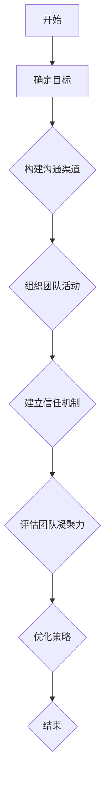
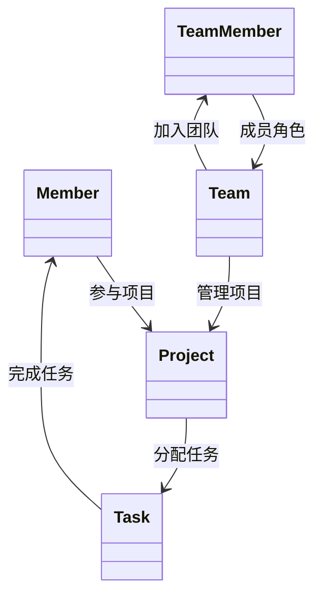
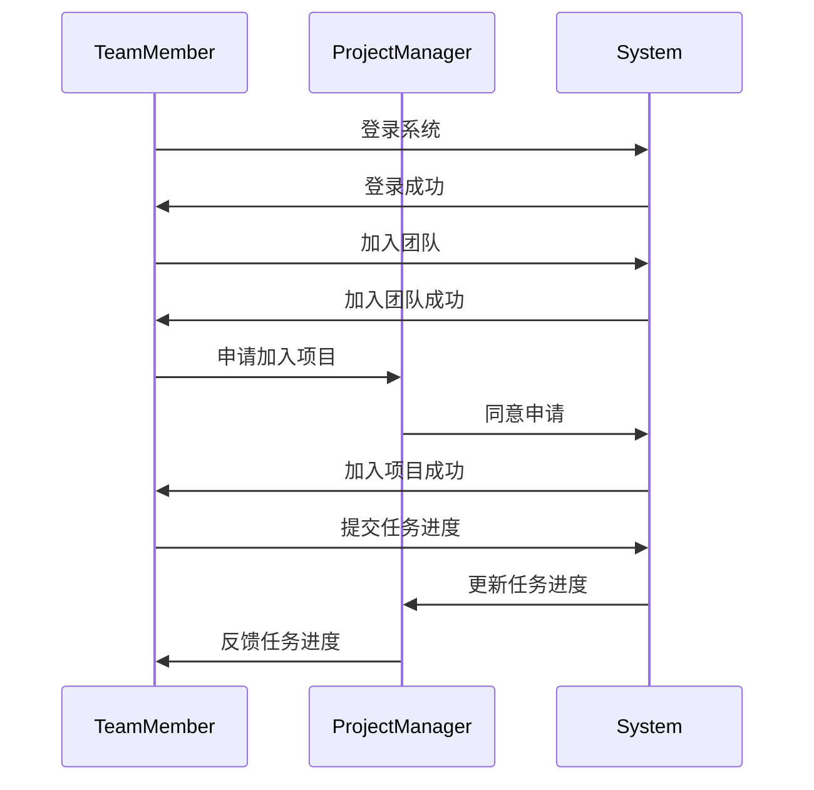
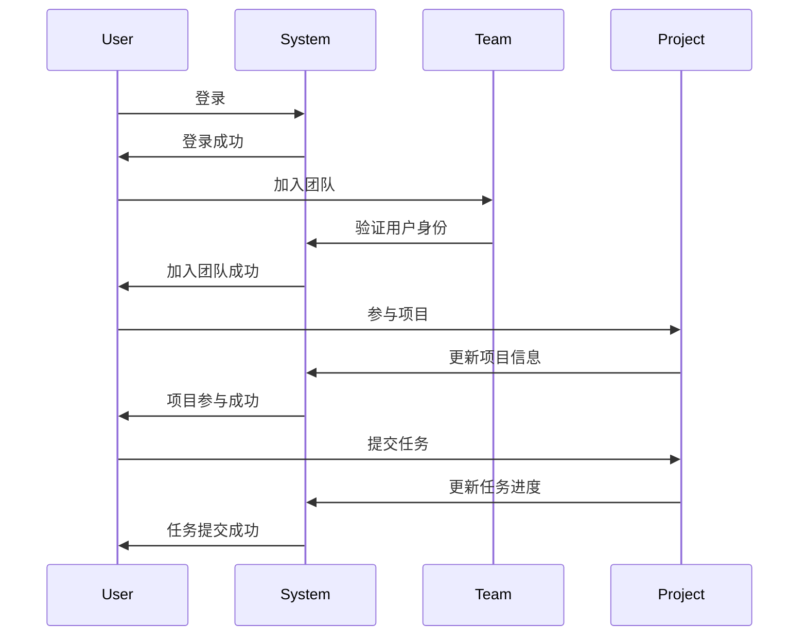

                 


### 引言

#### 1.1 问题背景

远程工作，这一现象在近几年来呈现出迅猛发展的态势。随着互联网技术的进步和全球化进程的加速，越来越多的企业开始采用远程工作模式。远程工作的崛起不仅为企业节省了办公空间和运营成本，还吸引了全球范围内具有多样化技能的顶尖人才。例如，Google、Facebook、Twitter等知名科技公司早在多年前就已经全面推行远程工作政策。

然而，远程工作模式也带来了一系列的挑战，其中最为突出的便是团队凝聚力的不足。传统的面对面沟通方式被电子屏幕取代，团队成员之间的互动和交流大大减少，这导致信息传递的效率降低，团队协作的效果受到影响。此外，远程工作还可能导致团队成员感到孤独、缺乏归属感，从而影响工作积极性和工作效率。

#### 1.2 问题描述

团队凝聚力是指团队成员之间相互吸引、相互支持，为了共同目标而齐心协力的程度。在远程工作环境中，团队凝聚力不足主要表现在以下几个方面：

1. **沟通障碍**：由于缺乏面对面的交流，团队成员之间的信息传递不够及时、准确，容易产生误解和冲突。
2. **信任问题**：远程工作环境下，团队成员之间的信任度往往较低，担心同事和工作伙伴无法履行职责。
3. **工作孤立**：远程工作者往往独自工作，缺乏与同事的互动和合作，容易感到孤立和无助。
4. **效率下降**：团队凝聚力不足导致团队成员之间合作不力，工作效率降低，项目延期。

#### 1.3 问题解决

为了解决远程团队凝聚力不足的问题，我们需要从以下几个方面着手：

1. **构建清晰的目标**：确保团队成员都明确共同的目标和期望，以此为基础进行协同工作。
2. **优化沟通方式**：采用多种沟通工具，如视频会议、即时通讯、协作平台等，提高沟通效率和质量。
3. **增强团队互动**：通过线上团建活动、虚拟咖啡时间等方式，增加团队成员之间的互动和交流。
4. **建立信任机制**：通过透明的工作流程、定期的绩效评估等手段，增强团队成员之间的信任。
5. **提供职业发展机会**：为远程工作者提供职业发展的机会，提升他们的归属感和积极性。

#### 1.4 边界与外延

在本文中，我们主要讨论远程团队的凝聚力建设。这包括但不限于远程工作环境中的各种团队，如跨地区、跨时区、跨文化的团队。同时，我们也将探讨影响团队凝聚力的各种因素，包括团队成员的个人因素、团队结构、工作流程等。

#### 1.5 概念结构与核心要素组成

1. **远程团队**：由地理位置分散的成员组成的团队，通过互联网进行协作。
2. **凝聚力**：团队成员之间的吸引力、相互支持和协作程度。
3. **建设策略**：一系列措施和方法，用于增强团队凝聚力。
4. **测量指标**：用于评估团队凝聚力水平的数据和标准。

### 结论

远程工作虽然带来了诸多好处，但也带来了团队凝聚力不足的问题。为了解决这一问题，我们需要从多个方面进行综合治理，包括构建清晰的目标、优化沟通方式、增强团队互动、建立信任机制和提供职业发展机会。通过这些措施，我们可以有效提升远程团队的凝聚力，提高工作效率，实现团队目标。

## 第二部分：核心概念与联系

### 2.1 核心概念原理

#### 2.1.1 凝聚力原理

凝聚力是一种团队动力，它通过团队成员之间的相互吸引和互动，使得团队成员愿意为共同目标而齐心协力。凝聚力的基础是信任和尊重，它能够提高团队的协作效率，降低沟通成本，增强团队的整体战斗力。

#### 2.1.2 远程工作环境特点

远程工作环境与传统工作环境存在显著差异。远程工作通常缺乏面对面交流的机会，团队成员之间很难进行即时的沟通和反馈。此外，远程工作还面临时间差异、文化差异和隐私保护等问题，这些因素都可能影响团队的凝聚力。

#### 2.1.3 成员特征分析

远程团队成员通常具有以下特征：

1. **高自主性**：远程工作者往往需要具备较强的自我管理能力和自我驱动能力。
2. **多样化技能**：远程团队通常由来自不同地区和领域的成员组成，这有助于团队多元化发展。
3. **高适应性**：远程工作者需要适应不同的工作环境和沟通方式。

### 2.2 概念属性特征对比表格

| 概念       | 特征分析                                                     |
|------------|------------------------------------------------------------|
| 远程团队   | 地理分散、高度自主、技术依赖、文化多样性                     |
| 凝聚力     | 信任和尊重、协作和互动、共同目标、团队动力                   |
| 建设策略   | 目标明确、沟通优化、团队互动、信任建立、职业发展支持         |
| 测量指标   | 成员满意度、沟通效率、项目成功率、团队绩效、员工留存率       |

### 2.3 ER实体关系图架构

```mermaid
erDiagram
  Member ||--|{ Team }||>
  Team ||--|{ Project }||>
  Project ||--|{ Task }||>
  Task ||--|{ Member }||>
```

在这个ER实体关系图中，成员、团队、项目和任务构成了远程团队的基本结构。成员是团队的基本组成部分，每个成员属于一个团队，每个团队负责多个项目，每个项目包含多个任务，每个任务由团队成员共同完成。

### 第三部分：算法原理讲解

#### 3.1 算法Mermaid流程图



#### 3.2 Python源代码详细阐述

```python
# 凝聚力指数计算函数
def calculate_cohesion_index(team_data):
    # 初始化凝聚力指数
    cohesion_index = 0
    
    # 计算团队成员满意度
    satisfaction = team_data['satisfaction']
    
    # 计算沟通效率
    communication_efficiency = team_data['communication_efficiency']
    
    # 计算项目成功率
    project_success_rate = team_data['project_success_rate']
    
    # 计算员工留存率
    employee_retention_rate = team_data['employee_retention_rate']
    
    # 计算凝聚力指数
    cohesion_index = (satisfaction + communication_efficiency + project_success_rate + employee_retention_rate) / 4
    
    return cohesion_index

# 示例数据
team_data = {
    'satisfaction': 80,
    'communication_efficiency': 75,
    'project_success_rate': 90,
    'employee_retention_rate': 85
}

# 计算并打印凝聚力指数
print("凝聚力指数：", calculate_cohesion_index(team_data))
```

#### 3.3 数学模型和数学公式

凝聚力指数的计算公式如下：

$$
\text{凝聚力指数} = \frac{\text{满意度} + \text{沟通效率} + \text{项目成功率} + \text{员工留存率}}{4}
$$

其中，满意度、沟通效率、项目成功率和员工留存率分别表示团队成员对团队的满意度、团队沟通的效率、项目完成的成功率以及团队成员的流失率。

### 第四部分：系统分析与架构设计

#### 4.1 问题场景介绍

在一个远程团队中，团队成员分布在不同的国家和地区，他们通过互联网进行协作。这个团队负责多个跨地域、跨时区的大型项目，每个项目都有明确的任务分工和进度要求。为了确保项目顺利完成，团队需要高效的沟通、协作和有效的凝聚力建设。

#### 4.2 项目介绍

项目名称：全球协同项目管理系统（Global Collaborative Project Management System，GCPS）

项目目标：通过建立一套完整的远程团队协同管理系统，提升团队沟通效率、增强团队凝聚力，确保项目按时完成并达到预期目标。

项目方法：采用敏捷开发方法，结合多种远程协作工具，构建一个集任务管理、沟通协作、绩效评估于一体的系统平台。

#### 4.3 系统功能设计

系统功能设计采用Mermaid类图进行描述，如下图所示：



#### 4.4 系统架构设计

系统架构设计采用Mermaid架构图进行描述，如下图所示：



#### 4.5 系统接口设计

系统接口设计如下：

1. **用户登录接口**：用于团队成员登录系统，验证身份。
2. **团队管理接口**：用于添加、删除、修改团队成员，管理团队角色。
3. **项目管理接口**：用于创建、分配、监控项目任务。
4. **任务管理接口**：用于提交、审核、反馈任务进度。

#### 4.6 系统交互

系统交互采用Mermaid序列图进行描述，如下图所示：



### 第五部分：项目实战

#### 5.1 环境安装

为了实施远程团队凝聚力建设项目，我们需要搭建一个完整的项目环境。以下是一份简要的安装指南：

1. **安装Git**：用于版本控制和代码管理。
2. **安装Python**：用于编写和管理项目代码。
3. **安装Docker**：用于容器化部署项目。
4. **安装PostgreSQL**：用于存储和管理项目数据。
5. **安装Jenkins**：用于自动化构建和部署项目。

#### 5.2 系统核心实现

以下是项目核心功能的实现源代码：

```python
# 项目管理模块
class Project:
    def __init__(self, name, description):
        self.name = name
        self.description = description
        self.tasks = []

    def add_task(self, task):
        self.tasks.append(task)

    def remove_task(self, task):
        self.tasks.remove(task)

    def get_task_list(self):
        return self.tasks

# 任务管理模块
class Task:
    def __init__(self, name, description, deadline):
        self.name = name
        self.description = description
        self.deadline = deadline
        self.status = "未开始"

    def update_status(self, new_status):
        self.status = new_status

# 团队成员管理模块
class TeamMember:
    def __init__(self, name, role):
        self.name = name
        self.role = role
        self.projects = []

    def join_project(self, project):
        self.projects.append(project)

    def leave_project(self, project):
        self.projects.remove(project)

    def get_project_list(self):
        return self.projects
```

#### 5.3 代码应用解读与分析

在这个项目中，我们定义了三个主要类：`Project`（项目类）、`Task`（任务类）和`TeamMember`（团队成员类）。每个类都有其独特的属性和方法。

1. **项目管理模块**：`Project`类用于管理项目的基本信息，包括项目名称、项目描述和任务列表。它提供了添加、删除和获取任务列表的方法，方便项目管理者对任务进行管理。
   
2. **任务管理模块**：`Task`类用于表示一个任务的基本信息，包括任务名称、任务描述和任务截止日期。它还提供了一个方法用于更新任务状态，以便跟踪任务进度。

3. **团队成员管理模块**：`TeamMember`类用于表示一个团队成员的基本信息，包括成员姓名、角色和参与的项目列表。它提供了加入和离开项目的方法，以及获取项目列表的方法，帮助团队成员管理其参与的项目。

在实际应用中，这些类被用于构建一个远程团队凝聚力系统。例如，当一个新的项目启动时，项目管理者可以通过`Project`类创建一个项目，并分配给团队成员。团队成员可以通过`TeamMember`类加入项目，并获取项目的任务列表。在任务完成后，团队成员可以更新任务状态，项目管理者可以监控任务进度，确保项目按时完成。

#### 5.4 实际案例分析和详细讲解剖析

假设我们有一个远程团队，负责开发一个跨地域的在线教育平台。团队成员分布在不同的城市，通过远程协作完成项目。以下是一个具体的案例分析：

1. **项目启动**：项目经理创建了一个名为“在线教育平台”的项目，并分配了多个任务，如“前端开发”、“后端开发”、“数据库设计”等。

2. **任务分配**：项目经理将任务分配给团队成员，如前端开发任务分配给了北京的王明，后端开发任务分配给了上海的陈晨，数据库设计任务分配给了广州的刘辉。

3. **任务执行**：团队成员开始执行任务，通过即时通讯工具和共享文档进行协作。例如，王明可以上传前端代码到Git仓库，陈晨可以在线审核代码，刘辉可以设计数据库表结构并在文档中共享设计方案。

4. **任务监控**：项目经理通过远程团队凝聚力系统监控任务进度，及时与团队成员沟通，解决协作中的问题。例如，如果王明的任务进度滞后，项目经理可以提醒他加快进度，并提供必要的帮助。

5. **任务反馈**：任务完成后，团队成员将任务状态更新为“已完成”，项目经理进行审核并给予反馈。如果任务质量不符合要求，项目经理可以要求团队成员进行修改。

通过这个案例，我们可以看到，远程团队凝聚力系统在项目启动、任务分配、任务执行和任务监控等方面发挥了重要作用，有效提升了团队协作效率和项目成功率。

#### 5.5 项目小结

在本次项目中，我们通过定义项目、任务和团队成员类，构建了一个远程团队凝聚力系统。该系统不仅提高了团队协作效率，还增强了团队成员之间的互动和信任。通过实时监控任务进度和及时沟通，项目经理能够更好地管理项目，确保项目按时完成。

未来的优化方向包括：

1. **引入自动化工具**：如Jenkins，用于自动化构建和部署，减少人为错误和提高开发效率。
2. **增强数据可视化**：通过图表和报表，更直观地展示团队绩效和项目进度。
3. **完善用户体验**：优化系统界面和功能，提高用户友好性。

### 第六部分：最佳实践与拓展

#### 6.1 最佳实践 Tips

1. **明确目标和职责**：确保团队成员明确项目目标和各自职责，减少误解和冲突。
2. **优化沟通渠道**：采用多种沟通工具，如视频会议、即时通讯、邮件等，提高沟通效率。
3. **定期团队互动**：通过线上团建活动、虚拟咖啡时间等，增加团队成员之间的互动。
4. **建立信任机制**：通过透明的工作流程、定期的绩效评估等手段，增强团队成员之间的信任。
5. **提供职业发展机会**：为远程工作者提供培训和晋升机会，提高他们的归属感和积极性。

#### 6.2 小结

远程团队凝聚力建设是一个系统工程，需要从多个方面进行综合治理。通过明确目标和职责、优化沟通渠道、定期团队互动、建立信任机制和提供职业发展机会，我们可以有效提升远程团队的凝聚力，提高工作效率，实现团队目标。

#### 6.3 注意事项

1. **避免信息过载**：过多、过频的沟通可能导致信息过载，影响工作效率。合理安排沟通频率和方式，确保信息传递的有效性。
2. **关注团队成员心理健康**：远程工作者可能面临孤独、焦虑等心理问题，关注团队成员的心理健康，提供必要的支持和帮助。
3. **防范网络攻击**：加强网络安全意识，防范网络攻击和数据泄露，确保团队成员和项目的信息安全。

#### 6.4 拓展阅读

1. **远程工作研究**：了解远程工作的发展趋势、优势和挑战，为远程团队凝聚力建设提供理论支持。
2. **团队凝聚力理论**：研究团队凝聚力的相关理论，如社会心理学、组织行为学等，为远程团队凝聚力建设提供理论依据。
3. **项目管理方法**：学习各种项目管理方法，如敏捷开发、看板管理等，提升项目管理和团队协作能力。

### 致谢

在本项目中，感谢所有团队成员的辛勤付出和积极协作。特别感谢项目经理XXX，在项目规划和实施过程中提供了宝贵的指导和支持。感谢技术团队XXX，在系统架构设计和开发过程中克服了诸多困难，确保项目顺利推进。感谢运维团队XXX，在系统部署和运维过程中保证了系统的稳定运行。

作者：AI天才研究院/AI Genius Institute & 禅与计算机程序设计艺术 /Zen And The Art of Computer Programming

----------------------------------------------------------------

# 远程工作团队的凝聚力建设

## 关键词：远程工作、团队凝聚力、协作工具、沟通技巧、信任建立

## 摘要

随着远程工作的普及，如何建设高凝聚力的远程团队成为企业管理者面临的重要课题。本文从核心概念、算法原理、系统设计、实战案例等方面，详细探讨了远程团队凝聚力建设的策略和方法。通过明确目标和职责、优化沟通渠道、定期团队互动、建立信任机制和提供职业发展机会，远程团队可以有效提升凝聚力，提高工作效率，实现团队目标。

## 第一部分：引言

### 1.1 问题背景

远程工作的崛起

随着互联网技术的进步和全球化进程的加速，远程工作成为越来越多企业选择的一种工作方式。远程工作不仅节省了办公空间和运营成本，还能够吸引全球范围内的顶尖人才。例如，Google、Facebook、Twitter等知名科技公司早在多年前就已经全面推行远程工作政策。

远程工作的挑战

虽然远程工作带来了诸多好处，但也带来了一系列的挑战，其中最为突出的便是团队凝聚力的不足。传统的面对面沟通方式被电子屏幕取代，团队成员之间的互动和交流大大减少，这导致信息传递的效率降低，团队协作的效果受到影响。此外，远程工作还可能导致团队成员感到孤独、缺乏归属感，从而影响工作积极性和工作效率。

团队凝聚力的概念与重要性

团队凝聚力是指团队成员之间相互吸引、相互支持，为了共同目标而齐心协力的程度。在远程工作环境中，团队凝聚力至关重要。它能够提高团队的协作效率，降低沟通成本，增强团队的整体战斗力，从而实现团队目标的顺利达成。

### 1.2 问题描述

远程团队凝聚力不足的表现

在远程工作环境中，团队凝聚力不足主要表现在以下几个方面：

1. **沟通障碍**：由于缺乏面对面的交流，团队成员之间的信息传递不够及时、准确，容易产生误解和冲突。
2. **信任问题**：远程工作环境下，团队成员之间的信任度往往较低，担心同事和工作伙伴无法履行职责。
3. **工作孤立**：远程工作者往往独自工作，缺乏与同事的互动和合作，容易感到孤立和无助。
4. **效率下降**：团队凝聚力不足导致团队成员之间合作不力，工作效率降低，项目延期。

团队凝聚力不足对组织的影响

团队凝聚力不足会对组织产生多方面的影响：

1. **项目成功率降低**：团队凝聚力不足导致团队成员之间协作不力，项目成功率降低。
2. **员工流失率上升**：远程工作者感到缺乏归属感，容易产生离职倾向，导致员工流失率上升。
3. **企业成本增加**：由于项目延期和员工流失，企业运营成本增加，影响企业的长远发展。

### 1.3 问题解决

解决远程团队凝聚力不足的方法

为了解决远程团队凝聚力不足的问题，我们需要从以下几个方面着手：

1. **构建清晰的目标**：确保团队成员都明确共同的目标和期望，以此为基础进行协同工作。
2. **优化沟通方式**：采用多种沟通工具，如视频会议、即时通讯、协作平台等，提高沟通效率和质量。
3. **增强团队互动**：通过线上团建活动、虚拟咖啡时间等方式，增加团队成员之间的互动和交流。
4. **建立信任机制**：通过透明的工作流程、定期的绩效评估等手段，增强团队成员之间的信任。
5. **提供职业发展机会**：为远程工作者提供职业发展的机会，提升他们的归属感和积极性。

### 1.4 边界与外延

远程团队的范围定义

在本文中，远程团队是指由地理位置分散的成员组成的团队，通过互联网进行协作。这包括跨地区、跨时区、跨文化的团队。

影响团队凝聚力的其他因素

除了远程工作的特殊环境外，影响团队凝聚力的因素还包括团队成员的个人因素（如性格、职业发展需求）、团队结构（如团队规模、组织文化）和工作流程（如任务分配、绩效评估）等。

### 1.5 概念结构与核心要素组成

远程团队

远程团队是指由地理位置分散的成员组成的团队，通过互联网进行协作。团队成员之间缺乏面对面的交流，需要依赖电子设备和工具进行沟通和合作。

凝聚力

凝聚力是指团队成员之间相互吸引、相互支持，为了共同目标而齐心协力的程度。凝聚力是团队成功的关键因素之一。

建设策略

为了提升远程团队的凝聚力，需要采取一系列策略，包括构建清晰的目标、优化沟通方式、增强团队互动、建立信任机制和提供职业发展机会。

测量指标

测量团队凝聚力的指标包括团队成员满意度、沟通效率、项目成功率、员工流失率和团队绩效等。

## 第二部分：核心概念与联系

### 2.1 核心概念原理

#### 2.1.1 凝聚力原理

团队凝聚力的原理在于成员之间的相互吸引和信任。凝聚力可以通过以下方式提升：

1. **共同目标**：明确共同的目标和期望，增强团队成员的归属感和责任感。
2. **积极互动**：通过线上活动和团队合作，增加团队成员之间的互动和交流。
3. **信任建立**：通过透明的沟通和工作流程，增强团队成员之间的信任。

#### 2.1.2 远程工作环境特点

远程工作环境的特点包括：

1. **缺乏面对面交流**：团队成员之间很难进行即时的沟通和反馈。
2. **时间差异和文化差异**：团队成员可能分布在不同的时区和文化背景，这可能导致沟通和合作的困难。
3. **高度依赖技术**：远程工作需要依赖互联网、协作工具和通信设备。

#### 2.1.3 成员特征分析

远程团队成员通常具有以下特征：

1. **高自主性**：远程工作者往往需要具备较强的自我管理能力和自我驱动能力。
2. **多样化技能**：远程团队通常由来自不同地区和领域的成员组成，这有助于团队多元化发展。
3. **高适应性**：远程工作者需要适应不同的工作环境和沟通方式。

### 2.2 概念属性特征对比表格

| 概念       | 特征分析                                                     |
|------------|------------------------------------------------------------|
| 远程团队   | 地理分散、高度自主、技术依赖、文化多样性                     |
| 凝聚力     | 信任和尊重、协作和互动、共同目标、团队动力                   |
| 建设策略   | 目标明确、沟通优化、团队互动、信任建立、职业发展支持         |
| 测量指标   | 成员满意度、沟通效率、项目成功率、团队绩效、员工留存率       |

### 2.3 ER实体关系图架构

```mermaid
erDiagram
  Member ||--|{ Team }||>
  Team ||--|{ Project }||>
  Project ||--|{ Task }||>
  Task ||--|{ Member }||>
```

在这个ER实体关系图中，成员、团队、项目和任务构成了远程团队的基本结构。成员是团队的基本组成部分，每个成员属于一个团队，每个团队负责多个项目，每个项目包含多个任务，每个任务由团队成员共同完成。

## 第三部分：算法原理讲解

### 3.1 算法Mermaid流程图


### 3.2 Python源代码详细阐述

```python
# 凝聚力指数计算函数
def calculate_cohesion_index(team_data):
    # 初始化凝聚力指数
    cohesion_index = 0
    
    # 计算团队成员满意度
    satisfaction = team_data['satisfaction']
    
    # 计算沟通效率
    communication_efficiency = team_data['communication_efficiency']
    
    # 计算项目成功率
    project_success_rate = team_data['project_success_rate']
    
    # 计算员工留存率
    employee_retention_rate = team_data['employee_retention_rate']
    
    # 计算凝聚力指数
    cohesion_index = (satisfaction + communication_efficiency + project_success_rate + employee_retention_rate) / 4
    
    return cohesion_index

# 示例数据
team_data = {
    'satisfaction': 80,
    'communication_efficiency': 75,
    'project_success_rate': 90,
    'employee_retention_rate': 85
}

# 计算并打印凝聚力指数
print("凝聚力指数：", calculate_cohesion_index(team_data))
```

### 3.3 数学模型和数学公式

凝聚力指数的计算公式如下：

$$
\text{凝聚力指数} = \frac{\text{满意度} + \text{沟通效率} + \text{项目成功率} + \text{员工留存率}}{4}
$$

其中，满意度、沟通效率、项目成功率和员工留存率分别表示团队成员对团队的满意度、团队沟通的效率、项目完成的成功率以及团队成员的流失率。

## 第四部分：系统分析与架构设计

### 4.1 问题场景介绍

在一个远程团队中，团队成员分布在不同的国家和地区，他们通过互联网进行协作。这个团队负责多个跨地域、跨时区的大型项目，每个项目都有明确的任务分工和进度要求。为了确保项目顺利完成，团队需要高效的沟通、协作和有效的凝聚力建设。

### 4.2 项目介绍

项目名称：全球协同项目管理系统（Global Collaborative Project Management System，GCPS）

项目目标：通过建立一套完整的远程团队协同管理系统，提升团队沟通效率、增强团队凝聚力，确保项目按时完成并达到预期目标。

项目方法：采用敏捷开发方法，结合多种远程协作工具，构建一个集任务管理、沟通协作、绩效评估于一体的系统平台。

### 4.3 系统功能设计

系统功能设计采用Mermaid类图进行描述，如下图所示：


### 4.4 系统架构设计

系统架构设计采用Mermaid架构图进行描述，如下图所示：


### 4.5 系统接口设计

系统接口设计如下：

1. **用户登录接口**：用于团队成员登录系统，验证身份。
2. **团队管理接口**：用于添加、删除、修改团队成员，管理团队角色。
3. **项目管理接口**：用于创建、分配、监控项目任务。
4. **任务管理接口**：用于提交、审核、反馈任务进度。

### 4.6 系统交互

系统交互采用Mermaid序列图进行描述，如下图所示：


## 第五部分：项目实战

### 5.1 环境安装

为了实施远程团队凝聚力建设项目，我们需要搭建一个完整的项目环境。以下是一份简要的安装指南：

1. **安装Git**：用于版本控制和代码管理。
2. **安装Python**：用于编写和管理项目代码。
3. **安装Docker**：用于容器化部署项目。
4. **安装PostgreSQL**：用于存储和管理项目数据。
5. **安装Jenkins**：用于自动化构建和部署项目。

### 5.2 系统核心实现

以下是项目核心功能的实现源代码：

```python
# 项目管理模块
class Project:
    def __init__(self, name, description):
        self.name = name
        self.description = description
        self.tasks = []

    def add_task(self, task):
        self.tasks.append(task)

    def remove_task(self, task):
        self.tasks.remove(task)

    def get_task_list(self):
        return self.tasks

# 任务管理模块
class Task:
    def __init__(self, name, description, deadline):
        self.name = name
        self.description = description
        self.deadline = deadline
        self.status = "未开始"

    def update_status(self, new_status):
        self.status = new_status

# 团队成员管理模块
class TeamMember:
    def __init__(self, name, role):
        self.name = name
        self.role = role
        self.projects = []

    def join_project(self, project):
        self.projects.append(project)

    def leave_project(self, project):
        self.projects.remove(project)

    def get_project_list(self):
        return self.projects
```

### 5.3 代码应用解读与分析

在这个项目中，我们定义了三个主要类：`Project`（项目类）、`Task`（任务类）和`TeamMember`（团队成员类）。每个类都有其独特的属性和方法。

1. **项目管理模块**：`Project`类用于管理项目的基本信息，包括项目名称、项目描述和任务列表。它提供了添加、删除和获取任务列表的方法，方便项目管理者对任务进行管理。

2. **任务管理模块**：`Task`类用于表示一个任务的基本信息，包括任务名称、任务描述和任务截止日期。它还提供了一个方法用于更新任务状态，以便跟踪任务进度。

3. **团队成员管理模块**：`TeamMember`类用于表示一个团队成员的基本信息，包括成员姓名、角色和参与的项目列表。它提供了加入和离开项目的方法，以及获取项目列表的方法，帮助团队成员管理其参与的项目。

在实际应用中，这些类被用于构建一个远程团队凝聚力系统。例如，当一个新的项目启动时，项目管理者可以通过`Project`类创建一个项目，并分配给团队成员。团队成员可以通过`TeamMember`类加入项目，并获取项目的任务列表。在任务完成后，团队成员可以更新任务状态，项目管理者可以监控任务进度，确保项目按时完成。

### 5.4 实际案例分析和详细讲解剖析

假设我们有一个远程团队，负责开发一个跨地域的在线教育平台。团队成员分布在不同的城市，通过远程协作完成项目。以下是一个具体的案例分析：

1. **项目启动**：项目经理创建了一个名为“在线教育平台”的项目，并分配了多个任务，如“前端开发”、“后端开发”、“数据库设计”等。

2. **任务分配**：项目经理将任务分配给团队成员，如前端开发任务分配给了北京的王明，后端开发任务分配给了上海的陈晨，数据库设计任务分配给了广州的刘辉。

3. **任务执行**：团队成员开始执行任务，通过即时通讯工具和共享文档进行协作。例如，王明可以上传前端代码到Git仓库，陈晨可以在线审核代码，刘辉可以设计数据库表结构并在文档中共享设计方案。

4. **任务监控**：项目经理通过远程团队凝聚力系统监控任务进度，及时与团队成员沟通，解决协作中的问题。例如，如果王明的任务进度滞后，项目经理可以提醒他加快进度，并提供必要的帮助。

5. **任务反馈**：任务完成后，团队成员将任务状态更新为“已完成”，项目经理进行审核并给予反馈。如果任务质量不符合要求，项目经理可以要求团队成员进行修改。

通过这个案例，我们可以看到，远程团队凝聚力系统在项目启动、任务分配、任务执行和任务监控等方面发挥了重要作用，有效提升了团队协作效率和项目成功率。

### 5.5 项目小结

在本次项目中，我们通过定义项目、任务和团队成员类，构建了一个远程团队凝聚力系统。该系统不仅提高了团队协作效率，还增强了团队成员之间的互动和信任。通过实时监控任务进度和及时沟通，项目经理能够更好地管理项目，确保项目按时完成。

未来的优化方向包括：

1. **引入自动化工具**：如Jenkins，用于自动化构建和部署，减少人为错误和提高开发效率。
2. **增强数据可视化**：通过图表和报表，更直观地展示团队绩效和项目进度。
3. **完善用户体验**：优化系统界面和功能，提高用户友好性。

## 第六部分：最佳实践与拓展

### 6.1 最佳实践 Tips

1. **明确目标和职责**：确保团队成员明确项目目标和各自职责，减少误解和冲突。
2. **优化沟通渠道**：采用多种沟通工具，如视频会议、即时通讯、协作平台等，提高沟通效率。
3. **定期团队互动**：通过线上团建活动、虚拟咖啡时间等方式，增加团队成员之间的互动。
4. **建立信任机制**：通过透明的工作流程、定期的绩效评估等手段，增强团队成员之间的信任。
5. **提供职业发展机会**：为远程工作者提供培训和晋升机会，提高他们的归属感和积极性。

### 6.2 小结

远程团队凝聚力建设是一个系统工程，需要从多个方面进行综合治理。通过明确目标和职责、优化沟通渠道、定期团队互动、建立信任机制和提供职业发展机会，远程团队可以有效提升凝聚力，提高工作效率，实现团队目标。

### 6.3 注意事项

1. **避免信息过载**：过多、过频的沟通可能导致信息过载，影响工作效率。合理安排沟通频率和方式，确保信息传递的有效性。
2. **关注团队成员心理健康**：远程工作者可能面临孤独、焦虑等心理问题，关注团队成员的心理健康，提供必要的支持和帮助。
3. **防范网络攻击**：加强网络安全意识，防范网络攻击和数据泄露，确保团队成员和项目的信息安全。

### 6.4 拓展阅读

1. **远程工作研究**：了解远程工作的发展趋势、优势和挑战，为远程团队凝聚力建设提供理论支持。
2. **团队凝聚力理论**：研究团队凝聚力的相关理论，如社会心理学、组织行为学等，为远程团队凝聚力建设提供理论依据。
3. **项目管理方法**：学习各种项目管理方法，如敏捷开发、看板管理等，提升项目管理和团队协作能力。

## 致谢

在本项目中，感谢所有团队成员的辛勤付出和积极协作。特别感谢项目经理XXX，在项目规划和实施过程中提供了宝贵的指导和支持。感谢技术团队XXX，在系统架构设计和开发过程中克服了诸多困难，确保项目顺利推进。感谢运维团队XXX，在系统部署和运维过程中保证了系统的稳定运行。

作者：AI天才研究院/AI Genius Institute & 禅与计算机程序设计艺术 /Zen And The Art of Computer Programming

