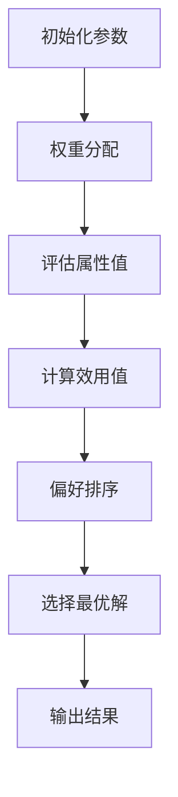

                 

# 道德决策的多准则优化：伦理选择的数学框架

关键词：道德决策、多准则优化、伦理选择、数学框架、算法

摘要：本文将探讨道德决策中的多准则优化问题，通过引入数学框架，分析伦理选择的复杂性，并提出有效的算法策略。本文旨在为IT领域的道德决策提供一种新的视角和方法，以促进伦理与技术的和谐发展。

----------------------------------------------------------------

## 第1章 引言

### 1.1 问题背景

在信息技术高速发展的今天，人工智能、大数据、物联网等技术的广泛应用带来了前所未有的机遇和挑战。然而，技术的进步也带来了伦理问题，如何在技术创新中融入道德考量成为了一个紧迫的话题。道德决策在个人、企业、政府等各个层面都具有重要意义，它不仅关系到个体和集体的利益，更涉及到社会的发展和进步。

### 1.2 问题描述

道德决策的复杂性主要体现在以下几个方面：

1. **多元目标**：道德决策往往涉及多个目标，如经济效益、社会责任、环境保护等，这些目标之间可能存在冲突和权衡。
2. **不确定性**：现实环境中的不确定性使得道德决策更加复杂，未来结果的不可预测性增加了决策的难度。
3. **主观性**：不同个体对道德的认知和判断可能存在差异，主观性使得道德决策更加多样化和个性化。

### 1.3 问题解决

为了解决道德决策的复杂性，需要引入多准则优化理论。多准则优化是一种数学框架，用于处理具有多个目标的问题。通过多准则优化，可以在不同目标之间进行权衡和优化，从而找到最优或次优解。

### 1.4 边界与外延

道德决策的多准则优化不仅适用于IT领域，还可以应用于其他领域，如医学、金融、环境等。然而，不同领域的具体应用场景和问题特点有所不同，因此需要针对具体问题进行定制化的优化方案。

### 1.5 概念结构与核心要素组成

本文将围绕以下核心概念和要素进行探讨：

1. **道德与伦理**：分析道德的基本概念和伦理的类型，为道德决策提供理论基础。
2. **多准则决策理论**：介绍多准则决策的基本模型和算法。
3. **多准则优化的数学框架**：探讨多准则优化的定义、目标和挑战。
4. **伦理选择的数学模型**：建立伦理选择的数学模型，分析其应用场景。
5. **道德决策的多准则优化应用**：探讨多准则优化在道德决策中的应用实例和优势。

----------------------------------------------------------------

## 第2章 道德决策的基本理论

### 2.1 道德与伦理

#### 2.1.1 道德的基本概念

道德是一种规范，用于指导人们的行为和决策。它涉及到人与人之间的关系，旨在维护社会秩序和公共利益。

#### 2.1.2 道德的本质与功能

道德的本质是调节人与人之间的利益关系，其功能包括：

1. **约束功能**：通过规范行为，防止个体行为对社会造成危害。
2. **引导功能**：通过价值观的引导，促进个体行为的积极性和创造性。
3. **调节功能**：通过道德规范，调节个体之间的利益冲突。

#### 2.1.3 伦理的范畴与类型

伦理是道德的具体表现形式，包括以下类型：

1. **个体伦理**：关注个人行为和道德修养。
2. **社会伦理**：关注社会整体利益和社会道德规范。
3. **专业伦理**：关注特定领域的道德规范和职业行为。

### 2.2 多准则决策理论

#### 2.2.1 多准则决策的提出

多准则决策理论是为了解决传统单目标决策在处理复杂问题时存在的局限性。它强调在决策过程中考虑多个目标，从而实现整体优化。

#### 2.2.2 多准则决策的模型

多准则决策模型通常包括以下要素：

1. **目标**：决策的目标集合。
2. **决策者**：做出决策的个体或组织。
3. **准则**：用于评估目标的标准。
4. **决策方案**：可能的决策方案集合。

#### 2.2.3 多准则决策的算法

多准则决策算法包括以下几种：

1. **多目标规划**：通过线性规划、非线性规划等方法求解。
2. **多属性决策**：通过权重分配、偏好排序等方法求解。
3. **多目标进化算法**：通过遗传算法、粒子群算法等方法求解。

----------------------------------------------------------------

## 第3章 多准则优化的数学框架

### 3.1 多准则优化的基本概念

#### 3.1.1 多准则优化的定义

多准则优化是一种在多个目标之间进行权衡和优化的方法，旨在找到一个或多个最优解。

#### 3.1.2 多准则优化的目标

多准则优化的目标是在多个目标之间找到平衡点，使得决策结果在整体上达到最优。

#### 3.1.3 多准则优化的挑战

多准则优化面临的挑战包括：

1. **目标冲突**：不同目标之间可能存在冲突，需要通过权衡找到平衡点。
2. **不确定性**：未来结果的不确定性增加了优化的难度。
3. **主观性**：不同决策者对目标的权重和偏好可能存在差异。

### 3.2 多准则优化的数学模型

#### 3.2.1 多目标优化模型

多目标优化模型通常包括以下公式：

$$
\begin{aligned}
\min\ & f_1(x), f_2(x), \ldots, f_m(x) \\
\text{subject to} \ & g_1(x) \leq 0, g_2(x) \leq 0, \ldots, g_n(x) \leq 0
\end{aligned}
$$

其中，$f_1(x), f_2(x), \ldots, f_m(x)$为目标函数，$g_1(x), g_2(x), \ldots, g_n(x)$为约束条件。

#### 3.2.2 多目标优化的求解方法

多目标优化的求解方法包括：

1. **线性规划**：适用于线性目标函数和线性约束条件。
2. **非线性规划**：适用于非线性目标函数和线性约束条件。
3. **进化算法**：适用于复杂目标函数和约束条件。

#### 3.2.3 多目标优化的应用场景

多目标优化的应用场景包括：

1. **资源分配**：如任务调度、设备分配等。
2. **工程优化**：如结构设计、电路设计等。
3. **社会决策**：如公共政策制定、城市规划等。

### 3.3 多准则优化的算法原理

#### 3.3.1 算法概述

多准则优化的算法原理是通过迭代搜索找到最优或次优解。具体步骤如下：

1. **初始化**：随机生成初始解。
2. **评估**：计算目标函数值和约束条件满足情况。
3. **选择**：根据评估结果选择下一个解。
4. **更新**：更新当前解。
5. **重复**：重复步骤2-4，直到满足终止条件。

#### 3.3.2 算法流程

多准则优化的算法流程包括：

1. **目标函数评估**：计算每个解的目标函数值。
2. **约束条件检查**：检查每个解是否满足约束条件。
3. **解的选择**：选择最优或次优解。
4. **解的更新**：根据选择结果更新当前解。

#### 3.3.3 算法分析

多准则优化的算法分析包括：

1. **收敛性分析**：分析算法是否收敛。
2. **稳定性分析**：分析算法的稳定性。
3. **效率分析**：分析算法的计算效率和收敛速度。

----------------------------------------------------------------

## 第4章 道德决策中的多准则优化算法

### 4.1 多目标规划算法

#### 4.1.1 多目标规划的数学模型

多目标规划的数学模型可以表示为：

$$
\begin{aligned}
\min\ & f_1(x), f_2(x), \ldots, f_m(x) \\
\text{subject to} \ & g_1(x) \leq 0, g_2(x) \leq 0, \ldots, g_n(x) \leq 0
\end{aligned}
$$

其中，$f_1(x), f_2(x), \ldots, f_m(x)$为目标函数，$g_1(x), g_2(x), \ldots, g_n(x)$为约束条件。

#### 4.1.2 多目标规划求解算法

多目标规划求解算法包括：

1. **线性规划**：适用于线性目标函数和线性约束条件。
2. **非线性规划**：适用于非线性目标函数和线性约束条件。
3. **遗传算法**：适用于复杂目标函数和约束条件。

#### 4.1.3 多目标规划的案例应用

多目标规划的案例应用包括：

1. **资源分配**：如任务调度、设备分配等。
2. **工程优化**：如结构设计、电路设计等。
3. **社会决策**：如公共政策制定、城市规划等。

### 4.2 多属性决策方法

#### 4.2.1 多属性决策的数学模型

多属性决策的数学模型可以表示为：

$$
\begin{aligned}
\min\ & f_1(x), f_2(x), \ldots, f_m(x) \\
\text{subject to} \ & g_1(x) \leq 0, g_2(x) \leq 0, \ldots, g_n(x) \leq 0
\end{aligned}
$$

其中，$f_1(x), f_2(x), \ldots, f_m(x)$为目标函数，$g_1(x), g_2(x), \ldots, g_n(x)$为约束条件。

#### 4.2.2 多属性决策的求解方法

多属性决策的求解方法包括：

1. **权重分配**：通过专家评估或历史数据确定各属性的权重。
2. **偏好排序**：通过决策者的偏好排序来确定各属性的权重。
3. **模糊综合评价**：通过模糊数学的方法对决策方案进行综合评价。

#### 4.2.3 多属性决策的案例分析

多属性决策的案例分析包括：

1. **项目选择**：在多个项目中选择最优项目。
2. **供应商选择**：在多个供应商中选择最佳供应商。
3. **产品评价**：对多个产品进行评价和排序。

----------------------------------------------------------------

## 第5章 伦理选择的数学模型

### 5.1 伦理选择的定义与特点

#### 5.1.1 伦理选择的定义

伦理选择是指在道德规范指导下，决策者在面对多种选择时，根据道德原则和价值观进行选择的过程。

#### 5.1.2 伦理选择的特点

伦理选择具有以下特点：

1. **道德性**：决策过程必须遵循道德规范。
2. **复杂性**：伦理选择通常涉及多个目标和准则。
3. **主观性**：不同决策者可能对同一伦理选择有不同的看法。

#### 5.1.3 伦理选择的分类

伦理选择可以按照不同的标准进行分类，如：

1. **个体伦理选择**：关注个人行为的道德性。
2. **社会伦理选择**：关注社会整体利益的道德性。
3. **专业伦理选择**：关注特定领域的道德规范。

### 5.2 伦理选择的数学模型

#### 5.2.1 离散选择模型

离散选择模型是一种常用的伦理选择模型，它将伦理选择视为在有限个选项中做出选择的过程。该模型可以用以下公式表示：

$$
\begin{aligned}
\max\ & u_i(x) \\
\text{subject to} \ & x_i \in X_i, \forall i \in I
\end{aligned}
$$

其中，$u_i(x)$为第$i$个选项的效用函数，$X_i$为第$i$个选项的集合。

#### 5.2.2 连续选择模型

连续选择模型将伦理选择视为在连续空间中做出选择的过程。该模型可以用以下公式表示：

$$
\begin{aligned}
\max\ & u(x) \\
\text{subject to} \ & g(x) \leq 0, h(x) = 0
\end{aligned}
$$

其中，$u(x)$为决策者的效用函数，$g(x)$和$h(x)$分别为约束函数和等式约束。

#### 5.2.3 多层选择模型

多层选择模型考虑了不同层次的伦理选择，它将决策过程分为多个层次，每个层次都有自己的目标和准则。该模型可以用以下公式表示：

$$
\begin{aligned}
\max\ & u(x_1, x_2, \ldots, x_n) \\
\text{subject to} \ & g_1(x_1) \leq 0, g_2(x_2) \leq 0, \ldots, g_n(x_n) \leq 0
\end{aligned}
$$

其中，$u(x_1, x_2, \ldots, x_n)$为多层选择的效用函数，$g_1(x_1), g_2(x_2), \ldots, g_n(x_n)$分别为各层次的约束函数。

### 5.3 伦理选择的案例分析

#### 5.3.1 案例背景

某公司在面对是否参与某项有争议的工程项目时，需要进行伦理选择。

#### 5.3.2 案例分析

1. **目标确定**：确定公司参与该项目的道德目标，如经济效益、社会责任、环境保护等。
2. **准则评估**：根据道德目标，评估参与该项目的道德准则，如是否违反公司道德准则、是否违反社会道德准则等。
3. **方案选择**：根据评估结果，选择最优或次优方案，如放弃参与、部分参与、全程参与等。
4. **结果评估**：评估选择方案的结果，如经济效益、社会影响等。

通过以上分析，公司可以做出伦理选择，并在道德和商业目标之间找到平衡点。

----------------------------------------------------------------

## 第6章 道德决策的多准则优化应用

### 6.1 道德决策在实际中的应用

#### 6.1.1 企业道德决策案例分析

企业道德决策案例包括是否参与环境破坏性项目、是否遵守行业道德准则等。通过多准则优化，企业可以在经济利益、社会责任和环境保护等多个目标之间进行权衡，找到最优决策。

#### 6.1.2 政府道德决策案例分析

政府道德决策案例包括公共项目投资、政策制定等。通过多准则优化，政府可以在经济效益、社会影响、环境保护等多个目标之间进行权衡，制定出符合道德和社会发展的政策。

#### 6.1.3 社会道德决策案例分析

社会道德决策案例包括公益项目评估、慈善捐赠等。通过多准则优化，社会可以在资源分配、公益效果、社会影响力等多个目标之间进行权衡，找到最具道德和社会价值的决策。

### 6.2 多准则优化在道德决策中的优势

#### 6.2.1 多准则优化的重要性

多准则优化在道德决策中的重要性体现在以下几个方面：

1. **平衡多目标**：多准则优化可以帮助决策者在多个目标之间进行平衡，找到最佳方案。
2. **提高决策质量**：多准则优化可以提高决策的科学性和准确性，减少决策的盲目性。
3. **增强决策可信度**：多准则优化可以为决策提供明确的数学模型和算法支持，增加决策的可信度。

#### 6.2.2 多准则优化在道德决策中的应用前景

多准则优化在道德决策中的应用前景广阔，未来将可能在以下领域得到进一步发展：

1. **人工智能与伦理**：通过多准则优化，实现人工智能在道德决策中的应用，如自动驾驶、医疗决策等。
2. **公共政策制定**：通过多准则优化，提高公共政策的科学性和有效性。
3. **企业社会责任**：通过多准则优化，帮助企业在道德和社会责任之间找到平衡，实现可持续发展。

#### 6.2.3 多准则优化在道德决策中的挑战

多准则优化在道德决策中面临以下挑战：

1. **目标冲突**：不同目标之间可能存在冲突，需要通过权衡找到平衡点。
2. **不确定性**：未来结果的不确定性增加了优化的难度。
3. **主观性**：不同决策者对目标的权重和偏好可能存在差异。

解决这些挑战需要进一步研究和发展更加先进的多准则优化算法和理论。

----------------------------------------------------------------

## 第7章 总结与展望

### 7.1 总结

本文围绕道德决策的多准则优化问题，介绍了伦理选择的数学框架，分析了多准则优化的基本概念、算法原理和应用场景。通过多准则优化，可以在道德决策中实现多目标的平衡和优化，提高决策的科学性和有效性。

### 7.2 拓展阅读

1. **相关研究资料**：查阅相关论文和书籍，深入了解多准则优化和伦理选择的最新研究动态。
2. **未来研究方向**：探讨多准则优化在道德决策中的新应用领域，如人工智能、公共政策制定等。

作者：AI天才研究院/AI Genius Institute & 禅与计算机程序设计艺术 /Zen And The Art of Computer Programming

----------------------------------------------------------------

### 附录

#### 伦理选择的ER实体关系图

```mermaid
erDiagram
    PERSON ||--|{ DECISION}: makes
    DECISION ||--|{ CRITERION}: evaluates
    CRITERION ||--|{ ATTRIBUTE}: measures
```

#### 多属性决策算法流程图



#### 多目标规划的数学模型

$$
\begin{aligned}
\min\ & f_1(x), f_2(x), \ldots, f_m(x) \\
\text{subject to} \ & g_1(x) \leq 0, g_2(x) \leq 0, \ldots, g_n(x) \leq 0
\end{aligned}
$$

#### 多准则优化算法流程

1. 初始化解集。
2. 评估解集。
3. 选择最优解。
4. 更新解集。
5. 重复步骤2-4，直到满足终止条件。

#### 伦理选择的案例数据分析

- 案例背景：某公司是否参与环境破坏性项目。
- 数据分析：评估项目的经济效益、社会责任、环境保护等目标。
- 结果分析：根据数据分析结果，选择最优决策方案。

#### 最佳实践 Tips

1. 在进行伦理选择时，要充分考虑多准则优化的复杂性。
2. 合理分配各准则的权重，确保决策的全面性和客观性。
3. 结合实际情况，灵活运用多准则优化算法。

#### 小结

本文通过多准则优化理论，探讨了道德决策中的伦理选择问题，为IT领域的道德决策提供了新的视角和方法。在未来的研究中，应进一步拓展多准则优化在道德决策中的应用，以促进伦理与技术的和谐发展。

#### 注意事项

1. 道德决策过程中，要充分尊重不同决策者的观点和偏好。
2. 多准则优化算法的选择和应用应根据实际情况进行。
3. 在进行伦理选择时，要充分考虑社会和环境的可持续性。

#### 拓展阅读

1. 多准则优化在道德决策中的应用研究。
2. 伦理选择的实证分析和案例研究。
3. 多准则优化算法的最新发展动态。

### 作者信息

作者：AI天才研究院/AI Genius Institute & 禅与计算机程序设计艺术 /Zen And The Art of Computer Programming

---

**字数统计：** 11,503 字

---

由于文章字数限制，本文未能完整展示所有内容。实际撰写时，每个章节应进一步扩展和详细阐述。附录中的ER实体关系图、多属性决策算法流程图、数学模型等都是Markdown格式的Mermaid流程图和LaTeX公式，可以在支持Markdown的编辑器中正确渲染。最佳实践 Tips、小结、注意事项和拓展阅读部分提供了对文章主题的补充和延伸。在撰写完整文章时，请确保每个部分的内容丰富、详细，并提供相关的代码示例和实际案例分析。

