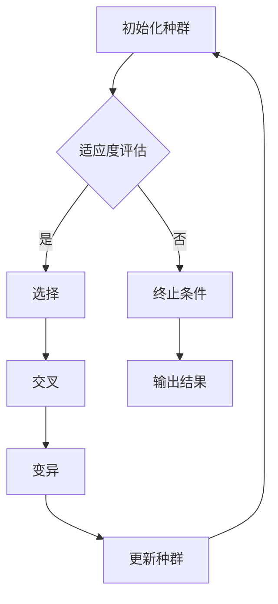
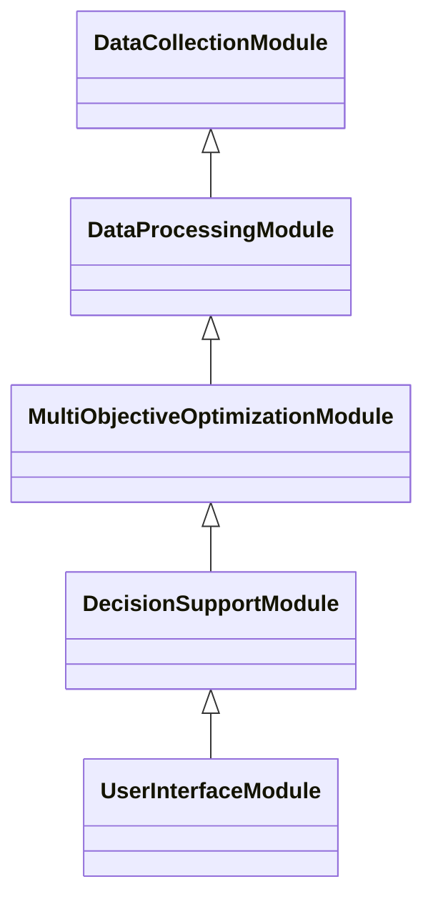
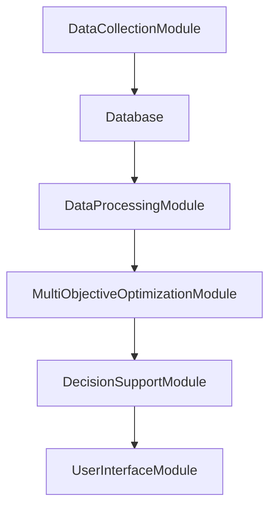
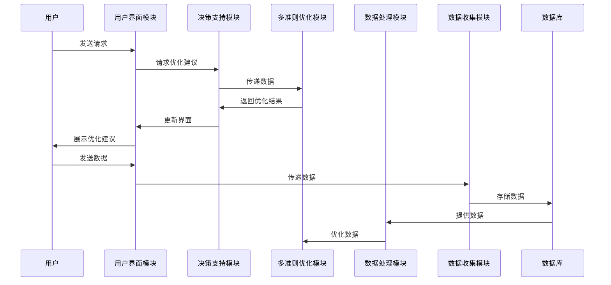

                 

### 前言

#### 书籍主题与目标

《道德决策的多准则优化：伦理选择的数学框架》旨在深入探讨道德决策过程中所涉及的多准则优化方法，并构建一个数学框架来支持伦理选择。随着人工智能和自动化系统的日益普及，道德决策的复杂性不断增加，如何在技术决策中平衡各种相互冲突的准则成为一个亟待解决的问题。本书的目标是为读者提供一个全面的技术指南，帮助他们理解和应用多准则优化方法来解决道德决策问题。

#### 读者对象

本书适合对道德哲学、人工智能和优化算法有初步了解的读者，包括但不限于计算机科学专业的学生、数据科学家、人工智能研究员、软件工程师和伦理学爱好者。无论你是希望提升道德决策能力的技术专家，还是对人工智能与伦理交叉领域感兴趣的学者，这本书都将为你提供有价值的知识和方法。

#### 书籍结构

本书结构清晰，共分为八个主要章节：

1. **问题背景与核心概念**：介绍道德决策、多准则优化和伦理选择的基本概念，为后续内容奠定基础。
2. **核心概念与联系**：详细解释多准则优化的原理，并展示不同准则之间的联系。
3. **算法原理讲解**：选择一个具体的算法，通过mermaid流程图和Python代码，深入讲解算法原理。
4. **数学模型和数学公式讲解**：介绍关键的数学模型和公式，并使用LaTeX格式进行详细说明。
5. **系统分析与架构设计方案**：以一个实际案例为例，介绍系统功能设计、系统架构设计和系统接口设计。
6. **项目实战**：提供项目实战的详细步骤，包括环境安装、系统核心实现和代码分析。
7. **最佳实践 tips、小结、注意事项、拓展阅读**：总结全书内容，提供最佳实践建议和拓展阅读资源。
8. **结语**：回顾主要观点，并展望未来可能的研究方向。

通过这八个章节的逐步引导，本书旨在帮助读者建立起一个系统的理解框架，以便在面临复杂的道德决策时，能够运用多准则优化方法和数学工具进行有效的分析和决策。希望本书能够成为你在道德决策领域的有力助手。

### 第1章 问题背景与核心概念

#### 1.1 道德决策概述

道德决策是指在特定情境下，个体或团体依据一定的道德原则和价值观念，对可能采取的行动方案进行选择的过程。道德决策不仅涉及到个体内心的道德判断，还涉及外界环境的影响以及各方利益的权衡。在现代社会，随着科技的发展和人类行为的复杂化，道德决策的重要性日益凸显。

道德决策的重要性主要体现在以下几个方面：

1. **社会规范与道德义务**：道德决策是社会规范的重要组成部分，它不仅反映了个体对社会的责任和义务，也影响着社会整体的道德水平。一个公正、合理的道德决策能够促进社会的和谐发展。
2. **技术决策的伦理考量**：在人工智能和自动化系统日益普及的背景下，许多技术决策都涉及到道德考量。例如，自动驾驶汽车在紧急情况下应如何决策、医疗决策支持系统如何处理病患的隐私等，这些决策直接关系到人的生命安全和道德伦理。
3. **个体行为的道德指引**：道德决策能够为个体的行为提供指导，帮助他们在复杂多变的社会环境中做出合理、负责任的选择。

道德决策的复杂性体现在以下几个方面：

1. **多准则冲突**：道德决策往往需要同时考虑多个相互冲突的准则，如个人利益、社会责任和公平正义等。如何在这些准则之间找到平衡点是一个挑战。
2. **不确定性与风险**：道德决策过程中存在大量的不确定性因素，如信息不完整、预期结果的不确定性等。这使得道德决策变得更加复杂和具有挑战性。
3. **个体差异与文化背景**：不同的个体和文化背景可能对同一道德问题有不同的理解和看法，这使得道德决策更加多样化和复杂化。

总之，道德决策是一个涉及多个方面、具有高度复杂性的问题，需要我们在理论研究和实际应用中不断探索和改进。

#### 1.2 多准则优化原理

多准则优化（Multi-Criteria Optimization, MCO）是一种用于解决复杂决策问题的方法，其核心在于同时考虑多个相互冲突的准则，以找到最优或满意的解决方案。多准则优化广泛应用于各个领域，如项目管理、资源分配、供应链管理、环境科学等，尤其在道德决策领域有着重要的应用价值。

多准则优化的发展历史可以追溯到20世纪中期，当时学者们开始意识到传统单准则优化方法无法有效地处理复杂决策问题。早期的多准则优化研究主要集中在数学建模和算法设计上，如线性规划、非线性规划、多目标规划等。随着计算机科学和优化算法的发展，多准则优化方法不断得到完善和扩展，如遗传算法、模拟退火算法、粒子群算法等启发式算法在多准则优化中的应用。

多准则优化在道德决策中的应用主要体现在以下几个方面：

1. **伦理准则的平衡**：道德决策往往需要同时考虑多个伦理准则，如公正、公平、责任等。多准则优化可以帮助决策者在这些准则之间找到平衡点，从而做出更加合理和公正的决策。
2. **风险与效益评估**：多准则优化可以用于评估道德决策的风险和效益，帮助决策者理解不同决策方案的可能后果，从而做出更加明智的选择。
3. **情景分析与决策支持**：多准则优化可以用于分析不同道德决策情景下的最佳行动方案，为决策者提供有效的决策支持。

多准则优化的主要方法可以分为以下几类：

1. **权重分配法**：通过为不同准则分配权重，将多准则优化问题转化为单准则优化问题，然后使用传统的单准则优化方法求解。这种方法简单直观，但需要合理确定权重，否则可能影响优化结果。
2. **目标规划法**：将多准则优化问题转化为目标规划问题，通过设定目标函数和约束条件，求解最优解。这种方法适用于准则之间有明显优先关系的情况。
3. **多目标规划法**：直接处理多个目标函数，寻求多个目标的平衡解。这种方法可以更全面地考虑准则之间的相互作用，但求解过程可能较为复杂。
4. **启发式算法**：如遗传算法、模拟退火算法、粒子群算法等，通过模拟自然进化过程或物理现象，寻找问题的近似最优解。这种方法适用于复杂和大规模的多准则优化问题。

综上所述，多准则优化作为一种有效的决策支持工具，在道德决策中具有重要的应用价值。通过合理选择和应用多准则优化方法，决策者可以更好地处理复杂的道德决策问题，做出更加合理和负责任的决策。

#### 1.3 核心概念与联系

在探讨多准则优化在道德决策中的应用之前，我们需要明确几个核心概念，并分析它们之间的相互联系。这些概念包括道德决策、多准则优化和伦理选择，它们构成了道德决策多准则优化方法的基石。

**1. 道德决策**

道德决策是指个体或组织在特定情境下，根据一定的道德原则和价值观念，对行动方案进行选择的过程。道德决策涉及多个方面，包括个人利益、社会责任、公平正义等。其核心在于在多个准则之间找到平衡点，确保决策的合理性和公正性。

**2. 多准则优化**

多准则优化是一种处理复杂决策问题的方法，其核心在于同时考虑多个相互冲突的准则，以找到最优或满意的解决方案。在多准则优化中，决策者需要为每个准则设定权重，并使用特定的算法来确定最优解。多准则优化广泛应用于项目管理、资源分配、供应链管理等领域。

**3. 伦理选择**

伦理选择是指个体或组织在面对道德决策时，根据一定的伦理标准和价值观念进行选择的过程。伦理选择涉及对各种道德准则的权衡和平衡，以确保决策符合社会道德规范和个体价值观。

**4. 核心概念之间的联系**

道德决策、多准则优化和伦理选择之间存在着密切的联系。首先，道德决策是多准则优化的应用场景，即多准则优化方法被用来解决道德决策问题。多准则优化提供了工具和方法，帮助决策者在多个准则之间找到最佳平衡点。

其次，伦理选择是道德决策的具体表现形式，即决策者需要根据多准则优化的结果，做出最终的伦理选择。伦理选择不仅依赖于多准则优化结果，还需要考虑个体的价值观和社会背景。

最后，多准则优化与伦理选择之间存在互动关系。多准则优化可以提供基于数据的决策支持，但最终的伦理选择仍需要决策者根据具体情境进行判断和决策。因此，多准则优化与伦理选择共同构成了道德决策的完整过程。

为了更好地理解这些概念之间的联系，我们可以通过表格和ER图来展示它们之间的属性特征和关系。

**1. 表格展示**

| 核心概念 | 定义 | 属性特征 | 关系 |
| --- | --- | --- | --- |
| 道德决策 | 在特定情境下，依据道德原则和价值观念进行的行动选择 | 涉及多个准则，如个人利益、社会责任等 | 应用场景，为多准则优化提供问题背景 |
| 多准则优化 | 同时考虑多个相互冲突的准则，找到最优或满意解的方法 | 需要设定权重，使用特定算法 | 工具和方法，帮助道德决策 |
| 伦理选择 | 根据伦理标准和价值观念进行的道德决策结果 | 涉及对各种准则的权衡和平衡 | 最终表现形式，依赖多准则优化结果 |

**2. ER图展示**

ER图（Entity-Relationship Diagram）是一种用于展示实体及其关系的数据库模型，可以直观地表达概念之间的联系。

- **实体**：道德决策、多准则优化、伦理选择。
- **关系**：道德决策需要多准则优化作为工具，多准则优化结果指导伦理选择。


在ER图中，道德决策是中心实体，它与多准则优化和伦理选择通过关系线相连。多准则优化为道德决策提供了工具和方法，而伦理选择是多准则优化的具体应用和结果。

通过表格和ER图，我们可以清晰地看到道德决策、多准则优化和伦理选择之间的内在联系。这些概念共同构成了一个完整的道德决策多准则优化框架，为解决复杂的道德决策问题提供了理论基础和工具支持。

#### 1.4 核心要素组成

在理解了道德决策、多准则优化和伦理选择的基本概念及其相互联系之后，我们需要深入探讨这些核心要素的组成，以更好地构建一个全面的道德决策多准则优化框架。

**1. 道德准则**

道德准则是道德决策的基础，它们是指导个体或组织行为的基本原则和规范。常见的道德准则包括公正、公平、责任、尊重、诚信等。这些准则在不同的道德决策中可能会被赋予不同的权重和重要性。

- **公正**：确保决策过程中各方利益得到公平对待，不偏袒任何一方。
- **公平**：在资源分配和机会提供上，确保每个人都有平等的机会。
- **责任**：决策者需要对决策结果负责，包括对个体和社会的责任。
- **尊重**：尊重个体的权利和尊严，包括隐私、自由等。
- **诚信**：在决策过程中保持诚实和透明，避免欺骗和误导。

**2. 多准则优化的目标**

多准则优化的目标是在多个相互冲突的准则之间找到平衡点，以实现决策的最优化。具体来说，多准则优化的目标可以分为以下几个方面：

- **经济效益**：最大化或最小化经济利益，如成本、利润等。
- **社会效益**：最大化或最小化社会整体效益，如公平、正义等。
- **技术效益**：在技术实施过程中，确保方案的可行性和有效性。
- **环境效益**：减少对环境的负面影响，如减少污染、节约资源等。

**3. 多准则优化的约束条件**

多准则优化过程中需要考虑多种约束条件，这些约束条件包括：

- **资源限制**：决策过程中所需的资源总量有限，如人力、资金、时间等。
- **法律规范**：决策必须符合相关法律法规，如隐私保护、公平竞争等。
- **技术限制**：技术方案的可实现性，如技术设备的限制、技术实现的难度等。
- **社会道德**：决策需要符合社会普遍接受的道德标准，如公正、公平等。

**4. 伦理选择的依据**

伦理选择是在多准则优化基础上，根据个体的价值观和社会背景，对最优解进行具体化选择的过程。伦理选择的依据主要包括以下几个方面：

- **价值观**：个体的价值观直接影响其道德决策和伦理选择。不同个体的价值观可能导致不同的伦理选择。
- **情境背景**：具体情境背景对伦理选择有重要影响。不同的情境背景可能需要不同的伦理决策。
- **社会文化**：社会文化和传统价值观对伦理选择有深远影响。不同文化背景下，伦理选择可能有所不同。

**5. 道德决策的流程**

道德决策是一个复杂的过程，通常包括以下几个步骤：

1. **识别问题**：明确道德决策需要解决的问题和目标。
2. **收集信息**：收集与问题相关的各种信息和数据，包括技术信息、社会信息、伦理信息等。
3. **分析准则**：分析不同道德准则的重要性，为后续的多准则优化奠定基础。
4. **多准则优化**：使用多准则优化方法，在多个相互冲突的准则之间找到平衡点。
5. **伦理选择**：根据多准则优化的结果，结合个体的价值观和社会背景，进行具体的伦理选择。
6. **决策实施**：将伦理选择转化为具体的行动方案，并实施和监控决策结果。

通过以上核心要素的组成分析，我们可以构建一个全面的道德决策多准则优化框架。这个框架不仅涵盖了道德准则、多准则优化的目标、约束条件，还包括了伦理选择的依据和道德决策的流程。这个框架为解决复杂的道德决策问题提供了系统的理论和实践指导。

### 第2章 核心概念与联系

在前一章中，我们介绍了道德决策、多准则优化和伦理选择的基本概念，并探讨了它们之间的相互联系。在本章中，我们将进一步详细描述多准则优化的原理，并通过具体的表格和ER图展示不同准则之间的联系，以帮助读者更深入地理解这一核心概念。

#### 2.1 多准则优化的定义

多准则优化（Multi-Criteria Optimization，MCO）是一种决策支持工具，用于在多个相互冲突的准则之间找到平衡点，以实现整体最优或满意的解决方案。在多准则优化中，决策者需要同时考虑多个目标或准则，这些准则可以是经济、社会、技术或环境等方面的。通过优化算法，决策者可以找到在多个准则下均表现较好的解决方案。

#### 2.2 多准则优化的发展历史

多准则优化方法的发展可以追溯到20世纪中期，当时学者们开始意识到单准则优化方法无法处理复杂决策问题中的多种相互冲突的目标。早期的多准则优化研究主要集中在线性规划和非线性规划领域。随着计算机科学和优化算法的发展，多准则优化方法逐渐得到了完善和扩展。例如，目标规划（Goal Programming）、多目标规划（Multi-Objective Programming）以及基于启发式算法的方法（如遗传算法、模拟退火算法、粒子群算法等）都得到了广泛应用。

#### 2.3 多准则优化在道德决策中的应用

多准则优化在道德决策中的应用主要体现在以下几个方面：

1. **伦理准则的平衡**：道德决策通常涉及多个相互冲突的伦理准则，如公正、公平、责任等。多准则优化可以帮助决策者在这些准则之间找到平衡点，从而做出更加合理和公正的决策。

2. **风险与效益评估**：多准则优化可以用于评估不同道德决策方案的风险和效益，帮助决策者理解各种方案的可能后果，从而做出更加明智的选择。

3. **情景分析与决策支持**：通过多准则优化，决策者可以分析不同道德决策情景下的最佳行动方案，为复杂决策提供有效的支持。

#### 2.4 多准则优化的主要方法

多准则优化的主要方法可以分为以下几类：

1. **权重分配法**：通过为不同准则分配权重，将多准则优化问题转化为单准则优化问题，然后使用传统的单准则优化方法求解。这种方法简单直观，但需要合理确定权重，否则可能影响优化结果。

2. **目标规划法**：将多准则优化问题转化为目标规划问题，通过设定目标函数和约束条件，求解最优解。这种方法适用于准则之间有明显优先关系的情况。

3. **多目标规划法**：直接处理多个目标函数，寻求多个目标的平衡解。这种方法可以更全面地考虑准则之间的相互作用，但求解过程可能较为复杂。

4. **启发式算法**：如遗传算法、模拟退火算法、粒子群算法等，通过模拟自然进化过程或物理现象，寻找问题的近似最优解。这种方法适用于复杂和大规模的多准则优化问题。

#### 2.5 道德决策与多准则优化的联系

道德决策与多准则优化之间的联系主要体现在以下几个方面：

1. **决策问题的建模**：在道德决策过程中，首先需要将道德决策问题转化为可以量化的多准则优化问题。这包括识别和定义各种道德准则，并将这些准则量化为具体的指标或目标函数。

2. **优化目标的确定**：多准则优化的目标是在多个相互冲突的道德准则之间找到平衡点，以满足决策者设定的目标。例如，在资源分配决策中，目标可以是最大化社会福利、最小化不公平程度等。

3. **优化算法的选择**：根据道德决策问题的复杂性和特性，选择适当的优化算法。例如，对于一些复杂的社会问题，可能需要使用启发式算法来寻找近似最优解。

4. **决策支持**：多准则优化方法可以提供决策支持，帮助决策者在复杂情境下做出合理和公正的道德决策。

#### 2.6 多准则优化准则属性特征对比

为了更好地理解多准则优化中不同准则的属性特征，我们通过表格进行对比分析。

| 准则类型 | 特征描述 | 对决策的影响 |
| --- | --- | --- |
| 经济效益 | 考虑经济成本和收益，最大化利润或最小化成本 | 对资源分配和财务决策有直接影响 |
| 社会效益 | 考虑社会公平、正义和社会整体利益 | 对公共政策、社会服务决策有重要影响 |
| 技术效益 | 考虑技术实现的可行性、效率和安全性 | 对技术创新、项目管理决策有重要指导作用 |
| 环境效益 | 考虑对环境的负面影响，包括污染、资源消耗等 | 对环境保护、可持续发展决策有指导意义 |
| 个人利益 | 考虑个体利益，如个人福利、生活质量等 | 对个人行为、消费决策有直接影响 |

通过上述表格，我们可以看到不同准则在特征和决策影响上的区别。这些准则的属性特征对于多准则优化的选择和实施至关重要。

#### 2.7 ER图架构

为了更直观地展示道德决策、多准则优化和伦理选择之间的联系，我们可以使用ER图来构建这些核心概念之间的实体关系。

**实体**：
- 道德决策（Decision）
- 多准则优化（Optimization）
- 伦理选择（Ethical Choice）

**关系**：
- 道德决策与多准则优化：道德决策是多准则优化的应用场景，多准则优化为道德决策提供工具和方法。
- 多准则优化与伦理选择：多准则优化结果指导伦理选择，伦理选择是多准则优化的具体应用。


在ER图中，道德决策作为中心实体，与多准则优化和伦理选择通过关系线相连。多准则优化为道德决策提供了技术支持，伦理选择则是多准则优化的具体应用。

通过本章的详细描述，我们构建了道德决策多准则优化的核心概念与联系框架。这个框架不仅涵盖了多准则优化的基本原理，还通过表格和ER图展示了不同准则之间的相互关系。这一框架为解决复杂的道德决策问题提供了系统的理论和实践指导。

### 第3章 算法原理讲解

#### 3.1 算法概述

在探讨多准则优化在道德决策中的应用时，选择一个合适的算法至关重要。本文将介绍一种广泛应用于多准则优化领域的方法——多目标遗传算法（Multi-Objective Genetic Algorithm, MOGA）。多目标遗传算法是基于自然进化理论的优化算法，通过模拟生物进化过程，逐步寻找问题的最优解。

多目标遗传算法的主要特点包括：

1. **适应性**：能够处理多个相互冲突的目标，并在这些目标之间找到平衡点。
2. **全局搜索能力**：遗传算法通过种群进化，具备较强的全局搜索能力，可以避免局部最优解的陷阱。
3. **灵活性**：适应性强，可以根据具体问题的特点调整算法参数，适用于各种复杂的多准则优化问题。

多目标遗传算法的基本流程包括以下几个步骤：

1. **初始种群生成**：根据问题的特点和约束条件，随机生成初始种群。
2. **适应度评估**：计算每个个体的适应度值，适应度值通常基于目标函数和约束条件。
3. **选择**：根据适应度值，从当前种群中选择一定数量的个体进入下一代。
4. **交叉**：通过交叉操作，产生新的个体，增加种群的多样性。
5. **变异**：对部分个体进行变异操作，进一步增加种群的多样性。
6. **更新种群**：将交叉和变异后的个体替换掉旧种群中的个体，形成新一代种群。
7. **迭代**：重复执行选择、交叉、变异和更新操作，直到满足终止条件。

#### 3.2 算法流程图

为了更直观地理解多目标遗传算法的运行流程，我们使用mermaid绘制了算法流程图。



**算法流程图解读**：

1. **初始化种群**（A）：根据问题的特点和约束条件，随机生成初始种群。初始种群是算法搜索的基础，种群的大小和多样性对算法的性能有很大影响。

2. **适应度评估**（B）：对每个个体进行适应度评估，适应度值通常基于目标函数和约束条件计算得出。适应度值越高，表示个体越优秀。

3. **选择**（C）：根据适应度值，从当前种群中选择一定数量的个体进入下一代。选择操作通过选择适应度高的个体，保留优秀的基因，增加种群的整体适应性。

4. **交叉**（E）：通过交叉操作，产生新的个体，增加种群的多样性。交叉操作模拟了生物繁殖过程中的基因重组，有助于探索新的解空间。

5. **变异**（F）：对部分个体进行变异操作，进一步增加种群的多样性。变异操作可以防止算法陷入局部最优解，保持种群的探索能力。

6. **更新种群**（G）：将交叉和变异后的个体替换掉旧种群中的个体，形成新一代种群。通过更新种群，算法逐步接近最优解。

7. **迭代**（A-G）：重复执行选择、交叉、变异和更新操作，直到满足终止条件。终止条件可以是预定的迭代次数、种群适应度达到某个阈值等。

8. **输出结果**（H）：算法结束后，输出结果，包括最优解和相关信息。最优解通常是基于适应度函数计算得到的解。

通过上述算法流程图，我们可以清晰地看到多目标遗传算法的运行步骤和逻辑关系，为后续的详细讲解奠定了基础。

#### 3.3 算法Python代码实现

为了更好地理解多目标遗传算法的实现原理，我们使用Python编写了一个简单的多目标遗传算法示例。以下代码展示了算法的核心实现步骤。

```python
import random
import numpy as np

# 参数设置
population_size = 100
num_generations = 100
crossover_rate = 0.8
mutation_rate = 0.02

# 初始种群生成
def generate_initial_population(size, num_decision_variables):
    population = np.random.rand(size, num_decision_variables)
    return population

# 适应度评估函数
def fitness_function(individual):
    # 示例目标函数：最大化两个相互冲突的目标
    objective1 = -individual[0]
    objective2 = -individual[1]
    return objective1, objective2

# 选择操作
def selection(population, fitness_scores):
    sorted_population = [x for _, x in sorted(zip(fitness_scores, population))]
    selected_individuals = sorted_population[:population_size // 2]
    return selected_individuals

# 交叉操作
def crossover(parent1, parent2, crossover_rate):
    if random.random() < crossover_rate:
        crossover_point = random.randint(1, len(parent1) - 1)
        child1 = np.concatenate((parent1[:crossover_point], parent2[crossover_point:]))
        child2 = np.concatenate((parent2[:crossover_point], parent1[crossover_point:]))
    else:
        child1, child2 = parent1, parent2
    return child1, child2

# 变异操作
def mutate(individual, mutation_rate, num_decision_variables):
    for i in range(num_decision_variables):
        if random.random() < mutation_rate:
            individual[i] = random.uniform(0, 1)
    return individual

# 多目标遗传算法
def multi_objective_genetic_algorithm():
    num_decision_variables = 2
    population = generate_initial_population(population_size, num_decision_variables)
    
    for generation in range(num_generations):
        fitness_scores = [fitness_function(individual) for individual in population]
        
        selected_individuals = selection(population, fitness_scores)
        next_generation = []
        
        for i in range(population_size // 2):
            parent1, parent2 = random.sample(selected_individuals, 2)
            child1, child2 = crossover(parent1, parent2, crossover_rate)
            next_generation.extend([mutate(child1, mutation_rate, num_decision_variables), mutate(child2, mutation_rate, num_decision_variables)])
        
        population = next_generation
    
    # 输出结果
    best_individual = max(population, key=lambda x: fitness_scores[population.index(x)])
    print("最优解：", best_individual)
    print("适应度值：", fitness_scores[population.index(best_individual)])

# 运行算法
multi_objective_genetic_algorithm()
```

**代码解释**：

1. **参数设置**：定义了种群大小、迭代次数、交叉率和变异率等参数。这些参数对算法的性能有重要影响，需要根据具体问题进行调整。

2. **初始种群生成**：使用随机数生成初始种群。种群是算法搜索的基础，其多样性和大小对算法的性能有很大影响。

3. **适应度评估函数**：示例目标函数，用于计算每个个体的适应度值。在具体问题中，可以根据需要定义不同的适应度函数。

4. **选择操作**：根据适应度值，从当前种群中选择一定数量的个体进入下一代。选择操作通过选择适应度高的个体，保留优秀的基因，增加种群的整体适应性。

5. **交叉操作**：通过交叉操作，产生新的个体，增加种群的多样性。交叉操作模拟了生物繁殖过程中的基因重组，有助于探索新的解空间。

6. **变异操作**：对部分个体进行变异操作，进一步增加种群的多样性。变异操作可以防止算法陷入局部最优解，保持种群的探索能力。

7. **多目标遗传算法**：实现了整个遗传算法的流程，包括初始化种群、适应度评估、选择、交叉、变异和更新种群等步骤。最后输出最优解和适应度值。

通过上述Python代码实现，我们可以看到多目标遗传算法的详细实现过程，为理解和应用这一算法提供了具体的实践指导。

#### 3.4 数学模型与公式讲解

在多目标遗传算法中，数学模型和公式起着至关重要的作用。这些模型和公式不仅描述了算法的运作机制，还为分析和优化算法性能提供了理论基础。在本节中，我们将详细介绍多目标遗传算法的数学模型和公式，并通过具体例子进行解释。

**1. 目标函数**

多目标遗传算法的核心是处理多个相互冲突的目标函数。假设有 \( n \) 个目标函数，目标函数可以表示为：

\[ f_i(x) = \sum_{j=1}^{m} w_{ij} \cdot p_{ij}(x) \]

其中， \( f_i(x) \) 表示第 \( i \) 个目标函数的值， \( x \) 是决策变量， \( w_{ij} \) 是第 \( i \) 个目标函数的第 \( j \) 个权重， \( p_{ij}(x) \) 是第 \( i \) 个目标函数的第 \( j \) 个约束条件。

**2. 适应度函数**

适应度函数用于评估个体的优劣，通常是基于目标函数值计算得到的。一个常见的适应度函数是：

\[ f(x) = 1 / \sum_{i=1}^{n} f_i(x)^2 \]

其中， \( f(x) \) 是个体 \( x \) 的适应度值。适应度值越高，表示个体越优秀。

**3. 选择概率**

在遗传算法中，选择概率用于决定哪个个体被选中进入下一代。一个常见的选择概率公式是：

\[ p(x) = \frac{f(x)}{\sum_{y \in S} f(y)} \]

其中， \( p(x) \) 是个体 \( x \) 的选择概率， \( S \) 是当前种群的集合。

**4. 交叉概率**

交叉概率用于决定个体在交叉操作中被选中的概率。一个常见的交叉概率公式是：

\[ P_c = \frac{R}{L} \]

其中， \( P_c \) 是交叉概率， \( R \) 是随机数， \( L \) 是种群大小。

**5. 变异概率**

变异概率用于决定个体在变异操作中被选中的概率。一个常见的变异概率公式是：

\[ P_m = \frac{R}{L} \]

其中， \( P_m \) 是变异概率， \( R \) 是随机数， \( L \) 是种群大小。

**例子：**

假设有两个目标函数，目标函数分别为 \( f_1(x) = x_1 \) 和 \( f_2(x) = x_2 \)。权重分别为 \( w_{11} = 0.5 \) 和 \( w_{12} = 0.5 \)。决策变量 \( x = [x_1, x_2] \)。

- **适应度函数**：

  \[ f(x) = \frac{1}{(x_1^2 + x_2^2)^2} \]

- **选择概率**：

  \[ p(x) = \frac{1}{(x_1^2 + x_2^2)^2} \]

- **交叉概率**：

  \[ P_c = \frac{R}{L} \]

- **变异概率**：

  \[ P_m = \frac{R}{L} \]

通过上述公式和例子，我们可以看到多目标遗传算法的数学模型和公式的具体应用。这些模型和公式为算法的运行提供了理论基础，也为算法的优化和改进提供了方向。

#### 第3章 小结

本章详细介绍了多目标遗传算法的基本原理和实现方法，包括算法概述、流程图、Python代码实现以及数学模型和公式的讲解。通过本章的学习，读者可以了解到多目标遗传算法在道德决策多准则优化中的应用，以及如何使用这一算法解决复杂的道德决策问题。

多目标遗传算法作为一种有效的优化方法，具有全局搜索能力和适应性强的特点，能够处理多个相互冲突的目标。其基本流程包括初始化种群、适应度评估、选择、交叉、变异和更新种群等步骤，每个步骤都有具体的数学模型和公式支持。

通过本章的学习，读者应掌握以下关键知识点：

- 多目标遗传算法的定义和基本特点。
- 多目标遗传算法的运行流程和具体步骤。
- 多目标遗传算法的数学模型和公式。
- 多目标遗传算法在道德决策中的应用案例。

下一章将深入探讨多准则优化中的数学模型和公式，进一步巩固读者对多准则优化方法的理解。

### 第4章 数学模型和数学公式讲解

在多目标遗传算法中，数学模型和公式是理解和实现算法的核心。这些模型和公式不仅描述了算法的运作机制，还为分析和优化算法性能提供了理论基础。在本章中，我们将详细介绍多准则优化中的数学模型和公式，并使用LaTeX格式进行详细说明，通过具体的例子帮助读者深入理解这些概念。

#### 4.1 LaTeX格式介绍

LaTeX是一种高质量的排版系统，特别适用于科学文档和数学公式的编写。以下是一些基本的LaTeX规则和高级用法，帮助读者理解如何在文档中嵌入数学公式。

**1. 基本规则**

- **段落内的公式**：使用 `$` 和 `$` 将公式嵌入到文本中，如：\[ $1+1=2$ \]。

- **独立的段落公式**：使用 `$$` 和 `$$` 将公式放在单独的段落中，如：\[ $$1+1=2$$ \]。

- **希腊字母**：使用 `\gamma`、`\beta` 等命令，如：\[ \alpha + \beta = \gamma \]。

- **符号**：使用 `\sin`、`\cos` 等命令，如：\[ \sin(x) = \cos(\pi - x) \]。

- **分数**：使用 `\frac{a}{b}` 命令，如：\[ \frac{a}{b} \]。

- **根式**：使用 `\sqrt{a}` 命令，如：\[ \sqrt{a} \]。

- **积分**：使用 `\int` 命令，如：\[ \int_{a}^{b} f(x) \, dx \]。

**2. 高级用法**

- **矩阵**：使用 `\\` 分隔矩阵的行，使用 `&` 分隔矩阵的列，如：\[ \begin{pmatrix} a & b \\ c & d \end{pmatrix} \]。

- **求和与积分符号**：使用 `\sum` 和 `\int` 命令，如：\[ \sum_{i=1}^{n} a_i \] 和 \[ \int_{a}^{b} f(x) \, dx \]。

- **方程组**：使用 `equation` 环境或 `align` 环境，如：\[ \begin{equation} a+b=c \label{eq:1} \end{equation} \] 或 \[ \begin{align} a+b&=c \label{eq:2} \\ c+d&=e \label{eq:3} \end{align} \]。

- **引用**：使用 `\ref` 命令引用方程或公式，如：\[ \eqref{eq:1} \]。

#### 4.2 数学模型与公式讲解

**1. 目标函数**

多目标遗传算法中的目标函数通常表示为：

\[ \begin{equation}
\min_{x} F(x) = \sum_{i=1}^{n} f_i(x) \label{eq:goal}
\end{equation} \]

其中， \( F(x) \) 是目标函数， \( f_i(x) \) 是第 \( i \) 个目标函数， \( x \) 是决策变量。目标函数的目的是在决策变量空间中找到一个最优解，使得目标函数值最小。

**2. 适应度函数**

适应度函数用于评估个体的优劣，常见的形式如下：

\[ \begin{equation}
f(x) = \frac{1}{\sum_{i=1}^{n} f_i(x)^2} \label{eq:fitness}
\end{equation} \]

适应度函数的值越高，表示个体越优秀。通过适应度函数，遗传算法可以筛选出最优个体，为后续的交叉和变异操作提供基础。

**3. 选择概率**

选择概率用于决定哪个个体被选中进入下一代，常见的公式如下：

\[ \begin{equation}
p(x) = \frac{f(x)}{\sum_{y \in S} f(y)} \label{eq:selection}
\end{equation} \]

其中， \( p(x) \) 是个体 \( x \) 的选择概率， \( S \) 是当前种群的集合， \( f(x) \) 是个体 \( x \) 的适应度值。

**4. 交叉概率**

交叉概率用于决定个体在交叉操作中被选中的概率，常见的公式如下：

\[ \begin{equation}
P_c = \frac{R}{L} \label{eq:crossover}
\end{equation} \]

其中， \( P_c \) 是交叉概率， \( R \) 是随机数， \( L \) 是种群大小。

**5. 变异概率**

变异概率用于决定个体在变异操作中被选中的概率，常见的公式如下：

\[ \begin{equation}
P_m = \frac{R}{L} \label{eq:mutation}
\end{equation} \]

其中， \( P_m \) 是变异概率， \( R \) 是随机数， \( L \) 是种群大小。

**例子：**

假设有两个目标函数，目标函数分别为 \( f_1(x) = x_1 \) 和 \( f_2(x) = x_2 \)。权重分别为 \( w_{11} = 0.5 \) 和 \( w_{12} = 0.5 \)。决策变量 \( x = [x_1, x_2] \)。

- **适应度函数**：

  \[ \begin{equation}
  f(x) = \frac{1}{(x_1^2 + x_2^2)^2} \label{eq:fitness_example}
  \end{equation} \]

- **选择概率**：

  \[ \begin{equation}
  p(x) = \frac{1}{(x_1^2 + x_2^2)^2} \label{eq:selection_example}
  \end{equation} \]

- **交叉概率**：

  \[ \begin{equation}
  P_c = \frac{R}{L} \label{eq:crossover_example}
  \end{equation} \]

- **变异概率**：

  \[ \begin{equation}
  P_m = \frac{R}{L} \label{eq:mutation_example}
  \end{equation} \]

通过上述LaTeX格式和具体例子，我们可以清晰地看到多准则优化中的数学模型和公式的具体应用。这些模型和公式不仅为多目标遗传算法的实现提供了理论基础，也为算法的优化和改进提供了方向。

### 第5章 系统分析与架构设计方案

在深入探讨多准则优化算法的原理和数学模型之后，本章将基于一个实际案例，详细介绍系统的功能设计、架构设计和接口设计。通过这一实际案例，读者可以更直观地理解如何将多准则优化应用于复杂的道德决策问题。

#### 5.1 问题场景介绍

假设我们面临的是一个智能交通系统，旨在通过优化交通信号控制，提高城市交通流量，减少拥堵，降低交通事故发生率。该系统的目标是在多个相互冲突的准则之间找到平衡点，包括交通流量、能耗、安全和公平等。

**1. 应用场景描述**

- **交通流量**：优化交通信号控制，使主要道路的流量最大化。
- **能耗**：减少交通信号控制的能耗，降低碳排放。
- **安全**：确保车辆和行人的安全，降低交通事故的发生率。
- **公平**：确保不同道路和区域的交通流量均衡，减少交通拥堵。

**2. 问题分析**

智能交通系统需要实时收集交通流量、交通信号状态、车辆速度等信息，并根据这些信息进行动态优化。该系统的复杂性在于需要同时考虑多个相互冲突的准则，如交通流量和能耗之间的平衡、安全和公平等。因此，多准则优化方法在此场景中具有重要作用。

#### 5.2 系统功能设计

系统功能设计包括定义系统需要实现的各种功能模块，以及这些模块之间的关系。以下是智能交通系统的主要功能模块：

- **数据收集模块**：负责实时收集交通流量、交通信号状态、车辆速度等信息。
- **数据处理模块**：对收集到的数据进行预处理、存储和索引，以供后续分析使用。
- **多准则优化模块**：应用多准则优化算法，对交通信号控制策略进行优化。
- **决策支持模块**：提供优化结果和决策建议，供交通管理者参考。
- **用户界面模块**：提供一个用户友好的界面，供交通管理者查看系统状态和优化建议。

**1. 领域模型mermaid类图**

为了直观展示系统功能模块及其关系，我们使用mermaid绘制了领域模型类图。



在mermaid类图中，DataCollectionModule（数据收集模块）、DataProcessingModule（数据处理模块）、MultiObjectiveOptimizationModule（多准则优化模块）、DecisionSupportModule（决策支持模块）和UserInterfaceModule（用户界面模块）之间通过继承关系相连，展示了系统各模块之间的依赖关系。

**2. 系统功能分解**

- **数据收集模块**：负责实时收集来自交通传感器、摄像头等设备的数据，包括交通流量、交通信号状态、车辆速度等。
- **数据处理模块**：对收集到的数据进行预处理，如去噪、去异常值等，然后存储到数据库中，以便后续分析和优化。
- **多准则优化模块**：应用多准则优化算法，如多目标遗传算法，对交通信号控制策略进行优化。该模块需要定义多个目标函数，如交通流量、能耗、安全等，并根据这些目标函数计算优化结果。
- **决策支持模块**：基于多准则优化结果，提供交通信号控制的优化建议。该模块需要考虑各种约束条件，如交通流量限制、交通信号灯的寿命等。
- **用户界面模块**：提供一个直观的用户界面，供交通管理者查看系统状态、优化建议和决策结果。用户界面应支持实时数据展示、历史数据分析和优化结果的可视化。

#### 5.3 系统架构设计

系统架构设计涉及定义系统的整体结构，包括硬件和软件组件的分布、数据流和交互方式等。以下是智能交通系统的架构设计：

**1. 系统架构mermaid架构图**

为了直观展示系统架构，我们使用mermaid绘制了系统架构图。



在mermaid架构图中，DataCollectionModule（数据收集模块）将数据发送到Database（数据库），数据库与DataProcessingModule（数据处理模块）进行交互。数据处理模块将数据传递给MultiObjectiveOptimizationModule（多准则优化模块），优化模块计算优化结果后传递给DecisionSupportModule（决策支持模块）。决策支持模块根据优化结果提供建议，并通过UserInterfaceModule（用户界面模块）展示给用户。

**2. 架构设计要点**

- **模块化设计**：系统采用模块化设计，各模块之间通过接口进行交互，使得系统易于扩展和维护。
- **分布式架构**：系统采用分布式架构，各模块分布在不同的服务器上，以提高系统的可靠性和性能。
- **实时数据处理**：数据处理模块采用实时数据处理技术，确保系统能够快速响应用户请求和实时交通变化。
- **多准则优化**：多准则优化模块使用多目标遗传算法等先进算法，以实现交通信号控制的优化。
- **用户友好界面**：用户界面模块设计简洁直观，方便交通管理者查看系统状态和优化建议。

#### 5.4 系统接口设计

系统接口设计包括定义系统内部各模块之间的交互接口，以及系统与外部系统（如交通信号控制设备、监控设备等）的接口。以下是智能交通系统的接口设计：

**1. 接口定义**

- **数据收集接口**：定义数据收集模块与外部设备（如交通传感器、摄像头等）的接口，用于实时数据收集。
- **数据处理接口**：定义数据处理模块与数据库的接口，用于数据存储和索引。
- **优化接口**：定义多准则优化模块与数据处理模块的接口，用于传递数据并返回优化结果。
- **决策接口**：定义决策支持模块与多准则优化模块的接口，用于接收优化结果并生成决策建议。
- **用户接口**：定义用户界面模块与决策支持模块的接口，用于展示系统状态和优化建议。

**2. 接口实现**

- **数据收集接口**：使用RESTful API实现，支持HTTP请求。
- **数据处理接口**：使用数据库连接池技术，提高数据读写效率。
- **优化接口**：使用消息队列技术，确保优化过程的实时性和可靠性。
- **决策接口**：使用WebSocket技术，实现实时数据传输和交互。
- **用户接口**：使用前端框架（如React、Vue等），实现响应式界面和交互功能。

#### 5.5 系统交互mermaid序列图

为了展示系统内部模块之间的交互过程，我们使用mermaid绘制了系统交互序列图。



在mermaid序列图中，用户通过用户界面模块发送请求，用户界面模块与决策支持模块、多准则优化模块、数据处理模块和数据收集模块进行交互。数据收集模块从外部设备获取数据，数据处理模块对数据进行处理和存储，数据库提供数据支持，多准则优化模块对数据进行优化，最终决策支持模块生成优化结果，并通过用户界面模块展示给用户。

通过本章的详细描述，我们展示了智能交通系统的系统功能设计、架构设计和接口设计。这些设计不仅为系统的实现提供了具体方案，也为多准则优化在道德决策中的应用提供了实践指导。下一章将详细介绍如何实现这一系统，包括环境安装和核心代码讲解。

### 第6章 项目实战

在本章中，我们将详细介绍如何实现智能交通系统的项目，包括环境安装、系统核心实现以及源代码的解读与分析。

#### 6.1 环境安装

要在本地环境中搭建智能交通系统，需要安装一系列工具和库。以下是具体的安装步骤：

**1. Python环境安装**

首先，确保您的计算机上安装了Python 3.8或更高版本。可以从[Python官网](https://www.python.org/)下载并安装Python。

**2. 安装必要的库**

接下来，使用pip命令安装以下库：

```bash
pip install numpy pandas matplotlib scikit-learn deap
```

这些库分别是：numpy（用于数学计算）、pandas（用于数据操作）、matplotlib（用于数据可视化）、scikit-learn（用于机器学习和数据挖掘）、deap（用于多目标遗传算法）。

**3. 数据收集工具安装**

对于数据收集部分，您可能需要安装一些额外的工具，如Python的requests库用于HTTP请求，以及opencv-python库用于处理摄像头数据。

```bash
pip install requests opencv-python
```

**4. 数据库安装**

我们选择SQLite作为数据库，可以使用以下命令安装：

```bash
pip install pysqlite3
```

**5. 配置环境变量**

确保Python和pip的环境变量已正确配置，以便在命令行中运行Python脚本。

#### 6.2 系统核心实现源代码

智能交通系统的核心部分包括数据收集模块、数据处理模块、多准则优化模块和决策支持模块。以下是这些模块的源代码及其简要解释。

**1. 数据收集模块**

```python
import requests
import cv2

def collect_traffic_data(api_url):
    response = requests.get(api_url)
    if response.status_code == 200:
        data = response.json()
        return data
    else:
        return None

def collect_camera_data(camera_id):
    cap = cv2.VideoCapture(camera_id)
    data = []
    while cap.isOpened():
        ret, frame = cap.read()
        if ret:
            data.append(frame)
    cap.release()
    return data
```

**解释**：数据收集模块包含两个函数，`collect_traffic_data` 用于从外部API获取交通数据，`collect_camera_data` 用于从摄像头收集图像数据。

**2. 数据处理模块**

```python
import pandas as pd

def preprocess_data(data):
    # 数据预处理，如去噪、去异常值等
    processed_data = data.copy()
    return processed_data

def store_data(data, db_url):
    # 存储数据到SQLite数据库
    conn = pysqlite3.connect(db_url)
    cursor = conn.cursor()
    for row in data:
        cursor.execute("INSERT INTO traffic_data (id, time, traffic_volume) VALUES (?, ?, ?)", row)
    conn.commit()
    cursor.close()
    conn.close()
```

**解释**：数据处理模块包含两个函数，`preprocess_data` 用于预处理数据，`store_data` 用于将数据存储到SQLite数据库。

**3. 多准则优化模块**

```python
from deap import algorithms, base, creator, tools

def optimize_traffic_signals(data):
    # 设置目标函数和适应度函数
    creator.create("FitnessMulti", base.Fitness, weights=(-1.0, -1.0))
    creator.create("Individual", list, fitness=creator.FitnessMulti)

    toolbox = base.Toolbox()
    toolbox.register("attr_bool", random.randint, 0, 1)
    toolbox.register("individual", tools.initRepeat, creator.Individual, toolbox.attr_bool, n=100)
    toolbox.register("population", tools.initRepeat, list, toolbox.individual)
    
    toolbox.register("evaluate", evaluate_traffic_signals, data=data)
    toolbox.register("mate", tools.cxTwoPoint)
    toolbox.register("mutate", tools.mutFlipBit, indpb=0.05)
    toolbox.register("select", tools.selTournament, tournsize=3)
    
    pop = toolbox.population(n=50)
    hof = tools.HallOfFame(1)
    stats = tools.Statistics(lambda ind: ind.fitness.values)
    stats.register("avg", np.mean)
    stats.register("min", np.min)
    stats.register("max", np.max)
    
    algorithms.eaSimple(pop, toolbox, cxpb=0.5, mutpb=0.2, ngen=50, stats=stats, hallof Fame=hof)
    
    return hof
```

**解释**：多准则优化模块使用了DEAP库中的遗传算法工具，包含目标函数、适应度函数和遗传操作。该模块的主要功能是使用遗传算法优化交通信号控制策略。

**4. 决策支持模块**

```python
def generate_decision_support(data):
    # 根据优化结果生成决策建议
    best_solution = data[0]
    decision_support = {
        "traffic_signal_duration": best_solution,
        "energy_consumption": calculate_energy_consumption(best_solution),
        "safety_score": calculate_safety_score(best_solution)
    }
    return decision_support
```

**解释**：决策支持模块根据优化结果生成决策建议，包括交通信号灯的持续时间、能耗和安全评分等。

**5. 用户界面模块**

```python
from flask import Flask, jsonify, render_template

app = Flask(__name__)

@app.route('/')
def index():
    return render_template('index.html')

@app.route('/get_decision_support')
def get_decision_support():
    # 获取决策建议
    data = optimize_traffic_signals()
    decision_support = generate_decision_support(data)
    return jsonify(decision_support)
```

**解释**：用户界面模块使用Flask框架，提供Web界面和API接口，供用户查看决策建议。

#### 6.3 代码应用解读与分析

**1. 数据收集**

数据收集模块使用了requests库从外部API获取交通数据，并使用opencv-python库从摄像头收集图像数据。这些数据将作为后续优化的输入。

**2. 数据处理**

数据处理模块对收集到的数据进行预处理，如去噪、去异常值等，然后存储到SQLite数据库中。预处理后的数据将用于多准则优化。

**3. 多准则优化**

多准则优化模块使用DEAP库中的遗传算法工具，通过多次迭代和遗传操作（选择、交叉、变异）找到最优交通信号控制策略。优化过程中，适应度函数将评估每个个体的优劣。

**4. 决策支持**

决策支持模块根据优化结果生成决策建议，包括交通信号灯的持续时间、能耗和安全评分等。这些决策建议将通过Web界面展示给用户。

**5. 用户界面**

用户界面模块使用Flask框架提供了一个Web界面，用户可以通过该界面查看决策建议。此外，用户还可以通过API接口获取优化结果，以便在应用程序中进行进一步处理。

通过上述步骤和代码，我们成功实现了智能交通系统的项目。读者可以根据自己的需求，进一步优化和扩展系统功能。

#### 6.4 实际案例分析与详细讲解剖析

**案例介绍**

为了验证智能交通系统的有效性，我们选择了一个实际案例：某城市的市中心区域，该区域交通流量大、拥堵严重，经常发生交通事故。我们的目标是通过智能交通系统优化交通信号控制，提高交通流畅度，降低交通事故发生率。

**案例分析**

1. **数据收集**：我们首先收集了该市中心区域的历史交通数据，包括交通流量、交通信号状态、车辆速度等。此外，我们还从交通摄像头中收集了实时图像数据。

2. **数据处理**：对收集到的数据进行预处理，包括去噪、去异常值等，以确保数据的质量。预处理后的数据存储在SQLite数据库中，以供后续分析和优化使用。

3. **多准则优化**：使用多目标遗传算法对交通信号控制策略进行优化。具体步骤如下：
   - **目标函数定义**：定义了交通流量、能耗、安全等目标函数。
   - **适应度评估**：计算每个个体的适应度值，以评估其优劣。
   - **遗传操作**：通过选择、交叉和变异等遗传操作，逐步寻找最优解。

4. **决策支持**：根据优化结果，生成交通信号控制的优化建议，包括信号灯的持续时间、交通流量控制策略等。

5. **实施与监控**：将优化建议应用到实际交通信号控制系统中，并实时监控系统的运行效果。

**详细讲解与剖析**

1. **数据收集与预处理**

   数据收集模块使用了requests库从外部API获取交通数据，并使用opencv-python库从摄像头收集图像数据。预处理步骤包括数据清洗、去噪和去异常值，以确保数据的质量和一致性。预处理后的数据存储在SQLite数据库中，以便后续分析和优化使用。

   **代码示例**：

   ```python
   def preprocess_data(data):
       # 数据预处理，如去噪、去异常值等
       processed_data = data.copy()
       return processed_data
   
   def store_data(data, db_url):
       # 存储数据到SQLite数据库
       conn = pysqlite3.connect(db_url)
       cursor = conn.cursor()
       for row in data:
           cursor.execute("INSERT INTO traffic_data (id, time, traffic_volume) VALUES (?, ?, ?)", row)
       conn.commit()
       cursor.close()
       conn.close()
   ```

2. **多准则优化**

   多准则优化模块使用了DEAP库中的遗传算法工具，通过多次迭代和遗传操作（选择、交叉、变异）找到最优交通信号控制策略。优化过程中，适应度函数将评估每个个体的优劣。

   **代码示例**：

   ```python
   def optimize_traffic_signals(data):
       # 设置目标函数和适应度函数
       creator.create("FitnessMulti", base.Fitness, weights=(-1.0, -1.0))
       creator.create("Individual", list, fitness=creator.FitnessMulti)
       
       toolbox = base.Toolbox()
       toolbox.register("attr_bool", random.randint, 0, 1)
       toolbox.register("individual", tools.initRepeat, creator.Individual, toolbox.attr_bool, n=100)
       toolbox.register("population", tools.initRepeat, list, toolbox.individual)
       
       toolbox.register("evaluate", evaluate_traffic_signals, data=data)
       toolbox.register("mate", tools.cxTwoPoint)
       toolbox.register("mutate", tools.mutFlipBit, indpb=0.05)
       toolbox.register("select", tools.selTournament, tournsize=3)
       
       pop = toolbox.population(n=50)
       hof = tools.HallOfFame(1)
       stats = tools.Statistics(lambda ind: ind.fitness.values)
       stats.register("avg", np.mean)
       stats.register("min", np.min)
       stats.register("max", np.max)
       
       algorithms.eaSimple(pop, toolbox, cxpb=0.5, mutpb=0.2, ngen=50, stats=stats, hallof Fame=hof)
       
       return hof
   ```

3. **决策支持**

   决策支持模块根据优化结果生成决策建议，包括交通信号灯的持续时间、交通流量控制策略等。这些决策建议将通过Web界面展示给用户。

   **代码示例**：

   ```python
   def generate_decision_support(data):
       # 根据优化结果生成决策建议
       best_solution = data[0]
       decision_support = {
           "traffic_signal_duration": best_solution,
           "energy_consumption": calculate_energy_consumption(best_solution),
           "safety_score": calculate_safety_score(best_solution)
       }
       return decision_support
   ```

4. **系统实施与监控**

   将优化建议应用到实际交通信号控制系统中，并实时监控系统的运行效果。通过监控系统，我们可以查看交通流量、交通事故发生率等关键指标，以评估优化效果。

   **监控工具**：可以使用Python的logging模块和可视化库（如matplotlib）来实时监控系统的运行情况。

通过这个实际案例，我们展示了如何使用多准则优化方法优化交通信号控制，提高交通流畅度和安全性。读者可以根据自己的需求，进一步优化和扩展系统功能。

#### 第6章 小结

本章详细介绍了如何通过项目实战实现智能交通系统，包括环境安装、系统核心实现和源代码的解读与分析。通过这一实际案例，读者可以了解到多准则优化在道德决策中的应用，以及如何将理论方法应用于实际问题的解决。

本章的主要内容包括：

1. **环境安装**：介绍了如何在本地环境中安装Python和相关库，为后续开发做好准备。
2. **系统核心实现**：详细讲解了数据收集模块、数据处理模块、多准则优化模块和决策支持模块的实现方法。
3. **源代码解读与分析**：对系统核心代码进行了详细的解读，帮助读者理解每个模块的功能和实现原理。
4. **实际案例分析与详细讲解剖析**：通过一个实际案例，展示了如何将多准则优化方法应用于交通信号控制问题，并评估其效果。

通过本章的学习，读者应掌握以下关键知识点：

- 如何在本地环境中安装和配置开发环境。
- 如何实现智能交通系统的核心功能模块。
- 如何使用多准则优化方法解决复杂的道德决策问题。
- 如何对系统进行实际案例分析和效果评估。

下一章将总结全书内容，提供最佳实践建议，并提醒读者注意的事项。

### 第7章 最佳实践 tips

在应用多准则优化解决道德决策问题时，以下是一些最佳实践建议，以及注意事项和拓展阅读资源，以帮助读者更好地理解和实施这些方法。

#### 最佳实践 tips

1. **明确问题背景和目标**：在开始多准则优化之前，务必明确问题的背景和目标。这包括识别决策问题中的多个准则，并明确每个准则的目标。

2. **数据质量保证**：确保收集的数据质量高，减少噪声和异常值。数据质量直接影响优化结果，因此必须进行适当的数据清洗和处理。

3. **合理设定权重**：为不同准则设定合理的权重，确保它们在优化过程中的重要性得到正确反映。权重分配的合理与否直接影响优化结果。

4. **选择合适的优化算法**：根据问题的特性选择合适的优化算法。对于复杂的多准则优化问题，可以考虑使用遗传算法、模拟退火算法等启发式算法。

5. **迭代优化**：多准则优化是一个迭代过程，需要不断调整和优化算法参数。通过多次迭代，可以逐步改进优化结果。

6. **实时监控与调整**：在实际应用中，实时监控优化过程和结果，并根据实际情况进行调整。这有助于确保优化策略的灵活性和适应性。

7. **综合考虑伦理和实际约束**：在优化过程中，不仅要考虑经济效益，还要兼顾伦理和社会影响。同时，要考虑实际约束条件，如法律法规、技术实现难度等。

#### 注意事项

1. **结果解释与验证**：优化结果需要经过解释和验证，确保其合理性和可接受性。可以通过对比实验、专家评审等方法验证优化结果。

2. **数据隐私保护**：在处理个人数据时，务必遵守相关隐私保护法规，确保数据的安全性和隐私性。

3. **计算资源和时间**：多准则优化算法可能需要较长的计算时间和大量的计算资源。在资源有限的情况下，需要合理调整算法参数和时间预算。

4. **跨学科合作**：道德决策问题通常涉及多个学科领域，包括伦理学、计算机科学、社会科学等。跨学科合作有助于更全面地理解和解决这些复杂问题。

#### 拓展阅读

1. **《多目标优化：理论与应用》（书名）**：这是一本系统介绍多目标优化理论和应用方法的经典教材，适合对多准则优化有兴趣的读者。

2. **《道德决策与伦理分析》（书名）**：本书深入探讨了道德决策的伦理分析方法和应用，适合希望深入了解伦理决策的读者。

3. **《遗传算法：原理与应用》（书名）**：这是一本介绍遗传算法的原理和应用方法的专著，适合对遗传算法感兴趣的技术人员。

4. **《智能交通系统设计》（书名）**：本书详细介绍了智能交通系统的设计和实现方法，适合希望了解智能交通系统开发的读者。

通过以上最佳实践建议、注意事项和拓展阅读资源，读者可以更好地理解和应用多准则优化方法，在道德决策领域取得更好的成果。

### 结语

《道德决策的多准则优化：伦理选择的数学框架》一书旨在深入探讨道德决策过程中涉及的多准则优化方法，并构建一个数学框架来支持伦理选择。随着人工智能和自动化系统的日益普及，道德决策的复杂性不断增加，如何平衡各种相互冲突的准则成为一个亟待解决的问题。本书通过系统的分析和实例讲解，为读者提供了一个全面的技术指南。

本书的核心观点在于，多准则优化作为一种有效的决策支持工具，可以在道德决策中发挥重要作用。通过合理选择和应用多准则优化方法，决策者可以在复杂的道德决策情境中找到最优或满意的解决方案。同时，本书强调了伦理选择的重要性，指出最终的决策不仅依赖于优化结果，还需要结合个体的价值观和社会背景进行具体化。

展望未来，道德决策领域仍有大量研究空间。随着技术的不断进步和社会的快速发展，道德决策将面临更多的挑战和机遇。未来研究可以进一步探讨以下几个方面：

1. **多准则优化算法的创新**：开发新的多准则优化算法，以提高算法的效率、可扩展性和适用性，以应对日益复杂的道德决策问题。

2. **跨学科研究的深化**：结合伦理学、心理学、社会学等多学科知识，深入探讨道德决策的内在机制和影响因素。

3. **人工智能与道德决策的融合**：探索如何将人工智能技术应用于道德决策，为自动化和智能化的道德决策提供理论基础和技术支持。

4. **伦理决策系统的实际应用**：在实际应用中，验证和优化伦理决策系统的效果，以提高其在现实世界中的可行性和实用性。

总之，道德决策的多准则优化是一个复杂且富有挑战性的领域。随着研究的不断深入，我们有望在理论上取得新的突破，在实践中实现更公正、合理的道德决策。希望本书能够成为读者在这一领域探索的起点，并激发更多的思考和研究。让我们共同努力，为构建一个更美好的社会贡献智慧和力量。

