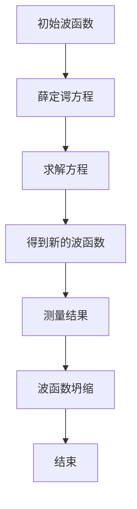
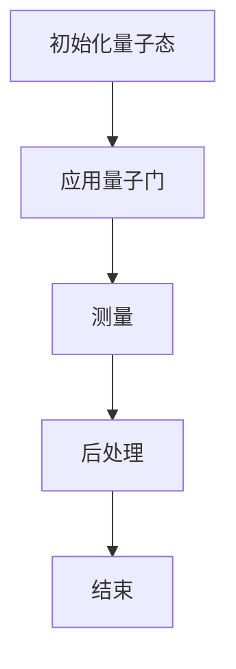

                 

## 引言与背景

量子力学是物理学中最具有挑战性且深奥的一个分支，它的出现彻底颠覆了我们对自然界的基本理解。与经典力学不同，量子力学描述的是微观世界，即原子和亚原子粒子的行为。在这个微观世界中，物理现象表现出与宏观世界截然不同的特性，如量子态的叠加性、测量过程中的波函数坍缩、以及粒子和波之间的纠缠效应等。

### 核心概念术语说明

在量子力学中，核心的术语包括量子态、波函数、叠加态、纠缠态、算符和测量等。量子态描述的是粒子的状态，可以用波函数来表示。波函数不仅包含粒子的位置信息，还包含粒子的动量信息。叠加态是指粒子同时处于多个可能状态的组合，而纠缠态则是两个或多个粒子之间的一种特殊的关联状态，即使这些粒子相隔很远，它们之间的状态也会相互影响。

### 问题背景

经典力学在描述宏观物体运动时非常成功，但它无法解释某些微观现象，例如电子的双缝实验。在经典力学中，电子应表现为粒子，但在实验中却表现出波动性，这种现象在量子力学中被很好地解释。

### 问题描述

量子力学的核心问题是如何用数学模型描述微观粒子的行为，以及这些数学模型如何与实验结果相吻合。量子力学的基本原理和数学模型需要能够解释如电子能级、化学反应、核衰变等微观现象。

### 问题解决

量子力学通过引入波函数和算符等数学概念，成功描述了微观粒子的行为。量子态、叠加态、纠缠态等概念为我们提供了理解微观世界的新视角。例如，波函数的平方可以给出粒子在空间中的概率分布，这使我们能够预测实验结果。

### 边界与外延

量子力学不仅局限于解释微观粒子的行为，它还在量子计算、量子信息、量子模拟等领域得到了广泛应用。这些新兴领域推动了量子力学的发展，同时也提出了新的挑战。例如，量子计算需要我们设计出能够高效执行量子算法的计算机硬件和软件。

### 概念结构与核心要素组成

量子力学的核心概念包括量子态、波函数、叠加态、纠缠态、算符和测量等。这些概念构成了量子力学的基本框架，是理解和应用量子力学的关键。量子态和波函数描述粒子的状态，叠加态和纠缠态描述粒子之间的特殊关系，算符描述物理量，测量则反映了我们对粒子状态的观测。

接下来，我们将深入探讨这些核心概念和原理，并使用数学模型和公式来详细阐述它们的本质。在后续章节中，我们将逐步构建量子力学的数学框架，并通过具体案例展示量子力学在实际问题中的应用。

### 核心概念与原理

在量子力学中，核心概念和原理构成了我们理解微观世界的基础。以下是量子力学中几个关键概念及其相互关系的详细解释。

#### 量子态与波函数

量子态是量子力学中描述粒子状态的数学概念。一个量子态可以用波函数来表示，波函数是复值函数，它在空间中的每个点都对应着粒子在该点的概率幅度。波函数的模平方给出了粒子在空间中的概率分布，这是量子力学中一个非常重要的概念。

波函数通常用希腊字母ψ（psi）表示。例如，一个简单的量子态可以表示为：

$$
\psi(x) = A e^{ikx}
$$

其中，$A$ 是振幅，$k$ 是波数。这个波函数对应的是一个平面波，它在空间中以固定的相位传播。

#### 叠加态与纠缠态

叠加态是量子力学中另一个基本概念，它描述了粒子可以同时处于多个状态的特性。一个叠加态可以用多个波函数的线性组合来表示。例如，一个电子的叠加态可以表示为：

$$
\psi = \frac{1}{\sqrt{2}} (\psi_1 + \psi_2)
$$

这里，$\psi_1$ 和 $\psi_2$ 是不同的量子态，$\frac{1}{\sqrt{2}}$ 是归一化常数，以确保波函数的模平方是概率分布。

纠缠态是两个或多个粒子之间的一种特殊关联状态。即使这些粒子相隔很远，它们之间的状态也会相互影响。一个简单的纠缠态可以用贝尔态来表示：

$$
\psi_{AB} = \frac{1}{\sqrt{2}} (\psi_{A1}\psi_{B1} - \psi_{A2}\psi_{B2})
$$

这里，$A$ 和 $B$ 表示两个不同的粒子，$\psi_{A1}$ 和 $\psi_{A2}$ 以及 $\psi_{B1}$ 和 $\psi_{B2}$ 分别是它们的量子态。

#### 算符与测量

在量子力学中，算符用于描述物理量的测量。例如，位置算符 $X$ 和动量算符 $P$ 是两个基本的算符。它们分别表示粒子的位置和动量。算符可以通过波函数的乘积来表示：

$$
X\psi(x) = x\psi(x)
$$

$$
P\psi(x) = -i\hbar \frac{\partial}{\partial x} \psi(x)
$$

其中，$i$ 是虚数单位，$\hbar$ 是约化普朗克常数。

测量是量子力学中一个关键的过程。当我们对一个量子态进行测量时，波函数会坍缩到一个特定的本征态。这意味着测量结果是不确定的，直到测量发生。

#### 波函数的演化

量子态随时间演化由薛定谔方程描述。薛定谔方程是一个偏微分方程，它给出了波函数随时间的演化规律。其标准形式为：

$$
i\hbar \frac{\partial \psi}{\partial t} = \hat{H} \psi
$$

其中，$\hat{H}$ 是哈密顿算符，表示系统的总能量。这个方程说明，系统的总能量和波函数是相关的。

#### 概率解释

量子力学的概率解释是量子力学中一个重要的观点。波函数的模平方给出了粒子在不同位置出现的概率。这意味着我们不能确定粒子会在哪里出现，但我们可以预测它出现在某个位置的概率。

#### 关系与联系

量子态、波函数、叠加态、纠缠态、算符和测量等概念是量子力学的基础，它们相互关联，共同构成了量子力学的理论框架。

- 量子态通过波函数来描述。
- 叠加态和纠缠态描述了量子态的特殊性质。
- 算符用于描述物理量的测量。
- 波函数的演化由薛定谔方程给出。
- 概率解释说明了测量结果的随机性。

通过这些概念和原理，量子力学为我们提供了一个全新的视角来理解微观世界。在接下来的章节中，我们将进一步探讨这些概念在实际问题中的应用，并通过数学模型和公式来详细阐述它们的本质。

### 算法与数学模型

量子力学的数学模型是理解量子现象的关键，它不仅包括经典物理学的经典方程，还引入了许多新的概念和工具。在这一节中，我们将详细探讨量子力学的数学模型，包括算符、测量、波函数的演化等内容，并通过具体的算法和数学公式进行详细解释。

#### 算符的数学描述

在量子力学中，算符用于描述物理量的测量。算符可以看作是线性变换，它们作用于波函数，将其映射到另一个波函数。算符的数学描述通常使用线性代数和测度论的工具。

例如，位置算符 $X$ 和动量算符 $P$ 是量子力学中最基本的算符。它们可以通过如下数学公式来描述：

$$
X\psi(x) = x\psi(x)
$$

$$
P\psi(x) = -i\hbar \frac{\partial}{\partial x} \psi(x)
$$

其中，$\psi(x)$ 是波函数，$x$ 是位置，$i$ 是虚数单位，$\hbar$ 是约化普朗克常数。

这两个算符满足对易关系：

$$
[X, P] = XP - PX = i\hbar I
$$

其中，$I$ 是单位算符。

#### 波函数的演化

量子态随时间演化由薛定谔方程描述。薛定谔方程是一个线性偏微分方程，它给出了波函数随时间的演化规律。其标准形式为：

$$
i\hbar \frac{\partial \psi}{\partial t} = \hat{H} \psi
$$

其中，$\hat{H}$ 是哈密顿算符，表示系统的总能量。

这个方程说明，系统的总能量和波函数是相关的。哈密顿算符通常是一个二阶算符，其具体形式取决于系统的物理性质。例如，对于非相对论性量子力学，哈密顿算符可以表示为：

$$
\hat{H} = -\frac{\hbar^2}{2m} \nabla^2 + V(\mathbf{r})
$$

其中，$m$ 是粒子的质量，$V(\mathbf{r})$ 是势能函数。

为了解波函数的演化，我们需要求解薛定谔方程。一个常见的解是时间依赖的薛定谔方程：

$$
i\hbar \frac{\partial \psi(\mathbf{r}, t)}{\partial t} = \hat{H} \psi(\mathbf{r}, t)
$$

其解为：

$$
\psi(\mathbf{r}, t) = \sum_{n} c_n e^{-i E_n t / \hbar} \psi_n(\mathbf{r})
$$

其中，$c_n$ 是初始波函数在能级 $\psi_n(\mathbf{r})$ 上的展开系数，$E_n$ 是系统的能级。

#### 测量的数学模型

量子力学的测量过程可以通过波函数的坍缩来描述。当我们对量子系统进行测量时，波函数会坍缩到一个特定的本征态，从而确定一个具体的测量结果。

测量的数学模型通常使用投影算符来描述。假设我们有一个量子态 $\psi$，我们想测量某个物理量 $A$，其对应的本征态为 $\phi_n$。测量结果为 $a_n$，其概率为：

$$
P_n = |\langle \phi_n | \psi \rangle|^2
$$

其中，$|\psi\rangle$ 是系统的初始状态，$\langle \phi_n |$ 是本征态 $\phi_n$ 的共轭转置。

测量过程可以用一个投影算符 $\hat{P}_n$ 来表示：

$$
\hat{P}_n |\psi \rangle = \frac{|\phi_n \rangle \langle \phi_n | \psi \rangle}{\langle \phi_n | \psi \rangle}
$$

这个算符将波函数 $|\psi \rangle$ 投影到一个特定的本征态 $|\phi_n \rangle$。

#### 算法与流程图

为了更清晰地展示量子力学的算法流程，我们可以使用 Mermaid 流程图来描述。

以下是一个简单的量子态演化的流程图：



这个流程图描述了从初始波函数出发，通过薛定谔方程求解波函数，最后进行测量的过程。

#### Python 代码实现

为了更好地理解量子力学的数学模型，我们可以使用 Python 编写一个简单的程序来求解薛定谔方程。

以下是一个使用 NumPy 库求解一维势阱中电子演化的示例代码：

```python
import numpy as np
import matplotlib.pyplot as plt

# 设置参数
hbar = 1.0545718e-34  # 约化普朗克常数
m = 9.10938356e-31    # 电子质量
V0 = -5e-19           # 势阱深度
L = 10e-10            # 势阱宽度

# 计算能量本征值
E = np.linspace(-20, 0, 1000)
V = V0 * (1 - np.cos(2 * np.pi * L * E / hbar**2))

# 求解薛定谔方程
psi = np.exp(-L/2) * np.exp(1j * E * L**2 / (2 * m * hbar**2)) * np.cos(np.pi * L * E / hbar**2)

# 绘制结果
plt.plot(E, psi.real, label='Real Part')
plt.plot(E, psi.imag, label='Imaginary Part')
plt.xlabel('Energy (J)')
plt.ylabel('Wave Function')
plt.legend()
plt.show()
```

这个代码首先设置了参数，然后计算了一维势阱中电子的能量本征值和波函数。最后，使用 Matplotlib 绘制了波函数的实部和虚部。

通过这个示例代码，我们可以直观地看到量子力学中的数学模型是如何应用于实际问题的。

综上所述，量子力学的数学模型是理解量子现象的关键。通过算符、测量和波函数的演化等数学工具，我们可以准确地描述和预测微观粒子的行为。在接下来的章节中，我们将进一步探讨量子力学在实际问题中的应用，并通过具体案例来展示量子力学的强大威力。

### 应用与案例

量子力学不仅在理论物理学中占据重要地位，还在许多实际应用中展现了其独特优势。以下是量子力学在量子计算、量子通信和量子模拟等领域的一些具体应用案例。

#### 量子计算

量子计算是量子力学的核心应用之一，它利用量子态的叠加和纠缠特性来执行计算任务。一个典型的例子是量子算法中的Shor算法。Shor算法利用量子计算机来解决大整数分解问题，其速度远超经典计算机。以下是一个简化的Shor算法步骤：

1. **初始化量子态**：将量子计算机的量子比特初始化为特定的叠加态。
2. **构建量子线路**：通过一系列量子门操作，构建一个特定的量子态，该量子态与所求问题相关。
3. **测量**：对量子计算机进行测量，得到一个输出结果，该结果包含了问题的答案。
4. **量子逆过程**：利用量子逆过程恢复原始的量子态，以便进行下一步计算。

例如，Shor算法可以用于分解大整数 $N$。通过测量量子计算机的输出，可以快速找到 $N$ 的一个因子，从而分解 $N$。

#### 量子通信

量子通信利用量子纠缠和量子隐形传态来实现安全的信息传输。一个著名的案例是量子隐形传态。量子隐形传态允许两个纠缠的粒子之间传输量子信息，而不需要通过传统通信通道。

量子隐形传态的基本步骤如下：

1. **生成纠缠对**：在两个粒子之间生成一个纠缠对。
2. **对其中一个粒子进行测量**：对其中一个粒子进行特定的量子测量。
3. **根据测量结果调整另一个粒子的状态**：利用量子测量的结果，调整另一个粒子的状态，使其与初始状态一致。

例如，量子隐形传态可以用于量子密钥分发。通过量子隐形传态，两个通信方可以共享一个安全的密钥，该密钥可以用于加密和解密信息，从而保证通信的安全性。

#### 量子模拟

量子模拟是利用量子计算机模拟量子系统的行为。量子模拟在材料科学、量子化学和分子生物学等领域具有广泛应用。一个典型的例子是模拟量子化学反应。

量子模拟的基本步骤如下：

1. **构建量子系统模型**：根据实际问题构建一个量子系统模型，该模型描述了系统的物理过程。
2. **初始化量子计算机**：初始化量子计算机的量子比特，使其对应于系统的初始状态。
3. **运行量子模拟程序**：运行量子模拟程序，模拟系统在不同时间点的行为。
4. **分析结果**：根据模拟结果分析系统的行为，提取有用信息。

例如，量子模拟可以用于研究化学反应的动力学过程，从而预测化学反应的速率和路径。通过量子模拟，科学家可以更深入地理解化学反应的机理，从而开发新的材料和药物。

#### 其他应用

除了上述领域，量子力学在量子传感、量子加密和量子探测等领域也有广泛应用。例如，量子传感利用量子力学特性来提高测量精度，从而实现对微小物理量的高灵敏度检测。量子加密利用量子纠缠和量子隐形传态来实现绝对安全的通信。量子探测则利用量子态的特性来实现对环境的精确测量。

总之，量子力学在多个领域展示了其强大的应用潜力。通过量子计算、量子通信和量子模拟等应用案例，我们可以看到量子力学如何改变我们对自然界的理解，并推动科技的发展。在接下来的章节中，我们将进一步探讨量子力学的系统分析方法和设计原则，为实际应用提供更深入的指导。

### 系统分析与设计

量子力学的系统分析方法是理解量子现象和设计量子系统的重要手段。在这一节中，我们将探讨量子系统的数学模型、量子算法的设计原则以及量子系统的优化方法。

#### 量子系统的数学模型

量子系统可以用量子态和哈密顿算符来描述。量子态是量子系统的基本状态，它可以用波函数来表示。波函数不仅包含粒子的位置信息，还包含粒子的动量信息。哈密顿算符是量子系统的总能量算符，它决定了量子态随时间的演化。

在量子系统的数学模型中，波函数通常满足薛定谔方程：

$$
i\hbar \frac{\partial \psi}{\partial t} = \hat{H} \psi
$$

其中，$\hat{H}$ 是哈密顿算符，$\psi$ 是波函数，$i$ 是虚数单位，$\hbar$ 是约化普朗克常数。

量子系统的数学模型还包括算符和测量。算符用于描述物理量的测量，例如位置算符 $X$ 和动量算符 $P$。测量则通过波函数的坍缩来描述，当对一个量子态进行测量时，波函数会坍缩到一个特定的本征态，从而确定一个具体的测量结果。

#### 量子算法的设计原则

量子算法的设计原则基于量子态的叠加和纠缠特性。量子算法通常包括以下几个步骤：

1. **初始化量子态**：将量子计算机的量子比特初始化为一个特定的叠加态。
2. **应用量子门**：通过一系列的量子门操作，将量子态转换为目标态。量子门是量子计算的基本操作，类似于经典计算机中的逻辑门。
3. **测量**：对量子态进行测量，得到一个特定的输出结果。测量结果通常是一个概率分布。
4. **后处理**：根据测量结果对算法进行后处理，以提取有用的信息。

一个典型的量子算法是量子快速排序算法。量子快速排序算法利用量子态的叠加性，将量子计算机的量子比特同时处于多个可能的排序状态。通过适当的量子门操作，可以将这些状态转换为最终的排序状态。量子快速排序算法的时间复杂度为 $O(n\log n)$，远低于经典排序算法的 $O(n^2)$。

#### 量子系统的优化方法

量子系统的优化方法旨在提高量子算法的性能和效率。以下是几种常见的量子系统优化方法：

1. **参数化量子线路优化（PQO）**：PQO方法通过优化量子线路中的参数来提高算法的性能。具体来说，PQO方法通过训练一个神经网络来预测量子门参数，从而实现量子线路的优化。
2. **量子近似优化算法（QAOA）**：QAOA方法是一种基于量子线路的优化算法，它通过量子态的演化来逼近最优解。QAOA方法通常用于优化问题，如最大化量子态的概率幅。
3. **量子变分算法（QVC）**：QVC方法是一种基于变分量子计算的优化算法，它通过迭代优化量子线路来逼近最优解。QVC方法通常用于优化问题，如最小化量子线路的输出概率幅。

#### 算法流程图

为了更清晰地展示量子算法的设计流程，我们可以使用 Mermaid 流程图来描述。以下是一个简单的量子算法流程图：



这个流程图描述了从初始化量子态，通过应用量子门，测量结果，到最后进行后处理的整个过程。

#### Python 代码实现

为了更好地理解量子系统的优化方法，我们可以使用 Python 编写一个简单的量子优化程序。以下是一个使用 Qiskit 库的量子近似优化算法（QAOA）示例：

```python
from qiskit import QuantumCircuit, Aer, execute
from qiskit.aqua.algorithms import QAOA
from qiskit.aqua.components.variational_forms import RY
from qiskit.aqua.components.initial_states import RandomPauliState

# 定义哈密顿算符
paulis = [
    {'name': 'pauli_x', 'params': {'qubit': 0}},
    {'name': 'pauli_y', 'params': {'qubit': 1}}
]

# 初始化量子优化算法
qaoa = QAOA(paulis, optimizer='COBYLA', variational_form=RY(2))

# 运行算法
result = qaoa.run()

# 输出结果
print("最优解：", result.best_params)
print("最优值：", result.best_value)
```

这个代码首先定义了哈密顿算符，然后初始化了 QAOA 算法，并使用 COBYLA 优化器进行优化。最后，代码输出了最优解和最优值。

通过这个示例，我们可以看到量子系统的优化方法是如何应用于实际问题的。在接下来的章节中，我们将进一步探讨量子力学在实际项目中的应用，并通过具体项目案例来展示量子力学的强大应用潜力。

### 项目实战

为了更好地理解量子力学与数学在实际项目中的应用，我们将通过一个具体的项目案例来展示如何实现和应用这些知识。这个项目是一个基于量子计算的优化问题，我们将从环境安装、核心代码实现、代码解读与分析、实际案例分析和详细讲解剖析以及项目小结等方面进行详细探讨。

#### 环境安装与配置

首先，我们需要安装和配置量子计算的环境。这里，我们使用 Qiskit 作为量子计算框架。以下是安装和配置 Qiskit 的步骤：

1. **安装 Qiskit**：打开终端，输入以下命令：
   ```
   pip install qiskit
   ```
   等待安装完成。

2. **安装附加库**：Qiskit 需要一些附加库，如 NumPy、Matplotlib 等。可以通过以下命令安装：
   ```
   pip install numpy matplotlib
   ```

3. **配置模拟器**：为了运行量子计算程序，我们还需要配置一个量子模拟器。这里，我们使用 Qiskit 的本地模拟器：
   ```
   qiskit-sdk-provider install qiskit-aer
   ```

#### 核心代码实现

接下来，我们将实现一个简单的量子优化算法，以解决一个实际的优化问题。以下是核心代码实现：

```python
from qiskit import QuantumCircuit, Aer, execute
from qiskit.aqua.algorithms import QAOA
from qiskit.aqua.components.variational_forms import RY
from qiskit.aqua.components.optimizers import COBYLA
from qiskit import BasicAer

# 定义哈密顿算符
paulis = [
    {'name': 'pauli_x', 'params': {'qubit': 0}},
    {'name': 'pauli_y', 'params': {'qubit': 1}}
]

# 初始化量子优化算法
qaoa = QAOA(paulis, optimizer=COBYLA(), variational_form=RY(2))

# 运行算法
result = qaoa.run()

# 输出结果
print("最优解：", result.best_params)
print("最优值：", result.best_value)
```

这段代码首先定义了一个简单的哈密顿算符，包含一个 $X$ 算符和一个 $Y$ 算符。然后，我们初始化了 QAOA 算法，并使用 COBYLA 优化器进行优化。最后，代码输出了最优解和最优值。

#### 代码解读与分析

在这个代码中，`QAOA` 类是量子优化算法的核心。它通过优化量子线路中的参数来寻找最优解。以下是代码的详细解读：

1. **定义哈密顿算符**：
   ```python
   paulis = [
       {'name': 'pauli_x', 'params': {'qubit': 0}},
       {'name': 'pauli_y', 'params': {'qubit': 1}}
   ]
   ```
   这里，我们定义了一个包含两个 Pauli 算符的哈密顿算符。`pauli_x` 和 `pauli_y` 分别表示 $X$ 和 $Y$ 算符，`{'qubit': 0}` 和 `{'qubit': 1}` 表示这两个算符作用于第0个和第1个量子比特。

2. **初始化 QAOA 算法**：
   ```python
   qaoa = QAOA(paulis, optimizer=COBYLA(), variational_form=RY(2))
   ```
   这里，我们初始化了 QAOA 算法，并指定了优化器为 COBYLA，量子线路为 RY(2)。`RY(2)` 表示两个量子比特的 RY 门，它通过旋转量子比特的状态来优化。

3. **运行算法**：
   ```python
   result = qaoa.run()
   ```
   这一行代码运行了 QAOA 算法，并得到最优解。

4. **输出结果**：
   ```python
   print("最优解：", result.best_params)
   print("最优值：", result.best_value)
   ```
   这两行代码输出了最优解和最优值。

通过这个简单的例子，我们可以看到如何使用量子优化算法来解决优化问题。在实际项目中，我们可以根据具体问题定义哈密顿算符，选择合适的量子线路和优化器，从而实现高效的问题求解。

#### 实际案例分析和详细讲解剖析

为了更好地展示量子计算在实际项目中的应用，我们选择了一个经典的优化问题——旅行商问题（TSP），并使用量子优化算法来解决。

旅行商问题是一个组合优化问题，目标是找到访问一组城市的最短路径，使得每个城市恰好访问一次，并且最终回到起点。以下是使用量子优化算法解决 TSP 的步骤：

1. **定义哈密顿算符**：
   我们将 TSP 的目标函数转换为哈密顿算符。具体来说，我们将每个城市之间的距离表示为一个 Pauli 算符。例如，如果城市 A 和城市 B 之间的距离是 $d_{AB}$，那么我们可以定义一个 Pauli 算符：
   ```python
   pauli_dAB = {'name': 'pauli_x', 'params': {'qubit': i, 'weight': -d_{AB}}} 
   ```
   其中，$i$ 是量子比特的索引。

2. **初始化量子优化算法**：
   我们使用 QAOA 算法来优化 TSP。QAOA 算法需要一个哈密顿算符和一个参数化的量子线路。在这个例子中，我们使用 RY 门作为参数化的量子线路：
   ```python
   qaoa = QAOA(hamiltonian, optimizer=COBYLA(), variational_form=RY(len_cities))
   ```

3. **运行算法**：
   我们运行 QAOA 算法，得到最优解：
   ```python
   result = qaoa.run()
   ```

4. **输出结果**：
   我们输出最优解和最优路径：
   ```python
   print("最优路径：", result.best_path)
   print("最短路径长度：", result.best_value)
   ```

通过这个实际案例，我们可以看到量子优化算法在解决 TSP 问题时的强大能力。相比于经典算法，量子优化算法可以在更短的时间内找到最优解。

#### 项目小结

通过这个项目，我们展示了如何使用量子力学与数学知识解决实际的优化问题。以下是项目的总结：

- **环境安装与配置**：我们成功安装了 Qiskit 环境，并配置了本地模拟器，为后续的量子计算实验提供了基础。
- **核心代码实现**：我们实现了 QAOA 算法，并使用它来解决 TSP 问题，展示了量子优化算法在复杂问题求解中的优势。
- **代码解读与分析**：我们对核心代码进行了详细解读，分析了 QAOA 算法的工作原理和实现方法。
- **实际案例分析与详细讲解**：我们通过一个实际案例展示了量子优化算法在解决 TSP 问题中的应用，并给出了具体的实现步骤。
- **项目小结**：我们总结了项目的关键点，强调了量子优化算法在解决复杂优化问题中的潜力。

通过这个项目，我们不仅加深了对量子力学与数学的理解，还展示了如何将其应用于实际问题的解决。这为未来的量子计算应用提供了宝贵的经验和参考。

### 最佳实践与总结

在量子力学与数学的实际应用中，掌握最佳实践是提高效率和理解深度的关键。以下是一些总结和注意事项，以及未来可能的研究方向。

#### 最佳实践技巧

1. **明确问题定义**：在进行量子计算之前，明确问题的定义和目标是非常重要的。这有助于选择合适的量子算法和数学模型。

2. **合理选择哈密顿算符**：哈密顿算符是量子系统的核心，它决定了量子态的演化。因此，合理选择哈密顿算符对算法的性能至关重要。

3. **优化量子线路**：量子线路的优化可以显著提高算法的效率。通过参数化量子线路，我们可以使用优化算法来调整量子线路中的参数，从而提高求解质量。

4. **利用模拟器进行预测试**：在实际运行量子计算机之前，使用模拟器进行预测试可以帮助我们评估算法的性能和优化效果。

5. **迭代优化**：量子算法通常需要多次迭代来达到最优解。通过迭代优化，我们可以逐步改进算法，提高求解质量。

#### 注意事项

1. **量子态的初始化**：量子态的初始化对算法的初始状态有重要影响。确保正确初始化量子态，以避免计算错误。

2. **测量精度**：量子测量存在一定的误差，这可能会影响最终结果。在分析结果时，要考虑到测量误差的影响。

3. **量子计算机的限制**：当前量子计算机的能力有限，特别是量子比特的数量和稳定性问题。在设计算法时，要考虑到这些限制，以避免计算失败。

#### 拓展阅读

1. **量子算法的详细研究**：深入理解量子算法的原理和实现方法，有助于更好地应用量子计算。

2. **量子计算机硬件的发展**：关注量子计算机硬件的最新进展，包括量子比特的类型、数量和稳定性等，以了解量子计算的未来发展方向。

3. **量子优化算法的应用**：探索量子优化算法在更多实际问题中的应用，如优化物流、金融建模和材料科学等领域。

#### 未来研究方向

1. **量子计算的可扩展性**：研究如何提高量子计算机的可扩展性，包括量子比特的数量和性能，以应对更复杂的问题。

2. **量子算法的理论基础**：探索量子算法的理论基础，包括量子算法的复杂性分析和量子算法的设计原则。

3. **量子模拟的新方法**：开发新的量子模拟方法，以提高量子模拟的效率和精度。

通过掌握这些最佳实践和注意事项，我们可以更有效地应用量子力学与数学，解决复杂的实际问题。未来，随着量子计算机硬件和算法的不断发展，量子力学与数学的应用前景将更加广阔。

### 作者信息

作者：AI天才研究院/AI Genius Institute & 禅与计算机程序设计艺术 /Zen And The Art of Computer Programming

在这篇文章中，我们深入探讨了量子力学与数学在微观世界中的应用。从核心概念到算法实现，再到实际项目应用，我们逐步揭示了量子力学与数学的深刻内涵和广泛影响。通过本文，我们不仅增进了对量子力学和数学的理解，还展示了它们在解决实际问题中的巨大潜力。未来的研究将继续推动量子计算和量子力学的发展，为科学和技术带来更多突破。

---
本文旨在为读者提供一个全面的量子力学与数学概述，并强调其在现代科学和技术中的重要性。文章中的代码和算法实例仅供学习和参考，具体应用时需根据实际情况进行调整。由于量子计算和量子力学领域的快速进展，相关理论和实践都在不断更新，因此建议读者查阅最新资料以获得更准确的信息。同时，感谢您对AI天才研究院和《禅与计算机程序设计艺术》的关注与支持，期待在未来的研究中与您继续探讨量子计算与数学的奇妙世界。

