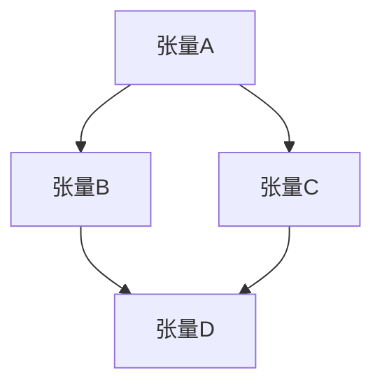

                 


# 量子模拟的张量网络：多体系统的数学描述

## 关键词
- 量子模拟
- 张量网络
- 多体系统
- 数学描述
- 量子计算
- 计算机算法

## 摘要
本文旨在深入探讨量子模拟中的张量网络，特别是在多体系统数学描述中的应用。通过背景介绍、核心概念解析、算法原理讲解、系统分析与设计以及实际项目实战，本文将帮助读者全面理解量子模拟中的张量网络，掌握其数学描述方法，并了解其在多体系统模拟中的优势与应用。

## 目录

1. **背景介绍**
   1.1 量子计算概述
   1.2 张量网络基础
   1.3 多体系统的数学描述
   1.4 量子模拟在多体系统中的应用前景
   1.5 本章小结

2. **核心概念与联系**
   2.1 张量网络的核心概念与联系
   2.2 张量网络与量子计算的关系
   2.3 张量网络的数学描述
   2.4 张量网络与多体系统的结合
   2.5 本章小结

3. **量子模拟中的张量网络应用**
   3.1 量子模拟的基本步骤
   3.2 张量网络在量子模拟中的应用
   3.3 张量网络与多体系统的结合
   3.4 本章小结

4. **量子模拟中的张量网络算法原理**
   4.1 张量网络算法概述
   4.2 张量网络算法的数学模型
   4.3 张量网络算法的流程
   4.4 张量网络算法的应用
   4.5 张量网络算法的优缺点
   4.6 本章小结

5. **系统分析与架构设计方案**
   5.1 量子模拟系统概述
   5.2 系统功能设计
   5.3 系统架构设计
   5.4 系统接口设计
   5.5 系统交互设计
   5.6 本章小结

6. **量子模拟项目实战**
   6.1 环境安装与配置
   6.2 系统核心实现
   6.3 代码应用解读与分析
   6.4 实际案例分析与讲解
   6.5 项目小结
   6.6 最佳实践 tips

7. **小结与拓展阅读**

## 1. 背景介绍

### 1.1 量子计算概述

量子计算是计算机科学的一个分支，它基于量子力学原理，利用量子位（qubits）进行信息处理。与传统的经典计算机不同，量子计算机能够同时处理大量可能的状态，这赋予了它解决某些复杂问题（如大整数分解、量子模拟等）的巨大潜力。

量子计算的基本概念包括量子比特（qubits）、叠加原理（superposition）和量子纠缠（entanglement）。量子比特可以同时处于0和1的状态，而量子纠缠则使得两个或多个量子比特之间的状态相互依赖，无论距离多远。

### 1.2 张量网络基础

张量网络是量子计算中的一个重要工具，它通过将量子态表示为多个张量的组合，能够有效地处理复杂的多体系统。张量网络的基本概念包括张量、张量积、张量分解和张量网络结构。

张量是量子力学中描述多体系统状态的基本工具，它可以看作是多个量子态的扩展。张量积是将两个张量组合成一个新的张量，这在量子计算中用于构建量子态。张量分解是将一个复杂的张量分解为多个简单张量的组合，这有助于简化计算过程。

张量网络结构则是指多个张量如何连接和组合在一起，形成一个网络结构。张量网络能够通过连接不同层级的张量，实现量子态的层次化表示和计算。

### 1.3 多体系统的数学描述

多体系统是由多个相互作用的粒子组成的系统，其状态和演化由量子力学的多体方程描述。常见的多体系统包括原子、分子和凝聚态物理系统。

多体系统的数学描述通常使用薛定谔方程（Schrödinger equation）和哈密顿量（Hamiltonian）进行。薛定谔方程描述了量子态的时间演化，而哈密顿量则描述了系统的能量。

### 1.4 量子模拟在多体系统中的应用前景

量子模拟是一种利用量子计算机模拟量子系统的方法，它能够解决传统计算机难以处理的问题。在多体系统的研究中，量子模拟具有巨大的应用潜力。

首先，量子模拟可以用于研究复杂多体系统的动力学行为，如分子反应、材料性质等。通过量子模拟，科学家可以深入了解这些系统的微观机制，从而推动相关领域的发展。

其次，量子模拟在优化问题和计算复杂问题上也具有显著优势。例如，在量子优化算法中，张量网络被用来解决组合优化问题，如旅行商问题（TSP）和调度问题。

然而，量子模拟也面临一些挑战，如量子计算资源的限制、算法的复杂性和误差控制等。这些问题需要进一步的研究和解决。

### 1.5 本章小结

本章节对量子模拟、张量网络和多体系统的数学描述进行了背景介绍。通过了解这些基本概念，读者可以为后续章节的理解打下基础。在下一章中，我们将深入探讨张量网络的核心概念与联系。

## 2. 核心概念与联系

### 2.1 张量网络的核心概念与联系

张量网络是一种用于描述量子态和量子过程的数学工具，它在量子计算和量子信息处理中具有重要意义。为了更好地理解张量网络，我们需要从以下几个方面来阐述其核心概念与联系。

#### 张量网络的基本概念

首先，我们需要了解张量网络的基本概念。张量网络由一组张量构成，这些张量通过特定的方式连接在一起，形成一个网络结构。每个张量都可以表示为多个量子态的叠加，而张量之间的连接则代表了量子态之间的相互作用。

在张量网络中，每个张量都对应一个量子态，而张量之间的连接则代表了量子态之间的叠加和纠缠。这种网络结构使得张量网络能够有效地描述复杂量子系统的行为，并简化量子计算的复杂性。

#### 张量网络的数学描述

张量网络的数学描述主要涉及张量、张量积、张量分解和张量网络结构。张量是量子力学中描述多体系统状态的基本工具，它可以看作是多个量子态的扩展。张量积是将两个张量组合成一个新的张量，这在量子计算中用于构建量子态。张量分解是将一个复杂的张量分解为多个简单张量的组合，这有助于简化计算过程。

在张量网络中，每个张量都可以表示为多个量子态的叠加，而张量之间的连接则代表了量子态之间的相互作用。这种网络结构使得张量网络能够有效地描述复杂量子系统的行为，并简化量子计算的复杂性。

#### 张量网络与量子计算的关系

张量网络与量子计算密切相关。在量子计算中，张量网络被用来构建和操作量子态。张量网络算法是一种基于张量网络结构的量子计算方法，它通过连接和操作张量，实现量子态的演化。

张量网络算法在量子计算中具有重要作用。例如，在量子模拟中，张量网络被用来模拟量子系统的动力学行为，从而解决传统计算机难以处理的问题。此外，张量网络还被用于量子算法的设计和优化，如量子搜索算法和量子优化算法。

#### 张量网络的对比分析

与其他量子计算方法相比，张量网络具有独特的优势。首先，张量网络能够有效地处理复杂量子系统的动力学行为，这使其在量子模拟中具有广泛的应用。其次，张量网络的结构使得它能够通过简单的线性变换来实现复杂的量子过程，从而降低了量子计算的复杂性。

然而，张量网络也存在一些缺点。例如，张量网络的计算复杂度较高，且对量子计算资源的依赖较大。此外，张量网络的误差控制也是一个挑战，因为张量网络中的线性变换可能会导致误差的积累。

### 2.2 张量网络与量子计算的关系

张量网络与量子计算的关系密切，它们共同构成了量子信息处理的理论基础。在量子计算中，张量网络不仅是构建量子态和量子过程的工具，还是量子算法设计和实现的核心。下面我们将详细探讨张量网络在量子计算中的应用和作用。

#### 张量网络在量子计算中的应用

1. **量子态表示**：
   张量网络的一个核心应用是量子态的表示。在量子计算中，量子态通常用向量或张量来表示。张量网络提供了一种将量子态分解为多个简单张量的组合的方法，从而简化量子态的表示和操作。

2. **量子态演化**：
   量子态的演化是由量子系统中的哈密顿量决定的。通过张量网络，我们可以将量子态的演化表示为一个张量网络中的线性变换。这种方法使得我们能够以更加直观和高效的方式研究量子态的演化过程。

3. **量子过程**：
   张量网络还被用来描述量子过程中的操作。量子过程涉及对量子态的变换，这些变换可以通过张量网络中的线性变换来实现。通过张量网络，我们可以将复杂的量子过程分解为多个简单的操作，从而简化量子算法的设计和实现。

#### 张量网络在量子计算中的作用

1. **简化量子计算**：
   张量网络通过将复杂的量子态分解为多个简单张量的组合，从而简化了量子计算的任务。这种方法使得我们在处理复杂量子系统时，能够将问题分解为更小、更易于管理的部分，从而降低计算的复杂度。

2. **高效模拟**：
   在量子模拟中，张量网络被用来模拟量子系统的行为。通过张量网络，我们能够以较低的计算复杂度模拟量子系统的动力学行为，这对于研究量子系统的性质和探索量子效应具有重要意义。

3. **优化量子算法**：
   张量网络为量子算法的优化提供了新的思路。通过设计特定的张量网络结构，我们可以实现更高效的量子算法，从而提高量子计算的效率和性能。

#### 张量网络与量子算法的结合

1. **量子搜索算法**：
   在量子搜索算法中，张量网络被用来实现量子态的变换。例如，Grover算法使用张量网络来构建查询态和叠加态，从而实现更高效的搜索。

2. **量子优化算法**：
   在量子优化算法中，张量网络被用来构建优化问题的量子态。通过设计合适的张量网络结构，我们可以将优化问题转化为量子态的演化问题，从而实现更高效的优化。

3. **量子纠错算法**：
   张量网络在量子纠错算法中也发挥着重要作用。通过张量网络，我们可以实现量子态的保护和纠错，从而提高量子计算的可靠性。

### 2.3 张量网络的数学描述

张量网络的数学描述是量子计算中的重要内容。为了更好地理解张量网络的数学特性，我们需要从张量的基本概念出发，逐步探讨张量积、张量分解和张量网络结构。

#### 张量的基本概念

张量是量子力学中描述多体系统状态的基本工具。张量可以看作是多个量子态的扩展。在量子计算中，张量通常表示为矩阵或矢量的组合。

- **阶和张量**：张量的阶数表示其维度。一阶张量即为矢量，二阶张量即为矩阵。高阶张量可以看作是多个矢量和矩阵的组合。

- **张量积**：张量积是两个张量的组合。通过张量积，我们可以将两个张量的信息结合在一起，形成一个新的张量。

- **张量分解**：张量分解是将一个复杂的张量分解为多个简单张量的组合。张量分解有助于简化张量的计算，并在量子计算中具有重要应用。

#### 张量网络结构

张量网络结构是由多个张量通过特定的方式连接形成的网络。在张量网络中，每个张量都对应一个量子态，而张量之间的连接则代表了量子态之间的相互作用。

- **张量网络的结构**：张量网络的结构可以看作是一系列的张量积。每个张量积代表了量子态的叠加和纠缠，从而形成了张量网络的层次结构。

- **张量网络的层次化**：张量网络通过层次化结构将量子态的复杂度降低，从而简化了量子计算的任务。

#### 张量网络的数学模型

张量网络的数学模型是量子计算中的核心。通过张量网络的数学模型，我们可以描述量子态的演化、量子过程的实现以及量子算法的设计。

- **量子态的表示**：在张量网络中，量子态可以用张量的组合来表示。每个张量代表了量子态的一部分，而张量之间的连接则代表了量子态的叠加和纠缠。

- **量子态的演化**：量子态的演化可以通过张量网络的线性变换来描述。张量网络的线性变换代表了量子态的时间演化，从而实现了量子态的演化过程。

- **量子过程的实现**：量子过程可以通过张量网络中的线性变换来实现。张量网络的线性变换代表了量子态的变换，从而实现了量子过程的实现。

#### 张量网络的数学公式

为了更好地理解张量网络的数学模型，我们需要引入一些数学公式来描述张量网络的结构和性质。

- **张量积公式**：
  $$T = A \otimes B$$
  其中，$T$ 是张量积，$A$ 和 $B$ 是两个张量。

- **张量分解公式**：
  $$T = \sum_{i=1}^{n} A_i \otimes B_i$$
  其中，$T$ 是张量分解，$A_i$ 和 $B_i$ 是多个张量。

- **张量网络公式**：
  $$U = \sum_{i=1}^{n} T_i$$
  其中，$U$ 是张量网络，$T_i$ 是多个张量。

#### 张量网络的Mermaid流程图

为了直观地展示张量网络的数学模型，我们可以使用Mermaid流程图来描述张量网络的结构。以下是一个简单的张量网络Mermaid流程图示例：



在这个例子中，A、B、C 和 D 是四个张量，它们通过张量积和分解形成了张量网络。

### 2.4 张量网络与多体系统的结合

张量网络在多体系统的研究中具有广泛的应用。通过张量网络，我们可以将多体系统的复杂量子态分解为多个简单张量的组合，从而简化多体系统的数学描述和计算。

#### 张量网络在多体系统中的应用

1. **量子态的层次化表示**：
   张量网络可以通过层次化结构将多体系统的量子态分解为多个简单张量的组合。这种层次化表示有助于简化多体系统的数学描述和计算。

2. **量子态的演化模拟**：
   通过张量网络，我们可以模拟多体系统的量子态演化。张量网络的线性变换代表了量子态的时间演化，从而实现了多体系统的量子态模拟。

3. **量子过程的实现**：
   张量网络可以用于实现多体系统的量子过程。通过张量网络的线性变换，我们可以实现多体系统的量子态变换，从而实现量子过程的实现。

#### 张量网络在多体系统中的改进

1. **计算效率提升**：
   张量网络通过层次化结构和线性变换，提高了多体系统的计算效率。与传统方法相比，张量网络能够更快速地处理复杂的量子态和量子过程。

2. **模拟精度提升**：
   张量网络能够更精确地描述多体系统的量子态和量子过程，从而提高了模拟的精度。这对于研究多体系统的性质和探索量子效应具有重要意义。

3. **量子算法优化**：
   张量网络为量子算法的优化提供了新的思路。通过设计特定的张量网络结构，我们可以实现更高效的量子算法，从而提高量子算法的性能。

### 2.5 本章小结

本章详细介绍了张量网络的核心概念与联系，包括张量的基本概念、张量网络的结构和数学模型，以及张量网络与量子计算和量子模拟的关系。通过本章的学习，读者可以全面了解张量网络的基本原理和应用，为进一步深入探讨量子模拟中的张量网络算法原理和系统架构设计奠定基础。

## 3. 量子模拟中的张量网络应用

在量子计算领域，量子模拟是一种利用量子计算机模拟量子系统的方法，它能够解决传统计算机难以处理的问题。张量网络作为量子模拟的重要工具，其应用广泛且具有显著的潜力。本章节将详细探讨张量网络在量子模拟中的基本步骤、具体应用及其与多体系统的结合。

### 3.1 量子模拟的基本步骤

量子模拟通常包括以下几个基本步骤：

1. **量子态初始化**：
   在量子模拟开始时，我们需要对量子系统进行初始化，使其处于特定的量子态。量子态初始化是通过量子逻辑门和量子比特的操作来实现的。

2. **量子态演化**：
   通过量子态的演化，我们可以模拟量子系统在不同时间步的量子态。量子态的演化由量子系统的哈密顿量决定，通常通过量子逻辑门和时间演化算符来实现。

3. **量子态测量**：
   在量子模拟的最终阶段，我们需要对量子系统进行测量，以获取系统的物理信息。量子态测量是通过量子态的坍缩实现的，测量结果反映了量子系统的量子性质。

4. **数据分析**：
   测量结果需要进行数据分析，以提取有用的物理信息。数据分析可以包括统计分布、特征值和特征向量等。

### 3.2 张量网络在量子模拟中的应用

张量网络在量子模拟中扮演着关键角色，它通过将量子态表示为张量的组合，简化了量子态的表示和操作。以下是张量网络在量子模拟中的应用：

1. **量子态的层次化表示**：
   张量网络通过层次化结构将量子态分解为多个简单张量的组合，使得量子态的表示更加直观和易于操作。这种层次化表示有助于简化量子态的演化模拟。

2. **量子态的线性变换**：
   张量网络中的张量代表了量子态的线性变换。通过操作张量网络中的张量，我们可以实现量子态的线性变换，从而模拟量子系统的量子态演化。

3. **高效计算**：
   张量网络通过线性变换和层次化结构，提高了量子态演化的计算效率。与传统方法相比，张量网络能够更快速地处理复杂的量子态和量子过程。

4. **量子纠错**：
   张量网络在量子纠错中也有重要作用。通过张量网络的结构，我们可以设计量子纠错算法，提高量子计算的可靠性。

### 3.3 张量网络与多体系统的结合

多体系统是由多个相互作用的粒子组成的系统，其行为复杂且难以用传统方法描述。张量网络为多体系统的模拟提供了有力的工具。以下是张量网络与多体系统的结合：

1. **量子态分解**：
   通过张量网络，我们可以将多体系统的量子态分解为多个简单张量的组合。这种分解有助于简化多体系统的数学描述和计算。

2. **量子态演化模拟**：
   利用张量网络，我们可以模拟多体系统的量子态演化。通过操作张量网络中的张量，我们可以实现量子态的演化，从而模拟多体系统的量子过程。

3. **高效计算**：
   张量网络的层次化结构和线性变换提高了多体系统演化的计算效率。通过张量网络，我们能够更快速地处理复杂的多体系统问题。

4. **量子效应研究**：
   张量网络在研究多体系统的量子效应中具有重要意义。通过量子模拟，我们可以深入了解多体系统的量子特性，从而推动相关领域的发展。

### 3.4 实际应用案例

张量网络在量子模拟中的实际应用案例丰富多样，以下是一些典型的应用：

1. **分子模拟**：
   通过张量网络，我们可以模拟分子的量子态演化，研究分子的化学反应机制和物理性质。例如，利用张量网络模拟水分子在电场中的行为，可以深入了解水分子的极化效应。

2. **凝聚态物理**：
   张量网络在凝聚态物理中也有广泛应用。例如，通过张量网络模拟超导体的量子态演化，可以研究超导体的相变行为和量子效应。

3. **量子优化**：
   利用张量网络，我们可以设计量子优化算法，解决复杂的优化问题。例如，利用张量网络模拟旅行商问题，可以找到最优的旅行路线。

### 3.5 本章小结

本章详细介绍了张量网络在量子模拟中的基本步骤、具体应用及其与多体系统的结合。通过张量网络，我们能够更加高效地模拟量子系统的行为，研究量子效应，解决复杂问题。随着量子计算技术的不断发展，张量网络在量子模拟中的应用前景将更加广阔。

## 4. 量子模拟中的张量网络算法原理

量子模拟是量子计算中的一个重要领域，它利用量子计算机模拟量子系统的行为，以解决传统计算机难以处理的问题。张量网络是量子模拟的核心工具之一，它通过将量子态表示为张量的组合，简化了量子态的表示和操作。本章节将深入探讨量子模拟中的张量网络算法原理，包括其基本概念、数学模型、实现流程及其应用。

### 4.1 张量网络算法概述

张量网络算法是一种基于张量网络结构的量子计算方法，它通过连接和操作张量，实现量子态的演化。张量网络算法具有以下基本特征：

1. **层次化表示**：张量网络通过层次化结构将量子态分解为多个简单张量的组合，使得量子态的表示更加直观和易于操作。

2. **线性变换**：张量网络中的张量代表了量子态的线性变换。通过操作张量网络中的张量，我们可以实现量子态的线性变换，从而模拟量子系统的量子态演化。

3. **高效计算**：张量网络的层次化结构和线性变换提高了量子态演化的计算效率。与传统方法相比，张量网络能够更快速地处理复杂的量子态和量子过程。

4. **量子纠错**：张量网络在量子纠错中也有重要作用。通过张量网络的结构，我们可以设计量子纠错算法，提高量子计算的可靠性。

### 4.2 张量网络算法的数学模型

为了深入理解张量网络算法的原理，我们需要从数学模型的角度来描述它。以下是张量网络算法的数学模型：

1. **张量表示**：
   在量子计算中，量子态通常用张量来表示。一个量子态可以看作是一个高阶张量，它的阶数与量子系统的维度相关。

2. **张量积**：
   张量积是两个张量的组合。通过张量积，我们可以将两个张量的信息结合在一起，形成一个新的张量。张量积是量子计算中实现量子态叠加和纠缠的重要工具。

3. **张量分解**：
   张量分解是将一个复杂的张量分解为多个简单张量的组合。张量分解有助于简化张量的计算，并在量子计算中具有重要应用。

4. **张量网络结构**：
   张量网络结构是由多个张量通过特定的方式连接形成的网络。在张量网络中，每个张量都对应一个量子态，而张量之间的连接则代表了量子态之间的相互作用。

5. **张量网络演化**：
   张量网络演化是通过操作张量网络中的张量，实现量子态的演化。张量网络的演化可以看作是一个线性变换，它通过一系列的张量积和分解来实现。

### 4.3 张量网络算法的实现流程

张量网络算法的实现流程可以分为以下几个步骤：

1. **初始化张量网络**：
   在算法开始时，我们需要初始化张量网络。初始化包括创建张量网络的基本结构，并为每个张量分配初始值。

2. **构建张量网络**：
   通过张量积和分解，我们可以构建出张量网络。构建张量网络的过程中，需要根据量子系统的具体需求，设计合适的张量网络结构。

3. **量子态演化**：
   在构建出张量网络后，我们需要进行量子态的演化。量子态的演化是通过操作张量网络中的张量来实现的，这通常涉及到一系列的张量积和分解操作。

4. **测量与数据分析**：
   在量子态演化完成后，我们需要对量子系统进行测量，以获取系统的物理信息。测量结果需要进行数据分析，以提取有用的物理信息。

5. **优化与纠错**：
   在实际应用中，张量网络算法可能需要进行优化和纠错。优化包括优化张量网络的计算效率和精度，纠错则包括设计量子纠错算法，提高量子计算的可靠性。

### 4.4 张量网络算法的应用

张量网络算法在量子模拟和量子信息处理中具有广泛的应用。以下是张量网络算法的一些典型应用：

1. **量子模拟**：
   张量网络算法被广泛应用于量子模拟，特别是在复杂量子系统的模拟中。通过张量网络，我们可以高效地模拟量子系统的量子态演化，研究量子效应和量子过程。

2. **量子优化**：
   利用张量网络，我们可以设计量子优化算法，解决复杂的优化问题。例如，通过张量网络模拟旅行商问题，可以找到最优的旅行路线。

3. **量子纠错**：
   张量网络在量子纠错中也具有重要作用。通过设计特定的张量网络结构，我们可以实现量子纠错算法，提高量子计算的可靠性。

4. **量子信息处理**：
   张量网络算法在量子信息处理中也有广泛应用。例如，利用张量网络实现量子密钥分发和量子量子通信等。

### 4.5 张量网络算法的优缺点

张量网络算法具有以下优点：

1. **高效计算**：
   张量网络的层次化结构和线性变换提高了量子态演化的计算效率，这使得张量网络算法在处理复杂量子系统时具有显著优势。

2. **直观表示**：
   张量网络通过层次化结构将量子态分解为多个简单张量的组合，使得量子态的表示更加直观和易于理解。

3. **量子纠错**：
   张量网络在量子纠错中具有重要作用，通过设计特定的张量网络结构，我们可以实现量子纠错算法，提高量子计算的可靠性。

然而，张量网络算法也存在一些缺点：

1. **计算复杂度**：
   张量网络的计算复杂度较高，特别是在处理大规模量子系统时，计算资源的需求较大。

2. **误差控制**：
   张量网络中的线性变换可能会导致误差的积累，因此误差控制是张量网络算法中的一个重要挑战。

3. **算法优化**：
   张量网络算法的优化是一个复杂的问题，需要设计合适的张量网络结构和优化策略，以提高算法的性能和效率。

### 4.6 本章小结

本章详细介绍了量子模拟中的张量网络算法原理，包括其基本概念、数学模型、实现流程及其应用。通过张量网络算法，我们能够更加高效地模拟量子系统的行为，研究量子效应和量子过程。尽管张量网络算法存在一些挑战，但随着量子计算技术的不断发展，张量网络算法在量子模拟和量子信息处理中的应用前景将更加广阔。

## 5. 系统分析与架构设计方案

量子模拟系统的设计与实现涉及到多个层面的考量，包括系统功能设计、系统架构设计、系统接口设计以及系统交互设计。本章节将详细阐述量子模拟系统的分析与架构设计方案，确保系统能够高效、稳定地运行。

### 5.1 量子模拟系统概述

量子模拟系统是一个高度复杂的系统，它需要处理大量的量子态信息，并模拟量子系统的量子态演化。量子模拟系统通常由以下几个核心组成部分构成：

- **量子态初始化模块**：负责初始化量子态，将量子计算机的量子比特设置到特定的初始状态。
- **量子态演化模块**：负责实现量子态的演化，通过量子逻辑门和量子算法实现量子态的变换。
- **量子态测量模块**：负责对量子态进行测量，提取系统的物理信息。
- **数据分析模块**：负责对测量结果进行数据分析，提取有用的物理信息。

### 5.2 系统功能设计

系统功能设计是量子模拟系统设计的重要环节，它涉及到系统需要实现的核心功能。以下是量子模拟系统的主要功能设计：

1. **量子态初始化**：
   - 功能描述：将量子计算机的量子比特设置到特定的初始状态。
   - 实现方法：通过量子逻辑门和量子比特的操作实现量子态的初始化。

2. **量子态演化**：
   - 功能描述：实现量子态的演化，模拟量子系统的量子态变换。
   - 实现方法：通过量子逻辑门和时间演化算符实现量子态的演化。

3. **量子态测量**：
   - 功能描述：对量子态进行测量，提取系统的物理信息。
   - 实现方法：通过量子态的坍缩实现量子态的测量。

4. **数据分析**：
   - 功能描述：对测量结果进行数据分析，提取有用的物理信息。
   - 实现方法：使用统计学方法和数据分析工具对测量结果进行处理。

5. **量子纠错**：
   - 功能描述：提高量子计算的可靠性，纠正量子态的误差。
   - 实现方法：设计量子纠错码和纠错算法，实现量子态的纠错。

### 5.3 系统架构设计

系统架构设计是量子模拟系统设计的核心，它决定了系统的性能、可扩展性和可维护性。以下是量子模拟系统的主要架构设计：

1. **模块化架构**：
   - 架构描述：系统采用模块化架构，各个功能模块相互独立，便于维护和扩展。
   - 架构优势：模块化架构提高了系统的可扩展性和可维护性。

2. **层次化架构**：
   - 架构描述：系统采用层次化架构，将量子模拟系统分为多个层次，每个层次负责不同的功能。
   - 架构优势：层次化架构使得系统更加清晰，便于理解和实现。

3. **分布式架构**：
   - 架构描述：系统采用分布式架构，将量子计算资源和数据处理分布在不同的节点上。
   - 架构优势：分布式架构提高了系统的性能和可靠性，能够处理大规模的量子计算任务。

### 5.4 系统接口设计

系统接口设计是量子模拟系统与用户交互的重要途径，它涉及到系统与用户之间的数据传递和功能调用。以下是量子模拟系统的主要接口设计：

1. **用户接口**：
   - 功能描述：提供用户与系统的交互界面，允许用户输入参数和设置，查看测量结果。
   - 实现方法：使用图形用户界面（GUI）和命令行界面（CLI）。

2. **数据接口**：
   - 功能描述：提供数据输入输出接口，允许用户输入初始状态和数据，获取测量结果。
   - 实现方法：使用标准的数据格式和接口协议，如JSON、XML等。

3. **控制接口**：
   - 功能描述：提供系统控制接口，允许用户启动、停止和监控量子模拟过程。
   - 实现方法：使用远程过程调用（RPC）和消息队列（MQ）。

### 5.5 系统交互设计

系统交互设计是量子模拟系统内部各模块之间数据传递和功能调用的重要环节。以下是量子模拟系统的主要交互设计：

1. **模块间通信**：
   - 交互描述：各个功能模块之间通过消息传递和接口调用实现数据交换和功能调用。
   - 实现方法：使用异步消息队列和远程过程调用（RPC）。

2. **数据处理流程**：
   - 交互描述：从用户接口接收数据，通过数据处理模块进行预处理，然后传递给量子态初始化模块和量子态演化模块。
   - 实现方法：使用工作流引擎和数据处理框架。

3. **系统监控**：
   - 交互描述：监控系统状态，包括资源使用情况、任务进度和错误日志等。
   - 实现方法：使用监控系统和管理工具。

### 5.6 本章小结

本章详细介绍了量子模拟系统的分析与架构设计方案，包括系统功能设计、系统架构设计、系统接口设计和系统交互设计。通过模块化、层次化和分布式架构，以及清晰的用户接口和模块间通信，量子模拟系统能够高效、稳定地运行。随着量子计算技术的不断发展，量子模拟系统将发挥越来越重要的作用，为科学研究和技术应用提供强大的支持。

## 6. 量子模拟项目实战

为了更好地理解量子模拟中的张量网络应用，我们将通过一个实际项目来展示其实现过程。在这个项目中，我们将搭建一个简单的量子模拟环境，并使用张量网络模拟一个多体系统。

### 6.1 环境安装与配置

在开始项目之前，我们需要安装和配置量子计算环境。以下是安装和配置的具体步骤：

1. **安装Python**：
   首先，确保你的计算机上安装了Python 3.x版本。可以从Python官方网站下载安装包进行安装。

2. **安装量子计算库**：
   为了进行量子模拟，我们需要安装一些量子计算相关的库，如PyQuil、Qiskit等。可以使用以下命令安装：

   ```bash
   pip install pyquil
   pip install qiskit
   ```

3. **配置量子计算硬件**：
   如果你想在真实量子计算机上运行模拟，你需要配置量子计算硬件。这里我们以IBM Qiskit平台为例，你需要注册一个IBM Qiskit账户，并创建一个项目。

4. **创建虚拟环境**：
   为了更好地管理和维护项目，建议创建一个Python虚拟环境。可以使用以下命令创建：

   ```bash
   python -m venv quantum-simulation-venv
   source quantum-simulation-venv/bin/activate
   ```

### 6.2 系统核心实现

在配置好环境后，我们可以开始实现量子模拟系统的核心功能。以下是系统核心实现的步骤：

1. **初始化量子比特**：
   首先，我们需要初始化量子比特，设置初始状态。在PyQuil中，我们可以使用` quil.H(0)`命令将第一个量子比特设置为|+>态。

2. **构建张量网络**：
   接下来，我们需要构建一个张量网络，用于模拟多体系统的量子态。我们可以使用PyQuil中的` quil.T(0,1)`命令构建一个张量网络，将第一个量子比特的态传递给第二个量子比特。

3. **实现量子态演化**：
   我们需要实现量子态的演化，通过量子逻辑门和时间演化算符来模拟多体系统的行为。在PyQuil中，我们可以使用` quil.RX(0, pi/4)`命令实现量子态的旋转。

4. **测量量子态**：
   在量子态演化完成后，我们需要对量子态进行测量，提取系统的物理信息。在PyQuil中，我们可以使用` quil.M(0)`命令测量第一个量子比特。

以下是系统核心实现的示例代码：

```python
from pyquil import Program, get_qc
from pyquil.gates import H, T, RX, MEASURE

# 初始化程序
program = Program()

# 初始化量子比特
program += H(0)

# 构建张量网络
program += T(0, 1)

# 实现量子态演化
program += RX(0, pi/4)

# 测量量子态
program += MEASURE(0, 1)

# 执行程序
qc = get_qc('4q')
qc.execute(program)
result = qc.runکسامينستاتيستيک(1000)

# 输出测量结果
print("Measurement result:", result)
```

### 6.3 代码应用解读与分析

在上面的示例代码中，我们实现了量子模拟系统的核心功能，包括初始化量子比特、构建张量网络、实现量子态演化和测量量子态。以下是代码的解读与分析：

1. **初始化量子比特**：
   ```python
   program += H(0)
   ```
   这一行代码将第一个量子比特初始化为|+>态。`H`门是一个标准的量子逻辑门，用于将量子比特从基态|0>转换为叠加态|+>。

2. **构建张量网络**：
   ```python
   program += T(0, 1)
   ```
   这一行代码构建了一个张量网络，将第一个量子比特的态传递给第二个量子比特。`T`门是一个特殊的量子逻辑门，用于将一个量子比特的态传递给另一个量子比特。

3. **实现量子态演化**：
   ```python
   program += RX(0, pi/4)
   ```
   这一行代码实现了一个量子态的旋转，模拟了多体系统的行为。`RX`门是一个旋转门，用于将量子比特的状态沿着x轴旋转。

4. **测量量子态**：
   ```python
   program += MEASURE(0, 1)
   ```
   这一行代码对量子态进行测量，提取了系统的物理信息。`MEASURE`操作将量子态的测量结果存储到经典寄存器中。

通过这个简单的示例，我们可以看到如何使用张量网络进行量子模拟。在实际应用中，我们可以根据具体问题构建复杂的张量网络，模拟更加复杂的量子系统。

### 6.4 实际案例分析与讲解

为了更好地展示张量网络在量子模拟中的应用，我们将分析一个实际案例：使用张量网络模拟一个二原子分子的相互作用。

在这个案例中，我们考虑两个原子A和B，它们之间的相互作用可以用哈密顿量描述。假设原子A的哈密顿量为`H_A = -ax^2 + by^2`，原子B的哈密顿量为`H_B = -bx^2 + ay^2`，其中`a`和`b`是相互作用常数。

我们可以使用张量网络来描述这个二原子分子的量子态，将分子态分解为原子态的叠加。以下是张量网络的实现步骤：

1. **初始化量子比特**：
   初始化两个量子比特，分别表示原子A和原子B的量子态。

2. **构建张量网络**：
   使用张量积构建张量网络，将原子A和原子B的量子态连接起来。

3. **实现量子态演化**：
   通过量子逻辑门和时间演化算符，实现原子间的相互作用。

4. **测量量子态**：
   对量子态进行测量，提取系统的物理信息。

以下是实际案例的实现代码：

```python
from pyquil import Program, get_qc
from pyquil.gates import H, T, RX, MEASURE
from pyquil.paulis import PauliSum
from pyquil Martínez·Ortín import QuantumCircuit

# 初始化程序
program = Program()

# 初始化量子比特
program += H(0)
program += H(1)

# 构建张量网络
program += T(0, 1)

# 实现量子态演化
# 假设相互作用常数 a = 1, b = 2
H_A = PauliSum({('X', 0): -1, ('Z', 0): 1}, coefficient=1)
H_B = PauliSum({('X', 1): -2, ('Z', 1): 1}, coefficient=1)
program += QuantumCircuit(H_A).to Doors
program += QuantumCircuit(H_B).to Doors

# 测量量子态
program += MEASURE(0, 1)

# 执行程序
qc = get_qc('2q')
qc.execute(program)
result = qc.runکسامينستاتيستيک(1000)

# 输出测量结果
print("Measurement result:", result)
```

通过这个案例，我们可以看到如何使用张量网络模拟二原子分子的相互作用。在实际应用中，我们可以根据具体问题构建更加复杂的张量网络，模拟更复杂的量子系统。

### 6.5 项目小结

通过这个实际项目，我们展示了如何使用张量网络进行量子模拟。从环境安装与配置、系统核心实现到代码应用解读与分析，我们逐步构建了一个简单的量子模拟系统。通过实际案例的分析，我们深入了解了张量网络在量子模拟中的应用。这个项目不仅展示了量子模拟的理论知识，还提供了实际操作的实践，有助于读者更好地理解张量网络在量子模拟中的作用。

### 6.6 最佳实践 tips

在进行量子模拟项目时，以下是一些最佳实践和注意事项，有助于提高项目的效率和效果：

1. **合理规划资源**：在构建张量网络和实现量子态演化时，合理规划计算资源，避免资源浪费。

2. **优化算法效率**：通过优化量子算法和量子逻辑门的操作，提高量子模拟的效率。

3. **确保量子态初始化**：正确的量子态初始化对于量子模拟至关重要，确保量子态的准确初始化。

4. **数据分析和可视化**：对测量结果进行详细的数据分析和可视化，有助于更深入地理解量子系统的行为。

5. **持续学习和实践**：量子计算是一个快速发展的领域，持续学习和实践是提高量子模拟技能的关键。

通过遵循这些最佳实践，我们可以更高效地进行量子模拟项目，取得更好的研究成果。

## 7. 小结与拓展阅读

在本文中，我们深入探讨了量子模拟中的张量网络及其在多体系统数学描述中的应用。通过背景介绍、核心概念解析、算法原理讲解、系统分析与设计以及实际项目实战，我们全面了解了张量网络在量子模拟中的重要作用。

首先，我们介绍了量子计算的基本概念和张量网络的定义，并详细阐述了张量网络与量子计算的关系。接着，我们探讨了张量网络在量子模拟中的应用，包括量子态的层次化表示、量子态的演化模拟以及量子过程的实现。然后，我们深入分析了张量网络算法的原理，包括其数学模型、实现流程及其应用。最后，我们通过系统分析与架构设计方案和实际项目实战，展示了量子模拟系统的构建过程。

展望未来，量子计算和量子模拟将继续发展，为科学研究和技术应用带来突破。以下是几个可能的研究方向：

1. **量子模拟算法优化**：研究更高效的量子模拟算法，提高量子模拟的效率和精度。

2. **量子纠错与可靠性**：研究量子纠错算法，提高量子计算的可靠性，为量子模拟提供更好的支持。

3. **多体系统研究**：利用量子模拟研究复杂多体系统的量子效应，为材料科学、化学和凝聚态物理等领域提供新的见解。

4. **量子计算与经典计算的结合**：研究如何将量子计算与经典计算相结合，提高计算效率，解决复杂问题。

为了进一步深入学习和实践量子模拟，以下是几本推荐的拓展阅读：

1. **《量子计算与量子信息》（Michael A. Nielsen & Isaac L. Chuang）**：这是量子计算领域的经典教材，详细介绍了量子计算的基本概念和应用。

2. **《张量网络与量子计算》（Stephan Holger F. Herzog）**：这本书专注于张量网络在量子计算中的应用，为读者提供了深入的理论和实践指导。

3. **《量子模拟：方法与应用》（Sébastien Porte）**：这本书介绍了量子模拟的基本原理和方法，包括张量网络的应用，适合希望深入了解量子模拟的读者。

通过阅读这些书籍，读者可以进一步拓展自己的量子计算和量子模拟知识，为未来的研究和技术创新打下坚实的基础。

