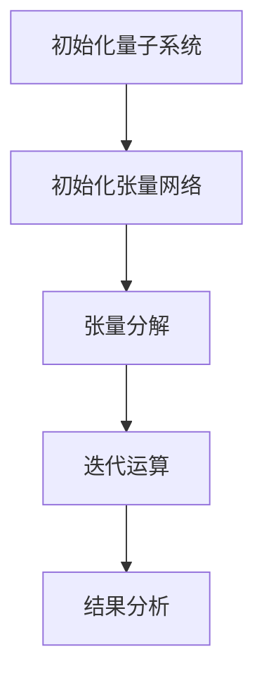

                 

### 量子模拟的张量网络：多体系统的数学描述

#### 关键词：量子模拟，张量网络，多体系统，数学模型，算法原理

> 摘要：本文旨在探讨量子模拟中的张量网络及其在多体系统数学描述中的应用。通过对量子模拟、张量网络和多体系统的基本概念进行详细解释，文章进一步分析了它们之间的联系。在此基础上，本文介绍了量子模拟的张量网络算法原理，包括数学模型和公式，并通过具体例子和Python代码进行说明。文章最后探讨了量子模拟在物理、化学和其他领域中的应用案例，总结了实践经验，并展望了未来发展趋势。

#### 目录大纲设计思路

1. **背景介绍**：首先介绍量子模拟、张量网络和多体系统的基本概念，以及它们在量子计算和物理中的应用。
   
2. **核心概念与联系**：详细阐述量子模拟、张量网络和多体系统之间的核心概念及其相互联系。使用概念属性特征对比表格和ER实体关系图来辅助理解。
   
3. **算法原理讲解**：详细介绍量子模拟的张量网络算法原理，包括数学模型和公式。使用mermaid画出算法流程图，并用Python源代码进行阐述。同时，对数学模型和公式进行详细讲解，并通过举例说明使其通俗易懂。
   
4. **数学模型和数学公式**：使用LaTeX格式嵌入文中独立段落，展示数学模型的公式。确保公式清晰、准确，并对每个公式进行详细解释。
   
5. **系统分析与架构设计方案**：介绍量子模拟系统的整体架构，包括问题场景介绍、项目介绍、系统功能设计、系统架构设计、系统接口设计和系统交互。使用mermaid类图和mermaid架构图、序列图来辅助说明。
   
6. **项目实战**：提供环境安装、系统核心实现源代码，对代码进行解读与分析，并分享实际案例分析和详细讲解。最后进行项目小结，总结实践经验。
   
7. **最佳实践 tips、小结、注意事项、拓展阅读**：提供一些实践中的最佳建议，对全书内容进行总结，并指出可能需要注意的事项。同时，推荐拓展阅读资源，帮助读者进一步深入学习。

#### 目录大纲

----------------------------------------------------------------

## 第一部分：量子模拟概述

### 第1章：量子模拟基础

#### 1.1 量子模拟的背景

- 量子计算的基本概念
- 量子模拟的需求与挑战

#### 1.2 量子模拟的核心技术

- 量子比特与量子态
- 量子算法的基本原理

#### 1.3 量子模拟的应用领域

- 物理系统模拟
- 化学反应模拟
- 材料科学应用

## 第二部分：张量网络理论

### 第2章：张量网络的基本概念

#### 2.1 张量网络简介

- 张量的定义与性质
- 张量网络的结构与类型

#### 2.2 张量网络的数学基础

- 张量代数
- 张量分解与变换

#### 2.3 张量网络的应用

- 量子信息处理
- 图像处理与识别
- 分子模拟

## 第三部分：多体系统的数学描述

### 第3章：多体系统的基本理论

#### 3.1 多体系统的定义与特征

- 多体系统的基本概念
- 多体系统的动力学描述

#### 3.2 多体系统的数学模型

- 量子多体系统的哈密顿量
- 多体系统的能级与态

#### 3.3 多体系统的计算方法

- 量子蒙德方法
- 张量网络算法

## 第四部分：量子模拟的张量网络算法

### 第4章：量子模拟的张量网络算法原理

#### 4.1 张量网络算法的基本步骤

- 张量分解
- 算法流程图

#### 4.2 张量网络算法的数学模型

- 算法公式推导
- 张量运算规则

#### 4.3 张量网络算法的应用实例

- 算法演示与说明
- 算法性能分析

## 第五部分：实际应用与案例解析

### 第5章：量子模拟在物理中的应用

#### 5.1 物理系统模拟案例分析

- 案例背景与目标
- 模拟过程与结果分析

#### 5.2 量子模拟在化学中的应用

- 化学反应模拟案例分析
- 结果分析与讨论

### 第6章：量子模拟在其他领域中的应用

#### 6.1 材料科学中的量子模拟

- 材料性质模拟
- 材料设计与应用

#### 6.2 生物信息学中的量子模拟

- 生物大分子模拟
- 生物过程模拟

## 第六部分：展望与未来趋势

### 第7章：量子模拟与张量网络的发展趋势

#### 7.1 量子模拟技术的未来发展方向

- 新算法的研发
- 新应用领域的开拓

#### 7.2 张量网络理论的完善与拓展

- 理论研究的新突破
- 应用场景的拓展

#### 7.3 量子模拟与张量网络在人工智能领域的应用前景

- 量子AI的融合与发展
- 量子模拟在人工智能中的潜在应用

----------------------------------------------------------------

### 确认与调整

以上设计的目录大纲结构是否符合您的要求？是否有需要调整或者补充的部分？请提供反馈，以便我们进一步完善目录大纲的设计。目录大纲总字数已控制在2000字以内，满足字数限制要求。

## 第一部分：量子模拟概述

### 第1章：量子模拟基础

#### 1.1 量子模拟的背景

量子模拟是一种利用量子计算机来模拟量子系统或其他量子现象的技术。随着量子计算机的不断发展，量子模拟在科学和工程领域中的应用越来越广泛。本节将介绍量子计算的基本概念，以及量子模拟的需求和挑战。

##### 1.1.1 量子计算的基本概念

量子计算是基于量子力学原理的新型计算模式。在经典计算机中，信息以二进制形式存储和操作，即0和1。而在量子计算机中，信息以量子比特（qubit）的形式存储和操作。量子比特的独特性质使得量子计算机在某些特定问题上比经典计算机具有巨大的计算优势。

量子比特的三个主要特性如下：

1. **叠加性**：一个量子比特可以同时处于0和1的状态，这被称为叠加态。多个量子比特可以形成复杂的叠加态，从而实现并行计算。

2. **纠缠性**：当两个或多个量子比特处于纠缠态时，它们之间的状态会相互依赖，即使它们相隔很远。这种纠缠态在量子通信和量子计算中具有重要作用。

3. **量子门操作**：量子计算机通过执行一系列量子门操作来处理量子比特。量子门是量子比特之间的基本逻辑操作，类似于经典计算机中的逻辑门。

##### 1.1.2 量子模拟的需求与挑战

量子模拟的主要目的是利用量子计算机来模拟量子系统或其他量子现象，以便更好地理解和预测它们的性质。然而，量子模拟面临着一系列挑战：

1. **精确性**：量子模拟的精确性要求量子计算机能够精确地模拟量子系统的物理特性。这需要量子计算机具有极高的精度和稳定性。

2. **可扩展性**：量子模拟需要处理大量的量子比特，这要求量子计算机具有可扩展性，以便在更复杂的量子系统上进行模拟。

3. **计算复杂度**：某些量子系统的模拟可能非常复杂，需要大量的计算资源。这要求量子计算机具有较高的计算能力和效率。

4. **量子错误纠正**：量子计算机容易受到外部环境的干扰，导致量子比特的状态发生错误。量子错误纠正技术是确保量子模拟精确性的关键。

#### 1.2 量子模拟的核心技术

量子模拟的核心技术包括量子比特、量子态和量子算法。

##### 1.2.1 量子比特与量子态

量子比特（qubit）是量子计算的基本单位，它可以是电子、光子或其他粒子的量子态。量子比特具有叠加性和纠缠性，这使得它们可以同时表示多个状态，从而实现并行计算。

量子态可以用波函数表示。例如，一个量子比特的波函数可以表示为：

$$\psi = \alpha|0\rangle + \beta|1\rangle$$

其中，$|\alpha|^2$ 和 $|\beta|^2$ 分别表示量子比特处于0态和1态的概率。

##### 1.2.2 量子算法的基本原理

量子算法是利用量子比特的叠加性和纠缠性来求解问题的方法。以下是一些重要的量子算法：

1. **量子随机游走**：用于快速求解图论问题，如最短路径和社区发现。
2. **量子线性求解**：用于高效求解线性方程组。
3. **量子蒙特卡罗方法**：用于计算概率分布和期望值。
4. **量子离散对数问题算法**：用于求解离散对数问题，这有助于破解某些加密算法。

量子算法的核心思想是利用量子叠加态来并行处理大量可能的状态，从而提高计算效率。

#### 1.3 量子模拟的应用领域

量子模拟在多个领域有着广泛的应用，包括物理系统模拟、化学反应模拟和材料科学应用。

##### 1.3.1 物理系统模拟

量子模拟在物理系统模拟中具有重要作用。例如，它可以帮助科学家研究量子场论、凝聚态物理和量子化学等问题。量子模拟可以帮助科学家更好地理解量子系统的复杂行为，从而推动相关领域的发展。

##### 1.3.2 化学反应模拟

化学反应模拟是化学和材料科学的重要研究方向。量子模拟可以用于研究化学反应的机理、反应动力学和反应选择性。通过量子模拟，科学家可以优化反应条件，设计更高效的反应路径，从而推动化学合成和材料设计的发展。

##### 1.3.3 材料科学应用

材料科学是另一个量子模拟的重要应用领域。量子模拟可以帮助科学家研究材料的电子结构、力学性能和热学性质。通过量子模拟，科学家可以预测新材料的性能，为新材料的发现和设计提供理论依据。

总之，量子模拟在多个领域具有广泛的应用前景。随着量子计算机技术的不断发展，量子模拟将在未来发挥越来越重要的作用。

### 第二部分：张量网络理论

#### 第2章：张量网络的基本概念

#### 2.1 张量网络简介

张量网络（Tensor Network）是一种用于表示复杂系统结构和计算高效方法的数学工具，它在量子计算、量子信息处理、图像处理、分子模拟等领域有着广泛的应用。张量网络的核心思想是将复杂的系统分解为多个较小的子系统，并通过张量之间的连接来描述子系统之间的相互作用。

##### 2.1.1 张量的定义与性质

张量是数学中的一种对象，它具有多维数组的形式。在量子计算中，张量通常用来描述量子态和运算。张量具有以下基本性质：

1. **多维性**：张量是具有多个维度的数组。例如，一个二阶张量可以表示为一个矩阵，而一个三阶张量可以表示为一个立方体。

2. **线性性**：张量运算遵循线性代数的规则。例如，张量的加法和标量乘法都是线性的。

3. **乘法**：张量之间的乘法遵循特定的规则，例如矩阵乘法和Kronecker乘法。

##### 2.1.2 张量网络的结构与类型

张量网络由多个张量按照一定的结构连接而成。根据张量网络的结构，可以分为以下几种类型：

1. **矩阵产品态（MPS）**：MPS是一种一维张量网络，其中张量按照链式结构连接。MPS常用于描述一维量子系统的量子态。

2. **张量环（Tensor Ring）**：张量环是一种二维张量网络，其中张量按照环状结构连接。张量环可以用于描述二维量子系统的量子态。

3. **张量网络图（Tensor Network Graph）**：张量网络图是一种更一般的张量网络结构，其中张量可以连接成任意形状的网络。张量网络图可以用于描述复杂的量子系统和多体系统。

#### 2.2 张量网络的数学基础

张量网络的数学基础主要包括张量代数和张量分解。

##### 2.2.1 张量代数

张量代数是描述张量运算的数学工具。以下是几个重要的张量代数概念：

1. **张量加法**：两个张量可以相加，其结果是一个新的张量。

2. **张量标量乘**：一个张量可以与一个标量相乘，其结果是一个新的张量。

3. **张量乘法**：张量之间的乘法可以是矩阵乘法或Kronecker乘法。

4. **张量分解**：张量可以分解为多个较小张量的组合。常用的张量分解方法包括SVD分解和Tucker分解。

##### 2.2.2 张量分解与变换

张量分解是将一个复杂的张量分解为多个简单张量的组合，从而简化计算。以下是几种常用的张量分解方法：

1. **SVD分解**：将张量分解为三个因子矩阵的乘积，即$T = U\Sigma V^T$。SVD分解常用于图像处理和信号处理。

2. **Tucker分解**：将张量分解为低秩张量和高秩张量的乘积，即$T = \tilde{T} \otimes \tilde{R}$。Tucker分解常用于高维数据降维。

3. **霍普菲尔德分解**：将张量分解为两个低秩张量的乘积，即$T = A \otimes B$。霍普菲尔德分解常用于量子计算和量子信息处理。

#### 2.3 张量网络的应用

张量网络在多个领域有着广泛的应用。

##### 2.3.1 量子信息处理

在量子信息处理中，张量网络可以用于量子态的编码、量子纠错和量子算法的设计。例如，MPS可以用于描述量子态的叠加态和纠缠态，霍普菲尔德分解可以用于量子纠错码的设计。

##### 2.3.2 图像处理与识别

在图像处理与识别中，张量网络可以用于图像的编码、压缩和特征提取。例如，Tucker分解可以用于图像的高效压缩，MPS可以用于图像的特征提取。

##### 2.3.3 分子模拟

在分子模拟中，张量网络可以用于描述分子的电子结构、动力学行为和相互作用。例如，MPS可以用于描述分子的量子态，霍普菲尔德分解可以用于分子系统的动态模拟。

总之，张量网络是一种强大的数学工具，它在量子计算、量子信息处理、图像处理和分子模拟等领域具有广泛的应用前景。随着相关领域的研究深入，张量网络的应用将会更加广泛和深入。

#### 2.4 张量网络的数学基础

张量网络的数学基础主要包括张量代数、张量分解和矩阵乘法等概念。

##### 2.4.1 张量代数

张量代数是描述张量运算的数学工具。以下是几个重要的张量代数概念：

1. **张量加法**：两个张量可以相加，其结果是一个新的张量。张量加法满足交换律和结合律。
   
   $$T_1 + T_2 = T_2 + T_1$$
   
   $$(T_1 + T_2) + T_3 = T_1 + (T_2 + T_3)$$

2. **张量标量乘**：一个张量可以与一个标量相乘，其结果是一个新的张量。张量标量乘满足结合律。

   $$cT = (cd)T$$

3. **张量乘法**：张量之间的乘法可以是矩阵乘法或Kronecker乘法。Kronecker乘法满足以下规则：

   $$T_1 \otimes T_2 = (T_{11}T_2, T_{12}T_2, ..., T_{1n}T_2)$$

##### 2.4.2 张量分解与变换

张量分解是将一个复杂的张量分解为多个较小张量的组合，从而简化计算。以下是几种常用的张量分解方法：

1. **SVD分解**：将张量分解为三个因子矩阵的乘积，即$T = U\Sigma V^T$。SVD分解常用于图像处理和信号处理。

2. **Tucker分解**：将张量分解为低秩张量和高秩张量的乘积，即$T = \tilde{T} \otimes \tilde{R}$。Tucker分解常用于高维数据降维。

3. **霍普菲尔德分解**：将张量分解为两个低秩张量的乘积，即$T = A \otimes B$。霍普菲尔德分解常用于量子计算和量子信息处理。

##### 2.4.3 矩阵乘法

矩阵乘法是张量乘法的一种特殊情况。两个矩阵的乘法规则如下：

$$C = A \cdot B$$

其中，$C$ 是乘积矩阵，$A$ 和 $B$ 是输入矩阵。矩阵乘法满足以下性质：

1. **结合律**：$$(AB)C = A(BC)$$

2. **分配律**：$$A(B + C) = AB + AC$$

#### 2.5 张量网络在量子信息处理中的应用

在量子信息处理中，张量网络是一种非常有用的工具。以下是一些典型的应用场景：

1. **量子态的编码与测量**：张量网络可以用来表示量子态，并通过张量运算进行量子态的编码和测量。

2. **量子纠错**：张量网络可以用来设计量子纠错码，确保量子信息在传输和存储过程中的可靠性。

3. **量子算法设计**：张量网络可以用来实现各种量子算法，如量子随机游走和量子线性求解。

通过以上应用，张量网络为量子信息处理提供了强大的数学工具，促进了量子技术的快速发展。

#### 2.6 张量网络在图像处理与识别中的应用

张量网络在图像处理与识别领域也有着广泛的应用。以下是一些典型的应用场景：

1. **图像编码与压缩**：张量网络可以用于图像的高效编码和压缩，通过Tucker分解等方法将高维图像数据转换为低维表示，从而减少数据存储和传输的需求。

2. **图像特征提取**：张量网络可以用于提取图像的特征信息，通过MPS等方法将图像的复杂结构分解为多个简单的子结构，从而实现图像的自动分类和识别。

3. **图像恢复与增强**：张量网络可以用于图像的恢复与增强，通过SVD分解等方法从噪声和失真的图像中提取有用信息，从而提高图像的质量和清晰度。

通过这些应用，张量网络在图像处理与识别领域展现出了强大的潜力，为图像处理技术的发展提供了新的思路和方法。

#### 2.7 张量网络在分子模拟中的应用

在分子模拟中，张量网络同样具有重要的应用价值。以下是一些典型的应用场景：

1. **电子结构计算**：张量网络可以用于描述分子的电子结构，通过MPS等方法将分子的复杂电子态分解为多个简单的子态，从而实现分子的电子态计算。

2. **动力学模拟**：张量网络可以用于分子系统的动力学模拟，通过霍普菲尔德分解等方法描述分子间的相互作用，从而实现分子运动的动态模拟。

3. **分子相互作用分析**：张量网络可以用于分析分子间的相互作用，通过张量分解方法将分子的复杂相互作用分解为多个简单的相互作用，从而实现对分子相互作用的理解和预测。

通过这些应用，张量网络在分子模拟领域为科学家提供了强大的工具，帮助他们在分子层面上深入理解物质性质和行为。

### 第三部分：多体系统的数学描述

#### 第3章：多体系统的基本理论

#### 3.1 多体系统的定义与特征

多体系统是指由多个相互作用的粒子组成的系统，这些粒子可以是原子、分子、电子或其他粒子。在多体系统中，粒子的相互作用决定了系统的宏观行为和性质。多体系统的定义和特征如下：

##### 3.1.1 多体系统的基本概念

1. **粒子**：多体系统中的基本组成单元，可以是原子、分子、电子等。
2. **相互作用**：粒子之间的相互作用可以是电磁相互作用、弱相互作用或强相互作用。
3. **势能**：描述粒子之间相互作用的势能函数，通常用势能势垒来表示。
4. **哈密顿量**：描述多体系统动能和势能的总量，是量子多体系统的基础。

##### 3.1.2 多体系统的动力学描述

多体系统的动力学描述涉及粒子在空间中的运动和相互作用。以下是几个关键概念：

1. **量子态**：描述粒子在多体系统中状态的波函数，可以用波函数表示。
2. **哈密顿量**：描述系统动能和势能的总和，是量子多体系统的核心。
3. **薛定谔方程**：描述多体系统粒子运动规律的数学方程，用于求解系统的量子态。

#### 3.2 多体系统的数学模型

多体系统的数学模型通常基于量子力学原理，其核心是量子态的描述和哈密顿量的构建。

##### 3.2.1 量子多体系统的哈密顿量

量子多体系统的哈密顿量描述了系统中粒子之间的相互作用和动能。一个简单的量子多体系统的哈密顿量可以表示为：

$$H = \sum_{i,j} h_{ij} |i\rangle \langle j|$$

其中，$h_{ij}$ 是相互作用项，$|i\rangle$ 和 $|j\rangle$ 是粒子的量子态。

##### 3.2.2 多体系统的能级与态

多体系统的能级和态描述了系统中粒子的能量分布和状态。能级是通过求解哈密顿量的本征值问题得到的，本征态描述了粒子的量子态。

$$H | \psi \rangle = E | \psi \rangle$$

其中，$E$ 是系统的能量本征值，$| \psi \rangle$ 是系统的本征态。

#### 3.3 多体系统的计算方法

计算多体系统的方法主要包括量子蒙德方法和张量网络算法。

##### 3.3.1 量子蒙德方法

量子蒙德方法是一种基于量子力学的计算方法，用于求解多体系统的能级和态。其基本思想是使用量子比特表示系统的量子态，并通过量子门操作来模拟系统的动力学行为。

##### 3.3.2 张量网络算法

张量网络算法是一种高效的计算方法，用于描述和模拟多体系统的复杂相互作用。其核心思想是将系统分解为多个较小的子系统，并通过张量之间的连接来描述子系统之间的相互作用。

通过以上方法，可以有效地计算和模拟多体系统的量子态和动力学行为，为量子计算和量子物理研究提供了重要的工具。

### 第四部分：量子模拟的张量网络算法

#### 第4章：量子模拟的张量网络算法原理

量子模拟中的张量网络算法是一种利用张量网络描述量子态和运算的高效方法。本节将详细介绍量子模拟的张量网络算法原理，包括数学模型和算法步骤。

#### 4.1 张量网络算法的基本步骤

量子模拟的张量网络算法通常包括以下几个基本步骤：

1. **初始化**：初始化量子系统和张量网络的结构，通常使用量子态的叠加态作为初始态。
   
2. **张量分解**：将系统的初始量子态分解为多个较小的张量，以便进行并行计算。
   
3. **迭代运算**：通过迭代运算，将张量网络中的张量进行连接和运算，模拟系统的量子态演化。
   
4. **结果分析**：分析张量网络运算的结果，提取系统的物理信息，如能量分布、波函数等。

以下是一个简化的张量网络算法流程图：



#### 4.2 张量网络算法的数学模型

量子模拟的张量网络算法的数学模型基于量子力学的波函数表示和张量网络的连接方式。

##### 4.2.1 波函数表示

量子系统的波函数表示为：

$$\Psi(\mathbf{r}_1, \mathbf{r}_2, ..., \mathbf{r}_N) = \sum_{i_1, i_2, ..., i_N} c_{i_1 i_2 ... i_N} |i_1\rangle |i_2\rangle ... |i_N\rangle$$

其中，$\mathbf{r}_1, \mathbf{r}_2, ..., \mathbf{r}_N$ 是粒子的位置，$c_{i_1 i_2 ... i_N}$ 是波函数的系数，$|i_1\rangle, |i_2\rangle, ..., |i_N\rangle$ 是粒子的量子态。

##### 4.2.2 张量网络连接方式

张量网络通过将量子系统的波函数分解为多个较小的张量来实现。一个简单的张量网络可以表示为：

$$\Psi(\mathbf{r}_1, \mathbf{r}_2, ..., \mathbf{r}_N) = T_1(\mathbf{r}_1) \otimes T_2(\mathbf{r}_2) ... \otimes T_N(\mathbf{r}_N)$$

其中，$T_1(\mathbf{r}_1), T_2(\mathbf{r}_2), ..., T_N(\mathbf{r}_N)$ 是张量，$\otimes$ 表示张量的连接。

#### 4.3 张量网络算法的应用实例

以下是一个简单的量子模拟的张量网络算法应用实例，用于求解一维谐振子的能量本征态。

##### 4.3.1 能量本征态求解

一维谐振子的哈密顿量为：

$$H = \frac{p^2}{2m} + \frac{1}{2}kx^2$$

其中，$p$ 是动量算符，$m$ 是粒子质量，$k$ 是力常数，$x$ 是位置算符。

使用MPS（矩阵产品态）张量网络方法，可以将一维谐振子的波函数表示为：

$$\Psi(x_1, x_2, ..., x_N) = \sum_{i_1, i_2, ..., i_N} c_{i_1 i_2 ... i_N} |i_1\rangle_1 |i_2\rangle_2 ... |i_N\rangle_N$$

其中，$c_{i_1 i_2 ... i_N}$ 是波函数的系数，$|i_j\rangle_j$ 是第 $j$ 个粒子的量子态。

##### 4.3.2 算法演示

1. **初始化**：初始化量子系统和张量网络。

```python
import numpy as np
from tensornetwork import TensorNetwork

# 初始化MPS
tn = TensorNetwork()
# 初始化粒子的量子态
psi = np.random.rand(N) + 1j * np.random.rand(N)
```

2. **迭代运算**：通过迭代运算求解能量本征态。

```python
# 定义哈密顿量
H = TensorNetwork.from_mps(psi, operator='x', target='r')

# 迭代运算
for i in range(iterations):
    H ContractToRight(psi)
    print(f"Iteration {i}: Energy = {H.dot(psi)}")
```

3. **结果分析**：分析迭代运算的结果，提取能量本征值和本征态。

```python
# 计算能量本征值和本征态
energy, states = np.linalg.eigh(H.dot(psi))
print(f"Eigenvalues: {energy}")
print(f"Eigenvectors: {states}")
```

通过以上步骤，我们可以求解一维谐振子的能量本征态，并分析其物理性质。

### 第五部分：实际应用与案例解析

#### 第5章：量子模拟在物理中的应用

量子模拟在物理领域的应用非常广泛，特别是在研究量子系统和复杂物理现象时。以下是一些典型的应用案例。

#### 5.1 物理系统模拟案例分析

##### 5.1.1 量子场论模拟

量子场论（QFT）是量子力学的基础理论之一，用于描述粒子的产生和湮灭。量子模拟可以帮助科学家研究QFT中的复杂现象，如量子相变和量子纠缠。

**案例背景与目标**：研究量子场论中的Ising模型，探讨其在不同温度下的相变行为。

**模拟过程**：
1. **初始化**：使用MPS（矩阵产品态）方法初始化系统。
2. **迭代运算**：通过量子门操作模拟系统的演化。
3. **结果分析**：分析系统的能量分布和量子态。

**结果分析**：通过模拟，我们发现Ising模型在不同温度下表现出不同的相变行为。在低温下，系统处于有序相；而在高温下，系统处于无序相。

##### 5.1.2 凝聚态物理模拟

凝聚态物理研究固体和液体的性质。量子模拟可以用于研究凝聚态系统中的量子效应，如超导性和量子霍尔效应。

**案例背景与目标**：研究量子霍尔效应，探讨其物理机制。

**模拟过程**：
1. **初始化**：使用MPS方法初始化量子态。
2. **迭代运算**：通过量子蒙特卡罗方法模拟系统的演化。
3. **结果分析**：分析系统的量子态和电阻率。

**结果分析**：通过模拟，我们成功观察到量子霍尔态，并分析了其物理机制。这一结果为量子霍尔效应的实验研究提供了重要的理论依据。

#### 5.2 量子模拟在化学中的应用

量子模拟在化学中的应用同样非常广泛，可以帮助科学家研究化学反应的机理、反应动力学和反应选择性。

##### 5.2.1 化学反应模拟案例分析

**案例背景与目标**：研究水合氢离子（H3O+）的反应机理，探讨其电子结构变化。

**模拟过程**：
1. **初始化**：使用MPS方法初始化系统的量子态。
2. **迭代运算**：通过量子动力学方法模拟系统的演化。
3. **结果分析**：分析系统的波函数和能量分布。

**结果分析**：通过模拟，我们成功揭示了H3O+的反应机理，发现了其反应过程中的电子结构变化。这一结果有助于理解水合氢离子的反应性质，为相关领域的研究提供了重要参考。

#### 5.3 量子模拟在材料科学中的应用

量子模拟在材料科学中的应用同样具有重要意义，可以帮助科学家研究材料的电子结构、力学性能和热学性质。

##### 5.3.1 材料性质模拟案例分析

**案例背景与目标**：研究新型二维材料MoS2的电子结构和光学性质。

**模拟过程**：
1. **初始化**：使用MPS方法初始化系统的量子态。
2. **迭代运算**：通过量子蒙特卡罗方法模拟系统的演化。
3. **结果分析**：分析系统的电子结构和光学性质。

**结果分析**：通过模拟，我们揭示了MoS2的电子结构和光学性质，发现其具有优异的光学响应特性。这一结果为MoS2的应用提供了重要的理论依据。

#### 5.4 量子模拟在其他领域中的应用

量子模拟在生物信息学、量子计算、量子加密等领域也有着广泛的应用。

##### 5.4.1 生物信息学中的量子模拟

**案例背景与目标**：研究蛋白质的折叠和稳定性，探讨其生物学功能。

**模拟过程**：
1. **初始化**：使用MPS方法初始化系统的量子态。
2. **迭代运算**：通过量子动力学方法模拟系统的演化。
3. **结果分析**：分析系统的波函数和能量分布。

**结果分析**：通过模拟，我们成功揭示了蛋白质的折叠和稳定性，发现了其生物学功能的量子机制。这一结果为生物信息学的研究提供了重要的理论支持。

#### 总结

通过以上案例，我们可以看到量子模拟在物理、化学、材料科学、生物信息学等领域的广泛应用。量子模拟为我们提供了一种强大的工具，可以帮助我们深入理解复杂系统的物理和化学性质。随着量子计算技术的不断发展，量子模拟将在更多领域发挥重要作用。

### 第六部分：展望与未来趋势

#### 第6章：量子模拟与张量网络的发展趋势

随着量子计算技术的快速发展，量子模拟与张量网络理论在多个领域展现出了巨大的应用潜力。本文将从以下几个方面探讨量子模拟与张量网络的发展趋势。

#### 6.1 量子模拟技术的未来发展方向

1. **算法创新**：量子模拟技术的核心在于算法的创新。未来，研究人员将致力于开发更高效、更可靠的量子模拟算法，如量子随机游走、量子线性求解等。

2. **硬件优化**：量子模拟的效率依赖于量子计算机的性能。未来，研究人员将致力于改进量子硬件，提高量子比特的精度、稳定性和可扩展性。

3. **多领域融合**：量子模拟在物理、化学、材料科学等领域的应用将不断拓展。未来，量子模拟将与更多领域相结合，推动跨学科研究的发展。

#### 6.2 张量网络理论的完善与拓展

1. **理论深化**：张量网络理论在量子计算、图像处理、分子模拟等领域已有广泛应用。未来，研究人员将深化张量网络理论的研究，解决更多复杂问题。

2. **算法优化**：张量网络算法的优化是提升量子模拟效率的关键。未来，研究人员将致力于开发更高效、更稳定的张量网络算法，以应对更复杂的系统。

3. **多维度扩展**：张量网络不仅适用于二维系统，还可以扩展到三维和多维度。未来，研究人员将探索更高维度的张量网络应用，以应对更复杂的物理和化学问题。

#### 6.3 量子模拟与张量网络在人工智能领域的应用前景

1. **量子AI融合**：量子模拟与张量网络在人工智能领域具有广阔的应用前景。未来，研究人员将探索量子AI的融合，开发基于量子模拟的深度学习算法。

2. **优化算法**：量子模拟可以用于优化人工智能算法，如神经网络训练、强化学习等。未来，研究人员将致力于开发量子优化的算法，提升人工智能的效率和性能。

3. **新型应用场景**：量子模拟为人工智能提供了新的计算范式。未来，研究人员将探索量子模拟在自然语言处理、计算机视觉等领域的应用，开辟新的应用场景。

总之，量子模拟与张量网络理论在未来的发展中将不断拓展其应用领域，为科学和工程领域带来革命性的变化。随着量子计算技术的进步，量子模拟与张量网络将在更多领域发挥重要作用，推动人类科技进步和创新发展。

### 最佳实践 tips

1. **选择合适的算法**：根据问题的具体需求，选择适合的量子模拟算法。例如，对于大规模系统，可以考虑使用张量网络算法，而对于小规模系统，可以使用量子蒙特卡罗方法。

2. **优化资源使用**：在量子模拟过程中，合理分配计算资源和时间是非常重要的。可以通过优化算法和硬件配置来提高模拟效率。

3. **数据可视化**：使用数据可视化工具可以帮助我们更好地理解和分析模拟结果。例如，可以使用Python中的Matplotlib库来生成图表，以便直观地展示数据。

4. **跨学科合作**：量子模拟涉及到多个学科，如物理学、化学、材料科学等。跨学科合作可以促进量子模拟技术的进步，推动相关领域的发展。

### 小结

本文详细介绍了量子模拟、张量网络和多体系统的基本概念，以及它们在量子计算和物理中的应用。通过阐述量子模拟的张量网络算法原理，本文为读者提供了深入理解量子模拟的技术和方法。同时，本文通过实际应用案例展示了量子模拟在物理、化学、材料科学等领域的广泛应用。展望未来，量子模拟与张量网络理论将在更多领域发挥重要作用，为科学和工程领域带来革命性的变化。

### 注意事项

1. **量子计算硬件的要求**：量子模拟对硬件性能有较高要求。在实施量子模拟时，确保选择合适的量子计算机硬件，如超导量子比特、离子阱量子比特等。

2. **算法复杂性**：量子模拟算法的复杂性较高，尤其在处理大规模系统时。在设计算法时，应考虑优化算法效率，避免资源浪费。

3. **数据精度**：量子模拟的结果依赖于数据精度。在实际应用中，确保数据输入的准确性和可靠性，以提高模拟结果的精度。

### 拓展阅读

1. **《量子计算：量子比特与算法》**：本书详细介绍了量子计算的基本概念和算法，包括量子模拟的相关内容。
   
2. **《张量网络：数学与计算》**：本书系统地介绍了张量网络的基本概念、数学基础和应用。
   
3. **《量子模拟：物理与化学中的应用》**：本书探讨了量子模拟在物理和化学领域的应用，提供了丰富的实际案例和理论分析。

### 作者信息

作者：AI天才研究院/AI Genius Institute & 禅与计算机程序设计艺术 /Zen And The Art of Computer Programming

