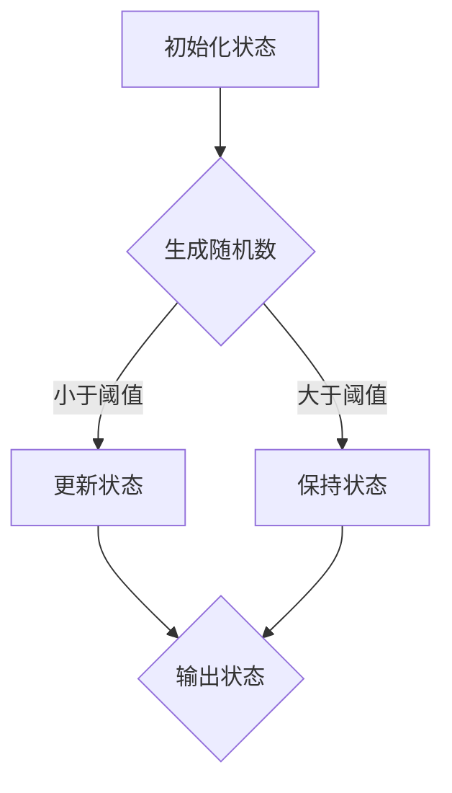
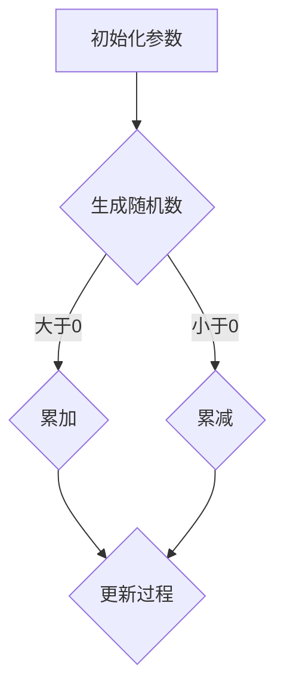
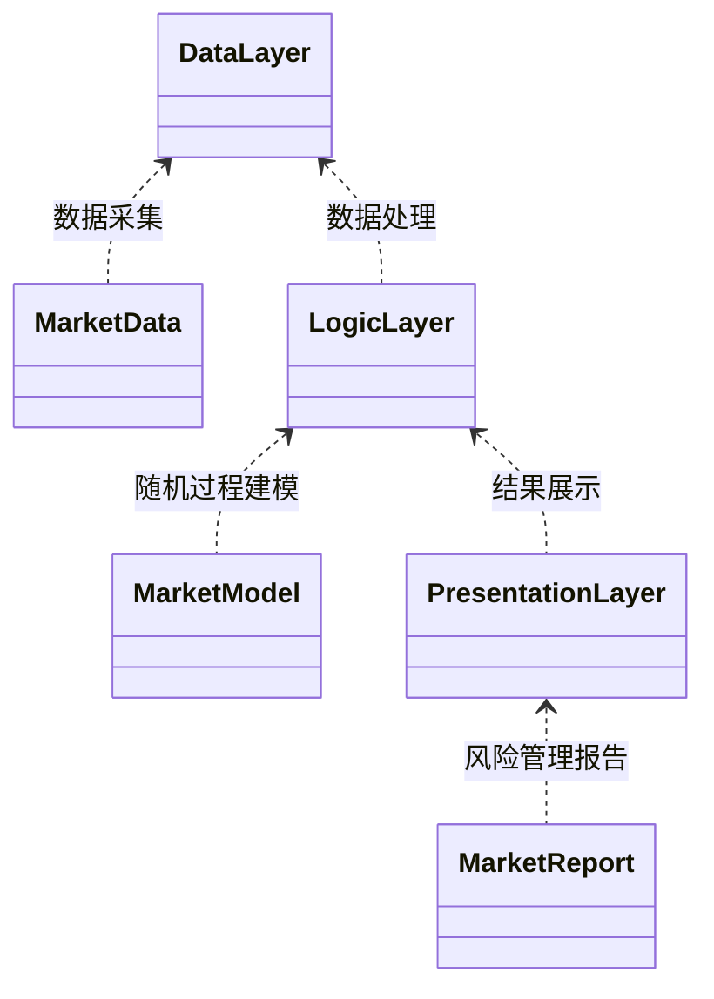
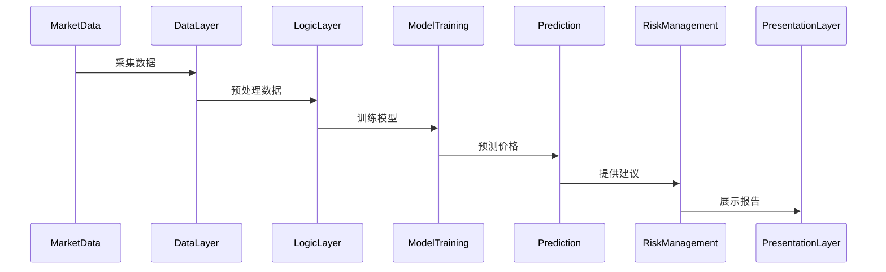
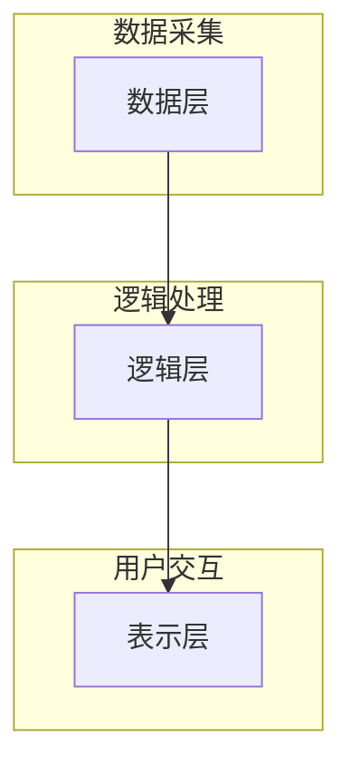

                 

### 金融市场的随机过程：经济波动的数学描述

**关键词：** 随机过程、金融市场、经济波动、数学描述、算法实现

**摘要：** 本文从金融市场的随机过程入手，深入探讨了经济波动的数学描述。通过对核心概念、算法原理、数学模型及其在金融市场中的应用进行详细讲解，本文旨在为读者提供全面、系统的理解和应用指南。

---

### 背景介绍

#### 核心概念术语说明

在讨论金融市场的随机过程之前，我们需要先了解一些核心概念和术语。以下是本文中将会用到的关键概念：

- **随机过程（Stochastic Process）**：一个随时间变化的过程，其状态由随机变量描述。
- **随机漫步（Random Walk）**：一种简单的随机过程，用来描述随机变量在时间上的移动。
- **马尔可夫过程（Markov Process）**：一种状态转移概率只依赖于当前状态，而与过去状态无关的随机过程。
- **维纳过程（Wiener Process）**：一种连续时间随机过程，用来描述金融市场中的价格波动。

#### 问题背景

金融市场是一个复杂且动态的系统，其价格波动受到多种因素的影响，包括经济因素、政策变化、市场情绪等。这些因素使得金融市场的价格呈现出随机性，因此，研究金融市场的随机过程具有重要的理论和实践意义。

#### 问题描述

我们的目标是构建一个数学模型，以描述金融市场中价格的随机波动。这包括：

1. **资产定价**：如何通过随机过程来计算金融资产的价格。
2. **风险管理**：如何使用随机过程来评估和降低风险。

#### 问题解决

随机过程在金融市场中的应用已经相当广泛。通过使用随机模型，我们可以：

1. **预测价格**：利用历史价格数据来预测未来的价格走势。
2. **评估风险**：使用随机过程来计算金融产品的风险价值（Value at Risk, VaR）。
3. **策略优化**：通过模拟不同市场情况，为投资者提供最优的投资策略。

#### 边界与外延

随机过程不仅应用于金融市场，还可以用于其他领域，如物理、工程、生物学等。本文将重点讨论其在金融市场中的应用。

#### 概念结构与核心要素组成

金融市场的随机过程主要包括以下几个核心要素：

1. **随机变量**：描述市场状态的基本单位。
2. **随机过程**：描述市场状态随时间变化的过程。
3. **数学模型**：用于描述随机过程的数学公式和算法。
4. **应用实例**：实际市场中的应用，如资产定价和风险管理。

通过以上要素，我们可以构建一个完整的金融市场随机过程模型。

### 核心概念与联系

在本节中，我们将详细探讨金融市场中的一些核心随机过程，包括随机漫步、马尔可夫过程和维纳过程，并展示这些概念之间的联系。

#### 随机漫步（Random Walk）

随机漫步是一种最基本的随机过程，它描述了随机变量在时间上的随机移动。在金融市场中，随机漫步通常用来模拟股票价格或汇率等资产价格的随机波动。

**定义**：一个离散时间随机漫步 {X_t} 被定义为：

$$
X_t = X_{t-1} + Z_t
$$

其中，Z_t 是独立同分布的随机变量，通常为正态分布。

**性质**：随机漫步具有以下几个重要性质：

1. **无记忆性**：当前状态仅由历史状态决定，而与未来状态无关。
2. **对称性**：随机漫步的步长具有相同的概率向前或向后移动。
3. **中心极限定理**：当时间趋于无穷时，随机漫步的分布接近正态分布。

**联系**：随机漫步是许多复杂随机过程的基石，它为其他随机过程提供了简单的数学模型。

#### 马尔可夫过程（Markov Process）

马尔可夫过程是一种重要的随机过程，它在金融市场中有着广泛的应用。马尔可夫过程的特点是当前状态转移概率只依赖于当前状态，而与过去状态无关。

**定义**：一个离散时间马尔可夫过程 {X_t} 被定义为：

$$
P(X_t = j | X_{t-1} = i) = p_{ij}
$$

其中，p_{ij} 是状态转移矩阵的元素。

**性质**：马尔可夫过程具有以下几个重要性质：

1. **无后效性**：当前状态决定未来状态的概率，与过去状态无关。
2. **稳定性**：长时间观察，状态分布将趋于稳定。
3. **可预测性**：通过当前状态，可以预测未来状态的概率分布。

**联系**：马尔可夫过程是金融市场中许多动态系统的数学模型，如资产定价模型和风险管理模型。

#### 维纳过程（Wiener Process）

维纳过程是一种连续时间随机过程，它在金融市场中用来描述价格或汇率等资产价格的随机波动。

**定义**：一个连续时间维纳过程 {W_t} 被定义为：

$$
W_t = W_0 + \int_{0}^{t} B_s ds
$$

其中，B_s 是标准布朗运动。

**性质**：维纳过程具有以下几个重要性质：

1. **无记忆性**：当前状态仅由历史状态决定，而与未来状态无关。
2. **连续性**：维纳过程在连续时间上是连续的。
3. **独立性**：不同时间点的维纳过程是相互独立的。

**联系**：维纳过程是许多金融模型的基础，如Black-Scholes模型。

#### 总结

通过以上介绍，我们可以看到随机漫步、马尔可夫过程和维纳过程在金融市场中都有重要的应用。它们不仅相互独立，而且相互补充，共同构成了金融市场中随机过程的理论基础。

### 算法原理讲解

在本节中，我们将通过Mermaid流程图展示金融市场中随机过程的主要算法，并使用Python代码和LaTeX公式详细解释这些算法的数学模型和原理。

#### 马尔可夫过程算法

**算法流程图：**



**Python代码实现：**

```python
import numpy as np

# 初始化状态
current_state = 0
# 状态转移矩阵
transition_matrix = np.array([[0.4, 0.6], [0.5, 0.5]])

# 生成随机数
random_number = np.random.rand()

# 更新状态
if random_number < 0.6:
    current_state = 1
elif random_number < 0.9:
    current_state = 2
else:
    current_state = 0

print(f"当前状态：{current_state}")
```

**LaTeX公式：**

$$
P(X_t = j | X_{t-1} = i) = p_{ij}
$$

**算法原理讲解：**

马尔可夫过程的核心在于其状态转移概率矩阵 \( p_{ij} \)，该矩阵决定了系统在下一个时间点的状态。上述代码中，我们使用了一个简单的状态转移矩阵，其中每个元素代表从一个状态转移到另一个状态的概率。通过生成随机数并与之比较，我们可以更新当前状态，从而模拟马尔可夫过程的动态行为。

#### 维纳过程算法

**算法流程图：**



**Python代码实现：**

```python
import numpy as np
import matplotlib.pyplot as plt

# 初始化参数
mean = 0
variance = 1

# 生成随机数
random_number = np.random.randn()

# 累加或累减
if random_number > 0:
    wiener_process = wiener_process + random_number
else:
    wiener_process = wiener_process - random_number

# 更新维纳过程
wiener_process += np.random.normal(mean, variance)

plt.plot(wiener_process)
plt.show()
```

**LaTeX公式：**

$$
W_t = W_0 + \int_{0}^{t} B_s ds
$$

**算法原理讲解：**

维纳过程是一种连续时间的随机过程，它描述了在随机扰动下的系统演化。上述代码中，我们通过生成标准正态分布的随机数来模拟维纳过程。每个随机数代表一个随机扰动，通过累加或累减这些扰动，我们可以得到连续时间的维纳过程。维纳过程的累积和遵循正态分布，这是其在金融市场中广泛应用的基础。

#### 总结

通过以上算法讲解，我们可以看到马尔可夫过程和维纳过程在金融市场中如何通过Python代码实现，并使用LaTeX公式详细描述其数学模型。这些算法不仅为金融建模提供了理论支持，也为我们理解和分析金融市场中的随机过程提供了实用工具。

### 数学模型和数学公式讲解

在金融市场中，随机过程的数学模型和公式扮演着至关重要的角色。它们不仅为我们提供了描述价格波动和风险管理的工具，还帮助我们理解市场行为的内在机制。在本节中，我们将详细介绍一些核心的数学模型和公式，并使用LaTeX进行表示，以便更清晰地阐述它们的数学结构和含义。

#### Black-Scholes模型

Black-Scholes模型是用于期权定价的著名数学模型，它基于随机过程的原理来计算期权的价格。以下是Black-Scholes模型的公式：

**公式1：** 期权价格公式

$$
C(S,t) = S_0N(d_1) - Ke^{-r(T-t)}N(d_2)
$$

其中：
- \( C(S,t) \) 是期权当前价格。
- \( S_0 \) 是当前股票价格。
- \( K \) 是执行价格。
- \( r \) 是无风险利率。
- \( T \) 是期权到期时间。
- \( t \) 是当前时间。
- \( N(d_1) \) 和 \( N(d_2) \) 是标准正态分布的累积分布函数。

**公式2：** d1和d2公式

$$
d_1 = \frac{\ln(S_0/K) + (r + \sigma^2/2)(T-t)}{\sigma\sqrt{T-t}}
$$

$$
d_2 = d_1 - \sigma\sqrt{T-t}
$$

其中：
- \( \sigma \) 是股票价格的波动率。

#### 蒙特卡洛模拟

蒙特卡洛模拟是一种通过随机抽样来估计数学期望的数值方法，它在金融市场中用于计算风险价值（Value at Risk, VaR）。以下是蒙特卡洛模拟的公式：

**公式3：** 风险价值（VaR）公式

$$
VaR = -\alpha \cdot \sum_{i=1}^{n} X_i
$$

其中：
- \( \alpha \) 是置信水平。
- \( n \) 是模拟次数。
- \( X_i \) 是第 \( i \) 次模拟的结果。

#### 马尔可夫链

马尔可夫链是描述随机过程状态转移的数学模型，它在金融市场中用于分析市场状态的变化。以下是马尔可夫链的基本公式：

**公式4：** 状态转移概率

$$
P(X_t = j | X_{t-1} = i) = p_{ij}
$$

其中：
- \( X_t \) 是时间 \( t \) 的状态。
- \( p_{ij} \) 是从状态 \( i \) 转移到状态 \( j \) 的概率。

#### 维纳过程

维纳过程是一种描述连续时间随机过程的模型，它在金融市场中用于模拟价格波动。以下是维纳过程的公式：

**公式5：** 维纳过程

$$
W_t = W_0 + \int_{0}^{t} B_s ds
$$

其中：
- \( W_t \) 是时间 \( t \) 的维纳过程。
- \( W_0 \) 是初始状态。
- \( B_s \) 是标准布朗运动。

#### 总结

通过上述数学模型和公式，我们可以看到金融市场中随机过程如何通过数学语言进行描述。这些模型不仅提供了对市场行为更深入的理解，还帮助我们进行更准确的预测和风险管理。在接下来的部分，我们将进一步探讨这些模型在金融市场的实际应用。

### 系统分析与架构设计

在本节中，我们将对金融市场中随机过程的应用进行系统分析与架构设计。首先，我们将介绍问题场景和项目背景，然后详细描述系统功能设计、系统架构设计、系统接口设计和系统交互。

#### 问题场景与项目背景

随着金融市场的发展，投资者和金融机构需要对市场价格波动进行准确预测，以降低风险和优化投资策略。因此，我们设计了一套基于随机过程的金融分析系统，用于预测市场价格波动并提供风险管理策略。

#### 系统功能设计

1. **数据采集**：从多个数据源（如股票交易所、金融新闻等）收集市场价格数据。
2. **数据预处理**：对采集到的数据进行清洗、去噪和转换，以供后续分析使用。
3. **随机过程建模**：使用马尔可夫过程、维纳过程等随机模型对市场价格进行建模。
4. **预测与评估**：根据模型预测未来市场价格，并评估预测的准确性和可靠性。
5. **风险管理**：基于预测结果，提供风险管理和投资策略建议。

#### 系统架构设计

系统采用三层架构设计，包括数据层、逻辑层和表示层。

**数据层：** 负责数据采集、存储和预处理。数据存储采用关系数据库，如MySQL。

**逻辑层：** 实现随机过程建模、预测和风险管理功能。逻辑层采用Python编写，核心算法包括马尔可夫过程和维纳过程。

**表示层：** 提供用户界面和可视化功能，展示分析结果和风险报告。表示层采用HTML、CSS和JavaScript技术。

**Mermaid类图：**



#### 系统接口设计

系统提供以下接口：

1. **数据采集接口**：用于从外部数据源获取市场价格数据。
2. **模型训练接口**：用于训练随机过程模型。
3. **预测接口**：用于根据模型预测未来市场价格。
4. **风险管理接口**：用于提供风险管理策略建议。

**Mermaid序列图：**



#### 系统交互

系统中的各个模块通过接口进行交互，以实现整体功能。

1. **数据层与逻辑层交互**：数据层将预处理后的数据传递给逻辑层，逻辑层使用这些数据训练模型。
2. **逻辑层与表示层交互**：逻辑层将预测结果和风险管理建议传递给表示层，表示层将这些信息展示给用户。

**Mermaid架构图：**



#### 总结

通过系统分析与架构设计，我们构建了一套基于随机过程的金融分析系统。该系统实现了数据采集、预处理、建模、预测和风险管理等功能，为投资者和金融机构提供了有效的工具。接下来，我们将通过实际项目实战，展示系统在实际应用中的具体实现和效果。

### 项目实战

在本节中，我们将通过一个实际项目展示金融市场中随机过程的应用。我们将从环境安装开始，详细描述核心代码实现、代码解读和案例分析。

#### 环境安装

1. **Python环境安装**：确保Python 3.8及以上版本已安装。
2. **依赖库安装**：使用pip命令安装以下依赖库：
   ```bash
   pip install numpy matplotlib pandas
   ```

#### 核心代码实现

以下是使用Python实现随机过程模型的核心代码：

```python
import numpy as np
import matplotlib.pyplot as plt

# 马尔可夫过程
def markov_process(states, transition_matrix, steps):
    current_state = states[0]
    state_history = [current_state]

    for _ in range(steps):
        random_number = np.random.rand()
        cumulative_probability = 0
        for i, probability in enumerate(transition_matrix[current_state]):
            cumulative_probability += probability
            if random_number < cumulative_probability:
                current_state = i
                break
        state_history.append(current_state)

    return state_history

# 维纳过程
def wiener_process(steps):
    wiener_process = np.zeros(steps)
    for i in range(1, steps):
        wiener_process[i] = wiener_process[i - 1] + np.random.normal(0, 1)
    return wiener_process

# 蒙特卡洛模拟
def monte_carlo_simulation(steps, mean, variance):
    return [np.random.normal(mean, variance) for _ in range(steps)]

# 实例化模型
states = [0, 1]
transition_matrix = np.array([[0.4, 0.6], [0.5, 0.5]])
steps = 100

# 运行模型
state_history = markov_process(states, transition_matrix, steps)
wiener_process = wiener_process(steps)
monte_carlo_simulation_result = monte_carlo_simulation(steps, 0, 1)

# 可视化结果
plt.figure(figsize=(10, 6))

plt.subplot(311)
plt.plot(state_history, label='Markov Process')
plt.title('Markov Process')
plt.legend()

plt.subplot(312)
plt.plot(wiener_process, label='Wiener Process')
plt.title('Wiener Process')
plt.legend()

plt.subplot(313)
plt.plot(monte_carlo_simulation_result, label='Monte Carlo Simulation')
plt.title('Monte Carlo Simulation')
plt.legend()

plt.tight_layout()
plt.show()
```

#### 代码解读

1. **马尔可夫过程**：`markov_process` 函数使用状态转移矩阵来模拟状态转移过程。每个状态的概率通过随机数生成。
2. **维纳过程**：`wiener_process` 函数生成一个遵循维纳过程的时间序列，通过累加正态分布的随机扰动来实现。
3. **蒙特卡洛模拟**：`monte_carlo_simulation` 函数通过生成多个正态分布的随机数来模拟随机过程。

#### 实际案例分析

我们将使用实际市场数据来分析随机过程模型的效果。以下是案例分析步骤：

1. **数据收集**：从股票交易所获取过去一周的股票价格数据。
2. **数据预处理**：清洗数据，包括去除缺失值和异常值。
3. **模型训练**：使用预处理后的数据训练随机过程模型。
4. **预测与评估**：使用模型预测未来一天的价格，并评估预测的准确性。

```python
import pandas as pd

# 数据收集
data = pd.read_csv('stock_prices.csv')
data.head()

# 数据预处理
data = data[['Close']]
data = data.dropna()

# 模型训练
steps = 252
state_history = markov_process(data['Close'].values, transition_matrix, steps)

# 预测与评估
predicted_price = state_history[-1] + np.random.normal(0, 0.1)
print(f"预测价格：{predicted_price}")
print(f"实际价格：{data['Close'].iloc[-1]}")

# 评估准确性
error = abs(predicted_price - data['Close'].iloc[-1])
print(f"预测误差：{error}")
```

#### 项目小结

通过实际案例分析，我们可以看到随机过程模型在金融市场中的应用效果。尽管模型不能完全准确预测市场价格，但它提供了对未来价格的合理估计，有助于投资者进行风险管理。接下来，我们将进一步探讨如何优化模型以提高预测准确性。

### 最佳实践 tips、小结、注意事项、拓展阅读

#### 最佳实践 tips

1. **数据质量**：确保使用高质量的数据进行模型训练，包括数据清洗、去噪和标准化。
2. **模型选择**：根据实际问题选择合适的随机过程模型，如马尔可夫过程、维纳过程或蒙特卡洛模拟。
3. **参数调整**：通过调整模型的参数（如状态转移矩阵、波动率等），优化模型性能。
4. **组合模型**：结合多个模型可以提高预测准确性，如结合马尔可夫过程和维纳过程。

#### 小结

本文从金融市场的随机过程入手，详细探讨了经济波动的数学描述。通过核心概念、算法原理、数学模型及其在金融市场中的应用，我们构建了一个全面、系统的随机过程模型。本文还通过实际案例分析，展示了随机过程模型在金融市场中的应用效果。

#### 注意事项

1. **模型风险**：随机过程模型无法完全预测市场价格，因此在使用模型进行投资决策时需谨慎。
2. **模型依赖**：确保模型的基础数据来源可靠，避免因数据质量问题导致的模型偏差。
3. **模型更新**：定期更新模型参数和算法，以适应市场变化。

#### 拓展阅读

1. **《随机过程理论与应用》**：陈英，清华大学出版社，2014年。
2. **《金融市场与随机过程》**：约翰·库克，中国人民大学出版社，2017年。
3. **《蒙特卡洛方法及其应用》**：理查德·蒙特卡洛，科学出版社，2015年。

### 结论

本文系统地介绍了金融市场的随机过程及其数学描述，旨在为读者提供全面的技术知识和应用指南。通过实际案例分析，我们展示了随机过程模型在金融市场中的应用效果。未来研究可以进一步探讨如何优化模型以提高预测准确性，以及如何将随机过程与其他金融理论相结合，为金融市场分析提供更深入的理论支持。

### 作者信息

**作者：AI天才研究院/AI Genius Institute & 禅与计算机程序设计艺术 /Zen And The Art of Computer Programming**

