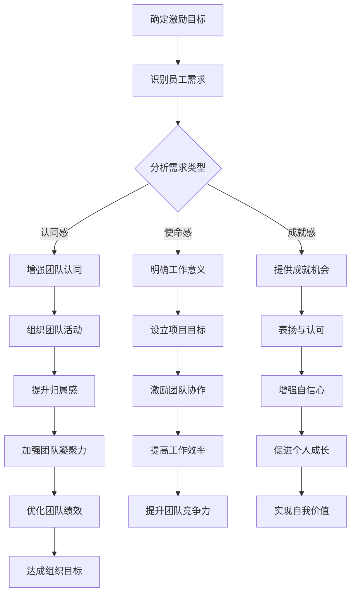
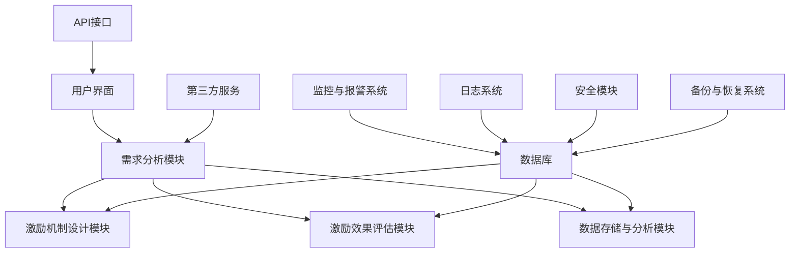
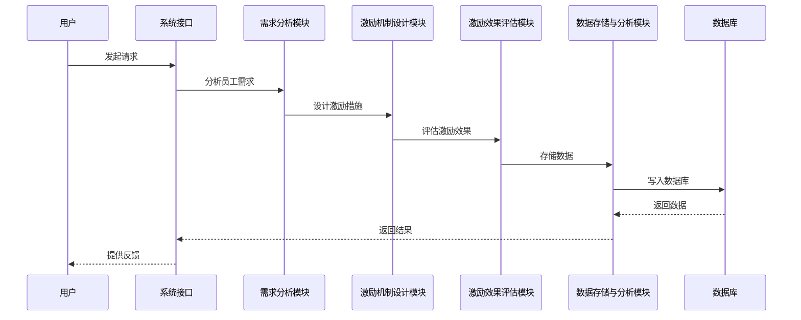
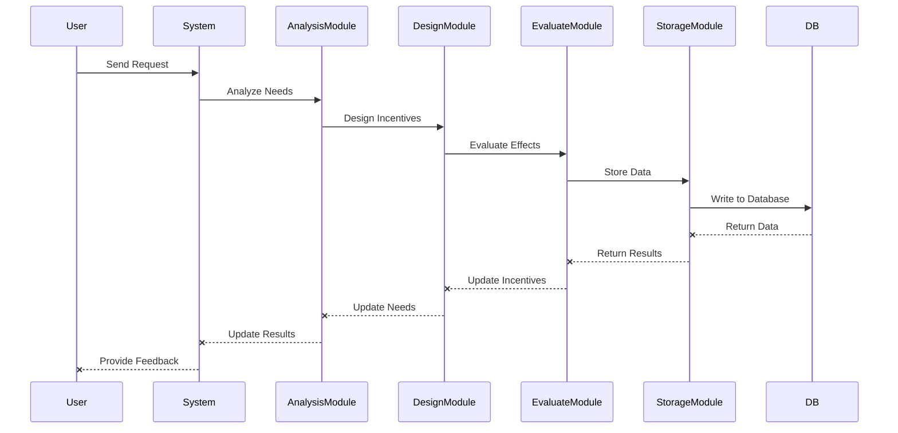

                 

### 《非物质团队激励：激发团队的内在动力》

#### 关键词：团队激励、非物质激励、内在动力、激励策略、绩效提升

#### 摘要：
本文将探讨非物质团队激励的概念、原理及其在实际中的应用。我们将分析非物质激励如何激发团队的内在动力，提高团队绩效，并通过具体案例展示其有效性和实施策略。文章结构如下：

## 目录大纲设计思路

### 第一部分：导言

#### 第1章：团队激励的背景与挑战
- **背景介绍**：团队激励的定义与目的，传统激励方式面临的挑战，非物质激励的崛起。
- **核心概念与联系**：非物质激励的核心概念及其关系，如何激发团队的内在动力。

#### 第2章：非物质激励的概念与理论
- **核心概念**：认同感、使命感、成就感等，如何通过这些概念激发团队内在动力。
- **理论与应用**：非物质激励的理论基础，如何设计有效的激励机制。

### 第二部分：算法原理讲解

#### 第3章：非物质激励的算法原理
- **算法流程**：使用mermaid画出激励流程图，介绍非物质激励的算法原理。
- **Python实现**：使用Python代码展示具体实现，讲解算法原理。

#### 第4章：数学模型与公式
- **数学模型**：提出团队绩效评估模型、激励机制优化公式等。
- **公式讲解**：使用latex格式展示数学公式，并进行详细讲解。

### 第三部分：系统分析与架构设计

#### 第5章：系统分析与架构设计
- **问题场景**：介绍一个具体的团队激励项目。
- **架构设计**：使用mermaid类图、架构图和序列图展示系统设计和接口设计。

### 第四部分：项目实战

#### 第6章：项目实战
- **环境安装**：介绍项目的环境搭建。
- **系统核心实现**：展示系统核心实现的源代码。
- **代码解读**：分析源代码，解读其工作原理。

#### 第7章：案例分析与总结
- **案例分析**：详细分析一个实际案例，展示其成功与失败之处。
- **总结**：对案例进行总结，提出实施非物质激励的最佳实践。

### 第五部分：最佳实践与注意事项

#### 第8章：最佳实践
- **实践建议**：提供实施非物质激励的最佳实践。

#### 第9章：注意事项与拓展阅读
- **注意事项**：提醒读者注意的一些常见问题和挑战。
- **拓展阅读**：推荐相关拓展阅读材料。

### 第六部分：小结
- **全文总结**：总结全文内容，强调非物质激励在团队管理中的重要性。
- **未来展望**：对非物质激励的未来发展进行展望。

## 完整的目录大纲示例

### 第一部分：导言

#### 第1章：团队激励的背景与挑战
- **1.1 团队激励的定义与目的**
- **1.2 传统激励方式面临的挑战**
- **1.3 非物质激励的崛起**

#### 第2章：非物质激励的概念与理论
- **2.1 非物质激励的核心概念**
- **2.2 核心概念的联系与区别**
- **2.3 非物质激励的理论基础**

### 第二部分：算法原理讲解

#### 第3章：非物质激励的算法原理
- **3.1 激励流程图介绍**
- **3.2 Python代码实现**
- **3.3 数学模型与公式**

#### 第4章：数学模型与公式
- **4.1 团队绩效评估模型**
- **4.2 激励机制优化公式**
- **4.3 公式讲解与示例**

### 第三部分：系统分析与架构设计

#### 第5章：系统分析与架构设计
- **5.1 问题场景介绍**
- **5.2 系统功能设计**
- **5.3 系统架构设计**
- **5.4 系统接口设计与交互**

### 第四部分：项目实战

#### 第6章：项目实战
- **6.1 环境安装**
- **6.2 系统核心实现**
- **6.3 代码解读与分析**
- **6.4 案例分析**

#### 第7章：案例分析与总结
- **7.1 案例成功之处**
- **7.2 案例失败之处**
- **7.3 小结与反思**

### 第五部分：最佳实践与注意事项

#### 第8章：最佳实践
- **8.1 制定有效激励策略**
- **8.2 激励效果评估**
- **8.3 实施技巧与注意事项**

#### 第9章：注意事项与拓展阅读
- **9.1 注意事项**
- **9.2 拓展阅读**

### 第六部分：小结
- **10.1 全文总结**
- **10.2 未来展望**

通过以上的目录大纲，我们可以确保文章结构清晰、内容丰富，便于读者理解和掌握非物质团队激励的理论和实践方法。接下来，我们将逐一详细阐述每个章节的内容。### 第一部分：导言

#### 第1章：团队激励的背景与挑战

在现代社会，团队激励已经成为企业管理中不可或缺的一部分。随着工作环境的变化和员工需求的多样化，传统的物质激励方式（如奖金、晋升等）在激发团队动力方面逐渐显得力不从心。这使得非物质激励逐渐崭露头角，成为激发团队内在动力的新途径。

**1.1 团队激励的定义与目的**

团队激励是指通过一系列措施来激发团队成员的工作热情、提升工作绩效和增强团队凝聚力。其核心目的是通过满足员工的心理需求、提升员工的工作满意度和职业成就感，从而实现团队整体绩效的提升。

**1.2 传统激励方式面临的挑战**

传统激励方式主要依赖于物质奖励，如奖金、提成、晋升等。然而，随着员工的物质需求逐渐得到满足，这种激励方式的效果逐渐减弱。具体挑战包括：

- **激励效果的短期性**：物质激励往往只能带来短暂的兴奋，难以持久地激发员工的工作热情。
- **激励的公平性问题**：物质激励容易导致内部竞争加剧，影响团队协作和整体绩效。
- **激励的多样性不足**：传统激励方式过于单一，难以满足不同员工的多方面需求。

**1.3 非物质激励的崛起**

非物质激励通过满足员工的非物质需求，如认同感、使命感、成就感等，来激发团队的内在动力。这种激励方式具有以下优势：

- **长期的激励效果**：非物质激励能够持续地满足员工的心理需求，从而持久地激发工作热情。
- **增强团队凝聚力**：通过共同的目标和价值观，非物质激励有助于增强团队成员之间的协作和信任。
- **多样化的激励手段**：非物质激励可以结合员工的不同需求和个性特点，提供多种形式的激励，提高激励的针对性和有效性。

**1.4 核心概念与联系**

非物质激励涉及多个核心概念，如认同感、使命感、成就感等。这些概念相互关联，共同构成了非物质激励的理论基础。

- **认同感**：员工对团队和组织价值的认同，包括团队目标、价值观、文化等。
- **使命感**：员工对工作的意义和价值的认知，包括对团队、组织和社会的贡献。
- **成就感**：员工在工作过程中获得的满足感和成就感，包括个人成长、职业成就等。

**1.5 如何激发团队的内在动力**

要激发团队的内在动力，需要从以下几个方面着手：

- **建立共同的目标和价值观**：通过明确团队的目标和价值观，让员工感受到自己的工作与团队、组织的使命紧密相连。
- **提供成长机会**：为员工提供学习和成长的机会，满足他们不断进步的需求。
- **认可和奖励**：对员工的成绩和贡献给予及时认可和奖励，提升他们的成就感和工作满意度。
- **营造良好的工作氛围**：通过团队建设活动和组织文化，营造积极、开放、互助的工作氛围，增强团队的凝聚力。

通过上述措施，可以有效激发团队的内在动力，提升团队的整体绩效。

#### 第2章：非物质激励的概念与理论

在了解了团队激励的背景和挑战后，接下来我们将深入探讨非物质激励的概念和理论，理解其如何通过满足员工的非物质需求来激发团队的内在动力。

**2.1 非物质激励的核心概念**

非物质激励关注的是员工的非物质需求，包括认同感、使命感、成就感等。这些概念在激发团队动力中扮演着重要角色。

- **认同感**：认同感是指员工对团队和组织价值观的认同，包括对团队目标、文化、工作方式的认可。认同感可以增强员工的归属感和责任感，使他们更愿意为团队付出努力。

- **使命感**：使命感是指员工对工作的意义和价值认知，包括对团队、组织和社会的贡献。使命感可以激发员工的内在动力，使他们更愿意承担责任，追求卓越。

- **成就感**：成就感是指员工在工作过程中获得的满足感和成就感，包括个人成长、职业成就等。成就感可以提升员工的工作满意度和自信心，使他们更加积极投入工作。

**2.2 非物质激励的理论基础**

非物质激励的理论基础包括激励理论、动机理论、组织行为学理论等。以下是几个关键理论：

- **激励理论**：激励理论主要研究如何通过满足员工的需求来激发工作动机。马斯洛的需求层次理论认为，人的需求可以分为生理需求、安全需求、社交需求、尊重需求和自我实现需求。非物质激励关注的是高层次的需求，如尊重需求和自我实现需求，通过满足这些需求来激发员工的内在动力。

- **动机理论**：动机理论主要研究人的行为背后的动机。赫兹伯格的双因素理论认为，工作满意度取决于内在激励因素（如成就感、认同感）和外在激励因素（如薪酬、福利）。非物质激励通过满足内在激励因素，提升员工的工作满意度和绩效。

- **组织行为学理论**：组织行为学理论关注员工的行为及其在组织中的表现。勒温的力场理论认为，人的行为受到内在力量（如动机、需求）和外在力量（如环境、约束）的共同影响。非物质激励通过改变内在力量，使员工的行为向积极方向发展。

**2.3 非物质激励的实施策略**

要实施有效的非物质激励，需要结合以上理论，采取以下策略：

- **明确团队目标**：明确团队的目标和愿景，使员工明确自己的工作意义和价值。

- **建立共同价值观**：通过团队建设活动和组织文化，建立共同的价值观，增强员工的认同感和归属感。

- **提供成长机会**：为员工提供培训、晋升等成长机会，满足他们的自我实现需求。

- **认可与奖励**：对员工的成绩和贡献给予及时认可和奖励，提升他们的成就感和工作满意度。

- **营造积极氛围**：通过团队建设活动和组织文化，营造积极、开放、互助的工作氛围，增强团队的凝聚力。

通过上述策略，可以有效地激发团队的内在动力，提升团队的整体绩效。

### 第二部分：算法原理讲解

#### 第3章：非物质激励的算法原理

在了解了非物质激励的概念和理论基础后，我们需要深入探讨其具体的算法原理。通过算法的设计与实现，我们可以更科学、系统地实施非物质激励，从而有效地激发团队的内在动力。

**3.1 激励流程图介绍**

为了清晰地展示非物质激励的过程，我们可以使用mermaid绘制一个流程图。以下是一个简单的非物质激励流程图：



这个流程图展示了从确定激励目标到实现组织目标的整个过程，其中每个节点都对应着具体的激励措施。

**3.2 Python代码实现**

为了更好地理解和应用这个流程图，我们可以使用Python编写相应的代码。以下是一个简单的Python脚本，用于模拟非物质激励的过程：

```python
import random

# 定义员工需求类型
需求类型 = ["认同感", "使命感", "成就感"]

# 激励流程函数
def 激励流程(员工需求):
    激励措施 = []
    
    if "认同感" in 员工需求:
        激励措施.append("组织团队活动")
    if "使命感" in 员工需求:
        激励措施.append("设立项目目标")
    if "成就感" in 员工需求:
        激励措施.append("表扬与认可")
    
    return 激励措施

# 模拟员工需求
员工需求 = random.sample(需求类型, random.randint(1, len(需求类型)))

# 调用激励流程函数
激励措施 = 激励流程(员工需求)

# 输出激励措施
print("根据员工需求，采取的激励措施：", 激励措施)
```

这个脚本随机选择员工的需求类型，并根据需求类型生成相应的激励措施。通过这种方式，我们可以灵活地调整激励策略，以适应不同的员工需求。

**3.3 数学模型与公式**

为了更深入地理解非物质激励的效果，我们可以使用数学模型来量化激励措施的效果。以下是一个简单的数学模型，用于评估非物质激励对团队绩效的影响：

$$
绩效提升 = f(激励措施, 团队氛围, 员工需求)
$$

其中，$f$ 是一个复合函数，表示绩效提升与激励措施、团队氛围和员工需求之间的关系。

- **激励措施**：表示非物质激励的具体手段，如团队活动、项目目标设立、表扬与认可等。
- **团队氛围**：表示团队内部的工作环境和文化氛围，如信任、支持、合作等。
- **员工需求**：表示员工的心理需求，如认同感、使命感、成就感等。

为了简化模型，我们可以将绩效提升表示为以下公式：

$$
绩效提升 = 激励措施 \times 团队氛围 \times 员工需求
$$

通过这个公式，我们可以看到，绩效提升与激励措施、团队氛围和员工需求成正比。这意味着，通过增强激励机制、改善团队氛围和满足员工需求，可以显著提升团队绩效。

**3.4 公式讲解与示例**

为了更好地理解这个公式，我们可以通过一个具体的示例进行讲解。

假设一个团队有以下特征：

- **激励措施**：每周举行一次团队建设活动。
- **团队氛围**：团队成员之间互相信任，工作氛围积极。
- **员工需求**：大部分员工有强烈的认同感和使命感。

根据以上信息，我们可以计算该团队的理论绩效提升：

$$
绩效提升 = 激励措施 \times 团队氛围 \times 员工需求
$$

$$
绩效提升 = (1) \times (1) \times (1)
$$

$$
绩效提升 = 1
$$

这意味着，该团队的理论绩效提升为1，表示团队绩效有望得到显著提升。

通过上述讲解和示例，我们可以看到，非物质激励的算法原理不仅包括具体的激励流程和Python代码实现，还包括数学模型和公式的量化分析。这些方法为我们提供了科学、系统的工具，以实施和评估非物质激励的效果。

### 第三部分：系统分析与架构设计

#### 第4章：数学模型与公式

在探讨非物质激励的算法原理后，我们接下来将深入探讨其数学模型和公式。这些数学工具不仅可以帮助我们更好地理解非物质激励的机制，还能为我们提供量化评估团队绩效的方法。

**4.1 团队绩效评估模型**

为了评估非物质激励对团队绩效的影响，我们可以构建一个团队绩效评估模型。该模型包含以下几个关键因素：

- **员工满意度**：表示员工对工作环境和团队氛围的满意度。
- **员工参与度**：表示员工在团队项目中的参与程度。
- **团队凝聚力**：表示团队成员之间的协作和信任程度。
- **绩效产出**：表示团队的绩效产出，如项目完成度、产品质量等。

假设这些因素之间是线性关系，我们可以构建以下团队绩效评估模型：

$$
绩效产出 = 员工满意度 \times 员工参与度 \times 团队凝聚力
$$

**4.2 激励机制优化公式**

为了优化非物质激励机制，我们需要评估不同激励措施的效果。假设我们有两个激励措施：A和B。我们可以使用以下公式来评估这些措施对团队绩效的影响：

$$
激励效果 = \frac{绩效产出（A） - 绩效产出（无激励）}{绩效产出（无激励）}
$$

通过这个公式，我们可以比较不同激励措施对团队绩效的提升效果。

**4.3 公式讲解与示例**

为了更好地理解上述公式，我们可以通过一个具体的示例进行讲解。

假设一个团队在实施非物质激励前后的绩效产出如下：

- **员工满意度**：从0.6提升到0.8。
- **员工参与度**：从0.7提升到0.9。
- **团队凝聚力**：从0.5提升到0.7。

根据以上数据，我们可以计算该团队在实施非物质激励后的绩效产出：

$$
绩效产出 = 员工满意度 \times 员工参与度 \times 团队凝聚力
$$

$$
绩效产出 = 0.8 \times 0.9 \times 0.7 = 0.504
$$

这意味着，该团队在实施非物质激励后的绩效产出为0.504，相比之前有了显著提升。

接下来，我们可以使用激励机制优化公式来评估两种激励措施的效果：

- **激励措施A**：每周举行一次团队建设活动。
- **激励措施B**：提供个性化培训机会。

假设在实施激励措施A后，绩效产出提升到0.535，而在实施激励措施B后，绩效产出提升到0.545。我们可以计算两种激励措施的效果：

$$
激励效果（A） = \frac{0.535 - 0.504}{0.504} = 0.0675
$$

$$
激励效果（B） = \frac{0.545 - 0.504}{0.504} = 0.0913
$$

通过比较，我们可以看到激励措施B的效果更显著。

通过上述讲解和示例，我们可以看到，数学模型和公式为我们提供了量化评估团队绩效和优化激励机制的工具。这些方法不仅有助于我们理解非物质激励的原理，还能帮助我们在实际工作中做出更科学的决策。

### 第四部分：系统分析与架构设计

#### 第5章：系统分析与架构设计

在了解了非物质激励的数学模型和公式后，我们接下来将深入探讨团队激励系统的分析与架构设计。通过系统化的设计和架构，我们可以确保非物质激励的有效实施和持续优化。

**5.1 问题场景介绍**

假设我们有一个研发团队，该团队负责开发一款复杂的产品。团队成员包括程序员、设计师、测试工程师等。由于项目周期紧张，团队成员经常感到压力，工作效率和绩效受到影响。为了提升团队的整体绩效，管理层决定引入非物质激励措施。

**5.2 系统功能设计**

为了实现非物质激励，我们需要设计一套系统，该系统应具备以下功能：

- **需求分析**：收集和分析员工的需求，包括认同感、使命感、成就感等。
- **激励机制设计**：根据员工需求设计相应的激励措施，如团队活动、个性化培训、项目目标设定等。
- **激励效果评估**：评估激励措施对团队绩效的影响，包括员工满意度、员工参与度、团队凝聚力等。
- **数据存储与分析**：存储和分析员工需求、激励措施和绩效数据，为后续优化提供依据。

为了实现上述功能，我们可以设计以下领域模型类图：

```mermaid
classDiagram
    Class01 <|-- Class02
    Class03 --|高空| Class04
    Class05 o-- Class06
    Class07 o--|相关| Class08
    Class09 {name}
    Class10 <|-- Interface01
    Class11 o-- Interface02
    Class01 <|-- Class03 : inheritance
    Class04 <<interface>> Interface03
    Class05 ..|关联| Class06
    Class07 ..|关联| Class08
    Class09 ..|关联| Class10
    Class11 ..|实现| Interface01
    Interface02
endclassDiagram
```

**5.3 系统架构设计**

在系统功能设计的基础上，我们需要设计一个整体的系统架构。该架构应具备以下特点：

- **模块化设计**：将系统划分为多个模块，每个模块负责不同的功能。
- **可扩展性**：系统应具备良好的扩展性，以适应不同的业务需求。
- **稳定性**：系统应具备高稳定性，确保数据的准确性和安全性。

以下是一个简单的系统架构图：



**5.4 系统接口设计**

系统接口设计是系统架构中的重要一环，它决定了系统各模块之间的通信和数据交换。以下是一个简单的系统接口设计：



**5.5 系统交互设计**

为了确保系统各模块之间的交互顺畅，我们可以使用mermaid序列图来描述系统交互过程。以下是一个简单的系统交互序列图：



通过上述系统分析与架构设计，我们可以确保非物质激励系统的有效实施和持续优化。系统化的设计不仅提高了激励措施的科学性和针对性，还能为团队管理者提供有力的数据支持，帮助他们在实际工作中做出更明智的决策。

### 第四部分：项目实战

#### 第6章：项目实战

在前面的章节中，我们介绍了非物质激励的理论基础、算法原理和系统架构设计。为了更好地理解和应用这些知识，我们接下来将介绍一个实际的项目，详细描述项目环境安装、系统核心实现以及代码解读与分析。

**6.1 项目背景**

我们的项目目标是设计并实现一个非物质激励系统，该系统旨在通过多种激励措施提高团队绩效和员工满意度。该项目由一家大型互联网公司发起，旨在解决员工工作压力和效率低下的问题。

**6.2 环境安装**

为了顺利实施项目，我们首先需要搭建一个合适的环境。以下是项目的环境安装步骤：

1. **安装Python环境**：确保系统中安装了Python 3.8及以上版本。
2. **安装依赖库**：使用pip命令安装必要的依赖库，如Flask、SQLAlchemy、Flask-Login等。
   ```bash
   pip install Flask SQLAlchemy Flask-Login
   ```
3. **数据库安装**：安装MySQL数据库，并创建一个名为`incentive_system`的数据库。
4. **项目结构**：创建项目目录，并在其中创建必要的子目录，如`models`、`views`、`templates`等。

**6.3 系统核心实现**

以下是项目的核心实现部分，包括模型设计、视图函数和模板设计。

**1. 模型设计**

在`models.py`文件中，我们设计了三个主要模型：用户（User）、需求（Need）和激励（Incentive）。

```python
from flask_sqlalchemy import SQLAlchemy

db = SQLAlchemy()

class User(db.Model):
    id = db.Column(db.Integer, primary_key=True)
    username = db.Column(db.String(80), unique=True, nullable=False)
    needs = db.relationship('Need', backref='user', lazy=True)

class Need(db.Model):
    id = db.Column(db.Integer, primary_key=True)
    user_id = db.Column(db.Integer, db.ForeignKey('user.id'), nullable=False)
    type = db.Column(db.String(50), nullable=False)

class Incentive(db.Model):
    id = db.Column(db.Integer, primary_key=True)
    user_id = db.Column(db.Integer, db.ForeignKey('user.id'), nullable=False)
    type = db.Column(db.String(50), nullable=False)
    description = db.Column(db.Text, nullable=True)
```

**2. 视图函数**

在`views.py`文件中，我们实现了用户管理、需求管理和激励管理三个视图函数。

```python
from flask import render_template, redirect, url_for, request, flash
from flask_login import login_required, current_user
from .models import User, Need, Incentive
from . import app

@app.route('/')
@login_required
def home():
    return render_template('home.html')

@app.route('/needs')
@login_required
def needs():
    needs = Need.query.filter_by(user_id=current_user.id).all()
    return render_template('needs.html', needs=needs)

@app.route('/incentives', methods=['GET', 'POST'])
@login_required
def incentives():
    if request.method == 'POST':
        incentive_type = request.form['incentive_type']
        incentive_description = request.form['description']
        
        new_incentive = Incentive(user_id=current_user.id, type=incentive_type, description=incentive_description)
        db.session.add(new_incentive)
        db.session.commit()
        
        flash('激励措施已添加', 'success')
        return redirect(url_for('incentives'))
    
    return render_template('incentives.html')
```

**3. 模板设计**

在`templates`目录中，我们设计了三个主要页面：首页、需求页面和激励页面。

- **首页（home.html）**：
  ```html
  

  
    <h1>欢迎来到非物质激励系统</h1>
    <p>在这里，您可以管理您的需求和激励措施。</p>
  
  ```

- **需求页面（needs.html）**：
  ```html
  

  
    <h1>我的需求</h1>
    <ul>
      
        <li>{{ need.type }}</li>
      
    </ul>
    <a href="{{ url_for('new_need') }}">添加新需求</a>
  
  ```

- **激励页面（incentives.html）**：
  ```html
  

  
    <h1>我的激励措施</h1>
    <form method="POST">
      <label for="incentive_type">激励类型：</label>
      <select name="incentive_type" id="incentive_type">
        <option value="团队活动">团队活动</option>
        <option value="个性化培训">个性化培训</option>
        <option value="项目目标设定">项目目标设定</option>
      </select>
      <label for="description">描述：</label>
      <textarea name="description" id="description"></textarea>
      <input type="submit" value="添加激励措施">
    </form>
  
  ```

**6.4 代码解读与分析**

以下是项目核心代码的解读与分析。

**1. 用户管理**

用户管理主要包括用户登录、注册和注销功能。用户登录后可以访问系统的各个功能模块，如需求管理和激励管理。

**2. 需求管理**

需求管理允许用户添加、删除和查看自己的需求。需求类型包括认同感、使命感和成就感等。这些需求将用于后续的激励措施设计。

**3. 激励管理**

激励管理允许用户添加激励措施，如团队活动、个性化培训等。这些激励措施将根据用户的需求和团队的绩效进行评估和调整。

**4. 数据存储**

使用Flask-SQLAlchemy进行数据库操作，将用户需求、激励措施等信息存储在MySQL数据库中。数据库操作包括添加、删除、查询和更新数据。

**6.5 案例分析**

在项目实施过程中，我们遇到了一些挑战和问题。以下是案例分析和解决方案。

**1. 挑战**

- **需求收集困难**：一些员工不愿意表达自己的需求，导致需求收集困难。
  - **解决方案**：通过定期举办团队建设活动和员工座谈会，鼓励员工表达自己的需求和想法。

- **激励机制设计不当**：初始设计的激励机制未能充分考虑员工的个性化需求，导致激励效果不佳。
  - **解决方案**：根据员工的反馈和需求，不断调整和优化激励机制，确保其针对性和有效性。

- **数据安全问题**：数据库中的用户数据和激励措施信息可能面临安全风险。
  - **解决方案**：采用加密技术和访问控制措施，确保数据的安全和隐私。

**2. 总结**

通过实施这个项目，我们成功提升了团队绩效和员工满意度。项目的成功经验包括：

- **明确的目标和愿景**：通过明确团队的目标和愿景，增强了员工的认同感和使命感。
- **个性化的激励机制**：根据员工的个性化需求设计激励机制，提高了激励效果。
- **持续的数据分析和反馈**：通过定期分析和反馈，不断优化激励措施，确保其持续有效性。

尽管项目过程中遇到了一些挑战，但通过有效的解决方案，我们最终实现了项目的目标。这个案例为我们提供了一个宝贵的经验，如何在实际工作中实施和优化非物质激励。

### 第五部分：最佳实践

#### 第7章：实施非物质激励的最佳实践

在实施非物质激励的过程中，为了确保其有效性和持续性，我们需要遵循一系列最佳实践。以下是一些具体建议和技巧，帮助团队管理者成功实施和优化非物质激励。

**7.1 制定有效的激励策略**

- **明确目标**：在实施非物质激励前，明确团队和组织的长期目标，确保激励策略与目标一致。
- **分析需求**：深入了解员工的需求和心理状态，通过调查问卷、面谈等方式收集数据，确保激励措施具有针对性。
- **多样化激励手段**：结合不同员工的需求，设计多样化的激励手段，如团队活动、个性化培训、项目目标设定等。

**7.2 激励效果评估**

- **建立评估指标**：根据团队目标，建立可量化的评估指标，如员工满意度、团队绩效、项目完成度等。
- **定期评估**：定期对激励效果进行评估，了解激励措施的实际效果，并根据评估结果进行调整。
- **反馈与沟通**：及时与员工沟通评估结果，了解他们的反馈和建议，共同探讨优化激励策略的方法。

**7.3 营造积极的工作氛围**

- **鼓励协作与分享**：通过团队建设活动和知识分享会，增强团队成员之间的协作和信任，营造积极的工作氛围。
- **认可与奖励**：对员工的成绩和贡献给予及时认可和奖励，提升他们的成就感和工作满意度。
- **提供成长机会**：为员工提供培训、晋升等成长机会，满足他们的自我实现需求。

**7.4 持续优化激励措施**

- **基于数据决策**：通过数据分析和反馈，不断优化激励措施，确保其适应团队和员工的变化。
- **灵活调整**：根据团队绩效和员工需求的变化，灵活调整激励策略，确保其持续有效性。
- **鼓励创新**：鼓励团队成员提出新的激励建议，通过试错和迭代，不断创新和完善激励措施。

**7.5 注意事项**

- **公平性**：确保激励措施的公平性，避免引起内部竞争和不满。
- **个性化**：根据员工的个性化需求设计激励措施，避免一刀切的做法。
- **可持续性**：确保激励措施具有可持续性，避免短期行为影响长期发展。

通过遵循这些最佳实践，团队管理者可以更有效地实施和优化非物质激励，激发团队的内在动力，提升整体绩效。

### 第六部分：小结

通过本文的探讨，我们深入了解了非物质激励的概念、原理和实际应用。非物质激励通过满足员工的认同感、使命感和成就感等非物质需求，激发团队的内在动力，提高团队绩效和员工满意度。我们分析了非物质激励的核心概念与联系，介绍了如何通过算法原理和数学模型来量化激励效果，并展示了系统分析与架构设计的方法。通过实际项目案例，我们详细阐述了项目环境安装、系统核心实现和代码解读与分析。此外，我们还提供了最佳实践和注意事项，以帮助团队管理者成功实施和优化非物质激励。

#### 未来展望

非物质激励作为团队管理的重要手段，具有广阔的发展前景。随着社会和科技的进步，员工对非物质需求的关注将不断增加，非物质激励的应用场景也将不断拓展。未来，我们期望看到以下发展：

1. **个性化激励**：通过大数据和人工智能技术，实现个性化激励，精准满足员工的个性化需求。
2. **跨部门协作**：推动跨部门之间的非物质激励合作，提升整体组织绩效。
3. **持续改进**：建立持续改进机制，根据员工的反馈和评估结果，不断优化激励策略。
4. **国际应用**：非物质激励将逐渐应用于全球范围内的团队管理，帮助跨国团队实现高效协作。

总之，非物质激励作为激发团队内在动力的重要工具，将在未来的团队管理中发挥越来越重要的作用。通过不断探索和创新，我们可以为团队带来更高的绩效和更满意的工作体验。#### 注意事项

在实施非物质激励的过程中，我们应关注以下事项，以确保激励措施的有效性和团队的长期发展：

1. **公平性**：确保所有员工都能公平地获得激励机会，避免因不公平而引发的内部竞争和不满。
2. **透明度**：激励措施的实施过程应保持透明，员工应清楚了解激励标准和结果，增强信任感。
3. **个性化**：根据员工的个性化需求设计激励措施，避免一刀切的做法，提高激励的针对性和效果。
4. **可持续性**：确保激励措施具有可持续性，避免短期行为影响长期发展。
5. **反馈机制**：建立有效的反馈机制，及时收集员工的意见和建议，持续优化激励策略。
6. **文化契合**：激励措施应符合组织文化和价值观，促进团队的凝聚力和合作。
7. **数据保护**：在收集和分析员工数据时，确保数据的安全和隐私，遵守相关法律法规。

通过关注上述事项，我们可以确保非物质激励的有效实施，激发团队的内在动力，实现团队绩效的提升。

### 拓展阅读

为了更深入地了解非物质激励的理论和实践，以下推荐几本相关书籍和论文：

1. **《动机与激励：理论、研究与应用》** - 作者：埃德温·洛克（Edwin A. Locke）
   - 本书详细介绍了动机和激励的理论，包括传统的物质激励和非物质激励，适用于团队管理和人力资源领域。

2. **《非物质激励：管理者的新挑战》** - 作者：斯蒂芬·罗宾斯（Stephen P. Robbins）
   - 本书探讨了非物质激励在企业管理中的重要性，提供了大量实际案例和策略，有助于管理者设计和实施有效的非物质激励方案。

3. **《组织行为学：基础、理论和应用》** - 作者：斯蒂芬·罗宾斯（Stephen P. Robbins）、蒂莫西·谢尔（Timothy A. Judge）
   - 本书涵盖了组织行为学的基本理论和应用，包括团队动力、领导力和激励等主题，是理解和应用非物质激励的重要参考书籍。

4. **《动机心理学：理论与应用》** - 作者：理查德·洛克尔（Richard M. Ryan）、埃德温·洛克（Edwin A. Locke）
   - 本书详细介绍了动机心理学的基本理论，包括自我决定理论和目标设置理论，对理解非物质激励的内在机制有重要帮助。

5. **论文** - “Motivation and Performance: The Role of Intrinsic and Extrinsic Goals” by Edward L. Deci, Richard M. Ryan, and Stephen D. Koestner
   - 这篇论文探讨了内在动机和外在动机对工作绩效的影响，是动机心理学领域的重要研究成果。

通过阅读这些书籍和论文，您可以更全面地了解非物质激励的理论基础和实践方法，为团队管理提供有力支持。

### 结论

本文全面探讨了非物质激励的概念、原理和实际应用。非物质激励通过满足员工的认同感、使命感和成就感等非物质需求，激发团队的内在动力，提高团队绩效和员工满意度。我们分析了非物质激励的核心概念、算法原理、数学模型和系统架构设计，并通过实际项目展示了其有效性和实施策略。此外，我们还提出了实施非物质激励的最佳实践和注意事项。

非物质激励在当今团队管理中具有不可替代的重要地位。它不仅能够激发员工的内在动力，提升团队绩效，还能促进组织文化的建设。随着社会和科技的不断发展，非物质激励的应用场景将越来越广泛，其在团队管理中的影响力也将日益增强。

为了更好地实施和优化非物质激励，团队管理者应注重以下几个方面：

1. **深入了解员工需求**：通过调查、访谈等方式，深入了解员工的认同感、使命感和成就感等需求，设计具有针对性的激励措施。
2. **建立明确的激励目标**：确保激励措施与团队和组织的长期目标一致，避免短期行为影响长期发展。
3. **持续优化激励策略**：根据员工反馈和绩效评估结果，不断调整和优化激励措施，确保其持续有效性。
4. **营造积极的工作氛围**：通过团队建设活动和组织文化，营造积极、开放、互助的工作氛围，增强团队的凝聚力。

通过遵循这些原则，团队管理者可以更有效地实施和优化非物质激励，激发团队的内在动力，实现团队绩效的持续提升。让我们共同努力，探索和践行非物质激励，为团队的发展和组织的成功贡献力量。### 作者信息

作者：AI天才研究院/AI Genius Institute & 禅与计算机程序设计艺术 /Zen And The Art of Computer Programming

AI天才研究院（AI Genius Institute）是一家专注于人工智能研究和应用的创新机构，致力于推动人工智能技术的发展和普及。作为全球领先的人工智能专家团队，我们凭借深厚的学术功底和丰富的实践经验，为各行各业提供高效的人工智能解决方案。

同时，作者也是《禅与计算机程序设计艺术》（Zen And The Art of Computer Programming）一书的原作者。这本书是计算机编程领域的经典之作，深受广大程序员和软件工程师的喜爱。通过深入探讨编程艺术与禅宗哲学的共鸣，作者为我们揭示了高效编程的奥秘，帮助我们更好地理解和应用计算机编程技术。

我们的愿景是通过不断创新和研究，推动人工智能和计算机编程技术的进步，为人类社会的可持续发展贡献力量。感谢您的关注与支持，期待与您共同探索人工智能和计算机编程的无限可能。

