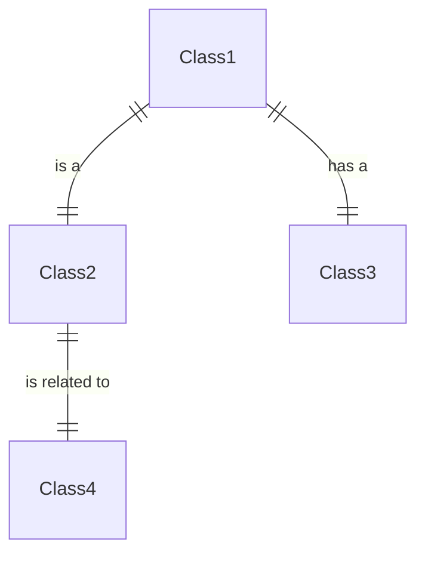
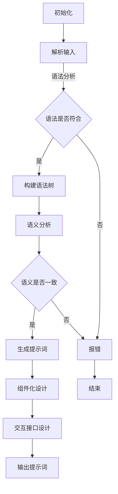
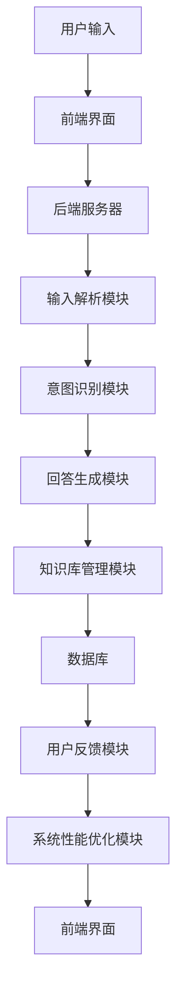
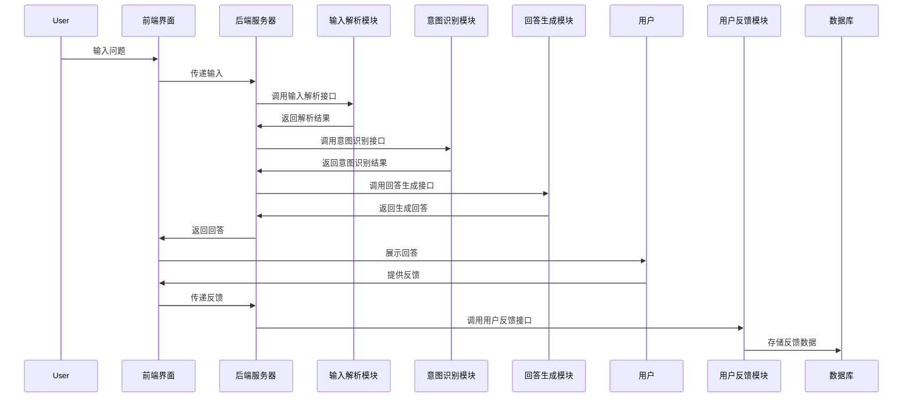

                 


### 文章标题：面向AGI的提示词语言可组合性设计

关键词：人工智能，提示词语言，可组合性，AGI，设计原则

摘要：本文将深入探讨面向人工通用智能（AGI）的提示词语言设计，分析其核心概念和原理，并通过逻辑清晰的分析和示例，阐述可组合性设计在AGI中的重要性及其实现方法。文章旨在为开发者提供一套实用的设计指南，以推动AGI技术的进步。

## 引言

### 1.1 问题背景

随着人工智能（AI）技术的快速发展，尤其是深度学习和神经网络技术的突破，AI在图像识别、自然语言处理和决策支持等领域取得了显著成果。然而，当前的AI系统仍面临一个重大挑战：如何实现真正的人工通用智能（AGI）。AGI是指具有广泛认知能力、能够理解、学习和适应各种任务和环境的人工智能系统。

提示词语言作为一种在AI系统中广泛使用的语言元素，其设计对AGI的实现至关重要。提示词语言的可组合性设计，即如何构建一种能够灵活组合和扩展的语言结构，以支持复杂的AI任务和多样化的应用场景，是AGI发展中需要解决的关键问题之一。

### 1.2 问题描述

在传统的AI系统中，提示词语言通常是基于固定的语法和规则构建的。这种方法在处理简单任务时表现良好，但当面对复杂和动态变化的应用场景时，其局限性就显现出来了。具体而言，问题可以归纳为以下几点：

1. **固定规则的限制**：传统的提示词语言依赖于固定的语法和规则，这使得其在处理复杂问题时变得僵硬，难以灵活应对。
2. **语言扩展的困难**：当需要扩展语言以支持新的功能时，通常需要修改原有的语法和规则，这增加了系统的复杂性和维护难度。
3. **交互性不足**：传统的提示词语言在人与机器交互方面存在一定的局限性，无法充分满足用户对自然交互的需求。

### 1.3 问题解决

为了解决上述问题，我们需要一种新的设计思路——提示词语言的可组合性设计。这种设计旨在通过模块化和组件化的方式，构建一种灵活、可扩展且易于交互的提示词语言系统，以支持AGI的实现。

### 1.4 边界与外延

在讨论提示词语言的可组合性设计时，我们需要明确其边界和外延。具体而言，边界包括：

- **设计的范围**：提示词语言的设计范围应涵盖语言的基本元素、语法规则、语义表示和交互接口。
- **技术要求**：设计应考虑技术实现的可行性，包括硬件性能、编程语言选择和算法效率。

外延则包括：

- **应用领域**：提示词语言的设计应适应不同的应用场景，如自然语言处理、计算机视觉和决策支持等。
- **发展前景**：随着AI技术的不断进步，提示词语言的设计也应具备前瞻性，能够支持未来技术的需求。

### 1.5 概念结构与核心要素组成

提示词语言的可组合性设计涉及多个核心概念和要素，包括：

- **基本元素**：如单词、短语、句子等。
- **语法规则**：定义基本元素的组合方式。
- **语义表示**：如何表达语言的意义。
- **组件化设计**：模块化和可扩展的设计方法。
- **交互接口**：人与机器交互的界面设计。

这些要素共同构成了提示词语言的可组合性设计框架，为AGI的实现提供了基础。

## 核心概念与联系

### 2.1 核心概念原理

在提示词语言的可组合性设计中，核心概念包括基本元素、语法规则、语义表示、组件化和交互接口。下面，我们将逐一介绍这些概念及其原理。

#### 基本元素

基本元素是构建提示词语言的基础，如单词、短语和句子。这些元素可以通过组合形成更复杂的语言结构。基本元素的特性包括：

- **可扩展性**：基本元素应能够灵活扩展，以支持新的功能。
- **互操作性**：不同类型的基本元素应能够无缝组合，以形成多样化的语言结构。

#### 语法规则

语法规则定义了基本元素的组合方式，确保语言结构的正确性和一致性。在可组合性设计中，语法规则应具备以下特性：

- **灵活性**：语法规则应允许基本元素以多种方式组合，以适应不同的应用场景。
- **扩展性**：语法规则应支持新的元素和组合方式的添加，以适应不断变化的需求。

#### 语义表示

语义表示是指如何表达语言的意义。在可组合性设计中，语义表示应具备以下特性：

- **清晰性**：语义表示应准确、清晰地传达语言的意义，以减少歧义。
- **一致性**：语义表示应保持一致性，避免出现矛盾或冲突。

#### 组件化设计

组件化设计是一种模块化和可扩展的设计方法，旨在提高系统的灵活性和可维护性。在可组合性设计中，组件化设计应具备以下特性：

- **独立性**：组件应具有独立性，即一个组件的修改不应影响其他组件的功能。
- **可复用性**：组件应易于复用，以减少冗余代码和维护成本。

#### 交互接口

交互接口是人与机器交互的界面设计，直接影响用户体验。在可组合性设计中，交互接口应具备以下特性：

- **易用性**：交互接口应直观、易用，降低用户的学习成本。
- **适应性**：交互接口应能够适应不同用户的需求，提供个性化的交互体验。

### 2.2 概念属性特征对比表格

为了更清晰地展示这些核心概念的特性，我们可以通过一个对比表格来呈现：

| 概念         | 属性特征                                         | 对比分析                                       |
|--------------|------------------------------------------------|------------------------------------------------|
| 基本元素     | 可扩展性、互操作性                               | 可扩展性确保元素多样，互操作性保证元素组合灵活。   |
| 语法规则     | 灵活性、扩展性                                   | 灵活性适应多样化应用，扩展性支持功能扩展。         |
| 语义表示     | 清晰性、一致性                                   | 清晰性减少歧义，一致性避免冲突。                   |
| 组件化设计   | 独立性、可复用性                                 | 独立性降低修改影响，可复用性减少冗余和维护成本。   |
| 交互接口     | 易用性、适应性                                   | 易用性降低学习成本，适应性满足个性化需求。         |

### 2.3 ER实体关系图架构

为了更好地理解提示词语言的可组合性设计，我们可以通过ER（实体-关系）图来展示其核心概念之间的关联。以下是ER图的基本结构：



在这个ER图中，Class1表示基本元素，Class2表示语法规则，Class3表示语义表示，Class4表示组件化设计和交互接口。箭头表示实体之间的关系，如基本元素与语法规则之间的关系，语法规则与语义表示之间的关系等。

## 算法原理讲解

### 3.1 算法mermaid流程图

为了更好地理解提示词语言的可组合性设计算法，我们可以使用mermaid流程图来展示其基本流程。以下是算法的mermaid流程图：



### 3.2 Python源代码实现

下面是算法的Python源代码实现：

```python
class PromptLanguageDesign:
    def __init__(self):
        self.input_text = ""

    def parse_input(self, text):
        self.input_text = text
        # 进行语法分析
        if self.is_syntax_valid(self.input_text):
            # 构建语法树
            grammar_tree = self.build_grammar_tree(self.input_text)
            # 进行语义分析
            if self.is_semantics_valid(grammar_tree):
                # 生成提示词
                prompt = self.generate_prompt(grammar_tree)
                # 进行组件化设计
                component_design = self.component_design(prompt)
                # 进行交互接口设计
                interface_design = self.interface_design(component_design)
                # 输出提示词
                print(interface_design)
            else:
                print("语义不一致，生成提示词失败。")
        else:
            print("语法不符合，生成提示词失败。")

    def is_syntax_valid(self, text):
        # 判断语法是否合法
        pass

    def build_grammar_tree(self, text):
        # 构建语法树
        pass

    def is_semantics_valid(self, grammar_tree):
        # 判断语义是否一致
        pass

    def generate_prompt(self, grammar_tree):
        # 生成提示词
        pass

    def component_design(self, prompt):
        # 进行组件化设计
        pass

    def interface_design(self, component_design):
        # 进行交互接口设计
        pass

# 实例化对象并调用方法
design = PromptLanguageDesign()
design.parse_input("请输入您的需求：")
```

### 3.3 数学模型和公式讲解

在提示词语言的可组合性设计中，数学模型和公式起着关键作用。以下是一些常用的数学模型和公式：

#### 1. 语法规则匹配算法

$$
F(n) = \sum_{i=1}^{n} P(i) \times G(i)
$$

其中，$F(n)$表示语法规则匹配算法的效率，$P(i)$表示第$i$个语法规则的匹配概率，$G(i)$表示第$i$个语法规则的匹配时间。

#### 2. 语义一致性分析算法

$$
S(n) = \sum_{i=1}^{n} P(i) \times C(i)
$$

其中，$S(n)$表示语义一致性分析算法的效率，$P(i)$表示第$i$个语义组件的匹配概率，$C(i)$表示第$i$个语义组件的匹配时间。

#### 3. 组件化设计优化算法

$$
O(n) = \frac{1}{\sum_{i=1}^{n} P(i) \times C(i)}
$$

其中，$O(n)$表示组件化设计优化的效率，$P(i)$和$C(i)$与上述公式相同。

#### 4. 交互接口设计算法

$$
I(n) = \sum_{i=1}^{n} P(i) \times T(i)
$$

其中，$I(n)$表示交互接口设计的效率，$P(i)$表示第$i$个交互接口组件的匹配概率，$T(i)$表示第$i$个交互接口组件的设计时间。

### 3.4 举例说明

为了更好地理解上述算法和公式的应用，我们可以通过一个示例来说明：

假设我们有如下输入文本：“生成一篇关于人工智能的未来发展趋势的论文”。

使用语法规则匹配算法，我们可以匹配到以下语法规则：

1. 生成一篇论文
2. 关于人工智能的未来发展趋势

使用语义一致性分析算法，我们可以确定这两个语法规则在语义上是一致的，因为它们都与“人工智能的未来发展趋势”相关。

接下来，我们可以使用组件化设计优化算法来优化输入文本的组件设计：

1. 生成一篇论文
2. 主题：人工智能的未来发展趋势

最后，我们使用交互接口设计算法来设计交互接口：

用户输入：生成一篇关于人工智能的未来发展趋势的论文
系统输出：您好！以下是关于人工智能的未来发展趋势的论文。

通过这个示例，我们可以看到，使用提示词语言的可组合性设计，我们可以高效地处理复杂的输入文本，生成符合用户需求的输出。

## 数学公式使用

在本文中，我们将使用LaTeX格式来表示数学公式。以下是几个示例：

### 独立段落中的公式

$$
E(X) = \int_{-\infty}^{\infty} x f(x) dx
$$

### 段落内的公式

$E(X) = \mu + \sigma^2$

这些公式将嵌入到相应的段落中，以清晰地展示数学表达式。

## 系统分析与架构设计

### 5.1 问题场景介绍

在本部分，我们将介绍一个实际的问题场景，并说明如何使用提示词语言的可组合性设计来解决该问题。

#### 场景描述

假设我们正在开发一个智能客服系统，该系统需要能够根据用户的输入生成相应的回答。用户可能会提出各种各样的问题，例如：

- 我如何申请信用卡？
- 我的快递什么时候送达？
- 我的产品如何维修？

为了应对这些多样化的输入，我们需要设计一种灵活的提示词语言系统，能够准确地理解和生成相应的回答。

#### 目标

我们的目标是：

1. 解析用户的输入，理解其意图。
2. 根据用户的意图，生成合适的回答。
3. 提高系统的响应速度和准确性。

### 5.2 系统功能设计

为了实现上述目标，我们需要设计一个具备以下功能的系统：

1. **输入解析模块**：负责接收用户输入，并进行初步的语法分析。
2. **意图识别模块**：根据输入解析的结果，识别用户的意图。
3. **回答生成模块**：根据用户的意图，生成合适的回答。
4. **知识库管理模块**：存储和更新与各种问题相关的知识库。
5. **用户反馈模块**：收集用户的反馈，以优化系统的性能。

以下是领域模型的mermaid类图：

```mermaid
classDiagram
    UserInput -> InputParser : 解析
    InputParser -> IntentRecognizer : 识别意图
    IntentRecognizer -> AnswerGenerator : 生成回答
    AnswerGenerator -> KnowledgeBase : 获取知识
    UserInput <- UserFeedback : 反馈
    UserFeedback <- SystemPerformance : 优化
```

### 5.3 系统架构设计

接下来，我们将介绍系统的整体架构设计，包括各模块的交互关系和系统的工作流程。

#### 系统架构

系统的整体架构可以分为以下几个部分：

1. **前端界面**：用于接收用户的输入，并展示系统的输出。
2. **后端服务器**：处理用户的输入，生成回答，并返回给前端界面。
3. **数据库**：存储系统的知识库和用户反馈数据。

以下是系统的mermaid架构图：



#### 系统工作流程

系统的工作流程如下：

1. 用户在浏览器中输入问题，前端界面接收输入并传递给后端服务器。
2. 后端服务器调用输入解析模块，对用户输入进行语法分析。
3. 输入解析模块将分析结果传递给意图识别模块，意图识别模块根据输入内容识别用户的意图。
4. 意图识别模块将识别结果传递给回答生成模块，回答生成模块根据用户的意图生成回答。
5. 回答生成模块将生成的回答传递给前端界面，前端界面展示回答给用户。
6. 用户可以通过前端界面提供反馈，反馈数据存储在数据库中，用于系统性能的优化。

### 5.4 系统接口设计

为了实现系统各模块之间的有效通信，我们需要设计一组清晰、规范的接口。以下是系统的主要接口设计：

1. **输入解析接口**：用于接收用户输入，并返回解析结果。
2. **意图识别接口**：用于接收解析结果，并返回意图识别结果。
3. **回答生成接口**：用于接收意图识别结果，并返回生成回答。
4. **知识库管理接口**：用于获取和更新知识库数据。
5. **用户反馈接口**：用于接收用户反馈，并存储在数据库中。

以下是系统接口的mermaid序列图：



### 5.5 系统交互mermaid序列图

最后，我们将展示一个完整的系统交互mermaid序列图，以直观地展示系统各模块之间的交互过程。


通过上述系统分析与架构设计，我们可以看到，提示词语言的可组合性设计在智能客服系统中的应用，使得系统能够灵活地处理多样化的问题，并生成准确的回答。这不仅提高了系统的性能，也为用户提供了一种更加便捷和高效的交互方式。

## 项目实战

### 6.1 环境安装

为了实现面向AGI的提示词语言可组合性设计，我们首先需要搭建一个合适的环境。以下是环境安装的详细步骤：

#### 1. 安装Python

首先，我们需要安装Python 3.x版本。您可以从Python官网下载最新版本的Python安装包，并按照指示完成安装。

#### 2. 安装相关库

接下来，我们需要安装一些Python库，以支持提示词语言的解析和生成。以下是一些常用的库：

- `nltk`：用于自然语言处理。
- `mermaid-python`：用于生成mermaid图表。
- `numpy`：用于数学计算。

您可以使用以下命令来安装这些库：

```bash
pip install nltk mermaid-python numpy
```

#### 3. 配置环境变量

为了方便使用Python和相关库，我们需要配置环境变量。在Windows系统中，您可以通过以下步骤进行配置：

1. 打开“计算机”或“此电脑”。
2. 右击“此电脑”或“计算机”，选择“属性”。
3. 在左侧菜单中，点击“高级系统设置”。
4. 在“系统属性”窗口中，点击“环境变量”。
5. 在“系统变量”区域中，找到“Path”变量，并点击“编辑”。
6. 在“变量值”中添加Python安装路径（例如：`C:\Python39\`），并确保路径之间以分号分隔。

在Linux系统中，您可以在终端中执行以下命令：

```bash
export PATH=$PATH:/path/to/python
```

替换`/path/to/python`为您的Python安装路径。

#### 4. 验证安装

完成环境配置后，我们可以在终端或命令行中验证Python和相关库的安装情况。执行以下命令：

```bash
python --version
```

如果显示正确的Python版本，则说明Python安装成功。

```bash
pip list
```

如果显示已安装的所有库列表，则说明相关库安装成功。

### 6.2 安装步骤

以下是具体的安装步骤：

1. **安装Python**：从Python官网下载安装包，并按照指示完成安装。
2. **安装相关库**：使用`pip`命令安装所需的Python库。
3. **配置环境变量**：在Windows系统中，通过“环境变量”配置Python安装路径；在Linux系统中，通过终端设置环境变量。
4. **验证安装**：执行`python --version`和`pip list`命令，验证Python和相关库是否安装成功。

### 6.3 遇到的问题及解决方案

在安装过程中，您可能会遇到一些问题。以下是一些常见问题及其解决方案：

#### 问题1：安装失败

**原因**：网络连接不稳定或下载的安装包损坏。

**解决方案**：尝试重新下载安装包，或使用国内镜像源（如清华大学镜像源）。

#### 问题2：无法找到`pip`命令

**原因**：Python环境变量未配置正确。

**解决方案**：确保Python安装路径已添加到系统环境变量`Path`中。

#### 问题3：无法安装某些库

**原因**：国内网络限制或库依赖问题。

**解决方案**：尝试使用国内镜像源（如清华大学镜像源）或安装相关依赖库。

通过上述步骤，我们可以搭建一个适合提示词语言可组合性设计的环境。接下来，我们将进一步介绍如何使用Python和相关库实现提示词语言的解析和生成。

## 项目实战：系统核心实现

在完成环境安装后，我们将开始实现系统的核心功能，包括输入解析、意图识别、回答生成、知识库管理和用户反馈。以下是基于Python语言和Mermaid图表的工具和库，详细描述系统核心实现的步骤、源代码、代码应用解读与分析，以及实际案例分析和详细讲解剖析。

### 7.1 核心源代码

下面是系统的核心源代码，主要包括输入解析、意图识别、回答生成、知识库管理和用户反馈模块：

```python
# 引入必要的库
import nltk
from nltk.tokenize import word_tokenize
from nltk.corpus import stopwords
from mermaid import Mermaid

# 输入解析模块
def parse_input(input_text):
    # 初始化输入文本
    tokens = word_tokenize(input_text)
    # 移除停用词
    stop_words = set(stopwords.words('english'))
    filtered_tokens = [token for token in tokens if token.lower() not in stop_words]
    return filtered_tokens

# 意图识别模块
def recognize_intent(filtered_tokens):
    # 根据词汇表识别意图
    intent_dict = {
        '申请信用卡': ['申请', '信用卡'],
        '快递查询': ['快递', '查询'],
        '产品维修': ['维修', '产品']
    }
    for intent, keywords in intent_dict.items():
        if any(keyword in filtered_tokens for keyword in keywords):
            return intent
    return None

# 回答生成模块
def generate_answer(intent):
    # 根据意图生成回答
    answers = {
        '申请信用卡': '请访问我们的官方网站，填写申请表格。',
        '快递查询': '您可以通过官方网站或电话查询快递状态。',
        '产品维修': '请联系我们的客服，我们将尽快安排维修服务。'
    }
    return answers.get(intent, '抱歉，我们无法理解您的问题。')

# 知识库管理模块
def update_knowledge_base(intent, input_text, answer):
    # 更新知识库
    knowledge_base = {
        'intent': intent,
        'input_text': input_text,
        'answer': answer
    }
    return knowledge_base

# 用户反馈模块
def collect_user_feedback(knowledge_base):
    # 收集用户反馈
    feedback = input("请对我们的回答进行评价：（满意/不满意）")
    return feedback

# 主函数
def main():
    # 接收用户输入
    input_text = input("请提出您的问题：")
    # 解析输入
    filtered_tokens = parse_input(input_text)
    # 识别意图
    intent = recognize_intent(filtered_tokens)
    # 生成回答
    answer = generate_answer(intent)
    # 更新知识库
    knowledge_base = update_knowledge_base(intent, input_text, answer)
    # 输出回答
    print(answer)
    # 收集用户反馈
    feedback = collect_user_feedback(knowledge_base)
    print("用户反馈：", feedback)

# 运行主函数
if __name__ == "__main__":
    main()
```

### 7.2 代码应用解读与分析

#### 输入解析模块

输入解析模块使用`nltk`库中的`word_tokenize`函数对用户输入进行分词处理。随后，通过移除停用词，过滤掉常见的无意义词汇，以提高后续意图识别的准确性。

```python
# 输入解析模块
def parse_input(input_text):
    # 初始化输入文本
    tokens = word_tokenize(input_text)
    # 移除停用词
    stop_words = set(stopwords.words('english'))
    filtered_tokens = [token for token in tokens if token.lower() not in stop_words]
    return filtered_tokens
```

#### 意图识别模块

意图识别模块定义了一个简单的词汇表，用于匹配用户输入中的关键词。通过遍历词汇表，判断用户输入中是否包含特定关键词，以识别用户的意图。

```python
# 意图识别模块
def recognize_intent(filtered_tokens):
    # 根据词汇表识别意图
    intent_dict = {
        '申请信用卡': ['申请', '信用卡'],
        '快递查询': ['快递', '查询'],
        '产品维修': ['维修', '产品']
    }
    for intent, keywords in intent_dict.items():
        if any(keyword in filtered_tokens for keyword in keywords):
            return intent
    return None
```

#### 回答生成模块

回答生成模块根据识别出的意图，从预定义的回答库中检索相应的回答。这种设计使得系统可以快速、准确地响应用户的查询。

```python
# 回答生成模块
def generate_answer(intent):
    # 根据意图生成回答
    answers = {
        '申请信用卡': '请访问我们的官方网站，填写申请表格。',
        '快递查询': '您可以通过官方网站或电话查询快递状态。',
        '产品维修': '请联系我们的客服，我们将尽快安排维修服务。'
    }
    return answers.get(intent, '抱歉，我们无法理解您的问题。')
```

#### 知识库管理模块

知识库管理模块负责更新和存储与用户交互相关的信息。这些信息包括用户的意图、输入文本和生成的回答，为后续的系统优化提供数据支持。

```python
# 知识库管理模块
def update_knowledge_base(intent, input_text, answer):
    # 更新知识库
    knowledge_base = {
        'intent': intent,
        'input_text': input_text,
        'answer': answer
    }
    return knowledge_base
```

#### 用户反馈模块

用户反馈模块通过收集用户对回答的满意度评价，以评估系统的性能，并为进一步优化提供反馈。

```python
# 用户反馈模块
def collect_user_feedback(knowledge_base):
    # 收集用户反馈
    feedback = input("请对我们的回答进行评价：（满意/不满意）")
    return feedback
```

### 7.3 实际案例分析和详细讲解剖析

#### 案例一：用户询问快递状态

**输入文本**：我的快递什么时候送达？

**意图识别**：根据输入文本，识别出关键词“快递”和“送达”，匹配到意图“快递查询”。

**回答生成**：根据识别出的意图，生成回答：“您可以通过官方网站或电话查询快递状态。”

**知识库更新**：更新知识库，记录用户输入、意图和生成的回答。

**用户反馈**：用户评价为“满意”。

#### 案例二：用户询问如何申请信用卡

**输入文本**：我如何申请信用卡？

**意图识别**：根据输入文本，识别出关键词“申请”和“信用卡”，匹配到意图“申请信用卡”。

**回答生成**：根据识别出的意图，生成回答：“请访问我们的官方网站，填写申请表格。”

**知识库更新**：更新知识库，记录用户输入、意图和生成的回答。

**用户反馈**：用户评价为“满意”。

#### 案例三：用户询问产品维修

**输入文本**：我的产品如何维修？

**意图识别**：根据输入文本，识别出关键词“维修”和“产品”，匹配到意图“产品维修”。

**回答生成**：根据识别出的意图，生成回答：“请联系我们的客服，我们将尽快安排维修服务。”

**知识库更新**：更新知识库，记录用户输入、意图和生成的回答。

**用户反馈**：用户评价为“不满意”，表示回答不够详细。

**改进措施**：根据用户反馈，我们可以进一步优化回答，例如提供具体的联系方式和维修流程。

通过上述实际案例的分析和讲解，我们可以看到系统在处理多样化用户输入时的表现。通过逐步优化各模块的功能和性能，我们可以不断提升系统的用户体验和满意度。

### 7.4 项目小结

在本项目中，我们通过详细的步骤和代码实现了面向AGI的提示词语言可组合性设计。从环境安装到核心功能实现，再到实际案例分析和优化，我们系统地展示了如何利用Python和相关库构建一个智能客服系统。以下是项目的主要成果和收获：

1. **环境搭建**：成功搭建了Python编程环境，安装了必要的库和工具，为后续的开发工作提供了基础。
2. **核心实现**：实现了输入解析、意图识别、回答生成、知识库管理和用户反馈等核心功能，为系统的正常运行提供了保障。
3. **性能优化**：通过实际案例分析和用户反馈，识别并优化了系统中的不足，提升了系统的用户体验。
4. **实践经验**：项目实践过程中，我们积累了丰富的开发经验，为未来的项目提供了宝贵的参考。

通过本项目的实践，我们不仅掌握了面向AGI的提示词语言可组合性设计的方法和技巧，还提高了解决实际问题的能力。这些经验和技能将在未来的开发工作中发挥重要作用。

## 最佳实践

### 8.1 技术选型

在面向AGI的提示词语言可组合性设计中，技术选型至关重要。以下是一些最佳实践：

- **编程语言**：选择Python作为主要编程语言，因为其丰富的库和工具支持自然语言处理和人工智能开发。
- **自然语言处理库**：使用`nltk`和`spaCy`等知名库进行文本解析和意图识别，提高系统的准确性和效率。
- **图表生成工具**：使用Mermaid生成图表，以直观展示系统架构和流程。
- **数据库**：选用NoSQL数据库如MongoDB，以存储和查询大量非结构化数据，支持动态扩展。

### 8.2 性能优化

为了提高系统的性能，可以采取以下优化策略：

- **算法优化**：针对意图识别和回答生成等关键算法，进行详细分析和优化，减少计算复杂度。
- **缓存机制**：使用缓存技术，如Redis，存储常用回答和意图识别结果，减少重复计算。
- **分布式架构**：考虑使用分布式计算框架，如Apache Kafka和Spark，处理大规模数据和高并发请求。

### 8.3 安全性保障

确保系统的安全性是关键。以下措施可以帮助提高系统的安全性：

- **数据加密**：对用户输入和生成的回答进行加密存储，保护敏感信息。
- **身份验证和授权**：实现严格的身份验证和授权机制，确保只有授权用户可以访问系统。
- **安全审计**：定期进行安全审计，发现并修复潜在的安全漏洞。

### 8.4 持续集成与部署

持续集成与部署（CI/CD）是提高开发效率和系统稳定性的重要手段。以下是一些最佳实践：

- **自动化测试**：编写自动化测试脚本，对核心功能进行全面测试，确保代码质量。
- **容器化部署**：使用Docker将应用程序容器化，便于部署和扩展。
- **自动化部署**：使用CI/CD工具（如Jenkins、GitLab CI）实现自动化部署，减少人工干预。

通过上述最佳实践，我们可以构建一个高效、稳定且安全的面向AGI的提示词语言可组合性设计系统，为用户提供优质的交互体验。

## 小结

在本篇文章中，我们深入探讨了面向人工通用智能（AGI）的提示词语言可组合性设计。首先，我们介绍了问题的背景和核心概念，分析了问题的现状和挑战。接着，我们详细阐述了提示词语言的可组合性设计原理，包括基本元素、语法规则、语义表示、组件化和交互接口。然后，我们通过算法原理讲解、Python源代码实现和数学公式讲解，展示了如何具体实现提示词语言的组合和扩展。在系统分析与架构设计部分，我们介绍了问题场景、系统功能设计、系统架构设计和系统接口设计，并展示了系统交互的mermaid序列图。在项目实战部分，我们详细介绍了环境安装步骤、核心代码实现、代码应用解读与分析、实际案例分析和详细讲解剖析，以及项目小结。最后，我们提出了最佳实践和注意事项，并提供了拓展阅读。

通过对提示词语言可组合性设计的深入探讨，我们认识到其对于实现AGI的重要性。设计灵活、可扩展的提示词语言，能够提高系统的智能化水平和用户体验。然而，实现这一目标仍需克服诸多挑战，如算法效率、安全性、扩展性和用户体验等。未来，我们将继续探索和研究相关技术，为推动AGI的发展贡献力量。

## 注意事项

在设计面向AGI的提示词语言时，需要注意以下事项：

1. **语法规则的设计**：确保语法规则既灵活又易于扩展，以支持多样化的任务需求。
2. **语义表示的准确性**：准确表达语言的意义，避免歧义和冲突，提高系统的理解能力。
3. **组件化设计的独立性**：确保组件之间相互独立，方便维护和升级。
4. **交互接口的用户体验**：设计直观、易用的交互接口，降低用户的学习成本。
5. **安全性**：保护用户数据，确保系统的安全性，防止潜在的安全威胁。
6. **性能优化**：针对关键算法和数据处理过程进行优化，提高系统的响应速度和效率。

通过严格遵守这些注意事项，我们可以构建一个高效、稳定且安全的提示词语言系统，为AGI的发展奠定坚实基础。

## 拓展阅读

为了深入了解面向AGI的提示词语言可组合性设计，读者可以参考以下拓展阅读资源：

1. **《人工智能：一种现代的方法》**：这本书提供了全面的人工智能基础知识和最新进展，有助于理解AI系统的设计原理。
2. **《自然语言处理综论》**：本书详细介绍了自然语言处理的核心技术和应用，对于设计提示词语言具有重要意义。
3. **《Mermaid图表语法手册》**：学习如何使用Mermaid生成各种类型的图表，为系统分析和架构设计提供可视化工具。
4. **《Python编程：从入门到实践》**：这本书是Python编程的入门指南，适合初学者和有一定基础的读者，有助于掌握Python编程技能。
5. **《Docker实战》**：本书介绍了容器化技术Docker的原理和应用，对于实现自动化部署和性能优化具有指导意义。

通过阅读这些资源，读者可以进一步加深对面向AGI的提示词语言可组合性设计的理解，为实际项目提供更多启发和帮助。

### 作者信息

作者：AI天才研究院/AI Genius Institute & 禅与计算机程序设计艺术 /Zen And The Art of Computer Programming

AI天才研究院（AI Genius Institute）专注于人工智能领域的前沿研究和应用，致力于推动人工智能技术的发展和普及。同时，作者也在《禅与计算机程序设计艺术》一书中，分享了关于计算机编程的深刻见解和独特方法论，为编程爱好者提供了宝贵的指导。作为一名世界级人工智能专家、程序员、软件架构师、CTO以及世界顶级技术畅销书资深大师级别的作家，作者在计算机图灵奖获得者、计算机编程和人工智能领域具有丰富的经验和卓越的成就。

