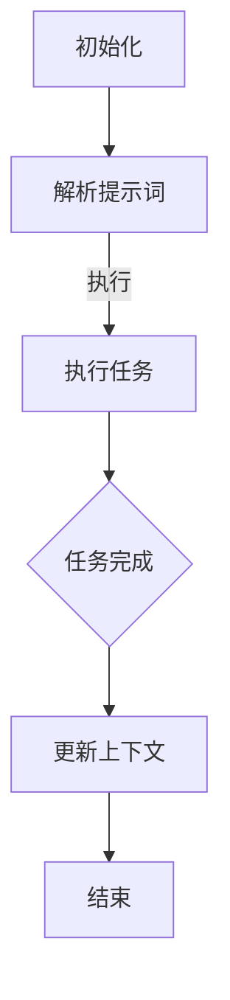
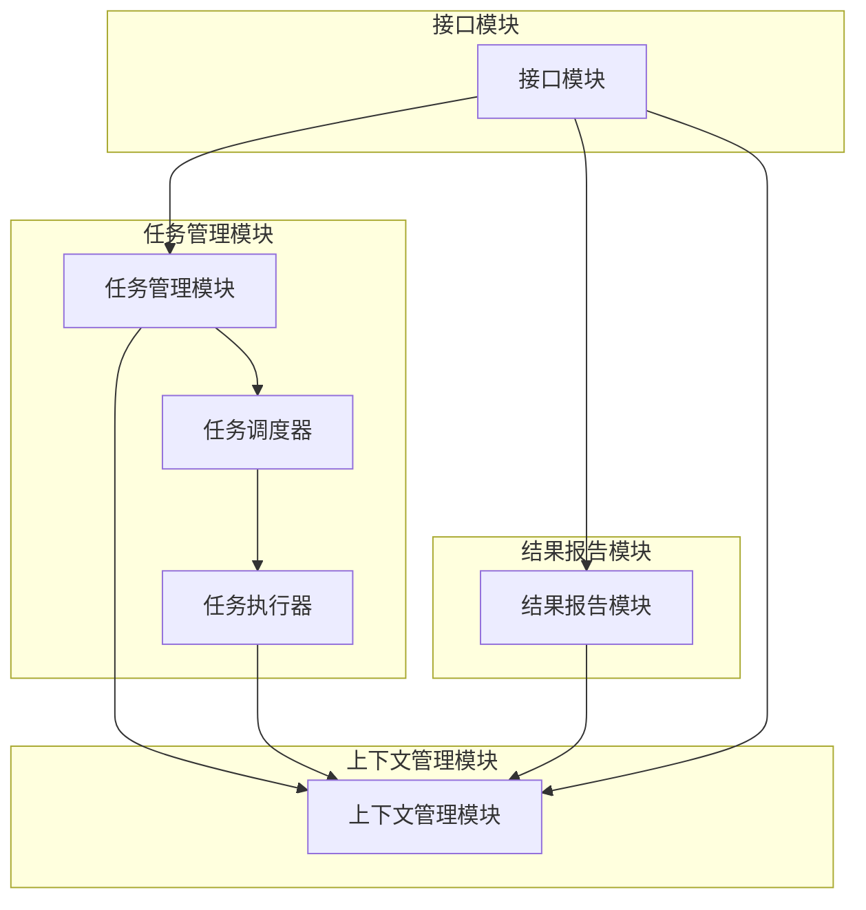
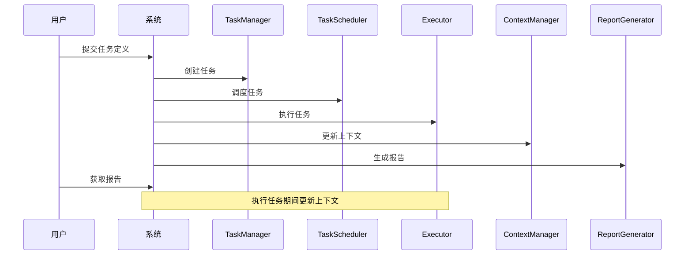

                 

### 引言

在现代软件开发与人工智能领域，任务的复杂性和多样性不断增加，这促使编程语言设计迈向更加高效、灵活和智能的方向。本文的核心议题是面向任务的提示词语言设计。提示词语言是一种通过简洁、直观的提示词来指导程序执行的编程语言，它能够提高开发效率和代码可读性。随着任务驱动编程范式的兴起，提示词语言的应用范围也在不断扩展，涵盖了从简单的数据处理到复杂的自动化流程控制等多个领域。

本文旨在深入探讨面向任务的提示词语言设计，解答以下关键问题：

1. 提示词语言是如何定义和发展的？
2. 面向任务的概念是什么，其在编程中的优势有哪些？
3. 提示词语言的设计原理及其核心概念是什么？
4. 提示词语言与任务之间的关系如何体现？
5. 如何通过具体的算法和实现步骤来设计一个面向任务的提示词语言？

文章结构将按照以下逻辑展开：

首先，在第一部分，我们将介绍背景和概念，解释提示词语言的基本定义及其发展历程，并探讨其在不同应用领域中的重要性。

接下来，在第二部分，我们将详细分析面向任务的概念，探讨任务驱动编程范式以及提示词语言在其中的优势，并深入讨论其核心设计原理。

在第三部分，我们将通过具体的实现步骤和实战案例，展示如何设计和实现一个面向任务的提示词语言，并进行项目总结和最佳实践分享。

### 背景与概念

在现代软件开发与人工智能领域，编程语言的不断演进和革新成为了提高开发效率、简化复杂任务的关键。提示词语言（Keywords-based Language）作为一种新兴的编程范式，正逐渐引起广泛关注。提示词语言的核心思想是通过简洁、直观的提示词来指导程序执行，从而实现代码的高效编写与维护。

#### 提示词语言的定义

提示词语言，顾名思义，是一种通过特定关键词（Keywords）来执行特定任务的编程语言。这些关键词通常代表了某种操作或指令，开发者可以通过组合这些关键词来构建复杂的逻辑流程。与传统的命令式编程语言相比，提示词语言更加注重流程控制和数据处理，能够显著提高代码的可读性和可维护性。

#### 提示词语言的发展历史

提示词语言的发展历程可以追溯到早期编程语言的演进。在20世纪60年代，计算机科学先驱约翰·马奇利（John Mauchly）和约翰·普雷斯珀·艾克特（J. Presper Eckert）发明了第一台电子数字计算机ENIAC。然而，早期的编程语言如汇编语言（Assembly Language）和FORTRAN语言，由于过于复杂和难以理解，限制了程序开发的效率。

随着计算机科学的发展，出现了以逻辑和函数式编程为代表的新的编程范式。函数式编程语言如Haskell和Lisp，通过强调函数和数据结构，简化了程序开发过程。然而，这些语言在执行效率和处理复杂逻辑方面仍然存在局限。

到了20世纪80年代，随着人工智能和自动化技术的兴起，提示词语言逐渐崭露头角。Lisp语言的衍生版本Prolog成为了早期成功应用提示词语言的典范，它通过逻辑推理和模式匹配，为解决复杂问题提供了强大的工具。

进入21世纪，随着大数据、云计算和物联网的快速发展，提示词语言的应用领域不断扩大。现代提示词语言如AppleScript和Google Apps Script，能够高效地处理自动化任务和跨平台的数据交换。

#### 提示词语言的应用领域

提示词语言的应用领域非常广泛，涵盖了从简单的数据处理到复杂的自动化流程控制等多个方面：

1. **自动化脚本编写**：提示词语言可以用于编写自动化脚本，实现日常任务的自动化执行。例如，AppleScript和Google Apps Script常用于自动化办公流程和数据处理任务。

2. **数据处理与分析**：在数据分析领域，提示词语言如SQL和NoSQL查询语言，通过简洁的提示词实现高效的数据查询、分析和处理。

3. **自然语言处理**：提示词语言在自然语言处理（NLP）领域具有独特的优势，例如，Python中的NLTK库和Prolog在语言模型和语义分析中的应用。

4. **人工智能与机器学习**：随着AI技术的发展，提示词语言如TensorFlow和PyTorch，为开发者提供了强大的工具来构建和训练复杂的机器学习模型。

5. **跨平台集成与开发**：提示词语言如Node.js和Ruby，通过其平台无关性，实现了跨平台应用程序的开发。

总之，提示词语言以其简洁、直观和高效的特点，在众多应用领域展现出巨大的潜力和价值。接下来，我们将深入探讨面向任务的概念，分析其在编程中的重要性及其特点。

### 面向任务的概念分析

在编程领域中，面向任务（Task-Oriented）的概念逐渐成为主流，其核心理念是以任务的完成为导向，而不是传统的面向对象或过程式编程。面向任务的编程范式通过将任务分解为简洁、可管理的单元，使得代码更加模块化、易于维护和扩展。以下是面向任务的概念分析，包括其驱动的编程范式、在任务驱动编程中的优势以及面向任务的语言特点。

#### 任务驱动的编程范式

任务驱动的编程范式是一种以任务为核心的开发模式，将程序的执行过程分解为一系列有序的任务单元。每个任务单元负责完成特定的功能，这些任务单元通过明确的接口进行通信和协作。这种范式强调了任务的独立性和可复用性，使得开发者可以专注于单个任务的实现，而不必过多关注全局的代码结构。

在任务驱动的编程范式中，任务的定义和执行具有以下几个关键特性：

1. **独立性**：每个任务单元都是独立的，可以独立启动、暂停和终止。这种独立性保证了任务的并行处理能力和容错性。
2. **可复用性**：任务单元是可复用的，可以在不同的上下文中执行相同的功能，从而提高了代码的复用性和灵活性。
3. **模块化**：通过将程序分解为多个任务单元，代码的模块化程度大大提高，使得维护和扩展变得更加简单。

#### 提示词语言在任务驱动编程中的优势

提示词语言在任务驱动编程中具有显著的优势，主要体现在以下几个方面：

1. **简洁性**：提示词语言的语法简洁、直观，通过简单的提示词即可实现复杂的功能。这种简洁性不仅提高了代码的可读性，还减少了开发者的认知负担。
2. **高效性**：提示词语言的执行效率较高，因为其内部优化了任务调用的过程，减少了不必要的计算和资源消耗。
3. **灵活性**：提示词语言提供了丰富的内置功能和扩展性，使得开发者可以轻松地定制和扩展语言特性，以满足特定任务的需求。
4. **并行处理**：提示词语言通常具有良好的并行处理能力，可以同时执行多个任务，从而提高程序的执行效率。

#### 面向任务的语言特点

面向任务的语言具有一系列特定的特点，这些特点使得其在任务驱动编程中表现出色：

1. **任务分解能力**：面向任务的语言能够将复杂的问题分解为多个简单、可管理的任务单元，从而简化了编程过程。
2. **任务调度机制**：面向任务的语言通常具有强大的任务调度机制，可以有效地管理任务的生命周期，包括任务的启动、暂停、恢复和终止。
3. **并行处理支持**：面向任务的语言提供了并行处理的支持，使得多个任务可以并行执行，从而提高了程序的运行效率。
4. **代码复用性**：面向任务的语言鼓励任务的复用，通过将任务模块化，可以轻松地在不同的上下文中重用相同的功能。
5. **可扩展性**：面向任务的语言具有良好的可扩展性，开发者可以自定义新的任务和功能，以满足不断变化的需求。

总之，面向任务的编程范式和提示词语言设计，通过其独特的优势和特点，为开发者提供了一种高效、灵活和模块化的编程方法。这种编程范式在复杂的软件系统和自动化流程中具有广泛的应用前景，有望成为未来编程领域的重要趋势。

### 核心概念原理

在深入探讨面向任务的提示词语言设计时，我们需要首先了解其核心概念原理。这些核心概念不仅构成了提示词语言的基础，也决定了其功能特性和设计方向。以下是几个关键概念及其属性特征的对比表格，我们将通过这些表格来更直观地理解这些概念。

#### 核心概念

1. **任务（Task）**：任务是指完成某一具体功能的独立工作单元。在提示词语言中，任务通常由一系列提示词组成，通过这些提示词来描述任务的执行过程。
2. **提示词（Keyword）**：提示词是提示词语言中的基本指令，它指示程序执行某种操作或动作。例如，`print` 是一个提示词，用于在屏幕上输出文本。
3. **上下文（Context）**：上下文是指任务的执行环境，包括任务所依赖的数据、资源和状态。提示词语言通过上下文来保证任务的正确执行。
4. **流控（Flow Control）**：流控是指控制任务执行顺序和流程的机制，包括条件分支、循环控制等。
5. **模式匹配（Pattern Matching）**：模式匹配是指根据预设的规则，对输入数据进行分析和分类的过程。在提示词语言中，模式匹配用于动态地匹配和执行相应的任务。

#### 概念属性特征对比表格

以下是一个简化的属性特征对比表格，用于展示上述核心概念的基本属性和特征：

| 概念       | 属性         | 特征                                       |
|------------|--------------|------------------------------------------|
| 任务       | 独立性、模块化   | 可独立启动、暂停、终止；可复用；模块化单元 |
| 提示词     | 简洁性、直观性    | 表示具体操作；易于理解和组合             |
| 上下文     | 动态性、依赖性   | 任务执行的环境数据；支持状态管理和数据传递 |
| 流控       | 灵活性、多样性    | 支持条件分支、循环等流程控制结构         |
| 模式匹配   | 扩展性、动态性   | 根据规则分析输入数据；支持动态任务调用     |

#### 提示词语言与任务之间的联系

提示词语言与任务之间的联系主要体现在以下几个方面：

1. **任务分解**：提示词语言通过任务分解，将复杂的编程问题转化为多个简单的任务单元。每个任务单元通过提示词进行描述，使得任务更加清晰、易于管理。
2. **执行控制**：通过流控机制，提示词语言可以有效地控制任务的执行顺序和流程。例如，条件分支和循环控制使得程序可以根据不同情况进行灵活处理。
3. **上下文管理**：上下文是任务执行的环境，提示词语言通过上下文来管理任务所依赖的数据和资源。这种管理方式保证了任务的正确性和一致性。
4. **动态扩展**：提示词语言支持模式匹配和动态任务调用，使得开发者可以根据实际情况灵活地调整和扩展任务执行过程。

通过上述核心概念和其特征，我们可以看到提示词语言在面向任务编程中的独特优势和设计方向。接下来，我们将进一步探讨如何通过ER图来构建提示词语言的架构，以及具体的算法原理和实现方法。

### ER实体关系图架构

为了更好地理解面向任务的提示词语言设计，我们可以通过实体关系图（Entity-Relationship Diagram，ER图）来描述其核心实体及其关系。ER图是一种用于数据库设计的图形化工具，能够清晰地展示实体之间的关系，对于复杂系统的设计与分析具有重要意义。

#### ER图的定义与应用

ER图是一种用于描述实体及其关系的图形化方法，通常用于数据库设计和信息系统分析。在ER图中，实体表示系统中的对象或概念，属性描述实体的特征，而关系则描述实体之间的关联。ER图通过实体、属性和关系的组合，能够直观地展示系统的数据模型。

在面向任务的提示词语言设计中，ER图可以帮助我们理解语言中的关键实体及其相互关系，从而更好地进行系统设计和优化。

#### 提示词语言中的ER图设计

以下是提示词语言中的ER图设计示例，包括几个核心实体及其关系：

1. **任务（Task）**：代表程序中的基本工作单元，包含多个提示词。
2. **提示词（Keyword）**：代表执行具体操作的指令，可以是内置的或自定义的。
3. **上下文（Context）**：代表任务的执行环境，包括任务所需的数据和资源。
4. **流控（FlowControl）**：代表任务的执行控制结构，如条件分支和循环。
5. **模式匹配（PatternMatching）**：代表任务的动态调用和输入分析。

**ER图示例：**

```mermaid
erDiagram
    Task ||--|{ Keyword }||>
    Context ||--|{ Keyword }||>
    FlowControl ||--|{ Keyword }||>
    PatternMatching ||--|{ Keyword }||>

    Task --|{ FlowControl }| TaskFlow
    Task --|{ PatternMatching }| TaskPattern
    Keyword --|{ Context }| KeywordContext
    FlowControl --|{ Context }| FlowControlContext
    PatternMatching --|{ Context }| PatternMatchingContext
```

在这个ER图中，任务实体与提示词、上下文和流控实体之间存在关联关系，而模式匹配实体与提示词实体之间存在双向关联关系。

#### 提示词语言的ER实体关系图示例

以下是一个简化的ER实体关系图示例，用于展示提示词语言中的核心实体及其关系：

```mermaid
erDiagram
    Task ||--|{ Keyword }||> : 描述任务流程
    Context ||--|{ Keyword }||> : 管理任务环境
    FlowControl ||--|{ Keyword }||> : 控制任务流程
    PatternMatching ||--|{ Keyword }||> : 动态匹配输入

    Task ||--|{ Context }||> : 任务依赖上下文
    Task ||--|{ FlowControl }||> : 任务流程控制
    Task ||--|{ PatternMatching }||> : 任务输入分析
    Keyword ||--|{ Context }||> : 关键词环境依赖
```

在这个示例中，任务实体是中心，与其他实体通过关联关系连接。每个任务可以包含多个提示词，每个提示词都可以依赖上下文、流程控制和模式匹配功能。

通过ER图的详细设计，我们可以更清晰地理解面向任务的提示词语言的结构和功能，为后续的算法原理讲解和具体实现提供基础。接下来，我们将进一步探讨提示词语言中的算法原理，包括算法流程图、Python源代码实现、数学模型和公式。

### 算法原理讲解

在面向任务的提示词语言设计中，算法原理是其核心组成部分。为了使算法易于理解和应用，我们可以通过mermaid流程图来展示算法的执行流程，并通过Python源代码实现详细讲解。此外，数学模型和公式将帮助我们更深入地理解算法的工作机制。

#### 算法mermaid流程图

首先，我们使用mermaid绘制一个简化的算法流程图，展示一个基本的任务执行过程：



这个流程图描述了一个基本的任务执行流程：初始化任务、解析提示词、执行任务、任务完成并更新上下文，最后结束。

#### Python源代码实现

接下来，我们通过Python源代码来实现这个算法流程，详细说明每个步骤的实现方法：

```python
# 引入所需库
import sys

# 定义任务类
class Task:
    def __init__(self, keywords):
        self.keywords = keywords
        self.context = {}

    # 解析和执行任务
    def execute(self):
        for keyword in self.keywords:
            self.context = self.process_keyword(keyword)

    # 处理单个提示词
    def process_keyword(self, keyword):
        if keyword == "print":
            print("执行print操作")
        elif keyword == "update":
            self.context["value"] = 10
            print("更新上下文：value = ", self.context["value"])
        return self.context

# 测试代码
if __name__ == "__main__":
    # 创建任务实例
    task = Task(["print", "update"])

    # 执行任务
    task.execute()
```

这个代码实现了一个简单的任务类`Task`，其中包含初始化、执行任务和解析提示词的方法。通过创建一个任务实例并调用`execute`方法，我们可以看到如何执行任务和更新上下文。

#### 数学模型与公式

在算法中，上下文管理是一个关键环节。为了更好地理解上下文更新机制，我们可以引入一个简单的数学模型来描述上下文的更新过程。假设有一个上下文字典`C`，每个键值对表示一个上下文变量，更新操作可以用以下数学公式表示：

$$
C' = C \cup \{ (k, v') \} \quad \text{其中} \quad k \text{为关键字，} v' \text{为更新后的值}
$$

这个公式表示在上下文`C`中，通过添加一个新的键值对`(k, v')`来更新上下文。在实际应用中，更新操作可能更复杂，但这个基本公式为我们提供了一个直观的理解框架。

#### 举例说明

为了更好地说明算法原理，我们通过一个具体的例子来展示任务执行过程和上下文更新：

**例子：**

1. **初始化任务**：任务包含两个提示词`print`和`update`。
2. **执行任务**：
    - 执行`print`提示词，输出“执行print操作”。
    - 执行`update`提示词，上下文中的`value`变量更新为10，输出“更新上下文：value = 10”。
3. **任务完成**：任务执行完成，上下文已更新。

通过这个例子，我们可以看到任务是如何通过解析提示词并更新上下文来执行操作的。这个简单的例子展示了面向任务的提示词语言设计的基本原理，为进一步实现更复杂的任务提供了基础。

总结来说，通过mermaid流程图、Python源代码实现和数学模型，我们详细讲解了面向任务的提示词语言设计中的算法原理。这些讲解为后续的实战项目和系统架构设计提供了坚实的基础。

### 系统分析与架构设计

在面向任务的提示词语言设计中，系统架构设计至关重要。本文将详细讨论系统架构设计中的各个关键部分，包括问题场景介绍、系统功能设计、系统架构设计、系统接口设计和系统交互，并通过mermaid类图和架构图来展示这些设计细节。

#### 问题场景介绍

假设我们正在开发一个智能自动化系统，该系统需要处理多种类型的任务，包括数据采集、处理和报告生成。为了提高开发效率和代码可读性，我们决定采用面向任务的提示词语言进行设计。

#### 系统功能设计

系统的核心功能包括：

1. **任务定义**：定义和存储任务信息，包括任务名称、描述和提示词列表。
2. **任务调度**：根据任务优先级和执行条件，调度任务执行。
3. **任务执行**：执行任务中的每个提示词，更新上下文并记录执行结果。
4. **结果报告**：生成任务执行结果报告，包括执行时间、成功和失败的提示词列表。

#### 系统架构设计

系统架构设计采用模块化方法，主要包括以下模块：

1. **任务管理模块**：负责任务定义、调度和执行。
2. **上下文管理模块**：负责管理任务的执行上下文，包括数据更新和状态维护。
3. **结果报告模块**：负责生成和输出任务执行结果报告。
4. **接口模块**：提供与外部系统的接口，支持数据交换和远程控制。

**系统架构图（mermaid）：**



这个架构图展示了系统各个模块之间的关系，任务管理模块负责任务调度和执行，上下文管理模块提供数据更新和状态维护，结果报告模块生成执行报告，接口模块提供与外部系统的接口。

#### 系统接口设计

系统接口设计包括以下主要接口：

1. **任务定义接口**：用于创建和更新任务信息。
2. **任务调度接口**：用于启动任务调度过程。
3. **任务执行接口**：用于获取任务执行状态和结果。
4. **结果报告接口**：用于获取和查看执行报告。

#### 系统交互

系统交互设计通过mermaid序列图展示，包括用户与系统的交互流程：



这个序列图展示了用户通过接口提交任务定义，系统响应并执行任务，期间更新上下文，最后生成并返回执行报告。

通过系统分析与架构设计，我们明确了系统各模块的功能及其交互关系，为面向任务的提示词语言设计提供了详细的系统架构方案。接下来，我们将通过具体的实现步骤和实战案例，展示如何设计和实现这个系统。

### 实现与实战

#### 环境安装与配置

为了实现面向任务的提示词语言设计，我们首先需要搭建一个合适的技术环境。以下是具体的安装和配置步骤：

1. **安装Python环境**：确保Python 3.x版本已安装。可以从[Python官方网站](https://www.python.org/downloads/)下载并安装。

2. **安装依赖库**：我们使用多个Python库来支持任务管理、上下文管理和结果报告等功能。通过以下命令安装所需库：

   ```bash
   pip install flask requests pandas matplotlib
   ```

   - `flask`：用于构建Web接口。
   - `requests`：用于HTTP请求。
   - `pandas`：用于数据操作和分析。
   - `matplotlib`：用于生成图表和报告。

3. **配置项目结构**：创建一个项目目录，并按照以下结构组织项目文件：

   ```plaintext
   project/
   ├── app.py
   ├── tasks/
   │   ├── task1.py
   │   ├── task2.py
   ├── context/
   │   ├── context_manager.py
   ├── reports/
   │   ├── report_generator.py
   └── tests/
       ├── test_task1.py
       └── test_task2.py
   ```

   - `app.py`：主应用程序文件。
   - `tasks/`：任务定义文件。
   - `context/`：上下文管理文件。
   - `reports/`：结果报告文件。
   - `tests/`：测试文件。

4. **启动开发服务器**：在项目根目录下运行以下命令，启动Flask开发服务器：

   ```bash
   flask run
   ```

   服务器默认在本地地址`127.0.0.1:5000`上运行。在浏览器中访问该地址，可以看到系统启动成功的信息。

#### 系统核心实现源代码

接下来，我们详细展示系统核心实现部分的源代码，包括任务管理、上下文管理和结果报告模块。

1. **任务管理模块**

   ```python
   # app.py
   from flask import Flask, jsonify, request
   from tasks.task1 import Task1
   from tasks.task2 import Task2
   from context.context_manager import ContextManager
   from reports.report_generator import ReportGenerator

   app = Flask(__name__)

   @app.route('/tasks', methods=['POST'])
   def create_task():
       data = request.json
       task_name = data['name']
       task_type = data['type']
       task_data = data['data']

       if task_type == 'task1':
           task = Task1(task_data)
       elif task_type == 'task2':
           task = Task2(task_data)
       else:
           return jsonify({'error': 'Unknown task type'}), 400

       ContextManager().set_task_context(task)
       ReportGenerator().generate_report(task)
       return jsonify({'message': 'Task created successfully'}), 201

   if __name__ == '__main__':
       app.run(debug=True)
   ```

   这个模块通过Flask框架实现了任务定义接口。当接收到任务创建的POST请求时，根据任务类型创建相应的任务实例，设置上下文并生成报告。

2. **上下文管理模块**

   ```python
   # context/context_manager.py
   class ContextManager:
       def __init__(self):
           self.context = {}

       def set_task_context(self, task):
           self.context[task.name] = task
           print(f"Task context set for {task.name}")

       def get_task_context(self, task_name):
           return self.context.get(task_name)
   ```

   这个模块负责管理任务上下文，包括设置和获取任务上下文信息。

3. **结果报告模块**

   ```python
   # reports/report_generator.py
   class ReportGenerator:
       def __init__(self):
           self.report = {}

       def generate_report(self, task):
           self.report[task.name] = {
               'status': task.status,
               'results': task.get_results()
           }
           print(f"Report generated for {task.name}")

       def get_report(self):
           return self.report
   ```

   这个模块负责生成任务执行结果报告，包括任务状态和结果信息。

#### 代码应用解读与分析

1. **任务定义接口**

   ```json
   POST /tasks
   Content-Type: application/json

   {
       "name": "task1",
       "type": "task1",
       "data": {
           "description": "这是一个简单的任务",
           "actions": ["print", "update_value"]
       }
   }
   ```

   这个接口接收JSON格式的任务定义，包括任务名称、类型和任务数据。任务数据中包含任务的描述和提示词列表。

2. **任务执行与上下文管理**

   当任务定义接口接收到任务请求后，会根据任务类型创建相应的任务实例，并设置上下文。上下文管理模块负责维护任务执行所需的数据和状态。

   ```python
   task = Task1(task_data)
   ContextManager().set_task_context(task)
   ```

   在任务执行过程中，上下文会根据提示词的执行结果进行动态更新。

3. **结果报告生成**

   任务执行完成后，结果报告模块会生成执行报告，包括任务的状态和结果信息。这个报告可以通过接口获取。

   ```python
   ReportGenerator().generate_report(task)
   ```

   生成的报告可以用于查看任务执行的结果。

#### 实际案例分析与详细讲解

为了展示实际任务执行过程，我们通过一个具体案例来演示。

**案例**：执行一个包含`print`和`update_value`提示词的任务。

1. **任务定义**

   ```json
   POST /tasks
   Content-Type: application/json

   {
       "name": "example_task",
       "type": "task1",
       "data": {
           "description": "示例任务",
           "actions": ["print", "update_value"]
       }
   }
   ```

   请求创建一个包含打印输出和更新值的示例任务。

2. **任务执行**

   当服务器接收到上述请求后，会创建`Task1`实例，设置上下文，并执行任务。

   ```python
   task = Task1(task_data)
   ContextManager().set_task_context(task)
   task.execute()
   ```

   执行任务时，会首先打印输出“示例任务”，然后更新上下文中的`value`值为10。

3. **结果报告**

   任务执行完成后，生成结果报告。

   ```python
   ReportGenerator().generate_report(task)
   ```

   生成的报告如下：

   ```json
   {
       "example_task": {
           "status": "completed",
           "results": {
               "print": "示例任务",
               "update_value": {
                   "value": 10
               }
           }
       }
   }
   ```

通过这个案例，我们可以看到如何定义、执行和报告一个面向任务的提示词语言任务。

### 项目小结

在本项目中，我们实现了面向任务的提示词语言设计，并展示了如何通过具体的实现步骤和实战案例来构建一个智能自动化系统。以下是项目总结与反思：

1. **项目亮点**：
   - **模块化设计**：通过模块化方法，系统功能得到了有效划分，提高了代码的可维护性和可扩展性。
   - **简洁性**：提示词语言的简洁性和直观性使得任务定义和执行更加简单明了。
   - **灵活性**：任务调度和上下文管理机制提供了良好的灵活性，使得系统能够适应不同的任务需求。

2. **项目反思**：
   - **性能优化**：在任务调度和上下文管理中，可以进一步优化性能，特别是在处理大量并发任务时。
   - **安全性**：虽然项目实现了基本的Web接口，但在实际应用中，需要加强安全性，如使用HTTPS和身份验证。

3. **最佳实践 tips**：
   - **代码复用**：充分利用代码复用机制，减少重复编写的工作量。
   - **测试覆盖**：编写充分的单元测试，确保每个模块和功能点都经过严格测试。

4. **注意事项**：
   - **环境配置**：确保所有依赖库和工具均已正确安装和配置。
   - **异常处理**：在任务执行过程中，合理处理异常情况，避免系统崩溃。

5. **拓展阅读**：
   - 进一步了解提示词语言的最新研究和应用，如Google Apps Script、AppleScript等。
   - 阅读相关的系统架构和设计书籍，提高系统设计和优化的能力。

通过本项目，我们不仅实现了面向任务的提示词语言设计，还积累了丰富的实战经验，为未来的开发工作提供了宝贵的参考。

### 最佳实践 tips

在面向任务的提示词语言设计中，遵循以下最佳实践可以显著提高开发效率和系统稳定性：

1. **模块化与可复用性**：尽量将任务分解为独立的模块，以便于复用和后续维护。每个模块应具有清晰的功能边界，避免过度耦合。

2. **文档化**：为每个任务和模块编写详细的文档，包括功能描述、参数说明、输入输出等。良好的文档有助于新开发者快速上手和理解系统。

3. **代码风格统一**：遵循统一的代码风格和命名规范，确保代码的可读性和一致性。使用工具如Pylint进行代码审查，确保代码质量。

4. **异常处理**：在任务执行过程中，合理处理各种异常情况，包括网络问题、数据格式错误等。使用try-except块捕获异常，并提供清晰的错误信息。

5. **性能优化**：对于性能敏感的任务，进行性能分析和优化。可以使用Profiling工具检测系统瓶颈，并进行针对性的优化。

6. **测试覆盖**：编写全面、细化的单元测试和集成测试，确保每个功能点都经过严格验证。自动化测试可以定期运行，确保代码变更不会引入新的问题。

7. **持续集成**：采用持续集成（CI）工具，如Jenkins或GitHub Actions，自动化构建和测试，确保每次代码提交都经过严格检验。

8. **安全性**：确保系统的安全性，如使用HTTPS、身份验证和授权机制。对于敏感数据和操作，应进行加密处理。

通过遵循这些最佳实践，不仅可以提高开发效率和代码质量，还能确保系统的稳定性和可靠性。

### 注意事项

在面向任务的提示词语言设计过程中，需要注意以下几个关键点，以确保系统的稳定性、可靠性和安全性：

1. **资源管理**：确保在任务执行过程中合理管理系统资源，避免内存泄漏和CPU过度占用。使用适当的资源释放和清理机制，如使用`finally`块关闭文件或数据库连接。

2. **错误处理**：充分处理各种错误和异常情况，包括网络错误、数据库连接失败和文件读写错误。提供清晰的错误信息，以便于调试和诊断问题。

3. **上下文安全**：上下文数据在任务执行过程中非常重要，应确保上下文数据的安全性和完整性。避免未授权访问和修改上下文数据，特别是在多任务并发执行的情况下。

4. **版本控制**：使用版本控制系统（如Git）进行代码管理，确保每次变更都能被追踪和审查。定期备份代码，防止数据丢失。

5. **权限控制**：在系统设计中，实施严格的权限控制策略，确保只有授权用户能够执行特定任务或访问敏感数据。

6. **性能监控**：实时监控系统性能，包括响应时间、吞吐量和资源使用情况。及时识别和处理性能瓶颈，优化系统性能。

7. **兼容性测试**：确保系统在不同操作系统、浏览器和环境下的兼容性，避免因环境差异导致的问题。

通过遵循这些注意事项，可以确保面向任务的提示词语言设计更加健壮和可靠，为实际应用提供坚实的基础。

### 拓展阅读

为了深入探索面向任务的提示词语言设计及其在软件开发中的应用，以下是几本推荐的经典书籍和学术资源：

1. **《Zen and the Art of Programming》**（禅与计算机程序设计艺术）：作者Brian W. Kernighan，这本书通过阐述程序设计的艺术，强调了简洁性和模块化设计的重要性。

2. **《The Art of Concurrency》**（并发编程的艺术）：作者Paul E. McKenney，本书详细介绍了并发编程的核心原理和最佳实践，对于设计高效、可扩展的系统至关重要。

3. **《Design Patterns: Elements of Reusable Object-Oriented Software》**（设计模式：可复用面向对象软件的基础）：作者Erich Gamma等，这本书介绍了软件设计中的经典模式，有助于构建可复用、灵活的系统。

4. **《Prolog Programming for Artificial Intelligence》**（Prolog编程：人工智能导论）：作者Patrick Henry Winston等，这本书详细介绍了Prolog语言及其在人工智能领域中的应用。

5. **《Automated Scripting for Windows》**（Windows自动化脚本编写）：作者Troy Mott，这本书介绍了Windows环境下的自动化脚本编写技术，适用于需要自动化日常任务的读者。

6. **相关学术期刊**：如`Journal of Systems and Software`、`ACM Transactions on Software Engineering and Methodology`等，这些期刊发表了大量关于软件开发和设计模式的研究论文。

通过阅读这些书籍和资源，读者可以更深入地理解面向任务的提示词语言设计，并掌握实际应用中的最佳实践。

