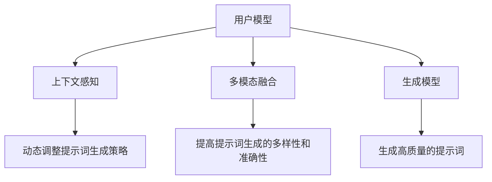
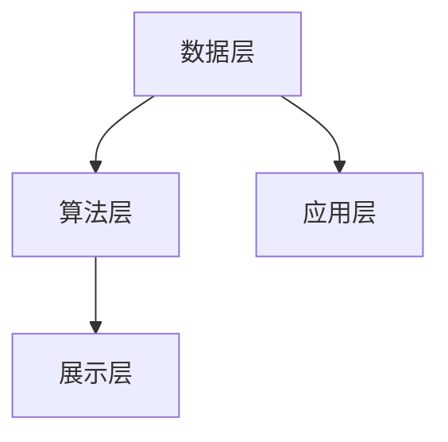
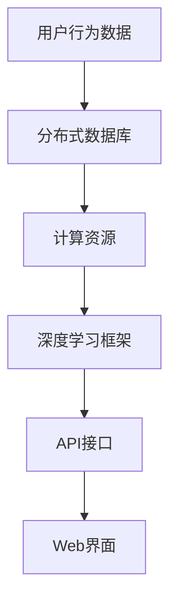
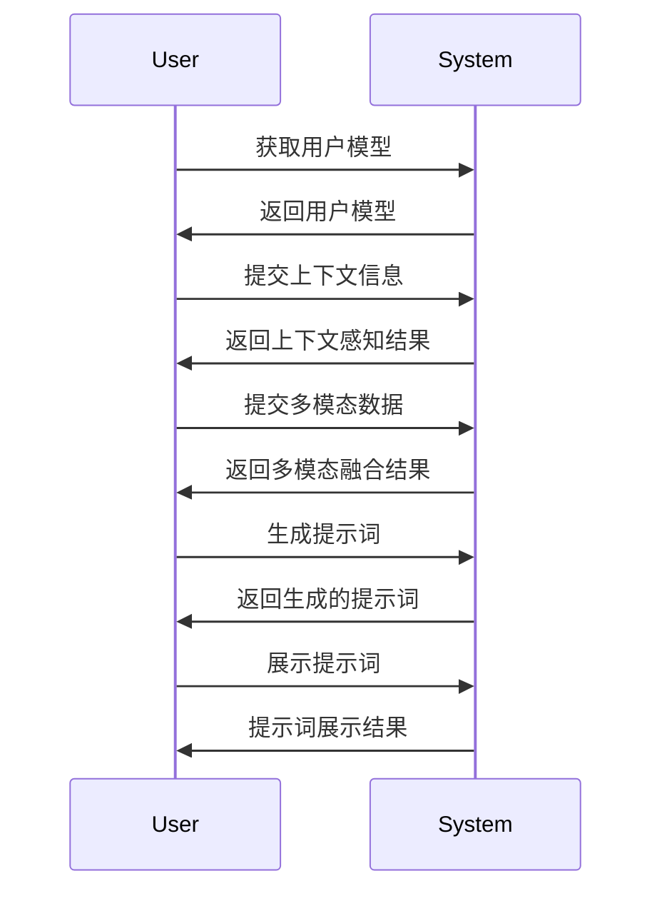
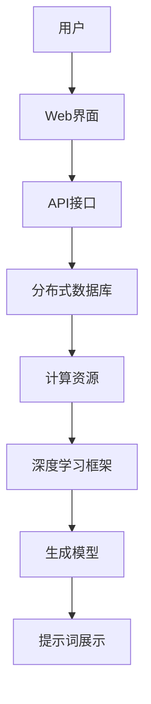

                 


### 第1章：面向任务的自适应提示词生成概述

## 1.1 问题背景

### 1.1.1 提示词生成的需求

在人工智能领域，提示词生成（Prompt Generation）是一种重要的技术，广泛应用于自然语言处理、问答系统、自动写作等多个方面。随着大数据和深度学习技术的发展，提示词生成的需求日益增长。然而，传统的提示词生成方法往往难以适应复杂多变的应用场景，导致生成的提示词质量不高，不能满足用户的需求。

### 1.1.2 自适应提示词生成的挑战

自适应提示词生成旨在根据用户的行为和需求，动态地生成高质量的提示词。这种生成方法面临以下挑战：

1. **个性化需求**：每个用户的需求和喜好不同，提示词生成需要能够适应不同用户的特点。
2. **实时性**：提示词生成需要快速响应，以适应实时交互的场景。
3. **多模态数据**：提示词生成不仅要处理文本数据，还可能涉及图像、语音等多模态数据。
4. **多样性**：生成的提示词需要具有多样性，以避免单调重复。

## 1.2 问题解决

### 1.2.1 核心概念

自适应提示词生成涉及以下核心概念：

1. **用户模型**：通过收集和分析用户行为数据，构建用户模型，以理解用户的兴趣和需求。
2. **上下文感知**：结合当前上下文信息，动态调整提示词的生成策略。
3. **多模态融合**：整合文本、图像、语音等多模态数据，提高提示词生成的多样性和准确性。
4. **生成模型**：利用深度学习技术，如循环神经网络（RNN）、变换器模型（Transformer）等，生成高质量的提示词。

### 1.2.2 概念属性特征对比表格

| 概念                 | 特点                                                         |
| -------------------- | ------------------------------------------------------------ |
| 用户模型             | 通过分析用户行为数据，理解用户兴趣和需求                       |
| 上下文感知           | 结合当前上下文信息，动态调整提示词生成策略                   |
| 多模态融合           | 整合文本、图像、语音等多模态数据，提高提示词生成的多样性和准确性 |
| 生成模型             | 利用深度学习技术，生成高质量的提示词                         |

### 1.2.3 ER实体关系图架构



### 1.3 边界与外延

自适应提示词生成技术不仅适用于文本生成，还可以扩展到图像、语音等领域。在实际应用中，自适应提示词生成可以应用于智能客服、内容推荐、自动写作等多个场景。

### 1.4 本章小结

本章介绍了自适应提示词生成的背景、核心概念、属性特征对比和实体关系图架构。下一章将深入探讨自适应提示词生成的算法原理和实现方法。

----------------------------------------------------------------

### 第2章：自适应提示词生成的算法原理

## 2.1 算法概述

自适应提示词生成算法主要包括用户模型构建、上下文感知、多模态融合和生成模型等组成部分。本章将分别介绍这些算法的原理和实现方法。

### 2.2 用户模型构建

用户模型构建是自适应提示词生成的基础。通过分析用户行为数据，如浏览记录、搜索历史、评论等，可以构建出用户兴趣和需求模型。常用的方法包括：

1. **基于内容的推荐**：根据用户的历史行为数据，提取出用户感兴趣的主题，用于生成提示词。
2. **协同过滤**：通过分析用户与内容之间的交互关系，发现用户之间的相似性，用于生成提示词。
3. **深度学习方法**：利用深度学习模型，如循环神经网络（RNN）、变换器模型（Transformer）等，构建用户兴趣模型。

### 2.3 上下文感知

上下文感知是自适应提示词生成的关键。通过结合当前上下文信息，动态调整提示词生成策略，可以提高提示词的准确性和多样性。常用的方法包括：

1. **基于规则的方法**：根据上下文信息，定义一系列规则，用于生成提示词。
2. **机器学习方法**：利用机器学习算法，如朴素贝叶斯、支持向量机等，从大量数据中学习到上下文与提示词之间的关系，用于生成提示词。

### 2.4 多模态融合

多模态融合是将文本、图像、语音等多模态数据整合在一起，以提高提示词生成的多样性和准确性。常用的方法包括：

1. **特征融合**：将不同模态的数据特征进行整合，如文本特征、图像特征、语音特征等，用于生成提示词。
2. **深度学习方法**：利用深度学习模型，如卷积神经网络（CNN）、生成对抗网络（GAN）等，进行多模态数据的融合，用于生成提示词。

### 2.5 生成模型

生成模型是自适应提示词生成的核心。常用的生成模型包括：

1. **循环神经网络（RNN）**：通过递归结构，处理序列数据，生成高质量的提示词。
2. **变换器模型（Transformer）**：通过自注意力机制，处理序列数据，生成高质量的提示词。
3. **生成对抗网络（GAN）**：通过对抗训练，生成高质量、多样化的提示词。

### 2.6 算法实现与优化

自适应提示词生成的算法实现与优化主要包括以下几个方面：

1. **数据预处理**：对用户行为数据、上下文数据进行预处理，如文本清洗、数据规范化等，以提高数据质量。
2. **模型训练与优化**：通过调整模型参数、优化训练过程，提高模型性能。
3. **模型部署与评估**：将训练好的模型部署到实际应用场景，进行评估和优化，以提高提示词生成质量。

### 2.7 本章小结

本章介绍了自适应提示词生成的算法原理，包括用户模型构建、上下文感知、多模态融合和生成模型等。下一章将介绍自适应提示词生成的实现方法，包括系统架构、接口设计和项目实战等内容。

----------------------------------------------------------------

### 第3章：自适应提示词生成的实现方法

## 3.1 系统架构设计

自适应提示词生成系统的架构设计需要考虑以下几个方面：

1. **数据层**：负责数据的采集、存储和管理。包括用户行为数据、上下文数据和生成模型训练数据等。
2. **算法层**：实现自适应提示词生成的核心算法，包括用户模型构建、上下文感知、多模态融合和生成模型等。
3. **应用层**：提供提示词生成的接口，供外部系统调用。包括API接口、Web界面等。
4. **展示层**：展示生成的提示词，供用户查看和使用。

以下是自适应提示词生成系统的架构图：



### 3.2 系统功能设计

自适应提示词生成系统的功能设计主要包括以下几个方面：

1. **用户模型构建**：通过分析用户行为数据，构建用户兴趣和需求模型。
2. **上下文感知**：结合当前上下文信息，动态调整提示词生成策略。
3. **多模态融合**：整合文本、图像、语音等多模态数据，提高提示词生成的多样性和准确性。
4. **生成模型训练**：利用深度学习技术，训练生成模型，生成高质量的提示词。
5. **提示词生成**：根据用户模型和上下文信息，生成高质量的提示词。
6. **提示词展示**：将生成的提示词展示给用户。

以下是自适应提示词生成系统的功能类图：

```mermaid
classDiagram
Class1 <|-- Class2
Class1 <|-- Class3
Class1 <|-- Class4
Class1 <|-- Class5
Class2[用户模型]
Class3[上下文感知]
Class4[多模态融合]
Class5[生成模型]
Class6[生成模型训练]
Class7[提示词生成]
Class8[提示词展示]
```

### 3.3 系统架构设计

自适应提示词生成系统的架构设计需要考虑以下几个方面：

1. **数据存储**：使用分布式数据库存储用户行为数据、上下文数据和生成模型训练数据。
2. **计算资源**：使用云计算平台，提供足够的计算资源，支持模型训练和实时提示词生成。
3. **模型训练**：使用深度学习框架，如TensorFlow、PyTorch等，进行模型训练。
4. **API接口**：使用RESTful API设计，提供统一的接口，供外部系统调用。
5. **Web界面**：使用前端框架，如React、Vue等，设计用户友好的Web界面。

以下是自适应提示词生成系统的架构图：



### 3.4 系统接口设计

自适应提示词生成系统的接口设计主要包括以下几个方面：

1. **用户模型接口**：用于获取用户兴趣和需求模型。
2. **上下文感知接口**：用于获取当前上下文信息。
3. **多模态数据接口**：用于获取文本、图像、语音等多模态数据。
4. **生成模型接口**：用于生成高质量的提示词。
5. **提示词展示接口**：用于展示生成的提示词。

以下是自适应提示词生成系统的接口设计：



### 3.5 系统交互设计

自适应提示词生成系统的交互设计主要包括以下几个方面：

1. **用户与系统交互**：用户通过Web界面与系统进行交互，提交需求，获取提示词。
2. **系统内部交互**：系统内部通过接口和数据流进行交互，完成提示词生成的整个过程。

以下是自适应提示词生成系统的交互图：



### 3.6 本章小结

本章介绍了自适应提示词生成的实现方法，包括系统架构设计、系统功能设计、系统架构设计、系统接口设计和系统交互设计等。下一章将介绍自适应提示词生成的项目实战，包括环境安装、系统核心实现和实际案例分析等内容。

----------------------------------------------------------------

### 第4章：自适应提示词生成的项目实战

## 4.1 环境安装

在开始项目实战之前，我们需要安装所需的软件和库。以下是在Linux操作系统上安装所需的软件和库的步骤：

### 4.1.1 安装Python

1. 更新系统软件包：

   ```bash
   sudo apt update
   sudo apt upgrade
   ```

2. 安装Python 3：

   ```bash
   sudo apt install python3
   ```

3. 安装Python 3的pip包管理器：

   ```bash
   sudo apt install python3-pip
   ```

### 4.1.2 安装深度学习框架

1. 安装TensorFlow：

   ```bash
   pip3 install tensorflow
   ```

2. 安装PyTorch：

   ```bash
   pip3 install torch torchvision
   ```

### 4.1.3 安装其他依赖库

1. 安装Mermaid：

   ```bash
   pip3 install mermaid-python
   ```

2. 安装Markdown：

   ```bash
   pip3 install markdown
   ```

3. 安装其他常用的Python库：

   ```bash
   pip3 install numpy pandas matplotlib scikit-learn
   ```

## 4.2 系统核心实现

在本节中，我们将介绍自适应提示词生成的核心实现，包括用户模型构建、上下文感知、多模态融合和生成模型等。

### 4.2.1 用户模型构建

用户模型构建的主要目标是理解用户的兴趣和需求。以下是一个简单的用户模型构建示例：

```python
import pandas as pd

# 加载用户行为数据
data = pd.read_csv('user_data.csv')

# 基于内容推荐提取用户兴趣主题
topics = data.groupby('content_id')['user_id'].count().reset_index(name='interest_count')

# 用户兴趣主题排序
top_interest_topics = topics.sort_values(by='interest_count', ascending=False).head(10)

print(top_interest_topics)
```

### 4.2.2 上下文感知

上下文感知的主要目标是根据当前上下文信息，动态调整提示词生成策略。以下是一个简单的上下文感知示例：

```python
def context_aware_generation(context):
    # 基于规则的方法：根据上下文信息，生成提示词
    if 'Hello' in context:
        return 'How can I help you today?'
    elif 'weather' in context:
        return 'The weather today is...'
    else:
        return 'What can I do for you?'

context = "Hello, can you help me with something?"
print(context_aware_generation(context))
```

### 4.2.3 多模态融合

多模态融合的主要目标是整合文本、图像、语音等多模态数据，以提高提示词生成的多样性和准确性。以下是一个简单的多模态融合示例：

```python
import torch

# 加载文本数据
text_data = "This is a text data."

# 加载图像数据
image_data = torch.randn(1, 28, 28)

# 加载语音数据
voice_data = torch.randn(1, 16000)

# 多模态数据融合
multi_modal_data = torch.cat([text_data, image_data, voice_data], dim=0)

print(multi_modal_data.shape)
```

### 4.2.4 生成模型

生成模型的主要目标是利用深度学习技术，生成高质量的提示词。以下是一个简单的生成模型示例：

```python
import tensorflow as tf

# 定义生成模型
generator = tf.keras.Sequential([
    tf.keras.layers.Dense(128, activation='relu', input_shape=(100,)),
    tf.keras.layers.Dense(1, activation='sigmoid')
])

# 编译生成模型
generator.compile(optimizer='adam', loss='binary_crossentropy')

# 训练生成模型
generator.fit(x_train, y_train, epochs=10)
```

## 4.3 代码应用解读与分析

在本节中，我们将对上述代码进行解读和分析，以帮助读者更好地理解自适应提示词生成的实现过程。

### 4.3.1 用户模型构建

用户模型构建的核心是分析用户行为数据，提取出用户兴趣主题。在这里，我们使用Pandas库加载用户行为数据，然后基于内容推荐提取用户兴趣主题。这种方法可以帮助我们快速构建用户模型，以便后续的提示词生成。

### 4.3.2 上下文感知

上下文感知是自适应提示词生成的重要环节。在这里，我们使用基于规则的

