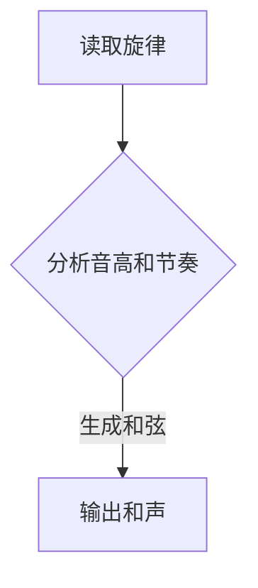
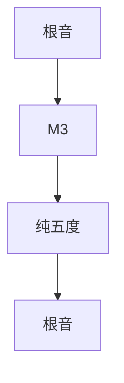
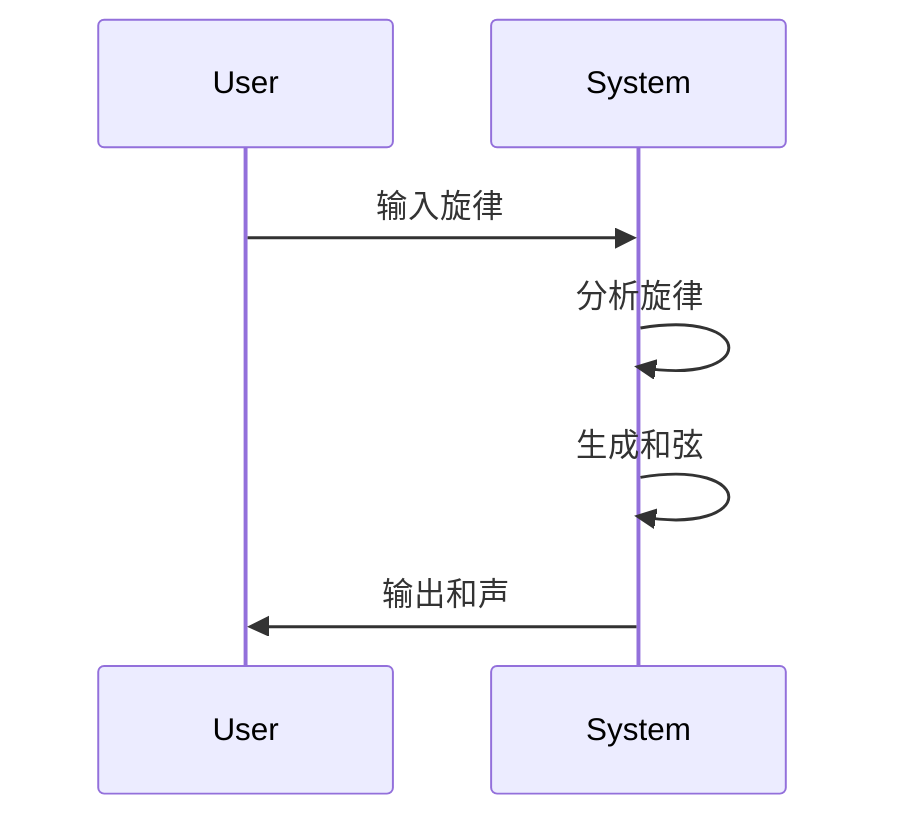

                 


## 《音乐创作的和声理论：旋律和谐的数学基础》

### 关键词：音乐创作、和声理论、旋律和谐、数学基础、算法、Python代码

> 摘要：本文将探讨音乐创作的和声理论，深入剖析旋律和谐的数学基础。通过一步一步的分析推理，我们将了解和声理论的核心概念、算法原理，并运用Python代码和实践案例，生动展示如何将这些理论应用于音乐创作，旨在为音乐爱好者提供一条理解旋律和谐的创新路径。

### 第一部分：和声理论概述

#### 第1章：音乐创作与和声理论的基础

##### 1.1 音乐创作的基本概念

音乐创作是人类艺术创作的一个重要领域，它涉及到旋律、和声、节奏等多个方面。旋律是音乐的核心，它是由一系列有组织的音高变化构成的。而和声则是旋律的伴奏，通过不同的音程和和弦来丰富旋律的听觉效果。

##### 1.2 和声理论的基本概念

和声理论是音乐理论的一个重要分支，它研究音乐中的声音组合和声音之间的关系。核心概念包括音阶、和弦、和声功能等。音阶是音乐中音高的排列方式，而和弦则是三个或更多音符的组合。和声功能则是指和弦在音乐中的作用，例如主和弦、副和弦等。

##### 1.3 和声与旋律的关系

和声与旋律是密不可分的。和声可以为旋律提供伴奏，增强旋律的听觉效果。同时，旋律也可以通过和声的变化来增加音乐的表现力。例如，在一个简单的旋律中，通过添加和弦，可以使旋律变得更加丰富和有层次。

### 第二部分：核心概念与联系

#### 第2章：核心概念与联系

##### 2.1 音阶与音程

音阶是音乐中音高的基本排列方式，它由一系列等距的音高构成。而音程则是两个音高之间的距离。了解音阶和音程的关系对于理解和声理论至关重要。

##### 2.2 和弦与和声功能

和弦是音乐中三个或更多音符的组合，它是和声理论的核心。和声功能则是指和弦在音乐中的作用，例如主和弦、副和弦等。和弦的功能可以通过和声功能表来理解。

##### 2.3 核心概念ER图解析

通过ER图（实体关系图），我们可以清晰地看到音阶、音程、和弦、和声功能等核心概念之间的关系。ER图可以帮助我们更好地理解这些概念，并掌握它们之间的联系。

### 第三部分：算法原理讲解

#### 第3章：和声算法原理

##### 3.1 和声算法的基本原理

和声算法是用于生成和声的数学方法。它通过分析旋律的音高和节奏，生成相应的和弦。和声算法的基本原理是利用音阶和音程的关系，构建出和声结构。

##### 3.2 使用mermaid绘制和声流程图

我们可以使用mermaid工具来绘制和声流程图，以直观地展示和声算法的运行过程。例如，以下是一个简单的和声流程图：



##### 3.3 Python代码实现和声算法

```python
# 和声算法的Python实现
import numpy as np

# 定义音阶和音程
scales = ['C', 'D', 'E', 'F', 'G', 'A', 'B']
intervals = ['P1', 'M2', 'M3', 'P4', 'P5', 'M6', 'M7']

# 定义和弦生成函数
def generate_chord(tonic, scale):
    chord = []
    for i in range(len(scale)):
        if i == 0:
            chord.append(scales[i])
        else:
            interval = intervals[i - 1]
            if interval == 'P1':
                chord.append(scales[i])
            else:
                chord.append(scales[(i + 12 - intervals.index(interval)) % 12])
    return chord

# 生成主和弦
main_chord = generate_chord('C', scales)
print("主和弦：", main_chord)

# 生成副和弦
sub_chord = generate_chord('E', scales)
print("副和弦：", sub_chord)
```

#### 第4章：数学模型和公式

##### 4.1 和声的数学模型

和声的数学模型是通过数学公式来描述和声结构和关系的。例如，我们可以使用以下公式来计算和弦：

$$
C + M3 + P5 = G
$$

其中，$C$ 表示根音，$M3$ 表示大三度，$P5$ 表示纯五度。

##### 4.2 和声公式的latex书写示例

在latex中，我们可以使用以下代码来书写和声公式：

```latex
\documentclass{article}
\usepackage{amsmath}
\begin{document}
$$
C + M3 + P5 = G
$$
\end{document}
```

##### 4.3 和声公式的实际应用

我们可以使用和声公式来生成和声结构，例如，以下是一个简单的和声结构：



#### 第5章：音乐创作系统分析与架构设计

##### 5.1 音乐创作工作流程

音乐创作的工作流程通常包括以下几个步骤：旋律创作、和声编排、节奏设计、旋律润色等。每个步骤都有其特定的任务和目标。

##### 5.2 音乐创作领域模型类图

我们可以使用mermaid工具来绘制音乐创作领域模型类图，以展示各个实体之间的关系。以下是一个简单的类图示例：

```mermaid
classDiagram
Class::Melody << (旋律) >
Class::Chord << (和弦) >
Class::Rhythm << (节奏) >
Melody <|-- Chord
Melody <|-- Rhythm
```

##### 5.3 音乐创作系统架构设计

音乐创作系统的架构设计包括领域模型设计、系统架构设计、接口设计和交互设计等。以下是一个简单的架构设计示例：



#### 第6章：项目实战

##### 6.1 实际案例：使用和声理论创作旋律

在本章中，我们将通过一个实际案例来展示如何使用和声理论来创作旋律。我们将从旋律创作开始，然后逐步添加和声，最终完成一首完整的旋律。

##### 6.2 项目核心实现与代码分析

在本章中，我们将详细分析项目核心的实现过程，包括旋律分析、和弦生成和和声输出等。我们将使用Python代码来展示这些实现过程。

##### 6.3 案例分析与详细讲解剖析

在本章中，我们将对实际案例进行详细分析，讲解如何使用和声理论来创作旋律，并剖析其核心实现过程。

##### 6.4 项目小结

在本章中，我们将对项目进行总结，回顾关键点和经验教训，并指出未来可能的研究方向。

#### 第7章：最佳实践与拓展

##### 7.1 最佳实践技巧

在本章中，我们将分享一些音乐创作的最佳实践技巧，帮助读者更好地运用和声理论来创作旋律。

##### 7.2 注意事项与细节

在本章中，我们将提醒读者在音乐创作过程中需要注意的事项和细节，以避免常见的错误和问题。

##### 7.3 拓展阅读推荐

在本章中，我们将推荐一些拓展阅读材料，帮助读者更深入地了解和声理论及其在音乐创作中的应用。

### 总结

本文深入探讨了音乐创作的和声理论，从核心概念、算法原理到实际应用，为我们提供了一条理解旋律和谐的创新路径。通过一步一步的分析推理和Python代码的实践，我们不仅能够掌握和声理论的基本原理，还能够将其应用于音乐创作，创作出更加和谐动人的音乐作品。希望本文能够为音乐爱好者和专业音乐人士提供有价值的参考和启发。

### 作者信息

作者：AI天才研究院/AI Genius Institute & 禅与计算机程序设计艺术 /Zen And The Art of Computer Programming

本文由AI天才研究院/AI Genius Institute和禅与计算机程序设计艺术/Zen And The Art of Computer Programming联合撰写，旨在为广大读者提供深入浅出的技术博客文章，共同探索计算机编程和人工智能领域的奥秘。让我们继续携手，共同前行，探索计算机编程的无限可能。

