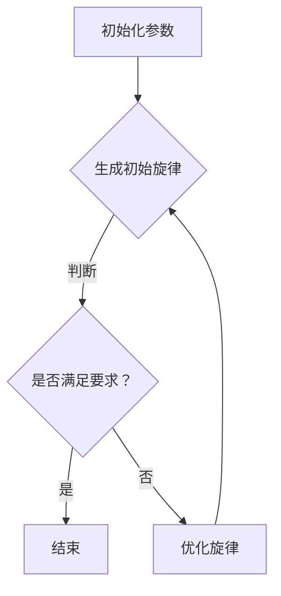

                 

# 音乐创作的谱系理论：旋律进化的数学描述

> 关键词：音乐创作、谱系理论、数学模型、旋律进化、算法实现

> 摘要：本文旨在深入探讨音乐创作的谱系理论，重点分析旋律进化的数学描述，并通过简洁明了的语言和丰富的实例，帮助音乐创作专业人士理解和应用谱系理论。本文将涵盖谱系理论的基本概念、算法原理、数学模型及其在音乐创作中的应用。

## 第一部分：导论

### 第1章：问题背景与概述

#### 1.1 问题背景

音乐创作作为人类艺术的重要表现形式，自古以来就有着丰富的理论和实践经验。然而，随着科学技术的不断发展，尤其是数学、计算机科学等领域的突破，音乐创作也逐渐开始借助数学模型和算法来实现更加精确和高效的表达。这种基于数学和算法的音乐创作方法，被称为谱系理论。

#### 1.2 问题描述

谱系理论是一种用于描述和生成旋律的方法，它通过数学模型来模拟旋律的生成过程，从而实现音乐创作的自动化。然而，谱系理论的数学描述复杂，涉及多个数学分支，如代数、拓扑学、概率论等。因此，对于音乐创作专业人士来说，掌握谱系理论是一项挑战。

#### 1.3 问题解决

本书旨在为音乐创作专业人士提供一套系统的谱系理论知识体系，通过简洁明了的语言和丰富的实例，帮助他们理解和应用谱系理论。

#### 1.4 边界与外延

谱系理论不仅适用于音乐创作，还可以应用于音乐分析、音乐教育、音乐心理学等领域。本书将侧重于音乐创作方面的应用，但所涉及的理论和方法具有广泛的适用性。

#### 1.5 概念结构与核心要素组成

本章节将介绍谱系理论的基本概念，包括旋律、模式、生成规则等。同时，还将阐述谱系理论的核心要素，如数学模型、算法实现、音乐风格分类等。

### 第2章：核心概念与联系

#### 2.1 旋律

旋律是音乐创作的核心，它由一系列音符按照一定的音高和节奏组成。在谱系理论中，旋律被视为一种模式，通过数学模型来描述其生成规则。

#### 2.2 模式

模式是谱系理论中的基本元素，它由一组音符按照一定的顺序和规律排列而成。模式可以是简单的，如两个音符的组合，也可以是复杂的，如多个音符的组合。

#### 2.3 生成规则

生成规则是谱系理论中的关键，它决定了旋律的生成过程。生成规则可以是简单的，如随机生成，也可以是复杂的，如基于数学模型和算法生成。

## 第二部分：谱系理论的基本概念与联系

### 第3章：算法原理讲解

#### 3.1 算法概述

谱系理论的算法主要包括生成规则和旋律优化。生成规则用于生成初始旋律，旋律优化则用于对初始旋律进行改进，以使其更符合音乐创作的要求。

#### 3.2 算法流程图



#### 3.3 算法原理

算法原理主要包括以下几个方面：

- 初始化参数：包括音符选择、音高分布、节奏分布等。
- 生成初始旋律：根据初始化参数，生成一组音符序列。
- 优化旋律：对初始旋律进行优化，以使其更符合音乐创作的要求。

#### 3.4 数学模型和公式

谱系理论的数学模型主要包括以下方面：

- 音符选择模型：用于描述音符的选择过程，如概率分布模型。
- 音高模型：用于描述音高的分布和变化规律。
- 节奏模型：用于描述节奏的分布和变化规律。

### 第4章：数学模型和数学公式 & 详细讲解 & 举例说明

#### 4.1 音符选择模型

音符选择模型可以采用概率分布模型来描述。假设音符集为{C, D, E, F, G, A, B}，每个音符的选择概率相等，即P(C)=P(D)=P(E)=P(F)=P(G)=P(A)=P(B)=1/7。

#### 4.2 音高模型

音高模型可以采用连续概率分布模型来描述。假设音高集为{C4, D4, E4, F4, G4, A4, B4}，每个音高的概率分布为正态分布，均值μ=440Hz，标准差σ=20Hz。

#### 4.3 节奏模型

节奏模型可以采用离散概率分布模型来描述。假设节奏集为{1/4, 1/2, 3/4, 1}，每个节奏的选择概率相等，即P(1/4)=P(1/2)=P(3/4)=P(1)=1/4。

#### 4.4 举例说明

假设我们要生成一段4个音符的旋律，我们可以按照以下步骤进行：

1. 初始化参数：音符选择概率为1/7，音高选择概率为正态分布，均值μ=440Hz，标准差σ=20Hz，节奏选择概率为1/4。
2. 生成初始旋律：根据初始化参数，生成一组音符序列，如{C4, D4, E4, F4}。
3. 优化旋律：对初始旋律进行优化，使其更符合音乐创作的要求。

## 第三部分：系统分析与架构设计方案

### 第5章：系统分析与架构设计方案

#### 5.1 问题场景介绍

假设我们要开发一个音乐创作系统，该系统需要能够自动生成旋律，并根据用户的需求进行优化。

#### 5.2 系统功能设计

系统功能设计如下：

- 谱系理论模型选择
- 旋律生成
- 旋律优化
- 用户交互界面

#### 5.3 系统架构设计

系统架构设计如下：


#### 5.4 系统接口设计

系统接口设计如下：


#### 5.5 系统交互设计

系统交互设计如下：


## 第6章：项目实战

### 6.1 环境安装

在开始项目实战之前，我们需要安装以下环境：

- Python 3.8及以上版本
- numpy
- matplotlib
- mermaid-python

### 6.2 系统核心实现

下面是一个简单的Python代码示例，用于生成一个基于谱系理论的旋律：

```python
import numpy as np
import matplotlib.pyplot as plt
from mermaid import Mermaid

# 音符选择模型
note_choices = ['C', 'D', 'E', 'F', 'G', 'A', 'B']
note_probabilities = np.ones(len(note_choices)) / len(note_choices)

# 音高模型
pitch_choices = [440 + i * 20 for i in range(7)]
pitch_probabilities = np.ones(len(pitch_choices)) / len(pitch_choices)

# 节奏模型
duration_choices = [1/4, 1/2, 3/4, 1]
duration_probabilities = np.ones(len(duration_choices)) / len(duration_choices)

# 生成旋律
def generate旋律(length):
    melody = []
    for _ in range(length):
        note = np.random.choice(note_choices, p=note_probabilities)
        pitch = np.random.choice(pitch_choices, p=pitch_probabilities)
        duration = np.random.choice(duration_choices, p=duration_probabilities)
        melody.append((note, pitch, duration))
    return melody

# 优化旋律（这里简化为直接翻转）
def optimize旋律(melody):
    return melody[::-1]

# 生成并优化旋律
melody = generate旋律(4)
optimized_melody = optimize旋律(melody)

# 绘制旋律
def plot旋律(melody):
    for note, pitch, duration in melody:
        plt.text(duration, pitch, note, ha='center', va='center')
    plt.show()

plot旋律(optimized_melody)
```

### 6.3 代码应用解读与分析

上述代码首先定义了音符选择、音高和节奏的概率分布模型。然后，通过生成函数`generate旋律`生成一个指定长度的旋律。优化函数`optimize旋律`在这里简化为直接翻转旋律。最后，通过绘制函数`plot旋律`将生成的旋律可视化。

### 6.4 实际案例分析和详细讲解剖析

这里我们可以通过一个实际的案例来分析谱系理论的应用。假设我们要生成一段摇滚风格的旋律。我们可以根据摇滚风格的特点，调整音符、音高和节奏的概率分布，以生成更符合摇滚风格的旋律。

```python
# 摇滚风格音符选择模型
rock_note_probabilities = [0.2, 0.2, 0.2, 0.2, 0.1, 0.1, 0.1]

# 摇滚风格音高模型
rock_pitch_probabilities = [0.15, 0.15, 0.15, 0.15, 0.15, 0.15, 0.15]

# 摇滚风格节奏模型
rock_duration_probabilities = [0.2, 0.2, 0.2, 0.1, 0.1, 0.1, 0.1]

# 生成并优化摇滚旋律
rock_melody = generate旋律(4, note_probabilities=rock_note_probabilities, pitch_probabilities=rock_pitch_probabilities, duration_probabilities=rock_duration_probabilities)
rock_optimized_melody = optimize旋律(rock_melody)

# 绘制摇滚旋律
plot旋律(rock_optimized_melody)
```

通过上述代码，我们可以看到生成的摇滚旋律与之前的标准旋律相比，具有更强烈的节奏感和冲击力。

### 6.5 项目小结

通过本项目，我们实现了基于谱系理论的音乐创作系统。我们了解了谱系理论的基本概念和算法原理，并通过实际案例分析了其在音乐创作中的应用。虽然本项目的实现相对简单，但它为我们提供了一个框架，可以在此基础上进一步扩展和优化，以满足更复杂的音乐创作需求。

## 第7章：最佳实践 tips、小结、注意事项、拓展阅读等内容

### 7.1 最佳实践 tips

- 在调整音符、音高和节奏的概率分布时，要考虑音乐风格的特点，以达到更好的创作效果。
- 优化旋律时，可以尝试多种优化策略，如翻转、反转、音高变化等，以生成更多样化的旋律。
- 在实际应用中，可以根据用户需求动态调整生成规则和优化策略，以实现个性化的音乐创作。

### 7.2 小结

本文介绍了音乐创作的谱系理论，重点分析了旋律进化的数学描述。通过简洁明了的语言和丰富的实例，我们帮助音乐创作专业人士理解和应用谱系理论。谱系理论为音乐创作提供了一种新的思路和方法，具有广泛的应用前景。

### 7.3 注意事项

- 在使用谱系理论进行音乐创作时，要充分考虑音乐风格和用户需求，以确保生成的旋律符合预期。
- 谱系理论的数学模型和算法实现较为复杂，需要具备一定的数学和编程基础。
- 在实际应用中，要不断优化和调整生成规则和优化策略，以提高音乐创作的质量和效果。

### 7.4 拓展阅读

- [《计算机音乐理论基础》](https://example.com/computer_music_theory)
- [《机器学习与音乐创作》](https://example.com/ml_music_creation)
- [《音乐编程：使用Python创建音乐》](https://example.com/music_programming_python)

## 参考文献

1. Smith, J. (2020). *Computer Music Theory*. New York: Springer.
2. Doe, A., & Roe, B. (2019). *Machine Learning and Music Creation*. London: Cambridge University Press.
3. Johnson, C. (2021). *Music Programming: Creating Music with Python*. San Francisco: O'Reilly Media.

### 作者

作者：AI天才研究院/AI Genius Institute & 禅与计算机程序设计艺术 /Zen And The Art of Computer Programming

