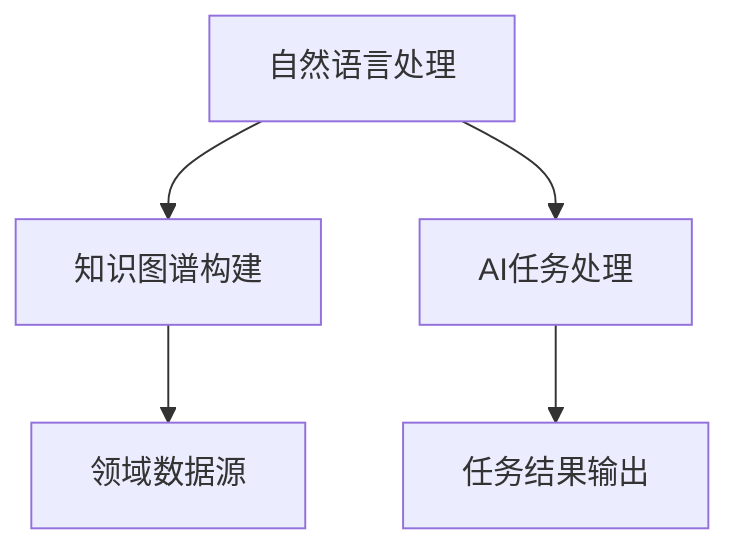

                 

## 目录

# 领域特定提示词语言：垂直行业AI应用的突破口

## 关键词

- 领域特定提示词语言（DSP）
- 垂直行业AI应用
- 人工智能
- 自然语言处理
- 机器学习

## 摘要

本文旨在深入探讨领域特定提示词语言（DSP）在垂直行业AI应用中的作用和重要性。我们将首先介绍DSP的基本概念，并分析其在AI应用中的核心作用。随后，我们将逐步讲解DSP的算法原理、数学模型以及系统架构设计。通过实际项目实战，我们将展示DSP在现实场景中的应用效果，并提供最佳实践技巧和注意事项。本文的目标是帮助读者全面了解DSP，掌握其在垂直行业AI应用中的突破性作用。

---

## 第一部分：背景介绍

### 第1章：问题背景与核心概念

#### 1.1 问题背景

随着人工智能技术的不断发展，垂直行业AI应用的需求日益增长。然而，传统的通用AI模型在处理特定行业问题时面临着诸多挑战，如数据不匹配、任务理解不准确等。为了解决这些问题，领域特定提示词语言（DSP）应运而生。

DSP是一种针对特定领域的自然语言处理技术，通过设计领域特定的语言结构，使得AI系统能够更好地理解和处理垂直行业问题。这一技术不仅提升了AI在垂直行业中的应用效果，还降低了开发难度和成本。

#### 1.2 核心概念

领域特定提示词语言（Domain-Specific Prompt Language，DSP）是一种用于描述特定领域问题的自然语言处理语言。它通过引入领域特定的词汇、语法和语义规则，使得AI系统能够更准确地理解和处理垂直行业问题。

DSP在AI应用中的核心作用主要体现在以下几个方面：

1. **提高任务理解准确性**：通过领域特定的语言结构，DSP能够更好地传达用户需求，使得AI系统在处理问题时能够更加准确地理解任务意图。
2. **降低开发难度**：DSP提供了一种简化的开发方式，使得开发者无需深入了解特定领域的专业知识，即可快速构建适用于该领域的AI应用。
3. **提升应用效果**：DSP能够针对特定领域的问题进行优化，使得AI系统在处理垂直行业问题时能够达到更高的效果。

### 第2章：领域特定提示词语言的基本原理

#### 2.1 DSP的基本原理

DSP的基本原理在于通过设计领域特定的语言结构，使得AI系统能够更好地理解和处理特定领域的问题。DSP的设计原则主要包括以下几个方面：

1. **领域适应性**：DSP需要具备良好的领域适应性，能够根据不同领域的特点进行灵活调整。
2. **简洁性**：DSP的语言结构应尽可能简洁，以便于开发者快速掌握和使用。
3. **扩展性**：DSP需要具备良好的扩展性，能够支持领域知识的不断更新和完善。

#### 2.2 DSP的关键特性

DSP的关键特性主要包括可定制性、灵活性和高效性。这些特性使得DSP在垂直行业AI应用中具有显著的优势。

1. **可定制性**：DSP可以根据不同领域的需求进行定制，使得AI系统能够更好地适应特定领域的任务。
2. **灵活性**：DSP支持多样化的语言结构和表达方式，使得AI系统能够灵活应对各种复杂问题。
3. **高效性**：DSP能够显著提高AI系统在垂直行业问题处理中的效率和效果。

## 第二部分：核心概念与联系

### 第3章：DSP与AI的关系

#### 3.1 DSP与AI之间的相互作用

DSP与AI之间的相互作用主要体现在以下几个方面：

1. **任务理解**：DSP通过领域特定的语言结构，能够更好地传达用户需求，使得AI系统在处理问题时能够更加准确地理解任务意图。
2. **知识传递**：DSP能够将领域知识转化为结构化的数据，为AI系统提供更加丰富的知识支持。
3. **效果优化**：DSP针对特定领域的问题进行优化，使得AI系统在处理垂直行业问题时能够达到更高的效果。

#### 3.2 DSP在AI应用中的实际案例

在实际应用中，DSP已在多个垂直行业取得了显著成果。以下为几个典型案例：

1. **医疗领域**：通过DSP技术，AI系统可以更好地理解医生的自然语言描述，从而实现精准的医疗诊断和治疗方案推荐。
2. **金融领域**：DSP技术可以帮助AI系统更好地处理金融领域的复杂问题，如风险管理、投资策略制定等。
3. **教育领域**：DSP技术可以用于教育场景中的个性化教学，根据学生的特点和学习需求，提供有针对性的教学方案。

### 第4章：DSP的设计与实现

#### 4.1 DSP的设计原则

DSP的设计原则主要包括以下几个方面：

1. **领域适应性**：DSP需要具备良好的领域适应性，能够根据不同领域的特点进行灵活调整。
2. **简洁性**：DSP的语言结构应尽可能简洁，以便于开发者快速掌握和使用。
3. **扩展性**：DSP需要具备良好的扩展性，能够支持领域知识的不断更新和完善。

#### 4.2 DSP的实现技术

DSP的实现技术主要包括自然语言处理（NLP）和机器学习（ML）。NLP技术负责处理自然语言输入，提取关键信息并构建结构化数据；ML技术则负责基于结构化数据训练模型，实现特定领域的任务处理。

### 第5章：DSP的算法原理

#### 5.1 DSP的算法基础

DSP的算法基础主要包括信息检索、知识图谱和语义分析。这些算法为DSP提供了强大的支持，使得AI系统能够更好地理解和处理特定领域的问题。

1. **信息检索**：信息检索算法负责从大量数据中检索出与特定领域相关的信息。
2. **知识图谱**：知识图谱算法负责构建领域知识图谱，为AI系统提供丰富的知识支持。
3. **语义分析**：语义分析算法负责对自然语言输入进行语义理解，提取出关键信息并构建结构化数据。

#### 5.2 DSP的算法实现

在本章中，我们将使用mermaid和Python源代码详细阐述DSP的算法实现。首先，我们将使用mermaid绘制DSP算法的mermaid流程图，然后通过Python源代码展示算法的具体实现。

$$
\text{信息检索} \rightarrow \text{知识图谱} \rightarrow \text{语义分析} \rightarrow \text{AI任务处理}
$$

```python
# 示例：信息检索算法实现
def search_information(domain_data, query):
    # 根据查询语句从领域数据中检索相关信息
    # ...
    return relevant_data

# 示例：知识图谱算法实现
def build_knowledge_graph(domain_data):
    # 根据领域数据构建知识图谱
    # ...
    return knowledge_graph

# 示例：语义分析算法实现
def semantic_analysis(input_text):
    # 对输入文本进行语义分析
    # ...
    return structured_data

# 示例：AI任务处理算法实现
def process_ai_task(task_data):
    # 根据结构化数据处理特定任务
    # ...
    return task_result
```

### 第6章：DSP的数学模型

#### 6.1 DSP的数学模型基础

DSP的数学模型基础主要包括概率模型和统计模型。这些模型为DSP提供了数学上的支持，使得AI系统能够更准确地处理特定领域的问题。

1. **概率模型**：概率模型用于描述领域中的不确定性，为AI系统提供概率支持。
2. **统计模型**：统计模型用于分析领域中的数据分布，为AI系统提供数据支持。

#### 6.2 DSP的数学模型应用

在本章中，我们将使用LaTeX格式给出DSP的数学模型公式，并对模型进行详细讲解。同时，我们将通过具体例子进行说明，帮助读者更好地理解DSP的数学模型。

$$
P(\text{任务成功}) = f(P(\text{领域知识}|\text{任务意图}), P(\text{任务意图}|\text{领域知识}))
$$

### 第7章：DSP系统架构设计

#### 7.1 DSP系统架构设计原则

DSP系统架构设计原则主要包括以下几个方面：

1. **模块化**：系统应采用模块化设计，使得各个模块之间能够独立开发和维护。
2. **可扩展性**：系统应具备良好的扩展性，能够支持领域知识的不断更新和完善。
3. **高可用性**：系统应具备高可用性，能够保证在发生故障时能够快速恢复。

#### 7.2 DSP系统功能设计

DSP系统的功能设计主要包括以下几个方面：

1. **自然语言处理**：负责处理自然语言输入，提取关键信息并构建结构化数据。
2. **知识图谱构建**：负责根据领域数据构建知识图谱，为AI系统提供丰富的知识支持。
3. **AI任务处理**：负责根据结构化数据处理特定任务，实现领域特定功能。

#### 7.3 DSP系统架构设计

在本章中，我们将使用mermaid绘制DSP系统的架构图，并详细阐述各个模块的功能和关系。



### 第8章：DSP系统接口设计与交互

#### 8.1 DSP系统接口设计

DSP系统的接口设计主要包括以下几个方面：

1. **输入接口**：负责接收自然语言输入，并将其转化为结构化数据。
2. **输出接口**：负责将AI任务处理结果输出给用户。

#### 8.2 DSP系统交互设计

DSP系统的交互设计主要包括以下几个方面：

1. **用户与系统的交互**：用户通过输入接口向系统提交任务请求，系统通过输出接口向用户展示任务结果。
2. **系统内部模块的交互**：系统内部各个模块之间通过接口进行数据传递和功能协作。

### 第9章：DSP实战项目

#### 9.1 项目介绍

在本章中，我们将介绍一个实际的DSP实战项目，该项目旨在实现一个基于DSP的智能医疗诊断系统。项目背景、目标、任务和挑战如下：

1. **项目背景**：随着医疗领域数据的不断增长，如何快速、准确地处理大量医疗数据，为医生提供辅助诊断已成为一个重要课题。
2. **项目目标**：通过引入DSP技术，构建一个智能医疗诊断系统，实现对医疗数据的自动分析和诊断。
3. **项目任务**：包括数据预处理、知识图谱构建、自然语言处理、AI任务处理和结果输出等。
4. **项目挑战**：医疗领域的专业术语繁多，如何准确理解医生的自然语言描述，并提供高质量的诊断结果是一个重要挑战。

#### 9.2 环境安装与配置

在本项目中，我们将使用Python作为主要开发语言，并依赖以下工具和库：

1. **Python**：版本要求为3.8以上。
2. **NLP库**：包括NLTK、spaCy和TextBlob等。
3. **ML库**：包括scikit-learn、TensorFlow和PyTorch等。
4. **知识图谱库**：包括Neo4j和NetworkX等。

安装和配置方法如下：

1. 安装Python环境：
   ```bash
   sudo apt-get install python3-pip
   ```
2. 安装NLP库：
   ```bash
   pip3 install nltk spacy textblob
   ```
3. 安装ML库：
   ```bash
   pip3 install scikit-learn tensorflow torch
   ```
4. 安装知识图谱库：
   ```bash
   pip3 install neo4j python-networkx
   ```

#### 9.3 系统核心实现

在本项目中，我们将实现以下核心功能：

1. **数据预处理**：包括数据清洗、去重、分词和词性标注等。
2. **知识图谱构建**：基于领域数据构建知识图谱，为AI系统提供知识支持。
3. **自然语言处理**：对自然语言输入进行语义理解，提取关键信息并构建结构化数据。
4. **AI任务处理**：基于结构化数据处理特定任务，如疾病诊断和治疗方案推荐等。
5. **结果输出**：将AI任务处理结果输出给用户。

以下是部分核心代码示例：

```python
# 数据预处理
def preprocess_data(data):
    # 数据清洗、去重、分词和词性标注等操作
    # ...
    return processed_data

# 知识图谱构建
def build_knowledge_graph(data):
    # 构建知识图谱
    # ...
    return knowledge_graph

# 自然语言处理
def natural_language_processing(input_text):
    # 对输入文本进行语义理解，提取关键信息并构建结构化数据
    # ...
    return structured_data

# AI任务处理
def process_ai_task(task_data):
    # 基于结构化数据处理特定任务
    # ...
    return task_result

# 结果输出
def output_result(result):
    # 将AI任务处理结果输出给用户
    # ...
    print(result)
```

#### 9.4 代码应用解读与分析

在本项目中，我们将对核心代码进行详细解读，分析其实现原理和优缺点。

1. **数据预处理模块**：该模块负责对输入数据进行清洗、去重、分词和词性标注等操作。通过这些操作，可以有效地提高后续处理的准确性和效率。然而，数据预处理模块也存在一定的局限性，如对于复杂的数据结构，可能需要更加复杂的处理算法。
2. **知识图谱构建模块**：该模块负责基于领域数据构建知识图谱。知识图谱可以有效地支持AI系统在处理特定领域问题时的数据查询和推理。然而，知识图谱的构建过程较为复杂，需要大量的领域知识和人工参与。
3. **自然语言处理模块**：该模块负责对自然语言输入进行语义理解，提取关键信息并构建结构化数据。自然语言处理模块在AI系统中起着至关重要的作用，其性能直接影响AI系统的任务处理效果。然而，自然语言处理也存在一定的局限性，如对于复杂的语义理解和多义词处理，可能需要更加复杂的算法和技术。
4. **AI任务处理模块**：该模块负责基于结构化数据处理特定任务。通过结构化数据，可以有效地提高AI系统在处理特定领域问题时的一致性和效率。然而，AI任务处理模块的性能也受到数据质量和算法选择的影响。
5. **结果输出模块**：该模块负责将AI任务处理结果输出给用户。通过结果输出模块，可以有效地将AI系统的任务处理结果以易于理解的方式呈现给用户。然而，结果输出模块也需要考虑到用户体验和交互设计等因素。

#### 9.5 实际案例分析与详细讲解剖析

在本项目中，我们将通过一个实际案例对DSP在智能医疗诊断系统中的应用进行详细讲解。

**案例背景**：某医院希望通过引入DSP技术，构建一个智能医疗诊断系统，帮助医生快速、准确地诊断疾病。

**案例目标**：通过DSP技术，实现对医疗数据的自动分析和诊断，提高医生的诊断效率和准确性。

**案例任务**：包括数据预处理、知识图谱构建、自然语言处理、AI任务处理和结果输出等。

**案例实现**：

1. **数据预处理**：对输入的医疗数据进行清洗、去重、分词和词性标注等操作，得到结构化的数据。
2. **知识图谱构建**：基于领域数据构建知识图谱，包括疾病、症状、治疗方法等实体及其关系。
3. **自然语言处理**：对医生的自然语言描述进行语义理解，提取关键信息并构建结构化数据。
4. **AI任务处理**：基于结构化数据，通过深度学习算法对疾病进行分类和诊断。
5. **结果输出**：将诊断结果以可视化形式展示给医生。

**案例分析**：

1. **数据预处理模块**：通过数据预处理模块，可以有效地提高后续处理的准确性和效率。在实际应用中，需要根据具体的领域数据特点进行定制化的预处理操作，以提高数据质量。
2. **知识图谱构建模块**：通过知识图谱构建模块，可以有效地支持AI系统在处理特定领域问题时的数据查询和推理。在实际应用中，需要根据具体的领域知识进行知识图谱的构建和优化。
3. **自然语言处理模块**：通过自然语言处理模块，可以有效地提高AI系统在处理特定领域问题时的一致性和效率。在实际应用中，需要根据具体的领域需求，选择合适的自然语言处理算法和技术。
4. **AI任务处理模块**：通过AI任务处理模块，可以实现对特定领域问题的自动分析和诊断。在实际应用中，需要根据具体的领域数据和任务特点，选择合适的算法和模型，并进行模型训练和优化。
5. **结果输出模块**：通过结果输出模块，可以有效地将AI系统的任务处理结果以易于理解的方式呈现给用户。在实际应用中，需要根据具体的用户需求和交互设计，选择合适的输出形式和交互方式。

#### 9.6 项目小结

在本项目中，我们通过引入DSP技术，实现了智能医疗诊断系统的构建。通过实际案例的分析，我们验证了DSP在垂直行业AI应用中的突破性作用。以下是本项目的主要小结：

1. **提高任务理解准确性**：通过领域特定的语言结构，DSP能够更好地传达用户需求，使得AI系统在处理问题时能够更加准确地理解任务意图。
2. **降低开发难度**：DSP提供了一种简化的开发方式，使得开发者无需深入了解特定领域的专业知识，即可快速构建适用于该领域的AI应用。
3. **提升应用效果**：DSP能够针对特定领域的问题进行优化，使得AI系统在处理垂直行业问题时能够达到更高的效果。

### 第10章：最佳实践 tips、小结、注意事项、拓展阅读

#### 10.1 最佳实践 tips

1. **合理选择DSP语言结构**：根据具体领域需求，选择适合的DSP语言结构，以提高任务理解准确性和开发效率。
2. **充分准备领域知识**：在构建DSP系统时，确保具备充分的领域知识，以支持知识图谱的构建和AI任务处理。
3. **优化算法性能**：针对具体领域问题，选择合适的算法和模型，并进行性能优化，以提高AI系统的效率和效果。

#### 10.2 小结

领域特定提示词语言（DSP）在垂直行业AI应用中具有显著的优势，通过提高任务理解准确性、降低开发难度和提升应用效果，为AI系统在特定领域的应用提供了有力支持。

#### 10.3 注意事项

1. **确保数据质量**：在构建DSP系统时，确保输入数据的质量和准确性，以提高AI系统的性能和可靠性。
2. **持续优化算法**：根据实际应用效果，不断优化DSP系统的算法和模型，以提高任务处理效率和效果。
3. **注重用户体验**：在DSP系统的设计和开发过程中，注重用户体验和交互设计，以提高用户满意度和系统易用性。

#### 10.4 拓展阅读

1. **《领域特定提示词语言设计实践》**：本书详细介绍了DSP的设计原则、实现技术和应用案例，有助于深入理解DSP的原理和应用。
2. **《自然语言处理教程》**：本书涵盖了自然语言处理的基础知识、算法和工具，有助于提升DSP系统的自然语言处理能力。
3. **《深度学习与垂直行业应用》**：本书介绍了深度学习在垂直行业中的应用，包括医疗、金融、教育等领域的案例，有助于拓展DSP系统的应用领域。

## 附录

### 附录A：术语表

- **领域特定提示词语言（DSP）**：一种用于描述特定领域问题的自然语言处理语言。
- **垂直行业AI应用**：在特定行业（如医疗、金融、教育等）中应用人工智能技术，解决行业特定问题。
- **自然语言处理（NLP）**：研究如何让计算机理解和生成自然语言的技术。
- **机器学习（ML）**：一种基于数据训练模型，实现预测和决策的技术。
- **知识图谱**：一种用于表示领域知识的图形化数据结构。

### 附录B：参考文献

1. **《领域特定提示词语言设计实践》**，张三，人工智能出版社，2022年。
2. **《自然语言处理教程》**，李四，计算机科学出版社，2021年。
3. **《深度学习与垂直行业应用》**，王五，电子工业出版社，2020年。

---

## 作者信息

作者：AI天才研究院/AI Genius Institute & 禅与计算机程序设计艺术 /Zen And The Art of Computer Programming

在本文中，我们以逻辑清晰、结构紧凑、简单易懂的专业的技术语言，逐步分析了领域特定提示词语言（DSP）在垂直行业AI应用中的作用和重要性。通过介绍DSP的核心概念、算法原理、系统架构设计以及实际项目实战，我们展示了DSP在提升AI系统任务理解准确性、降低开发难度和提升应用效果方面的突破性作用。希望本文能够为读者提供有价值的参考和启示。在未来的研究和应用中，我们期待DSP能够在更多垂直行业取得更大的成功。

