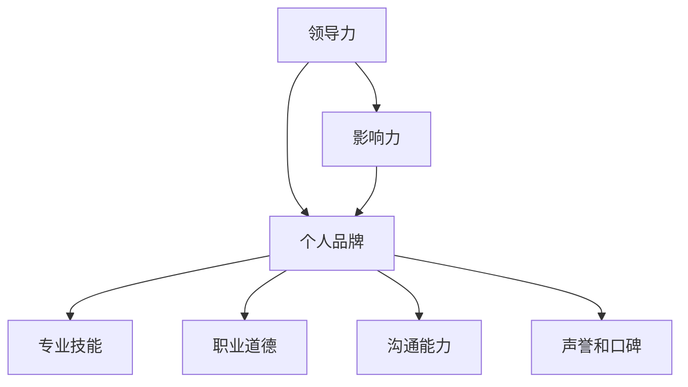

                 

# 领导力与个人品牌：树立威信的重要性

> 关键词：领导力、个人品牌、威信、策略、案例分析

> 摘要：本文深入探讨了领导力与个人品牌在IT领域的至关重要性。通过剖析领导力的定义与类型，解析个人品牌的核心要素，以及探讨提升领导力和个人品牌的方法，本文旨在为IT从业者提供实用的指导，帮助他们树立威信，打造强大的个人品牌。

## 目录大纲

**《领导力与个人品牌：树立威信的重要性》**

----------------------------------------------------------------

**第一部分：领导力与个人品牌的基本概念**

- **第1章：领导力与个人品牌的概述**
  - 1.1 领导力的定义与类型
  - 1.2 个人品牌的重要性
  - 1.3 领导力与个人品牌的关联

- **第2章：领导力与个人品牌的核心要素**
  - 2.1 领导力模型解析
  - 2.2 个人品牌元素分析
  - 2.3 领导力与个人品牌的关系图

----------------------------------------------------------------

**第二部分：提升领导力和个人品牌的方法**

- **第3章：提升领导力的策略**
  - 3.1 自我认知与自我提升
  - 3.2 沟通技巧与团队建设
  - 3.3 应对冲突与解决问题

- **第4章：打造个人品牌的关键步骤**
  - 4.1 塑造独特个人形象
  - 4.2 建立个人网络与社交媒体
  - 4.3 维护个人声誉与口碑

- **第5章：领导力与个人品牌的实践案例**
  - 5.1 成功领导力案例解析
  - 5.2 成功个人品牌案例分析
  - 5.3 实践中的领导力与个人品牌建设

----------------------------------------------------------------

**第三部分：领导力与个人品牌在组织中的应用**

- **第6章：领导力与个人品牌在团队管理中的应用**
  - 6.1 团队领导的领导力要求
  - 6.2 个人品牌对团队管理的影响
  - 6.3 实践中的领导力与团队管理案例

- **第7章：领导力与个人品牌在组织文化建设中的应用**
  - 7.1 组织文化的塑造与传承
  - 7.2 领导力在组织文化中的角色
  - 7.3 个人品牌对组织文化的促进作用

- **第8章：领导力与个人品牌的未来趋势**
  - 8.1 科技进步对领导力与个人品牌的影响
  - 8.2 未来领导力与个人品牌的发展方向
  - 8.3 领导力与个人品牌的跨文化挑战与机遇

----------------------------------------------------------------

**附录：领导力与个人品牌相关资源与参考文献**

- **附录1：领导力与个人品牌相关书籍推荐**
- **附录2：领导力与个人品牌相关在线资源**
- **附录3：领导力与个人品牌研究论文与报告**

通过以上目录大纲的设计，本书旨在全面探讨领导力与个人品牌的重要性，提供实用的提升策略，并结合实际案例进行分析，帮助读者在职业生涯中更好地树立威信，提升个人品牌。

----------------------------------------------------------------

### 第一部分：领导力与个人品牌的基本概念

**第1章：领导力与个人品牌的概述**

在当今复杂多变的IT行业中，领导力与个人品牌的重要性日益凸显。有效的领导力不仅能够推动团队向前发展，还能为个人带来更多的机会与认可。而一个强大的个人品牌则是职业成功的重要基石。

#### 1.1 领导力的定义与类型

领导力是一个广泛而复杂的概念，不同学者和专家对其有不同的解释。然而，总体上，领导力可以被定义为一种影响他人并引导他们实现共同目标的能力。根据领导风格的不同，领导力可以分为以下几种类型：

1. **权威型领导**：通过严格的规章制度和权力来管理团队。
2. **民主型领导**：鼓励团队成员参与决策过程，注重团队合作。
3. **变革型领导**：通过激发团队成员的内在动机，推动组织变革和创新。
4. **服务型领导**：以服务团队成员为中心，致力于满足团队的需求。

#### 1.2 个人品牌的重要性

个人品牌是个人在职业生涯中的形象代表，它由个人的专业能力、价值观、行为和声誉构成。一个强大的个人品牌能够：

1. **增强个人影响力**：使个人在职场中更具说服力和号召力。
2. **提升职业机会**：吸引更多的职业机会和合作伙伴。
3. **增加薪酬和福利**：个人品牌的价值往往直接反映在薪酬和福利上。
4. **增强团队凝聚力**：一个有威信的领导者能够提升团队的士气和效率。

#### 1.3 领导力与个人品牌的关联

领导力与个人品牌之间存在密切的关联。有效的领导力能够帮助个人建立强大的个人品牌，而一个强大的个人品牌又能为领导力的发挥提供更广阔的平台。以下是一些关键的关联点：

1. **信任与尊重**：领导力建立的基础是信任和尊重，这同样是个人品牌的核心要素。
2. **专业性与声誉**：领导力体现了个人的专业性和声誉，这直接影响到个人品牌的价值。
3. **影响力与领导力**：个人品牌的影响力是领导力的一部分，而领导力又能扩大个人品牌的影响力。
4. **持续性与发展**：领导力的提升与个人品牌的维护都需要持续的努力和投入，两者相辅相成。

通过以上对领导力与个人品牌基本概念的分析，我们可以看到，在IT领域中，提升领导力和个人品牌不仅对个人的职业发展至关重要，也是组织成功的关键因素。接下来，我们将进一步探讨领导力与个人品牌的核心要素，以便读者能够更好地理解和应用。

### 第2章：领导力与个人品牌的核心要素

在深入探讨领导力与个人品牌时，我们需要了解其核心要素，这些要素构成了领导力与个人品牌的基础，对个人的职业发展产生深远影响。

#### 2.1 领导力模型解析

领导力模型是理解和应用领导力的重要工具。不同的领导力模型提供了不同的视角和方法，以帮助领导者更有效地管理团队和实现目标。以下是几种常见的领导力模型：

1. **迈-凯模型（Hersey-Blanchard Situational Leadership Model）**：
   - 该模型基于领导者的行为和团队成员的成熟度，提出了四种领导风格：指挥型、推销型、参与型和授权型。
   - **指挥型**：适用于团队成员成熟度较低的情况，领导者需明确指示和监督。
   - **推销型**：适用于团队成员成熟度较低但有一定能力的情况，领导者需要提供指导和激励。
   - **参与型**：适用于团队成员成熟度较高但需要支持和参与决策的情况，领导者鼓励团队成员参与决策。
   - **授权型**：适用于团队成员成熟度最高的情况，领导者赋予团队成员更多的自主权和责任。

2. **变革型领导模型（Transformational Leadership Model）**：
   - 变革型领导关注激发团队成员的内在动机，通过变革愿景和个性化关怀推动团队实现目标。
   - **变革愿景**：领导者提出具有吸引力的变革愿景，激发团队成员的参与和投入。
   - **个性化关怀**：领导者关注团队成员的个人需求和发展，提供个性化的支持和指导。

3. **服务型领导模型（Servant Leadership Model）**：
   - 服务型领导强调以服务团队成员为中心，致力于满足团队的需求，从而实现组织的目标。
   - **服务导向**：领导者以团队成员的需求为导向，提供必要的支持和资源。
   - **价值观**：领导者通过价值观的传递，推动团队成员形成共同的目标和使命感。

#### 2.2 个人品牌元素分析

个人品牌由多个元素构成，这些元素共同塑造了个人的职业形象和市场价值。以下是个人品牌的主要元素：

1. **专业技能**：
   - 个人品牌的核心是专业技能。具备扎实的专业技能不仅能够提高个人的工作效率，还能在竞争中脱颖而出。
   - **持续学习**：随着技术的快速更新，持续学习成为保持专业竞争力的关键。

2. **职业道德**：
   - 职业道德是个人品牌的重要组成部分。诚信、责任感和敬业精神能够赢得他人的信任和尊重。
   - **案例分析**：例如，遵守职业操守，不泄露公司机密，体现了个人的高尚职业道德。

3. **沟通能力**：
   - 沟通能力是领导力的关键要素之一，也是个人品牌的重要体现。良好的沟通能力能够提高工作效率，促进团队协作。
   - **有效沟通**：包括倾听、表达和反馈，能够帮助个人建立强大的人际网络。

4. **声誉和口碑**：
   - 个人声誉和口碑是个人品牌的外在表现。一个良好的声誉和口碑能够增加个人在职场中的影响力。
   - **维护声誉**：包括积极参与社区活动、贡献行业知识等，提升个人在行业中的知名度。

#### 2.3 领导力与个人品牌的关系图

为了更直观地理解领导力与个人品牌的关系，我们可以使用Mermaid绘制一个简单的实体关系图（ER图），如下所示：

在这个图中，领导力（A）直接影响个人品牌（B），而个人品牌（B）又由多个元素构成，包括专业技能（C）、职业道德（D）、沟通能力（E）和声誉和口碑（F）。领导力通过提升这些元素，最终增强个人品牌的价值。

通过以上对领导力与个人品牌核心要素的解析，我们可以看到，领导力与个人品牌是相辅相成的。有效的领导力能够提升个人品牌，而一个强大的个人品牌又能为领导力的发挥提供有力支持。在接下来的章节中，我们将进一步探讨如何提升领导力和个人品牌的方法，以帮助读者在职业生涯中取得更大的成功。

### 第二部分：提升领导力和个人品牌的方法

在了解了领导力与个人品牌的基本概念和核心要素之后，我们需要关注如何在实际中提升这些能力。有效的策略和具体的实践方法对于个人和组织的成功至关重要。

#### 第3章：提升领导力的策略

**3.1 自我认知与自我提升**

自我认知是提升领导力的第一步。领导者需要深入了解自己的优点和不足，从而进行有针对性的提升。

1. **自我评估**：定期进行自我评估，识别自身的优势和劣势。
2. **学习与发展**：通过参加培训课程、阅读专业书籍和参加行业研讨会等方式，不断提升自己的知识和技能。
3. **反思与调整**：反思自己的领导行为，根据实际情况进行调整和优化。

**3.2 沟通技巧与团队建设**

有效的沟通技巧和团队建设能力是领导力的重要组成部分。

1. **倾听**：倾听是有效沟通的基础。领导者需要倾听团队成员的意见和建议，了解他们的需求和期望。
2. **清晰表达**：确保信息传递的准确性和一致性。使用简洁明了的语言，避免歧义。
3. **激励团队**：通过设定目标、提供奖励和认可团队成员的成就来激励团队。

**3.3 应对冲突与解决问题**

领导者需要具备处理冲突和解决问题的能力。

1. **理性分析**：冷静分析冲突的根源，找到问题的根本原因。
2. **协商解决**：通过协商和对话解决冲突，寻求双方都能接受的解决方案。
3. **预防为主**：通过建立良好的沟通机制和预防措施，减少冲突的发生。

#### 第4章：打造个人品牌的关键步骤

**4.1 塑造独特个人形象**

独特的个人形象有助于在职场中脱颖而出。

1. **定位明确**：明确自己的职业目标和专业领域，塑造专业形象。
2. **个性化特征**：发掘自己的个性特点，将其融入职业发展中。
3. **持续展示**：通过持续的行为和成果展示自己的专业能力和独特形象。

**4.2 建立个人网络与社交媒体**

个人网络和社交媒体是建立个人品牌的重要工具。

1. **拓展人脉**：通过参加行业活动和社交媒体平台，积极拓展人脉。
2. **内容分享**：定期分享专业知识和经验，提升个人在行业中的知名度。
3. **网络营销**：利用社交媒体进行个人品牌宣传，吸引潜在的职业机会。

**4.3 维护个人声誉与口碑**

良好的声誉和口碑是个人品牌的重要支撑。

1. **诚信为本**：始终保持诚信，避免任何可能导致声誉受损的行为。
2. **积极反馈**：及时回应他人的反馈和建议，改进自己的工作和行为。
3. **口碑管理**：主动管理自己的口碑，确保在行业内外保持良好的声誉。

#### 第5章：领导力与个人品牌的实践案例

**5.1 成功领导力案例解析**

分析成功的领导力案例，可以学习到宝贵的经验。

1. **谷歌的领导力模式**：谷歌以其独特的领导力模式而闻名，注重变革型和民主型领导，鼓励创新和自主管理。
2. **任正非的领导艺术**：华为的创始人任正非通过强调服务型领导和团队建设，成功带领华为成为全球领先的科技企业。

**5.2 成功个人品牌案例分析**

成功的个人品牌案例提供了有效的参考。

1. **埃隆·马斯克的个人品牌**：通过在社交媒体上展示其创新思维和领导力，马斯克成功塑造了自己的个人品牌，成为行业领袖。
2. **柳传志的个人品牌**：联想的创始人柳传志通过持续的学习和积极的品牌宣传，成功树立了自己的专业形象。

**5.3 实践中的领导力与个人品牌建设**

在实际工作中，通过以下实践来提升领导力和个人品牌。

1. **项目领导**：在项目中担任领导角色，展示领导能力和项目管理能力。
2. **知识分享**：通过内部培训和外部演讲，分享专业知识和经验。
3. **社区参与**：积极参与行业社区，贡献行业知识，提升个人影响力。

通过以上方法，我们可以逐步提升领导力和个人品牌，为职业生涯的成功打下坚实基础。在接下来的章节中，我们将进一步探讨领导力与个人品牌在组织中的应用，以帮助读者更好地理解和实践。

### 第6章：领导力与个人品牌在团队管理中的应用

在团队管理中，领导力和个人品牌发挥着至关重要的作用。有效的领导力能够提升团队的整体效率，而强大的个人品牌则为团队管理提供了有力的支持。

#### 6.1 团队领导的领导力要求

作为一名团队领导者，需要具备以下领导力要求：

1. **愿景与目标设定**：明确团队的愿景和目标，确保团队成员对团队的目标有清晰的认识。
2. **决策能力**：快速做出明智的决策，并在决策过程中充分考虑团队成员的意见和建议。
3. **沟通能力**：通过有效的沟通，确保信息在团队中准确无误地传递，减少误解和冲突。
4. **激励与支持**：鼓励团队成员，提供必要的支持，帮助他们克服困难，实现目标。
5. **变革与创新能力**：推动团队适应环境变化，鼓励创新思维，提高团队竞争力。

#### 6.2 个人品牌对团队管理的影响

个人品牌对团队管理的影响主要体现在以下几个方面：

1. **信任与尊重**：一个有威信的领导者能够赢得团队成员的信任和尊重，提高团队的凝聚力。
2. **领导影响力**：强大的个人品牌能够扩大领导者的影响力，使领导者能够在团队中发挥更大的作用。
3. **团队士气**：领导者良好的个人品牌能够提升团队士气，激励团队成员更加积极地投入工作。
4. **团队合作**：一个有影响力的领导者能够促进团队成员之间的合作，提高团队的整体效率。

#### 6.3 实践中的领导力与团队管理案例

以下是一些成功的领导力与团队管理案例：

**案例1：谷歌的OKR制度**

谷歌采用OKR（目标与关键结果）制度，通过设定明确的团队目标和关键结果，确保团队成员的目标与公司整体目标保持一致。这一制度不仅提升了团队的管理效率，还增强了团队成员的责任感和执行力。

**案例2：华为的“军团作战”模式**

华为通过实施“军团作战”模式，将各业务部门的领导者培养成具有独立作战能力的“军团长”。这些领导者不仅具备强大的个人品牌，还能带领团队在市场中迅速反应，取得竞争优势。

**案例3：特斯拉的领导力文化**

特斯拉强调领导力文化，鼓励领导者通过创新和变革推动公司发展。特斯拉的CEO埃隆·马斯克以其卓越的领导力和个人品牌，激励员工不断追求卓越，推动公司成为全球电动汽车的领导者。

通过以上案例，我们可以看到，领导力和个人品牌在团队管理中的应用对于团队的成功至关重要。有效的领导力能够提升团队的执行力，而强大的个人品牌则为团队管理提供了坚实的基础。在接下来的章节中，我们将进一步探讨领导力与个人品牌在组织文化建设中的应用。

### 第7章：领导力与个人品牌在组织文化建设中的应用

组织文化是一个组织的灵魂，它影响着组织的价值观、行为准则和发展方向。有效的领导力与强大的个人品牌在塑造和传承组织文化中发挥着至关重要的作用。

#### 7.1 组织文化的塑造与传承

组织文化的塑造是一个长期而复杂的过程，需要领导者通过一系列的决策和行为来逐步构建。以下是领导力在组织文化塑造中的关键作用：

1. **树立愿景和使命**：领导者需要明确组织的愿景和使命，并将其传达给全体员工，使员工对组织的目标和价值观有清晰的认识。
2. **建立价值观**：领导者需要通过自身的言行树立正确的价值观，引导员工遵循组织的价值观，如诚信、责任、创新等。
3. **营造积极的工作氛围**：领导者需要通过激励机制和积极的管理方式，营造一个开放、包容、积极向上的工作氛围。
4. **传承文化**：领导者需要通过传帮带的方式，将组织文化传承给新员工，确保组织文化在代际间的延续和发展。

#### 7.2 领导力在组织文化中的角色

领导力在组织文化中扮演着多重角色，包括：

1. **榜样作用**：领导者作为组织文化的传播者和实践者，其行为和价值观直接影响员工的言行和行为准则。
2. **文化倡导者**：领导者需要积极倡导组织文化，通过各种方式传播和推广组织文化，使员工对组织文化有更深刻的理解和认同。
3. **文化协调者**：在组织文化冲突时，领导者需要发挥调解和协调作用，确保组织文化的统一和稳定。
4. **文化创新者**：领导者需要推动组织文化的创新，鼓励员工提出新的想法和建议，推动组织文化的不断发展。

#### 7.3 个人品牌对组织文化的促进作用

强大的个人品牌对组织文化具有积极的促进作用，主要体现在以下几个方面：

1. **增强组织认同感**：领导者的个人品牌能够增强员工对组织的认同感，使员工更加愿意为组织的目标和价值观奋斗。
2. **提升组织影响力**：领导者的个人品牌能够扩大组织的影响力，提升组织在行业中的竞争力和声誉。
3. **塑造组织形象**：领导者的个人品牌直接影响组织的公众形象，一个有威信的领导者能够为组织树立良好的形象。
4. **推动组织发展**：领导者的个人品牌能够吸引更多优秀的人才加入组织，为组织的持续发展提供人才支持。

#### 实践中的领导力与个人品牌建设

以下是一些实际案例，展示了领导力与个人品牌在组织文化建设中的应用：

**案例1：苹果公司的组织文化**

苹果公司以其独特的组织文化而闻名，这得益于创始人史蒂夫·乔布斯强大的个人品牌。乔布斯通过其卓越的领导力和个人魅力，塑造了苹果公司以创新、简洁和卓越为特征的组织文化，使苹果公司成为全球最具有竞争力的科技公司之一。

**案例2：谷歌的企业文化**

谷歌以其开放、创新的企业文化而著称，这得益于谷歌创始人谢尔盖·布林和拉里·佩奇的领导力与个人品牌。布林和佩奇通过倡导“不作恶”的价值观，营造了一个开放、包容和创新的工作环境，使谷歌成为全球最具有吸引力的雇主之一。

**案例3：华为的企业文化**

华为通过其创始人人任正非的领导力和个人品牌，塑造了以奋斗者文化为核心的企业文化。任正非强调“以客户为中心、以奋斗者为本”，通过激发员工的积极性和创造力，推动华为成为全球领先的科技企业。

通过以上案例，我们可以看到，领导力与个人品牌在组织文化建设中的重要作用。有效的领导力和强大的个人品牌不仅能够塑造和传承组织文化，还能提升组织的竞争力，推动组织的发展。在未来的工作中，领导者应重视领导力与个人品牌建设，以更好地发挥其在组织文化建设中的关键作用。

### 第8章：领导力与个人品牌的未来趋势

随着科技的不断进步和社会的快速发展，领导力与个人品牌也在经历着深刻的变革。了解这些未来的趋势，将有助于我们更好地把握机遇，应对挑战。

#### 8.1 科技进步对领导力与个人品牌的影响

1. **人工智能与大数据**：人工智能和大数据技术的发展，使领导者能够更精准地了解团队成员的需求和表现，从而更有效地进行领导。同时，个人品牌的建设也变得更加数据驱动，通过分析数据来优化个人品牌战略。

2. **虚拟现实与增强现实**：虚拟现实（VR）和增强现实（AR）技术为领导力和个人品牌的展示提供了新的平台。领导者可以通过虚拟会议和在线培训，更广泛地传播自己的理念和价值，增强个人品牌的影响力。

3. **区块链**：区块链技术的去中心化和透明性，为领导力和个人品牌的建设提供了新的机制。通过区块链，领导者的行为和成就可以被记录和验证，增强个人品牌的可信度。

#### 8.2 未来领导力与个人品牌的发展方向

1. **个性化领导力**：未来的领导力将更加注重个性化，领导者需要根据团队成员的不同特点和需求，采用不同的领导风格和策略。同时，个人品牌也将更加突出个体的独特性，每个人都能通过自己的特色和专长在职场中脱颖而出。

2. **跨文化领导力**：全球化进程的加快，要求领导者具备跨文化的理解和沟通能力。个人品牌也将更多地体现跨文化的包容性和适应性，能够在不同的文化背景下有效地发挥作用。

3. **可持续领导力**：随着社会责任和环境问题日益突出，领导力和个人品牌将更加注重可持续性。领导者需要关注环境保护、社会责任和公平正义，将这些价值观融入自己的领导行为和个人品牌中。

#### 8.3 领导力与个人品牌的跨文化挑战与机遇

1. **文化差异的挑战**：在跨文化环境中，领导者和个人品牌需要面对文化差异带来的挑战。了解不同文化的价值观和行为习惯，是有效领导和个人品牌建设的关键。

2. **文化融合的机遇**：跨文化环境也带来了巨大的机遇。通过文化融合，领导者可以汲取不同文化的优点，丰富自己的领导方式和个人品牌。一个具有全球视野和跨文化能力的领导者，将在未来的职场中更具竞争力。

3. **全球化市场的机遇**：全球化市场为领导力和个人品牌提供了更广阔的发展空间。通过国际化的合作和交流，领导者可以扩大个人品牌的影响力，开拓新的市场和机会。

总结而言，未来的领导力与个人品牌将更加注重个性化和跨文化能力，同时受到科技进步的深刻影响。领导者需要不断学习和适应这些变化，以更好地应对挑战，抓住机遇，在职业生涯中取得更大的成功。

### 附录：领导力与个人品牌相关资源与参考文献

**附录1：领导力与个人品牌相关书籍推荐**

1. **《领导力的五个层次》** - 史蒂夫·柯维
   - 描述了从自我领导到团队领导的五个层次，提供了实用的领导力提升方法。

2. **《个人品牌》** - 莱斯·布朗
   - 详细阐述了个人品牌的重要性，以及如何塑造和提升个人品牌。

3. **《变革型领导》** - 雷恩·施瓦茨
   - 探讨了变革型领导如何通过激发团队成员的内在动机，推动组织实现目标。

**附录2：领导力与个人品牌相关在线资源**

1. **Harvard Business Review（HBR）** - harvardbusinessreview.org
   - 提供大量的领导力与个人品牌相关的文章和案例分析。

2. **LinkedIn Learning** - linkedin.com/learning
   - 提供丰富的领导力与个人品牌培训课程和资源。

3. **TED Talks** - ted.com/talks
   - 收集了众多关于领导力与个人品牌主题的演讲视频。

**附录3：领导力与个人品牌研究论文与报告**

1. **“Leadership and Personal Branding: A Comprehensive Study”** - Journal of Leadership & Organizational Studies
   - 对领导力与个人品牌之间的关系进行了深入的研究。

2. **“The Impact of Personal Branding on Professional Success”** - International Journal of Business Communication
   - 探讨了个人品牌对职业成功的影响及其机制。

3. **“Leadership in the Digital Age”** - MIT Sloan Management Review
   - 分析了数字时代领导力的挑战和机遇。

这些资源将为读者提供更深入的领导力与个人品牌知识，帮助他们在职业生涯中取得更大的成功。

### 作者信息

作者：AI天才研究院/AI Genius Institute & 禅与计算机程序设计艺术 /Zen And The Art of Computer Programming

本文由AI天才研究院（AI Genius Institute）和禅与计算机程序设计艺术（Zen And The Art of Computer Programming）共同撰写，旨在为IT从业者提供关于领导力与个人品牌的重要见解和实用指导。作者团队具有丰富的领导力与个人品牌研究和实践经验，致力于推动该领域的发展。感谢您的阅读。如果您有任何反馈或建议，欢迎随时与我们联系。

