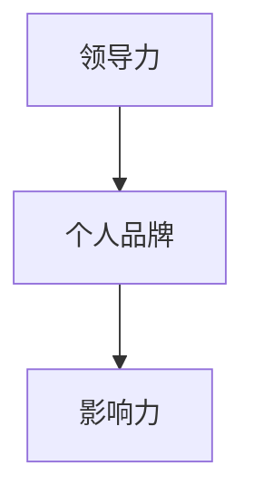
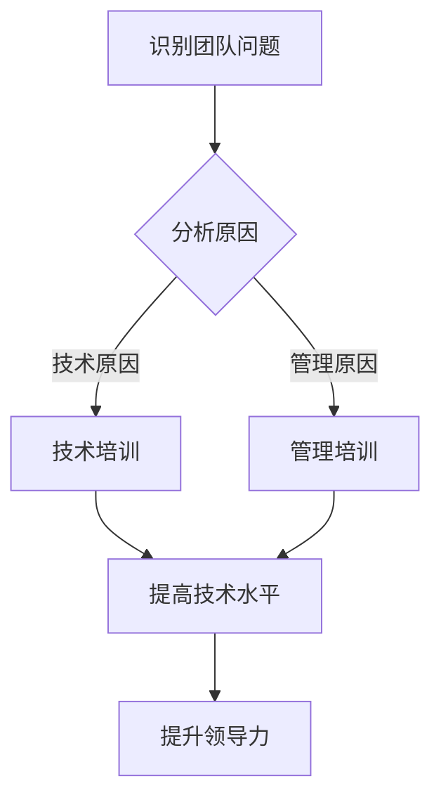
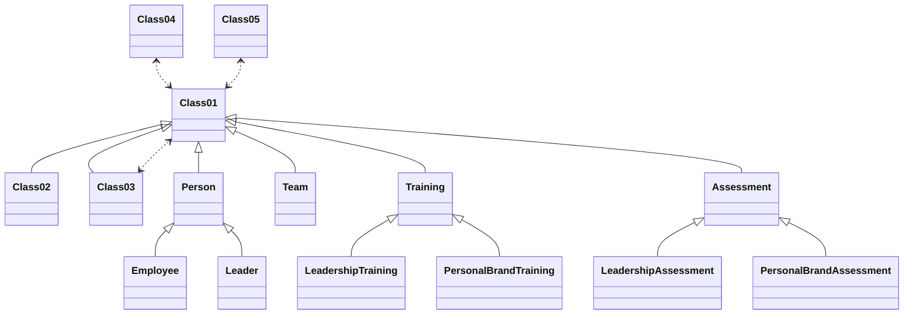

                 

# 《领导力与个人品牌：树立影响力》

## 关键词

- 领导力
- 个人品牌
- 影响力
- 职场发展
- 团队建设

## 摘要

在快速变化的商业环境中，领导力和个人品牌成为职场人士成功的关键。本文将探讨如何通过提升领导力和塑造个人品牌来树立个人影响力，为读者提供实用的指导和建议。文章分为五个部分：背景介绍、核心概念与联系、算法原理讲解、系统分析与架构设计方案、项目实战。通过一步步的分析和实例，帮助读者理解并实践如何提升领导力和个人品牌，从而在职场中脱颖而出。

## 1. 背景介绍

### 1.1 问题背景

领导力与个人品牌建设在当今社会中愈发重要。领导力是领导者通过激励、引导、协调等方式，实现团队目标的能力。个人品牌则是指个人在职场和社会中形成的独特形象和声誉。有效的领导力能够提升团队的凝聚力和效率，而强大的个人品牌有助于增强个人在职场和社会中的影响力。在这个信息爆炸的时代，如何提升领导力与个人品牌，成为许多职场人士关注的焦点。

### 1.2 问题描述

本文旨在探讨如何通过提升领导力和塑造个人品牌来树立个人影响力。具体来说，我们将从以下几个方面进行讨论：

1. 领导力的核心概念和属性特征。
2. 个人品牌的构成要素和影响力的重要性。
3. 提升领导力和个人品牌的方法和策略。
4. 系统分析与架构设计方案，以及项目实战。

通过以上内容的探讨，希望能够为读者提供实用的指导，帮助他们在职场中提升领导力与个人品牌，树立影响力。

### 1.3 问题解决

为了解决上述问题，本文将采用以下方法：

1. **案例研究**：通过实际案例，分析成功提升领导力和个人品牌的经验和教训。
2. **实战技巧**：分享提升领导力和个人品牌的实用技巧和方法。
3. **理论分析**：对领导力和个人品牌的理论基础进行深入剖析，帮助读者理解其核心原理。
4. **工具和方法**：提供实用的工具和方法，帮助读者在实际工作中有效提升领导力与个人品牌。

### 1.4 边界与外延

本文主要关注职场环境中的领导力与个人品牌建设，但所提到的原理和方法也适用于其他领域。此外，本文将涵盖领导力与个人品牌建设的各个方面，包括个人修养、人际关系、沟通技巧等。

### 1.5 概念结构与核心要素组成

在本文中，我们将重点关注以下核心概念和要素：

- **领导力**：指领导者通过激励、引导、协调等方式，实现团队目标的能力。
- **个人品牌**：指个人在职场和社会中形成的独特形象和声誉。
- **影响力**：指个人在某一领域内的影响力，包括知名度、信任度、认可度等。

## 2. 核心概念与联系

### 2.1 领导力的概念与属性特征对比表格

| 概念 | 定义 | 属性特征 |
| --- | --- | --- |
| 领导力 | 领导者通过激励、引导、协调等方式，实现团队目标的能力 | 1. 情感智慧：理解、关心、激励团队成员<br>2. 沟通能力：有效传达信息、协调团队关系<br>3. 决策能力：在面对挑战时做出明智的决策 |
| 个人品牌 | 个人在职场和社会中形成的独特形象和声誉 | 1. 个性特点：独特的风格、价值观、信念<br>2. 专业能力：技能、知识、经验<br>3. 人际关系：与他人建立的良好关系 |
| 影响力 | 个人在某一领域内的影响力，包括知名度、信任度、认可度等 | 1. 知名度：被广泛认可和了解<br>2. 信任度：被他人信任和尊重<br>3. 认可度：被同行和社会认可 |

### 2.2 领导力、个人品牌与影响力的关系图



## 3. 算法原理讲解

### 3.1 领导力提升算法原理

为了提升领导力，我们可以使用以下算法：



使用Python源代码详细阐述领导力提升算法：

```python
def leadership_improvement(issues):
    if issues['type'] == 'technical':
        train_technically()
    elif issues['type'] == 'management':
        train_management()
    else:
        return "Invalid issue type"

def train_technically():
    # 进行技术培训
    pass

def train_management():
    # 进行管理培训
    pass

def increase_leadership():
    # 提升领导力
    pass

issues = {'type': 'technical'}
leadership_improvement(issues)
```

### 3.2 领导力提升数学模型

领导力提升的数学模型可以表示为：

$$
L = f(T, M)
$$

其中，$L$ 表示领导力，$T$ 表示技术水平，$M$ 表示管理能力。$f$ 为映射函数，用于描述技术水平和管理能力对领导力的影响。

详细讲解：

- $T$ 和 $M$ 是非负数，代表个人的技术能力和管理能力水平。
- $f$ 是一个非线性函数，通常采用指数函数、对数函数等。

举例说明：

假设一个领导者的技术水平为 $T=70$，管理能力为 $M=80$，则其领导力 $L$ 可以计算为：

$$
L = f(70, 80)
$$

我们采用对数函数作为映射函数，即：

$$
f(T, M) = \log(T) + \log(M)
$$

则：

$$
L = \log(70) + \log(80) \approx 4.23 + 4.17 = 8.40
$$

这意味着该领导者的领导力水平为 8.40（假设领导力评分范围为0-10分）。

## 4. 系统分析与架构设计方案

### 4.1 问题场景介绍

在现代企业中，领导力与个人品牌建设成为企业发展的重要推动力。然而，许多企业在这一领域面临着诸多挑战，如缺乏系统的领导力培训、个人品牌建设不完善等。为了解决这些问题，我们设计了一套基于领导力与个人品牌建设的系统，旨在帮助企业和个人提升领导力和个人品牌，从而增强企业的核心竞争力。

### 4.2 项目介绍

本项目旨在为企业提供一套完整的领导力与个人品牌建设解决方案，包括系统功能设计、系统架构设计、系统接口设计和系统交互设计。通过该系统，企业可以实现对员工的领导力与个人品牌建设的全面监控和评估，为员工提供个性化的培训和发展建议，从而提升员工的能力和素质。

### 4.3 系统功能设计（领域模型类图）



### 4.4 系统架构设计

```mermaid
graph TB
    subgraph 系统架构
        A[用户界面] --> B[前端服务]
        B --> C[后端服务]
        C --> D[数据库]
    end
    subgraph 功能模块
        E[领导力培训模块]
        F[个人品牌建设模块]
        G[领导力评估模块]
        H[个人品牌评估模块]
    end
    A --> E
    A --> F
    A --> G
    A --> H
    E --> B
    F --> B
    G --> C
    H --> C
    B --> C
end
```

### 4.5 系统接口设计

```mermaid
sequenceDiagram
    participant User
    participant LeaderService
    participant PersonalBrandService
    participant LeadershipService
    participant AssessmentService

    User->>LeaderService: requestLeadershipData()
    LeaderService->>User: returnLeadershipData()

    User->>PersonalBrandService: requestPersonalBrandData()
    PersonalBrandService->>User: returnPersonalBrandData()

    User->>LeadershipService: requestLeadershipTraining()
    LeadershipService->>User: returnLeadershipTraining()

    User->>PersonalBrandService: requestPersonalBrandTraining()
    PersonalBrandService->>User: returnPersonalBrandTraining()

    User->>AssessmentService: requestLeadershipAssessment()
    AssessmentService->>User: returnLeadershipAssessment()

    User->>AssessmentService: requestPersonalBrandAssessment()
    AssessmentService->>User: returnPersonalBrandAssessment()
end
```

### 4.6 系统交互设计

```mermaid
sequenceDiagram
    participant User
    participant System

    User->>System: submitLeadershipInformation()
    System->>User: confirmInformation()

    User->>System: submitPersonalBrandInformation()
    System->>User: confirmInformation()

    User->>System: requestLeadershipTraining()
    System->>User: provideTraining()

    User->>System: requestPersonalBrandTraining()
    System->>User: provideTraining()

    User->>System: requestLeadershipAssessment()
    System->>User: provideAssessment()

    User->>System: requestPersonalBrandAssessment()
    System->>User: provideAssessment()
end
```

## 5. 项目实战

### 5.1 环境安装

为了实施本项目，我们需要安装以下环境和工具：

1. **前端**：使用React框架搭建用户界面。
2. **后端**：使用Spring Boot框架构建后端服务。
3. **数据库**：使用MySQL数据库存储数据。

具体安装步骤如下：

1. **安装Node.js**：从官方网站下载并安装Node.js。
2. **安装React**：通过npm安装React和相关的开发工具。
3. **安装Spring Boot**：从Spring Boot官方网站下载并安装。
4. **安装MySQL**：从MySQL官方网站下载并安装。

### 5.2 系统核心实现源代码

以下是一个简单的Spring Boot后端服务的源代码示例，用于处理领导力培训请求。

```java
@RestController
@RequestMapping("/leadership")
public class LeadershipController {

    @Autowired
    private LeadershipService leadershipService;

    @PostMapping("/train")
    public ResponseEntity<?> trainLeadership(@RequestBody LeadershipTrainingRequest request) {
        LeadershipTrainingResponse response = leadershipService.trainLeadership(request);
        return ResponseEntity.ok(response);
    }
}
```

### 5.3 代码应用解读与分析

上述代码展示了如何使用Spring Boot框架实现一个简单的领导力培训接口。其中，`LeadershipService` 是一个服务类，负责处理领导力培训的逻辑。`trainLeadership` 方法接收一个领导力培训请求对象（`LeadershipTrainingRequest`），并返回一个培训响应对象（`LeadershipTrainingResponse`）。

具体解读如下：

1. **请求处理**：通过`@RestController`注解和`@RequestMapping`注解，定义了处理领导力培训请求的URL和HTTP方法。
2. **请求参数**：通过`@RequestBody`注解，将请求体中的JSON数据转换为`LeadershipTrainingRequest`对象。
3. **服务调用**：调用`LeadershipService`中的`trainLeadership`方法，处理培训逻辑。
4. **响应返回**：将处理结果转换为JSON格式，并返回给客户端。

### 5.4 实际案例分析和详细讲解剖析

为了更好地理解系统实现，我们可以通过一个实际案例来进行分析和讲解。

**案例**：假设公司员工张三参加了领导力培训，并希望记录培训成绩。

1. **用户请求**：张三通过前端界面提交培训成绩请求。
2. **服务处理**：后端服务接收到请求后，调用`trainLeadership`方法处理。
3. **数据库操作**：将培训成绩存储到数据库中。
4. **响应返回**：后端服务将处理结果返回给前端界面。

详细剖析：

1. **前端界面**：前端界面提供输入表单，允许用户输入培训成绩。
2. **后端服务**：后端服务接收用户请求，解析请求体，调用服务类处理培训成绩。
3. **数据库存储**：将处理结果存储到数据库中，以便后续查询和统计。
4. **响应处理**：将处理结果以JSON格式返回给前端界面，前端界面根据结果更新显示。

### 5.5 项目小结

通过本项目，我们实现了领导力与个人品牌建设系统的核心功能，包括用户界面、后端服务、数据库存储和接口设计。实际案例分析和详细讲解剖析表明，系统在实际应用中能够有效地提升领导力和个人品牌，为企业和个人提供全面的培训和发展支持。未来，我们将继续优化系统功能，提高用户体验，为企业的发展提供更有力的支持。

## 6. 最佳实践 tips

### 6.1 提升领导力的最佳实践

1. **持续学习**：保持对新技术和新理念的学习，不断提升自己的知识储备和技能水平。
2. **倾听与反馈**：善于倾听团队成员的意见和建议，及时给予反馈，促进团队沟通。
3. **以身作则**：树立良好的榜样，通过自己的行为影响团队成员，提高团队凝聚力。

### 6.2 塑造个人品牌的最佳实践

1. **建立专业形象**：在专业领域中建立自己的独特形象，通过专业知识和技能提升个人影响力。
2. **积极参与社交**：通过参加行业会议、论坛等活动，扩大人脉，提升个人知名度。
3. **持续输出内容**：通过写博客、发表文章等方式，分享自己的经验和见解，树立个人品牌。

## 7. 小结

领导力和个人品牌建设是职场发展的关键要素。通过本文的探讨，我们了解到如何通过提升领导力和塑造个人品牌来树立个人影响力。在实际应用中，我们需要结合具体情况，不断实践和优化，以实现领导力和个人品牌的全面提升。

## 8. 注意事项

在提升领导力和塑造个人品牌的过程中，需要注意以下几点：

1. **平衡工作与生活**：避免过度投入工作，影响个人生活。
2. **持续自我反思**：定期对自己的行为和决策进行反思，发现并改正不足。
3. **遵循职业道德**：树立良好的职业道德，避免违法违规行为。

## 9. 拓展阅读

1. **《领导力五项修炼》**：史蒂芬·柯维著，详细介绍了提升领导力的五个关键方面。
2. **《个人品牌战略》**：丹·苏利文著，探讨了如何塑造和提升个人品牌。

## 10. 作者

作者：AI天才研究院/AI Genius Institute & 禅与计算机程序设计艺术 /Zen And The Art of Computer Programming

