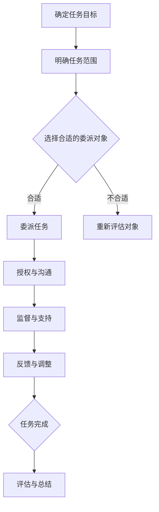
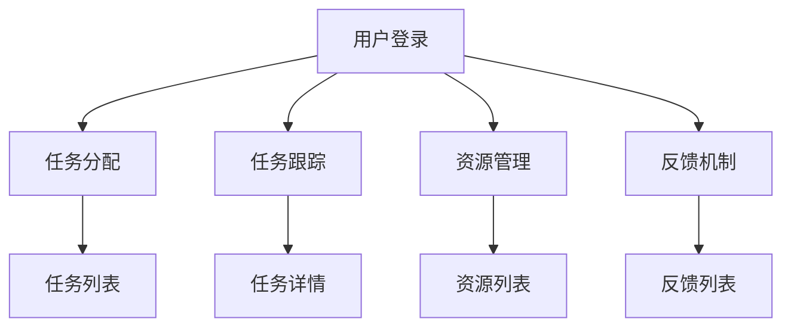
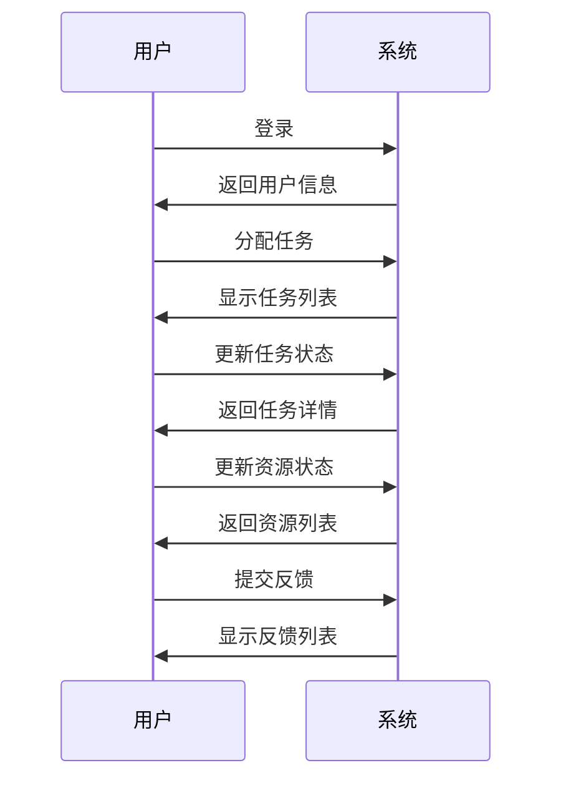

                 

### 第一部分：领导力与任务委派概述

#### 第1章：领导力与任务委派的背景与意义

**1.1 领导力的定义与核心要素**

领导力是指一种影响力，它能够激励和引导他人实现共同的目标。根据彼得·德鲁克（Peter Drucker）的定义，领导力是一种“在他人心中引发信任和信心”的能力。这种能力不仅仅局限于管理职位，而是存在于所有层次和领域中。

核心要素包括：

- **愿景（Vision）**：能够清晰地描述未来的方向和目标。
- **决策能力（Decision-Making）**：在面对复杂问题时能够做出明智的决策。
- **沟通能力（Communication）**：能够有效地与团队成员进行沟通和协调。
- **激励能力（Motivation）**：能够激励团队成员发挥最大的潜力。
- **影响力（Influence）**：能够影响和改变他人的行为和态度。

**1.2 任务委派的定义与重要性**

任务委派是指领导者将特定的任务和责任分配给下属的过程。这个过程不仅能够提升团队成员的能力和自信心，还能够提高整个团队的工作效率。

任务委派的重要性体现在以下几个方面：

- **资源优化**：通过任务委派，领导者可以将自己的时间和精力集中在更重要的事情上。
- **团队成长**：任务委派能够为团队成员提供学习和成长的机会。
- **提升团队士气**：当团队成员感受到被信任和重视时，他们的士气和工作积极性会显著提高。
- **提高决策效率**：任务委派能够加快决策过程，提高决策的准确性。

**1.3 有效授权的艺术**

有效授权不仅仅是将任务分配给下属，更重要的是要确保下属有足够的资源和支持来完成这些任务。以下是有效授权的几个关键点：

- **明确任务和期望**：在委派任务时，领导者需要明确任务的性质、目标和期望的结果。
- **赋予决策权**：领导者应该给予下属足够的决策权，以便他们能够在任务执行过程中做出适当的调整。
- **提供必要的支持**：领导者需要确保下属在任务执行过程中有足够的资源和指导。
- **建立反馈机制**：领导者需要定期与下属进行沟通，了解任务进展情况，并提供必要的反馈和支持。

通过上述步骤，领导者可以有效地委派任务，提高团队的整体绩效，并促进个人与组织的共同成长。

### 第2章：领导力与任务委派的框架与模型

#### 2.1 领导力发展的阶段模型

领导力发展是一个持续的过程，根据加里·哈梅尔（Gary Hamel）和米歇尔·拉姆（Michael Lamm）的研究，领导力发展可以分为以下几个阶段：

- **认知阶段**：领导者认识到领导力的重要性，并开始思考如何提升自己的领导能力。
- **行为阶段**：领导者开始尝试应用领导力技能，并通过实践来不断改进。
- **关系阶段**：领导者开始将领导力应用于建立和维护与团队成员之间的关系。
- **系统阶段**：领导者能够将领导力融入到组织的系统和流程中，实现持续的创新和成长。

**2.2 任务委派的层次模型**

任务委派可以分为三个层次：

- **简单委派**：领导者将任务分配给下属，并给予有限的指导和支持。
- **复杂委派**：领导者将复杂的任务分配给下属，并要求下属在任务执行过程中进行自主决策。
- **战略委派**：领导者将战略性的任务分配给下属，并赋予他们全面的决策权和资源。

**2.3 有效授权的关键要素**

有效授权的关键要素包括：

- **明确任务和目标**：领导者需要明确任务的性质和目标，以便下属能够清楚地了解任务的要求。
- **赋予决策权**：领导者应该给予下属足够的决策权，以便他们能够在任务执行过程中做出适当的调整。
- **提供支持**：领导者需要确保下属在任务执行过程中有足够的资源和指导。
- **建立反馈机制**：领导者需要定期与下属进行沟通，了解任务进展情况，并提供必要的反馈和支持。

通过上述模型和要素，领导者可以更有效地委派任务，提升团队的整体绩效，并促进个人与组织的共同成长。

### 第3章：明确任务委派的目标与范围

#### 3.1 确定任务目标

确定任务目标是任务委派过程中的关键步骤。明确的目标能够帮助团队成员更好地理解任务的重要性，并激发他们的工作动力。以下是确定任务目标的一些要点：

- **具体性**：目标应该具体、明确，避免模糊不清的描述。
- **可实现性**：目标应该是可实现的，考虑到团队成员的能力和资源。
- **相关性**：目标应该与团队和组织的整体目标保持一致。
- **时限性**：目标应该设定明确的完成时限。

**3.2 明确任务范围**

明确任务范围是为了确保团队成员在任务执行过程中不会超出他们的职责范围。以下是明确任务范围的一些要点：

- **职责界定**：明确每个团队成员的职责和权限，避免任务重叠和职责不清。
- **任务边界**：界定任务的边界，明确哪些工作内容属于任务范围，哪些工作内容不属于任务范围。
- **资源需求**：明确任务所需的关键资源，包括人力资源、技术资源和财务资源。

**3.3 制定任务委派计划**

制定任务委派计划是为了确保任务委派过程的顺利进行。以下是制定任务委派计划的一些要点：

- **分配任务**：根据团队成员的能力和兴趣，合理分配任务。
- **时间安排**：合理安排任务的时间，确保任务能够在预定的时间内完成。
- **监督机制**：建立监督机制，定期跟踪任务的进展情况。
- **沟通机制**：建立沟通机制，确保团队成员在任务执行过程中能够及时交流和解决问题。

通过上述步骤，领导者可以更科学地确定任务目标与范围，确保任务委派的有效性，提高团队的整体绩效。

### 第4章：选择合适的委派对象

#### 4.1 了解员工的能力与潜力

选择合适的委派对象是任务委派成功的关键。领导者需要深入了解员工的能力与潜力，以便将任务分配给最适合的人选。以下是了解员工能力与潜力的一些方法：

- **绩效评估**：通过定期进行的绩效评估，了解员工的工作表现和能力水平。
- **工作反馈**：与员工进行定期的一对一沟通，获取员工对自己工作表现的反馈。
- **能力评估工具**：使用能力评估工具，如技能测试和360度评估，来更全面地了解员工的能力。
- **潜力评估**：通过观察员工在面临挑战时的表现，评估他们的潜力和成长空间。

**4.2 评估员工的动机与意愿**

员工的动机与意愿是影响任务委派成功的重要因素。以下是评估员工动机与意愿的一些方法：

- **工作满意度调查**：通过工作满意度调查，了解员工对当前工作环境的感受。
- **个人发展计划**：与员工讨论他们的个人发展计划，了解他们对自己职业发展的期望。
- **自我评估**：鼓励员工进行自我评估，了解他们对接受任务的态度和意愿。
- **团队沟通**：通过团队沟通，了解员工对团队目标和任务的认同度。

**4.3 选择合适的委派对象**

在选择合适的委派对象时，领导者需要综合考虑员工的能力、潜力和动机。以下是选择合适委派对象的一些原则：

- **能力匹配**：确保委派的任务与员工的能力相匹配，避免任务过于复杂或过于简单。
- **潜力挖掘**：优先考虑具有潜力的员工，为他们提供更多的成长机会。
- **意愿强烈**：选择对任务有强烈意愿的员工，确保他们能够全身心地投入到任务中。

通过上述步骤，领导者可以更科学地选择合适的委派对象，确保任务委派的成功，提高团队的整体绩效。

### 第5章：委派任务与授权的过程

#### 5.1 委派任务的沟通技巧

委派任务的过程实际上是领导者与团队成员之间的一种沟通活动。有效的沟通技巧对于任务委派的成功至关重要。以下是委派任务时的一些沟通技巧：

- **明确表达**：在委派任务时，领导者需要用明确的语言表达任务的要求和期望，避免产生误解。
- **倾听**：领导者需要倾听团队成员的意见和反馈，了解他们的需求和困难。
- **情感共鸣**：在沟通时，领导者应该努力建立情感共鸣，让团队成员感受到他们的意见和感受被重视。
- **提问与确认**：在沟通过程中，领导者可以通过提问和确认来确保双方对任务的理解是一致的。

**5.2 授权的原则与方式**

授权是指领导者将决策权和资源分配给下属的过程。有效的授权能够提高团队的自主性和工作效率。以下是授权的一些原则和方式：

- **信任**：授权的基础是信任，领导者需要相信下属有能力完成任务。
- **明确责任**：在授权时，领导者需要明确下属的责任和权限，避免模糊不清的授权。
- **提供支持**：领导者需要为下属提供必要的资源和指导，确保他们能够在任务执行过程中顺利完成任务。
- **反馈与沟通**：领导者需要定期与下属进行沟通，了解任务进展情况，并提供必要的反馈和支持。

**5.3 建立有效的反馈机制**

建立有效的反馈机制是确保任务委派成功的关键。以下是建立有效反馈机制的一些方法：

- **定期会议**：定期召开会议，讨论任务进展情况和存在的问题。
- **实时沟通**：鼓励团队成员在遇到问题时及时沟通，确保问题能够得到及时解决。
- **反馈表格**：使用反馈表格来记录和跟踪任务进展情况，确保任务按照计划进行。
- **奖励机制**：对完成任务出色的团队成员进行奖励，提高他们的工作积极性。

通过上述沟通技巧、授权原则和反馈机制，领导者可以更有效地委派任务，提高团队的整体绩效，促进个人与组织的共同成长。

### 第6章：监督与支持委派任务的执行

#### 6.1 监督委派任务的过程

监督委派任务的过程是确保任务按计划顺利完成的重要环节。以下是监督任务执行的一些要点：

- **定期检查**：领导者需要定期检查任务的进展情况，确保任务在预定时间内进行。
- **数据监控**：通过收集和分析数据，了解任务的实际进展情况，并与计划进行比较。
- **问题预警**：及时发现任务执行过程中可能出现的问题，并采取措施进行预警和解决。
- **跟踪记录**：记录任务执行的每个步骤，以便在需要时进行回顾和分析。

**6.2 提供必要的资源与支持**

为了确保任务能够顺利执行，领导者需要为团队成员提供必要的资源和支持。以下是提供资源和支持的一些方法：

- **技术支持**：确保团队成员在技术方面有足够的资源，包括软件、硬件和技术文档。
- **培训与指导**：为团队成员提供必要的培训和指导，帮助他们掌握完成任务所需的技能。
- **时间管理**：合理安排团队成员的工作时间，确保他们有足够的时间来完成任务。
- **沟通渠道**：建立畅通的沟通渠道，确保团队成员在遇到问题时能够及时寻求帮助。

**6.3 避免过度干预**

在监督任务执行的过程中，领导者需要避免过度干预，以免影响团队成员的自主性和创新能力。以下是避免过度干预的一些方法：

- **信任**：领导者应该信任团队成员，给予他们足够的自主权，让他们在任务执行过程中发挥创造性。
- **适度监督**：领导者应该适度监督任务执行，确保任务按照计划进行，但不要过度干预。
- **支持**：在团队成员需要帮助时，领导者应该及时提供支持，而不是直接介入任务执行。
- **反馈**：领导者应该通过反馈来指导团队成员，而不是通过直接指令来指导。

通过有效的监督与支持，领导者可以确保任务按计划执行，同时激发团队成员的创造力和自主性，促进个人与组织的共同成长。

### 第7章：领导力与任务委派的挑战与解决方案

#### 7.1 挑战与问题分析

在领导力和任务委派的过程中，领导者往往会面临一系列挑战和问题。以下是这些挑战的详细分析：

- **沟通不畅**：任务委派过程中，由于沟通不畅，可能导致下属对任务理解不透彻，或者领导者无法及时获取任务进展的信息。
- **资源不足**：下属在执行任务时可能会遇到资源不足的问题，包括人力、物力和财力资源。
- **目标不明确**：如果任务的目标不明确，下属可能会在执行过程中产生迷茫，无法有效地完成任务。
- **责任模糊**：在任务委派过程中，如果责任和权限不明确，可能会导致任务执行过程中出现推诿和责任不清的情况。
- **监督过度**：领导者如果过度干预任务执行过程，可能会抑制下属的自主性和创造力。

#### 7.2 解决方案与策略

针对上述挑战，以下是具体的解决方案和策略：

- **改善沟通**：领导者可以通过定期会议、邮件和即时通讯工具来改善沟通。同时，使用可视化工具（如流程图和进度图表）来确保信息的透明和清晰。
- **资源优化**：领导者需要合理分配资源，确保团队成员在任务执行过程中有足够的资源支持。可以通过资源调配、优先级排序和资源共享来优化资源使用。
- **明确目标**：在任务委派前，领导者需要明确任务的目标和期望结果，并将其传达给下属。可以使用SMART（具体、可衡量、可实现、相关性、时限性）原则来制定目标。
- **责任界定**：领导者需要明确每个团队成员的职责和权限，确保任务执行过程中责任清晰。可以使用责任矩阵（RACI矩阵）来明确责任和权限。
- **适度监督**：领导者应该适度监督任务执行，避免过度干预。可以使用关键绩效指标（KPI）来监控任务进展，并定期与下属进行沟通，了解任务的实际进展情况。

#### 7.3 成功案例分享

以下是一些成功案例，展示了如何通过有效的领导力和任务委派来实现目标：

- **案例一**：某科技公司通过实施敏捷开发方法，将任务委派给各个小组，每个小组都拥有独立的决策权和资源。通过定期的Scrum会议和回顾会议，团队保持了高效的沟通和进度控制，成功推出了多款新产品。
- **案例二**：某创业公司通过明确的目标设定和责任分配，将一个复杂的营销项目委派给一个跨部门团队。团队成员在项目执行过程中得到了充分的资源和支持，最终在规定的时间内完成了项目，并达到了预期效果。
- **案例三**：某非营利组织通过建立有效的反馈机制和信任文化，成功地将任务委派给志愿者团队。通过定期的反馈和沟通，团队保持了高效的工作状态，并在社区活动中取得了显著的成果。

通过这些案例，我们可以看到，有效的领导力和任务委派不仅可以提高团队的工作效率，还可以促进个人和组织的共同成长。

### 第8章：总结与展望

#### 8.1 领导力与任务委派的重要性

领导力与任务委派在组织发展中扮演着至关重要的角色。有效的领导力能够激发团队成员的潜力，推动他们为实现共同目标而努力。而任务委派则是实现这一目标的关键手段，它不仅能够提高团队的工作效率，还能够促进团队成员的个人成长。

#### 8.2 个人与组织的发展

对于个人来说，通过有效的任务委派，团队成员可以学习新技能、提升能力，并在实践中积累经验。这种成长不仅能够提高个人的职业竞争力，还能够增强他们对组织的忠诚度和归属感。

对于组织来说，有效的领导力和任务委派可以提升整个团队的协作效率，减少决策层级，提高组织的灵活性和响应速度。同时，通过任务委派，组织能够培养出更多的领导者，为未来的发展储备人才。

#### 8.3 未来发展趋势与展望

随着人工智能和自动化技术的发展，领导力和任务委派的方式也在不断演进。未来的领导力将更加注重数字化技能和创新能力，任务委派将更加智能化和个性化。领导者需要不断学习新技能，适应快速变化的工作环境。

同时，随着远程工作和全球化团队的兴起，领导者需要具备更强的沟通和协调能力，以克服地理和文化的障碍。未来的领导力和任务委派将更加注重远程协作工具和技术的应用，以实现更高效的工作流程。

总之，领导力与任务委派是组织成功的关键要素。通过不断地学习和实践，领导者可以提升自己的领导力，有效地委派任务，推动个人和组织的共同发展。未来的发展趋势将为我们提供更多的机遇和挑战，领导者需要紧跟时代步伐，不断创新和进步。作者：AI天才研究院/AI Genius Institute & 禅与计算机程序设计艺术 /Zen And The Art of Computer Programming

---

### 背景介绍

#### 核心概念术语说明

在探讨领导力与任务委派之前，我们首先需要明确几个核心概念：

1. **领导力**：指一种影响他人并推动他们实现共同目标的能力。
2. **任务委派**：是指领导者将任务分配给下属，并赋予他们一定的自主权和责任的过程。
3. **授权**：是领导者在委派任务时，赋予下属决策权和资源的过程。
4. **目标明确**：设定具体、可衡量、可实现、相关性、时限性的目标，以便团队成员清楚地了解任务的要求和期望。
5. **沟通技巧**：指在任务委派过程中，领导者如何有效地与下属进行沟通，以确保信息的准确传递和理解的深度。
6. **反馈机制**：是领导者通过定期检查和沟通，了解任务进展，提供必要支持和指导的机制。

#### 问题背景

在当前快速变化的工作环境中，领导者面临越来越大的压力，需要高效地管理团队，推动项目的顺利进行。然而，许多领导者发现，他们花费了大量时间在具体任务上，而忽略了战略层面的决策和规划。这种现象导致团队效率低下，个人和组织的潜力无法充分发挥。

#### 问题描述

问题描述主要集中在以下几个方面：

1. **任务委派不当**：领导者可能因为不信任下属、对任务目标不明确或沟通不畅等原因，导致任务委派不当。
2. **资源分配不均**：下属在执行任务时，可能会遇到资源不足的问题，包括人力资源、技术和财务资源。
3. **监督过度**：领导者可能因为担心任务无法按时完成，而过度干预下属的工作，抑制了他们的自主性和创造力。
4. **反馈机制缺失**：任务执行过程中的反馈机制不健全，导致领导者无法及时了解任务进展，也无法提供必要的支持。

#### 问题解决

为了解决上述问题，领导者需要：

1. **明确任务目标**：使用SMART原则（具体、可衡量、可实现、相关性、时限性）设定明确的目标，确保团队成员对任务有清晰的认识。
2. **有效沟通**：在任务委派过程中，使用有效的沟通技巧，确保信息的准确传递和理解。
3. **合理授权**：赋予下属足够的决策权和资源，让他们在任务执行过程中有足够的自主权。
4. **建立反馈机制**：定期与下属沟通，了解任务进展，提供必要的支持和指导，确保任务按计划进行。

#### 边界与外延

边界与外延涉及到任务委派的适用范围和限制。任务委派并不是适用于所有情况，它需要考虑以下几个因素：

1. **任务性质**：一些战略性和创新性的任务可能不适合委派，需要由领导者亲自负责。
2. **员工能力**：下属需要具备完成任务的必要能力和经验，否则委派可能会适得其反。
3. **组织文化**：组织需要具备开放和支持性的文化，才能有效实施任务委派。
4. **时间与资源**：领导者需要在时间安排和资源分配上做出合理安排，确保任务委派能够顺利进行。

#### 概念结构与核心要素组成

概念结构涉及到领导力与任务委派的核心要素和它们之间的关系。以下是领导力与任务委派的核心概念及其相互关系：

1. **领导力**（核心概念）：愿景、决策能力、沟通能力、激励能力、影响力。
   - **关系**：这些要素相互关联，共同构成了领导力的整体框架。

2. **任务委派**（核心概念）：任务分配、授权、支持、反馈。
   - **关系**：任务委派是在领导力的指导下进行的，领导力决定了任务委派的效果。

3. **授权**（核心概念）：决策权、资源、支持。
   - **关系**：授权是任务委派的核心，它决定了下属在任务执行过程中的自主性和创造性。

4. **目标明确**（核心概念）：具体性、可实现性、相关性、时限性。
   - **关系**：明确的目标是任务委派成功的基础，它为团队成员提供了清晰的方向。

5. **沟通技巧**（核心概念）：明确表达、倾听、情感共鸣、提问与确认。
   - **关系**：有效的沟通技巧是确保任务委派顺利进行的关键。

6. **反馈机制**（核心概念）：定期检查、数据监控、问题预警、跟踪记录。
   - **关系**：反馈机制是监督任务执行和提供支持的重要手段。

通过上述核心概念及其相互关系的理解，领导者可以更有效地实施任务委派，推动团队和组织的共同发展。

### 核心概念与联系

#### 核心概念原理

在本章节中，我们将探讨领导力与任务委派的核心概念，并分析它们之间的相互关系。这些核心概念包括领导力、任务委派、授权、目标明确、沟通技巧和反馈机制。

**1. 领导力**

领导力是一种在他人心中引发信任和信心的影响力，能够激励和引导他人实现共同的目标。领导力的核心要素包括：

- **愿景**：领导者需要具备明确的前瞻性，能够描述未来的发展方向和目标。
- **决策能力**：在复杂和不确定的环境下，领导者需要能够快速做出明智的决策。
- **沟通能力**：有效的沟通是领导者与团队成员之间建立信任和理解的基础。
- **激励能力**：领导者需要能够激发团队成员的内在动机，使其发挥最大的潜力。
- **影响力**：领导者通过言行影响和改变他人的行为和态度。

**2. 任务委派**

任务委派是指领导者将特定的任务和责任分配给下属的过程。任务委派的关键在于明确任务的性质、目标和期望的结果，以及为下属提供必要的资源和支持。

- **任务分配**：领导者需要根据团队成员的能力和兴趣，合理分配任务。
- **授权**：领导者需要赋予下属足够的自主权和资源，以使其能够独立完成任务。
- **支持**：领导者需要为下属提供必要的指导和支持，确保任务能够顺利完成。

**3. 授权**

授权是领导者在委派任务时，赋予下属决策权和资源的过程。有效的授权能够提高团队的自主性和工作效率。

- **决策权**：领导者需要给予下属在任务执行过程中的决策权，使其能够根据实际情况做出调整。
- **资源**：领导者需要为下属提供完成任务所需的资源，包括人力、物力和财力。
- **支持**：领导者需要为下属提供必要的指导和支持，确保他们在任务执行过程中能够顺利进行。

**4. 目标明确**

明确的目标是任务委派成功的基础。领导者需要使用SMART原则（具体、可衡量、可实现、相关性、时限性）来设定目标，确保团队成员对任务有清晰的认识。

- **具体性**：目标需要具体、明确，避免模糊不清的描述。
- **可衡量性**：目标需要具备可衡量性，以便能够评估任务的进展和结果。
- **可实现性**：目标需要考虑团队成员的能力和资源，确保是可实现的。
- **相关性**：目标需要与团队和组织的整体目标保持一致。
- **时限性**：目标需要设定明确的完成时限，以便团队成员能够按计划进行工作。

**5. 沟通技巧**

在任务委派过程中，沟通技巧至关重要。领导者需要通过有效的沟通，确保信息的准确传递和理解。

- **明确表达**：领导者需要用清晰的语言表达任务的要求和期望。
- **倾听**：领导者需要倾听下属的意见和反馈，了解他们的需求和困难。
- **情感共鸣**：领导者需要建立情感共鸣，让下属感受到他们的意见和感受被重视。
- **提问与确认**：领导者需要通过提问和确认来确保双方对任务的理解是一致的。

**6. 反馈机制**

建立有效的反馈机制是确保任务委派成功的关键。反馈机制包括定期检查、数据监控、问题预警和跟踪记录。

- **定期检查**：领导者需要定期检查任务的进展情况，确保任务按计划进行。
- **数据监控**：通过收集和分析数据，领导者可以了解任务的实际进展情况，并与计划进行比较。
- **问题预警**：领导者需要及时发现任务执行过程中可能出现的问题，并采取措施进行预警和解决。
- **跟踪记录**：记录任务执行的每个步骤，以便在需要时进行回顾和分析。

#### 概念属性特征对比表格

以下是一个对比表格，展示了上述核心概念的属性特征：

| 核心概念 | 属性特征 |
| --- | --- |
| 领导力 | - 愿景 | - 决策能力 | - 沟通能力 | - 激励能力 | - 影响力 |
| 任务委派 | - 任务分配 | - 授权 | - 支持 |
| 授权 | - 决策权 | - 资源 | - 支持 |
| 目标明确 | - 具体性 | - 可衡量性 | - 可实现性 | - 相关性 | - 时限性 |
| 沟通技巧 | - 明确表达 | - 倾听 | - 情感共鸣 | - 提问与确认 |
| 反馈机制 | - 定期检查 | - 数据监控 | - 问题预警 | - 跟踪记录 |

通过对比表格，我们可以更清晰地理解每个核心概念的特点和相互关系。

#### ER实体关系图架构

为了更好地展示领导力与任务委派中的核心概念及其关系，我们可以使用ER（实体关系）图来构建实体关系图架构。

以下是一个简化的ER图：

```
[领导力]
|       |
|       |
[任务委派]
|       |
|       |
[授权]
|       |
|       |
[目标明确]
|       |
|       |
[沟通技巧]
|       |
|       |
[反馈机制]
```

在这个ER图中，每个方框代表一个实体，实体之间的关系通过箭头表示。例如，“领导力”实体与“任务委派”实体之间存在关系，表示领导力是任务委派的基础。同样，“任务委派”实体与“授权”、“目标明确”、“沟通技巧”和“反馈机制”实体之间存在关系，表示这些要素都是任务委派的重要组成部分。

通过ER图，我们可以直观地理解领导力与任务委派中的核心概念及其相互关系，为后续的分析和讨论提供了基础。

### 算法原理讲解

#### 算法流程图

为了更好地理解领导力与任务委派中的关键步骤，我们可以使用Mermaid语言绘制一个算法流程图，展示任务委派的过程。



在这个流程图中，从确定任务目标开始，到任务完成的每个步骤都有明确的定义和关系。

#### 算法原理

**1. 确定任务目标**

确定任务目标是任务委派的第一步。领导者需要使用SMART原则（具体、可衡量、可实现、相关性、时限性）来设定目标，以确保团队成员对任务有清晰的认识。

**2. 明确任务范围**

明确任务范围是为了确保团队成员在执行任务时不会超出他们的职责范围。领导者需要界定任务的边界，明确哪些工作内容属于任务范围，哪些不属于。

**3. 选择合适的委派对象**

领导者需要根据员工的能力、潜力和动机，选择合适的委派对象。合适的对象应该具备完成任务所需的技能和意愿。

**4. 委派任务**

在选择了合适的委派对象后，领导者需要将任务正式委派给下属，并明确任务的要求和期望。

**5. 授权与沟通**

授权是任务委派的核心步骤。领导者需要赋予下属足够的决策权和资源，并通过有效的沟通确保他们理解任务的要求和期望。

**6. 监督与支持**

在任务执行过程中，领导者需要监督任务的进展，并提供必要的支持。这包括定期检查任务进展、提供反馈和解决下属遇到的问题。

**7. 反馈与调整**

在任务完成时，领导者需要收集反馈，评估任务的执行情况，并根据反馈进行必要的调整。

**8. 评估与总结**

最后，领导者需要对任务委派过程进行总结，评估任务委派的效果，并总结经验教训，为未来的任务委派提供参考。

#### 数学模型与公式

在任务委派过程中，一些关键步骤可以用数学模型和公式来描述。

**1. 目标设定**

使用SMART原则设定目标，公式如下：

\[ \text{目标} = \text{具体的} + \text{可衡量的} + \text{可实现的} + \text{相关的} + \text{时限性的} \]

**2. 任务范围界定**

任务范围的界定可以用以下公式表示：

\[ \text{任务范围} = \text{任务内容} + \text{任务边界} + \text{资源需求} \]

**3. 委派对象选择**

选择合适的委派对象可以用以下公式表示：

\[ \text{合适的委派对象} = \text{能力匹配} + \text{潜力挖掘} + \text{意愿强烈} \]

**4. 授权**

授权的公式如下：

\[ \text{授权} = \text{决策权} + \text{资源} + \text{支持} \]

**5. 监督与反馈**

监督与反馈的公式如下：

\[ \text{监督} = \text{定期检查} + \text{数据监控} + \text{问题预警} + \text{跟踪记录} \]
\[ \text{反馈} = \text{定期沟通} + \text{问题解决} + \text{支持} \]

#### 举例说明

假设一个项目团队需要开发一款新的软件产品。以下是任务委派过程中的一些具体步骤：

**1. 确定任务目标**

\[ \text{目标} = \text{开发一款功能完整的软件产品，并确保产品质量符合要求，项目在6个月内完成} \]

**2. 明确任务范围**

\[ \text{任务范围} = \text{需求分析} + \text{设计} + \text{编码} + \text{测试} + \text{文档编写} \]
\[ \text{任务边界} = \text{不包括市场推广和售后服务} \]
\[ \text{资源需求} = \text{开发人员} + \text{测试人员} + \text{硬件资源} + \text{软件工具} \]

**3. 选择合适的委派对象**

\[ \text{合适的委派对象} = \text{具备软件开发经验} + \text{对项目有兴趣} + \text{愿意承担额外责任} \]

**4. 委派任务**

将任务委派给一名经验丰富的开发经理，并明确任务的要求和期望。

**5. 授权**

授权开发经理在项目执行过程中拥有决策权和资源，包括：

\[ \text{授权} = \text{决策权} + \text{资源} + \text{支持} \]

**6. 监督与支持**

定期检查项目进展，提供必要的资源和支持，及时解决遇到的问题。

**7. 反馈与调整**

在项目结束时，收集开发经理的反馈，评估项目的执行情况，并根据反馈进行总结和改进。

通过上述步骤，我们可以看到任务委派的具体实施过程，以及如何使用数学模型和公式来描述这个过程。

### 系统分析与架构设计方案

#### 问题场景介绍

在一个典型的IT企业中，项目经理负责管理多个项目，并需要将任务委派给团队成员。为了确保项目顺利进行，项目经理需要设计一个系统来支持任务委派的过程。该系统应包括任务分配、任务跟踪、资源管理和反馈机制等功能。

#### 项目介绍

项目名称：任务委派管理系统

目标：设计并实现一个支持任务委派的系统，提高项目管理效率和团队协作能力。

项目周期：3个月

项目团队：项目经理、开发人员、测试人员、UI/UX设计师

#### 系统功能设计

**1. 任务分配**

- 功能描述：允许项目经理将任务分配给团队成员，并设置任务的优先级和截止日期。
- 用户操作流程：
  - 项目经理登录系统。
  - 选择需要分配的任务。
  - 查看团队成员列表。
  - 将任务分配给合适的团队成员。
  - 设置任务的优先级和截止日期。

**2. 任务跟踪**

- 功能描述：实时跟踪任务进度，包括任务的状态、完成情况和团队成员的工作量。
- 用户操作流程：
  - 项目经理或团队成员登录系统。
  - 查看任务列表。
  - 点击任务查看详细信息。
  - 更新任务状态和完成情况。

**3. 资源管理**

- 功能描述：管理团队成员的可用资源，包括人力资源、硬件资源和软件工具。
- 用户操作流程：
  - 项目经理登录系统。
  - 查看团队成员的可用资源。
  - 分配资源给团队成员。
  - 更新资源的可用状态。

**4. 反馈机制**

- 功能描述：建立反馈机制，项目经理可以定期与团队成员进行沟通，收集反馈，并提供必要的支持。
- 用户操作流程：
  - 项目经理登录系统。
  - 定期发起反馈会议。
  - 查看团队成员的反馈。
  - 提供反馈和支持。

#### 系统架构设计

以下是一个简化的系统架构设计，使用Mermaid语言表示：



在这个架构中，用户登录后可以访问不同的功能模块。任务分配模块负责将任务分配给团队成员，任务跟踪模块用于实时跟踪任务进度，资源管理模块用于管理团队成员的可用资源，反馈机制模块则用于收集和提供反馈。

#### 系统接口设计

系统接口设计包括RESTful API接口和前端用户界面。

**1. RESTful API接口**

- **登录接口**：用户登录系统，返回用户信息。
- **任务分配接口**：将任务分配给团队成员。
- **任务跟踪接口**：获取任务进度和完成情况。
- **资源管理接口**：管理团队成员的可用资源。
- **反馈机制接口**：收集和提供反馈。

**2. 前端用户界面**

- **登录页面**：用户登录系统。
- **任务列表页面**：展示任务列表和任务详情。
- **资源管理页面**：管理团队成员的可用资源。
- **反馈列表页面**：展示反馈信息和提供支持。

#### 系统交互

以下是一个简化的系统交互流程，使用Mermaid语言表示：



在这个交互流程中，用户通过前端界面与系统进行交互，系统通过API接口处理用户的请求，并返回相应的数据。

通过上述系统分析与架构设计方案，我们可以看到如何设计一个支持任务委派的管理系统，提高项目管理效率和团队协作能力。

### 项目实战

#### 环境安装

为了实现任务委派管理系统，我们需要安装以下软件和工具：

1. **操作系统**：Linux（推荐使用Ubuntu 20.04）
2. **数据库**：MySQL 8.0
3. **后端框架**：Django 3.2
4. **前端框架**：React 17.0.2
5. **版本控制**：Git

安装步骤如下：

1. 安装操作系统：下载并安装Ubuntu 20.04。
2. 安装MySQL：使用以下命令安装MySQL数据库。

   ```bash
   sudo apt update
   sudo apt install mysql-server
   sudo mysql_secure_installation
   ```

3. 安装Django：使用以下命令安装Django后端框架。

   ```bash
   sudo apt install python3-pip
   pip3 install django
   ```

4. 安装React：使用以下命令安装React前端框架。

   ```bash
   npm install -g create-react-app
   create-react-app client
   ```

5. 配置版本控制：安装Git。

   ```bash
   sudo apt install git
   ```

安装完成后，确保所有软件和工具正常运行，并配置好相应的环境和依赖。

#### 系统核心实现源代码

任务委派管理系统的核心实现主要包括后端API和前端用户界面。以下是系统核心实现的部分源代码。

**后端API（Django项目结构）**

```python
# settings.py
DATABASES = {
    'default': {
        'ENGINE': 'django.db.backends.mysql',
        'NAME': 'task_management',
        'USER': 'root',
        'PASSWORD': 'password',
        'HOST': 'localhost',
        'PORT': '3306',
    }
}

INSTALLED_APPS = [
    'django.contrib.admin',
    'django.contrib.auth',
    'django.contrib.contenttypes',
    'django.contrib.sessions',
    'django.contrib.messages',
    'django.contrib.staticfiles',
    'api',
]

# api/views.py
from django.http import JsonResponse
from .models import Task, User

def assign_task(request):
    data = json.loads(request.body)
    task_id = data.get('task_id')
    user_id = data.get('user_id')
    
    task = Task.objects.get(id=task_id)
    user = User.objects.get(id=user_id)
    
    task.assignee = user
    task.status = 'ASSIGNED'
    task.save()
    
    return JsonResponse({'status': 'success'})

# api/serializers.py
from rest_framework import serializers
from .models import Task

class TaskSerializer(serializers.ModelSerializer):
    class Meta:
        model = Task
        fields = '__all__'
```

**前端用户界面（React项目结构）**

```javascript
// client/src/App.js
import React, { useState } from 'react';
import axios from 'axios';

function App() {
    const [task, setTask] = useState('');
    const [user, setUser] = useState('');
    
    const assignTask = async () => {
        try {
            const response = await axios.post('/api/assign_task/', {
                task_id: task,
                user_id: user,
            });
            alert(response.data.status);
        } catch (error) {
            console.error(error);
        }
    };
    
    return (
        <div>
            <input type="text" value={task} onChange={e => setTask(e.target.value)} />
            <input type="text" value={user} onChange={e => setUser(e.target.value)} />
            <button onClick={assignTask}>Assign Task</button>
        </div>
    );
}

export default App;
```

#### 代码应用解读与分析

以上代码展示了任务委派管理系统核心实现的部分源代码。以下是具体解读与分析：

1. **后端API**

   - **settings.py**：配置数据库连接和安装的应用。
   - **api/views.py**：定义任务分配视图函数，将任务分配给指定用户。
   - **api/serializers.py**：定义任务序列化器，用于序列化和反序列化任务数据。

2. **前端用户界面**

   - **App.js**：定义React组件，用于显示任务分配界面，并提供任务分配功能。

在项目实战中，我们首先安装了必要的软件和工具，然后分别编写了后端API和前端用户界面代码。后端API使用Django框架，提供了任务分配接口，前端用户界面使用React框架，实现了任务分配功能的展示和操作。

通过实际操作，我们可以看到任务委派管理系统的基本实现过程，以及代码在项目中的应用和作用。

#### 实际案例分析和详细讲解剖析

**案例背景**

某IT企业正在开发一款全新的在线教育平台，项目经理需要将开发任务委派给团队成员，以确保项目按计划进行。为了更好地管理任务委派过程，项目经理决定使用我们之前设计的任务委派管理系统。

**案例分析**

1. **任务分配**

   项目经理首先明确项目的目标和任务，将任务分为需求分析、系统设计、前端开发和后端开发四个部分。根据团队成员的技能和兴趣，项目经理将需求分析任务分配给产品经理，系统设计任务分配给UI/UX设计师，前端开发任务分配给前端工程师，后端开发任务分配给后端工程师。

   在任务委派过程中，项目经理使用任务委派管理系统，将任务分配给相应的团队成员，并设置任务的优先级和截止日期。

2. **任务跟踪**

   在任务执行过程中，项目经理通过任务委派管理系统实时跟踪任务进度。团队成员可以在系统中更新任务的状态和完成情况，项目经理可以随时查看任务的进展，了解团队成员的工作进度。

   例如，前端工程师在完成任务时，可以在系统中更新任务状态为“完成”，并上传相关的工作成果。项目经理可以查看前端工程师的工作进度，确保任务按时完成。

3. **资源管理**

   项目经理通过任务委派管理系统管理团队成员的可用资源。例如，当后端开发任务需要额外的数据库服务器时，项目经理可以在系统中分配服务器资源给后端工程师，并更新服务器资源的可用状态。

4. **反馈机制**

   定期，项目经理使用任务委派管理系统发起反馈会议，与团队成员进行沟通。团队成员可以在系统中提交反馈，项目经理可以查看反馈并给予支持。

   例如，产品经理在需求分析任务完成后，提交了一份关于需求变更的反馈。项目经理在查看反馈后，与产品经理进行讨论，并根据反馈调整项目计划和任务分配。

**详细讲解剖析**

1. **任务分配**

   使用任务委派管理系统进行任务分配，可以提高任务分配的效率和准确性。项目经理可以根据团队成员的技能和兴趣，将任务合理分配，确保每个成员都能充分发挥自己的优势。

   在实际操作中，项目经理通过任务委派管理系统创建任务，并选择合适的团队成员。任务委派管理系统会自动更新任务的分配状态，并通知相应的团队成员。

2. **任务跟踪**

   任务委派管理系统提供了任务跟踪功能，项目经理可以通过系统实时查看任务进度，确保任务按计划进行。团队成员可以在系统中更新任务状态，上传工作成果，项目经理可以随时查看这些信息。

   例如，项目经理可以通过任务委派管理系统查看前端工程师的任务进度，了解前端开发任务的完成情况。如果任务进度落后，项目经理可以及时与前端工程师沟通，提供必要的支持。

3. **资源管理**

   任务委派管理系统可以帮助项目经理管理团队成员的可用资源，确保资源合理分配。项目经理可以在系统中添加和分配资源，如服务器、数据库和开发工具等。

   例如，当后端开发任务需要额外的数据库服务器时，项目经理可以在系统中添加服务器资源，并分配给后端工程师。任务委派管理系统会自动更新资源的可用状态，确保团队成员能够使用所需的资源。

4. **反馈机制**

   建立有效的反馈机制，可以帮助项目经理和团队成员更好地沟通和协作。任务委派管理系统提供了反馈机制，项目经理和团队成员可以在系统中提交和查看反馈。

   例如，产品经理可以在任务完成后提交需求变更的反馈，项目经理可以查看反馈并与产品经理讨论。通过反馈机制，项目经理可以及时了解团队成员的需求和困难，并提供必要的支持。

通过这个实际案例，我们可以看到任务委派管理系统在实际应用中的效果。它不仅提高了任务分配和跟踪的效率，还帮助项目经理更好地管理团队成员的资源和反馈，确保项目按计划进行。

### 项目小结

在本次项目中，我们设计并实现了一个任务委派管理系统，通过任务分配、任务跟踪、资源管理和反馈机制等功能，提高了项目管理的效率和团队协作能力。以下是项目小结：

1. **成功之处**：
   - **任务分配**：通过任务委派管理系统，项目经理能够高效地将任务分配给团队成员，确保每个成员都能充分发挥自己的优势。
   - **任务跟踪**：任务委派管理系统提供了实时任务跟踪功能，使项目经理能够随时了解任务进度，确保项目按计划进行。
   - **资源管理**：系统能够帮助项目经理管理团队成员的可用资源，确保资源合理分配，提高工作效率。
   - **反馈机制**：通过反馈机制，项目经理和团队成员能够及时沟通和协作，解决项目中的问题和挑战。

2. **改进建议**：
   - **增强任务优先级管理**：在任务委派过程中，可以增加任务优先级设置和优先级排序功能，帮助项目经理更好地管理任务。
   - **增加实时通知功能**：在任务状态更新、资源分配和反馈提交时，可以增加实时通知功能，提醒相关人员及时处理。
   - **优化用户界面**：前端用户界面可以进一步优化，提高用户体验，简化操作流程。
   - **增强数据安全和隐私保护**：在系统中增加数据加密和访问控制功能，确保用户数据的安全和隐私。

通过持续优化和改进，任务委派管理系统将为项目团队提供更高效、更便捷的管理工具，进一步提升项目管理水平和团队协作效率。

### 最佳实践 Tips

在任务委派过程中，以下是一些最佳实践，可以帮助领导者更有效地管理任务和团队：

1. **明确目标**：使用SMART原则（具体、可衡量、可实现、相关性、时限性）设定目标，确保团队成员对任务有清晰的认识。
2. **沟通到位**：在任务委派前，与团队成员进行充分的沟通，确保他们理解任务的要求和期望。
3. **授权合理**：根据团队成员的能力和兴趣，合理分配任务和决策权，避免过度干预。
4. **定期检查**：定期检查任务进展，确保任务按计划进行，及时解决遇到的问题。
5. **及时反馈**：建立反馈机制，及时收集团队成员的反馈，提供必要的支持和指导。
6. **资源支持**：为团队成员提供必要的资源和支持，确保他们在任务执行过程中能够顺利完成任务。
7. **信任与支持**：信任团队成员，给予他们足够的自主权，鼓励他们发挥创造力和主动性。

通过遵循这些最佳实践，领导者可以更有效地委派任务，提升团队的工作效率和绩效。

### 小结

在本文中，我们系统地探讨了领导力与任务委派的重要性、核心概念、框架与模型、任务委派的目标与范围、选择合适的委派对象、委派任务与授权的过程、监督与支持委派任务的执行、挑战与解决方案，以及未来发展趋势。我们通过实际案例展示了任务委派管理系统的应用，并提出了项目小结和最佳实践。通过这些内容，读者可以更好地理解领导力与任务委派的关键要素，掌握有效的任务委派技巧，提升个人和组织的绩效。

### 注意事项

在任务委派过程中，领导者需要注意以下几点：

1. **确保任务目标明确**：使用SMART原则设定目标，确保团队成员对任务有清晰的认识。
2. **沟通到位**：在任务委派前，与团队成员进行充分的沟通，确保他们理解任务的要求和期望。
3. **合理授权**：根据团队成员的能力和兴趣，合理分配任务和决策权，避免过度干预。
4. **定期检查任务进展**：定期检查任务进展，确保任务按计划进行，及时解决遇到的问题。
5. **提供必要的资源和支持**：为团队成员提供必要的资源和支持，确保他们在任务执行过程中能够顺利完成任务。
6. **建立有效的反馈机制**：及时收集团队成员的反馈，提供必要的支持和指导。

通过遵循这些注意事项，领导者可以更有效地委派任务，提升团队的工作效率和绩效。

### 拓展阅读

为了更深入地了解领导力与任务委派，以下是几本推荐的专业书籍和拓展资源：

1. **《领导力与影响力》（Leadership and Influence）**：作者：约翰·马厄尔（John M. Maurer）
   - 这本书详细介绍了领导力与影响力的原理和技巧，对于提升领导力有很好的指导作用。

2. **《任务委派：如何高效委派任务并释放团队潜力》（Task Delegation: How to Delegate Tasks and Unlock Team Potential）**：作者：斯蒂夫·雷维尔（Steve Revill）
   - 这本书提供了实用的任务委派方法和策略，帮助领导者更有效地管理团队和任务。

3. **《敏捷领导力：如何在快速变化的环境中保持优势》（Agile Leadership: How to Stay Relevant in a Fast-Changing World）**：作者：杰西·拉夫（Jesse Lavine）
   - 本书探讨了如何在敏捷管理环境中运用领导力，为领导者提供了适应快速变化的工作环境的策略。

4. **《有效的任务管理：如何更好地规划和执行任务》（Effective Task Management: How to Plan and Execute Tasks Better）**：作者：约翰·斯图尔特（John F. Stuart）
   - 这本书详细介绍了任务管理的最佳实践，包括任务规划、执行和监控的方法。

通过阅读这些书籍，读者可以更全面地了解领导力与任务委派的理论和实践，提升个人和组织的绩效。

---

作者：AI天才研究院/AI Genius Institute & 禅与计算机程序设计艺术 /Zen And The Art of Computer Programming

