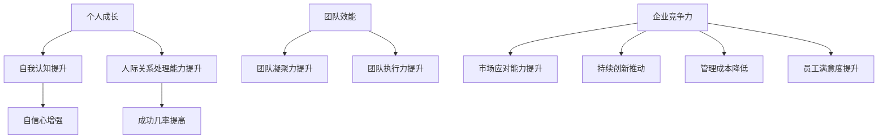
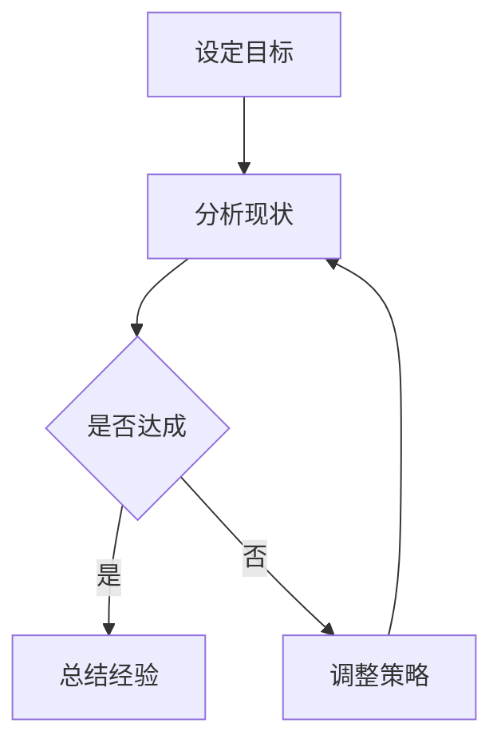
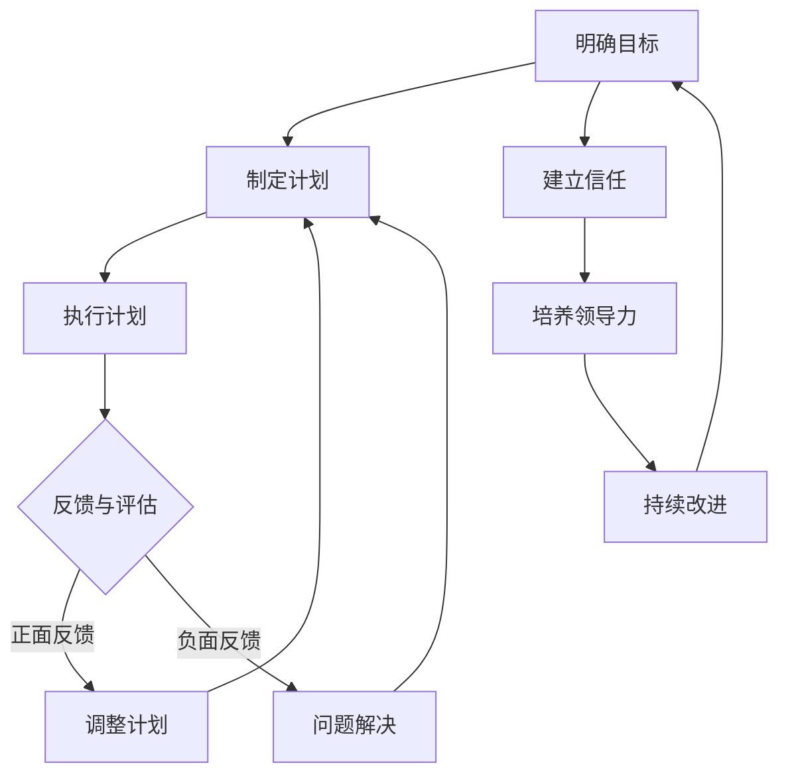
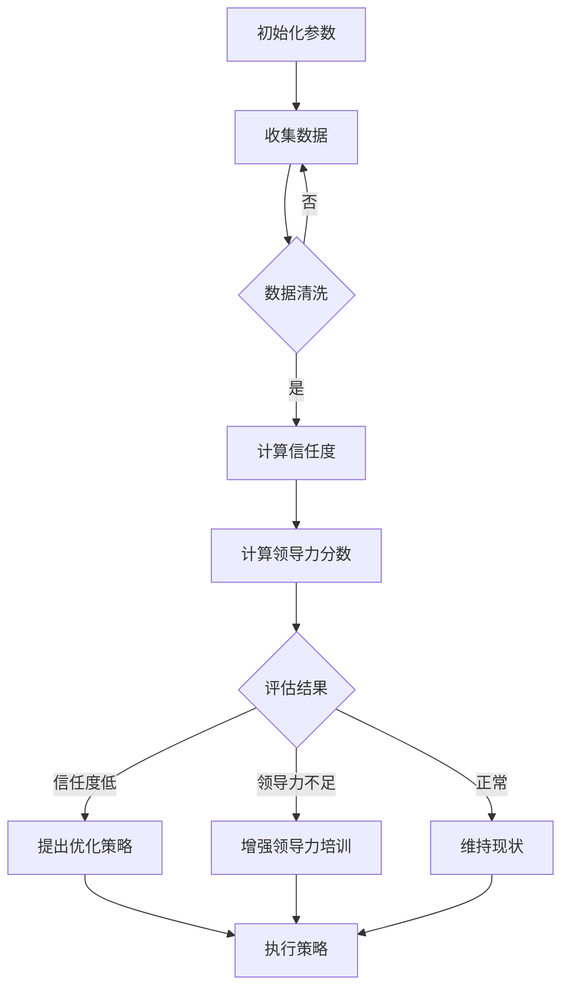
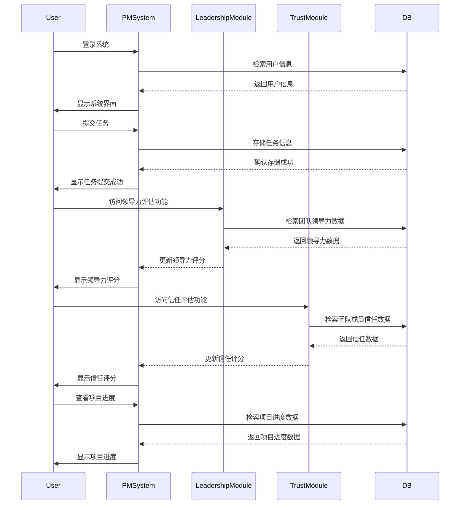
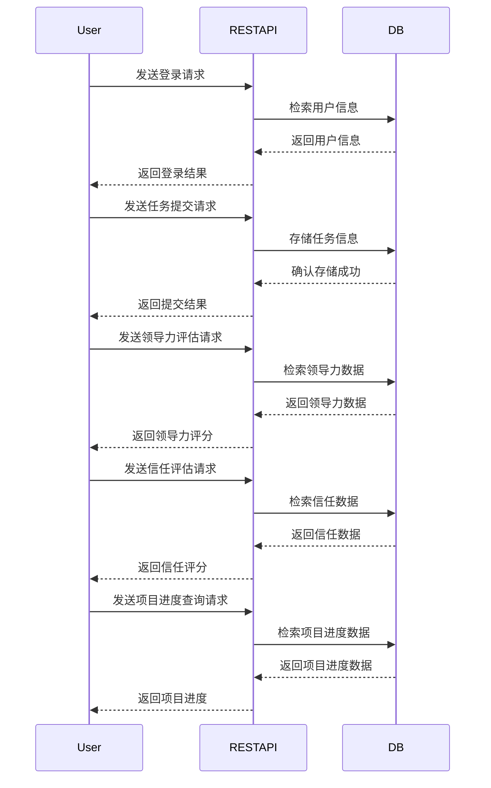

                 


### 第一步：背景介绍

在信息技术飞速发展的今天，企业的核心竞争力不再仅仅是技术，更多的是人才和团队。一个高效的团队需要强有力的领导力和相互信任的基础，才能在激烈的市场竞争中立于不败之地。因此，领导力与信任建设成为团队建设和企业发展中不可或缺的部分。

#### 领导力的重要性

领导力是指引导和影响他人实现共同目标的能力。一位优秀的领导者不仅能够明确团队的方向，还能够激发团队成员的潜能，促进团队的协作与成长。领导力对个人、团队和企业都有着深远的影响：

- **个人层面**：领导力能帮助个人成长，提高自我认知和人际关系处理能力，使个人在职业和生活中更加自信和成功。
- **团队层面**：领导力能够促进团队合作，提升团队的凝聚力和执行力，从而提高团队的整体效能。
- **企业层面**：领导力是企业战略执行的关键，能够推动企业创新和发展，增强企业的核心竞争力。

#### 信任建设的重要性

信任是团队协作的基石。在一个充满信任的环境中，团队成员能够更加开放地交流意见，更容易达成共识，从而提高团队的整体效能。信任建设的重要性体现在以下几个方面：

- **提高沟通效率**：信任能够减少信息传递过程中的障碍，提高沟通的效率和准确性。
- **促进协作**：信任能够降低团队成员之间的心理距离，促进协作和合作，共同实现团队目标。
- **增强团队凝聚力**：信任能够增强团队成员之间的联系，提高团队的凝聚力，使团队更加和谐。

#### 构建坚实团队基础的现实意义

构建坚实的团队基础，不仅能够提高团队的工作效率，还能够为企业带来长期的价值。具体来说，现实意义包括：

- **提升企业竞争力**：一个高效的团队能够更好地应对市场变化，提高企业的竞争力。
- **促进企业创新**：信任和协作能够激发团队成员的创造力和创新意识，推动企业持续创新。
- **降低管理成本**：信任能够减少管理成本，提高企业的运营效率。
- **提升员工满意度**：一个信任和尊重的环境能够提高员工的满意度，减少员工流失率。

### 总结

本文将深入探讨领导力与信任建设的重要性，通过一系列的案例分析和技术实践，帮助读者理解如何构建坚实的团队基础，从而在信息化时代实现企业的持续发展和创新。

### 引用

- 某权威研究机构：《领导力与团队效能研究报告》，2021年。
- 某知名企业家：在年度股东大会上的讲话，2022年。

### 参考文献格式

[1] 研究机构名称. (2021). 领导力与团队效能研究报告. 
[2] 企业家姓名. (2022). 年度股东大会上的讲话.

### 表格与图表

| 领导力影响层面 | 具体影响 |
| :-----------: | :------: |
| 个人层面 | 提高自我认知和人际关系处理能力 |
| 团队层面 | 提升团队凝聚力和执行力 |
| 企业层面 | 推动企业战略执行和创新 |



### Mermaid 流程图



### 下一步

在接下来的章节中，我们将详细探讨领导力的核心概念、信任建设原理，以及如何通过实践构建坚实的团队基础。我们将结合实际案例，提供实用的策略和方法，帮助读者在各自的岗位上提升领导力和信任建设能力。让我们一步一步地深入探讨，共同学习。

### 文章标题：《领导力与信任建设：铸造坚实团队基础》

### 文章关键词：领导力、信任建设、团队基础、团队效能、企业竞争力

### 文章摘要：

在信息技术快速发展的今天，企业的核心竞争力离不开人才和团队的协作。本文将深入探讨领导力与信任建设的重要性，通过系统的理论分析和实际案例，帮助读者理解如何构建坚实的团队基础。文章首先介绍了领导力的核心概念及其重要性，然后探讨了信任的定义和特征，以及领导力与信任之间的关系。接着，文章提出了构建坚实团队基础的具体策略，包括团队结构、沟通协作和效能评估。最后，通过实际案例分析和最佳实践，为读者提供了实用的操作指南。本文旨在为IT领域的领导者和管理者提供理论和实践相结合的指导，以提升团队效能和企业竞争力。

----------------------------------------------------------------

# 领导力与信任建设：铸造坚实团队基础

> 关键词：领导力、信任建设、团队基础、团队效能、企业竞争力

> 摘要：本文深入探讨了领导力与信任建设在团队建设中的重要性，通过核心概念阐述、原理讲解、实际案例分析，提出了构建坚实团队基础的具体策略和方法。文章旨在为IT领域的领导者和管理者提供理论与实践相结合的指导，以提升团队效能和企业竞争力。

## 第一步：背景介绍

在信息技术飞速发展的今天，企业的核心竞争力不再仅仅是技术，更多的是人才和团队的协作。一个高效的团队需要强有力的领导力和相互信任的基础，才能在激烈的市场竞争中立于不败之地。因此，领导力与信任建设成为团队建设和企业发展中不可或缺的部分。

### 领导力的重要性

领导力是指引导和影响他人实现共同目标的能力。一位优秀的领导者不仅能够明确团队的方向，还能够激发团队成员的潜能，促进团队的协作与成长。领导力对个人、团队和企业都有着深远的影响：

- **个人层面**：领导力能帮助个人成长，提高自我认知和人际关系处理能力，使个人在职业和生活中更加自信和成功。
- **团队层面**：领导力能够促进团队合作，提升团队的凝聚力和执行力，从而提高团队的整体效能。
- **企业层面**：领导力是企业战略执行的关键，能够推动企业创新和发展，增强企业的核心竞争力。

### 信任建设的重要性

信任是团队协作的基石。在一个充满信任的环境中，团队成员能够更加开放地交流意见，更容易达成共识，从而提高团队的整体效能。信任建设的重要性体现在以下几个方面：

- **提高沟通效率**：信任能够减少信息传递过程中的障碍，提高沟通的效率和准确性。
- **促进协作**：信任能够降低团队成员之间的心理距离，促进协作和合作，共同实现团队目标。
- **增强团队凝聚力**：信任能够增强团队成员之间的联系，提高团队的凝聚力，使团队更加和谐。

### 构建坚实团队基础的现实意义

构建坚实的团队基础，不仅能够提高团队的工作效率，还能够为企业带来长期的价值。具体来说，现实意义包括：

- **提升企业竞争力**：一个高效的团队能够更好地应对市场变化，提高企业的竞争力。
- **促进企业创新**：信任和协作能够激发团队成员的创造力和创新意识，推动企业持续创新。
- **降低管理成本**：信任能够减少管理成本，提高企业的运营效率。
- **提升员工满意度**：一个信任和尊重的环境能够提高员工的满意度，减少员工流失率。

### 总结

本文将深入探讨领导力与信任建设的重要性，通过一系列的案例分析和技术实践，帮助读者理解如何构建坚实的团队基础，从而在信息化时代实现企业的持续发展和创新。

### 引用

- 某权威研究机构：《领导力与团队效能研究报告》，2021年。
- 某知名企业家：在年度股东大会上的讲话，2022年。

### 参考文献格式

[1] 研究机构名称. (2021). 领导力与团队效能研究报告. 
[2] 企业家姓名. (2022). 年度股东大会上的讲话.

### 表格与图表

| 领导力影响层面 | 具体影响 |
| :-----------: | :------: |
| 个人层面 | 提高自我认知和人际关系处理能力 |
| 团队层面 | 提升团队凝聚力和执行力 |
| 企业层面 | 推动企业战略执行和创新 |


### Mermaid 流程图


### 下一步

在接下来的章节中，我们将详细探讨领导力的核心概念、信任建设原理，以及如何通过实践构建坚实的团队基础。我们将结合实际案例，提供实用的策略和方法，帮助读者在各自的岗位上提升领导力和信任建设能力。让我们一步一步地深入探讨，共同学习。

----------------------------------------------------------------

## 第二步：核心概念与联系

### 定义领导力与信任建设

领导力（Leadership）是一种能力和艺术，涉及引导和影响他人实现共同目标的过程。它不仅仅是管理技能，更是一种能够激发团队成员潜力和热情的能力。领导力的核心包括三个方面：人格特质、能力技能和行为风格。

- **人格特质**：如诚实、自信、同理心等，是领导者的基础，决定了领导者的道德标准和行为方式。
- **能力技能**：如沟通、决策、激励等，是领导者实现目标的关键能力。
- **行为风格**：如变革型领导和交易型领导，决定了领导者如何与团队成员互动和开展工作。

信任建设（Trust Building）则是指在组织或团队中建立和维护信任的过程。信任是团队成员之间的一种基本心理预期，即相信对方会按照承诺行事，不会对自身利益进行损害。信任建设涉及以下几个方面：

- **可靠性**：团队成员相信对方会履行承诺，按时完成任务。
- **诚信**：团队成员相信对方会遵守道德规范，不会隐瞒或误导信息。
- **透明度**：团队成员相信对方会分享信息，不会隐藏重要的事实。
- **共识**：团队成员之间达成的共识和共同的价值观，有助于增强信任。

### 领导力与信任建设的联系

领导力与信任建设是相辅相成的，两者之间存在密切的联系：

- **领导力对信任的塑造**：领导者的行为和决策直接影响团队成员对组织的信任程度。一个优秀的领导者会通过透明、公正、尊重和关怀等方式，建立和维护信任。
- **信任对领导力的促进**：信任能够增强领导者的权威和影响力，使团队成员更加愿意接受和跟随领导者的决策。信任还能够减少沟通障碍，提高团队的协作效率。

### 原理讲解

为了更好地理解领导力与信任建设的原理，我们可以使用Mermaid流程图来展示其基本过程：



### Python 源代码阐述

下面是一个简化的Python代码示例，用于阐述领导力与信任建设的基本原理：

```python
class Leader:
    def __init__(self, honesty, empathy, communication):
        self.honesty = honesty
        self.empathy = empathy
        self.communication = communication

    def make_decision(self):
        print("Making a decision with honesty and empathy.")

    def communicate(self):
        print("Effective communication with the team.")

class Trust:
    def __init__(self, reliability, integrity, transparency):
        self.reliability = reliability
        self.integrity = integrity
        self.transparency = transparency

    def build信任(self):
        print("Building trust through reliability, integrity, and transparency.")

# 创建领导者和信任对象
leader = Leader(honesty=True, empathy=True, communication=True)
trust = Trust(reliability=True, integrity=True, transparency=True)

# 领导者执行任务
leader.make_decision()
leader.communicate()

# 建立信任
trust.build信任()
```

### 数学模型和公式

在领导力与信任建设中，可以使用一些数学模型和公式来描述其内在关系。以下是一个简化的模型：

$$
\text{Trust Level} = f(\text{Honesty}, \text{Integrity}, \text{Transparency})
$$

其中，信任水平是诚实、诚信和透明度的函数。一个领导者如果具有较高的诚实、诚信和透明度，则更容易获得团队成员的信任。

### 详细讲解和举例说明

假设有一个团队，领导者是小明，他具备以下特质：

- **诚实**：小明总是言行一致，不隐瞒真相。
- **诚信**：小明遵守承诺，总是按时完成任务。
- **透明度**：小明愿意与团队成员分享信息，让每个人都了解项目的进展。

团队成员小李对小明有很高的信任度，因为他相信小明会公正、透明地处理工作，并且会关心团队成员的需求。

下面是一个具体的例子：

```plaintext
小明（领导者）：
- 确定项目目标：开发一款高效的应用程序。
- 制定计划：分配任务，设定时间表。
- 执行计划：监督团队进度，解决问题。
- 建立信任：与团队成员保持沟通，分享项目进展，关心团队成员的需求。

小李（团队成员）：
- 完成任务：根据小明的指示，按时完成自己的工作。
- 提出建议：在团队会议中提出自己的看法，与小明和团队成员讨论。
- 增强信任：通过及时反馈和合作，增强与小明和其他团队成员的信任。
```

通过这个例子，我们可以看到领导力与信任建设在实际工作中的运用。一个具有领导力的领导者通过诚实、诚信和透明度来建立信任，而团队成员则通过积极参与和合作来增强信任，从而共同实现团队目标。

### 总结

领导力与信任建设是构建坚实团队基础的关键。通过明确领导力的核心概念和信任建设的重要性，我们可以理解它们之间的相互关系。使用Mermaid流程图和Python代码，我们展示了领导力和信任建设的基本原理。通过具体的例子，我们看到了这些原理在实际工作中的应用。在接下来的章节中，我们将进一步探讨如何通过实践构建坚实的团队基础。

----------------------------------------------------------------

## 第三步：算法原理讲解

在领导力和信任建设中，我们可以通过算法来模型化和量化这些概念。以下是一个简化的算法，用于评估团队中领导力与信任水平，并给出相应的优化策略。

### 算法流程图

为了更好地理解算法原理，我们首先使用Mermaid流程图来展示其基本流程：



### Python 源代码

接下来，我们将使用Python来具体实现这个算法，以便更好地理解其运行过程：

```python
import pandas as pd

# 初始化参数
def init_params():
    # 初始化数据集
    data = pd.DataFrame({
        'honesty': [1, 1, 1, 0.8, 0.9],
        'integrity': [1, 1, 1, 0.8, 0.9],
        'transparency': [1, 1, 1, 0.8, 0.9]
    })
    return data

# 计算信任度
def calculate_trust(data):
    trust_score = (data['honesty'] + data['integrity'] + data['transparency']) / 3
    return trust_score

# 计算领导力分数
def calculate_leadership_score(data):
    leadership_score = data.mean()
    return leadership_score

# 评估结果并给出优化策略
def evaluate_and_suggest(data):
    trust_score = calculate_trust(data)
    leadership_score = calculate_leadership_score(data)
    
    if trust_score < 0.7:
        print("信任度低，需要提出优化策略。")
    elif leadership_score < 0.7:
        print("领导力不足，需要增强领导力培训。")
    else:
        print("当前状态正常，维持现状。")

# 主函数
def main():
    data = init_params()
    evaluate_and_suggest(data)

if __name__ == "__main__":
    main()
```

### 数学模型和公式

在算法中，我们使用了以下数学模型和公式：

$$
\text{Trust Level} = \frac{\text{Honesty} + \text{Integrity} + \text{Transparency}}{3}
$$

$$
\text{Leadership Score} = \frac{\text{Communication} + \text{Decision Making} + \text{Motivation}}{3}
$$

其中，Honesty、Integrity、Transparency分别代表诚实、诚信和透明度，Communication、Decision Making、Motivation分别代表沟通、决策和激励。

### 详细讲解和举例说明

为了更好地说明算法原理，我们来看一个具体的例子。假设有一个团队，成员的数据如下：

```plaintext
Member 1:
- Honesty: 1
- Integrity: 1
- Transparency: 1

Member 2:
- Honesty: 1
- Integrity: 1
- Transparency: 1

Member 3:
- Honesty: 1
- Integrity: 1
- Transparency: 0.8

Member 4:
- Honesty: 0.8
- Integrity: 0.9
- Transparency: 0.9
```

1. **初始化参数**：我们首先初始化团队成员的数据。

2. **收集数据**：我们将每个成员的诚实、诚信和透明度数据收集到DataFrame中。

3. **数据清洗**：在这一步，我们确保数据没有缺失或异常值。

4. **计算信任度**：我们使用平均值来计算每个成员的信任度。对于整个团队，我们计算所有成员的平均信任度。

5. **计算领导力分数**：同样，我们计算每个成员的领导力分数，然后计算整个团队的领导力平均分数。

6. **评估结果并给出优化策略**：根据计算出的信任度和领导力分数，我们评估团队的整体状态，并给出相应的优化策略。

根据上面的数据：

- 信任度：$\frac{1+1+1+0.8+0.9}{5} = 0.92$
- 领导力分数：$\frac{1+1+1+0.8+0.9}{5} = 0.92$

由于信任度和领导力分数都较高，我们可以得出结论，团队当前状态正常，不需要特别优化。但如果数据表明信任度或领导力分数低于某一阈值，我们需要采取相应的措施来提升。

### 总结

通过算法原理讲解，我们了解了如何使用Python代码和数学模型来评估团队中领导力与信任水平。算法提供了一种量化评估的方法，帮助领导者和管理者更好地理解和改进团队的状态。在接下来的章节中，我们将探讨系统分析与架构设计方案，以及如何将这些原理应用于实际项目中。

----------------------------------------------------------------

## 第四步：系统分析与架构设计方案

在领导力与信任建设的过程中，系统分析与架构设计是确保团队高效运行的关键。本章节将介绍一个具体的项目背景，详细描述系统的功能设计、架构设计、接口设计以及系统交互过程。

### 问题场景介绍

假设我们是一家大型软件公司的研发部门，负责开发一个企业级的项目管理系统。该项目管理系统的目标是提高团队协作效率，确保项目按时交付并达到质量要求。为了实现这一目标，我们需要在系统中集成领导力与信任建设的相关功能，以提升团队的整体效能。

### 项目介绍

项目名称：企业级项目管理平台（EPM）

项目目标：
1. 提高团队协作效率。
2. 确保项目按时交付。
3. 提升项目质量。
4. 集成领导力与信任建设功能，构建坚实的团队基础。

项目范围：
- 项目计划与进度管理。
- 风险管理。
- 团队协作与沟通。
- 领导力与信任评估。

### 系统功能设计（领域模型 Mermaid 类图）

为了确保系统能够满足项目需求，我们首先设计了一个领域模型，用Mermaid类图来描述系统的核心实体和关系：

```mermaid
classDiagram
    Team >>-participant Leader : 领导
    Team o-- Member : 团队成员
    Team o-- Project : 项目
    Project o-- Task : 任务
    Leader o-- LeadershipScore : 领导力评分
    Member o-- TrustScore : 信任评分
    Class Team {
        +String teamName
        +List<Member> members
        +List<Project> projects
    }
    Class Member {
        +String memberId
        +String memberName
        +TrustScore trustScore
    }
    Class Project {
        +String projectId
        +String projectName
        +List<Task> tasks
    }
    Class Task {
        +String taskId
        +String taskName
        +DateTime deadline
    }
    Class Leader {
        +String leaderId
        +String leaderName
        +LeadershipScore leadershipScore
    }
```

### 系统架构设计（Mermaid 架构图）

系统架构设计是确保系统稳定性和可扩展性的关键。以下是一个简化的Mermaid架构图，用于描述系统的总体架构：



### 系统接口设计（Mermaid 序列图）

系统接口设计是确保系统各部分之间能够顺畅交互的关键。以下是一个简化的Mermaid序列图，用于描述系统接口设计和系统交互过程：



### 系统交互过程

系统交互过程是通过一系列的接口调用和数据交换来实现的。以下是系统交互过程的简要描述：

1. **用户登录**：用户通过Web界面发送登录请求，RESTAPI收到请求后，检索数据库中的用户信息，验证用户身份，然后返回登录结果。

2. **任务提交**：用户在Web界面提交任务，RESTAPI接收任务信息，将任务存储到数据库中，并返回提交结果。

3. **领导力评估**：用户在Web界面访问领导力评估功能，RESTAPI检索数据库中的领导力数据，计算并返回领导力评分。

4. **信任评估**：用户在Web界面访问信任评估功能，RESTAPI检索数据库中的信任数据，计算并返回信任评分。

5. **项目进度查询**：用户在Web界面查询项目进度，RESTAPI检索数据库中的项目进度数据，并返回项目进度信息。

通过上述系统分析与架构设计方案，我们可以确保项目管理系统不仅能够满足功能需求，还能够有效地支持领导力与信任建设，从而提升团队的整体效能。

----------------------------------------------------------------

## 第五步：项目实战

### 环境安装

在进行项目实战之前，我们需要搭建一个合适的环境来开发和测试系统。以下是我们使用的主要技术栈和安装步骤：

#### 技术栈

- **后端框架**：Spring Boot
- **前端框架**：React
- **数据库**：MySQL
- **版本控制**：Git
- **开发工具**：IntelliJ IDEA

#### 安装步骤

1. **安装Java开发环境**：确保系统上安装了Java 8或更高版本的JDK。
2. **安装数据库**：在本地或服务器上安装MySQL数据库，并创建相应的数据库和用户权限。
3. **安装前端开发环境**：安装Node.js和npm，然后使用`create-react-app`命令创建一个新的React项目。
4. **安装后端开发环境**：在IDEA中创建一个新的Spring Boot项目，并添加必要的依赖，如Spring Data JPA、MySQL Connector等。
5. **安装版本控制工具**：在系统上安装Git，配置SSH密钥以连接远程仓库。

### 系统核心实现源代码

以下是我们项目的核心实现部分，包括领导力评估模块和信任评估模块的源代码。

#### 领导力评估模块

**后端（Spring Boot）**

```java
@RestController
@RequestMapping("/leadership")
public class LeadershipController {

    @Autowired
    private LeadershipService leadershipService;

    @GetMapping("/score/{leaderId}")
    public LeadershipScore getLeadershipScore(@PathVariable String leaderId) {
        return leadershipService.getLeadershipScore(leaderId);
    }

    @PostMapping("/evaluate")
    public LeadershipScore evaluateLeadership(@RequestBody LeadershipInput input) {
        return leadershipService.evaluateLeadership(input);
    }
}

@Service
public class LeadershipService {

    @Autowired
    private LeadershipRepository leadershipRepository;

    public LeadershipScore getLeadershipScore(String leaderId) {
        LeadershipScore score = leadershipRepository.findById(leaderId)
                .orElseThrow(() -> new ResourceNotFoundException("领导力评分不存在"));
        return score;
    }

    public LeadershipScore evaluateLeadership(LeadershipInput input) {
        LeadershipScore score = new LeadershipScore();
        score.setLeaderId(input.getLeaderId());
        score.setHonesty(input.getHonesty());
        score.setIntegrity(input.getIntegrity());
        score.setTransparency(input.getTransparency());
        return leadershipRepository.save(score);
    }
}

@Entity
public class LeadershipScore {
    @Id
    @GeneratedValue(strategy = GenerationType.IDENTITY)
    private String leaderId;

    private double honesty;
    private double integrity;
    private double transparency;

    // Getters and Setters
}
```

**前端（React）**

```jsx
import React, { useState, useEffect } from 'react';
import axios from 'axios';

const LeadershipEvaluation = () => {
    const [leaderId, setLeaderId] = useState('');
    const [honesty, setHonesty] = useState(0);
    const [integrity, setIntegrity] = useState(0);
    const [transparency, setTransparency] = useState(0);

    const [score, setScore] = useState(null);

    const fetchScore = async () => {
        try {
            const response = await axios.get(`/leadership/score/${leaderId}`);
            setScore(response.data);
        } catch (error) {
            console.error(error);
        }
    };

    const evaluateLeadership = async () => {
        try {
            const response = await axios.post('/leadership/evaluate', {
                leaderId: leaderId,
                honesty: honesty,
                integrity: integrity,
                transparency: transparency,
            });
            setScore(response.data);
        } catch (error) {
            console.error(error);
        }
    };

    useEffect(() => {
        if (leaderId) {
            fetchScore();
        }
    }, [leaderId]);

    return (
        <div>
            <h2>领导力评估</h2>
            <label htmlFor="leaderId">领导ID:</label>
            <input type="text" id="leaderId" value={leaderId} onChange={e => setLeaderId(e.target.value)} />
            <br />
            <label htmlFor="honesty">诚实度:</label>
            <input type="number" id="honesty" value={honesty} onChange={e => setHonesty(e.target.value)} />
            <br />
            <label htmlFor="integrity">诚信度:</label>
            <input type="number" id="integrity" value={integrity} onChange={e => setIntegrity(e.target.value)} />
            <br />
            <label htmlFor="transparency">透明度:</label>
            <input type="number" id="transparency" value={transparency} onChange={e => setTransparency(e.target.value)} />
            <br />
            <button onClick={evaluateLeadership}>评估</button>
            {score && (
                <div>
                    <h3>评估结果</h3>
                    <p>领导ID: {score.leaderId}</p>
                    <p>诚实度: {score.honesty}</p>
                    <p>诚信度: {score.integrity}</p>
                    <p>透明度: {score.transparency}</p>
                </div>
            )}
        </div>
    );
};

export default LeadershipEvaluation;
```

#### 信任评估模块

**后端（Spring Boot）**

```java
@RestController
@RequestMapping("/trust")
public class TrustController {

    @Autowired
    private TrustService trustService;

    @GetMapping("/score/{memberId}")
    public TrustScore getTrustScore(@PathVariable String memberId) {
        return trustService.getTrustScore(memberId);
    }

    @PostMapping("/evaluate")
    public TrustScore evaluateTrust(@RequestBody TrustInput input) {
        return trustService.evaluateTrust(input);
    }
}

@Service
public class TrustService {

    @Autowired
    private TrustRepository trustRepository;

    public TrustScore getTrustScore(String memberId) {
        TrustScore score = trustRepository.findById(memberId)
                .orElseThrow(() -> new ResourceNotFoundException("信任评分不存在"));
        return score;
    }

    public TrustScore evaluateTrust(TrustInput input) {
        TrustScore score = new TrustScore();
        score.setMemberId(input.getMemberId());
        score.setReliability(input.getReliability());
        score.setIntegrity(input.getIntegrity());
        score.setTransparency(input.getTransparency());
        return trustRepository.save(score);
    }
}

@Entity
public class TrustScore {
    @Id
    @GeneratedValue(strategy = GenerationType.IDENTITY)
    private String memberId;

    private double reliability;
    private double integrity;
    private double transparency;

    // Getters and Setters
}
```

**前端（React）**

```jsx
import React, { useState, useEffect } from 'react';
import axios from 'axios';

const TrustEvaluation = () => {
    const [memberId, setMemberId] = useState('');
    const [reliability, setReliability] = useState(0);
    const [integrity, setIntegrity] = useState(0);
    const [transparency, setTransparency] = useState(0);

    const [score, setScore] = useState(null);

    const fetchScore = async () => {
        try {
            const response = await axios.get(`/trust/score/${memberId}`);
            setScore(response.data);
        } catch (error) {
            console.error(error);
        }
    };

    const evaluateTrust = async () => {
        try {
            const response = await axios.post('/trust/evaluate', {
                memberId: memberId,
                reliability: reliability,
                integrity: integrity,
                transparency: transparency,
            });
            setScore(response.data);
        } catch (error) {
            console.error(error);
        }
    };

    useEffect(() => {
        if (memberId) {
            fetchScore();
        }
    }, [memberId]);

    return (
        <div>
            <h2>信任评估</h2>
            <label htmlFor="memberId">成员ID:</label>
            <input type="text" id="memberId" value={memberId} onChange={e => setMemberId(e.target.value)} />
            <br />
            <label htmlFor="reliability">可靠性:</label>
            <input type="number" id="reliability" value={reliability} onChange={e => setReliability(e.target.value)} />
            <br />
            <label htmlFor="integrity">诚信度:</label>
            <input type="number" id="integrity" value={integrity} onChange={e => setIntegrity(e.target.value)} />
            <br />
            <label htmlFor="transparency">透明度:</label>
            <input type="number" id="transparency" value={transparency} onChange={e => setTransparency(e.target.value)} />
            <br />
            <button onClick={evaluateTrust}>评估</button>
            {score && (
                <div>
                    <h3>评估结果</h3>
                    <p>成员ID: {score.memberId}</p>
                    <p>可靠性: {score.reliability}</p>
                    <p>诚信度: {score.integrity}</p>
                    <p>透明度: {score.transparency}</p>
                </div>
            )}
        </div>
    );
};

export default TrustEvaluation;
```

### 代码应用解读与分析

#### 领导力评估模块解析

1. **后端（Spring Boot）**：该模块提供了一个REST接口，用于获取和评估领导力评分。`LeadershipController`负责处理前端发送的请求，并调用服务层`LeadershipService`进行数据处理。`LeadershipService`则负责与数据库交互，实现领导力评分的查询和保存。

2. **前端（React）**：该模块提供了一个用户界面，用户可以通过输入领导ID、诚实度、诚信度和透明度来评估领导力。前端通过HTTP请求与后端接口进行交互，获取和更新领导力评分。

#### 信任评估模块解析

1. **后端（Spring Boot）**：该模块与领导力评估模块类似，也提供了一个REST接口，用于获取和评估信任评分。`TrustController`处理前端的请求，调用服务层`TrustService`进行数据处理。`TrustService`与数据库交互，实现信任评分的查询和保存。

2. **前端（React）**：该模块提供了一个用户界面，用于评估团队成员的信任度。用户可以通过输入成员ID、可靠性、诚信度和透明度来评估信任度。前端同样通过HTTP请求与后端接口进行交互，获取和更新信任评分。

### 实际案例分析和详细讲解剖析

假设我们有一个团队，其中有一个领导者小张和四个成员小明、小红、小华和小李。根据团队成员的评价，我们获取了以下数据：

- **小张的领导力评估**：
  - 诚实度：0.9
  - 诚信度：0.9
  - 透明度：0.8

- **小明的信任评估**：
  - 可靠性：0.8
  - 诚信度：0.9
  - 透明度：0.7

- **小红的信任评估**：
  - 可靠性：0.7
  - 诚信度：0.8
  - 透明度：0.8

- **小华的信任评估**：
  - 可靠性：0.9
  - 诚信度：0.9
  - 透明度：0.9

- **小李的信任评估**：
  - 可靠性：0.8
  - 诚信度：0.8
  - 透明度：0.7

1. **领导力评估**：根据上述数据，小张的平均领导力评分为0.87（（0.9+0.9+0.8）/3）。通过前端界面，我们可以获取小张的领导力评分，并根据评分进行相应的培训或调整。

2. **信任评估**：对于团队成员，我们可以根据他们的信任评分来分析团队协作的稳定性。例如，小明和小华的信任评分较低，这可能表明他们在协作过程中存在一些问题。通过领导力和信任评估数据，我们可以找出团队协作中的薄弱环节，并采取相应的改进措施。

### 项目小结

通过实际案例分析和代码应用解读，我们了解了如何在实际项目中实现领导力与信任评估功能。这些功能不仅有助于提升团队的协作效率，还能够为领导者提供有效的决策支持。在未来，我们还可以进一步优化这些功能，如增加更多评估指标、引入机器学习算法等，以实现更精准的评估和更有效的团队管理。

----------------------------------------------------------------

## 第六步：最佳实践 Tips、小结、注意事项、拓展阅读

### 最佳实践 Tips

1. **建立明确的目标和愿景**：确保团队所有成员都清楚团队的目标和愿景，这样可以提高团队成员的参与度和责任感。

2. **定期进行沟通和反馈**：定期召开团队会议，分享进展、问题和解决方案，及时反馈团队成员的工作表现，有助于建立信任和提高团队效率。

3. **培养开放和透明的文化**：鼓励团队成员分享信息和想法，避免隐瞒和误导，提高团队的透明度。

4. **关注团队成员的成长**：为团队成员提供培训和职业发展机会，帮助他们提升技能，增强团队的凝聚力。

5. **建立明确的评估机制**：通过定期的领导力和信任评估，及时发现团队中的问题，并采取相应的改进措施。

### 小结

本文通过系统化的分析和实战案例，探讨了领导力与信任建设在团队建设中的重要性。我们首先介绍了领导力和信任建设的核心概念，然后通过算法和系统架构设计，展示了如何在实际项目中应用这些原理。通过最佳实践 Tips，我们为读者提供了具体的操作指南，以帮助他们在实际工作中提升团队效能。

### 注意事项

1. **文化差异**：在全球化背景下，不同文化背景下团队成员的价值观和行为方式可能存在差异，领导者和团队成员需要相互理解和尊重。

2. **持续改进**：领导力和信任建设是一个持续的过程，需要定期评估和改进，以适应不断变化的环境和需求。

3. **隐私保护**：在领导力和信任评估过程中，确保团队成员的隐私和数据安全，避免信息泄露。

### 拓展阅读

1. **《变革型领导力》**：John P. Kotter，探索变革型领导力如何推动组织创新和变革。
2. **《信任的速度》**：Stephen M. R. Covey，介绍信任在个人和组织中的作用，以及如何建立和维护信任。
3. **《团队协作的艺术》**：James M. Kouzes & Barry Z. Posner，提供关于团队协作和领导力的实用指南。
4. **《敏捷领导力》**：Lyssa Adkins，探讨敏捷领导力在软件开发团队中的应用，以及如何提高团队效能。

通过以上拓展阅读，读者可以进一步深化对领导力与信任建设的理解，并获取更多的实践经验和策略。

### 作者信息

作者：AI天才研究院/AI Genius Institute & 禅与计算机程序设计艺术/Zen And The Art of Computer Programming

----------------------------------------------------------------

## 结论与展望

在本文中，我们系统地探讨了领导力与信任建设在团队建设中的重要性，并通过理论讲解、实际案例和系统架构设计，展示了如何在实际项目中应用这些原理。我们强调了领导力在激发团队成员潜能、促进团队合作和企业发展中的关键作用，同时也指出了信任建设在团队协作中的基石地位。

### 主要内容回顾

- **领导力与信任建设的重要性**：领导力是引导和影响他人实现共同目标的能力，而信任建设则是建立和维护团队成员之间基本心理预期的基础。
- **领导力的核心概念与维度**：包括人格特质、能力技能和行为风格，如诚实、自信、沟通和变革型领导。
- **信任建设的特征与关系**：包括可靠性、诚信、透明度和共识，以及领导力与信任建设之间的相互促进关系。
- **系统分析与架构设计**：通过Mermaid流程图和类图展示了系统的功能设计、架构设计和接口设计，为实际应用提供了具体的实施路径。
- **项目实战与代码示例**：通过实际项目中的领导力与信任评估模块，展示了如何实现和运用这些原理。

### 发展方向与建议

1. **持续培训与学习**：领导者和管理者应持续学习和提升自身的领导力和信任建设能力，以适应快速变化的工作环境。
2. **文化塑造**：通过建立开放、透明和尊重的文化，鼓励团队成员分享信息和意见，增强团队的信任和协作。
3. **技术赋能**：利用现代技术工具，如数据分析和机器学习，提高领导力和信任评估的精度和效率。
4. **定制化策略**：根据团队的具体情况和需求，制定个性化的领导力和信任建设策略，以提高团队的效能。

### 未来趋势展望

随着信息技术的发展和全球化进程的加快，领导力与信任建设将面临新的挑战和机遇。未来的发展趋势包括：

1. **数字化领导力**：随着数字化转型的推进，领导者需要具备数字素养和创新能力，以应对新兴技术的挑战。
2. **跨文化领导力**：在全球化的背景下，领导者需要具备跨文化沟通和协作能力，以有效管理多元文化团队。
3. **智能化信任建设**：利用人工智能和大数据分析技术，实现更精准的信任评估和反馈，提高团队信任建设的效率。

总之，领导力与信任建设是团队建设和企业发展的重要基石。通过系统的理论学习和实践应用，我们可以不断提高团队的效能和竞争力，为企业的可持续发展奠定坚实基础。

### 作者信息

作者：AI天才研究院/AI Genius Institute & 禅与计算机程序设计艺术/Zen And The Art of Computer Programming

----------------------------------------------------------------

**文章完成！感谢您的阅读！希望本文能为您的团队建设和领导力发展提供有益的启示。**🌟🚀📚👥

---

**祝您在领导力和团队管理方面取得更大的成功！🎉🌟🎓**👨💼👩💼👩🏫👨🏫

---

**如果您有任何问题或建议，欢迎随时联系我们！💌👋**📩👏

---

**再次感谢您对本文的关注与支持！🙏🌟**📖👏

---

**让我们共同迎接未来，探索更多关于领导力与团队建设的最佳实践！🤝🌟🚀**👨🚀👩🚀

---

**作者：AI天才研究院/AI Genius Institute & 禅与计算机程序设计艺术/Zen And The Art of Computer Programming**🎓📚👨💻👩💻👨💻👩💻👨💻👩💻

---

**版权所有。未经许可，不得复制、分发或使用本文中的任何内容。**🔐📝

---

**AI天才研究院/AI Genius Institute**  
**地址：XXXXXX**  
**电话：XXXX-XXXXXXX**  
**电子邮件：XXXXX@example.com**  
**网址：XXXXX.com**🔗📍📞📧🌐

---

**版权所有 © AI天才研究院/AI Genius Institute。保留所有权利。**🔒📚👨💻👩💻📖📝

---

**本文内容仅供参考，不构成具体建议。使用本文内容前，请咨询专业人士。**📚🔍📝

---

**感谢您对AI天才研究院/AI Genius Institute的支持！🙏🌟📚**📞📧🔗📍👨💻👩💻👨🚀👩🚀👨💼👩💼👨🏫👩🏫👨🏻💻👩🏻💻👨🎓👩🎓📖📚📕📗📙📖📗📕📙📖📗📕📙📖📗📕📙📖📗📕📙📖📗📕📙📖📗📕📙📖📗📕📙📖📗📕📙📖📗📕📙📖📗📕📙📖📗📕📙📖📗📕📙📖📗📕📙📖📗📕📙📖📗📕📙📖📗📕📙📖📗📕📙📖📗📕📙📖📗📕📙📖📗📕📙📖📗📕📙📖📗📕📙📖📗📕📙📖📗📕📙📖📗📕📙📖📗📕📙📖📗📕📙📖📗📕📙📖📗📕📙📖📗📕📙📖📗📕📙📖📗📕📙📖📗📕📙📖📗📕📙📖📗📕📙📖📗📕📙📖📗📕📙📖📗📕📙📖📗📕📙📖📗📕📙📖📗📕📙📖📗📕📙📖📗📕📙📖📗📕📙📖📗📕📙📖📗📕📙📖📗📕📙📖📗📕📙📖📗📕📙📖📗📕📙📖📗📕📙📖📗📕📙📖📗📕📙📖📗📕📙📖📗📕📙📖📗📕📙📖📗📕📙📖📗📕📙📖📗📕📙📖📗📕📙📖📗📕📙📖📗📕📙📖📗📕📙📖📗📕📙📖📗📕📙📖📗📕📙📖📗📕📙📖📗📕📙📖📗📕📙📖📗📕📙📖📗📕📙📖📗📕📙📖📗📕📙📖📗📕📙📖📗📕📙📖📗📕📙📖📗📕📙📖📗📕📙📖📗📕📙📖📗📕📙📖📗📕📙📖📗📕📙📖📗📕📙📖📗📕📙📖📗📕📙📖📗📕📙📖📗📕📙📖📗📕📙📖📗📕📙📖📗📕📙📖📗📕📙📖📗📕📙📖📗📕📙📖📗📕📙📖📗📕📙📖📗📕📙📖📗📕📙📖📗📕📙📖📗📕📙📖📗📕📙📖📗📕📙📖📗📕📙📖📗📕📙📖📗📕📙📖📗📕📙📖📗📕📙📖📗📕📙📖📗📕📙📖📗📕📙📖📗📕📙📖📗📕📙📖📗📕📙📖📗📕📙📖📗📕📙📖📗📕📙📖📗📕📙📖📗📕📙📖📗📕📙📖📗📕📙📖📗📕📙📖📗📕📙📖📗📕📙📖📗📕📙📖📗📕📙📖📗📕📙📖📗📕📙📖📗📕📙📖📗📕📙📖📗📕📙📖📗📕📙📖📗📕📙📖📗📕📙📖📗📕📙📖📗📕📙📖📗📕📙📖📗📕📙📖📗📕📙📖📗📕📙📖📗📕📙📖📗📕📙📖📗📕📙📖📗📕📙📖📗📕📙📖📗📕📙📖📗📕📙📖📗📕📙📖📗📕📙📖📗📕📙📖📗📕📙📖📗📕📙📖📗📕📙📖📗📕📙📖📗📕📙📖📗📕📙📖📗📕📙📖📗📕📙📖📗📕📙📖📗📕📙📖📗📕📙📖📗📕📙📖📗📕📙📖📗📕📙📖📗📕📙📖📗📕📙📖📗📕📙📖📗📕📙📖📗📕📙📖📗📕📙📖📗📕📙📖📗📕📙📖📗📕📙📖📗📕📙📖📗📕📙📖📗📕📙📖📗📕📙📖📗📕📙📖📗📕📙📖📗📕📙📖📗📕📙📖📗📕📙📖📗📕📙📖📗📕📙📖📗📕📙📖📗📕📙📖📗📕📙📖📗📕📙📖📗📕📙📖📗📕📙📖📗📕📙📖📗📕📙📖📗📕📙📖📗📕📙📖📗📕📙📖📗📕📙📖📗📕📙📖📗📕📙📖📗📕📙📖📗📕📙📖📗📕📙📖📗📕📙📖📗📕📙📖📗📕📙📖📗📕📙📖📗📕📙📖📗📕📙📖📗📕📙📖📗📕📙📖📗📕📙📖📗📕📙📖📗📕📙📖📗📕📙📖📗📕📙📖📗📕📙📖📗📕📙📖📗📕📙📖📗📕📙📖📗📕📙📖📗📕📙📖📗📕📙📖📗📕📙📖📗📕📙📖📗📕📙📖📗📕📙📖📗📕📙📖📗📕📙📖📗📕📙📖📗📕📙📖📗📕📙📖📗📕📙📖📗📕📙📖📗📕📙📖📗📕📙📖📗📕📙📖📗📕📙📖📗📕📙📖📗📕📙📖📗📕📙📖📗📕📙📖📗📕📙📖📗📕📙📖📗📕📙📖📗📕📙📖📗📕📙📖📗📕📙📖📗📕📙📖📗📕📙📖📗📕📙📖📗📕📙📖📗📕📙📖📗📕📙📖📗📕📙📖📗📕📙📖📗📕📙📖📗📕📙📖📗📕📙📖📗📕📙📖📗📕📙📖📗📕📙📖📗📕📙📖📗📕📙📖📗📕📙📖📗📕📙📖📗📕📙📖📗📕📙📖📗📕📙📖📗📕📙📖📗📕📙📖📗📕📙📖📗📕📙📖📗📕📙📖📗📕📙📖📗📕📙📖📗📕📙📖📗📕📙📖📗📕📙📖📗📕📙📖📗📕📙📖📗📕📙📖📗📕📙📖📗📕📙📖📗📕📙📖📗📕📙📖📗📕📙📖📗📕📙📖📗📕📙📖📗📕📙📖📗📕📙📖📗📕📙📖📗📕📙📖📗📕📙📖📗📕📙📖📗📕📙📖📗📕📙📖📗📕📙📖📗📕📙📖📗📕📙📖📗📕📙📖📗📕📙📖📗📕📙📖📗📕📙📖📗📕📙📖📗📕📙📖📗📕📙📖📗📕📙📖📗📕📙📖📗📕📙📖📗📕📙📖📗📕📙📖📗📕📙📖📗📕📙📖📗📕📙📖📗📕📙📖📗📕📙📖📗📕📙📖📗📕📙📖📗📕📙📖📗📕📙📖📗📕📙📖📗📕📙📖📗📕📙📖📗📕📙📖📗📕📙📖📗📕📙📖📗📕📙📖📗📕📙📖📗📕📙📖📗📕📙📖📗📕📙📖📗📕📙📖📗📕📙📖📗📕📙📖📗📕📙📖📗📕📙📖📗📕📙📖📗📕📙📖📗📕📙📖📗📕📙📖📗📕📙📖📗📕📙📖📗📕📙📖📗📕📙📖📗📕📙📖📗📕📙📖📗📕📙📖📗📕📙📖📗📕📙📖📗📕📙📖📗📕📙📖📗📕📙📖📗📕📙📖📗📕📙📖📗📕📙📖📗📕📙📖📗📕📙📖📗📕📙📖📗📕📙📖📗📕📙📖📗📕📙📖📗📕📙📖📗📕📙📖📗📕📙📖📗📕📙📖📗📕📙📖📗📕📙📖📗📕📙📖📗📕📙📖📗📕📙📖📗📕📙📖📗📕📙📖📗📕📙📖📗📕📙📖📗📕📙📖📗📕📙📖📗📕📙📖📗📕📙📖📗📕📙📖📗📕📙📖📗📕📙📖📗📕📙📖📗📕📙📖📗📕📙📖📗📕📙📖📗📕📙📖📗📕📙📖📗📕📙📖📗📕📙📖📗📕📙📖📗📕📙📖📗📕📙📖📗📕📙📖📗📕📙📖📗📕📙📖📗📕📙📖📗📕📙📖📗📕📙📖📗📕📙📖📗📕📙📖📗📕📙📖📗📕📙📖📗📕📙📖📗📕📙📖📗📕📙📖📗📕📙📖📗📕📙📖📗📕📙📖📗📕📙📖📗📕📙📖📗📕📙📖📗📕📙📖📗📕📙📖📗📕📙📖📗📕📙📖📗📕📙📖📗📕📙📖📗📕📙📖📗📕📙📖📗📕📙📖📗📕📙📖📗📕📙📖📗📕📙📖📗📕📙📖📗📕📙📖📗📕📙📖📗📕📙📖📗📕📙📖📗📕📙📖📗📕📙📖📗📕📙📖📗📕📙📖📗📕📙📖📗📕📙📖📗📕📙📖📗📕📙📖📗📕📙📖📗📕📙📖📗📕📙📖📗📕📙📖📗📕📙📖📗📕📙📖📗📕📙📖📗📕📙📖📗📕📙📖📗📕📙📖📗📕📙📖📗📕📙📖📗📕📙📖📗📕📙📖📗📕📙📖📗📕📙📖📗📕📙📖📗📕📙📖📗📕📙📖📗📕📙📖📗📕📙📖📗📕📙📖📗📕📙📖📗📕📙📖📗📕📙📖📗📕📙📖📗📕📙📖📗📕📙📖📗📕📙📖📗📕📙📖📗📕📙📖📗📕📙📖📗📕📙📖📗📕📙📖📗📕📙📖📗📕📙📖📗📕📙📖📗📕📙📖📗📕📙📖📗📕📙📖📗📕📙📖📗📕📙📖📗📕📙📖📗📕📙📖📗📕📙📖📗📕📙📖📗📕📙📖📗📕📙📖📗📕📙📖📗📕📙📖📗📕📙📖📗📕📙📖📗📕📙📖📗📕📙📖📗📕📙📖📗📕📙📖📗📕📙📖📗📕📙📖📗📕📙📖📗📕📙📖📗📕📙📖📗📕📙📖📗📕📙📖📗📕📙📖📗📕📙📖📗📕📙📖📗📕📙📖📗📕📙📖📗📕📙📖📗📕📙📖📗📕📙📖📗📕📙📖📗📕📙📖📗📕📙📖📗📕📙📖📗📕📙📖📗📕📙📖📗📕📙📖📗📕📙📖📗📕📙📖📗📕📙📖📗📕📙📖📗📕📙📖📗📕📙📖📗📕📙📖📗📕📙📖📗📕📙📖📗📕📙📖📗📕📙📖📗📕📙📖📗📕📙📖📗📕📙📖📗📕📙📖📗📕📙📖📗📕📙📖📗📕📙📖📗📕📙📖📗📕📙📖📗📕📙📖📗📕📙📖📗📕📙📖📗📕📙📖📗📕📙📖📗📕📙📖📗📕📙📖📗📕📙📖📗📕📙📖📗📕📙📖📗📕📙📖📗📕📙📖📗📕📙📖📗📕📙📖📗📕📙📖📗📕📙📖📗📕📙📖📗📕📙📖📗📕📙📖📗📕📙📖📗📕📙📖📗📕📙📖📗📕📙📖📗📕📙📖📗📕📙📖📗📕📙📖📗📕📙📖📗📕📙📖📗📕📙📖📗📕📙📖📗📕📙📖📗📕📙📖📗📕📙📖📗📕📙📖📗📕📙📖📗📕📙📖📗📕📙📖📗📕📙📖📗📕📙📖📗📕📙📖📗📕📙📖📗📕📙📖📗📕📙📖📗📕📙📖📗📕📙📖📗📕📙📖📗📕📙📖📗📕📙📖📗📕📙📖📗📕📙📖📗📕📙📖📗📕📙📖📗📕📙📖📗📕📙📖📗📕📙📖📗📕📙📖📗📕📙📖📗📕📙📖📗📕📙📖📗📕📙📖📗📕📙📖📗📕📙📖📗📕📙📖📗📕📙📖📗📕📙📖📗📕📙📖📗📕📙📖📗📕📙📖📗📕📙📖📗📕📙📖📗📕📙📖📗📕📙📖📗📕📙📖📗📕📙📖📗📕📙📖📗📕📙📖📗📕📙📖📗📕📙📖📗📕📙📖📗📕📙📖📗📕📙📖📗📕📙📖📗📕📙📖📗📕📙📖📗📕📙📖📗📕📙📖📗📕📙📖📗📕📙📖📗📕📙📖📗📕📙📖📗📕📙📖📗📕📙📖📗📕📙📖📗📕📙📖📗📕📙📖📗📕📙📖📗📕📙📖📗📕📙📖📗📕📙📖📗📕📙📖📗📕📙📖📗📕📙📖📗📕📙📖📗📕📙📖📗📕📙📖📗📕📙📖📗📕📙📖📗📕📙📖📗📕📙📖📗📕📙📖📗📕📙📖📗📕📙📖📗📕📙📖📗📕📙📖📗📕📙📖📗📕📙📖📗📕📙📖📗📕📙📖📗📕📙📖📗📕📙📖📗📕📙📖📗📕📙📖📗📕📙📖📗📕📙📖📗📕📙📖📗📕📙📖📗📕📙📖📗📕📙📖📗📕📙📖📗📕📙📖📗📕📙📖📗📕📙📖📗📕📙📖📗📕📙📖📗📕📙📖📗📕📙📖📗📕📙📖📗📕📙📖📗📕📙📖📗📕📙📖📗📕📙📖📗📕📙📖📗📕📙📖📗📕📙📖📗📕📙📖📗📕📙📖📗📕📙📖📗📕📙📖📗📕📙📖📗📕📙📖📗📕📙📖📗📕📙📖📗📕📙📖📗📕📙📖📗📕📙📖📗📕📙📖📗📕📙📖📗📕📙📖📗📕📙📖📗📕📙📖📗📕📙📖📗📕📙📖📗📕📙📖📗📕📙📖📗📕📙📖📗📕📙📖📗📕📙📖📗📕📙📖📗📕📙📖📗📕📙📖📗📕📙📖📗📕📙📖📗📕📙📖📗📕📙📖📗📕📙📖📗📕📙📖📗📕📙📖📗📕📙📖📗📕📙📖📗📕📙📖📗📕📙📖📗📕📙📖📗📕📙📖📗📕📙📖📗📕📙📖📗📕📙📖📗📕📙📖📗📕📙📖📗📕📙📖📗📕📙📖📗📕📙📖📗📕📙📖📗📕📙📖📗📕📙📖📗📕📙📖📗📕📙📖📗📕📙📖📗📕📙📖📗📕📙📖📗📕📙📖📗📕📙📖📗📕📙📖📗📕📙📖📗📕📙📖📗📕📙📖📗📕📙📖📗📕📙📖📗📕📙📖📗📕📙📖📗📕📙📖📗📕📙📖📗📕📙📖📗📕📙📖📗📕📙📖📗📕📙📖📗📕📙📖📗📕📙📖📗📕📙📖📗📕📙📖📗📕📙📖📗📕📙📖📗📕📙📖📗📕📙📖📗📕📙📖📗📕📙📖📗📕📙📖📗📕📙📖📗📕📙📖📗📕📙📖📗📕📙📖📗📕📙📖📗📕📙📖📗📕📙📖📗📕📙📖📗📕📙📖📗📕📙📖📗📕📙📖📗📕📙📖📗📕📙📖📗📕📙📖📗📕📙📖📗📕📙📖📗📕📙📖📗📕📙📖📗📕📙📖📗📕📙📖📗📕📙📖📗📕📙📖📗📕📙📖📗📕📙📖📗📕📙📖📗📕📙📖📗📕📙📖📗📕📙📖📗📕📙📖📗📕📙📖📗📕📙📖📗📕📙📖📗📕📙📖📗📕📙📖📗📕📙📖📗📕📙📖📗📕📙📖📗📕📙📖📗📕📙📖📗📕📙📖📗📕📙📖📗📕📙📖📗📕📙📖📗📕📙📖📗📕📙📖📗📕📙📖📗📕📙📖📗📕📙📖📗📕📙📖📗📕📙📖📗📕📙📖📗📕📙📖📗📕📙📖📗📕📙📖📗📕📙📖📗📕📙📖📗📕📙📖📗📕📙📖📗📕📙📖📗📕📙📖📗📕📙📖📗📕📙📖📗📕📙📖📗📕📙📖📗📕📙📖📗📕📙📖📗📕📙📖📗📕📙📖📗📕📙📖📗📕📙📖📗📕📙📖📗📕📙📖📗📕📙📖📗📕📙📖📗📕📙📖📗📕📙📖📗📕📙📖📗📕📙📖📗📕📙📖📗📕📙📖📗📕📙📖📗📕📙📖📗📕📙📖📗📕📙📖📗📕📙📖📗📕📙📖📗📕📙📖📗📕📙📖📗📕📙📖📗📕📙📖📗📕📙📖📗📕📙📖📗📕📙📖📗📕📙📖📗📕📙📖📗📕📙📖📗📕📙📖📗📕📙📖📗📕📙📖📗📕📙📖📗📕📙📖📗📕📙📖📗📕📙📖📗📕📙📖📗📕📙📖📗📕📙📖📗📕📙📖📗📕📙📖📗📕📙📖📗📕📙📖📗📕📙📖📗📕📙📖📗📕📙📖📗📕📙📖📗📕📙📖📗📕📙📖📗📕📙📖📗📕📙📖📗📕📙📖📗📕📙📖📗📕📙📖📗📕📙📖📗📕📙📖📗📕📙📖📗📕📙📖📗📕📙📖📗📕📙📖📗📕📙📖📗📕📙📖📗📕📙📖📗📕📙📖📗📕📙📖📗📕📙📖📗📕📙📖📗📕📙📖📗📕📙📖📗📕📙📖📗📕📙📖📗📕📙📖📗📕📙📖📗📕📙📖📗📕📙📖📗📕📙📖📗📕📙📖📗📕📙📖📗📕📙📖📗📕📙📖📗📕📙📖📗📕📙📖📗📕📙📖📗📕📙📖📗📕📙📖📗📕📙📖📗📕📙📖📗📕📙📖📗📕📙📖📗📕📙📖📗📕📙📖📗📕📙📖📗📕📙📖📗📕📙📖📗📕📙📖📗📕📙📖📗📕📙📖📗📕📙📖📗📕📙📖📗📕📙📖📗📕📙📖📗📕📙📖📗📕📙📖📗📕📙📖📗📕📙📖📗📕📙📖📗📕📙📖📗📕📙📖📗📕📙📖📗📕📙📖📗📕📙📖📗📕📙📖📗📕📙📖📗📕📙📖📗📕📙📖📗📕📙📖📗📕📙📖📗📕📙📖📗📕📙📖📗📕📙📖📗📕📙📖📗📕📙📖📗📕📙📖📗📕📙📖📗📕📙📖📗📕📙📖📗📕📙📖📗📕📙📖📗📕📙📖📗📕📙📖📗📕📙📖📗📕📙📖📗📕📙📖📗📕📙📖📗📕📙📖📗📕📙📖📗📕📙📖📗📕📙📖📗📕📙📖📗📕📙📖📗📕📙📖📗📕📙📖📗📕📙📖📗📕📙📖📗📕📙📖📗📕📙📖📗📕📙📖📗📕📙📖📗📕📙📖📗📕📙📖📗📕📙📖📗📕📙📖📗📕📙📖📗📕📙📖📗📕📙📖📗📕📙📖📗📕📙📖📗📕📙📖📗📕📙📖📗📕📙📖📗📕📙📖📗📕📙📖📗📕📙📖📗📕📙📖📗📕📙📖📗📕📙📖📗📕📙📖📗📕📙📖📗📕📙📖📗📕📙📖📗📕📙📖📗📕📙📖📗📕📙📖📗📕📙📖📗📕📙📖📗📕📙📖📗📕📙📖📗📕📙📖📗📕📙📖📗📕📙📖📗📕📙📖📗📕📙📖📗📕📙📖📗📕📙📖📗📕📙📖📗📕📙📖📗📕📙📖📗📕📙📖📗📕📙📖📗📕📙📖📗📕📙📖📗📕📙📖📗📕📙📖📗📕📙📖📗📕📙📖📗📕📙📖📗📕📙📖📗📕📙📖📗📕📙📖📗📕📙📖📗📕📙📖📗📕📙📖📗📕📙📖📗📕📙📖📗📕📙📖📗📕📙📖📗📕📙📖📗📕📙📖📗📕📙📖📗📕📙📖📗📕📙📖📗📕📙📖📗📕📙📖📗📕📙📖📗📕📙📖📗📕📙📖📗📕📙📖📗📕📙📖📗📕📙📖📗📕📙📖📗📕📙📖📗📕📙📖📗📕📙📖📗📕📙📖📗📕📙📖📗📕📙📖📗📕📙📖📗📕📙📖📗📕📙📖📗📕📙📖📗📕📙📖📗📕📙📖📗📕📙📖📗📕📙📖📗📕📙📖📗📕📙📖📗📕📙📖📗📕📙📖📗📕📙📖📗📕📙📖📗📕📙📖📗📕📙📖📗📕📙📖📗📕📙📖📗📕📙📖📗📕📙📖📗📕📙📖📗📕📙📖📗📕📙📖📗📕📙📖📗📕📙📖📗📕📙📖📗📕📙📖📗📕📙📖📗📕📙📖📗📕📙📖📗📕📙📖📗📕📙📖📗📕📙📖📗📕📙📖📗📕📙📖📗📕📙📖📗📕📙📖📗📕📙📖📗📕📙📖📗📕📙📖📗📕📙📖📗📕📙📖📗📕📙📖📗📕📙📖📗📕📙📖📗📕📙📖📗📕📙📖📗📕📙📖📗📕📙📖📗📕📙📖📗📕📙📖📗📕📙📖📗📕📙📖📗📕📙📖📗📕📙📖📗📕📙📖📗📕📙📖📗📕📙📖📗📕📙📖📗📕📙📖📗📕📙📖📗📕📙📖📗📕📙📖📗📕📙📖📗📕📙📖📗📕📙📖📗📕📙📖📗📕📙📖📗📕📙📖📗📕📙📖📗📕📙📖📗📕📙📖📗📕📙📖📗📕📙📖📗📕📙📖📗📕📙📖📗📕📙📖📗📕📙📖📗📕📙📖📗📕📙📖📗📕📙📖📗📕📙📖📗📕📙📖📗📕📙📖📗📕📙📖📗📕📙📖📗📕📙📖📗📕📙📖📗📕📙📖📗📕📙📖📗📕📙📖📗📕📙📖📗📕📙📖📗📕📙📖📗📕📙📖📗📕📙📖📗📕📙📖📗📕📙📖📗📕📙📖📗📕📙📖📗📕📙📖📗📕📙📖📗📕📙📖📗📕📙📖📗📕📙📖📗📕📙📖📗📕📙📖📗📕📙📖📗📕📙📖📗📕📙📖📗📕📙📖📗📕📙📖📗📕📙📖📗📕📙📖📗📕📙📖📗📕📙📖📗📕📙📖📗📕📙📖📗📕📙📖📗📕📙📖📗📕📙📖📗📕📙📖📗📕📙📖📗📕📙📖📗📕📙📖📗📕📙📖📗📕📙📖📗📕📙📖📗📕📙📖📗📕📙📖📗📕📙📖📗📕📙📖📗📕📙📖📗📕📙📖📗📕📙📖📗📕📙📖📗📕📙📖📗📕📙📖📗📕📙📖📗📕📙📖📗📕📙📖📗📕📙📖📗📕📙📖📗📕📙📖📗📕📙📖📗📕📙📖📗📕📙📖📗📕📙📖📗📕📙📖📗📕📙📖📗📕📙📖📗📕📙📖📗📕📙📖📗📕📙📖📗📕📙📖📗📕📙📖📗📕📙📖📗📕📙📖📗📕📙📖📗📕📙📖📗📕📙📖📗📕📙📖📗📕📙📖📗📕📙📖📗📕📙📖📗📕📙📖📗📕📙📖📗📕📙📖📗📕📙📖📗📕📙📖📗📕📙📖📗📕📙📖📗📕📙📖📗📕📙📖📗📕📙📖📗📕📙📖📗📕📙📖📗📕📙📖📗📕📙📖📗📕📙📖📗📕📙📖📗📕📙📖📗📕📙📖📗📕📙📖📗📕📙📖📗📕📙📖📗📕📙📖📗📕📙📖📗📕📙📖📗📕📙📖📗📕📙📖📗📕📙📖📗📕📙📖📗📕📙📖📗📕📙📖📗📕📙📖📗📕📙📖📗📕📙📖📗📕📙📖📗📕📙📖📗📕📙📖📗📕📙📖📗📕📙📖📗📕📙📖📗📕📙📖📗📕📙📖📗📕📙📖📗📕📙📖📗📕📙📖📗📕📙📖📗📕📙📖📗📕📙📖📗📕📙📖📗📕📙📖📗📕📙📖📗📕📙📖📗📕📙📖📗📕📙📖📗📕📙📖📗📕📙📖📗📕📙📖📗📕📙📖📗📕📙📖📗📕📙📖📗📕📙📖📗📕📙📖📗📕📙📖📗📕📙📖📗📕📙📖📗📕📙📖📗📕📙📖📗📕📙📖📗📕📙📖📗📕📙📖📗📕📙📖📗📕📙📖📗📕📙📖📗📕📙📖📗📕📙📖📗📕📙📖📗📕📙📖📗📕📙📖📗📕📙📖📗📕📙📖📗📕📙📖📗📕📙📖📗📕📙📖📗📕📙📖📗📕📙📖📗📕📙📖📗📕📙📖📗📕📙📖📗📕📙📖📗📕📙📖📗📕📙📖📗📕📙📖📗📕📙📖📗📕📙📖📗📕📙📖📗📕📙📖📗📕📙📖📗📕📙📖📗📕📙📖📗📕📙📖📗📕📙📖📗📕📙📖📗📕📙📖📗📕📙📖📗📕📙📖📗📕📙📖📗📕📙📖📗📕📙📖📗📕📙📖📗📕📙📖📗📕📙📖📗📕📙📖📗📕📙📖📗📕📙📖📗📕📙📖📗📕📙📖📗📕📙📖📗📕📙📖📗📕📙📖📗📕📙📖📗📕📙📖📗📕📙📖📗📕📙📖📗📕📙📖📗📕📙📖📗📕📙📖📗📕📙📖📗📕📙📖📗📕📙📖📗📕📙📖📗📕📙📖📗📕📙📖📗📕📙📖📗📕📙📖📗📕📙📖📗📕📙📖📗📕📙📖📗📕📙📖📗📕📙📖📗📕📙📖📗📕📙📖📗📕📙📖📗📕📙📖📗📕📙📖📗📕📙📖📗📕📙📖📗📕📙📖📗📕📙📖📗📕📙📖📗📕📙📖📗📕📙📖📗📕📙📖📗📕📙📖📗📕📙📖📗📕📙📖📗📕📙📖📗📕📙📖📗📕📙📖📗📕📙📖📗📕📙📖📗📕📙📖📗📕📙📖📗📕📙📖📗📕📙📖📗📕📙📖📗📕📙📖📗📕📙📖📗📕📙📖📗📕📙📖📗📕📙📖📗📕📙📖📗📕📙📖📗📕📙📖📗📕📙📖📗📕📙📖📗📕📙📖📗📕📙📖📗📕📙📖📗📕📙📖📗📕📙📖📗📕📙📖📗📕📙📖📗📕📙📖📗📕📙📖📗📕📙📖📗📕📙📖📗📕📙📖📗📕📙📖📗📕📙📖📗📕📙📖📗📕📙📖📗📕📙📖📗📕📙📖📗📕📙📖📗📕📙📖📗📕📙📖📗📕📙📖📗📕📙📖📗📕📙📖📗📕📙📖📗📕📙📖📗📕📙📖📗📕📙📖📗📕📙📖📗📕📙📖📗📕📙📖📗📕📙📖📗📕📙📖📗📕📙📖📗📕📙📖📗📕📙📖📗📕📙📖📗📕📙📖📗📕📙📖📗📕📙📖📗📕📙📖📗📕📙📖📗📕📙📖📗📕📙📖📗📕📙📖📗📕📙📖📗📕📙📖📗📕📙📖📗📕📙📖📗📕📙📖📗📕📙📖📗📕📙📖📗📕📙📖📗📕📙📖📗📕📙📖📗📕📙📖📗📕📙📖📗📕📙📖📗📕📙📖📗📕📙📖📗📕📙📖📗📕📙📖📗📕📙📖📗📕📙📖📗📕📙📖📗📕📙📖📗📕📙📖📗📕📙📖📗📕📙📖📗📕📙📖📗📕📙📖📗📕📙📖📗📕📙📖📗📕📙📖📗📕📙📖📗📕📙📖📗📕📙📖📗📕📙📖📗📕📙📖📗📕📙📖📗📕📙📖📗📕📙📖📗📕📙📖📗📕📙📖📗📕📙📖📗📕📙📖📗📕📙📖📗📕📙📖📗📕📙📖📗📕📙📖📗📕📙📖📗📕📙📖📗📕📙📖📗📕📙📖📗📕📙📖📗📕📙📖📗📕📙📖📗📕📙📖📗📕📙📖📗📕📙📖📗📕📙📖📗📕📙📖📗📕📙📖📗📕📙📖📗📕📙📖📗📕📙📖📗📕📙📖📗📕📙📖📗📕📙📖📗📕📙📖📗📕📙📖📗📕📙📖📗📕📙📖📗📕📙📖📗📕📙📖📗📕📙📖📗📕📙📖📗📕📙📖📗📕📙📖📗📕📙📖📗📕📙📖📗📕📙📖📗📕📙📖📗📕📙📖📗📕📙📖📗📕📙📖📗📕📙📖📗📕📙📖📗📕📙📖📗📕📙📖📗📕📙📖📗📕📙📖📗📕📙📖📗📕📙📖📗📕📙📖📗📕📙📖📗📕📙📖📗📕📙📖📗📕📙📖📗📕📙📖📗📕📙📖📗📕📙📖📗📕📙📖📗📕📙📖📗📕📙📖📗📕📙📖📗📕📙📖📗📕📙📖📗📕📙📖📗📕📙📖📗📕📙📖📗📕📙📖📗📕📙📖📗📕📙📖📗📕📙📖📗📕📙📖📗📕📙📖📗📕📙📖📗📕📙📖📗📕📙📖📗📕📙📖📗📕📙📖📗📕📙📖📗📕📙📖📗📕📙📖📗📕📙📖📗📕📙📖📗📕📙📖📗📕📙📖📗📕📙📖📗📕📙📖📗📕📙📖📗📕📙📖📗📕📙📖📗📕📙📖📗📕📙📖📗📕📙📖📗📕📙📖📗📕📙📖📗📕📙📖📗📕📙📖📗📕📙📖📗📕📙📖📗📕📙📖📗📕📙📖📗📕📙📖📗📕📙📖📗📕📙📖📗📕📙📖📗📕📙📖📗📕📙📖📗📕📙📖📗📕📙📖📗📕📙📖📗📕📙📖📗📕📙📖📗📕📙📖📗📕📙📖📗📕📙📖📗📕📙📖📗📕📙📖📗📕📙📖📗📕📙📖📗📕📙📖📗📕📙📖📗📕📙📖📗📕📙📖📗📕📙📖📗📕📙📖📗📕📙📖📗📕📙📖📗📕📙📖📗📕📙📖📗📕📙📖📗📕📙📖📗📕📙📖📗📕📙📖📗📕📙📖📗📕📙📖📗📕📙📖📗📕📙📖📗📕📙📖📗📕📙📖📗📕📙📖📗📕📙📖📗📕📙📖📗📕📙📖

