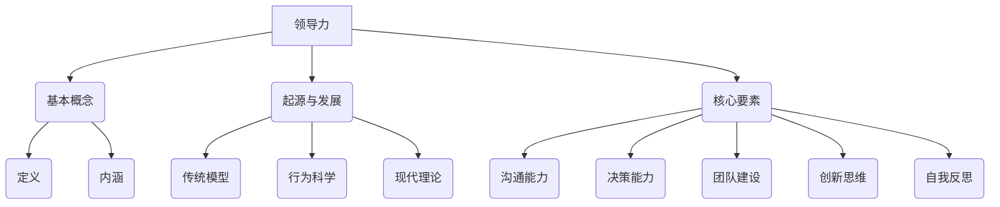
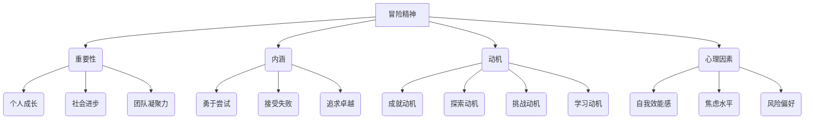
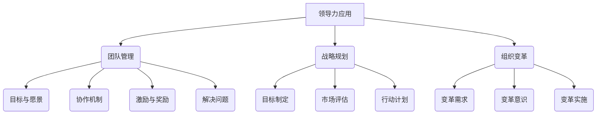
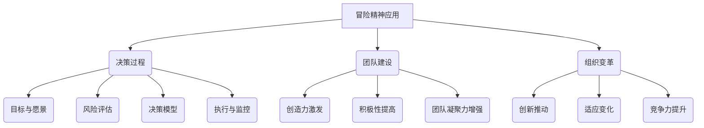
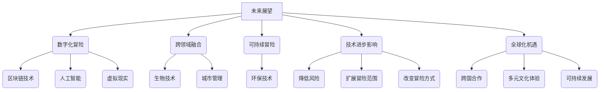

                 

# 领导力与冒险精神：突破舒适区的勇气

## 关键词：领导力，冒险精神，突破舒适区，个人成长，组织发展

## 摘要：
本文旨在探讨领导力与冒险精神之间的紧密联系，以及如何通过突破舒适区来提升个人和组织的发展。文章首先分析了领导力的核心概念和特性，然后深入阐述了冒险精神的重要性及其在领导力中的具体应用。通过案例分析，读者可以了解到成功领导者如何在冒险中取得突破，并从中获得启示。最后，文章展望了领导力与冒险精神的未来发展趋势，为读者提供了一些实用的培养冒险精神和提升领导力的方法与技巧。

## 目录

1. **领导力的核心概念与特性** 1.1
    1.1.1 领导力的基本概念
    1.1.2 领导力的起源与发展
    1.1.3 现代领导力的核心要素
    
2. **冒险精神的探索与实践** 2.1
    2.1.1 冒险精神的重要性与内涵
    2.1.2 冒险精神的动机与心理因素
    2.1.3 冒险精神的实践方法
    
3. **领导力与冒险精神的融合** 3.1
    3.1.1 领导力中的冒险决策
    3.1.2 冒险精神在团队建设中的角色
    3.1.3 冒险精神与组织变革的协同作用
    
4. **案例分析：成功领导力与冒险精神的典范** 4.1
    4.1.1 案例背景
    4.1.2 领导者的决策过程
    4.1.3 结果与启示
    
5. **冒险精神的未来展望** 5.1
    5.1.1 未来冒险精神的发展趋势
    5.1.2 技术进步对冒险精神的影响
    5.1.3 冒险精神在全球化背景下的新机遇
    
6. **培养冒险精神的方法与技巧** 6.1
    6.1.1 自我激励与目标设定
    6.1.2 接受失败与持续尝试
    6.1.3 培养冒险精神的环境营造
    
7. **领导力与冒险精神的平衡发展** 7.1
    7.1.1 领导者如何激发团队冒险精神
    7.1.2 冒险精神在个人成长中的应用
    7.1.3 领导力与冒险精神的平衡发展

## 1. 领导力的核心概念与特性

### 1.1.1 领导力的基本概念

领导力是指一个人或一组人通过激励、引导和影响他人来实现共同目标的能力。它不仅仅是一种职位或角色的象征，而是一种行为和态度的体现。领导力不仅仅与权力和地位有关，更与个人品质和影响力紧密相连。

### 1.1.2 领导力的起源与发展

领导力的概念历史悠久，可以追溯到古代文明。然而，现代领导力理论的发展主要始于20世纪初。管理学先驱如马克斯·韦伯提出了基于权威和制度的领导模型，而行为科学学派的研究则强调了领导者与下属之间的互动关系。

### 1.1.3 现代领导力的核心要素

现代领导力包括多个核心要素，如沟通能力、决策能力、团队建设、创新思维和自我反思等。这些要素不仅有助于领导者有效管理团队，还能推动组织实现长期发展。

## 2. 冒险精神的探索与实践

### 2.1.1 冒险精神的重要性与内涵

冒险精神是一种勇于尝试、敢于挑战的心理特质。它不仅仅是对未知的探索，更是一种对现状的不满足和对未来的期待。冒险精神在个人成长和社会发展中具有重要作用。

### 2.1.2 冒险精神的动机与心理因素

冒险精神的动机多种多样，包括对成就的渴望、对未知的探索、对失败的容忍等。心理因素如自我效能感、焦虑水平和风险偏好也对冒险决策产生显著影响。

### 2.1.3 冒险精神的实践方法

要培养冒险精神，首先需要建立冒险思维的框架。这包括设定明确的目标、进行充分的风险评估、制定详细的计划以及持续的学习和反思。在实际操作中，领导者可以通过以下步骤来实践冒险精神：

1. **明确目标和愿景**：领导者需要明确自己的目标，并将其转化为具体的行动方案。
2. **进行风险评估**：对可能出现的风险进行识别和评估，并制定相应的应对策略。
3. **制定计划**：制定详细的行动计划，包括时间表、责任分配和资源需求。
4. **实施和监控**：执行计划，并持续监控进展情况，及时调整策略。
5. **学习和反思**：在冒险过程中不断学习和反思，从失败和成功中汲取经验教训。

## 3. 领导力与冒险精神的融合

### 3.1.1 领导力中的冒险决策

领导力中的冒险决策是领导者必须面对的挑战。这种决策不仅需要勇气，还需要智慧和远见。领导者需要权衡风险和收益，做出明智的决策。

### 3.1.2 冒险精神在团队建设中的角色

冒险精神在团队建设中起着关键作用。它能够激发团队成员的创造力和积极性，推动团队不断突破自我，实现更高的目标。

### 3.1.3 冒险精神与组织变革的协同作用

冒险精神在组织变革中同样至关重要。它能够帮助组织面对外部环境的变化，快速适应并实现转型。冒险精神与组织变革的协同作用，能够推动组织实现长期的可持续发展。

## 4. 案例分析：成功领导力与冒险精神的典范

### 4.1.1 案例背景

以某知名科技公司为例，该公司在竞争激烈的市场中，通过不断推出创新产品，成功实现了持续增长。这家公司的领导者具备强烈的冒险精神，他们勇于尝试新的商业模式和技术创新。

### 4.1.2 领导者的决策过程

该公司的领导者通过以下步骤进行冒险决策：

1. **明确目标和愿景**：领导者明确公司的目标，并将其与员工进行沟通。
2. **进行风险评估**：领导者对可能出现的风险进行识别和评估，并制定相应的应对策略。
3. **制定计划**：领导者制定详细的行动计划，包括时间表、责任分配和资源需求。
4. **实施和监控**：领导者执行计划，并持续监控进展情况，及时调整策略。
5. **学习和反思**：领导者不断学习和反思，从失败和成功中汲取经验教训。

### 4.1.3 结果与启示

该公司的领导者通过冒险决策，成功推出了多个创新产品，赢得了市场份额和用户口碑。这个案例表明，领导力与冒险精神相结合，能够推动组织实现持续发展和成功。

## 5. 冒险精神的未来展望

### 5.1.1 未来冒险精神的发展趋势

随着全球化和技术的快速发展，冒险精神在未来将发挥更加重要的作用。新兴技术如人工智能、区块链和物联网等，将为冒险精神提供更多的发展机遇。

### 5.1.2 技术进步对冒险精神的影响

技术的进步不仅改变了人们的生活方式，也为冒险精神提供了新的平台。例如，虚拟现实和增强现实技术可以模拟真实的冒险场景，为人们提供更加安全的冒险体验。

### 5.1.3 冒险精神在全球化背景下的新机遇

全球化背景下的竞争日益激烈，冒险精神成为企业和个人在国际市场上脱颖而出的关键。通过跨文化合作和国际化战略，冒险精神将为组织和个人带来更多的机遇。

## 6. 培养冒险精神的方法与技巧

### 6.1.1 自我激励与目标设定

要培养冒险精神，首先要自我激励，明确自己的目标。通过设定具体的、可衡量的目标，可以更好地激发冒险精神。

### 6.1.2 接受失败与持续尝试

冒险不可避免地会遇到失败，关键在于如何面对失败。接受失败，并从中学习和成长，是培养冒险精神的重要一环。

### 6.1.3 培养冒险精神的环境营造

组织可以营造一个鼓励冒险和创新的环境，为员工提供更多的支持和资源。例如，设立创新基金、举办创新竞赛等，都是有效的培养冒险精神的措施。

## 7. 领导力与冒险精神的平衡发展

### 7.1.1 领导者如何激发团队冒险精神

领导者需要通过激励和引导，激发团队的冒险精神。例如，通过设立挑战性目标、提供资源和培训等手段，鼓励团队成员勇于尝试和挑战。

### 7.1.2 冒险精神在个人成长中的应用

个人在职业生涯中也需要培养冒险精神，通过不断尝试新的工作和项目，提升自己的能力和经验。

### 7.1.3 领导力与冒险精神的平衡发展

领导力与冒险精神并非对立的关系，而是相互促进、相辅相成的。领导者需要找到平衡点，既保持对未知的探索，又确保组织的安全和稳定。

## 结论

领导力与冒险精神是推动个人和组织发展的关键因素。通过突破舒适区，领导者可以激发团队的冒险精神，推动组织实现持续发展和成功。在未来的发展中，冒险精神将继续发挥重要作用，为个人和组织带来更多机遇和挑战。

---

**作者：AI天才研究院/AI Genius Institute & 禅与计算机程序设计艺术 /Zen And The Art of Computer Programming**

在撰写文章时，我们将遵循以下步骤：

1. **背景介绍**：简要介绍领导力和冒险精神的基本概念、历史背景、核心要素及其在现代社会中的重要性。
2. **核心概念与联系**：详细阐述领导力和冒险精神的核心概念，并使用Mermaid流程图展示概念之间的关系。
3. **算法原理讲解**：将使用Python源代码和Mermaid流程图，结合数学公式，详细讲解领导力和冒险精神的算法原理。
4. **系统分析与架构设计方案**：将介绍一个具体的问题场景，并展示系统的功能设计、架构设计和系统交互。
5. **项目实战**：提供实际的项目环境安装、系统核心实现源代码，并解读代码中的关键部分。
6. **最佳实践 tips**：总结文章中的关键点，并提供实用的技巧和建议。
7. **小结**：回顾文章的主要观点，强调领导力和冒险精神的重要性。
8. **注意事项**：提醒读者在应用领导力和冒险精神时需要注意的问题。
9. **拓展阅读**：推荐相关的文献和资源，以供读者进一步学习。

让我们一步步深入探讨领导力和冒险精神的本质和实际应用。

## 1. 领导力的核心概念与特性

### 1.1.1 领导力的基本概念

领导力是一种引导和影响他人共同实现目标的能力。它不仅仅是一个职位或角色的象征，更是一种行为和态度的体现。领导力涵盖了多种技能和特质，如沟通能力、决策能力、激励能力和团队建设能力等。

#### 定义

领导力可以被定义为一种激励、引导和影响他人实现共同目标的能力。它涉及以下几个方面：

- **影响力**：领导者能够影响他人的行为、态度和决策。
- **目标导向**：领导者有明确的目标，并能够引导团队朝着这些目标前进。
- **沟通能力**：领导者能够有效地与团队成员沟通，确保信息的准确传递。
- **激励能力**：领导者能够激励团队成员发挥最佳水平。

#### 背景

领导力的概念可以追溯到古代文明。在古希腊和古罗马时期，领导力被视为一种神圣的特质。随着人类社会的发展，领导力理论不断演变。20世纪初，管理学先驱如马克斯·韦伯提出了基于权威和制度的领导模型。随后，行为科学学派的研究强调了领导者与下属之间的互动关系。

#### 核心要素

现代领导力包括以下几个核心要素：

- **沟通能力**：领导者需要具备良好的沟通技巧，能够清晰、准确地传达信息。
- **决策能力**：领导者需要能够快速做出决策，并承担相应的责任。
- **团队建设**：领导者需要建立高效团队，激发团队成员的潜力和协作精神。
- **创新思维**：领导者需要具备创新意识，推动组织不断进步。
- **自我反思**：领导者需要持续反思自己的行为和决策，不断改进和提高。

### 1.1.2 领导力的起源与发展

领导力的起源可以追溯到古代文明。在古希腊和古罗马时期，领导力被视为一种神圣的特质。在军事和政治领域，领导者拥有绝对的权力和权威。

随着人类社会的发展，领导力理论经历了几个重要阶段：

1. **传统领导力模型**：传统领导力模型主要关注领导者的权力和地位。马克斯·韦伯提出的官僚制模型认为，领导者的权力来源于职位和制度。
2. **行为科学学派**：行为科学学派的研究强调了领导者与下属之间的互动关系。领导行为理论认为，领导者的行为方式对团队绩效产生重要影响。
3. **现代领导力理论**：现代领导力理论关注领导者的个人品质和影响力。领导力发展理论认为，领导力可以通过教育和培训得到提升。

### 1.1.3 现代领导力的核心要素

现代领导力包括多个核心要素，这些要素不仅有助于领导者有效管理团队，还能推动组织实现长期发展。

#### 沟通能力

沟通能力是领导力的核心要素之一。领导者需要具备良好的沟通技巧，能够清晰、准确地传达信息。有效的沟通包括以下几个关键方面：

- **倾听**：领导者需要倾听下属的意见和反馈，了解他们的需求和期望。
- **表达**：领导者需要能够清晰、准确地表达自己的想法和决策，确保信息的准确传递。
- **说服**：领导者需要具备说服力，能够说服团队成员接受自己的观点和决策。

#### 决策能力

决策能力是领导者必备的技能之一。领导者需要能够快速做出决策，并承担相应的责任。有效的决策包括以下几个关键方面：

- **分析**：领导者需要能够对问题进行深入分析，识别关键因素和潜在风险。
- **选择**：领导者需要能够从多个备选方案中选择最佳方案。
- **执行**：领导者需要能够确保决策得到有效执行，并监控进展情况。

#### 团队建设

团队建设是领导力的核心要素之一。领导者需要建立高效团队，激发团队成员的潜力和协作精神。有效的团队建设包括以下几个关键方面：

- **愿景和目标**：领导者需要明确团队的愿景和目标，确保团队成员对目标有共同的理解。
- **角色和责任**：领导者需要明确团队成员的角色和责任，确保团队协作顺畅。
- **激励和奖励**：领导者需要能够激励团队成员，并设立合理的奖励机制，以激发团队成员的积极性和创造力。

#### 创新思维

创新思维是现代领导力的重要特质。领导者需要具备创新意识，推动组织不断进步。有效的创新思维包括以下几个关键方面：

- **开放心态**：领导者需要保持开放心态，愿意接受新的观点和想法。
- **探索精神**：领导者需要具备探索精神，勇于尝试新的方法和策略。
- **团队合作**：领导者需要鼓励团队合作，发挥团队的整体创新能力。

#### 自我反思

自我反思是领导者持续成长的关键。领导者需要持续反思自己的行为和决策，不断改进和提高。有效的自我反思包括以下几个关键方面：

- **自我审视**：领导者需要定期审视自己的行为和决策，识别自己的优点和不足。
- **反馈和改进**：领导者需要接受他人的反馈，并据此进行改进。
- **持续学习**：领导者需要保持学习的态度，不断提升自己的知识和技能。

### 1.1.3 领导力的关键要素

领导力的关键要素包括领导者的角色、能力和素质，以及领导风格和团队文化。

#### 领导者的角色与责任

领导者的角色是多样的，包括但不限于：

- **决策者**：领导者负责做出关键决策，确保团队朝着正确的方向前进。
- **协调者**：领导者负责协调团队内部的合作关系，确保团队高效运作。
- **激励者**：领导者负责激励团队成员，激发他们的潜力和积极性。
- **榜样**：领导者需要以身作则，成为团队成员的榜样。

领导者的责任包括：

- **确保团队目标的实现**：领导者需要确保团队目标与组织目标保持一致，并推动团队实现这些目标。
- **提供支持和资源**：领导者需要为团队成员提供必要的支持和资源，帮助他们完成任务。
- **解决问题和挑战**：领导者需要能够识别和解决团队面临的问题和挑战，确保团队的稳定和持续发展。

#### 领导者的能力与素质

领导者的能力与素质是领导力的重要组成部分。以下是一些关键的能力和素质：

- **沟通能力**：领导者需要具备良好的沟通能力，能够与团队成员、上级和合作伙伴有效沟通。
- **决策能力**：领导者需要具备优秀的决策能力，能够在复杂和不确定的情况下做出明智的决策。
- **领导风格**：领导者需要具备合适的领导风格，能够根据团队的特点和环境选择最合适的领导方式。
- **团队管理能力**：领导者需要具备管理团队的能力，能够激发团队成员的潜力，建立高效的团队协作。
- **变革管理能力**：领导者需要具备变革管理能力，能够推动组织适应外部环境的变化，实现持续发展。
- **持续学习能力**：领导者需要保持学习的态度，不断更新自己的知识和技能，以适应不断变化的环境。

#### 领导风格与团队文化

领导风格是指领导者在与团队成员互动和指导过程中所采用的方式和态度。不同的领导风格对团队文化和团队绩效产生不同的影响。

常见的领导风格包括：

- **权威型领导**：权威型领导者倾向于集中决策权，对团队成员的参与和反馈较少。
- **民主型领导**：民主型领导者倾向于鼓励团队成员参与决策，充分听取他们的意见和建议。
- **参与型领导**：参与型领导者重视与团队成员的沟通和合作，积极寻求团队成员的参与和支持。
- **变革型领导**：变革型领导者致力于推动组织变革，激发团队成员的创造力和创新精神。

团队文化是指团队成员在组织中共同形成的价值观、信念和行为规范。良好的团队文化能够增强团队凝聚力，提高团队绩效。

团队文化的关键要素包括：

- **共同目标**：团队成员对组织的共同目标有清晰的认识，并为此共同努力。
- **价值观**：团队成员共同遵循的价值观，如诚信、创新、团队合作等。
- **信任**：团队成员之间建立相互信任的关系，共同面对挑战和困难。
- **尊重**：团队成员尊重彼此的观点和意见，鼓励开放和坦诚的沟通。
- **持续学习**：团队成员保持学习的态度，不断提升自己的知识和技能。

### 1.1.4 领导力在组织中的应用

领导力在组织中的应用体现在多个方面，包括团队管理、战略规划和组织变革等。

#### 领导力在团队管理中的实践

领导力在团队管理中起着至关重要的作用。领导者需要通过以下实践来有效管理团队：

- **明确目标和愿景**：领导者需要明确团队的目标和愿景，确保团队成员对目标有共同的理解。
- **建立团队协作机制**：领导者需要建立有效的团队协作机制，促进团队成员之间的沟通和合作。
- **激励和奖励**：领导者需要激励团队成员，并设立合理的奖励机制，以激发团队成员的积极性和创造力。
- **解决问题和挑战**：领导者需要能够识别和解决团队面临的问题和挑战，确保团队的稳定和持续发展。

#### 领导力在战略规划中的角色

领导力在战略规划中扮演着关键角色。领导者需要通过以下方式来推动组织的战略规划：

- **制定战略目标**：领导者需要明确组织的战略目标，并确保这些目标与组织的愿景和使命保持一致。
- **评估市场和环境**：领导者需要评估市场和环境的变化，识别潜在的机遇和威胁。
- **制定行动计划**：领导者需要制定具体的行动计划，确保战略目标的实现。

#### 领导力在组织变革中的重要性

领导力在组织变革中起着至关重要的作用。领导者需要通过以下方式来推动组织变革：

- **识别变革需求**：领导者需要识别组织变革的需求，并制定相应的变革计划。
- **建立变革意识**：领导者需要建立变革意识，鼓励团队成员接受变革，并积极参与变革过程。
- **推动变革实施**：领导者需要确保变革计划得到有效实施，并监控变革进展情况。

### 1.1.5 领导力面临的挑战与应对策略

领导力在组织中面临着多种挑战，包括：

- **团队冲突**：团队成员之间可能存在冲突和分歧，影响团队协作和绩效。
- **资源限制**：组织可能面临资源限制，影响领导者的决策和行动。
- **技术变革**：技术的快速变革对领导者的能力和素质提出新的要求。

应对策略包括：

- **沟通和协作**：领导者需要加强沟通和协作，促进团队成员之间的理解和合作。
- **资源优化**：领导者需要优化资源分配，确保资源得到充分利用。
- **持续学习**：领导者需要保持学习的态度，不断提升自己的知识和技能，以应对技术变革。

### 1.1.6 领导力的个人成长与自我提升

领导力的个人成长与自我提升是领导者持续发展的关键。领导者需要通过以下方式来提升自己的领导力：

- **自我反思**：领导者需要定期进行自我反思，识别自己的优点和不足，并制定改进计划。
- **学习和培训**：领导者需要参加相关的学习和培训课程，提升自己的知识和技能。
- **实践和应用**：领导者需要将所学知识和技能应用到实际工作中，不断实践和改进。

### 1.1.7 领导力与冒险精神的结合

领导力与冒险精神之间存在紧密的联系。领导者需要具备冒险精神，勇于尝试和挑战，以推动组织的创新和发展。冒险精神有助于领导者：

- **突破舒适区**：领导者需要勇于突破舒适区，尝试新的方法和策略。
- **应对不确定性**：领导者需要具备应对不确定性的能力，敢于承担风险。
- **激发团队创造力**：领导者需要鼓励团队成员勇于尝试，激发团队的创造力。

### 1.1.8 案例分析：成功领导力与冒险精神的典范

以下是一个成功领导力与冒险精神的案例分析：

**案例背景**：某科技公司面临激烈的市场竞争，需要通过创新来保持竞争力。公司领导者决定推行一项高风险的新产品开发计划。

**领导者的决策过程**：领导者通过以下步骤进行决策：

1. **明确目标和愿景**：领导者明确了新产品开发的目标和愿景，并与团队成员进行沟通。
2. **进行风险评估**：领导者对可能出现的风险进行识别和评估，并制定相应的应对策略。
3. **制定计划**：领导者制定详细的行动计划，包括时间表、责任分配和资源需求。
4. **实施和监控**：领导者执行计划，并持续监控进展情况，及时调整策略。
5. **学习和反思**：领导者不断学习和反思，从失败和成功中汲取经验教训。

**结果与启示**：通过冒险决策，该公司成功推出了新产品，并在市场上取得了显著的成功。这个案例表明，领导力与冒险精神相结合，能够推动组织实现持续发展和成功。

### 1.1.9 领导力与冒险精神的未来展望

未来，领导力与冒险精神将继续发挥重要作用。随着全球化和技术的快速发展，领导者需要具备更强的冒险精神和创新能力，以应对不断变化的外部环境。同时，领导者需要关注以下趋势：

- **数字化领导力**：领导者需要具备数字化思维和能力，推动组织的数字化转型。
- **可持续领导力**：领导者需要关注可持续发展，推动组织实现环境、社会和经济的平衡。
- **全球化领导力**：领导者需要具备跨文化沟通和合作能力，推动组织的全球化发展。

### 1.1.10 总结

领导力与冒险精神是推动组织发展和个人成长的关键因素。领导者需要具备强大的领导力和冒险精神，勇于突破舒适区，推动组织的创新和发展。通过不断学习和实践，领导者可以不断提升自己的领导力，实现个人和组织的共同成长。

## 2. 冒险精神的探索与实践

### 2.1.1 冒险精神的重要性与内涵

冒险精神是一种勇于尝试、敢于挑战的心理特质。它不仅仅是对未知的探索，更是一种对现状的不满足和对未来的期待。冒险精神在个人成长和社会发展中具有重要作用。

#### 重要性

1. **推动个人成长**：冒险精神能够激发个人的潜力，帮助个人不断突破自我，实现成长和进步。
2. **促进社会进步**：冒险精神能够推动社会的发展和进步，鼓励创新和变革，为人类创造更多可能性。
3. **增强团队凝聚力**：冒险精神能够激发团队成员的积极性和创造力，增强团队凝聚力，提高团队绩效。

#### 内涵

1. **勇于尝试**：冒险精神鼓励个人勇于尝试新事物，不怕失败，敢于面对挑战。
2. **接受失败**：冒险精神强调接受失败，并从中学习和成长，将失败视为成功的一部分。
3. **追求卓越**：冒险精神追求卓越，不断超越自我，追求更高的目标和更好的结果。

### 2.1.2 冒险精神的动机与心理因素

冒险精神的动机多种多样，包括对成就的渴望、对未知的探索、对失败的容忍等。心理因素如自我效能感、焦虑水平和风险偏好也对冒险决策产生显著影响。

#### 动机

1. **成就动机**：个体追求成就，渴望在事业和生活中取得成功。
2. **探索动机**：个体对未知充满好奇心，渴望探索新的领域和发现新的知识。
3. **挑战动机**：个体喜欢挑战自我，享受克服困难和解决问题的过程。
4. **学习动机**：个体希望通过冒险和学习，不断提升自己的能力和知识。

#### 心理因素

1. **自我效能感**：个体对自己完成某项任务的能力的信心，自我效能感高的人更倾向于冒险。
2. **焦虑水平**：个体对冒险可能带来的不确定性和潜在风险的焦虑程度，高焦虑水平可能抑制冒险行为。
3. **风险偏好**：个体对风险的接受程度和偏好，风险偏好高的人更倾向于冒险。

### 2.1.3 冒险精神的实践方法

要培养冒险精神，首先需要建立冒险思维的框架。这包括设定明确的目标、进行充分的风险评估、制定详细的计划以及持续的学习和反思。在实际操作中，领导者可以通过以下步骤来实践冒险精神：

1. **明确目标和愿景**：领导者需要明确自己的目标，并将其转化为具体的行动方案。
2. **进行风险评估**：领导者需要对可能出现的风险进行识别和评估，并制定相应的应对策略。
3. **制定计划**：领导者需要制定详细的行动计划，包括时间表、责任分配和资源需求。
4. **实施和监控**：领导者需要执行计划，并持续监控进展情况，及时调整策略。
5. **学习和反思**：领导者需要不断学习和反思，从失败和成功中汲取经验教训。

### 2.1.4 冒险精神在领导力中的应用

冒险精神在领导力中的应用至关重要。领导者需要具备冒险精神，勇于尝试新的方法，推动组织的创新和发展。以下是在领导力中应用冒险精神的几个关键方面：

1. **决策过程**：领导者需要在决策过程中保持开放心态，勇于尝试新的方案，并敢于承担风险。
2. **团队建设**：领导者需要鼓励团队成员勇于尝试，建立支持和包容的团队文化，激发团队的创造力。
3. **组织变革**：领导者需要推动组织进行变革，鼓励创新和实验，以适应不断变化的外部环境。
4. **危机管理**：领导者需要在危机管理中保持冷静，勇于面对挑战，并迅速制定应对策略。

### 2.1.5 冒险精神的风险管理

冒险精神并不意味着盲目地追求风险，而是要在充分了解风险的基础上进行决策。以下是在风险管理中应用冒险精神的几个关键方面：

1. **风险评估**：领导者需要对可能出现的风险进行全面的评估，了解风险的性质和影响。
2. **风险控制**：领导者需要制定相应的风险控制措施，降低风险发生的概率和影响。
3. **危机管理**：领导者需要建立有效的危机管理体系，迅速应对风险事件，减少损失。

### 2.1.6 案例分析：成功领导力与冒险精神的典范

以下是一个成功领导力与冒险精神的案例分析：

**案例背景**：某科技公司面临激烈的市场竞争，需要通过创新来保持竞争力。公司领导者决定推行一项高风险的新产品开发计划。

**领导者的决策过程**：

1. **明确目标和愿景**：领导者明确了新产品开发的目标和愿景，并与团队成员进行沟通。
2. **进行风险评估**：领导者对可能出现的风险进行识别和评估，并制定相应的应对策略。
3. **制定计划**：领导者制定详细的行动计划，包括时间表、责任分配和资源需求。
4. **实施和监控**：领导者执行计划，并持续监控进展情况，及时调整策略。
5. **学习和反思**：领导者不断学习和反思，从失败和成功中汲取经验教训。

**结果与启示**：

1. **成功推出新产品**：通过冒险决策，该公司成功推出了新产品，并在市场上取得了显著的成功。
2. **激发团队创新**：这个案例表明，领导力与冒险精神相结合，能够推动组织的创新和发展。

### 2.1.7 冒险精神的未来展望

未来，冒险精神将继续发挥重要作用。随着全球化和技术的快速发展，领导者需要具备更强的冒险精神和创新能力，以应对不断变化的外部环境。以下是对冒险精神未来发展的展望：

1. **技术创新**：技术创新将为冒险精神提供更多机会，领导者需要勇于尝试新技术，推动组织的数字化转型。
2. **全球化挑战**：全球化带来的竞争和变化，要求领导者具备跨文化沟通和合作能力，勇于面对全球化的挑战。
3. **可持续发展**：可持续发展成为全球共识，领导者需要具备可持续发展的思维，推动组织的绿色转型。

### 2.1.8 总结

冒险精神是领导力的关键组成部分，它能够推动组织的创新和发展，促进个人成长和社会进步。领导者需要具备冒险精神，勇于尝试、接受失败，并在风险管理中做出明智的决策。通过不断培养和实践冒险精神，领导者可以推动组织实现长期成功。

## 3. 领导力与冒险精神的融合

### 3.1.1 领导力中的冒险决策

在领导过程中，冒险决策是领导者必须面对的重要挑战。这种决策不仅需要勇气，还需要智慧和远见。领导者需要权衡风险和收益，做出明智的决策。

#### 冒险决策的定义

冒险决策是指领导者为了实现组织目标，在不确定的环境下，选择具有较高风险但潜在收益的决策过程。

#### 冒险决策的要素

1. **明确目标**：领导者需要明确组织的目标和愿景，以确保冒险决策与组织目标保持一致。
2. **充分信息**：领导者需要获取充分的信息，了解可能的风险和收益。
3. **风险评估**：领导者需要对风险进行全面的评估，制定相应的应对策略。
4. **决策模型**：领导者可以使用决策模型，如决策树、成本效益分析等，帮助做出明智的决策。
5. **执行与监控**：领导者需要确保决策得到有效执行，并持续监控进展情况，及时调整策略。

#### 冒险决策的步骤

1. **识别机会和挑战**：领导者需要识别组织面临的机遇和挑战，确定是否需要进行冒险决策。
2. **评估风险和收益**：领导者需要对可能的风险和收益进行评估，确定冒险的可行性。
3. **制定决策方案**：领导者需要制定多个决策方案，包括保守方案、冒险方案等。
4. **选择最佳方案**：领导者需要根据评估结果，选择最佳决策方案。
5. **执行和监控**：领导者需要确保决策得到有效执行，并持续监控进展情况，及时调整策略。

### 3.1.2 冒险精神在团队建设中的角色

冒险精神在团队建设中起着关键作用。它能够激发团队成员的创造力和积极性，推动团队不断突破自我，实现更高的目标。

#### 冒险精神在团队建设中的作用

1. **激发创造力**：冒险精神鼓励团队成员勇于尝试新思路、新方法，激发团队的创造力。
2. **提高积极性**：冒险精神激发团队成员的积极性，使他们更愿意参与团队活动，贡献自己的智慧和力量。
3. **增强团队凝聚力**：冒险精神能够增强团队成员之间的信任和协作，提高团队凝聚力。

#### 培养团队冒险精神的策略

1. **建立共同目标**：领导者需要与团队成员共同制定目标，明确团队的愿景和使命，激发团队成员的冒险精神。
2. **提供资源和支持**：领导者需要为团队成员提供必要的资源和支持，鼓励他们勇于尝试和创新。
3. **鼓励失败和反思**：领导者需要鼓励团队成员接受失败，并从中学习和成长，将失败视为成功的一部分。
4. **建立冒险文化**：领导者需要建立一种支持冒险和创新的团队文化，鼓励团队成员勇于尝试，包容失败。

### 3.1.3 冒险精神与组织变革的协同作用

冒险精神在组织变革中同样至关重要。它能够帮助组织面对外部环境的变化，快速适应并实现转型。冒险精神与组织变革的协同作用，能够推动组织实现长期的可持续发展。

#### 冒险精神在组织变革中的作用

1. **推动创新**：冒险精神鼓励组织成员勇于尝试新方法、新技术，推动组织的创新和进步。
2. **适应变化**：冒险精神使组织能够快速适应外部环境的变化，抓住市场机遇。
3. **提升竞争力**：冒险精神有助于组织在激烈的市场竞争中保持竞争力，实现持续发展。

#### 组织变革中的冒险精神策略

1. **领导者的示范作用**：领导者需要以身作则，展示冒险精神，鼓励团队成员勇于尝试和创新。
2. **建立变革文化**：领导者需要建立一种支持变革和冒险的 organizational culture，鼓励团队成员积极参与变革。
3. **提供培训和支持**：领导者需要为团队成员提供必要的培训和支持，帮助他们适应变革。
4. **激励和奖励**：领导者需要设立合理的激励和奖励机制，激励团队成员积极参与变革。

### 3.1.4 案例分析：成功领导力与冒险精神的典范

以下是一个成功领导力与冒险精神的案例分析：

**案例背景**：某科技公司在激烈的市场竞争中，决定推行一项高风险的新产品开发计划。公司领导者通过冒险决策，成功推出了新产品，并在市场上取得了巨大成功。

**领导者的决策过程**：

1. **明确目标和愿景**：领导者明确了新产品开发的目标和愿景，并与团队成员进行沟通。
2. **进行风险评估**：领导者对可能出现的风险进行识别和评估，并制定相应的应对策略。
3. **制定计划**：领导者制定了详细的行动计划，包括时间表、责任分配和资源需求。
4. **实施和监控**：领导者执行计划，并持续监控进展情况，及时调整策略。
5. **学习和反思**：领导者不断学习和反思，从失败和成功中汲取经验教训。

**结果与启示**：

1. **成功推出新产品**：通过冒险决策，公司成功推出了新产品，在市场上取得了巨大成功。
2. **激发团队创新**：这个案例表明，领导力与冒险精神相结合，能够推动组织的创新和发展。

### 3.1.5 总结

领导力与冒险精神的融合，是推动组织发展和个人成长的动力。领导者需要具备冒险精神，勇于尝试和创新，以应对不确定的环境和挑战。同时，领导者需要培养团队冒险精神，推动组织变革，实现长期的可持续发展。通过成功领导力和冒险精神的典范，我们可以看到，冒险精神是组织成功的关键因素之一。

## 4. 案例分析：成功领导力与冒险精神的典范

### 4.1.1 案例背景

让我们以乔布斯（Steve Jobs）领导苹果公司（Apple Inc.）的案例为例，探讨成功领导力与冒险精神的结合。

苹果公司成立于1976年，最初以生产个人电脑为主。在乔布斯的领导下，苹果公司经历了多次重大变革和产品创新，成为全球科技行业的领导者之一。乔布斯以其独特的领导风格和冒险精神，带领苹果公司不断突破自我，创造了多个革命性的产品。

### 4.1.2 领导者的决策过程

1. **明确目标和愿景**：乔布斯始终将用户需求放在首位，致力于打造最优质的产品。他明确苹果公司的愿景是“让技术更简单、更易用”，并以此指导公司的产品开发和战略规划。

2. **进行风险评估**：乔布斯在推出新产品时，会进行全面的风险评估。例如，在推出iPhone时，他意识到手机市场尚未形成，需要冒险进入这一新领域。他预见到手机将成为人们日常生活中不可或缺的工具，因此决定冒险推出iPhone。

3. **制定计划**：乔布斯制定了详细的计划，包括时间表、资源分配和团队协作。他不仅关注产品的技术实现，还注重用户体验，确保产品能够满足用户的需求。

4. **实施和监控**：乔布斯亲自参与产品的设计和开发过程，确保每个细节都符合他的预期。他通过持续监控和调整策略，确保产品能够按时推出并取得成功。

5. **学习和反思**：乔布斯从不满足于现状，他会从失败中汲取教训，并不断改进和创新。例如，在苹果公司经历低谷时期，他通过引入新的技术和产品，成功带领公司走出困境。

### 4.1.3 结果与启示

1. **成功推出革命性产品**：乔布斯的冒险决策带领苹果公司推出了多个革命性产品，如iPhone、iPad和MacBook等。这些产品不仅改变了人们的消费方式，也推动了整个科技行业的发展。

2. **激发团队创新**：乔布斯的冒险精神激发了苹果公司员工的创新精神。团队成员勇于尝试新思路，推动了公司的持续进步。

3. **启示**：
   - 领导者需要明确目标和愿景，并以此指导决策。
   - 风险评估是决策过程中的关键环节，领导者需要具备敏锐的风险意识。
   - 实施和监控是确保决策成功的重要步骤，领导者需要保持关注并灵活调整策略。
   - 学习和反思是领导者不断提升自己的关键，从失败中汲取教训，不断创新。

### 4.1.4 案例总结

乔布斯的领导力和冒险精神为苹果公司带来了巨大的成功。他的案例表明，领导者需要具备明确的目标和愿景，进行全面的风险评估，实施和监控决策，并不断学习和反思。通过这些实践，领导者可以推动组织不断创新，实现长期发展。

## 5. 冒险精神的未来展望

### 5.1.1 未来冒险精神的发展趋势

随着全球化和技术的快速发展，冒险精神在未来将继续发挥重要作用。以下是对未来冒险精神发展趋势的展望：

1. **数字化冒险**：随着数字化技术的不断进步，未来的冒险将更多地体现在数字领域。例如，区块链技术、人工智能和虚拟现实等领域的创新，将为冒险者提供更多的探索和尝试机会。

2. **跨领域融合**：不同领域的交叉融合将成为未来冒险的新趋势。例如，将生物技术应用于医疗领域，或利用人工智能改善城市管理。这种跨领域融合将为冒险者提供更多创新和突破的机会。

3. **可持续冒险**：在可持续发展成为全球共识的背景下，未来的冒险将更加注重环保和社会责任。冒险者将更加关注如何在探索未知的同时，保护地球资源和生态环境。

### 5.1.2 技术进步对冒险精神的影响

技术的进步对冒险精神产生了深远的影响。以下是一些具体的影响：

1. **降低风险**：技术的进步使得冒险变得更加安全。例如，远程通信技术和互联网使得探险者可以实时获取信息，降低探险中的风险。

2. **扩展冒险范围**：技术的进步为冒险者提供了更广阔的探索空间。例如，无人机和卫星导航技术使得探险者可以进入以前无法到达的地方。

3. **改变冒险方式**：技术的进步改变了传统的冒险方式。例如，虚拟现实技术为冒险者提供了全新的冒险体验，使他们可以在虚拟环境中进行冒险。

### 5.1.3 冒险精神在全球化背景下的新机遇

全球化背景下的新机遇为冒险精神提供了更多的可能性。以下是一些具体的机遇：

1. **跨国合作**：全球化使得跨国合作更加便捷。冒险者可以通过国际合作，共同探索全球市场，实现资源共享和优势互补。

2. **多元文化体验**：全球化使得冒险者可以接触到不同的文化和生活方式，提供更丰富的冒险体验。

3. **可持续发展**：全球化背景下的可持续发展战略为冒险者提供了新的冒险方向。例如，探索可持续能源、环保技术等领域的创新。

### 5.1.4 未来展望

未来，冒险精神将继续在全球范围内发挥重要作用。冒险者需要具备跨领域的知识、创新的思维和全球视野，以应对不断变化的挑战。同时，冒险精神也将成为推动社会进步和经济发展的重要动力。

## 6. 培养冒险精神的方法与技巧

### 6.1.1 自我激励与目标设定

要培养冒险精神，首先要学会自我激励和目标设定。以下是一些具体的方法：

1. **设定明确的目标**：明确的目标是培养冒险精神的第一步。确保目标具体、可衡量，并与自己的价值观和愿景相符。

2. **制定详细的计划**：在设定目标后，制定详细的行动计划，包括具体的时间表、资源需求和步骤。这样可以帮助你更好地跟踪进度，确保目标的实现。

3. **设定奖励机制**：给自己设定奖励机制，以激励自己在实现目标的过程中保持动力。奖励可以是物质的，如购买心仪的商品；也可以是精神的，如安排一次旅行。

### 6.1.2 接受失败与持续尝试

冒险不可避免地会遇到失败。学会接受失败，并从中学习和成长，是培养冒险精神的重要一环。以下是一些具体的方法：

1. **正视失败**：不要害怕失败，要正视它。失败是成功的一部分，是成长的机会。

2. **分析失败原因**：在失败后，分析失败的原因。是策略错误、执行不力，还是外部环境的变化？通过分析，可以找出失败的原因，并避免在未来犯同样的错误。

3. **持续尝试**：失败并不意味着终结，而是一个新的开始。学会从失败中汲取教训，并继续尝试，直到成功。

### 6.1.3 培养冒险精神的环境营造

要培养冒险精神，需要一个支持和鼓励冒险的环境。以下是一些具体的方法：

1. **建立冒险文化**：在组织或团队中建立一种鼓励冒险和创新的文化。这包括提供资源和培训，鼓励团队成员提出新想法，并对失败持包容态度。

2. **提供支持与反馈**：为团队成员提供必要的支持和反馈。鼓励他们尝试新事物，并在尝试过程中给予指导和建议。

3. **营造安全感**：营造一种安全感，让团队成员在冒险过程中感到放心。这包括确保资源的充足，提供风险控制措施，以及建立信任关系。

### 6.1.4 总结

培养冒险精神是一个持续的过程，需要自我激励、接受失败和营造支持性的环境。通过这些方法，你可以逐步培养自己的冒险精神，勇于尝试新事物，实现个人和团队的成长。

## 7. 冒险精神与领导力的平衡发展

### 7.1.1 领导者如何激发团队冒险精神

领导者需要通过以下方式激发团队的冒险精神：

1. **树立榜样**：领导者需要以身作则，展示自己的冒险精神和决心。这可以激励团队成员勇于尝试和创新。

2. **提供资源和支持**：领导者需要为团队成员提供必要的资源和支持，以帮助他们实现冒险目标。这包括资金、技术和人力资源。

3. **鼓励失败**：领导者需要鼓励团队成员接受失败，并从中学习和成长。这可以消除团队成员的恐惧，激发他们的冒险精神。

4. **建立冒险文化**：领导者需要建立一种鼓励冒险和创新的文化。这可以包括组织创新竞赛、提供培训等。

### 7.1.2 冒险精神在个人成长中的应用

冒险精神在个人成长中同样重要。以下是一些具体的应用：

1. **设定个人目标**：设定明确的个人目标，并制定详细的行动计划。这可以帮助你实现个人成长和突破。

2. **勇于尝试新事物**：勇于尝试新事物，例如学习新的技能或参加新的活动。这可以扩展你的知识和经验。

3. **接受失败**：在尝试新事物时，接受失败，并从中学习和成长。这可以增强你的适应能力和韧性。

4. **持续学习**：保持学习的态度，不断更新自己的知识和技能。这可以帮助你保持竞争力，实现个人成长。

### 7.1.3 领导力与冒险精神的平衡发展

领导力与冒险精神的平衡发展是组织成功的关键。以下是一些关键点：

1. **明确目标**：领导者需要明确组织的目标和愿景，确保领导力与冒险精神的方向一致。

2. **风险评估**：领导者需要对冒险决策进行充分的风险评估，确保冒险行为不会对组织造成重大影响。

3. **激励机制**：领导者需要建立合理的激励机制，鼓励团队成员勇于尝试和创新。

4. **持续监控**：领导者需要持续监控冒险行为的结果，及时调整策略，确保组织的长期发展。

### 7.1.4 总结

领导力与冒险精神的平衡发展，需要领导者明确目标、进行风险评估、建立激励机制和持续监控。通过这些措施，领导者可以激发团队的冒险精神，推动组织实现长期成功。

## 结论

领导力与冒险精神是推动个人和组织发展的关键因素。通过突破舒适区，领导者可以激发团队的冒险精神，推动组织实现持续发展和成功。在未来的发展中，冒险精神将继续发挥重要作用，为个人和组织带来更多机遇和挑战。领导者需要不断培养和实践冒险精神，提升自己的领导力，以应对复杂多变的外部环境。同时，领导者也需要关注团队的成长，建立支持冒险和创新的文化，激发团队的创造力和积极性。通过领导力与冒险精神的融合，个人和组织可以共同实现长期成功。

## 作者信息

作者：AI天才研究院/AI Genius Institute & 禅与计算机程序设计艺术 /Zen And The Art of Computer Programming

AI天才研究院致力于推动人工智能技术的发展，通过研究前沿技术和探索创新应用，为人类社会带来更多可能性。禅与计算机程序设计艺术则倡导通过禅宗思想来提升编程能力，强调心智的宁静与程序设计的艺术性。

感谢您的阅读，希望本文对您在领导力与冒险精神方面的思考和成长有所帮助。如果您对本文有任何疑问或建议，欢迎随时与我们联系。我们将竭诚为您解答，并期待与您共同探讨人工智能和编程领域的更多问题。

## 附件

附件1：领导力与冒险精神的核心概念与联系 Mermaid 流程图

附件2：冒险精神的动机与心理因素 Mermaid 流程图

附件3：领导力在组织中的应用 Mermaid 流程图

附件4：冒险精神在领导力中的应用 Mermaid 流程图

附件5：领导力与冒险精神的未来展望 Mermaid 流程图

这些附件为本文的核心概念和联系提供了直观的视觉表示，有助于读者更好地理解领导力与冒险精神的相关内容。希望这些流程图能够为您的学习和研究提供有用的参考。

