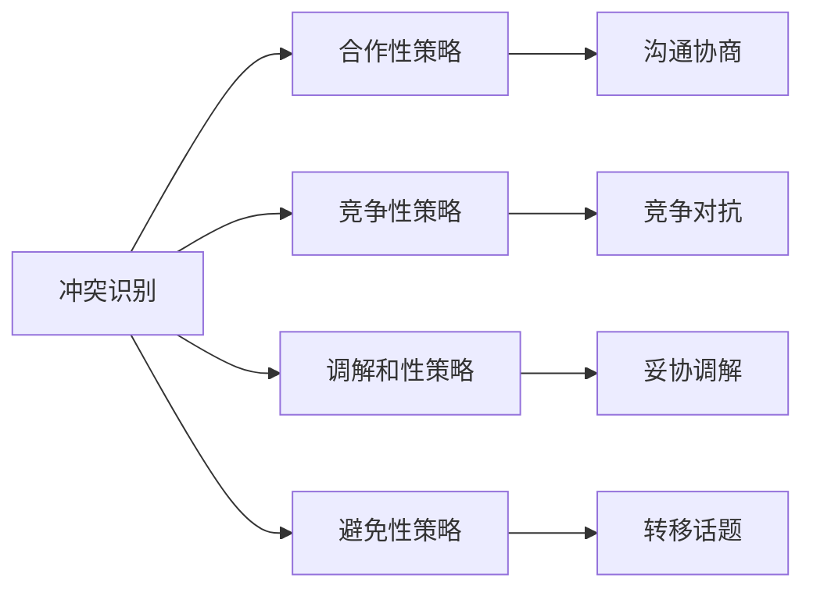
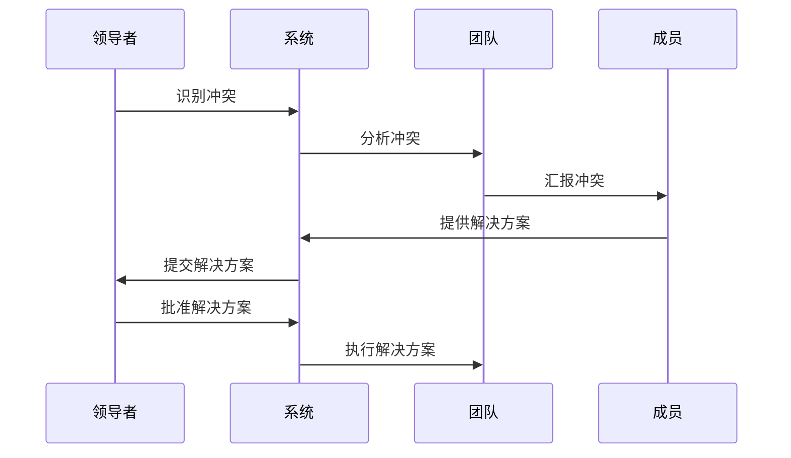
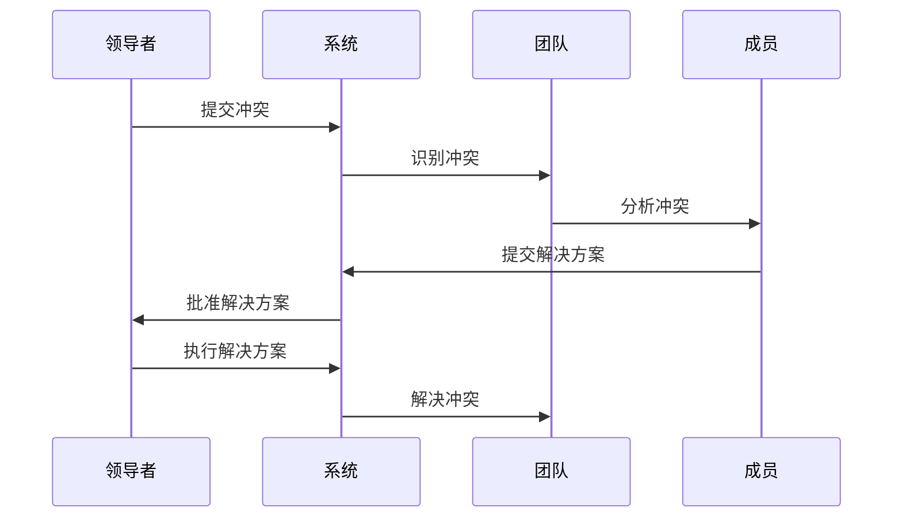

                 

## 引言

在现代企业中，领导力与冲突解决扮演着至关重要的角色。领导力不仅关乎一个团队的效率和生产力，更影响着企业的长远发展和竞争力。而冲突解决则是团队协作中不可或缺的一部分，它有助于维护团队的和谐，促进创新和进步。

**问题背景与核心概念**

现代企业面临着多样化的挑战，包括快速的技术变革、市场竞争加剧、员工多样性和跨文化合作等。这些问题使得领导力与冲突解决的重要性愈发凸显。领导力是确保团队朝共同目标前进的关键因素，它涉及如何激发团队的潜力、推动创新和应对变化。而冲突解决则是对团队内部潜在的矛盾和分歧进行有效管理，确保团队能够在面对挑战时保持凝聚力和活力。

**本文核心内容与主题思想**

本文将围绕领导力与冲突解决这一主题，系统地探讨其核心概念、理论基础和实践技巧。具体包括：

1. **问题背景与核心概念**：介绍现代企业面临的领导力与冲突解决挑战，定义领导力、冲突和团队矛盾等核心概念。
2. **领导力与冲突解决理论**：阐述领导风格理论、领导行为理论、领导效能理论、冲突解决理论以及团队矛盾解决理论。
3. **实践技巧与方法**：详细讨论提升领导力的技巧、冲突解决技巧以及团队矛盾解决技巧，并结合实际案例进行分析。

通过本文的阅读，读者将能够全面了解领导力与冲突解决的重要性，掌握相关理论和方法，从而在实际工作中更好地应对挑战，提升团队绩效和企业竞争力。

## 第1章: 问题背景与核心概念

### 1.1 问题背景

在现代企业中，领导力与冲突解决的重要性不可忽视。企业面临的挑战日益复杂，不仅包括技术变革、市场竞争，还涉及员工多样性和跨文化合作等方面。这些挑战使得领导力在确保团队高效运作、推动创新和应对变化方面发挥着至关重要的作用。

**1.1.1 现代企业面临的领导力与冲突解决挑战**

1. **技术变革**：随着信息技术的迅猛发展，企业需要快速适应新的技术趋势，如云计算、人工智能和大数据等。这要求领导者在技术前沿保持敏锐，能够引领团队不断创新，同时解决技术变革带来的不确定性和风险。
   
2. **市场竞争**：全球化的趋势使得市场竞争愈发激烈，企业需要在竞争中保持优势。领导力在这里的作用是确保团队能够迅速响应市场变化，调整战略和战术，以保持竞争力。

3. **员工多样性**：现代企业中的员工背景越来越多样化，包括不同的年龄、性别、文化和教育背景等。这种多样性既是优势，也是挑战。领导者需要具备跨文化沟通和协调能力，促进团队合作，解决潜在的文化冲突。

4. **跨文化合作**：在全球业务拓展的过程中，企业往往需要与来自不同国家和文化背景的合作伙伴和员工进行协作。这要求领导者具备跨文化管理和冲突解决的能力，以确保团队能够高效运作。

**1.1.2 团队矛盾对企业发展的影响**

团队矛盾如果不加以妥善解决，会对企业产生多方面的负面影响：

1. **工作效率降低**：团队成员之间的矛盾和冲突会分散他们的注意力，导致工作效率下降。长时间的团队矛盾甚至可能导致项目延误或失败。

2. **员工流失**：不和谐的团队氛围会使得员工感到不愉快，甚至可能选择离职。高离职率对企业的人才储备和团队稳定性造成严重威胁。

3. **创新能力受限**：团队矛盾会抑制团队成员之间的交流和合作，从而限制创新能力的发挥。在一个充满冲突的团队中，创新往往难以实现。

4. **企业声誉受损**：不和谐的团队关系可能会在客户和合作伙伴面前暴露出来，影响企业的声誉和业务合作机会。

**1.1.3 领导力与冲突解决在企业发展中的重要性**

1. **提高团队效能**：有效的领导力可以激发团队成员的潜力，提高团队的凝聚力和工作效率。领导者通过建立明确的目标和沟通机制，可以减少团队内部的摩擦和冲突，使团队朝着共同的目标迈进。

2. **促进创新与进步**：领导者具备良好的冲突解决能力，能够引导团队在面对挑战时进行有效的沟通和合作，从而促进创新和进步。创新是企业在激烈竞争中保持领先的关键。

3. **增强企业竞争力**：领导力与冲突解决的结合，有助于企业在面对外部变化和内部挑战时，保持灵活性和适应性。这种能力是企业长期发展的核心竞争力。

4. **提升员工满意度与忠诚度**：一个充满信任和尊重的团队氛围，能够提高员工的满意度和忠诚度，减少离职率，为企业稳定发展提供人力资源保障。

### 1.2 核心概念

在探讨领导力与冲突解决之前，需要明确几个核心概念，包括领导力、冲突和团队矛盾。

#### 1.2.1 领导力

**1.2.1.1 领导力的定义**

领导力是指领导者通过激励、指导和影响他人，以实现共同目标的能力。它不仅仅是权力的行使，更是一种能力的体现。领导力包括多个方面，如愿景塑造、决策能力、沟通技巧、团队合作和影响力等。

**1.2.1.2 领导力的要素**

1. **愿景与目标**：领导者需要具备清晰的愿景和目标，能够为团队指明方向。
2. **决策能力**：领导者需要能够在复杂情况下做出快速而明智的决策。
3. **沟通技巧**：有效的沟通能力是领导力的重要组成部分，能够确保信息的准确传达和理解。
4. **团队合作**：领导者需要促进团队成员之间的协作，共同实现目标。
5. **影响力**：领导者需要具备影响他人思想和行为的能力，以推动团队达成目标。

#### 1.2.2 冲突

**1.2.2.1 冲突的定义**

冲突是指两个或多个个体或组织在目标、意见、价值观等方面存在不一致，从而导致相互对抗或争执的状态。冲突可以是直接的，如争吵、对峙；也可以是间接的，如疏远、抵制。

**1.2.2.2 冲突的类型**

冲突可以分为以下几种类型：

1. **目标冲突**：不同个体或组织追求不同的目标，导致相互之间的对抗。
2. **意见冲突**：个体或组织在某一问题上的看法不一致，从而引发的争执。
3. **价值观冲突**：个体或组织在价值观和信仰上存在差异，导致相互排斥。
4. **利益冲突**：个体或组织在资源、权力等方面存在争夺，导致冲突。

#### 1.2.3 团队矛盾

**1.2.3.1 团队矛盾的定义**

团队矛盾是指团队成员在目标、意见、价值观等方面存在分歧，导致团队内部不和谐，影响团队整体效能的现象。团队矛盾可以是个人之间的矛盾，也可以是团队与团队之间的矛盾。

**1.2.3.2 团队矛盾的成因**

团队矛盾的产生通常由以下几个因素引起：

1. **目标不一致**：团队成员对于团队的目标理解不一致，导致行动上的分歧。
2. **沟通不畅**：团队成员之间的沟通不充分，导致误解和误判。
3. **价值观差异**：团队成员在价值观和信仰上存在差异，难以达成共识。
4. **资源分配不公**：团队成员在资源分配上存在不公平，导致不满和抵触。

#### 1.3 边界与外延

**1.3.1 领导力与冲突解决的边界**

领导力与冲突解决的边界主要在于其应用场景。领导力侧重于团队的整体管理和目标实现，而冲突解决则侧重于解决团队内部的矛盾和纷争。在实际操作中，领导者需要平衡两者，确保团队在和谐与高效的基础上发展。

**1.3.2 团队矛盾解决的边界**

团队矛盾解决的边界在于矛盾的性质和严重程度。一些小的矛盾可以通过团队成员之间的沟通和协商解决，而严重的矛盾可能需要外部专业机构的介入。领导者需要根据实际情况，制定合适的解决方案。

#### 1.4 概念结构与核心要素

**1.4.1 领导力的概念结构**

领导力的概念结构可以分解为以下几个核心要素：

1. **愿景与目标**：确定团队的愿景和目标，为团队指引方向。
2. **决策能力**：在复杂情况下做出明智的决策，确保团队目标的实现。
3. **沟通技巧**：有效沟通，确保信息准确传达和团队协作。
4. **团队合作**：促进团队成员之间的合作，共同实现目标。
5. **影响力**：通过个人魅力和专业知识影响团队成员，推动团队发展。

**1.4.2 冲突解决的概念结构**

冲突解决的概念结构包括以下几个关键步骤：

1. **识别冲突**：及时发现和识别团队内部的冲突。
2. **分析原因**：分析冲突产生的原因，了解各方立场。
3. **沟通协商**：通过有效沟通和协商，寻求双方都能接受的解决方案。
4. **执行与监督**：执行解决方案，并持续监督冲突解决的效果。

**1.4.3 团队矛盾解决的概念结构**

团队矛盾解决的概念结构包括以下几个关键环节：

1. **矛盾识别**：通过观察、反馈等方式，识别团队内部的矛盾。
2. **评估影响**：评估矛盾对团队整体效能的影响，确定解决的优先级。
3. **沟通协商**：组织团队成员进行沟通和协商，寻找解决方案。
4. **执行与反馈**：执行解决方案，并收集反馈，持续优化团队关系。

#### 1.5 本章小结

本章从问题背景、核心概念、边界与外延以及概念结构与核心要素等方面，系统地探讨了领导力与冲突解决的相关问题。理解这些核心概念和原理，有助于我们在实际工作中更好地应对领导力与冲突解决挑战，提升团队绩效和企业竞争力。在接下来的章节中，我们将进一步深入探讨领导力与冲突解决的理论和实践方法。

## 第2章: 领导力理论基础

### 2.1 领导风格理论

**2.1.1 领导风格的定义**

领导风格是指领导者在与团队成员互动和领导过程中所采用的方式和态度。不同的领导风格会对团队成员的行为、团队效能和企业文化产生不同的影响。领导风格理论旨在研究不同领导风格的特点、适用场景及其对团队绩效的影响。

**2.1.2 常见的领导风格理论**

**1. 特质理论**

特质理论认为，领导者具备某些特定的个性特质和能力，这些特质决定了其领导效果。根据特质理论，有效的领导者通常具备以下特质：

- 智力：具备较高的智商和判断力。
- 自信心：对自己和决策有强烈的信心。
- 社交能力：善于与人沟通和建立关系。
- 决策能力：能够在复杂情况下做出明智的决策。
- 愿景和目标：有清晰的目标和愿景，能够激励团队。

然而，特质理论也存在局限性，它忽视了情境因素对领导效果的影响。

**2. 行为理论**

行为理论强调领导者不仅具备特定的个性特质，更重要的是其行为方式对团队绩效的影响。行为理论将领导风格分为以下几种：

- **专制型领导**：领导者集中决策权，独自制定计划和决策，团队成员主要执行领导者的指令。
- **民主型领导**：领导者鼓励团队成员参与决策过程，尊重团队成员的意见和建议。
- **放任型领导**：领导者对团队成员的工作不进行干预，给予极大的自主权。

研究表明，民主型领导风格通常能提高团队绩效和员工满意度，而专制型领导风格可能会导致团队士气低落和工作效率下降。

**3. 变换理论**

变换理论由费德勒提出，认为领导风格的有效性取决于领导者与下属的关系以及工作环境。变换理论将领导风格分为以下几种：

- **高任务导向型**：领导者关注任务的完成，强调任务的具体目标和绩效。
- **高关系导向型**：领导者重视与下属的关系，关注团队成员的感受和需求。
- **低任务导向型**：领导者对任务关注较少，更注重团队成员的社交活动和关系建设。

变换理论认为，在不同的情境下，领导者应根据具体情境灵活调整领导风格。例如，在任务紧急且明确的情况下，高任务导向型领导风格可能更有效；而在团队成员关系紧张、需要增强团队凝聚力时，高关系导向型领导风格可能更为适用。

### 2.2 领导行为理论

**2.2.1 领导行为的定义**

领导行为是指领导者在实际工作中表现出的具体行为和行动，包括决策、沟通、激励、监督等。领导行为理论旨在研究领导者在不同情境下应如何表现，以实现最佳领导效果。

**2.2.2 常见的领导行为模型**

**1. 赛尔玛领导模型**

赛尔玛领导模型由赫尔泽克和布兰查德提出，将领导行为分为四个阶段：

- **告诉**：领导者明确告知团队成员任务和期望，具体指导工作。
- **推销**：领导者通过说服和激励，引导团队成员接受任务和目标。
- **参与**：领导者鼓励团队成员参与决策和问题解决，增强团队凝聚力。
- **授权**：领导者赋予团队成员更多的自主权，鼓励他们自主管理和决策。

赛尔玛领导模型认为，领导者的行为应随着团队发展阶段的不同而调整，以适应团队的需求和情境。

**2. 波斯纳领导模型**

波斯纳领导模型将领导行为分为四个方面：

- **关心任务**：领导者关注任务的完成，设定明确的目标和计划。
- **关心人员**：领导者关注团队成员的需求和感受，建立良好的人际关系。
- **支持性领导**：领导者提供支持和帮助，解决团队成员的问题和困难。
- **参与式领导**：领导者鼓励团队成员参与决策和问题解决，共同承担责任。

波斯纳领导模型强调领导者应在任务和人员之间取得平衡，同时注重支持和参与，以提高团队绩效和员工满意度。

### 2.3 领导效能理论

**2.3.1 领导效能的定义**

领导效能是指领导者在实际工作中所取得的成效和成果，包括团队的绩效、员工的满意度和企业的竞争力等。领导效能理论旨在研究如何评估领导者的效能，以及如何提高领导效能。

**2.3.2 领导效能的评估方法**

领导效能的评估可以从以下几个方面进行：

1. **团队绩效**：评估团队在领导者的带领下所取得的绩效成果，包括项目完成情况、工作效率和创新能力等。
2. **员工满意度**：通过问卷调查、访谈等方式，了解员工对领导者的满意度，包括对领导者的人际关系、沟通能力和激励措施的评价。
3. **企业竞争力**：评估企业在领导者的带领下所获得的竞争优势，包括市场占有率、客户满意度和企业声誉等。
4. **领导风格与行为**：评估领导者的领导风格和行为是否符合组织需求和情境要求，是否存在改进的空间。

### 2.4 冲突解决理论

**2.4.1 冲突解决的定义**

冲突解决是指通过一系列策略和措施，解决个体或群体之间的矛盾和分歧，以实现合作和共赢。冲突解决理论旨在研究如何有效解决冲突，提高团队和组织的效能。

**2.4.2 冲突解决的策略**

冲突解决可以采用以下几种策略：

1. **合作性策略**：通过沟通、协商和合作，寻求双方都能接受的解决方案，实现共赢。
2. **竞争性策略**：通过竞争和对抗，争取自己的利益，可能损害对方利益。
3. **调和性策略**：通过妥协和调解，寻求中间方案，平衡双方利益。

### 2.5 团队矛盾解决理论

**2.5.1 团队矛盾解决的定义**

团队矛盾解决是指通过一系列方法，解决团队内部的矛盾和分歧，提高团队协作效率和整体绩效。团队矛盾解决理论旨在研究如何有效解决团队矛盾，促进团队和谐。

**2.5.2 团队矛盾解决的步骤**

团队矛盾解决通常包括以下步骤：

1. **识别矛盾**：通过观察、反馈等方式，识别团队内部的矛盾和冲突。
2. **分析原因**：分析矛盾产生的原因，了解各方的立场和利益。
3. **沟通协商**：组织团队成员进行沟通和协商，寻求解决方案。
4. **执行与监督**：执行解决方案，并持续监督执行效果，确保矛盾得到有效解决。

### 2.6 本章小结

本章系统地介绍了领导力与冲突解决的理论基础，包括领导风格理论、领导行为理论、领导效能理论、冲突解决理论和团队矛盾解决理论。这些理论为我们理解和实践领导力与冲突解决提供了重要的指导。在接下来的章节中，我们将进一步探讨如何提升领导力和冲突解决技巧，以应对实际工作中的挑战。

### 第3章: 提升领导力的技巧

#### 3.1 自我认知与自我提升

自我认知是领导力的基石，领导者必须清楚地了解自己的优点和不足。以下是一些提升自我认知和自我提升的方法：

1. **自我反思**：定期进行自我反思，思考自己在工作中的表现和成长，识别自己的优点和需要改进的地方。

2. **寻求反馈**：主动向团队成员、上级和同事寻求反馈，了解他人对自己的看法，从而更全面地了解自己的表现。

3. **参加培训**：参加领导力培训课程，学习新的知识和技能，提升自己的专业素养。

4. **阅读书籍**：阅读领导力相关的书籍，学习成功领导者的经验和教训。

5. **设定目标**：为自己设定明确的职业和个人发展目标，并制定实现目标的计划。

6. **持续学习**：保持对新知识的好奇心和学习热情，不断学习新的技能和知识，以适应快速变化的工作环境。

#### 3.2 沟通技巧

有效的沟通是领导力的重要组成部分，以下是一些提升沟通技巧的方法：

1. **倾听**：积极倾听他人的意见和需求，理解他人的观点，避免在沟通过程中打断或忽视对方。

2. **清晰表达**：使用简洁明了的语言表达自己的意见和想法，确保信息准确传达。

3. **非语言沟通**：注意自己的身体语言、表情和语调，以增强沟通效果。

4. **提问与反馈**：通过提问和反馈，确保双方对问题的理解和解决方案的一致性。

5. **建立信任**：通过真诚和透明的沟通，建立与团队成员的信任关系，增强团队的凝聚力。

6. **适应性沟通**：根据不同的沟通对象和情境，灵活调整沟通方式和策略。

#### 3.3 领导者的时间管理

时间管理是领导者有效领导的关键，以下是一些提升时间管理技巧的方法：

1. **制定计划**：制定明确的工作计划和时间表，确保每一天的工作都有目标性和优先级。

2. **优先级排序**：根据工作的重要性和紧急程度，对任务进行优先级排序，确保先完成重要且紧急的任务。

3. **时间块**：将工作时间分为不同的时间块，为每个任务分配特定的时间段，以减少干扰和浪费时间。

4. **避免拖延**：认识到拖延的危害，设定明确的截止日期和提醒，确保任务按时完成。

5. **委托任务**：合理分配任务，将不需要自己亲自处理的工作委托给团队成员，提高团队的工作效率。

6. **定期复盘**：定期对时间管理的效果进行复盘，分析时间管理中的问题和改进点。

#### 3.4 领导力模型应用

不同的领导力模型适用于不同的情境和团队，以下是一些常见的领导力模型及其应用：

1. **情境领导模型**：根据团队成员的能力和动机，选择合适的领导风格。例如，在团队成员缺乏能力且缺乏动机时，采用指导型领导风格。

2. **变革领导模型**：在组织变革过程中，领导者需要具备变革导向的能力，推动团队接受和适应变革。

3. **服务领导模型**：领导者应以服务团队成员为宗旨，关注团队成员的需求和成长，建立积极的团队文化。

4. **系统领导模型**：领导者需要从系统的角度看待问题，确保团队目标和组织目标的一致性。

#### 3.4.1 领导力模型的介绍

以下是一些常见的领导力模型及其基本概念：

1. **情境领导模型**：由赫塞和布兰查德提出，认为领导风格应根据团队成员的能力和动机进行调整。

2. **变革领导模型**：由约翰·科特提出，强调领导者在组织变革过程中的重要作用。

3. **服务领导模型**：由查尔斯·哈克和唐纳德·格罗维尔提出，强调领导者应关注团队成员的需求和成长。

4. **系统领导模型**：由罗杰·哈里森提出，认为领导者应从系统的角度看待问题，确保团队和组织目标的实现。

#### 3.4.2 领导力模型的应用案例

以下是一些实际应用中的领导力模型案例：

1. **情境领导模型在项目管理中的应用**：

   在一个复杂的项目中，项目经理根据团队成员的能力和动机，选择了不同的领导风格。对于能力较强但缺乏动机的团队成员，采用激励型领导风格；对于能力较弱且缺乏动机的团队成员，采用指导型领导风格。通过灵活调整领导风格，项目最终顺利完成了各项任务。

2. **变革领导模型在组织变革中的应用**：

   在一次重大的组织变革过程中，领导者通过沟通和激励，引导团队成员接受变革。领导者首先明确了变革的目标和重要性，然后通过团队会议和个别谈话，解决团队成员的疑虑和抵触情绪。最终，组织顺利完成了变革，实现了更高的效率和灵活性。

3. **服务领导模型在团队管理中的应用**：

   在一个注重创新和员工发展的团队中，领导者通过关注团队成员的需求和成长，建立了积极的团队文化。领导者定期组织团队活动，鼓励团队成员分享经验和见解，同时提供职业发展机会和培训资源。团队成员在这种文化中感受到了关心和支持，工作积极性和创造力显著提升。

4. **系统领导模型在项目管理中的应用**：

   在一个跨部门合作的项目中，领导者从系统的角度看待问题，确保团队目标和组织目标的一致性。领导者不仅关注项目的具体任务，还关注项目对组织其他部门的影响。通过协调各部门的合作，项目最终实现了高效推进，并为组织带来了长期的价值。

#### 3.5 本章小结

本章详细介绍了提升领导力的技巧，包括自我认知与自我提升、沟通技巧、时间管理以及领导力模型的应用。通过这些技巧和模型的应用，领导者可以更好地应对工作中的挑战，提高团队绩效和企业竞争力。在接下来的章节中，我们将进一步探讨冲突解决的技巧和方法。

### 第4章: 冲突解决技巧

#### 4.1 冲突识别与分类

冲突识别是解决冲突的第一步，准确识别冲突的类型有助于制定合适的解决方案。以下是一些常见的冲突类型及其识别方法：

**1. 目标冲突**

目标冲突发生在不同个体或团队追求不同目标时。识别目标冲突的方法包括：

- **观察行为**：注意团队成员在行动上的不一致，如资源分配或工作优先级的差异。
- **沟通询问**：与团队成员进行开放式的沟通，了解他们的目标和工作重点。

**2. 意见冲突**

意见冲突发生在个体或团队对某一问题持有不同看法时。识别意见冲突的方法包括：

- **分析决策过程**：回顾决策过程中的争议点和分歧点。
- **倾听反馈**：定期收集团队成员的反馈，了解他们在决策过程中遇到的障碍。

**3. 价值观冲突**

价值观冲突发生在个体或团队在价值观和信仰上存在差异时。识别价值观冲突的方法包括：

- **文化调查**：通过问卷调查或访谈，了解团队成员的价值观和信仰。
- **观察行为**：关注团队成员在日常工作中表现出的行为和态度，判断是否存在价值观上的差异。

**4. 利益冲突**

利益冲突发生在个体或团队在资源、权力等方面存在争夺时。识别利益冲突的方法包括：

- **资源分析**：分析团队内外部的资源分布，判断是否存在争夺资源的情况。
- **利益分析**：通过分析团队成员的利益诉求，识别潜在的冲突点。

**4.2 冲突解决策略**

冲突解决策略的选择取决于冲突的类型和情境。以下是一些常见的冲突解决策略：

**1. 合作性策略**

合作性策略旨在通过沟通、协商和合作，寻求双方都能接受的解决方案。适用场景包括：

- **意见冲突**：通过讨论和辩论，寻找共识和解决方案。
- **价值观冲突**：通过对话和理解，寻求价值观的调和和融合。

**2. 竞争性策略**

竞争性策略通过竞争和对抗，争取自己的利益，可能损害对方利益。适用场景包括：

- **目标冲突**：通过竞争，确保自身目标的实现。
- **利益冲突**：通过竞争资源，确保资源的合理分配。

**3. 调和解性策略**

调解和性策略通过妥协和调解，寻求中间方案，平衡双方利益。适用场景包括：

- **意见冲突**：通过妥协，找到双方都能接受的解决方案。
- **价值观冲突**：通过调解，缓解价值观之间的紧张和冲突。

**4. 避免性策略**

避免性策略旨在避免冲突的发生，通过转移话题或推迟决策，暂时搁置冲突。适用场景包括：

- **目标冲突**：在目标难以达成一致时，暂时搁置决策，寻求其他解决方案。
- **利益冲突**：在资源紧张时，通过分配其他资源，避免直接冲突。

**4.3 实际案例分析**

以下是一些实际案例，分析不同的冲突解决策略：

**案例一：合作性冲突解决**

场景：在一个软件开发团队中，团队成员对于某个功能模块的实现方式存在不同意见。部分成员认为应该使用现有技术栈，而另一部分成员则主张使用新技术。

解决过程：

1. **识别冲突**：项目经理识别到团队成员在技术选择上存在意见冲突。
2. **合作性策略**：项目经理组织了一次团队会议，让双方陈述自己的观点，并进行了深入的讨论。
3. **协商方案**：在讨论中，双方通过合作性策略，最终达成了一致，决定采用折中方案，结合现有技术栈和新技术。

**案例二：竞争性冲突解决**

场景：在一个销售团队中，团队成员在销售策略上存在分歧，部分成员主张加大广告投放，而另一部分成员则认为应该加强客户关系管理。

解决过程：

1. **识别冲突**：销售经理识别到团队成员在销售策略上存在目标冲突。
2. **竞争性策略**：销售经理通过竞争性策略，进行了内部竞争，最终决定根据市场反馈和团队表现，选择最佳销售策略。
3. **实施策略**：销售团队根据竞争结果，选择了加大广告投放的策略，并制定了详细的实施计划。

**案例三：调解和性冲突解决**

场景：在一个产品开发团队中，团队成员在产品功能设计和用户体验上存在价值观冲突。

解决过程：

1. **识别冲突**：产品经理识别到团队成员在产品设计和用户体验上存在价值观冲突。
2. **调解和性策略**：产品经理通过调解和性策略，组织了一次团队讨论，让双方表达自己的观点，并进行了多次妥协和调整。
3. **达成共识**：在讨论和协商中，双方最终达成了一致，找到了一个平衡点，既考虑了用户体验，也兼顾了功能设计。

#### 4.4 本章小结

本章详细介绍了冲突识别与分类的方法以及不同的冲突解决策略。通过实际案例分析，读者可以更好地理解如何在实际工作中应用这些策略，有效地解决团队内部的冲突。在接下来的章节中，我们将进一步探讨团队矛盾解决的具体技巧和方法。

### 第5章: 团队矛盾解决技巧

#### 5.1 团队矛盾识别与评估

团队矛盾识别与评估是解决团队矛盾的第一步，准确识别和评估矛盾有助于采取有效的解决策略。以下是一些常用的团队矛盾识别与评估方法：

**1. 观察与访谈**

通过观察团队成员的行为和互动，以及与团队成员进行个别访谈，可以识别出潜在的矛盾点。观察内容包括：

- **行为表现**：注意团队成员在会议、工作交流和其他互动中的表现，是否表现出不和谐或抵触情绪。
- **互动方式**：观察团队成员之间的沟通方式和互动模式，是否存在沟通障碍或误解。

访谈内容包括：

- **团队成员的感受**：询问团队成员对团队氛围和关系的感受，了解他们是否感到不满或困惑。
- **矛盾原因**：探究团队成员对矛盾原因的理解，了解不同人对矛盾的认识和看法。

**2. 团队反馈问卷**

通过设计团队反馈问卷，收集团队成员对团队氛围、关系和协作的反馈，可以系统性地识别团队矛盾。问卷内容应包括：

- **团队氛围**：评估团队成员对团队氛围的主观感受，如信任感、归属感和满意度等。
- **人际关系**：评估团队成员之间的人际关系质量，如互相信任程度、合作频率和冲突频率等。
- **协作情况**：评估团队成员在协作过程中遇到的挑战和障碍，如沟通问题、任务分工和资源分配等。

**3. 专家评估**

邀请专业的团队顾问或咨询师对团队进行评估，通过专业的视角和经验，识别团队矛盾并提供建议。专家评估方法包括：

- **现场观察**：在团队工作中进行现场观察，记录和分析团队行为和互动。
- **访谈与反馈**：与团队成员进行深入访谈，了解他们的感受和看法，并收集反馈意见。
- **问卷调查**：设计专业的问卷，对团队成员进行匿名调查，收集全面的数据。

**4. 历史数据分析**

通过分析团队历史数据，如项目进展报告、会议记录和反馈意见等，可以识别出团队矛盾的趋势和特点。历史数据分析方法包括：

- **趋势分析**：分析团队在过去一段时间内矛盾发生的频率和严重程度，识别出矛盾的主要类型和趋势。
- **案例研究**：选取典型案例进行深入分析，了解矛盾的产生原因、发展过程和解决方法。

**5.2 团队矛盾解决策略**

团队矛盾解决策略的选择取决于矛盾的类型和严重程度。以下是一些常见的团队矛盾解决策略：

**1. 对话与沟通**

通过对话与沟通，促进团队成员之间的理解和信任，解决潜在矛盾。解决策略包括：

- **定期会议**：组织定期团队会议，为团队成员提供一个交流平台，讨论团队目标和问题。
- **开放式沟通**：鼓励团队成员在会议上自由发言，表达自己的观点和感受，促进彼此理解。
- **冲突调节**：引入第三方调解员，帮助解决团队成员之间的冲突，确保沟通的有效性和公平性。

**2. 调解与仲裁**

在团队矛盾无法通过对话与沟通解决时，采用调解与仲裁的方式，确保矛盾的公正解决。解决策略包括：

- **调解**：由双方自愿接受调解，通过第三方调解员的帮助，达成共识和解决方案。
- **仲裁**：在调解无效时，由仲裁委员会或仲裁员对矛盾进行裁决，确保矛盾的最终解决。

**3. 激励与激励**

通过激励和激励措施，激发团队成员的积极性和合作精神，解决团队矛盾。解决策略包括：

- **目标激励**：为团队成员设定明确的个人和团队目标，激发他们的工作热情和动力。
- **奖励机制**：设立奖励制度，对表现出色的团队成员进行奖励，提升团队整体士气。
- **培训与发展**：提供培训和发展机会，提升团队成员的专业技能和团队协作能力。

**4. 情境适应**

根据团队矛盾的情境和特点，采取灵活的解决策略，确保矛盾的及时和有效解决。解决策略包括：

- **调整任务分配**：重新分配团队成员的任务和职责，减少冲突点和压力源。
- **时间管理**：优化团队的工作时间和任务安排，减少团队成员之间的时间冲突。
- **资源支持**：提供必要的资源和支持，帮助团队成员解决工作中的困难和问题。

#### 5.3 实际案例分析

以下是一些实际案例，展示如何应用团队矛盾解决技巧：

**案例一：团队沟通不畅**

场景：在一个软件开发团队中，团队成员之间的沟通不畅，导致项目进展缓慢，出现了一系列问题和矛盾。

解决过程：

1. **识别矛盾**：项目经理通过观察和访谈，发现团队成员之间的沟通存在障碍，包括信息传递不及时、沟通渠道不畅等。
2. **对话与沟通**：项目经理组织了一次团队会议，让团队成员自由发言，表达自己的困惑和不满。通过开放式的沟通，团队成员逐渐理解了彼此的立场和需求。
3. **改进沟通**：项目经理制定了详细的沟通计划，明确了沟通的方式和渠道，包括定期会议、即时通讯工具和项目进度报告等，确保信息畅通。

**案例二：团队成员冲突**

场景：在一个市场团队中，团队成员在项目策略上存在冲突，导致项目推进困难。

解决过程：

1. **识别矛盾**：团队领导通过观察和访谈，发现团队成员在项目策略上存在意见分歧，包括推广渠道、预算分配等。
2. **调解与仲裁**：团队领导邀请了一名外部调解员，帮助双方进行调解。在调解过程中，双方通过沟通和理解，找到了共识和解决方案。
3. **执行方案**：团队领导根据调解结果，制定了具体的执行方案，包括调整推广渠道和预算分配，确保项目能够顺利进行。

**案例三：团队激励不足**

场景：在一个产品开发团队中，团队成员缺乏工作动力，导致项目进展缓慢，出现了一系列问题。

解决过程：

1. **识别矛盾**：产品经理通过观察和访谈，发现团队成员缺乏工作动力，主要原因包括目标不明确、激励不足等。
2. **激励与激励**：产品经理为团队成员设定了明确的个人和团队目标，并制定了奖励机制，对表现出色的团队成员进行奖励。
3. **培训与发展**：产品经理还组织了培训和发展活动，提升团队成员的专业技能和团队协作能力，激发他们的工作热情。

#### 5.4 本章小结

本章详细介绍了团队矛盾识别与评估的方法以及不同的解决策略。通过实际案例分析，读者可以更好地理解如何在实践中应用这些技巧，有效地解决团队内部的矛盾。在接下来的章节中，我们将进一步探讨提升领导力和团队协作的具体方法和策略。

## 总结与展望

本文系统地探讨了领导力与冲突解决的核心概念、理论基础和实践技巧。通过详细分析领导力理论、冲突解决理论和团队矛盾解决策略，我们明确了领导力与冲突解决在企业发展中的重要性。以下是对本文核心观点的总结：

1. **领导力的重要性**：领导力是确保团队高效运作、推动创新和应对变化的关键因素。有效的领导力能够提高团队效能，促进创新，增强企业竞争力。
2. **冲突解决的必要性**：团队矛盾和冲突是企业普遍面临的问题，有效的冲突解决能够维护团队的和谐，促进协作，提高工作绩效。
3. **提升领导力的技巧**：通过自我认知与自我提升、沟通技巧、时间管理和领导力模型应用，领导者可以更好地应对工作中的挑战，提高团队绩效。
4. **冲突解决策略的应用**：合作性策略、竞争性策略、调解和性策略以及避免性策略，适用于不同类型的冲突，能够帮助领导者有效解决团队内部的矛盾。
5. **团队矛盾解决技巧**：通过对话与沟通、调解与仲裁、激励与激励以及情境适应，团队领导者可以解决团队矛盾，提升团队协作效率和整体绩效。

**未来的研究方向**：

1. **领导力与冲突解决的跨文化研究**：随着全球化的发展，研究领导力与冲突解决在多元文化背景下的应用具有重要意义。
2. **领导力与团队效能的实证研究**：通过实证研究，进一步验证领导力与团队效能之间的关系，探索最佳领导实践。
3. **人工智能在冲突解决中的应用**：研究人工智能技术在冲突识别、分析和解决方案生成中的应用，提高冲突解决的效率和效果。

**结语**：

领导力与冲突解决是现代企业中不可忽视的重要议题。通过本文的探讨，我们希望读者能够更深入地理解领导力与冲突解决的理论与实践，将其应用到实际工作中，提升团队绩效和企业竞争力。只有不断探索和改进，我们才能在快速变化的市场环境中保持领先地位。

### 附录

**附录A：核心概念与联系表格**

| 核心概念   | 定义                                                         | 关联概念                           | 备注                                                         |
| ---------- | ------------------------------------------------------------ | -------------------------------- | ------------------------------------------------------------ |
| 领导力     | 指领导者通过激励、指导和影响他人，以实现共同目标的能力。   | 领导风格、领导行为、领导效能       | 领导力包括愿景塑造、决策能力、沟通技巧、团队合作和影响力等要素。 |
| 冲突       | 两个或多个个体或组织在目标、意见、价值观等方面存在不一致，从而导致相互对抗或争执的状态。 | 冲突解决、团队矛盾                 | 冲突可以是目标冲突、意见冲突、价值观冲突和利益冲突。             |
| 团队矛盾   | 团队成员在目标、意见、价值观等方面存在分歧，导致团队内部不和谐，影响团队整体效能。 | 冲突解决、领导力                   | 团队矛盾可以通过对话与沟通、调解与仲裁、激励与激励等方式解决。 |

**附录B：冲突解决策略的ER实体关系图**



**附录C：数学公式与解释**

$$
E = mc^2
$$

解释：爱因斯坦的质能方程，表达了质量和能量之间的关系，即能量等于质量乘以光速的平方。

**附录D：系统分析与架构设计方案**

**1. 问题场景介绍**

在一个企业中，领导力与冲突解决被提上了议程，为了有效管理团队和提高工作效率，企业决定实施一个集成化的领导力与冲突管理系统。

**2. 项目介绍**

项目名称：领导力与冲突管理系统

目标：通过实施该系统，提高团队效能，减少冲突，促进企业长远发展。

**3. 系统功能设计（领域模型类图）**

```mermaid
classDiagram
ClassDef TeamMember {
    +String name
    +String role
    +Float performance
}

ClassDef Team {
    +String teamName
    +List<TeamMember> members
    +Float teamPerformance
}

ClassDef Leadership {
    +String leadershipStyle
    +List<Team> teams
}

ClassDef Conflict {
    +String type
    +String description
    +Date date
    +Team team
}

ClassDef Solution {
    +String solution
    +Date solutionDate
    +Conflict conflict
}

TeamMember <|-- Team
Team <|-- Leadership
Conflict <|-- Solution
```

**4. 系统架构设计（架构图）**



**5. 系统接口设计（接口图）**

```mermaid
classDiagram
ClassDef Interface {
    +String interfaceName
    +List<Method> methods
}

ClassDef LeadershipInterface {
    +String leadershipStyle
    +List<Team> teams
    +addTeam(Team team)
    +removeTeam(Team team)
    +updateTeam(Team team)
}

ClassDef ConflictInterface {
    +String type
    +String description
    +getDate()
    +setDate(Date date)
    +getDescription()
    +setDescription(String description)
}

ClassDef SolutionInterface {
    +String solution
    +getDate()
    +setDate(Date date)
    +getSolution()
    +setSolution(String solution)
}

LeadershipInterface <|-- ConflictInterface
LeadershipInterface <|-- SolutionInterface
```

**6. 系统交互（序列图）**



### 项目实战

**1. 环境安装**

在实施领导力与冲突管理系统之前，确保系统运行环境已准备好。以下是环境安装步骤：

1. 安装Java开发工具包（JDK）。
2. 安装数据库管理系统（如MySQL）。
3. 配置项目所需的开发工具和集成开发环境（IDE）。

**2. 系统核心实现源代码**

以下是系统核心实现的一部分源代码，用于处理领导力和冲突解决的相关功能：

```java
// 领导力管理类
public class LeadershipManager {
    private Map<String, Leadership> leadershipMap;

    public LeadershipManager() {
        leadershipMap = new HashMap<>();
    }

    public void addLeadership(String style, Team team) {
        Leadership leadership = new Leadership(style, team);
        leadershipMap.put(style, leadership);
    }

    public Leadership getLeadership(String style) {
        return leadershipMap.get(style);
    }
}

// 冲突管理类
public class ConflictManager {
    private List<Conflict> conflictList;

    public ConflictManager() {
        conflictList = new ArrayList<>();
    }

    public void addConflict(Conflict conflict) {
        conflictList.add(conflict);
    }

    public List<Conflict> getConflictsByTeam(Team team) {
        List<Conflict> teamConflicts = new ArrayList<>();
        for (Conflict conflict : conflictList) {
            if (conflict.getTeam().equals(team)) {
                teamConflicts.add(conflict);
            }
        }
        return teamConflicts;
    }
}

// 冲突解决方案类
public class Solution {
    private String solution;
    private Date solutionDate;
    private Conflict conflict;

    public Solution(String solution, Date solutionDate, Conflict conflict) {
        this.solution = solution;
        this.solutionDate = solutionDate;
        this.conflict = conflict;
    }

    public String getSolution() {
        return solution;
    }

    public void setSolution(String solution) {
        this.solution = solution;
    }

    public Date getSolutionDate() {
        return solutionDate;
    }

    public void setSolutionDate(Date solutionDate) {
        this.solutionDate = solutionDate;
    }

    public Conflict getConflict() {
        return conflict;
    }

    public void setConflict(Conflict conflict) {
        this.conflict = conflict;
    }
}
```

**3. 代码应用解读与分析**

上述代码展示了领导力与冲突管理系统的核心功能实现。`LeadershipManager`类用于管理领导力相关的数据，包括添加、获取领导力信息等。`ConflictManager`类用于管理冲突相关的数据，包括添加冲突、获取团队冲突列表等。`Solution`类用于管理冲突解决方案的信息。

通过这些类和方法，系统可以实现对领导力、冲突和解决方案的有效管理，帮助团队领导者及时识别和处理冲突，提升团队效能。

**4. 实际案例分析与详细讲解**

以下是一个实际案例，展示如何使用领导力与冲突管理系统解决团队中的冲突：

**案例：团队沟通不畅**

场景：在一个软件开发团队中，由于团队成员的沟通不畅，导致项目进度延迟，产品质量下降。

解决过程：

1. **冲突识别**：项目经理使用`ConflictManager`类添加了一个新的冲突记录，描述了团队沟通不畅的情况。

```java
ConflictManager conflictManager = new ConflictManager();
Conflict communicationConflict = new Conflict("沟通不畅", "团队成员之间缺乏有效沟通，导致项目进展缓慢和产品质量下降", new Date(), team);
conflictManager.addConflict(communicationConflict);
```

2. **冲突分析**：项目经理通过调用`ConflictManager`的`getConflictsByTeam`方法，获取了团队中的冲突列表，分析了冲突的原因和影响。

```java
List<Conflict> teamConflicts = conflictManager.getConflictsByTeam(team);
for (Conflict conflict : teamConflicts) {
    System.out.println(conflict.getDescription());
}
```

3. **解决方案提交**：团队成员提出解决方案，通过`Solution`类提交了具体的解决措施。

```java
Solution solution = new Solution("每周举行一次团队会议，确保信息畅通；使用即时通讯工具，方便实时沟通", new Date(), communicationConflict);
```

4. **批准解决方案**：项目经理审核了解决方案，并使用`LeadershipManager`类将解决方案与领导力信息关联。

```java
LeadershipManager leadershipManager = new LeadershipManager();
Leadership leadership = new Leadership("民主型领导", team);
leadershipManager.addLeadership("民主型领导", team);
```

5. **执行解决方案**：系统根据领导力和解决方案，制定了具体执行计划，并监督解决方案的实施。

通过上述步骤，团队中的沟通问题得到了有效解决，项目进度和质量得到了显著提升。

**5. 项目小结**

通过实际案例，我们可以看到领导力与冲突管理系统在解决团队矛盾中的重要作用。系统提供了有效的工具和方法，帮助团队领导者及时识别和处理冲突，提升团队效能。在实际应用中，根据不同团队的需求和情境，系统可以灵活调整和优化，以实现最佳效果。

### 最佳实践 tips

1. **定期反馈**：定期组织团队反馈会议，鼓励团队成员分享工作感受和建议，及时发现和解决潜在的矛盾。
2. **明确目标**：确保团队目标清晰明确，每个成员都了解自己的职责和贡献，减少因目标不清导致的冲突。
3. **加强沟通**：建立有效的沟通机制，使用多种沟通工具，确保信息在团队内畅通无阻。
4. **建立信任**：通过团队合作和共同目标，建立团队成员之间的信任，减少冲突发生的可能性。
5. **领导力培训**：为团队领导者提供领导力培训，提高其领导力和冲突解决能力，以更好地管理团队。

### 小结

本文系统地探讨了领导力与冲突解决的理论与实践。通过分析领导力理论、冲突解决理论和团队矛盾解决策略，以及实际案例的应用，我们明确了领导力与冲突解决在企业发展中的重要性。在未来的工作中，领导者应不断学习提升自己的领导力，掌握有效的冲突解决技巧，以应对团队中的挑战，推动团队和企业的发展。

### 注意事项

1. **尊重多样性**：在团队管理和冲突解决过程中，要尊重团队成员的多样性，包括文化、背景和价值观等，避免歧视和偏见。
2. **平衡利益**：在解决团队矛盾时，要充分考虑各方利益，确保解决方案公平合理，避免偏向某一方的决策。
3. **持续跟进**：解决团队矛盾后，要持续跟进解决方案的实施效果，及时调整和优化，确保问题得到彻底解决。

### 拓展阅读

1. **《领导力：理论与实践》**：约翰·P·科特（John P. Kotter）著，详细介绍了领导力的理论框架和实践方法。
2. **《冲突解决：策略与实践》**：迈克尔·本内特（Michael Bennett）著，提供了丰富的冲突解决案例和策略。
3. **《团队管理：技巧与实践》**：斯蒂芬·罗宾斯（Stephen Robbins）著，涵盖了团队管理的基本理论和实践技巧。

### 作者信息

**作者：AI天才研究院/AI Genius Institute & 禅与计算机程序设计艺术 /Zen And The Art of Computer Programming**

AI天才研究院致力于推动人工智能技术的创新与应用，研究院的专家们通过深入研究和实践，为人工智能领域的发展做出了重要贡献。同时，作者也在计算机编程和人工智能领域有着丰富的经验和深厚的学术造诣，撰写了多部畅销书籍，为读者提供了宝贵的知识和见解。

