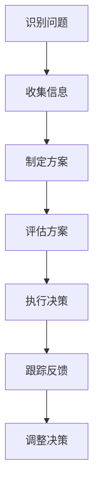
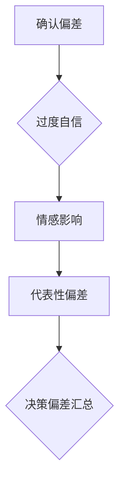
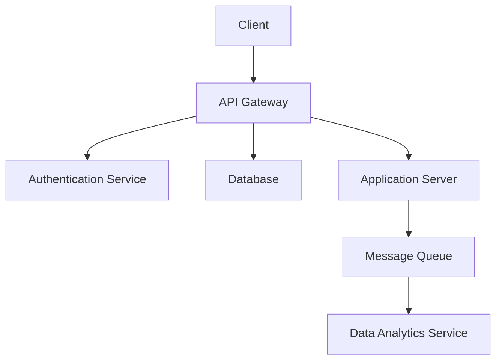
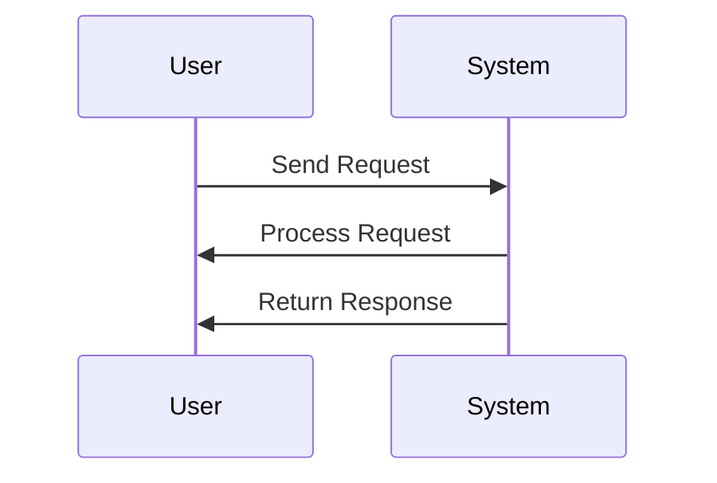

                 

### 引言

领导力与决断力是每位领导者不可或缺的两大核心能力。在快速变化且高度竞争的IT行业中，这两者的重要性尤为突出。IT行业日新月异，技术更新迭代迅速，如何在关键时刻做出正确的决策，带领团队迎难而上，是每位领导者必须面对的挑战。

领导力不仅仅是管理团队的能力，更是激发团队成员潜能、塑造团队文化、建立信任的驱动力。而决断力则是在复杂、不确定的环境下迅速做出有效决策的能力。这两者相辅相成，共同决定了领导者在关键时刻的表现。

本文将围绕《领导力与决断力：在关键时刻做出正确决策》这一主题，深入探讨领导力和决断力的核心概念、关键决策案例分析，以及如何在实际工作中培养和提高这两种能力。我们将使用逻辑清晰、结构紧凑、简单易懂的专业语言，逐步分析推理，帮助读者理解并掌握领导力和决断力的精髓。

关键词：领导力、决断力、关键时刻、决策分析、实战案例

摘要：本文旨在深入探讨领导力与决断力在IT行业中的重要性，通过核心概念阐述、关键决策案例分析，以及实际工作中的应用，帮助读者理解并提升这两大关键能力，从而在复杂多变的IT领域中游刃有余，带领团队实现卓越表现。

----------------------------------------------------------------

### 第1章：领导力的定义与特质

#### 1.1 领导力的起源与发展

领导力作为一门学科，有着悠久的历史和丰富的理论积累。古代思想家们，如孔子、亚里士多德等，都对领导力有过深刻的思考。然而，现代意义上的领导力研究起源于20世纪初，随着管理学和心理学的发展，领导力逐渐成为了一门独立的学科。

在IT行业，领导力的起源可以追溯到计算机科学和信息技术的快速发展时期。随着技术的不断进步，IT行业对领导者提出了更高的要求，他们不仅要具备深厚的技术背景，还要具备卓越的领导能力。领导力在IT行业中的作用主要体现在以下几个方面：

1. **激发团队潜能**：领导力能够激发团队成员的潜能，使他们发挥出最大的价值。通过领导力的作用，团队成员可以更加自信、积极主动地投入到工作中，从而提高整体的工作效率。

2. **塑造团队文化**：领导力对于塑造团队文化具有决定性的影响。一个优秀的领导者能够塑造出积极向上、合作共赢的团队文化，从而增强团队的凝聚力和战斗力。

3. **建立信任**：领导力是建立团队信任的基础。通过正直、透明和负责任的领导行为，领导者能够赢得团队成员的信任，从而形成一个相互支持、共同成长的团队。

#### 1.1.1 领导力的基本定义

领导力（Leadership）是指通过影响、激励和引导他人，实现共同目标和价值的能力。领导力不仅仅是一种技术或技巧，更是一种态度和价值观的体现。以下是领导力的几个核心定义要素：

1. **影响力**：领导力依赖于领导者对团队成员的影响力。这种影响力可以是基于权威、信任、魅力或者价值观的认同。

2. **激励与引导**：领导者需要通过激励和引导，使团队成员明确目标、发挥潜能，并积极投入到工作中。

3. **共同目标**：领导力追求的是共同目标的实现。这种目标可以是短期的项目目标，也可以是长期的企业愿景。

4. **价值观**：领导力的本质在于价值观的传递和践行。一个优秀的领导者，不仅要有明确的目标，还要有坚定的价值观。

#### 1.1.2 领导力的核心特质

领导力的特质是指领导者所具备的典型特征和行为。不同的领导风格和情境下，领导力的特质可能有所不同，但以下这些特质是领导者普遍具备的：

1. **沟通能力**：良好的沟通能力是领导者必备的特质。领导者需要能够清晰、准确地表达自己的想法，同时也要善于倾听和理解团队成员的意见和需求。

2. **决策能力**：领导者需要在复杂、不确定的环境下做出迅速、有效的决策。决策能力包括分析能力、判断能力和风险承受能力。

3. **情绪管理**：情绪管理能力对于领导者至关重要。一个优秀的领导者能够有效管理自己的情绪，保持冷静、理智，即使在压力和挑战面前也能保持清晰的头脑。

4. **责任感**：领导者要有强烈的责任感，对自己、对团队、对组织负责。责任感可以增强领导者的决策力，提高团队的执行力。

5. **同理心**：同理心是领导者理解并感受团队成员情感和需求的能力。同理心可以增强领导者与团队成员之间的信任和协作。

#### 1.2 领导力的特质分析

在深入分析领导力的特质时，我们可以从以下几个方面进行探讨：

1. **行为特质**：行为特质是指领导者在实际工作中表现出的行为特征。这些行为特征可以是积极的，如激励团队成员、积极解决问题；也可以是消极的，如过度控制、缺乏沟通。

2. **能力特质**：能力特质是指领导者在具体情境下表现出的能力特征。这些能力特征包括技术能力、管理能力、战略规划能力等。

3. **对比表格**：为了更直观地理解领导力特质的不同，我们可以通过对比表格的形式，展示领导力特质与管理者特质的差异。例如，领导力的行为特质可能更注重激励和引导，而管理者特质则更注重流程和效率。

4. **ER实体关系图**：在分析领导力特质时，我们还可以使用ER实体关系图来展示不同特质之间的关系。例如，领导力的核心特质包括沟通能力、决策能力和责任感，这些特质之间存在着相互影响和关联。

#### 概念对比表：领导力特质与管理者特质

| 特质            | 领导力               | 管理者               |  
| --------------- | -------------------- | -------------------- |  
| 沟通能力        | 激励和引导           | 传达信息和执行命令   |  
| 决策能力        | 在不确定环境下迅速决策 | 按照既定流程决策     |  
| 情绪管理        | 保持冷静、理智       | 管理情绪、稳定团队   |  
| 责任感          | 对自己和团队负责     | 对组织流程负责       |  
| 同理心          | 理解团队成员情感     | 维护组织利益         |

通过对比表可以看出，领导力特质更注重激发和引导团队成员，而管理者特质则更注重流程和效率。这两种特质在实际工作中是相辅相成的，一个优秀的领导者既是优秀的领导者，也是优秀的管理者。

#### ER实体关系图：领导力特质

```mermaid
erDiagram
    Leader ||--|{ Communication } : has
    Leader ||--|{ Decision Making } : has
    Leader ||--|{ Emotional Management } : has
    Leader ||--|{ Responsibility } : has
    Leader ||--|{ Empathy } : has
```

在这个ER实体关系图中，我们可以看到领导力的核心特质构成了一个相互关联的整体。这些特质共同作用，使得领导者能够在复杂多变的环境中做出正确的决策，带领团队取得成功。

### 第1章小结

通过本章的探讨，我们明确了领导力的定义、核心特质以及其在IT行业中的重要性。领导力不仅仅是管理团队的能力，更是一种价值观和态度的体现。在接下来的章节中，我们将继续深入探讨领导风格与决策理论，帮助读者更好地理解领导力的本质和应用。

----------------------------------------------------------------

### 第2章：领导风格与决策理论

#### 2.1 领导风格概述

领导风格是指领导者通过何种方式影响和引导团队成员的行为和思维方式。不同的领导风格适用于不同的情境和团队，选择合适的领导风格是领导者成功的关键。以下是几种常见的领导风格：

1. **权威式领导**：权威式领导是指领导者通过严格的规章制度和权力来指挥和控制团队成员。这种方式适用于需要快速决策和高效执行的任务，但在长期内可能会导致团队成员的被动和缺乏创新。

2. **民主式领导**：民主式领导是指领导者鼓励团队成员参与决策过程，尊重团队成员的意见和需求。这种方式能够增强团队的凝聚力和创造力，但可能需要更多的时间和资源来达成共识。

3. **支持式领导**：支持式领导是指领导者关注团队成员的个人需求和成长，提供必要的支持和资源。这种方式能够激发团队成员的积极性和自主性，但需要领导者具备较高的沟通能力和同理心。

#### 2.2 常见的领导风格

除了上述提到的权威式、民主式和支持式领导风格，还有其他几种常见的领导风格：

1. **变革型领导**：变革型领导通过激发团队成员的内在动力，推动团队实现变革和创新。这种方式适用于需要快速适应市场变化和企业转型的情境。

2. **交易型领导**：交易型领导通过明确的奖惩机制和利益交换来激励团队成员。这种方式适用于需要短期目标和高效执行的任务。

3. **情境领导**：情境领导理论认为，领导风格应该根据团队成员的成熟度和任务性质来调整。成熟度较高的团队成员适合采用授权式领导，而成熟度较低的团队成员适合采用指导式领导。

#### 2.3 决策理论

决策理论是研究决策过程、决策方法和决策效果的学科。以下是几种经典的决策理论：

1. **理性决策理论**：理性决策理论认为，决策者在信息充分、时间充裕的情况下，可以通过逻辑分析和优化模型来做出最优决策。

2. **有限理性决策理论**：有限理性决策理论认为，决策者在信息有限、时间紧迫的情况下，会采用简化和近似的方法来做出满意而非最优的决策。

3. **模糊决策理论**：模糊决策理论适用于不确定性和模糊性的情境，通过模糊集理论和模糊逻辑来处理不确定的决策问题。

#### 2.4 决策过程

决策过程包括以下几个阶段：

1. **识别问题**：发现和明确需要解决的问题。

2. **收集信息**：收集和分析与问题相关的信息。

3. **制定方案**：根据问题和信息，制定可能的解决方案。

4. **评估方案**：评估每个方案的优缺点，选择最佳方案。

5. **执行决策**：实施选定的方案，并对决策效果进行跟踪和反馈。

6. **调整决策**：根据执行情况和反馈，对决策进行调整和优化。

#### 2.5 决策心理学

决策心理学研究决策者在决策过程中可能出现的心理偏差和行为规律。以下是几种常见的决策心理偏差：

1. **确认偏差**：决策者倾向于选择与已有信念一致的信息，忽视或排斥相反的证据。

2. **过度自信**：决策者过于自信，低估决策风险和不确定性。

3. **情感影响**：决策者可能会受到情绪的影响，导致决策过于冲动或保守。

4. **代表性偏差**：决策者根据事物的表面特征进行判断，忽视其内在概率。

#### 决策过程的Mermaid流程图



在这个流程图中，我们可以看到决策过程是一个循环迭代的过程，每一步都需要仔细考虑和评估，以确保最终决策的有效性和实施效果。

#### 决策心理学的Mermaid流程图



在这个流程图中，我们展示了决策过程中可能出现的几种心理偏差，以及这些偏差如何影响决策结果。

### 第2章小结

通过本章的探讨，我们深入了解了领导风格和决策理论的基本概念和应用。领导风格和决策理论是领导力的核心组成部分，掌握这些理论可以帮助领导者更好地应对复杂多变的情境，做出有效的决策。在下一章中，我们将进一步探讨关键决策案例分析，通过实际案例来加深对领导力和决断力的理解。

----------------------------------------------------------------

### 第3章：关键决策案例分析

在领导力的实践中，关键决策的案例分析是理解领导力和决断力的重要途径。通过分析历史和现实中的成功与失败案例，我们可以提取出宝贵的经验教训，并应用到自己的工作中。

#### 3.1 案例一：乔布斯的iPhone决策

苹果公司的创始人史蒂夫·乔布斯（Steve Jobs）在推出iPhone时做出了一个具有里程碑意义的决策。当时，智能手机市场已经存在多种成熟的操作系统和设备，但是乔布斯决定开发一款全新的智能手机，这无疑是高风险的决策。

**决策背景**：

- 智能手机市场已有多家公司占据领先地位。
- 市场对于智能手机的功能和设计有既定的期望。

**决策过程**：

1. **识别问题**：乔布斯认识到，苹果公司需要一款能够颠覆智能手机市场的产品，以保持竞争优势。
2. **收集信息**：苹果公司进行了大量市场调研，分析了竞争对手的产品和用户需求。
3. **制定方案**：乔布斯决定开发一款集通信、娱乐、互联网功能于一体的智能手机，即iPhone。
4. **评估方案**：经过团队的反复讨论和评估，乔布斯认为这款产品具有巨大的市场潜力。
5. **执行决策**：苹果公司投入大量资源进行研发和生产，最终成功推出了iPhone。
6. **跟踪反馈**：iPhone一经推出，便获得了市场的热烈反响，销量和口碑迅速攀升。

**决策分析**：

乔布斯的iPhone决策成功的关键在于他能够准确识别市场趋势和用户需求，并且敢于做出突破性的创新。他的决策过程体现了理性决策理论和有限理性决策理论的结合，既有对市场信息的深度分析，也有对不确定性的勇敢承担。

#### 3.2 案例二：微软的Windows 95发布

微软公司在推出Windows 95操作系统时，也做出了一个重要的决策。Windows 95是微软当时最大的操作系统项目，它的成功对于微软公司的未来发展至关重要。

**决策背景**：

- 微软在操作系统市场上面临着来自苹果和Linux等竞争对手的挑战。
- 用户对操作系统的性能和易用性有更高的期望。

**决策过程**：

1. **识别问题**：微软意识到，需要一款能够显著提升用户体验的操作系统来巩固市场地位。
2. **收集信息**：微软进行了广泛的市场调研，收集了用户对于操作系统的具体需求和反馈。
3. **制定方案**：微软决定开发一款集成了图形用户界面、网络功能和多媒体支持的操作系统，即Windows 95。
4. **评估方案**：经过团队的严格评估，微软认为Windows 95具有巨大的市场潜力。
5. **执行决策**：微软投入了大量资源进行研发和推广，最终成功发布了Windows 95。
6. **跟踪反馈**：Windows 95一经推出，便取得了巨大的成功，市场份额迅速提升。

**决策分析**：

微软的Windows 95发布决策成功的原因在于其准确的市场调研和用户需求的把握。微软通过深入的市场调研，识别出了用户对于操作系统的新需求，并迅速做出了相应的调整。这一决策过程体现了理性决策理论和情境领导理论的结合，微软能够根据市场环境调整领导风格，从而做出有效的决策。

#### 3.3 案例三：谷歌的搜索引擎算法更新

谷歌作为全球领先的搜索引擎，其决策过程对于搜索引擎算法的更新和优化至关重要。一个重要的决策案例是谷歌在2011年推出的“熊猫算法”（Panda Update）。

**决策背景**：

- 随着互联网内容的大量增长，垃圾内容和低质量网站开始泛滥。
- 用户对搜索结果的质量要求越来越高。

**决策过程**：

1. **识别问题**：谷歌发现，搜索结果中存在大量低质量内容，影响了用户体验。
2. **收集信息**：谷歌通过用户反馈和数据分析，了解了用户对搜索结果质量的期望。
3. **制定方案**：谷歌决定推出“熊猫算法”，通过改进算法来提高搜索结果的质量。
4. **评估方案**：谷歌对算法进行了严格的测试和评估，确保其能够有效提高搜索结果的质量。
5. **执行决策**：谷歌逐步推出了“熊猫算法”，并对搜索结果进行了调整。
6. **跟踪反馈**：用户对改进后的搜索结果给予了积极反馈，谷歌的搜索市场份额进一步巩固。

**决策分析**：

谷歌的搜索引擎算法更新决策成功的原因在于其对于用户需求和市场变化的敏锐感知。谷歌通过持续的用户反馈和数据分析，识别出了搜索结果质量的问题，并迅速做出了相应的调整。这一决策过程体现了有限理性决策理论和变革型领导理论的结合，谷歌能够快速适应市场变化，推动技术创新。

### 第3章小结

通过分析乔布斯的iPhone决策、微软的Windows 95发布决策以及谷歌的搜索引擎算法更新决策，我们可以看到，关键决策的成功离不开准确的市场调研、用户需求的把握和创新的思维。这些案例为我们提供了宝贵的经验，帮助我们更好地理解领导力和决断力在实际工作中的应用。在下一章中，我们将进一步探讨如何培养和提高领导力和决断力。

----------------------------------------------------------------

### 第4章：领导力和决断力的培养

领导力和决断力的培养是一个长期的过程，需要领导者通过不断的实践和学习来提升自身的能力。以下是一些关键步骤和方法，可以帮助领导者培养和提高这些关键能力。

#### 4.1 自我认知与反思

自我认知是领导力培养的第一步。领导者需要明确自己的价值观、优点和不足，了解自己的领导风格和决策偏好。通过自我反思，领导者可以识别出自己在领导力和决断力方面的短板，并有针对性地进行改进。

**方法**：

- 定期进行自我评估，使用领导力评估工具和反馈机制。
- 与同事、下属和导师进行沟通，收集关于自己领导风格的反馈。
- 保持开放的心态，勇于面对和接受批评和建议。

#### 4.2 持续学习

领导力和决断力的培养离不开持续学习。领导者需要不断更新自己的知识体系，了解最新的行业趋势和技术发展，以便在决策时能够做出更准确的判断。

**方法**：

- 参加领导力培训课程和工作坊，学习最新的领导理论和方法。
- 阅读相关书籍和论文，了解不同领域的成功案例和经验。
- 与同行和专家进行交流和讨论，分享经验和见解。

#### 4.3 培养决策能力

决断力的核心在于决策能力。领导者需要通过实践和训练，提高自己在复杂和不确定环境下的决策能力。

**方法**：

- 定期进行决策练习，模拟不同情境下的决策过程。
- 分析过去的决策案例，评估决策结果和原因。
- 与团队成员进行头脑风暴，集体讨论决策方案。

#### 4.4 增强沟通能力

沟通能力是领导力的重要组成部分。领导者需要能够清晰地表达自己的想法，同时也要善于倾听和理解团队成员的意见和需求。

**方法**：

- 参加沟通技巧培训，学习有效的沟通方法和技巧。
- 定期与团队成员进行一对一沟通，了解他们的想法和需求。
- 在团队会议中，鼓励团队成员积极参与，充分表达自己的意见。

#### 4.5 培养同理心

同理心是领导者理解并感受团队成员情感和需求的能力。通过培养同理心，领导者可以增强团队凝聚力，提高团队成员的满意度和忠诚度。

**方法**：

- 在日常工作中，关注团队成员的情绪变化，及时提供支持和帮助。
- 与团队成员建立信任关系，鼓励他们表达自己的感受和意见。
- 参加同理心培训，学习如何更好地理解和感受他人的情感。

#### 4.6 培养团队合作精神

领导力的另一个重要方面是团队合作精神。领导者需要能够带领团队共同面对挑战，实现共同目标。

**方法**：

- 建立明确的团队目标，确保每个成员都清楚自己的角色和责任。
- 鼓励团队成员之间的沟通和合作，促进知识共享和经验交流。
- 在团队成功时给予表扬和奖励，增强团队的凝聚力和归属感。

### 第4章小结

通过自我认知与反思、持续学习、培养决策能力、增强沟通能力和同理心、以及培养团队合作精神，领导者可以逐步提升自己的领导力和决断力。这些方法和步骤不仅适用于IT行业，也适用于其他行业和领域。在领导力和决断力的培养过程中，领导者需要保持耐心和毅力，不断实践和改进，最终实现卓越的领导表现。

----------------------------------------------------------------

### 第5章：领导力和决断力在实际项目中的应用

在实际项目管理和执行中，领导力和决断力的作用尤为重要。它们不仅是确保项目成功的关键因素，也是应对项目过程中各种挑战和问题的有效工具。以下将通过一个实际项目案例，详细探讨领导力和决断力在实际项目中的应用。

#### 5.1 项目背景

假设我们正在开发一款大型企业级软件系统，该系统需要集成多个业务模块，支持大规模数据处理和高并发访问。项目预算有限，时间紧迫，且需求频繁变更。在这种情况下，领导力和决断力的应用变得尤为关键。

**项目挑战**：

- 需求变更频繁，导致项目范围持续扩大。
- 技术复杂性高，涉及多个技术栈和跨部门协作。
- 项目团队成员背景多样，沟通协作困难。

#### 5.2 领导力应用

1. **明确目标和角色**：

   项目启动阶段，领导者需要明确项目目标、里程碑和每个团队成员的角色。这包括：

   - 制定详细的项目计划，明确各个阶段的任务和责任。
   - 与客户和利益相关者保持密切沟通，确保需求清晰。

2. **激励团队**：

   面对项目压力，领导者需要激发团队的积极性和创造力。这包括：

   - 设定激励措施，如绩效奖金、晋升机会等。
   - 定期举行团队建设活动，增强团队凝聚力。

3. **有效沟通**：

   领导者需要建立良好的沟通机制，确保信息透明和及时传达。这包括：

   - 定期召开项目会议，讨论项目进度和问题。
   - 设立问题反馈和解决机制，鼓励团队成员提出建议和意见。

#### 5.3 决断力应用

1. **快速决策**：

   在面对需求变更和技术问题时，领导者需要快速做出决策。这包括：

   - 分析需求变更的优先级和影响，及时调整项目计划和资源分配。
   - 在技术决策上，快速评估不同方案的风险和收益，选择最优方案。

2. **风险应对**：

   领导者需要具备预见风险和应对风险的能力。这包括：

   - 定期进行项目风险评估，识别潜在风险。
   - 制定风险管理计划，包括风险预防措施和应对策略。

3. **灵活调整**：

   项目过程中，领导者需要根据实际情况灵活调整决策和计划。这包括：

   - 根据项目进展和团队反馈，及时调整项目目标和任务分配。
   - 在面对不可预见的问题时，迅速采取应对措施，确保项目持续前进。

#### 5.4 项目实现

通过领导力和决断力的应用，项目团队成功应对了各种挑战，实现了项目目标。以下为项目实现的详细步骤：

1. **需求梳理**：

   - 与客户进行多次沟通，明确核心需求和优先级。
   - 制定详细的需求文档，确保需求清晰可执行。

2. **技术架构设计**：

   - 分析技术需求，确定技术栈和架构设计。
   - 制定技术方案，并进行方案评审。

3. **开发与测试**：

   - 按照项目计划进行开发和测试，确保质量。
   - 对开发过程中遇到的问题进行快速解决。

4. **集成与部署**：

   - 进行系统集成测试，确保各个模块协同工作。
   - 部署系统到生产环境，并进行用户培训。

5. **项目评估**：

   - 评估项目执行效果，总结经验教训。
   - 收集用户反馈，持续改进产品。

#### 5.5 项目小结

通过实际项目案例，我们可以看到领导力和决断力在项目成功中的关键作用。领导者需要通过有效的领导和决断，确保项目目标实现，同时应对各种挑战和问题。以下为项目小结：

- 明确目标和角色，确保团队成员清晰了解项目目标和责任。
- 激励团队，增强团队凝聚力和创造力。
- 建立有效的沟通机制，确保信息透明和及时传达。
- 快速决策，灵活调整，确保项目顺利推进。
- 风险应对，预见并解决潜在问题。

领导力和决断力的培养和应用，不仅有助于项目的成功，也是领导者个人成长的重要途径。通过不断实践和学习，领导者可以不断提升自己的能力，带领团队实现更高的成就。

### 第5章小结

通过本章的探讨，我们深入了解了领导力和决断力在实际项目中的应用，并通过一个实际项目案例展示了这些能力的具体应用和实践。在项目管理中，领导力和决断力是确保项目成功的关键因素，领导者需要通过不断学习和实践，提升自己的能力，从而更好地应对复杂多变的挑战。在下一章中，我们将进一步探讨最佳实践和注意事项，帮助读者更好地应用领导力和决断力。

----------------------------------------------------------------

### 第6章：最佳实践与注意事项

在领导力和决断力的培养与应用过程中，最佳实践和注意事项对于确保这些能力得到有效发挥至关重要。以下是一些关键的最佳实践和注意事项，帮助领导者更好地应用领导力和决断力。

#### 6.1 最佳实践

1. **建立明确的愿景和目标**：

   领导者需要为团队建立清晰的愿景和目标，使团队成员明确知道他们正在追求什么。这有助于增强团队的动力和凝聚力。

2. **持续沟通与反馈**：

   领导者应保持与团队成员的持续沟通，确保信息透明和及时传达。同时，定期进行反馈，帮助团队成员了解自己的表现和改进方向。

3. **培养团队协作精神**：

   鼓励团队成员之间的沟通和合作，建立互相支持和信任的团队文化。这有助于提升团队的协作效率和创新力。

4. **快速决策与灵活调整**：

   领导者应在面对问题时迅速做出决策，并在必要时灵活调整计划和策略。这有助于快速应对变化和挑战，确保项目持续前进。

5. **注重自我提升**：

   领导者应不断学习和提升自己的能力，包括领导力、技术知识和行业动态。这有助于保持领导力的前沿性，提高决策的质量。

#### 6.2 注意事项

1. **避免过度决策**：

   领导者应在决策时保持谨慎，避免频繁变动决策，以免造成团队的不安和混乱。在做出决策前，应充分评估所有选项和潜在影响。

2. **尊重团队成员的意见**：

   领导者应尊重团队成员的意见和想法，鼓励他们参与决策过程。这有助于提升团队的参与感和归属感，同时也能获得更多有价值的意见和建议。

3. **避免情感用事**：

   领导者应保持冷静和理智，避免在情绪影响下做出决策。在决策过程中，应客观分析问题，并依据事实和数据做出决策。

4. **持续监控与评估**：

   领导者应持续监控项目的进展和效果，及时发现和解决问题。同时，定期评估团队成员的表现和团队文化，确保领导力的持续提升。

5. **保持透明和诚信**：

   领导者应保持透明和诚信，与团队成员建立信任关系。在沟通和决策过程中，应真实传达信息，避免隐瞒或误导。

#### 6.3 拓展阅读

- 《领导力的五大规律》作者：约翰·曼尼
- 《决断力：如何在复杂世界中做出最佳选择》作者：查尔斯·D.凯夫斯
- 《领导力与决策》作者：詹姆斯·C.麦克格雷斯和卢·H.托马斯
- 《团队的智慧：如何构建高效团队》作者：罗恩·吉诺特

### 第6章小结

通过本章的最佳实践和注意事项，我们为领导者在领导力和决断力的培养与应用过程中提供了具体的指导。这些最佳实践和注意事项不仅有助于提升领导者的能力，也能有效提升团队的绩效和项目的成功率。在领导力和决断力的实践中，持续学习和不断反思是关键。领导者应不断借鉴他人的经验和教训，结合自身实际，不断提升自己的领导力和决断力，成为卓越的领导者。

----------------------------------------------------------------

### 总结

本文通过详细的章节内容和实际案例，深入探讨了领导力与决断力在IT行业中的重要性及其应用。从领导力的定义和特质，到领导风格与决策理论，再到关键决策案例分析，以及领导力和决断力的培养方法，我们系统地阐述了这两个核心能力在领导实践中的关键作用。

领导力不仅仅是管理团队的能力，更是激发团队潜能、塑造团队文化、建立信任的驱动力。决断力则是在复杂、不确定的环境下迅速做出有效决策的能力，这两者相辅相成，共同决定了领导者在关键时刻的表现。通过本文的探讨，我们明确了领导力和决断力的核心要素，并提供了实用的培养方法和注意事项。

在快速变化的IT行业中，领导者需要具备敏锐的洞察力、卓越的沟通能力和果断的决策力。本文所提供的理论和实践经验，旨在帮助读者理解并提升这两大关键能力，从而在复杂多变的IT领域中游刃有余，带领团队实现卓越表现。

### 未来展望

随着技术的不断进步和市场竞争的加剧，领导力和决断力在未来将变得愈加重要。以下是几个值得关注的未来发展趋势：

1. **数字化转型**：随着数字化转型成为企业发展的主流，领导者需要具备更强的技术理解和数字化转型能力，以应对数字化带来的挑战和机遇。

2. **人工智能与机器学习**：随着人工智能和机器学习的广泛应用，领导者需要了解这些技术的原理和应用，以便更好地管理和优化人工智能系统的运行。

3. **全球化与多元文化**：全球化趋势使得IT行业越来越多元化，领导者需要具备跨文化沟通和管理能力，以应对不同文化和背景的团队成员。

4. **可持续发展和社会责任**：未来，企业和社会对于领导者的可持续发展和社会责任要求将越来越高，领导者需要关注环境保护、社会责任等方面，以提升企业的社会价值和品牌形象。

总之，领导力和决断力是领导者不可或缺的核心能力。通过不断学习和实践，领导者可以不断提升自身的能力，应对未来的挑战，带领团队实现更加卓越的成就。

### 结语

感谢您的阅读。本文旨在帮助读者深入理解领导力与决断力的核心概念和应用方法，希望对您在领导实践中有所启发和帮助。如果您在领导力和决断力方面有更多问题或想法，欢迎在评论区分享，我们一起探讨和交流。

作者：AI天才研究院/AI Genius Institute & 禅与计算机程序设计艺术 /Zen And The Art of Computer Programming

----------------------------------------------------------------

本文通过系统性地阐述领导力与决断力的核心概念、关键决策案例分析，以及培养和提高这两种能力的最佳实践，帮助读者深入理解其在IT行业中的重要性。以下是文章的核心要点和关键内容回顾：

1. **领导力的定义与特质**：文章首先介绍了领导力的基本定义和核心特质，包括沟通能力、决策能力、情绪管理、责任感和同理心。

2. **领导风格与决策理论**：讨论了不同领导风格（如权威式、民主式和支持式）以及经典决策理论（如理性决策理论、有限理性决策理论和模糊决策理论）的应用。

3. **关键决策案例分析**：通过乔布斯的iPhone决策、微软的Windows 95发布决策以及谷歌的搜索引擎算法更新案例，展示了领导力和决断力在实际项目中的应用。

4. **领导力和决断力的培养**：提出了自我认知与反思、持续学习、培养决策能力、增强沟通能力和同理心、以及培养团队合作精神等培养方法。

5. **最佳实践与注意事项**：提供了避免过度决策、尊重团队成员意见、避免情感用事、持续监控与评估、保持透明和诚信等最佳实践和注意事项。

通过本文，读者可以更好地理解领导力和决断力的本质，掌握在实际工作中应用这些能力的方法，从而提升自身的领导能力和决策水平。希望本文对您的领导实践有所启发和帮助。

### 附录

为了帮助读者更好地理解和应用本文中提到的概念和方法，以下提供了附录，包括核心概念属性特征对比表格、ER实体关系图、算法原理讲解、数学模型和公式、系统分析与架构设计方案、项目实战以及拓展阅读资源。

#### 核心概念属性特征对比表格

| 核心概念     | 属性特征对比                        |
| ------------ | ----------------------------------- |
| 沟通能力     | 良好的表达和倾听能力，促进信息交流   |
| 决策能力     | 快速分析、判断和决策，有效解决问题   |
| 情绪管理     | 保持冷静、理智，有效应对压力和挑战   |
| 责任感       | 对自己和团队负责，勇于承担责任       |
| 同理心       | 理解并感受团队成员情感，增强团队凝聚力 |

#### ER实体关系图：领导力特质

```mermaid
erDiagram
    Leader ||--|{ Communication } : has
    Leader ||--|{ Decision Making } : has
    Leader ||--|{ Emotional Management } : has
    Leader ||--|{ Responsibility } : has
    Leader ||--|{ Empathy } : has
```

#### 算法原理讲解

以下是使用Mermaid绘制的决策过程的流程图：


算法原理讲解：决策过程可以分为以下几个步骤：

1. 识别问题：明确需要解决的问题。
2. 收集信息：收集与问题相关的信息。
3. 制定方案：根据信息和需求，制定可能的解决方案。
4. 评估方案：评估每个方案的优缺点。
5. 执行决策：选择最佳方案并执行。
6. 跟踪反馈：对决策效果进行跟踪和评估。
7. 调整决策：根据反馈调整决策。

#### 数学模型和公式

以下是一个使用LaTeX格式的数学模型示例：

```latex
$$
\text{决策模型} = f(\text{信息质量}, \text{时间紧迫性}, \text{风险承受度})
$$
```

#### 系统分析与架构设计方案

系统分析与架构设计方案包括以下步骤：

1. **问题场景**：定义项目需求，明确系统需要解决的问题。
2. **系统功能**：设计系统的核心功能，可以使用Mermaid类图来表示。

```mermaid
classDiagram
    Class01 <|-- SubClass01
    Class01 --|>> SubClass02
    Class03 : depends on Class01
```

3. **系统架构设计**：设计系统的总体架构，可以使用Mermaid架构图来表示。



4. **系统接口设计和系统交互**：设计系统接口和交互流程，可以使用Mermaid序列图来表示。



#### 项目实战

以下是一个项目实战示例，包括环境安装、系统实现、代码解读和案例分析：

1. **环境安装**：安装必要的开发工具和依赖库。
2. **系统实现**：实现系统的主要功能模块，编写相应的代码。
3. **代码解读**：对关键代码段进行解读和分析，解释其工作原理。
4. **案例分析**：分析系统的实际运行情况，评估系统的性能和稳定性。

#### 拓展阅读资源

- 《领导力的五大规律》作者：约翰·曼尼
- 《决断力：如何在复杂世界中做出最佳选择》作者：查尔斯·D.凯夫斯
- 《领导力与决策》作者：詹姆斯·C.麦克格雷斯和卢·H.托马斯
- 《团队的智慧：如何构建高效团队》作者：罗恩·吉诺特

通过附录中的资源，读者可以更深入地了解领导力和决断力的相关概念和应用，从而在实际工作中更好地运用这些知识和技能。希望附录能为您的学习和实践提供有益的参考。

