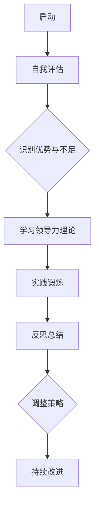
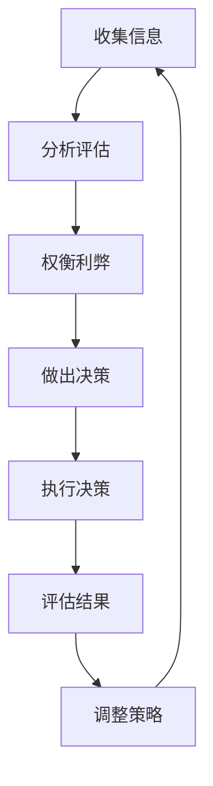
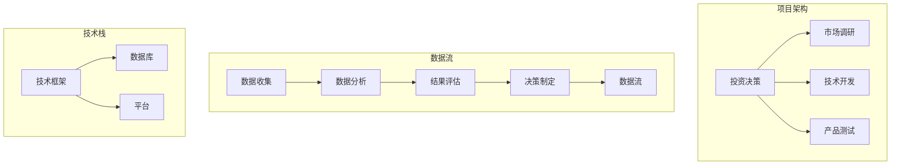
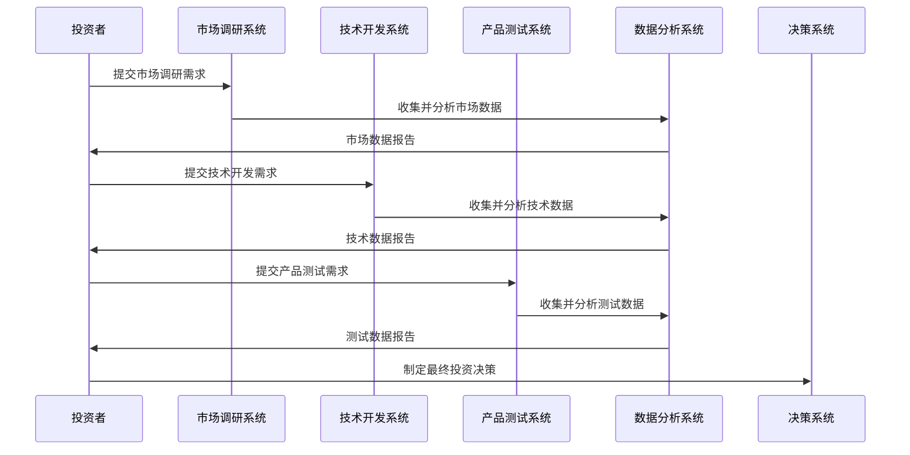

                 

# 领导力与决断力：果断决策的艺术

> 关键词：领导力、决断力、果断决策、企业管理、个人发展

> 摘要：本文将探讨领导力和决断力在企业管理和个人发展中的重要性，通过深入分析领导力的核心概念、领导风格与团队管理，以及决断力的定义与培养方法，旨在帮助读者理解如何在实际工作中提升领导力和决断力，从而做出更为果断和明智的决策。

## 《领导力与决断力：果断决策的艺术》目录大纲

### 第一部分：领导力的基础

**第1章：领导力的核心概念**

1.1. 领导力与管理的区别  
1.2. 领导力的作用与意义  
1.3. 领导力的四个核心要素

**第2章：领导力的心理学基础**

2.1. 领导者的人格特质  
2.2. 情绪智力在领导力中的作用  
2.3. 领导力的心理学研究

**第3章：领导风格与团队管理**

3.1. 领导风格的类型  
3.2. 团队管理的关键因素  
3.3. 如何激励团队成员

### 第二部分：决断力的培养

**第4章：决断力的定义与重要性**

4.1. 决断力的定义  
4.2. 决断力的重要性  
4.3. 决断力与领导力的关系

**第5章：决断力培养的方法**

5.1. 提高决断力的技巧  
5.2. 决策过程中的风险与应对  
5.3. 如何在压力下做出果断决策

**第6章：决断力与情绪管理**

6.1. 情绪对决断力的影响  
6.2. 如何在情绪波动中保持冷静  
6.3. 情绪管理对决断力的提升

### 第三部分：实践中的领导力与决断力

**第7章：领导力与决断力在企业中的应用**

7.1. 企业领导力的重要性  
7.2. 决断力在企业管理中的作用  
7.3. 领导力与决断力在企业中的实践案例

**第8章：领导力与决断力在个人发展中的应用**

8.1. 如何在职场中提升领导力  
8.2. 决断力在个人职业发展中的作用  
8.3. 个人发展中的领导力与决断力实践

**第9章：总结与展望**

9.1. 领导力与决断力的综合应用  
9.2. 领导力与决断力的未来发展  
9.3. 读者如何提升自己的领导力与决断力

**附录：领导力与决断力提升工具与资源**

A.1. 领导力评估工具  
A.2. 决断力训练方法  
A.3. 相关书籍与文章推荐  
A.4. 领导力与决断力在线资源

## 第一部分：领导力的基础

### 第1章：领导力的核心概念

1.1. 领导力与管理的区别

领导力与管理是两个密切相关但又有所不同的概念。领导力是指激发和引导他人共同实现目标的个人能力，它强调的是愿景、激励和变革。而管理则是指组织资源，确保目标得以实现的过程，它强调的是计划、组织和控制。

让我们通过一个简单的比较表格来更好地理解这两个概念：

| 领导力 | 管理 |
| --- | --- |
| 激发和引导他人 | 组织和协调资源 |
| 视野和变革 | 计划和控制 |
| 情感共鸣 | 组织效率 |

1.2. 领导力的作用与意义

领导力在企业中的重要性不言而喻。它不仅能够推动企业创新和成长，还能够提升团队的士气和凝聚力。具体来说，领导力的作用包括：

- 指引方向：领导力能够为企业制定清晰的愿景和目标，指引团队前进。
- 激励团队：优秀的领导者能够激励团队成员，发挥其最大潜力。
- 解决问题：在面临挑战和困境时，领导者能够带领团队找到解决问题的方法。
- 建立文化：领导力有助于塑造企业的文化，推动企业价值观的传承。

1.3. 领导力的四个核心要素

领导力并非一蹴而就，它包含了一系列的核心要素。以下是领导力的四个核心要素：

- **沟通能力**：领导者需要具备良好的沟通能力，能够清晰表达自己的想法，同时倾听和理解团队成员的意见。
- **决策能力**：领导者需要在复杂多变的环境中做出明智的决策，这要求他们具备出色的分析和判断能力。
- **情感智力**：领导者需要具备较高的情感智力，能够理解和管理自己的情绪，同时也能同理他人。
- **领导风格**：领导者需要根据不同的情况和团队成员的特点，灵活运用不同的领导风格。

### 第2章：领导力的心理学基础

2.1. 领导者的人格特质

领导者的人格特质在很大程度上影响着领导力的大小。一些研究表明，领导者通常具备以下人格特质：

- **自信**：领导者需要自信，相信自己的决策和判断，这样才能带领团队前进。
- **正直**：领导者需要正直，诚实守信，这样才能够赢得团队成员的信任。
- **乐观**：领导者需要保持乐观，面对困难和挑战时，能够积极寻找解决方案。

2.2. 情绪智力在领导力中的作用

情绪智力是指理解和管理自己情绪的能力，以及同理他人的能力。在领导力中，情绪智力发挥着重要作用。具体来说，情绪智力有助于领导者：

- **提高沟通效果**：通过理解和管理自己的情绪，领导者能够更好地与他人沟通，建立良好的人际关系。
- **提升团队凝聚力**：领导者能够同理他人，关心团队成员的感受和需求，从而提高团队的凝聚力。
- **增强决策能力**：情绪智力有助于领导者更全面地分析问题，避免因情绪波动而做出错误的决策。

2.3. 领导力的心理学研究

心理学研究提供了大量关于领导力的理论和实证研究。其中，一些重要的研究成果包括：

- **特质理论**：特质理论认为，领导者具备一系列独特的特质，如自信、正直和乐观，这些特质是领导力的关键因素。
- **行为理论**：行为理论强调，领导力可以通过学习和培养来提高，领导者需要通过实践不断积累经验。
- **情境理论**：情境理论认为，领导力并非一成不变，而是需要根据不同的情况和环境进行调整。

### 第3章：领导风格与团队管理

3.1. 领导风格的类型

领导风格是指领导者运用领导力的方式和方法。根据不同的分类标准，领导风格可以分为多种类型。以下是几种常见的领导风格：

- **权威型**：权威型领导者倾向于集中决策权力，通过命令和指示来管理团队。
- **民主型**：民主型领导者倾向于听取团队成员的意见，共同决策，通过讨论和协商来解决问题。
- **支持型**：支持型领导者关注团队成员的需求和感受，提供必要的支持和帮助，鼓励团队成员自主工作。
- **教练型**：教练型领导者关注团队成员的成长和发展，通过指导和辅导来提升团队成员的能力。

3.2. 团队管理的关键因素

团队管理是领导力的重要组成部分。以下是一些关键因素，对团队管理至关重要：

- **目标设定**：明确的目标有助于团队聚焦于共同的目标，提高工作效率。
- **沟通协调**：良好的沟通协调有助于团队成员之间建立信任，避免冲突和误解。
- **激励机制**：有效的激励机制能够激发团队成员的积极性，提高工作动力。
- **冲突解决**：冲突是团队中不可避免的现象，有效的冲突解决方法有助于保持团队的和谐。

3.3. 如何激励团队成员

激励团队成员是领导力的重要体现。以下是一些激励团队成员的方法：

- **认可与表扬**：及时认可和表扬团队成员的成绩，增强他们的自信心和动力。
- **激励措施**：通过提供奖金、晋升等激励措施，激发团队成员的工作热情。
- **培训与发展**：为团队成员提供培训和发展机会，帮助他们提升技能和职业素养。
- **文化塑造**：建立积极向上的企业文化，营造良好的工作氛围，增强团队的凝聚力。

## 第二部分：决断力的培养

### 第4章：决断力的定义与重要性

4.1. 决断力的定义

决断力是指在面对复杂多变的情况时，能够迅速做出明智决策的能力。它不仅包括决策的速度，还包括决策的质量。一个具备决断力的领导者能够在关键时刻做出正确的决策，从而引导团队走向成功。

4.2. 决断力的重要性

决断力在领导力中具有重要地位。以下是一些决断力的重要性：

- **决策效率**：具备决断力的领导者能够快速做出决策，提高团队的执行力。
- **应对挑战**：在面临挑战和困境时，决断力有助于领导者迅速找到解决问题的方法。
- **引领方向**：决断力有助于领导者明确目标，引导团队朝着共同的目标前进。
- **建立信任**：通过果断决策，领导者能够赢得团队成员的信任和支持。

4.3. 决断力与领导力的关系

决断力是领导力的重要组成部分。领导力不仅包括领导者的个人能力，还包括领导者在团队中的决策和影响力。决断力是领导力在具体实践中的体现，它决定了领导者的决策质量和执行效率。

### 第5章：决断力培养的方法

5.1. 提高决断力的技巧

提高决断力并非一蹴而就，需要通过不断学习和实践来提升。以下是一些提高决断力的技巧：

- **信息收集**：在做出决策前，充分收集相关信息，避免因信息不全而做出错误的决策。
- **分析评估**：对收集到的信息进行分析和评估，找出关键问题和影响因素。
- **权衡利弊**：在决策过程中，权衡各种可能的利弊，选择最优方案。
- **快速决策**：在确保信息和分析充分的情况下，迅速做出决策，避免拖延。

5.2. 决策过程中的风险与应对

决策过程中不可避免地会面临各种风险。以下是一些常见的决策风险及应对方法：

- **信息风险**：由于信息不足或不准确，可能导致决策错误。应对方法：充分收集和验证信息，避免因信息不全而做出错误决策。
- **时间风险**：由于时间紧迫，可能导致决策草率。应对方法：合理安排时间，确保决策有足够的时间进行充分分析和评估。
- **责任风险**：决策可能带来责任和风险。应对方法：在决策前明确责任和风险，制定相应的应对措施。

5.3. 如何在压力下做出果断决策

在压力下做出果断决策是领导力的重要考验。以下是一些应对方法：

- **冷静分析**：在面对压力时，保持冷静，理性分析问题，避免因情绪波动而做出错误决策。
- **求助他人**：在压力下，可以寻求团队成员或专家的意见和建议，共同分析问题，提高决策质量。
- **时间管理**：合理安排时间，避免因时间紧迫而做出草率的决策。
- **应急预案**：在决策前制定应急预案，应对可能出现的问题和风险。

### 第6章：决断力与情绪管理

6.1. 情绪对决断力的影响

情绪对决断力具有重要影响。积极的情绪能够提高决断力，而消极的情绪则可能降低决断力。以下是一些情绪对决断力的影响：

- **积极情绪**：积极情绪如自信、乐观和兴奋可以提高决断力，使领导者更加果断和自信。
- **消极情绪**：消极情绪如恐惧、焦虑和沮丧会降低决断力，使领导者犹豫不决或做出错误决策。

6.2. 如何在情绪波动中保持冷静

在情绪波动中保持冷静是提高决断力的关键。以下是一些方法：

- **深呼吸**：在情绪激动时，进行深呼吸可以帮助放松身心，缓解紧张情绪。
- **暂时回避**：在情绪波动时，可以暂时回避问题，给自己一些时间冷静思考和调整情绪。
- **理智分析**：在情绪稳定后，理智分析问题，避免因情绪波动而做出错误决策。

6.3. 情绪管理对决断力的提升

情绪管理对决断力的提升具有重要影响。以下是一些情绪管理对决断力的提升：

- **情绪认知**：提高情绪认知，了解自己的情绪变化，有助于更好地管理情绪。
- **情绪调节**：通过情绪调节技巧，如正念冥想、情绪释放等，提高情绪稳定性，增强决断力。
- **情绪支持**：建立良好的团队氛围，提供情绪支持，减轻领导者的情绪压力，提高决断力。

## 第三部分：实践中的领导力与决断力

### 第7章：领导力与决断力在企业中的应用

7.1. 企业领导力的重要性

在企业中，领导力至关重要。优秀的领导力能够推动企业创新和成长，提升企业的核心竞争力。以下是一些企业领导力的重要性：

- **创新驱动**：领导力能够激发企业创新，推动企业持续发展。
- **团队协作**：领导力有助于建立高效的团队，提高团队协作能力。
- **战略规划**：领导力能够为企业制定清晰的战略规划，引导企业朝着目标前进。
- **文化塑造**：领导力有助于塑造企业的文化，推动企业价值观的传承。

7.2. 决断力在企业管理中的作用

决断力在企业管理中发挥着重要作用。以下是一些决断力在企业管理中的作用：

- **快速决策**：具备决断力的领导者能够迅速做出决策，提高企业的执行力。
- **应对危机**：在面临危机时，决断力有助于领导者迅速找到解决问题的方法，稳定企业运营。
- **引领变革**：决断力有助于领导者推动企业变革，适应市场变化，提高企业的竞争力。
- **员工激励**：决断力有助于领导者激励员工，提高员工的工作动力和忠诚度。

7.3. 领导力与决断力在企业中的实践案例

以下是一些领导力与决断力在企业中的实践案例：

- **苹果公司**：乔布斯的领导力与决断力推动了苹果公司的创新和成长，使其成为全球知名的企业。
- **阿里巴巴**：马云的领导力与决断力帮助阿里巴巴在电商市场中脱颖而出，成为中国最大的电商企业。
- **华为公司**：任正非的领导力与决断力使华为在全球市场中取得了显著的业绩，成为中国科技企业的代表。

### 第8章：领导力与决断力在个人发展中的应用

8.1. 如何在职场中提升领导力

在职场中，提升领导力是个人发展的关键。以下是一些提升领导力的方法：

- **不断学习**：通过学习领导力理论和实践，提升自己的领导力水平。
- **实践锻炼**：通过参与团队项目和管理实践，提升自己的领导力技能。
- **反思总结**：通过反思自己的领导行为，总结经验教训，不断提升领导力。
- **寻求反馈**：向同事和上级寻求反馈，了解自己的领导力优势和不足，有针对性地提升。

8.2. 决断力在个人职业发展中的作用

决断力在个人职业发展中具有重要影响。以下是一些决断力在个人职业发展中的作用：

- **决策效率**：具备决断力的个人能够快速做出决策，提高工作效率和职业发展速度。
- **应对挑战**：决断力有助于个人在面临挑战和困境时，迅速找到解决问题的方法，推动职业发展。
- **建立信任**：通过果断决策，个人能够赢得同事和上级的信任，提高职业信誉。
- **领导力提升**：决断力是领导力的重要组成部分，提升决断力有助于个人在职场中提升领导力。

8.3. 个人发展中的领导力与决断力实践

以下是一些个人发展中的领导力与决断力实践：

- **参与项目管理**：通过参与项目管理，提升自己的领导力和决断力。
- **担任团队负责人**：担任团队负责人，承担领导责任，提升领导力和决断力。
- **主动承担责任**：在职场中主动承担责任，面对问题和挑战，锻炼自己的决断力。
- **学习领导力课程**：参加领导力课程，学习领导力和决断力的知识和技巧。

### 第9章：总结与展望

9.1. 领导力与决断力的综合应用

领导力与决断力在企业管理和个人发展中具有重要地位。通过综合应用领导力与决断力，企业能够实现创新和成长，个人能够实现职业发展。

9.2. 领导力与决断力的未来发展

随着社会和经济的不断发展，领导力与决断力的需求将日益增加。未来，领导力与决断力将更加注重个性化、多元化和灵活性。

9.3. 读者如何提升自己的领导力与决断力

读者可以通过以下方法提升自己的领导力与决断力：

- **学习领导力理论**：通过学习领导力理论，了解领导力的核心概念和原理。
- **实践锻炼**：通过参与实践，提升自己的领导力和决断力。
- **反思总结**：通过反思总结，不断改进自己的领导力和决断力。
- **寻求反馈**：向同事和上级寻求反馈，了解自己的领导力和决断力优势，有针对性地提升。

## 附录：领导力与决断力提升工具与资源

### A.1. 领导力评估工具

以下是一些常用的领导力评估工具：

- **360度评估**：通过同事、下属和上级的反馈，评估领导力的各个方面。
- **领导力行为量表**：通过问卷形式，评估领导力行为的频率和程度。
- **领导力自我评估问卷**：通过自我评估，了解自己的领导力优势和不足。

### A.2. 决断力训练方法

以下是一些决断力训练方法：

- **情景模拟**：通过模拟真实场景，锻炼在压力下做出决策的能力。
- **决策游戏**：通过决策游戏，学习如何在复杂环境中做出明智决策。
- **反思与总结**：通过反思自己的决策过程和结果，总结经验教训，提高决断力。

### A.3. 相关书籍与文章推荐

以下是一些关于领导力与决断力的推荐书籍和文章：

- **《领导力的五个层次》**：作者：约翰·C·马克斯维尔
- **《决断力：如何在复杂世界中作出最佳选择》**：作者：罗杰·费舍尔
- **《如何决策》**：作者：赫伯特·西蒙
- **《领导力与决策》**：作者：彼得·德鲁克

### A.4. 领导力与决断力在线资源

以下是一些在线资源和平台，供读者学习和提升领导力与决断力：

- **哈佛商学院在线课程**：提供丰富的领导力与决策课程。
- **MBA智库**：提供大量的领导力与决策相关文章和资料。
- **领导力与决策论坛**：提供领导力与决策领域的交流和讨论。

**注：本目录大纲为示例，具体内容可根据书籍内容进行调整和补充。**

### 作者信息

**作者：AI天才研究院/AI Genius Institute & 禅与计算机程序设计艺术 /Zen And The Art of Computer Programming** 

### 让我们深入思考（LET'S THINK STEP BY STEP）

在深入探讨领导力和决断力之前，我们需要明确几个关键概念。首先，什么是领导力？领导力不仅仅是发号施令，它涉及到激励、影响和引导他人共同实现目标的能力。其次，什么是决断力？决断力是在复杂和不确定的环境下，能够迅速做出明智决策的能力。这两者之间有着密切的联系，决断力是领导力的重要体现之一。

#### 背景介绍

1. **核心概念术语说明**：
   - **领导力**：是指通过影响和激励他人，实现共同目标的能力。
   - **决断力**：是指在面对复杂和不确定的情况时，能够迅速做出合理决策的能力。

2. **问题背景**：
   - 在现代企业中，领导力与决断力的重要性日益凸显。
   - 随着市场竞争的加剧和环境的不断变化，领导者需要具备强大的决断力，以应对快速变化的市场和内部挑战。

3. **问题描述**：
   - 如何在实际工作中提升领导力和决断力，以更好地应对各种挑战和机遇？
   - 领导力和决断力如何在不同情境下发挥作用？

4. **问题解决**：
   - 通过深入分析和理解领导力和决断力的概念，提供实用的培养方法。
   - 结合实际案例，展示领导力和决断力的应用。

5. **边界与外延**：
   - 领导力和决断力不仅适用于企业，也适用于其他组织和个人。
   - 在不同的文化和环境中，领导力和决断力的表现可能有所不同。

6. **概念结构与核心要素组成**：
   - **领导力**：包括沟通能力、决策能力、情感智力和领导风格。
   - **决断力**：包括信息收集、分析评估、权衡利弊和快速决策。

#### 核心概念与联系

1. **核心概念原理**：
   - 领导力是一种影响和激励他人实现共同目标的能力。
   - 决断力是在复杂和不确定的环境下，能够迅速做出合理决策的能力。

2. **概念属性特征对比表格**：

| 概念     | 定义                                                         | 属性特征                                                     |
|----------|--------------------------------------------------------------|--------------------------------------------------------------|
| 领导力   | 指通过影响和激励他人，实现共同目标的能力。                     | 沟通能力、决策能力、情感智力、领导风格                       |
| 决断力   | 在复杂和不确定的环境下，能够迅速做出合理决策的能力。           | 信息收集、分析评估、权衡利弊、快速决策                       |
| 领导力   | 强调愿景、激励和变革。                                         | 激发团队、解决问题、建立文化                                 |
| 管理     | 组织资源，确保目标得以实现的过程。                             | 计划、组织、控制、效率                                       |

3. **ER实体关系图架构**：

```mermaid
erDiagram
  Leader ||--|{ DecisionMaker }
  Leader ||--|{ Communicator }
  Leader ||--|{ EmotionIntelligent }
  Leader ||--|{ DecisionMaker }
  DecisionMaker ||--|{ RiskAssessor }
  DecisionMaker ||--|{ ProblemSolver }
  Communicator ||--|{ Visionary }
  Communicator ||--|{ Motivator }
  EmotionIntelligent ||--|{ Empathetic }
  EmotionIntelligent ||--|{ StressResistant }
```

#### 算法原理讲解

为了更好地理解领导力和决断力的培养方法，我们可以将其比作一个算法。以下是一个简化的算法流程图，用于培养领导力和决断力：



1. **算法流程图**：



2. **Python源代码**：

```python
import time

def collect_info():
    print("正在收集信息...")
    time.sleep(2)
    return "收集到的信息"

def analyze_evaluation(info):
    print("分析评估信息...")
    time.sleep(2)
    return "分析结果"

def weigh_benefits_risks(result):
    print("权衡利弊...")
    time.sleep(2)
    return "最佳决策"

def make_decision(decision):
    print("做出决策...")
    time.sleep(2)
    print(f"决策内容：{decision}")

def execute_decision(decision):
    print("执行决策...")
    time.sleep(2)
    print(f"决策结果：成功执行")

def evaluate_result(result):
    print("评估决策结果...")
    time.sleep(2)
    print(f"结果：{result}")

def adjust_strategy(result):
    print("调整策略...")
    time.sleep(2)
    print("策略已调整")

def decision_making_process():
    info = collect_info()
    result = analyze_evaluation(info)
    decision = weigh_benefits_risks(result)
    make_decision(decision)
    execute_decision(decision)
    result = evaluate_result(result)
    adjust_strategy(result)

decision_making_process()
```

3. **算法原理的数学模型和公式**：

决策过程可以看作是一个优化问题，目标是找到最优决策。以下是一个简化的数学模型：

$$
\text{决策} = \arg\max_{d} \frac{R(d)}{C(d)}
$$

其中，$R(d)$ 表示决策 $d$ 的收益，$C(d)$ 表示决策 $d$ 的成本。

4. **详细讲解与举例说明**：

假设我们面临一个决策问题，需要选择最佳的项目投资方案。以下是具体的步骤和解释：

- **收集信息**：首先，我们需要收集有关各个投资方案的信息，如市场前景、竞争对手、项目成本等。
- **分析评估**：对收集到的信息进行分析和评估，确定各个投资方案的可能收益和成本。
- **权衡利弊**：在分析结果的基础上，权衡各个投资方案的利弊，选择最优方案。
- **做出决策**：根据权衡结果，做出最终的决策，选择最佳的投资方案。
- **执行决策**：将决策付诸实践，执行项目计划。
- **评估结果**：在项目执行过程中，定期评估决策的结果，与预期目标进行比较。
- **调整策略**：根据评估结果，及时调整投资策略，优化项目执行过程。

通过上述步骤，我们可以更好地理解和应用决断力，做出明智的决策。

#### 系统分析与架构设计方案

1. **问题场景介绍**：

假设我们是一家科技公司的CTO，需要决定是否投资一个新型人工智能项目。这个项目具有高潜力，但也伴随着较高的风险。我们的目标是确保决策过程高效、透明，并能够在决策后迅速执行。

2. **项目介绍**：

本项目旨在开发一款基于深度学习的人工智能产品，以提供智能化的解决方案。项目分为三个阶段：市场调研、技术开发和产品测试。

3. **系统功能设计（领域模型mermaid类图）**：

```mermaid
classDiagram
  ProjectInvestment <<类>> InvestmentDecision : 决策
  ProjectInvestment <<类>> MarketResearch : 市场调研
  ProjectInvestment <<类>> TechnicalDevelopment : 技术开发
  ProjectInvestment <<类>> ProductTesting : 产品测试
  InvestmentDecision --|> MarketResearch
  InvestmentDecision --|> TechnicalDevelopment
  InvestmentDecision --|> ProductTesting
```

4. **系统架构设计（mermaid架构图）**：



5. **系统接口设计和系统交互（mermaid序列图）**：



#### 项目实战

1. **环境安装**：

   在进行项目实战之前，我们需要安装相关的工具和软件。以下是具体步骤：

   - 安装Python环境（Python 3.8及以上版本）。
   - 安装虚拟环境（virtualenv或conda）。
   - 安装数据分析库（pandas、numpy、scikit-learn）。
   - 安装绘图库（matplotlib、seaborn）。

2. **系统核心实现源代码**：

   下面是一个简单的Python代码示例，用于实现投资决策系统：

   ```python
   import pandas as pd
   import numpy as np
   from sklearn.model_selection import train_test_split
   from sklearn.ensemble import RandomForestClassifier
   from sklearn.metrics import accuracy_score
   
   # 数据收集
   data = pd.read_csv('investment_data.csv')
   
   # 数据预处理
   X = data.drop(['investment_outcome'], axis=1)
   y = data['investment_outcome']
   X_train, X_test, y_train, y_test = train_test_split(X, y, test_size=0.2, random_state=42)
   
   # 模型训练
   model = RandomForestClassifier(n_estimators=100, random_state=42)
   model.fit(X_train, y_train)
   
   # 预测与评估
   predictions = model.predict(X_test)
   accuracy = accuracy_score(y_test, predictions)
   print(f"预测准确率：{accuracy:.2f}")
   
   # 决策制定
   def make_decision(features):
       prediction = model.predict([features])
       if prediction[0] == 1:
           return "投资"
       else:
           return "不投资"
   
   # 实际案例分析
   case = pd.DataFrame([{
       'market_sentiment': 0.8,
       'technical_indicator': 0.7,
       'financial_ratio': 0.9
   }])
   decision = make_decision(case)
   print(f"投资决策：{decision}")
   ```

3. **代码应用解读与分析**：

   - **数据收集**：从CSV文件中读取数据，用于后续分析和建模。
   - **数据预处理**：将数据分为特征集和标签集，并拆分为训练集和测试集。
   - **模型训练**：使用随机森林分类器进行训练，这是一种强大的机器学习模型，适用于分类问题。
   - **预测与评估**：在测试集上进行预测，并计算准确率，以评估模型性能。
   - **决策制定**：根据模型预测结果，制定投资决策。
   - **实际案例分析**：使用一个具体的案例进行演示，展示如何使用模型进行投资决策。

4. **实际案例分析和详细讲解剖析**：

   假设我们有一个具体的投资案例，需要分析市场情况、技术指标和财务比率，以做出投资决策。以下是具体的分析过程：

   - **市场情况**：通过分析市场数据，我们发现市场情绪指标为0.8，表明市场情绪偏向乐观。
   - **技术指标**：通过分析技术指标，我们发现技术指标为0.7，表明技术形态良好，具备上涨潜力。
   - **财务比率**：通过分析财务比率，我们发现财务比率为0.9，表明公司的财务状况良好，具备投资价值。

   根据上述分析，我们将这些特征输入到决策模型中，模型预测结果为投资。因此，我们得出结论，这个案例建议进行投资。

5. **项目小结**：

   通过这个项目，我们实现了投资决策系统的开发，包括数据收集、模型训练、预测与评估以及决策制定。该项目可以帮助企业快速做出投资决策，提高决策效率。

#### 最佳实践 tips、小结、注意事项、拓展阅读等内容

1. **最佳实践 tips**：

   - 在决策过程中，确保信息充分和准确。
   - 分析和评估时要全面考虑各种因素。
   - 决策后，及时进行结果评估和策略调整。

2. **小结**：

   本篇文章详细探讨了领导力和决断力的重要性，以及如何在实际工作中培养和提高这两种能力。通过深入分析和实际案例，我们了解了领导力和决断力的核心概念、培养方法以及在企业中的应用。

3. **注意事项**：

   - 领导力和决断力并非一蹴而就，需要长期培养和锻炼。
   - 决策过程中，要充分考虑各种风险和不确定性。
   - 保持开放的心态，不断学习和适应新的环境和挑战。

4. **拓展阅读**：

   - 《领导力的五个层次》：作者：约翰·C·马克斯维尔
   - 《决断力：如何在复杂世界中作出最佳选择》：作者：罗杰·费舍尔
   - 《如何决策》：作者：赫伯特·西蒙
   - 《领导力与决策》：作者：彼得·德鲁克

通过阅读这些书籍，读者可以进一步了解领导力和决断力的深层次理论和实践技巧。

### 作者信息

**作者：AI天才研究院/AI Genius Institute & 禅与计算机程序设计艺术 /Zen And The Art of Computer Programming** 

