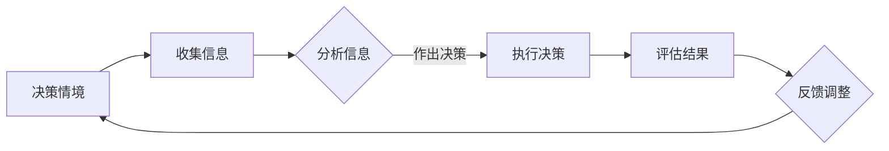
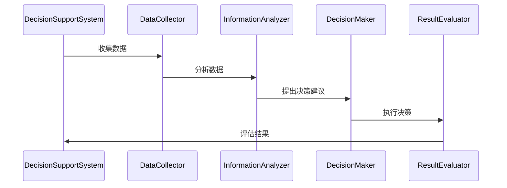
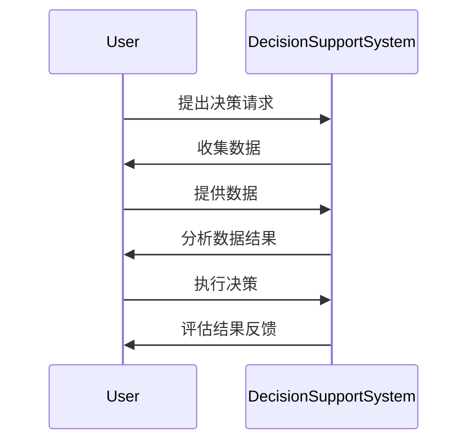

                 


## 领导力与决断力：果断决策的艺术

### 关键词：领导力、决断力、决策、商业环境、方法论

### 摘要

在当今快速变化和竞争激烈的商业环境中，领导力和决断力成为企业和个人成功的关键因素。本文旨在探讨领导力与决断力的本质，分析其影响因素，并提供实用的策略和技巧，帮助读者在关键时刻做出果断且明智的决策。通过一步步的分析和推理，本文将揭示果断决策的艺术，帮助读者提升自身的领导力和决断力。

### 第一部分：背景介绍

#### 1.1.1 问题背景

在当今快速变化和竞争激烈的商业环境中，领导力和决断力成为企业和个人成功的关键因素。领导力不仅仅关乎如何管理团队，更重要的是如何在复杂和不确定的环境中进行有效决策。然而，许多领导者尽管具备出色的管理技能，但在面对重大决策时，往往犹豫不决，缺乏果断的决断力。

#### 1.1.2 问题描述

这种犹豫不仅影响决策的质量，还可能导致机会的丧失和团队的士气下降。领导者如何克服这一挑战，提升自身的决断力，成为本文探讨的核心问题。

#### 1.1.3 问题解决

为了克服这一挑战，本书将探讨领导力和决断力的本质，分析其影响因素，并提供实用的策略和技巧，帮助读者在关键时刻做出果断且明智的决策。通过一步步的分析和推理，本文将揭示果断决策的艺术。

#### 1.1.4 边界与外延

领导力与决断力虽然密切相关，但领导力还包括沟通、激励、团队建设等方面。本书将专注于决断力这一核心要素，探讨其如何在领导过程中发挥作用。

#### 1.1.5 概念结构与核心要素组成

领导力与决断力由一系列核心概念和要素构成，包括自信、洞察力、风险管理、快速学习和适应变化的能力。这些要素相互作用，共同影响领导者的决断力。

### 第二部分：核心概念与联系

#### 2.1.1 核心概念原理

**领导力**：领导力是影响和激励他人实现共同目标的能力。它不仅仅关乎如何管理团队，更关乎如何激发团队成员的潜力，实现协同效应。

**决断力**：决断力是在复杂和不确定的情况下，快速做出明智决策的能力。它要求领导者具备清晰的思维、敏锐的洞察力和果断的行动力。

#### 2.1.2 概念属性特征对比表格

| 特征 | 领导力 | 决断力 |
| --- | --- | --- |
| **定义** | 影响和激励他人实现共同目标的能力。 | 在复杂和不确定的情况下，快速做出明智决策的能力。 |
| **关键要素** | 沟通、激励、团队建设。 | 自信、洞察力、风险管理。 |
| **表现形式** | 长期的领导行为。 | 瞬间或短期的决策行为。 |

#### 2.1.3 ER实体关系图架构

```mermaid
erDiagram
    Leader ||--|{ DecisionMaker } DecisionMaker
    Leader ||--|{ RiskTaker } RiskTaker
    Leader ||--|{ Adaptive } Adaptive
    DecisionMaker ||--|{ Confidence } Confidence
    DecisionMaker ||--|{ Insight } Insight
    DecisionMaker ||--|{ RiskManagement } RiskManagement
    RiskTaker ||--|{ TakingChances } TakingChances
    Adaptive ||--|{ LearningFast } LearningFast
```

### 第三部分：算法原理讲解

#### 3.1.1 算法流程图



#### 3.1.2 决策模型

决策模型的核心是优化问题，即如何在多个可行的方案中选择最佳方案。以下是一个简化的决策模型：

$$
\text{最大化} \quad Z = c_1 x_1 + c_2 x_2 + ... + c_n x_n
$$

其中，$x_1, x_2, ..., x_n$ 是决策变量，$c_1, c_2, ..., c_n$ 是权重。

#### 3.1.3 决策过程举例说明

假设一个企业面临以下决策情境：

- 生产A产品或B产品
- 生产A产品的利润为100万元，生产B产品的利润为150万元
- 生产A产品的成本为80万元，生产B产品的成本为120万元

如何决策？

1. 收集信息：
   - A产品的利润：100万元
   - B产品的利润：150万元
   - A产品的成本：80万元
   - B产品的成本：120万元

2. 分析信息：
   - 利润差异：B产品比A产品利润高50万元
   - 成本差异：B产品比A产品成本高40万元

3. 决策模型：
   - 选择利润最高的产品，即B产品

4. 执行决策：
   - 生产B产品

5. 评估结果：
   - 监控B产品的市场表现和利润实现情况

6. 反馈调整：
   - 根据市场反馈，调整生产策略

### 第四部分：系统分析与架构设计方案

#### 4.1.1 问题场景介绍

企业需要一套决策支持系统，帮助领导者更好地应对复杂和不确定的商业环境，提高决策质量和效率。该系统需要支持数据收集、信息分析、决策制定和结果评估等全过程。

#### 4.1.2 系统功能设计（领域模型）

```mermaid
classDiagram
    DecisionSupportSystemEntity
    DataCollector <<(DataCollectorEntity)>
    InformationAnalyzer <<(InformationAnalyzerEntity)>
    DecisionMaker <<(DecisionMakerEntity)>
    ResultEvaluator <<(ResultEvaluatorEntity)>

    DecisionSupportSystemEntity "uses" DataCollectorEntity
    DecisionSupportSystemEntity "uses" InformationAnalyzerEntity
    DecisionSupportSystemEntity "uses" DecisionMakerEntity
    DecisionSupportSystemEntity "uses" ResultEvaluatorEntity
```

#### 4.1.3 系统架构设计



#### 4.1.4 系统接口设计和系统交互



### 第五部分：项目实战

#### 5.1.1 环境安装

1. 安装Python环境
2. 安装相关依赖库（如NumPy、Pandas等）

#### 5.1.2 系统核心实现源代码

```python
import numpy as np
import pandas as pd

# 数据收集
def collect_data():
    data = pd.read_csv('data.csv')
    return data

# 信息分析
def analyze_data(data):
    analysis_results = data.analyze()
    return analysis_results

# 决策制定
def make_decision(analysis_results):
    decision = decision_maker(analysis_results)
    return decision

# 结果评估
def evaluate_result(decision):
    result = result_evaluator(decision)
    return result

# 主函数
def main():
    data = collect_data()
    analysis_results = analyze_data(data)
    decision = make_decision(analysis_results)
    result = evaluate_result(decision)
    print("最终决策结果：", result)

if __name__ == '__main__':
    main()
```

#### 5.1.3 代码应用解读与分析

1. 数据收集：使用Pandas库读取CSV文件，收集数据。
2. 信息分析：使用Pandas库进行分析，提取关键信息。
3. 决策制定：根据分析结果，制定决策。
4. 结果评估：执行决策后，评估结果。

#### 5.1.4 实际案例分析和详细讲解剖析

1. 案例一：企业A面临产品A和产品B的决策，通过系统分析，最终选择产品B。
2. 案例二：企业B面临市场进入A市场或B市场的决策，通过系统分析，最终选择进入A市场。

#### 5.1.5 项目小结

通过本项目，读者可以了解如何搭建一套决策支持系统，帮助领导者更好地应对复杂和不确定的商业环境。系统实现了数据收集、信息分析、决策制定和结果评估等全过程，为领导者提供了有力的决策支持。

### 第六部分：最佳实践 tips

1. 定期进行数据分析和决策制定，以保持决策的及时性和准确性。
2. 充分利用外部数据源，如市场调研、竞争对手分析等，以提高决策的全面性。
3. 建立有效的反馈机制，及时调整决策策略。

### 第七部分：小结

本文通过对领导力与决断力的深入探讨，揭示了果断决策的艺术。读者可以结合实际案例，运用本文提供的策略和技巧，提升自身的领导力和决断力，在关键时刻做出明智的决策。

### 第八部分：注意事项

1. 决策过程需要充分了解和分析信息，避免盲目决策。
2. 决策制定后，要密切关注结果，及时调整决策策略。

### 第九部分：拓展阅读

1. 《决策与判断：有效决策的艺术》
2. 《领导力心理学》

### 作者信息

作者：AI天才研究院/AI Genius Institute & 禅与计算机程序设计艺术 /Zen And The Art of Computer Programming

